# 第十二章：理解与扩展 Alertmanager

警报是任何监控堆栈中的关键组件。在 Prometheus 生态系统中，警报及其后续通知是解耦的。Alertmanager 是处理这些警报的组件。在本章中，我们将专注于使用 Alertmanager 将警报转换为有用的通知。从可靠性到自定义，我们将深入探讨 Alertmanager 服务的内部工作原理，提供所需的知识，以配置、排除故障并自定义所有可用选项。我们将确保警报路由、静默和抑制等概念清晰，以便你能够决定如何在自己的堆栈中实现它们。

由于 Alertmanager 是一个关键组件，我们还将探讨高可用性，并解释 Prometheus 与 Alertmanager 之间的关系。我们将自定义通知，并学习如何构建和使用可重用的模板，以确保通知在到达目的地时是适当的，并且传递准确的信息。本章的最后，我们将学习如何监控监控系统，更重要的是，学习当系统部分或完全宕机时如何收到警报。

在本章中，我们将探讨以下主题：

+   本章的测试环境。

+   Alertmanager 基础知识。

+   Alertmanager 配置。

+   常见的 Alertmanager 通知集成。

+   自定义你的警报通知。

+   谁来监视“监视者”？

# 设置测试环境

为了使用 Alertmanager，我们将新增三个实例来模拟一个高可用的设置。这种方法不仅能让我们暴露所需的配置，还能验证一切如何协同工作。

我们将使用的设置类似于以下图示：

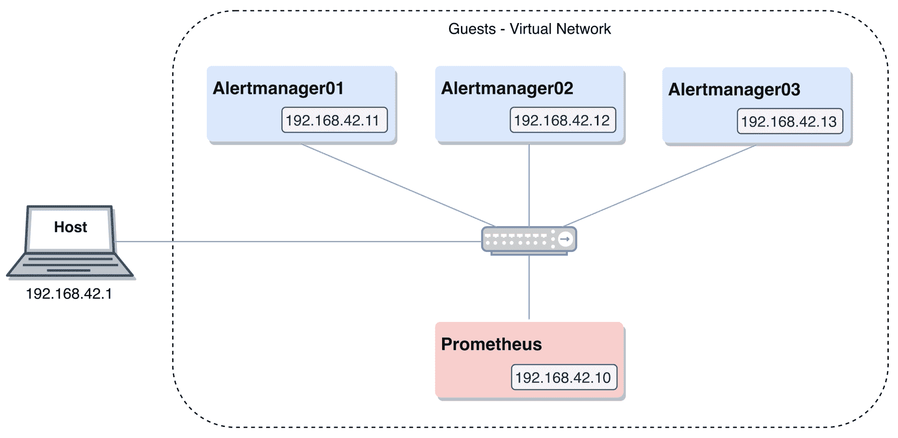

图 11.1：测试环境

# 部署

让我们从部署 Alertmanager 测试环境开始：

1.  要启动一个新的测试环境，请进入本章相对于仓库根目录的路径：

```
cd ./chapter11/
```

1.  确保没有其他测试环境在运行，然后启动本章的环境：

```
vagrant global-status
vagrant up
```

1.  你可以通过以下命令验证测试环境的成功部署：

```
vagrant status
```

你将收到以下输出：

```
Current machine states:

prometheus running (virtualbox)
alertmanager01 running (virtualbox)
alertmanager02 running (virtualbox)
alertmanager03 running (virtualbox)

This environment represents multiple VMs. The VMs are all listed
above with their current state. For more information about a specific
VM, run `vagrant status NAME`.
```

当部署任务完成后，你将能够使用你喜欢的支持 JavaScript 的网页浏览器，在主机上验证以下端点：

| **服务** | **端点** |
| --- | --- |
| Prometheus | `http://192.168.42.10:9090` |
| Alertmanager01 | `http://192.168.42.11:9093` |
| Alertmanager02 | `http://192.168.42.12:9093` |
| Alertmanager03 | `http://192.168.42.13:9093` |

你应该能够通过以下命令之一访问所需的实例：

| **实例** | **命令** |
| --- | --- |
| Prometheus | `vagrant ssh prometheus` |
| Alertmanager01 | `vagrant ssh alertmanager01` |
| Alertmanager02 | `vagrant ssh alertmanager02` |
| Alertmanager03 | `vagrant ssh alertmanager03` |

# 清理

测试完成后，只需确保你位于 `./chapter11/` 目录下，并执行以下命令：

```
vagrant destroy -f
```

不用太担心——如果需要，你可以轻松地再次启动环境。

# Alertmanager 基础知识

我们在第九章中讲解了 Prometheus 中告警规则的工作原理，*定义告警和记录规则*，但仅仅这些规则本身并不十分有用。如我们之前提到的，Prometheus 通过 Webhook 风格的 HTTP 接口将通知处理和路由委托给外部系统。这就是 Alertmanager 的作用所在。

Alertmanager 负责接收由 Prometheus 告警规则生成的告警，并将它们转换为通知。后者可以采取任何形式，例如电子邮件、聊天消息、页面通知，甚至是 Webhook，这些 Webhook 会触发自定义操作，如将告警记录到数据存储中或创建/更新工单。Alertmanager 还是官方栈中唯一一个将其状态分发到多个实例的组件，这样它就能跟踪哪些告警已发送，哪些被静默。

# 通知管道

以下图表受到 Alertmanager 架构图的启发，提供了一个概述，展示了告警经过的各个步骤，直到它成功地作为通知发送出去：

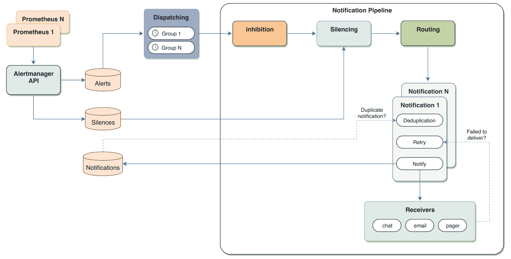

图 11.2：通知管道概览

前面的图表包含了很多内容，因此我们将在接下来的几节中逐一讲解这些步骤。了解告警管道的工作原理将帮助你理解各种配置选项，如何排查丢失的告警，并全面利用 Alertmanager 提供的所有功能。

# 将告警组派发到通知管道

每当一个告警规则被触发时，Prometheus 会以 JSON 负载的形式将告警发送到 Alertmanager API，并且它会在该规则的每个评估间隔或每分钟（通过 `--rules.alert.resend-delay` 标志可配置）内继续发送更新，以较长者为准。当告警被 Alertmanager 接收时，它们会经过调度步骤，在此步骤中，告警会根据一个或多个告警标签进行分组，例如 `alertname`。我们将在本章后面的*Alertmanager 配置*部分进一步讨论。这样做可以将告警分类，从而减少多个告警合并为一个通知发送的次数，这些合并后的告警会触发通知管道：

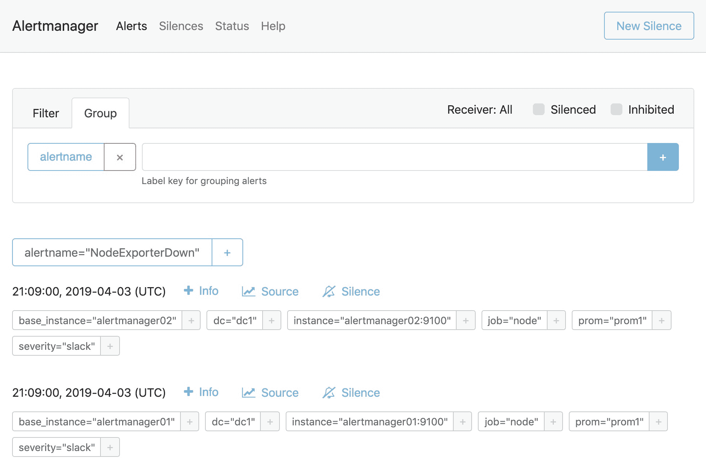

图 11.3：Alertmanager 界面通过 alertname 分组告警

当运行多个具有相同配置的 Prometheus 实例时（追求高可用性/冗余性时的常见设置），相同条件的警报规则不一定会在完全相同的时间触发。Alertmanager 通过具有可配置时间间隔来解决这种情况。它会等待其他任何操作，以便将相似的警报分组在一起，从而避免为单一类型的问题发送多个通知。

这种分组是在用户指定的所有标准并行进行的。然后，每个组将触发通知管道，接下来我们将详细介绍它。

# 抑制

一个很好的例子可以帮助我们理解什么是警报抑制，就像想象一个服务器机架，如果顶部交换机失效会发生什么。在这种情况下，该机架中的所有服务器和服务都将开始触发警报，因为它们突然无法访问。为了避免这个问题，我们可以使用顶部交换机的警报，如果触发了，将阻止该机架中所有其他警报的通知发送出去。这有助于操作员更专注于真正的问题，避免洪水般的无法采取行动的警报。

简言之，抑制允许您映射警报之间的依赖关系，因此阻止依赖警报的通知继续在通知管道中传递。这是在 Alertmanager 配置文件中设置的，这意味着如果更改，则需要重新加载服务。

如果在抑制阶段未匹配警报，则会进入静音步骤。

# 静音

在监控/警报系统中，静音是一个常见概念；它可以在有时间限制的情况下避免警报通知的发送。通常用于在维护窗口期间禁用通知，或在事故期间临时抑制较低重要性的警报。Alertmanager 通过利用警报通常具有一个或多个不同标签的事实来加强这一概念：来自原始警报规则表达式、警报名称、警报的标签字段、`alert_relabel_configs`，以及 Prometheus `external_labels`。这意味着可以使用这些标签中的任何一个（或它们的组合），通过直接匹配或正则表达式匹配来临时禁用通知：

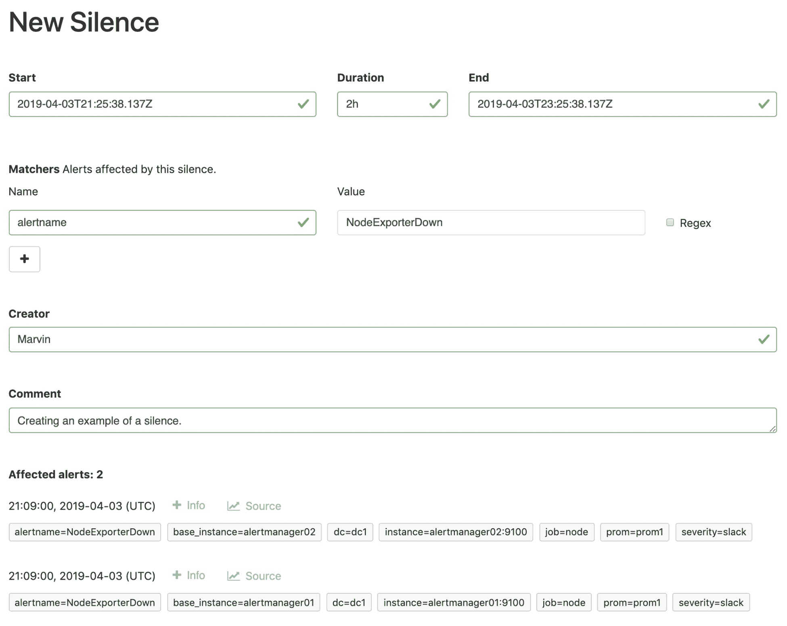

图 11.4：创建匹配 alertname=NodeExporterDown 的静音

在使用正则表达式匹配时要小心，因为可能会意外地静音超出预期的内容。Alertmanager Web UI 可以帮助预防此类问题，因为在创建新的静音时，它会显示将被抑制的触发警报的预览。

静默是在运行时定义的。可以通过 Alertmanager Web 界面、`amtool`（稍后将介绍的 Alertmanager 命令行界面）或直接通过 API 设置静默。可以在警报触发时设置静默，比如在事故处理中，或者提前设置以避免计划中的维护干扰值班人员。它不应成为一个永久的解决方案，仅是一个临时措施；因此，创建静默时需要设置到期日期，并且 Web UI 仅识别最长为“天”的持续时间。

由于静默步骤位于抑制之后，如果您对触发抑制规则的警报进行静默，它将继续抑制其他警报。

如果警报未与任何静默匹配，它将进入通知管道的下一步骤，即路由阶段。

# 路由

当警报批次到达此阶段时，Alertmanager 需要决定将其发送到哪里。由于最常见的使用场景是不同的人对不同的警报感兴趣、对不同严重性的警报使用不同的通知方式，或者这两者的组合，因此此步骤通过路由树实现了这一点。它由多个路由（如果有的话）组成，每个路由指定了一个或多个标签的匹配条件和接收器，以及一个根节点，根节点定义了一个“捕获所有”接收器，以防没有子路由与传递的警报组匹配。子路由可以有自己的路由，从而形成多层树结构。匹配按声明路由的顺序进行，当一个路由匹配时，会进入已定义的子路由，而最深的匹配将决定使用哪个接收器。我们在实际应用中使用 Alertmanager 配置时，这一点会更加清晰。

接收器和通知器的工作方式类似于通讯录联系人。接收器是命名的联系人，可以有一个或多个通知器，通知器类似于联系信息。Alertmanager 支持许多不同的通知器，通常属于以下类别之一：电子邮件、聊天（Slack、微信、HipChat）和页面（PagerDuty、Opsgenie、VictorOps、Pushover）。此外，它还支持 Webhook 通知器，这是一个通用的集成点，可用于支持所有未内置于 Alertmanager 的其他通知系统。

在此路由阶段将警报批次与接收器连接后，Alertmanager 会为该接收器中指定的每个通知器运行通知任务。这个任务负责去重、发送和重试通知。对于去重，它首先检查通知日志（稍后将在本章中讨论），确保该通知尚未发送；如果已经存在，则不执行任何操作。接下来，它会尝试发送通知，如果成功，通知将被记录在通知日志中。如果通知发送失败（例如 API 错误、连接超时等），该任务会再次尝试。

现在我们已经了解了通知管道的基本知识，接下来我们来看看当有多个 Alertmanager 实例时，会发生什么情况，以及如何在它们之间共享警报状态。

# Alertmanager 集群

通知管道的概述没有涉及 Alertmanager 的高可用性组件。高可用性是通过依赖 gossip（基于 HashiCorp 的 memberlist，[`github.com/hashicorp/memberlist`](https://github.com/hashicorp/memberlist)）来实现的，而不是使用基于共识的协议；这意味着选择集群中实例的奇数数量没有实际意义。通过 gossip，集群在所有 Alertmanager 实例之间共享**通知日志**（**nflog**），从而让每个实例都能了解到集群在通知方面的整体状态。如果发生网络分区，通知将会从每个分区的一方发送，因为从逻辑上讲，接收更多通知总比完全无法通知要好。

如我们所知，抑制是在配置文件级别设置的，因此它应该在所有 Alertmanager 实例中保持一致。然而，静默也需要在集群中进行 gossip，因为它们是在单个 Alertmanager 实例的运行时设置的。这是验证集群是否按预期工作的一个好方法——确认配置的静默是否在所有实例中都能显示。

Alertmanager `/#/status` 页面显示了 gossip 集群的状态，以及已知的对等节点。你可以在我们的测试环境中查看这个端点，例如打开 `http://192.168.42.11:9093/#/status`：

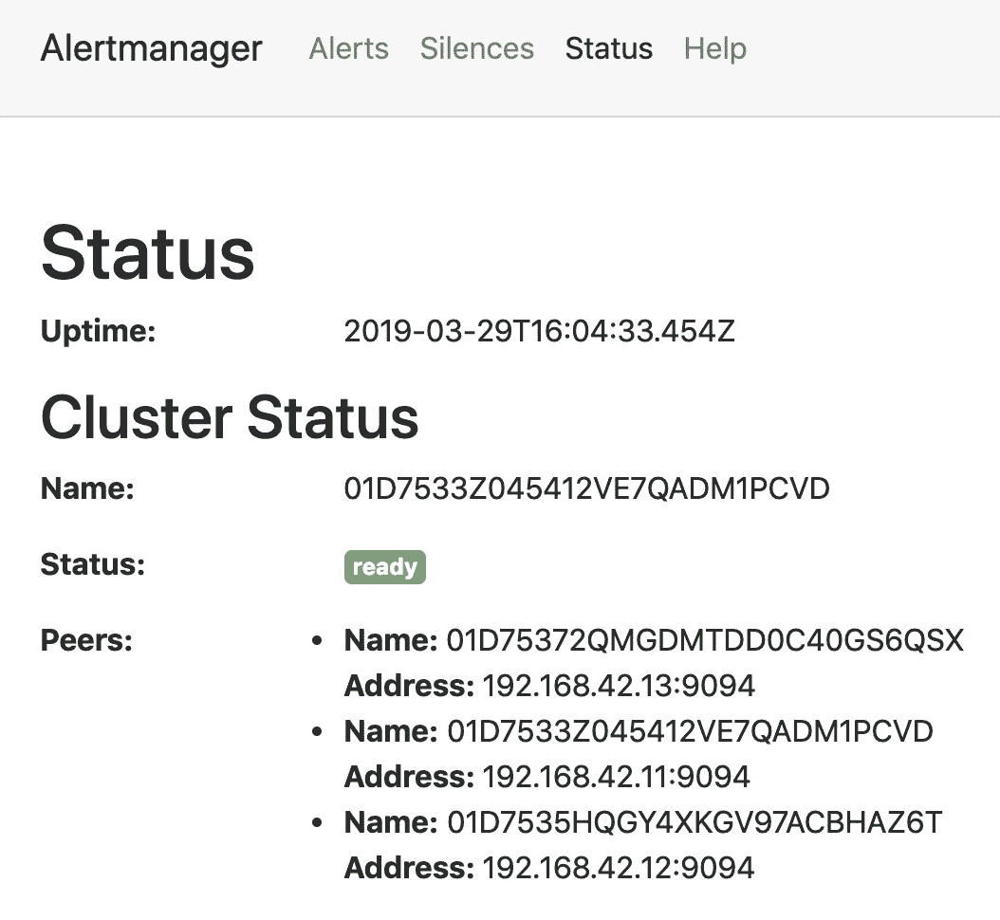

图 11.5：Alertmanager 集群状态

在 Alertmanager 中，集群工作方式如下：每个 Prometheus 实例将告警发送到它们所知道的所有 Alertmanager 实例。这些实例假设它们都在同一个 HA 集群中，会自己排序，并且排在第一位的实例将处理告警通知。该实例通过传播协议分发通知日志，通知日志会列出已成功发送的通知。其余的 Alertmanager 实例将根据它们在排序中的位置，增加等待通知日志更新的延迟。通知日志中的告警不会被这些实例重新发送——如果通知日志没有说明某个通知在传播延迟结束时已被处理，那么第二个 Alertmanager 实例将处理它，以此类推：

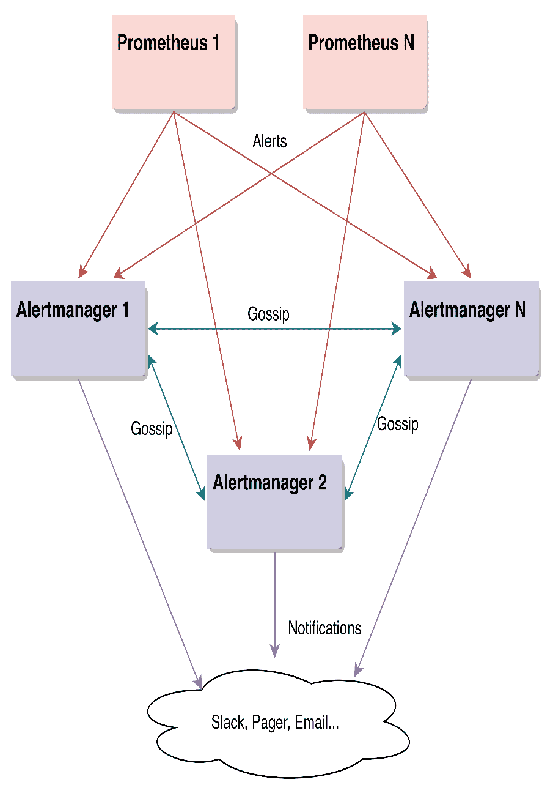

图 11.6：Alertmanager 集群概览

Prometheus 实例直接与所有 Alertmanager 实例通信，因为集群成员将负责彼此之间的去重。这意味着不应在 Prometheus 和 Alertmanager 之间放置负载均衡器。

Alertmanager 集群假设每个实例都使用相同的配置文件运行。然而，如果没有做到这一点，只会影响其去重通知的能力。

# Alertmanager 配置

在第九章，*定义告警和记录规则*中，我们讨论了 Prometheus 如何生成并推送告警。在已经明确区分告警和通知之后，现在是时候使用 Alertmanager 来处理 Prometheus 发送的告警并将其转化为通知了。

接下来，我们将介绍在 Prometheus 中所需的配置，以及在 Alertmanager 中可用的配置选项，以便我们能够从监控栈中发送通知。

# Prometheus 配置

在 Prometheus 中需要做几个配置，以便我们能够开始使用 Alertmanager。首先需要配置外部标签，这些标签会在与外部系统（包括但不限于 Alertmanager）通信时，添加到时间序列数据中（如果数据中没有这些标签）。这些标签用于唯一标识指标的来源，比如 `region`、`datacenter` 或 `environment` 等。一般来说，如果你有将相同的标签名/值添加到每个抓取和记录规则中的冲动，那么该标签更适合做为外部标签，因为它不会在本地的 Prometheus 实例中引入新的维度，但在更高级的系统（例如联合或长期指标存储）中可能会非常有用，正如我们将在接下来的章节中看到的那样。正如我们将在以下示例中看到的，外部标签是在 Prometheus 主配置文件的顶级 `global` 键内进行配置的。

第二步是配置 Prometheus，使其能够将警报发送到 Alertmanager。正如我们之前在*Alertmanager 集群*一节中讨论的那样，Prometheus 实例是必需的，以便你可以了解并将警报分别发送到所有 Alertmanager 集群成员。这个配置在 Prometheus 配置文件中，位于一个名为 `alerting` 的顶级部分中。这个配置的示例可以在我们的测试环境中找到，具体如下：

```
vagrant@prometheus:~$ cat /etc/prometheus/prometheus.yml
global:
 external_labels:
 dc: dc1
alerting:
 alertmanagers:
 - static_configs:
 - targets:
 - alertmanager01:9093
 - alertmanager02:9093
 - alertmanager03:9093
...
```

在 `alerting` 部分，我们还可以使用 `alert_relabel_configs`，它的配置语法与 `relabel_configs` 和 `metric_relabel_configs` 相同，正如在第五章《运行 Prometheus 服务器》中所解释的那样，但在这种情况下，它仅适用于传出的警报。使用重标记在这里是有用的，可以防止某些警报完全到达 Alertmanager，修改或丢弃标签以便于分组，甚至可以添加某些警报特有的标签，这些标签在 `external_labels` 中可能没有意义。由于 `alert_relabel_configs` 在我们发送警报之前运行，因此外部标签会出现在这些警报中，并因此可以进行操作。以下是一个示例，防止具有名为 `environment` 且匹配值为 `development` 的标签的警报被推送到 Alertmanager：

```
  alert_relabel_configs:
  - source_labels: [environment]
    regex: development
    action: drop
```

虽然前面的示例说明了如何丢弃警报，但不应将其作为永久解决方案，因为更好的解决方案可能是根本不创建这些警报。

接下来，我们将介绍 Alertmanager 配置文件及其主要部分，并指出一些有用的信息，帮助你入门。

# 配置文件概述

Alertmanager 通过一个单一的配置文件进行配置，并且可以像 Prometheus 一样在运行时重新加载，而无需重启：可以通过向进程发送 `SIGHUP` 或发送 HTTP POST 请求到 `/-/reload` 端点来实现。与 Prometheus 一样，格式错误的配置将不会被应用——系统会记录错误信息，并且在其 `/metrics` 端点中找到的 `alertmanager_config_last_reload_successful` 指标将被设置为 `0`。

配置文件分为五个顶级部分：`global`、`route`、`inhibit_rules`、`receivers` 和 `templates`。在接下来的章节中，我们将逐一探讨每个部分。

# global

全局部分收集了在文件的其他部分有效的所有配置选项，并作为这些选项的默认设置。由于这些参数可以在其他部分被覆盖，使用它们是保持配置文件尽可能简洁、避免重复的好方法。在这一部分的所有可用参数中，大多数与凭证和令牌作为通知器相关。这里有一个值得注意的参数，叫做`resolve_timeout`。当 Prometheus 触发警报规则时，它将在每个评估间隔发送产生的警报，并更新 JSON 负载中的`EndTime`字段。当这些警报被解决时，Alertmanager 会通过更新`EndTime`来通知这些解决。如果由于某些原因，警报停止定期更新（例如，发送该警报的 Prometheus 实例崩溃并且仍在恢复过程中），Alertmanager 将使用最后接收到的`EndTime`来解决该警报。`resolve_timeout`配置用于解决由非 Prometheus 系统创建的警报，这些系统不使用`EndTime`。需要明确的是，这是一个你不应该修改的设置，因为它与 Prometheus-Alertmanager 警报协议相关；在此解释只是为了完整性。

作为示例，我们测试环境中 Alertmanager 配置的全局部分如下所示：

```
global:
  smtp_smarthost: 'mail.example.com:25'
  smtp_from: 'example@example.com'
...
```

这个示例配置为每个使用电子邮件（SMTP）通知器的接收器设置默认的电子邮件`smarthost`和`from`地址。

# 路由

这无疑是 Alertmanager 最重要的配置部分。在这一部分，我们将定义如何根据标签（`group_by`）对警报进行分组，等待多长时间才能发送更多通知（`group_interval`），以及如何重复它们（`repeat_interval`），但最重要的是，为每个警报批次触发哪些接收器（`receiver`）。由于每个路由都可以有自己的子路由，这就形成了一棵路由树。顶级路由不能有任何匹配规则，因为它像一个兜底规则，处理所有不匹配任何子路由的警报。除了`continue`，路由上的每个设置都会以级联方式传递给其子路由。尽管默认行为是在找到最具体的匹配项时停止搜索接收器，但可以将`continue`设置为`true`，使匹配过程继续，从而允许触发多个接收器。

你可以在我们的测试环境中找到以下示例路由配置：

```
route:
  receiver: operations
  group_by: ['alertname', 'job']
  group_wait: 30s
  group_interval: 5m
  repeat_interval: 4h

  routes:
  - match_re:
      job: (checkoutService|paymentService)
    receiver: yellow-squad-email
    routes:
    - match:
        severity: pager
      receiver: yellow-squad-pager
...
```

上述示例中的主路由执行以下操作：

+   定义`operations`接收器为默认路由，当没有其他子路由匹配时使用

+   根据`alertname`和`job`对传入的警报进行分组

+   在发送第一次通知之前，等待 30 秒钟以便更多警报到达，从而减少相同问题的通知次数

+   在将新警报添加到批次后，等待五分钟再发送额外的通知

+   每四小时重新发送一次包含当前触发告警的告警批次的通知

此外，还为 `job` 标签匹配 `checkoutService` 或 `paymentService` 的告警设置了一个子路由，指定其接收者为 `yellow-squad-email`。该子路由反过来定义了一个自己的子路由，如果严重性标签匹配 `pager`，则应使用 `yellow-squad-pager receiver`。

官方 Prometheus 网站提供了一个路由树编辑器和可视化工具，链接：[`prometheus.io/webtools/alerting/routing-tree-editor/`](https://prometheus.io/webtools/alerting/routing-tree-editor/)。

`group_by` 子句也可以采用唯一值 `...`，这将指示 Alertmanager 不对传入的告警进行任何分组。这种情况很少使用，因为分组的目的是减少通知的数量，从而提高信噪比。此功能的一个可能用途是将每个告警原样发送到另一个系统，供该系统处理。

# inhibit_rules

在本节中，我们将添加规则来抑制告警。其工作原理是通过在源和目标告警上使用匹配器来匹配源告警并静音目标告警。唯一的要求是目标和源的标签在标签名称和值上都要匹配，例如：

```
inhibit_rules:
  - source_match:
      job: 'icmp'
    target_match_re:
      alertname: (AlertmanagerDown|NodeExporterDown)
    equal: ['base_instance']
```

在这个示例中，我们可以读取到以下内容：如果有一个 `job` 标签设置为 `icmp` 的告警，且在所有匹配的告警中，`base_instance` 相同，则会静音所有 `alertname` 匹配 `AlertmanagerDown` 或 `NodeExporterDown` 的告警。换句话说，如果运行 Alertmanager 和 Node Exporter 的实例宕机，则跳过关于这些服务的告警，只发送关于实例本身的告警，让运维人员专注于真正的问题。

如果等式子句中的任何标签在源和目标告警中都不存在，则视为匹配，从而启用抑制。

如果一个告警同时匹配抑制规则定义中的源和目标，该告警将不会被抑制——这是为了防止告警抑制自身。

我们可以在以下截图中看到，当发生此情况时，Alertmanager 的界面：

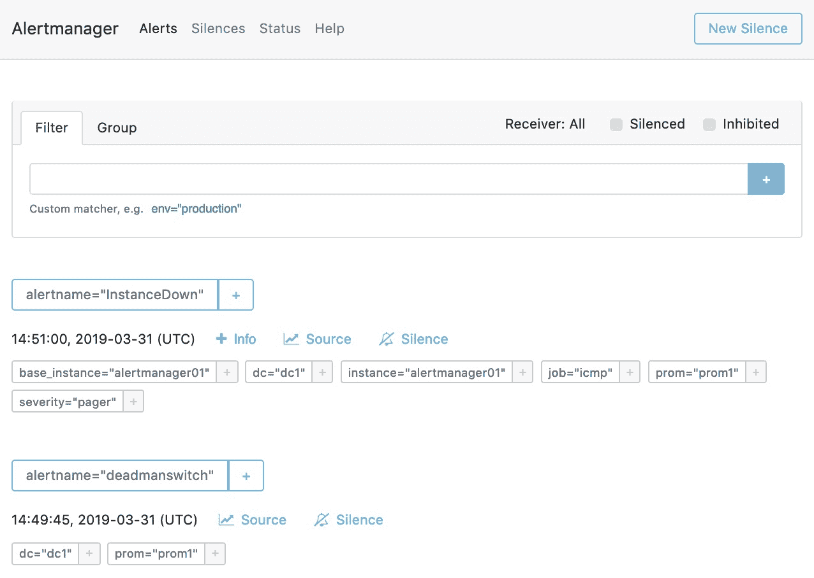

图 11.7：Alertmanager 界面，仅显示触发的通知

在下面的截图中，我们可以通过选择右上角的**抑制**选项，看到所有未出现在前一张截图中的被抑制告警：

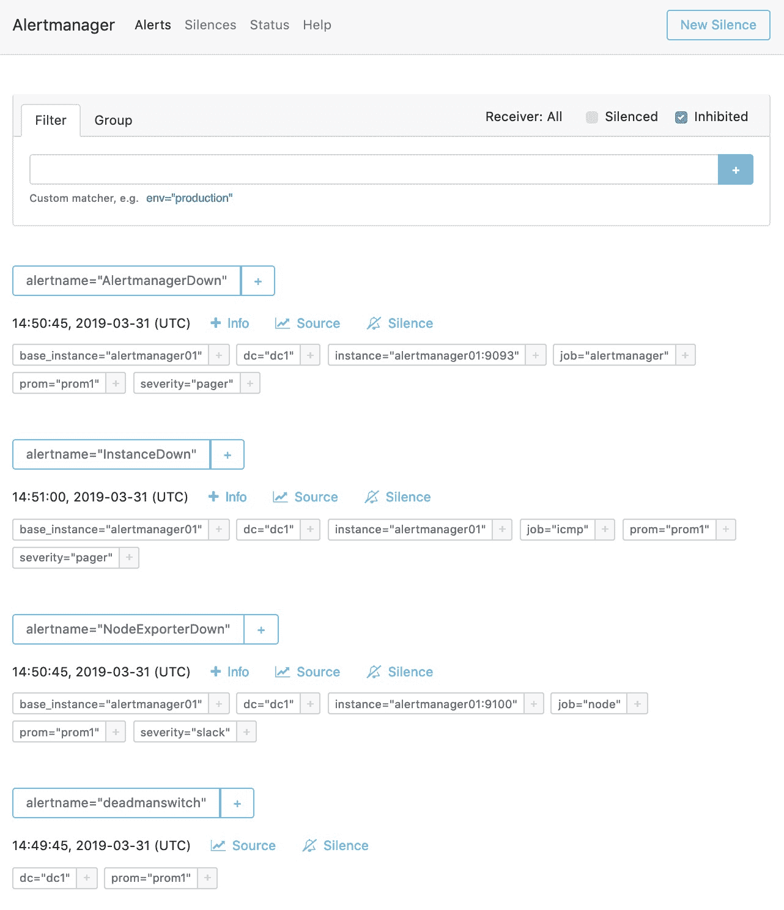

图 11.8：Alertmanager 界面，显示包括被抑制告警在内的通知

Alertmanager 界面让你可以俯瞰所有警报，不仅是那些处于激活状态的警报，还有被抑制的警报。默认情况下不会显示被抑制的警报，以减少视觉杂乱；但是，正如我们在前面的截图中所看到的，你可以通过选择**抑制**复选框来轻松启用显示这些警报，位于**筛选器**/**分组**框的右上角。

# receiver

当路由被匹配时，它将调用一个接收器。接收器包含通知器，我们将在后续章节中更深入地探讨这一点。基本上，接收器是可用集成的命名配置。

在我们的测试环境中，我们可以找到一个使用 Webhook 通知器的接收器示例，具体如下：

```
route:
  receiver: operations
...
receivers:
- name: 'operations'
  webhook_configs:
  - url: 'http://127.0.0.1:5001'
...
```

顶级路由，也称为捕获所有或回退路由，将在其他子路由没有匹配到来警报时触发名为`operations`的接收器。`operations`接收器是使用单一通知器配置的，该通知器是 Webhook 通知器。这意味着发送到此接收器的警报会被发送到`url`配置键中指定的 URL。Webhook 通知器将在本章稍后进一步分析。

# templates

本节是定义指向可用通知器的多个自定义通知模板的路径列表的地方。与 Prometheus 中的其他文件路径配置类似，每个路径定义允许在最后一个组件上使用 glob 模式，并可以如下定义：

```
templates:
  - /etc/alertmanager/templates/*.tmpl
```

我们将在*自定义警报通知*部分使用这一部分来定义我们的自定义模板。

# amtool 命令行工具

类似于`promtool`，`amtool`是一个易于使用的命令行工具，由 Alertmanager HTTP API 提供支持。除了用于验证 Alertmanager 配置文件的正确性外，它还允许你查询服务器中当前触发的警报，并执行诸如静默警报或创建新警报等操作。`amtool`的子命令分为四组——`alert`，`silence`，`check-config`和`config`——我们将使用测试环境对每一组进行概述。

为了跟随本节中的示例，确保你连接到其中一个 Alertmanager 实例。由于它们是集群化的，任何一个实例都可以，举例如下：

```
vagrant ssh alertmanager02
```

登录后，你可以作为默认用户运行`amtool`，因为与 Alertmanager API 交互不需要管理员权限。此外，你甚至可以使用`amtool`连接到任何 Alertmanager 实例，而不仅仅是本地实例，因为与 HTTP API 交互的大多数命令要求你指定实例的 URL。

# alert

这个子命令允许你查询 Alertmanager 集群中当前触发的警报，可以通过如下方式实现：

```
vagrant@alertmanager02:~$ amtool alert --alertmanager.url http://alertmanager02:9093
Alertname Starts At Summary 
deadmanswitch 2019-03-31 14:49:45 UTC 
InstanceDown 2019-03-31 15:48:30 UTC
```

`alert`子命令的默认操作是`query`。与之前的示例等效的命令是`amtool alert query --alertmanager.url http://alertmanager02:9093`。

此子命令的另一个功能是按需创建警报。这对于测试目的非常有用。例如，让我们创建一个名为 `ExampleAlert` 的新警报，标签为 `example="amtool"`：

```
vagrant@alertmanager02:~$ amtool alert add alertname="ExampleAlert" example="amtool" --alertmanager.url http://alertmanager02:9093
```

`add` 操作期望每个命令参数都有一个标签名称/值对，正如我们在前面的代码中所看到的那样。此操作还会考虑第一个参数，因为警报名称没有标签名称。如果我们省略 `alertname` 标签，警报也可以创建，但这可能会在 `amtool` 和 Alertmanager Web UI 中引发一些奇怪的行为，因此对此需要保持谨慎。

我们可以稍等一会儿（在测试环境中，`group_wait` 定义为 30 秒），然后重新查询当前的警报，来检查它是否已正确添加：

```
vagrant@alertmanager02:~$ amtool alert --alertmanager.url http://alertmanager02:9093
Alertname Starts At Summary 
deadmanswitch 2019-03-31 14:49:45 UTC 
InstanceDown 2019-03-31 15:48:30 UTC 
ExampleAlert 2019-03-31 15:55:00 UTC 
```

此操作还允许你指定其他警报字段，例如结束时间、生成器 URL 和注解。你可以通过使用 `help` 标志来查看 `add` 操作的命令行界面（参数和选项）：

```
vagrant@alertmanager01:~$ amtool alert add --help
```

请记住，这个新创建的警报将在五分钟的非活动后被认为已解决（`resolve_timeout` 的默认值），因此，如果你需要更多时间进行测试，请确保通过运行 `add` 操作添加此警报的新实例，以保持警报继续存在。

接下来，我们将使用这个新警报作为静默的目标。

# silence

使用此子命令，我们可以管理静默。首先，我们可以尝试使用以下指令查询集群中可用的静默：

```
vagrant@alertmanager02:~$ amtool silence --alertmanager.url http://alertmanager02:9093
ID Matchers Ends At Created By Comment
```

`silence` 子命令的默认操作是 `query`。与前面示例等效的命令是 `amtool silence query --alertmanager.url http://alertmanager02:9093`。

如我们所见，目前没有任何静默被执行。让我们通过匹配其标签 `example="amtool"` 来为之前生成的警报创建一个新的静默，并再次检查静默：

```
vagrant@alertmanager02:~$ amtool silence add 'example="amtool"' --comment "ups" --alertmanager.url http://alertmanager02:9093
1afa55af-306a-408e-b85c-95b1af0d7169

vagrant@alertmanager02:~$ amtool silence --alertmanager.url http://alertmanager02:9093
ID Matchers Ends At Created By Comment 
1afa55af-306a-408e-b85c-95b1af0d7169 example=amtool 2019-03-31 16:58:08 UTC vagrant ups
```

我们现在可以看到新静默已被添加。为了验证它是否已生效，我们可以使用 `alert` 子命令并检查 `ExampleAlert` 是否已从当前警报列表中消失：

```
vagrant@alertmanager02:~$ amtool alert --alertmanager.url http://alertmanager02:9093
Alertname Starts At Summary 
deadmanswitch 2019-03-31 14:49:45 UTC 
InstanceDown 2019-03-31 15:48:30 UTC
```

让我们通过使用 `expire` 操作来移除刚刚创建的静默。为此，我们需要静默标识符，可以在列出当前静默时，在 `ID` 列中看到它：

```
vagrant@alertmanager02:~$ amtool silence expire 1afa55af-306a-408e-b85c-95b1af0d7169 --alertmanager.url http://alertmanager02:9093

vagrant@alertmanager02:~$ amtool silence --alertmanager.url http://alertmanager02:9093
ID Matchers Ends At Created By Comment
```

如果我们再次查询当前的警报列表，我们将看到我们的 `ExampleAlert` 又出现了。

这些是静默功能最常见的使用场景。还有其他可用的操作，比如批量导入静默（在迁移到新集群时很有用）或在需要时更新现有的静默。像往常一样，`--help` 标志将为你提供如何使用这些操作的指导。

# check-config

这可能是 `amtool` 最有用的功能：验证我们 Alertmanager 配置文件及引用的模板文件的语法和模式。你可以通过以下示例来测试 `check-config` 子命令：

```
vagrant@alertmanager02:~$ amtool check-config /etc/alertmanager/alertmanager.yml 
Checking '/etc/alertmanager/alertmanager.yml' SUCCESS
Found:
 - global config
 - route
 - 1 inhibit rules
 - 8 receivers
 - 1 templates
  SUCCESS
```

这种类型的验证非常容易自动化，且应该在任何配置更改后进行，但在重新加载 Alertmanager 实例之前进行，以防止大多数类型的配置问题。

# config

使用`config`子命令，我们可以查询运行中的 Alertmanager 实例的内部配置，包括所有可配置字段，甚至是配置文件中未明确列出的字段。你可以通过执行以下命令来检查：

```
vagrant@alertmanager02:~$ amtool config --alertmanager.url http://alertmanager02:9093
global:
  resolve_timeout: 5m
  http_config: {}
  smtp_from: example@example.com
  smtp_hello: localhost
  smtp_smarthost: example.com:25
  smtp_require_tls: true
  slack_api_url: <secret>
...
```

配置文件中未指定的配置字段将显示其默认值，而涉及秘密信息的字段（如密码和令牌）将被自动屏蔽。

显示了`config`子命令的默认操作。与前一个示例等效的命令是`amtool config show --alertmanager.url http://alertmanager02:9093`。

下一个子命令操作`routes`会生成配置的路由树的文本可视化。这个命令可以在运行中的 Alertmanager 实例或本地配置文件上执行。其语法和输出如下：

```
vagrant@alertmanager02:~$ amtool config routes --alertmanager.url http://alertmanager02:9093
Routing tree:
.
└── default-route receiver: operations
    ├── {job=~"^(?:^(?:(checkoutService|paymentService))$)$"} receiver: yellow-squad-email
    │ └── {severity="pager"} receiver: yellow-squad-pager
    ├── {job="firewall"} receiver: purple-squad-email
    │ ├── {severity="slack"} receiver: purple-squad-slack
    │ └── {severity="pager"} receiver: purple-squad-pager
    └── {alertname=~"^(?:^(?:(AlertmanagerDown|NodeExporterDown))$)$"} receiver: violet-squad-slack
        └── {severity="pager"} receiver: violet-squad-pager
```

你甚至可以通过为`routes test`操作提供标签来验证路由树，并检查哪条路由会被触发。在以下示例中，我们可以看到当警报带有`job="checkoutService"`标签时，触发的接收器是否确实是`yellow-squad-email`：

```
vagrant@alertmanager02:~$ amtool config routes test 'job="checkoutService"' --config.file /etc/alertmanager/alertmanager.yml 
yellow-squad-email
```

拥有这个命令行工具可以帮助你简化复杂路由规则的开发，并且无需本地运行 Alertmanager 实例即可验证生成的配置。

# Kubernetes Prometheus Operator 和 Alertmanager

在第五章，*运行 Prometheus 服务器*，我们有机会尝试了 Prometheus Operator。由于 Alertmanager 是 Prometheus 栈的一个核心组件，因此 Operator 也能够管理其实例。除了负责管理 Alertmanager 集群外，Operator 还负责管理记录和告警规则的配置。

为了提供一些如何使用 Operator 管理 Alertmanager 集群的见解，我们将提供一个完整的示例供你尝试。我们 Kubernetes 测试环境中使 Alertmanager 和 Prometheus 运行的 Kubernetes 清单可以在相对于仓库根路径的以下路径中找到：

```
cd ./chapter11/provision/kubernetes/
```

以下步骤将确保已经配置好一个新的 Kubernetes 环境，并安装所有必需的软件，以便我们接下来可以专注于 Alertmanager 组件：

1.  验证没有其他 Kubernetes 环境在运行：

```
minikube status
minikube delete
```

1.  启动一个空的 Kubernetes 环境：

```
minikube start \
  --cpus=2 \
  --memory=3072 \
  --kubernetes-version="v1.14.0" \
  --vm-driver=virtualbox
```

1.  添加 Prometheus Operator 组件，并按照其部署步骤进行操作：

```
kubectl apply -f ./bootstrap/

kubectl rollout status deployment/prometheus-operator -n monitoring
```

1.  添加新的 Prometheus 集群，确保其成功：

```
kubectl apply -f ./prometheus/

kubectl rollout status statefulset/prometheus-k8s -n monitoring
```

1.  将所有目标添加到 Prometheus 并列出它们：

```
kubectl apply -f ./services/

kubectl get servicemonitors --all-namespaces
```

在 Kubernetes 测试环境启动后，我们可以继续进行 Alertmanager 特定的配置。与基于虚拟机的测试环境类似，我们不仅需要配置 Alertmanager 本身，还需要为 Prometheus 提供报警规则。

对于 Alertmanager 配置，由于我们可能需要添加一些敏感信息，比如电子邮件凭证或呼叫令牌，我们将使用 Kubernetes secret。这也意味着应该有一个 ServiceAccount 来访问该 secret。

我们可以通过应用以下清单来创建 ServiceAccount：

```
kubectl apply -f ./alertmanager/alertmanager-serviceaccount.yaml
```

由于我们使用了 secret，Alertmanager 配置需要编码为 base64。提供了一个最小配置，可以通过执行以下命令进行部署：

```
kubectl apply -f ./alertmanager/alertmanager-configuration.yaml
```

作为参考，编码在 secret 中的最小配置如下：

```
global:

route:
  receiver: "null"
  group_by:
    - job
  group_interval: 3m
  repeat_interval: 3h
  routes:
    - match:
        alertname: deadmanswitch
      receiver: "null"

receivers:
  - name: "null"
```

现在，我们可以继续部署，并让 Operator 为我们处理繁重的工作。它会抽象出 StatefulSet 的创建，并让集群正常运行。为此，我们需要应用以下清单：

```
kubectl apply -f ./alertmanager/alertmanager-deploy.yaml
```

上述清单中的重要部分可以在以下代码片段中看到：

```
...
kind: Alertmanager
...
spec:
  baseImage: quay.io/prometheus/alertmanager
...
  replicas: 3
...
```

我们可以通过执行以下指令来跟踪部署状态：

```
kubectl rollout status statefulset/alertmanager-k8s -n monitoring
```

为了确保 Prometheus 实例能够从新创建的 Alertmanager 收集指标，我们将添加一个新的 Service 和 ServiceMonitor。为此，我们需要应用以下清单：

```
kubectl apply -f ./alertmanager/alertmanager-service.yaml

kubectl apply -f ./alertmanager/alertmanager-servicemonitor.yaml
```

现在是时候添加报警规则了。为此，你只需要应用以下清单：

```
kubectl apply -f ./alertmanager/alerting-rules.yaml
```

如果你打开之前的清单，你将看到几个规则。以下代码片段展示了第一个规则：

```
...
kind: PrometheusRule
...
spec:
  groups:
  - name: exporter-down
    rules:
    - alert: AlertmanagerDown
      annotations:
        description: Alertmanager is not being scraped.
        troubleshooting: https://github.com/kubernetes-monitoring/kubernetes-mixin/blob/master/runbook.md
      expr: |
        absent(up{job="alertmanager-service",namespace="monitoring"} == 1)
      for: 5m
      labels:
        severity: page
...
```

这些规则将被添加到 Prometheus 实例中，Operator 会处理重新加载配置，而不会导致服务停机。

最后，你可以访问 Prometheus 和 Alertmanager 的 web 界面，并通过执行以下指令验证到目前为止所做的所有配置，这将打开几个浏览器标签：

```
minikube service alertmanager-service -n monitoring

minikube service prometheus-service -n monitoring
```

测试完成后，你可以通过执行以下命令删除这个基于 Kubernetes 的环境：

```
minikube delete
```

这个设置为你提供了一个快速概览，说明如何在 Kubernetes 上将 Alertmanager 集成到 Prometheus 中。再说一遍，Prometheus Operator 抽象了大部分复杂性，让你可以专注于最重要的部分。

# 常见的 Alertmanager 通知集成

用户和/或组织对通知方式有不同的需求；有些可能使用 HipChat 作为通讯工具，而其他则依赖于电子邮件，值班通常需要使用类似 PagerDuty 或 VictorOps 的寻呼系统，等等。幸运的是，Alertmanager 提供了多种开箱即用的集成选项，能够满足大部分的通知需求。如果没有，始终可以使用 Webhook 通知器，它支持与自定义通知方法的集成。接下来，我们将探索最常见的集成方式以及如何配置它们，并提供基本的示例帮助你入门。

在考虑与聊天系统集成时，需要记住的是，这些系统是为人类设计的，对于低优先级警报，建议使用工单系统。当创建警报的过程变得简单且自助时，管理警报可能很快失控。工单确保责任归属：与在聊天频道中发送警报相比，使用工单的主要优势是，它们可以跟踪、优先排序，并进行适当的跟进，以确保警报问题不再发生。这种方法还隐式确保了通知的归属，并避免了常见的 *谁是这个警报的负责人？* 问题。归属感使服务维护人员能够筛选他们收到的警报，并且作为副作用，也有助于减少警报疲劳。

如果你正在使用 JIRA 进行任务跟踪，可以通过 Webhook 通知器实现一个名为 JIRAlert 的自定义集成，具体内容请参考 [`github.com/free/jiralert`](https://github.com/free/jiralert)。

所有通知器都有一个共同的配置项，叫做 `send_resolved`。它接受一个布尔值（true 或 false），用于声明是否在警报被解决时发送通知。默认情况下，PagerDuty、Opsgenie、VictorOps、Pushover 和 Webhook 集成启用了此选项，但其他通知器则禁用了它，这是你应该防止不必要垃圾邮件的主要原因。

# 电子邮件

电子邮件是大多数组织的标准通讯方式，因此 Alertmanager 支持电子邮件也就不足为奇了。在配置方面，设置相当简单；然而，由于 Alertmanager 本身并不直接发送电子邮件，它需要使用一个实际的电子邮件中继。我们以一个现实世界的例子为例，适用于快速测试和低预算设置，这就是使用一个电子邮件提供商（在此例中是 Google 的 Gmail）提供的 SMTP 服务：

```
global:
  smtp_smarthost: 'smtp.gmail.com:587'
  smtp_from: 'alertmanager@example.com'
  smtp_auth_username: 'alertmanager@example.com'
  smtp_auth_identity: 'alertmanager@example.com'
  smtp_auth_password: '<generated_token>'

route: 
  receiver: 'default'

receivers:
- name: 'default'
  email_configs:
  - to: 'squad@example.com'
```

在这个特定的示例中，由于直接使用你的主 Gmail 密码在网络安全方面不太安全，你需要一个启用了双因素认证的账户，并生成一个应用密码来使用 `smtp_auth_password` 字段。

你可以在 *使用应用密码登录* 支持页面找到如何为 Gmail 帐号生成应用密码，页面地址是 [`support.google.com/accounts/answer/185833`](https://support.google.com/accounts/answer/185833)。

# 聊天

在撰写时，有三种聊天服务的集成：Slack、WeChat 和 HipChat。以下示例表示 Slack 集成的配置；本章稍后我们将提供更多关于这种集成的定制化概述：

```
global:
  slack_api_url: 'https://hooks.slack.com/services/TOKEN'

route:
  receiver: 'default'

receivers:
- name: 'default'
  slack_configs:
  - channel: '#alerting'
```

`slack_api_url` 应指向 *Slack Incoming Webhooks* 的 URL。你可以通过访问他们的文档了解更多内容，网址是 [`api.slack.com/incoming-webhooks`](https://api.slack.com/incoming-webhooks)。由于 `slack_configs` 是一个列表，你可以在单个接收器中指定多个频道。

# 呼叫器

值班通常意味着携带一个呼叫器，无论是物理的还是虚拟的。在撰写时，Alertmanager 支持四种呼叫器样式的服务集成：PagerDuty、Opsgenie、VictorOps 和 Pushover。这些服务的配置相对简单，主要涉及 API URL 和身份验证令牌。然而，它们也支持更深层次的定制，比如添加图片、链接以及配置服务特定的字段，如严重性。这些高级配置选项已在 Alertmanager 的官方文档中描述，因此这里不再赘述。以下示例展示了 PagerDuty 的基本配置：

```
global:
  pagerduty_url: 'https://events.pagerduty.com/v2/enqueue'

route:
  receiver: 'default'

receivers:
- name: 'default'
  pagerduty_configs:
  - service_key: 'PAGERDUTYSQUADTOKENEXAMPLE'
```

与之前的通知器类似，由于 `pagerduty_configs` 配置是一个列表，你可以在单个接收器中触发多个服务路由。你可以在这里了解更多有关 PagerDuty 与 Alertmanager 集成的内容：[`www.pagerduty.com/docs/guides/prometheus-integration-guide/`](https://www.pagerduty.com/docs/guides/prometheus-integration-guide/)。

# Webhook

Webhook 集成为自定义集成提供了广阔的可能性。此功能允许 Alertmanager 发出带有通知 JSON 负载的 HTTP POST 请求到你选择的端点。请记住，URL 不能被模板化，且目标端点必须设计为处理 JSON 负载。例如，它可以用于将所有通知推送到日志系统（如 Elasticsearch），以便你进行报告和统计分析。如果你的团队使用 IRC，这也可以是与其集成的解决方案。另一个示例是我们为本书创建的 alertdump 工具。它以前在 第九章中，*定义警报和记录规则*，用于展示 Prometheus 在触发警报规则时发送的内容，但它也可以用来展示 Alertmanager 发送的通知负载。

可以在以下代码中看到一个简单的配置：

```
global:

route:
  receiver: 'default'

receivers:
- name: 'default'
  webhook_configs:
  - url: 'http://127.0.0.1:5001'
```

该配置会将 Alertmanager 接收到的每个警报原封不动地发送到 alertdump，后者会将有效负载追加到以 alertdump 运行所在主机命名的日志文件中。该日志文件位于一个路径中，该路径在我们测试环境中的每个虚拟机内均可访问（`/vagrant/cache/alertmanager*.log`），同时在外部（相对于仓库根目录的 `./cache/alertmanager*.log`）也可访问。

# null

这本身不是一个通知器，而是一个常用的模式，用于丢弃通知。其配置方式是指定一个接收者而不指定通知器，这样就会导致通知被丢弃。以下示例确保永远不会发送任何通知：

```
global:

route:
  receiver: 'null'

receivers:
- name: 'null'
```

这有时对于演示目的很有用，但除此之外并无太多作用；不应触发通知的警报应该在源头被丢弃，而不是在 Alertmanager 中丢弃，唯一的例外是用作禁止的源头的警报。

始终需要关注的是 `alertmanager_notifications_failed_total` 这个 Alertmanager 指标，因为它跟踪每个集成的通知发送失败次数。

现在我们了解了 Alertmanager 通知器的基本知识，接下来可以学习如何自定义告警通知，以便将最重要的信息适当呈现。

# 自定义你的警报通知

对于每个可用的集成，Alertmanager 已经包含了内置的通知模板。然而，这些模板可以根据用户和/或组织的具体需求进行定制。类似于我们在第九章《定义告警和记录规则》中探讨的告警规则注解，告警通知使用 Go 模板语言进行模板化。我们以 Slack 集成为例，了解消息是如何构建的，以便根据你的需求进行定制。

# 默认消息格式

为了了解没有任何自定义的通知是什么样子，我们将使用一个非常简单的示例。以我们在 Prometheus 实例中定义的以下告警规则为例：

```
  - alert: deadmanswitch
    expr: vector(42)
```

一旦此警报开始触发，警报有效负载将被发送到 Alertmanager。以下代码片段演示了有效负载的发送。注意其中的标签，包括来自 Prometheus 实例的 `alertname` 和 `external_labels`：

```
    {
        "labels": {
            "alertname": "deadmanswitch",
            "dc": "dc1"
        },
        "annotations": {},
        "startsAt": "2019-04-02T19:11:30.04754979Z",
        "endsAt": "2019-04-02T19:14:30.04754979Z",
        "generatorURL": "http://prometheus:9090/graph?g0.expr=vector%2842%29&g0.tab=1"
    }
```

在 Alertmanager 端，我们将有这个最小化配置，确保能够发送 Slack 通知（将 `TOKEN` 替换为实际的 Slack token）：

```
global:
  slack_api_url: 'https://hooks.slack.com/services/TOKEN'

route:
  receiver: 'default'

receivers:
- name: 'default'
  slack_configs:
  - channel: '#alerting'
```

最终结果会是一个类似于以下的 Slack 消息：


图 11.9：Slack 默认通知格式

如我们所见，默认的通知格式包含了大量信息。但问题仍然存在，*这到底是如何生成的*？为了回答这个问题，我们可以查看由我们基础的 Alertmanager 配置生成的 `default` 接收器的运行时配置，以下片段展示了这一点：

```
...
receivers:
- name: default
  slack_configs:
  - send_resolved: false
    http_config: {}
    api_url: <secret>
    channel: '#alerting'
    username: '{{ template "slack.default.username" . }}'
    color: '{{ if eq .Status "firing" }}danger{{ else }}good{{ end }}'
    title: '{{ template "slack.default.title" . }}'
    title_link: '{{ template "slack.default.titlelink" . }}'
    pretext: '{{ template "slack.default.pretext" . }}'
    text: '{{ template "slack.default.text" . }}'
...
```

可以通过使用`amtool config`或访问 Alertmanager Web 界面的`/#/status`端点来检查 Alertmanager 的运行时配置。

如我们所见，每个可自定义的字段都是使用 Go 模板配置的。我们将以`username`字段为例，说明 Slack 消息中的用户名是如何生成的，因为这是一个相当简单的模板。所有其他使用的模板都遵循相同的逻辑，复杂度有所不同。

Alertmanager 使用的默认模板无法在测试环境实例中本地查看，因为它们已经被编译并包含在 Alertmanager 的二进制文件中。不过，我们可以通过查看 Alertmanager 代码库中的 `templates/default.tmpl` 文件来查阅所有默认的通知集成模板。本文撰写时，当前版本是 0.16.2，因此，为了方便起见，我们在此提供了链接：[`github.com/prometheus/alertmanager/blob/v0.16.2/template/default.tmpl`](https://github.com/prometheus/alertmanager/blob/v0.16.2/template/default.tmpl)。

如果我们查看 `default.tmpl` 文件，我们将找到 `slack.default.username` 模板的定义：

```
{{ define "slack.default.username" }}{{ template "__alertmanager" . }}{{ end }}
```

如我们所见，该模板使用了另一个模板作为其定义。因此，如果我们查找 `__alertmanager` 模板的定义，我们会发现以下内容：

```
{{ define "__alertmanager" }}AlertManager{{ end }}
```

现在，你明白了 `AlertManager` 是如何出现在 Slack 通知中的。其余各个模板的追踪任务留给你作为练习。在下一部分中，我们将学习如何创建自己的模板，并将它们用于自定义我们的警报通知。

# 创建新模板

在深入创建模板之前，我们首先需要了解发送到通知模板的数据结构。下表显示了可以使用的变量：

| **变量** | **描述** |
| --- | --- |
| `Alerts` | 一个警报结构列表，每个警报都有其自己的状态、标签、注解、StartsAt、EndsAt 和 GeneratorURL |
| `CommonAnnotations` | 所有警报共有的注解 |
| `CommonLabels` | 所有警报共有的标签 |
| `ExternalURL` | 发送警报的 Alertmanager 的 URL |
| `GroupLabels` | 用于警报分组的标签 |
| `receiver` | 将处理通知的接收器 |
| `status` | 只要警报处于该状态，就会触发该变量，或者当警报解决时，它会变为已解决 |

所有可用的数据结构和函数的全面参考可以在[`prometheus.io/docs/alerting/notifications/`](https://prometheus.io/docs/alerting/notifications/)找到。

演示如何构建模板的最佳方法是提供一个示例。我们构建了以下模板，它已经在测试环境中准备好，目的正是如此。我们将在详细讲解每一部分的同时，将 Alertmanager 配置精简为只包含重要的部分。

我们希望创建的最终结果可以在以下截图中看到：

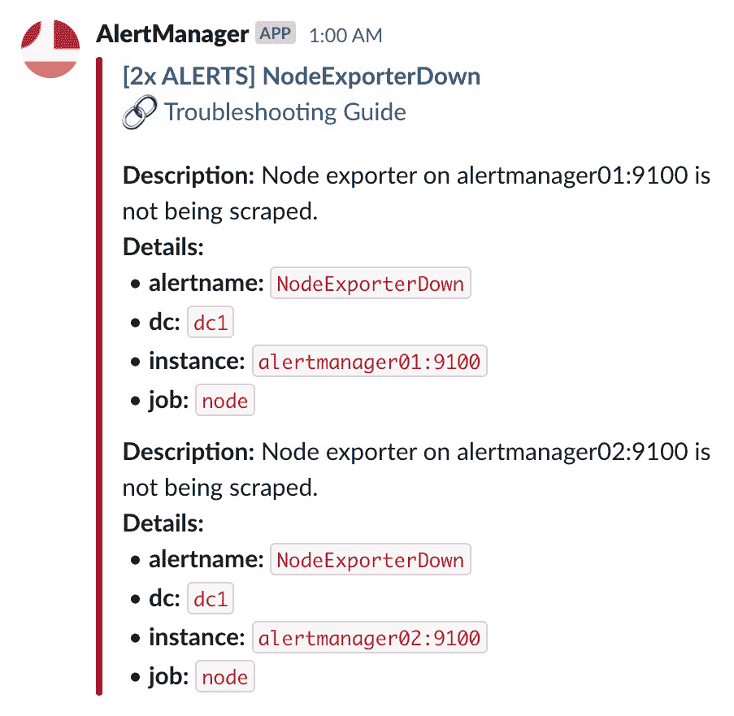

图 11.10：示例 Slack 通知模板

现在，我们将解析示例配置，该配置将生成类似于前面截图所示的通知：

```
route:
  group_by: [alertname, job]
  receiver: null
  routes:
  - match:
      severity: slack
    receiver: purple-squad-slack
```

出于这个示例的考虑，我们将警报按`alertname`和`job`进行分组。这一点很重要，因为它将影响`CommonAnnotations`和`CommonLabels`，正如我们稍后会看到的那样：

```
receivers:
- name: null
- name: purple-squad-slack
  slack_configs:
  - api_url: 'https://hooks.slack.com/TOKEN'
    channel: '#alerting'
    title: >
      [{{ .Alerts | len }}x ALERT{{ if gt (len .Alerts.Firing) 1 }}S{{end}}] {{ .CommonLabels.alertname }}
```

正如我们在前面的表格中看到的，`.Alerts` 是所有警报的列表，因此我们希望获取该列表的长度（`len`）来为消息创建一个标题，从触发的警报数量开始。注意`if`语句，它确保在有多个警报时使用复数形式。最后，由于我们按`alertname`分组警报，我们会在方括号后面打印`alertname`：

```
    text: >
      :link: <{{ .CommonAnnotations.troubleshooting }}/{{ .CommonLabels.alertname }}|Troubleshooting Guide>
```

对于消息正文，我们希望生成一个指向此类警报故障排除指南的链接。我们的警报发送了一个名为`troubleshooting`的注解，包含一个基本 URL。如果我们遵循惯例，使得指南名称与警报名称匹配，我们就可以使用这两个字段轻松生成链接。

为了提供更多关于触发警报的上下文，我们将把所有可用的警报标签添加到消息中。为了实现这个目标，我们必须遍历列表中的每个警报：

```
      {{ range .Alerts }}
```

对于每个警报，我们将打印该警报可用的描述，它作为该警报的注解存在：

```
       *Description:* {{ .Annotations.description }}
      *Details:*
```

我们还将打印每个警报的标签/值对。为此，我们将遍历`SortedPairs`的结果，它返回一个排序后的标签/值对列表：

```
        {{- range .Labels.SortedPairs }}
```

`{{-` 代码会修剪掉前面的文本中的所有尾随空格。更多信息可以参见[`tip.golang.org/pkg/text/template/#hdr-Text_and_spaces`](https://tip.golang.org/pkg/text/template/#hdr-Text_and_spaces)。

我们将严重性标签用作路由键，以选择通知器（呼叫器、电子邮件或 Slack），因此我们不希望在警报消息中暴露它。我们可以通过添加`if`语句来实现这一点，从而避免打印该特定标签/值：

```
          {{- if ne .Name "severity"}}
        • *{{ .Name }}:* `{{ .Value }}`
          {{- end}}
      {{- end }}
      {{ end }}
```

就是这样。你甚至可以通过将此模板从 Alertmanager 配置中提取出来并放入自己的模板文件中，使其更加易于管理。我们在测试环境中已经这么做了，其中接收器配置仅如下所示：

```
- name: violet-squad-slack
  slack_configs:
  - channel: '#violet-squad-alerts'
    title: '{{ template "slack.example.title" . }}'
    text: '{{ template "slack.example.text" . }}'
```

所有模板定义都可以在 Alertmanager 实例中的以下路径找到：

```
/etc/alertmanager/templates/example.tmpl
```

通知模板化一开始是相当难以理解和构建的。幸运的是，Prometheus 的联合创始人之一和核心维护者 Julius Volz 创建了一个工具，可以帮助你快速迭代 Slack 通知模板。这是理解它们如何工作及如何生成它们的最佳方式。你可以在[`juliusv.com/promslack/`](https://juliusv.com/promslack/)找到它。

# 谁来监视监视者？

监控系统是任何基础设施的关键组件。我们依赖它来监视一切——从服务器和网络设备到服务和应用程序——并期待在出现问题时收到通知。然而，当问题出现在监控堆栈本身，或者甚至是通知提供者上，导致警报被生成但未能到达我们时，作为运维人员，我们该如何得知？

保证监控堆栈正常运行，并确保通知能够到达接收者，是一个常常被忽视的任务。在本节中，我们将深入探讨如何采取措施来减轻风险因素，并提高对监控系统的整体信任度。

# 元监控与交叉监控

从广义上讲，你不能让监控系统监控自己；如果系统遭遇严重故障，它将无法发出相关通知。虽然让 Prometheus 自己抓取数据是常见做法（你可能会在大多数教程中看到），但显然不能依赖它来发出关于自己的警报。这时，元监控就派上用场了：它是指监控系统被监控的过程。

你应该考虑的第一个选项来缓解这个问题，是拥有一组 Prometheus 实例，监控它们数据中心/区域中的所有其他 Prometheus 实例。由于 Prometheus 自身生成的指标相对较少，这将转化为一个相当轻量的抓取任务，进行元监控的实例甚至不需要专门致力于此：

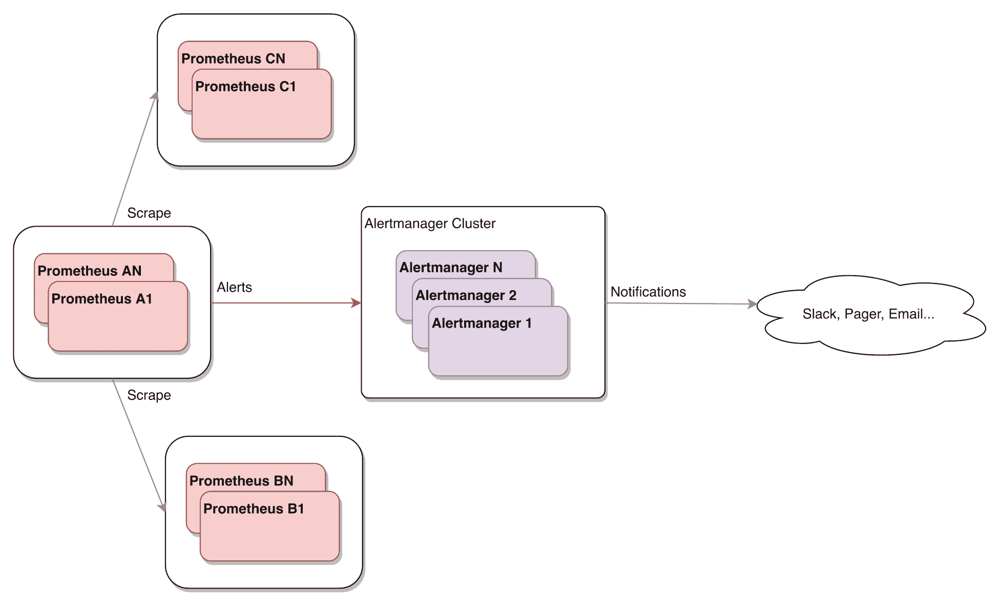

图 11.11：元监控——Prometheus 组互相监控

然而，你可能会想知道，这些实例该如何被监控。我们可以不断添加更高层次的实例，以分层方式进行元监控——先在数据中心级别，再在区域级别，最后在全球级别——但我们仍然会面临一组没有被监控的服务器。

一种补充的技术来缓解这一不足被称为交叉监控。这种方法涉及让同一责任层级的 Prometheus 实例相互监控。这样，每个实例至少会有另一个 Prometheus 在监视它，并在其失败时生成警报：

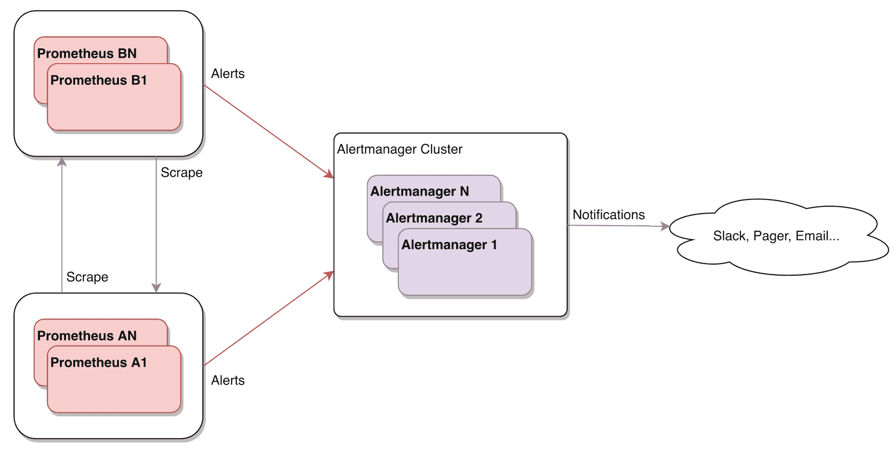

图 11.12：Prometheus 组自我监控

那么，如果问题出现在 Alertmanager 集群中会怎样？或者如果外部连接问题阻止了通知到达通知提供者呢？甚至如果通知提供者本身发生故障呢？在接下来的部分，我们将提供这些问题的可能解决方案。

# 死人开关警报

想象一下，你有一组 Prometheus 实例，使用 Alertmanager 集群进行警报。当某种原因导致这两个服务之间发生网络分区时，即使每个 Prometheus 实例都检测到它无法再连接任何 Alertmanager 实例，它们也没有办法发送通知。

在这种情况下，关于问题的任何警报都不会被发送：

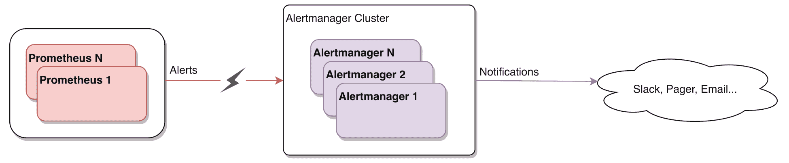

图 11.13：Prometheus 与 Alertmanager 之间的网络分区

死人开关的原始概念指的是一个机制，它在停止触发/按下时会被激活。这个概念在软件世界中以多种方式得到了应用；就我们的目的而言，我们可以通过创建一个应该始终触发的警报来实现——从而持续发送通知——然后检查它是否停止触发。通过这种方式，我们可以全面测试从 Prometheus、通过 Alertmanager，到通知提供者，最终到达通知接收者的警报路径，以确保端到端的连接性和服务可用性。当然，这与我们了解的警报疲劳背道而驰，我们不希望一直收到关于总是触发的警报的页面或电子邮件。你可以实现自己的自定义服务，使用看门狗定时器，但那样你也需要监控这个服务。理想情况下，你应该利用第三方服务，这样可以减轻该服务遭遇与阻止通知发送的故障相同问题的风险。

为此，有一个围绕死人的开关类型警报构建的服务，名字也非常有趣，叫做*Dead Man's Snitch*（[deadmanssnitch.com](https://deadmanssnitch.com)）。这是一个第三方服务，位于你的基础设施之外，负责通过电子邮件或 Webhook 接收你的始终触发的通知，并在该通知停止接收超过可配置时间后，发出页面、Slack 消息或 Webhook。这个设置减轻了我们之前提出的问题——即使整个数据中心起火，你仍然会收到警报！

Dead Man's Snitch 与 VictorOps 和 PagerDuty 集成的完整配置指南可以在[`help.victorops.com/knowledge-base/victorops-dead-mans-snitch-integration/`](https://help.victorops.com/knowledge-base/victorops-dead-mans-snitch-integration/)和[`www.pagerduty.com/docs/guides/dead-mans-snitch-integration-guide/`](https://www.pagerduty.com/docs/guides/dead-mans-snitch-integration-guide/)找到。

# 摘要

在本章中，我们深入探讨了 Prometheus 堆栈中的告警组件——Alertmanager。这个服务的设计考虑了高可用性，我们有机会了解它的工作原理，从生成更好的通知到避免被无用的通知淹没。通知管道是理解 Alertmanager 内部工作原理的一个很好的起点，但我们也了解了它的配置，并通过示例更好地巩固了这些知识。我们还介绍了 `amtool` 及其提供的所有功能，如通过命令行直接添加、删除和更新静默。

Alertmanager 提供了多种通知集成方式，我们已经涵盖了所有这些方式，帮助你挑选出感兴趣的部分。既然我们都希望获得更好的通知，我们深入探讨了如何自定义默认通知，使用 Slack 作为示例。解决的一个难题是如何监控监控系统；在本章中，我们学习了如何确保在通知未正常发送时能够及时告警。

在一个不断变化的基础设施中，追踪哪些服务在运行以及它们运行在哪里并非易事。在下一章中，我们将深入探讨 Prometheus 如何处理服务发现，并为你自动化这些任务。

# 问题

1.  如果在同一集群中 Alertmanager 实例之间发生网络分区，通知会发生什么？

1.  一个告警可以触发多个接收者吗？为此需要满足什么条件？

1.  `group_interval` 和 `repeat_interval` 有什么区别？

1.  如果告警与任何配置的路由都不匹配，会发生什么？

1.  如果 Alertmanager 原生不支持你需要的通知提供者，你该如何使用它？

1.  在编写自定义通知时，`CommonLabels` 和 `CommonAnnotations` 是如何填充的？

1.  你能做些什么来确保整个告警路径从头到尾都正常工作？

# 进一步阅读

+   **官方 Alertmanager 页面**: [`prometheus.io/docs/alerting/alertmanager/`](https://prometheus.io/docs/alerting/alertmanager/)

+   **Alertmanager 通知指南**: [`prometheus.io/docs/alerting/notifications/`](https://prometheus.io/docs/alerting/notifications/)

+   **Alertmanager 配置细节**: [`prometheus.io/docs/alerting/configuration/`](https://prometheus.io/docs/alerting/configuration/)
