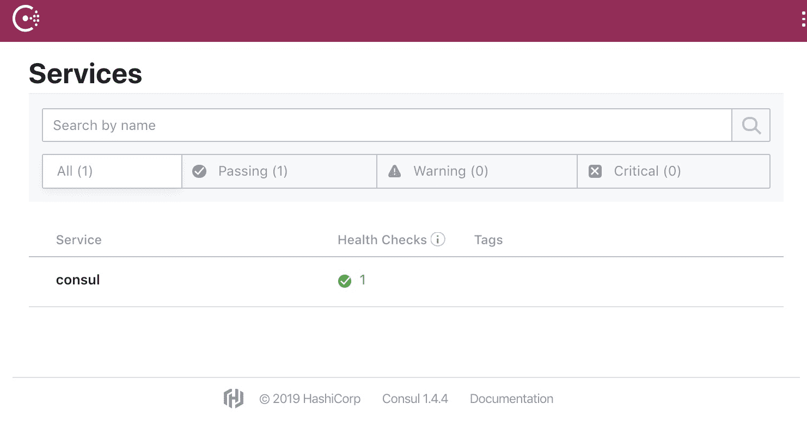

# 第十三章：选择合适的服务发现方式

在处理动态环境时，手动维护目标文件是不可行的。服务发现会为您处理复杂的不断变化的基础设施，确保没有任何服务或主机被遗漏。本章重点介绍如何利用 Prometheus 服务发现来减少在应对不断变化的基础设施管理工作中的繁琐工作。

简而言之，本章将涵盖以下主题：

+   本章节的测试环境

+   运行服务发现选项

+   使用内建的服务发现

+   构建自定义服务发现

# 本章节的测试环境

本章将重点介绍服务发现。为此，我们将部署两个新的实例，以模拟一个场景，其中 Prometheus 使用流行的服务发现软件动态生成目标。这个方法不仅能暴露所需的配置，还能验证所有内容如何协同工作。

我们将使用的设置类似于以下图示：


图 12.1：本章节的测试环境

Consul 的常见部署模式是在基础设施的每个节点上以客户端模式运行一个代理，然后与以服务器模式运行的 Consul 实例进行通信。此外，客户端实例充当 API 代理，因此 Prometheus Consul 服务发现通常会使用本地主机进行配置。然而，为了使各自的职责更加明确，我们在测试环境中选择仅在一台虚拟机上运行 Prometheus 实例，并在另一台虚拟机上运行作为服务器的 Consul。

在接下来的章节中，我们将解释如何启动并运行测试环境。

# 部署

要启动一个新的测试环境，请进入本章节的路径，相对于仓库根目录：

```
cd ./chapter12/
```

确保没有其他测试环境在运行，并启动本章节的环境：

```
vagrant global-status
vagrant up
```

您可以使用以下命令验证测试环境的成功部署：

```
vagrant status
```

这将为您提供以下输出：

```
Current machine states:

prometheus                running (virtualbox)
consul                    running (virtualbox)

This environment represents multiple VMs. The VMs are all listed above with their current state. For more information about a specific VM, run `vagrant status NAME`.
```

部署任务结束后，您将能够使用您最喜欢的启用了 JavaScript 的网页浏览器，在主机机器上验证以下端点：

| **服务** | **端点** |
| --- | --- |
| Prometheus | `http://192.168.42.10:9090` |
| Consul | `http://192.168.42.11:8500` |

您应该能够通过以下命令之一访问所需的实例：

| **实例** | **命令** |
| --- | --- |
| Prometheus | `vagrant ssh prometheus` |
| Consul | `vagrant ssh consul` |

# 清理

测试完成后，只需确保您位于 `./chapter12/` 目录中并执行以下命令：

```
vagrant destroy -f
```

不用太担心——如果需要，您可以轻松地重新启动环境。

# 运行服务发现选项

Prometheus 开箱即用地提供了多个发现集成。这些集成覆盖了大多数主流数据源，用于应用和机器清单，例如公共和私有云计算 API、虚拟机和容器编排系统、独立的服务注册和发现系统等。对于 Prometheus 不直接支持的发现机制，可以通过通用的发现系统进行集成，利用文件系统和一些粘合代码，就像我们在本章稍后看到的那样。

每个集成都以相同的方式工作——通过将所有发现的地址作为目标，并将其相关的元数据作为临时标签（在没有某些重新标签的情况下，这些标签不会持久化）。对于每个被发现的目标，`__address__` 标签通常被设置为服务地址和端口。这一点很重要，因为这个标签是 Prometheus 用来连接抓取目标的标签；`instance` 标签在没有显式定义时默认使用 `__address__` 的值，但它可以设置为任何其他便于识别目标的值。

服务发现集成提供的元数据标签遵循 `__meta_<service discovery name>_<key>` 的模式。还有一些标签是 Prometheus 添加的，例如 `__scheme__` 和 `__metrics_path__`，它们分别定义是否应使用 HTTP 或 HTTPS 执行抓取，以及配置的抓取端点。

在 `metrics_path` 抓取配置中不支持 URL 参数。相反，这些参数需要在 `params` 配置中设置。相关内容将在 第五章 中介绍，*运行 Prometheus 服务器*。

以下章节提供了可用的发现选项概述，并展示了如何配置它们的一些示例，附带生成数据的截图。

# 云提供商

随着云基础设施的崛起，在这些环境中运行工作负载变得越来越常见。这带来了新的挑战，例如短暂且高度动态的基础设施配置。可扩展性易于实现也是需要考虑的因素：过去，可能需要几个月的时间来协商、达成支持合同、购买、部署和配置新硬件；而现在，只需几秒钟即可启动并运行一组新的实例。随着像自动扩展这样的技术出现，它可以在你甚至不知道的情况下部署新实例，变化的速度让人难以跟上。为了减轻对这种云原生动态基础设施的监控负担，Prometheus 开箱即用地与一些 **基础设施即服务** (**IaaS**) 市场中的大玩家进行了集成，例如 Amazon Web Services、Microsoft Azure Cloud、Google Cloud Platform、OpenStack 和 Joyent。

以 Amazon **弹性计算** (**EC2**) 为虚拟机发现的例子，抓取任务的配置可以像下面这样简单：

```
scrape_configs:
 - job_name: ec2_sd
   ec2_sd_configs:
    - region: eu-west-1
      access_key: ACCESSKEYTOKEN
      secret_key: 'SecREtKeySecREtKey+SecREtKey+SecREtKey'
```

其他云服务提供商的设置可能有所不同，但逻辑基本相同。基本上，我们需要设置适当的凭据级别来查询云服务提供商的 API，以便 Prometheus 发现集成能够获取生成目标所需的所有数据以及其相关的元数据。以下截图演示了如何将类似于之前列出的配置但带有实际凭据的设置转化为一组目标：


图 12.2：Prometheus */*service-discovery 端点，展示 ec2_sd 数据

正如我们在前面的截图中看到的，EC2 发现将相当多的元数据标签附加到每个发现的目标。这些标签在重新标记阶段可用，您可以利用它们只抓取正在运行的目标，将抓取地址从私有 IP 地址更改为公共 IP 地址，或者将实例标签重命名为更友好的名称。

从发现过程中收集的信息要么是定期刷新（刷新间隔可以在服务发现级别进行配置），要么通过监视自动刷新，使得 Prometheus 能够意识到目标的创建或删除。

# 容器编排器

容器编排器是提取正在运行的服务及其位置的完美场所，因为它们的工作正是管理这些信息。因此，Prometheus 的发现机制支持一些最广泛使用的容器编排平台，如 Kubernetes 和 Marathon，这是 Mesos 和 DC/OS 的容器编排平台。由于我们在本书的大部分示例中使用了 Kubernetes，因此我们将重点介绍该平台，以解释这些系统是如何工作的。

和 Prometheus 一样，Kubernetes 也是**云原生计算基金会**（**CNCF**）的一个毕业项目。虽然这并不意味着一个是专门为了与另一个一起工作的，但二者之间的联系是不可否认的。Google 的容器编排和监控系统 Borg 和 Borgmon，分别是 Kubernetes 和 Prometheus 的灵感来源。为了应对 Kubernetes 等云原生平台的监控，其中变化的速度几乎令人难以承受，必须具备一套特别的功能。Prometheus 符合这些需求，例如高效处理容器的短暂性。

Prometheus 服务发现集成通过 Kubernetes API 检索所有所需的数据，保持与集群状态的同步。由于可查询的 API 对象数量庞大，Prometheus 的发现配置中引入了角色（role）概念，这些角色可以是 `node`、`service`、`pod`、`endpoint` 或 `ingress`。虽然解释 Kubernetes 核心概念超出了本书的范围，但我们可以快速了解每个角色的用途：`node` 用于收集形成 Kubernetes 集群的实际节点（例如，运行 kubelet 代理的虚拟机），因此可以用来监控集群本身以及其底层基础设施；Kubernetes 中的服务对象充当负载均衡器，`service` 将提供每个配置服务的每个端口的单个端点，无论它是由一个还是多个应用实例支持——并且仅用于黑盒监控；`pod` 用于发现独立的 Pod，无论它们是否属于某个服务；`endpoint` 发现支持特定服务的 Pod 中的主要进程；最后，`ingress` 类似于 `service`，返回一个应用实例集合的外部负载均衡器，因此仅应在端到端探测中使用。

以下代码片段提供了一个查询 Pods 的示例，匹配具有标签 `app` 且值为 `hey` 的 Pods：

```
scrape_configs:
  - job_name: kubernetes_sd
    kubernetes_sd_configs:
      - role: pod
    relabel_configs:
      - action: keep
        regex: hey
        source_labels:
          - __meta_kubernetes_pod_label_app
```

前面的配置生成了以下截图中所示的数据，在其中我们可以看到通过 Kubernetes API 收集的所有元数据：


图 12.3：Prometheus /service-discovery 端点，展示 kubernetes_sd 数据

这是一个可以完成的非常小的示例。使用 Kubernetes 服务发现的配置通常广泛使用 `relabel_configs` 来过滤目标，重写 `job` 标签以匹配容器名称，并且通常基于 Kubernetes 注解的约定进行巧妙的自动配置。

# 服务发现系统

随着服务数量的增加，越来越难以将所有内容联系在一起——无论是在服务正确配置以相互通信方面，还是在操作员能看到系统行为的方面。解决这些问题的常见方法是实现一个服务发现系统，它充当注册表，软件客户端以及监控系统可以查询该注册表。

Prometheus 无缝集成了几个主流的服务发现系统，目前支持 Consul、Nerve 和 ServerSets。直接与发现服务集成使 Prometheus 始终能够获取当前运行的服务及其位置，从而使服务实例在创建后能够被自动监控，直到它们被销毁。

Consul 目前是最受欢迎的，它提供了一整套功能来实现服务发现，并且拥有强大且易于使用的命令行工具和 API，且易于扩展。我们以以下内容作为示例：

```
scrape_configs:
  - job_name: 'consul_sd'
    consul_sd_configs:
      - server: http://consul.prom.inet:8500
        datacenter: dc1
    relabel_configs:
      - source_labels: [__meta_consul_service]
        target_label: job
      - source_labels: [job, __address__]
        regex: "consul;([^:]+):.+"
        target_label: __address__
        replacement: ${1}:9107
```

上面的示例转换成如下截图，我们可以看到不仅是生成的标签，还有目标的定义：


图 12.4：Prometheus /service-discovery 端点展示 consul_sd 数据

上面的示例展示了一个工作配置，用于从 Consul 服务器中所有可用服务收集数据，使用 `relabel_configs` 将目标的 `job` 标签重写为服务名称，而不是 `job_name`。这意味着在 Consul 中注册的每个应用实例都会被自动拾取为抓取目标，并正确分配适当的作业名称。此外，最后的重标签规则会在服务名为 Consul 时将目标端口更改为 `9107`，从而将目标从 Consul 本身更改为其导出器。

# 基于 DNS 的服务发现

这种类型的服务发现依赖于 DNS 来收集数据。它通过定义一系列需要定期查询的域名来获取目标。用于解析的名称服务器会在 `/etc/resolv.conf` 中查找。除了支持 A 和 AAAA DNS 记录外，该发现集成还能够查询 SRV 记录，SRV 记录还提供服务的端口：

```
~$ dig SRV hey.service.example.inet
...
;; QUESTION SECTION:
;hey.service.example.inet. IN SRV

;; ANSWER SECTION:
hey.service.example.inet. 0 IN SRV 1 1 8080 server01.node.example.inet.

;; ADDITIONAL SECTION:
server01.node.example.inet. 0 IN A 192.168.42.11
server01.node.example.inet. 0 IN TXT "squad=purple"
...
```

我们可以看到，通过查询 `hey.service.example.inet` 的 SRV 记录，在此示例中，我们得到服务位置 `server01.node.example.inet` 和端口 `8080`。我们还得到了包含服务 IP 地址的 A 记录和包含一些元数据的 TXT 记录。

以下代码片段展示了使用此 DNS 服务发现集成的示例抓取配置。它通过使用之前提到的域名 `hey.service.example.inet` 来实现：

```
scrape_configs:
  - job_name: 'dns_sd'
    dns_sd_configs:
      - names:
        - hey.service.example.inet
```

返回的 SRV 记录将转换为新的目标。Prometheus 不支持 RFC 6763 中指定的高级 DNS-SD，它允许通过相关的 TXT 记录传输元数据（如之前在 `dig` 命令中看到的）。这意味着只能使用此方法发现服务地址和端口。我们可以在以下截图中看到发现的标签：


图 12.5：Prometheus */service-discovery* 端点展示 *dns_sd* 数据

在所有发现集成中，这是提供的元数据最少的一个。此外，使用 DNS 进行服务发现很难做到正确——需要规划慢速收敛，考虑多个不同的缓存层，这些缓存层可能会或可能不会尊重记录的 TTL 等问题。这种方法应该仅在高级用例中考虑。

# 基于文件的服务发现

类似于 webhook 通知器为集成不受支持的通知系统提供解决方案（如 第十一章《理解与扩展 Alertmanager》中所解释的），基于文件的集成为服务发现提供了相同类型的解决方案。它的工作原理是加载有效的 JSON 或 YAML 文件列表，这些文件用于生成所需的目标及其标签。文件发现更改后不需要重载或重启 Prometheus，因为它们会被监控并自动重新读取，具体取决于操作系统。此外，作为回退，发现文件也会按照预定计划（默认每 5 分钟）被读取。

以下 JSON 片段展示了一个有效的 Prometheus 服务发现文件。正如我们所看到的，它包含了标签列表和一个目标数组，这些标签适用于目标：

```
[
    {
        "labels": {
            "job": "node"
        },
        "targets": [
            "192.168.42.11:9100"
        ]
    }
]
```

以下抓取配置使用了 `file_sd` 服务发现，它加载了之前展示的 `file_sd.json` 文件：

```
scrape_configs:
  - job_name: 'file_sd'
    file_sd_configs:
      - files:
        - file_sd.json
```

`files` 列表还允许对路径的最后一个元素进行 glob 匹配，即对文件级别进行匹配。

从该配置中发现的目标可以在下图中看到，我们可以检查文件提供的元数据以及 Prometheus 自动生成的标签：


图 12.6：Prometheus /service-discovery 端点展示 file_sd 数据

很容易看出，这种集成打开了无数可能性：这些文件可以通过一个常驻的守护进程或者一个定时任务（cron job）创建，使用 shell 脚本（甚至是简单的 wget）或完备的编程语言，或者通过配置管理工具来部署。我们将在本章后面讨论如何构建自定义服务发现时，深入探讨这个话题。

# 使用内置的服务发现

为了理解 Prometheus 和服务发现提供者之间的集成方式，我们将依赖于我们的测试环境。进一步来说，我们将提供一个在 Kubernetes 中运行的 Prometheus 工作示例，依赖于该平台的原生服务发现。这些动手示例将展示如何将一切结合起来，帮助你不仅理解其优点，更重要的是理解这些机制的简单性。

# 使用 Consul 服务发现

在本章中，我们将 Consul 配置为虚拟机基础的测试环境中的示例服务发现系统——Consul 的设置非常简单，这使得它非常适合我们的示例。它的工作方式是在每个节点上运行一个客户端模式的代理，以及在服务器模式下运行的一个奇数个代理，后者维护服务目录。客户端节点上可用的服务会直接传递给服务器节点，而集群成员身份则通过集群中每个节点之间使用的 gossip 协议（随机点对点消息传递）进行传播。由于我们的主要目标是展示使用 Consul 进行 Prometheus 服务发现，我们将测试环境配置为在开发模式下运行的代理，从而启用一个内存中的服务器来进行实验。当然，这完全忽视了安全性、可扩展性、数据安全性和弹性；关于如何正确配置 Consul 的文档可以在[`learn.hashicorp.com/consul/`](https://learn.hashicorp.com/consul/)找到，在部署和维护 Consul 于生产环境中时应予以考虑。

要查看测试环境中如何配置此项，我们需要连接到运行 Consul 的实例：

```
vagrant ssh consul
```

从这里，我们可以开始探索 Consul 是如何配置的。例如，以下片段展示了正在使用的 systemd 单元文件，在其中我们可以看到正在使用的配置标志——它被配置为在开发模式下以代理身份运行，并且必须将其端口绑定到实例的外部 IP 地址：

```
vagrant@consul:~$ systemctl cat consul.service 
...
[Service]
User=consul
ExecStart=/usr/bin/consul agent \
 -dev \
 -bind=192.168.42.11 \
 -client=192.168.42.11 \
 -advertise=192.168.42.11
...
```

如果我们运行`ss`并过滤其输出，只显示属于 Consul 的行，我们可以找到它正在使用的所有端口：

```
vagrant@consul:~$ sudo /bin/ss -lnp | grep consul
udp UNCONN 0 0 192.168.42.11:8301 0.0.0.0:* users:(("consul",pid=581,fd=8))
udp UNCONN 0 0 192.168.42.11:8302 0.0.0.0:* users:(("consul",pid=581,fd=6))
udp UNCONN 0 0 192.168.42.11:8600 0.0.0.0:* users:(("consul",pid=581,fd=9))
tcp LISTEN 0 128 192.168.42.11:8300 0.0.0.0:* users:(("consul",pid=581,fd=3))
tcp LISTEN 0 128 192.168.42.11:8301 0.0.0.0:* users:(("consul",pid=581,fd=7))
tcp LISTEN 0 128 192.168.42.11:8302 0.0.0.0:* users:(("consul",pid=581,fd=5))
tcp LISTEN 0 128 192.168.42.11:8500 0.0.0.0:* users:(("consul",pid=581,fd=11))
tcp LISTEN 0 128 192.168.42.11:8502 0.0.0.0:* users:(("consul",pid=581,fd=12))
tcp LISTEN 0 128 192.168.42.11:8600 0.0.0.0:* users:(("consul",pid=581,fd=10))
```

如我们所见，Consul 监听了多个端口，包括 TCP 和 UDP。我们关心的端口是提供 HTTP API 的端口，默认是 TCP 端口`8500`。如果我们在浏览器中访问`http://192.168.42.11:8500`，我们将看到类似以下内容：



图 12.7：Consul Web 界面显示其默认配置

默认配置了一个服务，即 Consul 服务本身。

为了让这个示例更加有趣，我们还在`consul`实例中部署了`consul_exporter`（一个由 Prometheus 项目提供的导出器）。这个导出器无需在 Consul 端进行任何额外配置，因此应该能够直接工作。我们可以在 systemd 单元文件中找到运行该服务所使用的配置，像这样：

```
vagrant@consul:~$ systemctl cat consul-exporter.service 
...
[Service]
User=consul_exporter
ExecStart=/usr/bin/consul_exporter --consul.server=consul:8500
...
```

`consul_exporter`的源代码和安装文件可在[`github.com/prometheus/consul_exporter`](https://github.com/prometheus/consul_exporter)找到。

为了验证导出器是否正确地联系到 Consul 并解析其指标，我们可以运行以下指令：

```
vagrant@consul:~$ curl -qs localhost:9107/metrics | grep "^consul"
consul_catalog_service_node_healthy{node="consul",service_id="consul",service_name="consul"} 1
consul_catalog_services 1
consul_exporter_build_info{branch="HEAD",goversion="go1.10.3",revision="75f02d80bbe2191cd0af297bbf200a81cbe7aeb0",version="0.4.0"} 1
consul_health_node_status{check="serfHealth",node="consul",status="critical"} 0
consul_health_node_status{check="serfHealth",node="consul",status="maintenance"} 0
consul_health_node_status{check="serfHealth",node="consul",status="passing"} 1
consul_health_node_status{check="serfHealth",node="consul",status="warning"} 0
consul_raft_leader 1
consul_raft_peers 1
consul_serf_lan_members 1
consul_up 1
```

当 exporter 成功连接并从 Consul 收集指标时，它会将 `consul_up` 指标设置为 `1`。我们还可以看到 `consul_catalog_services` 指标，它告诉我们 Consul 知道有一个服务，与我们在 Web 界面中看到的内容一致。

现在我们可以断开与 `consul` 实例的连接，并使用以下命令连接到 `prometheus` 实例：

```
exit
vagrant ssh prometheus
```

如果我们查看 Prometheus 服务器配置，我们将发现以下内容：

```
vagrant@prometheus:~$ cat /etc/prometheus/prometheus.yml 
...

 - job_name: 'consul_sd'
 consul_sd_configs:
 - server: http://consul:8500
 datacenter: dc1
 relabel_configs:
 - source_labels: [__meta_consul_service]
 target_label: job
...
```

该配置允许 Prometheus 连接到 Consul API 地址（可通过 `http://192.168.42.11:8500` 访问），并通过 `relabel_configs` 重写 `job` 标签，使其与服务名称（如 `__meta_consul_service` 标签中所示）匹配。如果我们检查 Prometheus 的 Web 界面，我们可以看到以下信息：


图 12.8：Prometheus `/service-discovery` 端点显示 Consul 默认服务

现在，到了有趣的部分：让我们通过将 `consul_exporter` 定义为 Consul 中的一个服务，自动添加一个抓取目标。该章节的资源中提供了一个包含 Consul 服务配置的 JSON 有效负载，我们可以通过 Consul API 将其添加。有效负载位于以下路径：

```
vagrant@prometheus:~$ cat /vagrant/chapter12/configs/consul_exporter/payload.json 
{
 "ID": "consul-exporter01",
 "Name": "consul-exporter",
 "Tags": [
 "consul",
 "exporter",
 "prometheus"
 ],
 "Address": "consul",
 "Port": 9107
}
```

使用以下指令，我们将通过 HTTP API 将此新服务添加到 Consul 的服务目录中：

```
vagrant@prometheus:~$ curl --request PUT \
--data @/vagrant/chapter12/configs/consul_exporter/payload.json \
http://consul:8500/v1/agent/service/register
```

运行此命令后，我们可以通过查看 Consul Web 界面来验证新服务是否已被添加，该界面将显示类似如下内容：


图 12.9：Consul Web 界面显示 consul-exporter 服务

最后，我们可以检查 Prometheus `/service-discovery` 端点，查看是否有一个新目标，从而证明 Consul 服务发现功能正常：


图 12.10：Prometheus `/service-discovery` 端点显示 consul-exporter 目标

如果我们再次查看 `consul_catalog_services` 指标，我们会发现它已经变为 2。由于我们现在正在 Prometheus 中收集 `consul_exporter` 指标，我们可以使用 `promtool` 查询其当前值：

```
vagrant@prometheus:~$ promtool query instant http://localhost:9090 'consul_catalog_services'
consul_catalog_services{instance="consul:9107", job="consul-exporter"} => 2 @[1555252393.681]
```

Consul 标签可以用于通过 `relabel_configs` 配置抓取任务，适用于有不同要求的服务，例如在某个标签存在时更改指标路径，或者使用一个标签来标记是否使用 HTTPS 进行抓取。`__meta_consul_tags` 标签的值在开始和结束时有逗号分隔符，以便更容易进行匹配；这样，你就不需要根据你尝试匹配的标签在字符串中的位置来特别处理正则表达式。一个实际的例子如下：

```
...
    relabel_configs: 
      - source_labels: [__meta_consul_tags]
        regex: .*,exporter,.*
        action: keep
...
```

这将仅保留在 Consul 中注册的带有 `exporter` 标签的服务，丢弃其他所有服务。

# 使用 Kubernetes 服务发现

在这个例子中，我们将不再使用前几章中的 Prometheus Kubernetes Operator，而是将重点放在 Prometheus 原生服务发现集成上，以便与这个容器编排平台配合使用。用于在 Kubernetes 测试环境中启动 Prometheus 的清单文件可以在以下路径中找到，相对于代码仓库的根路径：

```
cd ./chapter12/provision/kubernetes/
```

以下步骤将确保在新 Kubernetes 环境中配置所有所需的软件，从而使我们能够专注于服务发现组件。

验证没有其他环境在运行：

```
minikube status
minikube delete
```

启动一个空的 Kubernetes 环境：

```
minikube start \
  --cpus=2 \
  --memory=3072 \
  --kubernetes-version="v1.14.0" \
  --vm-driver=virtualbox \
  --extra-config=kubelet.authentication-token-webhook=true \
  --extra-config=kubelet.authorization-mode=Webhook
```

我们提供给 minikube 的额外配置是必需的，以便 Prometheus 能够通过服务帐户令牌与 `kubelets` 进行交互。当前一个命令完成时，一个新的 Kubernetes 环境将准备就绪。然后我们可以按照以下说明部署我们的配置：

```
kubectl apply -f ./bootstrap/
kubectl rollout status deployment/prometheus-deployment -n monitoring
```

前面的命令应用了几个清单文件，其中包括创建一个名为 `monitoring` 的命名空间、一个 ServiceAccount，以及所有所需的 RBAC 配置，以便 Prometheus 可以查询 Kubernetes API。还包括一个包含 Prometheus 服务器配置的 `ConfigMap`，该配置可以在 `bootstrap/03_prometheus-configmap.yaml` 中找到。它定义了多个 Kubernetes 组件的抓取任务，这些任务通过服务发现功能进行目标定位，正如以下片段所示：

```
$ cat bootstrap/03_prometheus-configmap.yaml
...
data:
 prometheus.yml: |
 scrape_configs:
...
 - job_name: kubernetes-pods
 kubernetes_sd_configs:
 - role: pod
 relabel_configs:
 - action: keep
 regex: hey
 source_labels:
 - __meta_kubernetes_pod_label_app
...
```

我们可以通过执行以下命令打开 Prometheus Web 界面：

```
minikube service prometheus-service -n monitoring
```

通过进入 `/service-discovery` 端点的服务发现部分，我们可以看到，尽管发现了几个 pod，但没有一个匹配 `app` 标签的 `hey` 标签值，因此它们被丢弃：


图 12.11：Prometheus /service-discovery 端点显示 kubernetes-pods 任务丢弃的目标

现在是时候添加一些带有正确标签/值对的新 pod，以触发我们的服务发现配置。我们可以通过运行以下命令来继续部署 `hey` 应用程序，然后跟踪部署状态：

```
kubectl apply -f ./services/
kubectl rollout status deployment/hey-deployment -n default
```

在成功部署后，我们可以再次访问 Prometheus Web 界面，在 `/service-discovery` 端点查看，发现现在在 `kubernetes-pods` 抓取任务中有三个活动目标。以下截图展示了其中一个目标及其所有由 Kubernetes API 提供的标签：


图 12.12：Prometheus /service-discovery 端点显示为 kubernetes-pods 任务发现的目标

测试完成后，您可以通过执行以下命令删除此 Kubernetes 环境：

```
minikube delete
```

这种服务发现方式使我们能够自动跟踪多个 Kubernetes 对象，而无需手动更改 Prometheus 配置。该环境使我们能够测试各种设置，并为定制 Kubernetes 服务发现以满足我们的特定需求提供了基础。

# 构建自定义服务发现

即便有许多现成的服务发现选项，仍有许多其他系统/提供者不被默认支持。在这些情况下，我们有几种选择：

+   提交一个功能请求，请求 Prometheus 支持该特定的服务发现，并依赖社区和/或维护者来实现它。

+   在 Prometheus 中自行实现服务发现集成，并维护一个分支或将其贡献回项目。

+   找到一种方法，以最少的维护工作和时间成本将所需的目标导入 Prometheus 实例，并且无需依赖 Prometheus 路线图来完成这项工作。

前两种选项不太理想，因为它们要么超出了我们的控制范围，要么维护起来很麻烦。此外，在没有较大兴趣和支持社区的情况下将额外的服务发现集成到 Prometheus 中，会给维护者带来过多的支持负担，而维护者目前并未接受任何新的集成。幸运的是，有一种方法可以轻松与任何类型的服务或实例目录进行集成，而无需维护昂贵的分支或创造性的黑客解决方案。在接下来的部分，我们将探讨如何将我们自己的服务发现与 Prometheus 集成。

# 自定义服务发现基础

集成自定义服务发现的推荐方式是依赖基于文件的服务发现`file_sd`。集成实现的方式是通过一个进程（本地或远程、定时或持续运行）查询数据源（目录/API/数据库/**配置管理数据库**（**CMDB**）），然后将所有目标及其相应标签写入一个 Prometheus 可访问的路径上的 JSON 或 YAML 格式文件。然后，Prometheus 会通过磁盘监控或定时任务自动读取该文件，从而使你能够动态更新可供抓取的目标。

以下图表展示了上述工作流程：


图 12.13：自定义服务发现流程

这种方法足够通用，可以满足大多数（如果不是全部）所需的用例，使得以简单明了的方式构建自定义服务发现机制成为可能。

社区驱动的`file_sd`集成可以在 [`prometheus.io/docs/operating/integrations/#file-service-discovery`](https://prometheus.io/docs/operating/integrations/#file-service-discovery) 找到。

现在我们已经知道了这种集成方式的工作原理，接下来让我们直接动手，开始构建我们自己的服务发现。

# 推荐方式

如前所述，构建自定义服务发现似乎是一个可管理的任务。我们需要查询数据并将数据按照标准格式写入文件。为了简化我们的生活，Prometheus 团队提供了一个适配器，可以消除创建新服务发现集成的大部分样板代码。这个适配器仅适用于 Go 编程语言，因为它重用了来自 Prometheus 本身的一些代码。这种设计使得一些维护较少的服务发现集成可以不太费力地迁移到独立服务中，同时也简化了使用适配器构建的外部发现集成迁移到主 Prometheus 二进制文件中的过程，这些集成都已经被证明是有效的。请注意，并没有阻止您使用您选择的语言来构建这样的集成，但出于遵循推荐方法的考虑，我们将坚持使用 Go 和这个发现适配器。关于如何在 Go 中编程的详细说明超出了本书的范围。

在主 Prometheus 代码库中，我们可以找到适配器的代码，以及一个使用 Consul 的示例，有趣的是，我们已经在我们的测试环境中设置了 Consul。正如我们现在所知，Consul 集成在 Prometheus 中得到了原生支持；然而，假装它没有得到支持，我们需要与之集成。在接下来的主题中，我们将详细讨论如何将所有内容整合在一起并构建一个自定义的服务发现。

自定义服务发现示例的代码可在[`github.com/prometheus/prometheus/tree/v2.9.1/documentation/examples/custom-sd`](https://github.com/prometheus/prometheus/tree/v2.9.1/documentation/examples/custom-sd)找到。

# 服务发现适配器

作为高层次概述，适配器负责启动和管理我们自定义服务发现代码，消费它生成的目标组，并将它们转换为`file_sd`格式，并确保在需要时将 JSON 数据写入文件。使用这个适配器编写服务发现集成时，不需要修改其代码，因此它可以作为一个库直接导入。为了更清楚地解释适配器的行为，我们将解释一些低级细节，以便在实现我们自己的发现时其行为变得清晰。

以下代码片段说明了我们需要从我们的代码中调用的适配器的`Run`函数。这个函数将负责在它自己的 goroutine 中启动`discovery.Manager`（`a.manager.Run`），指示它运行我们的发现实现（`a.disc`），最后在另一个 goroutine 中运行适配器本身（`a.runCustomSD`）：

```
// Run starts a Discovery Manager and the custom service discovery implementation.
func (a *Adapter) Run() {
    go a.manager.Run()
    a.manager.StartCustomProvider(a.ctx, a.name, a.disc)
    go a.runCustomSD(a.ctx)
}
```

启动后，适配器从 `Manager` 提供的通道消费，更新我们的代码将生成的目标组。当有更新时，它将把目标组转换为 `file_sd` 格式，并验证自上次更新以来是否有任何更改。如果有更改，它将保存新的目标组以备将来比较，并将它们以 JSON 格式写入输出文件。这意味着应该在每次更新中发送完整的目标组列表；没有通过通道发送的组将从生成的发现文件中删除。

`file_sd` 适配器源代码可在 [`github.com/prometheus/prometheus/blob/v2.9.2/documentation/examples/custom-sd/adapter/adapter.go`](https://github.com/prometheus/prometheus/blob/v2.9.2/documentation/examples/custom-sd/adapter/adapter.go) 找到。

# 自定义服务发现示例

现在我们已经了解了适配器的工作原理，让我们看看我们需要实现哪些内容来使我们的自定义服务发现工作。正如我们之前看到的，适配器使用了 `discovery.Manager`，因此我们需要提供一个 `Discoverer` 接口的实现，以便它可以运行我们的发现。该接口的样式如下：

```
type Discoverer interface {
    Run(ctx context.Context, up chan<- []*targetgroup.Group)
}
```

`Discoverer` 接口文档可在 [`godoc.org/github.com/prometheus/prometheus/discovery#Discoverer`](https://godoc.org/github.com/prometheus/prometheus/discovery#Discoverer) 找到。

这意味着我们只需要实现 `Run` 函数，在其中我们将在循环中运行我们发现的逻辑，生成适当的目标组，并将它们通过 `up` 通道发送到适配器。`ctx` 上下文存在是为了让我们知道何时需要停止。我们实现的代码将定期收集来自我们数据源的所有可用目标/元数据。在本例中，我们使用的是 Consul，它要求我们首先获取服务列表，然后针对每个服务查询支持它的实例及其元数据以生成标签。如果发生故障，我们不会通过通道发送任何更新，因为提供过时的数据比提供不完整或不正确的数据更好。

最后，在我们的 `main` 函数中，我们只需要实例化一个新的适配器，并提供一个后台上下文、输出文件的名称、我们发现实现的名称、实现 `Discoverer` 接口的发现对象，以及一个 `log.Logger` 实例：

```
func main() {
...
  sdAdapter := adapter.NewAdapter(ctx, *outputFile, "exampleSD", disc, logger)
  sdAdapter.Run()
...
}
```

此适配器实现的工作示例可在 [`github.com/prometheus/prometheus/blob/v2.9.2/documentation/examples/custom-sd/adapter-usage/main.go`](https://github.com/prometheus/prometheus/blob/v2.9.2/documentation/examples/custom-sd/adapter-usage/main.go) 找到。

下一步是部署并集成这个新创建的服务发现提供者与 Prometheus，这是我们将在接下来的部分中完成的。

# 使用自定义服务发现

为了亲自观察自定义服务发现的表现，我们将依赖于我们的测试环境。`custom-sd` 二进制文件作为自定义服务发现的示例，重新创建了 Consul 服务发现集成，已经与 Prometheus 一起部署并准备使用。加上 Consul 部署，我们在测试环境中具备了所有必要的组件，可以看到一切如何协同工作。

`custom-sd` 可以在配置了 Go 开发环境的机器上通过执行以下命令构建：`go get github.com/prometheus/prometheus/documentation/examples/custom-sd/adapter-usage`。

首先，我们需要确保我们已连接到 `prometheus` 实例。我们可以使用以下命令：

```
vagrant ssh prometheus
```

接下来，我们可以修改 Prometheus 配置，使用 `file_sd` 作为我们的集成方式。为此，我们必须将原本配置为使用 `consul_sd` 的抓取任务替换为新的任务。为了简化操作，我们已经将这个更改写入了 `/etc/prometheus/` 下的配置文件。要使用它，你只需要将当前配置替换为新的配置：

```
vagrant@prometheus:~$ sudo mv /etc/prometheus/prometheus_file_sd.yml /etc/prometheus/prometheus.yml
```

我们感兴趣的抓取任务如下：

```
- job_name: 'file_sd'
    file_sd_configs:
      - files:
        - custom_file_sd.json
```

为了让 Prometheus 知道这些更改，我们必须重新加载它：

```
vagrant@prometheus:~$ sudo systemctl reload prometheus
```

我们还应该确保 Consul 服务器已配置了我们之前添加的 `consul-exporter`。如果你错过了这一步，可以通过运行以下代码来添加：

```
vagrant@prometheus:~$ curl --request PUT \
--data @/vagrant/chapter12/configs/consul_exporter/payload.json \
http://consul:8500/v1/agent/service/register
```

如果我们查看 Prometheus 的 Web 界面，我们会看到类似如下的内容：


12.14：Prometheus /service-discovery 端点没有任何 file_sd 目标

现在我们可以开始尝试 `custom-sd` 应用程序了。我们需要指定 Consul API 地址和 Prometheus 配置为读取的输出文件路径。以下命令将完成这项工作，并确保正确的用户创建文件，以便 Prometheus 进程能够访问它：

```
vagrant@prometheus:~$ sudo -u prometheus -- custom-sd --output.file="/etc/prometheus/custom_file_sd.json" --listen.address="consul:8500"
```

现在我们已经启动了自定义服务发现。如果我们返回到 Prometheus 的 Web 界面，并访问 `/service-discovery` 端点，我们将能够看到已发现的目标：


12.15：Prometheus /service-discovery 端点显示已发现的目标

我们还可以检查由 `custom-sd` 创建的文件，并验证其内容，如下所示（输出已被压缩以节省空间）：

```
vagrant@prometheus:~$ sudo cat /etc/prometheus/custom_file_sd.json 
[
 {
 "targets": ["consul:9107"],
 "labels": {
 "__address__": "consul:9107",
 "__meta_consul_address": "192.168.42.11",
 "__meta_consul_network_segment": "",
 "__meta_consul_node": "consul",
 "__meta_consul_service_address": "consul",
 "__meta_consul_service_id": "consul-exporter01",
 "__meta_consul_service_port": "9107",
 "__meta_consul_tags": ",consul,exporter,prometheus,"
 }}]
```

就这样！你现在已经成功搭建了一个自定义服务发现系统，并且与 Prometheus 完全集成，使用基于文件的服务发现机制。更为严谨的部署方式是将 `custom-sd` 服务作为守护进程运行。如果你更喜欢使用脚本语言，可以选择编写一个生成发现文件并退出的服务发现脚本，在这种情况下，将其作为定时任务运行是一个可行的选择。最后的建议是，你可以让你的配置管理软件按计划动态生成发现文件。

# 总结

在本章中，我们有机会了解为什么服务发现对于以合理的方式管理日益增长的基础设施至关重要。Prometheus 提供了几种开箱即用的服务发现选项，这些选项可以帮助你以非常快速和友好的方式开始使用。我们介绍了 Prometheus 提供的可用服务发现选项，并向你展示了从中可以期待的内容。然后，我们通过使用 Consul 和 Kubernetes 的几个例子，具体化了之前介绍的概念。最后，我们介绍了如何通过使用推荐的方法和依赖 `file_sd` 将自定义服务发现与 Prometheus 集成。

在下一章中，我们将介绍如何扩展和联邦 Prometheus。

# 问题

1.  为什么在 Prometheus 中使用服务发现机制？

1.  当你使用云服务提供商的服务发现时，设置集成的主要要求是什么？

1.  基于 DNS 的服务发现集成支持哪些类型的记录？

1.  在 Kubernetes 服务发现集成中，角色概念的作用是什么？

1.  当你构建自定义服务发现时，你将依赖哪些可用的集成？

1.  当 `file_sd` 中配置的目标文件更新时，你需要重新加载 Prometheus 吗？

1.  构建自定义服务发现的推荐方式是什么？

# 进一步阅读

+   **Prometheus 服务发现配置**：[`prometheus.io/docs/prometheus/latest/configuration/configuration`](https://prometheus.io/docs/prometheus/latest/configuration/configuration)
