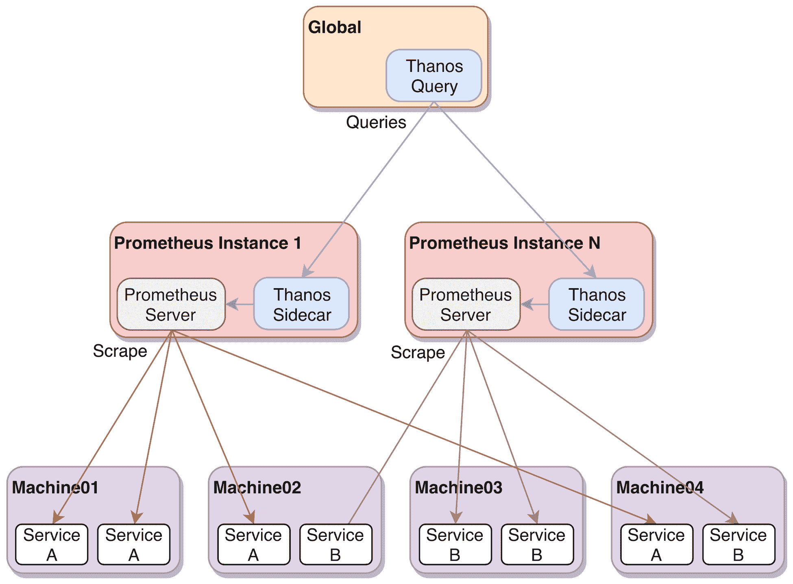

# 第十三章：扩展和联邦 Prometheus

Prometheus 被设计为单一服务器运行。这种方法可以让你处理成千上万的目标和数百万个时间序列，但随着扩展，你可能会发现这种方法不足以应对。在这一章中，我们将讨论这一需求，并阐明如何通过分片扩展 Prometheus。然而，分片使得获得全局视图变得更加困难。为了解决这个问题，我们还将介绍分片的优缺点、联邦是如何介入的，最后，我们将介绍 Thanos，这是由 Prometheus 社区创建的一个组件，旨在解决一些提出的问题。

简而言之，本章将涵盖以下主题：

+   本章的测试环境

+   利用分片扩展

+   通过联邦实现全局视图

+   使用 Thanos 来缓解 Prometheus 在大规模部署中的不足

# 本章的测试环境

在本章中，我们将重点讨论如何扩展和联合 Prometheus。为此，我们将部署三个实例，模拟一个全局 Prometheus 实例从另外两个实例收集度量数据的场景。这种方法不仅可以帮助我们探索所需的配置，还可以理解各个组件是如何协同工作的。

我们将使用的设置如下面的图表所示：


图 13.1：本章的测试环境

在下一节中，我们将解释如何启动和运行测试环境。

# 部署

要启动新的测试环境，请进入以下章节路径，该路径相对于代码库的根目录：

```
cd ./chapter13/
```

确保没有其他测试环境正在运行，并使用以下命令启动本章的环境：

```
vagrant global-status
vagrant up
```

你可以使用以下命令验证测试环境是否成功部署：

```
vagrant status
```

这将输出以下内容：

```
Current machine states:

shard01                   running (virtualbox)
shard02                   running (virtualbox)
global                    running (virtualbox)

This environment represents multiple VMs. The VMs are all listed above with their current state. For more information about a specific VM, run `vagrant status NAME`.
```

部署任务完成后，你可以使用你喜欢的支持 JavaScript 的网页浏览器，在主机上验证以下端点：

| **服务** | **端点** |
| --- | --- |
| Shard01 Prometheus | `http://192.168.42.10:9090` |
| Shard02 Prometheus | `http://192.168.42.11:9090` |
| 全局 Prometheus | `http://192.168.42.12:9090` |
| 全局 Thanos 查询器 | `http://192.168.42.12:10902` |

你应该能够使用相应的命令访问这些实例：

| **实例** | **命令** |
| --- | --- |
| Shard01 | `vagrant ssh shard01` |
| Shard02 | `vagrant ssh shard02` |
| 全局 | `vagrant ssh global` |

# 清理

测试完成后，只需确保你处于`./chapter13/`目录下，并执行以下命令：

```
vagrant destroy -f
```

不用太担心：如果需要，你可以很容易地再次启动环境。

# 利用分片扩展

随着业务增长，团队、基础设施和应用的增多，单一 Prometheus 服务器的运行开始变得不可行：记录/告警规则和抓取任务的变化变得更加频繁（因此需要重新加载，具体时间取决于配置的抓取间隔，可能需要几分钟），Prometheus 在处理大量数据时可能会错过一些抓取，或者负责该实例的人员或团队可能会成为组织流程中的瓶颈。出现这种情况时，我们需要重新思考解决方案的架构，以便其能够按需扩展。幸运的是，这是社区反复解决过的问题，因此已经有了一些关于如何处理此问题的建议。这些建议围绕着分片展开。

在这个背景下，分片意味着将抓取目标列表分配到两个或更多 Prometheus 实例中。这可以通过两种方式实现：垂直分片或水平分片。垂直分片是最常用的方法，它通过将抓取任务按照逻辑（例如按范围、技术、组织边界等）分配到不同的 Prometheus 实例中来实现，其中分片的单位是抓取任务。相对而言，水平分片是在抓取任务层级进行的，它意味着为每个任务配置多个 Prometheus 实例，每个实例抓取目标列表的一个子集。水平分片很少使用，因为抓取任务通常不会大到超出单个 Prometheus 实例的处理能力。

此外，我们并未考虑为每个数据中心/环境配置一个 Prometheus 实例作为分片；Prometheus 应该与其监控的系统/服务一起运行，以便减少带宽和延迟问题，同时提高系统的弹性（更不容易受到网络故障的影响）。

# 作业的逻辑分组

当单个 Prometheus 实例无法满足扩展需求时，一个好的起点是将抓取任务分为逻辑组，并将这些组分配到不同的 Prometheus 实例。这就是垂直分片。可以根据任何对你有意义的方式来分组：按架构/范围（前端、后端、数据库）、按层次（操作系统级指标、基础设施服务、应用程序）、按内部组织结构、按团队、按网络安全边界（以避免抓取跨越防火墙），甚至按应用集群分组。

以下图示例展示了这种垂直分片的实现方式：


图 13.2：展示垂直分片的示意图

这种分片方式还可以实现 Prometheus 实例之间的隔离，意味着从一组目标中提取的高频使用的部分指标可以被拆分到多个实例中，可能会有更多的资源。这样，任何由于高负载使用导致的负面副作用都能被限定在一定范围内，不会影响整体监控平台的稳定性。

此外，为每个团队执行垂直分片可以带来一些组织上的好处：

+   它使服务拥有者能更清楚地看到基数（cardinality）问题。

+   团队可以感到既有权力也有责任监控自己的服务。

+   它可以在不影响其他人的情况下，促进规则和仪表盘的更多实验。

# 单一作业规模问题

我们已经探讨了几种垂直分片 Prometheus 的策略，但还有一个问题我们尚未解决：与单一作业相关的扩展需求。假设你有一个作业，其中包含成千上万的抓取目标，且这些目标都位于同一个数据中心，并且没有合适的方式再进行进一步拆分。在这种情况下，最好的选择是进行水平分片，将相同的作业分布到多个 Prometheus 服务器上。以下示意图展示了这种类型的分片示例：


图 13.3：展示水平分片的示意图

为了实现这一点，我们必须依赖 `hashmod` 重标记操作。`hashmod` 的工作方式是通过将 `target_label` 设置为 `source_labels` 连接后哈希值的 `modulus`，然后将其放置在 Prometheus 服务器中。我们可以在我们的测试环境中看到这个配置在 `shard01` 和 `shard02` 中的实际应用，有效地将节点作业进行了分片。让我们查看以下配置，它可以在 `/etc/prometheus/prometheus.yml` 中找到：

```
...
scrape_configs:
  - job_name: 'node'
    static_configs:
      - targets: ['shard01:9100', 'shard02:9100', 'global:9100']
    relabel_configs:
      - source_labels: [__address__]
        modulus: 2 # Because we're using 2 shards
        target_label: __tmp_shard
        action: hashmod
      - source_labels: [__tmp_shard]
        regex: 0 # Starts at 0, so this is the first
       action: keep
...
```

使用临时标签时，像前面例子中那样，始终使用 `__tmp` 前缀，因为该前缀保证不会被 Prometheus 内部使用。

在以下截图中，我们可以看到 `shard01` 和 `shard02` Prometheus 实例并排显示的 `/service-discovery` 端点。`hashmod` 操作的结果使我们能够将节点导出器作业分配到两个实例，如图所示：


图 13.4：`shard01` 和 `shard02` */service-discovery* 端点展示 *hashmod* 结果

很少有人达到需要这种类型分片的规模，但很高兴知道 Prometheus 原生支持这一功能。

# 进行分片时需要考虑的事项

无论是垂直分片还是水平分片，分片策略在某些情况下是必需的，但不应轻视。管理多个 Prometheus 实例的多个配置的复杂性会迅速增加，如果没有相应地规划所需的自动化，这将使你的工作更加困难。诸如外部标签、外部 URL、用户控制台和抓取作业等内容可以通过编程设置，以减少维护分片的团队的运维工作。

拥有全球视角也会成为一个问题，因为每个 Prometheus 实例都会有自己的数据子集。这可能会使得仪表板的制作变得更加困难，因为数据的位置可能不会立即清晰（例如，当在 Grafana 中使用多个数据源时），还可能阻止一些查询聚合跨多个分片的服务。这个问题可以通过几种技术来缓解，我们将在本章稍后进行探讨。

最后，一些录制和告警规则可能变得不切实际，如果所需的时间序列不位于同一个分片中。例如，假设我们有一个包含操作系统级别指标的分片和另一个包含应用程序指标的分片。需要关联两个分片的指标的告警将会成为问题。这个问题可以通过仔细规划每个分片包含的内容来缓解，或者通过使用联邦使所需的指标在需要的地方可用，或者通过使用远程写入将数据写入外部系统，这些系统可以在 Prometheus 之外执行此操作（正如我们将在第十四章中看到的，*将长时存储与 Prometheus 集成*）。

# 分片的替代方案

如本章开头所述，单个 Prometheus 实例如果配置和使用得当，可以带来很大的帮助。避免高基数（high cardinality）指标应当是首要关注点，并且要尽量减少启动分片的需求。一种有助于保护 Prometheus 实例不被抓取产生不合理数量指标的目标的方法是定义每次抓取作业的最大样本摄取量。为此，你只需要在抓取作业中添加 `sample_limit`；如果在 `metric_relabel_configs` 后的样本数量超过配置的限制，抓取将会完全丢弃。以下是一个配置示例：

```
scrape_configs:
  - job_name: 'massive_job'
    sample_limit: 5000
    static_configs:
      - targets:
        - 'shard01:9999'
        - 'shard02:9999'
```

下图展示了当抓取达到配置的 `sample_limit` 时会发生什么：


图 13.5：Prometheus 目标端点显示由于超过样本限制而丢弃的抓取作业

在使用这个限制器时，你应该留意通过 `prometheus_target_scrapes_exceeded_sample_limit_total` 指标与 `up` 指标一起监控抓取是否被丢弃。后者告诉你 Prometheus 无法抓取目标，而前者则会告诉你原因。

如果丢弃抓取是不可接受的，并且你能够接受分辨率的损失，另一种选择是增加抓取间隔。请记住，你不应该将其增加到超过两分钟，因为这样做会增加由于单次抓取失败而导致指标过时的风险，正如我们在第五章中所解释的，*运行 Prometheus 服务器*。

# 使用联邦（federation）实现全球视角

当你有多个 Prometheus 服务器时，确定查询哪个服务器来获取特定的指标可能会变得相当繁琐。另一个很快出现的问题是如何从多个实例中汇总数据，可能还分布在多个数据中心。这时，联邦机制就派上了用场。联邦机制允许你拥有一个 Prometheus 实例，从其他实例中抓取选定的时间序列，实际上充当一个更高级别的汇总实例。这可以以层级的方式进行，每一层将下级实例的指标聚合成更大范围的时间序列，或者以跨服务的模式进行，在同一级别的实例中选择一些指标进行联邦，以便某些记录和告警规则成为可能。例如，你可以收集每个分片的服务吞吐量或延迟数据，然后跨所有分片进行聚合，得到一个全局值。

让我们来看看设置 Prometheus 联邦所需的内容，然后再深入讨论前述的每种联邦模式。

# 联邦配置

一个运行中的 Prometheus 服务器会暴露一个特别的端点 `/federate`。这个端点允许检索与一个或多个瞬时向量选择器匹配的时间序列（我们在第七章中讨论过，*Prometheus 查询语言 – PromQL*）。为了让这些机制更清晰，我们在测试环境中提供了一个非常简单的示例。每个分片实例都有一个记录规则，生成表示 HTTP 请求次数的汇总指标，示例如下代码块：

```
vagrant@shard01:~$ cat /etc/prometheus/rules.yml
groups:
  - name: recording_rules
    rules:
      - record: job:promhttp_metric_handler_requests:sum_rate1m
        expr: sum by (job) (rate(promhttp_metric_handler_requests_total[1m]))
```

为了提供全球视图，我们可以在测试环境中使用 `global` 实例，抓取两个分片的联邦端点，只请求那些汇总指标（所有以 `job:` 开头的指标），如下片段所示：

```
vagrant@global:~$ cat /etc/prometheus/prometheus.yml 
...
scrape_configs:
  - job_name: shards
    honor_labels: true
    metrics_path: /federate
    params:
      match[]:
        - '{__name__=~"job:.+"}'
    static_configs:
      - targets:
        - shard01:9090
        - shard02:9090
...
```

在这个片段中有几点需要注意。联邦使用与常规抓取任务相同的机制，但需要配置一个不同的抓取端点，以及一个 HTTP 参数来指定我们想要收集哪些指标。此外，设置 `honor_labels: true` 会确保所有原始标签值保持不变，永远不会被覆盖；这一点需要配置，否则 Prometheus 会将诸如 `instance` 和 `job` 等标签设置为抓取任务的值。

你可以在我们的测试环境中，通过访问 `http://192.168.42.12:9090/targets` 端点，检查聚合 Prometheus 实例中联邦目标的状态，如下所示：


图 13.6：Prometheus *targets* 端点，显示联邦服务器

我们还可以在全球 Prometheus Web 界面上测试度量指标的联邦：即使该实例没有抓取任何导出器，也没有录制规则，我们仍然可以从`job:promhttp_metric_handler_requests:sum_rate1m`指标中获取每个时间序列，这些指标最初是在每个分片实例中生成的。请注意，返回的`job`标签来自原始的作业，而不是联邦抓取作业。此外，我们可以看到我们在实例中配置为外部标签的`shard`标签也出现在这里；在`external_labels`部分定义的标签会自动添加到从`/federate`端点返回的指标中，具体如下：


图 13.7：全局 Prometheus 视图上的聚合指标

现在我们了解了联邦的工作原理，可以继续探讨联邦的常见模式和最佳实践。

# 联邦模式

在开始实现 Prometheus 联邦时，首先要注意的是，联邦指标集应该是预先聚合或手动选择的。试图通过联邦将大量数据或甚至每个指标从一个 Prometheus 实例导入到另一个实例通常是一个坏主意，原因有几个：

+   由于每次抓取时收集的数据量庞大，这将对生成指标的实例和消费指标的实例都产生负面性能影响。

+   由于抓取数据的摄取是原子性的，但不是隔离的，因此目标 Prometheus 实例可能会因为竞争条件而呈现出其时间序列的一个不完整快照：它可能正处于处理抓取作业的过程中，并会返回当时已处理的内容。这对于多系列的指标类型（如直方图和摘要）尤其相关。

+   更大的抓取更容易受到超时的影响，这将导致在进行联邦抓取的 Prometheus 实例中出现数据缺口。

+   试图将一个 Prometheus 实例的所有时间序列导入到另一个实例中，实际上违背了联邦的意义。如果问题只是代理指标，实际的代理服务器可能会是更好的选择。不过，最佳实践仍然是在你要监控的对象附近运行 Prometheus。

Prometheus 时间序列联邦的实现有两种主要方式：层次化和跨服务。如我们所见，这两种模式是互补的，可以一起使用。

# 层次化

拥有多个分片，甚至仅仅是多个数据中心，意味着时间序列数据现在分布在不同的 Prometheus 实例中。分层联合的目标是通过一个或多个 Prometheus 服务器收集来自其他 Prometheus 实例的高层次聚合时间序列来解决这个问题。你可以拥有超过两级的联合，尽管这需要较大的规模。这使得更高层次的 Prometheus 能够更广泛地查看基础设施及其应用程序。然而，由于只有聚合的度量数据应被联合，那些具有更多上下文和细节的度量数据仍然会保留在较低层次。下图展示了这一工作的方式：


图 13.8：分层联合示例图

例如，你可能希望查看跨多个数据中心的延迟。为满足这一需求，三层 Prometheus 层级结构可能如下所示：

+   一些垂直分片抓取多个作业

+   一个数据中心实例抓取这些分片，聚合在作业级别的时间序列（`__name__=~"job:.+"`）

+   一个全局 Prometheus，它抓取数据中心实例的时间序列，这些时间序列是在数据中心级别聚合的（`__name__=~"dc:.+"`）

当使用具有这种布局的监控平台时，通常从最高层开始，然后逐步深入到下一级。这可以通过 Grafana 很容易地实现，因为你可以将联合层级中的每一层配置为数据源。

告警规则应尽可能在它们使用的时间序列的源头附近执行，因为每个需要穿越的联合层都会在告警的关键路径中引入新的故障点。这一点在跨数据中心进行聚合时尤其如此，因为抓取可能需要通过不太可靠的网络，甚至是通过互联网连接。

# 跨服务

当你需要从另一个 Prometheus 实例本地获取一些特定的时间序列，用于记录或告警规则时，这种类型的联合非常有用。回到之前的示例场景，其中有一个 Prometheus 实例负责抓取 Node Exporters，另一个实例用于应用程序，这种模式可以让你联合特定的操作系统级别的度量数据，然后在应用程序的告警中使用，如下图所示：


图 13.9：跨服务联合示例图

跨服务联合的配置与之前的模式基本相同，但在这种情况下，抓取的 Prometheus 位于同一逻辑层级，所使用的选择器应匹配特定的度量数据，而不是聚合数据。

在接下来的章节中，我们将介绍一个在 Prometheus 社区中逐渐受到关注的新组件，它通过一种新颖有趣的方式解决了全局视图的问题。

# 使用 Thanos 来缓解 Prometheus 在大规模时的不足

当你开始扩展 Prometheus 时，你很快会遇到跨分片可见性的问题。事实上，Grafana 可以提供帮助，因为你可以在同一个仪表板面板中添加多个数据源，但这变得越来越难以维护，尤其是当多个团队有不同的需求时。在没有明确界定边界的情况下，追踪哪个分片包含哪个指标可能并不简单——当每个团队只关心自己的指标时，如果每个团队都有一个分片，这可能不是问题，但当多个分片由同一个团队维护并作为服务向组织公开时，就会出现问题。

此外，通常的做法是运行两个相同的 Prometheus 实例，以防止告警路径中的单点故障（SPOF）——这种做法被称为 HA（高可用性）对。这进一步复杂化了仪表板的使用，因为每个实例会有略微不同的数据（尤其是在计量指标方面），并且负载均衡器分配查询时，会导致仪表板数据刷新时出现不一致的结果。

幸运的是，一个项目已经启动，旨在解决这个具体问题——这个项目被称为 Thanos。它在 Improbable I/O 开发，并由 Fabian Reinartz（Prometheus 2.x 中新存储引擎/时间序列数据库的作者）合作开发。

Prometheus 有一个明确的作用范围；例如，它不是为集群设计的，到目前为止所做的所有决策始终以可靠性和性能为首要目标。这些设计选择是 Prometheus 成功的基石之一，使它能够从处理少量目标的简单部署扩展到每秒处理百万级采样的大型实例，但这些选择几乎总是伴随着权衡。虽然 Prometheus 确实提供了一些变通方法来实现功能而不依赖共享状态（如我们之前看到的通过联合），但这样做也有限制，比如必须选择要联合的指标。在这些情况下，出现了一些创意解决方案，试图克服这些限制。Thanos 就是一个优雅的例子，正如我们稍后会看到的那样。

我们将在第十四章中讨论更多 Thanos 的功能，*将长期存储与 Prometheus 集成*，但目前我们将重点关注这个项目的全局查询方面。

# Thanos 的全局视图组件

要使用 Thanos 实现全局视图，我们必须首先了解一些其组件。像 Prometheus 一样，Thanos 是用 Go 编写的，并且提供一个单一的二进制文件（针对每个平台/架构），其行为会根据执行时提供的子命令不同而有所不同。在我们的案例中，我们将扩展讨论 sidecar 和 Query 组件。

你可以在[`github.com/improbable-eng/thanos`](https://github.com/improbable-eng/thanos)上找到 Thanos 的所有源代码和安装文件。

简而言之，sidecar 使 Prometheus 实例中的数据对其他 Thanos 组件可用，而 Query 组件则是一个 API 兼容的 Prometheus 替代品，将它收到的查询分发给其他 Thanos 组件，如 sidecar 或其他 Query 实例。从概念上讲，Thanos 所采用的全局视图方法类似于以下示意图：



图 13.10：带有 Thanos 示例图的全局视图

可以返回查询结果的 Thanos 组件实现了所谓的 *store API*。当请求命中 Thanos 查询器时，它将分发到为其配置的所有存储 API 节点，在我们的示例中就是使各自 Prometheus 服务器中的时间序列可用的 Thanos sidecars。查询器将整理这些响应（能够聚合分散的数据或去重数据），然后对数据集执行所需的 PromQL 查询。去重功能在使用 Prometheus 服务器对提高可用性时特别有用。

现在，让我们深入了解这些组件，深入研究它们如何工作以及如何设置它们。

# Sidecar

sidecar 组件旨在与 Prometheus 一起本地部署，并通过其远程读取 API 与 Prometheus 连接。Prometheus 的远程读取 API 允许与其他系统集成，以便它们可以像查询本地可用的样本一样访问样本。这显然在查询路径中引入了网络，可能会导致带宽相关问题。sidecar 利用这一点将 Prometheus 中的数据提供给其他 Thanos 组件。它将存储 API 作为 gRPC 端点暴露（默认绑定到端口 `10901`），然后 Thanos 查询组件将使用这个端点，从查询者的角度来看，sidecar 变成了一个数据存储。sidecar 还在端口 `10902` 上暴露了一个 HTTP 端点，并提供了一个用于 `/metrics` 的处理程序，以便您可以在 Prometheus 中收集其内部指标。

sidecar 附加到的 Prometheus 实例必须设置 `external_labels`，以便每个实例都有唯一标识。这对 Thanos 过滤出要查询的存储 API 和去重功能至关重要。

不幸的是，具有唯一外部标签会在使用一对 Prometheus 实例以提高可用性时破坏 Alertmanager 的去重功能。您应在 `alerting` 部分使用 `alert_relabel_configs` 来删除每个 Prometheus 实例特有的标签。

在我们的测试环境中，我们可以发现每个可用的分片中都有一个 Thanos sidecar 正在运行。为了快速验证正在使用的配置，我们可以在任何一个分片实例中运行以下指令：

```
vagrant@shard01:~$ systemctl cat thanos-sidecar
...
ExecStart=/usr/bin/thanos sidecar \
           --prometheus.url "http://localhost:9090"
...
```

上面的代码片段表明，sidecar 正在连接到本地的 Prometheus 实例。sidecar 提供了更多的功能，正如我们将在下一章中看到的那样，但为了实现全局视图，这个配置已经足够。

# Query

查询组件实现了 Prometheus HTTP API，使得 PromQL 表达式可以在所有配置的 Thanos 存储 API 上运行。它还包括一个查询的 web 界面，基于 Prometheus 自己的 UI，并做了一些小的改动，让用户感觉更加熟悉。该组件是完全无状态的，可以水平扩展。由于兼容 Prometheus API，它可以直接作为 Prometheus 类型的数据源在 Grafana 中使用，实现对 Prometheus 查询的无缝替代。

这个 Thanos 组件也在我们的测试环境中运行，特别是在 *global* 实例中，其配置可以通过运行以下指令查看：

```
vagrant@global:~$ systemctl cat thanos-query
...
ExecStart=/usr/bin/thanos query \
            --query.replica-label "shard" \
            --store "shard01:10901" \
            --store "shard02:10901"
...
```

如前面的代码片段所示，我们需要指定所有包含存储 API 的组件，才能通过查询器提供它们。由于我们大多数使用的是该组件的默认值，web 界面可在端口 `10902` 上访问，我们可以通过将浏览器指向 `http://192.168.42.12:10902/stores` 来验证，正如以下截图所示：


图 13.11: Thanos 查询 web 界面显示 `/stores` 端点

查询器的 HTTP 端口还提供 Prometheus 指标收集的 `/metrics` 端点。

`--query.replica-label` 标志允许使用特定的 Prometheus 外部标签进行指标去重。例如，我们在 `shard01` 和 `shard02` 上有完全相同的 `icmp` 作业，并且这两个作业都有一个 `shard` 外部标签来唯一标识它们。如果没有去重，我们在进行查询时将看到每个指标有两个结果，因为这两个 sidecar 都有相关数据。通过将 `shard` 标记为标识副本的标签，查询器可以选择其中一个结果。我们可以通过应用程序编程接口（在 `GET` 参数中发送 `dedup=true`）或 web 界面（选择 **去重** 选项）来切换去重功能，这取决于我们是否希望包括所有存储 API 的指标，还是只获取单一结果，仿佛只有一个 Prometheus 实例拥有该数据。以下截图展示了这一差异：


图 13.12: Thanos 查询去重功能禁用和启用

默认启用去重功能，使得查询器可以无缝地替代 Prometheus 进行查询服务。这样，上游系统，如 Grafana，可以继续正常工作，而不会意识到查询层已经发生变化。

# 概述

在本章中，我们解决了在大规模环境中运行 Prometheus 时的问题。尽管单个 Prometheus 实例可以让你走得很远，但如果有需要，具备扩展知识是一个好主意。我们学习了垂直和水平切片的工作原理，何时使用切片，以及切片带来的好处和问题。我们还了解了在联邦 Prometheus 时常见的模式（层次型或跨服务型），以及如何根据我们的需求选择它们。由于有时我们需要的不仅仅是开箱即用的联邦功能，我们还介绍了 Thanos 项目及其如何解决全局视图问题。

在下一章中，我们将探讨另一个常见需求，这个需求并不是 Prometheus 项目的核心问题，那就是时间序列的长期存储。

# 问题

1.  什么时候应该考虑切片 Prometheus？

1.  垂直切片和水平切片有什么区别？

1.  在选择切片策略之前，你可以做些什么？

1.  哪种类型的指标最适合以层次型模式进行联邦？

1.  为什么你可能需要跨服务联邦？

1.  Thanos 查询器与 sidecar 之间使用什么协议？

1.  如果 Thanos 查询器中没有设置副本标签，而该查询器配置了与 Prometheus HA 对一起运行的 sidecar，那么执行的查询结果会发生什么？

# 进一步阅读

+   **扩展和联邦 Prometheus**：[`www.robustperception.io/scaling-and-federating-prometheus`](https://www.robustperception.io/scaling-and-federating-prometheus)

+   **Thanos 组件**：[`github.com/improbable-eng/thanos/tree/master/docs/components`](https://github.com/improbable-eng/thanos/tree/master/docs/components)

+   **萨诺斯 - 大规模的 Prometheus**：[`improbable.io/blog/thanos-prometheus-at-scale`](https://improbable.io/blog/thanos-prometheus-at-scale)
