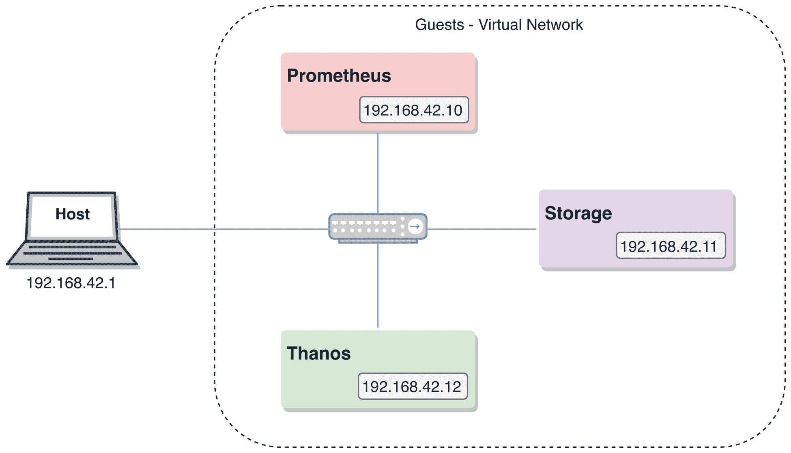
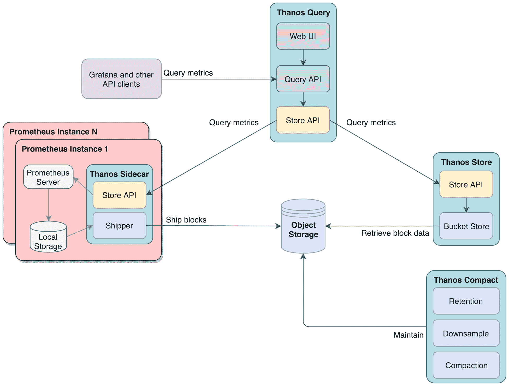
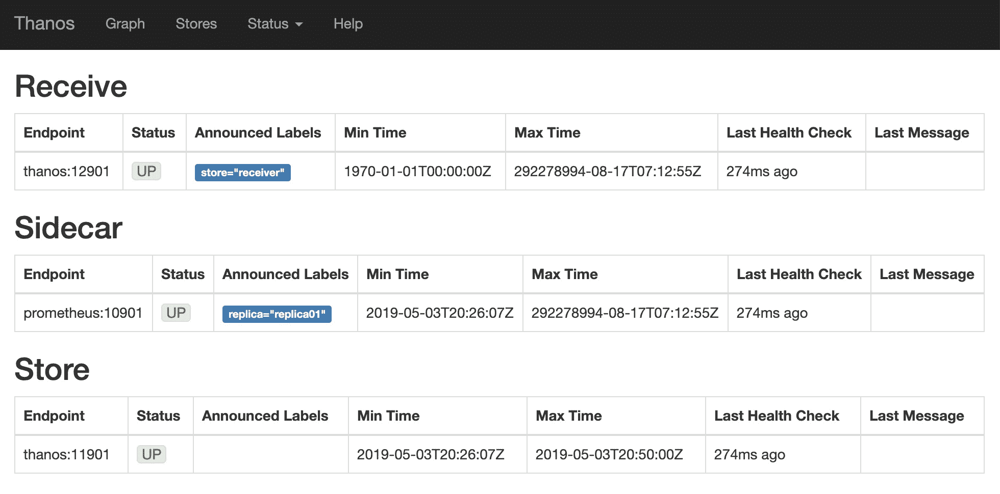
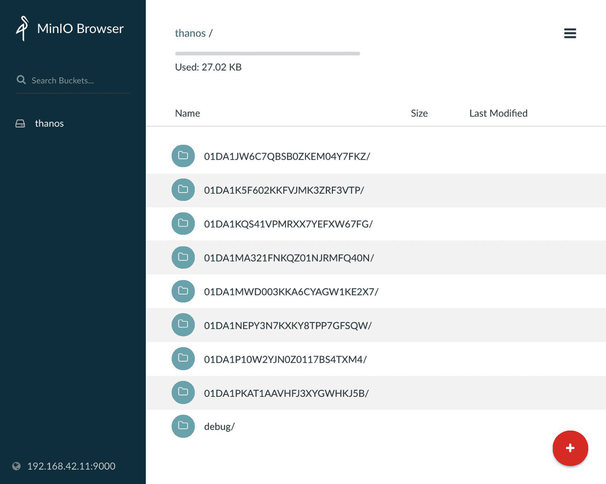
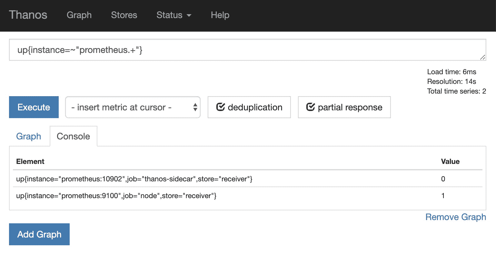

# 第十四章：将长期存储与 Prometheus 集成

Prometheus 的单实例设计使其不适合维护大量历史数据集，因为它受限于本地可用的存储空间。拥有跨越较长时间段的时间序列可以进行季节性趋势分析和容量规划，因此，当数据集无法适应本地存储时，Prometheus 通过将数据推送到第三方集群存储系统来解决这一问题。在本章中，我们将探讨远程读取和写入 API，以及如何借助 Thanos 将指标发送到对象存储。这将提供多种处理这一需求的选项，支持多种架构选择。

简而言之，本章将涵盖以下主题：

+   本章的测试环境

+   远程写入与远程读取

+   指标存储选项

+   Thanos 远程存储与生态系统

# 本章的测试环境

本章将重点讨论集群存储。为此，我们将部署三个实例，模拟一个 Prometheus 生成指标的场景，然后我们将讨论如何将它们存储到对象存储解决方案中。这种方法不仅能帮助我们探索所需的配置，还能了解各部分如何协同工作。

我们将使用的设置类似于以下图示：



图 14.1：本章的测试环境

在下一节中，我们将解释如何启动和运行测试环境。

# 部署

要启动一个新的测试环境，请进入以下路径，相对于仓库根目录，如下所示：

```
cd ./chapter14/
```

确保没有其他测试环境正在运行，并启动本章的环境，展示如下：

```
vagrant global-status
vagrant up
```

你可以使用以下命令验证测试环境是否成功部署：

```
vagrant status
```

这将输出以下内容：

```
Current machine states:

prometheus                running (virtualbox)
storage                   running (virtualbox)
thanos                    running (virtualbox)

This environment represents multiple VMs. The VMs are all listed above with their current state. For more information about a specific VM, run `vagrant status NAME`.
```

部署任务完成后，你将能够通过你最喜欢的支持 JavaScript 的网页浏览器，在你的主机上验证以下端点：

| **服务** | **端点** |
| --- | --- |
| Prometheus | `http://192.168.42.10:9090` |
| Thanos sidecar | `http://192.168.42.10:10902` |
| 对象存储`访问密钥: strongACCESSkey``密钥: strongSECRETkey` | `http://192.168.42.11:9000` |
| Thanos 查询器 | `http://192.168.42.12:10902` |

你应该能够使用以下命令之一访问所需的实例：

| **实例** | **命令** |
| --- | --- |
| Prometheus | `vagrant ssh prometheus` |
| 存储 | `vagrant ssh storage` |
| Thanos | `vagrant ssh thanos` |

# 清理

测试完成后，确保你在`./chapter14/`目录内并执行以下命令：

```
vagrant destroy -f
```

不用太担心；如果需要的话，你可以轻松地重新启动环境。

# 远程写入与远程读取

远程写入和远程读取分别允许 Prometheus 推送和拉取样本：远程写入通常用于实现远程存储策略，而远程读取则允许 PromQL 查询透明地针对远程数据。在接下来的主题中，我们将详细介绍这些功能，并展示它们可以应用的一些示例。

# 远程写入

远程写入是 Prometheus 非常需要的一个功能。它最初作为对 openTSDB、InfluxDB 和 Graphite 数据格式的样本发送的原生支持实现。然而，很快就做出了决定，不再支持每一个可能的远程系统，而是提供一个通用的写入机制，适用于构建自定义适配器。这使得与 Prometheus 开发路线图解耦的自定义集成成为可能，同时也为这些桥接中支持读取路径打开了可能性。远程写入的系统特定实现从 Prometheus 二进制文件中移除，并作为示例转化为独立的适配器。依赖适配器并赋能社区以构建所需的任何集成的逻辑，遵循了我们在第十二章中讨论的哲学——*选择合适的服务发现*，用于构建自定义服务发现集成。

自定义远程存储适配器的官方示例可以在[`github.com/prometheus/prometheus/tree/master/documentation/examples/remote_storage/remote_storage_adapter`](https://github.com/prometheus/prometheus/tree/master/documentation/examples/remote_storage/remote_storage_adapter)找到。

Prometheus 将单个样本发送到远程写入端点，使用一种非常简单的格式，这种格式与 Prometheus 的内部实现无关。另一端的系统可能甚至不是一个存储系统，而是一个流处理器，如 Kafka 或 Riemann。当定义远程写入设计时，这是一个艰难的决定，因为 Prometheus 已经知道如何创建高效的块并可以直接将其发送。块会使支持流系统变得不切实际，而发送样本在适配器方面既更易于理解，也更易于实现。

远程写操作在 Prometheus 2.8 发布时得到了重大增强。此前，当指标未能成功传送到远程写入端点（由于网络或服务问题）时，只有一个小缓冲区用于存储数据。如果缓冲区被填满，指标将被丢弃，并且永久丢失在那些远程系统中。更糟糕的是，缓冲区可能会造成背压，导致 Prometheus 服务器由于 **内存溢出** (**OOM**) 错误而崩溃。自从远程写 API 开始依赖 **预写日志** (**WAL**) 来进行账务处理后，这种情况不再发生。远程写操作现在直接从 WAL 中读取数据，WAL 包含所有正在进行的事务和抓取的样本。在远程写子系统中使用 WAL 使 Prometheus 的内存使用更加可预测，并允许它在与远程系统的连接中断后从中断点继续。

配置方面，以下代码片段展示了在 Prometheus 中设置远程写入端点所需的最小代码：

```
remote_write:
  - url: http://example.com:8000/write
```

由于远程写操作是与外部系统交互的另一种形式，`external_labels` 也会在发送数据之前应用于样本。这也可以防止在使用多个 Prometheus 服务器将数据推送到相同位置时，远端发生指标冲突。远程写操作还支持 `write_relabel_configs`，允许您控制哪些指标被发送，哪些被丢弃。此重新标签化操作在应用外部标签之后进行。

本章稍后我们将讨论一个相对较新（且实验性的）Thanos 组件，称为 **receiver**，它作为远程写操作的实际应用示例。

# 远程读取

在远程写功能推出后，远程读取的请求开始增加。试想一下，将 Prometheus 数据发送到远程端点，然后不得不学习一种新的查询语言，如 InfluxQL（InfluxDB 查询语言），以访问上述数据。这个功能的引入使得可以透明地使用 PromQL 来查询存储在 Prometheus 服务器外部的数据，就像它是本地可用的那样。

针对远程数据执行的查询是集中评估的。这意味着远程端点只会发送请求的匹配器和时间范围的数据，PromQL 会在发起查询的 Prometheus 实例中应用。再次强调，选择集中式（而非分布式）查询评估是设计 API 时的一个关键决策。分布式评估本可以分担每个查询的负载，但会迫使远程系统理解和评估 PromQL，并处理数据非互斥时的各种边界情况，极大地增加了前述系统的实现复杂性。集中评估还允许远程系统对请求的数据进行下采样，从而显著提高了处理非常长时间范围查询的效率。

远程读取有一个典型的应用场景，即帮助在 Prometheus 的主要版本之间迁移，比如从 Prometheus *v1* 迁移到 Prometheus *v2*。后者可以配置为从前者进行远程读取，从而使旧实例成为只读（不配置抓取任务）。这将 *v1* 实例作为一种强化的远程存储，直到它的指标不再有用。实施这一策略时，一个常见的陷阱是，配置了远程读取的 Prometheus 实例的 `external_labels` 需要与被读取的 Prometheus 实例的 `external_labels` 匹配。

另一方面，在上一章（第十三章，*扩展与联邦化 Prometheus*）中，已经展示了 Prometheus 自身的远程读取端点示例：Thanos 侧车使用本地 Prometheus 实例的远程读取 API 来获取 Thanos 查询器请求的时间序列数据。

在配置方面，设置 Prometheus 进行远程读取非常简单。以下代码段展示了配置文件中需要的部分：

```
remote_read:
  - url: http://example.com:8000/read
```

`remote_read` 部分还允许你使用 `required_matchers` 指定一个匹配器列表，这些匹配器需要出现在选择器中，以查询给定的端点。这对于不是存储的远程系统或仅将部分指标写入远程存储时非常有用，因此需要限制远程读取到这些指标。

# 指标存储的选项

默认情况下，Prometheus 很好地管理着本地存储的指标，使用它自己的 TSDB。但也有一些情况是它无法满足的：本地存储受限于 Prometheus 实例的本地磁盘空间，对于较长的保存周期（如多年）以及超出实例附加磁盘空间容量的大量数据来说，这并不理想。在接下来的部分中，我们将讨论本地存储方法，以及当前可用的远程存储选项。

# 本地存储

Prometheus 的开箱即用时间序列数据存储解决方案就是本地存储。它更易于理解和管理：数据库存在于一个单独的目录中，便于备份、恢复或在需要时销毁。通过避免集群化，Prometheus 确保在面临网络分区时仍能保持正常行为；你不希望在最需要的时候，监控系统突然崩溃。高可用性通常通过简单地运行两个配置相同、各自拥有独立数据库的 Prometheus 实例来实现。然而，这种存储解决方案并不能涵盖所有使用场景，且存在一些不足之处：

+   它不具备持久性——在容器编排部署中，如果没有使用持久化卷，收集的数据会在容器重新调度时消失（因为之前的数据被销毁，当前数据会重新开始），而在虚拟机部署中，数据的持久性与本地磁盘一样。

+   它不能水平扩展——使用本地存储意味着你的数据集只能大到你为实例提供的磁盘空间。

+   它并不是为了长期存储设计的，尽管在适当的度量标准和基数控制下，商品存储能够走得很远。

这些不足之处是为了确保小型和中型部署（这些部署是最常见的使用场景）能够良好运行，同时也能使得高级和大规模的使用场景成为可能，而做出的折中。告警和仪表盘，在日常操作监控或排查正在进行的事件时，只需要最多几周的数据。

在全力投入到一个远程度量存储系统用于长期存储之前，我们可以考虑通过使用 TSDB 管理 API 端点来管理本地存储，也就是 `snapshot` 和 `delete_series`。这些端点有助于保持本地存储的可控性。正如我们在第五章《运行 Prometheus 服务器》中提到的，TSDB 管理 API 默认情况下不可用；Prometheus 需要启动时带上 `--web.enable-admin-api` 标志才能启用该 API。

在本章的测试环境中，你可以尝试使用这些端点，并评估它们的目标。通过连接到 `prometheus` 实例，我们可以验证 TSDB 管理 API 是否已经启用，并使用以下命令查找本地存储路径：

```
vagrant@prometheus:~$ systemctl cat prometheus
...
    --storage.tsdb.path=/var/lib/prometheus/data \
    --web.enable-admin-api \
...
```

向 `/api/v1/admin/tsdb/snapshot` 端点发出 HTTP `POST` 请求将触发一个新的快照，快照会将可用的块存储在一个快照目录中。快照是使用硬链接创建的，这使得它们在 Prometheus 仍然保留这些块的情况下非常节省空间。以下说明展示了所有过程是如何处理的：

```
vagrant@prometheus:~$ curl -X POST http://localhost:9090/api/v1/admin/tsdb/snapshot
{"status":"success","data":{"name":"20190501T155805Z-55d3ca981623fa5b"}}

vagrant@prometheus:~$ ls /var/lib/prometheus/data/snapshots/
20190501T155805Z-55d3ca981623fa5b
```

然后，你可以备份快照目录，当需要查询历史数据时，可以通过 `--storage.tsdb.path` 将其用作另一个 Prometheus 实例的 TSDB 存储路径。请注意，可能需要根据你的数据存储时间调整 `--storage.tsdb.retention.time`，因为 Prometheus 可能会开始删除超出保留期的块。

当然，这并不会阻止 TSDB 的增长。为了管理这一方面，我们可以使用`/api/v1/admin/tsdb/delete_series`端点，这对每周甚至每日的维护都很有用。它通过 HTTP POST 请求操作，并携带一组匹配选择器，标记所有符合条件的时间序列以供删除，如果发送了时间范围，还可以选择将删除限制在给定的时间窗口内。下表提供了相关 URL 参数的概述：

| **URL 参数** | **描述** |
| --- | --- |
| `match[]=<selector>` | 一个或多个匹配选择器，例如`match[]={__name__=~"go_.*"}`（删除所有名称以`go_`开头的度量） |
| `start=<unix_timestamp>` | 删除的开始时间，采用 RFC 3339 或 Unix 格式（可选，默认值为最早时间） |
| `end=<unix_timestamp>` | 删除的结束时间，采用 RFC 3339 或 Unix 格式（可选，默认值为最新时间） |

在执行`POST`请求后，会返回 HTTP `204`。这并不会立即释放磁盘空间，因为它需要等到下一个 Prometheus 压缩事件。你可以通过请求`clean_tombstones`端点强制进行清理，以下是相关的操作示例：

```
vagrant@prometheus:~$ curl -X POST -w "%{http_code}\n" --globoff 'http://localhost:9090/api/v1/admin/tsdb/delete_series?match[]={__name__=~"go_.*"}'
204

vagrant@prometheus:~$ curl -X POST -w "%{http_code}\n" http://localhost:9090/api/v1/admin/tsdb/clean_tombstones
204
```

这些知识可能帮助你控制本地存储，避免在关注点主要是可扩展性时进入复杂且耗时的替代方案。

# 远程存储集成

选择远程度量存储不应轻视，因为它有多个影响因素。选择远程存储解决方案时需要考虑的一些因素如下：

+   **成熟度**：一些存储解决方案比其他的更成熟且维护得更好。

+   **控制**：有些解决方案是由你自己运行实例的，而另一些则是 SaaS 服务。

+   **可用性、可靠性与可扩展性**：如果选择内部管理存储解决方案，你需要考虑这些方面。

+   **可维护性**：一些选项的部署和/或维护非常复杂。

+   **远程读写**：你是否真的需要同时支持读写，还是仅写操作足以满足你的用例？

+   **成本**：这一切可能归结于此；我们定义成本不仅仅是指金钱，还包括学习、测试和操作解决方案所需的时间。

另一个关键因素与告警相关。为了确保可靠性，规则应该只查询本地数据；这样可以防止网络层的瞬时故障对规则评估产生负面影响。因此，远程存储系统中的数据不应用于关键告警，至少你应当能够容忍它们的缺失。

如果你所处理的规模要求可扩展的存储，或者历史数据对你的用例至关重要，例如用于容量规划，那么有一些可用的选项。官方 Prometheus 文档提供了一个详尽的已知远程存储集成列表，网址为[`prometheus.io/docs/operating/integrations/#remote-endpoints-and-storage`](https://prometheus.io/docs/operating/integrations/#remote-endpoints-and-storage)。这个列表涵盖了多种不同的用例：SaaS 服务（如 SignalFX 和 Splunk）；流处理系统（Kafka）；不同的时序数据库——包括付费（IRONdb）和开源（InfluxDB、Cortex、TimescaleDB、M3DB 等）；其他监控系统（OpenTSDB、Graphite）；甚至是通用数据存储（如 Elasticsearch 和 TiKV）。其中很多支持远程读写功能。有些甚至值得单独写一本书来介绍。

有趣的是，我们将深入探讨的解决方案在写作时并不在上述列表中，因为它采用了与我们处理问题的方式完全不同的策略。事实上，Prometheus 根本不需要了解它，因为它像一个覆盖层一样工作。我们将专注于最有前景的长期存储解决方案，它在复杂性、成本和功能集之间达到了优美的平衡：Thanos。

# Thanos 远程存储和生态系统

在第十三章《扩展和联邦 Prometheus》中，我们介绍了 Thanos，这是一个开源项目，旨在改进 Prometheus 在大规模使用中的一些不足之处。具体来说，我们探讨了 Thanos 如何使用 Thanos sidecar 和 querier 组件解决多个 Prometheus 实例的全局视图问题。现在是时候了解其他 Thanos 组件，并探索它们如何协同工作，以通过对象存储实现廉价的长期数据保留。请记住，在走这条路径时，复杂性会增加，因此请验证你的需求，并考虑全局视图方法和本地存储是否足以满足你的特定用例。

# Thanos 生态系统

除了我们之前介绍的 Thanos querier 和 sidecar，Thanos 生态系统中还有其他一些组件。所有这些组件共存在同一个二进制文件中，并通过调用不同的子命令运行，稍后我们会列举它们：

+   `query`：通常被称为 *querier*，它是一个守护进程，负责将查询分发出去并对配置的 StoreAPI 端点返回的结果进行去重。

+   `sidecar`：一个守护进程，暴露一个 StoreAPI 端点，用于访问本地 Prometheus 实例中的数据，并将前述实例的 TSDB 数据块传输到对象存储。

+   `store`：一个守护进程，充当远程存储的网关，暴露一个 StoreAPI 端点。

+   `compact`：通常被称为 *compactor*，这个守护进程负责压缩对象存储中可用的块，并创建新的下采样时序数据。

+   `bucket`：一个命令行工具，用于验证、恢复和检查存储在对象存储中的数据。

+   `receive`：也叫*receiver*，它是一个守护进程，接受来自 Prometheus 实例的远程写入，通过 StoreAPI 端点暴露推送的数据，并将数据块发送到对象存储。

+   `rule`：通常称为*ruler*，它是一个守护进程，用于评估 Prometheus 规则（记录和告警），并通过远程 StoreAPI 端点进行评估，暴露自己的 StoreAPI 以便查询评估结果，将结果发送到对象存储，并连接到 Alertmanager 集群以发送警报。

你可以在[`github.com/improbable-eng/thanos`](https://github.com/improbable-eng/thanos)找到所有 Thanos 的源代码和安装文件。

以下所有组件协同工作，解决了多个挑战：

+   **全局视图**：从同一个地方查询所有 Prometheus 实例，同时对返回的时间序列进行聚合和去重。

+   **降采样**：如果样本以完整分辨率返回，查询数月甚至数年的数据会成为问题；通过自动创建降采样数据，跨越长时间段的查询变得可行。

+   **规则**：支持创建全局警报和记录规则，能够混合来自不同 Prometheus 分片的度量数据。

+   **长期保存**：通过利用对象存储，将存储的持久性、可靠性和可扩展性问题委托给监控栈之外的系统。

虽然我们将提供如何使用 Thanos 应对这些挑战的简要介绍，但我们的主要关注点将是 Thanos 的长期存储方面。

从存储角度来看，Thanos 项目选择了对象存储来进行长期数据保存。大多数云服务提供商都提供这一服务，且还额外确保**服务水平协议**（**SLA**）。对象存储通常在任何顶级云服务商上都有 99.999999999%的持久性和 99.99%的可用性。如果你有自己的本地基础设施，也有一些可用的选择：使用 Swift（提供对象存储 API 的 OpenStack 组件），或者甚至是 MinIO 项目，这是我们在本章测试环境中使用的。大多数这些本地对象存储解决方案都具有相同的特点：它们提供的 API 模仿了广为人知的 AWS S3，因为有许多工具都支持它。此外，云服务提供商的对象存储通常是一个非常具成本效益的解决方案。

以下图表提供了一个简单的概览，展示了使用 Thanos 实现 Prometheus 时间序列数据长期保存所需的核心组件：



图 14.2：Thanos 长期存储架构概览

正如我们在前面的图表中看到的，我们只需要一些 Thanos 组件来应对这个挑战。在接下来的主题中，我们将详细介绍每个组件，并扩展它在整体设计中的作用。

# Thanos 组件

现在我们已经看到 Thanos 长期存储架构的概述，是时候了解所有可用的 Thanos 组件了。除了介绍每个组件之外，我们还将强调那些在测试环境中可用的组件，详细说明它们在生态系统中的作用及其配置。

你可以在[`github.com/improbable-eng/thanos/tree/master/examples`](https://github.com/improbable-eng/thanos/tree/master/examples)找到一些社区驱动的警报和仪表盘。

# 测试环境细节

正如本书开头所述，使用提供的测试环境不会产生任何费用。因此，由于我们需要一个对象存储桶来进行示例，我们依赖于一个名为 MinIO 的项目，它提供了一个兼容 S3 的 API；你可以在[`min.io/`](https://min.io/)找到更多关于它的信息。在配置方面，存储端点应该在存储实例中以以下设置可用：

```
vagrant@storage:~$ systemctl cat minio
...
EnvironmentFile=/etc/default/minio
ExecStart=/usr/bin/minio server $MINIO_OPTS $MINIO_VOLUMES
...
```

上述的`systemd`单元文件加载了以下环境变量：

```
vagrant@storage:~$ sudo cat /etc/default/minio 
MINIO_VOLUMES='/var/lib/minio/data'
MINIO_OPTS='--address :9000'
MINIO_ACCESS_KEY='strongACCESSkey'
MINIO_SECRET_KEY='strongSECRETkey'
```

为了确保你不必等两个小时才能将块数据传输到对象存储，我们的测试环境中的 Prometheus 服务器已设置如下：

```
vagrant@prometheus:~$ systemctl cat prometheus
...
    --storage.tsdb.max-block-duration=10m \
    --storage.tsdb.min-block-duration=10m
...
```

此配置更改了块的持续时间，将它们刷写到磁盘的间隔从默认的两个小时更改为十分钟。虽然设置如此低的值对测试此特性非常有用，但对于其他任何情况，这种做法都是完全不建议的。为了让这一点更加明确，除了测试外，没有任何理由将这些值更改为其他任何值，除了两个小时。

了解了本章测试环境的细节后，我们可以继续介绍每个单独的 Thanos 组件。

# Thanos 查询

在第十三章，*扩展和联邦 Prometheus*中，我们有机会探索 Thanos 查询器和 sidecar 来解决全局视图问题。对于这个组件，我们当时介绍的功能将在本章中继续使用。我们将继续使用查询器查询多个 StoreAPI 端点，利用它提供的去重功能，并通过其 Web 界面使用查询 API。

我们在测试环境中可用的配置非常简单，正如我们在以下代码片段中看到的，这来自`thanos`实例：

```
vagrant@thanos:~$ systemctl cat thanos-query
...
ExecStart=/usr/bin/thanos query \
            --query.replica-label replica \
            --store "prometheus:10901" \
            --store "thanos:11901" \
            --store "thanos:12901"
...
```

正如你在之前的代码片段中看到的，我们指定了多个`--store`端点。为了了解每个端点的具体作用，我们可以将浏览器指向 Thanos 查询器的 Web 界面，地址是[`192.168.42.12:10902/stores`](http://192.168.42.12:10902/stores)，在界面上查看可用的存储，如下图所示：



图 14.3：Thanos 查询器 /stores 端点

之前的截图展示了我们测试环境中所有可用的存储 API。这些将是你在 Thanos 查询器中执行查询时使用的数据源。

# Thanos sidecar

除了之前讨论的 Thanos sidecar 暴露的 Store API，该组件还能够从磁盘收集 TSDB 块并将其传输到对象存储桶中。这使得你可以通过将历史数据保存在持久介质中来减少 Prometheus 服务器的保留数据。为了使用 sidecar 中的块上传功能，`--storage.tsdb.min-block-duration` 和 `--storage.tsdb.max-block-duration` 标志需要设置为相同的值（两个小时，以匹配默认行为），以便禁用 Prometheus 的本地压缩。

当前使用的配置文件可以在 `prometheus` 实例中查看，并可以通过执行以下命令进行检查：

```
vagrant@prometheus:~$ systemctl cat thanos-sidecar
...
ExecStart=/usr/bin/thanos sidecar \
           --log.level debug \
           --prometheus.url "http://localhost:9090" \
           --tsdb.path "/var/lib/prometheus/data" \
           --objstore.config-file "/etc/thanos/storage.yml"
...
```

如我们所见，`--objstore.config-file` 标志加载了所有必需的配置文件，以便将 TSDB 块传输到对象存储桶中，例如桶名称（在我们的案例中是 `thanos`）、存储端点和访问凭证。以下是该文件的内容：

```
vagrant@prometheus:~$ sudo cat /etc/thanos/storage.yml
type: S3
config:
  bucket: 'thanos'
  endpoint: 'storage:9000'
  insecure: true
  signature_version2: true
  access_key: 'strongACCESSkey'
  secret_key: 'strongSECRETkey'
```

在我们的 Prometheus 测试实例中，每 10 分钟会生成一个新的 TSDB 块，Thanos sidecar 会负责将其传输到对象存储端点。我们可以通过使用 MinIO 的 Web 界面来查看存储桶中可用的块，界面地址为 [`192.168.42.11:9000/minio/thanos/`](http://192.168.42.11:9000/minio/thanos/)。登录时使用前面代码片段中显示的 `access_key` 和 `secret_key`，你将看到类似以下截图的界面：



图 14.4：MinIO 对象存储 Web 界面

现在我们应该有一些历史数据可供测试。我们需要一种查询这些数据的方式。此时，Thanos 存储网关就发挥作用了。

# Thanos 存储网关

Thanos 存储网关的主要功能是通过 StoreAPI 端点提供对历史时间序列数据的访问，这些数据存储在被传输到对象存储的块中。这意味着它实际上充当了一个 API 网关。Thanos 存储中的所有主要对象存储集成（Google Cloud Storage、AWS S3、Azure Storage）都被认为足够稳定，可以在生产环境中运行。它使用一个相对较小的本地缓存来存储所有块的元数据，并将其与存储桶保持同步。

在我们的测试环境中的 Thanos 实例中，可以找到此组件的最小配置。以下是其中的一段代码：

```
vagrant@thanos:~$ systemctl cat thanos-store
...
ExecStart=/usr/bin/thanos store \
           --data-dir "/var/lib/thanos/store" \
           --objstore.config-file "/etc/thanos/storage.yml" \
           --grpc-address "0.0.0.0:11901" \
           --http-address "0.0.0.0:11902"
...
```

如我们所见，对象存储配置在其自己的配置文件中进行。与大多数其他组件一样，store 绑定了一个 StoreAPI GRPC 端口用于接收查询，以及一个 HTTP 端口以便其指标能够被 Prometheus 收集。

# Thanos 压缩

由于必须关闭 Prometheus 块压缩才能使 Thanos sidecar 上传功能可靠工作，因此这项工作被委托给一个不同的组件：Thanos 压缩。它设计用于采用与 Prometheus 存储引擎相同的压缩策略，但应用于对象存储中的块。由于不能直接在对象存储中进行压缩，因此该组件需要相当多的可用空间（几百 GB，具体取决于远程存储的数据量）来处理这些块。

Thanos 压缩的另一个重要功能是创建下采样样本。下采样的最大优点是可以可靠地查询较大的时间范围，而无需拉取大量数据。当使用下采样数据时，强烈建议使用`*_over_time`函数（如在第七章,* Prometheus 查询语言 – PromQL* 中讨论的那样）。这是因为用于下采样的方法不仅仅是删除样本，而是使用五种不同的聚合函数对其进行预聚合。这意味着每个原始时间序列会生成五个新的时间序列。需要特别注意的是，完整分辨率数据只有在 40 小时后才会被下采样为五分钟分辨率。同样，使用先前已下采样的五分钟分辨率数据作为来源，经过 10 天后才会生成一小时的下采样数据。保留原始数据可能对缩放到特定时间事件有帮助，而仅仅依靠下采样数据则无法做到这一点。以下是管理数据保留（即保存多长时间）在原始数据、五分钟分辨率和一小时分辨率形式中的三种标志，如下表所示：

| **标志** | **持续时间** |
| --- | --- |
| `--retention.resolution-raw` | 保持数据以原始分辨率在对象存储桶中保存的持续时间，例如 365d（默认为 0d，即永久保存） |
| `--retention.resolution-5m` | 保持数据在对象存储桶中以 5 分钟分辨率保存的时间，例如 365d（默认为 0d，即永久保存） |
| `--retention.resolution-1h` | 保持数据在对象存储桶中以 1 小时分辨率保存的时间，例如 365d（默认为 0d，即永久保存） |

每个存储桶应该只关联一个 Thanos 压缩器，因为它并不设计为支持并发运行。

在考虑保留策略时，请记住，由于第一步下采样会将五分钟的数据聚合起来，并且该聚合会生成五个新的时间序列，因此您需要拥有低于一分钟的抓取间隔，才能真正节省空间（间隔中的样本数需要大于聚合步骤生成的样本数）。

压缩器可以作为守护进程运行，必要时启动，或者作为单次任务运行，任务完成后退出。在我们的测试环境中，我们在 `thanos` 实例中运行 Thanos 压缩器来管理我们的对象存储桶。它作为一个服务运行（使用 `--wait` 标志），使测试环境更简洁。正在使用的配置如下所示：

```
vagrant@thanos:~$ systemctl cat thanos-compact
...
ExecStart=/usr/bin/thanos compact \
           --data-dir "/var/lib/thanos/compact" \
           --objstore.config-file "/etc/thanos/storage.yml" \
           --http-address "0.0.0.0:13902" \
           --wait \
           --retention.resolution-raw 0d \
           --retention.resolution-5m 0d \
           --retention.resolution-1h 0d
...
```

和其他组件一样，HTTP 端点对于抓取指标非常有用。正如 `retention.*` 标志所示，我们将数据保存在所有可用的分辨率中，永久保存。接下来我们将讨论 Thanos 桶，这是一个调试工具，用于检查 Thanos 管理的存储桶。

# Thanos 桶

Thanos 生态系统的这个组件负责验证、修复、列出和检查对象存储中的数据块。与其他组件不同，这个组件作为命令行工具运行，而不是守护进程。

你可以尝试以下示例，列出我们对象存储桶中可用的数据块：

```
vagrant@thanos:~$ sudo thanos bucket ls -o wide --objstore.config-file=/etc/thanos/storage.yml
01D9SN3KEBNCB2MHASYXSDF1DE -- 2019-05-01 12:00 - 2019-05-01 12:10 Diff: 10m0s, Compaction: 1, Downsample: 0, Source: sidecar
01D9SNNXCAXWKZ0EH6118FTHSS -- 2019-05-01 12:10 - 2019-05-01 12:20 Diff: 10m0s, Compaction: 1, Downsample: 0, Source: sidecar
01D9SP87A9NZ9DE35TC2QNS7ZZ -- 2019-05-01 12:20 - 2019-05-01 12:30 Diff: 10m0s, Compaction: 1, Downsample: 0, Source: sidecar
01D9SPTH88G9TR4503C4763TDN -- 2019-05-01 12:30 - 2019-05-01 12:40 Diff: 10m0s, Compaction: 1, Downsample: 0, Source: sidecar
01D9SQCV68KVE7CXK4QDW9RWM1 -- 2019-05-01 12:40 - 2019-05-01 12:50 Diff: 10m0s, Compaction: 1, Downsample: 0, Source: sidecar
01D9SQN6TVJ97NP4K82APW7YH9 -- 2019-05-01 10:51 - 2019-05-01 11:50 Diff: 58m41s, Compaction: 2, Downsample: 0, Source: compactor
```

这个工具对于故障排查非常有用，能够快速了解存储桶中数据块的状态。

# Thanos 接收

这个组件在写作时仍然是非常实验性的。不过，正如本章*远程写入和读取*部分所承诺的，这个组件是远程写入的一个极好示例，因此我们决定展示它的功能。它作为 Prometheus 远程写入请求的目标，并将接收到的样本存储在本地。接收器还实现了 StoreAPI 端点，因此它具有作为存储节点的能力。最后，它也可以像 sidecar 一样将数据块传输到对象存储中。

为了更好地理解这一切，我们来探讨两种场景。

默认情况下，Prometheus 服务器每两小时生成一个数据块。即使使用 Thanos sidecar 进行数据块传输，Thanos 查询器也无法直接访问仍在 WAL 中的数据，除非 sidecar 通过远程读取 API 向 Prometheus 服务器请求数据。当你达到一定规模时，Grafana 或其他 API 客户端可能会对 Prometheus 产生巨大的请求负载，最终可能影响 Prometheus 的性能，甚至影响告警功能，尽管如我们之前所见，Prometheus 已有一些保护机制。通过使用 Thanos 接收器，你可以将客户端查询简单地转发给它，确保 Prometheus 服务器的主要任务是抓取数据和评估规则。简而言之，你实际上是将 Prometheus 服务器的读取与写入操作分离了。你可以继续使用 Thanos sidecar 仅用于传输数据块，而使用 Thanos 接收器来回答所有 Thanos 查询器的查询，就像一个新的缓存一样，保护 Prometheus 的写入路径。

Thanos 接收器每两小时生成一个数据块，与 Prometheus 不同，这个值是按设计硬编码的。

假设另一个场景，其中有多个租户/团队使用你正在管理的基础设施。如果他们技术足够精通，他们最终会想要管理自己的 Prometheus 服务器。你可以尝试提供所有管理他们服务器所需的自动化，但你很快会遇到瓶颈。一个选择是给他们一个 Prometheus 服务器来管理，一个 Thanos 接收端点，以及一个 Thanos 存储端点。Thanos 接收方将负责将块发送到对象存储，Thanos 存储将提供一种访问这些数据的方式，从而将远程存储的复杂性完全抽象化。 这将只是为你的基础设施提供长期存储作为服务的第一步。

在我们的测试环境中，在 `thanos` 实例中，我们运行了一个 Thanos 接收方。在下面的代码片段中，我们可以看到它的配置：

```
vagrant@thanos:~$ systemctl cat thanos-receive
...
ExecStart=/usr/bin/thanos receive \
           --tsdb.path "/var/lib/thanos/receive" \
           --tsdb.retention 6h \
           --labels "store=\"receiver\"" \
           --remote-write.address "0.0.0.0:19291" \
           --grpc-address "0.0.0.0:12901" \
           --http-address "0.0.0.0:12902"
...
```

由于我们已经在 Prometheus 服务器旁边运行了一个 Thanos sidecar，它将 TSDB 块发送到对象存储，我们通过不添加 `--objstore.config-file` 标志禁用了接收方的发送功能。注意 `--labels` 标志，它允许我们指定一个标签，添加到通过该接收方的 StoreAPI 暴露的所有时间序列中；这实际上是一种配置外部标签的方式。另一个值得注意的标志是 `--remote-write.address`，它用于提供远程写入端点。如果我们查看 `prometheus` 实例，我们会看到以下配置，这利用了前述标志：

```
vagrant@prometheus:~$ cat /etc/prometheus/prometheus.yml 
...
remote_write:
  - url: http://thanos:19291/api/v1/receive
...
```

为了测试这一切，我们可以简单地停止 `prometheus` 实例中的 Thanos sidecar，方法如下：

```
vagrant@prometheus:~$ sudo systemctl stop thanos-sidecar
```

完成此操作后，Thanos 查询器将无法访问 Thanos sidecar，并且最近的块信息将不会刷新到磁盘。通过这种方式，我们可以验证接收方是否会提供这些数据。如果我们访问 [`192.168.42.12:10902/graph`](http://192.168.42.12:10902/graph) 的 Thanos 查询器 Web 界面，并运行像 `up{instance=~"prometheus.+"}` 这样的即时查询，我们将看到以下输出：



图 14.5：即使 Thanos sidecar 停止，Thanos 接收方仍显示度量

请注意 `store` 标签，表示 Thanos 接收方正在提供数据，同时也告诉我们 Thanos sidecar 当前已停止。这证明了我们可以通过 Prometheus 的远程写入 API 查询到最近的数据。

使用此组件的决策不应轻率作出，因为它存在一些缺点：除了它被明确标记为实验性之外，它实际上是一个基于推送的系统，就像 Graphite 一样。这意味着所有推送式方法的缺点都适用，即管理滥用/恶意客户端的困难。

# Thanos 规则

这个组件允许你在远程查询端点（如 Thanos querier 或 sidecar）上运行 Prometheus 兼容的规则（记录/告警）。它公开一个 StoreAPI 端点，以便将规则评估结果提供出来，结果会存储在本地块中，也可以将这些 TSDB 块发送到对象存储。可以想象将此组件用作规则的集中管理解决方案，而不是将它们分散在多个 Prometheus 实例中，但这不是其目的，而且不建议这么做。在本书中，我们强调了规则的重要性，尤其是告警规则。我们还强调了在具有所需指标的 Prometheus 实例中本地运行这些规则的重要性。我们提供了一些替代方案，如层级或跨服务联合，用于从不同的 Prometheus 实例收集指标。如果使用 Thanos ruler 进行告警，你将向关键路径添加多个故障点：其他 Thanos 组件、网络以及在最坏的情况下，对象存储。告警需要是可预测和可靠的，这样你才可以在最需要时确信它能正常工作。尽管 Thanos ruler 有一系列合法的使用场景，但它不应被视为大多数告警需求的解决方案。尽管如此，承认其存在仍然很重要。

有关 Thanos ruler 的更多信息，请访问 [`thanos.io/components/rule.md`](https://thanos.io/components/rule.md/)。

现在我们已经全面了解了 Thanos 生态系统以及它在测试环境中的配置。我们邀请你在评估其行为时，尝试所有组件：例如，停止除 Thanos store 以外的所有 store API，或使用 Thanos 存储桶来了解对象存储桶中可用的数据。

# 总结

在本章中，我们介绍了远程读取和远程写入端点。我们了解了使用 WAL 的远程写入策略对 Prometheus 的全球性能和可用性如此重要。接着，我们探讨了一些保持 Prometheus 本地存储可控的替代方案，同时解释了选择长期存储解决方案的影响。最后，我们深入探讨了 Thanos，揭示了一些设计决策并介绍了完整的组件生态系统，提供了实际示例，展示了所有不同组件如何协同工作。通过这些，我们现在可以根据需要为 Prometheus 构建长期存储解决方案。

# 问题

1.  基于 WAL 的远程写入的主要优点是什么？

1.  如何对正在运行的 Prometheus 服务器执行备份？

1.  能否在运行时释放 Prometheus 服务器的磁盘空间？如果可以，应该如何操作？

1.  Thanos 使用对象存储的主要优点是什么？

1.  保留所有可用分辨率的数据是否有意义？

1.  Thanos store 的作用是什么？

1.  如何使用 Thanos 检查对象存储中可用的数据？

# 深入阅读

+   **Prometheus HTTP API**: [`prometheus.io/docs/prometheus/latest/querying/api/`](https://prometheus.io/docs/prometheus/latest/querying/api/)

+   **灭霸官方网站**: [`thanos.io`](https://thanos.io/)
