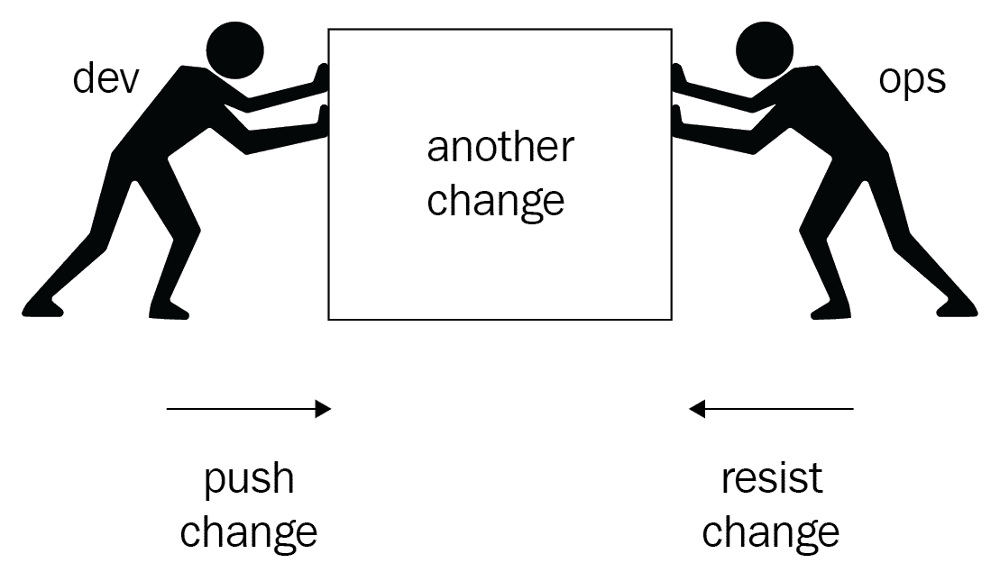
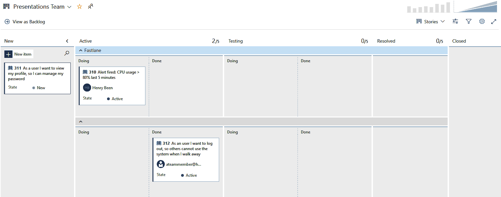
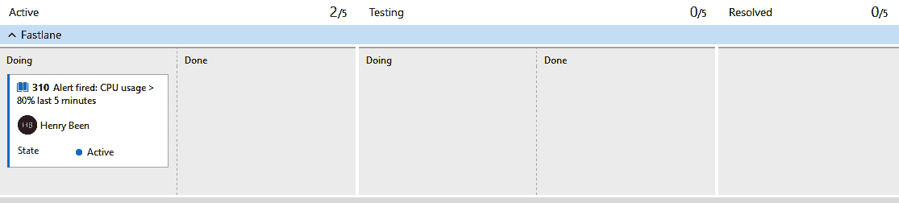
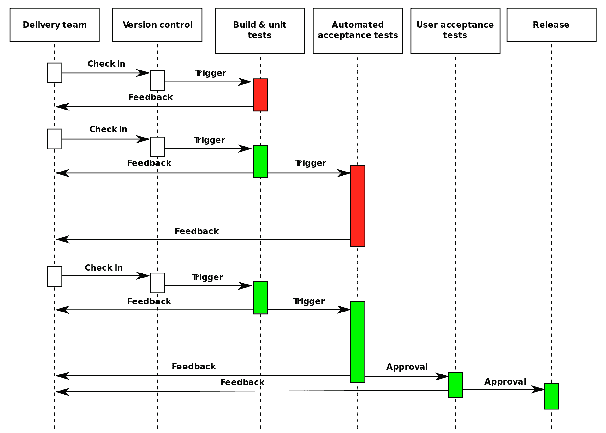

# 第一章：DevOps 简介

DevOps 不是一种可以购买或安装的产品或工具。DevOps 关乎文化，以及你如何编写、发布和运营软件。DevOps 的目标是缩短从新想法到最终用户体验到它所带来的价值的时间。在本书中，你将了解应用这一理念到工作方式的工具和技术。

为了实现这一目标，你可能需要改变你的工作方式，采用新工具或改变使用方式。在第一章中，你将深入了解什么是真正的 DevOps，以及如何识别一个成功的 DevOps 团队。

本章将涉及以下主题：

+   什么是 DevOps，为什么你不能简单地购买或安装它

+   DevOps 如何补充敏捷方法

+   DevOps 的好处是什么，如何衡量它们

+   创建理想的 DevOps 和组织结构

+   探索成功的 DevOps 团队的实践和习惯

+   DevOps 演进的五个阶段

# 技术要求

本章没有技术要求。

# 什么是 DevOps？

如果你列出所有关于 DevOps 的不同定义和描述，会有很多。然而，尽管这些定义可能各不相同，它们很可能会共享几个概念。这些概念包括协作、持续交付商业价值和打破孤岛。

在本书其余部分的技术讨论中，重要的是不要忽视采用 DevOps 的价值主张，也就是说，DevOps 将帮助你改善持续向终端用户交付价值的方式。为了做到这一点，你必须减少从开始开发新特性到第一个用户在生产环境中使用它之间的时间。这意味着你不仅要编写软件，还要交付并运营它。

在过去十年中，我们编写软件的方式发生了根本变化。越来越多的公司正在采用敏捷工作方式，以提高软件开发的效率。越来越多的团队现在在短时间内进行迭代或冲刺，快速创建产品的新增量。然而，更快地创建潜在可交付的增量本身并不会创造任何价值。只有当你的每个新版本软件被发布到生产环境，并且被终端用户使用时，它才开始交付价值。

在传统组织中，开发人员和运维人员通常位于不同部门，软件发布到生产环境通常需要交接，并且往往会有正式的仪式。在这样的组织中，加速将软件交付到生产环境，并与开发人员创建新版本的速度相匹配是困难的。

此外，开发和运维部门通常有冲突的目标。开发部门通过尽可能快速地创建更多的变化来获得奖励，而运维部门则通过限制停机时间和防止问题来获得奖励。后者通常通过尽可能少的变化来实现。这里的冲突很明显——两个部门都为一个子目标进行优化，如下图所示：

这会破坏这些子目标的目的，这些子目标源于快速接受新版本的共同宏大目标，同时保持稳定性。正是开发目标和操作目标之间的冲突，应该在 DevOps 文化中消失。在这样的文化中，开发人员和运维团队应该共同努力，以快速、可靠的方式将新版本交付到生产环境，并共同负责这两个子目标。

虽然了解 DevOps 是一种文化运动是很好的，但工具和自动化在这种文化中占有重要地位。本书将重点介绍这些工具，以及如何利用它们实施 DevOps 文化中的许多实践。换句话说，本书将主要关注与 DevOps 相关的产品和流程。如果你想了解更多关于文化方面的内容，关于人的部分，还有很多其他书籍可以阅读。

本节的其余部分将探讨 DevOps 之间的关系，看看它们是如何相辅相成的。重点将放在敏捷技术和工作管理的价格上。我们还将讨论 DevOps 文化的目标和益处。

# DevOps 与敏捷的关系

如果你看一下敏捷，可能会注意到其中一部分关注的是业务价值，并缩短新业务价值交付之间的时间。从这个角度来看，采用 DevOps 是敏捷之后的逻辑下一步。敏捷主张，软件开发团队的责任应该通过与用户和其他利益相关者的互动来向前延伸，以更快地交付有价值的、潜在可交付的产品。而 DevOps 不仅仅是创建可以交付的东西，真正的目标是将其交付出去。结合敏捷和 DevOps，你可以为用户创建一个端到端、持续不断的价值流。

做到这一点需要的一项重要条件是，所有参与者都必须有一个共同的工作管理方法。在接下来的章节中，你将找到一些关于如何将操作问题纳入到工作管理方式中的建议。

# 敏捷工作管理

当你开始增加开发与运维之间的协作时，你会很快注意到他们必须应对不同类型的工作。在开发中，工作很大一部分是计划好的：用户故事和从待办事项列表中提取的缺陷。另一方面，对于运维工作，他们很大一部分是无计划的。他们响应来自系统的警告和提醒，以及来自用户或开发者的请求或工单。

将这两者整合，特别是当开发人员和运维人员位于同一个团队时，可能会遇到挑战。为了看到如何应对这一点，让我们探索以下方法：

1.  首先，为开发人员切换到流式工作方式。

1.  接下来，允许运维团队也在与开发人员相同的工作管理系统中列出他们的工作，通过同步来实现。你还可以选择实施*fastlaning*，一种加速紧急工作的方式。

1.  最后，如果可能，你可以选择停用现有的运维工单工具。

Fastlaning（快速通道）是一种工作组织方法，通过可视化两条独立的工作通道，允许计划性和无计划的工作并行进行。为此，Scrum 看板会在顶部增加一个类似 Kanban 的看板。这是快速通道。在 Kanban 看板上，添加了紧急但无计划的工作。任何加入这个通道的工作都会被团队以最高优先级拾取。只有当快速通道没有剩余工作时，才会从 Scrum 看板中拾取计划好的工作。每当新的工作加入快速通道时，优先级再次提升。通常，大家会达成协议，工作在切换到快速通道之前，应该先完成正在进行的工作。

# 转向流式方法

首要考虑的是将开发人员的工作方式从批处理模式转换为流式工作模式。批处理式工作的一个例子是 Scrum。如果你使用的是 Scrum 框架，你习惯了每两到四周拾取一批工作，并专注于在这个时间窗口内完成所有工作。只有当这一批工作完成时，才能交付一个潜在的可发布产品。

当转向流式工作方法时，你应该专注于不是一个批次，而仅仅是一个任务。你专注于那个任务，并将其完全完成后，才开始下一个任务。这样，就不再有冲刺待办事项列表，只有产品待办事项列表。这种方法的好处是，你不再事先决定要执行哪些工作，而是在有空闲时间时，直接从待办事项列表中拾取下一个任务。在优先级迅速变化的环境中，这可以帮助你更快速地应对变化。

开发人员组织工作方式的这些变化使得将操作纳入工作管理变得更加容易，但还有另一个好处。当开发人员专注于完成单个工作项，而不是一次性完成整个迭代时，你也可以增加向用户交付小部分价值的次数。

# 将工作项同步到一个系统

在开发团队改变工作组织方式后，现在开发人员应该更容易将他们计划的工作列入共享的待办事项列表，并在有时间时从该列表中提取工作。他们现在也有一个地方可以列出未计划的工作。

然而，可能仍然存在一个现有的工单系统，其中请求操作的工单由用户提交或由监控工具自动创建。虽然 Azure DevOps 提供了一个出色的 API，可以重新构建此集成，直接在 Azure DevOps 中创建工作项，但你可能首先会选择在现有的工单工具和 Azure Boards 之间创建同步。这里有许多集成选项，并且这一领域正在进行大量的工作。通过这种方式，操作人员可以逐渐从他们的旧工具迁移到新工具，因为它们现在已经同步。当然，最终目标是让操作人员完全迁移到与开发人员相同的工具上。

# 快速通道

由于开发人员和运维人员使用同一个工作管理工具，你会注意到系统中既有计划的工作，也有未计划的工作，且这些未计划的工作通常是紧急的。为了确保紧急工作能够得到应有的关注和优先级，你可以在迭代看板中引入所谓的快速通道。在下面的截图中，你可以看到一个为快速处理生产问题设置的 Azure 看板示例：

在看板中使用这种水平分割的目的是当快速通道中没有工作可接时，只在常规通道中处理任务。

# 停用其他工作管理工具

在开发和运维之间创建共享的工作管理系统后，增加双方之间的协作机会。随着这种协作的展开，运维部门以前使用的旧工单系统可能会随着时间的推移逐渐停用。监控工具的集成可以转移到新的共享工具上，开发人员和运维人员之间的工单数量应该会逐渐减少，因为他们找到新的协作方式。

# DevOps 文化的目标与好处

此时，你可能会想知道这一切的意义何在。DevOps 的好处是什么，它对你、你的同事和你的组织又有什么作用？采用 DevOps 的最常见目标是减少**周期时间**。周期时间是从开始处理新功能到第一个用户可以使用它之间的时间。通过自动化实现这一目标，同时也有助于降低变更失败率、降低**平均修复时间**（**MTTR**）和减少计划停机时间。

除了这些之外，还有其他潜在的好处，例如员工满意度提高、工作倦怠和压力减少，以及更好的员工留存率。这归因于开发人员和运维人员之间对立目标的消除。

曾一度存在怀疑，是否 DevOps 真的有效，这些目标是否真正达成，额外的好处是否真的实现，因为这一切只是通过案例研究展示的。问题在于，案例研究通常只适用于成功的案例，而不适用于失败的案例。直到 2018 年，书籍《加速》发布，这一切才发生了变化。这本书基于多年的定量研究，表明现代开发实践，如 DevOps，确实有助于实现 IT 目标和组织目标。

# 结果衡量

为了衡量你所在团队或组织的现状以及 DevOps 对你的影响，有几个指标你可以开始记录。像往常一样，在处理指标或**关键绩效指标**（**KPI**）时，确保不要鼓励人们仅仅通过关注数字来操控系统。接下来的章节中详细介绍了几个有趣的指标，如果你逐一查看，你会发现它们都在鼓励流程的流畅性。

# 周期时间和交付时间

**周期时间**和**交付时间**是来自精益和看板的度量标准，用于衡量实现变更所需的时间。周期时间是从开始处理一个功能到用户能够在生产环境中使用该功能之间的时间。周期时间越短，你就能越快响应变化的需求或新见解。交付时间是从请求一个功能到实现该功能之间的时间。它是从将工作添加到待办事项列表到开始实施之间的时间。

当你将周期时间和交付时间加在一起时，你正在计算另一个指标——**上市时间**。这个指标通常是软件开发中的一个重要业务指标。最小化周期时间和交付时间将因此产生业务影响。

# 正在进行中的工作量

另一个可以衡量的方面是任何时候进行中的工作量。DevOps 关注的是价值流向用户。这意味着每个人应该尽可能一次只做一件事，并在完成这件事后再进行下一项任务。这可以减少任务切换和未完成工作的时间。衡量团队并行处理的任务数量并报告这一情况，可以鼓励这种做法。

你甚至可以对正在进行的工作数量设定实际限制。下面是之前截图的一小部分，显示了这些工作进行中的限制甚至可以在工具中显示出来：

目标是尽可能减少同时进行的工作量。

# 平均恢复时间

第三个度量标准是**平均恢复时间**。在发生（部分）故障时，恢复服务需要多长时间？过去，企业关注的是减少**平均故障间隔时间**。这曾是衡量产品稳定性的主要指标。然而，这个度量标准促使公司限制进入生产环境的变更数量。其不良后果通常是，尽管故障可能较少，但一旦发生，持续的时间长且修复困难。

衡量平均恢复时间将注意力转向你能够多快修复故障。如果你能迅速修复故障，那么就能实现同样的目标，即最小化停机时间，同时不牺牲变更速率。目标是最小化恢复时间。

# 变更速率与变更失败率

最后，你可以衡量交付到生产环境的变更数量，以及其中未成功的百分比。提高变更速率意味着你更频繁地向用户交付价值，从而实现价值流动。此外，通过衡量不仅是失败的数量，还包括失败的百分比，你实际上是在鼓励许多小而成功的变更，而不是鼓励限制总变更数量。

你的目标应该是提高变更的速率，同时降低变更失败率。

此时，你可能会想，我如何改变我的组织来促进这种文化，并获得所有这些好处？下一节将为你解答。

# 创建理想的 DevOps 组织

或许，你的组织结构根本不需要改变。DevOps 的开始需要一种文化变革：开放、同理心和协作是需要鼓励的价值观。但改变组织结构仍然可能有助于加速这一过程。

传统上，开发人员和运维人员通常被组织成不同的团队，甚至是不同的部门——他们在具有相似技能和责任的团队中工作。组织结构发生的一个常见变化是改变这种结构，通过调整并围绕共同目标、单一产品或一组功能来组织团队，例如。

现在，你将需要拥有不同技能和责任的团队，这些团队很可能会由开发人员和运维人员组成。重要的是要意识到，强行实施这种改变可能不是最佳的前进方式。通常，最有效的方法是从改变文化开始，鼓励合作，然后这种组织结构的变化可能会自然发生。

最后，值得注意的是一个反模式。一些公司试图通过雇佣专门的 DevOps 工程师，并将其定位在开发和运维之间，与两者互动，从而实施 DevOps。虽然这最初看起来是个好主意，但它违背了 DevOps 的价值观。如果这样做，你并没有打破壁垒，而是增加了第三个壁垒。你没有减少交接的次数，很可能会增加交接。此外，开发人员和运维人员之间的合作通常不会通过使用另一种组织结构来分隔而得到增强，你可能根本看不到用户价值的提升。

现在你知道了 DevOps 是什么，并且清楚了如何组建一个 DevOps 团队，是时候探索如何开始实现你的目标了。

# 探索 DevOps 实践和习惯

由于你并不是第一个走上这条路的团队，你可以从前人的经验中汲取教训。一个例子是微软的团队，他们构建了 Azure DevOps。由于他们处于一个罕见的位置，可以使用自己的产品来开发自己的产品，他们从中学到了很多关于使 DevOps 成功的要素。从中，他们确定了七个关键的 DevOps 实践和七个 DevOps 习惯，这些习惯是许多成功的 DevOps 团队所共有的：

| **DevOps 实践** | **DevOps 习惯** |
| --- | --- |
| 配置管理 | 团队自主性和企业对齐 |
| 发布管理 | 严格管理技术债务 |
| 持续集成 | 专注于客户价值流 |
| 持续部署 | 假设驱动开发 |
| 基础设施即代码 | 在生产中收集的证据 |
| 测试自动化 | 现场文化 |
| 应用性能监控 | 将基础设施作为灵活资源管理 |

现在，重要的是要意识到，单纯模仿这些步骤并不能保证成功。就像 Agile 一样，你需要花时间真正理解这些实践和习惯，它们的来源以及它们如何为终端用户提供持续的价值流。

以下各节将更详细地探讨所有这些实践和习惯。在阅读本书的其余部分时，请将这些内容记在心里。虽然本书的其余部分将主要关注**技术手段**，即**如何**做事情，但不要忘记，这些只是手段。真正的价值来自于思维方式和创造一种文化，专注于为客户持续创造价值的流程。

# DevOps 实践

本节依次讨论所有七种 DevOps 实践。正如你很快会发现的，它们彼此之间高度相关，很难做到单独实践其中之一。例如，测试自动化与持续集成和持续部署密切相关。

如果你打算参加 AZ-400 考试，掌握所有这些实践并通过 Azure DevOps 进行实施，将对你大有帮助。

# 配置管理

配置管理是对你的应用程序及其所依赖组件的配置进行版本控制，同时也涉及到应用程序本身。配置保存在源代码控制中，通常以 JSON 或 YAML 文件的形式存在，描述了你应用程序的期望配置。这些文件是如 Ansible、Puppet 或 PowerShell DSC 等工具的输入，这些工具用来配置你的环境和应用程序。这些工具通常会在持续部署管道中调用。

即使没有对预期配置进行更改，期望状态也可以在间隔时重新应用。这样可以确保实际配置保持正确，并且手动更改会被自动撤销。我们称之为*防止配置漂移*。配置漂移是指由于随着时间推移服务器的增加或删除，或管理员进行的手动临时干预，配置发生变化。当然，这意味着预期的配置更新是在源代码控制中完成的，并且仅通过工具进行应用。

配置管理或称为“配置即代码”与“基础设施即代码”高度相关。两者经常交织在一起，在某些平台上，它们之间的差异甚至可能显得是人为的。关于“配置即代码”将在第六章《基础设施与配置即代码》中详细讨论。

# 发布管理

发布管理是关于控制哪一版本的软件被部署到哪个环境。版本通常是通过持续集成和交付管道创建的。这些版本以及所需的所有配置，随后作为不可变的工件存储在一个仓库中。从这里开始，发布管理工具用于计划和控制这些版本如何部署到一个或多个环境中。示例控制包括手动审批和自动查询开放工作项及质量检查，之后才允许部署到新的环境中。

发布管理与持续部署相关，更多关注于控制版本通过持续部署流水线的流程。第六章《基础设施和配置即代码》将作为发布管理的一部分，介绍配置即代码。

# 持续集成

持续集成是一种实践，其中每个开发者至少每天一次将自己的工作与团队其他开发者的工作集成，最好是更频繁地进行。这意味着每个开发者至少每天一次将自己的工作推送到仓库，并且持续集成构建会验证他们的工作是否编译通过，并且所有单元测试是否运行。重要的是要理解，这种验证不仅仅应针对开发者孤立工作时的代码进行。真正的价值在于将这些工作与他人的工作集成在一起时体现出来。

当频繁且快速地集成变更时，合并变更的问题较少出现，若出现，通常也更容易解决。在第二章《一切从源代码管理开始》中，你将学习如何设置源代码管理仓库，使这一过程成为可能。在第三章《迁移到持续集成》中，你将学习如何设置持续集成构建。

# 持续部署

持续部署是指将每个新的、符合质量标准的版本自动部署到生产环境的做法。在实践持续部署时，你会有一个完全自动化的流水线，接收应用程序的每个新版本（每次提交），生成新的发布，并开始将其部署到一个或多个环境中。第一个环境通常称为测试环境，最后一个环境是生产环境。

在这个流水线中，有多个步骤用于验证软件质量，确保它能够顺利推进到下一个环境。如果质量不达标，发布将被中止，并且不会继续传递到下一个环境。这种方法的前提是，在流水线中，你需要证明当前版本无法进入下一个环境。如果未能证明这一点，你就认为它已准备好进行下一步。

只有当一个版本通过了流水线中的所有环境，它才会被部署到生产环境。每当一个发布无法进入下一个环境时，该发布将完全被取消。虽然你可能会倾向于修复导致失败的原因，然后从失败点重新开始部署，但重要的是不要这么做。因为此时你所做的更改并没有经过版本已经通过的所有控制。验证新版本的唯一方法是从头开始重新启动流水线。你可以通过以下图示清楚地看到这一点：

在第四章，*持续部署*中，你将学习如何使用 Azure DevOps Pipelines 设置持续部署。

上述图表可以在 [`en.wikipedia.org/wiki/Continuous_delivery#/media/File:Continuous_Delivery_process_diagram.svg`](https://en.wikipedia.org/wiki/Continuous_delivery#/media/File:Continuous_Delivery_process_diagram.svg)找到。图像由 Grégoire Détrez 提供，原图由 Jez Humble 创作，采用 CC BY-SA 4.0 许可证，详见 [`creativecommons.org/licenses/by-sa/4.0/`](https://creativecommons.org/licenses/by-sa/4.0/)

# 基础设施即代码

在编写应用程序时，你所构建的二进制文件必须在某个地方运行，即某个应用程序主机上。这样的应用程序主机的一个例子是像 IIS 或 Apache 这样的 web 服务器。在应用程序主机旁边，我们可能还需要数据库和一些消息解决方案。所有这些加在一起，我们称之为应用程序的基础设施。在实践基础设施即代码时，你将这些基础设施的描述保存在源代码库中，与应用程序代码一起。

当需要发布应用程序的新版本，并且要求对基础设施进行一项或多项更改时，你将使用诸如 Chef、Puppet、PowerShell DSC 或 Azure ARM 模板等工具执行你所描述的期望基础设施。执行此类描述是幂等的，意味着它可以执行多次，最终结果是相同的。这是因为你对基础设施的描述是你希望基础设施达到的*期望状态*，而不是一系列需要执行的步骤。如果有任何步骤需要执行，这些步骤将由你选择的工具自动确定。应用期望状态也可以在持续部署管道中自动完成，通常在更新应用程序代码之前执行。

这有一个很大的优势，你现在可以轻松创建一个新的环境，保证该环境的基础设施与其他环境相同。此外，配置漂移的问题，即不同环境之间的基础设施逐渐偏离，也不再可能，因为每次你都会将所需状态重新应用到每个环境中，并且它们会被强制执行。

本书的第六章，*基础设施与配置即代码*，将更详细地讨论基础设施即代码。

# 测试自动化

为了持续为最终用户提供价值，你必须快速且频繁地发布应用程序。这对你测试应用程序的方式有影响。你无法在每隔几分钟就发布一次应用程序时进行手动测试。这意味着你必须尽可能地自动化测试。

你很可能希望为你的应用程序创建多个测试套件，并在交付管道的不同阶段运行它们。快速单元测试应该在几分钟内完成，并且在每次打开新的拉取请求时执行，这将为团队提供快速反馈，帮助他们了解工作的质量，并捕捉大多数错误。接下来，团队应在管道的后期运行一个或多个较慢的测试套件，以进一步增强对应用程序版本质量的信心。

所有这些都应将手动测试的数量限制到最低，并允许你有信心地自动部署新版本的应用程序。

本书的 第八章，*持续测试*，将详细介绍测试自动化。

# 应用程序性能监控

最后一项实践是了解您的应用程序在生产环境中的表现。收集诸如响应时间和请求数量等指标将告诉你系统的运行状况。捕捉错误也是性能监控的一部分，它让你能够在不等客户联系你报告问题的情况下开始修复问题。

除此之外，你还可以收集哪些部分的应用程序使用频率较高或较低的信息，以及新功能是否被用户接受。了解使用模式能为你提供深入洞察，帮助你了解客户如何实际使用应用程序以及他们常见的使用场景。

第九章，*安全与合规*，和 第十章，*应用程序监控*，将详细介绍如何了解你的应用程序和用户在生产中的行为。

# DevOps 习惯

成功的 DevOps 团队的七个习惯更多地关注文化和在开发及交付软件时的态度，而不像 DevOps 实践那样专注于技术手段。然而，了解和理解这些习惯仍然很重要，因为它们将有助于使 DevOps 的采用更加容易。

你会注意到，培养这些习惯会加强之前列举的实践的使用，以及你用来实施这些实践的工具。当然，这也是相互作用的。

# 团队自主性与企业对齐

在敏捷工作中，一个重要部分是创建那些在很大程度上自我引导的团队，这些团队可以在没有（太多）外部依赖的情况下做出决策。因此，这样的团队通常会包括多个角色，包括拥有一个或多个功能并有权决定如何推进这些功能的产品负责人。

然而，这种自主权也伴随着将团队工作与整个产品方向对齐的责任。开发一种方法来对齐数十个甚至数百个团队的工作是非常重要的，方法应该是每个人可以独立航行，但整个舰队也能保持一致。

最理想的情况是，团队能够自发地与更大的愿景对齐，而不是时不时地接受指令。

# 严格管理技术债务

另一个习惯是严格管理技术债务。债务这一术语本身就表明，延迟解决问题会带来一定的成本（利息）。为了保持持续的速度而不在时间的推移中逐渐失去进度，至关重要的是将缺陷或架构问题的数量控制在最低限度，并只容忍有限的数量。在某些团队中，这甚至会以协议的形式正式化。例如，一个团队可以约定，未修复的缺陷数量永远不能超过团队成员的数量。这意味着，如果一个团队有四个成员，并且报告了第九个缺陷，则在修复至少一个缺陷之前，不会开展任何新工作。

# 专注于客户价值的流动

重要的是要接受这样一个事实：用户在没有实际使用代码之前，是无法从中获得任何价值的。专注于为用户提供价值的流动意味着，代码必须被编写、测试、交付，并且应该在生产环境中运行，直到完成为止。专注于这一习惯可以真正促进跨学科和团队之间的合作。

# 假设驱动的开发

在许多现代开发方法论中，有一个产品负责人负责根据业务价值对待办事项进行排序。这个负责人作为专家，负责通过根据业务价值（按工作量划分）排序所有任务，最大化开发团队交付的价值。

然而，最近的研究表明，即使产品负责人是专家，他们也无法正确预测哪些功能能为用户带来最大价值。大约三分之一的团队工作实际上为用户增加了价值，更糟糕的是，另三分之一的工作实际上减少了价值。基于这一原因，你可以将待办事项从功能或用户故事转变为你希望验证或推翻的假设。你只需要在产品中创建一个最小的实现，甚至只是功能的一个提示，然后测量是否有用户使用它。只有当这种情况发生时，你才会扩展功能的实现。

# 在生产中收集的证据

性能测量应该在你的生产环境中进行，而不仅仅是在人工负载测试环境中。如果负载测试对你有价值，在生产之前进行负载测试并没有错。然而，真正的性能测试应该在生产环境中进行，并且应该在那里进行测量，并与之前的测量结果进行对比。

这也适用于使用统计数据、模式和许多其他性能指标。它们都可以通过生产指标自动收集。

# 现场环境文化

现场环境文化倡导的理念是，生产环境中发生的任何事情优先于其他任何事情。接下来，任何威胁生产、即将进入生产或随时妨碍进入生产的事情都优先考虑。只有当这些事情都顺利进行时，才会将注意力转移到未来工作上。

此外，现场环境文化的一部分是确保任何干扰服务操作的事情都经过彻底分析——不是为了找出责任人或解雇，而是找出如何防止再次发生。最好通过向左移动来预防，例如，在管道的较早阶段检测到重复事件的指标。

# 管理基础设施作为灵活的资源

最后，一个成功的 DevOps 团队将其服务器和基础设施视为牲畜，而不是宠物。这意味着基础设施在需要时启动，并在不再需要时被忽略。能够做到这一点的原因是配置和基础设施作为代码。这甚至可能会走得更远，每次新部署都会创建一个新的生产环境，然后在将所有流量从旧环境切换到新环境后删除旧生产环境。

除了牢记这些 DevOps 实践和习惯外，在您的组织尝试迈向 DevOps 文化时，您将经历一些阶段。下一节将带您了解这一过程。

# DevOps 演进的五个阶段

当您的组织尝试在 DevOps 文化中迈进时，这需要时间。在您的组织中，每个人都必须接受他们必须改变个人工作方式的变化。之前已经经历过这一过程的其他人可能会帮助您加速您自己的旅程。了解这些步骤可以帮助您加速自己的旅程。这些步骤首次发表在*2018 年 DevOps 报告*中，并在以下各节中讨论。

# 规范化技术栈

通向 DevOps 文化的常见第一步是采用敏捷方法。至少，有良好的源代码控制工具，通常有公司标准，并正在推出持续集成和交付。团队还在共同努力，规范他们开发软件的技术栈。例如，选择一两个云供应商，并淘汰其他部署平台。对于其他用途的工具也是如此——尽可能地标准化。自制解决方案被行业标准替代。

# 标准化和减少变异性

在这个阶段，团队致力于进一步减少应用程序之间、以及开发和运维团队之间的差异，双方共同协作，统一操作系统、库和工具。此外，在这个阶段，部署流程也发生了变化，以减少它们之间的差异，配置和基础设施通常会迁移到源代码管理中。

# 扩展 DevOps 实践

开发和运维之间的剩余问题被清理掉，确保开发团队的输出正是运维团队所期望的。此外，双方的合作开始增加，他们能够在没有外部依赖的情况下共同工作，创建和交付变更。

# 自动化基础设施交付

在这个阶段，开发和运维使用的基础设施完全对齐。所有内容都从源代码管理中部署，两个团队都使用相同的脚本。

# 提供自助服务功能

在 DevOps 之前，虚拟机或托管环境通常是由开发人员手动或通过工单系统向运维团队请求的。资源配置由运维人员手动完成，这可能需要几天，甚至有时需要几周。

自助服务功能意味着环境不再通过手动创建，而是通过运维团队为开发人员提供的自助服务 API 来创建。

通过这种方式，开发人员可以完全自主地创建和销毁环境。他们可以独立创建和测试变更，并自行发送或安排自动部署。

# 总结

在这一章中，你了解了 DevOps 是什么（以及它不是）以及它与敏捷方法的关系。转向 DevOps 文化有助于你打破开发人员和运维人员之间相互冲突的目标。这将使他们能够共同工作，持续为最终用户交付价值，将工作组织在一个共同的待办事项列表中，并在同一个看板上工作，同时尊重彼此工作方式的差异。将开发人员和运维人员组织成面向产品的团队，是创建志同道合、目标导向团队的下一步重要工作。

转向 DevOps 可以带来许多好处，你现在已经知道如何衡量这些好处，并持续进行改进。接下来，你学习了许多成功的 DevOps 团队展现出的 DevOps 习惯和实践。掌握这些技能，不仅是你自己，还是你的团队，将使你能够进行自己的 DevOps 评估。所有这些都是为了持续为用户交付价值。

下一章将讨论源代码管理的话题，以及如何组织你的应用程序源代码以支持 DevOps 流程。

# 问题

在我们总结时，这里有一组问题供你测试关于本章内容的知识。你将在附录的*评估*部分找到答案：

1.  对还是错：开发和运维部门经常有相互冲突的目标。

1.  对错：本章讨论的七个 DevOps 实践是相互独立的，可以轻松地单独实践。

1.  以下哪项不是 DevOps 演变的五个阶段之一？

    1.  标准化技术栈

    1.  自动化基础设施交付

    1.  标准化并减少变异性

    1.  招聘一组 DevOps 工程师来自动化应用程序交付

1.  什么是 fastlaning？

1.  用你自己的话，简要描述 DevOps 的本质。

# 进一步阅读

还有许多其他资源，你可能会发现它们对学习 DevOps 文化和 DevOps 思维方式非常有帮助。以下是其中的一些：

+   *凤凰项目*，作者：Gene Kim、Kevin Behr 和 George Spafford

+   *有效的 DevOps*，作者：Jennifer Davis 和 Katherine Daniels

+   *加速*，作者：Nicole Forsgren、Jez Humble 和 Gene Kim

+   *与 Sam Guckenheimer 的采访*，可通过[`devops.com/11626/`](https://devops.com/11626/)获取

+   *微软案例研究：他们的 DevOps 之旅*，可通过[`stories.visualstudio.com/devops/`](http://stories.visualstudio.com/devops/)获取

+   *2018 年 DevOps 现状报告*，可通过[`info.puppet.com/Eficode-Puppet-State-of-DevOps-Report.html`](http://info.puppet.com/Eficode-Puppet-State-of-DevOps-Report.html)获取

+   有关评估现有开发流程的更多信息，可以在[`docs.microsoft.com/en-us/learn/modules/assess-your-development-process/index`](https://docs.microsoft.com/en-us/learn/modules/assess-your-development-process/index)找到

+   关于不同敏捷方法的更多信息，以及如何通过 Azure Boards 支持它们，可以在[`docs.microsoft.com/en-us/learn/modules/choose-an-agile-approach/index`](https://docs.microsoft.com/en-us/learn/modules/choose-an-agile-approach/index)找到
