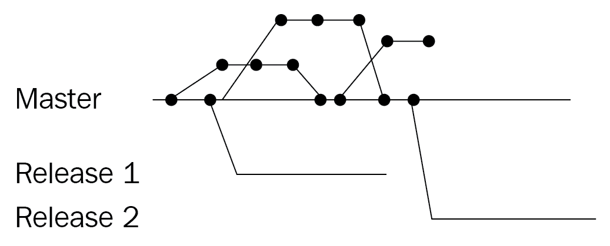

# 第二章：一切从源代码管理开始

源代码管理是软件开发中最基本的工具之一。因此，可以合理假设你之前已经使用过源代码管理。基于这一点，本章将仅简要介绍源代码管理，并迅速过渡到更高级的话题，帮助你设置源代码管理以支持 DevOps 实践。

多种 DevOps 实践依赖于源代码管理，因此，设置你的代码库以持续为用户提供价值是一个很好的起点，也是接下来章节中许多主题的前提条件。

本章将涵盖以下主题：

+   Azure DevOps 中的源代码管理类型

+   源代码管理系统

+   选择分支和合并策略

+   使用分支策略确保源代码管理的安全性

+   可用于源代码管理的其他工具

# 技术要求

要实践本章涉及的内容，你可能需要一个 Azure DevOps 组织。

# Azure DevOps 中的源代码管理类型

虽然存在许多不同的源代码管理系统，但它们可以分为两类：集中式和去中心化源代码管理，具体如下：

+   在**集中式源代码管理**系统中，只有服务器拥有完整的历史记录和组成代码库的所有分支。

+   在**去中心化源代码管理**中，所有与代码库一起工作的人员都拥有该代码库的完整副本，包括所有分支和历史记录。

Azure Repos 是 Azure DevOps 服务的一部分，通过 TFVC 和 Git 提供两种类型的源代码管理。接下来的两个部分将更详细地讨论这两种源代码管理。

# 集中式源代码管理

在集中式源代码管理系统中，服务器是唯一存储完整代码库（包括所有历史记录）的地方。当你创建内容的本地版本时，你只会接收到代码的最新版本。接收这个最新版本被称为**检出**代码库。除了这个最新版本，你自己的计算机只会有你本地所做的更改。

显然，不检出完整的历史记录可以节省本地计算机的存储空间。然而，如今磁盘空间几乎不再是问题。其缺点是，你需要持续连接到服务器才能执行查看文件历史记录、他人最近提交或某文件的某一行最后由谁修改等操作。

集中式源代码管理系统的一个优点是，它们通常提供对谁可以访问哪些分支、目录甚至文件的精细化控制选项。

# 去中心化源代码管理

使用去中心化源代码管理系统时，所有文件、历史记录和分支也存储在服务器上。与集中式源代码管理的区别在于，当你**克隆**代码库时，你会在自己的计算机上获得一个本地副本。

由于你有该仓库的完整克隆，现在可以查看文件的历史记录和其他分支，而无需再次连接到服务器。这显然减轻了服务器的负担，并且即使在断开连接时也能继续工作，这是去中心化源代码管理的两个优点。

缺点是，去中心化的源代码管理可能比集中式源代码管理更难学习。总体来说，去中心化源代码管理系统的学习曲线更陡峭。此外，单个目录和文件的访问控制通常更为有限。

无论你使用哪种类型的源代码管理，都必须制定一个分支和合并策略，以便开发者能够并行开发不同的功能，同时始终保持主分支处于可发布状态。

# 源代码管理系统

有许多源代码管理系统在使用，但在本章中，我们只会查看当前使用最广泛的三种系统。它们如下：

+   **团队基础版本控制** (**TFVC**)

+   Git

+   Subversion

在 Azure DevOps 中，仅支持 TVFC 和 Git。Subversion 是一个由 Apache 基金会创建的集中式源代码管理系统。在接下来的小节中，我们将更详细地了解 TFVC 和 Git，并学习如何在它们之间迁移源代码。Subversion 在本章最后的*其他源代码管理工具*部分中讨论。

# 团队基础版本控制

**团队基础版本控制** (**TFVC**) 是一个由微软在 2013 年推出的集中式源代码管理系统，作为**团队基础服务器** (**TFS**)的一部分，TFS 后来发展成了 Azure DevOps。TFVC 仍然在 Azure DevOps 中得到支持，但不推荐用于新项目。如果你还没有使用 TFVC，学习它没有什么价值。现在，TFVC 不推荐用于新项目，微软很可能不会为其发布新特性，但没有其他驱动因素的情况下，没有必要从 TFVC 中迁移。

在 Azure DevOps 中，每个团队项目最多只能有一个 TFVC 仓库。

# Git

除了 TFVC，Azure DevOps 还支持托管 Git 仓库。Git 是一种去中心化的源代码管理方式，正在迅速流行。Git 不仅仅是 Azure DevOps 特有的，它是一种通用协议，许多提供源代码托管服务的平台都在使用。除了 Azure DevOps，GitHub 和 GitLab 也是著名的例子。

要使用 Git 仓库，首先必须克隆它：

1.  打开命令提示符，导航到你希望存储仓库的目录。

1.  执行以下命令，并将示例网址替换为你 Git 仓库的 URL。示例 URL 展示了 Azure DevOps 中 Git 仓库位置的构建方式：

```
git clone https://{organization}@dev.azure.com/{organization}/{teamProject}/_git/{repository}
```

现在，你可以开始进行你想要的修改了。在这个例子中，添加了一个新文件，`NewFile.txt`。

1.  接下来，这个文件必须被暂存以供提交。暂存文件是为了区分你想要提交的文件和你想保留自己更改的文件：

```
git add NewFile.txt
```

1.  在将所有想要分组到单个提交的更改暂存后，实际创建 `commit` 是通过调用提交命令并指定更改的描述来完成的：

```
git commit -m "Added a new file that contains an important text"
```

1.  最后，你可以通过执行以下命令，将你的更改推送回中央仓库，即远程仓库：

```
git push
```

要进行更多更改，你可以根据需要随时暂存并提交更改。你可以一次推送一个提交，但也可以一次推送多个提交。

你也可以通过 Visual Studio 或 VS Code 界面来使用 Git。在这里，你执行的步骤完全相同，但你可以使用可视化界面。

# 大文件存储

Git 被设计并优化用于处理纯文本文件，并跟踪版本之间的变化。然而，你可能希望将除文本文件之外的其他内容存储到源代码控制中。例如，图像或二进制文件应该在运行时与应用程序一起包含。虽然这些是有效的用例，但开箱即用时，它们与 Git 的兼容性不好。为了解决这个问题，**大文件存储**（**LFS**）被引入。

Git LFS 允许你存储一个小的文本文件，作为指向二进制文件的指针，而不是直接存储二进制文件。这样的文件包含该文件的哈希值，这样客户端在克隆或获取更改时可以下载该文件，并且在你更新二进制文件时能够更新该文件。

要使用 Git LFS，你必须在 Git 客户端旁边安装 LFS 客户端。这是一个单独的客户端，每个仓库的用户都必须下载。没有这个客户端，其他用户只会看到指向文件的指针文件，而不是实际的二进制文件。安装客户端后，你必须准备仓库以便使用 LFS。以下示例命令启用 MP4 文件的 LFS 使用：

```
git lfs install
git lfs track "*.mp4"
git add .gitattributes
```

从此开始，你可以像操作任何文件一样操作 MP4 文件，幕后它们将与文本文件的更改分开存储。

# 在控制系统之间迁移

DevOps 旅程中的一步是工具的整合。这意味着，在某个时刻，你可能会被要求将源代码从一个源代码控制系统迁移到另一个系统。这意味着公司可能会决定将所有源代码从 GitLab 或 Subversion 移动到 Azure Git Repos。你可以选择多种方式进行这样的迁移。

最有可能发生的情况是，你会收到将源代码迁移到一个或多个 Azure Git 仓库的请求。可能的源包括其他 Git 仓库、TFVC 或 Subversion。可以使用一些工具和方法进行这样的迁移，同时保留原仓库的变更历史。

如果没有现成的迁移流程，或者你必须从另一个系统导入源代码，你也可以选择创建一个新的空仓库，并将其初始化为现有代码库。这种方法的缺点是，所有历史记录都会丢失。

# 迁移现有的 Git 仓库

在迁移源代码时，与其他类型的迁移相比，将 Git 仓库迁移到其他位置进行托管是相对简单的。让我们学习如何做到这一点：

1.  首先，将现有仓库克隆到本地计算机。请注意末尾的点，这将把仓库放置在当前目录中：

```
git clone https://{organization}@dev.azure.com/{organization}/{teamProject}/_git/{repository} .
```

1.  添加另一个远程仓库，指向你希望将源代码迁移到的新空仓库：

```
git remote add migrationTarget https://{organization}@dev.azure.com/{organization}/{teamProject}/_git/{newRepository}
```

1.  最后，你将更改推送到这个新仓库。对于每个你想迁移到主分支的分支，你必须单独执行这个操作：

```
git push migrationTarget master
```

与此同时，其他开发人员可能已经继续在现有仓库中工作。

1.  要将这些内容也包括在新的仓库中，你必须先从原始仓库将它们获取到本地计算机，然后再推送到新的仓库。再次重复此操作，适用于每一个分支：

```
git fetch origin master
git push migrationTarget master
```

1.  重复执行这最后两个命令，直到没有开发人员继续在源仓库中工作为止。

1.  成功迁移后，通常最好删除旧仓库。这可以防止任何人不小心继续在旧仓库中工作。

上述步骤适用于任何 Git-to-Git 迁移。

现在，如果你特别想迁移到 Azure Git 仓库，你也可以使用 Azure DevOps 提供的导入功能。要执行此操作，请按照以下步骤操作：

1.  导航至 Git 仓库，并可以选择先创建一个新的 Git 仓库。

1.  选择导入一个现有的仓库。

1.  提供所需的相关信息。

1.  点击“导入”开始导入仓库。

以下截图展示了这些步骤：


这种方法的缺点是，你不能持续将更改从源仓库推送到新仓库。这意味着，你团队中的所有其他开发人员必须确保自己将更改迁移过来，或者在迁移仓库时没有未完成的工作。

# 从 TFVC 迁移到 Azure Git 仓库

对于从 TFVC 迁移到 Git 仓库，你可以使用与从任何 Git 仓库迁移到 Azure 仓库相同的*导入仓库*功能。此向导在执行导入时最多可以处理 180 天的历史记录。如果这不足够，而且你需要将超过 180 天的历史记录迁移到新仓库，还有其他更复杂的方法可以使用，但它们涉及更多的步骤。更详细的建议链接将在本章结束时提供。

# 从 Subversion 迁移到 Azure Git 仓库

你可能收到的另一种请求是将一个 Subversion 仓库迁移到 Git 仓库。对于这种情况，微软没有现成的解决方案。不过，Atlassian 开发了一款工具，可以在保留变更历史的同时，将 Subversion 仓库迁移到本地 Git 仓库。

运行完该工具后，剩下的就是为一个新的空仓库添加远程，并推送所有的分支。这些步骤与从 Git 迁移到 Git 的步骤相同，起始于添加一个新的远程仓库。

# 不保留历史记录的迁移

如果你被要求进行迁移且不保留历史记录，可以仅在本地计算机上创建一个新的空仓库，并使用以下命令将现有的更改推送到该仓库。

从包含应该放入主分支的文件的目录执行以下命令：

```
git init
git add 
git commit -m “Initial import of existing sources”
git remote add https://{organization}@dev.azure.com/{organization}/{teamProject}/_git/{repository}
git push
```

这些命令初始化一个新的仓库，基于当前目录中所有文件创建第一次提交，添加目标服务器位置的引用，并将新创建的仓库推送到该位置。

如果你想保留多个分支，必须为每个其他分支重复以下步骤：

1.  首先，进入该分支的正确目录：

```
Git checkout {branchName}
```

1.  现在，将需要放入该分支的文件复制到你的工作目录中。然后，继续执行以下命令：

```
git add .
git commit
git push
```

这完成了迁移，现在你本地计算机上的最新源代码版本已在 Git 中可用。你团队的其他成员现在可以克隆该仓库并开始使用它。接下来，我们将学习分支和合并。

# 选择分支和合并策略

版本控制允许你记录对文件所做的所有更改，同时如果需要，也能暂时与团队成员分开工作。我们称之为**分支**。当你在版本控制中进行分支时，你会复制当前注册的更改路径。我们称这种复制为**分支**。分支允许你暂时将某些工作与其他工作隔离开。如果你希望在某个时刻将某个分支的更改与另一个分支的更改合并，你可以**合并**这些更改。分支通常用于处理尚未完成的功能、概念验证或热修复。使用分支可以让你稍后决定将哪些更改包含在下一个版本中，哪些不包含。

# 分支策略

目前有许多分支策略可供选择，但如今最常用的三种策略如下：

+   GitHub 流程

+   GitFlow

+   发布流程

以下小节将更详细地讨论这些内容。

作为分支管理的替代方案，基于主干的开发（trunk-based development）如今变得越来越流行。想了解更多内容，请访问 [`paulhammant.com/2013/04/05/what-is-trunk-based-development/`](https://paulhammant.com/2013/04/05/what-is-trunk-based-development/)。

# GitHub 流程

GitHub flow 是一种简单但通常足够的分支策略。在 GitHub flow 中，只有一个**master**分支，始终应该保持在可部署的状态。master 上不允许有未完成的更改。

如果你想开始处理一个新的功能或错误修复，你需要从 master 创建一个新的主题分支，在这个分支上提交你的工作。只有当你完全完成这项工作时，才将这个分支合并回 master。一个示例提交流程可能如下所示：


由于这是涉及分支最少的分支策略，这可能是一个很好的起点。

# GitFlow

GitFlow 是另一种著名的复杂分支策略，可以应对在软件开发中可能出现的几乎所有情况。GitFlow 描述了每当开始处理一个新版本时，都会创建一个**Develop**分支，作为 master 的分支。**Develop**是集成分支，用于合并新功能并进行集成测试。它只应包含那些你认为已经准备好发布的工作。

从**Develop**分支，你可以创建一个或多个功能分支，开始处理新的功能。只有当某个功能完成后，你才会将这个分支合并回**Develop**分支。

当你想发布一个新版本的应用程序时，你需要创建一个**Develop**分支的发布分支。在这个分支上的代码上，你进行最终测试，并在必要时进行一个或多个错误修复。当你对代码质量满意时，将这个分支合并到 master，并打上版本标签。你还需要将这些错误修复合并回**Develop**，以便它们也会被纳入到新的开发中。这个流程可以通过以下图示来展示：


如果遇到需要尽快修复的关键性错误，或者你需要做热修复，也可以使用这种流程。在这种情况下，你需要从 master 创建一个新的分支，修复错误。测试完成后，你将这个分支合并到 master 和 developer 分支，就像处理发布分支一样。

# Release Flow

**Release Flow**是 Azure DevOps 团队用于开发 Azure DevOps 的分支系统。它同样基于使用短生命周期的主题分支，这些分支从 master 分支创建，并最终合并回 master。

区别在于，部署到生产环境的并不是 master 分支上的代码。而是每当需要发布新版本时，会从**master**创建一个新的分支，命名为**release-{version}**。这个分支上的代码会被部署到生产环境。一旦新的发布分支被部署，之前的发布分支可以被忽略。最终形成以下流程：



这种模型的优点是，它允许拍摄主分支当前状态的快照，并将其推向生产。如果生产环境中出现需要在新完整版本之前修复的错误，那么可以将正确的提交从主分支合并到当前发布分支。

# 基于主干的开发

在许多公司中，分支和合并是为了在发布新版本时保留灵活性，并且能够在最后时刻只选择该版本的更改。这种灵活性是以必须在某个时刻合并或集成更改为代价的。这一代价不仅仅是所需的时间，还有合并操作带来的风险。从两个不同分支中合并包含完美工作的代码，可能仍然会产生无法工作的代码。

出于这个原因，你可能会考虑切换到**基于主干的开发**。在基于主干的开发中，你不再使用分支来选择进入版本的更改。相反，团队中的每个开发人员都持续在同一个分支（通常是主分支）上工作，并且只为准备一个单一的更改而创建短生命周期的分支，然后将其合并回主分支。

当你采用这种方式时，你将需要另一种方法来确定在发布新版本软件时，哪些更改将可用，哪些更改尚未可用。你可以通过使用**抽象分支**来做到这一点。

# 抽象分支

当进行抽象分支时，你不会将代码的两个版本并排使用分支，而是将它们并排放在代码库中。例如，当你想要更改一个名为`FoodClassifier`的类的实现，而该类实现了`IFoodClassifier`接口时，你会执行以下步骤：

1.  你将`FoodClassifier`类的名称重构为`FoodClassifierToBeRemoved`。

1.  你创建了一个完整的`FoodClassifierToBeRemoved`类的副本。

1.  你将这个副本命名为`FoodClassifier`。

此时，你的修改应该看起来像这样：

```
public class FoodClassifier : IFoodClassifier
{
 public FoodClassification Classify(Food food)
 {
 // Unchanged classification algorithm
 } 
}
public class FoodClassifierToBeRemoved : IFoodClassifer
{
 public FoodClassification Classify(Food food)
 {
 // Unchanged classification algorithm
 } 
}
```

请注意，在运行时，应用程序的行为将与之前一样。你只是添加了一个新的、尚未使用的类，并且改变了其行为。提交这些更改甚至将新的二进制文件发布给用户是安全的。现在，你可以开始更改新的`FoodClassifier`类的实现，进行测试，并建立对其实现的信任。同时，你可以继续提交并推送你的更改，甚至是推送给客户。切换到新实现可以通过依赖注入配置、布尔标志或环境变量来完成。只需选择在你的场景中最合适的方式。

只有在你完全满意新实现工作正常时，你才会删除`FoodClassifierToBeRemoved`类，并将任何引用更新回`FoodClassifier`。

我们将在第四章中进一步探讨通过抽象进行分支，*持续部署*时讨论功能切换。虽然通过抽象进行分支是一种推荐的加速交付的方法，但它也是一把双刃剑。如果您没有流程来控制并行实现的数量，并在切换实现后清理它们，您的代码库质量可能会下降。

# 合并策略

根据您使用的源代码管理系统，可能有多种方式将您的更改从一个分支合并到另一个分支。

# TFVC

当您使用 TFVC 时，您需要在本地准备合并，选择源分支和目标分支，然后选择要合并的更改列表。TFVC 然后执行合并，并将合并结果显示为本地更改。您可以检查这些更改，纠正或修改它们，并解决任何冲突。之后，您就可以像处理常规更改一样提交更改。

# Git

使用 Git 进行合并时，可以通过切换到目标分支，然后*合并*源分支的所有更改来执行。如果分支之间存在冲突的更改，您必须像从服务器获取新更改时那样解决这些冲突。合并源分支的更改并解决所有冲突后，您可以提交更改。这将生成一个合并提交，您像提交任何其他更改一样将其推送到远程。

这可以使用 Visual Studio 或 VS Code 的图形界面完成，也可以使用以下命令序列：

```
git checkout targetBranch
git merge sourceBranch
```

如果存在任何冲突，您必须在此时解决这些冲突。否则，您无法继续：

```
git commit -m “Merged changes from sourceBranch”
git push
```

正如在*保护仓库*部分中所述，您可以通过禁止以这种方式合并来保护某些分支。尤其是对于主分支的更改，您可能希望使用另一种合并更改的机制，即拉取请求。使用拉取请求，您向其他人发出请求，让他们从您的分支拉取更改到目标分支。这样，其他团队成员可以首先审查您的更改，只有在它们满足所有约定的标准后才会合并。其他人可以对您的更改发表评论或要求更新，然后再执行合并。这是使用 Git 强制实施源代码四眼原则的最常见方式。四眼原则规定，每个更改或操作应由至少两个人查看。

现在，当您批准一个拉取请求时，您可以使用不同的策略来生成合并提交。最常用的策略是合并提交、压缩提交或变基。

# 合并提交

一个常规的**合并提交**是一种保持所有先前提交可见的提交类型。它有两个父引用，展示了变化的两个来源，即源分支和目标分支。这和你使用 Git 合并时手动执行的合并类型相同。此类型提交的优点是能够清楚地显示目标分支的新状态来源。

# 压缩提交

当执行所谓的**压缩提交**时，你将从源分支合并的所有单独提交合并为一个新的提交。这在源分支上的所有提交都与某个功能相关时非常有用，这样可以在目标分支上保留清晰简洁的变更历史。特别是当源分支中有错误修复或清理操作时，这种方法更为合适。缺点是你可能会丢失一些增量更改的背景信息，这些更改是在源分支上进行的。

# 重新基准化

**重新基准化**一个分支意味着将你的分支领先于主分支的所有提交暂时放到一边。同时，主分支领先于本地分支的所有提交将合并到本地分支中。最后，你之前放到一边的所有个人提交将被重新应用。下图展示了重新基准化提交前后的分支状态：


在重新基准化源分支后，它现在被合并到主分支中。这种合并的优点是你可以在一个单一的提交历史中保留所有的个人更改。

# 管理仓库

在使用 Azure Repos 时，每个团队项目最多可以拥有一个 TFVC 仓库。然而，在使用 Git 时，你可以在同一个团队项目中拥有多个仓库。最近越来越受到关注的讨论是，应该为所有应用程序使用一个仓库，还是为每个应用程序使用一个仓库。管理仓库时，其他重要的主题包括创建和删除仓库、保障仓库安全以及为仓库设置策略。

# 单体仓库或多仓库

当你使用**单体仓库**（**monorepo**）时，你将所有项目和应用程序的代码存储在一个单一的源代码管理仓库中。与此相对的是，你可能使用多个仓库，每个应用、库或项目都存储在它自己的仓库中。两种方法各有优缺点，且从小公司到大公司都有使用这两种方式的案例。

单体仓库的潜在优势包括以下几点：

+   现有代码的更容易复用：如果所有代码都存放在一个仓库中，任何人都可以访问并查看这些代码。这意味着复用的机会增加。

+   将所有应用程序存放在一个仓库中，也意味着任何影响多个应用程序的更改都可以在一个提交中完成，在一个仓库中实现。一个典型的例子是 API 变更。

+   由于所有代码都可以被每个人访问和维护，因此开发人员或团队不太可能将特定仓库视为自己的。这鼓励彼此之间的学习。

多个仓库的可能优点包括以下几点：

+   单一仓库（monorepo）可能会变得非常非常大，甚至会达到开发人员仅签出或克隆单一部分仓库的程度。这实际上会抵消单一仓库的多数优点。

+   拥有一个包含所有代码的仓库，可能会导致组件或应用程序之间的紧密耦合。如果你有多个仓库，你可以更新一个 API，并以新版本发布，逐一升级客户端。在单一仓库中，你可能会倾向于在一次提交中升级 API 并更改所有消费者，这样做的风险很大。

哪种方法最适合你，除了受讨论的优缺点影响，还受到团队和组织背景以及构成的影响。如果你有一个单一团队负责内部应用程序的所有开发，那么一个单一仓库（monorepo）可能更有意义。如果你有多个团队负责不同客户的不同应用程序，那么多个仓库可能更有意义。

# 创建和删除仓库

在 Azure DevOps 中，每个团队项目可以拥有多个 Git 仓库。试着做以下操作：

1.  首先，访问“管理仓库”界面。下图显示了如何访问该界面：


1.  打开此界面后，会弹出一个新界面（如下面的截图所示）。在这里，你可以通过点击带有加号的“添加...”按钮（在下图中标记为**1**）并填写仓库名称来添加新的仓库。

1.  通过点击仓库名称并选择删除（标记为**2**），仓库也可以被删除：


删除仓库并不是经常发生的事情。将不再使用的仓库设置为只读或删除其所有授权，可能更为合适。

现在，让我们学习如何保护我们创建的仓库。

# 保护仓库

尽管分布式源代码控制的安全选项通常不如集中式源代码控制那样广泛，但 Azure Repos 提供了一些方法，可以为仓库或服务器端分支设置授权。在上一节的最后一张图片中，你还可以看到如何在中间列选择一个组或用户，然后更新仓库的授权。默认情况下，所有授权都会从项目默认设置继承。

建议尽量少更改授权，如果需要更改，通常最好通过组来操作并允许授权。

你还可以通过在左侧下拉菜单中打开仓库的分支，并点击你希望覆盖授权的分支来更改特定分支的授权。在前面的截图中，已标记为 3。

# 分支策略

最后，可以在特定分支的拉取请求上强制执行一个或多个策略。分支策略的界面如下面的截图所示，可以通过在管理仓库分支的授权时选择“分支策略”选项来访问：


前四个复选框与默认策略相关，可以根据个人偏好启用（或不启用）。默认情况下，它们都是禁用的。

构建验证可用于禁止合并任何拉取请求，如果选定的构建之一或多个未成功完成。如何设置这样的构建，你将在下一章学习。

除了构建外，你还可以调用外部服务来检查拉取请求，并决定是否允许合并。这里常用的集成是与代码质量工具的集成。你也可以在此调用自己的 API，以便在拉取请求标题、与工作项的关系或更复杂的约束等方面执行团队协议。

最后，你可以强制要求特定用户或团队必须参与拉取请求的审查。这可能是为了确保特定质量标准，但也可能成为影响开发速度和流畅性的限制因素。

# 其他源代码控制工具

除了 Azure Repos 中可用的源代码控制系统外，还有一些你应该了解的其他知名系统：

+   GitHub

+   GitLab

+   Subversion

我们将在接下来的子章节中逐一介绍这些内容。

# GitHub

**GitHub**是一个托管源代码控制提供商，提供托管的 Git 仓库。GitHub 允许任何人创建任意数量的公开仓库。只有在创建需要三位或更多贡献者的私有仓库时，才必须切换到付费订阅。

这种允许在公开开发时无限制、免费使用平台的模式，使得 GitHub 成为目前全球最大的开源软件托管平台。

GitHub 于 2018 年被微软收购，之后微软与 GitHub 合作，创建了 GitHub 仓库和 Azure DevOps 之间的良好集成体验，特别是在 Azure Boards 和 Azure Pipelines 方面。除此之外，微软表示 GitHub 和 Azure Repos 将继续并行存在，目前没有计划终止其中任何一项产品。

GitHub 还提供了一种本地部署的版本，称为 GitHub Enterprise。

# GitLab

GitLab 是另一个提供托管 Git 仓库的平台。与 Azure DevOps 一样，源代码控制托管是它提供的服务之一。

# Subversion

一种较老的源代码控制系统是 Subversion。Subversion 开发并首次使用于 2004 年，由 Apache 软件基金会维护。Subversion 是一种集中式源代码控制系统，支持你期望的所有功能。

关于 Subversion 比 Git 较差的论点有很多，然而这些论点大多并不适用于最新版本的 Subversion。事实上，Subversion 是一种广泛使用的源代码控制系统，尤其适用于非常大的代码库或有特定授权需求的代码库。

虽然 Azure DevOps 无法托管 Subversion 仓库，但它可以连接并与存储在 Subversion 中的源代码协同工作。

# 总结

在本章中，你学习了源代码控制。我们了解到源代码控制有两种类型：集中式和去中心化，Azure DevOps 都支持这两种类型。TFVC 不再推荐用于新项目。你应该在启动新项目时使用 Git。

使用 Git 时，你可以在团队项目中拥有多个代码库。每个代码库都可以为特定分支分配策略，以锁定并强制执行“四眼原则”。你还了解了访问控制以及如何为用户提供访问一个或多个代码库的权限。最后，你学习了其他工具，并了解了如何将源代码从一个工具迁移到另一个工具。

你可以运用所学来决定在你的产品中使用哪种类型的源代码控制系统。你现在能够专业地组织你所工作的代码库。你也能处理不同的分支策略，并使用策略来强制执行安全性或质量要求。

下一章将会利用你所学到的源代码控制知识，帮助你设置持续集成。

# 问题

在我们总结时，以下是一些问题，帮助你测试对本章内容的理解。你可以在附录的 *评估* 部分找到答案：

1.  集中式与去中心化源代码控制之间有什么区别？在什么情况下哪种更适用？

1.  判断正误：Git 是一种去中心化的源代码控制系统的例子。

1.  以下哪项不是常见的分支策略？

    1.  发布流程

    1.  变基

    1.  GitFlow

    1.  GitHub 流程

1.  许多公司希望在代码合并到主分支之前进行代码审查。使用 Git 时，采用何种方式来执行此操作？如何在 Azure DevOps 中强制执行这一操作？

1.  以下哪些不是有效的合并策略？

    1.  变基

    1.  基于主干的开发

    1.  合并提交

    1.  压缩提交

# 深入阅读

+   有关使用 Git 的更多信息，请访问 [`docs.microsoft.com/en-us/learn/paths/intro-to-vc-git/`](https://docs.microsoft.com/en-us/learn/paths/intro-to-vc-git/)。

+   关于 TFVC 与 Git 的微软官方建议可以在 [`docs.microsoft.com/en-us/azure/devops/repos/tfvc/comparison-git-tfvc?view=azure-devops&viewFallbackFrom=vsts`](https://docs.microsoft.com/en-us/azure/devops/repos/tfvc/comparison-git-tfvc?view=azure-devops&viewFallbackFrom=vsts) 找到。

+   更多关于 Git LFS 的信息可以在 [`docs.microsoft.com/en-us/azure/devops/repos/git/manage-large-files?view=azure-devops`](https://docs.microsoft.com/en-us/azure/devops/repos/git/manage-large-files?view=azure-devops) 查阅。

+   Git LFS 下载说明可以在 [`git-lfs.github.com/`](https://git-lfs.github.com/) 查找。

+   更多关于迁移到 Git 的信息可以在 [`docs.microsoft.com/en-us/azure/devops/repos/git/import-from-TFVC?view=azure-devops`](https://docs.microsoft.com/en-us/azure/devops/repos/git/import-from-TFVC?view=azure-devops) 查阅。

+   用于将 SVN 仓库转换为本地 Git 仓库的 Atlassian 工具可以在 [`www.atlassian.com/git/tutorials/migrating-convert`](https://www.atlassian.com/git/tutorials/migrating-convert) 查找。

+   更多关于 GitFlow 的信息可以在 [`datasift.github.io/gitflow/IntroducingGitFlow.html`](https://datasift.github.io/gitflow/IntroducingGitFlow.html) 查阅。

+   更多关于 GitHub flow 的信息可以在 [`guides.github.com/introduction/flow/`](https://guides.github.com/introduction/flow/) 查阅。

+   Release Flow 的详细描述可以在 [`docs.microsoft.com/en-us/azure/devops/learn/devops-at-microsoft/release-flow`](https://docs.microsoft.com/en-us/azure/devops/learn/devops-at-microsoft/release-flow) 查阅。

+   关于基于主干的开发的讨论可以在 [`trunkbaseddevelopment.com/`](https://trunkbaseddevelopment.com/) 查阅。

+   更多关于 GitLab 的信息可以在 [`about.gitlab.com/`](https://about.gitlab.com/) 查阅。

+   更多关于 Subversion 的信息可以在 [`subversion.apache.org/docs/`](https://subversion.apache.org/docs/) 查阅。
