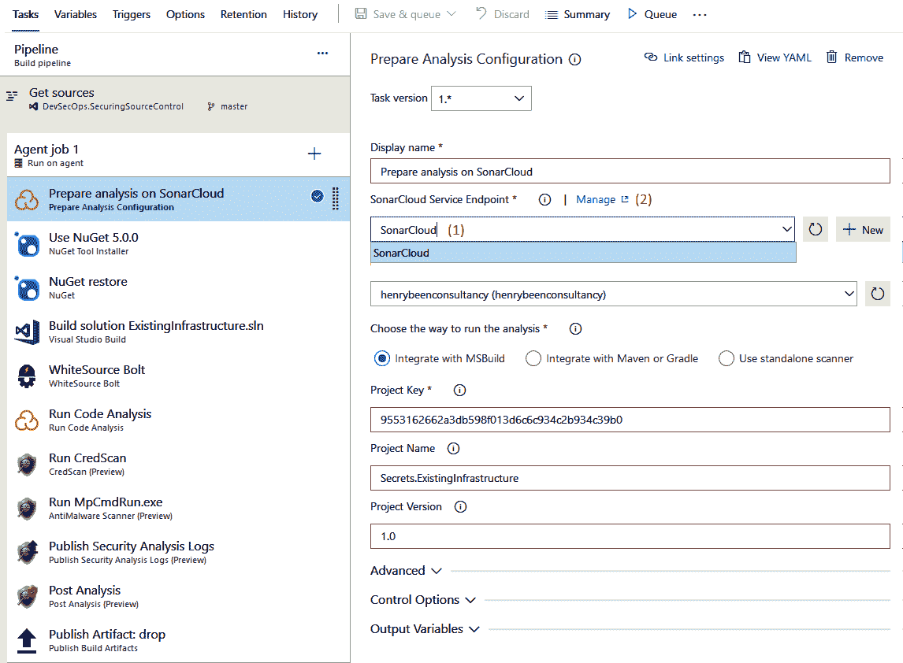

# 迁移到持续集成

在为你的组织设置源代码控制，并决定支持并行工作的分支和合并策略之后，你就可以继续进行持续集成。持续集成是一种方法，其中每个开发人员将自己的工作与他人的工作进行集成，并验证合并后的工作质量。这样做的好处是在流水线的早期提高质量，减少后续合并代码更改时出现错误的风险，减少生产环境中发现的错误数量，从而降低成本并保护你的声誉。

持续集成只有在具备必要工具和适当设置时才能实现。在本章中，你将学习如何使用 Azure DevOps 管道来设置持续集成。

本章将涵盖以下主题：

+   引入持续集成

+   创建构建定义

+   运行构建

+   使用 YAML 管道

+   代理和代理队列

+   其他工具

# 技术要求

要进行本章中的操作示例，你需要一个 Azure DevOps 组织。

# 引入持续集成

**持续集成**是一种方法论，开发人员将自己的更改与项目中所有其他开发人员的更改进行集成，并测试合并后的代码是否仍然按预期工作。通过这种方式，你可以创建一个快速反馈的循环，及时了解自己工作的效果。

在使用广泛的分支策略来隔离代码更改时，开发人员经常会在一个独立的分支上工作几天、几周，甚至几个月。虽然这种做法可以确保他们的更改不会影响其他人，但它也是确保以后不会出现合并问题的好方法。如果你曾经将几周或几个月的工作合并回主分支，你就会知道这需要多少工作，而且通常会导致错误或其他问题。

为了防止这种情况，开发人员应该养成每天至少将自己的更改与其他开发人员的更改集成一次的习惯。这里的集成至少指合并、编译和运行单元测试。这样，开发人员的更改质量会不断收到反馈，并且由于这些反馈是合并的，因此它是一种防止后续合并问题的好方法。

持续集成还可以使你在管道中嵌入其他关注点，自动保持代码的质量。测试和安全扫描就是两个典型的例子。这些话题将在后续章节中讨论，但一个良好的持续集成管道是这些实践的基础。

在本章的其余部分，你将学习如何使用 Azure Pipelines 设置持续集成的技术手段。但首先，我们来看一个常见的误解以及持续集成的四大支柱。

虽然自动化的持续集成构建是执行持续集成的一个重要组成部分，但持续集成不仅仅是拥有一个构建管道。需要记住的重要一点是，持续集成是一个过程，其中每个开发者至少每天将他们的工作与同事的工作进行整合。然后，将整合后的源代码进行编译和测试。价值来自于编译和测试整合后的工作，而不是孤立的工作。

# 持续集成的四大支柱

持续集成成功采用的四大支柱：

+   **版本控制系统**：用于存储自系统创建以来所做的所有更改。版本控制系统在前一章中已有讨论。

+   **软件包管理系统**：用于存储你在自己应用程序中使用的二进制包以及你创建的包。将在第五章中详细讨论，*依赖管理*。

+   **持续集成系统**：可以将所有开发者的更改合并到一起——每天多次——并创建一个整合后的源版本。可以使用 Azure DevOps 管道来实现这一点。

+   **自动化构建过程**：用于编译和测试合并后的源代码。我们将展示如何使用 Azure DevOps Pipelines 实现这一过程。

可以在 Azure DevOps 中设置持续集成和自动化构建。下一节将解释如何在 Azure DevOps 中设置这两者。

# 在 Azure DevOps 中创建构建定义

执行持续集成的主要方式是使用持续集成构建。在 Azure DevOps 中，构建可以作为 Azure Pipelines 服务的一部分进行配置。目前有两种方法可以创建构建定义：

+   通过视觉设计器（也叫做**经典构建与发布**）

+   通过**另一种标记语言** (**YAML**) 文件（也称为 **YAML 管道** 或 **多阶段管道**）

本节其余部分重点介绍视觉设计器。下一节，*YAML 构建定义*，将更详细地讲解 YAML 管道。两种方法支持大致相同的功能，尽管存在一些差异。一些在经典构建和发布中可用的功能目前（尚未）在 YAML 构建定义中提供。此外，一些新功能仅在 YAML 管道中提供。

如果你没有管道的经验，经典编辑器是一个很好的一步，可以帮助你熟悉持续集成/持续开发管道的工作方式，然后再过渡到 YAML 管道。经典构建中的几乎所有概念也都可以转化为 YAML 构建。

在接下来的几节中，我们将从构建经典构建管道开始。

# 连接到源代码管理

要开始创建构建定义，请按照以下简单步骤操作：

1.  打开 Pipelines 菜单。

1.  在此菜单中，点击构建。这里，你将看到一个按钮用于创建新的构建。点击该按钮后，将打开一个新的视图用于创建构建，如以下截图所示：


1.  然后，你将被引导到新的 YAML 体验界面，但你仍然可以通过选择经典编辑器选择返回。

选择经典编辑器后，你可以配置如何连接到源代码控制系统。经典编辑器是以下各节中所有截图中可见的编辑器。

支持许多源代码控制系统。如果你使用的是托管的 Git 仓库，选择你的具体产品（如果有），如果没有可用的产品，选择“其他 Git”；目前，支持 GitHub、GitHub 企业服务器和 BitBucket Cloud。之所以如此，是因为使用“其他 Git”进行持续集成时采用的是轮询模型，而所有特定产品都使用它们已知的集成 Webhook。以下示例适用于位于同一 Azure DevOps 实例中的 Git 仓库。

当你选择流水线头部时，你可以设置构建定义的名称，并选择默认运行阶段的代理池。代理负责实际执行任务，代理的详细信息将在本章的“代理和代理队列”部分进行更深入的探讨。

在流水线头部下方，你可以看到构建定义的时间顺序布局。首先是下载源代码。在这里，你可以再次选择连接到源代码控制系统。你还可以指定更多与获取源代码方式相关的高级设置，如是否先清理构建目录、选择分支或添加标签。

# 配置作业

在源节点下方，你可以添加一个或多个作业，执行你想要完成的大部分工作。可以通过流水线头部的省略号来添加作业。这里有两种类型的作业：

+   **无代理作业**：无代理作业可用于运行不需要代理的任务。

+   **代理作业**：代理作业用于运行需要在代理上运行的任务，这适用于大多数任务。

一些无代理任务的示例如下：

+   等待手动批准后继续

+   插入延迟后再继续

+   调用 REST API

+   调用 Azure 函数

无代理作业的主要好处是它在运行时不会占用代理。这样可以释放代理去做其他工作，意味着你需要的代理更少，从而节省成本。此外，你可以并行使用的代理数量受你在 Azure DevOps 中购买的并行流水线数量的限制。限制代理作业的数量也能节省费用。

让我们回顾一下配置作业的过程：

1.  选择任何任务。你将看到以下截图所示的视图。在此视图中，你可以更改任务的名称，并且对于代理任务，可以覆盖执行此任务的代理池：


1.  接下来，指定要用于执行该任务的代理池。在这里，还指定了你对执行该任务的代理的需求。需求将在本章的*代理和代理队列*部分进行讨论。

1.  作为代理执行计划的一部分，你可以指定并行性，并选择以下三种选项之一：

    +   无：这将依次在同一代理上执行你添加到代理任务中的所有任务。

    +   多配置：在这里，你可以指定一系列变量来确定要运行的构建变体的数量。如果你想从相同代码创建例如 x86 和 x64 构建，这非常有用。

    +   多代理：在这里，你可以指定将并行运行相同任务的代理数量。

1.  接下来，你可以指定一个或多个依赖项。这些是需要在选定的任务运行之前完成的其他任务。

1.  此外，对于任何任务，你都可以指定如何处理前一个任务中的错误，告诉它是继续执行还是停止。

作为第 3 步和第 4 步的替代方案，你还可以指定一个自定义表达式来判断是否应运行某个任务。此表达式应返回布尔值，并支持基本操作，如`or()`、`and()`或`eq()`。以下是一个示例条件：

```
and(succeeded(), ne(variables['Build.SourceBranch'], 'refs/heads/master'))
```

此条件指定，只有在所有先前的任务都成功并且构建不是从主分支启动时，任务才会执行。详细描述条件语法的链接将包含在本章的末尾。

无代理任务的选项比代理任务少。例如，无法在多个变量值的并行任务中执行相同的构建。

# 向任务中添加任务

在添加一个或多个任务之后，你可以将任务添加到工作中。任务定义了在构建执行过程中要完成的实际工作。以下截图展示了如何添加任务并进行配置：

1.  点击你想要添加任务的工作旁边的加号：


1.  然后，你将看到一个任务选择器，在其中可以找到任何与搜索输入匹配的任务，并通过点击添加按钮来添加一个或多个任务。然后将打开一个新屏幕，你可以在其中配置各个任务。此处提供的选项因任务而异。

1.  一个任务可以有多个版本，你可以在任务的主要版本之间切换。这意味着维护者可以推送非破坏性的更新，你将自动接收这些更新。主要或破坏性更新可以通过新的主要版本号推送，你可以根据自己的需要进行升级。

可以根据需要向管道任务添加任意数量的任务。

# 发布构建工件

构建定义的一个重要部分是它的结果。构建通常用于生成一个或多个工件，这些工件稍后会用于应用程序的部署。工件的示例可以是可执行文件或安装程序文件。这些文件需要在流水线完成后可供使用。

如上图所示的发布构建工件任务是专门设计用于此目的的任务。它允许您选择一个文件或目录，并将其发布为**工件名称**。其结果是，所选路径中的文件会在每次流水线执行时保留，以便手动下载或稍后在发布定义中使用。发布定义将在下一章第四章《*持续部署*》中讨论。

接下来，我们将学习如何将我们的流水线与其他工具集成并配置我们的服务连接。

# 调用其他工具

在构建流水线时，我们通常需要将它们与其他工具集成。对于源代码控制系统，这是创建流水线时的一部分，您只能选择内置的选项。对于任务，您可以使用服务连接创建对任何工具或位置的引用。以下截图展示了一个使用服务连接连接到 Azure 应用服务的任务示例。

服务连接是指向第三方系统的指针，具有一个名称和一系列不同于每种类型的服务连接的属性。通常，您需要输入一个 URL 来定位另一个服务，并提供身份验证机制。以下步骤将帮助您配置服务连接：

1.  在定义一个或多个服务连接后，您可以从下拉菜单中选择要使用的服务连接：



1.  服务连接在项目设置中集中管理。您可以通过直接从当前配置的任务访问管理视图，如上图所示。您也可以通过导航到项目设置，然后转到服务连接来访问，如下图所示（见标签 1）：


1.  在此视图中，您可以添加新的服务连接或更新现有的服务连接（见上图中的标签 2）。

默认情况下，服务连接的作用域是项目级别，这意味着它们并非对整个 Azure DevOps 组织中的所有人可用。为了鼓励服务连接的重用，Azure 从 2019 年中期起允许在项目之间共享它们。

# 任务市场

Azure Pipelines 内置了一组常用任务；然而，使用 Azure DevOps 的 Visual Studio 市场可以找到更多任务。如果你是管理员，你可以在这里查找并安装扩展，这些扩展会添加任务。如果你是普通用户，你也可以在这里找到任务；然而，你不能安装它们，只能请求它们。你的 Azure DevOps 管理员会收到通知，如果他们批准，便可以代表你安装该扩展。

当然，你也可以编写和分发自己带有任务的扩展。

# 创建变量和变量组

当你配置构建时，可能会有一些值需要多次使用。通常明智的做法是将这些值提取为变量，而不是在任务中反复使用这些值。

变量可用于记录你不希望存储在源代码控制中的值。像密码和许可证密钥这样的值，可以在使用锁定符号锁定后，安全地存储为不可检索的值（请参见下图标签 1）。保存构建定义后，这些值会被加密，并且只能被属于它们的构建使用。你将无法再检索这些值，它们将会从日志和其他输出中自动清除。

要学习如何在 Azure Pipelines 中使用变量，请按照以下步骤操作：

1.  在 Azure Pipelines 中，你可以通过进入变量 | 管道变量选项卡来添加变量到你的构建定义中（请参见下图标签 3）。在这里，你可以按名称值的形式输入它们，正如下图所示：


1.  一旦定义好，你可以在同一构建的所有任务和所有工作中使用这些变量。为此，你可以使用以下符号：

```
$(variableName)
```

1.  最后，你可以将变量标记为“队列时可设置”（请参见前面截图中的标签 2），这意味着每当有人排队新的构建时，可以更改这些变量的值。一个使用此功能的变量示例是`system.debug`内置变量*。*当此变量设置为`true`时，构建中将包含详细的调试日志记录。

除了你自己的变量外，还定义了系统变量。这些是包含当前正在运行的构建信息的变量，包括版本号、代理名称、构建定义详情、源代码版本等。系统定义变量的完整列表链接将在本章末尾提供。

# 变量组

除了为特定构建创建变量外，你还可以创建变量组。这些变量组可以与一个或多个构建关联。这是共享变量的一种有效方式；这些变量的示例可能是你公司的名称、商标文本、产品名称等。让我们来看一下如何使用变量组：

1.  通过在“管道”菜单中点击“库”来访问变量组（参见下方截图中的标签 1）。这将显示现有的变量组列表，你可以在这里编辑并添加新的变量组，如下截图所示：


1.  在这里，你可以像处理构建中变量那样处理变量。唯一的区别在以下列表中有突出显示：

    +   你不能将组中的变量标记为在队列时可设置。

    +   你可以允许或拒绝在所有管道中使用此组。如果你拒绝在所有管道中的使用，则只有你自己可以使用该变量组。你可以通过安全选项（在前面的截图中标记为 2）授权其他用户或组。

    +   你可以参考一个 Azure 密钥库，变量组将作为占位符。登录 Azure 后，你可以选择一个密钥库，并选择你希望通过变量组访问的密钥库中存储的值。

**Azure 密钥库**是一个 Azure 服务，用于安全存储机密。密钥库中的机密会自动版本控制，因此较旧的值不会被覆盖，而是被更新的版本所替代。此外，你可以指定隔离的访问策略，按用户指定是否可以读取、写入、更新或删除值。所有这些操作都会在密钥库中进行审计，因此你也可以查找是谁进行了哪些更改。如果你将 Azure DevOps 与密钥库连接，则会在你的活动目录中创建一个新的服务主体，并授予它对该密钥库的访问权限。现在，每当 Azure DevOps 需要从变量组中获取变量时，实际的值将从密钥库中提取。

变量组可以链接到构建中的变量，位于“变量组”选项卡下（参见前一部分的截图）。

除了处理变量组，你还可以处理库中的文件。你可以上传一些其他用户无法访问的文件，但这些文件可以在构建中使用。这对包含私钥、许可证密钥及其他机密文件非常有用。

就像你使用变量组一样，你可以指定每个**安全文件**是否可以被任何构建使用，或者只授权特定用户使用。

# 触发构建

构建定义中的下一个选项卡控制着什么应该启动或触发构建。要实现持续集成，按照以下步骤操作：

1.  点击触发器选项卡，然后选择左侧的第一个标题：


1.  勾选启用持续集成框。这意味着 Azure DevOps 将监听你仓库中的变化，并在有新机会时立即排队进行新的构建。

1.  接下来，您可以选择是否在每次有新更改时单独构建每个更改，或者在多个新更改到达时将它们批量构建。建议您尽可能单独构建每个更改。

1.  除了连续集成触发器外，您还可以指定一个或多个分支和路径过滤器。在这里，您可以指定哪些分支和文件需要排队进行新的构建。您可以根据需要指定包含或排除的项。一个常见的例子是将构建限制在主分支上。如果您的代码库中有名为`doc`和`src`的文件夹，并且所有源文件都在后者文件夹中，那么将触发器限制为该路径可能更为合理。

1.  除了选择使用连续集成触发器外，您还可以选择按计划定期执行构建，选择一个或多个工作日和一个时间。

1.  您还可以安排在另一个构建完成时自动启动一个构建。这被称为**构建链**。

接下来，让我们学习如何更改构建定义的配置。

# 构建选项

您可以更改构建定义的高级配置选项。这些选项包括描述、构建号格式以及在失败和超时时自动创建工作项。要进行设置，请按照以下步骤操作：

1.  点击选项卡。您应该到达以下屏幕：


1.  现在，创建您的构建号格式。如果该字段留空，您的应用程序构建号将设为一个不断增加的数字，每次构建时增加 1。这个数字在团队项目内是唯一的，并且在所有构建定义中递增。您还可以使用您可用的变量来指定您自己的格式。常见的做法是手动指定主版本号和次版本号，然后使用变量添加递增的数字。以下示例指定了一个版本为 4.1.xx，其中最后部分由一个递增的两位数字替代：

```
4.1($Rev:.rr)
```

1.  在右侧，有一些高级（但很少使用的）选项，用于指定每个作业在构建定义中的授权范围和构建超时设置。

1.  还可以指定每个作业在构建定义中应该满足的代理需求。我们将在本章的*代理和代理队列*部分进一步讨论需求。

左侧的其他选项使您能够暂时暂停流水线。

# 构建历史

最后一个标签页，称为“历史记录”，显示了对构建定义所做的每一个更改的列表。构建定义以 JSON 格式存储，您可以查看每个更改的并排比较。保存构建时添加的评论也会存储在这里，并可以用于提供更改的理由。

由于构建是保证质量的重要手段，因此重要的是跟踪谁修改了它们，以确保不会删除自动化质量指标。

现在，您已准备好运行第一次构建了。您可以直接使用本节大多数截图中可见的**保存**和**排队**按钮来运行它。本章的*运行构建*部分将教您如何处理所获得的结果。

# 任务组

在一个具有多个管道的团队或组织中工作时，通常不久就会出现多个具有相同结构的管道。例如，在某些公司，所有管道都包含安全扫描、运行测试和计算测试覆盖率的任务。

不必在各处重复这些任务，可以将它们从现有管道中提取到任务组中。任务组本身可以像任务一样在多个管道中使用。这样做可以减少创建新管道或更新所有管道以满足新需求的工作量。这样做还确保使用任务组的所有管道具有相同的任务配置。

要创建新的任务组，请打开任何现有的构建定义并按以下步骤操作：


1.  通过点击它们并同时按住*Ctrl*键，或使用鼠标悬停在任务上时出现的选择器来选择一个或多个任务。

1.  右键单击所选项并选择创建任务组。

1.  在弹出窗口中（截图未显示），选择任务组的名称、描述和类别。如果选择的任务中有指定变量值，现在可以为这些参数提供默认值和描述。这些参数将在使用任务组时可用，并且需要在使用任务组时进行配置。

1.  单击创建（截图未显示）后，现有的构建定义将被更新，删除所选任务并用新的任务组替换它们。

将已有的任务组添加到构建或发布定义中的方法与添加常规任务完全相同。任务组显示在可供选择的任务列表中。

可通过导航到管道菜单然后选择任务组找到所有现有的任务组列表。要编辑现有任务组，请在显示的列表中选择它，然后选择编辑选项。编辑任务组的方式与编辑构建定义完全相同。

本节讲解了创建构建定义及描述应用程序构建方式的内容。下一节是执行构建。

# 运行构建

在本节中，您将学习如何处理构建结果，并用它们来报告和生成构建。您还将学习如何在每次拉取请求时运行构建，并将变更的质量报告回到拉取请求，以帮助审阅者。

# 查看构建结果

在构建运行时，代理将按顺序执行所有配置的步骤。Azure Pipelines 会捕获所有这些步骤的详细信息和日志。如以下截图所示，构建会在左侧显示其执行的所有步骤列表。点击任何一个步骤将打开一个详细视图，显示每个步骤的日志：


每当构建过程中出现警告或错误时，它们分别以橙色或红色显示。

# 构建拉取请求

在设置好构建定义并运行第一次构建后，你可能会看到第一次失败的出现——例如，当有人不小心提交并推送了无法编译或包含无法成功运行的单元测试的更改时。你可以通过在拉取请求到达时自动运行构建定义来防止这种情况发生。要进行配置，请按照以下步骤操作：

1.  在项目设置中点击“策略”（Policies）。会打开以下屏幕，点击“添加构建策略”（Add build policy）：


1.  选择一个构建定义，用于验证拉取请求。

1.  接下来，你可以配置另外三项内容：

    +   触发器：定义构建定义何时启动，可以是自动启动或手动启动。当然，真正的价值来自于自动运行验证构建。

    +   策略要求：这决定了如果构建失败，拉取请求是否可以完成。换句话说，这决定了你是否可以忽略失败的构建。建议尽可能避免将此设置为“可选”（Optional）。

    +   构建过期时间：这决定了一个成功的构建结果有效的时间长度。默认值为`12`小时，但你应该考虑在主分支更新时将其更改为立即。这样做的好处是，无法在未先运行构建并验证当前分支状态与拟议更改组合的情况下合并更改。

你可以添加多个构建策略。如果你有很多可以自动验证的内容，并且希望将自动验证时间保持在最低，那么这种方法是一个不错的选择。

# 访问构建构件

除了编译、测试和验证源代码外，构建还可以用于生成所谓的构件。构件是构建过程中的输出，可以是你希望从构建中保存和发布的任何内容，例如测试结果和应用程序包。

应用程序包是指应用程序某个版本的不可变构建。该包稍后可以在发布过程中被提取，并部署到一个或多个环境中：


在前面的截图中，你可以看到，在执行构建的摘要部分，发布了两个工件。可以通过屏幕右上角的“工件”下拉菜单或“摘要”标签访问工件。你可以从此页面下载并浏览工件，在下一章中，你将看到如何使用这些工件来设置持续交付。

太好了！通过这个，你已经学会了如何使用可视化设计器创建定义。但等等——正如我们之前提到的，还有另一种方法，那就是使用 YAML 文件。让我们在下一节中看看这个方法是如何工作的。

# 使用 YAML 流水线

你已经看过如何使用可视化设计器创建构建定义。从 2019 年初开始，另一种新的替代方法是使用 YAML 流水线。在使用 YAML 流水线时，你需要在 YAML 文件中指定完整的构建定义，并将其存储在源代码控制中，通常与构建所针对的源代码一起存储。

虽然两种流水线系统并存，但现在使用 YAML 流水线是定义流水线的首选方法。这意味着新特性很可能只会出现在 YAML 流水线中。

# 使用构建定义作为代码的原因

当你第一次开始使用 YAML 构建定义时，你可能会发现学习曲线比使用可视化设计器时更陡峭。这可能会引发一个问题，为什么你要使用 YAML 定义的构建。YAML 构建定义相较于可视化设计定义有两个主要优点。

当你在 YAML 中编写定义时，它可以与代码一起托管在源代码控制中。这样做的结果是，你在更改源代码控制时所制定的所有策略现在会自动应用于你的构建定义。这意味着任何更改都必须通过拉取请求，经过同行审查，并且可以提前进行构建和验证。在你的构建定义和代码中强制执行**四眼原则**，有助于提高构建过程的稳定性。当然，这也有助于安全性和合规性，这些话题将在后续章节中讨论。

除了提高安全性之外，将构建定义存储在源代码控制中，还意味着它在每个分支中都是可用的。这意味着它可以在每个分支中进行更改，以便在合并到主分支之前构建该特定分支。当使用可视化设计的构建定义时，这个单一的定义负责构建不仅仅是你的主分支，还包括你希望通过拉取请求合并的所有分支。

这意味着你必须执行以下操作之一：

+   更新构建定义，以便合并你将要合并的更改。然而，这将导致当前主分支的构建中止。

+   合并更改，这也会导致构建失败，因为构建定义尚未更新。

这两种选项都有可能允许错误的更改流入目标分支，从而破坏持续集成构建的目的。通过为每个分支创建一个构建定义，我们消除了这个问题。

虽然将构建定义存储在源代码控制中是有益的，但这在经典构建中也同样适用。每个更改都会被记录，您可以看到谁在何时更改了什么，并且可以查看更改作者的可选说明。

# 编写基本的 YAML 管道

要开始使用 YAML 构建，您需要做两件事：

1.  首先，您需要编写您的 YAML 文件。

1.  然后，您需要从中创建一个构建定义。

那么，让我们开始吧。

# 编写 YAML 文件

以下代码示例包含了构建 .NET Core 应用程序并运行单元测试的示例 YAML 定义。将文件保存为任意名称，例如 `pipeline.yaml`，并放入 Azure DevOps 中的任意 Git 仓库中。然后，稍后可以使用它创建一个管道：

```
trigger: 
- master

pool:
  name: Azure Pipelines
  vmImage: windows-2019

steps:
- task: DotNetCoreCLI@2
  displayName: 'dotnet build'
  inputs:
    projects: '**/*.csproj' 
- task: DotNetCoreCLI@2
  displayName: 'dotnet test'
  inputs:
    command: test
    projects: '**/*.csproj'
```

这个示例 YAML 定义了一个基本的管道。每个管道都需要以某种方式被触发。就像经典构建一样，可以通过将管道连接到源代码仓库中的变更来触发管道。默认的仓库是包含 YAML 定义的仓库。`trigger` 关键字用于指定哪些分支的推送应触发管道。一个好的起点是 `master` 分支。由于 `trigger` 关键字接受一个列表，可以指定多个分支并使用通配符。

触发器不是必需的，因为管道也可以手动启动。

还有其他选项可以替代使用 `trigger` 关键字，例如在仓库中包括或排除一个或多个分支、标签或路径。这些选项在 [`docs.microsoft.com/en-us/azure/devops/pipelines/yaml-schema#triggers`](https://docs.microsoft.com/en-us/azure/devops/pipelines/yaml-schema#triggers) 中有详细描述。

除了触发器外，每个管道还包含一个或多个任务，就像经典构建定义中的任务一样。所有这些任务需要在代理池上执行——同样，就像经典构建定义中的任务一样。`pool` 关键字用于指定一组键/值对，通过指定池的名称来决定任务将在哪个池上运行。在使用 Microsoft 提供的默认代理时，可以使用 `Azure Pipelines` 的默认名称。在使用此特定池时，必须指定一个虚拟机映像。这决定了将执行任务的代理上可用的操作系统和软件。

可以在 [`docs.microsoft.com/en-us/azure/devops/pipelines/agents/hosted#use-a-microsoft-hosted-agent`](https://docs.microsoft.com/en-us/azure/devops/pipelines/agents/hosted#use-a-microsoft-hosted-agent) 找到所有可用的虚拟机映像的最新列表。

最后，定义包含了构成管道本身的一系列步骤。这些步骤与经典构建管道中你可以拖入的任务一一对应。通过指定任务的名称和版本（用`@`符号分隔），可以添加任务。接下来，你可以选择性地为任务指定显示名称。这个显示名称稍后会在显示执行结果的视图中可见。最后，为任务指定一个或多个输入。这些输入与任务特定的配置相关，你之前在可视化设计器中已经看到过。

# 创建 YAML 管道

在将 YAML 文件保存在代码库后，你可以从中创建构建定义。在创建新的构建定义时（请参阅本章的*创建构建定义*部分），你应按照以下步骤进行操作：

1.  启动向导时，选择 Azure Repos Git YAML 选项。

1.  从这里开始，通过向导选择并查看你想要构建的 YAML 文件，如下图所示：


1.  在第一步中，定位包含你想用作管道的 YAML 文件的代码库。

1.  接下来，选择一个示例 YAML 文件开始配置管道，或者引用一个已经存在的文件。

1.  最后，你可以查看已选择的 YAML 文件，并从中启动构建。

你的管道会自动保存。一旦管道被保存，就可以启动并像使用经典构建管道一样与其交互。

# 多作业管道

你在上一节中看到的管道没有指定任何作业，正如你从经典构建部分回忆起来的那样。相反，它在`steps`关键字下包含了一组任务。这意味着它隐式地只包含一个作业。使用 YAML 管道时，也可以创建一个包含多个作业的定义。为此，可以使用以下结构：

```
trigger: 
- master

pool:
  name: Azure Pipelines
  vmImage: windows-2019

jobs:
- job: job1
  displayName: A pretty name for job1
  steps:
  - task: DotNetCoreCLI@2
    ...
- job: job2
  displayName: My second job
  pool:
    name: Azure Pipelines
    vmImage: ubuntu-18.04
  ...
```

与其直接在管道中添加`steps`关键字，不如首先创建一个作业列表。在该列表中，添加一个或多个`job`关键字，然后是该作业的名称。在此技术名称旁边，可以为每个作业指定一个显示名称（`displayName`）。

如第二个作业所示，你还可以为每个作业指定使用哪个代理池。当未为作业指定代理池时，将使用文件顶部指定的默认池。

本节讨论的作业称为代理作业。除了代理作业外，还有服务器作业、容器作业和部署作业可供选择。有关这些类型作业的更多信息，请访问[`docs.microsoft.com/en-us/azure/devops/pipelines/process/phases#types-of-jobs`](https://docs.microsoft.com/en-us/azure/devops/pipelines/process/phases#types-of-jobs)。

默认情况下，管道中的所有作业并行运行，但可以使用控制选项来改变这一点。

# 控制选项

要控制作业的顺序，可以在作业定义中使用 `dependsOn` 关键字。这表明该作业只能在一个或多个作业完成后才可以开始。除此之外，还可以使用 `condition` 关键字来指定作业应在何种条件下运行。可以将这两个关键字结合起来，实现更复杂的场景，如下所示：

```
jobs:
- job: compile
  steps:
  ...
- job: test
  dependsOn: compile
  steps:
  ...
- job: build_schema
  dependsOn: compile
  steps:
  ..
- job: report
  dependsOn:
  - test
  - build_schema
  condition: or(succeeded('test'), succeeded('build_schema'))
  steps:
  ..
```

这个管道将首先运行名为 `compile` 的作业。一旦该作业完成，接下来的两个作业，`test` 和 `build_schema`，将并行运行，因为它们都依赖于 `compile` 任务。在这两个任务完成后，`report` 任务将运行，因为它声明依赖于 `test` 和 `build_schema` 作业。在这个作业实际开始之前，会评估条件，以决定该作业是否真正运行或跳过。条件可以使用类似于许多编程语言的语法来构建。它检查作业是否成功完成，使用 `succeeded()` 和 `failed()` 函数。此外，还支持 `or()`、`and()` 和 `ne()` 等布尔运算符。

你可以根据需要组合使用 `dependsOn` 和 `condition` 关键字。唯一的要求是，至少应有一个作业不依赖于任何其他作业。

# 变量

就像经典构建管道一样，YAML 管道支持使用变量。变量可以在 YAML 管道的每个级别（任务内除外）使用以下语法定义：

```
variables:
  name: value
  anotherName: otherValue
```

变量可以使用你已经熟悉的经典构建管道语法来检索——`$(name)` 和 `$(anotherName)`。

还可以在 YAML 管道中引用现有的变量组。这是通过使用 `group` 关键字来完成的，而不是指定变量的名称。要从名为 `myVariableGroup` 的变量组中检索所有变量，可以将前面的 YAML 扩展如下：

```
variables:
  name: value
  anotherName: otherValue
  group: myVariableGroup
```

变量可以在 YAML 管道的每个级别设置，但只有在根级别设置的变量可以在手动排队新执行时被覆盖。

# 管道工件

就像经典构建一样，YAML 管道可以用于构建和发布工件。由于用于执行此任务的任务与其他任务一样，它可以直接添加到作业的步骤列表中。

然而，随着 YAML 管道的引入，一种新的工件类型——所谓的管道工件——已经可用。这带来了提高大规模工件上传和下载速度的好处。在使用经典发布时，管道工件不会自动下载，而构建工件会。

要发布管道工件，可以在作业的 `steps` 关键字中使用以下 YAML：

```
steps:
- publish: folder/to/publish
  artifact: artifactName
```

管道工件主要用于在多阶段 YAML 管道中下载，后续章节也会涉及此内容。

# 编写 YAML 管道的技巧

从零开始编写 YAML 管道在你刚开始时可能会比较复杂。此时有两个工具可以帮助你。

首先，可以从可视化设计器导出 YAML。对于每个任务，都有一个带有“查看 YAML”标题的链接。点击该链接会弹出一个小窗口，显示你当前打开的任务和配置对应的 YAML。同样的操作也可以用于作业，并且在特定条件下也可以用于完整的构建定义。

另一个用于编写 YAML 的工具是内置的 YAML 编辑器：


每当你打开一个 YAML 构建定义时，有两个工具可以帮助你。首先，在 YAML 文件的每个位置都有自动完成功能。它会显示该位置可用的选项。此外，在右侧的任务选择器中也有代码片段可供选择。当选择右侧的任何任务时，你可以通过可视化配置它们，然后点击添加按钮将生成的 YAML 添加到你的定义中。

这两个工具旨在将可视化设计器的简便性带入 YAML 构建体验，结合两者的优势。

# 代理和代理队列

到目前为止，你创建的构建定义可能包含代理作业，而这些作业又包含任务。这些任务并不会直接在你的 Azure DevOps 组织中执行，而是由在虚拟机或容器中运行的代理执行。代理被分组到代理池中。你可以使用两种类型的代理池：

+   内置代理池

+   自托管代理池

让我们逐一了解它们。

# 内置代理池

内置代理池由微软管理，作为产品的一部分提供给你。根据你的需求，提供不同的代理池。这些池运行不同版本的 Windows 和 Visual Studio，同时也有运行 Linux（Ubuntu）和 macOS 的池。

这些托管池的缺点是，如果你需要，你无法在托管代理的机器或容器上安装额外的软件。这意味着，在这些情况下，你必须创建自己的私有代理池。

# 创建私有代理池

私有池在你的 Azure DevOps 组织中定义，并从那里提供到一个或多个团队项目。然而，你也可以在团队项目级别创建私有池，以便一次性创建和提供它们。为此，进入 项目设置 | 代理池。你应该会看到以下的添加代理池选项：


给池命名并确定是否希望自动为所有管道提供访问权限后，你可以保存池。在创建池之后，你可以添加或移除代理。

# 添加和移除代理

添加代理分为两步：

1.  下载并提取代理运行时。你可以通过访问代理池概览部分并打开任何私有代理池的详细信息来找到代理运行时。打开池的详细信息后，点击右上角的“新建代理”：


1.  在打开的对话框中，你可以下载一个包含代理和提取及安装代理说明的 ZIP 文件。

在配置阶段，系统会提示你使用你的 Azure DevOps 组织进行身份验证，并提供你希望安装代理的代理池名称。虽然有 x86 和 x64 代理可用，但建议你使用 x64 代理，除非你有特殊原因不使用它。

要从池中移除代理，你可以使用两种方法：

+   你可以返回 PowerShell 命令行，就像安装时一样，使用以下命令：

```
.\remove.cmd
```

+   另外，你还可以通过代理标签页从代理池概览中移除代理。前往“项目设置” | “代理池”（参见以下截图中的标签 1）| “代理”（参见以下截图中的标签 2），然后选择你要移除的代理的选项按钮（参见以下截图中的标签 3）。接着，点击“删除”（参见以下截图中的标签 4）：


在上面的截图中，你可以看到使用界面移除代理的步骤。请注意，这不会清理主机上的二进制文件和任何文件；然而，如果托管代理的机器出现故障或虚拟机被移除，这就是移除代理的唯一方法。

# 代理选择

每当构建作业开始运行时，系统会从代理池中选择一个代理来执行你在管道中定义的任务。选择代理的过程分为两个步骤：

1.  只有属于选定池的代理才有资格运行任务。这意味着，在使用私有代理池时，最好池中有多个代理。这样，当你将一个代理下线进行维护时，依赖该代理池的代理作业仍然可以继续运行。

1.  在代理作业可以运行之前，会收集每个作业的需求及其包含的任务。如同你在*变量组*部分中学到的，代理作业可以指定它所使用的代理的需求。任务也是如此——它们也可以指定需求。要运行作业，只有符合所有这些需求的代理才会被使用。需求和功能是键值对，其中值是整数。例如，功能是`msbuild=15.0`，相应的需求是`msbuild>15.0`。

当没有合适的代理来满足构建定义时，构建会在超时后最终失败。

# 查找代理功能

要查找各个代理上可用的功能，请按照以下步骤操作：

1.  导航到“组织设置” | “代理池”：


1.  导航到正确的代理池（无论是托管的还是私有的），然后点击“Agents”，接着打开代理详情（在前面的截图中未显示）。

1.  打开“Capabilities”标签。

在这里，你可以使用顶部块（称为用户定义的能力）为代理指定一个或多个自定义能力。对于自托管（私有）代理，在安装代理时，机器上发现的所有能力也会显示。

Azure DevOps 并不是唯一可用于运行持续集成构建的工具。下一节将带你了解其他几种工具。

# 其他工具

除了 Azure DevOps 之外，还有许多其他工具可用。另有两个著名的工具是 GitLab CI 和 Jenkins。对这些工具的基本了解将帮助你理解如何在必要时与它们集成。此外，有限的了解其他工具将帮助你更快速地理解概念并概括你如何与这些工具一起工作。

为了突出这些工具如何与相同概念协作，本节中的两个示例与 *“编写 YAML 构建定义”* 部分中的 Azure DevOps YAML 管道是等效的。

# GitLab CI

GitLab 提供了通过 GitLab CI 功能构建管道。GitLab CI 通过将一个名为`.gitlab-ci.yml`的文件放置在仓库的根目录中进行配置。在这个文件中，你可以定义一个或多个阶段和任务，以及它们应该执行的任务。GitLab CI 的 YAML 示例文件如下所示：

```
stages:
  - build
  - test

build:
    stage: build
    script: dotnet build **/*.csproj

test:
    stage: test
    script: dotnet test **/*.csproj
```

正如 Azure DevOps 使用代理池和代理一样，GitLab CI 依赖于 **runners** 来执行实际的工作。在 GitLab CI 中，目前不支持视觉化创建或编辑管道。

# Jenkins

Jenkins 是另一种用于运行构建管道的工具。复杂的构建可以通过 Jenkins 管道运行，这些管道从 Jenkinsfile 获取工作。**Jenkinsfile** 是用 Jenkins 特定的符号编写的，如下代码所示：

```
pipeline {
    agent any 

    stages {
        stage(‘build’) {
        agent any 
            steps {
                dotnet build **/*.csproj
            }
        }

        stage('test') {
            agent any
            steps {
                dotnet test **/*.csproj
            }
        }
    }
}
```

Jenkins 对于视觉化创建和编辑管道的支持有限。这被称为自由式项目（freestyle project）。

# 概述

在这一章中，我们了解了持续集成，并学习了它是你的思维方式、流程和工具的结合。你学习了如何使用 Azure Pipelines 创建构建定义，既可以使用图形设计器也可以使用 YAML，同时学习了如何运行构建。你了解了可以使用构建管道来编译和测试代码，并将结果报告回拉取请求。

你学到构建可以生成结果，称为工件。工件存储并保留在 Azure 管道中，可以用来存储报告，但也是部署管道的起点，你将在下一章学习这些管道。你还了解了运行构建所需的基础设施——即代理和代理池。最后，你看到了一些简短的示例，展示了如何使用 GitLab CI 和 Jenkins 运行持续集成构建，这两个工具也可以用于构建管道。

通过这些知识，你现在能够为你的项目创建构建管道。你可以连接到源控制，生成你将在下一章中用于部署应用程序的构建。通过深入了解任务、作业、阶段和管道的基本结构，你可以解决复杂的应用程序构建问题。

在下一章中，你将继续学习有关管道的内容，但这一次是针对发布的管道。你将学习如何获取构建并将其发布到一个或多个环境中。

# 问题

总结时，这里有一组问题，供你测试自己对本章内容的掌握情况。你可以在附录的 *评估* 部分找到答案：

1.  对错题 – 如果你每天至少编译一次项目中的所有分支，那么你实现了持续集成。

1.  对错题 – 经典构建定义总是与源代码仓库连接的。

1.  对错题 – YAML 管道定义总是与源代码仓库连接的。

1.  以下哪项是从 Azure 管道中调用外部工具所需的？

    1.  外部服务定义

    1.  Azure 服务连接

    1.  服务连接

    1.  服务定位器

1.  使用自托管代理的一些常见原因是什么？（从以下选项中选择所有正确答案：）

    1.  需要访问封闭的网络。

    1.  需要为代理提供特定的扩展任务。

    1.  并行管道执行的数量需要大于 10。

    1.  需要安装特定软件，以便代理能够使用它。

# 进一步阅读

+   Martin Fowler 对持续集成的深入定义可以在[`martinfowler.com/articles/continuousIntegration.html`](https://martinfowler.com/articles/continuousIntegration.html)找到。

+   有关条件语法的详细描述可以在[`docs.microsoft.com/en-us/azure/devops/pipelines/process/conditions?view=azure-devops&tabs=classic`](https://docs.microsoft.com/en-us/azure/devops/pipelines/process/conditions?view=azure-devops&tabs=classic)找到。

+   练习 Azure DevOps 构建的练习可以在[`docs.microsoft.com/en-us/learn/modules/create-a-build-pipeline/index`](https://docs.microsoft.com/en-us/learn/modules/create-a-build-pipeline/index)找到。

+   你可以在[`marketplace.visualstudio.com/azuredevops`](https://marketplace.visualstudio.com/azuredevops)找到 Visual Studio 市场上的 Azure DevOps 插件。

+   你可以在 [`docs.microsoft.com/en-us/azure/devops/pipelines/yaml-schema?view=azure-devops&tabs=schema`](https://docs.microsoft.com/en-us/azure/devops/pipelines/yaml-schema?view=azure-devops&tabs=schema) 找到关于 Azure Pipelines YAML 语法的详细描述。

+   Azure 管道托管和自托管代理池的定价详情可在 [`azure.microsoft.com/en-us/pricing/details/devops/azure-pipelines/`](https://azure.microsoft.com/en-us/pricing/details/devops/azure-pipelines/) 查阅。

+   关于 GitLab CI 的更多信息可以在 [`about.gitlab.com/product/continuous-integration/`](https://about.gitlab.com/product/continuous-integration/) 找到。

+   关于 Jenkins 的更多信息可以在 [`jenkins.io/`](https://jenkins.io/) 找到。
