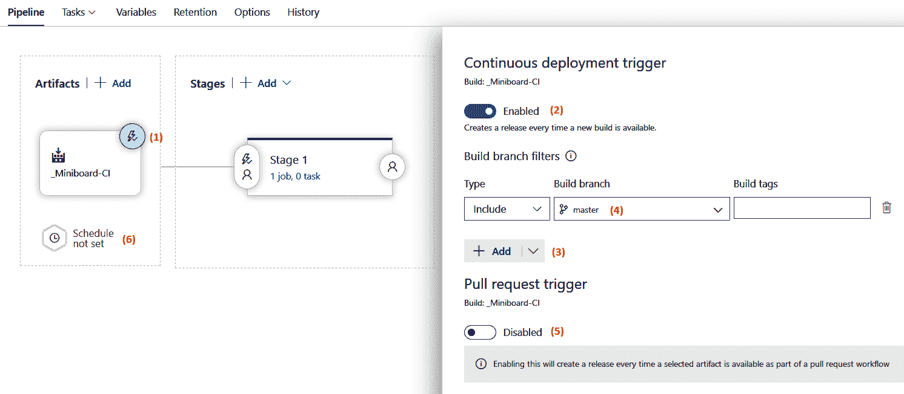

# 持续部署

在上一章中，您学习了如何使用 Azure DevOps 流水线进行持续集成。基于此，您现在知道如何提取源代码的版本并创建可以部署的工件。在本章中，您将学习如何通过持续交付和持续部署扩展这一实践，从而自动将这些工件部署到代码运行所在的服务器或平台。

为了实现这一点，我们将首先介绍 Azure DevOps 发布定义，以便您可以定义和运行应用程序的发布。接下来，将介绍一系列策略，您可以使用这些策略以低风险的方式进行部署。通过这样做，您可以实现自动化部署新版本的过程，且在没有人工干预的情况下，风险较低。然后，我们将把注意力转向自动化生成发布说明。之后，我们将介绍用于部署移动应用程序的 App Center。最后，我们将介绍其他用于持续部署的工具。

本章将涵盖以下主题：

+   持续交付和持续部署

+   使用 Azure DevOps 发布功能

+   编写多阶段 YAML 流水线

+   实施持续部署策略

+   部署移动应用程序

+   自动化发布说明

+   其他工具

# 技术要求

为了尝试本章中描述的技术，您可能需要以下一项或多项：

+   用于构建发布定义和多阶段 YAML 流水线的 Azure DevOps 账户

+   用于部署移动应用程序的 App Center 账户

这两者都有免费试用选项。

# 持续交付和持续部署

持续交付和持续部署之间的区别是一个常见的困惑来源。有些人认为这些术语可以互换，并将它们视为同一概念的两个同义词，但事实上，它们有两个不同的含义。

持续交付是一种实践，团队确保他们构建的工件不断得到验证，并随时准备部署到生产环境中。通常，这通过将工件部署到类似生产的环境中（例如验收环境或甚至是暂存环境），并应用一系列测试（如验证测试）来确保应用程序正常工作。

持续部署是一种实践，每一个部署到类似生产环境并通过所有测试和验证的版本，都会自动部署到生产环境。

在使用 Azure DevOps 时，Azure Pipelines 是实施持续交付和部署的首选工具。这可以通过使用可视化经典编辑器或多阶段 YAML 流水线来实现，接下来的章节将详细讨论这两种方法。

# 使用 Azure DevOps 发布功能

在 Azure DevOps 中，可以通过使用发布来实现持续交付和部署。在创建新的发布定义时，会创建发布过程的轮廓。此过程通常以触发新发布创建的工件开始。接下来，可以定义一个或多个阶段，发布可以部署到这些阶段。这些阶段通常对应于不同的应用程序环境，例如测试环境和生产环境，但这不是强制性的。

让我们学习如何创建新的发布定义，并探索我们拥有的各种选项。首先，导航到**管道**，并从菜单中选择**发布**。从这里，可以开始创建新的发布管道，这将带我们进入一个类似于以下截图的界面：


从前面的屏幕中，我们可以执行以下操作（这些操作在前面的截图中已经编号）：

1.  首先，请注意，在左侧，可以看到发布管道的轮廓，其中有一个框。您可以在此选择一个或多个可以在发布管道中使用的工件。

1.  在这一部分的右侧，有一个框，可以看到发布的不同阶段。默认情况下，已经创建了一个阶段。

1.  可以选择一个模板作为这个预创建阶段的部署管道起点。选择从空白作业开始，允许您从头开始构建自定义部署管道。

选择作业模板或空白作业作为起点后，右侧窗格会关闭，然后就可以开始从左到右编辑发布管道，从工件开始。

一旦骨架发布管道可见，您需要配置的第一件事是发布所需的工件。这是下一节的内容。

# 创建工件和发布触发器

前一章描述了构建定义和 YAML 管道，这些管道创建工件。这些工件会在发布中被拾取，并形成部署应用程序的基础。

要开始编辑发布管道，请按照以下步骤操作：

1.  点击**添加工件**按钮，开始构建发布定义的起点。这将打开右侧窗格，如下图所示：


1.  在项目选择器中，当前项目会默认被选中。

1.  现在，指定发布管道应拾取的工件。

1.  之后，默认版本和源别名会自动选择。默认版本可以在手动启动发布时始终被覆盖，因此“最新”是一个合理的默认值。

1.  源别名是指我们稍后将作业添加到发布阶段时，工件所在文件夹的名称。默认情况下通常是可以接受的。

1.  完成添加工件后，点击**添加**。

现在我们已经指定了要使用的工件，接下来是指定何时应创建新发布。让我们学习如何操作：

1.  要配置新工件触发发布的可用性，请点击工件旁边的闪电符号以打开配置面板。如下截图所示：



1.  在此面板中，可以使用顶部滑块创建新发布（如果有可用发布）。这将展开一个新区域，在此区域中可以定义一个或多个过滤器，以便指定新的工件在何种条件下触发发布。

1.  点击“添加”按钮以开始添加条件。

1.  一个常见的例子是只包括来自主分支的工件，如下所示。

1.  除了来自常规构建的工件，还可以允许来自拉取请求构建的工件来启动新发布。

1.  最后，可以按固定时间表创建新发布。

如果没有指定计划或触发条件，则只有在有人手动执行时，才会创建新发布。

# 指定用于部署发布的阶段

在指定了要发布的工件后，是时候指定一个或多个阶段以部署发布了。通常，每个环境（测试、验收和生产）都会对应一个阶段。但如果情况需要，也可以有其他阶段。

让我们学习如何添加新阶段并探索各种选项。首先，点击“管道”以进入以下屏幕：


现在，完成以下步骤：

1.  点击“添加”按钮以创建新阶段。一个阶段可以是全新的，也可以是现有阶段的克隆。

1.  选择已存在的阶段后，可以使用右上角的“删除”按钮将其移除。

1.  在此屏幕上可以执行的其他操作包括重命名阶段和指定阶段负责人。当发布部署到环境时，负责人将收到通知。

1.  创建并命名一个阶段后，可以像在构建管道中一样，向阶段添加作业和任务。为此，请点击框中表示该阶段的链接。

从这里开始，操作与构建管道完全相同。唯一的区别是：除了代理作业和无代理作业外，还可以使用部署组作业。有关这些内容将在后续的*与部署组协作*部分进行讨论。但首先，让我们了解一下需要哪些阶段。

# 我需要哪些阶段？

在处理发布时，常见的一个问题是，*我在发布管道中需要哪些阶段*？根据文档，阶段应表示发布管道的主要分区。在开始使用发布时，这通常意味着每个环境对应一个阶段。适当的阶段包括**测试**、**验收**和**生产**。

在长期与发布版本合作时，我们可能会在流水线中加入更多的自动化，并希望为其添加额外的检查阶段。例如，可能会有一个名为**负载测试**的阶段，它与**测试**阶段并行执行。另一个例子可能是引入一个**自动化 UI 测试**阶段。

无论添加哪些阶段，传播发布版本到生产环境的方法应始终保持一致。当发布版本从一个阶段传播到下一个阶段，并且逐渐接近生产时，这应表明对该发布版本充满信心，它工作正常，并且可以推广到生产环境。

# 阶段触发器、审批和门控

在定义所需的阶段并向其添加作业和任务之后，接下来需要配置何时触发发布到特定阶段。具体步骤可以在以下截图中看到：


请注意，以下步骤需要针对每个阶段单独执行：

1.  要触发发布到特定阶段，点击带有闪电图标和人形图标的按钮，该按钮位于表示阶段的方块左侧。

1.  在这里配置的第一件事是发布版本何时应传播到此阶段。可以选择在发布版本可用时、完成另一个阶段后，或者仅在手动请求时进行传播。你在这里做出的选择也会反映在流水线的可视化表示中。

1.  与触发器分开，你可以定义一个或多个过滤器，限制哪些工件将触发部署到该阶段。每个工件可以有一个或多个包含或排除的分支过滤器。

1.  也可以在固定的时间表上重新部署。

1.  最后，如果为从拉取请求启动的构建指定了新发布版本的创建，则还可以允许使用滑块将发布传播到当前阶段。

在这些触发器旁边，可以添加审批人和门控，以便你可以配置如何处理部署队列设置。这些设置可以从触发器部分下方的标签页中访问，如以下截图所示：


第一个标签页是关于审批人的。在这里，可以指定组或用户。他们必须在发布到此阶段之前给予批准。可以添加多个人员，如果是这样，还可以定义他们批准的顺序，或者可以指定只需要一个批准即可。向下滚动，你会找到以下选项：


左侧的第二个选项卡允许您添加一个或多个关卡。关卡是自动化检查，必须成功才能继续发布。目前，这里显示的是配置工作项查询和结果数阈值的配置详情，例如，确保在发布继续之前没有未解决的漏洞。还有一些关卡可以调用 Azure Monitor、Azure Functions 或 RESTful API。此关卡集可以使用 Azure DevOps 扩展机制进行扩展。其中一些扩展还与常见的变更管理系统集成。

最右侧的最后一个选项卡允许您配置如何处理不同版本的发布准备好部署到同一阶段的情况。在这里，您可以指定有多少个发布可以并行运行。如果有更多发布进来，您可以将它们排队，并依次部署，或者只部署最新的发布。

# 使用部署组

另一个您可能会遇到的话题是将应用程序部署到本地服务器或位于防火墙后面的服务器。您也可能遇到需要在托管应用程序的所有机器上运行脚本的情况，或者目标环境没有提供部署应用程序机制的情况。

本章的*与 Azure DevOps 发布配合使用*部分展示的发布方法依赖于能够连接到将托管应用程序的目标机器或服务。我们称之为**基于推送的部署**，但这并非总是可能的。

当部署到无法连接的目标机器时，需要采取另一种方法。这种方法称为**基于代理的部署**。在基于代理的部署中，Azure DevOps 代理会安装在每台要安装应用程序的机器上。接下来，这些代理必须被分组到部署组中。一旦完成此操作，就可以将**部署组任务**添加到发布中。

这与代理任务非常相似，除了一个区别。在代理任务中，任务将在**其中一台代理**上针对目标机器执行。而在部署组任务中，所有任务将在目标机器上的所有代理执行。以下图示可以看到这两种方法的区别：


使用这种方法时，必须在需要部署应用程序的机器上安装代理。这些代理会监听 Azure DevOps，并在请求新的发布时，它们会获取工作并在本地机器上执行。

# 管理部署组

在将部署组任务添加到发布管道之前，您需要创建一个部署组。为此，请执行以下步骤：

1.  导航到管道菜单。

1.  打开部署组菜单。

1.  输入部署组名称和描述，然后点击“创建”。

创建新部署组后，右侧会出现一个脚本，如下图所示：


在目标机器上执行此脚本将安装代理，并自动将该机器注册为新创建的部署组的一部分。

如果一个应用程序必须通过部署组部署到三个阶段（测试、验收和生产），那么需要为每个环境创建三个独立的部署组。

# 使用部署组创建发布管道

创建了所需的部署组后，可以在任务视图中将这些部署组用于发布，如下图所示：


为此，请执行以下步骤：

1.  向管道中添加一个新的部署组。

1.  通过从下拉菜单中选择，指定作业应在哪个部署组上运行。

1.  添加一个或多个任务来执行作业。用户界面的功能与常规代理作业相同。

除了在一个组中对所有代理执行任务的不同方法之外，部署组作业的行为与常规代理作业相同。

# 编写多阶段 YAML 管道

除了发布定义的可视化设计器外，还可以使用 YAML 管道实现持续部署。在这种情况下，仍然建议区分管道的构建（CI）阶段和发布（CD）阶段。阶段的概念使得这一点成为可能。一个 YAML 管道可以划分为一个或多个阶段。一个阶段可以代表一个环境，如测试、验收或生产，但并非总是如此。如果在应用场景中，添加额外的阶段如预生产或暂存是有意义的，也是可以实现的。最佳实践是将**管道工件**发布到早期阶段，并在后续阶段使用或**下载工件**。

多阶段 YAML 管道是 Azure DevOps 中创建管道的默认方式。由于与经典发布相比，使用 YAML 管道可能需要较陡的学习曲线，部分用户发现先使用经典发布再转向 YAML 管道会更容易。就像构建一样，经典发布的许多概念也可以应用到多阶段 YAML 管道中。

# 向 YAML 管道添加阶段

如果在 YAML 管道中没有定义任何阶段，则始终存在一个隐式阶段，包含所有作业。要将管道转换为多阶段管道，需要添加 `stages` 关键字和阶段列表，如以下代码所示：

```
stages:
- stage: stage1
 displayName: My first stage
 jobs:
 - job: job1
 steps:
 - task: DotNetCoreCLI@2
 displayName: ‘dotnet build’
 inputs:
 projects: '**/*.csproj'

- stage: stage2
 jobs:
 ...
```

上述语法展示了在 YAML 文件顶部定义了一个阶段列表。每个阶段通过定义一个名称来开始。这个名称可以在后续使用，以便引用该阶段。

虽然作业（除非另有指定）默认情况下是并行运行的，但阶段默认情况下始终是按顺序运行的。但就像作业一样，阶段也接受`dependsOn`和`condition`关键字来更改顺序、并行性，并（可能）跳过阶段。

# 下载工件

多阶段流水线的常见用法是将构建阶段与部署阶段分开。为了实现这一点，构建阶段通常会发布一个或多个流水线工件。这在前面的章节中有讨论。

可以使用`download`任务下载在当前流水线前一个阶段中发布的所有工件：

```
steps:
- download: current
  artifact: artifactName
```

也可以从其他流水线下载工件。为此，必须将`current`常量替换为该流水线的名称。流水线工件将下载到`$(Pipeline.Workspace)`目录。

如果您想对下载流水线工件有更精细的控制，例如，控制使用哪个版本的工件或将工件下载到哪个位置，您也可以使用下载流水线工件任务，文档详细描述了这些任务：[`docs.microsoft.com/bs-cyrl-ba/azure/devops/pipelines/tasks/utility/download-pipeline-artifact?view=azure-devops`](https://docs.microsoft.com/bs-cyrl-ba/azure/devops/pipelines/tasks/utility/download-pipeline-artifact?view=azure-devops)。

在流水线中发布和下载工件可以确保第一阶段构建的代码也是第二阶段部署的代码——即使这些阶段相隔几天。本质上，每次流水线运行都会构建与该特定运行相关联的所有工件的本地阶段。

# 审批

在多阶段流水线中，无法像经典发布流水线那样定义审批者。原因是流水线——*构建和部署过程——*被视为代码。代码仅由开发人员和操作人员处理。而审批则由例如产品负责人处理。然而，这并不意味着无法为流水线进度到下一个阶段实现审批流程。

为了控制是否允许流水线继续进行到某个阶段，需要引入环境的概念。环境通过给它命名和描述来定义。可以将一个或多个审批者附加到这些环境中。完成此操作后，可以配置作业以针对这些环境。如果阶段中至少有一个作业是针对某个环境的，那么该环境就被认为是该阶段使用的环境。如果该环境上配置了审批，那么部署到该阶段将不会继续，直到审批者给出许可。

要开始使用环境，您需要访问环境列表。该列表可以在流水线菜单中找到，如下图所示：


要添加一个新环境，请执行以下步骤：

1.  打开 Pipelines 菜单并选择 Environments。

1.  在右上角选择“新建环境”。

1.  指定名称和描述。

1.  点击“创建”。

可以将资源与环境关联。仅当管道也针对该环境时，环境中与资源关联的资源才能在管道中使用。为了保护环境的资源，环境的所有者可以添加一个或多个审批者。以下截图显示了配置审批者的示例：


审批者可以通过以下方式添加到环境中：

1.  转到 Environments 概览面板。

1.  通过点击环境打开它。

1.  点击右上角带有三个点的菜单，选择“审批与检查”。

1.  点击“创建”按钮。

1.  从列表中选择一个用户或组，并在需要时添加额外的说明。

1.  再次点击“创建”按钮。

审批使您能够控制管道向下一个阶段的推进，前提是该管道目标环境正确。通过指定特定类型的任务：部署任务，来实现目标环境。以下 YAML 显示了如何操作：

```
jobs:
- deployment: deplyoymentJobName
  displayName: Friendly name
  strategy:
  runOnce:
    deploy:
      steps:
      …
```

部署任务不像代理任务那样直接包含执行步骤。相反，它们首先需要为 `steps` 关键字下列出的任务指定执行策略。撰写本文时，唯一支持的策略是 `runOnce`。预计将来会宣布更多策略。

在撰写本文时，仅支持 Kubernetes 集群作为环境资源，但未来已宣布将支持更多类型的资源。

现在我们已经了解了创建发布定义和编写多阶段 YAML 管道的技术手段，是时候看看我们可以在实践中应用的不同策略了。这些持续部署策略旨在最小化自动部署新版本应用程序的风险。

# 实施持续部署策略

在我们持续部署应用程序之前，考虑我们应使用的策略非常重要。仅仅进行一次次部署可能带来的风险可能超过业务所能接受的范围。考虑如何处理在部署新版本的应用程序时，或者部署之后可能发生的问题是很重要的。

有一些部署策略可以应用来降低部署可能带来的风险，本节将涵盖所有这些策略。请注意，可以将一个或多个以下模式组合使用。例如，在基于环的部署中，完全可以对每个环使用蓝绿策略。同时，所有部署策略都可以与功能标志一起使用。

# 蓝绿部署

蓝绿部署是一种技术，在这种技术中，应用程序的新版本从不直接部署到生产服务器。相反，它首先部署到另一组服务器中。一旦部署成功，用户会被引导到新的部署上。

假设一个应用程序默认在三台主机上运行。蓝绿部署的典型设置是两组三台主机：蓝色组和绿色组。在这两组前面有一个反向代理，它作为负载均衡器，将传入的请求重定向到蓝色组。以下图示说明了这种工作原理：


在这种情况下，要部署应用程序的新版本，需要将其部署到绿色服务器组。由于这些服务器没有接收到终端用户的流量，因此这对它们完全没有影响。

部署后，可以验证新部署是否成功，并且应用程序是否正确运行。验证完成后，负载均衡器被重新配置，将流量重定向到绿色组。现在，应用程序的新版本就会被提供。

如果突然出现任何意外问题，通过重新配置负载均衡器回到蓝色组，非常容易将系统切换回先前的部署。如果部署成功且没有问题，可以通过相同的程序启动下一个版本的部署，但现在绿色组和蓝色组的角色会互换。

# 不可变服务器

蓝绿部署模式的一个变体是不可变服务器。在使用不可变服务器时，不再在两组服务器之间来回切换。相反，服务旧版本应用程序的服务器组会被完全丢弃或移除。通常，这会在一个宽限期之后完成。

这样做的结果是，仍然有办法将系统回滚到以前的版本——如果旧的服务器暂时保留，那么回滚几乎是瞬时的。另一个好处是，现在可以保证先前的部署中没有遗留内容被带入新的部署中。使用不可变服务器时，活动服务器随时间变化的方式可能如下所示：


当然，像这样的做法只有在使用容器或虚拟机等技术时才可行。没人会期望在每次重新部署后都丢弃物理服务器。

# 渐进式曝光

渐进式曝光是一种部署策略，在这种策略中，能够访问新部署或新功能的用户数量会随着时间的推移而逐渐增加。该策略的目标是限制在故障版本的功能发布时，出现问题的用户数量。

我们也可以更加积极地看待这一点，并与持续部署的思维方式相一致：首先仅向少数用户暴露新特性，并随着时间的推移逐步增加这个数量，这使我们可以在将新版本或特性暴露给所有用户之前，逐步增加对其的信任度。

# 金丝雀部署

渐进式暴露的第一种策略是使用金丝雀部署。在金丝雀部署中，并不是所有用户都立即被引导到新版本——只有一小部分用户可以访问该版本。这些用户就是金丝雀用户，并会受到密切监控。如果他们遇到任何问题，或者测量到性能下降或服务问题，新部署会迅速回滚。

实现金丝雀部署的典型方法是将其与蓝绿部署结合使用。不同之处在于，与同时切换所有用户不同，初始时只有少数用户被切换到新版本，然后逐渐增加切换的用户数量。可能会类似于以下内容：


如果因为观察到错误而回滚部署，这对用户来说并不是一种愉快的体验。为了防止同一小部分用户重复遇到问题，之后选择一个不同的金丝雀用户组可能会有益。

# 基于环的部署

在基于环的环境中，不仅仅有一个生产环境——而是有多个。每个生产环境仅服务一部分用户。它与金丝雀部署的不同之处在于，不仅只有两个环境，所需的环境数量可以根据需要进行设置。此外，每个新版本都会依次推送到所有的环。

因此，在基于环的环境中，与其重新定向用户，不如将新版本传播到这些用户使用的服务器。新版本会从一个环逐步传播到下一个环，直到所有环完成：


基于环的部署架构特别适合全球各地客户访问的产品。不同的环可以分布在全球各地，从而将部署的优势与减少用户延迟的附加优势相结合。

# 特性标志

第三种渐进式部署的形式可以通过特性标志实现，也叫做特性开关。在金丝雀部署和基于环的部署依赖于将新的二进制文件逐步暴露给越来越多的用户时，特性标志则用于逐步向越来越多的用户暴露新特性。这即使在所有用户都向同一个服务器发送请求的情况下也可以实现。特性标志用于将部署新版本应用程序二进制文件与发布新特性解耦，通过在运行时启用或禁用特定特性来实现。

功能标志的最佳示例是显示或隐藏一个按钮，该按钮使用户可以访问新功能。应用程序设置、数据库或外部服务用于跟踪哪个功能已为哪个用户启用。根据该设置，功能会显示或隐藏。此类外部服务的示例包括 LaunchDarkly、Split.IO 和 Prefab.cloud。

其他功能标志可能会开启或关闭错误修复或性能改进。这有助于逐步暴露这些内容，确保没有问题。在代码库中较深的地方使用功能开关进行这类变更时，引入功能开关也有成本，因此应该制定一个相关的过程。这个过程不仅应该描述如何添加功能开关，还应该描述如何尽快移除它们。以下是一个此类过程的示例。

当业务需要独立于开发团队的部署发布新功能，或者对于开发团队认为风险较高的变更并希望随时撤回而不重新部署时，开发者会引入新的功能标志。引入功能标志意味着在应用程序设置中应用一个新的数据库条目或声明一个新的设置。

在引入功能开关后，新的功能或变更将被开发和测试。这意味着代码库中会有一个或多个`if`语句，根据功能标志的状态执行不同的代码路径。此时，应用程序必须保持两个代码执行路径，直到再次移除功能标志。最好使用现有的工程实践（如依赖注入）尽可能地将这两个代码路径分开。

尽管代码持续交付给用户，但功能对任何人都不可用。只有当开发团队完全满意该变更，或产品负责人觉得时机成熟发布新功能时，功能标志才会开启。

重要的是不要止步于此。在开启功能标志后，应该积极判断该功能或变更是否正常工作。如果正常工作，功能标志应尽快移除。这样，两个代码路径需要维护的时间就尽可能短。

同时需要注意的是，除了维护更多的执行路径外，现在还需要测试更多的路径。如果引入了功能标志之间的依赖关系或排斥关系，这个后果的影响会迅速扩大。功能标志只能根据另一个功能标志的状态开关的情况可能会造成很高的成本，建议避免这种情况。

如果实施得当并尽早移除，功能标志所带来的额外成本通常是值得的。与每一项工程实践一样，先从小处开始，评估在给定上下文中有效的方法，再根据实际情况在大规模中应用。

# 回滚或前进失败

无论使用哪种策略，都必须考虑回滚一个或多个版本的能力，以及所需的时间。例如，蓝绿部署让我们能够几乎瞬间回滚到上一个版本，只要新的版本尚未部署到非活动服务器上。另一方面，在基于环的部署中执行回滚将需要完全重新部署先前版本，这可能需要更长时间，并且本身伴随部署风险。甚至可能需要在多个环上执行回滚，这使得问题更具挑战性。

另一种可以采用的方法是前进失败。当采用这种方法时，声明绝不会回滚到之前的版本。相反，当遇到任何问题时，通过重新部署包含修复问题的新版本来解决问题。这种策略最近越来越受欢迎，因为它节省了时间，因为我们不必准备、测试和实践回滚。然而，这个过程可能涉及风险：

+   并不能保证修复一定是正确的。问题可能没有被新部署的版本解决，甚至更糟，新的版本可能导致从一个问题转到另一个问题。

+   解决任何问题的详细根本原因需要时间，就像编写修复方案一样。其后果可能是，修复可能比回滚所需的时间更长。

无论采取哪种方法，都要考虑后果并做好准备。

到目前为止，我们主要关注的是基于 Web 的应用程序。在下一节中，我们将把注意力转向移动应用。

# 部署移动应用

需要特殊部署方法的一种应用类型是移动应用。这些应用通常不是由最终用户直接下载和安装的，而是通过用户手机上的应用商店进行消费。

App Center 是微软提供的服务，可以通过应用商店将移动应用分发（部署）给最终用户，也可以通过私人分发列表进行分发。

登录 App Center 后，你将进入以下界面：


在这里，你可以创建一个新的应用定义。每个应用的目标操作系统都应该创建一个应用定义。如果同一应用程序要部署到 Android 和 iOS，则至少需要创建两个应用。

创建一个应用程序的步骤如下：

1.  登录到 App Center。

1.  点击蓝色的“添加新应用”按钮。如果没有现有应用程序，此按钮将在屏幕中央；否则，它将在右上方（隐藏在前面截图中显示的弹出窗口下）。

1.  输入应用程序的名称。

1.  选择发布类型。

1.  选择操作系统。

1.  选择要使用的平台。

1.  点击“添加新应用”来创建应用。

一旦应用被创建，就可以将其连接到正确的应用商店，并可以创建分发组。

# 连接到应用商店

应用商店是为所有移动平台分发应用程序的主要机制。一旦构建交付到应用商店，用户就可以安装并使用该应用。当前连接到应用商店的列表可以通过左侧 App Center 中的 Stores 标签查看。在此列表中，可以打开单个商店连接，这将带我们进入一个类似于以下屏幕截图的界面：


此视图显示所有已发布到连接的商店账户的应用版本列表。这也是选择要发布到商店的新版本的地方。通过顶部的蓝色发布按钮完成此操作。这将打开一个弹出窗口，您可以在其中选择正确的发布版本。只需确认一次，即可发布此版本。

可以通过返回到所有商店连接的列表并点击添加按钮来创建新的商店连接。这将打开一个向导，要求输入两个信息：

+   **商店连接类型**：该列表仅限于适用于所选应用类型的商店。例如，对于 iOS，限制为 Apple App Store 和 Intune 公司门户。

+   **连接详情**：通常包括 App Center 和应用商店之间的认证方式。

一旦新连接被创建，它可以在之前显示的列表中找到，并可用于分发应用。

另一种分发方式是使用分发组，我们将在下一节介绍。

# 使用分发组

分发组用于创建一个或多个用户的命名列表，这些用户通常是测试人员或早期用户，通过邀请而非通过应用商店安装应用。分发组可以在左侧菜单中找到，位于 Groups 下：


在这里，可以添加一个新组，如下所示：

1.  使用左侧菜单导航到分发组。

1.  点击标有加号（+）的蓝色按钮（隐藏在前面截图中的弹出窗口下）。

1.  选择组的名称。

1.  添加一个或多个成员。

1.  保存新组。

一旦创建了分发组，就可以用于发布版本，我们将在下一节讨论。

# 发布应用

要发布应用的第一个版本或新版本，必须将其与 App Center 共享。这可以通过左侧的 Releases 标签完成。打开发布选项后，会显示以下视图，详细列出当前的所有发布。在这里，可以选择任何一个发布版本，以查看该发布的详细信息：


在此视图中，中间列显示了最近的发布列表。选择某个发布后，将显示该版本的详细信息，包括正式版本、已共享的商店和/或分发组，以及其他细节。

在此，你可以通过右上角的“分发”按钮直接将此特定版本分发到商店连接或分发组。

在此，你也可以通过上传应用程序的新构建来创建新的发布。为此，请按照以下步骤操作：

1.  点击“新发布”按钮，该按钮可从所有发布的列表中找到。（可能需要先关闭某个特定发布的详细信息。）这将打开以下视图：


1.  将打开一个新的向导，在该向导中需要上传构建文件。根据应用类型，将请求正确类型的文件。上传二进制文件后，点击“下一步”。

1.  现在，需要填写发布说明。详细描述此版本中的更改后，再次点击“下一步”。

1.  现在，是时候指定新构建应分发到哪里了。至少需要选择一个目的地——可以是分发组或商店。选择一个或多个目的地后，再次点击“下一步”。

1.  最后的向导选项卡将显示你迄今为止所做的选择。检查细节后，点击“分发”以完成新版本的创建及其初步分发。

通常，同一版本或发布需要随着时间的推移分发到其他组或商店。每次都创建新发布并不是必须的（也没有意义）。相反，进入新目的地商店连接或分发组的详细页面，也可以将现有发布发布到该目的地。

作为一种替代方法，除了使用 App Center 进行这种发布管理外，还可以使用 Azure Pipelines 进行发布管理。

# 通过 Azure Pipelines 使用 App Center

App Center 还可以与 Azure Pipelines 集成。如果团队熟悉 Azure Pipelines 中的发布流程，那么将应用程序构建在 Azure Pipelines 中，并仅在 App Center 中使用分发到商店和分发组，可能是一个明智的选择。

为了实现这一点，Azure Pipelines 中提供了允许上传发布并触发发布到商店或分发组的任务。通过这种方式，发布管理可以在 Azure Pipelines 中完成，同时在适用的情况下仍能利用 App Center 的特定功能。

本节专注于移动应用程序，而下一节将适用于所有类型的发布。当发布的创建自动化且新版本快速迭代时，自动化发布说明的创建和发布也变得十分有用。此内容将在下一节中讨论。

# 自动化发布说明

在自动化构建、发布应用程序并致力于提高向最终用户提供价值的流程后，许多开发人员发现，保持文档和发布说明的更新变得越来越困难。随着发布次数的增加，这项工作变得越来越繁重，最终，团队可能会落后甚至完全放弃。

为了解决这个问题，可以自动化发布说明的创建和发布。一种方法是使用 Azure DevOps 发布说明生成器。该生成器是一个 Azure Functions 应用，托管在 GitHub 上。要使用发布说明生成器，需完成以下操作：

1.  从 GitHub 下载或克隆功能代码。

1.  在 Azure 中创建一个 Azure App Service Plan、功能应用和存储账户。

1.  在存储账户中创建一个新的 blob 容器，命名为 `releases`*。*

1.  编译功能代码并将其部署到 Azure App Service。

1.  创建一个新的 Azure DevOps WebHook，以便在创建新版本时调用已部署的功能。

设置完成后，生成器将在每次创建新版本时运行。然后，它将执行以下操作：

1.  查询创建的版本，获取其名称、所有相关工作项以及自上一个版本以来的所有新提交。

1.  生成一个包含所有这些信息的 Markdown 文件。

1.  将该文件上传到 blob 容器，即 `releases`*。*

当然，Azure DevOps 发布说明生成器只是自动化发布相关任务的一个示例，市场上还有其他可选方案。此外，许多公司也会为更新和发布文档及其他任务创建量身定制的内部自动化脚本。

# 其他工具

除了 Azure DevOps 和 App Center，还有其他工具可用于部署和发布软件。前一章节中讨论过的 GitLab CI/CD 和 Jenkins，也可以用于发布。除此之外，Octopus Deploy 也是一个常用的工具，与 Azure DevOps 集成良好。

# Octopus Deploy

**Octopus Deploy** 是一个部署自动化工具，它基于在一个或多个目标机器上运行一系列任务的概念。

Octopus 通过安装在这些机器上的触角（代理）来访问这些机器。在 Octopus Deploy 中，可以定义应用程序和环境，并为每个环境分配一个或多个机器。要进行部署，可以在图形编辑器中定义执行步骤，这类似于 Azure DevOps 的可视化发布编辑器。

主要的区别之一是，这些步骤不是按环境定义的，而是每个管道只定义一次。接下来，可以指定每个任务应在哪些环境中运行。这样，更容易查看不同环境之间的部署差异。

Azure DevOps 和 Octopus Deploy 之间有一个集成，形式为构建和发布任务。通过这个集成，你可以从 Azure DevOps 的构建或发布流水线启动 Octopus Deploy 部署。

# 总结

在本章中，你学习了持续交付和持续部署，以及如何使用 Azure DevOps 实现它们。除了视觉发布编辑器外，你还了解了多阶段 YAML 流水线，你可以使用它将软件发布到多个阶段，一直到生产环境。接下来，我们讨论了一系列可以用于发布的策略。现在，你知道了蓝绿部署、使用不可变服务器以及渐进曝光的不同策略。你还学会了如何在确保回滚能力和接受失败前进策略之间做出选择。

接下来，你了解了如何自动化发布说明和文档，并且你可以将这些作为流水线的一部分自动生成。之后，你了解了移动应用程序的持续部署以及它与 Web 应用程序交付的区别。最后，你了解了 Octopus Deploy 的存在、它的操作方式以及它与 Azure DevOps 的集成。

在下一章中，你将学习使用 Azure Artifacts 进行主题依赖管理。Azure Artifacts 可用于托管自己的 NuGet 包，或者在使用其他产品构建或发布应用程序时托管构建工件，并结合 Azure Pipelines 使用。

# 问题

在本章结束时，这里有一份问题清单，供你测试对本章内容的掌握情况。你可以在附录的*评估*部分找到答案：

1.  判断对错：Azure DevOps 经典发布总是由新的工件版本的可用性触发。

1.  以下哪些平台可以通过 App Center 发布应用？（你可以选择多个）

    1.  Google Play 商店

    1.  Apple App Store

    1.  Microsoft Intune

1.  以下哪些技术使用渐进曝光来最小化部署新版本的风险？（你可以选择多个）

    1.  功能切换

    1.  基于环的部署

    1.  金丝雀部署

1.  判断对错：部署组可以用于将软件部署到本地服务器，只要在将运行该软件的机器上安装了 Azure Pipelines 代理。

1.  如果你在 Azure Pipelines 发布定义中触发了 App Center 的操作，将 App Center 与 Azure Pipelines 集成的优势是什么？

# 进一步阅读

+   关于在 YAML 流水线中使用阶段的更多信息，可以在[`docs.microsoft.com/en-us/azure/devops/pipelines/process/stages`](https://docs.microsoft.com/en-us/azure/devops/pipelines/process/stages)找到。

+   关于不可变服务器的更多信息可以在[`martinfowler.com/bliki/ImmutableServer.html`](https://martinfowler.com/bliki/ImmutableServer.html)找到。

+   关于 LaunchDarkly 的更多信息可以在 [`launchdarkly.com/`](https://launchdarkly.com/) 查找。

+   关于与 Octopus Deploy 集成的构建和发布扩展的更多细节可以在 [`marketplace.visualstudio.com/items?itemName=octopusdeploy.octopus-deploy-build-release-tasks`](https://marketplace.visualstudio.com/items?itemName=octopusdeploy.octopus-deploy-build-release-tasks) 查找。

+   Azure DevOps 发布说明生成器可以在 [`docs.microsoft.com/en-us/samples/azure-samples/azure-devops-release-notes/azure-devops-release-notes-generator/`](https://docs.microsoft.com/en-us/samples/azure-samples/azure-devops-release-notes/azure-devops-release-notes-generator/) 查找。

+   一些微软的动手实验室，可以帮助你练习本章所涵盖的主题，可以在 [`docs.microsoft.com/en-us/learn/modules/create-multi-stage-pipeline/index`](https://docs.microsoft.com/en-us/learn/modules/create-multi-stage-pipeline/index)、[`docs.microsoft.com/en-us/learn/modules/create-release-pipeline/index`](https://docs.microsoft.com/en-us/learn/modules/create-release-pipeline/index) 和 [`docs.microsoft.com/en-us/learn/modules/manage-release-cadence/index`](https://docs.microsoft.com/en-us/learn/modules/manage-release-cadence/index) 查找。
