# 第五章：依赖管理

在本书的第一部分，你学习了如何持续部署你的应用程序。在此过程中，你可能遇到的一个主要问题是构建应用程序所需的总时间过长。因此，开发人员不得不长时间等待对更改的反馈。应对这一问题的一种方法是将解决方案拆分成多个构建。

其中一种方法是引入包管理。通常，你会发现你希望在新项目中重用以前项目中的代码。与其将代码从一个项目复制粘贴到另一个项目中，不如创建一个共享库。本章将教你如何识别共享组件，并如何使用 Azure Artifacts 使其可重用。此外，你还将学习如何在异构架构中使用 Azure Artifacts 存储流水线工件。在这里，你还将使用不仅仅是 Azure DevOps 的其他 CI/CD 工具。为此，你将学习如何使用 Azure Artifacts 来处理通用包。

本章将涵盖以下主题：

+   识别共享组件

+   创建一个源

+   发布包

+   使用包

+   使用通用包

+   探索其他工具

# 技术要求

要实验本章中提到的主题，仅需要一个 Azure DevOps 组织。

# 识别共享组件

采用 DevOps 实践，例如持续集成/持续交付，可以大大减少构建和测试应用程序所需的时间。除了构建应用程序，还有许多其他问题可以在流水线中解决。

当你开始向流水线中添加越来越多的任务时，你可能会遇到流水线的单次执行开始耗时过长的情况，有时甚至超过 5 分钟。请注意，这是 CI 流水线最大持续时间的一般推荐。为了解决这个问题，你可能会想将解决方案拆分成更小的构建，甚至可能拆分成多个仓库。为此，你可以将应用程序的部分构建隔离开来，然后将这些构建的结果作为现成的组件，使用在主应用程序中。

CI 流水线的最大持续时间的一般推荐为 5 分钟。

希望将解决方案拆分成多个部分的另一个原因是使用共享项目。假设你有两个紧密协作的解决方案：一个是 REST API，另一个是你发给客户以供与该 API 配合使用的客户端包。这两个解决方案可能至少共享一个项目，其中包含用于建模在两者之间传输的数据的所有对象。在这种情况下，你可以创建一个只有共享项目的第三个解决方案，并将其作为包在其他解决方案中使用。

或者，如果您在一个负责维护一系列解决方案的团队工作，并且发现您在这些解决方案之间复制和粘贴了完整的命名空间，这不是一种理想的情况，而且很可能伴随许多问题。如果您只需编写一次这段代码，构建它，打包它，然后在所有这些解决方案中重用它，那会怎样？

总结一下，开始使用包和工件喂养的三个原因如下：

+   通过将较大的解决方案拆分为多个部分来减少构建和 CI 时间

+   提取共享组件到包中

+   构建由其他团队使用的包

在本章的剩余部分，您将学习通过将（部分）应用程序代码构建为包、将其托管在集中位置，并在一个或多个其他解决方案中重用它们来实现这一目标的技巧。

在这三种场景中，您可能希望提高代码的可重用性，但也希望减少检查更改与通过自动化测试结果收到反馈之间所花费的时间。在开始拆分应用程序之前，请记住，将应用程序的部分内容移动到一个独立的组件中，并不总能实现这一目标。

如果将应用程序拆分为三个组件和一个剩余的主部分，请确保您可以完全独立构建和测试这三个组件，或者至少接近 100%。如果您不能独立测试应用程序的某个组件，为该组件创建一个独立的仓库和构建实际上会增加检查更改与反馈之间的时间。虽然两个独立的构建可能运行得更快，但现在您需要等待两个构建，才能收到任何反馈。

如果您将应用程序拆分为独立的组件，请确保每个组件可以在高程度上独立构建和测试。

此外，您还需要确保将应用程序的一部分做成可重用组件从概念上是合理的。例如，解决跨切面问题的组件，如日志库或数据库抽象层，非常适合提取到共享库中。（顺便提一下，在这样做之后，您还可以考虑在可能的情况下用现成的替代品替换您自己的通用库。）

然而，如果将解决方案拆分为组件是合理的，它可以带来巨大的好处。

# 喂养的类型

在 Azure Artifacts 中，可以托管多种类型的包喂养。您将如何使用工件喂养取决于应用程序使用的语言和生态系统。Azure Artifacts 支持以下生态系统：

+   **NuGet**: 在使用 Microsoft .NET 语言时，用于包管理的协议是 NuGet。

+   **npm**: 在使用 JavaScript 或 TypeScript 构建应用程序时，会使用 npm 协议。

+   **Maven 或 Gradle**：Maven 和 Gradle 用于 Java 生态系统。

+   **Pip 和 Twine**：在使用 Python 软件包时，可以通过这些协议获取它们。

+   **通用软件包**：通用软件包与特定的生态系统无关，而是一种通用的上传和检索软件包的方式。

每当创建新的 Feed 时，无需指定类型。实际上，每个 Feed 都可以通过任何协议进行访问，甚至可以随着时间的推移使用不同的协议。然而，通常情况下，这种做法并没有太大意义。

# 创建 Feed

一旦确定了要发布的一个或多个软件包，您需要一个地方来存储它们。为此，您可以使用 Azure Artifacts 提供的服务。以下图表显示了 Azure Artifacts 的结构构成：

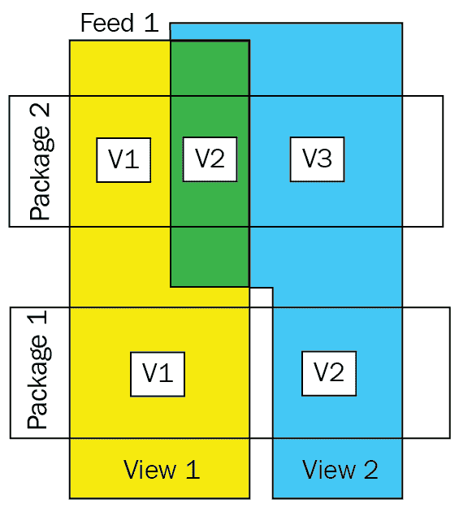

在 Azure Artifacts 中，您可以创建一个或多个 Feed 来存储您的软件包。每个软件包在 Feed 中可以有多个版本。Feed 是您设置发布软件包授权的层级。在一个 Feed 中，您可以创建一个或多个视图，用于设置软件包消费的授权。任何给定软件包的特定版本可以同时出现在多个视图中。以下部分将更详细地讨论所有这些概念。

# 设置 Feed

在 Azure Artifacts 中，Feed 是存储您的软件包的位置。每个 Feed 是一个独立且完全隔离的存储库。要创建一个新的 Feed，请按照以下步骤操作：

1.  首先，导航到左侧菜单中的 Azure Artifacts，然后点击“创建 Feed”按钮（部分可见，用于访问创建新 Feed 的视图）：

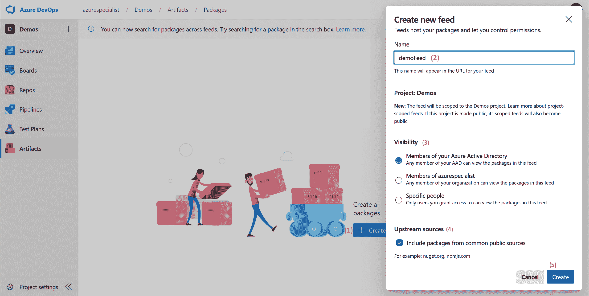

1.  为 Feed 指定一个名称。名称不能包含空格，最好仅包含字母和数字，因为它将成为 URL 的一部分。

1.  接下来，您可以指定初始的可见性设置。这将决定哪些用户可以查看该 Feed。稍后会更详细地讨论这个问题。

1.  配置使用上游源。这将在后续部分更详细地介绍。

1.  选择“创建”后，几秒钟内您的 Feed 就会可用。

创建 Feed 后，您可以配置各种设置，如隐藏已删除的软件包、启用软件包批次以及配置保留策略。要了解如何操作，请按照以下步骤进行：

1.  创建 Feed 后，通过点击右上角的齿轮图标来访问 Feed 的设置。

1.  在下图所示的视图中，选择“Feed 设置”。在这个视图中，您可以配置更多设置：

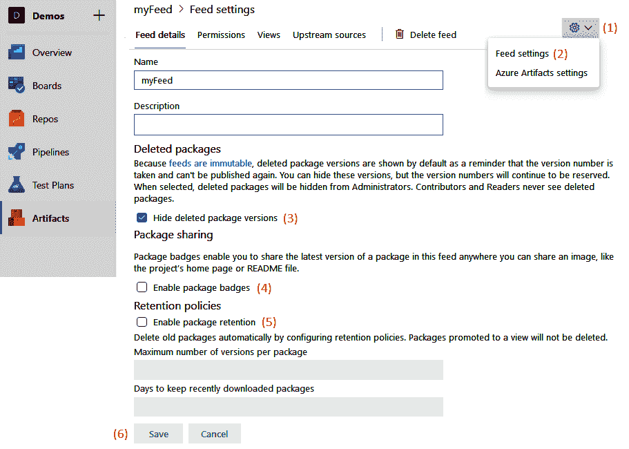

1.  除了更改名称和添加描述外，您还可以选择隐藏已删除的包。这样做后，已删除的包的版本对于订阅的管理员不再可见。普通用户永远无法查看或使用已删除的包，但此设置启用了与管理员相同的视图逻辑。

1.  另一个可以启用的设置是包徽章。包徽章是一个可视元素，显示包的名称和最新可用版本。如果启用此选项，您可以为每个包检索一个 URL，该 URL 将成为该包的包徽章。这对于希望跟踪包的最新版本的人很有用。

1.  最后，您可以配置保留策略。在这里，您可以配置当包的版本数量超过一定阈值时自动删除。虽然这有助于节省磁盘空间和因此的成本，但可能会意外地影响订阅的下游用户。为了防范此类情况，您可以防止在最后一次下载包后 *x* 天内删除包。此外，请记住，当前作为订阅成员的任何包版本都不会被删除。

1.  完成后，单击保存按钮。

创建和配置订阅后，现在是指定哪些用户可以访问该订阅及其权限的时候了。让我们学习如何进行下一步操作。

# 访问安全

您可以为用户或组分配四种角色，其中每个下一个角色的权限都包括前一个角色的权限：

+   **读者**能够列出订阅中的所有包，并可以下载它们。

+   **协作者**还能够使用上游源中的包。

+   **贡献者**还可以发布自己的包，取消列出和弃用包。

+   最后，**所有者**对订阅有完全控制权，还可以更改权限、重命名或删除订阅。

要更改用户的权限，请按照以下步骤操作：

1.  转到权限视图，您可以在以下截图中看到。在此视图中，您可以查看已分配权限的每个用户或组的列表：

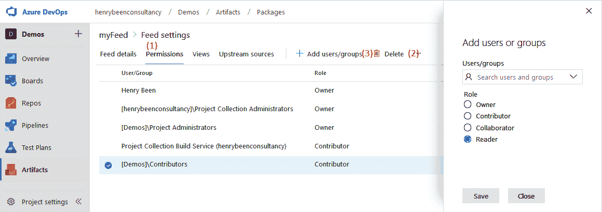

1.  要删除权限，请选择行并单击删除。

1.  要添加新行，请单击添加按钮。这将打开您在右侧看到的视图。

作为将用户或组添加为整个订阅的读者的替代方案，还可以在订阅中创建一个或多个视图，并针对每个视图设置访问权限。

# 管理订阅中的视图

Feed 是一个包的仓库，你可以将包发布到此处，也可以从此处下载包。然而，很多情况下，你可能不希望每个上传的包都可以供下载。通常，你可能希望控制哪些用户可以使用某个包的哪些版本；例如，当你在实现共享库的持续交付时，但希望只与组织中的其他成员共享稳定版本。

为了实现这一点，你可以创建视图。视图是 Feed 中包版本的子集。在使用视图时，作为消费者，它的表现就像一个 Feed。

视图可以按如下方式进行管理：

1.  导航并点击“视图”；你应该能看到类似于以下截图的内容：

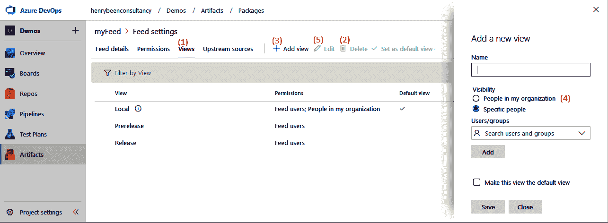

1.  在这里，你可以看到所有当前视图的列表，并通过选择行并点击“删除”来移除任何视图。

1.  添加新视图可以通过使用添加按钮来完成，点击后将打开右侧显示的视图界面。

1.  你也可以在这里设置从视图的读取权限。你可以允许整个 Azure DevOps 组织的读取访问权限，或指定特定的用户。你在此添加的任何用户或组将仅在此视图上获得读取权限。

1.  编辑权限可以通过选择任何一行并选择“编辑”来进行设置。

一旦一个或多个视图可用，包可以通过视图进行推广，以供通过该视图使用。

# 配置上游源

你可以在 Feed 上配置的最后一项内容是上游源。Azure Artifacts Feed 为你提供了一个仓库，你可以在此发布你自己的包，供其他地方重用。

然而，你也可能会使用在像 `NuGet.org` 或 `npmjs.org` 这样的仓库中公开可用的包。在这种情况下，你可以结合使用 Artifacts Feed 和 `NuGet.org`，但你也可以配置 Feed 以便从 `NuGet.org` 提供包。如果你这么做，`NuGet.org` 就被称为上游源。

除了简化操作外，这还带来了一个额外的好处：你可以在一个中央位置查看你在解决方案中使用的所有包。这使你能够快速检查你正在使用哪些包及版本，这对于合规性或安全性检查非常有用。通过在读取者和合作者角色之间设置不同的权限，你还可以配置哪些用户被授权从`NuGet.org`拉取包到你的 Feed，而哪些用户没有此权限。

当然，你可以对任何通过互联网可访问并实现 Azure Artifacts 支持的协议的仓库执行此操作。要配置上游源，请按照以下步骤进行：

1.  在导航到以下屏幕后，可以配置上游源：

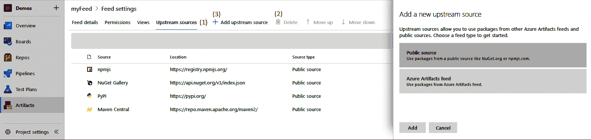

1.  上游源的配置方式与权限和视图相同。你可以使用菜单栏中的“删除”按钮删除上游源。

1.  通过点击“添加上游源”按钮来添加上游源，这将打开右侧视图。

关于使用上游源的最后一点需要注意的是，如果某个包的相同版本已经在上游源中可用，就无法将该版本的包发布到你自己的源。

本节讨论了如何创建和连接源。既然这些已经设置好了，接下来我们将学习如何将包发布到这些源。

# 发布包

现在你已经了解如何创建和管理源，是时候学习如何将包发布到这些源了。如果你有将包发布到公共源的经验，你会发现发布到 Azure Artifacts 的过程完全相同。有两种方式可以将包发布到源：

+   从你自己的电脑手动操作

+   通过使用 Azure Pipelines

以下章节将探讨这两种选项。

# 手动上传包

手动上传包时，需要执行以下步骤：

1.  首先，你需要获取源的 URL。为此，点击任何源的“连接到源”按钮，如下图所示：

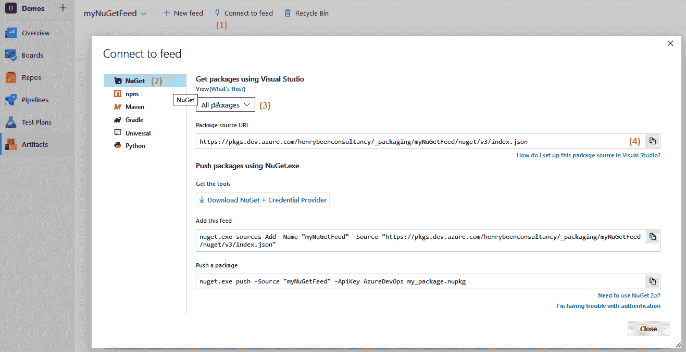

1.  在左侧列表中，选择用于访问源的协议。

1.  选择正确的视图进行操作。记住，发布包时需要使用完整的源 URL，因为视图是只读的。

1.  在做出正确选择后，使用复制按钮将正确的 URL 复制到剪贴板。

1.  执行以下命令，从常规的`.csproj`文件创建 NuGet 包。如果你没有`NuGet.exe`工具，可以通过本章末尾提供的链接下载它：

```
nuget.exe pack DemoSolution\MyPackage.csproj -Version 1.1.0
```

1.  执行最终命令，将包上传到 NuGet：

```
nuget.exe push 
    -Source "{feedUrl}" "MyPackage.1.1.0.nupkg"
```

执行完最后一个命令后，包将被发布并在你的源中可用。

# 从管道发布包

如果需要多次上传包，手动上传包并不是一个方便的解决方案。在需要频繁生成并发布新版本库的情况下，你可以使用 Azure 管道。除了提供自动化功能外，它还是一种引入重复性和可靠性的绝佳方式，因为你现在可以充分利用管道所提供的所有好处。

作为示例，你可以找到一个用于创建`npm`包并将其发布的可能构建定义，具体如下。此构建的源来自一个名为`tfs-cli`的开源 Microsoft GitHub 仓库。

在这个管道中，有三种使用内置`npm`任务的方式：

+   第一次出现的是`npm install`命令。此命令用于安装该包的依赖项：

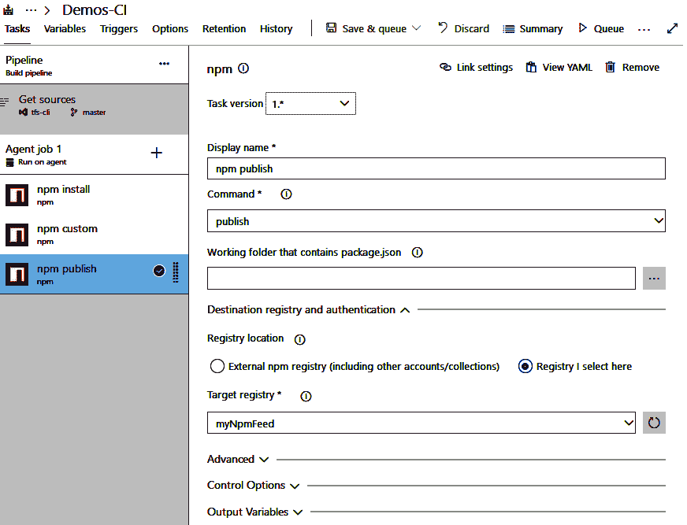

+   第二个操作是运行自定义命令`build`。该命令在源代码中使用`package.json`定义，用于将源代码从 TypeScript 转换为 JavaScript：

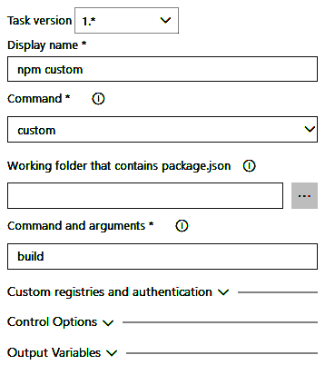

+   最后，第三个任务是运行`npm publish`命令，将生成的包发布到`npm`源。在此情况下，没有选择外部源，而是选择了一个内置的目标注册表：Azure Artifacts 源：

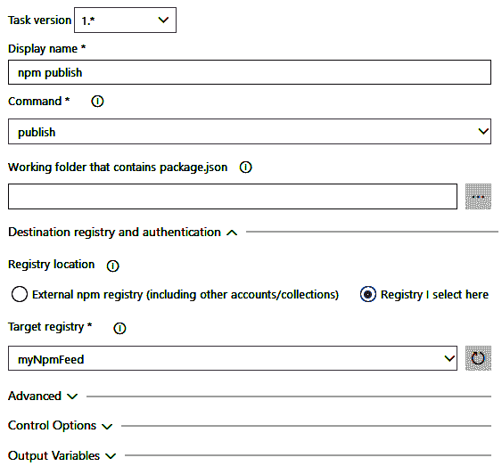

运行此构建后，您的包就可以在您的源中使用了。

# 包版本控制

使用上传`npm`包的任务（或大多数类型的包）时，自动完成的其中一项操作就是管理版本号。当然，确保包有适当版本的方法有很多种，但一种常见的方法是在包构建过程中设置（部分）版本号。

扩展之前我们演示的`npm`包构建，可以对构建定义进行三处更改：

1.  首先，构建定义的构建号格式更新为：`1.0$(Rev:.rrr)`。这确保每次构建都会自动生成一个唯一的编号。`Ref:.rrr`变量将生成一个三位数的编号，必要时以零为前缀。第一次生成的编号将是`000`，每次构建号其余部分未更改时，编号将增加 1。

1.  其次，添加一个任务，用`{#Build.BuildNumber#}`令牌替换当前在源控制中指定的版本号。这个令牌引用了名为`Build.BuildNumber`的构建变量，它包含在*步骤 1*中指定的构建编号。

1.  最后，在所有其他任务之前，构建中添加了一个替换令牌任务。以下是替换魔术固定版本号为自动版本号的任务配置示例：

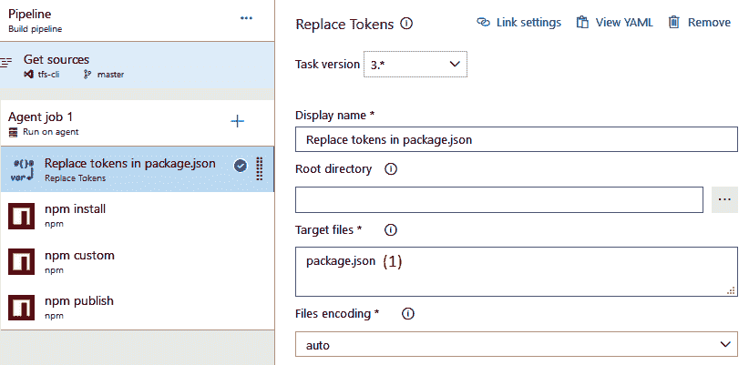

该任务可以配置为替换一个或多个目标文件中的令牌(*1*)。它会查找任何以`{#`开头、以`#}`结尾的字符序列，提取这两个标记之间的文本，然后用对应变量的值替换整个文本。

通过此设置，使用定义构建的每个包都将拥有唯一且不断增长的修订版本号。每当需要更新主版本或次版本号时，可以通过更新构建号格式来完成。

作为这种方法的替代方案，扩展市场上提供了许多任务，可以帮助管理版本控制，包括更复杂的场景。

本节讨论了如何将包发布到源中。将包发布到源后，下一节将详细说明如何在 Visual Studio 或 Azure Pipeline 中使用这些包。

# 消费包

将软件包上传到 Azure Artifacts 源或仓库，使它们在许多不同的场景中可供使用。两个常见的场景是使用您的软件包与 Visual Studio 或 Azure Pipelines。接下来的部分将详细介绍这两个场景。

# 从 Visual Studio 使用软件包

一旦您的共享库作为 NuGet 软件包存在于 Azure Artifacts 源中，您就可以开始在 Visual Studio 中使用它们。在此之前，您需要在 Visual Studio 实例中注册您的源。

为此，您首先需要获取您的源的 URL。为此，请参考 *手动上传软件包* 部分。一旦您准备好 URL，请像平常一样去管理您解决方案中的 NuGet 文件。如果您不熟悉如何在 Visual Studio 中使用 NuGet 软件包，您可以在解决方案资源管理器中找到此选项，在解决方案和项目头部：

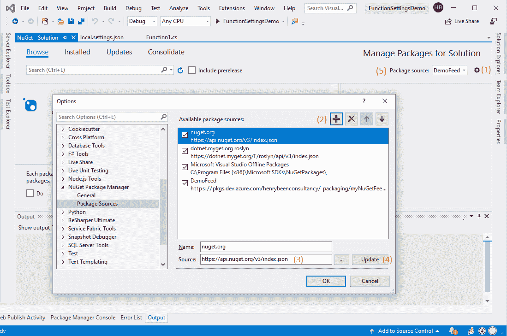

一旦您到达这里，请按照以下步骤操作：

1.  点击右上角的小齿轮按钮，打开对话框，在其中您可以配置使用哪些 NuGet 源。

1.  添加一个新源。

1.  填写您自己源的名称和来源。

1.  完成此操作后，不要忘记点击更新；否则，您对名称和来源字段的更改将不会被保存，而且不会有任何提示警告您存在未保存的更改。

1.  在进行这些更改之后，您现在可以在屏幕右上角选择将您的源作为软件包来源。

从这里开始，您就可以像使用 `NuGet.org` 的软件包一样，使用来自您自己源的软件包。

# 从管道中使用软件包

一旦开始在 Visual Studio 中使用您的软件包，您很可能还需要在 Azure Pipelines 中使用它们。这样做是为了对依赖您的软件包的应用程序执行 CI/CD。

幸运的是，您可以通过对 NuGet 恢复任务进行小的配置更改来实现这一点，如下图所示。以下截图涉及的是 NuGet 恢复任务，这个任务既可以与 Visual Studio 构建任务一起使用，也可以与 .Net Core 构建任务一起使用。两者的界面相同，可以以相同的方式使用：

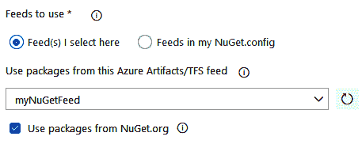

默认情况下，仅选中了使用来自 NuGet 的软件包的单选按钮；因此，要同时包含来自您自己源的软件包，您需要在下拉列表中选择正确的源。

如果您需要从多个源中包含软件包，您将不得不创建一个聚合源，并使用其他源作为该聚合源的上游源。

本节介绍了如何从 Visual Studio 使用组件软件包。下一节将深入探讨如何使用通用软件包来共享通用的二进制软件包。

# 使用通用软件包

前面的章节都集中在使用 Azure Artifacts 作为重新分发应用程序包（例如库或其他共享组件）的方式。然而，Azure Artifacts 还有一个重要用途，即使用源来存储任何类型的二进制包，这些包被称为通用包。

由于通用包源可以用于存储任何类型的包，因此如果您使用多个 CI/CD 工具，它是存储构建产物的好选择。在这种情况下，您可以使用通用包来存储并提供构建产物，以便随时从您使用的工具进行获取。这特别有用，因为经典构建和发布管道的内置存储无法被其他工具访问。

要在异构架构中使用通用包来暂存构建产物，您需要理解四个基本操作：从 Azure pipeline 上传和下载通用包，以及使用 Azure CLI 上传和下载通用包。最后一个操作可以从其他工具中调用。

# 从 Azure Pipelines 上传和下载通用包

将构建产物上传到通用包源的方式与上传常规构建产物类似。您需要考虑两个更改。

首先，您必须使用另一个任务来执行上传。您不能再使用*发布构建产物*或*发布管道产物*任务，而需要使用名为“通用包”的任务。在使用此任务时，您仍然可以为产物命名，并指定从构建代理的文件系统上传它的位置。接下来，您可以指定目标源和版本。此版本可以在每次上传新包时自动递增，或者使用构建变量来指定。

其次，您需要考虑上传的包与产生它的构建之间不是一对一关联的—与常规构建或管道产物不同。这意味着无论您在哪里使用已上传的包，都需要找到另一种方法来找到正确的版本进行下载。

要执行实际的下载，您可以再次使用通用包任务，如下截图所示：

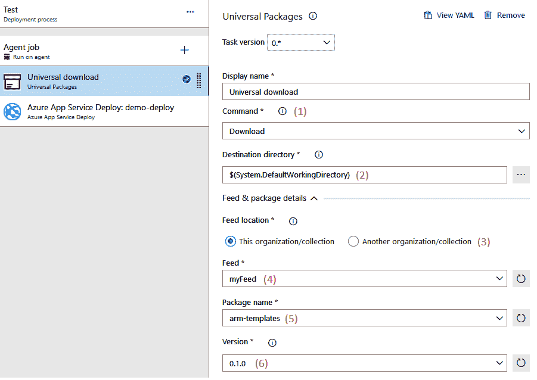

请参考截图并按照以下步骤操作：

1.  添加任务后，您可以在上传和下载之间切换。

1.  您还可以指定一个目录，将其作为产物上传。

1.  或者，您可以指定下载产物的位置。

1.  此外，需要指定源的名称。

1.  此外，指定包的名称。

1.  指定版本以决定是上传还是下载。

请注意，您还可以通过选择在第*5*步使用其他源来使用非自己组织的源。如果这样做，您需要创建一个服务终端以访问该源。

# 使用 Azure CLI 上传和下载通用包

当您希望与 Azure Pipelines 以外的产品一起使用通用包时，您必须使用 Azure CLI。为此，执行以下步骤：

1.  使用 Azure CLI 操作通用包的第一步是安装 CLI 本身。CLI 的链接可以在本章末尾找到。

1.  接下来是安装 Azure DevOps 扩展。可以使用以下命令来进行安装：

```
az extension add –name azure-devops
```

1.  安装 Azure DevOps 扩展后，您需要使用与 Azure DevOps UI 中相同的账户进行登录。您可以通过以下命令登录：

```
az login
```

1.  登录后，您可以使用以下命令将文件作为构件上传：

```
az artifacts universal publish 
 --feed {yourFeedName} 
 --name {yourPackageName} 
 --version {yourVersion}
 --organization https://dev.azure.com/{yourOrganizationName}
 --path {sourceFileName}
```

1.  要重新下载特定版本的构件，您可以使用以下命令：

```
az artifacts universal download 
 --feed {yourFeedName} 
 --name {yourPackageName}
 --version {yourVersion}
 --organization https://dev.azure.com/{yourOrganizationName}
 --path {targetFileName}
```

使用 CLI 和这些命令，您可以将 Azure Artifacts 作为多工具之间共享构建构件的手段。当在同一项目中使用多个工具时，通用包是移动二进制文件的好工具。

在下一部分中，将探讨用于包管理的其他可用工具。

# 探索其他工具

还有许多其他工具可用于二进制管理。三种常用的产品是 MyGet、Artifactory 和 **Azure 容器注册表** (**ACR*)。它们提供的功能有重叠，但也有它们在特定方面的优势。

# MyGet

MyGet 是托管 NuGet 包的另一种选择。MyGet 允许您创建公共和私人包源，并由您自己管理。MyGet 还支持定义上游源，并提供内置的依赖项扫描功能，能够持续反馈依赖项的安全级别。

由于 MyGet 是 NuGet 协议的实现，您可以使用 Azure Pipelines 的默认 NuGet 任务发布和使用包。

# Artifactory

Artifactory 是 JFrog 提供的另一款工具，您可以用它来托管您的包源。Artifactory 最初是一个本地产品，但现在也作为 SaaS 服务提供。与 Azure Artifacts 一样，它支持与包源交互的多种协议。撰写本文时，Artifactory 支持比 Azure Artifacts 更多的仓库协议。例如，PHP Composer 和 **Red Hat 包管理器** (**RPM*)。

JFrog 已发布一个用于下载和上传包的 Azure Pipelines 扩展。

# Azure 容器注册表

另一种用于存储可重用包的存储类型是 ACR。ACR 专为容器镜像设计，能够理解这些镜像的分层构建。这使得它能够在镜像的新版本可用时，仅在部分层发生变化时接收部分上传。这使得 ACR 成为存储容器镜像的非常好的位置。上传将更快，且 ACR 存储比 Azure Artifacts 存储更便宜。这是一个巨大的优势，因为容器镜像可能非常大。

你可以通过 Docker 集成扩展从 Azure Pipelines 集成 ACR。

# 总结

在本章中，你学习了如何识别解决方案中的共享组件：这些是不仅出现在多个位置，而且是逻辑上可重用的代码单元。你还学习了如何使用 Azure Artifacts 源来托管包含这些库的包。此外，你学习了如何使用这些托管的包，通过 Visual Studio 和 Azure Pipelines 构建依赖的解决方案。你还了解了如何使用通用包在 Azure Pipelines 和你可能使用的其他 CI/CD 工具之间共享构建工件。

通过这些知识，你现在将能够识别解决方案中的共享组件。一旦你识别出这样的组件，你还可以将其隔离在源代码管理中，构建它，并将其发布到工件源。然后，你可以将其分发到一个或多个消费解决方案中。最后，你现在还可以使用工件源在不同的 CI/CD 产品之间共享构建工件。

在下一章中，你将学习基础设施和配置作为代码。这是 DevOps 的一项基本实践，它允许你将基础设施定义存储在源代码管理中，并将其作为发布管道的一部分使用。

# 问题

在总结时，以下是一些问题，用于测试你对本章内容的理解。你将在附录的*评估*部分找到答案：

1.  判断对错：任何版本的包只能部署到源中的一个视图。

1.  判断对错：管道工件可以用于将 Azure DevOps 中的构建结果（包）共享到其他产品中。

1.  判断对错：带有通用包的 Azure Artifact 源可以用于将 Azure DevOps 中的构建结果（包）共享到其他产品中。

1.  以下哪项是为了在 Visual Studio 中构建使用 Azure Artifacts 源中包的解决方案所需的？（你可以选择多个选项。）

    1.  将完整的包 URL 添加到项目依赖项中，而不仅仅是包名称

    1.  至少具有*读取者*访问权限，或者具有源中的某个视图访问权限

    1.  至少具有*消费者*访问权限

    1.  将源的位置配置为 Visual Studio 的包源

1.  将解决方案拆分成多个通过 Azure Artifacts 源分隔的部分的动机是什么？

# 深入阅读

+   用于练习 Azure DevOps Artifacts 的练习可以在[`docs.microsoft.com/en-us/learn/modules/manage-build-dependencies/`](https://docs.microsoft.com/en-us/learn/modules/manage-build-dependencies/)找到。

+   你可以从[`www.nuget.org/downloads`](https://www.nuget.org/downloads)找到并下载`NuGet.exe`。

+   下载和安装 Azure CLI 的信息可以在[`docs.microsoft.com/en-us/cli/azure/install-azure-cli?view=azure-cli-latest`](https://docs.microsoft.com/en-us/cli/azure/install-azure-cli?view=azure-cli-latest)找到。

+   关于 MyGet 的更多信息，请访问[`www.myget.org/`](https://www.myget.org/)。

+   关于 JFrog Artifactory 的更多信息，请访问[`jfrog.com/artifactory/`](https://jfrog.com/artifactory/)，Azure Pipelines 的扩展可以在[`marketplace.visualstudio.com/items?itemName=JFrog.jfrog-artifactory-vsts-extension`](https://marketplace.visualstudio.com/items?itemName=JFrog.jfrog-artifactory-vsts-extension)找到。

+   有关 ACR 的更多信息，请访问[`azure.microsoft.com/en-in/services/container-registry/`](https://azure.microsoft.com/en-in/services/container-registry/)。

+   你可以在[`marketplace.visualstudio.com/items?itemName=ms-vscs-rm.docker`](https://marketplace.visualstudio.com/items?itemName=ms-vscs-rm.docker)找到适用于 Azure Pipelines 的 Docker 扩展。
