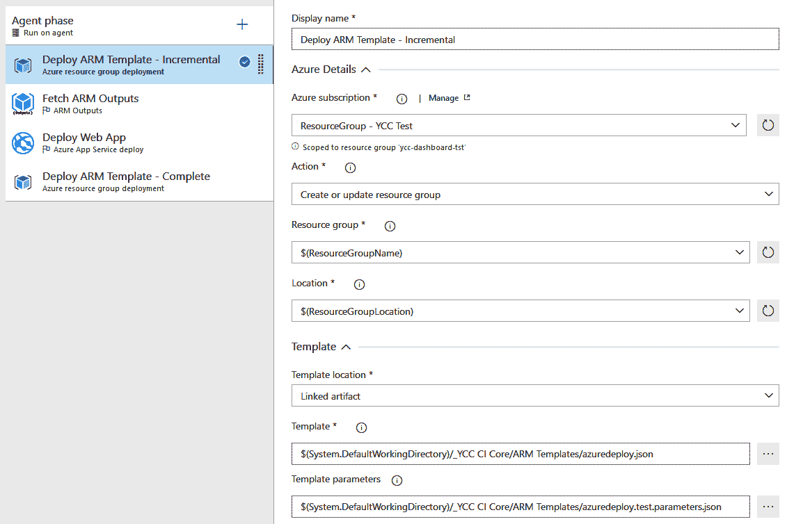
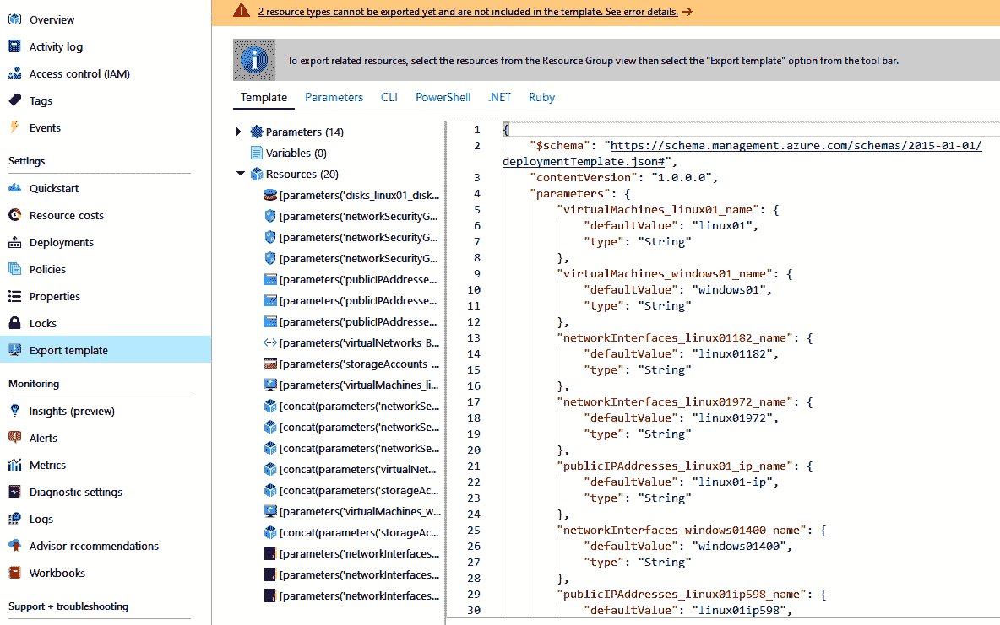
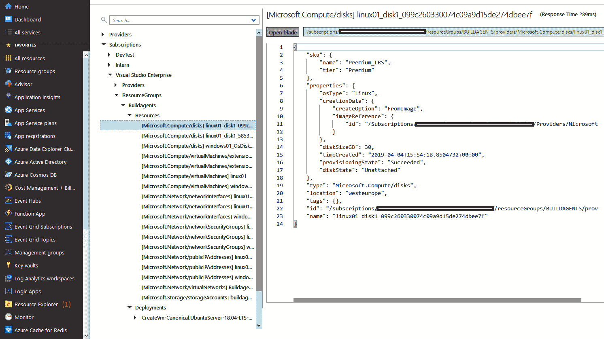
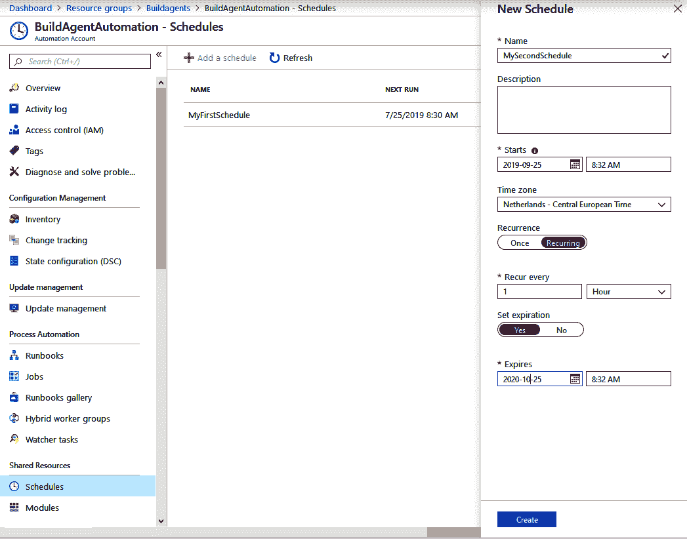
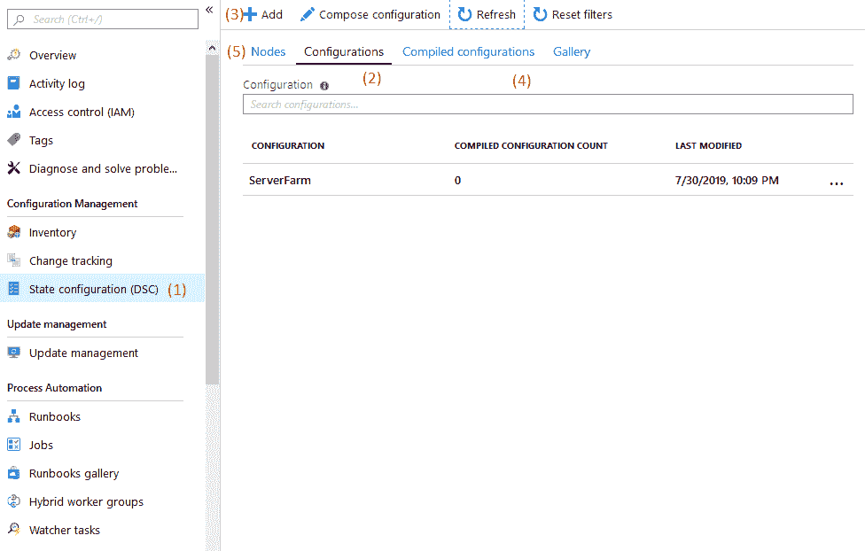
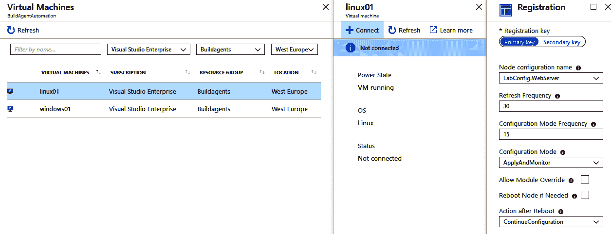
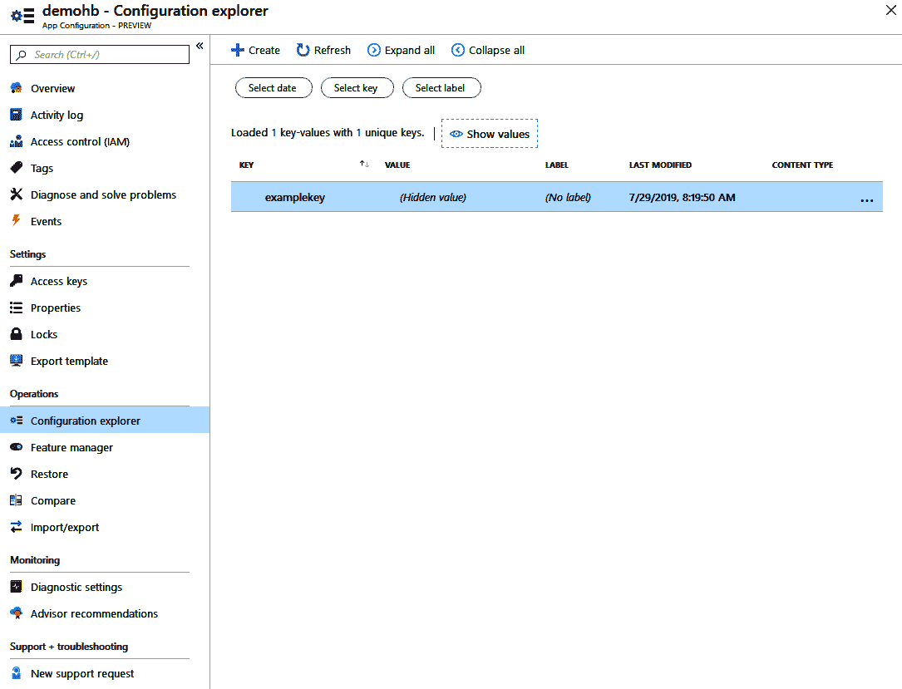

# 基础设施和配置作为代码

在上一章中，重点是存储和构建应用程序代码以及发布创建的二进制文件。您学习了如何创建一个流水线，从源代码控制到目标环境，自动重复部署您的应用程序。

在本章中，您将学习如何将相同的原则应用于运行应用程序的基础设施和运行时配置。这样做将帮助您进一步提高向生产环境交付变更的速度，增加向最终用户提供价值的流量。

本章将首先解释将所有内容（包括基础设施和配置）作为代码的价值。接下来，它继续解释 ARM 模板。将解释语法以及如何部署 ARM 模板。然后，它继续解释 Azure 云中提供的 Azure 自动化。Azure 自动化可用于按计划运行脚本或加载和应用 PowerShell DSC 模块。接下来是管理 PaaS 提供的应用程序设置，例如 Azure 应用服务。最后，它讨论了几种具有类似功能的其他工具。

本章将涵盖以下主题：

+   将所有内容作为代码

+   使用 ARM 模板

+   部署 ARM 模板

+   反向工程模板

+   使用 Azure 自动化

+   管理应用程序设置

+   其他工具

# 技术要求

要实验本章描述的一个或多个技术，可能需要以下一个或多个：

+   Azure 订阅，用于执行 ARM 模板和运行 Azure 自动化

+   PowerShell 与 Azure PowerShell 模块，用于执行 ARM 模板，可从 [`docs.microsoft.com/zh-cn/powershell/azure/install-az-ps`](https://docs.microsoft.com/zh-cn/powershell/azure/install-az-ps) 获取

+   Azure CLI，用于执行 ARM 模板，可从 [`docs.microsoft.com/zh-cn/powershell/azure/install-az-ps`](https://docs.microsoft.com/zh-cn/powershell/azure/install-az-ps) 获取

+   一个或多个虚拟机，用于实验本章讨论的不同工具

# 将所有内容作为代码

如果您过去负责创建和维护应用程序基础设施和配置，您很可能已经经历了所谓的**配置漂移***。*配置漂移是指接受和生产环境中服务器配置之间存在差异的现象。或者，更糟糕的是，在生产环境中有多台服务器时，这些服务器的配置可能并不总是相同。

配置漂移的最常见原因是手动更改。在手动更改时，可能是在生产问题的压力下进行，始终存在将不同设置应用于不同服务器或主机的风险。如果你需要扩展并向生产环境中添加另一台服务器，且这台服务器需要与所有已存在服务器采用相同配置的可能性非常小。

通过**基础设施即代码**（**IaC**）和**配置即代码**（**CaC**），你不再手动更改应用配置和基础设施，而是通过自动化来完成。实现这一目标的第一步是指定所需的配置和基础设施状态。然后，将所需状态输入配置管理工具，工具会在你的基础设施上强制执行该配置。只指定所需状态被称为*声明性*方法，与*命令性*方法不同，后者需要指定所有需要执行的步骤。

这些工具通常还能够定期检查你的基础设施和配置的当前状态，并在检测到任何偏差时重新应用所需的状态。这是由于声明性方法的存在。这使得应用配置成为一个幂等操作。如果一个操作是幂等的，意味着它可以重复执行一次或多次，而结果始终保持一致。

在采用 IaC 和 CaC 时，你甚至可以在部署应用程序之前重新创建完整的基础设施，先在新基础设施上部署应用程序，然后在切换到新部署后放弃旧的基础设施。这是一种极端形式的不变服务器。这种方法的附加好处是，你现在可以确保不再留下任何来自上一次部署的配置或二进制文件痕迹。

在接下来的章节中，你将了解不同的 IaC 技术以及如何使用它们。理解它们是互补的，并且通常一起使用非常重要。例如，ARM 模板可用于在 Azure 中创建虚拟机，完成后可以使用 PowerShell DSC 或 Ansible 来配置这些虚拟机。

# 使用 ARM 模板

在 Azure 平台上工作时，基础设施使用**Azure 资源管理器**（**ARM**）模板进行描述。ARM 模板是用 JSON 编写的，骨架模板如下所示：

```
{
  "$schema": "https://schema.management.azure.com/schemas/2015-01-01/deploymentTemplate.json#",
  "contentVersion": "1.0.0.0",
  "parameters": {
  },
  "variables": {
  },
  "resources": [
  ],
  "outputs": {
  }
}
```

模板本身在最高层次上是一个 JSON 对象。`$schema`是一个必需的属性，其显示的值也是强制性的。`contentVersion`属性也是必需的，并且可以用于为内容指定版本。如果需要，作者可以使用此版本来版本化模板。

本章的其余部分将更详细地讨论构成 ARM 模板的不同部分。章节末尾还提供了在线参考链接，此外，还附加了 ARM 模板结构和语法的正式详细解析链接。

# 参数

每个模板必须以一个参数部分开始。该部分采用 JSON 对象的形式，可以为空，但不能省略。此部分的用途是声明一个或多个可以由 ARM 模板调用者在部署前指定的参数。使用参数部分的常见原因是使用相同的模板，但在测试环境和生产环境之间更改资源名称。一个示例的参数部分可能如下所示：

```
{
  “appServiceName”: {
    “type”: “string”,
    “metadata”: {
      “description”: “a free to choose text”
    }
}
```

对于每个参数，指定一个新键，键名为参数的名称。值是一个对象。该对象有一个必需的键，`type`。`type` 的允许值为 `string`、`int`、`bool`、`object`、`array`、`secureString` 和 `secureObject`。`secureString` 和 `secureObject` 类型用于确保这些参数的运行时值不会出现在任何日志和输出中。它们用于存储密码、密钥或其他机密信息。

元数据对象，带有 `description` 键，这是可选的，可以用来为参数添加描述，以供将来参考。

其他可以在参数对象上指定的属性如下：

+   `minValue` 和 `maxValue` 用于指定整数值的范围

+   `minLength` 和 `maxLength` 用于指定字符串值的长度范围

+   `defaultValue` 用于指定如果在应用模板时未指定值，将使用的默认值

+   `allowedValues` 用于指定允许值的数组，限制有效的输入值

接下来，让我们了解一下什么是参数文件。

# 参数文件

在部署模板时指定参数值的一种方式是通过变量文件。通常，一个模板会附带多个参数文件，例如一个用于测试，另一个用于生产。一个参数文件的 JSON 格式如下所示：

```
{
  "$schema": "https://schema.management.azure.com/schemas/2015-01-01/deploymentParameters.json#",
  "contentVersion": "1.0.0.0",
  "parameters": {
    "exampleParameter": {
      "value": "exampleValue"
    }
  }
}
```

与 ARM 模板一样，每个参数文件都是一个 JSON 对象，具有必需的 `$schema` 和 `contentVersion` 属性。第三个属性参数用于指定一个或多个参数值。对于每个参数，指定其名称作为键，并将一个对象作为值。该对象可以包含 `value` 键，用于提供参数的实际值。

尽管指定资源名称、扩展选项以及其他在不同环境中需要变化的内容时非常有用，但此解决方案不适用于存储机密。密钥、密码和其他机密信息不应作为明文存储在源代码控制的参数文件中。对于机密信息，可以使用另一种表示方式：

```
{
  "$schema": "https://schema.management.azure.com/schemas/2015-01-01/deploymentParameters.json#",
  "contentVersion": "1.0.0.0",
  "parameters": {
    "exampleParameter": {
      "reference": {
        “keyvault”: {
          "id": "/subscriptions/…/Microsoft.KeyVault/vaults/<vaultname>"
        },
        “secretName”: “myKeyVaultSecret”
      }
    }
  }
}
```

使用这种表示法时，不是直接指定值，而是指向 Azure 密钥库中存储正确值的位置。部署模板时，此密钥将在 Azure 中从密钥库中取出并用于部署。只有在启动部署的用户或服务具有密钥库的所有者或贡献者角色，并且密钥库启用了模板部署时，才允许这样做。

严格来说，任何包含`Microsoft.KeyVault/vaults/deploy/action`权限的角色都可以使用。默认情况下，这些角色是所有者和贡献者角色，但你也可以创建包含此操作的自定义角色。

# 变量

变量部分用于指定在整个模板中将使用的一个或多个值。一种常见的方法是在变量部分根据一个名为`environmentName`的单一参数构建所有资源的名称。这确保了资源在不同环境中具有相同的名称。变量还用于指定无法从模板外部指定的值，但应视为可配置的。例如，可能会是这样的：

```
{
  "appServicePlanType": "B1",
  "appServiceName": "[concat('myAppService-', parameters('environmentName'))]"
}
```

请注意，`appServiceName`的示例包含了在后面名为*函数*的部分中详细讨论的函数。

# 资源

任何 ARM 模板中的第三部分是资源部分。这是模板的主要部分，所有要创建的资源都在此部分指定。这个部分是唯一一个不是对象，而是数组的部分。在该数组内，会指定一个或多个以下形式的对象：

```
{
    "type": "Microsoft.Sql/servers",
    "apiVersion": "2015-05-01-preview",
    "name": "mySqlServer",
    "location": "West Europe",
    "properties": {
        "administratorLogin": "myUsername",
        "administratorLoginPassword": "myPassword",
        "version": "12.0"
    }
}
```

每个资源都以对象的形式指定。前四个属性是每种资源类型必需的：

+   需要指定要创建或更新的资源类型：这通常由`resourceprovider`的名称后跟一个斜杠，再加上该`resourceprovider`下属于的资源类型名称组成。

+   用于此资源的 API 版本：可以从参考中获取受支持的 API 版本列表。

+   资源的名称：每个资源类型都有自己的规则来确定有效名称的标准。这些规则也可以在参考文献中找到。

+   创建资源的 Azure 区域：这必须是有效的 Azure 区域。

对象上的其他属性根据资源类型不同而不同，所有这些属性都在资源中指定。

# 依赖资源

一种特殊类型的资源是依赖资源。例如，SQL 数据库托管在 SQL Server 上，Service Bus Topics 位于 Service Bus 命名空间中。对于嵌套资源类型，类型和名称反映了这种嵌套关系：

```
{
    "apiVersion": "2017-04-01",
    "name": "myNamespaceName/myTopicName",
    "type": "Microsoft.ServiceBus/namespaces/topics",
    "dependsOn": [
        "Microsoft.ServiceBus/namespaces/myNamespaceName"
    ]
}
```

除了嵌套类型和名称外，额外的属性`dependsOn`也是必需的，用于指定此嵌套资源只能在包含资源存在后创建。位置属性不是必需的，因为它将从包含资源中继承。

# 嵌套模板

第二种特殊类型的资源是模板部署。通过这种方式，一个模板可以触发另一个模板的部署。以下是将模板部署定义为模板中的资源的示例：

```
{
    "type": "Microsoft.Resources/deployments",
    "apiVersion": "2018-05-01",
    "name": "linkedTemplate",
    "properties": {
        "mode": "Incremental",
        "templateLink": {
            "uri":"https://.../myLinkedTemplate.json"
        },
        "parametersLink": {
            "uri":"https://.../myParameters.json"
        }
    }
}
```

模板和参数文件的位置可以通过 HTTP 和 HTTPS 来指定，但必须是公开可访问的位置。作为替代方案，也可以指定一个单一的属性模板。该模板应包含一个完整的 JSON 对象作为模板。

# 输出

模板的第四个也是最后一个部分是输出部分。这里包含了返回给模板调用者的键。调用者可以使用这些值来启动另一个任务或脚本，并使用模板创建或使用的一个或多个值。

这个部分的主要用途是防止在下游自动化中硬编码名称。输出部分是一个 JSON 对象，格式如下：

```
{
    "outputName":
   {
        "type": "string",
        "value": "myValue"
    }
}
```

在指定输出时，可以使用与参数相同的类型。当然，硬编码值没有太大意义，因此使用函数从参数、变量甚至是创建的资源中获取值。

# 函数

函数用于允许在 ARM 模板中动态评估属性。调用函数的语法与许多编程语言非常相似：`functionName(arg1, arg2, …)` 函数可以返回一个值，如`string`或`int`，也可以返回一个对象或数组。当返回一个对象时，可以使用`.propertyName`符号访问任何属性。访问数组中的元素可以使用`[position]`。为了标明字符串的哪些部分应作为函数进行评估，可以将其放入括号中：

```
"myVariable": "[concat('myAppService-', parameters('environmentName'))]"
```

上面的示例展示了两个示例函数。首先，调用`concat`函数来连接两个字符串值。一个是硬编码的，另一个是第二个函数调用的结果，用于获取模板参数的值。

有相当多的可用函数。它们可以用于字符串操作、获取当前订阅、资源组或 Azure Active Directory 租户的详细信息，或获取资源的详细信息。

函数还可以用于获取帐户密钥或其他机密。通常，这样做是为了直接从暴露密钥的服务将密钥自动插入应用程序设置或密钥保管库中。这完全消除了手动传输机密的需求。

到目前为止，我们已经学习了组成 ARM 模板的不同部分，你应该能够自己编写这些模板。接下来，我们将学习如何利用各种工具来实际部署它们。

# 部署 ARM 模板

一旦 ARM 模板及其附带的参数文件编写完成，就可以将其应用于 Azure 环境。PowerShell Cmdlet 和 Azure CLI 命令可用于从脚本环境应用 ARM 模板。当 ARM 模板用于应用程序的基础设施时，Azure Pipelines 可用于部署不仅仅是代码，还可以是 ARM 模板。

无论使用哪种部署方法，所有方法都将有一个*部署模式*。这可以是*增量*模式或*完全*模式。在增量模式下，模板中指定的所有资源将在 Azure 中创建，或者如果资源已经存在，则更新其属性。在完全模式下，所有模板中未指定且已存在于 Azure 中的资源也将被删除。默认部署模式为增量模式。

在接下来的部分中，我们将讨论几种用于执行部署的工具，首先从 PowerShell 开始。

# PowerShell

对于在本地机器上进行 ARM 模板的本地开发和测试，PowerShell 提供了一个快速命令来将 ARM 模板应用于资源组：

```
New-AzResourceGroupDeployment -ResourceGroupName myResourceGroup -TemplateFile "c:\my\template.json" ` -TemplateParameterFile "c:\my\parameters.json"
```

上述命令将获取指定的模板和参数文件，并将其应用于指定的资源组。此命令假设当前会话已经登录到 Azure。

有几种可用的命令变体：

+   有一个名为`-Mode`的参数，具有`Complete`或`Incremental`值。可以用来指定`deploymentmode`。

+   如果未指定参数文件并且模板需要参数，则该命令将提示在命令行上输入这些值。

+   作为替代，可以使用`-TemplateUri`和`-TemplateParametersUri`选项来指定从另一个位置检索模板和参数的位置。

接下来我们将讨论的工具是 Azure CLI。

# Azure CLI

Azure CLI 是另一种从命令行部署 ARM 模板的方法。CLI 的好处在于它是完全跨平台的，可以在 Windows、macOS 和 Linux 上运行。用于部署 ARM 模板的 Azure CLI 命令如下：

```
az group deployment create –resource-group myResourceGroup –template-file "c:\my\template.json" –parameters "c:\my\parameters.json"
```

PowerShell 中可用的所有其他选项在 CLI 中也都可以使用。

# Azure Pipelines

部署 ARM 模板的第三种机制是通过 Azure pipeline。这对于部署应用程序的基础设施和配置以及二进制文件特别有用。要从 pipeline 部署 ARM 模板部署，需要配置至少一个 Azure Resource Manager 的服务连接。完成此配置后，可以按照以下截图配置 pipeline：



在此示例中，有两个 ARM 模板的部署，围绕着应用程序代码的部署展开。第一个部署是增量类型，而第二个部署是完整类型。使用这种方法，第一个部署将创建新版本应用程序所需的所有新基础设施。该部署以增量模式进行，因此模板中不再存在，但当前已部署版本的应用程序仍在使用的基础设施将不会被删除。第二个部署将在新版本代码部署后负责删除这些元素。

# 反向工程模板

从头开始编写 ARM 模板可能是一项繁琐且耗时的任务。幸运的是，有两种方法可以从现有基础设施生成 ARM 模板：

+   使用导出模板

+   使用资源浏览器

在接下来的子章节中，我们将讨论这两种方法。

# 使用导出模板

第一种方法是使用在 Azure 门户中每个资源和资源组上都能找到的“导出模板”选项。这将生成资源（组）当前状态的 ARM 模板，如下截图所示：



请注意，并非所有服务目前都支持使用此方法进行反向工程提取 ARM 模板。对于任何不支持的服务，屏幕顶部会显示警告。为了绕过这一限制并提取单个资源的 JSON 模板，还有另一种方法，这是我们接下来的讨论主题。

# 使用资源浏览器

为了提取单个资源的 JSON 模板，我们可以使用资源浏览器*.* 资源浏览器如图所示，并且可以通过 Azure 门户中的菜单 (*1*) 找到：



打开资源浏览器后，会打开两个新的窗格。左侧窗格可以用来浏览订阅，并逐层深入资源组，直到找到单个资源。每当选择一个元素时，相应的 JSON 将显示在右侧。在上述示例中，显示的是硬盘的 JSON。这个 JSON 与可以在 ARM 模板的资源数组中使用的 JSON 是一样的。

# 订阅级模板

到目前为止，关于 ARM 模板的讨论都集中在资源组部署的 ARM 模板上。模板描述了一个或多个部署到资源组的资源。此外，还有订阅级模板。以下是一个资源组的 ARM 模板示例：

```
{
    "$schema": "https://schema.management.azure.com/schemas/2018-05-01
                                                ... /subscriptionDeploymentTemplate.json#",
    "contentVersion": "1.0.0.1",
    "parameters": { },
    "variables": { },
    "resources": [
        {
            "type": "Microsoft.Resources/resourceGroups",
            "apiVersion": "2018-05-01",
            "location": "West Europe",
            "name": "myResourceGroup",
            "properties": {}
        }
    ],
    "outputs": {}
}
```

订阅模板的格式与资源组的格式完全相同。不同之处在于 `$schema`，它指向另一个模式位置，以及所支持的资源类型。订阅模板不支持直接创建资源，仅支持创建资源组、启动模板部署、创建和分配 Azure 策略以及创建角色分配。

# Azure 蓝图

除了订阅级别模板，还有另一种可用的选项：Azure 蓝图。蓝图可以用来描述 Azure 订阅的期望状态，并将其应用于现有订阅。

使用蓝图可以完成的所有任务，如今也可以通过 ARM 模板来实现。然而，反过来就不成立。Azure 蓝图仅支持以下称为工件的构造：

+   策略分配

+   角色（RBAC）分配

+   资源组创建

+   订阅或资源组级别的嵌套 ARM 模板

这些是构建 Azure 订阅默认布局或蓝图所需的所有元素。

蓝图和 ARM 模板之间有一些关键差异：

+   蓝图存储在 Azure 内部。蓝图是你可以在门户中创建并导航的资源。创建体验也在门户中，而不是在本地计算机上的文本文件中。

+   订阅与用于创建它的蓝图之间的关系会一直保留，即使部署完成后也是如此。

+   通过将蓝图分配给订阅，可以将该分配标记为锁定。如果这样做，通过蓝图部署的所有资源都不能被删除或编辑，只要蓝图仍然被分配——即使是应用该蓝图的订阅的所有者也无法进行操作。

+   提供了许多内置的蓝图，可以用来实施来自 ISO、NIST 或 HIPAA 等知名标准的控制措施。

一般建议在创建多个新订阅时使用蓝图，这些订阅应该遵循相同的布局，而在其他情况下使用 ARM 模板。蓝图在撰写时仍处于预览阶段。

# 2019 年 11 月更新

自 2019 年 11 月以来，ARM 模板不再必须是纯 JSON 格式。现在允许使用其他几种构造方式，以便更方便地使用 ARM 模板。

要对一行的其余部分进行注释，可以使用 `//`，或者使用 `/* */` 符号来注释一个块。这使得以下片段在 ARM 模板中都是有效的：

```
{
  “appServiceName”: {
    // this is a single line comment
    “type”: “string” 
      /*
       This is a multi-line comment
     */
    }*}*
```

另一个与 JSON 的偏离之处在于，ARM 模板允许多行字符串。在使用 Azure CLI 时，必须通过指定`--handle-extended-json-format`开关来启用此功能。为了使用这些及其他新功能，必须从模板中引用一个新的 JSON 架构。该架构为[`schema.management.azure.com/schemas/2019-04-01/deploymentTemplate.json#`](https://schema.management.azure.com/schemas/2019-04-01/deploymentTemplate.json#)。

此外，还引入了一个新命令来显示应用模板时将进行的更改。此命令仍在预览阶段，名为`New-AzDeploymentWhatIf`。文档链接将在本章结束时提供。

虽然 ARM 模板是 Azure 中管理基础架构的首选方法，但在某些情况下，它可能不适用。在这些情况下，Azure 自动化可以作为一种替代方案。Azure 自动化将在下一节中讨论。

# 使用 Azure 自动化

Azure 自动化是 Azure 中的一项服务，旨在帮助用户创建、管理、部署和维护他们的 Azure 资源。Azure 自动化包含多个概念，这些概念去除了这些操作中的一些复杂性和低级细节。Azure 自动化允许以运行簿的形式制定工作流。这些运行簿可以代表用户执行 Azure 资源的操作。

# 自动化账户资源

在 Azure 自动化账户中，有多个资源使其不仅仅是一个脚本引擎。这些资源在自动化账户级别上共享，因此可以在多个运行簿中重用。

# 运行身份账户

这些结构中的第一个是*运行身份（Run As）*账户。此账户是一个服务主体，将在与包含自动化账户的 Azure 订阅关联的 Azure Active Directory 中创建。用于身份验证的服务主体凭据会在自动化账户中安全存储。这些凭据无法检索。该服务主体还会作为贡献者添加到 Azure 订阅中。因此，现在可以设置运行簿，以该账户身份执行。

在创建自动化账户时，可以自动创建运行身份账户。

# 时间表

自动化工作流的常见方式是安排它们在特定的日期和时间运行，或者按固定的时间间隔运行。可以创建共享计划并在运行簿中重用，而无需为每个工作流指定一个时间表。要创建一个新的计划，首先，打开所有计划的列表。然后，可以添加一个新计划，如下图所示：



一个计划有一个名称和描述。这些值仅供与计划交互的用户使用。接下来，可以配置一个开始日期和时间，并可以选择性地设置一个重复间隔。如果指定了重复间隔，还可以设置一个到期日期和时间。一旦计划创建完成，就可以用于运行手册。

# 模块

在 Azure 自动化中使用的运行手册是用 PowerShell 编写的。PowerShell 拥有一个功能非常丰富的模块生态系统，其中包含可以使用的预定义功能。要在自动化帐户中使用 PowerShell 模块，只能使用已上传到模块部分的模块。这样做的一个主要好处是，可以固定模块的版本。这样可以确保脚本在依赖项更新的情况下仍能正常工作，而不会中断。

用于与 Azure 交互的 PowerShell 模块默认安装在每个自动化帐户中。此外，管理员还可以添加更多模块，升级或删除现有模块。

# 变量

在运行手册中，可能会涉及很多变量，例如资源组名称、虚拟机名称、启动或关闭时间等。将这些值硬编码在脚本中并不是一种好的做法，但将它们与运行手册一起存储也有缺点。例如，如果同一个虚拟机有三个运行手册，这意味着一些变量值（例如资源组名称和虚拟机名称）将至少重复三次。为了避免这种情况，可以在自动化帐户级别存储变量值，并且这些值可以在该帐户下执行的每个运行手册中重复使用。

一旦设置了变量，就可以使用以下命令从运行手册中访问它：

```
$exampleVar = Get-AutomationVariable -Name 'ExampleVar'
```

除了在运行手册中读取和使用变量外，还可以从运行手册内部更新这些变量：

```
Set-AutomationVariable -name 'ExampleVar' -value 'ExampleValue'
```

尽管是一个非常强大的功能，但从运行手册中更新变量可能会产生意外后果。如果一个变量值在多个运行手册中被使用，并且其中一个运行手册更新了该变量值，这可能会导致其他运行手册出现问题。因此，跟踪哪些变量是只读的，哪些是可写的非常重要。

# 凭证

一种特殊类型的变量是凭证。凭证包含两个值：用户名和密码。凭证在使用的地方都被视为机密。这意味着它们不会出现在日志中，并且必须使用特定的 PowerShell 语法进行检索：

```
$myCredential = Get-AutomationPSCredential -Name 'MyCredential'
```

执行此命令后，`myCredential` 对象可以用来检索用户名和密码。

# 连接

在运行手册中连接一个或多个外部服务是一个非常常见的场景。一个常见的例子是用于管理 Azure 中所有资源的 Azure 资源管理器。为了避免在运行手册中存储一系列变量并构建相应的连接，自动化账户允许事先创建一个或多个连接。

在大多数情况下，不需要手动创建连接，因为它们会与 Run As 账户一起提供。

一旦所有共享资源到位，就可以开始编写一个或多个运行手册，这是我们接下来要讨论的主题。

# 运行手册

支持多种类型的运行手册：PowerShell、Python 2 和图形化的。前两种允许用指定语言编写脚本，图形化运行手册则允许通过拖放的方式，从所有上传的 PowerShell 模块、资产和现有的运行手册中组合一个运行手册。

除了这三种基本类型的运行手册外，还有 PowerShell 工作流和图形工作流类型可用。常规运行手册和工作流运行手册的区别在于，工作流运行手册还支持并行处理。PowerShell 工作流的另一个优点是它支持使用检查点，这允许在执行过程中遇到异常时，可以从中断处恢复脚本。

# 运行手册执行

运行手册编写完成后，有多种方式可以执行它：

+   **手动**：任何运行手册都可以在任何时候通过在 Azure 门户中打开并点击“开始”按钮来运行。当然，也可以使用 PowerShell 或 Azure CLI 执行这些操作。

+   **通过附加 Webhook**：一旦运行手册发布，就可以生成一个或多个 Webhook 来执行运行手册。每个 Webhook 可以启用或禁用，或设置过期日期。这些工具允许为每个运行手册的用户生成新的 Webhook，并在将来如果不再授予某个用户访问权限时，进行细粒度的控制。

+   **按计划**：已发布的运行手册可以附加到一个或多个共享的计划中。能够附加到多个计划意味着可以轻松地为典型的重复事件（如每小时、每日或每周一）预先创建一系列计划，并将这些计划重用或组合到适当的运行手册中。

从 Webhook 或按计划执行运行手册时，仍然可以手动运行该手册。

# 作业

每次执行运行手册时，都会在作业日志中创建一个新条目。该日志将记录每次运行手册执行的条目，无论执行是如何启动的。每个条目都将包含运行开始的日期和时间、是否有错误，并且包含完整的执行日志。

# 运行手册画廊

自动化脚本是自动化常见任务的一个好方法。当然，也有一些任务仅适用于特定客户，但也有许多任务适用于所有 Azure 客户。例如，自动化虚拟机每周一早上 8 点启动，或者每天早上自动扩展数据库并在晚上自动缩减。

对于这些常见场景，Azure 提供了一个自动化脚本库，该库在每个自动化账户中都可以启用。在这个库中，可以浏览和搜索成百上千个预制的自动化脚本。一旦找到合适的脚本，可以将其直接导入账户作为自动化脚本。

除了在设定的时间间隔执行脚本或通过 Webhook 触发执行外，Azure 自动化还可以作为 PowerShell DSC 拉取服务器使用。接下来我们将讨论这一点。

# PowerShell DSC

PowerShell DSC 是一种用于指定服务器配置的概念。该配置存储在拉取服务器上，虚拟机可以访问该服务器。这些虚拟机会在指定的时间间隔检查该服务器以获取最新的 DSC 配置，并自我更新以符合该配置。

PowerShell DSC 是对 PowerShell 语言规范的扩展，用于编写期望的状态配置。配置使得可以指定一个或多个节点的期望状态。节点指定要配置的服务器或服务器集。节点的配置以一个或多个资源的形式编写。以下是一个配置示例：

```
configuration ServerFarmConfig
{
     Node FrontEndServer
     {
         WindowsFeature IIS
         {
             Ensure = 'Present'
             Name = 'Web-Server'
             IncludeAllSubFeature = $true
         }

         File LogDirectory
         {
            Type = 'Directory'
            DestinationPath = 'C:\logs’
            Ensure = "Present"
        }
     }
}
```

在这个示例中，描述了一个只有单一类型服务器的服务器群配置。该服务器包含两个资源，第一个资源是类型为 `WindowsFeature`，名称为 `IIS`，确保 `IIS` 和所有子特性被安装。第二个资源是类型为 `File`，确保 `c:\logs` 目录存在。`IIS` 和 `File` 等资源类型是 PowerShell DSC 规范中内置的。所有资源的完整参考文档可以在线查阅，链接会在本章结尾提供。

# 编译并应用 PowerShell DSC

PowerShell DSC 文件通常以纯文本形式保存在 `.ps1` 文件中。这些文件可以编译成 MOF 文件。然后，可以将这些 MOF 文件推送到一个或多个服务器，以将服务器的状态更新为 MOF 文件中描述的状态。这种方式称为**推送模式**。

除了推送模式，还有另一种部署 MOF 文件的模型。这种模式称为**拉取模式**。在拉取模式下，MOF 文件不会直接推送到单独的服务器，而是存储在一个名为**拉取服务器**的中央服务器上。通过这种方式，拉取服务器能够完整记录所有配置和配置中的节点定义。

一旦拉取服务器启动并运行，单独的服务器将配置为在固定的时间间隔获取其 DSC 配置并应用该配置。应用配置意味着，对于每个定义的资源，将实施所描述的状态。如果实际状态已经与期望的状态匹配，则可以什么都不做，或者通过运行命令来实现期望的状态。在此过程中，所有以前的更改——即使是管理员的更改——如果需要，也会被恢复。

# 使用 Powershell DSC 与 Azure 自动化

Azure Automation 具有内置的 PowerShell DSC 功能，并可以充当一个或多个虚拟机的拉取服务器角色。

要开始使用内置的拉取服务器功能，将一个或多个配置文件上传到自动化帐户。这是通过以下截图中显示的状态配置视图完成的。现在，完成以下步骤：

1.  点击左侧菜单选项打开。

1.  在顶部的标签栏中选择配置：



1.  打开所有配置的概述后，可以使用“添加”按钮添加新配置。在`topHere`中，可以选择一个本地的`ps1`文件，并将其添加到列表中。列表中的任何有效配置都可以点击并在原地进行编译。

1.  现在，配置也将在带有编译配置的标签中显示，并且可以应用到一个或多个虚拟机。

1.  一旦编译的配置可用，"Nodes" 标签可以用于将一个或多个虚拟机从订阅中添加到配置节点。

1.  在显示此标签时，点击“添加”按钮会打开如下所示的视图：



1.  在此视图中，可以选择一个虚拟机，并将所选配置应用到该虚拟机。

1.  那台机器上的本地配置管理器将被配置为在固定的时间间隔刷新配置。

1.  每当配置被刷新时，它将重新应用到服务器。

Azure Automation 使用户能够管理虚拟机，例如应用程序配置。在使用 PaaS 服务时，不能使用 PowerShell DSC 等技术，必须使用其他技术来管理应用程序设置。这些将在下一节中讨论。

# 管理应用程序设置

应用程序的基础设施的另一部分是应用程序配置。在本节中，讨论了存储和加载 Azure 应用服务的应用程序配置的多种方法。包括以下内容：

+   将配置存储在应用程序设置中

+   使用托管身份和密钥库的组合

+   使用 Azure 应用配置服务

第一种方法的缺点是，任何具有管理员（读取）访问权限的用户都可以读取应用程序服务中的应用程序设置。接下来的两种方法没有这个缺点。

# 来自 ARM 模板的 Azure 应用服务设置

配置应用程序设置为代码的第一种方法是通过在 ARM 模板中将应用设置指定为资源。这应该作为嵌套资源进行指定。可以按照以下屏幕截图所示进行操作：

```
{
    "name": "[concat(variables(‘websiteName’), ‘/appsettings’)]",
    "type": "config",
    "apiVersion": "2015-08-01",
    "dependsOn": [
        "[concat('Microsoft.Web/sites/', variables('webSiteName'))]"
    ],
    "properties": {
        "key1": " [listKeys(parameters('storagename'), '2018-02-01').keys[0].value]",
        "key2": "value2"
    }
}
```

`listKeys`函数在这些场景中特别有用。它允许将机密直接从任何服务复制到应用程序设置，而无需将其存储在任何中间解决方案中。对于非 Azure 来源的机密，应使用模板参数。

ARM 模板中指定的配置对应于在门户中找到的应用服务配置。这些设置用于覆盖`appsettings.json`或`appsettings.config`文件中的相应条目。更新此配置将自动重新加载应用程序。

这种方法的缺点是，以这种方式存储的机密可以通过 Azure 门户查看。任何具有读取访问权限的用户都可以检索所有以这种方式存储的机密。

# 从密钥库在运行时加载设置

存储应用服务设置的下一个可能位置是 Azure 密钥库，应用程序在运行时从中加载设置。为了实现这一点，必须做到以下几点。

为了能够授权应用程序访问密钥库，应用程序必须首先能够通过**Azure Active Directory**（**AAD**）进行身份验证。当然，可以手动注册一个服务主体，但这会返回一个用户名和密码，必须将其存储在某个地方。用户名和密码是机密，但不能存储在密钥库中，因为它们用于访问密钥库。如何确保密钥安全的问题可以通过使用 Azure 的*Managed* *Identity*功能来解决。

安全地存储机密，但访问时返回另一个机密的问题通常被称为*turtles all the way down*问题。这是一个古老的轶事，章节末尾提供了相关链接。

启用 Azure 托管身份的应用服务，Azure 会自动生成一个服务主体，该主体具有不可检索的用户名和密码。仅在运行时，应用程序才能通过特定代码将自己认证为该主体。Azure 将确保此操作仅适用于运行在属于该托管身份的应用服务中的代码。

现在，应用程序可以拥有自己的身份，必须授予该身份对密钥库的访问权限。这可以通过在 ARM 模板中的密钥库描述中完成，使用以下语法：

```
{
    "type": "Microsoft.KeyVault/vaults",
    "name": "[parameters('keyVaultName')]",
    "apiVersion": "2015-06-01",
    "location": "[resourceGroup().location]",
    "dependsOn": [
        "[resourceId('Microsoft.Web/sites/', parameters('appServiceName'))]"
    ],
    "properties": {
        "enabledForTemplateDeployment": false,
        "tenantId": "[subscription().tenantId]",
        "accessPolicies": [
          {
            "tenantId": "[subscription().tenantId]",
            "objectId": [reference(concat(resourceId('Microsoft.Web/sites',parameters('appServiceName')),
                    [line continued] '/providers/Microsoft.ManagedIdentity/Idntities/default'), 
                    [line continued] '2015-08-31-preview').principalId]",
            "permissions": {
              "secrets": [ "get", "list" ]
            }
          }
        ],
        "sku": {
          "name": "standard",
          "family": "A"
        }
    }
}
```

在此示例中，`reference()`函数用于检索托管身份的信息，并利用这些信息在密钥库上创建访问策略。

最后，设置好密钥保管库及其访问权限后，应用程序必须在启动时检索内容。为此，可以使用配置构建器。它们是在.NET Core 2.0（和.NET Framework 4.7.1）中引入的，并在`StartUp`类中使用，如以下代码片段所示：

```
var tokenProvider = new AzureServiceTokenProvider();
var kvClient = new KeyVaultClient((authority, resource, scope) =>
tokenProvider.KeyVaultTokenCallback(authority, resource, scope));

var configurationBuilder = new ConfigurationBuilder().AddAzureKeyVault(
    $"https://{ Configuration["keyVaultName"]}.vault.azure.net/",
    kvClient, 
    new DefaultKeyVaultSecretManager());

Configuration = configurationBuilder.Build();
```

该代码示例中的所有类型都可以在 NuGet 包`Microsoft.Configuration.ConfigurationBuilders.Azure`中找到。

# Azure 应用程序配置

存储应用程序配置的另一个位置是 Azure 应用程序配置。这是一个新服务，截至本文写作时仍处于预览阶段。应用程序配置允许创建一个可以作为配置使用的键值对中央注册表，这个注册表可以被多个应用程序使用。

应用程序配置是另一种可以通过门户创建的资源。其主要组件是配置资源管理器，如以下截图所示：



除了配置资源管理器外，还有一个密钥部分，用于检索应用程序可以用来读取配置的访问密钥。还有选项可以查看配置的最近更改、恢复早期版本，以及导入或导出所有配置设置。

在创建应用程序配置资源并添加配置键后，可以通过使用**IConfiguration**框架类型的扩展方法在应用程序中检索它们：

```
config.AddAzureAppConfiguration(settings["ConnectionStrings:AppConfig"]);
```

从应用程序配置加载设置的加载器是 NuGet 包`Microsoft.Azure.AppConfiguration.AspNetCore`的一部分。

与将设置存储在 Azure 密钥保管库相比，应用程序配置有两个缺点：

+   首先，应用程序需要通过连接字符串配置到应用程序配置，并在应用设置中存储至少一个新的密钥。

+   其次，应用程序配置没有像密钥保管库那样严格的访问控制选项。因此，根据配置值的类型，将配置分布在应用程序配置和密钥保管库中可能更为合理。

这部分内容结束了我们对 Azure 和 Azure DevOps 在基础设施即代码方面的讨论。接下来的部分将讨论一系列其他提供类似功能的工具。

# 其他工具

还有许多其他工具可以通过代码管理基础设施和配置。在前述的原生 Azure 和 Windows 选项之外，还有许多广泛使用的替代工具，其中一些在本节中列出。了解哪些工具适用于哪些场景，并如何与它们集成是很重要的。

# CloudFormation

CloudFormation 是 AWS 云的基础设施即代码（IaC）语言。CloudFormation 模板可以用 JSON 或 YAML 格式编写。创建一个可以公开读取的 AWS S3 存储桶的示例如下所示：

```
Resources:
 HelloBucket:
 Type: AWS::S3::Bucket
 Properties:
 AccessControl: PublicRead
```

有一个扩展可以让你从 Azure DevOps 执行 AWS 上的 CloudFormation 模板。这个扩展提供了创建、更新或删除 AWS 堆栈的任务。堆栈的功能类似于 Azure 中的资源组，任务则类似于应用 ARM 模板的任务。

# Chef

Chef 是一个用于配置即代码（CaC）的工具，支持描述和执行服务器配置。Chef 使用一个集中式服务器，*Chef Server*，该服务器保存所有服务器的配置。在这里，为每个服务器确定正确的期望状态，然后由 *Chef Client* 拉取，该客户端是一个在受管理节点上运行的代理。

为服务器定义期望状态是通过一系列构造来完成的。最低级别是配方（recipe）。配方包含一个或多个资源，资源是可用的内置功能。例如，`execute` 资源可以执行一个 bash 命令。另一个资源是 `apt_update`，它提供与 *apt* 包管理器交互的方式。一个或多个配方可以组合成烹饪书（cookbooks），描述可以分配给节点的能力。一个或多个烹饪书可以通过运行列表（run list）分配给节点。运行列表包含必须应用到节点的所有烹饪书。

与 Chef Server 的交互是通过一个名为 **knife** 的命令行工具进行的。

尽管术语完全不同，但 PowerShell DSC 和 Chef 之间存在许多概念上的相似之处。

# Puppet

Puppet 是一个部署和配置管理工具，采用服务器-客户端模型。它有一个集中式服务器，称为 **Puppet Master**，负责接收所有期望状态描述并将它们编译成一个内部目录，保存每个受管理服务器的期望状态。所有由 Puppet 管理的服务器都需要在本地服务器上安装 Puppet 代理。该代理连接到服务器，拉取它所管理的服务器的状态，并在本地应用该状态。受管理的服务器称为节点（node）。

Puppet 使用的基本构建块叫做 **资源（resource）**。资源通过指定资源类型和一系列属性来定义。有许多资源类型可用，例如管理用户和已安装的应用程序。资源被分组在一个或多个 *类（classes）* 中，这些类又被分配给一个或多个节点。

Puppet 可以安装在 Azure 中的任何 Linux 虚拟机上。Azure 市场中也有一个预构建的包含 Puppet Enterprise 的镜像。

Puppet 与 Chef 和 PowerShell DSC 相似。三者都有一个类似的模型来描述期望的状态，它们的目的相同。

# Ansible

Ansible 是另一种配置管理工具，主要用于 Linux，但也支持 Windows。Ansible 与其他工具的一个不同之处在于，它没有集中式服务器来托管所有期望的状态，也不使用代理。Ansible 执行的所有命令都是通过 SSH 执行的。

任何服务器都可以启动一个*剧本*，针对*清单*中的一个或多个*项*进行部署。Ansible 清单包含所有可以由 Ansible 管理的服务器。这些服务器可以分组为一个或多个组，并且可以嵌套在其他组中。每台服务器和每个组都是清单项。在 Ansible 中，期望的状态是写入剧本中的。剧本是一系列需要在目标服务器上运行的任务或角色。角色是任务的集合。角色旨在在多个剧本中重用，因此应该足够通用，可以在多种情况下使用。角色还应该是幂等的。这意味着角色中的任务应该确保无论运行剧本多少次，结果都是相同的。

Ansible 脚本可以通过命令行工具或封装该工具的 Azure DevOps 扩展来执行。还有其他管理系统可用，如 Ansible Tower，它在 Ansible 命令行工具的基础上提供了图形用户界面。

# Terraform

Terraform 是一个多云基础设施管理解决方案。它可与 ARM 模板相比，区别在于它还支持 Amazon Web Services、Google Cloud Platform 以及其他云平台。Terraform 使用自定义文件格式来指定一个或多个资源，这些资源将通过一个或多个提供商来创建。这些资源对应于云资源，而提供商负责知道如何与不同供应商的 API 交互。

您还可以选择使用 JSON 格式，而不是 Terraform 专有格式。Terraform 还支持使用模块来创建可重用的组件包。

Terraform 配置文件是通过命令行界面执行的。

# 总结

在本章中，您学习了基础设施和配置即代码的概念、它的价值以及如何在实践中使用它。为了实现这些，您学习了 Azure 的 IaC 机制——ARM 模板。您还了解了用于管理虚拟机配置的 PowerShell DSC 以及管理应用程序配置的不同技术。最后，您了解了市场上可用的几种其他工具。您学会了在不同情况下可以使用哪个工具，以及这些工具是否能够与 Azure DevOps 集成。

有了这些知识，你现在能够使用你所学到的一种或多种工具，开始在源代码管理中描述你的应用程序的基础设施和配置。你还可以通过自动化手段设置交付基础设施的方式，无论是通过发布管道还是使用专门的基础设施管理工具。但无论你选择哪种解决方案，你现在已经具备将基础设施融入到 DevOps 流程中的能力。

在下一章中，你将学习在实施 DevOps 实践时可能遇到的另一个挑战：数据库。在提高功能流向生产的速度时，你可能还需要改变管理数据库架构和应用更改的方式。下一章将讨论这个话题。

# 问题

在本章结束时，以下是一些问题，可以测试你对本章内容的理解。你可以在附录的 *评估* 部分找到答案：

1.  判断正误：ARM 模板可用于创建、更新和删除 Azure 资源。

1.  以下哪项不是 Azure 自动化账户资源？

    1.  模块

    1.  容器

    1.  运行账户

    1.  变量

1.  判断正误：基础设施作为代码的一个缺点是，你必须将敏感信息作为 ARM 模板参数文件放入源代码管理中。

1.  判断正误：Azure 自动化账户允许在预定的时间表上执行 Powershell 运行簿。

1.  使用基础设施作为代码有什么好处？

# 深入阅读

+   关于 ARM 模板结构和语法的正式分解可以在[`docs.microsoft.com/en-us/azure/azure-resource-manager/templates/template-syntax`](https://docs.microsoft.com/en-us/azure/azure-resource-manager/templates/template-syntax)找到。

+   完整的 ARM 模板参考可以在[`docs.microsoft.com/en-us/azure/templates/`](https://docs.microsoft.com/en-us/azure/templates/)找到。

+   可以在[`docs.microsoft.com/en-us/azure/azure-resource-manager/resource-group-template-functions`](https://docs.microsoft.com/en-us/azure/azure-resource-manager/resource-group-template-functions)找到有关 ARM 模板中可以使用的所有功能的概述。

+   有关 Azure Blueprints 的更多信息可以在[`docs.microsoft.com/en-us/azure/governance/blueprints/overview`](https://docs.microsoft.com/en-us/azure/governance/blueprints/overview)找到。

+   有关 ARM 模板中的 WhatIf 命令的详细信息，可以在[`docs.microsoft.com/en-us/azure/azure-resource-manager/templates/template-deploy-what-if`](https://docs.microsoft.com/en-us/azure/azure-resource-manager/templates/template-deploy-what-if)找到。

+   网上有许多关于“从下往上全是乌龟”的故事参考资料，但可以在[`dspace.mit.edu/handle/1721.1/15166`](https://dspace.mit.edu/handle/1721.1/15166)找到早期的数字化参考。

+   包含所有 PowerShell DSC 内置资源的参考资料可以在[`docs.microsoft.com/en-us/powershell/scripting/dsc/overview/overview`](https://docs.microsoft.com/en-us/powershell/scripting/dsc/overview/overview)找到。

+   有关 CloudFormation 的更多信息，请访问[`aws.amazon.com/cloudformation/`](https://aws.amazon.com/cloudformation/)。

+   有关 Chef 的更多信息，请访问[`www.chef.io/`](https://www.chef.io/)。

+   有关 Puppet 的更多信息，请访问[`puppet.com/`](https://puppet.com/)。

+   有关 Ansible 的更多信息，请访问[`www.ansible.com/`](https://www.ansible.com/)。

+   有关 Terraform 的更多信息，请访问[`www.terraform.io/`](https://www.terraform.io/)。

+   以下是一些微软实践实验室的链接，可以用来获得与本章讨论主题相关的实际操作经验（[`docs.microsoft.com/en-us/learn/modules/intro-to-governance/`](https://docs.microsoft.com/en-us/learn/modules/intro-to-governance/)）：

    +   [`docs.microsoft.com/en-us/learn/modules/configure-infrastructure-azure-pipelines/index`](https://docs.microsoft.com/en-us/learn/modules/configure-infrastructure-azure-pipelines/index)

    +   [`docs.microsoft.com/en-us/learn/modules/provision-infrastructure-azure-pipelines/index`](https://docs.microsoft.com/en-us/learn/modules/provision-infrastructure-azure-pipelines/index)

    +   [`docs.microsoft.com/en-us/learn/modules/protect-vm-settings-with-dsc/`](https://docs.microsoft.com/en-us/learn/modules/protect-vm-settings-with-dsc/)
