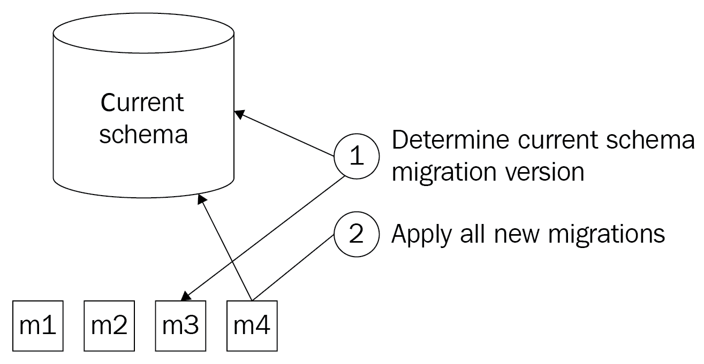
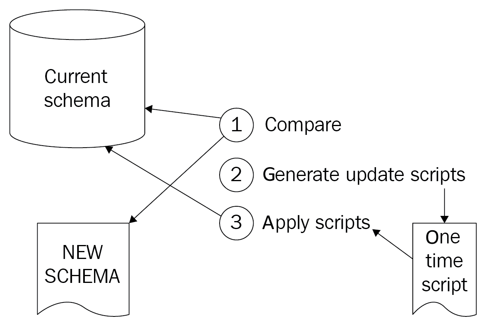

# 在 DevOps 场景中处理数据库

在前几章中，您已经学习了软件的持续集成和持续部署。您还学到了如何将相同的原则应用于基础设施配置的交付。一旦您采用了这些原则并开始增加价值交付的流动，您可能会遇到另一个挑战：管理数据库模式的变更。

将 DevOps 应用于数据库可能感觉像是在开动的汽车上更换轮胎。你必须找到某种方法，在不让系统停机维护的情况下，协调数据库模式和应用程序代码之间的更改。

在本章中，您将了解几种不同的方法来实现这一点：管理这些模式变更并避免停机。通过适当的规划和严格的方法，可以以良好的风险管理方式实现这一目标。您将看到如何将数据库模式视为代码，并将了解可用的不同方法。您还将看到另一种完全避免使用数据库模式的方法，即无模式化。

本章将涵盖以下主题：

+   将数据库模式作为代码进行管理

+   应用数据库模式更改

+   无模式化

+   其他方法和问题

# 技术要求

为了实践本章中阐述的思想，您需要安装以下工具：

+   一个安装了 Entity Framework Core NuGet 包的应用程序

+   配备 SQL Server 数据工具的 Visual Studio

+   访问 Azure Pipelines

+   一个 Azure 订阅，用于访问 Cosmos DB

# 将数据库模式作为代码进行管理

对于那些熟悉通过应用程序代码与关系数据库交互的用户来说，很可能他们已经在使用**对象关系映射器**（**ORM**）。ORM 的出现是为了填补面向对象编程语言与使用表格的关系数据库模式之间的阻抗不匹配。知名的例子有 Entity Framework 和 NHibernate。

ORM 提供了一个抽象层，允许从数据库中存储和检索对象，而不必担心底层的表结构。为了自动将对象映射到表，或反向操作，ORM 通常内建有描述数据库模式、相应对象模型及其之间映射的功能，这些通常使用标记语言来实现。大多数情况下，这些内容不需要手动编写。它们通常可以从对象模型或现有数据库中生成，并且它们之间的映射通常通过约定生成或在可视化编辑器中绘制。

虽然这些方法允许当前的数据库模式以代码的形式定义，但单靠这些方法尚不足以应对模式变化。为了将模式变化作为代码进行处理，有两种常见的方法。一种是在代码中描述每一个变化；另一种只在代码中描述最新版本的模式。这些方法分别被称为基于迁移和基于状态的方法。两者都可以依赖第三方工具，将这些变化应用到数据库中。

# 迁移

第一种方法基于保持一组必须应用于数据库的有序变更。这些变更通常被称为*migrations*，可以由工具生成，如 Microsoft Entity Framework、Redgate SQL Change Automation，或者可以手动编写。

工具可以基于当前数据库模式与源代码控制中新的模式定义的比较，自动生成迁移脚本。这被称为**脚手架生成**。工具生成的脚本并不总是完美的，它们可以通过程序员所掌握的领域知识进行改进，但工具本身没有这些知识。一旦一个或多个新的迁移被脚手架生成或手动编写，它们就可以通过所选工具应用到数据库中。下面是一个展示这一过程的图示：



在这里，我们可以看到一系列不断增长的迁移（从 m1 到 m4），用于描述数据库的增量变化。为了将数据库更新到最新版本，需要确定已应用的最新迁移，并依次添加其后所有的迁移。

在手动编辑迁移脚本时，必须记住以下几点：

+   迁移脚本应当是有序的。迁移描述了需要执行的 SQL 语句，以便将数据库从版本*x*迁移到版本*x+1*。只有当这一过程完成后，才能开始下一个迁移。

+   一个迁移脚本不仅应迁移模式，还应迁移数据。这可能意味着需要一些中间步骤。例如，将两列数据移动到另一个表通常意味着先创建新的列，然后将旧列的数据填充到新列中，最后才删除旧列。

+   建议在迁移脚本中包含所有数据库对象。额外的索引和约束不应仅应用于生产数据库，还应应用于测试环境。使用迁移时，已经有机制可以将这些内容从源代码控制传送过去。将它们包含在相同的迁移脚本中，也确保了索引和约束按相同的顺序应用，避免了它们只存在于生产环境中而意外阻塞迁移的情况。

+   如果可能，迁移脚本应保持幂等性。如果出现问题或怀疑出现问题，能够重新执行最后一个迁移是确保其完全应用的一个好方法。

这种方法的一个缺点是，生成和应用迁移脚本时对顺序的严格要求。这使得将这种方法集成到依赖分支使用的开发工作流中变得困难。不同分支中创建的迁移在合并后可能会破坏迁移的顺序，或者更糟糕的是，合并迁移路径的分裂。例如，假设在现有迁移*a*之后，在两个不同的分支中创建了两个迁移*b*和*c*。这两个迁移如何合并？无论是按顺序应用*a, b, c* 还是 *a, c, b* 都不正确，因为*b*和*c*都是在*a*之后直接执行的。修复此类错误的唯一方法是执行以下步骤：

1.  除了第一个新迁移（例如，在此情况下为*c*）之外，删除所有其他迁移。

1.  将所有其他迁移应用于没有应用任何新迁移的数据库；在这种情况下，如果*a*已经应用，则只需应用*b*，或者同时应用*a*和*b*。

1.  为其他迁移生成一个新的迁移；在这种情况下，*c*的替代。

这种方法的一个优点是，每个单独的模式变更都会以相同的方式部署到数据库中。无论一个或多个迁移是否同时应用于生产数据库，它们仍然会按可预测的顺序一个接一个地执行，并且与它们在测试环境中运行的方式相同，即使它们是逐个应用的。

# 结束状态

管理模式变更的另一种方法是，不跟踪单个变更（或迁移），而是仅将模式的最新版本存储在源代码管理中。然后使用外部工具将源代码管理中的当前模式与数据库的实际模式进行比较，生成迁移脚本，并在运行时应用这些脚本。迁移脚本不会被存储，并且仅用于一次。

与编写迁移不同，手动执行此类任务是不可行的。虽然手动在源代码管理中跟踪最新版本的模式是可以管理的，但对于结束状态方法则不可行。在比较现有模式和新模式时生成迁移脚本并应用该迁移脚本只能通过工具完成。这些工具的例子包括 Redgate SQL 源代码控制和 SQL Server 数据工具。如何使用这些工具，在此展示：



在这里，我们看到如何将当前实际的数据库模式与期望的数据库模式的描述进行比较，以生成升级脚本，并直接应用这个脚本以进行必要的更改，使实际模式与期望模式相同。

这种方法的一个优势是，不需要生成一系列必须按特定顺序执行的脚本。因此，这种方法与广泛分支的架构非常契合，尤其适合逐步集成变更的场景。它还消除了手动编写迁移的需求，适用于简单的场景，如添加或删除列、表或索引。

这种方法的缺点是，它使得处理需要数据操作的变更变得更加困难。再举个例子，假设将两列移动到另一个表中。由于工具仅强制执行新的架构，如果没有进一步的干预，这将导致数据丢失。

一种可能的干预方式是向架构包中添加部署前和部署后的脚本。在部署前脚本中，当前数据会被暂存到一个临时表中。然后，在应用新架构后，数据会从临时表复制到新位置，过程在部署后脚本中完成。

本节内容介绍了如何以可存储在源代码管理中的格式管理数据库架构变更。下一节将讨论如何在部署时拾取这些变更，并将其应用到数据库中。

# 应用数据库架构变更

有了数据库架构，并可选地定义了一系列迁移存储在源代码管理中，接下来就该考虑何时将这些变更应用到数据库架构中。有两种方法可以做到这一点。数据库架构的变更可以在部署新版本的应用程序之前应用，或者由应用程序代码本身来应用。

# 作为发布的一部分进行升级

应用数据库变更的第一种方法是作为发布流程的一部分。当这种情况发生时，负责读取和执行迁移脚本的工具会通过管道中的一个步骤来调用。

这种调用可以通过 PowerShell 或其他脚本语言中的自定义脚本完成。然而，这种方式容易出错，并且每次工具发生变更时，都有可能需要更新脚本。幸运的是，对于大多数基于迁移的工具，Azure Pipelines 提供了现成的任务，能直接从发布阶段开始执行迁移。

例如，Azure Pipelines 提供了一个扩展，用于直接从定义它们的 `dll` 文件将 Entity Framework Core 迁移应用到数据库中。此任务可以添加到发布管道中，用于在部署新应用程序代码之前更新数据库。

另一种变体是将应用程序的构建和发布阶段进行分离。在这种情况下，迁移脚本会作为独立的构建产物导出，可以直接从源代码导出（如果是 SQL 编写的），或者通过执行一个工具生成必要的 SQL 脚本作为输出。然后，在发布阶段再次下载该构建产物，并使用 Azure Pipelines 的 SQL 执行任务将其应用到数据库中。

# 通过应用程序代码进行升级

架构变更可以由应用程序本身而非发布管道来应用。一些带有内置迁移支持的 ORM 具备自动检测数据库架构是否与最新迁移匹配的能力。如果不匹配，它们可以自动将架构迁移到最新版本。

支持此功能的 ORM 之一是 Entity Framework。Entity Framework 的核心版本不内置自动迁移支持。在 Entity Framework Core 中，一行应用程序代码就可以在对应用程序而言方便的时刻启动升级。以下代码片段展示了实现此功能的代码：

```
using (var context = new MyContext(...))
{
    context.Database.Migrate();
}
```

这种方法的优点在于启用非常简单。例如，Entity Framework 中的一个布尔开关就可以启用此工作流。然而，缺点是大多数支持此功能的 ORM 会对数据库强制执行全局锁定——在迁移运行时停止所有数据库事务。对于任何需要几秒钟以上的迁移或一组迁移，这种方法可能不可行。

这种方法通常仅用于基于迁移的方法。使用终态方法的方案需要一个外部第三方工具，用于生成所需的迁移脚本并应用它们。通常这会通过发布管道完成，而不是由应用程序本身来处理。

# 添加过程

如前节所示，考虑如何以及何时应用数据库架构或使用该架构的应用程序（或多个应用程序）的变更是非常重要的。但无论架构变更和代码部署的安排如何，总会有一个时期，其中以下情况之一为真：

+   新的应用程序代码已经运行，而架构变更尚未应用或正在应用过程中。

+   在架构变更已应用或正在应用的情况下，旧版应用程序代码仍在运行。

+   在应用架构变更时，应用程序代码未运行。

第三种情况是非常不希望出现的。这通常是这样，尤其是在实践 DevOps 时。如果频繁发布变更并且在工作时间内进行，频繁因每次架构变更停机是无法接受的。

为了避免在应用架构变更时需要停机，必须满足以下条件之一：

+   架构变更具有向后兼容性，使得旧版应用程序代码能够在架构变更已经应用或正在应用的数据库上无错误地运行。

+   新的应用程序代码具有向后兼容性，能够在旧版和新版架构上运行。

满足第一个条件可以确保旧的应用程序代码在应用模式更改时仍然能够运行。满足第二个条件则确保新的应用程序版本可以首先部署，完成后可以在该代码运行时升级数据库。虽然两者都能工作，但通常希望满足第一个条件。原因是模式更改通常会支持应用程序代码的更改。

这意味着，以下过程是安全的，在不发生停机的情况下部署模式更改：

1.  创建一个新的数据库。

1.  应用数据库更改。

1.  验证更改是否已正确应用，或者中止部署管道。

1.  部署新的应用程序代码。

需要意识到，这个过程假设前向失败。这意味着，如果在部署模式更改时遇到问题，应在继续进行代码更改之前先解决这些问题。

最后，满足模式更改的向后兼容性条件，有时对于某些模式更改来说是无法完成的。如果是这种情况，可以将更改拆分为两个部分更改，两个部分共同完成相同的最终结果，并且都满足向后兼容性的条件。例如，重命名一个属性，或者将存储距离的单位从英尺改为米，可以按以下方式执行：

1.  生成一个迁移，向数据库表中添加一个新列，存储以米为单位的距离。

1.  添加一个应用程序代码，从旧列中读取数据，但写入两个列。

1.  将这些更改部署到生产环境。

1.  添加一个新的迁移，将旧列中的数据迁移到新列中，对于所有尚未填充新列但旧列已填充的情况。

1.  更新应用程序代码，使其仅读取和写入新列。

1.  将这些更改部署到生产环境。

1.  添加一个新的迁移，移除旧列。

使用正确的工具和适当的过程，可以执行有效且安全的模式更改部署。在下一部分中，将介绍另一种方法，即使用无模式数据库。

# 放弃使用模式

在前面的部分中，重点是关系型数据库，其中对每个表都应用严格的模式。另一种完全不同的数据库模式管理方法是完全放弃使用数据库模式。这可以通过使用无模式或文档型数据库来实现。一个著名的无模式数据库例子是 Azure Cosmos DB。这些数据库可以将不同形式的文档存储到同一表中。这里所说的“表”是指，因为这些类型的数据库通常不使用“表”这个术语，而是将其称为数据库、容器或集合。

由于这些数据库可以在同一集合中存储不同模式的文档，从数据库的角度来看，模式变更已经不存在。但当然，随着时间的推移，应用程序代码中相应对象的结构会发生变化。要处理这种情况，最好区分存储对象到数据库和从数据库读取对象的过程。

# 将对象写入数据库

存储在无模式数据库中的文档通常是应用程序代码中对象的序列化。当使用关系型数据库时，这些对象通常通过**对象关系映射器**（**ORM**）进行存储，比如 Entity Framework、Dapper 或 NHibernate。当使用文档数据库时，这些对象通常被序列化并存储在数据库中。这意味着代码对象定义的变化会导致在保存对象时文档结构的变化。由于文档数据库的特点，这种方式是有效的。

举个例子，考虑以下 C# 类及其序列化到文档数据库后的 JSON 表示：

|

```
public class Person
{
   [JsonConstructor]
   private Person() {}

   public Person(string name) {
      Name = name ?? throw new ArgumentNullException();
   }

   [JsonProperty]
   public string Name { get; private set; }
}
```

|

```
{
   “Name”: “Mark Anderson”
}
```

|

在这段代码在生产环境中运行一段时间后，成千上万的人员已被保存，一个新的需求出现了。除了记录人员的姓名外，还必须记录他们所在的城市。因此，`Person`类扩展以包括另一个属性。进行此更改并部署新代码后，每当保存一个人员时，以下代码将被使用，结果是生成如下所示的 JSON：

|

```
public class Person
{
   [JsonConstructor]
   private Person() {}

   public Person(string name, string city) {
      Name = name ?? throw new ArgumentNullException();
      City = city ?? throw new ArgumentNullException();
   }

   [JsonProperty]
   public string Name { get; private set; }

   [JsonProperty]
   public string City { get; private set; }
}
```

|

```
{
   “Name”: “Mark Anderson”,
   “City”: “Amsterdam”
}
```

|

尽管`Person`类的定义发生了变化——相应的 JSON 也发生了变化——这两种文档形式仍然可以保存在同一集合中。

这表明，从将信息写入数据库的角度来看，无模式方法非常方便，因为开发人员根本不需要考虑模式变更管理。

# 从数据库读取对象

尽管无模式数据库使得将不同形式的文档写入同一个集合变得非常容易，但在从该集合中读取文档并进行反序列化时，可能会遇到问题。实际上，模式管理的问题并没有消除，而是被推迟到了稍后的时间点。

继续前面的示例，在新的 C# `Person` 类定义下反序列化第一个保存的人的时候，`city`属性将得到一个空值。这可能是意料之外的，因为 C# 代码保证不会构造没有城市的人员。这清楚地展示了无模式数据库带来的挑战。

在这个示例中，可以通过将`Person`类更新为以下内容来规避该问题：

```
public class Person
{
   [JsonConstructor]
   private Person() {}

   public Person(string name, string city) {
      Name = name ?? throw new ArgumentNullException();
      City = city ?? throw new ArgumentNullException();
   }

   [JsonProperty]
   public string Name { get; private set; }

   [JsonIgnore]
   private string _city;

   [JsonProperty]
   public string City { 
      get { return _city; }
      private set { _city = value ?? _city = string.Empty}
   }
}
```

除了这个添加属性的场景外，还有许多其他场景会要求对 C# 类进行适配，以处理反序列化场景。以下是一些示例：

+   添加原始类型的属性

+   添加一个复杂属性、另一个对象或数组。

+   重命名属性。

+   将原始类型的属性替换为复杂属性。

+   将可空属性改为非空属性。

向对象添加代码以处理这些情况会增加代码库的大小和复杂性，并将处理过去情况的功能污染主代码库。尤其是在这种情况频繁发生时，这可能会导致代码库中出现不必要的复杂性。为避免这种情况，可能的解决方案是，每当对象的模式发生变化时，按照以下过程操作：

1.  更改对象的模式，确保只添加属性。即使目标是删除一个属性，在此阶段，只有具有新名称的属性被添加。

1.  在对象上实现逻辑，以应对旧版本对象的反序列化。

1.  部署对象的新版本。

1.  启动一个后台进程，从数据库中逐一加载该类型的所有对象，并将其保存回数据库。

1.  一旦后台进程处理完所有现有实体，删除负责处理反序列化过程中模式更改的代码，以及任何不再使用的属性。

使用这种方法，所有更改将在一段时间内传播到对象的所有存储版本。该方法的缺点是，对象结构的更改被分成两个必须分别部署的更改。此外，第二次更改的部署必须等待数据库中所有对象都已转换完毕。

# 其他方法和关注点。

除了前面讨论的更常见的方法，以下的一些提示和方法可能有助于减少处理数据库时的工作量，或帮助降低与数据库更改相关的风险。

# 最小化数据库的影响。

处理数据库的第一步可以是减少需要进行数据库更改的机会。在许多数据库中，可以编写存储过程——或者其他代码或脚本——在数据库引擎内部执行。虽然存储过程有一些好处，但更改它们也可能算作数据库模式的更改，或者至少会导致难以测试的更改。

一种简单的方法是将存储过程替换为应用程序代码，从而使用功能开关进行更简单的并行更改。

# 完整的并行部署。

在高风险环境或脆弱的数据库中工作时，也可以采取另一种方法进行数据库模式更改。该方法基于应用功能开关和蓝绿部署模式，具体步骤如下：

1.  以这样的方式更改应用程序代码，使其将任何更新写入不止一个，而是两个数据库。

1.  在生产环境中，创建现有数据库的完整副本，并配置应用程序代码以同时将所有更改写入两个数据库。这些数据库将被称为*旧*数据库和*新*数据库，之后将使用这些名称。

1.  仅在写入新数据库的路径中，引入对新数据库架构和应用程序代码的必要更改。

1.  在所有读取数据的代码路径中引入必要的更改，使得所有查询都在两个数据库上运行。

1.  更新应用程序代码，检测新数据库和旧数据库之间查询结果的差异，并在发现任何不一致时记录错误。

1.  如果更改顺利运行，请删除旧数据库，以及应用程序代码中的旧读写访问路径。

1.  如果更改运行时出现错误，修复问题。接下来，通过恢复目标新数据库的备份来重新启动，并从第五步开始恢复。

这种方法的优点是非常轻量级。缺点是它非常复杂，需要大量的工作，且成本较高。同时，还应考虑额外的数据库成本和备份恢复操作的时间。

# 测试数据库更改

就像应用程序代码一样，通过测试可以获得关于数据库架构更改质量的见解。关于如何对数据库架构进行测试的链接可以在本章末尾找到。

在大多数情况下，为了全面覆盖数据库更改带来的风险，需要进行系统测试，这些测试会在完整部署的应用程序堆栈上执行。这种类型的测试可以覆盖大部分由错误的架构、无效的存储过程、数据库和应用程序代码不匹配引起的风险。

# 总结

在本章中，您已经学习了如何通过源代码控制管理数据库架构及其更改。您了解了基于迁移和最终状态的更改存储方法，以及如何以安全的方式将它们应用于生产数据库。

此外，您还学习了无架构数据库如何消除传统架构管理的负担。然而，这也意味着在从数据库读取对象的旧版本时，必须应对架构差异。

在下一章中，您将学习持续测试。您不仅将学习测试技术，还将了解在何时应用哪些测试技术，以及测试如何成为 DevOps 的关键组成部分，是持续向最终用户提供价值的关键驱动因素。

# 问题

在总结时，以下是一些问题，帮助你测试关于本章内容的知识。你可以在附录中的*评估*部分找到答案：

1.  对与错：在使用 Entity Framework 时，架构管理是通过基于迁移的支持内建的。

1.  对与错：在使用基于迁移的架构管理方法时，您不需要在数据库架构中额外的跟踪表。

1.  对还是错：在使用基于最终状态的架构管理方法时，你的数据库架构中不需要额外的跟踪表。

1.  完整的并行数据库架构更改方法有哪些好处？（选择多个答案）：

    1.  风险几乎降到零。

    1.  你可以在类似生产环境中衡量更改对性能的实际影响。

    1.  并行迁移减少了周期时间。

1.  对还是错：无模式数据库完全消除了对架构更改的思考需求。

1.  你可以做出什么样的技术选择来限制对数据库模式的更改影响？

# 进一步阅读

+   关于 Entity Framework 和 Entity Framework 迁移的更多信息可以在 [`docs.microsoft.com/nl-nl/ef/`](https://docs.microsoft.com/nl-nl/ef/) 和 [`docs.microsoft.com/en-us/ef/ef6/modeling/code-first/migrations/`](https://docs.microsoft.com/en-us/ef/ef6/modeling/code-first/migrations/) 上找到。

+   关于 Redgate 及其数据库工具的更多信息可以在 [`www.red-gate.com/`](https://www.red-gate.com/) 上找到。

+   关于 SQL Server 数据工具的更多信息可以在 [`docs.microsoft.com/en-us/sql/ssdt/sql-server-data-tools?view=sql-server-2017`](https://docs.microsoft.com/en-us/sql/ssdt/sql-server-data-tools?view=sql-server-2017) 上找到。

+   用于从 DLL 部署 Entity Framework Core 迁移的 Azure Pipelines 扩展可以在 [`marketplace.visualstudio.com/items?itemName=bendayconsulting.build-task`](https://marketplace.visualstudio.com/items?itemName=bendayconsulting.build-task) 上找到。
