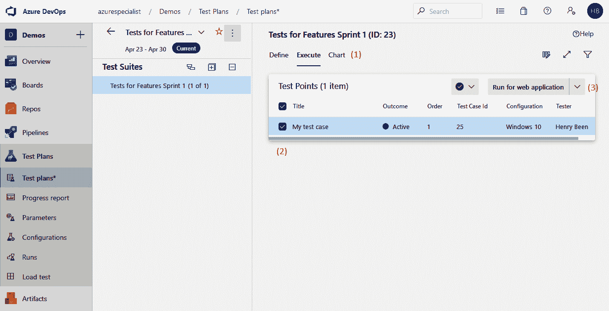

# 第八章：持续测试

在前几章中，您了解了用于帮助提高交付变更到生产环境速度的不同技术。如果您已经在日常工作中使用了这些技术，您会很快发现，只有在工作质量足够高的情况下，这才是可能的。如果您的工作质量不够高，您将面临许多停机或问题，最终用户也不会满意。为了取得成功，提升变更的速度和提高工作质量必须同步进行。要识别和提高工作质量，您首先需要了解什么是质量。这就是测试的重要性。测试是报告软件质量的学科。

本章将通过研究如何衡量软件开发的质量来介绍测试主题。接下来，将探讨功能测试的主题。首先，将介绍测试漏斗和金字塔模型。这些模型可用于确定需要哪些类型的测试，以及每种测试需要多少。之后，将逐一讨论不同类型的测试。您将了解它们如何工作、测试内容以及不同类型测试的优缺点。最后一节将集中讨论如何通过流水线生成并收集的所有指标和测试结果，持续报告团队工作的质量，甚至防止低质量的变更传播到用户。所有这些都将帮助您保持软件的高质量，并使您能够自信地快速且频繁地交付该软件。

本章将涵盖以下主题：

+   定义质量

+   了解测试类型

+   执行功能测试

+   执行非功能性测试

+   维护质量

# 技术要求

为了实验本章中描述的技术，您可能需要以下一种或多种工具：

+   一个可以访问构建和发布流水线以及仪表板的 Azure DevOps 项目

+   Visual Studio 2019

+   Azure DevOps 的 Basic + Test Plans 许可证

+   一个 SonarCloud 订阅

所有这些工具都是免费的，或者可以在有限的试用期内免费获得。

# 定义质量

第一章中讨论的 DevOps 思维模式的一个主要目标是*增加向最终用户传递价值的流动*。为了实现这一目标，软件必须频繁部署，甚至可能每天多次部署。要使频繁部署成为可能，两个因素至关重要：自动化和质量。自动化在前几章中已被广泛讨论，因此现在是时候转向质量主题了。

一旦自动化构建和发布管道就绪，且更改开始以越来越快的速度流向生产环境，就该开始衡量这些更改的质量了。更重要的是，这让我们能够终止质量不合格的更改。什么算是质量*足够*的标准因项目而异。例如，在开发游戏时，一些 bug 可能会让用户感到烦恼，但不会造成太大问题；然而，在开发飞机或医疗软件时，一个 bug 可能会造成生命损失。在软件开发中，更高的质量通常意味着更高的成本和/或更多的时间。因此，我们可以交付的特性数量和可以保证的质量之间存在权衡。每个项目都有一个不同的最佳权衡点。

在衡量质量之前，首先要确定如何衡量软件的质量。监控软件质量的一种常见方法是收集一个或多个度量指标。例如，可以决定每周收集五个测量值。随着时间的推移，将这些度量指标绘制成图表，可以洞察软件质量的演变情况。其示例如下图所示：


接下来的章节讨论了几个度量指标的示例。

# 质量度量指标

度量指标是用数字表示某些事物的手段。在软件开发中，度量指标通常用于表示某个质量方面，这一方面本身可能难以量化。例如，软件质量本身可能很难描述，质量变化的情况就更难表述。因此，我们通常会捕捉一些数字，组合起来可以揭示软件质量的情况。

重要的是要意识到，度量指标是一个很好的工具，但使用时必须谨慎。一方面，可能有比正在测量的度量指标更多的因素影响着（感知的）软件质量。此外，一旦人们知道某个特定的度量指标被记录下来，他们就可以优化自己的工作，以提高或降低该指标。虽然这可能在报告中显示出期望的数字，但这不一定意味着软件质量真的在改善。为了应对这个问题，通常会记录多个度量指标。

一个著名的例子是在敏捷工作环境中使用故事点速度。记录团队的冲刺速度，以查看团队是否随着时间的推移变得更高效，听起来很有效；然而，如果团队的规模在每个冲刺中都有所不同，那么该度量指标可能会变得无用，因为人员出席情况也会影响速度。此外，团队也可以轻易地通过在每次冲刺时同意将所有估算值乘以一个随机数来伪造该度量指标。虽然这会让每个冲刺的数字都增大，但这并不代表团队的产出能力在增加。

说到衡量软件质量的指标时，客观地衡量编写代码的质量可能是困难的。开发人员通常对什么构成*良好代码*有不同的看法，讨论越多，团队越难达成共识；然而，当将注意力转向使用这些代码的结果时，识别有助于提供代码质量洞察的指标就变得更容易了。

例如，以下是一些示例：

+   **集成构建失败的百分比**：如果代码无法编译或未通过自动化测试，这表明代码质量不足。由于每当推送新更改时，构建管道可以自动执行测试，因此它们是评估代码质量的绝佳工具。此外，由于测试可以在我们将更改部署到生产环境之前执行并收集结果，测试结果可以用于在将更改部署到发布管道的下一个阶段之前取消该更改。通过这种方式，只有足够质量的更改才能传播到下一阶段。

+   **通过自动化测试覆盖的代码百分比**：如果更多的代码通过单元测试进行了测试，这将提高软件的质量。

+   **变更失败率**：这是新版本代码部署后导致问题的百分比。例如，在部署新版本应用程序后，Web 服务器出现内存不足的情况。

+   **未计划工作的量**：在任何一段时间内必须执行的未计划工作量可以是质量的一个重要指标。如果团队正在开发并且运营一款 SaaS 产品，那么就会有时间用于运营工作。这通常被称为未计划工作。未计划工作的量可以反映计划工作质量。如果未计划工作的量增加，那么这可能表明质量下降了。未计划工作的例子包括现场事故、处理警报、紧急修复和补丁。

+   **用户报告的缺陷数量**：如果用户报告的缺陷数量增加，这可能是质量下降的一个信号。通常，这是一个滞后指标，所以一旦这个数字开始增加，质量可能已经下降了一段时间。当然，导致这个数字增加的原因有很多：新的操作系统，用户数量的增加，或者用户期望的变化。

+   **已知问题的数量**：即使新发现或报告的缺陷非常少，如果缺陷从未被修复，而已知问题的数量持续缓慢增加，那么软件的质量将随着时间的推移逐渐下降。

+   **技术债务的量**：技术债务是一个术语，用于描述为了短期利益（如快速交付代码）而牺牲代码质量的后果。技术债务将在下一节中详细讨论。

测试是一项旨在发现和报告软件质量的活动。测试结果（对质量的洞察）可用于决定是否允许或取消某个变更进入下一个发布阶段。

在下一节中，将探讨质量的另一个维度：代码库中的技术债务量。

# 技术债务

技术债务是一个术语，用于描述为实现其他目标而牺牲代码质量所带来的未来成本。例如，为了加速新特性的交付，开发人员可能会选择迅速扩展现有类，添加一些新方法来实现该特性。如果结果类不符合面向对象设计原则或变得过于庞大，这将导致该类难以理解、维护或后续修改。术语“债务”意味着有某种东西（时间、质量、关注或工作）欠缺于解决方案。只要这笔债务没有还清，你就需要支付利息，这种利息表现为所有其他工作都会稍微变慢。

技术债务可以采取多种形式，以下是一些示例：

+   没有任何单元测试覆盖的代码，无法使用原来创建该代码时的测试来验证该代码的实现变更

+   没有使用有意义的变量名和方法名以自解释的方式编写的代码

+   不符合编码原则的代码，例如 KISS、YAGNI、DRY 和/或 SOLID

+   由于有过多的变量和方法而导致过于复杂的类

+   由于包含过多语句（尤其是流程控制语句）而过于复杂的方法

+   通过应用程序不同部分存在循环依赖的类或命名空间

+   不符合应用程序架构设计的类

技术债务有许多形式，要全面管理所有这些形式可能会令人生畏。因此，有许多工具可以自动测量代码库中的技术债务并进行报告。关于此类工具的讨论将在*维护质量*部分进行。

虽然技术债务通常被认为是坏事，但有时故意产生技术债务也是有其合理原因的。就像普通债务一样，管理债务的规模以及确保能够支付利息和偿还债务是非常重要的。

公司通常在初创阶段承担技术债务，在这一阶段，快速创建一个可用的解决方案往往是一个有意识的决策。虽然这个初始版本用于验证商业方案并吸引资金，但开发人员可以通过重新实现或重构（部分）应用程序来偿还这笔债务。

另一个原因可能是市场机会或一个已经提前几个月计划的重大业务事件。为了按时交付并达成最后期限，承担一些技术债务可能是值得的。

然而，永远不偿还债务并且只是在时间上不断增加债务，最终会增加每次开发人员需要进行更改时所支付的隐性“利息”。结果是任何更改都会比上一次更花时间。如果这种情况开始发生，那么在某个时刻任何更改都将变得不再值得，因为成本总是超过收益。此时，一个项目或产品就会失败。

在谈论测试时，理解存在哪些测试类型非常重要。下一部分将深入讨论这一主题。

# 理解测试类型

在传统的软件开发中，测试通常是在*开发完成*、*应用程序被声明为开发完成*、*功能集被冻结*或类似声明之后进行的。宣布开发完成后，开始执行测试，通常会经历一段长时间的反复测试和修复 bug 的过程。结果往往是在上线后仍然发现许多 bug。

向左移动（Shifting left）是一种测试原则，表示自动化测试应当在开发过程中尽早进行。如果将与软件开发相关的所有活动画成一条从开始到发布的时间线，那么向左移动意味着将自动化测试活动移得更靠近开始阶段。

为此，识别出了许多不同类型的测试，例如单元测试、集成测试和系统测试。不同的来源可能建议不同类型的测试，但这些是一些更为知名的类型。不论测试的具体名称是什么，当我们从高层次抽象来看待这些测试时，它们通常被分为以下两类：

+   **功能测试**：功能测试的目的是测试应用程序是否实际实现了所需的功能。

+   **非功能性测试**：非功能性测试用于验证应用程序的其他所需属性是否得到实现，并且不包含不希望出现的属性。

这些类型进一步细分为更小的子类别，如下图所示：


以下三个部分简要回顾了不同类型的功能性和非功能性测试。这是为了便于后续讨论在不同情境下选择哪种测试类型以及你的项目可能需要多少种类型的测试。

# 自动化功能测试的类型

在谈论自动化功能测试时，最常用的三种类型是单元测试、集成测试和系统测试。这些测试类型可以通过多个维度进行比较：创建测试所需的时间、执行测试所需的时间以及它们所测试的范围：

+   **单元测试**：单元测试是编写最快的，而且执行速度非常快，通常在不到一毫秒的时间内完成。它们测试的是应用程序中最小的范围，通常是单个类或方法。这意味着一旦编写完成，几乎永远不需要更改单元测试。对于许多系统而言，更可能的是删除一个测试，而不是修改它。

+   **集成测试**：集成测试的编写时间较长，因为它们涉及多个单元，这些单元需要共同设置以便协作。尽管如此，这些测试的执行速度仍然应该很快，平均从不到一秒到十几秒不等。集成测试的测试范围较大，这意味着它们能覆盖更多的代码，并且更有可能发现由于更改引入的缺陷。

+   **系统测试**：系统测试测试的是一个完整的、正在运行的应用程序。根据应用程序的类型，这些通常是 API 测试或自动化 UI 测试。这些测试的创建需要很长时间，因为它们依赖于已部署的系统运行，并且通常需要在数据库或其他持久存储中设置初始状态。测试的执行时间也很长，有时每个测试需要几分钟。它们也不如单元测试和集成测试可靠，并且比单元测试和集成测试更脆弱。即使是接口的小改动也可能导致一系列测试失败。另一方面，系统测试可以发现单元测试和集成测试无法发现的错误，因为它们实际上是在测试运行中的系统。

请注意，测试中拥有大的测试范围既有优点也有缺点。优点是它能够发现很多错误。缺点是，当一个具有非常大测试范围的测试失败时，它只能提供有限的信息，帮助判断出了什么问题。这样的测试失败通常需要比范围较小的测试失败更多的调查。

以下各节将更详细地探讨每种类型的测试。

# 单元测试

单元测试用于测试一个单独的单元。对于面向对象编程语言来说，这意味着每个应用程序类都会有一个对应的测试类。为了实现全面的测试覆盖，测试类将为每个公共方法提供一个或多个测试。

单元测试应该运行得非常快——平均来说，在几毫秒以内。为了实现这一点，每个类在没有依赖项的情况下被实例化。这是通过使用接口实现的，其中类依赖于接口，而不是直接依赖于其他类。对于测试，依赖项会被模拟类替换，如下图所示。左侧显示的是运行时配置，右侧显示的是测试期间的配置：


一个模拟类实现了相同的接口，但默认没有关联任何行为。可以在每个测试中为其设置特定行为。模拟还可以用来验证某个依赖项上的特定操作或函数是否被调用。例如，考虑以下 C#类：

```
public class WorkDivider
{
    private readonly IMessageSender _messageSender;

    public WorkDivider(IMessageSender messageSender)
    {
        _messageSender = messageSender;
    }

    public void DivideWork(IEnumerable<WorkOrder> workOrders)
    {
        foreach(var workOrder in workOrders)
        {
            _messageSender.SendMessage(workOrder.GetMessage());
        }
    }
}
```

为了在自动化测试中实例化这个类，需要提供一个`IMessageSender`接口的实现。为了绕过这个依赖关系，可以使用像 Moq 这样的模拟框架来测试`WorkDivider`，如下所示。在这些示例中，使用`NUnit`作为测试框架：

```
[TestFixture]
public class WorkDividerTest
{
    private Mock<IMessageSender> _messageSender;
    private WorkDivider _subject;

    [SetUp]
    public void SetUp()
    {
        _messageSender = new Mock<IMessageSender>();
        _subject = new WorkDivider(_messageSender.Object);
    }

    [Test]
    public void WhenSendingAnEnumerableOfWorkingOrders_EverOrderIsSendToTheMessageSender()
    {
        var workOrder = new WorkOrder();

        _subject.DivideWork(new[] { workOrder });

        _messageSender.Verify(x => x.SendMessage(workOrder), Times.Once);
    }
}
```

这意味着，无法为与其他系统（例如数据库、缓存或服务总线）交互的类编写单元测试。为了确保不会导致无法使用测试覆盖应用程序的大片部分，常见的做法是将与其他系统的集成隔离到单独的类中。这些类包含与远程系统的交互，但没有业务逻辑且代码尽可能少。然后接受这些类不需要单元测试覆盖。为此常用的设计模式有外观模式、适配器模式和仓库模式。

本章末尾包含了更详细的单元测试编写指南以及如何模拟类的链接。

单元测试应准备好在每个开发者克隆应用程序代码库时在其计算机上运行。它们不应要求在本地计算机上进行任何特殊配置或设置，应该可以直接使用。这样，所有与代码库一起工作的人都可以在本地计算机上运行单元测试。因此，开发者在推送更改到中央代码库之前，最好在自己的计算机上运行所有单元测试。

除了本地验证步骤，单元测试还应作为持续集成构建的一部分。稍后你将在*流水线中执行测试*部分学习如何操作。只要拉取请求中有失败的单元测试，最好不要将更改合并到主分支。这甚至可以通过使用 Git 仓库分支策略来强制执行，在第二章中已经讨论过，*一切从源代码控制开始*。

在下一节中，关于自动化功能测试的讨论将继续涉及集成测试。

# 集成测试

集成测试用于测试一组组件是否能够正确协同工作。这些测试有两个目的：

+   增加那些未被单元测试覆盖的应用程序部分的测试覆盖率——例如，与其他系统交互的类

+   解决单元测试中没有涉及的风险，并处理与类交互的情况

理解集成风险可能很困难，因为一旦所有部分都按预期工作，整个系统似乎就能正常工作。为了更好地理解这一风险，假设两个组件一起工作，负责气候控制。其中一个组件测量温度，单位是摄氏度，另一个组件根据这个温度做出反应，期望输入的单位是华氏度。很快就会发现，虽然两个组件都按预期工作，互相交换数据并采取相应的行动，但它们的结合不会产生预期的结果。

集成测试，尤其是那些与其他系统交互的测试，不仅运行时间比单元测试长，而且通常需要更多的配置或设置。这甚至可能包括一些敏感信息，如用户名、密码或证书。为了处理这种配置，可以在测试文件旁边创建一个设置文件，测试执行前从该文件加载设置。每个开发人员都可以创建自己的一份文件副本，并使用自己的配置运行测试。

继续上一节的例子，假设实现了`IMessageSender`接口的`MessageSender`类需要一个连接字符串来完成工作。`MessageSender`的测试类可能如下所示：

```
[TestFixture]
public class MessageSenderTest
{
    private MessageSender _messageSender;

    [SetUp]
    public void SetUp()
    {
        var connectionString = TestContext.Parameters["MessageSenderConnectionString"];
        _messageSender = new MessageSender(connectionString);
    }
}
```

构建`MessageSender`类所需的`connectionString`是从`TestContext`中的`Parameters`对象中获取的。这是`NUnit`框架通过`.runsettings`文件提供设置的方式。具体实现方式可能因测试框架不同而有所不同。一个示例`.runsettings`文件如下所示：

```
<?xml version="1.0" encoding="utf-8"?>
<RunSettings>
 <TestRunParameters>
 <Parameter name="MessageSenderConnectionString" value="secret-value" />
 </TestRunParameters>
</RunSettings>
```

将设置移到单独的文件中，确保敏感信息不会被提交到源代码管理系统中。在*在流水线中执行测试*部分，你将学习如何为在流水线中运行测试构建一个`.runsettings`文件。

这是因为集成测试应该尽可能也作为持续集成构建的一部分。然而，这样做有可能使得持续集成构建变得过于缓慢。为了解决这个问题，可以实施以下解决方案之一：

+   集成测试在一个单独的构建中执行，这个构建是与持续集成构建并行触发的。这样，持续集成构建的时间保持较短，同时集成测试仍然会持续执行，开发人员能迅速获得反馈。

+   集成测试通常在流水线的后期执行，接近软件发布阶段——例如，在部署到测试环境之前或之后。

第一种方法的缺点是，以这种方式执行集成测试意味着测试将不再作为代码合并到`master`之前的质量门控。它们当然仍然会作为质量报告机制继续工作。这意味着，尽管错误可能会被合并，但它们会被构建过程检测并报告。

第二种方法没有这种风险，因为执行测试仍然是从源代码管理到生产的管道的一部分；然而，在这种方法中，如果不是每个构建都至少进入发布管道的某一部分，测试的执行可能会被推迟到稍后的时刻。这意味着缺陷可能会在稍后才暴露，延长了检测和修复问题之间的时间。

无论采用哪种方法，集成测试失败将不再阻止合并更改，因此你必须找到另一种方法，确保开发人员负责修复导致测试失败的缺陷。

随着系统测试的出现，这些权衡变得更加明显，系统测试通常需要很长时间，因此不可能将其纳入持续集成构建中。

# 系统测试

第三种也是最后一种类型的自动化功能测试是系统测试。这些测试旨在针对一个完整组装并运行的应用程序进行。系统测试根据应用程序的类型有两种形式：API 测试或 UI 测试。系统测试的执行时间可能很长，尤其是有复杂测试数据设置的长时间测试，往往需要超过一分钟。

你可能会遇到一种叫做编码 UI 测试的东西。这是微软现已弃用的用于编写 UI 测试的解决方案。这些测试可以从 Azure Pipelines 中执行。幸运的是，有许多替代方案，微软在其弃用消息中提到，详细内容请参见[`devblogs.microsoft.com/devops/changes-to-coded-ui-test-in-visual-studio-2019`](https://devblogs.microsoft.com/devops/changes-to-coded-ui-test-in-visual-studio-2019)。

系统测试是在运行的应用程序上执行的，这意味着在执行之前需要进行配置和设置。应用程序需要在受控环境中运行，所有与数据存储的集成需要完全正常工作。与其他系统的集成要么需要处于运行状态，要么用替代的模拟替换，以确保所有与这些系统集成的操作能正常进行。

这些条件使得开发人员在修改应用程序时执行这些测试的可能性较小。通常只有在创建新测试或更改现有测试时，他们才可能这样做。然而，即便如此，他们也许并不是在本地运行的应用程序版本上执行这些测试，而是在已经部署到测试环境中的版本上执行。这不一定是好事，但往往是大多数团队中的现实情况。

可惜的是，如何创建 API 或 UI 测试的介绍超出了本书的范围。市场上有许多产品可供选择，哪个最好使用会根据项目不同而有所不同。

在执行系统测试作为流水线的一部分时，它们通常是在代码部署到至少一个环境之后进行的。这通常是测试环境。这意味着系统测试是从源代码变更到生产环境部署的关键路径的一部分。如果这个路径变得太长，它们也可以从流水线中移除，改为按计划执行——例如，每晚执行一次。与集成测试一样，这样可以加速流水线，但也就失去了将系统测试作为质量门控的机会。

系统测试，尤其是 UI 测试，通常比较脆弱，在发生微小变化后可能会意外停止工作。由于这个原因，建议尽量减少此类测试的数量；但是，请记住，这些测试能够捕捉到特定的错误，例如配置错误、其他运行时错误、数据库与应用程序的不匹配，或者一系列导致错误状态的操作。

除了自动化功能测试，还有许多 DevOps 项目中也有价值的手动功能测试。接下来将讨论这些测试。

# 手动功能测试的类型

虽然自动化测试是快速且频繁获得开发反馈的好工具，但仍然有一些内容需要手动测试。虽然自动化重复性测试是持续监控质量的最佳方式，但有些事情仍然需要人工检查。

手动测试是向左 shift 的关键点*。* 每当任何类型的测试或验证被向左 shift 时，这意味着它是在手动测试执行之前进行的。这样做的好处是，所有这些自动化活动都会增加我们对正在测试的应用程序版本的信心，从而提高该版本通过手动测试的可能性。换句话说，当手动测试开始时，任何新问题被发现的可能性应该非常低。

手动测试有两种类型：

+   脚本化测试

+   探索性测试

以下部分将讨论这两种类型的测试。

# 脚本化测试

脚本化测试是一种技术，用于在确保全面覆盖所有相关测试用例的同时，最大限度地减少测试执行的时间。这是通过将测试分为两个不同的阶段来完成的：测试准备和测试执行。测试准备与待测试功能的开发并行进行，甚至在开发开始之前就可以进行。在测试准备阶段，功能被分析并识别出正式的测试用例。

一旦确定了必须执行的测试用例，就会编写手动测试脚本，描述测试执行阶段需要执行的每一步。这些脚本的设计方式使得它们易于遵循，并且没有任何疑问或不明确的地方。它们也被编写成尽可能减少执行步骤的数量。虽然这可能需要更多的准备时间，但所有这些都是为了确保在测试执行时花费尽可能少的时间。

对于测试分析的更深入讨论，以及如何识别测试用例，超出了本书的范围。虽然你负责创建测试用例，Azure DevOps 会在这方面为你提供支持。使用测试计划服务，你可以创建测试计划并记录其中的测试用例，以便稍后快速执行。

要创建一个新的测试计划，请执行以下步骤：

1.  打开 Azure 测试计划菜单：


1.  在这个菜单中，点击测试计划。这里你将看到当前拥有的所有测试计划的概览。

1.  点击“新建测试计划”按钮以开始创建新的测试计划。这将打开一个新的对话框，如下图所示：


1.  给测试计划起一个有意义的名称，例如，能够说明测试计划用途的名称。

1.  将测试计划链接到正确的产品区域路径。

1.  选择与此测试相关的正确迭代或冲刺。

1.  点击“创建”以完成测试计划的创建。这将自动打开该测试计划，如下所示：


一个测试计划可以分为多个测试套件，而每个测试套件又可以再次分割。实际上，测试套件对测试的作用就像文件夹对文件的作用一样。通过点击在测试套件上悬停时出现的省略号按钮，可以管理这些套件。这在之前的截图中有所展示。

创建测试计划后，就该向计划中添加一个或多个测试用例了。为此，确保打开测试套件的定义标签页，并点击“新建测试用例”按钮。会弹出一个新的窗口：


在这里，可以定义测试步骤和预期结果。要定义一个新的测试用例，请执行以下步骤：

1.  输入测试用例的标题。

1.  在对话框中，输入一个或多个动作及预期结果，详细描述测试用例。

1.  一旦测试用例完全描述完成，点击保存并关闭按钮以保存测试用例，并返回到之前的屏幕，在那里可以管理测试套件。

一旦准备工作完成并且功能准备好进行测试，所有的测试就会执行。由于所有测试都已经详细脚本化，因此这可以快速且有效地完成。甚至可能会有开发人员、业务分析师或公司其他部门的人协助执行测试。这意味着测试执行本身将非常迅速。

要开始执行测试套件或计划，请执行以下步骤：

1.  导航到执行标签：



1.  选择一个或多个测试用例。

1.  在右上角选择一个运行选项。

当选择对网页应用程序运行测试时，将打开一个带有*测试执行器*的新浏览器窗口。可以使用此测试执行器逐个测试用例地执行所有步骤，并跟踪所有的成功和错误，如下所示：


每个测试步骤后的勾选框或叉号可以用来跟踪单独步骤的结果。如果某个步骤被标记为错误，可以添加带有缺陷的评论。要将测试用例标记为通过或标记，右上角的蓝色下拉菜单可以用来标记结果。一旦选择了测试结果，测试执行器会自动跳到下一个测试。一旦所有测试都执行完毕，可以通过左上角的保存并关闭按钮保存结果。

要查看测试运行的结果，导航到测试计划，然后选择运行，查看如下仪表板：


在这里，您可以选择要查看其结果的运行，从而快速概览测试结果。在第二个标签页“测试结果”中，可以查看所有测试用例的列表，以及它们是否通过。

拥有详细脚本的一个主要好处是相同的测试可以执行多次，从而减少每次执行的成本。如果一个测试计划被执行多次，所有的执行历史都会被保存，并且可以通过前面截图中显示的视图访问。这在手动测试作为回归测试的一部分时非常有用；然而，一旦成为这种情况，通常将测试自动化为系统测试会更加有益，如果可能的话。

可以多次执行相同的测试，但对于不同的*配置*。在开发网页应用时，通常会通过不同的浏览器进行测试。对于桌面应用程序，这可能用于测试不同的操作系统。有关配置的详细信息，请参考微软文档：[`docs.microsoft.com/en-us/azure/devops/test/mtm/test-configurations-specifying-test-platforms?view=azure-devops`](https://docs.microsoft.com/en-us/azure/devops/test/mtm/test-configurations-specifying-test-platforms?view=azure-devops)

下一部分将讨论功能测试的最终形式，即探索性测试。

# 探索性测试

编写和执行详细的测试脚本可能会占用测试工程师和测试执行者大量的时间，因此这些测试通常会被自动化。一旦它们被自动化，它们将属于系统测试和自动化 UI 测试的范畴。

这并不一定意味着手动测试没有价值或没有好的投资回报。只是有些事情是人眼能发现的，而计算机无法察觉的，比如那些不够用户友好的界面、错位的界面元素，或者那些没有完全显示而被其他元素遮住的文本行或图片。

为了在不花费大量时间编写详细测试脚本的情况下捕捉这些错误，探索性测试可能是一个解决方案。在这种方法中，测试人员打开应用程序并开始调查他们认为在即将发布的版本中包含最多风险的部分。在探索应用程序的过程中，测试人员会记录他们访问过的部分以及执行过的测试用例。同时，测试人员还会记录他们发现的新风险或尚未执行的测试用例。通过这种方式，他们在工作过程中创建了一个已覆盖和未覆盖的测试用例列表。这还允许测试人员始终专注于最重要的风险和测试用例。一旦探索性测试结束，测试人员可以报告哪些应用程序区域和测试用例已覆盖，哪些未覆盖，哪些风险仍然没有被探索到。这个报告对于产品经理来说是非常有价值的输入，帮助他们决定是否继续进行发布。

一个常见的误解是，探索性测试意味着测试人员只是随便点击看应用程序是否正常工作。事实并非如此，前面的段落已经表明，探索性测试是一项高度结构化的活动，需要实践。如果执行得当，测试准备和测试执行在探索性测试过程中是交织在一起的。

探索性测试是当时间有限或无法提前知道可用测试时间时的一个非常好的工具。探索性测试可能会产生需要记录为缺陷的发现。接下来将介绍如何进行此操作。

# 报告手动测试结果

测试的一个重要活动是报告发现的任何缺陷或其他问题。这通常是一项繁琐且耗时的工作。你必须再次尝试重现问题，尽量记住问题是如何表现出来的，并将所有步骤写下来。然后，必须描述期望的结果和不期望的结果，拍摄截图，并将一切内容插入到缺陷跟踪器或工作管理工具中，例如 Azure DevOps。

为了简化这个过程，Azure DevOps 提供了一个**Test & Feedback**扩展。这个扩展提供了简单的按钮，用于录制截图或视频，并通过文本或图形进行标注。一旦发现并通过录制或截图记录了问题，它可以自动提交到 Azure DevOps 看板中。

这个扩展可以从 Azure DevOps 市场免费获得，并且支持在 Firefox 和 Chrome 浏览器中运行。当前正在开发对 Edge 浏览器的支持。扩展的链接将在本章末尾提供。

Test & Feedback 扩展可以在执行脚本化测试和进行探索性测试时使用。

这部分结束了对不同类型功能测试的讨论。下一部分将帮助你决定在项目中使用哪种类型的测试。

# 决定需要哪些类型功能测试的策略

面对如此多不同类型的测试，哪种测试最适合你的项目？考虑到测试种类繁多且性质各异，答案正如你所料：混合使用它们，因为它们各有不同的特点。

下图显示了不同类型的测试执行时间与它们提供的质量信心之间的关系。图中表明，尽管成功完成的手动测试具有识别缺陷的最高概率，但它们执行的时间最长。对于自动化测试，成千上万的单元测试通常可以在几分钟内完成，而十到一百个系统测试可能需要超过 30 分钟：


从这种权衡来看，通常更倾向于优先使用单元测试而非集成测试，优先使用集成测试而非系统测试，任何类型的手动测试都优先于自动化测试。

如果单元测试和集成测试的质量提高，那么这条线将进一步向左上方攀升。高质量的软件架构还将有助于减少对系统测试和集成测试的需求，并增强单元测试带来的保证。这两者都能使快速且频繁执行的自动化测试的积极效果更加显著。

理解这种权衡关系也有助于理解两种可以用于决定测试策略的模型：测试金字塔和测试奖杯，接下来的两部分将讨论这两种模型。

# 测试金字塔

在许多较旧的项目中，自动化功能测试并不多。通常，这些测试执行较慢，测试范围大，难以维护，且经常失败，且没有明确的原因。这些测试所提供的价值通常非常有限。为了弥补缺乏良好的自动化测试，通常会进行大量的手动测试，在新版本部署之前进行完整的回归测试。这些自动化测试非常耗时且很少执行。开发人员没有快速反馈，缺陷通常在晚些时候才被发现。在这种情况下，很难实践 DevOps，因为 DevOps 的重点是快速且频繁地创建新版本。

这样的应用程序测试组通常被称为冰淇淋锥形测试：许多手动测试和少量自动化测试，其中只有少数是单元测试。冰淇淋锥形测试是一种反模式，但常常出现在较旧或长期运行的项目中：


为了应对这一点，提出了另一种相对立的模型：测试金字塔。该模型主张拥有大量单元测试，可以在几分钟内反馈应用程序的质量，快速指出大部分错误。在此之上，其他类型的较慢测试被分层，用于捕捉前面层次无法捕捉到的错误。使用这种方法，测试覆盖率和测试时长之间有一个很好的权衡。

请注意，测试金字塔并不倡导分层方法。不要先构建一层单元测试，只有当所有单元测试完成时才开始进行集成测试。相反，它提倡比例：你应该在单元测试、集成测试和系统测试之间保持健康的比例。

关于不同类型测试之间最佳比例的一般建议很难给出。但在大多数项目中，金字塔中每一层的比例为 1:5-15 是合理的。

# 测试奖杯

虽然测试金字塔是一个广为人知且常用的分类测试方法，用于决定创建哪种类型的测试，但这种方法也受到了批评。虽然在 DevOps 团队中，远离手动测试和系统测试被普遍认为是必要的，但对单元测试的重视并非普遍接受。有些人反对测试金字塔暗示要创建更多的单元测试而非集成测试这一事实。

反对这种做法的原因如下：

+   **单元测试往往与其测试的实现紧密相关。** 回顾在“单元测试”部分中对`WorkDivider`的测试，可以看出它依赖于了解`DivideWork`方法的实现。这个测试实际上验证的是实际实现：对`SendMessage()`的调用。许多单元测试都有这种特征，因此，增加大量单元测试会增加更改类级设计实现的难度。

+   **单元测试的变化率通常比集成测试更高。** 单元测试类与它们测试的类紧密关联。这意味着，如果被测试的类被替换，这些单元测试也将失去所有价值。因此，有人认为，集成测试可能具有更高的投资回报率。

+   **真正的价值来自于集成组件，而不是单个组件。** 即使所有单元在独立运行时都能正常工作，系统可能并不会提供任何价值。软件的真正价值只有在集成并准备运行后才会体现出来。由于测试应该验证价值交付，因此有人认为，重点应该放在编写集成测试而非单元测试上。

为了应对这些反对意见，*Kent C. Dodds*提出了测试奖杯模型。这个模型采纳了测试金字塔的理念，提倡尽量减少手动和系统测试，但与金字塔不同的是，它并不强调单元测试的重要性，而是更注重集成测试。测试奖杯这一名字来源于，如果将其绘制出来，会形成一个类似奖杯的形状。

不幸的是，并没有“银弹”解决方案，最好的建议是了解三种模型及其背后的推理，并将适当的推理应用到当前情况中。对于测试而言，并没有适用于所有情况的最佳解决方案。

# 非功能性测试的类型

功能测试主要关注验证应用程序展示的行为是否是预期的行为；然而，在应用程序开发中存在更多的风险：应用程序是否足够快速地执行操作，随着更多用户同时使用系统时，性能是否会下降，以及系统是否易于终端用户使用。验证这些系统属性的测试称为非功能性测试。

有许多类型的非功能性测试，但在 DevOps 场景中，以下三种尤为重要：

+   性能测试

+   负载测试

+   可用性测试

让我们一一回顾它们。

# 性能测试

性能测试是用来确定在给定资源的情况下，应用程序执行某个操作的速度。性能测试通常使用专门的工具，并在完整的系统上执行。如果用于自动化 API 或 UI 测试的工具记录了测试的持续时间，那么这些测试的持续时间也可以作为性能结果。

为了比较多次测试的结果，必须确保影响性能的所有因素在测试之间保持一致。测试主体和测试执行者的虚拟机设置应保持相同。应用程序配置应保持不变，集成点应尽可能保持在相同状态——例如，应该在每次性能测试前从备份恢复相同的数据库，而不是重复使用同一个数据库。这样可以确保结果具有可比性。

尽管性能测试和负载测试常常被混淆，但它们是两种不同的测试类型。

# 负载测试

负载测试用于衡量系统在崩溃之前能承受多少负载。这类测试有时也被称为压力测试。与性能测试不同，负载测试会并行执行多个请求。衡量的指标是所有请求的平均性能，同时逐渐增加请求的数量。在大多数情况下，这将确定一个临界点，即每秒请求的特定数量，超出此数量时性能会突然下降。这是系统能够最大承载的每秒请求数。执行负载测试时，收集在最大请求数增加过程中所有请求的平均性能，通常会得到如下图表：


这张图表展示了为何了解应用程序的崩溃点很重要：过高的负载可能会意外地让系统崩溃，因为响应时间变化的突发性质。了解这个临界点可以让操作人员在生产环境中到达此点之前采取行动。

本章末尾有一个链接，指向一个微软在线实验室，供开发人员练习负载测试。

# 可用性测试

另一种重要的测试类型是可用性测试。虽然其他类型的测试侧重于验证实现是否符合产品团队的预期行为，但可用性测试则侧重于验证用户的期望是否得到了满足。这意味着测试范围更广，这些测试可以识别笨拙的用户界面，并帮助发现不清晰的文本或误解的用户请求。

可用性测试是通过让用户在一个或多个任务上使用最终的应用程序，并观察或询问他们与应用程序互动的方式来进行的。结果通常比“通过”或“未通过”更为详细，并且结果通常会反馈给产品负责人，以便编写新的用户故事或更改需求。

一个很好的可用性测试技巧是使用功能标志。功能标志使我们能够逐步将新功能暴露给更多用户。这一功能也可以用来首先仅将新功能暴露给一小部分、参与可用性研究的用户。这使得研究人员或产品负责人能够密切观察这些用户使用新功能的情况，而其他用户则无法访问该功能。

在第四章《持续部署》中曾讨论过功能标志作为渐进式曝光的一种策略。新功能的渐进式曝光本身就是一种可用性或用户接受度测试。

这种方法可以扩展到执行 A/B 测试。在这类测试中，一半的用户会接触到新功能，而另一半则不会。然后会收集关于所有用户的度量数据，看看新功能是否带来了预测的好处——例如，用户是否每天使用应用程序的时间增加了。这个话题将在第十一章《收集用户反馈》中进一步讨论，介绍如何收集用户反馈。

这样做会将可用性测试推向发布过程的后期。也可以通过在最终应用程序之前，使用原型来执行可用性测试，从而将测试提前到左侧。

这部分内容结束了对不同类型测试的讨论。在接下来的章节中，将使用度量标准和测试来自动衡量质量并实现质量控制。

# 在管道中执行测试

开发人员在提交代码合并请求之前，应在本地机器上执行测试。这样，他们可以确保自己所做的更改没有破坏代码中任何先前的行为。理论上，这可以保证所有合并到主分支的代码都能成功编译并通过所有测试。但在实践中，存在许多原因导致这种情况并不总是成立。一些原因如下：

+   有些测试可能无法在本地运行。它们依赖于机密的配置值，或者配置为在一个完全配置的系统上运行。系统测试通常会遇到这两种情况中的一种或两种。在许多情况下，无法从本地系统运行系统测试。这些情况并不全是不可取的或无法克服的，但通常确实如此。

+   开发人员毕竟是人类。他们可能会忘记在做最后一个小调整后，在本地机器上运行测试，或者他们可能确信自己的更改并没有破坏现有的行为。尤其是在紧急修复 bug 时，可能会因为追求速度而跳过测试。

为了防止这些情况导致未完全测试的代码通过流水线传播，建议所有测试也在流水线内执行。接下来的部分将展示如何为单元测试、集成测试以及通过其他系统运行的测试执行此操作。首先是单元测试。

# 运行单元测试

对于许多语言，Azure DevOps 内置了从流水线运行单元测试的支持。可以为 C#、TypeScript、Python、Maven、C++、Go 等多种语言执行单元测试。

对于其中一些语言，提供了一个现成的任务。例如，用 C# 编写的测试。在执行 .NET 测试（例如 C#）时，测试结果会自动以构建代理能够理解的 XML 格式存储。

这允许流水线代理解释测试结果并在构建结果中可视化它们，如下所示：


对于某些语言，可能需要执行多个任务。例如，用 TypeScript 编写的测试通常通过 NPM 命令执行。以下 YAML 可用于执行此操作：

```
- task: Npm@0
  displayName: 'Run unit tests - npm run tests'
  inputs:
    cwd: src
    command: run
    arguments: test
```

这将执行在 `package.json` 中指定的自定义 NPM 命令。不幸的是，这不会以流水线代理可以理解的格式存储测试结果。为了将结果转换为正确的格式，需要另一个任务：

```
- task: PublishTestResults@2
  displayName: 'Publish Test Results'
  inputs:
    testResultsFiles: '**\reportTests\TEST-*.xml'
    mergeTestResults: true
  condition: succeededOrFailed()
```

测试结果是否直接可用或需要转换，因编程语言而异。除了发布测试结果外，建议还要收集测试覆盖率结果。

# 记录单元测试代码覆盖率

最佳实践是，不仅在构建过程中运行所有单元测试，还要确定在任何这些测试中执行的代码基的百分比。这被称为 *单元测试代码覆盖率*，它是衡量测试全面性的一项指标。构建还可以配置为发布单元测试所实现的代码覆盖率。

要配置构建以发布 .NET Core 单元测试的测试覆盖率，必须执行以下步骤：

1.  将 NuGet 包 `coverlet.msbuild` 安装到单元测试项目中。

1.  使用 .NET Core 任务执行测试，并添加两个参数以生成覆盖报告，`/p:CollectCoverage=true` 和 `/p:CoverletOutputFormat=cobertura`：


1.  添加发布代码覆盖任务：

    1.  将代码覆盖工具设置为 `cobertura`。

    1.  配置 `$(System.DefaultWorkingDirectory)/**/coverage.cobertura.xml` 作为汇总文件：


1.  构建的运行详细信息现在将包含代码覆盖报告。

这是生成详细代码覆盖报告所需的所有配置。生成的报告包含已覆盖和未覆盖的代码块数量以及计算出的覆盖率百分比。这些报告是构建结果页面的一部分。

除了单元测试，集成测试也可以作为管道的一部分运行，并且它们通常伴随着管理配置设置的挑战。

# 运行集成测试

集成测试通常与单元测试使用相同的框架编写。然而，它们有自己独特的挑战。通常，它们需要一个或多个设置，指定如何与测试中涉及的一个或多个其他组件进行集成。回顾之前讨论过的`MessageSender`类的集成测试，这是一个典型的例子。

记住，这个测试有一个`.runsettings`文件，应该指定它应使用的队列的`connectionString`吗？这个`connectionString`设置不能被检查到源代码控制中。相反，可以将占位符检查到源代码控制中，然后在管道执行过程中将其替换为实际的密钥。

在这种情况下，这意味着以下`pipeline.runsettings`文件将被检查到源代码控制中：

```
<?xml version="1.0" encoding="utf-8"?>
<RunSettings>
    <TestRunParameters>
        <Parameter name="MessageSenderConnectionString" value="#{MessageSenderConnectionString}#" />
 </TestRunParameters>
</RunSettings>
```

在开始实际的测试执行之前，将运行另一个任务以用实际值替换占位符。正如在第三章《迁移到持续集成》中讨论的那样，这些值可以从变量组、密钥库或管道变量中安全地检索。Azure DevOps 有多个扩展可以用来将占位符替换为实际值。以下是如何执行此操作的 YAML 示例：

```
  - task: qetza.replacetokens.replacetokens-task.replacetokens@3
    displayName: 'Replace tokens in pipeline.runsettings'
    inputs:
      targetFiles: $(System.DefaultWorkingDirectory)/integrationtests-location/pipeline.runsettings
```

在执行替换令牌任务后，可以像单元测试一样调用测试运行器。

# 运行外部测试

除了单元测试和集成测试，你可能还需要使用其他系统执行测试。例如，Azure DevOps 没有内置支持执行负载测试或自动化 UI 测试。对于这些类型的测试，必须从管道中调用其他系统。许多系统可以通过这种方式进行集成。

如何执行此操作因系统而异，但大多数情况下，以下步骤适用：

1.  配置外部系统中的测试。

1.  为 Azure DevOps 安装一个扩展，使得可以从管道中调用外部系统的任务。

1.  创建一个到外部系统的服务连接。

1.  将任务添加到管道中。

有关配置集成的详细信息，一个好的起点通常是第三方产品供应商的网站。

# 维护质量

前面的部分详细介绍了用于描述应用程序质量的各种测试和度量标准。考虑到这些内容，现在是时候开始思考可以用来维持高质量甚至提高质量的工具了。

# 代码审查

保护代码质量的最强大工具之一就是代码评审。当使用 Git 时，开发者需要提交一个 pull request，将自己的更改合并回主分支。Pull request 允许一个或多个其他开发者对所有更改进行审查并发表评论。打开 pull request 的开发者可以查看评论并根据反馈进行相应修改，从而在继续工作时提高更改的质量。

为了让代码评审发挥最大效果，重要的是不要把它看作必须以尽可能少的努力通过的一个门槛。以一种开放的心态，假设每个人都在努力编写高质量的代码，将代码评审视为关于代码质量讨论的起点，这要比把它看作一个不受欢迎的仪式更有成效。重要的是改变视角，不再将代码评审视为软件开发中的一个烦人的仪式，别人会抱怨你的代码，而是将它视为欢迎他人对你的代码提出意见并帮助你写出更高质量代码的机会。

一旦建立了这样的心态，代码评审将成为学习的来源。它们将引发同行之间的讨论，关于如何以最佳方式解决问题：不仅是现在的最佳方式，还有未来的最佳方式，避免技术债务，并确保与待合并代码一起有足够的单元测试和集成测试。代码评审也是一个很好的辅导工具，能让初级开发者获得关于自己工作的反馈。让初级开发者评审高级开发者的代码，甚至可能更有价值。这样，他们可以提出自己尚未了解的问题，这通常会促使他们指出可能随着时间推移成为技术债务的过于复杂的解决方案。

# 自动收集质量指标

除了手动评审，还有许多工具可以用来自动确定代码库的质量。部分工具内建于 Azure Pipelines 中，但更复杂的功能则来自于独立的代码扫描工具。衡量技术债务的方法有多种数学方法，使用工具来进行这些衡量，不仅能提供应用程序质量的深刻洞察，还能反映出随时间变化的质量变化。

衡量应用程序质量的一个可能工具是 SonarCloud。SonarCloud 是基于 SonarCube 的 SaaS 服务。该工具可以自动扫描代码库，查找可能的 bug、安全风险、技术债务和其他质量指标。这是一个收费的独立服务，能够与 Azure DevOps pipelines 集成。使用 SonarCloud 时，必须创建一个账户并获取项目密钥，以便通过 Azure DevOps 启动 SonarCloud 扫描。

为了调用 SonarCloud，使用的是三个任务的集合，它们是 Azure DevOps 扩展的一部分。安装扩展并配置 SonarCloud 服务连接后，三个任务将被添加到管道中，以设置分析、执行分析，并（可选）在质量下降时使构建失败。第一个任务是唯一需要配置的任务，配置如以下截图所示：


每次执行的构建都会自动由 SonarCloud 扫描其代码，届时将提供关于质量的详细报告。在这些报告的基础上，会生成一个仪表板，提供一些关键质量指标的快速概览：


这是另一个展示质量指标的仪表板视图：


代码扫描工具可以用于报告代码的质量，但也可以充当质量门，如果检测到质量不足，将阻止更改合并或部署到特定环境。

# 可视化质量

持续衡量应用程序的质量没有意义，除非采取了相应的行动。仪表板可以作为一个强大的工具，持续洞察当前质量水平以及质量随时间的变化。

大多数代码质量工具都具有内置报告选项，它们对于质量保证工程师非常有价值。它们提供了关于应用程序哪些部分质量较高、哪些类型的问题最近发生得更频繁的详细信息。

这种类型的仪表板的缺点是它们可能难以阅读，并且它们不在开发人员执行大部分工作的工具中。因此，创建 Azure DevOps 中的仪表板来报告质量也可能是有益的。以下截图显示了这样一个仪表板的示例：


此仪表板显示当前质量和应用程序代码的概览，以及一些最近的历史记录。在这里，您可以找到以下信息：

+   最近的更改数量显示在顶部，并显示了最新 SonarCloud 质量门的结果，目前显示为“通过”。

+   本项目中两个不同构建的结果显示在第二行。

+   第三行和第四行显示了项目中所有构建和发布的聚合结果。使用符号表示构建和发布的状态：成功、失败或仍在运行。

+   右侧使用了两个小部件来显示过去 10 个构建中失败的测试百分比及相应的失败测试数量。

+   最新发布运行的结果按环境显示在下方。

像这样的仪表板可以通过内置的小部件或扩展为每个团队或每个项目创建。在 Azure DevOps 市场中有许多可用的扩展。例如，在前面的仪表板中，使用了团队项目健康状况扩展。

Azure DevOps 仪表板可以配置为每五分钟自动刷新，使其也可以用作墙面板。

# 质量 gates

衡量、报告甚至可视化质量非常重要且有价值；然而，如果没有人根据所有这些指标采取行动，那对开发团队来说是没有价值的。为了防止这种情况，可以引入自动化质量 gates 或检查。

实现质量 gates 的一种方式是，在每次测试失败、测试覆盖率过低或设置的代码扫描工具阈值不再满足时，失败持续集成构建。这些都是之前讨论过的内容。另一种强制执行标准的选项是向管道添加 gates 或检查。这样，必须满足特定条件，管道才能继续。

这在经典发布和 YAML 多阶段管道之间有所不同。

# 经典发布

另一种选择是使用 Azure 发布管道中的 *gates*。在这里，可以指定必须满足的一个或多个条件，才能允许发布部署到特定环境。gates 也可以是扩展的一部分，例如之前讨论过的 SonarCloud 扩展。

可以通过选择发布管道中的任何阶段并编辑预部署条件来添加 gates。启用 gates 后，可以添加一个或多个 gates。以下是发布管道的截图，显示了如何阻止任何质量不足的构建部署到环境中：


使用部署批准和 gates 不是互斥的，因此可以混合使用两者。

# 多阶段管道

Gates（如同经典发布中一样）出现在多阶段 YAML 管道中。在 YAML 管道中，还有另一种机制：检查（checks）。检查被配置为在允许管道继续之前，自动验证是否满足一个或多个条件。检查可以添加到在某个阶段中使用的资源上。如果在某个阶段的一个或多个资源上找到检查，则必须通过所有检查，管道才能继续该阶段。检查也可以添加到环境和服务连接中。

要将检查添加到环境中，请导航到该环境：


现在执行以下步骤：

1.  在右上角，展开菜单并选择“批准和检查”：

1.  在打开的新视图中，选择“查看所有”以查看所有可用的检查类型。选择“调用 Azure 功能”：


1.  在打开的弹出窗口中，配置要调用的 Azure 函数。至少需要提供函数的 URL 和密钥。

1.  选择创建。

创建检查后，每个目标环境的部署任务（见第四章，*持续部署*）都必须通过此检查。当调用的函数返回成功的响应码时，检查通过。

支持以下类型的检查：

+   **评估工件**：验证类型为容器镜像的工件是否通过自定义策略。这些策略是用一种叫做*Rego*的语言定义的。

+   **调用 REST API**：将流水线的详细信息发送到 Azure 函数以执行自定义逻辑。如果 API 返回成功的 HTTP 状态码，则允许流水线继续。

+   **调用 Azure 函数**：与调用 REST API 检查相同，但对于 Azure 函数有一些默认设置。

+   **查询 Azure Monitor 警报**：仅当指定的警报不处于活动状态时才继续。

+   **所需模板**：仅当当前 YAML 流水线扩展一个或多个已配置的基本 YAML 流水线时，才能继续流水线。

检查可以成为一个强大的机制，确保在允许流水线继续之前，满足一个或多个条件。

# 总结

在这一章中，你学习了如何衡量和验证软件开发过程的质量。快速且频繁的发布要求所写的软件具有高质量。测试是确保你编写高质量软件、减少技术债务的必要步骤。你了解了不同类型的测试以及各种自动化和手动测试的优缺点。最后，你学习了代码审查和工具如何通过报告质量和充当质量门控来帮助保持项目的高质量。

有了这些知识，你现在可以讨论测试和测试类型，帮助你决定应用程序需要哪些测试，哪些风险可以通过哪些类型的测试来解决，以及你是否需要大量的测试还是可以省略它们。你现在也能设置和配置代码扫描工具，以确保不合格的更改不会合并到主线中。

在下一章，你将学习关于安全性和合规性这两个主题，它们在实践 DevOps 时同样重要。

# 问题

在我们总结时，这里有一些问题供你测试你对本章内容的理解。你可以在附录的*评估*部分找到答案：

1.  判断对错：单元测试验证的是单个单元在孤立环境中的工作情况。

1.  判断对错：集成测试验证的是一个完全组装的系统是否能正常工作。

1.  关于测试金字塔的原则，以下哪个说法是正确的？

    1.  进行更多的集成测试，少做单元测试，甚至更少做系统测试。

    1.  应该有许多单元测试，较少的集成测试，甚至更少的系统测试。

    1.  应该有很多单元测试，较少的集成测试，以及更少的系统测试。

1.  以下哪项不是非功能性测试类型？

    1.  负载测试

    1.  可用性测试

    1.  适用性测试

    1.  性能测试

1.  测试是为了获取关于工作质量的洞察。可以采用哪些技术来防止不合格的工作传递到生产环境？

# 进一步阅读

+   更多关于测试奖杯模型的信息可以在[`testingjavascript.com/`](https://testingjavascript.com/)和[`kentcdodds.com/blog/write-tests/`](https://kentcdodds.com/blog/write-tests/)找到。

+   更多关于使用 C#编写测试的信息可以在[`docs.microsoft.com/en-us/visualstudio/test/walkthrough-creating-and-running-unit-tests-for-managed-code?view=vs-2019`](https://docs.microsoft.com/en-us/visualstudio/test/walkthrough-creating-and-running-unit-tests-for-managed-code?view=vs-2019)和[`docs.microsoft.com/en-us/dotnet/core/testing/unit-testing-best-practices`](https://docs.microsoft.com/en-us/dotnet/core/testing/unit-testing-best-practices)找到。

+   更多关于 Test & Feedback 扩展的信息可以在[`marketplace.visualstudio.com/items?itemName=ms.vss-exploratorytesting-web`](https://marketplace.visualstudio.com/items?itemName=ms.vss-exploratorytesting-web)找到。

+   关于负载测试的实用实验室可以在[`docs.microsoft.com/en-us/learn/modules/load-test-web-app-azure-devops/`](https://docs.microsoft.com/en-us/learn/modules/load-test-web-app-azure-devops/)和[`docs.microsoft.com/en-us/learn/modules/run-non-functional-tests-azure-pipelines/index`](https://docs.microsoft.com/en-us/learn/modules/run-non-functional-tests-azure-pipelines/index)找到。

+   关于自动化 UI 测试的实用实验室可以在[`docs.microsoft.com/en-us/learn/modules/run-functional-tests-azure-pipelines/index`](https://docs.microsoft.com/en-us/learn/modules/run-functional-tests-azure-pipelines/index)找到。

+   更多关于 SonarCloud 的信息可以在[`sonarcloud.io`](https://sonarcloud.io)找到。

+   团队项目健康扩展可以在[`marketplace.visualstudio.com/items?itemName=ms-devlabs.TeamProjectHealth`](https://marketplace.visualstudio.com/items?itemName=ms-devlabs.TeamProjectHealth)找到。

+   更多关于 Rego 的信息可以在[`www.openpolicyagent.org/docs/latest/policy-language/`](https://www.openpolicyagent.org/docs/latest/policy-language/)找到。
