# 第九章：安全性与合规性

就像确保你的应用程序执行所需功能一样重要，你还需要确保它不会做不该做的事。在上一章中，你学习了质量和测试，以便持续衡量应用程序是否按预期工作。在本章中，你将学习如何防止任何不希望发生的行为。这就是安全性和合规性的主题。在增加价值流向终端用户——通过更快地部署和缩短交付周期——的同时，你仍然需要确保交付的是安全且符合规定的软件。在本章中，你将学习如何在 DevOps 流程中解决这些问题。

为此，本章将首先讨论速度与安全性之间的权衡，并解释如何在拥抱 DevOps 时安全性并不会降低，甚至可能增加。接下来，将讨论安全性的一个具体维度：如何安全地处理管道和应用程序所需的机密信息，如密钥和密码。随后，将讨论代码扫描工具，用于自动识别应用程序代码和依赖项中可能存在的安全风险。本章最后将讨论如何保持基础设施和配置部署的合规性，以及如何使用 Azure 策略和安全中心检测运行时安全风险与威胁。

本章将涵盖以下主题：

+   将 DevOps 原则应用于安全性和合规性

+   处理机密信息

+   检测应用程序代码漏洞

+   处理依赖项

+   确保基础设施合规性

+   监控和检测运行时安全风险与威胁

+   你可以使用的其他工具

# 技术要求

要尝试本章中描述的技术，你将需要以下一项或多项资源：

+   一个具有构建和发布流水线访问权限并且有权安装扩展的 Azure DevOps 项目

+   一个 Azure 订阅。 （如果你还没有账户，可以访问[`portal.azure.com`](https://portal.azure.com)，并按照指南进行注册）

+   安装了 PowerShell Azure 模块的 PowerShell。 （有关如何安装 PowerShell Azure 模块的说明，请参考[`docs.microsoft.com/en-us/powershell/azure/install-az-ps?view=azps-4.1.0`](https://docs.microsoft.com/en-us/powershell/azure/install-az-ps?view=azps-4.1.0)）

+   可选的 WhiteSource Bolt、SonarCloud 或类似产品的订阅

前述所有内容都可以免费或作为试用版使用，供学习或评估之用。

# 将 DevOps 原则应用于安全性和合规性

对安全性和合规性的担忧可能是公司不愿意接受完整 DevOps 思维方式的原因之一，以便能够更频繁、更快速地发布软件。过去，他们通常有较少的发布，每个版本发布前都会交由安全团队或进行渗透测试，然后再部署到生产环境。这种做法使他们确信不会发布包含安全漏洞的软件。

这种较少发布并在最终发布前进行一次大的安全测试的做法，与 DevOps 思维方式相冲突，这也是一些公司面临的挑战所在。他们希望确保将业务价值交付给用户，但又不愿为此牺牲安全性。问题在于，这种权衡是否公平。是否可以在保证速度的同时确保安全性？难道更快、更频繁的发布，并结合严格的自动化，反而可以提高软件开发中的安全性吗？为了回答这个问题，我们首先可以探索一下在非 DevOps 环境中如何进行安全性实践，以及采用 DevOps 后这种实践需要如何改变。

# 将开发人员和安全工程师聚集在一起

在许多公司中，安全工程师与开发人员通常属于不同的部门。这种分离的背后理念是，保持一定的距离是有益的，即将编写代码的人（即开发人员）与检查代码的人分开。

过去，软件开发人员和软件测试人员之间也常常存在这种分离。然而，最近的研究表明，将开发人员和测试人员放得更近，并不会导致像群体思维、仅测试已知可行的部分或通过仅开发已知测试用例来作弊等不良行为。经验和研究都表明，情况恰恰相反。将开发人员和测试人员放在一起，能产生更高质量的产品。正因如此，像敏捷开发（Agile）这样的运动建议开发团队将测试等学科纳入其中。

正是基于这一思路，将安全工程整合到 DevOps 开发团队中的呼声变得越来越高。这一运动通常被称为“DevSecOps”或“强健的 DevOps”。这两个运动主张，采用 DevOps 原则，如将测试提前（shifting left）和尽可能多地自动化，能够帮助提高安全性。他们主张不再手动进行渗透测试或漏洞审查，而是将其作为交付管道的一部分，完全自动化。这样可以实现自动化、更快的反馈循环和持续交付与部署实践。

也有观点认为，软件发布频率增加还可以进一步提高安全性，原因如下：

+   当可以使用可靠的机制自动交付软件时，任何解决安全风险的更改都可以在几分钟或几天内部署。能够迅速响应新的发现是一个极大的安全提升。

+   速度本身也可以是一个安全措施。如果一个系统每天的工作内容发生多次变化，那么在任何时刻要想搞清楚它的内部工作原理并加以滥用将变得极其困难。

+   应用不可变部署原则，并使用基础设施即代码（Infrastructure as Code）可确保运行应用程序的基础设施得到定期刷新。这是缓解高级持续性威胁（APT）的一个有效方法。

本章将探讨的一个内容是如何配置交付流水线以加入安全扫描。请注意，从流水线运行这些工具是一种不同的实践，它确保这些工具被正确配置，并应用正确的策略和要求。在这些活动中，安全背景和与安全工程师的紧密合作仍然至关重要。这只是另一个可以通过紧密合作产生影响的领域。尤其是在安全问题上，与其他学科的合作将是必需的；并非为了引入手动检查，而是为了共同实现自动化。

# 安全问题

本章将介绍一些安全问题，但需要认识到，前面的一些章节已经涉及了安全问题。正如你在软件开发中已经知道的，安全并不是仅仅在某个地方添加的东西。安全应当应用于每一个环节。以下图表展示了与软件创建和交付相关的不同活动。在每个活动旁边，列出了相关的安全问题：

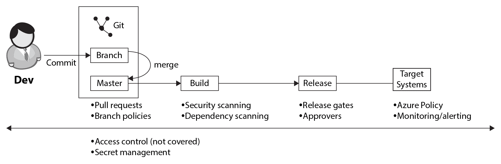

让我们快速回顾一下每个阶段的安全问题：

+   **主分支合并**：在这个阶段，通过拉取请求应用了四眼原则。拉取请求允许另一位工程师在代码合并到主分支之前进行审查。分支策略用于强制使用拉取请求，以确保代码能够编译且单元测试能够通过。这在第二章《一切从源代码管理开始》和第三章《迁移到持续集成》中有讨论，*一切从源代码管理开始*，以及*迁移到持续集成*。

+   **构建**：在这个阶段，通过向构建流水线中添加额外的任务，执行对所有源代码和第三方依赖项的安全扫描。这可以防止安全风险在未受控的情况下扩散。本章的*与秘密相关的工作*部分将讨论如何进行此操作。

+   **发布**：在发布过程中，可以配置审批者。审批者是必须在部署到特定阶段之前给出批准的用户。此外，还使用自动化发布门控，确保（并进一步强制）在发布继续之前满足某些标准。我们将在 第四章，*持续部署* 中讨论如何做到这一点。

+   **部署环境**（**目标系统**）：所有应用程序都将在目标环境中运行。它可以是本地的；然而，在本书中，我们的重点是 Azure。对于运行时的安全性和合规性问题，本章将介绍 Azure Policy 和 Azure Security Center。

+   **交叉切割**：所有前述的要点只有在 Azure DevOps 环境中有足够的访问控制时才有用。虽然这不在本书的范围内，但它是一个重要的角度需要涵盖。用户应该拥有足够的权限来完成他们的工作，但不应能够对策略、构建和部署过程进行未经授权的更改。此外，适当的秘密管理对于确保在交付过程的各个阶段，诸如证书、密钥和密码等机密信息的安全是必要的。本章还将涵盖我们如何做到这一点。

现在，在理解了软件和安全工程师如何合作开发应用程序之后，接下来是处理这项工作不同方面的内容。本节将讨论如何处理机密。

# 处理机密

一个重要的安全元素是机密的处理。在部署应用程序时，始终涉及到机密。尤其是在将应用程序部署到云端，即通过互联网部署时，以安全的方式处理这些访问密钥非常重要。除了部署所需的机密外，还有一些机密需要插入到应用程序的运行时配置中。一个常见的例子是访问数据库的机密。

在 第六章，*基础设施和配置即代码* 中，讨论了多种交付应用程序配置的机制，包括 **Azure 资源管理器** (**ARM**) 模板。然而，模板需要输入外部机密，因为它们不能存储在源代码控制的参数文件中。

机密不应存储在源代码控制中。

如果机密不能存储在源代码控制中，那么应该将它们存储在哪里呢？常见的选择包括将机密存储在服务连接中或在变量组中存储。

# 将机密存储在服务连接中

部署任何应用程序所需的第一组机密是那些用于连接目标系统的机密。没有任何个人应访问这些机密，因为它们只在部署过程中使用。这就是为什么 Azure Pipelines 允许你将它们安全地存储在服务连接中的原因。

服务连接是一个抽象，表示可以从 Azure DevOps 连接的另一个系统。服务连接有一个特定的类型，即指定它们可以连接的系统系列。例如，有用于连接到 Azure、GitHub、Jira、NPM、NuGet 及其他十多个系统的服务连接类型。也可以通过 Azure DevOps 扩展机制添加新的服务连接类型。

服务连接可以包含对另一个系统位置的引用——通常是一个 URL。在位置旁边，它们可以包含授权令牌、用户名和/或密码，具体取决于服务连接的类型。存储在服务连接中的秘密不能再被取回，甚至管理员也不能访问。此外，每当服务连接的任何详细信息发生更改时，必须重新输入秘密。这是为了防止之前输入的秘密被滥用来访问另一个位置。这些细节表明，服务连接设计用于为存储连接凭据提供安全位置。

服务连接可以在每个 Azure DevOps 项目的中央位置进行管理。您可以创建新的连接，编辑现有的连接，修改用户权限等。通过以下步骤进行操作：

1.  要打开此视图，请导航到“项目设置”。一个垂直的设置选项列表将会打开。

1.  从列表中点击“服务连接”。您将能够查看各种连接，如下图所示：

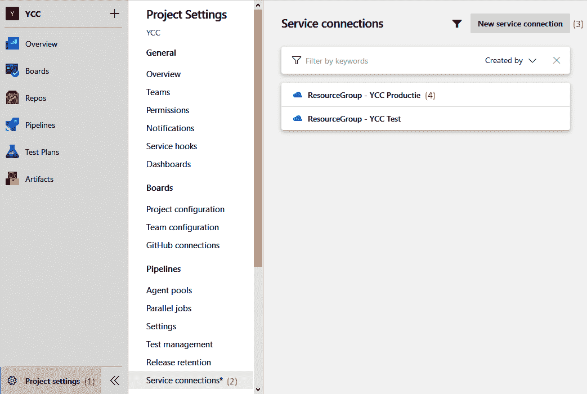

1.  现在，如果您希望创建新的服务连接，请点击屏幕右上方的“新建服务连接”按钮。

1.  要修改现有条目，只需点击它。这将带您到一个与以下截图类似的屏幕：

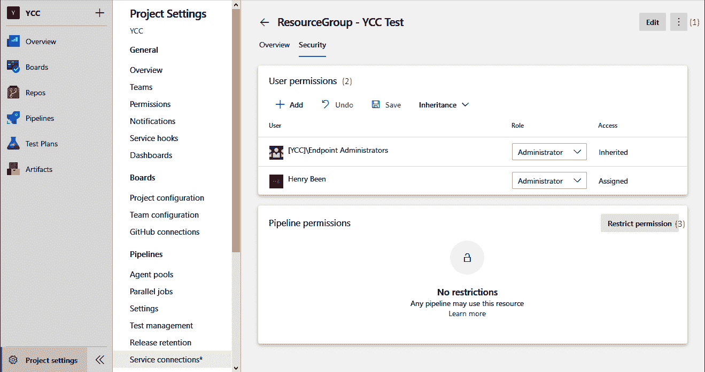

从此视图，您现在可以执行以下操作：

1.  编辑服务连接详细信息。

1.  修改用户权限。

1.  限制权限。

1.  添加更多用户或组，并指定每个用户是否可以使用或管理该端点。

1.  指定哪些管道可以使用此服务连接。

在当前视图中，项目中的每个管道都可以使用该服务连接。这不推荐使用，并且可以通过“限制权限”按钮（*3*）来加固。在加固管道后，每个希望使用该服务连接的管道必须首先由服务连接管理员授权。

# 将秘密存储在变量组中

应用程序开发中涉及的秘密比连接其他系统所需的要多。举例来说，包括在应用程序编译期间需要的许可证密钥，或者在部署后需要传递给应用程序的数据库用户名和密码，或者作为 ARM 模板部署的一部分。

这些密钥可以存储在管道变量或变量组中，我们在第三章的*在 Azure DevOps 中创建构建定义*部分中已涵盖。微软将安全地存储所有标记为密钥的变量，并使其通过用户界面不可检索。

然而，可能有一些原因不希望将密钥存储在 Azure DevOps 中，而是希望将其存储在专用的密钥存储库中，如 Azure 密钥保管库。这样做将提供密钥保管库附带的额外保障，并且能够通过**Azure** **基于角色的访问控制** (**Azure ****RBAC**) 和密钥保管库访问策略进一步控制访问权限。

将密钥存储在 Azure 密钥保管库中时，它们仍然可以作为变量组使用，通过通过服务连接将空变量组连接到密钥保管库，如下图所示：

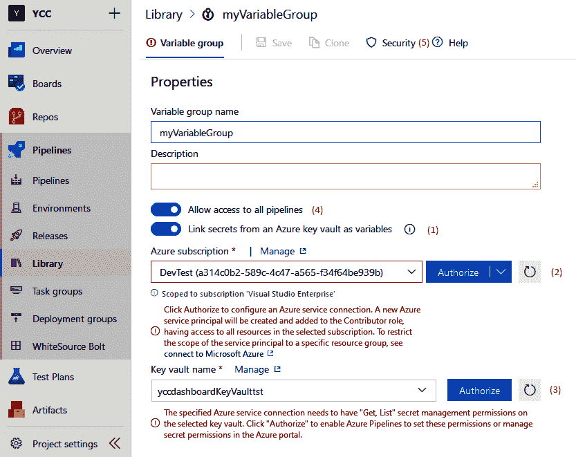

要将密钥保管库用作变量组的存储，请执行以下操作：

1.  启用第二个滑动开关，以从密钥保管库加载密钥。

1.  从下拉菜单中选择一个已存在的 ARM 服务连接，或通过从列表中选择 Azure 订阅，动态创建一个新的带有托管身份的 Azure 服务连接。

1.  输入应加载密钥的密钥保管库名称。你也可以从下拉菜单中选择一个。在这种情况下，只有所选服务连接可访问的密钥保管库才会显示。

1.  建议禁用允许访问所有管道的滑动开关。通常，开放授权被认为是一个风险，尤其是包含密钥的变量组应仅对明确授权的用户可用。

1.  可以通过“安全”标签页为特定用户配置访问权限。

还可以自动创建服务连接到 Azure 和密钥保管库所需的正确授权。请注意，这两个操作都会更改 Azure 安全设置，因此请确保这些设置（仍然）正确。

# 检测不安全的密钥

如前所述，不应将密钥存储在源代码控制中，这就是为什么之前讨论的功能可用的原因。然而，开发人员可能会因意外或进行本地测试而将密钥写入应用程序源代码中。

为了确保这些秘密不会被提交到源代码管理中，可以使用本地插件来检测秘密并发出警告，提醒开发人员这个风险。一个可以为 Visual Studio 实现这一功能的工具是**Visual Studio 的持续交付工具**扩展。此扩展会扫描任何打开的文件中的秘密，并在检测到可能的秘密时发出编译器警告。有关此扩展的链接已添加到本章末尾的参考资料中。安装程序运行后，任何在 Visual Studio 中检测到的秘密都会导致编译器警告。遗憾的是，在编写本文时，该扩展尚不支持 Visual Studio 2019。

除此之外，建议将类似的工具作为交付流水线的一部分运行，以识别任何被意外提交的秘密。尽管这时候保护秘密已经太晚，但它确实提供了一个明确的信号，表明秘密已经泄露，需要更换。一个可以做到这一点的工具是**CredScan**。CredScan 是 **Microsoft Security Code Analysis Extension** 构建任务的一部分。

Microsoft 安全代码分析扩展不仅仅包含 CredScan。它还包括 Microsoft 提供的其他安全工具。

该扩展的详细信息链接可在本章末尾找到；其中还包括所有安装细节。请注意，该扩展仅在特定条件下可用，并且并非免费。

扩展安装完成后，可以将 CredScan 添加到你的流水线中，如下所示：

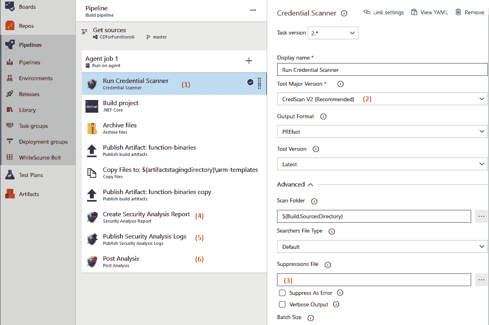

在参考截图中的注解时，执行这些步骤：

1.  将*运行凭证扫描器*任务添加到流水线中。

1.  将工具的主版本更新为 V2。对于所有其他选项，默认设置对于首次扫描已经足够。

1.  如果之前的扫描导致一个或多个误报，可以通过指向抑制文件将其从结果中移除。

1.  将创建安全分析报告的任务添加到流水线中。

1.  将发布安全分析日志的任务添加到流水线中。

1.  将后分析任务添加到流水线中。

1.  保存并排队构建定义。

虽然某些任务会在检测到错误时失败并取消构建，但 CredScan 任务则不会。即使检测到密码，它也总是会成功完成。只有在构建结束时的*后分析*任务会对发现的问题进行处理，并在发现问题时使构建失败。这样做的好处是，所有问题都会被识别，而不仅仅是第一个问题。这也允许任何其他任务在完成后继续执行。

安全分析报告任务（*第 4 步*）用于收集属于工具套件的一些扫描工具的日志，并将输出汇总成 CSV 和 HTML 文件。发布任务（*第 5 步*）将所有生成的文件作为构建产物发布。如果检测到可能的密码，以下 HTML 将被生成并作为构建产物发布：

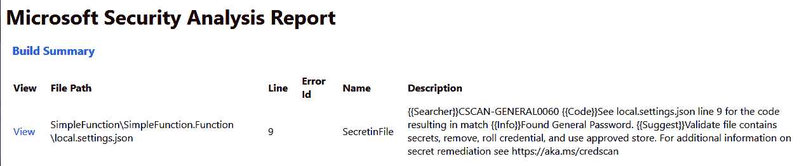

本节内容到此结束，介绍了如何在 DevOps 流水线中保持秘密的安全。下一节将讨论应用程序漏洞的检测。

# 检测应用程序代码漏洞

在 DevOps 文化转型之前，通常定期进行的安全评估不能完全被忽视。这意味着，不能把它们省略，而是必须以其他方式进行。对此有两种方法。

第一种方法是继续定期进行渗透测试、安全评审和其他安全检查，就像以前一样。然而，代码不是等到通过测试后才进入生产环境，而是与安全评估分开直接部署到生产环境。这意味着存在一个接受的风险，即可能会有漏洞被部署到生产环境，直到下一次安全扫描时才会发现，并将在下一个版本中解决。采用这种方法，可以提高速度，但也需要接受一些漏洞可能会存在一段时间。

第二种方法是将应用程序安全扫描纳入提交代码到源代码仓库的常规工作流程中。例如，安全代码评审不需要每次增量更新时都做，也不需要每两个月做一次。它们也可以在每次拉取请求时进行——在代码合并之前。这样一来，你就不再是检测漏洞，而是在防止漏洞的产生。安全漏洞扫描也可以采用同样的方式，它们可以成为交付流水线的一部分，或者成为一个完整的夜间 QA 构建，每天早上报告开发质量。

当然，这种方式往往不是非黑即白，许多公司会采用这些方法的组合。他们使用自动化反馈机制来检测能发现的漏洞，将安全代码评审纳入拉取请求工作流，然后结合定期的人工渗透测试。通过这种方式，交付速度得以提高，同时安全风险并没有增加，甚至因为能够快速缓解漏洞而有所减少。

# OWASP 前十

在谈到网页应用的安全性时，有几种类型的安全问题是常见的，并且负责大多数所有安全问题。这些问题类型被称为 OWASP Top 10。这是由**开放网页应用安全平台**（**OWASP**）发布的十大常见安全问题列表。该列表每隔几年会进行审查，但在过去几年里保持了相当的稳定性。

OWASP Top 10 中的大多数错误可以通过实施自动化安全测试来预防；无论是通过使用静态代码分析来发现安全漏洞，还是通过使用**OWASP Zed Attack Proxy**（**OWASP** **ZAP**）进行动态测试。

# 实施自动化漏洞扫描

在前一章节中，我们讨论了持续测试，并已经介绍了 SonarCloud 作为技术债务和代码质量的代码扫描器。除了评估应用代码的质量外，SonarCloud 还可以用来扫描安全漏洞。在第八章《持续测试》中，你已经学会了如何将 SonarCloud 扫描添加到你的流水线中。除此之外，还有其他更专业的工具可用，我们将在本章的最后一节讨论这些工具。

这些工具基于静态测试评估应用程序。它们扫描代码以识别任何有风险的代码。这被称为白盒方法，因为它们可以查看、检查和扫描所有代码。换句话说，所有内容都是可见的。这与黑盒方法相反，在黑盒方法中，运行中的应用程序被视为一个封闭的整体，只通过调用它并观察响应来进行测试。一个可以实现这一点的工具是 OWASP ZAP。

# **OWASP Zed Attack Proxy**

**OWASP ZAP**是一个可以执行应用自动化渗透测试的工具。该工具可以以两种模式运行：

+   **基线扫描**：基线扫描只需几分钟，并且在这几分钟内优化为尽可能多地扫描安全风险。这使得基线扫描足够快速，可以在部署流水线的早期运行。甚至可以在每次部署到第一个测试环境后运行安全扫描，从而为开发人员提供快速反馈。

+   **完整主动扫描**：完整主动扫描需要更多时间。在这种类型的扫描中，代理将检查应用的每个响应，以识别属于该应用的其他 URL，并对其进行扫描。通过这种方式，完整的应用程序会在运行时被发现，采用蜘蛛爬行的方法。这种扫描方式更加全面，但也需要更多的时间。因此，完整扫描通常是定期运行的，例如每晚一次。

**OWASP ZAP**代理尝试识别任何可能的安全风险。一些最显著的风险包括 SQL 注入、JavaScript 反射和路径遍历。

OWASP ZAP 是一个可以安装在任何虚拟机上的应用程序。它的缺点是虚拟机始终在运行，即使没有正在进行的扫描。这会增加成本，当然，虚拟机本身也需要进行补丁更新和安全防护。最近，代理的容器化版本也已推出。这个容器可以在 Azure 容器实例中运行，仅在需要时启动代理，并在执行完毕后立即关闭。

这完成了我们对代码扫描工具及其实施的介绍。借助这些工具，您可以检测应用程序中的漏洞并防止安全问题。接下来的部分将探讨如何扫描应用程序的依赖项。

# 使用依赖项

除了应用程序代码开发中的安全风险外，还有与重用组件相关的风险。现代应用程序代码中，50% 到 80% 不是在内部开发的，而是通过包或依赖项从其他方获得的。其中一些可能是开源的，但并不一定是。也有一些组件是从其他开发公司购买的，或者是从如 NuGet 这样的库中获取的二进制文件。

依赖不仅会带来安全风险，还可能带来许可风险。如果一个团队开始使用一个根据 GPL 许可证发布的组件来构建闭源组件会怎样？如果有人发现了，团队可能被迫将其产品开源，或者至少因为未按照许可证使用他人的作品而遭遇公众羞耻。

为了减轻这些风险，可以使用多种工具来检测和扫描在构建应用程序时使用的所有依赖项。WhiteSource Bolt 是其中一个可用的工具，它作为扩展从 Azure DevOps 市场提供。

# 使用 WhiteSource Bolt

要开始使用 WhiteSource Bolt 执行扫描，请执行以下操作：

1.  从 Azure DevOps 市场安装 WhiteSource Bolt 扩展。

1.  在管道下导航至 WhiteSource Bolt 菜单。

1.  注册并接受许可条款。

1.  将 WhiteSource Bolt 扫描任务添加到构建或发布定义中，如下图所示：

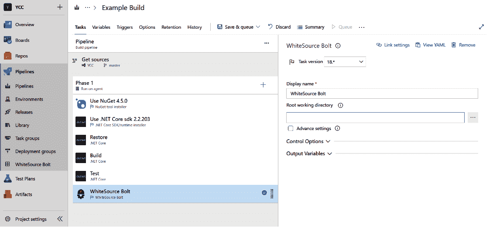

1.  一旦安装了 WhiteSource Bolt 任务的管道运行完毕，包含构建结果的页面将会显示一个额外的标签，名为 WhiteSource Bolt Build Report，其中展示了扫描结果，如下图所示：

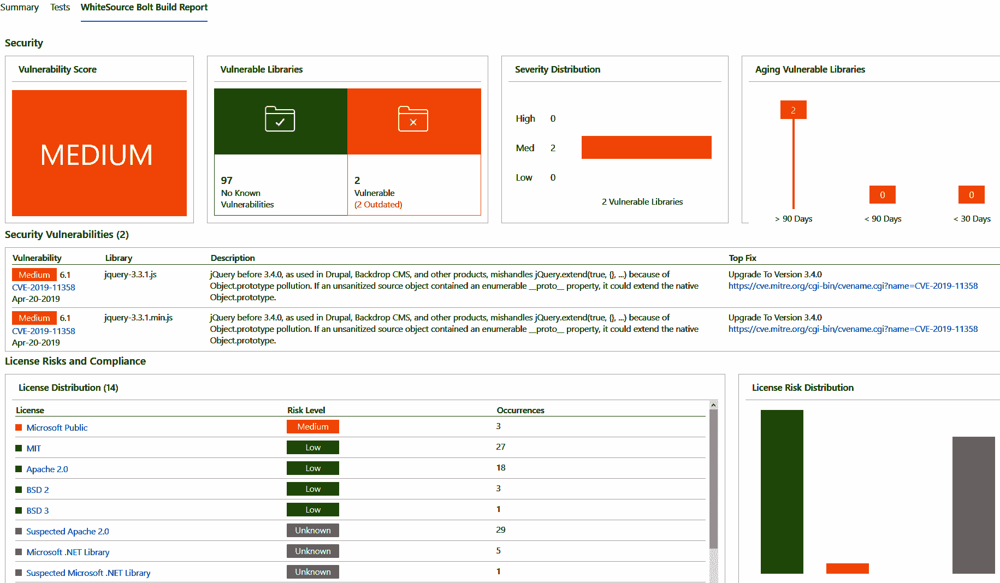

该报告提供了关于扫描的应用程序构建的整体安全性和许可风险的若干见解：

+   顶行的四个小部件提供了漏洞评分的概览，并且有三种不同的细分方式，展示了该评分是如何计算的。

+   在此下方，所有脆弱的包按名称列出，提供依赖项的参考和推荐的缓解措施。

+   底部的部分提供了所有依赖项使用的许可证列表。该列表按风险高低排序。

+   在此概述下方，WhiteSource Bolt 还生成了一个依赖项列表，列出了可用新版本的依赖项（在前面的截图中未显示）。

该报告中显示的结果也可以通过 WhiteSource Bolt 菜单中的 Pipelines 菜单访问。在此视图中，可以访问所有构建的所有报告。此视图非常适合负责跨项目或组织访问安全性或许可标准的人。

这完成了我们对依赖扫描的讨论。如前所述，您可以利用这些工具来检测和扫描构建应用程序时使用的所有依赖项。在下一节中，将介绍基础设施合规性。

# 确保基础设施合规性

另一个重要的话题是合规性。在许多国家或市场中，在创建软件时，必须实施或遵守一套规则和政策。相当一部分这些政策与应用程序运行的基础设施相关。如果该基础设施部署和管理在 Azure 平台上，Azure Policy 可以成为确保基础设施符合规定的强大工具。

在第六章《基础设施与配置即代码》中，讨论了 ARM 模板的话题。ARM 模板可以看作是一种技术，用于将完整的 Azure 环境描述为一个包含许多对象的 JSON 数组，每个对象描述应用程序基础设施中的一个资源。

Azure Policy 允许您编写查询此文档以及通过任何 API 或 ARM 模板所做更改的策略。每当找到与查询匹配的资源时，它将被阻止创建，或者该匹配项可以添加到审计结果列表中。

除了编写自定义策略外，还有许多现成的策略可供所有 Azure 用户使用。这些策略可用于审计不符合最佳实践或一般建议的资源。还提供了名为“倡议”的策略组，描述了市场标准的适用部分。

# 分配 Azure 策略或倡议

策略可以在 Azure 的不同级别上进行分配，既可以在资源组级别、订阅级别或管理组级别。这可以通过门户、ARM 模板或蓝图，或 PowerShell 来完成。

使用 PowerShell 时，可以使用以下一系列命令：

1.  要检索资源组和策略的参考，请使用以下命令：

```
$rg = Get-AzResourceGroup -Name myResourceGroupName
$definition = Get-AzPolicyDefinition | Where-Object { $_.Properties.DisplayName -eq 'Audit VMs that do not use managed disks' }
```

此处选择的策略是一个内置策略，将审计所有未使用托管磁盘但在存储帐户中有自定义磁盘的虚拟机。此策略定义将在以下任务中的命令中使用。

1.  要将策略分配到资源组，请使用以下命令：

```
New-AzPolicyAssignment -Name 'audit-vm-manageddisks' -DisplayName 'Audit VMs without managed disks Assignment' -Scope $rg.ResourceId -PolicyDefinition $definition
```

在此任务的 30 分钟内，新策略将变为活跃状态。此时，策略评估周期开始，所有在任务范围内的资源将与策略进行评估。编写时，尚未发布有关此类评估周期所需时间的服务级别协议（SLA）。根据经验，这一过程可能需要 15 分钟到多个小时不等——具体取决于任务范围的大小。

# 编写 Azure 策略

虽然有许多内置的策略可用，但也有许多使用场景需要创建自定义策略。与其他 Azure 资源类似，策略也是以 JSON 文档的形式编写的。适当的 ARM 资源类型是 `policyDefinitions`，其结构如下：

```
{
   "name": "string",
   "type": "Microsoft.Authorization/policyDefinitions",
   "apiVersion": "2019-01-01",
    "properties": {
      "parameters": {
        “location”: { …}
      },
        "displayName": "…",
        "description": "…",
        "policyRule": {
            "if": {
              “field”: “location”,
              “equals”: “[parameters(‘location’)]”,
            },
            "then": {
                "effect": "<audit|deny >"
            }
        }
    }
}
```

`parameters` 对象可用于指定在稍后分配策略时需要指定的一个或多个参数。这些参数遵循与 ARM 模板参数相同的语法，并且工作方式相同。

`displayName` 和 `description` 属性可用于为策略定义提供有意义的名称和描述，供以后参考。

定义的主体包含两个元素，如下所示：

+   **`if`** 语句用于指定一个查询，以选择此策略应应用的 Azure 资源。写复杂查询的 JSON 语法有明确规定，详细信息可见本章末尾链接的 ARM 模板参考资料。

+   **`then`** 语句用于描述针对符合条件的资源所需执行的操作。这可以是 *拒绝*，即自动拒绝创建任何不符合要求的资源。另一种方法是，不直接拒绝不合规的部署，而是对其进行审计。虽然从理论上讲，拒绝不合规的部署非常简单，但在某些情况下，暂时允许不合规的部署是有合理原因的。在这种情况下，审计策略可以帮助跟踪这些资源。所有不合规的部署将在 Azure 活动日志中生成审计记录，并可以在 Azure 门户中的“合规性”标签下的 Azure 策略中查看，具体如下：

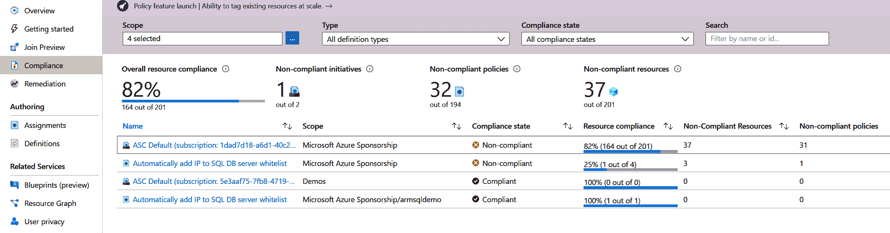

在编写完政策定义后，我们需要在 Azure 订阅中创建它，以便使其可用。可以通过 ARM 模板或在门户中手动创建。 从 DevOps 的角度来看，建议通过源代码管理编写政策，并通过管道将其作为 ARM 模板的一部分进行交付。 这样，Azure 政策的编写与应用程序相同，可以进行审查，并作为 DevOps 管道的一部分自动部署到 Azure。

# 计划

在使用 Azure Policy 时，许多公司发现他们需要创建许多政策，以定义他们希望软件开发人员遵循的所有规则。因此，将政策分组可能是有益的。这种分组称为“计划”，这些计划也在 JSON 中定义：

```
{
  "name": "string",
  "type": "Microsoft.Authorization/policySetDefinitions",
  "apiVersion": "2019-01-01",
  "properties": {
    "displayName": "string",
    "description": "string",
    "parameters": { … },
    "policyDefinitions": [
      {
        "policyDefinitionId": "string",
        "parameters": {}
      }
    ]
  }
}
```

一个计划的主体是一个对象数组。每个对象必须包含一个 `policyDefinitionId` 属性，并可以选择包含一个带有 `parameters` 的对象。 `policyDefinitionId` 属性必须通过 Azure 资源 ID 引用有效的 `policyDefinitions`。 `parameters` 数组应指定该政策所需的所有参数。通常，这可以通过让计划指定所有政策的参数集合作为计划参数来实现。然后，个别政策的参数通过引用计划参数来指定。

# 获取审核结果

在分配了审核效果的政策后，一旦其生效，政策将自动评估分配范围内的所有资源。无法保证此过程需要多长时间。对于新资源，政策评估结果通常会在 15 分钟内显示，但通常这个过程会更快。

一旦结果出来，可以在门户中查看每个政策或计划的合规性状态，最终呈现出如下概览，见下图：

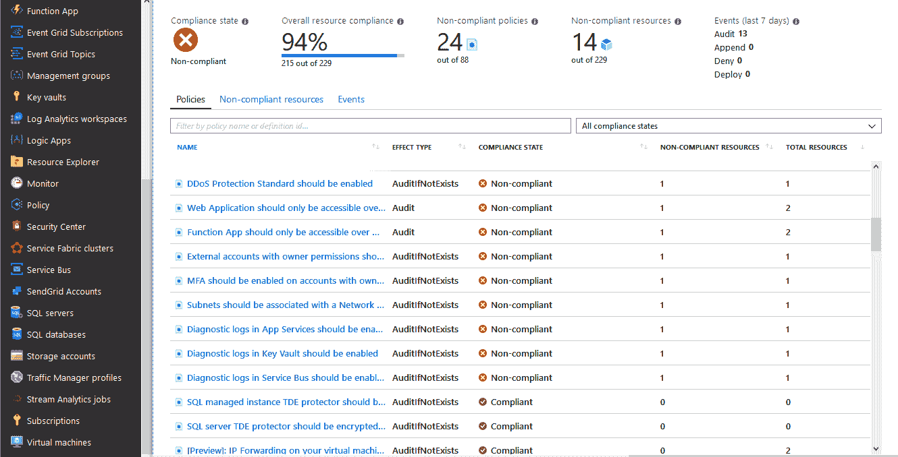

该报告与其他手动审核报告的区别在于，此概览会持续更新，以反映实际的、当前的合规性状态——它不是某一特定时点的合规性快照。

这种合规性类型的一个重要好处是，规则或政策会持续应用于所有现有资源和任何新进的变更。这意味着可以确保应用环境始终符合要求，并始终遵守所有适用的规则和政策。

与通常每隔几个月进行一次安全和合规性审核的方法相比，这种方式有很大不同。通常，这会导致环境只有在审核前才符合合规要求，且合规性在审核后逐渐下降。直到下次审核时，合规性才会再次接近 100%。在许多公司中，这导致了如下的合规性图表：

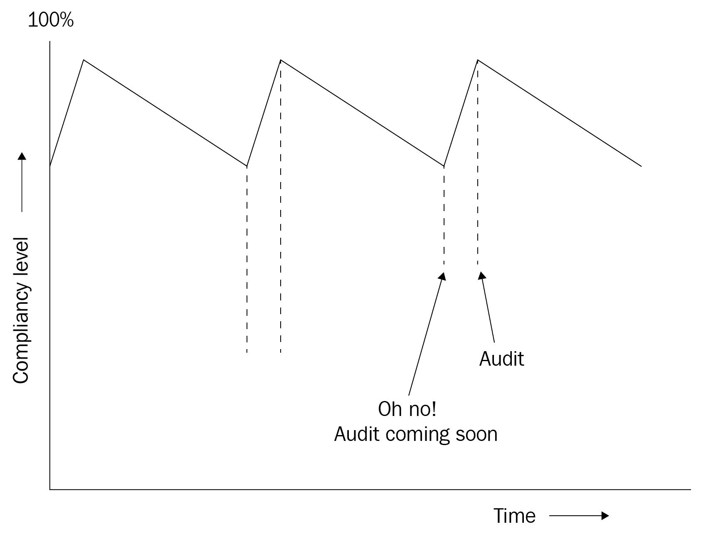

通过这一点，我们讨论了 DevOps 实践如何帮助提高安全性和合规性——通过确保基础设施合规性。接下来的章节将讨论本章提到的工具的几种替代方案。

# 监控和检测运行时安全风险与威胁

迄今为止讨论的所有安全工具都集中在防止将存在漏洞的代码推送到生产环境。然而，完整的已部署软件解决方案，包括所有支持的基础设施，远不止是代码。除此之外，解决方案中可能有许多意外或未计划的交互。在生产环境中持续监控这些内容是必要的，不仅是为了防止安全问题，还要检测任何潜在的安全问题。在 Azure 中，Azure 安全中心就是一个可以实现这一目标的工具。Azure 安全中心通过 Azure 门户提供，可以像其他服务一样从左侧菜单选择或通过顶部搜索栏搜索。

打开安全中心后，会显示类似于以下截图的内容：

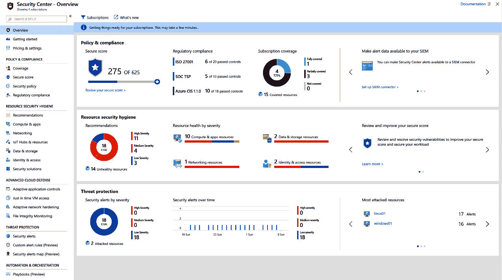

此仪表板提供了三大类的洞察：

+   策略和合规性：此部分概述了所有选定的 Azure 订阅在你配置的安全策略下的合规性状况。

+   资源安全卫生：Azure 提供了许多安全控制，可以开启或关闭，并且有许多安全配置设置。就像其他地方一样，用户需要平衡成本、安全性、风险和易用性。此仪表板将显示有关提升资源安全性的一些建议。用户可以根据每个建议决定是否采纳。

+   威胁防护：此部分显示已自动检测和报告的威胁或攻击数量：

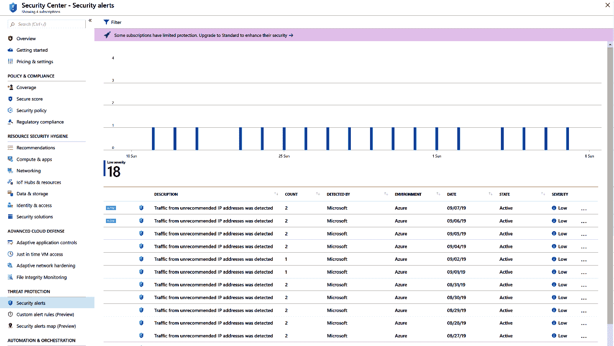

所有这些概述和类别都可以进一步钻研。上面的例子显示了打开威胁防护概览的结果。在这里，它列出了它所识别的所有可能的安全威胁。在此案例中，它列出了对在订阅中托管的虚拟机的不同访问尝试。

Azure 安全中心还拥有许多其他功能，并且这些功能正在持续增加。在 Azure 部署时，这是识别和管理安全风险的地方。

这就是我们讨论如何监控运行时环境安全风险的各类技术的结束。接下来的章节将介绍一些替代工具，用于执行之前章节中提到的扫描任务。

# 你可以使用的其他工具

市场上有许多工具可以用于执行应用程序代码和依赖关系的安全扫描。例如，WhiteSource、Black Duck、Veracode 和 Checkmarx。

**WhiteSource** 是 WhiteSource Bolt 的付费版本。它提供相同的服务以及更多功能。例如，它不仅在依赖关系扫描时报告风险；它还会在新的风险出现时提醒你，特别是对于在应用程序上次扫描中存在的依赖关系。

**Black Duck** 是一款帮助团队管理使用开源软件所带来的风险的产品。它提供的服务与 WhiteSource 类似。

**Veracode** 和 **Checkmarx** 是用于识别漏洞代码的代码扫描工具。与 SonarQube 同时检查代码质量和安全风险不同，这两个产品专注于安全风险。总体来说，它们在安全扫描方面表现更好，缺点是价格更高。

# 总结

在本章中，你已经学到，DevOps 和安全并不是两个对立的目标，DevOps 实践可以帮助你强化安全性。首先，你学习了在处理持续部署管道时如何处理密码和其他机密。接下来，你学会了如何通过代码和依赖关系扫描工具增强你的管道，并将安全的 shift-left 原则应用其中。最后，你学会了如何使用 Azure Policy 来定义基础设施的约束和规则，以及如何自动应用这些规则或审计不合规的部署，甚至自动拒绝。

通过你所学到的知识，你现在能够与公司内的同事讨论如何解决 DevOps 团队中的安全问题。你可以与安全工程师合作，配置你所使用的工具，并获得关于你工作中安全影响的自动反馈。

在下一章中，你将学习应用程序监控。此外，你还将学习如何监控应用程序是否平稳运行，以及如何收集运行时指标。

# 问题

下面是一些问题，供你测试自己对本章内容的理解。你可以在*附录*中的*评估*部分找到答案：

1.  判断题：确保软件交付的安全性只是部署管道中的一个步骤。对或错？

1.  哪种工具可以用于安全测试，其中代理用于识别有效的应用程序 URL，然后对应用程序进行不同的攻击，如注入？

1.  判断题：在大多数现代应用程序中，超过 50% 的代码来自开源库。对或错？

1.  在部署或运行应用程序时，需要哪些安全位置来存储机密？（你可以选择多个答案。）

    1.  标记为机密的 Azure Pipelines 变量

    1.  Azure 密钥库

    1.  Azure DevOps 密钥库

    1.  Azure 变量组

    1.  Azure DevOps 安全变量

    1.  Azure DevOps 服务连接

1.  哪两个 Azure 产品可以用于在运行时检测安全风险？

# 进一步阅读

+   OWASP Top 10 和每种风险类型的详细信息可以在[`www.owasp.org/index.php/Top_10-2017_Top_10`](https://www.owasp.org/index.php/Top_10-2017_Top_10)找到。

+   WhiteSource Bolt 可以在 Azure DevOps 市场的[`marketplace.visualstudio.com/items?itemName=whitesource.ws-bolt`](https://marketplace.visualstudio.com/items?itemName=whitesource.ws-bolt)找到。

+   使用 OWASP ZAP 的详细操作步骤可以在[`devblogs.microsoft.com/premier-developer/azure-devops-pipelines-leveraging-owasp-zap-in-the-release-pipeline/`](https://devblogs.microsoft.com/premier-developer/azure-devops-pipelines-leveraging-owasp-zap-in-the-release-pipeline/)找到。

+   更多关于 Azure Policy 资源类型和 JSON 规范的信息可以在 ARM 参考文档中找到，网址为[`docs.microsoft.com/en-us/azure/templates/microsoft.authorization/allversions`](https://docs.microsoft.com/en-us/azure/templates/microsoft.authorization/allversions)。

+   更多关于 Visual Studio 的持续交付工具的信息可以在[`marketplace.visualstudio.com/items?itemName=VSIDEDevOpsMSFT.ContinuousDeliveryToolsforVisualStudio`](https://marketplace.visualstudio.com/items?itemName=VSIDEDevOpsMSFT.ContinuousDeliveryToolsforVisualStudio)找到。

+   更多关于 Microsoft Security Code Analysis 扩展的信息可以在[`secdevtools.azurewebsites.net/helpcredscan.html`](https://secdevtools.azurewebsites.net/helpcredscan.html)找到。

+   更多关于 WhiteSource Bolt 和 WhiteSource 的信息可以在[`bolt.whitesourcesoftware.com/`](https://bolt.whitesourcesoftware.com/)和[`www.whitesourcesoftware.com/`](https://www.whitesourcesoftware.com/)找到。

+   更多关于 Black Duck 的信息可以在[`www.blackducksoftware.com/`](https://www.blackducksoftware.com/)找到。

+   更多关于 Veracode 的信息可以在[`www.veracode.com/`](https://www.veracode.com/)找到。

+   更多关于 Checkmarx 的信息可以在[`info.checkmarx.com`](https://info.checkmarx.com)找到。
