# 第十章：应用程序监控

在前几章中，你学习了如何将 DevOps 原则应用到软件交付中。你学习了如何创建从源代码管理到生产的流水线。你还学会了如何确保你的交付符合合规要求和安全标准，同时不牺牲速度或忽视业务价值的交付。在本章中，你将学习如何将这个流水线转变为一个 DevOps 循环，持续交付新软件，并衡量应用程序的表现。这是一个持续的过程，在生产环境中评估应用程序的表现，并学习如何决定下一步的方向。

为了实现这一目标，本章首先介绍了一种收集应用程序崩溃报告的方法。几乎每个应用程序在某个时候都会抛出未处理的异常并崩溃。确保收集和报告应用程序崩溃，可以帮助你调查崩溃的原因并解决它们。接下来，重点转向应用程序的仪器化。仪器化是收集日志和指标的实践，它们可以帮助你了解应用程序在生产环境中的表现。你可以利用这些数据在问题发生时发出警报，或者希望能够在问题发生之前提前发现。最后，本章还探讨了与其他工具集成的几种选择。

本章涵盖以下主题：

+   调查应用程序崩溃

+   Web 应用程序仪器化

+   与其他工具集成

# 技术要求

要尝试本章中描述的技术，你将需要以下之一或更多：

+   用于收集移动应用程序崩溃的 App Center 账户

+   用于收集桌面应用程序崩溃的 Raygun 订阅

+   用于对 Web 应用程序进行仪器化的 Azure 订阅

所有这些都提供免费试用选项。

# 调查应用程序崩溃

无论应用程序设计得多么完美，最终都会因某些意外情况而崩溃。为了从这些崩溃中学习并尽量防止未来发生类似问题，可以向应用程序添加代码来收集崩溃报告，并将其发送到一个中央位置。在这里，这些报告可以被分析并归类，以识别应用程序的改进方向。具体如何操作取决于应用程序的类型。

以下部分将讨论移动应用程序和桌面应用程序的崩溃报告收集过程。关于 Web 应用程序，崩溃报告的收集可以使用与仪器化相同的工具；我们将在后面的*Web 应用程序仪器化*部分讨论这个内容。

# 收集移动应用程序崩溃报告

许多用于收集移动应用程序崩溃报告和错误的工具之一是 Visual Studio App Center。除了分发移动应用程序外，App Center 还允许应用程序提交崩溃和错误进行分析。

要开始使用 App Center 进行崩溃报告，首先需要定义应用程序。这被称为应用程序定义，如何操作它在第四章《持续部署》中进行了讨论。通过这个应用程序定义，可以创建一个应用程序密钥，这对于配置应用程序以发送崩溃报告是必需的。要开始发送崩溃报告，需要执行以下步骤：

1.  在项目中安装 `Microsoft.AppCenter.Crashes` NuGet 包。

1.  将以下代码添加到应用程序初始化中：

```
AppCenter.Start("ios={appSecret};android={appSecret };uwp={appSecret}", typeof(Crashes));
```

除了崩溃外，还可以跟踪开发者感兴趣的其他错误。可以使用以下代码来完成此操作：

```
Crashes.TrackError(ex);
```

现在，所有未处理的异常都会自动捕获并发送回 App Center。在这里，它们可以进行分析，如下图所示：

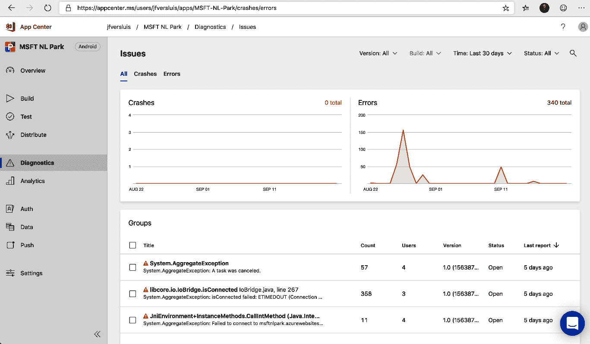

1.  点击任何已报告的错误或崩溃，查看详细信息，如下所示：

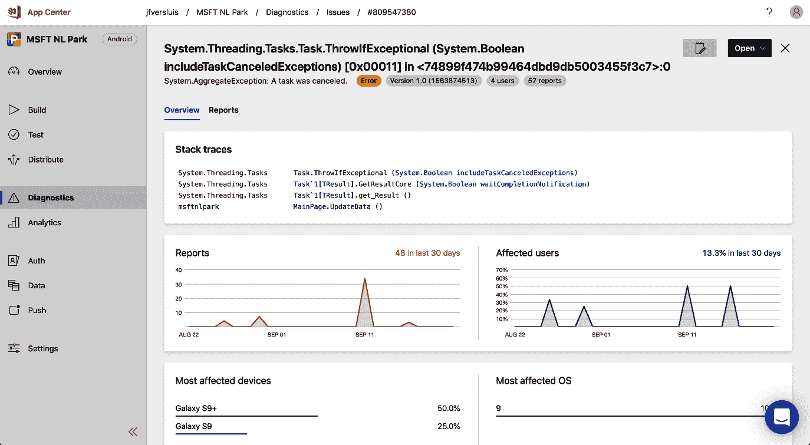

每个崩溃或错误都会显示一个包含最重要信息的仪表板。这包括报告的数量和受影响用户的数量。同时，还会显示受影响的设备类型和操作系统。在页面顶部，显示了堆栈跟踪，开发者可以使用这些信息来调查并且希望能够修复问题。

这部分内容涵盖了从移动应用程序收集崩溃报告和错误。接下来的部分介绍了桌面应用程序的相同概念。

# 收集桌面应用程序的崩溃报告

崩溃报告同样适用于桌面应用程序。同样，桌面应用程序有许多解决方案，而且它们大多数的工作原理差不多。这些解决方案之一是 Raygun。Raygun 是一个商业服务，适用于 .NET 应用程序，但也支持许多其他语言和平台。

要使用 Raygun 收集崩溃报告，请按照以下三步操作：

1.  注册 Raygun 账户。

1.  在解决方案中安装 `Mindscape.Raygun4Net` NuGet 包。

1.  捕获未处理的异常并将其转发到 Raygun。

以下示例展示了如何捕获并将未处理的异常转发到 Raygun：

```
 class Program
    {
        private static readonly RaygunClient _raygunClient = new RaygunClient("myKey");

        static void Main(string[] args)
        {
            AppDomain.CurrentDomain.UnhandledException += HandleEx;
            throw new Exception("Boom!");
        }

        private static void HandleEx(object sender, UnhandledExceptionEventArgs e)
        {
            _raygunClient.Send(e.ExceptionObject as Exception);
        }
    }
```

完成此操作后，可以在 Raygun 网络界面中查看所有异常。在这里，如果堆栈跟踪足够相似，异常会自动分组。也可以单独查看并浏览它们，但在大多数情况下，只关注更大的异常组是有意义的。

以下截图展示了如何在 Raygun 中浏览这些组：

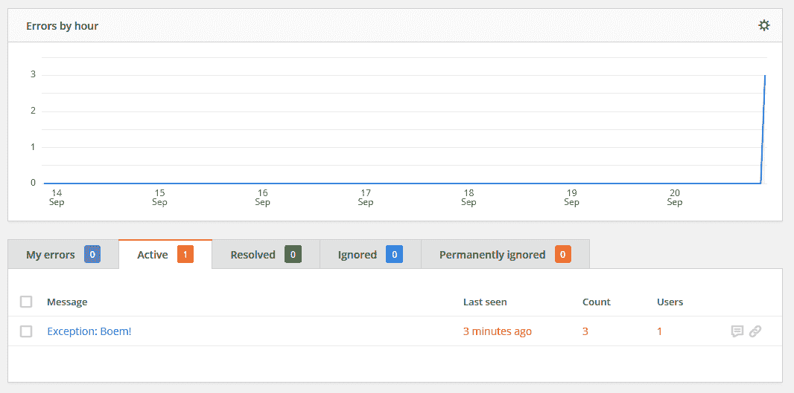

点击此界面中的异常消息，可以查看完整的堆栈跟踪以及该异常实例的所有共享属性。

这部分内容结束了我们对移动和桌面应用程序崩溃报告收集的讨论。通过这样的做法，你可以发现并调查客户在生产环境中遇到的问题。在接下来的部分，将介绍 web 应用程序的监控，以进一步增强我们对应用程序在生产环境中表现的理解。

# 网络应用的监控

网络应用程序在许多方面与移动应用和桌面应用程序不同——例如，大部分应用程序代码并不在客户端运行，而是在服务器上运行。这使得开发人员可以比其他类型的应用程序更容易地收集关于 web 应用程序运行方式的信息。这个过程称为“监控应用程序”。

日志是系统保存的文本消息，用于描述服务器执行路径。这有助于开发人员通过检查日志输出回溯并探索发生过的事情。结构化日志正迅速成为追踪日志的标准。结构化日志是一种技术，其中日志不再只是文本消息，而是带有每个参数一组值的参数化文本消息。这样有两个优势——日志可以更好地压缩，并且可以更快速地进行搜索。

指标是记录应用程序数据的值。它们包括时间戳、指标名称和数值。例如，每秒记录一次 CPU 使用百分比。

在监控应用程序时，很容易集中关注许多服务器级别的日志和指标。例如，许多操作员默认会开始收集诸如 CPU 使用率、内存压力和 I/O 操作等指标。虽然这些指标没有错，但它们并不总能反映从用户角度来看应用程序的性能。其他指标，如响应时间或队列消息处理延迟，可能会提供更好的用户体验洞察。虽然衡量系统指标是没有问题的（它们通常是未来问题的良好指示），但你也应该尝试收集以用户为中心的指标。

Azure 提供了 Application Insights 服务来监控应用程序，重点是 web 应用程序。可以通过 Azure 门户创建 Application Insights 工作区，这将打开如下截图所示的工作区。这里需要注意的一个重要内容是“Instrumentation Key”，它将在后续章节中使用。尽管该字段明确显示，但建议将其视为应用程序的密钥：

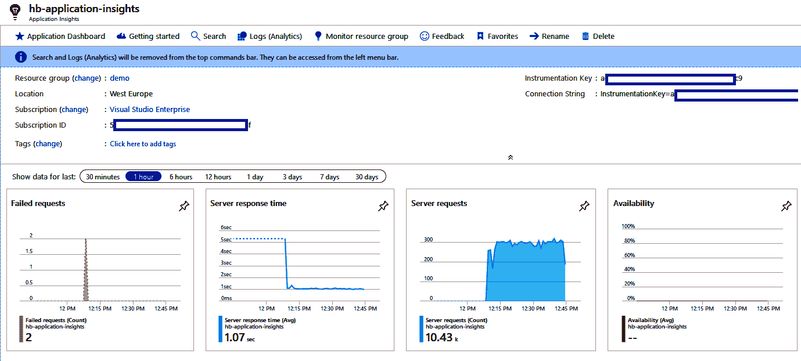

如果你想通过一个现成的应用程序来实验 Application Insights 和 Azure Monitor，本章末尾的 *进一步阅读* 部分提供了一个示例链接。该示例是一个简单的 URL 缩短应用，使用了多个应用组件，并且内置了日志记录和监控，可以用来在几分钟内开始实验本节介绍的概念。

以下小节将详细介绍日志记录、度量以及如何调查单个请求。

# 日志记录

最基本的仪器化类型之一是将日志语句添加到应用程序代码中。过去，这些日志被保存在运行应用程序的服务器的磁盘上。然后，检索和调查这些日志需要花费大量的时间和精力。

在现代托管环境中，日志不再保存在本地文件系统中，而是远程存储。随着临时基础设施和服务器的动态增减，无法再将日志保存在服务器上，并确保以后能够检索它们。因此，日志通过 HTTP 传输到专门的日志存储中，如 Application Insights。

# 发出日志

要将日志条目写入日志存储（例如 Application Insights）中，必须完成以下两项操作：

1.  日志条目需要在应用程序代码中发出，适用时，使用 `ILogger` 接口。此接口可通过 `Microsoft.Extensions.Logging.Abstractions` NuGet 包获得。

1.  需要安装 Application Insights NuGet 包（`Microsoft.ApplicationInsights.AspNetCore`），并且需要将 Application Insights 注册为 `LoggingProvider`。这样，所有发送到前述接口的日志将被转发到 Application Insights 代码中。反过来，这些代码会将所有日志转发到 Application Insights 服务。

以下示例代码展示了如何通过类中的 `ILogger` 接口生成结构化日志条目：

```
public class Example
{
    private readonly ILogger<Example> _logger;

    public Example(ILogger<Example> logger)
    {
        _logger = logger;
    }

    public void DoSomething(User user)
    {
      _logger.LogWarning(
        "Doing something for user with id '{userId}' and username '{username}'", 
        user.Id, 
        user.Username);
    }
}
```

日志条目开头不应有美元符号（`$`）。这里没有使用字符串插值，但文本消息中插入了两个占位符。结构化日志条目将识别这些占位符，并在显示日志条目时插入提供的值。

在生成日志条目后，应注册日志提供程序以捕获这些日志。可以通过 .NET Core 内置的依赖注入来完成此操作。

安装 Application Insights NuGet 包后，需要在 `CreateWebHostBuilder` 方法中添加以下代码：

```
public static IWebHostBuilder CreateWebHostBuilder(string[] args) 
{
  return WebHost.CreateDefaultBuilder(args)
    .UseStartup<Startup>()
    .ConfigureLogging(builder => {
        builder.AddApplicationInsights(“myKey”);
    }
}
```

当使用版本 2.7.0-beta3（或更高版本）的 Application Insights NuGet 包，并且使用 Application Insights 来获取度量数据时，前述配置不再需要。

启动应用程序后，所有警告级别及以上的日志条目会自动转发到 Application Insights。要更改转发哪些条目，哪些不转发，可以配置过滤器。本章最后将提供关于如何详细配置 Application Insights 的更多链接。

# 搜索日志

在将日志条目发送到 Application Insights 后的几分钟内，它将出现在界面上，供查询使用。为此，打开 Application Insights 实例并导航到左侧菜单中的日志（Analytics）（1）。这将打开如下所示的视图：

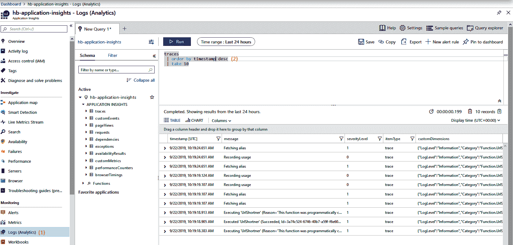

在这里，可以编写查询（2），用于搜索记录的日志，使用的是**Kusto 查询语言**（**KQL**）。Application Insights 已优化以处理大量数据，大多数查询的返回结果在一秒钟内，甚至在搜索数百万条日志条目时也能快速返回。

# 对日志进行警报

收集和搜索日志在排查特定情况或响应用户投诉时非常有用。然而，在某些情况下，当特定条件出现时，最好能够自动收到通知。这就是所谓的警报。

在 Azure 中，可以创建警报规则，当某个条件满足时，开发人员将收到通知。警报功能由 Azure Monitor 提供，且与许多 Azure 服务（包括 Application Insights）集成。

要创建新的警报规则，请按照以下步骤操作：

1.  使用门户导航到 Azure Monitor。

1.  现在，选择警报。这样会打开以下截图所示的视图：

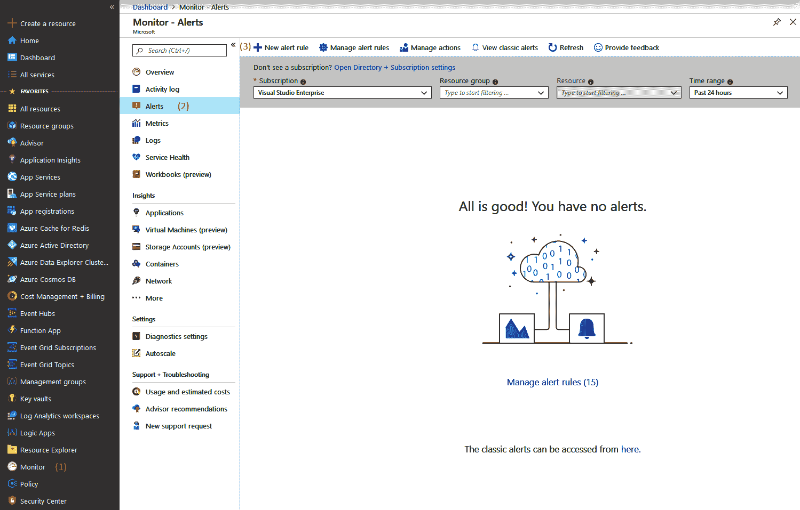

如果有任何需要关注的警报，它们会在这里显示。

1.  要添加新的警报规则，请使用屏幕左上方的按钮。点击后会打开另一个视图，如下截图所示。在这里，可以配置警报条件：

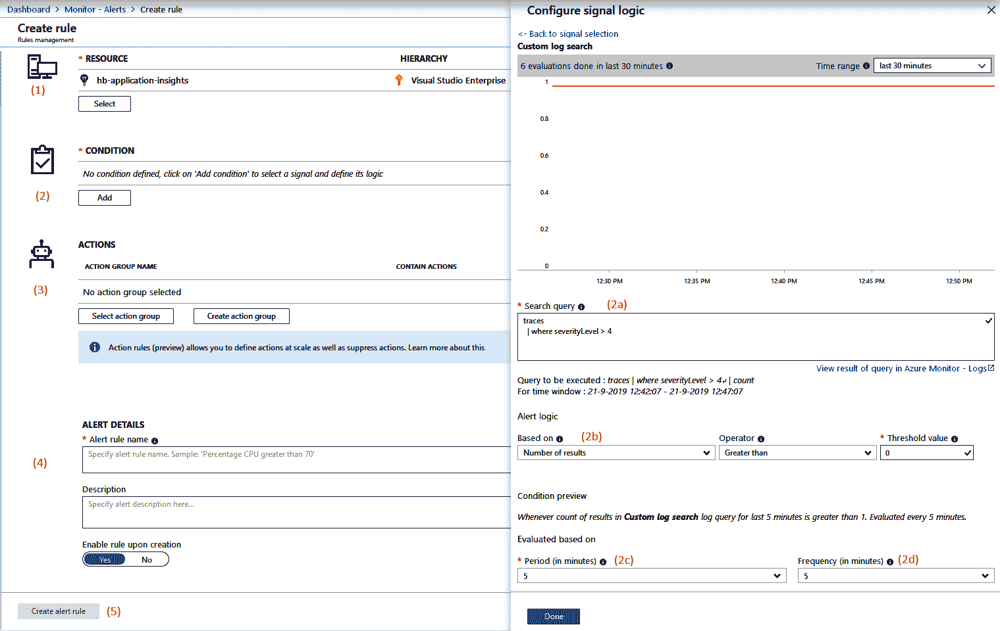

在前面的截图中，左侧显示了用于配置警报的视图。在这里，必须做出多个选择来创建一个警报：

1.  这是作为警报主题的资源。它可以是任何类型的资源，在本示例中，警报将针对 Application Insights 工作区。

1.  这是设置警报的条件。要选择这些条件，右侧会弹出窗口。在这里，可以在不同类型的警报之间进行选择。选择“日志搜索”警报类型，将打开如下所示的详细视图。在这里，必须做出以下选择：

    +   **对追踪日志的查询**（参考前面截图中的 2a）：在此示例中，查询追踪日志中的条目，这些条目的严重性为 `4` 或更高，意味着它们是通过 `LogWarning` 或 `LogCritical` 方法发出的。

    +   **触发警报的条件和操作符**（2b）：在此情况下，只要有一个或多个匹配，警报就会触发。

    +   **评估警报条件的间隔**（2c）：当指定一个匹配特定数字的查询时，这决定了必须满足该数量的时间间隔。

    +   **评估警报条件的频率**（2d）：过于频繁地评估警报条件可能导致警报以快速的系列频繁开关。过于不频繁地评估警报条件可能会导致警报来得太晚。实验将帮助你了解如何配置这一点。

1.  这是在警报条件满足时执行的操作。由于可能有很多警报需要调用相同的操作组，因此可以将操作分组，并在此处引用这些操作组。操作的一些示例包括调用 Webhook 或发送短信或电子邮件。

1.  警报配置通过输入名称和描述来完成。

1.  最后，警报可以被保存。

警报创建并激活后，系统会自动完成这一过程，几分钟内，警报就准备好检查应用程序日志，并在满足警报条件时发出信号。

日志记录是深入了解请求发生了什么以及错误如何产生的好方法。另一种了解应用程序行为的技术是使用指标。

# 指标

除了日志记录外，应用程序还可以发出一个或多个指标。指标是随着时间变化的一系列值，描述系统的一个或多个方面。一些指标的示例如下：

+   当前登录的用户数量

+   用户查看的产品数量

+   数据库事务的数量

收集这些指标可以提供关于系统如何使用以及当前如何操作的洞察。指标通常用于创建仪表盘和警报。

# 发出指标

要开始使用指标，首先必须由应用程序发出指标并存储在集中位置。除了日志记录外，应用程序洞察还可以用于获取指标。

要使用应用程序洞察来获取指标，需要执行以下步骤：

1.  指标需要从应用程序代码中发出（在适用的情况下），使用`TelemetryClient`类。此接口可以从`Microsoft.Extensions.Logging.Abstractions` NuGet 包中获得。

1.  安装`Microsoft.ApplicationInsights.AspNetCore`应用程序洞察 NuGet 包。

1.  使用`TelemetryClient`注册到`Dependency`容器。通过在容器构建器上使用扩展方法来完成，如以下代码片段所示：

```
builder.RegisterType<TelemetryClient>().SingleInstance();
```

1.  完成此操作后，应用程序准备开始发出指标。可以使用`TelemetryClient`类来完成：

```
public class Example
{
 private readonly TelemetryClient _telemetryClient;

 public Example(TelemetryClient telemetryClient)
 {
     _telemetryClient = telemetryClient;
 }

 public void DoSomething()
 {
     _telemetryClient.GetMetric(“doSomethingCalledCounter”).TrackValue(1.0);
 }
}
```

发出一个指标涉及两个步骤。首先，使用`GetMetric()`方法获取该指标的引用。接下来，使用`TrackValue`方法提交一个值。提交的值应为双精度数或允许隐式转换为双精度数。

一旦指标发出，就可以用来创建图表和指标。然而，在继续讨论这些主题之前，首先要讨论另一种类型的指标——即 Azure 平台指标。

除了应用程序发出的指标之外，还有许多可以从运行系统的 Azure 平台中记录的指标。以下是一些示例：

+   CPU 使用百分比

+   服务总线上的消息数量

+   每秒数据库事务数

+   可用的磁盘空间

这些指标通常与应用程序的性能密切相关，甚至可能是领先指标。例如，当可用磁盘空间达到 0 时，大多数 Web 服务器会停止工作。

在 Azure 中，每个服务默认会发出一系列的指标，这些称为平台指标。不同的服务发出的指标各不相同，且用户无法影响这些指标的生成。Azure Monitor 也会自动收集这些指标，这些指标可以像应用程序发出的指标一样用于绘图和警报。第一个要探讨的内容——绘图——将在下一节中介绍。

平台指标是内置的并且免费提供，且保留 93 天。

# 绘制指标

所有收集的指标，无论是在 Application Insights 中还是在 Azure Monitor 中，都可以用于构建可视化指标的图表和仪表板。可以使用每个 Azure 资源中可用的“指标”选项卡来创建图表。也可以使用 Azure Monitor 提供的工具来创建图表，这样，可以在一个画布上合并多个资源的图表。操作步骤如下：

1.  打开 Azure Monitor，可以从左侧菜单访问。

1.  导航到“指标”菜单。这将打开如下所示的视图：

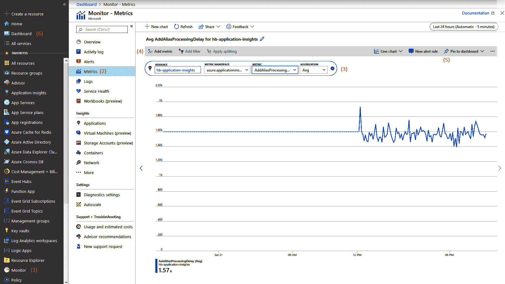

1.  一旦画布打开，可以将一个或多个图表添加到其中。图表是通过顶部的图表构建器构建的。这里需要做四个选择：

    +   需要绘制图表的资源。

    +   需要绘制图表的资源所属的指标命名空间：对于每种 Azure 资源类型，只有一个命名空间。唯一的例外是 Application Insights，它有两个命名空间——一个是默认指标，另一个是通过 `TelemetryClient` 发出的应用程序指标。

    +   绘制指标：对于自定义指标，这指的是前一节中在 `GetMetric()` 方法中选择的名称。

    +   用于将多个测量值合并为图表中一个点的数学运算：这可以是最小值、最大值、平均值或总和。

    +   要向同一图表添加多个图表线条，请选择顶部的“添加指标”。重复之前的四个选择以配置新的图表。

1.  若要将此图表作为仪表板的一部分以便于重复使用，请点击顶部的“固定到仪表板”按钮。

1.  然后可以通过右侧的菜单直接访问仪表板。

拥有一个度量的图表，甚至是在仪表板中显示多个图表，对于调查问题非常有帮助。然而，没有人愿意持续关注仪表板以查看进展情况。因此，还可以为度量配置警报。

# 对度量进行警报

与日志条目类似，当一个度量值超过或低于某个阈值时，Azure Monitor 也可以发出警报。需要跟进的日志条目可能与某个单一用户或客户有关，他们遇到问题。而度量值则有助于检测所有用户受到影响的情况，或基础设施无法正常工作或即将停止工作的情况。

为度量创建警报的过程与从日志创建警报的过程非常相似。要创建新的警报规则，请使用门户导航到 Azure Monitor，然后选择“警报”（Alerts）。接下来，点击“新建警报规则”按钮，打开如下所示的视图：

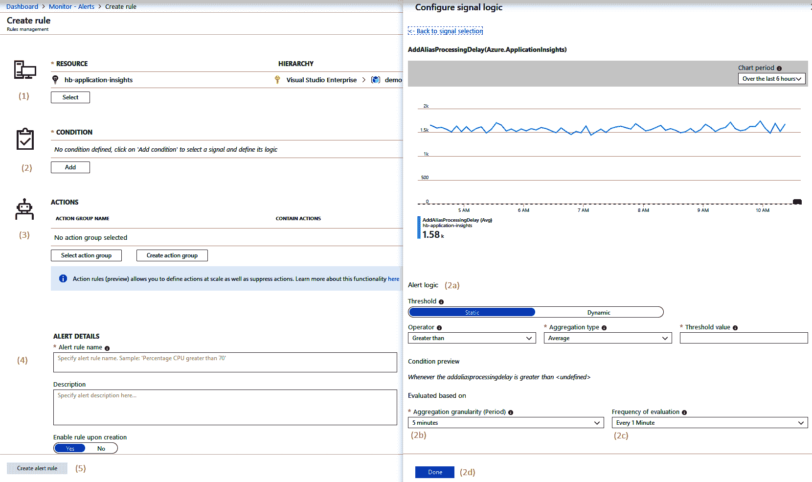

在此截图中，必须进行以下选择才能对度量创建警报：

1.  选择作为警报主体的资源。这可以是任何类型的输出度量值的资源——在此实例中，已选择一个 Application Insights 工作区。

1.  配置触发警报的条件。为此，会在右侧打开一个新窗口。要进入前面截图中显示的视图，选择度量警报类型，并从填充的列表中选择正确的警报。接下来，视图将更改为前面截图中显示的内容。在这里，必须进行以下选择：

    +   选择触发警报的阈值（参见前面截图中的 2a）。静态阈值是默认设置，需要配置操作符、聚合类型和值。

    +   选择警报应评估的粒度间隔（2b）。

    +   选择评估频率（2c）。警报评估得越频繁，发生事件与发送警报之间的延迟就越短。

    +   保存警报条件（2d）。

1.  选择一个或多个在满足警报条件时需要触发的操作组。

1.  配置警报规则名称和描述。

1.  保存警报。

警报在保存后几分钟内变为活动。现在，每当满足警报条件时，开发人员将通过配置的警报组方法收到通知。

# 调查请求

在使用 Application Insights 进行日志记录和度量时，Application Insights 还提供了许多内置的功能可供使用。其功能之一是可以通过一个视图——称为“搜索”（Search）——对所有由 Application Insights 收集的数据执行搜索查询。

在这里，可以搜索所有由 Application Insights 收集的信息，包括以下内容：

+   应用程序代码生成的日志，包括 NuGet 包和 .NET 框架。

+   所有依赖调用：这些是对数据库和其他系统的调用，Application Insights 会自动检测到。Application Insights 会记录目标系统和持续时间。

+   所有异常：应用程序中发生的所有异常都会被 Application Insights 记录，即使它们已经被应用程序代码正确处理。

+   请求：所有通过 HTTP 进入的用户请求都会被记录。重要的属性，如 URL、持续时间和 HTTP 方法，也会被包括在内。

要打开搜索视图，请导航到正确的 Application Insights 实例，然后转到搜索标签（1），以获得以下截图所示的视图：

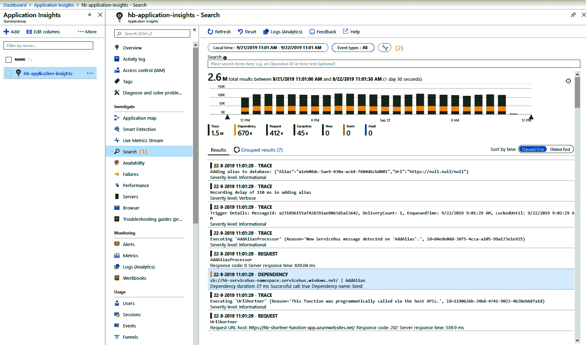

在搜索视图中，可以配置多个搜索参数（*2*）：

+   搜索的时间间隔：默认为过去 24 小时。

+   搜索的事件类型：可以是请求、日志条目、页面视图、异常、依赖调用等。

+   搜索的文本内容。

几秒钟内，所有匹配的结果会以条形图形式显示。每个条形代表一个时间段，并显示在该时间段内的匹配次数。此图表下方会显示所有单独的匹配项。这些是所有可用事件类型的混合。

点击任何一个结果会打开一个新视图，显示选定记录与所有其他类型的关系，按请求分组。这使你能够快速导航到所有由 Application Insights 在单个用户请求执行期间收集的日志、依赖调用和异常。结果可以以列表和时间轴的形式显示。这使你能够非常快速地查看在执行用户请求时，服务器所做的操作：

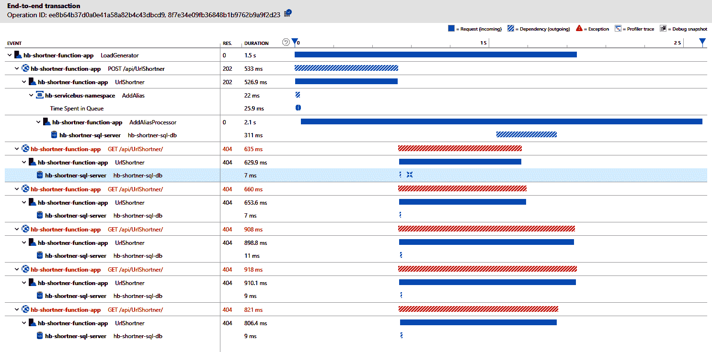

通过这些调查应用程序和接收事件通知的方式，决定创建哪些警报、哪些不创建非常重要，这不仅是为了创建一个健康的工作环境，还为了在监控和新工作的平衡中找到合适的点。这是下节的主题。

# 优化警报

一旦团队开始为其应用程序添加指标和警报，并且关注他们认为重要的指标，警报很快就会开始出现。在此时，重要的不是仅仅响应警报，而是要调查警报并关闭它们。警报还应该被视为学习的机会。

# 优化警报设置

创建一系列警报后，重要的步骤是定期重新评估它们。通过这样的评估，可能得出以下两种结论：

+   **警报阈值的变化**：定期评估警报涉及查看一段时间内的指标，并检查警报阈值目前的位置。这可能导致结论认为阈值过低或过高。

+   **去除重复**：查看一个月内已触发的警报，很可能会发现一组或多组警报总是同时触发。例如，某个特定 Web 服务器上设置的一组警报可能是如此相关，它们总是在同一时间触发。一个常见的例子是 CPU 使用率和 HTTP 请求的平均响应时间；这两个指标通常会同时上升。如果是这种情况，值得考虑去除其中一个警报，或者将其中一个警报降级为仅为警告。重复的警报增加了需要立即响应的事项数量，导致团队在没有明确好处的情况下承受更大的压力。

不断优化警报集不仅有助于减少浪费，还能防止所谓的警报疲劳。

# 警报疲劳

如果警报规则没有持续进行审查和更新，它们可能会对团队产生负面影响，特别是当警报规则触发过于容易或过于频繁时，人员将不再正确响应这些警报。如果警报数量过多，会使人感到疲惫，变得对警报麻木。无论这些警报是虚假的还是实际的，警报的数量足以让人们进入一种不再关心的状态。

如果在团队中观察到这种情况，就该彻底改变警报的生成和响应方式。如果不这样做，团队成员可能会生病或完全离开公司。

防止这种情况的一种方法是实施一个健康的值班计划。

# 要捕获哪些指标

在讨论指标时，一个常见的问题是应该发出和监控哪些指标。这里有许多可能的指标，以及更多关于此主题的不同看法。作为一个好的起点，通常会收集以下 Web 应用程序的指标：

+   每分钟请求数、每分钟事务数或类似指标：这是用来捕捉 Web 应用程序当前负载或吞吐量的度量标准。

+   平均响应时间：这个度量标准捕捉的是在某一时间窗口内所有请求的响应时间。

+   错误率：这个度量标准捕捉的是所有请求中导致错误的百分比。作为错误的指导标准，通常将所有`400`及以上的 HTTP 响应码视为错误。

当这三个指标一起被捕获并绘制在同一图表中时，它们为理解应用程序行为提供了第一步。让我们看几个例子：

+   当平均响应时间上升，但吞吐量（每分钟请求数）保持不变时，这可能表明承载应用程序的基础设施出现了问题。

+   当吞吐量和平均响应时间同时上升时，这可能意味着流量正在增加，当前的基础设施无法在相同的响应时间下支持这种吞吐量。

+   当错误率上升，但其他指标保持不变时，这可能意味着部署出现问题，或者某个特定的代码路径开始生成（更多）错误。

当然，这些只是一些示例，还有许多可能的场景。其他指标可以帮助排除特定的场景或尽量避免它们。例如，开始监控数据库负载百分比也可以帮助检测第二种场景的特定实例。如果数据库负载接近 100%，可能是时候将数据库升级到更高性能的层级，以维持相同响应时间下的更高吞吐量。

总结这一部分内容时，最后有一个建议——在开始监控时，往往会倾向于关注托管应用程序的系统。作为替代方案，还应考虑监控那些对业务产生直接影响的指标，或者是能够反映用户在应用程序可用性方面满意度的指标。这比仅仅关注系统要更接近衡量业务价值。

以下是一些示例：

+   在在线商店中，每分钟售出的书籍数量可以是一个非常有价值的商业指标。试想一下，如果能够通过 Azure Monitor 和应用程序代码中的自定义指标实时获取这个指标，将会对业务产生什么样的影响。

+   对于在线阅读平台，虚拟翻页的数量可以是一个有价值的指标，表明用户是否愉快地使用该服务。只要这个数字出现急剧下降或迅速增加，可能就表明出现了问题。

要找出在特定场景下哪些指标有意义，可能有助于与业务或领域专家进行沟通。

# 制定值班计划

一旦配置了警报并开始触发，就没有必要设置警报在早上 8 点之前或下午 5 点之后不触发。换句话说，必须确保某些严重性的警报即使在办公时间之外也能得到跟进。

在许多公司中，警报机制还是新鲜事物，因此隐性地期望某些人在办公时间外（除了他们的常规职责）可以处理这些警报。有时，当警报每年只触发一两次，且没有关于响应时间的约定时，这可能根本不会成为问题。

然而，在许多组织中——尤其是随着时间的推移——人们通常期望在一定的时间范围内对这些警报作出响应。除此之外，随着系统的规模变大、复杂性增加，或者系统数量的增长，警报的数量也可能会增加。

应对这一问题的方式是制定值班计划，并与工程师达成正式协议，明确他们的职责以及组织将如何奖励他们的付出。这使得工程师能够设定清晰的期望，并根据这些协议保护自己的自由时间。足够的休息时间有助于工程师在高压期间得到放松，这样他们才能在值班时保持警觉，随时准备应对预期的任务。

有很多关于什么构成健康值班计划的资料，关键字是*健康*。一些基本建议如下：

+   在非工作时间值班的员工，不应在工作时间继续值班。

+   为值班工程师提供合理的补偿，考虑他们保持电话畅通、避免受影响等情况。什么是合理的补偿因情况而异，但值班的要求越高，补偿应该越高。

+   为值班人员提供合适的工具。例如，当响应时间要求为 30 分钟或更短时，给值班人员配备一个背包，里面放有笔记本电脑、电话和连接互联网的设备。

+   确保每位员工的值班时间不超过至少 75%。

+   允许员工以调休的形式休假，这样如果他们需要在夜间响应警报，可以晚点上班。

每当系统的正常运行受到干扰时，无论是工作时间还是非工作时间，都可以进行实时站点事件回顾，以了解发生了什么以及如何减少再次发生的可能性。

# 实时站点回顾

在警报触发并且团队已响应并解决问题后，是时候评估发生了什么了。这就是所谓的实时站点事件回顾。在这里，整个团队会聚集在一起，讨论以下内容：

1.  发生了什么——首先，应该构建一个时间线，从发现事件的时刻到恢复正常操作为止。接着，时间线会扩展，加入导致触发事件的前因后果。

1.  接下来，评估一系列事件，了解响应过程中哪些做得好。如果团队的某个成员使用了一个新工具快速诊断问题，这也能对团队其他成员产生帮助。

1.  只有在此之后，才是审视可能改进的地方，并将这些改进点转化为团队的高优先级工作。识别出可能的安全保障措施，并安排实施，或者识别新的警报机制，在类似问题发生之前就能发出警报。

1.  触发初始响应的警报或一组警报被评估，以确定它们是否足够充分，或者是否可能包含重复内容。

实时站点事件回顾的最佳时间是尽可能接近事件发生的时间。实际上，这意味着要给每个人足够的时间休息和恢复，并计划安排在下一个工作日进行会议。

这完成了我们对 Application Insights 和 Azure Monitor 在监控网络应用程序时功能的概述。下一节将介绍几种将 Application Insights 和 Azure Monitor 与其他工具集成的方法。

# 与其他工具的集成

Azure Monitor 和 Application Insights 是收集应用程序日志和指标的优秀工具，同时还可以存储这些数据并进行搜索。然而，开发团队或企业可能有一些原因偏好使用其他工具来可视化应用程序性能或响应警报。一个重要的整合驱动因素通常是一个人或团队使用的主要工具。如果一个团队主要在 ServiceNow 或 Grafana 中操作，那么将这些工具与 Azure Monitor 集成通常更为有用，而不是强迫这些团队使用多个工具。

存在许多可能的集成，以下小节中详细介绍了一些例子。

# IT 服务管理应用程序

在前一节中我们介绍了操作组，并讨论了如何在网络应用程序中进行监控。操作组是响应警报时执行的一组操作。

除了丰富的内置功能外，还可以在现有的**IT 服务管理**（**ITSM**）解决方案中自动触发警报。如果公司内已经有 ITSM 解决方案，那么通过 Azure Monitor 创建一个单独的警报通道并不合适。相反，使用 Azure Monitor 的 ITSM 连接器可以让你从一个解决方案中管理公司范围内的所有警报。

当前，ServiceNow、Provance、System Center Service Manager 等工具已有可用的集成。这些连接通过 ITSM 连接器创建。

# Azure Boards

在许多开发团队中，Azure DevOps 是开发人员花费大部分时间使用的工具。这也是他们通过 Azure Boards 执行待办事项管理的地方。

同时，操作员（希望开发人员也能参与）在 Application Insights 中进行调查工作，以确定用户错误的原因，并深入分析失败的原因。这项调查工作可能会导致需要在 Azure DevOps 中回溯的任务。

为了简化操作，可以通过以下步骤从 Application Insights 配置与 Azure DevOps 的集成：

1.  导航到左侧菜单中的工作项选项（1）。这将打开下图所示的视图。在这里，可以配置与 Azure Boards 的连接：

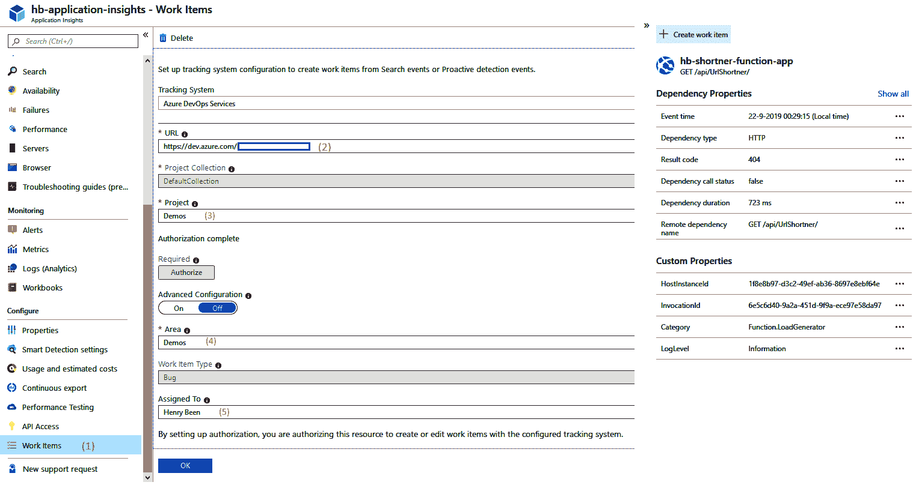

要配置连接，必须填写以下详细信息：

1.  输入 Azure DevOps 链接。此时需要附加上组织的名称。

1.  选择要使用的 Azure DevOps 项目。可以从下拉菜单中选择。

1.  选择一个产品区域，在该区域中将创建新的项目项。默认情况下，这是与项目名称相同，除非你更改它。

1.  为新的工作项提供一个用户名称，作为默认所有者。

配置此连接后，在 Application Insights 的相关页面上会显示一个新的“创建工作项”按钮。此按钮允许您直接在待办事项列表中创建一个包含所有相关信息的缺陷。

# Grafana

Azure Monitor 允许您构建简单、易用的仪表板。使用 Azure Monitor 仪表板的优势在于，它们与所有其他 Azure 实践（例如**基于角色的访问控制**（**RBAC**）和 Azure 资源管理器模板）完美集成。

然而，团队可能已经采用了其他可视化工具，如 Grafana。Grafana 是一个广受欢迎的平台，非常适合用于操作仪表板。Grafana 可以配置为通过 Azure Monitor 进行连接，并查询指标以生成图表。Grafana 还具有告警功能，但不支持查询日志。

要将 Grafana 连接到 Azure Monitor，需要执行以下步骤：

1.  在您的 Azure 订阅使用的 Azure Active Directory 帐户中创建一个新的应用注册。记下该应用注册的**Tenant Id**、**Client Id**、**Subscription Id**和**Client Secret**属性。

1.  为应用注册创建新的 RBAC 角色分配，并为要监控的资源至少设置**Reader**权限。

1.  在 Grafana 中配置一个新的 Azure Monitor 类型的数据源。插入在*第 1 步*中收集的用于 Azure 身份验证的属性。

1.  向仪表板添加一个新的图表，选择 Azure Monitor 作为数据源。

通过执行上述步骤，可以在几分钟内设置 Grafana 与 Azure Monitor 的连接。

# 总结

在本章中，您学习了如何开始完成 DevOps 循环。您还学会了如何处理崩溃报告，并从各种应用程序中收集它们，以及如何为 Web 应用程序添加监控代码。您现在知道如何使用 Application Insights 集中日志和指标，并深入了解请求和依赖调用。您还学会了如何将 Azure Monitor 与其他工具集成，以进一步简化您的开发过程。

通过这些知识，您现在可以开始了解您的应用程序如何在生产环境中运行。通过这样做，您不仅可以更快地交付软件，还可以从使用中学习并从中进行改进。

在下一章中，您将学习如何收集用户反馈，以补充从系统日志和指标中学到的内容。您还将学习如何衡量应用程序和新功能的最终用户满意度。

# 问题

在我们总结时，这里有一系列问题供您测试对本章内容的理解。您可以在附录的*评估*部分找到答案：

1.  判断正误——是否可以使用 Application Insights 捕获 Azure 平台提供的自定义指标？

1.  Azure Monitor 中平台指标的保留时间是多少？

1.  判断题 – 使用 Application Insights 可以从您自己的应用程序代码中捕获自定义指标。

1.  你怎么称呼工程师因为警报过多而开始忽视警报的情况？

1.  判断题 – 在 Azure 中，触发警报时可以调用 webhook。

# 进一步阅读

+   有关 App Center SDK 的更多信息可以在[`docs.microsoft.com/en-us/appcenter/sdk/`](https://docs.microsoft.com/en-us/appcenter/sdk/)找到。

+   关于 Raygun 的更多信息可以在[`raygun.com`](https://raygun.com)找到。

+   一个完整的示例应用程序，使用了 Application Insights 和 Azure Monitor，可以在[`github.com/henrybeen/MonitoringLogging.UrlShortnerDemo2`](https://github.com/henrybeen/MonitoringLogging.UrlShortnerDemo2)找到。

+   关于配置 Application Insights 的更多详细信息可以在[`docs.microsoft.com/en-us/azure/azure-monitor/app/app-insights-overview`](https://docs.microsoft.com/en-us/azure/azure-monitor/app/app-insights-overview)找到。

+   KQL 参考页面可以在[`docs.microsoft.com/en-us/sharepoint/dev/general-development/keyword-query-language-kql-syntax-reference`](https://docs.microsoft.com/en-us/sharepoint/dev/general-development/keyword-query-language-kql-syntax-reference)找到。
