# 容器

在过去的几年里，容器已成为热门话题。它们允许你将任何应用程序、任何工具（无论是用任何语言编写）打包，并将其部署到基本主机或集群上。在实施 DevOps 时，容器可以带来巨大的价值。这就是为什么 DevOps 和容器常常被同时提及的原因。然而，它们并不是同一回事。虽然 DevOps 更像是一种文化现象，容器则是一种技术，是托管应用程序的替代方式。

在本章中，你将了解更多关于容器以及它们是如何工作的。通过练习，创建自定义容器镜像并在不同的托管平台上运行，例如 Azure 容器实例和 Kubernetes。

本章将涵盖以下主题：

+   容器简介

+   构建容器镜像

+   在 Azure DevOps 中构建镜像并在 Azure 中运行

+   Kubernetes 介绍

+   Kubernetes 实战

+   升级容器

+   容器和 Kubernetes 的扩展

+   使用 Azure DevOps 部署到 Kubernetes

# 技术要求

要实验本章描述的技术，你需要以下一项或多项：

+   Docker Desktop

+   Visual Studio 2019

+   Azure 订阅

+   Azure CLI

所有这些都可以免费获得，或者在有限的时间内免费用于评估目的。

# 容器简介

容器是虚拟化的演进。通过虚拟化，物理机器的资源在多个虚拟机之间共享。共享这些资源也意味着每个虚拟机都有自己的操作系统。而使用容器时则不同。容器不仅共享资源，还共享操作系统内核，使其与虚拟机镜像相比非常小。

由于操作系统内核是共享的，容器也非常便携。镜像可以部署到任何支持运行容器的主机环境中。这是因为应用程序的所有二进制文件和配置都存储在容器内。因此，容器外部的环境变量不会影响应用程序。当然，也有一些注意事项：容器共享操作系统内核；Linux 容器只能在 Linux 操作系统上运行，Windows 容器也同样如此。

容器提供了虚拟化操作系统的能力，以便在单一操作系统上运行多个工作负载。以下图表展示了常规托管、虚拟机托管和容器之间的区别：

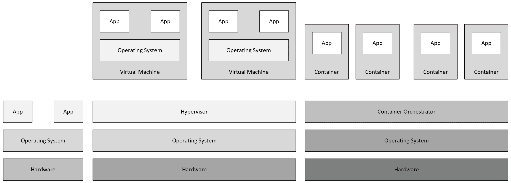

如果你曾经听说过容器，那么几乎可以肯定你也听说过 Docker。这是因为 Docker 是最著名的容器引擎之一，用于运行容器。下一节将深入探讨 DevOps 和容器，剩下的章节将详细介绍有关容器的更多技术细节。

# DevOps 和容器

如在介绍中提到的，DevOps 和容器并不是同一个概念。容器是让 DevOps 更加容易的技术。这是因为容器具有一些优点，使其成为 *DevOps* 的完美工具：

+   **一致性**：因为你构建了容器镜像，所以"<q>它在我的机器上运行</q>"这一问题被消除了。

+   **关注点分离**：使用容器时，您的应用程序将分布在不同的容器之间，这使得维护和分离进程变得更加容易。

+   **平台**：该解决方案可以在不同的平台上运行。无论是在 Azure、Amazon Web Services 还是本地环境中运行，都没有关系。

扩展来说，DevOps 更多的是一种文化，而非技术。如在第一章《DevOps 介绍》中提到的，*技术组件* 用于支持 DevOps。在本章的其余部分，我们将专注于技术方面的内容。

# 托管选项

如前所述，容器的一个好处是它们非常便携。这也意味着容器可以托管在许多平台和技术上。

要运行容器，有许多选项会根据您的使用案例有所不同。以下是其中一些选项：

+   Azure 应用服务

+   Azure 服务框架

+   Docker Swarm

+   Docker 桌面版

+   Kubernetes

根据应用程序/容器的需求，它可以运行在前面提到的所有选项中。

用于运行容器的镜像（容器镜像）也需要托管。这些镜像托管在一个所谓的容器注册表中。在容器注册表中，它们可以是私有或公开发布的。两个最著名的注册表是 Docker 注册表和 Azure 平台中的 Azure 容器注册表。

现在我们已经了解了关于容器的一些背景信息，接下来我们将深入探讨容器背后的技术，并了解创建自定义容器镜像所需的内容。

# 构建容器镜像

本节将带领您了解构建容器镜像并在本地系统上执行的过程。为此，我们首先需要创建一个应用程序，然后为其添加 Docker 支持，接着创建镜像并最终进行测试。让我们开始吧！

# 创建应用程序

要能够测试和检查容器中运行的内容，必须有一个应用程序。为此，可以创建一个新应用程序，也可以使用现有的应用程序。

创建新应用程序时，最简单的选项是在 Visual Studio 2019 中使用默认的 ASP.NET Core 网站模板。可以通过几次点击添加容器支持。只需在创建项目时勾选“启用 Docker 支持”框即可。

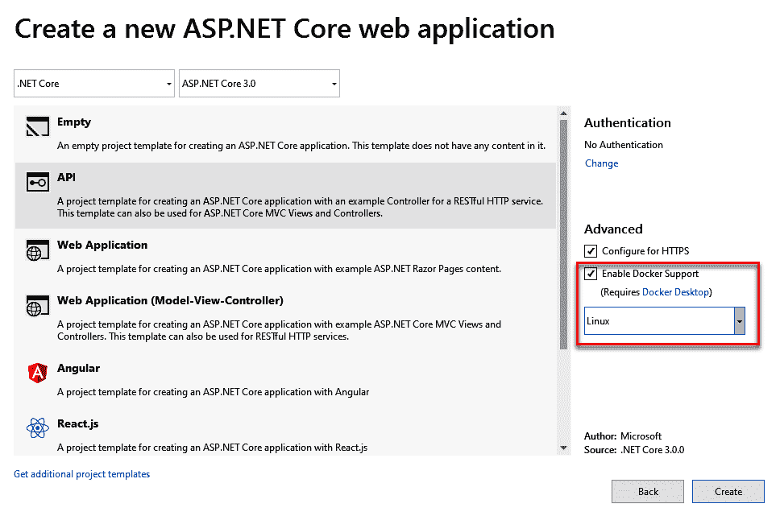

保持新应用程序处于打开状态，或打开现有应用程序。在下一节中，我们将探讨如何向现有应用程序添加 Docker 支持。

# 向现有应用程序添加 Docker 支持

向现有应用程序添加 Docker 支持需要几个简单的步骤：

1.  打开 Visual Studio 2019 中的项目/解决方案，右键点击项目。

1.  选择“添加”并选择“Docker 支持”：

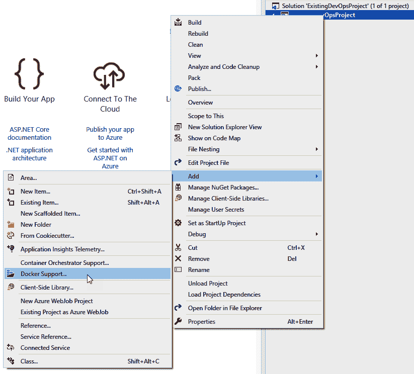

根据你的客户端工具和 Visual Studio 配置，也可能会有一个“容器编排器支持”选项。通过该选项，可以选择你选择的云编排器。在此示例中，我们使用 Docker，因为这一格式被主要的容器编排器所支持。然而，也存在其他云编排器选项：

+   Docker Swarm

+   Kubernetes

+   Mesos Marathon

根据所使用的云编排器，会向项目中添加一个特定格式的文件。

通过添加 Docker 支持，项目中会新增一个名为 `Docker` 的文件。Dockerfile 是容器镜像的规范。该文件可以被 Docker 读取，并视为指令。该文件是一个文本文件，包含一系列独立的命令，也可以在命令行工具中调用这些命令来组装镜像：

```
FROM mcr.microsoft.com/dotnet/core/aspnet:3.0-buster-slim AS base
WORKDIR /app
EXPOSE 80
EXPOSE 443
EXPOSE 555
FROM mcr.microsoft.com/dotnet/core/sdk:3.0-buster AS build
WORKDIR /src
COPY ["ExistingDevOpsProject/ExistingDevOpsProject.csproj",
"ExistingDevOpsProject/"]
RUN dotnet restore "ExistingDevOpsProject/ExistingDevOpsProject.csproj"
COPY . .
WORKDIR "/src/ExistingDevOpsProject"
RUN dotnet build "ExistingDevOpsProject.csproj" -c Release -o
/app/build
FROM build AS publish
RUN dotnet publish "ExistingDevOpsProject.csproj" -c Release -o
/app/publish
FROM base AS final
WORKDIR /app
COPY --from=publish /app/publish .
ENTRYPOINT ["dotnet", "ExistingDevOpsProject.dll"]
```

本示例使用了一种名为多阶段构建文件的技术。这是因为该文件使用了多个 `FROM` 语句，每个语句都引用了特定的镜像。

在多阶段构建之前，无法使用多个 `FROM` 语句。在那时，构建高效的容器镜像非常困难。文件中的每个语句代表镜像上的一个额外层，导致镜像越来越大。

在构建过程中，还需要移除任何在该过程中需要的组件。因此，开发和生产通常会有单独的 Dockerfile。

如前所述，Dockerfile 由一系列指令组成，其中最常用的指令如下：

+   **FROM**：`FROM` 命令用于指定镜像基于的操作系统或基础镜像。在本例中，`mcr.microsoft.com/dotnet/core/aspnet:3.0-buster-slim` 镜像用于应用程序的生产版本，`mcr.microsoft.com/dotnet/core/sdk:3.0-buster` 镜像用于构建镜像。

+   **RUN**：`RUN` 命令用于在构建容器镜像的过程中安装组件或执行操作。

+   **ENTRYPOINT**：`ENTRYPOINT` 命令指定容器镜像的入口点需要是什么。在此示例中，入口点指定为一个 `.NET` 应用程序，它引用了编译过程中构建的库。

到目前为止，我们已经创建了应用程序并添加了 Docker 支持。接下来，我们将看看如何用这个应用程序创建镜像。

# 使用应用程序创建镜像

要能够创建 Docker 镜像，需要安装 Docker Desktop，因为 Visual Studio 会使用它来构建镜像。通过完整的 Dockerfile，可以使用以下步骤来构建镜像：

1.  在 Visual Studio 中右键单击 Dockerfile 并选择构建 Docker 镜像：

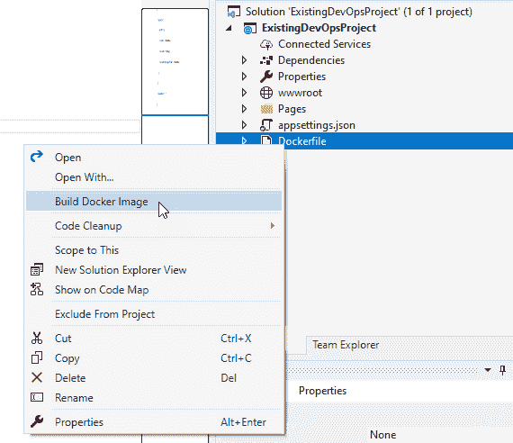

1.  在镜像的编译和构建过程中，请查看输出窗口。查看它可以提供有关容器镜像分层方法的更多见解。此分层方法可以通过输出窗口中显示的步骤来查看：

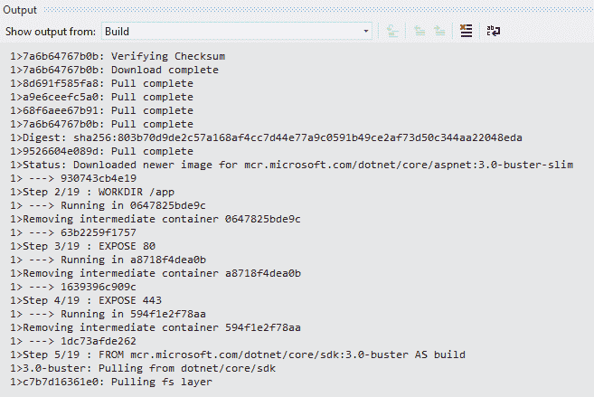

1.  Docker Desktop 还使得在本地运行和存储镜像成为可能。构建镜像后，打开终端并运行以下命令：

```
docker images
```

该命令会显示当前机器上所有的镜像。在这个列表中，创建镜像时下载的基础镜像也会列出。

# 运行容器镜像

容器镜像可以通过在 Docker 中运行来本地启动。现在我们已经有了一个容器镜像，可以创建一个容器：

1.  运行以下 `docker container run` 命令：

```
docker container run --publish 8123:80 --detach --name [container name] [image name]
```

上述命令将启动命令末尾指定的容器镜像。此外，还指定了不同的参数：

+   +   **发布**：`publish` 参数会将主机的端口打开到容器中。如示例所述，这将打开端口 `8123` 并将流量路由到容器内的端口 `80`。

    +   **分离**：`detach` 参数会在后台运行容器，并打印出其特定 ID。

    +   **名称**：Docker 中容器的名称。

1.  要列出所有正在运行的容器，可以在终端中使用 `docker ps` 命令。

1.  容器运行时，打开浏览器并导航到 `http://localhost:8123`。如果一切正常，这将显示默认的 ASP.NET Core 网页：

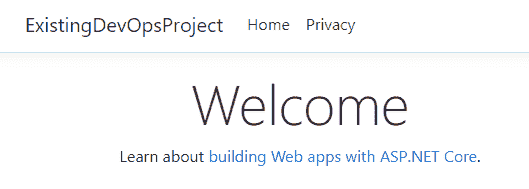

由于在本地构建并在自己的机器上运行并不是 DevOps 思维方式的体现，我们将在接下来的章节中转向一个不同的托管平台。

# 在 Azure DevOps 中构建镜像并在 Azure 中运行

为了支持持续集成和持续交付，源文件需要存储在一个代码库中。因此，让我们在 Azure Repos 中共享资源，并尝试使用 Azure Pipelines 构建我们的容器。构建完容器镜像后，还需要一个存储镜像并运行容器的地方。在 Azure 平台中，有两个非常适合此场景的服务：

+   **Azure 容器注册表**：此服务是基于开源 Docker 注册表的托管私有 Docker 注册表。在这里，你可以维护和注册容器镜像。

+   **Azure 容器实例**：Azure 容器实例，也称为 ACI，是一种运行隔离容器的解决方案，无需过多的管理。

为了简化本指南，文件已预先添加到仓库中，且 Azure 资源已经创建。

# 创建服务端点

正如书中所讨论的，Azure DevOps 中与 Azure 和容器注册表等外部服务的连接是通过服务端点进行配置的。由于镜像需要可用，以便 Azure 容器实例能检索到它，因此需要将其发布到容器注册表。Azure DevOps 到注册表的连接是在服务连接中配置的。

执行以下步骤来配置服务连接：

1.  在 Azure DevOps 项目中，打开项目设置。

1.  在项目设置中，点击服务连接。

1.  在服务连接概览中，点击创建服务连接并选择 Docker 注册表。

1.  在弹出的窗口中，填写正确的信息并保存连接：

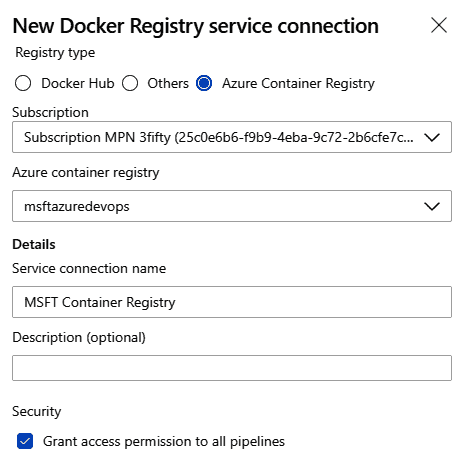

保存连接将为项目添加一个服务连接，供我们创建的管道或你未来创建的管道使用。

# 创建新管道

为了能够开始构建容器镜像并将其发布到注册表，我们将创建一个新的管道。对于这个示例，我们将使用 YAML 管道体验。

执行以下步骤以开始使用管道：

1.  打开你的 Azure DevOps 项目并点击管道。

1.  在管道概览中，点击新建管道。

1.  选择 Azure Repos Git，选择正确的仓库，然后选择启动管道：

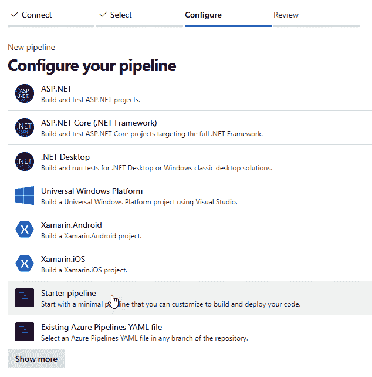

1.  从启动管道中删除两个虚拟脚本任务，并打开助手。

1.  在助手中，搜索 `Docker` 任务并将任务添加到管道中。

1.  选择为容器注册表创建的服务连接，并保持其他信息为默认设置。

确保将任务的 `buildContext` 属性更改为指向正确的目录。这对于 Docker 能够在构建镜像时引用正确的路径是必要的。

添加后，YAML 文件应如下所示：

```
- task: Docker@2
  inputs:
    containerRegistry: 'MSFT Container Registry'
    repository: 'azuredevops'
    command: 'buildAndPush'
    Dockerfile:'**/Dockerfile'
    buildContext:
'$(System.DefaultWorkingDirectory)/ExistingDevOpsProject'
```

1.  保存并运行管道。第一次运行后，容器镜像将被创建并发布到容器注册表。

容器注册表中的镜像可以通过使用预定义的 URL 进行检索。该 URL 包含几个特定的组件：

+   +   `[container registry]/[repository]:[tag]`：

        +   **容器注册表**：容器注册表的基础 URL。

        +   **仓库**：在发布镜像过程中指定的仓库。

        +   **标签**：镜像特定版本的标签。默认情况下，使用的 Docker 标签是`BuildId`。

1.  现在我们已经有了容器镜像的引用，Azure 容器实例应该能够提取该容器并运行它。所需的只是一个 Azure CLI 命令：

```
az container create --resource-group [resource group] --name [ACI name] –location westeurope –image [Image reference] --dns-name-label [dns reference] –ports 80 --registry-username [username of the registry] --registry-password [password of the registry]
```

由于每个构建的镜像引用不同（标签值为`BuildId`），因此`BuildId`将在 Azure CLI 命令中通过`$(Build.BuildId)`变量获取：

```
az container create --resource-group aci-rg-devops --name aci-demo-app –location westeurope –image msftazuredevops.azurecr.io/azuredevops:$(Build.BuildId) --dns-name-label aci-msft-demo –ports 80 --registry-username $(username) --registry-password $(password)
```

要执行上述脚本，必须将 Azure CLI 任务添加到管道中。在此任务中，我们通过服务端点配置正确的订阅，并设置内联脚本。

脚本将在`aci-rg-devops`资源组中创建一个名为`aci-demo-app`的容器实例，并从`msftazuredevops.azurecr.io`仓库中提取`azuredevops`容器镜像。

该任务的完整 YAML 如下所示：

```
- task: AzureCLI@2
  inputs:
  azureSubscription: 'Subscription MPN'
  scriptType: 'bash'
  scriptLocation: 'inlineScript'
  inlineScript: 'az container create --resource-group aci-rg-devops -
name aci-demo-app --location westeurope --image msftazuredevops.azurecr.io/azuredevops:$(Build.BuildId) --dns-name-label aci-msft-demo --ports 80 --registry-username $(username) --registry-password $(password)'
```

运行此管道将导致在 Azure 中创建一个 Azure 容器实例。该容器将运行与本地运行的应用程序完全相同的内容：

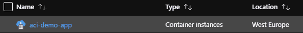

打开 Azure 门户中的 Azure 容器实例时，您将看到它是一个正在运行的实例，并且根据 Azure CLI 命令中提供的值`dns-name-label`，会附带一个 FQDN（完全限定域名），即`aci-msft-demo.westeurope.azurecontainer.io`。在浏览器中打开此 URL，查看我们已推送到容器的应用程序：

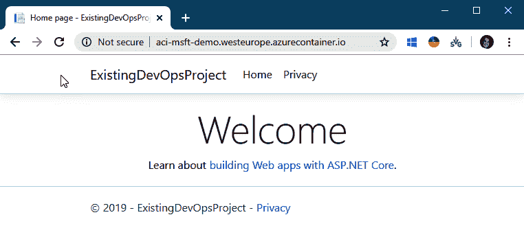

它显示的内容与在本地启动的容器相同。这是因为在两个地方，启动的是相同的容器镜像。

在这一部分，我们启动了 Azure 容器实例中的容器，但当容器出现问题时，我们如何管理正在运行的容器并重新启动它们呢？这就是 Kubernetes 的作用所在。

# Kubernetes 简介

Kubernetes 是一个用于运行容器的服务。它是由 Google 最初开发的集群编排技术，现在是一个开源平台，用于自动化应用容器在主机集群上的部署、扩展和操作，从而提供以容器为中心的基础设施。

# Kubernetes 的功能

如前所述，容器为您提供了一个很好的打包应用程序的方式。在运行应用程序时，您需要确保应用程序继续运行，这正是 Kubernetes 的核心功能之一：

+   **服务发现与负载均衡**：容器的暴露方式在 Kubernetes 中进行控制，此外，它还能够在编排过程中平衡流量。

+   **存储编排**：能够将不同类型的存储提供商挂载到平台上。

+   **发布与回滚**：Kubernetes 可以自动为指定的部署创建和重启容器。

+   **自愈**：Kubernetes 可以在容器失败时进行自愈。

+   **密钥和配置管理**：Kubernetes 内建功能来管理机密信息，如令牌、密码和密钥。

为了提供这些功能，Kubernetes 由多个组件组成。

# Kubernetes 核心组件和服务

Kubernetes 由一些核心组件组成，这些组件共同工作，提供一个出色且稳定的产品来运行和管理容器。接下来的几个小节将逐一介绍这些组件。

# 主节点

Kubernetes 中一个重要的组件是主节点。主节点负责管理集群，它包含所有 Kubernetes 核心组件，以便管理集群：

+   `kube-apiserver`：一个用于暴露 Kubernetes API 的组件。该 API 被 Kubernetes 的管理工具使用，例如 `kubectl` 和 Kubernetes 仪表盘。

+   `etcd`：用于保持 Kubernetes 集群的状态。

+   `kube-scheduler`：一个组件，用于选择运行 Pods 的节点。

+   `kube-controller-manager`：控制器管理器监督多个较小的控制器，执行诸如复制 Pods 和管理节点操作等任务。

通过使用这些组件，主节点可以保持集群的期望状态。需要知道的是，当你与 Kubernetes 交互时，你实际上是在与主节点进行通信。主节点随后会与集群内的其他组件进行通信。

# 常规节点

这些节点是运行容器的节点。它们可以是虚拟机，甚至是物理机器。在这些机器上，安装了所谓的 `kubelet`。`kubelet` 是一个代理，用于在节点内运行 Pods/容器。

正如你在前面的章节中可能已经注意到的，Kubernetes 内部还有其他核心服务，我们接下来将讨论这些服务。

# Pod

在 Kubernetes 中，Pods 用于运行应用程序。在 Pods 内部，指定了运行应用程序所需的资源。Kubernetes 中的调度器（`kube-scheduler`）会根据需求和与集群关联的节点来检查在哪里运行应用程序。

Pod 本身有一个有限的生命周期，在部署新版本时会被删除，或者例如当节点失败时，Pod 可以被同一节点或其他节点上的 Pod 替代。

# 服务

该服务有时也被称为负载均衡器，用于提供 Pods 的逻辑分组并为它们提供连接性（即连接方式）。

三个主要服务如下：

+   **集群 IP**：为一个 Pod 集群添加一个内部 IP 地址。

+   **节点端口**：将端口映射到底层节点目录，以便通过节点的 IP 地址连接到应用程序/Pod。

+   **负载均衡器**：此服务添加一个负载均衡器资源，并在负载均衡器上配置一个外部 IP 地址。在外部，负载均衡器会根据在负载均衡器中配置的规则将流量路由到特定节点，并在内部将流量路由到正确的 Pod。

通过这些服务，Pods 的内部和外部连接被安排好了。服务和 Pods 都在部署中指定。

# 部署

部署描述了应用程序的期望状态。它描述了副本的数量，还包括更新策略。Kubernetes 会跟踪 Pod 的健康状况，并在需要时移除或添加 Pod，以符合部署中描述的期望状态。

这些部署在 YAML 文件中指定。例如，在 Kubernetes 中运行容器时，必须指定副本集。副本集确保在任何给定时间都有指定数量的 Pod 副本在运行。

# Kubernetes 操作

当你刚接触容器，尤其是 Kubernetes 时，可能很难立刻弄明白。不过，为了帮助你理解这个概念，请看以下图示：

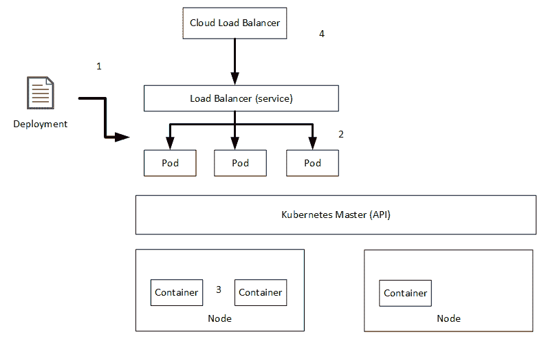

容器部署到 Kubernetes 集群中是在所谓的部署文件 (**1**) 中定义的。在这些部署文件中，描述了应用程序的期望状态。这个期望状态被描述为一个 YAML 文件。

在这个例子中，期望状态是一个负载均衡器服务和三个 Pod (**2**)。这些 Pod 被 Kubernetes API 在运行容器的节点上划分 (**3**)。在部署文件中定义的服务确保流量被路由到特定的 Pod。可以通过更新部署来更改部署。

调度程序还可以在配置了自动扩展应用程序的情况下更改部署。例如，在这种情况下，可能会向集群中添加第四个 Pod。在服务中，也可以有一个外部负载均衡器，将流量路由到 Kubernetes 的内部负载均衡器 (**4**)。

# Azure Kubernetes 服务

**Azure Kubernetes 服务**，或称 **AKS**，是 Microsoft 实现的 Kubernetes。设置一个常规的 Kubernetes 集群需要很多工作，但使用 AKS 后，它变得更加简单。这是因为 Kubernetes 是一个托管平台，几乎所有的操作任务都由平台本身处理。

AKS 的一些关键功能如下：

+   Azure 管理关键任务，如健康监控和维护，包括 Kubernetes 版本升级和修补。

+   Azure 执行简单的集群扩展。

+   Kubernetes 的主节点是完全托管的。

+   主节点是免费的，你只需为运行中的代理节点付费。

通过使用 AKS，Kubernetes 集群可以在几分钟内投入使用。此外，重点将放在应用程序上，因为主节点是完全托管的。现在，让我们尝试使用自定义镜像运行一个 Kubernetes 集群。

# Kubernetes 实战

在本章的前几节中，我们创建了一个容器并将其部署到 Azure 容器实例中。现在让我们将该容器部署到 Kubernetes 集群中。

创建集群可以通过 Azure CLI 或 ARM 模板完成。为了方便演示，本示例使用 Azure CLI。

首先，需要创建一个新的资源组来托管 Azure Kubernetes 集群：

```
az group create --name mpn-rg-kubernetes --location westeurope

```

现在，我们可以创建我们的 Kubernetes 集群。

# 创建 Kubernetes 集群

创建资源组后，可以向该组添加新的 Kubernetes 集群：

```
az aks create --resource-group mpn-rg-kubernetes --name mykubernetescluster --node-count 1 --enable-addons monitoring --generate-ssh-keys
```

此命令将创建一个名为 `mykubernetescluster` 的新 Kubernetes 集群，并且只有一个节点。这意味着在 Azure 门户中将创建一个虚拟机，配置为 Kubernetes 集群的节点。此外，集群上将启用监控附加组件。

创建该集群将需要几分钟时间。在 Azure 中，将在指定的资源组中创建 `mykubernetescluster` 服务。同时，Azure 平台本身还会创建另一个资源组。

# Kubernetes 基础设施

在此资源组中，创建了运行集群所需的所有虚拟化基础设施。这也意味着未来可以根据应用程序的需求向该资源组添加新组件：

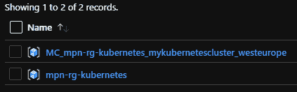

在创建的资源组中，您将找到运行集群所需的所有资源：

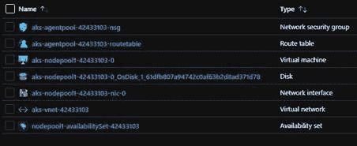

现在，Kubernetes 基础设施已启动并运行，可以开始资源的管理和部署。

# 管理 Kubernetes

要管理 Kubernetes，使用 `kubectl` 命令行工具并在本地安装（或在 Azure 云控制台中使用）。这是一个命令行界面工具，将与 Kubernetes API 通信。让我们看看如何使用这个命令行工具与 Kubernetes 配合工作：

1.  如果您尚未安装 Azure CLI，请运行以下命令在您的机器上安装 Azure CLI：

```
az aks install-cli
```

1.  要连接到集群，需要检索凭据并将其保存到本地系统。这可以通过使用 `az aks get-credentials` 命令并指定资源组和集群名称来完成：

```
az aks get-credentials --resource-group mpn-rg-kubernetes --name mykubernetescluster
```

1.  配置好所有前提条件后，许多基本功能可以针对 Kubernetes 集群运行。例如，可以参考以下两个命令：

+   +   检索集群中的节点：

```
kubectl get nodes
```

+   +   获取集群中的 Pod：

```
kubectl get pods
```

1.  除了前面的命令，您还可以尝试以下 Azure CLI 命令来打开 Kubernetes 仪表板。此仪表板是建立在 Kubernetes API 之上的管理界面，可以与 `kubectl` 命令行一起使用：

```
az aks browse --resource-group mpn-rg-kubernetes --name mykubernetescluster
```

仪表板显示在以下截图中：

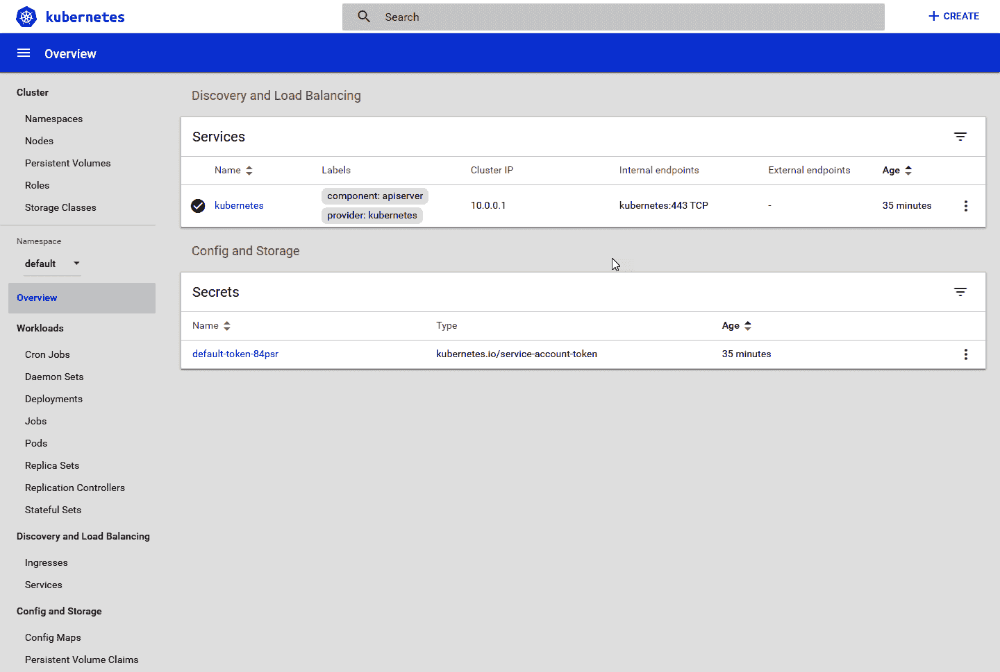

需要创建一个部署文件才能在集群中运行容器。现在我们来看看如何做这件事。

# 部署容器镜像

我们将创建一个部署文件并将其部署到 Kubernetes。为此，请执行以下步骤：

1.  在你喜欢的文本编辑器中创建一个新文件，并命名为`deploy.yaml`。将以下信息添加到`deploy.yaml`文件中：

```
apiVersion: apps/v1
kind: Deployment
metadata:
  name: kubernetes-deployment
  labels:
    app: customapplication
spec:
  replicas: 3
  selector:
    matchLabels:
      app: customapplication
  template:
    metadata:
      labels:
        app: customapplication
    spec:
      containers:
      - name: azuredevops
        image: msftazuredevops.azurecr.io/azuredevops:586
        ports:
        - containerPort: 80
```

在这个示例中，指定了以下内容：

+   +   部署将使用`kubernetes-deployment`作为名称创建（`metadata.name`）。

    +   部署将创建指定容器的三个副本（`spec.replicas`）。

    +   选择器结合标签标签，用于指定该部署文件将在 Kubernetes 中管理哪些组件。

    +   部署文件将为`msftazuredevops.azurecr.io/azuredevops:586`镜像文件创建一个容器。

1.  要将此文件部署到 Kubernetes，我们将再次使用`kubectl`命令行并使用`apply`命令：

```
kubectl apply -f deploy.yaml
```

`-f`参数用于指定使用本地路径作为部署文件的引用。执行命令后，你可以打开 Kubernetes 仪表盘查看状态，甚至可能观察到错误。

可能会遇到一个错误，提示从你的位置拉取镜像失败。这可能是一个安全问题。在后台，AKS 使用一个服务主体。你在创建新的 Kubernetes 集群时应该也会看到这个问题。确保为该服务主体授予 Azure 注册表的访问权限。

1.  在执行成功后，尝试使用`get pods`命令查看系统中是否有三个 pod。如果一切顺利，Kubernetes 中应该运行着三个 pod，但应用程序仍然无法对外部访问。

为了使其可用，我们需要向部署文件中添加一个服务。

如果你想将其添加到同一个文件中，在不同的部署之间添加一行`---`字符。这在你为部署定义单独文件时不是必需的。

在`deploy.yaml`文件中，添加以下部分：

```
---
apiVersion: v1
kind: Service
metadata:
    name: customapplication-service
spec:
    type: LoadBalancer
    ports:
    - port: 80
    selector:
        app: customapplication
```

此 YAML 部分创建一个负载均衡器，并将其附加到指定的选择器（`spec.selector.app`），意味着它将用于我们之前指定的 pod。

在后台，Kubernetes 将创建一个 Azure 负载均衡器和一个公共 IP，以便与 pod 连接。

1.  要获取服务的外部 IP 地址，请使用以下命令，直到显示外部 IP 地址：

```
kubectl get service
```

这将返回所有服务及其外部 IP 地址（如果存在）。还可以快速查看 Kubernetes 的附加资源组，看看哪些 Azure 资源已被创建。

做得好！在这一部分，你学会了如何创建一个 Kubernetes 集群，并通过`kubectl`和部署文件在其上部署容器镜像。在下一部分，我们将继续学习如何升级这些容器。

# 升级容器

在 Kubernetes 中，应用程序更新非常简便。为此，Kubernetes 使用滚动更新，这意味着在替换容器之前，流量会首先被排空。在应用程序升级过程中，Kubernetes 会部署一个额外的 Pod 并通过一些指定的探针进行检测。

探针是一种定期对 Pod 执行的诊断操作，用来检查其状态。在升级或创建 Pod 时，Kubernetes 会启动额外的 Pod，并确保它通过存活和就绪探针。

如果新创建的 Pod 成功通过了两个探针的检查，那么对旧 Pod 的流量将被终止，流量将转向新 Pod。为了终止旧 Pod 的流量，Kubernetes 使用一个终止宽限期。在这个期间，连接到负载均衡器的连接会停止，活动连接将被成功处理，新的流量将被路由到一个正在运行的 Pod。默认的宽限期是 30 秒，在此期间，Pod 将处于终止状态，所有流向该 Pod 的旧流量将被重定向到其他 Pods。

这个过程会持续进行，直到所有 Pods 都被替换为新版本。这一切都是 Azure Kubernetes 中的默认行为。通过调整部署文件并使用与之前相同的命令应用部署，便可触发一次部署：

```
Kubectl apply -f [file]
```

默认情况下，`httpGet` 探针会添加到正在暴露的 Pods 中，但也可以通过向部署中添加就绪探针或存活探针来进行自定义：

```
readinessProbe:
          httpGet:
             path: /
             port: 80
             initialDelaySeconds: 5
             periodSeconds: 5
             successThreshold: 1
```

此就绪探针对 Pod 执行一个 `httpGet` 请求，并具有以下选项：

+   `path`：它应该为 `httpGet` 请求调用的路径。

+   `port`：调用时应使用的端口号。这个端口号也在我们的部署文件中进行配置。

+   `initialDelaySeconds`：容器启动后，探针第一次运行前等待的秒数。

+   `periodSeconds`：探针等待超时之前的秒数。

+   `successThreshold`：探针所需的成功次数，最小值为 `1`。

如前所述，部署有一个默认的滚动升级场景配置。可以使用以下命令来获取滚动部署的配置：

```
kubectl describe deployment kubernetes-deployment
```

如果你有兴趣这样做，构建一个新版本的容器并在 Kubernetes 中进行升级。在运行升级之前，确保打开仪表板，并在更新期间刷新页面，你将看到额外的 Pods 启动并且旧的 Pods 被终止。

在本节中，我们学习了如何升级容器，这将帮助你保持最新版本。接下来，在下一节中，我们将进一步探讨容器和 Kubernetes 的扩展。

# 扩展容器和 Kubernetes

随着应用程序需求的增长，你需要扩展应用程序。应用程序的扩展可以通过多种方式完成，不同的组件也可以进行扩展：

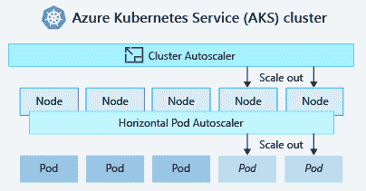

上图展示了不同的扩展应用程序或集群的方法，接下来我们将会在以下小节中讨论这些方法。

# 手动扩展 pods

可以通过更新副本数量轻松扩展 pods。尝试使用 `kubectl get pods` 命令获取您的 pods，然后使用以下命令增加副本数量：

```
kubectl scale --replicas=[number of pods] deployment/[deploymentname]
```

使用此命令，pods 的数量将根据副本的数量进行扩展或收缩。扩展或收缩将根据部署中的设置进行。

# 自动扩展 pods

Azure Kubernetes 也支持自动扩展。调度程序将根据 CPU 使用率或其他可用指标来更新 pods 的数量。

Kubernetes 使用指标服务器来实现这一功能。指标服务器从在集群中运行的节点上的 kubelet 代理的总结 API 中收集指标。

如果您使用的是 Kubernetes 1.10 或更高版本，默认情况下指标服务是可用的。如果您使用的是较旧版本，您将需要手动安装指标服务器。

自动扩展功能还需要在 Kubernetes 的部署端进行一些配置。对于部署，您需要指定正在运行的容器的请求和限制。这些值是针对特定指标指定的，例如 CPU。

在以下示例中，已为 CPU 指标指定了请求和限制。CPU 指标是以 CPU 单位来衡量的。在 Azure 中，一个单位代表一个核心。不同的平台上可能有不同的含义：

```
resources:
  requests:
     cpu: 0.25
  limits:
     cpu: 0.5
```

这部分可以添加到部署文件中的容器中，以确保当需要处理大量请求时，pods 可以自动扩展。

使用更新的部署文件进行部署，并在 Kubernetes 集群中创建一个自动扩展规则：

```
kubectl autoscale deployment [deployment name] --cpu-percent=60 --min=1 --max=10
```

该规则将使用自动扩展功能更新部署。如果所有 pods 的平均 CPU 使用率超过其请求使用量的 60%，自动扩展器将把 pods 扩展至最多 10 个实例。然后为部署定义最小 1 个实例：

创建自动扩展器后，您可以通过运行以下命令检查它：

```
kubectl get hpa
```

**HPA** 代表 **水平 Pod 自动扩展器**。

尝试在应用程序中创建一个 CPU 密集型操作，并检查执行期间的自动 pod 创建。Kubernetes 集群将注意到大量 CPU 使用情况，并会通过创建多个 pods 自动扩展集群。

一旦密集操作完成，Kubernetes 将把 pods 的数量缩减到最小值。

# 节点扩展

除了扩展 pods，Kubernetes 还可以扩展在 Kubernetes 集群中运行的节点数量。可以使用以下命令来扩展节点数量：

1.  首先，获取有关当前环境的信息，方法是请求节点数量：

```
az aks show --resource-group mpn-rg-kubernetes --name mykubernetescluster  --query agentPoolProfiles
```

1.  然后，使用此命令更新 `nodepool`。从上一个命令的结果中提取 `nodepool` 的名称：

```
az aks scale --resource-group mpn-rg-kubernetes --name mykubernetescluster --node-count 2 --nodepool-name nodepool1
```

扩展节点数可以大幅提高性能。这也会使集群变得更昂贵。通过缩减集群节点数，可以降低成本，并且只使用应用程序实际需要的资源。为了跟踪这一点，节点还可以自动扩展。

# 自动扩展节点

除了手动扩展节点外，节点还可以通过更新 Kubernetes 集群自动扩展。这可以通过使用 `az aks update` 命令来完成。使用此命令，你可以设置最小和最大节点数量。然后，自动扩展器会确保在需要时创建节点：

```
az aks update --resource-group mmpn-rg-kubernetes --name mykubernetescluster   --update-cluster-autoscaler --min-count 1 --max-count 5
```

Azure Kubernetes 还可以通过 Azure Container Instances 实现扩展。要使用此选项，在创建 AKS 集群时需要应用特定配置。主要是因为 Azure Container Instances 需要在虚拟网络中指定一个子网。

在本节中，我们学习了如何扩展容器和集群，以大幅提升性能。接下来是从 Azure DevOps 进行部署，以便实现持续部署。

# 使用 Azure DevOps 部署到 Kubernetes

我们已经看到了许多通过命令行部署和配置 Kubernetes 集群的选项。然而，在使用 DevOps 时，变化需要以持续的方式进行应用。

为此，Azure DevOps 中有 Kubernetes 清单任务，包含许多管理 Kubernetes 集群的功能：

```
task: KubernetesManifest@0
  inputs:
  action: 'deploy'
  kubernetesServiceConnection: '[service connection name]'
  manifests: '[path to your deployment file]'
  containers: 'msftazuredevops.azurecr.io/azuredevops:$(Build.BuildID)'
```

在前面的示例中，配置了以下内容：

+   `action`：我们希望执行的操作类型。在此示例中，使用 `deploy` 操作，因为我们想要部署/应用一个部署文件。

+   `kubernetesServiceConnection`：与 Kubernetes 集群的服务连接。

+   `manifests`：清单文件的路径。由于我们使用的是 `deploy` 动作，因此这应该是指向部署文件的引用。

+   `containers`：一个特殊字段，你可以在这里覆盖要部署的容器的版本。通过指定上述内容，每个镜像都在部署清单中指定了 `msftazuredevops.azurecr.io` 引用，并且 `azuredevops` 仓库会被替换为此字段中配置的新值。

在 Azure DevOps 管道中使用 Kubernetes 目标环境的另一个优点是能够看到在 Azure DevOps 中运行的环境。这将显示集群中正在运行的 pods 数量。

尝试使用以下阶段配置进行构建，该配置将把部署文件发布到 Azure DevOps 的工件位置：

```
stages:
  - stage : Build
    displayName : Build
    jobs:
     - job:
       pool:
           vmImage: 'ubuntu-latest'
       continueOnError: false
       steps:
       - task: Docker@2
         inputs:
           containerRegistry: '[Container Registry service connection]'
           repository: 'azuredevops'
           command: 'buildAndPush'
           Dockerfile: '**/Dockerfile'
           buildContext: '$(System.DefaultWorkingDirectory)/[folder path
 for docker]'
       - task: CopyFiles@2
         inputs:
           SourceFolder: '$(system.defaultworkingdirectory)/[path to the
 deployment manifest files]'
           Contents: '*'
           TargetFolder: '$(build.artifactstagingdirectory)'
           flattenFolders: true
       - task: PublishBuildArtifacts@1
         inputs:
           PathtoPublish: '$(Build.ArtifactStagingDirectory)'
           ArtifactName: 'drop'
           publishLocation: 'Container'
```

在构建阶段旁边，添加以下发布阶段。管道初次执行后，Azure DevOps 中将提供一个新环境。在发布创建的环境中，附加 Kubernetes 集群，以查看正在运行的 pods 信息：

```
- stage : Release
    displayName : Release
    jobs:
     - deployment: KubernetesDeploy
       displayName: Deploy Kubernetes
       pool:
         vmImage: 'ubuntu-latest'
       environment: 'Kubernetes'
       strategy:
         runOnce:
           deploy:
             steps:
             - task: DownloadPipelineArtifact@2
               displayName: 'Download pipeline artifacts'
               inputs:
                 buildType: 'current'
                 targetPath: '$(Pipeline.Workspace)'
             - task: KubernetesManifest@0
               inputs:
                 action: 'deploy'
                 kubernetesServiceConnection: '[Kubernetes service
 connection]'
                 manifests: '$(Pipeline.Workspace)[deployment manifest]’
                 containers: '[container registry]:$(Build.BuildID)'
```

在这个示例中，为多阶段管道指定了两个阶段。第一阶段将通过 Docker 任务构建容器镜像，并将其发布到容器注册表。发布镜像后，它还会发布一些构建产物，在本例中是 Kubernetes 清单。

第二阶段将部署到一个名为 Kubernetes 的特定环境。如果该环境尚未添加，它也将在 Azure DevOps 中创建。在剩余的过程中，它会检索构建阶段发布的产物，并使用 Kubernetes 清单任务来部署 Kubernetes 资源。

# 总结

在本章中，你了解了容器是什么，以及它们如何与 DevOps 相关联。DevOps 更像是一种文化，而容器则是技术上支持 DevOps 的方式。你还学习了如何通过 Dockerfile 创建容器镜像，特别是使用多阶段构建文件。最后，我们深入了解了 Kubernetes，学习了如何托管容器，并通过使用 `kubectl` 命令管理正在运行的容器。

运用本章所学的知识，你现在能够将应用程序部署到 Kubernetes，并确保它随着接收的请求数量进行扩展。

在下一章中，你将学习如何通过使用 Azure DevOps 来促进 DevOps 流程。你将了解哪些方法适合你的组织和团队，哪些不适合，并学习如何通过 Azure DevOps 实现这些结构和方法。

# 问题

在本章结束时，以下是一些问题，帮助你测试自己对本章内容的理解。你可以在附录的*评估*部分找到答案：

1.  容器对 DevOps 的好处有哪些？

1.  判断对错：特定容器可以托管在不同的平台上（Azure/AWS）。

1.  是否可以为现有应用程序添加容器支持？

1.  `RUN` 命令在 Dockerfile 中的作用是什么？

1.  Kubernetes 可以在不同的组件上进行扩展。这些组件有哪些？

# 进一步阅读

+   安装 Azure CLI 的信息：[`docs.microsoft.com/en-us/cli/azure/install-azure-cli?view=azure-cli-latest`](https://docs.microsoft.com/en-us/cli/azure/install-azure-cli?view=azure-cli-latest)

+   安装 Docker Desktop 的信息：[`docs.docker.com/docker-for-windows/install/`](https://docs.docker.com/docker-for-windows/install/)

+   关于 Kubernetes 的更多信息：[`kubernetes.io/docs/home/`](https://kubernetes.io/docs/home/)

+   你可以通过以下链接找到更多关于 Azure Kubernetes 的信息：[`azure.microsoft.com/en-us/topic/what-is-kubernetes/`](https://azure.microsoft.com/en-us/topic/what-is-kubernetes/)

+   关于 Azure 容器注册表的信息：[`docs.microsoft.com/en-us/azure/container-registry/container-registry-intro`](https://docs.microsoft.com/en-us/azure/container-registry/container-registry-intro)

+   有关多阶段构建的更多信息：[`docs.docker.com/develop/develop-images/multistage-build/`](https://docs.docker.com/develop/develop-images/multistage-build/)
