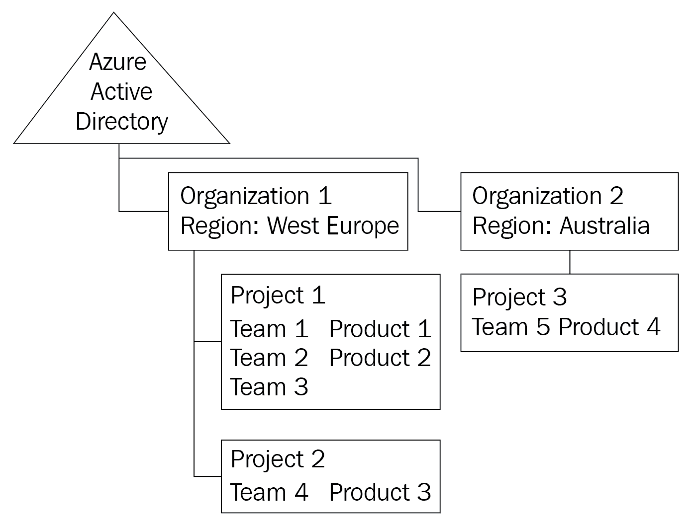
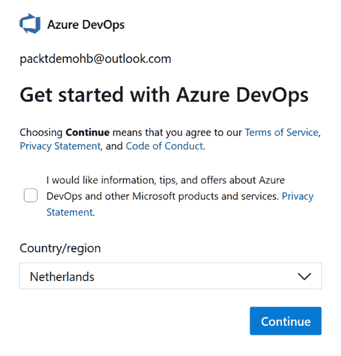
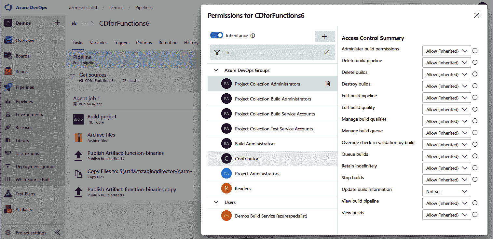
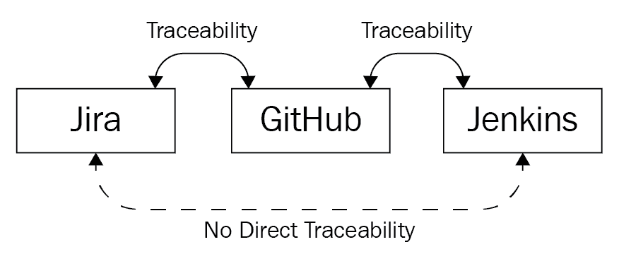
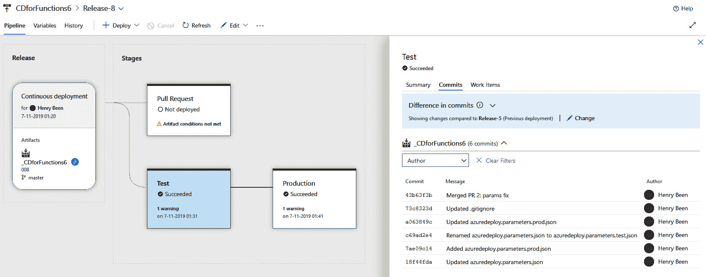
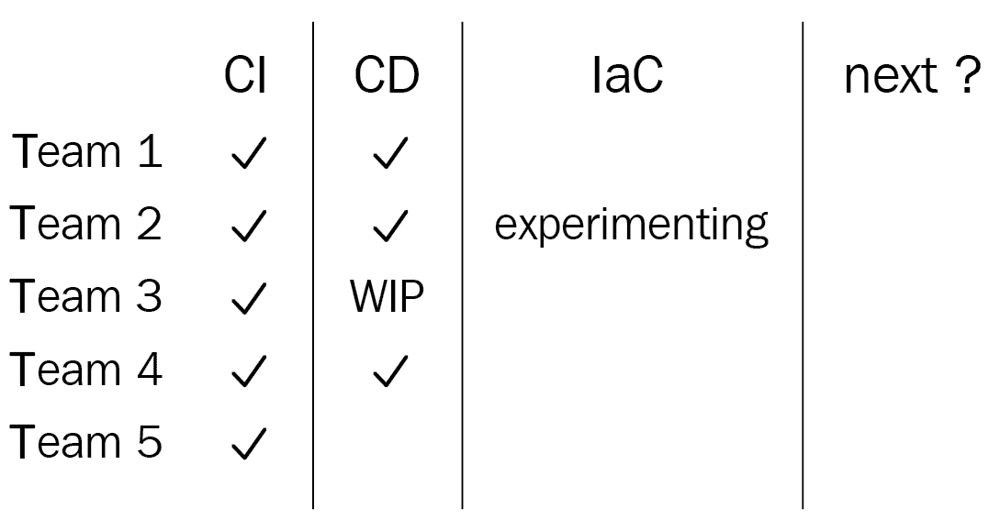

# 规划你的 Azure DevOps 组织

在之前的章节中，你学习了许多关于 DevOps 的技术和实践。在本章中，我们将退后一步，看看如何构建一个强大的 DevOps 组织，以及在此过程中需要考虑的事项。接下来，你将了解这能为你带来关于安全性和追踪性的好处。从此以后，你将学习如何整合你的工具链，并在 Azure DevOps 上进行标准化。

我们将从创建一个 Azure DevOps 组织开始，在这里你将学习如何在工具中布局你的产品和团队，并了解有哪些构造可以使用。你还将了解许可和不同方法的安全性影响。接下来，你将学习追踪性及其如何帮助创建可验证的软件开发过程。接下来是工具的整合。随着你在 DevOps 旅程中的进展，你可能会发现每个团队使用的是它们熟悉并喜欢使用的不同工具。虽然 DevOps 强调赋能人员，但某种程度的标准化可能是可取的，你将学习如何进行标准化。最后，你将了解到，可能你永远无法完全完成 DevOps 的采用。

本章将涵盖以下主题：

+   设置 Azure DevOps 组织

+   确保追踪性

+   工具整合

+   接受没有结束状态的现实

# 技术要求

要跟随本章的实际操作部分，以下任一项是必需的：

+   一个 Microsoft Live 账户，也叫个人账户

+   一个工作或学校账户

# 设置 Azure DevOps 组织

为了实践之前章节中描述的一个或多个技术和技巧，可能已经为此目的创建了一个专门的 Azure DevOps 组织，或者也许已经有一个现成的可以用来做这个的组织。然而，为公司从零开始创建组织需要更多的考虑。花时间合理规划组织的布局，可以节省很多后续时间。

本节描述了构建 Azure DevOps 所需的组件，如何使用这些组件来组织适合的安全模型，以及许可选项和成本。

# Azure DevOps 的组织方式

Azure DevOps 中的顶层构造称为组织。对于大多数公司来说，通常只需要一个组织，但也允许创建多个组织。

每个 Azure DevOps 组织都托管在特定的区域。组织的大多数数据（源代码和工作项）都保证位于该组织所在的区域，但由于服务的全球覆盖，一些信息始终存储在其他数据中心。拥有分布式组织，且团队和产品分布在不同地理位置，可能是使用多个组织的原因。例如，如果某些团队位于澳大利亚，另一些位于西欧，那么创建两个独立的组织并将所有团队托管在离他们最近的地理位置是有意义的。这将使大部分服务物理上接近他们，从而在使用 Azure DevOps 时大大减少延迟。

一个组织可以与 **Azure Active Directory**（**AAD**）相关联。如果启用此链接，只有该特定 AAD 内的用户才允许访问该组织。使用公司 AAD 并非强制性的；也可以使用 Microsoft 帐户创建一个组织。

在每个组织中，可以创建一个或多个项目。项目是一个独立的工作项、源代码库、管道定义以及所有其他 Azure DevOps 工件的容器。项目之间的共享和链接可能性是有限的。写作时，只有工作项可以跨项目相关联，其他的则不能。通过这种方式，项目可以作为强大的隔离边界，在需要时强制执行产品或团队之间的严格安全性。通常建议尽量减少项目的数量，目标是尽可能只有一个项目。

以下图表展示了 Azure DevOps 组织和项目的可能组织结构。它显示了两个组织与 Azure Active Directory 相连接，一个位于西欧，另一个位于澳大利亚。在西欧的组织中有两个项目，而在澳大利亚只有一个项目：

如前所述，建议尽量使用较少的组织和项目。但在这个例子中，澳大利亚到西欧的延迟是将其拆分为两个组织的一个合理理由，以便将 Azure DevOps 托管在靠近团队的位置。在西欧将其拆分为两个项目，可能是由于第 4 个团队在处理第 3 个产品时需要较高的隔离级别。

将团队 1 到 3 和产品 1 与 2 合并为一个项目是故意为之。原因在于，在一个单独的项目中，可以定义多个产品领域和多个团队。将所有这些内容集中在一个项目中，可以方便地将工作项链接起来进行组合管理。这样，一个团队的工作项也可以与另一个团队在另一个产品上的提交或拉取请求相关联。如果功能跨多个产品或应用（组件）分布，这将非常有帮助。

为了使在单个项目中定义所有产品和所有团队成为可能，了解 Azure DevOps 安全模型及其访问控制实现方式非常重要。

# 创建 Azure DevOps 组织和项目

创建新的 Azure DevOps 组织和一个或多个项目通常是由管理员完成的任务，这些管理员稍后还将负责管理这些环境。这些组织很可能连接到 Active Directory。如果是为了私人使用或培训和学习目的创建组织，建议使用个人账户。

使用个人账户创建新组织，请执行以下操作：

1.  访问[`dev.azure.com`](https://dev.azure.com)。

1.  选择“开始免费”以开始创建新的 Azure DevOps 组织。

1.  在弹出的登录对话框中，使用个人账户登录。

1.  登录后，选择正确的居住国家，并通过以下对话框选择是否接收提示和其他服务更新：

1.  按下“继续”按钮以创建新组织。

创建组织后，将自动启动向导以创建第一个项目。要创建项目，请执行以下操作：

1.  提供项目名称。

1.  选择将项目设为公开或私有。私有项目是默认设置，旨在组织内部创建软件并不允许匿名访问。公开项目则用于开源开发。

创建新组织和新项目后，可以使用管理界面对这些选项进行更改。

请记住，重命名组织或项目将更改 URL，因此所有现有的集成和链接可能会中断。

甚至可以稍后更改组织的位置。这需要提交请求，并不像更改其他设置那样简单。本章末尾包含了如何执行此操作的文档链接。

一旦组织和项目可用，就可以开始设置安全性。

# Azure DevOps 安全模型

在 Azure DevOps 中，可以将授权分配给单个用户或安全组。安全组可以是现有 AAD 组的逻辑封装，也可以在 Azure DevOps 中定义。一般来说，建议尽可能将授权分配给组，限制单个用户的授权。

要配置用户或安全组的授权，有两种互补的方式可供选择：

+   组织级和项目级授权

+   对象级授权

在使用本地产品 Azure DevOps Server 时，还可以使用服务器级安全组和设置。

在 Azure DevOps 服务中，组织被称为项目集合，项目被称为团队项目。有时，这些名称也会在 Azure DevOps 中出现。

**组织级和项目级授权**：为了允许用户在某一类型的所有对象上执行特定操作，可以设置组织级或项目级授权。例如，查看内置组 `Project Collection Build Administrators`，以及 ` [ProjectName]\Build Administrators`，这些组默认有权限查看、管理和编辑构建定义和构建资源。可以在组织和项目级别设置的权限会自动应用于组织或项目中的所有单个资源。

**对象级授权**：在 Azure DevOps 的大多数对象上，可以为用户或组分配个别权限。这些权限通过在对象本身上设置**访问控制列表**（**ACL**）来配置。以下示例展示了一个经典的构建定义：

对于每个组、每个操作，可以配置“允许”（Allow）、“拒绝”（Deny）、“未设置”（Not set）或继承（inherited）。当一个操作配置为“拒绝”（Deny）时，访问永远不被允许，即使用户是某个组的成员，而该组的授权被指定为“允许”（Allow）。换句话说，当有两个冲突的授权（允许和拒绝）时，“拒绝”优先于“允许”。“未设置”（Not set）应被解释为一种隐式拒绝，它不具有优先权。换句话说，当有两个冲突的授权（未设置和允许）时，用户将被允许访问。

在 Azure DevOps 中，一些工件是层级结构的一部分。例如，管道可以位于文件夹中。每当启用继承时，来自更高层级的权限将传播到该工件。这意味着，当用户有权访问一个管道文件夹时，所有的权限将传播到所有底层文件夹和管道，前提是没有更具体的授权设置。

虽然安全模型决定了用户的授权，但用户的操作也受到其分配的访问级别的限制，而访问级别是基于其许可证的。

# Azure DevOps 许可证

创建 Azure DevOps 组织的另一个方面是管理许可证。在 Azure DevOps 中，每个用户在登录产品之前需要分配一个访问级别。定义了三种访问级别：

+   **利益相关者**：利益相关者是免费的用户，可以登录产品，但对其功能的访问权限有限。利益相关者可以管理工作项、管理管道和查看仪表板。他们无法访问其他任何产品区域，因此此许可证级别仅适用于非开发角色。

+   **基础版**：基础版用户拥有付费许可证，允许他们访问产品的所有部分，但不包括测试管理和高级测试执行功能。在撰写本文时，基础版用户许可证的费用为每月 5.06 欧元。

+   **基础版和测试计划**：使用基础版和测试计划许可证选项的用户可以访问 Azure DevOps 的所有部分。他们拥有与基础用户相同的访问权限，同时还提供了测试管理工具以及用户验收测试、测试执行和测试结果报告工具。截至目前，基础版和测试计划许可证选项的费用是每月 43.86 欧元。

每个组织的前五个基础许可证是免费的。这意味着，用户可以在不产生任何费用的情况下尝试和学习该产品。此外，Visual Studio 订阅者还可以获得免费的许可证。专业版订阅者可获得免费的基础许可证，企业版订阅者则可获得免费的基础版和测试计划许可证。

授权可以随时分配和重新分配，因此对于一个有许多加入和离开的公司或团队，在任何时刻都不需要购买比实际活跃人员更多的授权。

授权费用并不是使用 Azure DevOps 时唯一的费用；了解按使用量计费的费用同样非常重要。

# 基于消费的费用

授权使用户能够访问产品，之后他们可以以固定费用使用产品中的所有服务，除了以下两项：

+   Azure Pipelines 并行执行

+   Azure Artifacts 存储

**并行执行**：默认情况下，每个 Azure DevOps 组织都提供一个由 Microsoft 托管的并行执行作业。这意味着，虽然可以定义任意数量的流水线，但同一时间只能有一个作业在执行。当然，这个数量是可以增加的，但需要额外购买更多的 Microsoft 托管的并行执行作业，每个作业当前的费用是每月 33.74 欧元。

作为一种替代方案，还可以购买自托管作业。对于这些作业，执行代理不是由 Microsoft 提供，而是由组织自行提供。这提供了完全控制硬件的机会（和责任）。目前，自托管流水线的费用为每月 12.65 欧元。

**工件存储**：在使用 Azure Artifact 提要时，前 2 GB 的存储是免费的。额外使用的存储将按每月 1.69 欧元的费用收取。

一旦团队中的更多用户拥有 Azure DevOps 的许可证并在其中进行工作，就可以用来提高软件开发的可追溯性。

# 确保可追溯性

Azure DevOps 相对于本书中讨论的其他一些工具的一个优势是，它是一个完全集成的工具套件，每个工具支持特定的 DevOps 流程。这种端到端的集成允许从工作板上描述的任务到相关二进制文件部署到环境中的详细且长期的可追溯性。

当使用一组仅支持 DevOps 流程一部分的其他工具时，通常可以将它们整合在一起，当然，这将带来一定的可追溯性。例如，在使用 Jira 和 GitHub 时，可以将 GitHub 中的提交、拉取请求和其他更改与 Jira 中描述的工作相关联。当在 Jenkins 中拾取合并的更改来构建和部署产品时，Jenkins 也会有从 Jenkins 到 GitHub 的可追溯性。然而，无法直接看到哪个工作项与哪个 Jenkins 部署完成。

这样做的缺点是，使用 Jira 工具的产品负责人无法看到一个已完成的用户故事是否已经与发布关联。他们需要访问多个工具来找到这个问题的答案：在 GitHub 中，他们需要找到所有与故事相关的提交，然后查看这些提交是否已经通过 Jenkins 发布：

当使用 Azure Boards、Repos 和 Pipelines 时，情况是不同的。在使用所有 Azure DevOps 服务时，您可以实现从故事到部署的可追溯性，反之亦然。以下是一个示例，突出显示如何查看哪些提交第一次被部署到具有特定部署的环境中：

拥有这种端到端的可追溯性能够迅速回答一系列问题，包括以下问题：

+   这个工作项的工作是否已经开始？（分支和拉取请求可以与工作项关联。）

+   这项工作已经是我们夜间构建的一部分了吗？（提交和构建管道可以与工作项关联。）

+   这个 bug 已经修复了吗？解决方案是否已经可以在环二的客户中使用？（发布和环境展示了哪些新的提交和工作项是最新部署的一部分。）

在讨论可追溯性时，尤其需要强化的一个观点是，它不是为了归咎。可追溯性并不是用来找出谁犯了哪个错误，而是用来了解事物的状态以及对象之间的关系。一旦可追溯性成为归咎的基础，工程师很快会找到隐藏自己工作的办法，这将导致更多错误和更少的可见性，只会使问题变得更糟。

在可追溯性优势显而易见的情况下，让我们探索一下工具整合如何帮助实现这些优势。

# 整合工具

市场上可以观察到的一个趋势是，越来越多的可追溯性和 DevOps 产品将其产品扩展到不仅仅是源代码控制、管道或仅仅是部署的领域。比如 GitHub 和 GitLab，它们正在添加新的服务。更多集成的**应用生命周期管理**（**ALM**）或 DevOps 套件出现，而 Azure DevOps 已经提供了这些服务多年。

然而，许多公司并未配备这些集成套件。团队在不同的生态系统中运营，导致不同的工具选择。或者也许团队仅仅有不同的偏好，或者在不同时间点开始采用 DevOps 实践，选择了其他工具。无论原因如何，许多公司都有多个工具用于相同的工作。

不幸的是，使用不连接的工具或为相同任务使用多个工具会带来许多缺点：

+   如果团队使用不同的工具，团队之间的协作将受到阻碍。不管开发者的个人偏好如何，当组织的一半使用 Jenkins 而另一半使用 Azure Pipelines 时，这可能会成为生产力的障碍。进一步来说，当一个团队使用不同的工具时，切换团队或帮助其他团队将受到严重影响。

+   当工具更多时，成本也更多。即使所有工具都是开源且免费的，仍然会涉及成本。这些成本可能包括例如支持合同或请求、培训，或者解决特定问题所需的时间。升级和维护也是如此。当工具更多时，总成本增加。

为了克服这些挑战，许多大型公司决定标准化使用的工具，或者完全标准化，或者至少在一定程度上进行标准化。作为一种替代或过渡解决方案，还可以通过工具之间的集成来开始整合。

# 工具标准化

为了应对这些缺点，大多数公司接受以下两种策略之一：

+   通过集中决策选择一个工具（针对每个 DevOps 领域）供整个公司使用

+   集中采用有限的工具集，团队可以从中选择要采用的工具

**完全集中化**：当完全集中化时，一个中央团队或部门代表所有人决定在组织内使用哪些 DevOps 工具。一旦做出并实施了这样的决定，这将降低成本并使工程师更容易协助其他团队。

当然，缺点是，一个单一的工具不一定是每个人的最佳选择，而对于整个组织来说，所选择的工具可能是最好的——这种标准化在某些边缘情况下可能会造成损害。

**有限集中化**：为了避免这种情况，其他公司选择有限集中化。不是只选择一个工具，而是选择一组工具作为公司的标准。团队现在可以根据他们的具体需求，从两到三个工具中选择一个。这在不牺牲具有特定需求的团队生产力的同时，减少了完全去中心化的许多缺点。

采用这两种策略之一可能意味着一些现有工具将被弃用或完全停用。这可能是一个缓慢且痛苦的过程，特别是在大型组织中，通常存在冲突的利益。虽然有很多方法可以进行迁移，但也有策略可以使迁移过程变得不那么痛苦。

# 迁移策略

减少使用的 DevOps 工具数量通常意味着必须废弃一个或多个工具。这可能是困难的，因为这些工具通常用于实施治理和合规性，以满足法律和法规的要求。实际上，这意味着可以做以下两件事之一：

+   旧工具并未完全废弃，而是仅不再使用，以保持变更历史记录。

+   在废弃旧工具之前，必须将历史记录迁移到新工具中。

在选择进行迁移时，有四种方式可以选择：

+   从 Azure DevOps Server 迁移到 Azure DevOps Services

+   一次性迁移

+   同步

+   重建

Azure DevOps Server 曾被称为**Team Foundation Server**（**TFS**）。TFS 的旧版本需要升级到最新版本的 Azure DevOps Server，然后才能导入到 Azure DevOps Services 中。导入服务始终支持最新的两个版本的 Azure DevOps Server。

以下各节详细介绍了这三项内容。

# 从 Azure DevOps Server 迁移到 Azure DevOps Services

对于希望从 Azure DevOps Server 迁移到 Azure DevOps Services 的组织，有一个高保真度的迁移服务。当前存在于本地 Azure DevOps Server 环境中的每个项目集合，都可以使用 Azure DevOps Server 导入服务迁移到 Azure DevOps 组织。所有当前存在于本地项目集合中的资产都将迁移到 Azure DevOps：工作项、源代码控制库以及构建和发布定义。

项目集合的迁移包含以下高层步骤：

1.  验证项目集合是否准备好迁移：此步骤不会进行任何更改，而只是检查迁移的所有前提条件是否已满足。

1.  准备迁移：在此步骤中，将生成一个描述如何进行迁移的 JSON 文件。还可以提供第二个文件，用于将本地身份与 AAD 身份关联，以确保迁移后所有历史记录仍然正确地与更改者关联。

1.  进行迁移的演练，以验证导入过程将产生预期的结果。

1.  实际迁移：在此步骤中，将把集合下线，从项目集合数据库生成 DACPAC，上传 DACPAC 和第二步的文件，并启动迁移。

1.  导入后，所有资产需要验证，并且在特定场景下，可能需要进行一些导入后的操作。

关于使用迁移服务的详细指南，其中包括检查清单和逐步操作说明，已在本章末尾提供链接。

# 大爆炸式迁移

第二种可能的策略是“大爆炸式迁移”。在某个时刻，旧工具被关闭，所有数据迁移到新工具中，新工具开始投入使用。如果有任何不符合 DevOps 精神的事情，那就是这种迁移。它具有较高的风险，且往往一旦实施无法回退。通常，这不是一个好的迁移策略。

然而，一种适合这种方法的情况是源代码管理的迁移。现在有一些工具可以实现从不同来源迁移到任何类型的托管 Git 解决方案，包括 Azure DevOps。源代码管理也有一个好处，那就是变更历史深深嵌入系统中，因此带着历史迁移往往比其他类型的数据更容易。

# 同步

另一种迁移策略是允许在一段时间内同时使用两个工具。

一种方法是使用一种工具，用于在旧工具和新工具之间进行同步。这可以是单向的，从旧到新，或者是双向的。通过这种方式，创建了一个过渡的情况，两个工具可以同时使用。每个团队可以在一定的时间窗口内选择自己的迁移时间。这避免了强制性的迁移窗口。团队也可以选择将两个工具并行使用一段时间。这使得他们可以学习新工具，同时如果遇到压力时，仍能切换回他们熟悉的工具。经过一段过渡期后，旧工具可以设置为只读，或者完全停用。这种方法通常在工作跟踪系统中效果良好。在这些系统之间，概念通常非常相似（如史诗、特性、故事和冲刺），这使得同步成为一种可行的方法。

# 重新构建

一种稍有不同的方法是要求团队在新工具中重新构建。这种方法也会创建一个并行的工作情境，但没有自动化的迁移或同步。团队必须在新工具中重新做他们的工作流程或工作方式。由于这可能需要一段时间，旧工具在团队进行这项工作时将继续使用。一个通常适合这种方法的情况是构建和/或发布管道。

无论选择哪种策略，在所有情况下，确保新工具或工具集对团队比现有工具更具优势都非常重要。这应该提升性能、可追溯性、易用性，或与其他公司工具的集成。围绕迁移的积极氛围能够显著改善迁移的结果。

作为迁移到单一工具的替代方案，可以通过工具间的集成来将现有工具整合在一起。

# 集成工具

作为替代不再使用的工具，可以将它们与首选工具集成。尤其是当已决定迁移到 Azure DevOps 时，这将是一个强有力的策略。在前面的多个章节中，每个主题下都列出了与 Azure DevOps 集成的不同工具。

在追求端到端可追溯性时，这些集成可以作为将工具紧密结合的手段。考虑以下示例。

一个组织正在使用 Azure DevOps 来管理工作项、托管 Git 仓库以及执行构建管道。由于历史原因，部署是通过 Octopus Deploy 完成的。由于完全迁移成本过高，因此选择了集成策略。通过 Azure DevOps 自动触发 Octopus Deploy，而非手动触发，达成了多个目标：

+   已实现端到端自动化。

+   发布管理现在也可以在 Azure DevOps 中完成，即使在 Azure DevOps 中的每次部署不过是触发 Octopus Deploy。

+   在 Azure DevOps 中进行发布管理，现在可以实现端到端的可追溯性。

在整合工具时，实际上涉及 DevOps 的所有事宜，你必须准备好接受一个事实，那就是你永远无法完成所有工作。

# 接受没有终极状态这一事实。

可以合理预期，在任何时刻，团队都会有一个或多个改进想要应用于他们的应用程序、工具链或工作方式。为应对这一点，建议不要总是不停地修改一切。

相反，尽量将变更实施分批进行，或分为一系列定义明确的步骤。同时，要注意事物的自然顺序。没有先建立适当的持续集成过程，是无法实施持续部署的。另外，采用基础设施即代码（Infrastructure as Code）将在应用代码已经实施持续部署过程的情况下，最大程度地发挥价值。接下来，当基础设施和配置代码已成为常规做法时，自动化治理和安全措施将发挥最佳效果。而一旦这些实践得以实现，新的改进将会出现在雷达上——未来可能需要的改进。

除了这一系列的改进外，还需要意识到并非每个团队都处于同一阶段，也并非每个团队都能以相同的速度前进，开发过程也并非总是线性的。

但这并不意味着无法跟踪和规划未来的变更，并将一个团队的经验教训应用于其他团队。追踪这些的一个过于简化的方法可以是一个表格，如下所示。

在这里，我们看到五个团队中不同 DevOps 实践或理念的采用情况。所有团队都在实践**持续集成**（**CI**）。其中一些团队正在实践**持续部署**（**CD**），而团队 3 仍在努力进行这一工作（**进行中**，**WIP**），第五个团队尚未开始。最后，团队 2 已经在尝试**基础设施即代码**（**IaC**）。最后，由于没有“结束状态”，只是时间问题，下一项实践或理念将出现，某个团队将开始进行实验：

如果像前面所展示的那样的表格，能够经常更新、评估和扩展，这有助于促进持续学习，并改善软件的创建和交付方式。学习和改进将成为标准，这将有助于提高向最终用户交付价值的效率。它还表明，采用 DevOps 是一个持续的过程，永远没有“完成”这一时刻。

它还提供了一种方式，可以看到哪些团队处于前沿，哪些团队在跟随。通过为领先的团队提供更多实验和与其他团队共享知识的空间，组织可以鼓励这些领先团队进一步提升，同时也能加速其他团队的发展。

带着关于持续学习、实验和自我推动的这一提醒，是时候结束本书了。让我们在下一部分回顾这一章的内容。

# 总结

在本章中，你学习了如何配置你的 Azure DevOps 组织，以及如何为你的产品和团队创建布局。你了解了不同配置选项的影响，并学会了如何应用这些选项。接下来，你学习了如何利用 Azure DevOps 为你的开发过程添加可追溯性。你了解了如何在故事和任务中捕捉想法和任务，以及如何将它们追溯到部署，并反向追溯。你还学会了如何在组织中整合工具，并了解了何时应停止尝试整合工具。最后，你学会了持续改进的重要性。

通过本章中学到的内容，你现在能够为你的团队、多个团队或整个组织设置和配置 Azure DevOps。你可以创建适合组织的结构，并开始使用它，无论是单个团队还是多个团队。你还能够逐步标准化你的工作方式，并将团队整合到相同的工具集上。

本书的最后一章已完成。你可以参考本书为 AZ-400 考试做准备，因为大多数主题都是相似的。然而，为了更好地备考，我建议你在其他来源中阅读更多相关内容，并尽量获得更多的实操经验。作为练习工具，本章结尾提供了一个模拟考试，帮助你为最终考试做好准备。

祝你好运！

# 问题

在我们总结之前，这里有一系列问题，帮助你测试对本章内容的理解。你可以在附录的 *评估* 部分找到答案：

1.  判断对错：用户在 Azure DevOps 中存储的所有数据都保证在一个区域内吗？

1.  按照以下顺序重新排列 Azure DevOps 的概念，使得每个下一个元素都作为下一个概念的容器：

    +   工作项

    +   组织

    +   区域

    +   项目

1.  判断对错：通常建议为组织开发的每个应用程序创建一个新项目。

1.  哪两个元素限制了用户在 Azure DevOps 中可以执行的操作？

1.  使用单一工具进行应用生命周期管理/DevOps 相较于使用一套工具的主要优势是什么？

# 进一步阅读

+   有关 Azure DevOps 项目以及何时创建多个项目的更多信息，请访问 [`docs.microsoft.com/en-us/azure/devops/organizations/projects/about-projects?view=azure-devops#when-to-add-another-project`](https://docs.microsoft.com/en-us/azure/devops/organizations/projects/about-projects?view=azure-devops%23when-to-add-another-project)。

+   有关 Azure DevOps 安全模型的更多信息，请访问 [`docs.microsoft.com/en-us/azure/devops/organizations/security`](https://docs.microsoft.com/en-us/azure/devops/organizations/security)。

+   有关 Azure DevOps 定价的最新信息，请访问 [`azure.microsoft.com/en-us/pricing/details/devops/azure-devops-services/`](https://azure.microsoft.com/en-us/pricing/details/devops/azure-devops-services/)。

+   有关 Azure DevOps Server 导入服务的更多信息，请访问 [`docs.microsoft.com/en-us/azure/devops/migrate/migration-overview?view=azure-devops&viewFallbackFrom=vsts`](https://docs.microsoft.com/en-us/azure/devops/migrate/migration-overview?view=azure-devops&viewFallbackFrom=vsts)。
