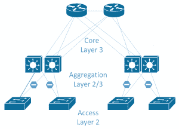

# 第二章：Ceph 的规划

本书的第一章涵盖了在部署 Ceph 集群时需要考虑的所有领域，从初步规划阶段到硬件选择。我们将讨论的主题包括以下内容：

+   什么是 Ceph，以及它是如何工作的

+   Ceph 的良好使用案例及重要的考虑因素

+   基础设施设计建议和最佳实践

+   Ceph 项目规划的思路

# 什么是 Ceph？

Ceph 是一个开源的、分布式的、可扩展的、软件定义的存储系统，可以提供块存储、对象存储和文件存储。通过使用**可控复制下的可扩展哈希**（**CRUSH**）算法，Ceph 消除了对集中式元数据的需求，并能够将负载分散到集群中的所有节点。由于 CRUSH 是一个算法，数据的位置是通过计算得出的，而不是基于表查找，并且可以扩展到数百 PB 而不会有瓶颈的风险及相关的单点故障。客户端还直接与所需的 OSD 建立连接，这也消除了任何单点故障成为瓶颈的可能性。

Ceph 提供三种主要类型的存储：通过**RADOS 块设备**（**RBD**）提供的块存储，通过 CephFS 提供的文件存储，以及通过 RADOS 网关提供的对象存储，支持 S3 和 Swift 兼容的存储。

Ceph 是一个纯粹的 SDS 解决方案，这意味着你可以在任何符合 Ceph 要求的硬件上运行它。这是存储行业的一项重大进展，因为该行业通常面临严格的厂商锁定问题。

值得注意的是，根据 CAP 定理，Ceph 偏向于一致性，并会在分区发生时不惜一切代价将保护数据作为高于可用性的优先级。

# Ceph 是如何工作的

Ceph 的核心存储层是**可靠自治分布式对象存储**（**RADOS**），正如其名称所示，它提供了一个对象存储，基于此构建了更高层的存储协议。Ceph 中的 RADOS 层由多个**对象存储守护进程**（**OSD**）组成。每个 OSD 是完全独立的，并通过对等关系形成集群。每个 OSD 通常映射到一个单独的磁盘，这与传统方法不同，后者通过 RAID 控制器将多个磁盘组合成一个设备供操作系统使用。

Ceph 集群的另一个关键组件是监视器。它们通过使用 Paxos 来负责形成集群法定人数。监视器不直接参与数据路径，因此不具备 OSD 相同的性能要求。它们主要用于通过各种集群映射提供已知的集群状态，包括成员信息。这些集群映射由 Ceph 集群组件和客户端共同使用，用于描述集群拓扑结构，并确保数据能够安全地存储在正确的位置。还有一个最终的核心组件——管理器，它负责配置和统计。由于 Ceph 旨在运行的规模，可以理解追踪集群中每个单独对象的状态会变得非常计算密集。Ceph 通过哈希底层对象名称，将对象分配到多个放置组，从而解决了这个问题。然后，使用一种叫做 CRUSH 的算法将放置组分配到 OSD。这样一来，跟踪数百万个对象的任务就转变为跟踪一个更易管理的放置组数量，通常这个数量是以千为单位来衡量的。

Librados 是一个 Ceph 库，可用于构建直接与 RADOS 集群交互的应用程序，用于存储和检索对象。

若想了解 Ceph 内部如何运作，强烈建议阅读官方的 Ceph 文档，以及 *Sage Weil* 编写的论文，他是 Ceph 的创建者和主要架构师。

# Ceph 使用案例

在深入了解具体的使用案例之前，让我们先看看以下几个关键点，这些点应该在考虑部署 Ceph 集群之前理解和考虑：

+   **Ceph 不是存储阵列**：Ceph 不应与传统的扩展型存储阵列进行比较；它在本质上是不同的，试图用现有的知识、基础设施和预期将 Ceph 强行纳入这一角色会导致失望。Ceph 是一种软件定义的存储，内部数据流动通过 TCP/IP 网络操作，相比传统存储阵列背后简单的 SAS 电缆，它引入了更多的技术层次和复杂性。Ceph 项目正在继续扩展其在当前由传统存储阵列主导的领域中的应用，支持 iSCSI 和 NFS，每一次发布，Ceph 都更接近实现更好的互操作性。

+   **性能**：由于 Ceph 采用非集中式的方式，它能提供比扩展型存储阵列更强大的性能，后者通常必须通过一对控制器头来传输所有 I/O。尽管技术发展意味着更快的 CPU 和更快的网络速度不断出现，但仅依赖一对存储控制器，性能仍然有限。随着闪存技术的最新进展，加上 NVMe 等新接口的出现，带来了前所未有的性能水平，Ceph 的扩展性使得每增加一个 OSD 节点，CPU 和网络资源会线性增加。然而，我们也应该考虑 Ceph 在性能方面不适合的地方。主要是针对那些需要极低延迟的应用场景。使 Ceph 成为扩展型解决方案的原因，也意味着低延迟性能会受到影响。在软件中执行大部分处理以及额外的网络跳数所带来的开销，意味着延迟通常是传统存储阵列的两倍，至少是本地存储的十倍。因此，应该慎重选择最适合特定性能需求的技术。尽管如此，一个设计良好并经过调优的 Ceph 集群应该能够满足除了最极端的情况之外的性能需求。需要记住的是，任何采用广泛条带化的存储系统——数据被分布到系统中的所有磁盘——速度通常会受到集群中最慢组件的限制。因此，确保集群中的每个节点具有相似的性能是非常重要的。随着 NVMe 和 NVDIMMS 的新发展，存储访问的延迟仍在不断降低。

Ceph 的工作正在进行中，旨在消除瓶颈，以利用这些新技术，但应考虑如何平衡延迟需求与分布式存储系统的优势之间的关系。

+   **可靠性**：Ceph 设计为通过其组件的扩展性质提供一个高度容错的存储系统。虽然单个组件的高可用性较差，但当它们聚集在一起时，任何组件的故障都不应导致无法服务客户端请求。事实上，随着 Ceph 集群的增长，个别组件的故障应当被视为正常现象，并成为正常操作条件的一部分。然而，Ceph 提供一个强大集群的能力并不意味着可以在硬件或设计选择上妥协，若如此做，很可能会导致失败。Ceph 假设硬件能够满足几个要求，稍后在本章中将讨论这些要求。与 RAID 不同，RAID 中，使用更大容量的硬盘时，磁盘重建的时间可能需要几周，而 Ceph 通常能在数小时内恢复单个磁盘故障。随着大容量硬盘的日益普及，Ceph 在可靠性和降级性能方面相比传统存储阵列具有许多优势。

+   **使用普通硬件**：Ceph 设计为运行在普通硬件上，这使我们能够设计和构建一个集群，而无需支付传统一线存储和服务器供应商要求的高昂费用。这既是一个优势，也是一个挑战。能够选择自己的硬件使你能够精确匹配 Ceph 组件的需求。然而，品牌硬件所提供的一个优势是兼容性测试。我们并不陌生于发现奇怪的固件问题，这些问题可能导致非常混乱的症状。应考虑你的 IT 团队是否有足够的时间和技能来应对未经测试的硬件解决方案可能带来的任何隐晦问题。使用普通硬件还可以防止传统的叉车升级模式，在这种模式下，升级单个组件往往需要完全替换整个存储阵列。使用 Ceph，你可以以非常细粒度的方式更换单个组件，并且通过自动数据平衡，避免了长时间的数据迁移过程。

# 具体使用案例

现在我们将讨论一些 Ceph 的常见使用案例，并探讨其中的一些概念。

# 基于 OpenStack 或 KVM 的虚拟化

Ceph 是为 OpenStack 环境提供存储的完美选择；事实上，Ceph 目前是最受欢迎的选择。2018 年的 OpenStack 调查显示，61% 的受访 OpenStack 用户正在使用 Ceph 为 OpenStack 提供存储。OpenStack Cinder 块驱动程序使用 Ceph RBD 来为虚拟机（VM）提供块存储，而 OpenStack Manila，这款**文件即服务**（**FaaS**）软件，与 CephFS 集成得很好。以下是 Ceph 成为 OpenStack 优秀解决方案的一些原因：

+   两者都是开源项目，并且都有商业版本

+   两者在大规模部署中都有成熟的应用记录

+   Ceph 可以提供块存储、CephFS 和对象存储，OpenStack 都可以使用这些服务。

+   通过精心规划，完全有可能部署一个超融合集群

如果你不使用 OpenStack，或没有计划使用，Ceph 也与 KVM 虚拟化系统非常兼容。

# 大容量块存储

由于能够设计和构建具有成本效益的 OSD 节点，Ceph 使你能够构建大型、高性能的存储集群，相比其他选择，这种方案成本效益更高。Luminous 版本带来了对块和文件工作负载的 Erasure 编码支持，这使得 Ceph 在这一任务中的吸引力进一步增加。

# 对象存储

由于核心的 RADOS 层本身就是一个对象存储，Ceph 在通过 S3 或 Swift 协议提供对象存储方面表现出色。Ceph 目前在兼容 S3 API 方面拥有最好的记录之一。如果成本、延迟或数据安全是使用公共云对象存储解决方案的顾虑，自己运行 Ceph 集群来提供对象存储可能是一个理想的用例。

# 用于自定义应用的对象存储

使用 librados，你可以让自家应用直接与底层的 Ceph RADOS 层进行交互。这可以极大简化应用的开发，并为你提供对高性能可靠存储的直接访问。librados 的一些更高级功能，例如将多个操作打包为一个原子操作，在现有存储解决方案中也很难实现。

# 分布式文件系统 – web 群集

一组 web 服务器需要访问相同的文件，以便无论客户端连接到哪一台，它们都能提供相同的内容。传统上，HA NFS 解决方案会用来提供分布式文件访问，但在规模化时可能会遇到多个限制。CephFS 可以提供一个分布式文件系统来存储 web 内容，并允许它在 web 服务器群集中的所有服务器上挂载。

# 分布式文件系统 – NAS 或文件服务器替代

通过将 Samba 与 CephFS 配合使用，可以将一个高可用的文件系统导出到基于 Windows 的客户端。由于 Samba 和 CephFS 都具有活跃和非活跃的特性，随着 Ceph 集群的扩展，性能也会随之提升。

# 大数据

大数据是指分析大量无法容纳在传统数据分析系统中的数据，或者这些数据的分析方法过于复杂的概念。大数据通常需要既能存储大量数据又能提供扩展性能的存储系统。Ceph 能够满足这两个要求，因此是为大数据系统提供扩展存储的理想候选者。

# 基础设施设计

在考虑基础设施设计时，我们需要关注某些组件。接下来我们将简要介绍这些组件。

# SSD

SSD 非常出色。在过去的 10 年里，它们的价格已经大幅下降，所有证据表明，这一趋势将继续。它们能够提供比旋转磁盘低几个数量级的访问时间，并且消耗更少的电力。

关于 SSD，有一个重要概念需要理解：虽然它们的读写延迟通常以微秒为单位进行衡量，但要覆盖现有数据，需要先擦除整个闪存块才能进行写入。SSD 中的典型闪存块大小可能为 128k，即使是一个 4 KB 的写入操作，也需要读取整个块，擦除它，然后将现有数据和新写入的数据一起写入。擦除操作可能需要几毫秒，如果没有 SSD 固件中的聪明例程，这会使写入操作变得非常缓慢。为了绕过这个限制，SSD 配备了一个 RAM 缓存，以便它们可以立即确认写入，同时固件会在内部移动数据，优化覆盖写入过程和磨损均衡。然而，RAM 缓存是易失性内存，通常在突然断电的情况下会导致数据丢失和损坏。为了防止这种情况，SSD 可以配备电源丧失保护，通过在板载设置一个大电容器，储存足够的电力以便将所有未完成的写入刷新到闪存中。

近年来最大的趋势之一是不同层次的 SSD 已经变得可以获取。大致来说，这些可以分为以下几类：

+   **消费级**：这是你可以购买的最便宜的 SSD，面向普通 PC 用户。它们提供了非常大的存储容量，并且价格非常便宜，性能也相当不错。它们可能没有电源丧失保护，并且在进行同步写入时表现可能会非常差，或者在存储数据完整性上做出虚假承诺。它们的写入耐久性可能非常差，但对于标准使用来说，仍然足够。

+   **专业级**：这些比消费级型号稍强，通常提供更好的性能，并具有更高的写入耐久性，尽管仍远不及企业级 SSD。

在讨论企业级模型之前，值得一提的是，为什么在任何情况下都不应将前面提到的 SSD 模型用于 Ceph。以下是这些原因：

+   缺乏适当的电源丧失保护将导致极其差的性能，或者不能确保数据的一致性。

+   固件的测试不如企业级 SSD 那样严格，因为企业级 SSD 经常会暴露出数据损坏的错误。

+   低写入耐久性意味着它们会很快磨损，通常会导致突发故障。

+   由于高磨损和故障率，它们的初期成本优势很快就会消失。

+   使用消费级 SSD 运行 Ceph 会导致性能低下，并增加灾难性数据丢失的风险。

# 企业级 SSD

消费级 SSD 和企业级 SSD 之间的最大区别在于，企业级 SSD 应该提供保证，当它向主机系统响应确认数据已安全存储时，数据实际上已经永久写入闪存。也就是说，如果系统突然断电，操作系统认为已经写入磁盘的数据将安全地存储在闪存中。此外，企业级 SSD 还应该配备超级电容器，以便在断电情况下提供足够的电力，将 SSD 的 RAM 缓存刷新到闪存中，从而加速写入同时保证数据安全。

企业级 SSD 通常有多种不同的版本，以提供广泛的每 GB 成本选项，同时平衡写入耐久性。

# 企业级 – 读密集型

读密集型 SSD 是一种市场营销术语，因为所有 SSD 都能够轻松处理读取操作。这个名字指的是较低的写入耐久性。然而，它们将提供最佳的每 GB 成本。这些 SSD 通常仅具有大约 0.3-1 驱动写入每一天的写入耐久性，且持续五年。这就是说，你可以每天对一个 400 GB 的 SSD 写入 400 GB 数据，并预期它在五年后仍能正常工作。如果你每天写入 800 GB 数据，那么它只能保证两年半的使用寿命。一般来说，对于大多数 Ceph 工作负载，这种类型的 SSD 通常被认为写入耐久性不足。

# 企业级 – 一般用途

一般用途 SSD 通常提供三到五 DWPD，是成本和写入耐久性的良好平衡。对于 Ceph 使用，它们通常是 SSD 基于 OSD 的不错选择，前提是 Ceph 集群上的工作负载没有计划过度写入。它们也非常适合在混合 HDD/SSD 集群中存储 BlueStore 数据库分区。

# 企业级 – 写密集型

写密集型 SSD 是最昂贵的类型。它们通常提供高达 10 DWPD 及以上的写入耐久性。如果计划进行非常重的写入工作负载，它们应当用于纯 SSD OSD。如果您的集群仍在使用已弃用的 filestore 对象存储，那么也建议为日志使用高写入耐久性 SSD。

对于任何新的 Ceph 部署，BlueStore 是推荐的默认对象存储。以下信息仅适用于仍在运行 filestore 的集群。有关 filestore 的工作原理以及为何被替代的详细信息，稍后会在第三章中介绍，*BlueStore*。

为了理解在运行 filestore 时选择合适 SSD 的重要性，我们必须明白，由于普通 POSIX 文件系统的限制，为了提供在写入过程中发生的原子事务，需要一个日志，以便在事务未能完全完成时能够回滚。如果没有为日志使用独立的 SSD，则会为其创建一个单独的分区。OSD 处理的每次写入将首先写入日志，然后再刷新到磁盘的主存储区。这就是为什么建议为旋转磁盘使用 SSD 作为日志的主要原因。双重写入严重影响旋转磁盘的性能，主要是由于磁盘头在日志和数据区之间随机移动的特性。

同样，使用 filestore 的 SSD OSD 仍然需要一个日志，因此它将经历大约双倍的写入次数，从而提供一半的预期客户端性能。

如今可以看到，并非所有型号的 SSD 都是相同的，Ceph 的需求可能使选择正确的 SSD 成为一项艰巨的任务。幸运的是，可以通过一个快速测试来确定 SSD 是否适合用作 Ceph 日志。

# 内存

对于 BlueStore OSD，每个 HDD OSD 推荐使用 3 GB 内存，每个 SSD OSD 推荐使用 5 GB 内存。实际上，存在许多变量导致这一推荐，但可以说，绝不能让 OSD 内存不足的情况发生，任何多余的内存都将被用来提升性能。

除了 OSD 的基本内存使用量外，影响内存使用量的主要变量是 OSD 上运行的 PG 数量。虽然总数据量对内存使用量有影响，但其影响远不及 PG 数量的影响。一个在每个 OSD 上运行 200 个 PG 的健康集群，可能每个 OSD 使用的内存不足 4 GB。

然而，在一个 PG 数量高于最佳实践的集群中，内存使用量会更高。同样需要注意的是，当 OSD 从集群中移除时，额外的 PG 会被放置到剩余的 OSD 上，以重新平衡集群。这也会增加内存使用量以及恢复操作本身。如果没有足够的内存，内存使用量的激增有时会导致级联故障。为了减少 Linux 内存不足时随机杀死 OSD 进程的风险，应该始终为 SSD 配置一个较大的交换分区。

至少，目标是为 HDD 分配每个 OSD 大约 4 GB，为 SSD 分配每个 OSD 大约 5 GB；这应视为最低要求，理想的每个 OSD 内存应为 5 GB/6 GB（分别对应 HDD/SSD）。无论是使用 BlueStore 还是 filestore，服务器上安装的任何额外内存都可以用于缓存数据，从而减少客户端操作的读取延迟。Filestore 使用 Linux 页缓存，因此会自动利用 RAM。对于 BlueStore，我们需要手动调整内存限制，分配额外的内存作为缓存；这将在第三章中进一步详细讲解，*BlueStore*。

如果您的集群仍在使用 filestore，根据工作负载和用于 Ceph OSD 的旋转磁盘大小，可能需要额外的内存，以确保操作系统能够充分缓存文件系统中的目录条目和文件节点，这些文件系统用于存储 Ceph 对象。这可能会影响您希望为节点配置的 RAM 量，相关内容将在本书的调优部分进行更详细的讨论。

无论配置的内存大小如何，都应始终使用 ECC 内存。

# CPU

Ceph 的官方推荐是每个 OSD 提供 1 GHz 的 CPU 性能。不幸的是，现实中情况并非如此简单。官方推荐没有提到的是，每个 I/O 需要一定的 CPU 性能；这并非一个静态数值。从这个角度考虑，这其实是有道理的：只有当有任务时，CPU 才会被使用。如果没有 I/O 操作，CPU 就不需要。而这个关系是按比例增加的：I/O 越多，所需的 CPU 就越多。官方的推荐值适用于基于旋转磁盘的 OSD。配备快速 SSD 的 OSD 节点往往会消耗远超该推荐值的 CPU。更复杂的是，CPU 的需求还会根据 I/O 大小的不同而变化，较大的 I/O 需要更多的 CPU。

如果 OSD 节点开始出现 CPU 资源紧张的情况，可能会导致 OSD 超时并从集群中被标记为下线，通常会在几秒钟后重新加入。持续的丢失与恢复会加剧对已有限的 CPU 资源的压力，进而导致连锁故障。

一个理想的目标是每个 I/O 约 1-10 MHz，分别对应 4 kb 至 4 MB 的 I/O。如同往常一样，在上线之前需要进行测试，以确认在正常和高负载 I/O 条件下，CPU 的需求是否得到了满足。此外，在 BlueStore 中使用压缩和校验和将会增加每个 I/O 所需的 CPU，升级自使用 filestore 的 Ceph 集群时，这一点需要在任何计算中加以考虑。擦除编码池的 CPU 消耗也会高于复制池。CPU 的使用量会随着擦除编码类型和配置文件的不同而变化，因此必须进行测试，以更好地了解需求。

另一个影响 Ceph 性能的关键 CPU 选择因素是核心的时钟速度。Ceph 中大部分 I/O 路径是单线程的，因此时钟速度更快的核心会更快地运行该代码路径，从而减少延迟。由于大多数 CPU 的热设计有限，通常随着核心数的增加，时钟速度会有所折衷。高核心数和高时钟速度的 CPU 往往价格较高，因此在选择最佳 CPU 时，了解你的 I/O 和延迟要求非常有帮助。

进行了一项小实验，旨在找出 CPU 时钟速度对写入延迟的影响。一个运行 Ceph 的 Linux 工作站通过用户空间调控器手动调整了其 CPU 时钟。以下结果清晰地显示了高时钟速度 CPU 的优势：

| **CPU MHz** | **4 KB 写入 I/O** |  **平均延迟（微秒）** |
| --- | --- | --- |
| 1600  | 797  | 1250 |
| 2000  | 815  | 1222 |
| 2400  | 1161  | 857 |
| 2800  | 1227  | 812 |
| 3300  | 1320  | 755 |
| 4300  | 1548  | 644 |

如果低延迟，特别是低写入延迟很重要，那么请选择时钟速度最高的 CPU，理想情况下至少要超过 3 GHz。这可能需要在只使用 SSD 的节点上做出一些妥协，涉及可用核心数，以及每个节点能够支持多少 SSD。对于具有 12 个旋转磁盘和 SSD 日志的节点，单插槽四核处理器是一个极好的选择，因为它们通常具有非常高的时钟速度，并且价格非常具有竞争力。

在低延迟不是特别重要的情况下——例如，在对象工作负载中——可以考虑选择具有良好核心数量和平衡时钟速度的入门级处理器。

另一个关于 CPU 和主板选择的考虑因素是插槽数量。在双插槽设计中，内存、磁盘控制器和网络接口卡（NIC）是在插槽之间共享的。当一个 CPU 需要从另一个 CPU 所在的资源中获取数据时，就需要一个插槽，这个插槽必须穿越两个 CPU 之间的互联总线。现代 CPU 具有高速互联，但这确实会引入性能损失，因此应该考虑是否可以实现单插槽设计。关于如何规避这些可能的性能损失，调优部分提供了一些选项。

# 磁盘

在选择用于构建 Ceph 集群的磁盘时，总是会有倾向选择最大容量磁盘的诱惑，因为从总体拥有成本的角度来看，数字看起来很好。然而，实际上这通常不是一个理想选择。尽管磁盘在过去 20 年里容量大幅增加，但它们的性能并没有显著提升。首先，你应该忽略任何顺序的 MB/s 数据，因为在企业级工作负载中，你永远看不到这样的数据；总会有某些因素使 I/O 模式变得足够非顺序，以至于它实际上可以被视为完全随机。其次，记住以下数据：

+   7.2k 磁盘 = 70–80 4k IOPS

+   10k 磁盘 = 120–150 4k IOPS

+   15k 磁盘 = 应使用 SSD

一般而言，如果你正在设计一个将提供活跃工作负载而不是大量非活跃/归档存储的集群，那么应该根据所需的 IOPS 进行设计，而不是容量。如果你的集群主要包含旋转磁盘，并且目的是为活跃工作负载提供存储，那么应优先考虑增加小容量磁盘的数量，而不是使用大容量磁盘。随着 SSD 容量成本的下降，应该认真考虑在集群中使用 SSD，作为缓存层或甚至是完全的 SSD 集群。SSD 已经在除少数特殊工作负载外取代了 15k 磁盘；到本世纪末，10k 磁盘可能也会走上相同的道路。存储领域可能会变成“两马竞争”的局面，缓慢的大容量磁盘将承担大宗存储角色，而基于闪存的设备将承担活跃 I/O 角色。

还应考虑将 SSD 用作 Ceph 文件存储的日志，或在使用 BlueStore 时用于存储数据库和 WAL。当使用 SSD 日志时，文件存储性能显著提升，除非集群设计用于处理非常冷的数据，否则不建议使用 SSD 日志。

选择用于存储 BlueStore 数据库的 SSD 时，重要的是正确选择 SSD 的尺寸，以便大部分或理想情况下所有元数据都能存储在 SSD 上。官方建议，RocksDB 数据库的大小应约为 HDD 大小的 4%。在实践中，实际使用中很少见到这种水平的消耗，4% 只是一个保守估计。随着 10 TB 及更大容量的磁盘逐渐普及，为这样一个磁盘专门配备 400 GB 的 SSD 并不具备成本效益。如果 RocksDB 的大小超过了分配给 SSD 的空间，那么元数据将溢出到 HDD 上。因此，虽然 OSD 仍然可以运行，但需要从 HDD 中读取元数据的请求将比所有元数据都存储在 SSD 上时更慢。在用于 RBD 工作负载的集群的实际测试中，数据库的使用通常在 0.5% 区域。有关 RocksDB 中存储的数据及所需空间的更多细节，请参见本书的第三章，*BlueStore*。

由于用于存储 BlueStore 数据库的 SSD 并不用于存储数据，因此它们的写入耐久性不像过去那样关键，当时 SSD 是与文件存储一起使用的。

还需要注意的是，默认的复制级别 3 意味着每个客户端写入 I/O 会在后端磁盘上生成至少三倍的 I/O。使用文件存储时，由于 Ceph 内部机制的原因，在大多数情况下，这个数字可能会超过六倍的写入放大效应。

虽然与传统的 RAID 阵列相比，Ceph 能够快速从故障磁盘中恢复，但这是因为 Ceph 在恢复过程中涉及到大量更多的磁盘。然而，更大的磁盘仍然存在挑战，特别是当您需要从受影响的多个磁盘中恢复节点故障时。在由十个 1TB 磁盘组成的集群中，每个磁盘 50%占用时，如果发生磁盘故障，剩余的磁盘将需要在它们之间恢复 500GB 的数据，大约每个磁盘需要恢复约 55GB。以平均 20MB/s 的恢复速度，预计恢复时间约为 45 分钟。一个有一百个 1TB 磁盘的集群仍然需要恢复 500GB 的数据，但这次任务由 99 个磁盘共享，每个磁盘需要恢复约 5GB；理论上，较大的集群从单个磁盘故障中恢复需要约 4 分钟。实际上，这些恢复时间会更长，因为有额外的机制增加了恢复时间。在较小的集群中，选择磁盘容量时，恢复时间应该是一个关键因素。

# 网络

网络是 Ceph 集群中一个关键但常被忽视的组件。设计不良的网络往往会导致多种问题，这些问题以奇特的方式显现，并导致令人困惑的故障排除过程。

# 10 G 需求

建议使用 10G 网络来构建 Ceph 集群；虽然 1G 网络可以工作，但延迟量几乎无法接受，并且将限制您可以部署的节点大小。在选择恢复时，还应考虑大量数据需要在集群中移动的情况。1G 网络不仅无法为此提供足够的性能，而且会影响正常的 I/O 流量。在最糟糕的情况下，这可能导致 OSD 超时，从而引起集群不稳定。

如前所述，10G 网络的主要好处之一是较低的延迟。通常，集群不会产生足够的流量来充分利用 10G 带宽；然而，无论集群负载如何，都将实现延迟改善。在本书调优部分中将了解到，延迟直接影响存储系统的性能，特别是在执行直接或同步 I/O 时。

近年来，下一代网络硬件已经推出，支持从 25G 到 100G 不等的速度。如果在部署 Ceph 集群时实施新的网络，强烈建议考虑部署这种下一代硬件。

如果你的 OSD 节点配备了双网卡，你应该仔细设计一个网络，使其能够同时活跃地进行传输和接收。将 10G 链路置于被动状态是浪费，而且在负载下有助于降低延迟。

# 网络设计

良好的网络设计是将 Ceph 集群投入使用的重要步骤。如果你的网络由其他团队管理，请确保他们参与到设计的所有阶段，因为现有网络往往并未设计用于满足 Ceph 的需求，这可能导致 Ceph 性能差，并影响现有系统。

推荐将每个 Ceph 节点通过冗余链路连接到两个独立的交换机，这样在交换机故障的情况下，Ceph 节点仍然可访问。如果可能，应该避免堆叠交换机，因为它们可能引入单点故障，并且在某些情况下，为了进行固件升级，两个交换机都需要下线。

如果你的 Ceph 集群仅包含在一组交换机中，那么可以跳过接下来的部分。

传统网络主要围绕北–南访问路径设计，在这种路径中，北部的客户端通过网络访问南部的服务器。如果一台服务器连接到一个接入交换机，而这个交换机需要与连接到另一个接入交换机的另一台服务器进行通信，那么流量将通过核心交换机进行路由。由于这种访问模式，接入层和汇聚层在设计时并没有考虑到处理大量服务器间流量的问题，这对于它们原本设计的环境是足够的。服务器间流量被称为东–西流量，随着应用程序变得更加紧密互联并需要多个其他服务器的数据，这种流量在现代数据中心中变得越来越普遍。

Ceph 产生大量东–西流量，这不仅来自集群内部的复制流量，还来自其他服务器访问 Ceph 存储。在大型环境中，传统的核心、汇聚和接入层设计可能无法应对，因为大量流量会通过核心交换机进行路由。可以购买更快速的交换机并添加更快或额外的上联链路；然而，根本问题是你试图在一个扩展网络设计上运行一个扩展存储系统。各层的布局如下图所示：

传统网络拓扑

在数据中心中，一种越来越受欢迎的设计是叶脊设计。这种方法完全摒弃了传统模型，用两层交换机——脊层和叶层——取而代之。核心概念是每个叶交换机连接到每个脊交换机，因此任何叶交换机与其他叶交换机之间最多只需一次跳跃。这提供了稳定的跳跃延迟和带宽。如下图所示：

一种叶脊拓扑结构

叶层是服务器连接的地方，通常由大量 10 G 端口和少数 40 G 或更高速的上联端口组成，用于连接脊层。

脊层通常不会直接连接到服务器，除非有某些特殊要求，它将仅作为所有叶交换机的汇聚点。脊层通常具有更高的端口速度，以减少从叶交换机出来的流量可能发生的任何竞争。

叶脊网络通常不再采用纯粹的第 2 层拓扑结构，其中第 2 层域终止在叶交换机上，且第 3 层路由在叶交换机和脊交换机之间进行。建议你使用动态路由协议，如 BGP 或 OSPF，来建立跨越整个网络的路由。与大型第 2 层网络相比，这带来了许多优势。生成树通常用于第 2 层网络以阻止交换环路，方法是阻塞上联链路。在使用 40 G 上联时，这样丢失的带宽非常可观。通过在第 3 层设计中使用动态路由协议，ECMP（等成本多路径）可以用于公平地分配数据到所有上联链路，以最大化可用带宽。在一个叶交换机通过 40 G 上联连接到两个脊交换机的例子中，整个拓扑中任何其他叶交换机的带宽都会达到 80 G，无论它位于哪里。

一些网络设计更进一步，将第 3 层边界推到服务器，通过在服务器上运行这些路由协议，使得 ECMP 可以用于简化服务器两个网卡的活动/活动使用方式。这被称为主机上的路由。

# OSD 节点大小

在为 Ceph 设计节点时，一个常见的方法是选择一个大容量服务器，该服务器包含大量磁盘插槽。在某些场景下，这可能是一个不错的选择，但通常来说，Ceph 更倾向于使用较小的节点。为了决定每个节点应包含多少磁盘，你需要考虑多个因素，正如我们将在后续章节中描述的那样。

# 故障域

如果你的集群节点少于 10 个，那么将故障域作为主要关注点应该是你此时的重点。

在传统的扩展存储中，硬件预期要达到 100%的可靠性；所有组件都是冗余的，像系统板或磁盘 JBOD 这样的完整组件故障很可能会导致停机。因此，无法真正了解这样的故障如何影响系统的运行，只能寄希望于它不会发生！而在 Ceph 中，有一个基本假设，即你的基础设施某一部分（无论是磁盘、节点，甚至机架）完全故障应该被视为正常现象，并且不应该使你的集群不可用。

假设有两个 Ceph 集群，都是由 240 个磁盘组成。集群 A 由 20 个 12 磁盘节点组成，集群 B 由 4 个 60 磁盘节点组成。现在假设某种原因导致一个 Ceph OSD 节点下线。这可能是计划维护或意外故障，但该节点现在已下线，所有数据不可用。Ceph 设计上能够处理这种情况，并且如果需要，甚至可以在保持完整数据访问的同时恢复。

在集群 A 的情况下，我们现在已经失去了 5% 的磁盘，如果发生永久丢失，必须重建 72 TB 的数据。集群 B 失去了 25% 的磁盘，必须重建 360 TB 的数据。后者将严重影响集群性能，并且在数据重建期间，性能降级的时间可能持续好几天。

即使决定覆盖自动修复并将 Ceph 保持在降级状态，直到修复或对节点进行维护，在 4 x 60 磁盘的例子中，将一个节点下线也会导致集群的 I/O 性能下降 25%，这可能意味着客户端应用程序会受到影响。

很明显，在较小规模的集群中，这种非常大的高密度节点并不是一个好主意。如果你希望减少节点故障的影响，10 节点的 Ceph 集群可能是最小的规模，因此在 60 驱动器的 JBOD 情况下，至少需要一个以 PB 级别为单位的集群。

# 价格

想要选择大型、高密度节点的一个常被引用的原因是尝试降低硬件购买的成本。但这通常是一个错误的经济决策，因为高密度节点往往需要高端部件，而这些部件每 GB 的成本往往比低密度节点更高。

例如，一个 12 磁盘的 HDD 节点可能只需要一个四核处理器就能为 OSD 提供足够的 CPU 资源。而 60 托架的机箱可能需要双 10 核处理器或更强的处理器，这些处理器每 GHz 的成本要贵得多。你可能还需要更大的 DIMM，这些 DIMM 的成本也较高，甚至可能需要更多 10G 或更快的网络接口卡。

硬件的大部分成本将由 CPU、内存、网络和磁盘组成。正如我们所看到的，这些硬件资源的需求会随着磁盘数量和大小的增加而线性扩展。较大的节点可能具有优势的唯一因素是，它们需要更少的主板和电源，但这在整体成本中占的比重不大。

当查看仅使用 SSD 的集群时，SSD 的更高性能要求使用更强大的 CPU，并大大增加带宽需求。显然，不建议部署一个单节点 60 SSD 的集群，因为所需的 CPU 资源可能无法提供，或者成本过于昂贵。使用 1U 和 2U 服务器，配备 10 个或 24 个磁盘托架，可能会在成本、性能或容量之间找到一个平衡点，这取决于集群的使用场景。

# 电源

服务器可以配置为单个或双重冗余电源供应。传统的工作负载通常需要双重电源供应，以防止电源或电源馈电失败时发生停机。如果您的 Ceph 集群足够大，那么您可能可以考虑在 OSD 节点中使用单一 PSU，并让 Ceph 在发生电源故障时提供可用性。应考虑运行单一电源供应与在数据中心整个电源馈电故障时的最坏情况之间的利弊。

如果您的 Ceph 节点使用带写回缓存的 RAID 控制器，则应通过电池或闪存备份设备保护它们。在完全电源故障的情况下，缓存的内容将在电力恢复之前保持安全。如果 RAID 控制器的缓存以写穿模式运行，则不需要缓存备份。

# 如何规划成功的 Ceph 实施

以下是部署成功 Ceph 集群的一些通用规则：

+   至少使用 10 G 网络

+   进行研究并测试您希望使用的正确大小的硬件

+   不要在 filestore 上使用 no barrier 挂载选项

+   不要将池配置为大小为二或 `min_size` 为一

+   不要使用消费级 SSD

+   在没有电池保护的情况下，切勿使用写回模式的 RAID 控制器

+   不要使用不理解的配置选项

+   必须实施某种形式的变更管理

+   必须进行电力丧失测试

+   必须有一个约定的备份和恢复计划

# 理解您的需求以及它们与 Ceph 的关系

正如我们所讨论的，Ceph 并不总是适用于每个存储需求。希望本章为您提供了帮助，帮助您识别需求并将其与 Ceph 的能力相匹配。希望 Ceph 适合您的用例，您可以继续进行项目。

需要谨慎理解项目的要求，包括以下内容：

+   知道项目的关键利益相关者是谁。他们很可能是能够详细说明如何使用 Ceph 的人。

+   收集 Ceph 需要与之交互的系统的详细信息。如果发现，例如，预期使用不受支持的操作系统与 Ceph 一起使用，那么需要在早期阶段标出这一点。

# 定义目标，以便您可以衡量项目是否成功

每个项目都应有一系列目标，帮助判断项目是否成功。一些目标可能包括：

+   它的成本不应超过 *X* 数量

+   它应该提供 *X* IOPS 或 MB/s 的性能

+   它应能承受某些故障场景

+   它应该将存储的拥有成本降低 *X*

这些目标需要在项目生命周期中不断回顾，以确保项目保持在正确的轨道上。

# 加入 Ceph 社区

无论是通过加入 Ceph 邮件列表、IRC 频道，还是参加社区活动，成为 Ceph 社区的一部分都是强烈推荐的。你不仅可以在许多可能有相似使用场景的人之间运行提议的硬件和集群配置，而且如果你在遇到困难时，社区提供的支持和指导也非常出色。

成为社区的一员，你还将深入了解 Ceph 项目的开发过程，并在功能正式发布之前看到它们的形成。对于那些更具冒险精神的人，可以考虑积极参与项目。这可能包括在邮件列表中帮助他人、报告 Bug、更新文档，甚至提交代码改进。

# 选择硬件

本章的基础设施部分已经为你提供了 Ceph 硬件需求的良好理解，以及选择正确硬件的理论背景。Ceph 集群停机的第二大原因来自于不当的硬件选择，因此在设计阶段早期做出正确的选择至关重要。

如果可能，向你的硬件供应商询问是否有任何参考设计；这些设计通常经过 Red Hat 认证，可以减轻你确定硬件选择有效性的工作量。你还可以请 Red Hat 或你选择的 Ceph 支持供应商验证你的硬件，他们会有之前的经验，并能够解答你可能有的任何问题。

最后，如果你计划完全在内部部署并运行 Ceph 集群，而不依赖任何第三方的参与或支持，建议考虑联系 Ceph 社区。Ceph 用户的邮件列表由来自全球各地的不同背景的个人贡献。很有可能有人正在做类似的事情，他们能够为你提供有关硬件选择的建议。

# 培训你自己和你的团队使用 Ceph

与所有技术一样，Ceph 管理员接受一定的培训至关重要。一旦 Ceph 集群上线并成为业务依赖，缺乏经验的管理员将成为稳定性的风险。根据你对第三方支持的依赖程度，可能需要不同层次的培训，并且这也可能决定你是应该寻找培训课程，还是自学。

# 运行 PoC 来确定 Ceph 是否满足需求

应该部署一个**概念验证**（**PoC**）集群，以测试设计并在进行大规模硬件采购之前尽早发现问题。这应该作为项目中的一个决策点；如果发现任何严重问题，不要害怕重新审视目标或重新开始设计。如果你有类似规格的现有硬件，使用它进行 PoC 测试是可以的，但目标应该是尽量使用与计划构建生产集群的硬件尽可能相似的设备，以便充分测试设计。

除了测试稳定性外，PoC 集群还应当用于预测你为项目设定的目标是否可能实现。尽管在 PoC 阶段可能很难直接复制工作负载的需求，但应该尽量使测试与预期的生产工作负载匹配。

PoC 阶段也是加深你对 Ceph 知识理解、练习日常操作并测试功能的好时机。这对后续工作会有帮助。你还应该借此机会尽可能地对 PoC 集群进行“折磨”。随机拔出磁盘、关闭节点电源以及断开网络连接。如果设计得当，Ceph 应该能够承受这些事件。现在进行这些测试将使你更有信心在更大规模下操作 Ceph，并且如果需要，也能更轻松地了解如何进行故障排除。

# 遵循最佳实践来部署你的集群

在部署集群时，你应该专注于理解过程，而不是单纯跟随示例。这将帮助你更好地了解组成 Ceph 的各种组件，如果在部署或操作过程中遇到错误，你也将能更好地解决问题。本书的下一章将详细介绍 Ceph 的部署，包括使用编排工具。

最初，建议使用操作系统和 Ceph 的默认选项。如果在部署和初步测试过程中出现任何问题，最好从已知状态开始。

使用副本的 RADOS 池应将其副本级别保持在默认的三副本，并将最小副本级别设为二副本。这分别对应池变量中的 `size` 和 `min_size`。除非有充分的理解和理由来降低这些值的影响，否则不建议更改它们。副本大小决定了集群中将存储多少份数据副本，降低副本大小的效果在数据丢失保护方面应该是显而易见的。而 `min_size` 在数据丢失中的影响较少被理解，但却是常见的原因。擦除编码池应类似地进行配置，以确保有至少两个擦除编码块用于恢复。例如，`k=4 m=2`；这将提供与 `size=3` 副本池相同的耐用性，但可用容量是其两倍。

`min_size` 变量控制集群必须写入多少副本才能确认写入操作已回传给客户端。`min_size` 为 `2` 意味着集群至少必须写入两份数据副本才能确认写入；这意味着，在严重退化的集群情况下，如果 PG 只剩下一个副本，写入操作将会被阻塞，直到 PG 恢复到有两个副本为止。正因如此，你可能会想将 `min_size` 降到 `1`，这样，在这种情况下，集群操作仍然可以继续，如果可用性比一致性更重要，那么这可以是一个有效的决策。然而，当 `min_size` 为 `1` 时，数据可能只会写入一个 OSD，并且无法保证所需副本的数量很快就能满足。在此期间，任何额外的组件故障可能会导致数据丢失，尤其是在退化状态下写入的数据。总之，停机时间是坏事，而数据丢失通常更糟，而这两个设置可能会对数据丢失的概率产生最大的影响。

在极小的集群中，`min_size` 设置为 `1` 的唯一场景是永久使用这种设置，因为这些集群中没有足够的 OSD 可供设置更高的值，尽管在这种规模下，是否选择 Ceph 作为正确的存储平台仍有争议。

# 定义变更管理过程

Ceph 集群数据丢失和停机的最大原因通常是人为错误，无论是误执行了错误的命令，还是更改了配置选项，这些操作可能会产生意外后果。随着管理 Ceph 的团队人数增加，这些事件可能会变得更加频繁。减少人为错误导致服务中断或数据丢失的风险的一个好方法是实施某种形式的变更控制。下一章将更详细地讨论这一点。

# 创建备份和恢复计划

Ceph 具有高度冗余性，并且在设计得当的情况下，应该没有单点故障，能够抵抗多种硬件故障。然而，一百万分之一的情况确实会发生，正如我们所讨论的，人的错误也是不可预测的。在这两种情况下，Ceph 集群可能会进入不可用状态，或者发生数据丢失。在许多情况下，可能可以恢复部分或全部数据，并使集群恢复正常运行。

然而，在所有情况下，在将任何实时数据放入 Ceph 集群之前，应该讨论完整的备份和恢复计划。许多公司因长时间停机并丧失关键数据而倒闭，或者失去客户的信任。当外界得知不仅发生了长时间的停机，还丢失了关键数据时，往往会对公司产生致命打击。可能在讨论后，大家同意不需要备份和恢复计划，这也是可以的。只要风险和可能的结果都已经讨论并达成一致，这就是最重要的。

# 总结

本章中，你学习了成功规划和实施 Ceph 项目所需的所有步骤。你还了解了可用的硬件选择，它们如何与 Ceph 的需求相关，以及它们如何影响 Ceph 的性能和可靠性。最后，你还了解到确保 Ceph 集群健康运行所需的流程和程序的重要性。

本书接下来的章节将在本章所学知识的基础上，帮助你将其应用于实际，最终实现 Ceph 存储的部署、管理和使用。

# 问题

1.  RADOS 代表什么？

1.  CRUSH 代表什么？

1.  消费级 SSD 和企业级 SSD 有什么区别？

1.  Ceph 更倾向于保证数据的一致性还是可用性？

1.  自 Luminous 版本发布以来，默认的存储技术是什么？

1.  谁创建了 Ceph？

1.  在 Ceph 上创建的块设备叫什么？

1.  实际存储数据的 Ceph 组件叫什么？
