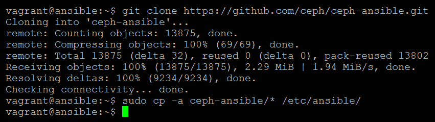

# 使用容器部署 Ceph

一旦你规划好 Ceph 项目，并准备好部署测试或生产集群，你需要考虑部署和维护的方式。本章将演示如何通过使用 Vagrant 快速部署用于测试和开发的测试环境。同时，也会解释为何你可能希望使用编排工具来部署 Ceph，而不是使用 Ceph 自带的工具。作为一个流行的编排工具，本书将使用 Ansible 展示如何快速可靠地部署 Ceph 集群，并说明使用它的优势。

在本章中，我们将学习以下内容：

+   如何使用 Vagrant 和 VirtualBox 准备测试环境

+   Ceph 的部署和编排工具之间的区别

+   相较于使用编排工具的优势

+   如何安装和使用 Ansible

+   如何配置 Ceph Ansible 模块

+   如何使用 Vagrant 和 Ansible 部署测试集群

+   如何管理 Ceph 配置的想法

+   Rook 项目是什么，它使 Ceph 操作员能做什么

+   如何部署基本的 Kubernetes 集群

+   如何使用 Rook 在 Kubernetes 上部署 Ceph

# 技术要求

为了能够运行本章后续描述的 Ceph 环境，确保计算机满足一定的要求是很重要的，以便为虚拟机提供足够的资源。具体要求如下：

+   兼容 Vagrant 和 VirtualBox 的操作系统，包括 Linux、macOS 和 Windows

+   2 核 CPU

+   8 GB 内存

+   在 BIOS 中启用虚拟化指令

# 使用 Vagrant 和 VirtualBox 准备你的环境

尽管可以在任何硬件或虚拟机上部署测试集群，但本书将使用 Vagrant 和 VirtualBox 的组合。这将快速提供虚拟机并确保环境的一致性。

VirtualBox 是一个免费的开源虚拟机管理程序，目前由 Oracle 开发；虽然其性能和功能可能不如高端虚拟机管理程序，但其轻量级的方式和多操作系统支持使其成为测试的理想选择。

Vagrant 可以帮助快速高效地创建可能包含多台机器的环境。它基于 box 的概念，box 是为虚拟机管理程序预定义的模板，而 Vagrantfile 则定义了要构建的环境。它支持多个虚拟机管理程序，并允许 Vagrantfile 在它们之间进行移植。

# 如何安装 VirtualBox

请参考 VirtualBox 网站，以获取适用于你操作系统的 VirtualBox 安装方法：[`www.virtualbox.org/wiki/Downloads`](https://www.virtualbox.org/wiki/Downloads)


# 如何设置 Vagrant

请按照 Vagrant 网站上的安装说明，在您选择的操作系统上安装 Vagrant：[`www.vagrantup.com/downloads.html`](https://www.vagrantup.com/downloads.html)：


1.  为您的 Vagrant 项目创建一个新目录，例如 `ceph-ansible`

1.  切换到此目录并运行以下命令：

```
vagrant plugin install vagrant-hostmanager      
```


```
vagrant box add bento/ubuntu-16.04
```


现在创建一个名为 `Vagrantfile` 的空文件，并将以下内容放入其中：

```
nodes = [ 
  { :hostname => 'ansible', :ip => '192.168.0.40', :box => 'xenial64' }, 
  { :hostname => 'mon1', :ip => '192.168.0.41', :box => 'xenial64' }, 
  { :hostname => 'mon2', :ip => '192.168.0.42', :box => 'xenial64' }, 
  { :hostname => 'mon3', :ip => '192.168.0.43', :box => 'xenial64' }, 
  { :hostname => 'osd1',  :ip => '192.168.0.51', :box => 'xenial64', :ram => 1024, :osd => 'yes' }, 
  { :hostname => 'osd2',  :ip => '192.168.0.52', :box => 'xenial64', :ram => 1024, :osd => 'yes' }, 
  { :hostname => 'osd3',  :ip => '192.168.0.53', :box => 'xenial64', :ram => 1024, :osd => 'yes' } 
] 

Vagrant.configure("2") do |config| 
  nodes.each do |node| 
    config.vm.define node[:hostname] do |nodeconfig| 
      nodeconfig.vm.box = "bento/ubuntu-16.04" 
      nodeconfig.vm.hostname = node[:hostname] 
      nodeconfig.vm.network :private_network, ip: node[:ip] 

      memory = node[:ram] ? node[:ram] : 512; 
      nodeconfig.vm.provider :virtualbox do |vb| 
        vb.customize [ 
          "modifyvm", :id, 
          "--memory", memory.to_s, 
        ] 
        if node[:osd] == "yes"         
          vb.customize [ "createhd", "--filename", "disk_osd-#{node[:hostname]}", "--size", "10000" ] 
          vb.customize [ "storageattach", :id, "--storagectl", "SATA Controller", "--port", 3, "--device", 0, "--type", "hdd", "--medium", "disk_osd-#{node[:hostname]}.vdi" ] 
        end 
      end 
    end 
    config.hostmanager.enabled = true 
    config.hostmanager.manage_guest = true 
  end 
end 
```

运行 `vagrant up` 来启动 `Vagrantfile` 中定义的虚拟机：


现在，让我们 `ssh` 连接到其中一台虚拟机：

```
vagrant ssh ansible
```


如果您在 Windows 上运行 `vagrant`，`ssh` 命令会提醒您需要使用您选择的 SSH 客户端，并提供相关的使用信息。Putty 是一个不错的 SSH 客户端建议。在 Linux 上，该命令会直接连接到虚拟机。

用户名和密码都是 `vagrant`。登录后，您应该看到 `ansible vm` 的 bash 提示符：


只需输入 exit 即可返回到您的主机。

恭喜您，您已经成功部署了三个 Ceph 监视器服务器，三个 Ceph OSD 服务器，以及一台 Ansible 服务器。`Vagrantfile` 还可以包含一些额外步骤，用于在服务器上执行命令进行配置，但现在我们先关闭这些服务器；当本章后续的示例需要时，我们可以重新启动它们：

```
vagrant destroy --force
```

# Ceph-deploy

Ceph-deploy 是官方的 Ceph 集群部署工具。它的工作原理是通过一个管理员节点，通过免密码 SSH 访问所有 Ceph 集群中的机器；并且该管理员节点还保存一份 Ceph 配置文件。每次执行部署操作时，Ceph-deploy 工具会通过 SSH 连接到 Ceph 节点，执行必要的步骤。虽然 Ceph-deploy 工具是一个完全支持的方法，可以确保 Ceph 集群功能正常，但 Ceph 的后续管理并不会像预期的那样简便。

如果使用 Ceph-deploy 来管理大规模的 Ceph 集群，会增加很多管理开销。因此，建议将 Ceph-deploy 限制在测试或小规模的生产集群中，尽管正如您所看到的，编排工具可以快速部署 Ceph，并且可能更适合用于测试环境，尤其是当您需要不断构建新的 Ceph 集群时。

# 编排

让安装和管理 Ceph 更容易的一个解决方案是使用编排工具。现在有多种可用的工具，如 Puppet、Chef、Salt 和 Ansible，这些工具都有 Ceph 模块可用。如果你在环境中已经使用了编排工具，建议继续使用该工具。本书将使用 Ansible，原因如下：

+   这是 Red Hat 偏爱的部署方法，Red Hat 是 Ceph 和 Ansible 项目的拥有者。

+   它拥有一套成熟且完备的 Ceph 角色和剧本。

+   如果你以前从未使用过编排工具，Ansible 往往更容易学习。

+   它不需要设置中央服务器，这意味着演示更专注于使用工具，而不是安装工具。

所有工具遵循相同的原则，即提供主机清单和要在主机上执行的任务集。这些任务通常引用变量，允许在运行时定制任务。编排工具设计为按计划运行，这样，如果由于某种原因主机的状态或配置发生变化，在下一次运行时将会正确地恢复到预定状态。

使用编排工具的另一个优点是文档管理。虽然它们不能替代良好的文档，但它们清晰地描述了你的环境，包括角色和配置选项，这意味着你的环境开始自带文档功能。如果确保通过编排工具执行任何安装或更改，编排工具的配置文件将清晰地描述你环境的当前状态。如果将其与 Git 仓库等存储编排配置的工具结合使用，你就能拥有一个变更控制系统。本章稍后将更详细地介绍这一点。唯一的缺点是需要花费额外的时间来完成工具的初始设置和配置。

因此，通过使用编排工具，你不仅能够实现更快速、出错率更低的部署，还能免费获得文档和变更管理。如果你现在还没有意识到这一点，这正是你应该关注的内容。

# Ansible

如前所述，Ansible 将是本书首选的编排工具，让我们更详细地了解它。

Ansible 是一个无代理的编排工具，用 Python 编写，通过 SSH 在远程节点上执行配置任务。它首次发布于 2012 年，已广泛采用，且因其易于采用和学习曲线低而著名。Red Hat 在 2015 年收购了 Ansible 公司，因此为部署 Ceph 提供了一个高度开发且紧密集成的方案。

在 Ansible 中，名为 playbooks 的文件用于描述要在指定的主机或主机组上执行的命令、操作和配置，并存储在 `yaml` 文件格式中。为了避免出现大型且难以管理的 playbooks，可以创建 Ansible 角色，以便让 playbook 包含单个任务，该任务可以执行与该角色相关的多个操作。

使用 SSH 连接到远程节点并执行 playbooks 意味着它非常轻量，不需要代理或中央服务器。

为了测试，Ansible 还可以与 Vagrant 很好地集成；可以将 Ansible playbook 作为 Vagrant 配置的一部分指定，并且 Vagrant 会自动生成一个来自已创建虚拟机的清单文件，并在服务器启动后运行 playbook。这允许通过一个简单的命令部署一个包含其操作系统的 Ceph 集群。

# 安装 Ansible

你将把之前创建的 Vagrant 环境恢复，并通过 SSH 登录到 Ansible 服务器。对于这个示例，只需要 `ansible`、`mon1` 和 `osd1`：

```
Vagrant up ansible mon1 osd1  
```

+   添加 Ansible PPA：

```
$ sudo apt-add-repository ppa:ansible/ansible-2.6     
```

****

+   更新 `apt-get` 源并安装 Ansible：

```
$ sudo apt-get update && sudo apt-get install ansible -y    
```

****

# 创建你的清单文件

Ansible 清单文件用于 Ansible 引用所有已知主机并指定它们所属的组。通过将组名放入方括号中来定义一个组；组可以通过使用 children 定义在其他组内进行嵌套。

在我们将主机添加到清单文件之前，我们首先需要配置远程节点以实现无密码 SSH，否则每次 Ansible 尝试连接到远程机器时，我们都需要输入密码，如下所示：

1.  生成 SSH 密钥：

```
$ ssh-keygen
```


1.  将密钥复制到远程主机：

```
$ ssh-copy-id mon1
```


这需要对每个主机重复执行。通常，你会在 Vagrant 配置阶段包括此步骤，但手动执行这些任务几次是有用的，这样你可以理解整个过程。

现在尝试通过 `ssh mon1` 登录到机器：


输入 `exit` 返回到 Ansible 虚拟机。现在让我们创建 `Ansible` 清单文件。编辑 `/etc/ansible` 中名为 `hosts` 的文件：

```
$ sudo nano /etc/ansible/hosts
```

创建三个组，分别命名为 `osds`、`mgrs` 和 `mons`，然后创建一个第四个组，命名为 `ceph`。这个第四组将包含 `osds` 和 `mons` 作为子组。

在正确的组下输入主机列表：

```
[mons] 
mon1 
mon2 
mon3

[mgrs]
mon1 

[osds] 
osd1 
osd2 
osd3 

[ceph:children] 
mons 
osds
mgrs 
```

# 变量

大多数 playbooks 和角色将使用变量，这些变量可以通过多种方式覆盖。最简单的方法是创建 `host_vars` 和 `groups_vars` 文件夹中的文件；这些文件允许你基于主机或组成员身份分别覆盖变量。

创建一个`/etc/ansible/group_vars`目录。在`group_vars`中创建一个名为`mons`的文件，并将以下内容放入其中：

`a_variable: "foo"`

在`group_vars`中创建一个名为`osds`的文件，并将以下内容放入其中：

`a_variable: "bar"`

变量遵循优先级顺序；你还可以创建一个`all`文件，该文件将应用于所有组。然而，如果同名的变量出现在一个更具体的匹配组中，它将覆盖该`all`文件中的变量。Ceph Ansible 模块利用这一点，使你能够拥有一组默认变量，并为特定角色指定不同的值。

# 测试

为了验证 Ansible 是否正常工作，并确保我们能够成功远程连接并执行命令，让我们使用 ping 命令与 Ansible 检查我们的一个主机。注意：这与网络 ping 不同；Ansible 的 ping 命令确认它可以通过 SSH 通信并远程执行命令：

```
$ ansible mon1 -m ping  
```


很棒，成功了。现在让我们运行一个简单的远程命令来展示 Ansible 的功能。以下命令将检索指定远程节点当前运行的内核版本：

```
$ ansible mon1 -a 'uname -r'  
```


# 一个非常简单的 playbook

为了展示 playbook 是如何工作的，以下示例将展示一个小的 playbook，它也使用了我们之前配置的变量：

```
- hosts: mon1 osd1
 tasks:
 - name: Echo Variables
 debug: msg="I am a {{ a_variable }}"
```

然后运行 playbook。请注意，运行 playbook 的命令与运行临时 Ansible 命令不同：

```
$ ansible-playbook /etc/ansible/playbook.yml
```

****

输出显示了在`mon1`和`osd1`上执行的 playbook，它们属于组的成员，这些组是父组 Ceph 的子组。同时注意输出中两个服务器的不同之处，因为它们会根据你之前在`group_vars`目录中设置的变量来处理。

最后，最后几行显示了 playbook 运行的整体状态。现在你可以再次销毁你的`Vagrant`环境，为下一部分做准备：

```
Vagrant destroy --force
```

这就是 Ansible 介绍的结束，但这并不意味着它是一本完整的指南。建议在将其用于生产环境之前，先深入了解其他资源，以获得对 Ansible 的更全面的理解。

# 添加 Ceph Ansible 模块

我们可以使用 Git 来克隆 Ceph Ansible 仓库，如下所示：

```
git clone https://github.com/ceph/ceph-ansible.git
git checkout stable-3.2 sudo cp -a ceph-ansible/* /etc/ansible/
```



我们还需要安装一些`ceph-ansible`所需要的额外软件包：

```
sudo apt-get install python-pip
```


```
sudo pip install notario netaddr
```


让我们还探讨一下 Git 仓库中的一些关键文件夹：

+   `group_vars`：我们已经介绍了这里存放的内容，并将在稍后更详细地探讨可能的配置选项

+   `infrastructure-playbooks`：此目录包含预先编写的 playbook，用于执行一些标准任务，例如部署集群或向现有集群中添加 OSD。playbook 顶部的注释很好地说明了它们的作用。

+   `roles`：此目录包含构成 Ceph Ansible 模块的所有角色。你会看到每个 Ceph 组件都有一个角色；这些角色通过 playbook 被调用，以便安装、配置和维护 Ceph。

为了能够使用 Ansible 部署 Ceph 集群，需要在 `group_vars` 目录中设置若干关键变量。以下变量是必需设置的；另外，建议你修改它们的默认值。对于其余变量，建议你阅读变量文件中的注释。关键的全局变量包括以下内容：

```
 #mon_group_name: mons
    #osd_group_name: osds
    #rgw_group_name: rgws
    #mds_group_name: mdss
    #nfs_group_name: nfss
    ...
    #iscsi_group_name: iscsigws 
```

这些控制模块使用什么组名称来识别 Ceph 主机类型。如果你将在更广泛的环境中使用 Ansible，建议在组名前加上 `ceph-`，以明确这些组与 Ceph 相关：

```
#ceph_origin: 'upstream' # or 'distro' or 'local'  
```

使用 `'upstream'` 设置来使用 Ceph 团队生成的包，或使用 `distro` 设置来使用分发版维护者生成的包。如果你希望能够独立于你的分发版升级 Ceph，建议使用前者：

```
#fsid: "{{ cluster_uuid.stdout }}"
#generate_fsid: true  
```

默认情况下，`fsid` 会为你的集群生成并存储在一个文件中，以便以后可以再次引用。除非你希望控制 `fsid` 或将 `fsid` 硬编码到组变量文件中，否则你不需要修改它：

```
#monitor_interface: interface
#monitor_address: 0.0.0.0  
```

应指定上述命令之一。如果你在 `group_vars` 中使用了变量，那么你可能希望使用 `monitor_interface`，这是 Linux 中的接口名称，通常在所有 `mons` 中是相同的。否则，如果你在 `host_vars` 中指定了 `monitor_address`，你可以指定接口的 IP，显然，在三个或更多 `mons` 中它们会有所不同：

```
#ceph_conf_overrides: {}  
```

并非每个 Ceph 变量都由 Ansible 直接管理，但提供了上述变量，以便你可以将任何额外的变量传递给 `ceph.conf` 文件及其对应的部分。以下是如何实现的示例（请注意缩进）：

```
 ceph_conf_overrides:
      global:
        variable1: value
      mon:
        variable2: value
      osd:
        variable3: value 
```

OSD 变量文件中的关键变量如下：

```
 #copy_admin_key: false 
```

如果你希望能够从 OSD 节点而不仅仅是从监视节点管理你的集群，将此设置为 `true`，这将把管理员密钥复制到你的 OSD 节点：

```
 #devices: []
 #osd_auto_discovery: false
 #journal_collocation: false
 #raw_multi_journal: false
 #raw_journal_devices: [] 
```

这些可能是整个 Ansible 配置中最关键的一组变量。它们控制哪些磁盘被用作 OSD 以及日志的位置。你可以手动指定你希望用作 OSD 的设备，或者使用自动发现。本书中的示例使用的是静态设备配置。

`journal_collocation` 变量设置是否希望将日志存储在与 OSD 数据相同的磁盘上；将为其创建一个单独的分区。

`raw_journal_devices`允许你指定希望用作日志的设备。通常，一个单独的 SSD 会作为多个 OSD 的日志；在这种情况下，启用`raw_multi_journal`，并简单地多次指定日志设备；如果你希望 Ansible 指示 ceph-disk 为你创建它们，则不需要指定分区号。

这些是你应该考虑的主要变量；建议你阅读变量文件中的注释，查看是否有其他变量需要根据你的环境进行修改。

# 使用 Ansible 部署测试集群

网上有多个示例，包含完全配置的`Vagrantfile`和相关的 Ansible 剧本；这允许你只用一个命令启动一个完全功能的 Ceph 环境。虽然这非常方便，但它并没有帮助你学习如何正确配置和使用 Ceph 的 Ansible 模块，就像你在生产环境中部署 Ceph 集群时那样。因此，本书将从头开始指导你配置 Ansible，即使它运行在 Vagrant 配置的服务器上。需要特别注意的是，像 Ceph 本身一样，Ansible 剧本也在不断变化，因此建议你查看`ceph-ansible`文档以了解是否有任何重大变更。

到此为止，你的 Vagrant 环境应该已经启动，并且 Ansible 应该能够连接到所有六个 Ceph 服务器。你还应该有一个 Ceph Ansible 模块的克隆副本。

创建一个名为`/etc/ansible/group_vars/ceph`的文件：

```
ceph_origin: 'repository'
ceph_repository: 'community'
ceph_mirror: http://download.ceph.com
ceph_stable: true # use ceph stable branch
ceph_stable_key: https://download.ceph.com/keys/release.asc
ceph_stable_release: mimic # ceph stable release
ceph_stable_repo: "{{ ceph_mirror }}/debian-{{ ceph_stable_release }}"
monitor_interface: enp0s8 #Check ifconfig
public_network: 192.168.0.0/24
```

创建一个名为`/etc/ansible/group_vars/osds`的文件：

```
osd_scenario: lvm
lvm_volumes:
- data: /dev/sdb
```

创建一个`fetch`文件夹，并将所有者更改为`vagrant`用户：

```
sudo mkdir /etc/ansible/fetch
sudo chown vagrant /etc/ansible/fetch
```

运行 Ceph 集群部署剧本：

```
cd /etc/ansible
sudo mv site.yml.sample site.yml
ansible-playbook -K site.yml
```

`K`参数告诉 Ansible 应该询问你输入`sudo`密码。现在请放松并观看 Ansible 部署你的集群：


一旦完成，并且假设 Ansible 没有错误地完成，`ssh`进入`mon1`并运行：

```
vagrant@mon1:~$ sudo ceph -s
```


这就是通过 Ansible 部署一个完全功能的 Ceph 集群的全部过程。

如果你想能够停止 Vagrant Ceph 集群而不丢失到目前为止的工作，可以运行以下命令：

```
vagrant suspend
```

要暂停所有虚拟机的当前状态，请运行以下命令：

```
vagrant resume
```

这将启动虚拟机；它们将恢复到你离开时的状态。

# 变更与配置管理

如果你通过 Ansible 等编排工具部署基础设施，管理 Ansible playbook 就变得很重要。正如我们所看到的，Ansible 允许你快速部署初始的 Ceph 集群，也能在后续进行配置更新。必须认识到，如果部署了错误的配置或操作，这种强大的能力也可能产生毁灭性的影响。通过实施某种形式的配置管理，Ceph 管理员将能够在运行 Ansible playbook 之前清晰地看到已做出的更改。

一种推荐的方法是将 Ceph 的 Ansible 配置存储在 Git 仓库中；这样可以跟踪更改，并通过监控 Git 提交或强制用户向主分支提交合并请求来实现某种形式的变更控制。

# Ceph 容器化

我们之前已经看到，通过使用 Ansible 等编排工具，我们可以减少部署、管理和维护 Ceph 集群所需的工作量。我们还看到这些工具如何帮助你发现可用的硬件资源，并将 Ceph 部署到这些资源上。

然而，使用 Ansible 配置裸金属服务器仍然会导致非常静态的部署，可能不太适合今天更动态的工作负载。设计 Ansible playbook 时还需要考虑多个不同的 Linux 发行版，以及可能在不同版本之间发生的任何变化；systemd 就是一个很好的例子。此外，许多编排工具的开发需要定制化，以便处理发现、部署和管理 Ceph。这是 Ceph 开发人员思考过的一个常见主题；通过使用 Linux 容器及其相关的编排平台，他们希望改善 Ceph 的部署体验。

一种被选为首选方案的方法是与一个名为 Rook 的项目合作。Rook 与容器管理平台 Kubernetes 配合使用，自动化 Ceph 存储的部署、配置和使用。如果你列出一个自定义 Ceph 编排和管理框架所需实现的需求和功能，你很可能会设计出一个与 Kubernetes 类似的框架。所以，在已经成熟的 Kubernetes 项目上构建功能是合乎逻辑的，而 Rook 正是这样做的。

在容器中运行 Ceph 的一个主要好处是它允许将服务部署在相同的硬件上。传统上，在 Ceph 集群中，Ceph 监视器需要运行在专用硬件上；而使用容器时，这一要求被去除了。对于较小的集群，这可以在运行和购买服务器的成本上节省大量开支。如果资源允许，其他基于容器的工作负载也可以在 Ceph 硬件上运行，从而进一步提高硬件采购的投资回报率。使用 Docker 容器可以预留所需的硬件资源，以避免不同工作负载之间互相影响。

为了更好地理解这两种技术如何与 Ceph 配合使用，我们首先需要更详细地了解 Kubernetes 和容器本身。

# 容器

尽管容器技术作为一种新兴技术已经出现不久，但将一组进程相互隔离的原则已经存在很长时间。当前的技术增强了隔离的完整性。以往的技术可能仅仅隔离了文件系统的某些部分，而最新的容器技术则还隔离了操作系统的多个区域，并且还可以为硬件资源提供配额。尤其是 Docker 技术，它已成为讨论容器时最受欢迎的技术，以至于这两个词经常被交替使用。**容器**一词描述了一种执行操作系统级虚拟化的技术。Docker 是一个控制主要是 Linux 特性的软体产品，例如控制组（cgroups）和命名空间（namespaces），用于隔离一组 Linux 进程。

需要注意的是，与 VMware、Hyper-V 和 KVM 等完整的虚拟化解决方案不同，后者提供虚拟化的硬件并需要一个单独的操作系统实例，容器利用宿主机的操作系统。虚拟机的完整操作系统需求可能导致存储空间浪费数十 GB 用于操作系统安装，并可能浪费数 GB 的 RAM。而容器通常只消耗以 MB 为单位的存储和 RAM 开销，这意味着与完全虚拟化技术相比，更多的容器可以被部署在相同的硬件上。

由于容器可以完全从主机系统配置，因此它们的编排也更加容易；再加上它们可以在毫秒内启动的能力，这意味着它们非常适合动态变化的环境。特别是在 DevOps 环境中，当基础设施和应用程序之间的界限开始变得模糊时，它们变得非常受欢迎。基础设施管理往往比应用程序开发的速度慢，这意味着在敏捷开发环境中，基础设施团队通常总是在追赶进度。有了 DevOps 和容器，基础设施团队可以集中精力提供一个坚实的基础，而开发人员则可以打包他们的应用程序以及运行所需的操作系统和中间件。

# Kubernetes

能够在几秒钟内快速高效地启动数十个容器很快让你意识到，如果虚拟机的泛滥已经够糟糕了，那么使用容器，问题很容易会变得更加严重。随着 Docker 在现代 IT 基础设施中的出现，管理所有这些容器的需求应运而生。这就是 Kubernetes 的出现。

尽管有多种容器编排技术可供选择，但 Kubernetes 已经取得了广泛的成功，并且作为 Rook 构建的产品，本书将重点介绍它。

Kubernetes 是一个用于自动化部署、扩展和管理容器化应用程序的开源容器编排系统。它最初是在 Google 开发用于运行其内部系统的，但后来已开源并且其受欢迎程度不断增长。

尽管本章将涵盖部署一个非常简单的 Kubernetes 集群来部署一个带有 Rook 的 Ceph 集群，但它并不是一个完整的教程，建议读者查找其他资源以了解更多关于 Kubernetes 的信息。

# 使用 Rook 部署 Ceph 集群

要使用 Vagrant 创建三个虚拟机来运行 Kubernetes 集群，以部署带有 Rook 的 Ceph 集群。

你将完成的第一个任务是通过 Vagrant 部署三个虚拟机。如果你已经按照本章节开始时的步骤，并使用 Vagrant 构建了 Ansible 环境，那么你应该拥有部署 Kubernetes 集群所需的一切。

以下是用于启动三个虚拟机的`Vagrantfile`；和之前一样，将内容放入名为`Vagrantfile`的新目录中，然后运行`vagrant up`：

```
nodes = [
  { :hostname => 'kube1',  :ip => '192.168.0.51', :box => 'xenial64', :ram => 2048, :osd => 'yes' },
  { :hostname => 'kube2',  :ip => '192.168.0.52', :box => 'xenial64', :ram => 2048, :osd => 'yes' },
  { :hostname => 'kube3',  :ip => '192.168.0.53', :box => 'xenial64', :ram => 2048, :osd => 'yes' }
]

Vagrant.configure("2") do |config|
  nodes.each do |node|
    config.vm.define node[:hostname] do |nodeconfig|
      nodeconfig.vm.box = "bento/ubuntu-16.04"
      nodeconfig.vm.hostname = node[:hostname]
      nodeconfig.vm.network :private_network, ip: node[:ip]

      memory = node[:ram] ? node[:ram] : 4096;
      nodeconfig.vm.provider :virtualbox do |vb|
        vb.customize [
          "modifyvm", :id,
          "--memory", memory.to_s,
        ]
        if node[:osd] == "yes"        
          vb.customize [ "createhd", "--filename", "disk_osd-#{node[:hostname]}", "--size", "10000" ]
          vb.customize [ "storageattach", :id, "--storagectl", "SATA Controller", "--port", 3, "--device", 0, "--type", "hdd", "--medium", "disk_osd-#{node[:hostname]}.vdi" ]
        end
      end
    end
    config.hostmanager.enabled = true
    config.hostmanager.manage_guest = true
  end
end
```


SSH 到第一个虚拟机`Kube1`：


将内核更新到更新版本；这对于 Rook 中某些 Ceph 功能的正常运行是必需的：


安装 Docker，如下所示：

```
sudo apt-get install docker.io
```


启用并启动 Docker 服务，如下所示：

```
sudo systemctl start docker
sudo systemctl enable docker
```


通过编辑 `/etc/fstab` 并注释掉交换分区行，禁用未来启动时的交换分区：


现在也禁用交换分区，如下所示：

```
sudo swapoff -a
```


添加 Kubernetes 仓库，如下所示：

```
sudo add-apt-repository “deb http://apt.kubernetes.io/ kubernetes-xenial main”
```


添加 Kubernetes GPG 密钥，如下所示：

```
sudo curl -s https://packages.cloud.google.com/apt/doc/apt-key.gpg | sudo apt-key add
```


安装 Kubernetes，如下所示：

```
sudo apt-get update && sudo apt-get install -y kubeadm kubelet kubectl
```


在 `kube2` 和 `kube3` 虚拟机上重复 Docker 和 Kubernetes 的安装步骤。

一旦所有虚拟机都成功安装了 Docker 和 Kubernetes，我们就可以初始化 Kubernetes 集群：

```
sudo kubeadm init --apiserver-advertise-address=192.168.0.51 --pod-network-cidr=10.1.0.0/16 --ignore-preflight-errors=NumCPU
```


过程结束时会输出一个命令字符串，请记下它，因为它用于将额外的节点加入到集群中。示例如下：


现在我们已经在所有节点上安装了 Docker 和 Kubernetes，并初始化了主节点，接下来让我们将剩下的两个节点添加到集群中。记得之前让你记下的那串文本吗？现在我们可以在剩余的两个节点上运行它：

```
sudo kubeadm join 192.168.0.51:6443 --token c68o8u.92pvgestk26za6md --discovery-token-ca-cert-hash sha256:3954fad0089dcf72d0d828b440888b6e97465f783bde403868f098af67e8f073
```


```
mkdir -p $HOME/.kube
sudo cp -i /etc/kubernetes/admin.conf $HOME/.kube/config
sudo chown $(id -u):$(id -g) $HOME/.kube/config
```


现在我们可以安装一些额外的容器网络支持。Flannel，一个简单的 Kubernetes 网络插件，使用 VXLAN 作为覆盖层来实现容器之间的网络连接。首先从 GitHub 下载 `yaml` 文件：

```
wget https://raw.githubusercontent.com/coreos/flannel/master/Documentation/kube-flannel.yml
```


在安装 Flannel 网络组件之前，我们需要对 `YAML` 规范文件进行一些更改：

```
nano kube-flannel.yml
```

请不要使用制表符缩进，要使用空格。

我们需要找到以下几行并进行必要的更改，如下所示：

+   第 76 行：`"Network": "10.1.0.0/16"`：


+   第 126 行：`- --iface=eth1`：


现在我们可以发出相关的 Kubernetes 命令来应用规范文件并安装 Flannel 网络：

```
kubectl apply -f kube-flannel.yml
```


网络安装完成后，我们可以确认一切正常，并且我们的 Kubernetes 工作节点已准备好运行工作负载：

```
$ kubectl get nodes
```


现在让我们检查所有支持 Kubernetes 内部服务的容器是否都在运行：

```
$ kubectl get pods --all-namespaces –o wide
```


请注意，我们在前一步安装的容器网络服务（Flannel）已经自动部署到了所有三个节点上。此时，我们已经拥有了一个完全功能正常的 Kubernetes 集群，准备运行任何我们希望在其上运行的容器。

现在我们可以将 Rook 部署到 Kubernetes 集群中。首先，从 GitHub 克隆 Rook 项目：

```
$ git clone https://github.com/rook/rook.git
```


切换到 `examples` 目录，如下所示：

```
$ cd rook/cluster/examples/kubernetes/ceph/
```


最后，通过运行以下两个命令创建 Rook 驱动的 Ceph 集群：

```
$ kubectl create -f operator.yaml
```


```
$ kubectl create -f cluster.yaml
```


为了确认我们的 Rook 集群现在正在工作，让我们检查 Rook 命名空间下的运行容器：

```
$ kubectl get pods --all-namespaces -o wide
```


您将看到 Rook 部署了一些 `mons`，并且还启动了一些发现容器。这些发现容器运行一个发现脚本来定位附加到 Kubernetes 物理主机的存储设备。一旦发现过程首次完成，Kubernetes 将运行一个一次性容器，通过格式化磁盘并将 OSD 添加到集群中来准备 OSD。如果您等待几分钟并重新运行 `get pods` 命令，您应该能看到 Rook 已经检测到连接到 `kube2` 和 `kube3` 的两个磁盘，并为它们创建了 `osd` 容器：


为了与集群交互，让我们部署 toolbox 容器；这是一个包含 Ceph 安装和必要集群密钥的简单容器：

```
$ kubectl create -f toolbox.yaml
```


现在在 toolbox 容器中执行 `bash`：

```
kubectl -n rook-ceph exec -it $(kubectl -n rook-ceph get pod -l "app=rook-ceph-tools" -o jsonpath='{.items[0].metadata.name}') bash
```

这将为您提供一个在 Ceph toolbox 容器中运行的 root shell，在这里我们可以通过运行 `ceph –s` 来检查 Ceph 集群的状态，并通过 `ceph osd tree` 查看当前的 OSD：


您会注意到，虽然我们构建了三个虚拟机，Rook 仅在 `kube2` 和 `kube3` 上部署了 OSD。这是因为默认情况下 Kubernetes 不会将容器调度到主节点上；在生产集群中，这是期望的行为，但为了测试，我们可以移除这一限制。

退出回到主 Kubernetes 节点，并运行以下命令：

```
kubectl taint nodes $(hostname) node-role.kubernetes.io/master:NoSchedule-
```


您会注意到 Kubernetes 将会在 `kube1` 上部署一些新容器，但不会部署新的 OSD；这是由于目前的限制，`rook-ceph-operator` 组件只在首次启动时部署新的 OSD。为了检测新可用的磁盘并将它们准备为 OSD，需要删除 `rook-ceph-operator` 容器。

运行以下命令，但将容器名称替换为 `get pods` 命令中列出的名称：

```
kubectl -n rook-ceph-system delete pods rook-ceph-operator-7dd46f4549-68tnk
```


Kubernetes 现在将自动启动一个新的 `rook-ceph-operator` 容器，并通过此操作启动新 `osd` 的部署；可以通过再次查看正在运行的容器列表来确认这一点：


您可以看到 `kube1` 运行了一个 `rook-discover` 容器，一个 `rook-ceph-osd-prepare` 容器，最后是一个 `rook-ceph-osd` 容器，在这个例子中是 `osd` 编号 `2`。

我们还可以通过使用我们的工具箱容器来检查，新的`osd`是否已经成功加入集群：


现在，Rook 已经部署了我们的完整测试 Ceph 集群，我们需要利用它并创建一些 RADOS 池，同时通过客户端容器使用一些存储。为了演示这个过程，我们将部署一个 CephFS 文件系统。

在我们直接开始部署文件系统之前，先看看我们将要部署的示例`yaml`文件。确保你仍然在`~/rook/cluster/examples/kubernetes/ceph`目录下，并使用文本编辑器查看`filesystem.yaml`文件：


你可以看到文件内容描述了将要创建的 RADOS 池以及文件系统所需的 MDS 实例。在这个例子中，将部署三个池，其中两个为复制池，一个为纠删码池用于实际数据存储。将部署两个 MDS 服务器，一个作为活动实例，另一个作为备用回放实例。

退出文本编辑器，现在部署`yaml`文件中的 CephFS 配置：

```
$ kubectl create -f filesystem.yaml
```


现在让我们回到工具箱容器，检查状态，看看已经创建了什么：


我们可以看到已经创建了两个池，一个用于 CephFS 元数据，另一个用于实际存储在 CephFS 文件系统中的数据。

为了举例说明 Rook 如何被应用容器使用，我们现在将部署一个小型的 NGINX Web 服务器容器，将其 HTML 内容存储在 CephFS 文件系统上。

将以下内容放入名为`nginx.yaml`的文件中：

```
apiVersion: v1
kind: Pod
metadata:
 name: nginx
spec:
 containers:
 - name: nginx
 image: nginx:1.7.9
 ports:
 - containerPort: 80
 volumeMounts:
 - name: www
 mountPath: /usr/share/nginx/html
 volumes:
 - name: www
 flexVolume:
 driver: ceph.rook.io/rook
 fsType: ceph
 options:
 fsName: myfs
 clusterNamespace: rook-ceph
```

现在使用`kubectl`命令来创建`pod/nginx`：


稍等一会儿，容器将启动并进入运行状态；使用`get pods`命令来验证这一点：


我们现在可以在这个容器上启动一个快速的 Bash shell 来确认 CephFS 挂载是否成功：

```
$ kubectl exec -it nginx bash
```


我们可以看到 CephFS 文件系统已被挂载到`/usr/share/nginx/html`。这一切都在没有在容器中安装任何 Ceph 组件、没有任何配置或密钥环复制的情况下完成。Rook 在后台处理了所有这些；一旦理解并欣赏这一点，Rook 的真正强大之处便显现出来。如果这个简单的 NGINX pod 示例扩展成一个基于负载自动扩展的服务，自动启动多个容器，那么 Rook 和 Ceph 所提供的灵活性，即无需额外配置便能自动在 web 集群中呈现相同的共享存储，显得尤为有用。

# 总结

在本章中，你学习了 Ceph 的各种部署方法及其之间的差异。你现在也会对 Ansible 的工作原理以及如何用它部署 Ceph 集群有一个基本的理解。此时，建议你继续研究并实践使用 Ansible 部署和配置 Ceph，以便你能够自信地在生产环境中使用它。本书的其余部分也将假设你已经完全理解了本章的内容，以便能够操作 Ceph 的配置。

你还学习了在 Kubernetes 平台上运行的容器中部署 Ceph 的一些令人兴奋的新进展。尽管 Rook 项目仍处于开发的初期阶段，但显然它已经是一个非常强大的工具，能够让 Ceph 发挥其最佳功能，同时简化所需的部署和管理。随着 Kubernetes 成为推荐的容器管理平台并持续获得成功，将 Ceph 与 Rook 集成将会是技术上的完美匹配。

强烈建议读者继续深入学习 Kubernetes，因为本章仅仅触及了它提供的功能表面。行业内的强烈迹象表明，容器化将成为部署和管理应用程序的主要技术，因此，理解 Kubernetes 以及 Ceph 如何与 Rook 集成是非常有必要的。

# 问题

1.  哪个软件可以用来快速部署测试环境？

1.  是否应该使用 vagrant 来部署生产环境？

1.  哪个项目使得可以在 Kubernetes 上部署 Ceph？

1.  什么是 Docker？

1.  用于执行一系列命令的 Ansible 文件叫什么？
