# 第三章：BlueStore

在本章中，你将了解 BlueStore，这个新对象存储设计用于取代现有的 filestore。它提高的性能和增强的功能集旨在使 Ceph 能够继续发展，并为未来提供一个具有弹性和高性能的分布式存储系统。自 Luminous 版本以来，BlueStore 已成为推荐并默认的对象存储，在创建新的 OSD 时使用。本章将介绍 BlueStore 的工作原理，以及它为何比 Filestore 更适合 Ceph 的需求。然后，通过逐步教程，你将学习如何将 Ceph 集群升级到 BlueStore。

在本章中，你将学习以下内容：

+   什么是 BlueStore？

+   Filestore 的限制

+   BlueStore 克服了哪些问题

+   BlueStore 的组成部分及其工作原理

+   `ceph-volume` 介绍

+   如何部署 BlueStore OSD

+   从 filestore 升级到 BlueStore 的方法

# 什么是 BlueStore？

BlueStore 是一个 Ceph 对象存储，主要旨在解决 filestore 的限制问题。在 Luminous 版本发布之前，filestore 是默认的对象存储。最初，一个名为 NewStore 的新对象存储正在开发中，以取代 filestore。NewStore 是 RocksDB 和标准的 **可移植操作系统接口**（**POSIX**）文件系统的结合，RocksDB 用于存储元数据，而 POSIX 文件系统用于存储实际的对象。然而，很快就显现出，使用 POSIX 文件系统会带来高开销和限制，这也是最初想要摆脱 filestore 的关键原因之一。

因此，BlueStore 应运而生。通过将原始块设备与 RocksDB 结合，解决了困扰 NewStore 的多个问题。BlueStore 这个名字反映了 Block 和 NewStore 这两个词的结合：

*Block + NewStore = BlewStore = BlueStore*

BlueStore 旨在消除与 filestore 相关的双重写入惩罚，并提高同一硬件上可获得的性能。此外，通过对对象在磁盘上存储方式的更多控制，新的功能（如校验和和压缩）可以得以实现。

# 为什么需要它？

Ceph 之前的对象存储 filestore 存在许多限制，这些限制已经开始限制 Ceph 能够运行的规模，以及它能够提供的功能。以下是 BlueStore 需要出现的一些主要原因。

# Ceph 的需求

在 Ceph 中，一个对象除了其数据外，还包含一些相关的元数据，确保数据和元数据的原子性更新至关重要。如果元数据或数据单独更新，而没有同步更新，Ceph 的一致性模型就会面临风险。为了确保这些更新是原子性的，它们需要在一个事务中完成。

# Filestore 限制

Filestore 最初是作为对象存储设计的，以便开发者可以在本地机器上测试 Ceph。由于其稳定性，它迅速成为标准的对象存储，并且在全球的生产集群中得到广泛使用。

最初，filestore 的设计理念是，未来的**B 树文件系统**（**btrfs**）将提供事务支持，从而允许 Ceph 将原子性要求委托给 btrfs。事务将允许应用程序将一系列请求发送到 btrfs，并且只有在所有请求都被提交到稳定存储后，才会收到确认。没有事务支持的情况下，如果 Ceph 写操作在中途中断，那么数据或元数据可能会丢失，或者它们之间会出现不一致。

不幸的是，依赖 btrfs 来解决这些问题最终证明是一个错误的希望，并且发现了多个限制。虽然 btrfs 仍然可以与 filestore 一起使用，但存在许多已知问题，可能会影响 Ceph 的稳定性。

最终，事实证明 XFS 是与 filestore 一起使用的最佳选择，但 XFS 有一个主要的限制，它不支持事务，这意味着 Ceph 无法保证其写操作的原子性。解决这个问题的方法是写前日志。所有写操作，包括数据和元数据，都会首先写入日志，该日志位于原始块设备上。一旦包含数据和元数据的文件系统确认所有数据已经安全刷新到磁盘，日志条目就可以被刷新。这一解决方案的一个有益副作用是，当使用 SSD 来存放旋转磁盘的日志时，它就像一个写回缓存，降低了写入的延迟，达到了 SSD 的速度；然而，如果 filestore 日志与数据分区位于同一个存储设备上，那么吞吐量至少会减半。

在旋转磁盘 OSD 的情况下，这可能导致非常差的性能，因为磁头会不断在磁盘的两个区域之间移动，即使是顺序操作也是如此。尽管基于 SSD 的 OSD 上的 filestore 几乎不会遭受相同的性能损失，但由于 filestore 日志的存在，它们的吞吐量仍然有效减半，因为需要写入的数据量是原来的两倍。无论是哪种情况，性能损失都是非常不希望出现的，并且在闪存驱动器的情况下，这会加速设备的磨损，要求使用更昂贵的闪存版本，称为写入耐久性闪存。下图展示了 filestore 及其日志如何与块设备交互。你可以看到，所有数据操作都必须通过 filestore 日志和文件系统日志：

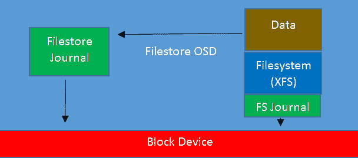

在文件存储（filestore）中，开发人员试图控制底层 POSIX 文件系统的行为，以使其按照 Ceph 所需的方式执行，这带来了额外的挑战。多年来，文件系统开发人员进行了大量的工作，试图使文件系统变得智能，并预测应用程序如何提交 I/O 请求。对于 Ceph 来说，这些优化中的许多与它试图指示文件系统执行的操作相冲突，从而需要更多的解决方法和复杂性。

对象元数据存储在文件系统属性的组合中，这些属性被称为**扩展属性**（**XATTRs**），并存储在**LevelDB**键值存储中，该存储也位于 OSD 磁盘上。由于 RocksDB 当时不可用，LevelDB 更符合 Ceph 的许多要求，因此在文件存储创建时选择了 LevelDB，而非 RocksDB。

Ceph 被设计成能够扩展到 PB 级数据并存储数十亿个对象。然而，由于在一个目录中合理存储的文件数量有限，进一步的解决方法被引入以帮助限制这一点。对象存储在一个哈希目录名称的层次结构中；当这些文件夹中的文件数量达到设定的限制时，目录会被拆分为另一个级别，并且对象会被移动。

然而，提高对象枚举速度是有权衡的：当这些目录拆分发生时，它们会影响性能，因为对象被移动到正确的目录中。在更大的磁盘上，增加的目录数量给 VFS 缓存带来额外的压力，并可能导致访问不频繁的对象出现额外的性能损失。

正如本书在**性能调优**章节中将要讨论的那样，文件存储中的一个主要性能瓶颈是，当 XFS 开始查找那些当前不在 RAM 中缓存的 inode 和目录条目时。在每个 OSD 存储大量对象的场景下，目前还没有真正解决此问题的方法，Ceph 集群随着填充的逐渐增多而变得越来越慢是很常见的现象。

摆脱在 POSIX 文件系统上存储对象实际上是解决大多数这些问题的唯一方法。

# 为什么 BlueStore 是解决方案？

BlueStore 的设计旨在解决这些限制。在 NewStore 开发之后，很明显，试图将 POSIX 文件系统作为底层存储层的一种方式，会引入许多与文件存储中存在的类似问题。为了使 Ceph 能够实现期望的底层存储性能，它还需要对存储设备具有直接的块级访问，而不是额外的 Linux 文件系统开销。通过将元数据存储在 RocksDB 中，而将实际的对象数据直接存储在块设备上，Ceph 可以更好地控制底层存储，同时提供更好的性能。

# BlueStore 的工作原理

以下图示显示了 BlueStore 如何与块设备交互。与 filestore 不同，数据直接写入块设备，元数据操作由 RocksDB 处理：

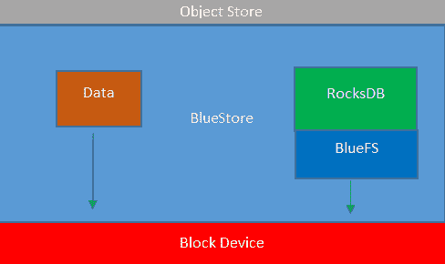

块设备被划分为 RocksDB 数据存储和 Ceph 中实际存储的用户数据。每个对象都作为若干个从块设备中分配的 blob 存储。RocksDB 包含每个对象的元数据，并跟踪数据 blob 的使用情况和分配信息。

# RocksDB

RocksDB 是一个高性能的键值存储系统，最初是从 LevelDB 分支出来的，但在开发之后，Facebook 对其进行了显著的性能改进，适用于具有低延迟存储设备的多处理器服务器。它还进行了许多功能增强，其中一些在 BlueStore 中得到了应用。

RocksDB 用于存储关于存储对象的元数据，之前这些元数据是通过将 LevelDB 和 XATTRs 结合在 filestore 中处理的。

RocksDB 的一个关键特点是数据在数据库各个级别中的写入方式。它得益于其源自 LevelDB 的特性。新数据被写入一个基于内存的表，并可选地记录在持久化存储的事务日志中，即 WAL；当这个基于内存的表填满时，数据会通过称为压缩的过程移动到数据库的下一个级别。当该级别填满时，数据会再次迁移到更低级别，以此类推。所有这些级别都存储在 RocksDB 称之为 SST 文件的文件中。在 Ceph 中，每个级别的大小配置为前一个级别的 10 倍，如果你尝试在混合的 HDD–SSD 布局中将整个 RocksDB 存储在 SSD 上，那么这会带来一些有趣的因素。

所有新数据都会写入基于内存的表和 WAL，内存表被称为 level 0。BlueStore 将 level 0 配置为 256 MB。各级之间的默认大小倍增因子为十，这意味着 level 1 也是 256 MB，level 2 为 2.56 GB，level 3 为 25.6 GB，level 4 为 256 GB。对于大多数 Ceph 用例，每个 OSD 的平均元数据大小应该在 20-30GB 之间，热数据集通常小于此。希望 level 0、1 和 2 包含大部分热数据，以便写入，因此将 SSD 分区大小至少配置为 3 GB 应能确保这些级别存储在 SSD 上。写入性能应该良好，因为写入的元数据会直接存储到 SSD 上；然而，在读取元数据时——例如在客户端读取请求期间——可能会遇到元数据位于 level 3 或 4 的情况，这时元数据需要从旋转硬盘读取，这将对延迟产生负面影响，并增加磁盘负载。

因此，显而易见的解决方案是以某种方式计算你认为 BlueStore 元数据在你的数据集中的增长大小，并调整 RocksDB 存储的大小，以确保它能够全部存储在 SSD 上。实现这一目标有两个难点。

首先，根据实际数据的大小，预先计算元数据的大小是非常困难的。根据客户端模型（RBD、CephFS 或 RGW），将存储不同数量的元数据。此外，快照和你是否使用复制池或纠删码池也会导致元数据大小的不同。

接下来的挑战是正确配置你的闪存设备，以确保所有元数据都能适配。如前所述，RocksDB 会将数据压缩到数据库的各个级别。当 BlueStore 为 RocksDB 创建文件时，它仅会将某一特定级别放到闪存设备上，前提是该级别的全部内容可以适配。因此，每个级别都有最低的大小要求，以确保该级别确实位于闪存上。例如，为了确保 DB 的 2.56 GB 的级别 2 部分能够适配闪存，你需要至少拥有一个 4-5 GB 的 SSD 分区。这是因为级别 0、级别 1 和级别 2 都需要适配，并且还要有少量的开销。为了确保级别 3 能够完整适配，你需要稍多于 30 GB 的空间；如果空间小于此，级别 2 之上的额外空间将不会被使用。为了确保级别 4 能够适配，你可能需要超过 300 GB 的闪存空间。

如果你使用的是闪存存储实际数据，并且需要进一步提高性能，建议将 WAL 存储在更快的存储设备上，这有助于降低 RocksDB 操作的延迟。如果你使用的是旋转磁盘，将 WAL 移到专用设备上可能不会带来显著的提升。有多种可能的存储布局配置，WAL、DB 和数据可以放置在不同的存储设备上。以下是三种此类配置的示例：

+   WAL、DB 和数据都在旋转磁盘或闪存上

+   WAL 和 DB 在 SSD 上，数据在旋转磁盘上

+   WAL 在 NVMe 上，DB 在 SSD 上，数据在旋转磁盘上

# 压缩

BlueStore 引入的另一个便捷功能是它支持在子对象级别对数据进行压缩，即 BlueStore 内部的 blob。这意味着，无论客户端访问模型如何，写入 Ceph 的数据都可以受益于此功能。压缩是按池启用的，但默认是禁用的。

除了按池启用压缩外，还有许多额外的选项可以控制压缩行为，如下所示：

+   `compression_algorithm`**:** 这个选项控制使用哪个压缩库来压缩数据。默认是 snappy，这是由 Google 编写的压缩库。虽然它的压缩比率不是最佳的，但它具有非常高的性能，除非你有特定的容量需求，否则最好还是使用 snappy。其他选项包括`zlib`和`zstd`。

+   `compression_mode`**:** 该设置控制每个存储池的压缩操作状态。可以设置为`none`、`passive`、`aggressive`或`force`。`passive`设置启用压缩，但仅会压缩从更高层级标记为需要压缩的对象。`aggressive`设置会尝试压缩所有对象，除非明确告知不压缩。`force`设置则始终会尝试压缩数据。

+   `compress_required_ratio`**:** 默认情况下，设置为 87.5%。已压缩的对象必须压缩到低于此值才被认为值得压缩；否则，该对象将以未压缩格式存储。

尽管压缩确实需要额外的 CPU 资源，但 Snappy 非常高效，Ceph 的分布式特性使其非常适合此任务，因为压缩任务会分摊到集群中大量的 CPU 上。相比之下，传统的存储阵列则必须更多地使用其宝贵的、有限的双控制器 CPU 资源。

使用压缩的一个额外优势是，相较于节省的存储空间，还能提高读写大块数据时的 I/O 性能。由于数据被压缩，磁盘或闪存设备需要读取或写入的数据量减少，这意味着响应时间更快。此外，闪存设备可能因写入数据量减少而遭遇更少的写入磨损。

# 校验和

为了增强存储数据的保护，BlueStore 会计算并存储所有写入数据的校验和。每次读取请求时，BlueStore 会读取校验和并与从设备读取的数据进行比较。如果发现不匹配，BlueStore 会报告读取错误并修复损坏。Ceph 随后会从另一个持有该对象的 OSD 重新尝试读取。尽管现代硬件具有复杂的校验和和错误检测功能，但在 BlueStore 中引入额外的检查层，能大大降低静默数据损坏的风险。默认情况下，BlueStore 使用 crc32 算法创建校验和，这很可能捕捉到任何静默数据损坏；不过，若有需要，也可以选择其他算法。

# BlueStore 缓存调优

与 filestore 不同，filestore 中任何 OSD 节点中的空闲 RAM 都会被用作页面缓存，而在 BlueStore 中，RAM 必须在启动时静态分配给 OSD。对于旋转磁盘 OSD，分配的内存为 1 GB；而基于闪存的 SSD 则分配 3 GB 的内存。该内存用于多个不同的内部缓存：RocksDB 缓存、BlueStore 元数据缓存和 BlueStore 数据缓存。前两个缓存负责确保在查找重要元数据时，BlueStore 内部的平稳运行；默认设置已被调整为提供良好的性能，进一步增加内存会带来递减的回报。最后的 BlueStore 数据缓存将缓存存储在 Ceph 集群中的用户数据。与某些 filestore OSD 存储在页面缓存中的数据相比，默认情况下该缓存相对较低；这是为了避免 BlueStore 在默认情况下产生过高的内存消耗。

如果您的 OSD 节点在所有 OSD 运行并存储数据后仍有大量空闲内存，那么可以增加分配给每个 OSD 的内存量，并决定如何在不同的缓存之间进行分配。

Ceph 的最新版本包含了一个在 BlueStore 中自动调节内存分配的功能，旨在优化 BlueStore 中不同缓存之间的内存分配。默认情况下，OSD 会尝试消耗大约 4 GB 的内存，并通过持续分析内存使用情况来调整每个缓存的分配。自动调节带来的主要改进是，不同的工作负载以不同方式使用 BlueStore 中的缓存，而试图通过静态变量预分配内存是一项非常困难的任务。除了可能会微调目标内存阈值外，其余的自动调节过程基本是自动化的，并且对 Ceph 管理员来说是隐藏的。

如果禁用自动调节，BlueStore 将退回到手动缓存分配行为。接下来的部分详细描述了可以通过手动模式控制的各种 BlueStore 缓存。在此模式下，有两个基于 OSD 的设置控制分配给每个 OSD 的内存，分别是`bluestore_cache_size_hdd`和`bluestore_cache_size_ssd`。顾名思义，可以调整这两个设置中的任何一个，控制分配给 HDD 或 SSD 的内存量。然而，我们不仅可以更改分配给 OSD 的总内存量；还有多个其他设置可以控制三个缓存之间的内存分配，如下所示：

+   默认情况下，`bluestore_cache_kv_ratio`设置为 0.5，这意味着会将 50%的内存分配给 RocksDB 缓存。此缓存由 RocksDB 内部使用，并且并不直接由 Ceph 管理。目前认为，这种方式在决定内存分配时能够提供最佳的性能回报。

+   `bluestore_cache_meta_ratio` 设置，默认值为 0.5，将把 50% 的可用内存分配给缓存 BlueStore 元数据。请注意，根据可用内存和 `bluestore_cache_kv_min` 的值，可能会分配不到 50% 的内存用于缓存元数据。BlueStore 元数据缓存包含原始的元数据，尚未存储在 RocksDB 中。

+   `bluestore_cache_kv_min` 设置默认值为 512 MB，确保至少使用 512 MB 内存作为 RocksDB 缓存。超过该值的部分将与 BlueStore 元数据缓存共享，比例为 50:50。

最后，前两个比例剩余的内存将用于缓存实际数据。默认情况下，由于 `kv` 和 `meta_ratios`，这将是 0%。大多数 Ceph 客户端会有自己的本地读取缓存，这有助于将极热的数据缓存起来；然而，在没有自己本地缓存的客户端的情况下，可能需要研究是否调整缓存比例，预留少量缓存用于数据缓存能够带来改善。

默认情况下，BlueStore 的自动调优应该提供最佳的内存使用平衡并提供最佳性能，不建议您改为手动方法。

# 延迟写入

与文件存储不同，在文件存储中，每次写入都会完整地写入日志并最终写入磁盘，而在 BlueStore 中，写入操作的数据部分在大多数情况下直接写入块设备。这消除了双重写入的惩罚，并且在纯旋转磁盘 OSD 上，显著提高了性能并降低了 SSD 的磨损。然而，如前所述，当旋转磁盘与 SSD 日志结合使用时，双重写入有一个积极的副作用，可以降低写入延迟。BlueStore 还可以使用基于闪存的存储设备通过延迟写入来降低写入延迟，首先将数据写入 RocksDB WAL，然后稍后将这些条目刷新到磁盘。与文件存储不同，并非每个写入都会写入 WAL；配置参数决定了延迟写入的 I/O 大小的截止值。配置参数如下所示：

```
bluestore_prefer_deferred_size
```

这控制了将首先写入 WAL 的 I/O 大小。对于旋转磁盘，默认为 32 KB，而 SSD 默认情况下不延迟写入。如果写入延迟很重要并且您的 SSD 足够快，那么通过增加这个值，您可以增加希望延迟到 WAL 的 I/O 大小。

# BlueFS

尽管开发 BlueStore 的主要动机是为了避免使用底层文件系统，BlueStore 仍然需要一种方法来存储 RocksDB 和 OSD 磁盘上的数据。为满足这一需求，开发了 BlueFS，它是一个极其简化的文件系统，仅提供 BlueStore 所需的最基本功能。这也意味着它被设计为在 Ceph 提交的简化操作下可靠地运行。同时，它去除了使用标准 POSIX 文件系统时可能存在的双重文件系统日志写入开销。

与文件存储不同，由于 BlueFS 不是本地 Linux 文件系统，因此你无法简单地浏览文件夹结构并手动查看对象；然而，可以使用 `ceph-objectstore-tool` 挂载 BlueFS 文件系统，从而启用浏览或手动修正错误。这个内容将在灾难恢复部分进一步介绍。

# ceph-volume

尽管严格来说不属于 BlueStore 的一部分，`ceph-volume` 工具与 BlueStore 几乎同时发布，并且是建议用于配置 Bluestore OSD 的工具。它是 `ceph-disk` 工具的直接替代，后者存在一系列关于竞争条件和 OSD 正确列举及启动可预测性的问题。`ceph-disk` 工具使用 `udev` 来识别 OSD，然后挂载并激活它们。`ceph-disk` 工具现在已经被弃用，所有新的 OSD 应该使用 `ceph-volume` 创建。

虽然 `ceph-volume` 可以在简单模式下运行，但推荐的方式是使用 `lvm` 模式。顾名思义，它利用 Linux 逻辑卷管理器来存储与 OSD 相关的信息并管理块设备。此外，作为 `lvm` 的一部分，dm-cache 可以用于在 OSD 下提供块级缓存。

`ceph-volume` 工具还具有批处理模式，旨在根据块设备列表智能地配置 OSD。应特别小心使用 `--report` 模式，以确保其预期操作与您的预期一致。否则，建议您手动分区并创建 OSD。

# 如何使用 BlueStore

要使用 `ceph-volume` 创建 BlueStore OSD，您需要运行以下命令，并指定数据和 RocksDB 存储的设备。如前所述，您可以根据需要将 RocksDB 的 DB 和 WAL 部分分开：

```
ceph-volume create --bluestore /dev/sda --block.wal /dev/sdb --block.db /dev/sdc (--dmcrypt)
```

方括号中显示的是加密选项。建议对所有新创建的 OSD 进行加密，除非有特别的原因不这样做。现代 CPU 的加密操作几乎不产生额外开销，并且简化了在更换磁盘时往往被忽视的安全措施。随着诸如欧洲 GDPR 等新数据保护法律的出台，建议对静态数据进行加密。

上述代码假设你的数据磁盘是 `/dev/sda`。假设你使用的是机械硬盘，并且有一块更快的设备，比如 SSD（`/dev/sdb`）和一块非常快速的 NVMe 设备（`/dev/sdc`）。`ceph-volume` 工具将在数据磁盘上创建两个分区：一个用于存储实际的 Ceph 对象，另一个小的 XFS 分区用于存储 OSD 的详细信息。然后，它会将 SSD 的链接放到 RocksDB 上，NVMe 设备的链接放到 WAL 上。你可以通过对设备进行分区，或使用 `lvm` 从中切割逻辑卷，来创建多个共享同一 SSD 的 OSD，用于 DB 和 WAL。

然而，正如我们在第二章《使用容器部署 Ceph》中发现的那样，使用适当的部署工具可以帮助减少 Ceph 集群的部署时间，并确保整个集群的配置一致性。虽然 Ceph Ansible 模块也支持部署 BlueStore OSD，但在撰写本文时，它目前不支持自动在单一设备上创建多个 DB 和 WAL 分区。

现在你已经了解如何创建 BlueStore OSD，接下来的话题是讨论如何升级现有集群。

# 升级现有集群至 BlueStore 的策略

很可能有些读者正在运行使用 filestore 的现有 Ceph 集群。这些读者可能会想知道是否应该升级到 BlueStore，如果是的话，最佳的升级方法是什么。

应该理解，尽管 filestore 仍然得到支持，但它已经接近生命周期的尽头，除了可能需要的关键 bug 修复外，不会再有其他的开发工作。因此，强烈建议你规划将集群升级到 BlueStore，以便利用任何当前和未来的增强功能，并继续运行受支持的 Ceph 版本。未来版本对 filestore 的支持路径尚未公布，但最好从 Nautilus 版本后的 Ceph 版本开始，确保运行 BlueStore OSD。

升级 OSD 至 BlueStore 并没有特别的迁移路径；过程就是简单地销毁 OSD，重建为 BlueStore，然后让 Ceph 在新创建的 OSD 上恢复数据。由于 filestore 日志与 BlueStore 的 RocksDB 之间存在不同的大小要求，修改分区大小很可能需要一次销毁多个 OSD。因此，可能需要考虑是否应在此时进行操作系统重建。

升级过程有两种主要方法，主要取决于 Ceph 运维人员对风险的承受能力和备用容量的可用性，具体如下：

+   **降级升级**：降级升级会销毁当前的 OSD，而不会将其内容重新分布到其余的 OSD 上。一旦 OSD 作为 BlueStore OSD 重新上线，丢失的数据副本将被重建。在集群恢复到完全健康状态之前，Ceph 集群中的一部分数据将处于降级状态，尽管会保留多个副本，但如果集群发生某种故障，它们将面临更高的风险。恢复时间将取决于需要恢复的 OSD 数量以及每个 OSD 上存储的数据大小。由于很可能会同时升级多个 OSD，因此预计恢复时间会比单个 OSD 升级时更长。还请注意，使用默认池设置 `size=3` 和 `min_size=2` 时，如果发生额外的磁盘故障，某些 PG 将只保留一个副本，而由于副本数小于 `min_size`，I/O 将被暂停，直到恢复过程中重新创建第二个副本。执行降级升级的好处是，恢复期间只需等待集群重新平衡一次，并且不需要额外的空间，这意味着对于几乎已满的集群而言，这可能是唯一的选择。

+   **进出升级**：如果你希望防止数据丢失或不可用的任何可能性，并且有足够的空间在集群中重新分配待升级 OSD 的内容，那么推荐使用进出升级方法。通过将待升级的 OSD 标记为 out，Ceph 将重新平衡 PG 到其他 OSD 上。一旦这个过程完成，可以停止并销毁 OSD，而不会影响数据的持久性或可用性。当 BlueStore OSD 重新引入时，PG 将重新流回，在此期间，数据副本的数量不会减少。无论哪种方法，最终都会得到完全相同的配置，因此最终选择取决于个人偏好。如果集群中有大量 OSD，可能需要某种自动化手段来减轻操作员的负担；然而，如果你想自动化这个过程，则在销毁 filestore OSD 步骤时需要格外小心，因为一个错误很容易擦除超出预期的 OSD。一个折衷方法是创建一个小脚本，自动化清除、分区和创建步骤。然后可以手动在每个 OSD 节点上运行该脚本。

# 在你的测试集群中升级 OSD

为了演示 BlueStore 的基础，我们将使用`ceph-volume`无干扰地手动将一个在线的 Ceph 集群的 OSD 从 filestore 升级到 BlueStore。如果您希望实际执行此过程，可以参考第二章《使用容器部署 Ceph》中的*Ansible*部分，部署一个具有 filestore OSD 的集群，然后按照以下步骤进行升级。OSD 将按降级方法进行升级，其中 OSD 在仍包含数据的情况下被移除。

通过执行`ceph -s`命令确保您的 Ceph 集群完全健康，如下代码所示。我们将通过首先将 OSD 从集群中移除，然后让 Ceph 将数据恢复到新的 BlueStore OSD 上来升级 OSD，因此在开始之前，我们需要确保 Ceph 有足够有效的数据副本。利用 Ceph 的热维护功能，您可以在集群中的所有 OSD 上重复此过程，而无需停机：

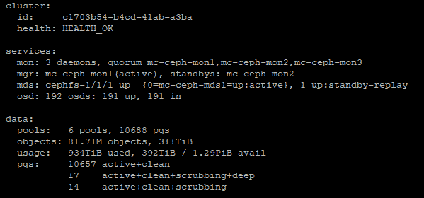

现在我们需要停止所有 OSD 的运行，卸载磁盘，然后按照以下步骤清除它们：

1.  使用以下命令停止 OSD 服务：

```
 sudo systemctl stop ceph-osd@*
```

上述命令给出的输出如下所示：

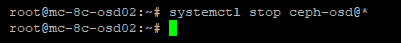

我们可以通过再次使用`ceph -s`命令确认 OSD 已停止，并且 Ceph 仍在正常运行，如下图所示：

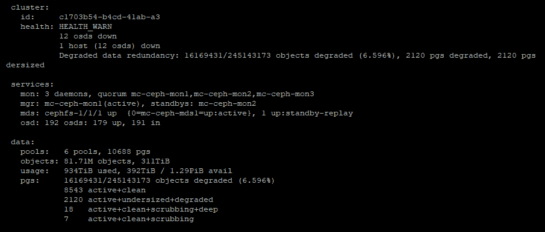

1.  现在，卸载 XFS 分区；可以忽略错误：

```
sudo umount /dev/sd* 
```

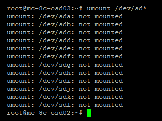

1.  卸载文件系统意味着磁盘不再被锁定，我们可以使用以下代码清除磁盘：

```
sudo ceph-volume lvm zap /dev/sd<x>
```

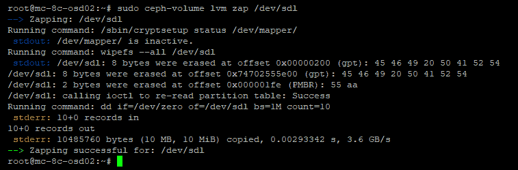

1.  现在，我们还可以编辑闪存设备上的分区表，以删除 filestore 日志并重新创建适合 BlueStore 的 RocksDB 大小，如以下代码所示。在此示例中，闪存设备为 NVMe：

```
sudo fdisk /dev/sd<x>
```

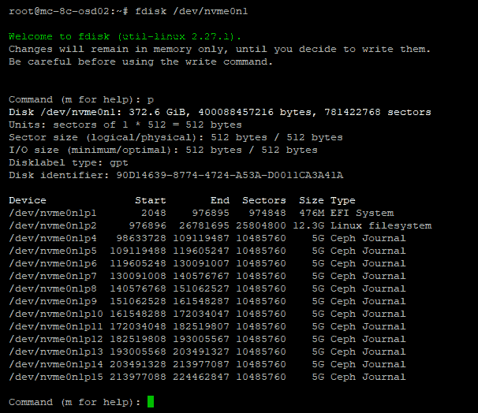

使用`d`命令删除每个 Ceph 日志分区，如下所示：

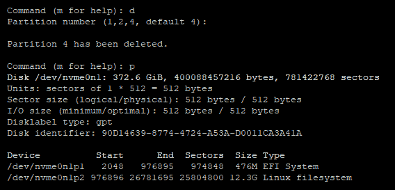

现在为 BlueStore 创建所有新分区，如下图所示：

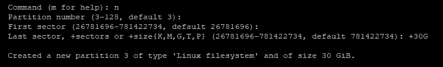

为每个打算创建的 OSD 添加一个分区。完成后，您的分区表应如下所示：

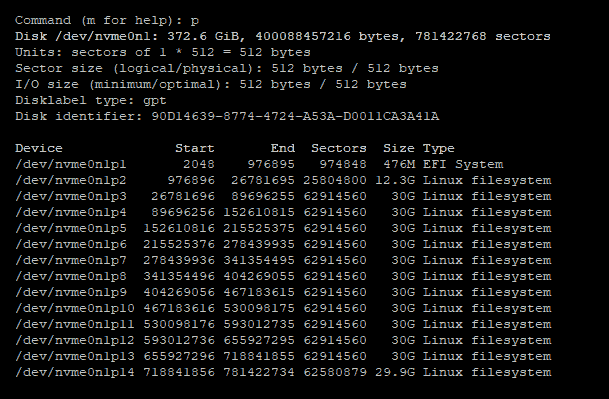

使用`w`命令将新的分区表写入磁盘，如下图所示。执行此操作后，系统会提示您新的分区表当前未在使用中，因此我们需要运行`sudo partprobe`将分区表加载到内核中：

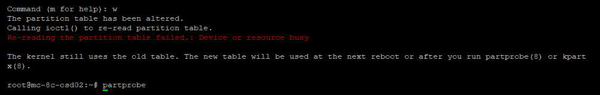

1.  回到你的监视器之一。首先，确认我们将要移除的 OSD，并使用以下`purge`命令移除 OSD：

```
sudo ceph osd tree
```

上述命令输出如下内容：

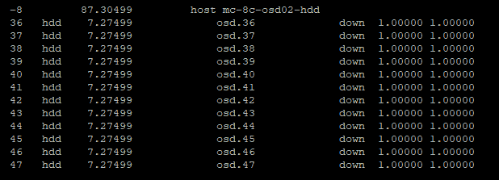

现在，从 Ceph 集群中移除逻辑 OSD 条目——在此示例中，移除 OSD 36：

```
sudo ceph osd purge x --yes-i-really-mean-it
```

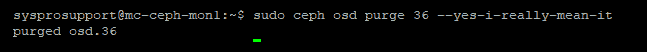

1.  使用`ceph -s`命令检查 Ceph 集群的状态。你现在应该能看到 OSD 已被移除，如下图所示：

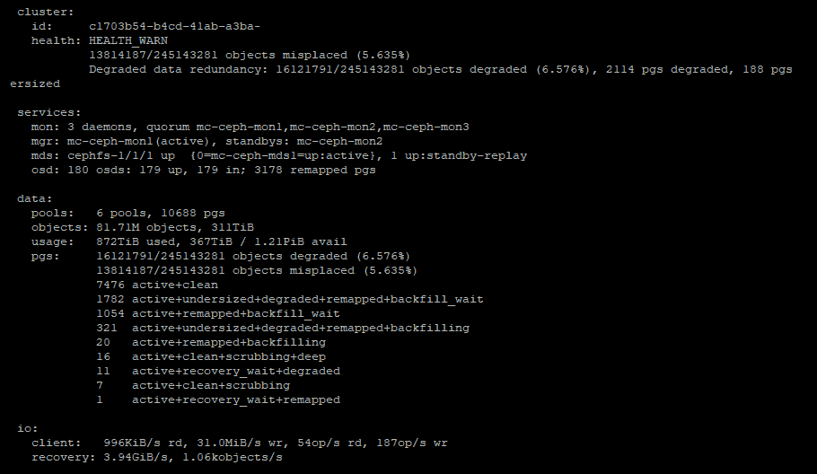

请注意，OSD 的数量已经减少，而且由于 OSD 已从 CRUSH 图中移除，Ceph 现在已开始尝试将丢失的数据恢复到剩余的 OSD 上。最好不要让 Ceph 长时间处于这种状态，以避免不必要的数据移动。

1.  现在发出`ceph-volume`命令，使用以下代码创建`bluestore` OSD。在这个示例中，我们将把数据库存储在单独的闪存设备上，因此需要指定此选项。同时，按照本书的建议，OSD 将进行加密：

```
sudo ceph-volume lvm create --bluestore --data /dev/sd<x> --block.db /dev/sda<ssd> --dmcrypt
```

上述命令会输出大量信息，但如果成功，我们最终会看到如下内容：

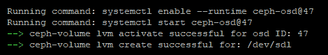

1.  再次使用`ceph-s`命令检查`ceph`的状态，以确保新的 OSD 已添加并且 Ceph 正在将数据恢复到这些 OSD 上，如下图所示：

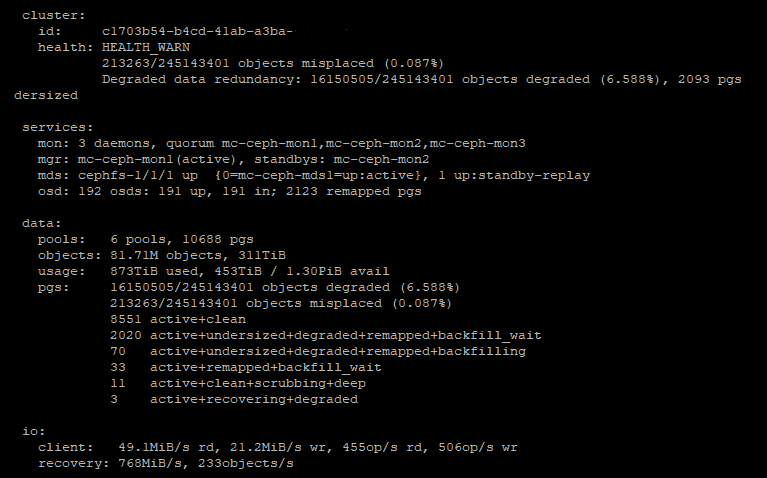

请注意，由于新的 OSD 在升级前已经被放置在 CRUSH 图中的相同位置，现有的错位对象数量几乎为零。Ceph 现在只需要恢复数据，而不是重新分布数据布局。

如果需要进一步升级节点，等待回填过程完成并且 Ceph 状态恢复为`HEALTH_OK`。然后可以继续下一个节点的工作。

如你所见，整体过程非常简单，与替换故障磁盘所需的步骤完全相同。

# 总结

本章我们学习了 Ceph 中的新对象存储——BlueStore。希望你能更好地理解为什么它是必须的，以及现有文件存储设计的局限性。你也应该对 BlueStore 的内部工作有基本了解，并对如何将 OSD 升级到 BlueStore 感到有信心。

在下一章中，我们将探讨如何通过常用存储协议导出 Ceph 存储，以便非 Linux 客户端可以使用 Ceph 存储。

# 问题

1.  在 Luminous 及更高版本中，创建 OSD 时默认使用的对象存储是什么？

1.  BlueStore 内部使用的是哪种数据库？

1.  在 BlueStore 的数据库部分，数据在各个层级之间移动的过程叫什么名字？

1.  将小型写入临时写入 SSD 而不是 HDD 的方法叫什么名字？

1.  如何挂载 BlueFS 并将其作为标准 Linux 文件系统浏览？

1.  BlueStore 中默认使用的压缩算法是什么？

1.  在 BlueStore 数据库中上移一层会使大小增加多少倍？
