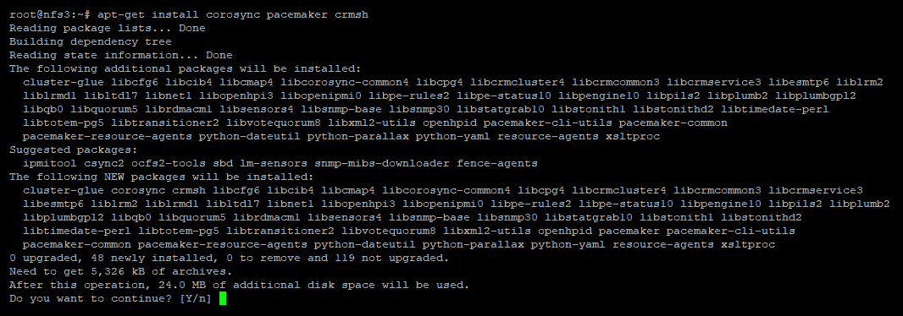
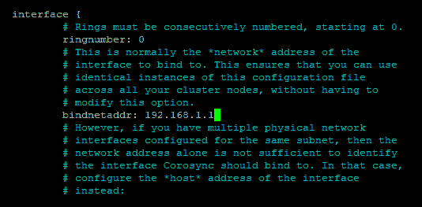

# 第四章：Ceph 与非原生协议

多年的开发使得 Ceph 构建了一个广泛的功能集，为 Linux 提供了高质量、高性能的存储。然而，不能运行 Linux 的客户端（因此无法与 Ceph 直接通信）在 Ceph 的部署范围上受限。最近，已经开发出一些新功能，允许 Ceph 与一些非 Linux 客户端开始进行通信，比如**互联网小型计算机系统接口**（**iSCSI**）和**网络文件系统**（**NFS**）。本章将详细介绍 Ceph 存储如何导出到客户端的不同方法，以及每种方法的优缺点。在所有方法中，都会使用 Linux 服务器作为代理，将这些客户端的 I/O 请求转换为原生 Ceph I/O，因此，了解如何在 Linux 中使用这些协议将是有益的。本章还将介绍如何使这些代理服务器高可用，并探讨相关的困难。

本章将重点讨论两种主要的存储类型：文件存储和块存储，因为这两种存储类型在传统企业工作负载中最为常见。

简要地，我们将在本章中涵盖以下主题：

+   块

+   文件

+   示例：

    +   通过 iSCSI 导出 Ceph RBD

    +   通过 Samba 导出 CephFS

    +   通过 NFS 导出 CephFS

+   ESXi 虚拟化管理程序

+   集群

# 块

块级存储模拟了最初由硬盘提供的存储类型，后来由存储阵列提供。通常，块存储通过光纤通道或 iSCSI 从存储阵列导出到主机，然后在块设备上格式化本地文件系统。在某些情况下，这个文件系统可能是集群类型的，允许在多个主机上同时呈现块设备。需要注意的是，尽管基于块的存储允许你将其呈现给多个主机，但只有在文件系统支持的情况下才应这样做，否则文件系统极有可能发生损坏。

近年来，块存储在虚拟化技术中的应用有了巨大的扩展。块存储通常被呈现给格式化了文件系统的虚拟化管理程序。然后，一个或多个虚拟机以文件的形式存储在这个文件系统上。这与使用 KVM 作为虚拟化管理程序时的原生 Ceph 方式大相径庭；因为 KVM 直接支持 Ceph **RADOS 块设备**（**RBD**），它将每个虚拟机的磁盘直接存储为 RBD，从而消除了虚拟化管理程序文件系统相关的复杂性和开销。

Ceph RBD 是块存储的一种类型，可以通过 iSCSI 导出，允许支持 iSCSI 的客户端使用 Ceph 存储。自 Mimic 版本发布以来，Ceph 对 RBD 映像的 iSCSI 导出配置提供了基本支持。Ceph 的 iSCSI 支持的配置全部通过 Ansible 管理，Ansible 不仅安装所需的软件，还导出 iSCSI 设备。

在写作本文时，读者应注意目前仍然存在一些限制，主要涉及**高可用性**（**HA**）功能。这些问题主要影响 ESXi 和集群解决方案，其中多个主机试图同时访问块设备。在撰写本文时，不推荐您在这两种用例中使用 Ceph 的 iSCSI 支持。对于有兴趣进一步探索当前兼容性的用户，建议他们查阅上游 Ceph 文档和邮件列表。

# 文件

如其名称所示，文件存储由某种形式的文件系统支持，文件系统用于存储文件和目录。在传统的存储场景中，文件存储通常通过充当*文件服务器*的服务器提供，或者通过使用**网络附加存储**（**NAS**）实现。文件存储可以通过多种协议提供，并可以存放在不同类型的文件系统上。

两种最常见的文件访问协议是 SMB 和 NFS，它们广泛被许多客户端支持。SMB 传统上被视为微软协议，是 Windows 中的本地文件共享协议，而 NFS 则被认为是 Unix 基础架构中使用的协议。

正如我们稍后将看到的，Ceph 的 RBD 和其 CephFS 文件系统都可以作为导出文件存储到客户端的基础。RBD 可以挂载在代理服务器上，随后在其上方放置本地文件系统。从这里开始，作为 NFS 或 SMB 导出的过程与任何其他具有本地存储的服务器非常相似。当使用 CephFS 时，作为一个文件系统，它有直接与 NFS 和 SMB 服务器软件的接口，以最小化堆栈中的层级数量。

导出 CephFS 而不是将文件系统置于 RBD 之上的方式有许多优势。这些优势主要集中在简化 I/O 传输的层数和高可用（HA）配置中组件的数量。正如前面所讨论的，大多数本地文件系统一次只能在一个服务器上挂载，否则会发生损坏。因此，在设计涉及 RBD 和本地文件系统的 HA 解决方案时，必须确保集群解决方案不会尝试跨多个节点挂载 RBD 和文件系统。关于这一点，本章后面有关集群部分会详细讨论。

然而，有一个可能的原因是希望导出格式化为本地文件系统的 RBD：Ceph 的 RBD 组件在操作上比 CephFS 更简单，并且比 CephFS 被标记为更稳定的时间更长。虽然 CephFS 已经证明非常稳定，但在考虑解决方案的操作性时，应该确保操作员能够顺利管理 CephFS。

要通过 NFS 导出 CephFS，有两种可能的解决方案。一个是使用 CephFS 内核客户端，将文件系统挂载到操作系统中，然后使用基于内核的 NFS 服务器将其导出到客户端。尽管这种配置应该可以正常工作，但基于内核的 NFS 服务器和 CephFS 客户端通常依赖操作员运行相对较新的内核以支持最新功能。

更好的做法是使用`nfs-ganesha`，它支持直接与 CephFS 文件系统通信。由于 Ganesha 完全在用户空间中运行，因此不需要特定的内核版本，而且支持的 CephFS 客户端功能可以跟上 Ceph 项目的当前状态。Ganesha 中还有一些内核 NFS 服务器不支持的增强功能。此外，使用 Ganesha 实现 HA NFS 应该比使用内核服务器更容易。

Samba 可以用于将 CephFS 导出为与 Windows 兼容的共享。与 NFS 类似，Samba 也支持直接与 CephFS 通信，因此在大多数情况下，应该不需要先将 CephFS 文件系统挂载到操作系统中。可以使用一个单独的项目 CTDB 来为 CephFS 支持的 Samba 共享提供高可用性（HA）。

最后，值得注意的是，尽管 Linux 客户端可以直接挂载 CephFS，但通过 NFS 或 SMB 导出 CephFS 可能仍然更为可取。我们之所以这么做，是因为，考虑到 CephFS 的工作方式，客户端直接与 Ceph 集群进行通信，在某些情况下，这可能由于安全问题而不可取。通过 NFS 重新导出 CephFS，客户端可以在不直接暴露于 Ceph 集群的情况下使用存储。

# 示例

以下示例将演示如何将 RBD 导出为 iSCSI 设备，以及如何通过 NFS 和 Samba 导出 CephFS。所有这些示例都假设您已经有一个准备好的可导出的 CephFS 文件系统；如果不是这种情况，请参考第五章，*RADOS 池和客户端访问*，以获取如何部署 CephFS 的说明。

它们还假设您有一个虚拟机可以作为代理服务器。这可以是一个用于测试目的的 Ceph 监视器虚拟机，但不建议用于生产工作负载。

# 通过 iSCSI 导出 Ceph RBD

iSCSI 是一种通过 IP 网络导出块设备的技术。随着 10 G 网络的广泛采用，iSCSI 已经变得极为流行，现在成为了块存储领域的主流技术。

导出块存储的设备称为 iSCSI 目标，客户端称为 iSCSI 启动器，二者都由 IQN 名称标识。

在写作本文时，Ceph 中的 iSCSI 支持仅适用于基于 Red Hat 的发行版。尽管底层组件应当能够在任何 Linux 发行版上正常工作，但将它们连接在一起的粘合部分仍然需要进行一系列更新以提升兼容性。因此，本示例将需要一台运行 CentOS 的虚拟机，以便安装 iSCSI 组件。如果你在 第二章 中创建的 Vagrant 和 Ansible 实验室中测试功能，*使用容器部署 Ceph*，则可以修改 Vagrant 文件，提供一个额外的运行 CentOS 的虚拟机。

iSCSI 组件的官方包仓库仅通过完整的 RHEL 订阅提供。要获取此示例的包，必须从 Ceph 的项目构建服务器下载。

以下链接将引导您到每个包的最新构建：

+   [`shaman.ceph.com/repos/ceph-iscsi/master/`](https://shaman.ceph.com/repos/ceph-iscsi/master/)

+   [`shaman.ceph.com/repos/kernel/`](https://shaman.ceph.com/repos/kernel/)

+   [`shaman.ceph.com/repos/ceph-iscsi-cli/`](https://shaman.ceph.com/repos/ceph-iscsi-cli/)

+   [`shaman.ceph.com/repos/ceph-iscsi-config/`](https://shaman.ceph.com/repos/ceph-iscsi-config/)

+   [`shaman.ceph.com/repos/python-rtslib/`](https://shaman.ceph.com/repos/python-rtslib/)

+   [`shaman.ceph.com/repos/tcmu-runner/`](https://shaman.ceph.com/repos/tcmu-runner/)

在每一页上，查看架构列，如下所示的屏幕截图。这是您稍后需要查找包的目录：


点击左侧的最新（或您需要的任何版本）构建号，将带您进入以下页面：


点击 Repo URL 链接，这将带您进入仓库目录树。浏览到之前在架构列中看到的正确架构类型，您将看到可下载的 RPM，如下所示的截图所示：


复制 URL，然后使用 `wget` 下载该包，如以下截图所示：


对每个之前列出的 URL 都执行此操作。完成后，您应该拥有以下包：


现在，通过运行以下命令安装所有 RPM 包：

```
yum install *.rpm
```


现在，基础的 iSCSI 支持已安装，我们还需要使用以下代码安装 Ceph 包：

```
rpm --import 'https://download.ceph.com/keys/release.asc'
```

创建一个新的仓库文件，并使用以下代码添加 Ceph RPM 仓库：

```
nano /etc/yum.repos.d/ceph.repo

```


现在添加 Fedora EPEL 仓库，并使用以下代码安装和更新 Ceph：

```
yum install -y https://dl.fedoraproject.org/pub/epel/epel-release-latest-7.noarch.rpm
yum update
yum install ceph
```

如果 Ceph 配置目录尚不存在，请使用以下代码创建：

```
mkdir /etc/ceph
```

使用以下代码从 Ceph 监视节点复制`ceph.conf`：

```
scp mon1:/etc/ceph/ceph.conf /etc/ceph/ceph.conf
```

使用以下代码复制 Ceph `keyring`：

```
scp mon1:/etc/ceph/ceph.client.admin.keyring /etc/ceph/ceph.client.admin.keyring
```

使用以下代码编辑 Ceph iSCSI 网关配置文件：

```
nano /etc/ceph/iscsi-gateway.cfg
```


确保它看起来像前面的截图所示的代码。注意底部添加的行，它允许仅使用一个服务器来测试`ceph-iscsi`。在生产环境中，这一行不需要，因为你很可能会有冗余的 iSCSI 网关。

现在，使用以下代码启用并启动`ceph-iscsi`守护进程：

```
systemctl daemon-reload
systemctl enable rbd-target-api
systemctl start rbd-target-api systemctl enable rbd-target-gw
systemctl start rbd-target-gw
```

请注意，存储在`iscsi-gateway.conf`中的配置仅用于启动`ceph-iscsi`服务并连接到 Ceph 集群。实际的 iSCSI 配置集中存储在 RADOS 对象中。

现在，iSCSI 守护进程正在运行，可以使用`gwcli`工具管理 iSCSI 配置并将 RBDs 呈现为 iSCSI 设备。

一旦`gwcli`成功启动，我们可以运行`ls`命令查看`ceph-iscsi`配置的结构，如下截图所示：


`gwcli`工具已连接到 Ceph 集群并检索了池列表及其他配置。现在我们可以配置 iSCSI 了。

第一个要配置的项是 iSCSI 网关，使用以下代码：

```
cd iscsi-target
create iqn.2003-01.com.redhat.iscsi-gw:iscsi-igw
```


现在，输入已创建的`iqn`，可以使用以下代码将所有网关的 IP 添加进去：

```
cd iqn.2003-01.com.redhat.iscsi-gw:iscsi-igw
cd gateways
create ceph-iscsi 10.176.20.38
```


现在我们可以创建或添加 RBD。如果在运行`create`命令时 RBD 已经存在，那么`ceph-iscsi`将简单地添加现有 RBD；如果没有给定名称的 RBD，则会创建一个新的 RBD。一个常见的例子是，当 RBD 包含数据或我们需要将 RBD 数据放置在纠删码池中时，可能需要使用预先存在的 RBD。

对于这个例子，将在 RBD 池中创建一个 100GB 的 RBD，名为`iscsi-test`，如以下代码所示：

```
cd /disks
create pool=rbd image=iscsi-test size=100G
```


现在需要添加发起者`iqn`并分配 chap 认证，如以下代码所示：

```
cd /iscsi-target/iqn.2003-01.com.redhat.iscsi-gw:iscsi-igw
cd hosts
create iqn.2018-11.com.test:my-test-client
auth chap=chapuser/chappassword
```


最后，使用以下代码将磁盘添加到主机作为 LUN。目标的格式是`<rados pool>.<RBD name>`：

```
disk add rbd.iscsi-test
```


iSCSI 目标配置现在已完成，可以添加到任何 iSCSI 发起者的目标列表中。添加并重新扫描后，RBD 将作为 LUN 显示，然后可以像普通块设备一样处理，并根据需要格式化为任何文件系统。

# 通过 Samba 导出 CephFS

Samba 项目最初是为了允许客户端和服务器通过 Microsoft SMB 协议进行通信。它后来发展成可以充当完整的 Windows 域控制器。由于 Samba 可以作为文件服务器，支持通过 SMB 协议与客户端通信，因此它可以用来将 CephFS 导出给 Windows 客户端。

另有一个名为 CTDB 的独立项目，它与 Samba 配合使用，创建一个故障转移集群，以提供高度可用的 SMB 共享。CTDB 使用恢复锁的概念来检测和处理脑裂情况。传统上，CTDB 使用集群文件系统的某个区域来存储恢复锁文件；然而，这种方法在 CephFS 中效果不好，因为恢复序列的时序与 OSD 和 CephFS MDS 故障转移的时序冲突。因此，开发了一种 RADOS 特定的恢复锁，它允许 CTDB 直接将恢复锁信息存储在 RADOS 对象中，从而避免了上述问题。

在此示例中，将使用一个包含两个代理节点的集群，将 CephFS 上的目录导出为可供 Windows 客户端访问的 SMB 共享。CTDB 将用于提供故障转移功能。此共享还将利用 CephFS 快照，以便在 Windows 文件资源管理器中启用上一个版本的功能。

对于这个例子，您需要两台虚拟机，它们需要具备有效的网络连接，并能够访问您的 Ceph 集群。虚拟机可以是手动创建的、通过 Ansible 在您的实验室中部署的，或者可以在 Ceph 监视器上安装，用于测试 Samba 软件。

使用以下代码在两台虚拟机上安装`ceph`、`ctdb`和`samba`包：

```
sudo apt-get install ceph samba ctdb
```


使用以下代码将`ceph.conf`从 Ceph 监视节点复制过来：

```
scp mon1:/etc/ceph/ceph.conf /etc/ceph/ceph.conf
```

使用以下代码将 Ceph 密钥环从监视节点复制过来：

```
scp mon1:/etc/ceph/ceph.client.admin.keyring /etc/ceph/ceph.client.admin.keyring
```

现在，您的 Samba 网关应该能够作为 Ceph 集群的客户端。这可以通过检查是否能够查询 Ceph 集群的状态来确认。

如前所述，CTDB 有一个 Ceph 插件，可以将恢复锁直接存储在 RADOS 池中。在某些 Linux 发行版中，可能不会随 Samba 和 CTDB 包一起分发此插件；在基于 Debian 的发行版中，目前没有包含该插件。为了解决这个问题并避免手动编译，我们将借用其他发行版中的预编译版本。

使用以下代码从 SUSE 软件库下载` samba-ceph`包：

```
wget http://widehat.opensuse.org/opensuse/update/leap/42.3/oss/x86_64/samba-ceph-4.6.7+git.51.327af8d0a11-6.1.x86_64.rpm
```


使用以下代码安装一个实用工具，以提取 RPM 包的内容：

```
apt-get install rpm2cpio
```


使用以下代码使用`rpm2cpio`工具提取刚刚下载的 RPM 包的内容：

```
rpm2cpio samba-ceph-4.6.7+git.51.327af8d0a11-6.1.x86_64.rpm | cpio -i --make-directories
```


最后，使用以下代码将 CTDB RADOS 助手复制到虚拟机的`bin`文件夹中：

```
cp usr/lib64/ctdb/ctdb_mutex_ceph_rados_helper /usr/local/bin/
```

确保在两个虚拟机上都执行了所有步骤。现在所有必需的软件已经安装完毕，我们可以继续配置 Samba 和 CTDB。CTDB 和 Samba 的配置文件中都包含示例内容。在本示例中，只显示最基本的内容；如果读者希望进一步探索可用的配置选项，可以自行研究：

```
nano /etc/samba/smb.conf
```


```
nano /etc/ctdb/ctdbd.conf
```


```
nano /etc/ctdb/nodes
```

在每一行中，输入参与 CTDB Samba 集群的每个节点的 IP 地址，如以下截图所示：


最后一步是创建一个 Samba 用户，用于访问共享。为此，请使用以下代码：

```
smbpasswd -a test
```


再次确保在两个 Samba 节点上都执行此配置。一旦完成，可以启动 CTDB 服务，它应该能够形成选举并启动 Samba。您可以使用以下代码启动 CTDB 服务：

```
systemctl restart ctdb
```

几秒钟后，CTDB 将开始标记节点为健康状态；可以通过运行以下代码来确认这一点：

```
ctdb status
```

这应该显示一个与以下截图相似的状态：


启动后，状态短时间内不健康是正常的，但如果状态长时间保持这种状态，请检查位于 ` /var/log/ctdb` 的 CTDB 日志，以查看可能的错误原因。

一旦 CTDB 进入健康状态，您应该能够从任何 Windows 客户端访问 CephFS 共享。

为了提供真正的高可用性（HA），您需要使用负载均衡器等机制将客户端引导到活动节点的 IP 地址。这超出了本示例的范围。

# 通过 NFS 导出 CephFS

NFS 是一个文件共享协议，支持 Linux、Windows 和 ESXi 操作系统。因此，将 CephFS 文件系统作为 NFS 共享进行导出，可以使 CephFS 在多种不同类型的客户端之间使用。

Ganesha 是一个用户空间的 NFS 服务器，具有原生的 CephFS 插件，因此它能够直接与 CephFS 文件系统进行通信，而不需要首先将其挂载到本地服务器。它还支持将其配置和恢复信息直接存储在 RADOS 对象中，这有助于实现无状态运行 NFS 服务器。

按照以下步骤安装和配置通过 Ganesha 导出 CephFS：

1.  使用以下代码安装 Ganesha 的 PPA（在写作时 Ganesha 2.7 是最新版本）：

```
add-apt-repository ppa:nfs-ganesha/nfs-ganesha-2.7
```


1.  使用以下代码安装 `libntirpc-1.7` 的 PPA，这是 Ganesha 所需的：

```
add-apt-repository ppa:gluster/libntirpc-1.7
```


1.  使用以下代码安装 Ganesha：

```
apt-get install ceph nfs-ganesha nfs-ganesha-ceph liburcu6
```


1.  使用以下代码将 `ceph.conf` 从 Ceph 监视器节点复制过来：

```
scp mon1:/etc/ceph/ceph.conf /etc/ceph/ceph.conf
```

1.  使用以下代码将 Ceph 密钥环从监视器节点复制过来：

```
scp mon1:/etc/ceph/ceph.client.admin.keyring /etc/ceph/ceph.client.admin.keyring
```

现在 Ganesha 已经安装完成，需要配置它以指向你的 CephFS 文件系统。Ganesha 包中提供了一个示例配置文件，你可以使用这个文件作为基础。首先，使用以下代码将示例的 `Ganesha Ceph 配置` 文件复制为主 `Ganesha 配置` 文件：

```
mv /etc/ganesha/ceph.conf /etc/ganesha/ganesha.conf
```

配置文件中有详细注释，但以下截图展示了一个简化版，其中所有必要的选项都已配置。建议保留默认配置文件，并在需要的地方调整选项，而不是直接覆盖，因为包含的注释非常有助于更好地理解配置选项：


`path config` 变量需要设置为 CephFS 文件系统的根目录，因为 CephFS 当前不正确地支持通过 NFS 导出子目录。

1.  现在使用以下代码启用并启动 `nfs-ganesha` 服务：

```
systemctl enable nfs-ganesha
systemctl start nfs-ganesha
```

现在你应该能够将 NFS 共享挂载到任何兼容的客户端。NFS 共享的名称将是 CephFs。

# ESXi 虚拟化平台

一个相当频繁的需求是能够导出 Ceph 存储并通过 VMware 的 ESXi 虚拟化平台进行使用。ESXi 支持使用其自身的 VMFS 集群文件系统格式化的 iSCSI 块存储和基于文件的 NFS 存储。两者都完全可用且受支持，意味着通常由用户的偏好决定使用哪一种，或者哪一种存储阵列最受支持。

在将 Ceph 存储导出到 ESXi 时，存在一些额外因素需要考虑，这些因素涉及将 Ceph 用作存储提供商时的使用以及在 iSCSI 和 NFS 之间做出选择时的决策。因此，本章的这一部分专门用于解释在将 Ceph 存储呈现给 ESXi 时应考虑的额外因素。

首先需要考虑的是，ESXi 是在考虑企业存储阵列的前提下开发的，在其开发过程中做出了一些设计决策，专门考虑了这些存储阵列的运行。如在开篇章节中所述，直接附加、光纤通道和 iSCSI 阵列的延迟要比分布式网络存储低得多。对于 Ceph，需要额外的跳数，作为 NFS 或 iSCSI 代理；这通常会导致写入延迟是优秀块存储阵列的几倍。

为了配合存储供应商的 QOS 尝试（暂时忽略 VAAI 加速），ESXi 会将任何克隆或迁移操作拆分为较小的 64 KB I/O，其原因是大量并行的 64 KB I/O 比较容易调度磁盘时间，而大规模的多 MB I/O 会占用磁盘操作更长时间。然而，Ceph 更倾向于使用更大的 I/O 大小，因此在克隆或迁移虚拟机时性能较差。此外，根据导出方式的不同，Ceph 可能不会提供预读功能，从而影响顺序读取性能。

另一个需要注意的方面是管理 Ceph PG 锁的影响。当访问 Ceph 中存储的对象时，包含该对象的 PG 会被锁定以保持数据一致性。所有其他对该 PG 的 I/O 操作必须排队，直到锁被释放。对于大多数场景，这个问题影响较小；但是，当将 Ceph 导出到 ESXi 时，ESXi 的一些操作可能会导致 PG 锁的争用。

如前所述，ESXi 通过将 I/O 提交为 64 KB 来迁移虚拟机。它还试图保持 32 个并行操作的流，以确保性能可接受。这在使用 Ceph 作为底层存储时会导致问题，因为这些 64 KB 的 I/O 中有很大一部分会命中同一个 4 MB 对象，这意味着在 32 个并行请求中，每个请求几乎以串行方式处理。可以使用 RBD 条带化来确保这些高度并行但高度本地化的 I/O 被分布到多个对象上，但实际效果可能会有所不同。VAAI 加速可能对某些迁移和克隆操作有所帮助，但在某些情况下，这些加速并不总是可用，因此 ESXi 会回退到默认方法。

与虚拟机迁移相关，如果您使用的是通过 iSCSI 访问 RBD 配置的 VMFS，您可能会在更新仅存储在磁盘小区域中的 VMFS 元数据时遇到 PG 锁竞争。当扩展精简配置的 VMDK 或写入快照的虚拟机文件时，VMFS 元数据通常会进行大量更新。如果多个虚拟机同时尝试更新 VMFS 元数据，PG 锁竞争可能会限制吞吐量。

在撰写本文时，官方的 Ceph iSCSI 支持禁用了 RBD 缓存。对于某些操作，缺少预读缓存会对 I/O 性能产生负面影响。这种情况在需要顺序读取 VMDK 文件时尤为明显，例如在虚拟机在数据存储之间迁移或删除快照时。

关于 HA 支持，在撰写本文时，官方的 Ceph iSCSI 支持仅使用隐式 ALUA 来管理活动的 iSCSI 路径。如果 ESXi 主机故障切换到另一路径，而同一 vSphere 集群中的其他主机仍保持在原路径，则会导致问题。长期解决方案将是切换到显式 ALUA，这样可以让 iSCSI 发起端控制目标端的活动路径，从而确保所有主机都通过相同的路径通信。目前启用完整 HA 堆栈的唯一变通方法是每个数据存储只运行一个虚拟机。

NFS–XFS–RBD 配置与 iSCSI 配置共享许多 PG 锁争用问题，并且受到 XFS 日志引发的争用影响。XFS 日志是一个小型的环形缓冲区，大小为数十 MB，仅覆盖少数几个底层 RADOS 对象。由于 ESXi 通过 NFS 发送同步写入，XFS 的并行写入排队，等待日志写入完成。因为 XFS 不是分布式文件系统，所以在构建 HA 解决方案时，需要采取额外措施来管理 RBD 和 XFS 文件系统的挂载。

最后，我们有 NFS 和 CephFS 方法。由于 CephFS 是一个文件系统，它可以直接导出，这意味着与其他两种方法相比少了一层。此外，由于 CephFS 是一个分布式文件系统，它可以同时挂载到多个代理节点，这意味着需要跟踪和管理的集群对象减少了两个。

还可能通过 NFS 导出单个 CephFS 文件系统，提供一个大型的 ESXi 数据存储，这意味着不需要像使用 RBD 时那样担心在数据存储之间迁移虚拟机。这大大简化了操作，解决了我们迄今为止讨论的许多限制问题。

尽管 CephFS 仍然需要元数据操作，但这些操作的并行处理远远优于 XFS 或 VMFS 中的元数据操作，因此对性能的影响非常小。CephFS 的元数据池也可以放在闪存存储上，以进一步提高性能。元数据更新的处理方式也大大降低了 PG 锁定的发生频率，这意味着数据存储上的并行性能不受限制。

如前所述，在 NFS 部分，CephFS 可以通过 Ganesha FSAL 直接导出，或者通过 Linux 内核挂载后再导出。出于性能考虑，目前推荐通过内核挂载并导出的方式。

在决定哪种方法最适合您的环境之前，建议您进一步研究每种方法，并确保您能够顺利管理该解决方案。

# 集群

集群的目标是通过让单点故障跨多个服务器运行，从而提高服务的可靠性。理论上，这听起来相对简单：如果服务器 A 宕机，便在服务器 B 上启动服务。然而，在实践中，有几个需要考虑的因素；否则，存在可用性可能比单台服务器更差，甚至更糟的是可能发生数据损坏的风险。高可用性非常难以实现，但很容易出错。

# 脑裂

集群中需要解决的第一个问题是节点断开连接且无法互相知晓对方状态的情况。此状态被称为脑裂。在一个两节点的集群中，每个节点无法知道与另一个节点失去通信的原因是因为另一个节点已经宕机，还是因为某种形式的网络中断。在后者的情况下，如果做出错误的假设，并在两个节点上都启动资源，就会导致数据损坏。解决脑裂问题的方法是确保集群总是有奇数个节点；这样，至少两个节点总能形成仲裁并达成共识，确认哪个节点出现了故障。

然而，即使节点已经形成了仲裁，当剩余节点重新启动资源时，仍然不安全。以节点看似离线为例，可能是由于网络分区，或者是服务器负载过高，导致没有及时响应。如果剩余节点自己重新启动服务，如果这个无法响应的节点重新上线，可能会发生什么？为了应对这种情况，我们需要确保集群随时能够 100%确认所有节点和资源的状态。这可以通过围栏机制来实现。

# 围栏

围栏是一个限制资源运行的过程，前提是集群状态有一致的视图。它还通过控制集群节点的电源状态或其他方法，帮助将集群恢复到已知状态。如前所述，如果集群不能确定集群节点的当前状态，其他节点无法简单地重新启动服务，因为无法知道受影响的节点是否已经真正宕机，或者仍在运行那些资源。除非配置了数据一致性风险，否则集群将无限期地等待，直到它可以确定状态，并且除非受影响的节点自行恢复，否则集群资源将保持离线状态。

解决方案是使用 STONITH 等方法进行隔离，其设计目的是通过操作外部控制机制将集群恢复到正常状态。最流行的方法是使用服务器的内置 IPMI 功能来对节点进行电源循环。由于服务器的 IPMI 是操作系统外部的，并且通常连接到与服务器 LAN 不同的网络，因此几乎不可能受到导致服务器脱机的问题的影响。通过对服务器进行电源循环并从 IPMI 获得确认，集群现在可以完全确定集群资源不再在该节点上运行。然后，集群可以安全地在其他节点上重新启动资源，而无需担心冲突或损坏。

# Pacemaker 和 corosync

在 Linux 上最广泛使用的集群解决方案是 pacemaker 和 corosync 的组合。Corosync 负责节点之间的消息传递和确保一致的集群状态，而 pacemaker 则负责在此集群状态的基础上管理资源。pacemaker 提供了大量的资源代理，支持广泛的服务集群化，包括一些常见服务器 IPMI 的 STONITH 代理。

它们都可以由多种不同的客户端工具管理，最常见的是 `pcs` 和 `crmsh`。以下教程将重点介绍 `crmsh` 工具集。

# 创建由 CephFS 支持的高可用 NFS 共享

在本示例中，需要三个 VM 才能形成集群节点。在所有三个 VM 上执行以下步骤：

1.  使用以下代码安装 `corosync`、`pacemaker` 和 `cmrsh` 工具集：

```
apt-get install corosync pacemaker crmsh
```



1.  编辑 `corosync` 配置文件，并将绑定地址 (`bindnetaddr`) 更改为与 VM 上配置的 IP 匹配，使用以下代码：

```
nano /etc/corosync/corosync.conf
```



1.  使用以下代码启用并启动 `corosync` 服务：


1.  在所有节点完成这些步骤后，检查集群的状态。您应该看到所有三个节点都已加入集群，如以下截图所示：


注意到显示的是`No resources`。这是因为，尽管集群正在运行，节点已成为成员，但尚未配置任何资源。需要一个虚拟 IP 资源，这是 NFS 客户端将要连接的资源。同时，还需要一个控制 Ganesha 服务的资源。资源由资源代理管理。资源代理通常是一些脚本，包含一系列标准函数，pacemaker 会调用这些函数来启动、停止和监控资源。标准的 pacemaker 安装包含了大量的资源代理，但如果需要，编写自定义的资源代理并不困难。

1.  如本节开始时所讨论的，围栏（fencing）和 STONITH 是高可用集群的核心部分；然而，在构建测试环境时，实施 STONITH 可能会很困难。默认情况下，如果没有配置 STONITH 配置，pacemaker 将不允许你启动任何资源。因此，在这个示例中，应该使用以下命令禁用 STONITH：

```
crm configure property stonith-enabled=false
```


1.  现在集群已经准备好创建资源，让我们使用以下代码创建虚拟 IP 资源：

```
crm configure primitive p_VIP-NFS ocf:heartbeat:IPaddr params ip=192.168.1.1 op monitor interval=10s
```


从前面的截图中可以看到，虚拟 IP 已经启动，并且现在正在节点 `nfs1` 上运行。如果节点 `nfs1` 变得不可用，集群将尝试通过将资源迁移到其他节点来保持资源的运行。

现在，和之前的 NFS 部分一样，让我们通过以下步骤安装 Ganesha 的最新版本：

1.  使用以下代码安装 Ganesha PPA（`ganesha 2.7` 是本文撰写时的最新版本）：

```
add-apt-repository ppa:nfs-ganesha/nfs-ganesha-2.7
```


1.  使用以下代码安装 Ganesha 所需的 `libntirpc-1.7` PPA：

```
add-apt-repository ppa:gluster/libntirpc-1.7 
```


1.  使用以下代码安装 Ganesha：

```
apt-get install ceph nfs-ganesha nfs-ganesha-ceph liburcu6
```


1.  使用以下代码从 Ceph 监视节点复制 `ceph.conf`：

```
scp mon1:/etc/ceph/ceph.conf /etc/ceph/ceph.conf
```

1.  使用以下代码从监视节点复制 Ceph 密钥环：

```
scp mon1:/etc/ceph/ceph.client.admin.keyring /etc/ceph/ceph.client.admin.keyring
```

1.  现在 Ganesha 已经安装完成，可以应用配置。可以使用来自独立 Ganesha 部分的相同配置，如下图所示：


与独立示例不同，我们必须确保 Ganesha 不会单独运行，只有 pacemaker 才能启动它。

现在，所有配置工作已完成，可以使用以下代码将 pacemaker 资源添加到控制 Ganesha 的运行：

```
crm configure primitive p_ganesha systemd:nfs-ganesha op monitor interval=10s
```

最后，我们需要确保 Ganesha 服务与虚拟 IP 在同一节点上运行。我们可以通过使用以下代码创建一个组资源来实现这一点。组资源确保所有资源在同一节点上一起运行，并且按定义的顺序启动：

```
crm configure group g_NFS p_VIP-NFS p_ganesha
```

现在，如果我们检查集群状态，可以看到 Ganesha 服务正在运行，并且由于分组，它与虚拟 IP 运行在同一节点上，如下图所示：


NFS 客户端现在应该能够连接到虚拟 IP 并映射 NFS 共享。如果集群节点发生故障，虚拟 IP 和 Ganesha 服务将迁移到另一个集群节点，客户端应该只会看到短暂的服务中断。

为了检查故障转移能力，我们可以将运行中的集群节点置为`standby`模式，强制 Pacemaker 将资源转移到另一个节点上。

在当前示例中，资源正在节点`nfs2`上运行，命令如下：

```
crm node standby nfs2
```


我们现在可以看到节点`nfs2`已经进入`standby`模式，资源已迁移并在节点`nfs3`上运行。

# 总结

在本章中，你了解了不同的存储协议以及它们如何与 Ceph 的功能相匹配。你还学会了哪些协议最适合某些角色，并且应该能够在选择时做出明智的决策。

完成这些示例后，你应该也能清楚地理解如何通过 iSCSI、NFS 和 SMB 导出 Ceph 存储，使非本地 Ceph 客户端能够使用 Ceph 存储。

最后，你还应该了解设计和构建一个可用的故障转移集群的要求，能够为非本地客户端提供高可用的 Ceph 存储。

在下一章，我们将讨论不同类型的 RADOS 池和可以配置的不同类型的 Ceph 存储。

# 问题

1.  本章讨论的三种存储协议是什么？

1.  通常使用哪种存储协议通过 IP 网络提供块存储？

1.  Windows 客户端主要使用哪种存储协议？

1.  用户空间的 NFS 服务器叫什么？

1.  用于构建故障转移集群的两个软件是什么？

1.  为什么你可能想通过 NFS 将 CephFS 导出到 Linux 客户端？
