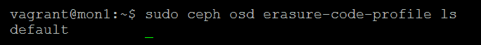
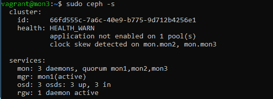
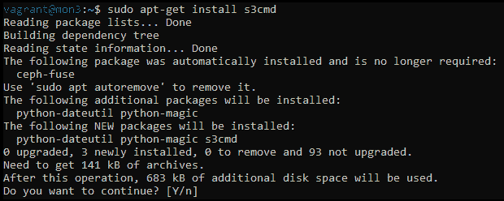

# RADOS 池和客户端访问

Ceph 提供了多种不同的池类型和配置。它还支持几种不同的数据存储类型，为客户端提供存储。本章将探讨复制和消除码池之间的区别，并示例创建和维护两者的方法。然后我们将介绍如何为 RADOS 块设备（**RBD**）、对象和 CephFS 使用这些池。最后，我们将看看如何对不同类型的存储方法进行快照。本章涵盖以下主题：

+   池

+   Ceph 存储类型

# 池

RADOS 池是 Ceph 集群的核心部分。创建 RADOS 池驱动了放置组的创建和分布，它们本身是 Ceph 的自治部分。可以创建两种类型的池，即复制和消除码，提供不同的可用容量、耐用性和性能。然后，RADOS 池可以用于通过 RBS、CephFS 和 RGW 为客户端提供不同的存储解决方案，或者用于启用层次化性能覆盖其他 RADOS 池。

# 复制池

在 Ceph 中，复制的 RADOS 池是默认的池类型；数据从客户端接收到主要的 OSD，然后复制到其余的 OSD。复制的逻辑相对简单，只需最少的处理来计算和在 OSD 之间复制数据。然而，由于数据完全复制，写入惩罚较大，因为数据必须多次写入各个 OSD。默认情况下，Ceph 将使用 3 倍的复制因子，因此所有数据将被写入三次；这并不考虑可能存在于 Ceph 堆栈下游的任何其他写入放大。这种写入惩罚有两个主要缺点：显然会给 Ceph 集群增加更多的 I/O 负载，因为需要写入更多数据，在 SSD 的情况下，这些额外的写入将更快地磨损闪存单元。然而，正如我们将在*消除码池*部分看到的那样，对于较小的 I/O，更简单的复制策略实际上导致所需的总操作更少——无论 I/O 的大小如何，总是存在固定的 3 倍写入惩罚。

还应该注意，尽管在客户端写入操作期间将对象的所有副本都写入，但在读取对象时，只涉及保存对象副本的主要 OSD。客户端也仅将写操作发送到主要 OSD，然后主要 OSD 将操作发送到其余副本。这种行为有多种原因，但主要是为了确保读取的一致性。

如上所述，默认的复制大小为 3，需要至少两个副本以接受客户端 I/O。不推荐减少这些值，增加它们可能对增加数据耐久性几乎没有影响，因为丢失所有共享相同 PG 的三个 OSD 的机会极其罕见。由于 Ceph 将优先恢复副本最少的 PG，这进一步减少了数据丢失的风险，因此，将副本数量增加到四个只有在提高数据可用性时才有益，其中两个共享相同 PG 的 OSD 可以丢失并允许 Ceph 继续为客户端 I/O 提供服务。但是，由于四个副本的存储开销，建议此时考虑使用纠删码。随着 NVMes 的引入，由于其更快的性能可以减少重建时间，使用副本大小为 2 仍然可以提供合理的数据耐久性。

要创建一个复制池，请发出如下示例中的命令：

```
ceph osd pool create MyPool 128 128 replicated
```

这将创建一个包含`128`个放置组的复制池，称为`MyPool`。

# 纠删码池

Ceph 的默认复制级别通过在不同的 OSD 上存储数据的三个副本，提供了极好的数据丢失保护。然而，存储数据的三个副本大大增加了硬件的购买成本以及相关的运营成本，如电力和冷却。此外，存储副本也意味着对于每个客户端写入，后端存储必须写入三倍的数据量。在某些情况下，这些缺点可能意味着 Ceph 不是一个可行的选择。

纠删码旨在提供解决方案。就像 RAID 5 和 6 相对于 RAID 1 提供了更高的可用存储容量一样，纠删码允许 Ceph 从相同的原始容量提供更多的可用存储。然而，就像基于奇偶校验的 RAID 级别一样，纠删码也带来了自己的一系列缺点。

# 什么是纠删码？

**纠删码**允许 Ceph 通过将对象分割为若干部分，然后计算一种类型的**循环冗余校验**（**CRC**），即纠删码，然后将结果存储在一个或多个额外的部分中，实现更大的可用存储容量或在相同数量的磁盘故障时增加的弹性，相对于标准的复制方法。纠删码通过在单独的 OSD 上存储这些部分来实现这一点。这些部分被称为*K*和*M*块，其中*K*指的是数据碎片的数量，*M*指的是纠删码碎片的数量。与 RAID 一样，这些通常可以表示为*K+M*，或者例如*4+2*。

如果包含对象碎片的 OSD 发生故障，该碎片是计算擦除码之一，则数据将从存储数据没有影响的其余 OSD 中读取。然而，如果包含对象数据碎片的 OSD 发生故障，Ceph 可以使用擦除码从剩余数据和擦除码碎片的组合中数学上重新创建数据。

# K+M

拥有更多的擦除码碎片（*erasure code shards*），可以容忍更多的 OSD 故障，并且仍然可以成功读取数据。同样，对象分割为*K*和*M*碎片的比率直接影响每个对象所需的原始存储百分比。

*3+1*配置将为您提供 75%的可用容量，但仅允许单个 OSD 故障，因此不建议使用。相比之下，三倍复制池只能提供 33%的可用容量。

*4+2*配置将为您提供 66%的可用容量，并允许两个 OSD 故障。这可能是大多数人使用的良好配置。

另一方面，*18+2*将为您提供 90%的可用容量，并且仍然允许两个 OSD 故障。表面上，这听起来是一个理想的选择，但更多的碎片总数会带来成本。更多的碎片总数会对性能产生负面影响，并增加 CPU 需求。同样大小的 4 MB 对象在复制池中将作为整个单一对象存储，现在将被分割成 20 个 200 KB 的块，这些块必须被跟踪并写入 20 个不同的 OSD。旋转磁盘将展示更快的带宽，以 MBps 为单位，使用更大的 I/O 大小进行测量，但在更小的 I/O 大小下，带宽急剧下降。这些更小的碎片将生成大量的小型 I/O，并对一些集群增加额外负载。

另外，重要的是不要忘记这些碎片需要根据 CRUSH 映射规则分布在不同的主机上：属于同一对象的任何碎片不能存储在同一主机上的另一个碎片上。某些集群可能没有足够数量的主机来满足此要求。如果无法满足 CRUSH 规则，PGs 将无法变为活动状态，并且任何发送到这些 PG 的 I/O 将被停止，因此了解对集群健康的影响对于进行 CRUSH 修改至关重要。

从这些大块池中读取数据也是一个问题。与副本池不同，在副本池中，Ceph 可以从对象中的任何偏移位置读取请求的数据，而在擦除池中，必须读取来自所有 OSD 的所有分片，才能满足读取请求。在*18+2*的示例中，这可能大幅增加所需的磁盘读取操作数量，平均延迟也会因此增加。这种行为是一个副作用，通常只会在使用大量分片的池中导致性能影响。在某些情况下，*4+2*配置相比副本池能获得性能提升，这是因为对象被分割成多个分片。由于数据实际上被条带化存储在多个 OSD 上，每个 OSD 需要写入的数据更少，而且没有二级和三级副本需要写入。

擦除编码也可以用来提高耐久性，而不仅仅是最大化可用存储空间。例如，一个*4+4*池：它的存储效率为 50%，所以它比 3x 副本池更好，但它可以在没有数据丢失的情况下承受最多四个 OSD 的损失。

# 擦除编码在 Ceph 中是如何工作的？

与复制一样，Ceph 也有主 OSD 的概念，这在使用擦除编码池时也存在。主 OSD 负责与客户端进行通信，计算擦除分片，并将其发送到 PG 集合中的其余 OSD。下图说明了这一点：


如果集合中的某个 OSD 宕机，主 OSD 可以使用剩余的数据和擦除分片来重建数据，然后将其发送回客户端。在读操作期间，主 OSD 会请求 PG 集合中的所有 OSD 发送它们的分片。主 OSD 使用数据分片中的数据来构建请求的数据，而擦除分片则会被丢弃。擦除池可以启用快速读取选项，允许主 OSD 从擦除分片中重建数据，如果它们比数据分片返回得更快。这可以帮助降低平均延迟，但会稍微增加 CPU 使用率。下图展示了 Ceph 如何从擦除编码池读取数据：


下图展示了当数据分片不可用时，Ceph 如何从擦除池中读取数据。数据通过反向擦除算法进行重建，使用剩余的数据和擦除分片：


# 算法和配置文件

你可以使用多种不同的**擦除**插件来创建你的擦除编码池。

# Jerasure

Ceph 中的默认擦除插件是**jerasure**插件，它是一个高度优化的开源擦除编码库。该库有多种不同的技术可用于计算擦除码。默认使用的是**Reed-Solomon**，这在现代处理器上提供了良好的性能，因为该技术可以加速使用的指令。

还有许多其他的 jerasure 技术可以使用，它们都有固定数量的 *M* 分片。如果你只打算使用两个 *M* 分片，它们是很好的候选者，因为它们的固定大小意味着可以进行优化，从而提升性能。每种优化技术除了只支持两个纠删分片外，通常还对总分片数量有一定要求。以下是每种优化技术的简要描述：

+   `reed_sol_van`: 默认技术，支持 *k+m* 分片数量的完全灵活性，但也是最慢的。

+   `reed_sol_r6_op`: 默认技术的优化版，适用于 *m=2* 的使用场景。尽管它比未优化版本快，但不如其他版本快。然而，*k* 分片的数量是灵活的。

+   `cauchy_orig`: 优于默认技术，但最好使用 `cauchy_good`。

+   `cauchy_good`: 在保持分片配置完全灵活性的同时，表现适中。

+   `liberation`: 总分片数量必须为质数且 *m=2*，因此 *3+2*、*5+2* 或 *9+2* 都是不错的候选者，性能极佳。

+   `liber8tion`: 总分片数量必须为 *8* 且 *m=2*，仅 *6+2* 可用，但性能极佳。

+   `blaum_roth`: 总分片数量必须比质数少一个且 *m=2*，因此理想的配置是 *4+2*，性能极佳。

一如既往，应该在将任何生产数据存储到纠删码池之前进行基准测试，以识别最适合你工作负载的技术。

通常情况下，除非其他配置有明显优势，否则应优先使用 jerasure 配置，因为它提供了均衡的性能，并经过充分测试。

# ISA

ISA 库设计用于支持英特尔处理器，并提供增强的性能。它支持 Reed-Solomon 和 Cauchy 技术。

# LRC

在分布式存储系统中使用纠删码的一个缺点是，恢复操作可能会对主机间的网络造成很大压力。由于每个分片存储在不同的主机上，恢复操作需要多个主机参与。当 CRUSH 拓扑跨越多个机架时，这会对机架间的网络链路造成压力。**本地可修复纠删码** (**LRC**) 插件增加了一个额外的奇偶校验分片，这个分片是本地存储在每个 OSD 节点的。这使得恢复操作可以保持在 OSD 故障的节点本地进行，而无需其他节点从所有剩余分片持有节点接收数据。

然而，添加这些本地恢复码确实会影响给定磁盘数量的可用存储量。在发生多磁盘故障时，LRC 插件必须转而使用全局恢复，就像 jerasure 插件一样。

# SHEC

SHEC 配置文件与 LRC 插件的目标类似，都是为了减少恢复过程中网络带宽的需求。然而，SHEC 并不像 LRC 那样在每个节点上创建额外的奇偶校验碎片，而是通过重叠的方式将碎片分布在多个 OSD 中。插件名称中的*shingle*部分代表了数据分布方式，类似于房屋屋顶上的瓦片重叠。通过在 OSD 之间重叠奇偶校验碎片，SHEC 插件减少了单盘和多盘故障恢复时的资源需求。

# 擦除编码池的覆盖写支持

尽管擦除编码池的支持已经在 Ceph 的多个版本中推出，但在 Luminous 版本引入 BlueStore 之前，Ceph 并不支持部分写入。这个限制意味着擦除池无法直接用于 RBD 和 CephFS 工作负载。随着 Luminous 版本中 BlueStore 的引入，为部分写入支持的实现奠定了基础。引入部分写入支持后，擦除池能够支持的 I/O 类型几乎与复制池相匹配，从而使擦除编码池可以直接用于 RBD 和 CephFS 工作负载。这大大降低了这些用例的存储容量成本。

对于完全条带写入，这种情况发生在新对象或者整个对象被重写时，写入惩罚大大减少。一个客户端将一个 4MB 的对象写入一个 4+2 擦除编码池时，只需要写入 6MB 的数据，其中 4MB 是数据块，2MB 是擦除编码块。与在复制池中写入 12MB 数据相比，这大大减少了数据量。然而，需要注意的是，每个擦除条带的块会被写入到不同的 OSD 中。对于较小的擦除配置文件，例如*4+2*，这通常会显著提升旋转磁盘和 SSD 的性能，因为每个 OSD 写入的数据量较少。然而，对于较大的擦除条带，随着需要写入的 OSD 数量不断增加，这种增加的开销开始抵消减少写入数据量的好处，尤其是在旋转磁盘上，因为其延迟与 I/O 大小并不成线性关系。

Ceph 的用户空间客户端，如`librbd`和`libcephfs`，足够智能，能够将较小的 I/O 操作批量合并，并在可能的情况下提交一个完整的条带写入；当应用程序之前提交的是顺序 I/O 操作，但未对齐到 4MB 对象边界时，这可以提供帮助。

部分写入支持允许对对象进行覆盖写入；这会引入一些复杂性，因为当进行部分写入时，擦除块也需要更新，以匹配新的对象内容。这与 RAID 5 和 RAID 6 面临的挑战非常相似，尽管需要在多个 OSD 之间协调这一过程，并保持一致性，增加了复杂性。当进行部分写入时，Ceph 首先从磁盘读取整个现有对象，然后必须在内存中合并新的写入，计算新的擦除编码块，并将所有内容写回磁盘。因此，不仅涉及读写操作，而且每个操作可能会涉及多个磁盘，形成擦除条带。正如你所看到的，一个 I/O 操作最终可能会比复制池的写入惩罚高出几倍。对于一个*4+2*擦除编码池，一个小的 4 KB 写入可能会将 12 个 I/O 提交到集群中的磁盘，而不考虑任何额外的 Ceph 开销。

# 创建擦除编码池

让我们再次启动测试集群并切换到 Linux 的超级用户模式，这样就不需要在每个命令前面加上`sudo`了。

擦除编码池通过使用擦除配置文件来控制；这些配置文件控制每个对象被分割成多少个碎片，包括数据碎片和擦除碎片之间的分配。配置文件还包括确定使用哪个擦除编码插件来计算哈希值的配置。

以下插件可供使用：

+   Jerasure

+   ISA

+   LRC

+   **叠加擦除编码**（**SHEC**）

要查看擦除配置文件列表，请运行以下命令：

```
 # ceph osd erasure-code-profile ls
```

你可以看到，在 Ceph 的全新安装中存在一个`default`配置文件：



让我们使用以下命令查看它包含的配置选项：

```
 # ceph osd erasure-code-profile get default
```

`default`配置文件指定将使用 jerasure 插件和 Reed-Solomon 错误纠正码，并将对象分割为`2`个数据碎片和`1`个擦除碎片：


这对于我们的测试集群几乎是完美的；然而，为了完成这次练习，我们将使用以下命令创建一个新配置文件：

```
 # ceph osd erasure-code-profile set example_profile k=2 m=1
    plugin=jerasure technique=reed_sol_van # ceph osd erasure-code-profile ls
```

你可以看到我们的新`example_profile`已经创建：


现在，让我们使用此配置文件创建擦除编码池：

```
 # ceph osd pool create ecpool 128 128 erasure example_profile
```

前面的命令给出了以下输出：


前面的命令指示 Ceph 创建一个名为`ecpool`的新池，并使用`128`个 PG。它应该是一个擦除编码池，并且应该使用我们之前创建的`example_profile`。

让我们创建一个包含小文本字符串的对象，然后通过读取它来证明数据已经被存储：

```
 # echo "I am test data for a test object" | rados --pool
    ecpool put Test1 –
    # rados --pool ecpool get Test1 -
```

这证明了擦除编码池正在正常工作，但这并不是最令人激动的发现：


让我们检查一下是否能够看到更低层级发生的事情。

首先，找出存储我们刚创建的对象的 PG：

```
 # ceph osd map ecpool Test1
```

前面的命令结果告诉我们，在这个示例 Ceph 集群中，PG `3.40` 对象被存储在 OSDs `1`、`2` 和 `0` 中。这是显而易见的，因为我们只有三个 OSD，但在更大的集群中，这是一个非常有用的信息：


PG 在你的测试集群中可能不同，因此请确保 PG 文件夹结构与前面 `ceph osd map` 命令的输出匹配。

如果你使用的是 BlueStore，默认情况下 OSD 的文件结构无法查看。然而，你可以在停止的 OSD 上使用以下命令，将 BlueStore OSD 挂载为 Linux 文件系统。

我们现在可以查看 OSD 的文件夹结构，使用以下命令查看对象是如何被拆分的：

```
ceph-objectstore-tool --op fuse --data-path /var/lib/ceph/osd/ceph-0 --mountpoint /mnt
```

以下示例使用的是 filestore；如果使用的是 BlueStore，请用前面命令中 `/mnt` 挂载点的内容替换 OSD 路径：

```
 ls -l /var/lib/ceph/osd/ceph-2/current/1.40s0_head/
```

前面的命令给出了以下输出：


```
 # ls -l /var/lib/ceph/osd/ceph-1/current/1.40s1_head/
```

前面的命令给出了以下输出：


```
 # ls -l /var/lib/ceph/osd/ceph-0/current/1.40s2_head/ total 4
```

前面的命令给出了以下输出：


注意，PG 目录名已附加到分片编号上，并且复制池的目录名仅包含 PG 编号。如果你检查对象文件的内容，你会看到我们在创建对象时输入的文本字符串。然而，由于文本字符串的大小较小，Ceph 用空字符填充了第二个分片和擦除分片；因此，它们的内容与第一个分片相同。你可以用一个包含更多文本的新对象重复这个示例，看看 Ceph 是如何将文本拆分成分片并计算擦除码的。

# 排查 2147483647 错误

本小节包含在擦除编码中，而不是本书的第十一章 *故障排除* 部分，因为它通常出现在擦除编码池中，因此与本章非常相关。以下屏幕截图显示了运行 `ceph health detail` 命令时出现的错误示例：


如果你看到`2147483647`作为擦除编码池的一个 OSD，通常意味着 CRUSH 无法找到足够的 OSD 来完成 PG 对等过程。这通常是由于 K+M 碎片数大于 CRUSH 拓扑中主机数量。然而，在某些情况下，即使主机数量等于或大于碎片数量，这个错误仍然可能发生。在这种情况下，了解 CRUSH 如何选择 OSD 作为数据放置的候选项非常重要。当 CRUSH 用于查找 PG 的候选 OSD 时，它会应用 CRUSH 映射以找到 CRUSH 拓扑中的合适位置。如果结果与之前选定的 OSD 相同，Ceph 会通过向 CRUSH 算法传入略有不同的值来重新生成另一个映射。在某些情况下，如果主机数量与擦除碎片数量相似，CRUSH 可能会在找到正确的 OSD 映射之前耗尽尝试次数。较新的 Ceph 版本已经通过增加 CRUSH 可调参数`choose_total_tries`大多数解决了这些问题。

# 复现问题

为了更详细地帮助我们理解问题，接下来的步骤将展示如何创建一个需要比我们三节点集群支持更多碎片的`erasure-code-profile`。

如同本章早些时候所做的那样，创建一个新的擦除配置文件，但将 K/M 参数修改为`k=3`和`m=1`：

```
 $ ceph osd erasure-code-profile set broken_profile k=3 m=1
    plugin=jerasure technique=reed_sol_van
```

现在创建一个池：

```
 $ ceph osd pool create broken_ecpool 128 128 erasure broken_profile
```

如果我们查看`ceph -s`的输出，我们将看到该新池的 PG 卡在创建状态：


`ceph health detail`的输出显示了原因，并且我们看到`2147483647`错误：


如果你遇到此错误，并且它是由于你的擦除配置文件大于你的主机或机架数量而导致的，根据你设计的 CRUSH 映射，唯一的解决办法是减少碎片数量或增加主机数量。

要创建一个擦除编码池，请发出如下命令：

```
ceph osd pool create MyECPool 128 128 erasure MyECProfile
```

这将创建一个具有 128 个放置组的擦除编码池，名为`MyECPool`，并使用名为`MyECProfile`的擦除编码配置文件。

尽管部分写入使擦除编码池在支持的功能方面几乎与复制池相媲美，但它们仍然无法存储所有 RBD 所需的数据。因此，在创建 RBD 时，必须将 RBD 头对象放置在一个复制的 RADOS 池中，然后指定该 RBD 的数据对象应存储在擦除编码池中。

# 清理

为了防止位腐化，Ceph 定期运行名为 scrubbing 的过程，以验证存储在 OSD 上的数据。scrubbing 过程在 PG 级别进行，比对所有参与的 OSD 上每个 PG 的内容，检查每个 OSD 是否具有相同的内容。如果发现某个 OSD 上的对象副本与其他 OSD 不同，甚至缺少该对象，PG 会被标记为不一致。可以通过指示 Ceph 修复 PG 来修复不一致的 PG；这一过程将在第十一章中详细讲解，*故障排除*。

Scrubbing 有两种类型：正常和深度。正常 scrubbing 仅检查对象是否存在及其元数据是否正确；深度 scrubbing 是指对实际数据进行比较。深度 scrubbing 通常比正常 scrubbing 更加 I/O 密集。

尽管 BlueStore 现在支持校验和，但 scrubbing 的需求并没有完全消失。BlueStore 仅比较正在主动读取的数据的校验和，因此对于很少写入的冷数据，可能会发生数据丢失或损坏，只有 scrubbing 过程才能检测到这一点。

有一些 scrubbing 调优选项将在第九章中讲解，*调优 Ceph*；它们会影响 scrubbing 过程的调度时机以及对客户端 I/O 的影响。

# Ceph 存储类型

尽管 Ceph 通过 RADOS 层提供基本的对象存储，但单独使用它并不方便，因为直接使用 RADOS 存储的应用场景极为有限。因此，Ceph 在基础 RADOS 能力的基础上构建，并提供更高级的存储类型，使客户端更容易使用。

# RBD

RBD 简称，是 Ceph 存储可以呈现为标准 Linux 块设备的方式。RBD 由多个对象组成，默认每个对象为 4 MB，这些对象被串联在一起。一个 4 GB 的 RBD 默认包含 1,000 个对象。

# 精简配置

由于 RADOS 的工作方式，RBD 是精简配置的；也就是说，底层对象仅在数据写入对应的逻辑块地址时才会被配置。对此没有任何保护措施；Ceph 会允许你在 1 TB 磁盘上配置一个 1 PB 的块设备，只要你从未在上面存放超过 1 TB 的数据，一切都将按预期工作。如果正确使用，精简配置可以大大增加 Ceph 集群的可用容量，因为虚拟机（通常是 RBD 的主要使用场景之一）可能包含大量的空白空间。然而，应该小心监控 Ceph 集群中数据的增长；如果底层的可用容量已满，Ceph 集群将实际上离线，直到腾出空间。

# 快照和克隆

RBD 支持对其进行快照操作。快照是 RBD 镜像的只读副本，能够保留其在拍摄时刻的状态。如果需要，可以拍摄多个快照以保存 RBD 随时间变化的历史。拍摄 RBD 快照的过程非常迅速，且不会对读取源 RBD 的性能产生影响。然而，当写入操作首次影响源 RBD 时，快照会为我们克隆对象的现有内容，之后的进一步 I/O 将不会产生额外的影响。这个过程被称为**写时复制（copy-on-write）**，它是存储产品中执行快照的标准方式。需要注意的是，在 BlueStore 中这一过程的加速效果显著，因为不像 filestore 中那样需要完整复制对象，尽管仍然需要小心确保那些经历大量写 I/O 的 RBD 不会长时间保留打开的快照。同时，需要注意那些在写入过程中会消耗额外 I/O 的快照——由于写时复制过程会创建对象的克隆，因此会消耗额外的集群空间——在使用快照时，需注意监控空间的使用情况。

在删除快照的过程中，包含快照对象的 PG 会进入一个快照修剪状态。在此状态下，作为写时复制过程一部分被克隆的对象将被移除。同样，在 BlueStore 中，这一过程对集群负载的影响更小。

RBD 还支持快照分层；这是一种从现有快照创建可写克隆的过程，而该快照本身是现有 RBD 的快照。这个过程通常用于创建主镜像的克隆虚拟机（VM）；首先为虚拟机创建一个初始 RBD，并安装操作系统。然后，在主镜像的生命周期中不断拍摄快照，以捕捉变化。这些快照将作为克隆新虚拟机的基础。当最初克隆 RBD 快照时，RBD 中的对象非克隆部分不需要重复创建，因为它们与源对象相同，只需由克隆引用即可。一旦克隆的 RBD 开始写入数据，每个被修改的对象将被写入为属于该克隆的新对象。

这种对象引用的过程意味着，许多共享相同操作系统模板的虚拟机，可能会比每个虚拟机单独部署到新的 RBD 时消耗更少的空间。在某些情况下，可能希望强制进行完全克隆，即复制所有 RBD 对象；在 Ceph 中，这个过程被称为克隆扁平化（flattening a clone）。

首先，在默认 RBD 池中为一个名为 `test` 的 RBD 镜像创建一个名为 `snap1` 的快照：

```
rbd snap create rbd/test@snap1
```

通过查看 RBD 的所有快照，确认快照已经创建：

```
rbd snap ls rbd/test
```


对于要克隆的快照，需要对其进行保护。由于克隆依赖于快照，任何对快照的修改可能会导致克隆损坏：

```
rbd snap protect rbd/test@snap1
```

查看快照信息；可以看到该快照现在已经被保护：

```
rbd info rbd/test@snap1
```


现在可以创建快照的克隆：

```
rbd clone rbd/test@snap1 rbd/CloneOfTestSnap1
```

你可以通过查看克隆的`rbd info`来确认克隆与快照的关系：

```
rbd info rbd/CloneOfTestSnap1
```


或者你可以通过查看快照的子项列表来执行此操作：

```
rbd children rbd/test@snap1
```


现在展开克隆；这将使其成为一个完全独立的 RBD 镜像，不再依赖于快照：

```
rbd flatten rbd/CloneOfTestSnap1
```


确认克隆现在不再附加到快照；请注意，父字段现在已缺失：

```
rbd info rbd/CloneOfTestSnap1
```


取消快照保护：

```
rbd snap unprotect rbd/test@snap1
```

最后删除它：

```
rbd snap rm rbd/test@snap1
```

# 对象映射

由于 RBD 支持薄配置，并由大量 4MB 的对象组成，确定 RBD 消耗了多少空间，或克隆 RBD 等任务，将涉及大量的读取请求，以确定 RBD 中某个对象是否存在。为了解决这个问题，RBD 支持对象映射；这些映射指示了 RBD 中哪些逻辑块已被分配，因此大大加速了计算哪些对象存在的过程。对象映射作为一个对象存储在 RADOS 池中，不应直接操作。

# 独占锁定

为了防止两个客户端同时写入同一个 RBD，独占锁定允许客户端获取锁，以禁止其他客户端写入 RBD。需要注意的是，客户端始终可以请求将锁转移给自己，因此该锁只是用来保护 RBD 设备本身；如果两个客户端尝试挂载非集群化的文件系统，它仍然很可能会被损坏，无论是否启用了独占锁定。

# CephFS

CephFS 是一个 POSIX 兼容的文件系统，建立在 RADOS 池之上。POSIX 兼容意味着它应该能够作为任何其他 Linux 文件系统的替代品正常运行，并保持预期功能。CephFS 提供了内核和用户空间客户端，允许在运行的 Linux 系统上挂载该文件系统。虽然内核客户端通常速度更快，但它在支持功能方面往往滞后于用户空间客户端，并且通常需要你运行最新的内核才能利用某些功能和修复。CephFS 文件系统也可以通过 NFS 或 Samba 导出给非 Linux 客户端，这两款软件直接支持与 CephFS 的通信。下一章将详细介绍这一主题。

CephFS 将每个文件存储为一个或多个 RADOS 对象。如果一个对象大于 4 MB，它将被切分到多个对象中。这种切分行为可以通过使用 XATTRs 来控制，XATTRs 可以与文件和目录相关联，并控制对象大小、条带宽度和条带数量。默认的切分策略实际上将多个 4 MB 的对象连接在一起，但通过修改条带数量和宽度，可以实现 RAID 0 风格的切分。

# MDS 及其状态

CephFS 需要一个额外的组件来协调客户端访问和元数据；这个组件被称为**元数据** **服务器**，简称**MDS**。虽然 MDS 用于处理客户端的元数据请求，但实际的数据读取和写入仍然直接通过 OSD 进行。这种方法最小化了 MDS 对文件系统性能的影响，特别是对于大量数据传输，尽管较小的 I/O 密集型操作可能会受到 MDS 性能的限制。目前 MDS 以单线程进程运行，因此建议将 MDS 运行在具有最高时钟频率的硬件上。

MDS 有一个本地缓存，用于存储 CephFS 元数据的热点部分，以减少访问元数据池的 I/O 量；该缓存存储在本地内存中以提高性能，并可以通过调整 MDS 缓存内存限制配置选项来控制，默认值为 1 GB。

CephFS 利用存储在 RADOS 中的日志，主要是出于一致性考虑。该日志存储来自客户端的元数据更新流，然后将其刷新到 CephFS 元数据存储中。如果 MDS 终止，接管活动角色的 MDS 可以回放存储在日志中的元数据事件。回放日志的过程是 MDS 变为活动状态的关键部分，因此该过程会阻塞，直到完成。通过使用一个备用回放 MDS，持续回放日志并准备在较短时间内接管主活动角色，可以加速该过程。如果有多个活动 MDS，纯备用 MDS 可以作为任何活动 MDS 的备用，而备用回放 MDS 必须分配给特定的 MDS 等级。

除了活动和回放状态外，MDS 还可以处于其他几个状态；在操作 Ceph 集群并使用 CephFS 文件系统时，您可能会在 ceph 状态中看到的状态列出如下，供参考。状态分为两部分：冒号左侧的部分表示 MDS 是处于 up 还是 down 状态。冒号右侧的部分表示当前的操作状态：

+   `up:active`：这是正常期望的状态，只要一个 MDS 处于该状态，客户端就可以访问 CephFS 文件系统。

+   `up:standby`：只要有一个 MDS 处于 `up:active` 状态，这可以是一个正常状态。在此状态下，MDS 处于在线状态，但不参与 CephFS 基础设施的任何活动。当活动 MDS 上线时，备用 MDS 会上线并回放 CephFS 日志。

+   `up:standby_replay`：与 `up:standby` 状态类似，处于此状态的 MDS 在活动 MDS 下线时可用以变为活动状态。然而，`standby_replay` MDS 会持续回放其被配置为跟随的 MDS 的日志，这意味着故障转移时间大大减少。需要注意的是，虽然备用 MDS 可以替代任何活动 MDS，但 `standby_replay` MDS 只能替代它被配置为跟随的 MDS。

+   `up:replay`：在此状态下，MDS 已开始接管活动角色，并且正在回放存储在 CephFS 日志中的元数据。

+   `up:reconnect`：如果在活动 MDS 上线时有客户端会话处于活动状态，恢复中的 MDS 将在此状态下尝试重新建立客户端连接，直到客户端超时为止。

虽然 MDS 可以处于其他状态，但在正常操作过程中这些状态不太可能被看到，因此未在此包含。有关所有可用状态的详细信息，请参考官方 Ceph 文档。

# 创建 CephFS 文件系统

要创建一个 CephFS 文件系统，需要两个 RADOS 池：一个用于存储元数据，另一个用于存储实际的数据对象。尽管技术上可以使用任何现有的 RADOS 池，但强烈建议创建专用池。与数据池相比，元数据池通常只包含较小比例的数据，因此在配置此池时，所需的 PG 数量通常可以设置在 64 到 128 范围内。数据池的配置应类似于 RBD 池，PG 的数量需要根据集群中的 OSD 数量和 CephFS 文件系统将要存储的数据量来计算。

至少需要部署一个 MDS，但建议在任何生产环境部署中，至少部署两个 MDS，其中一个作为备用或备用回放运行。

编辑 `/etc/ansible/hosts` 文件，并添加将承载 mds 角色的服务器。以下示例使用了来自 第二章 的 `mon2` 虚拟机，*使用容器部署 Ceph*：


现在重新运行 Ansible playbook，它将部署 `mds`：


一旦 playbook 运行完成，检查 `mds` 是否正常运行；可以通过 `ceph-s` 输出查看：


Ansible 应该在部署过程中已配置数据池和元数据池；可以通过在其中一个监视节点上运行以下命令来确认：

```
sudo ceph osd lspools
```


从前述截图中，我们可以看到池 6 和池 7 已为 CephFS 创建。如果这些池尚未创建，请按照本章开始时的步骤创建 RADOS 池。虽然数据池可能作为纠删码池创建，但元数据池必须是复制类型的。

创建 CephFS 文件系统的最后一步是指示 Ceph 使用两个已创建的 RADOS 池来构建文件系统。然而，正如前面步骤所示，Ansible 部署应已处理此过程。我们可以通过运行以下命令来确认：

```
sudo ceph fs status 
```

如果 CephFS 文件系统已创建并准备好投入使用，则将显示以下内容：


如果 CephFS 文件系统未创建，可以使用以下命令创建它：

```
sudo ceph fs create <Filesystem Name> <Metadata Pool> <Data Pool>
```

现在 CephFS 文件系统已激活，它可以挂载到客户端，并像其他 Linux 文件系统一样使用。挂载 CephFS 文件系统时，需要通过挂载命令传递`cephx`用户密钥。该密钥可以从存储在`/etc/ceph/`目录中的密钥环中获取。在以下示例中，我们将使用管理员密钥环；在生产环境中，建议创建一个特定的`cephx`用户：

```
cat /etc/ceph/ceph.client.admin.keyring
```


哈希密钥是挂载 CephFS 文件系统所需的：

```
sudo mount -t ceph 192.168.0.41:6789:/ /mnt -o name=admin,secret=AQC4Q85btsqTCRAAgzaNDpnLeo4q/c/q/0fEpw==
```

在这个例子中，只有一个监视器被指定；在生产环境中，建议以逗号分隔的格式提供所有三个监视器的地址，以确保故障转移。

这里是确认文件系统已挂载的信息：


# 数据是如何存储在 CephFS 中的？

为了更好地理解 CephFS 是如何在对象存储之上映射一个 POSIX 兼容的文件系统的，我们可以更仔细地看看 Ceph 如何将文件 inode 映射到对象。

首先，让我们看一下一个名为`test`的文件，它存储在挂载在`/mnt/tmp`下的 CephFS 文件系统中。以下命令使用了熟悉的 Unix `ls`命令，但添加了一些额外的参数以显示更多细节，包括文件的 inode 号：

```
ls -lhi /mnt/tmp/test
```

以下截图是前述命令的输出：


输出显示文件的大小为 1 G，inode 号是最左边的长数字。

接下来，通过列出存储在 CephFS 数据池中的对象并 grep 该数字，我们可以找到负责保存该文件文件系统详细信息的对象。然而，在继续之前，我们需要将存储在十进制中的 inode 号转换为十六进制，因为 CephFS 是以对象名称的形式存储 inode 号的：

```
printf "%x\n" 1099511784612
```

以下截图是前述命令的输出：


现在我们可以在池中找到该对象；请注意，在数据量大的 CephFS 池上，这可能需要很长时间，因为它将列出后台的每个对象：

```
rados -p cephfs_data ls | grep 100000264a4 | wc -l
```


注意，发现了 256 个对象。默认情况下，CephFS 将较大的文件分解为 4 MB 的对象，256 个对象的总大小等于 1 GB 文件的大小。

实际对象存储的与在 CephFS 文件系统中可见的文件完全相同的数据。如果一个文本文件保存在 CephFS 文件系统中，它的内容可以通过将底层对象与 inode 编号匹配，并使用`rados`命令下载该对象来读取。

`cephfs_metadata`池存储了 CephFS 文件系统中所有文件的元数据；这些数据包括修改时间、权限、文件名以及文件在目录树中的位置等值。如果没有这些元数据，存储在数据池中的数据对象实际上只是随机命名的对象；数据仍然存在，但对人工操作员来说几乎没有意义。因此，CephFS 元数据的丢失并不会导致实际数据丢失，但仍然会使数据变得或多或少无法读取。因此，应像保护其他 RADOS 池一样保护元数据池。对于元数据丢失，有一些高级恢复步骤可能会有所帮助，具体内容可以参见第十二章，*灾难恢复*。

# 文件布局

CephFS 允许你通过使用称为文件布局的设置来改变文件在底层对象中的存储方式。文件布局允许你控制条带大小和宽度，并且还可以指定数据对象所在的 RADOS 池。文件布局作为扩展属性存储在文件和目录上。新的文件或目录将继承其父目录的文件布局设置；然而，对父目录布局的进一步更改不会影响已存在的文件。

调整文件条带化通常是出于性能原因，以增加读取大文件时的并行性，因为数据的某个部分将被分布到更多的 OSD 中。默认情况下，不使用条带化，存储在 CephFS 中的大文件将仅跨越多个 4 MB 大小的对象。

文件布局还可以用来改变文件对象存储在哪个数据池中。这对于允许不同目录存储热数据和冷数据可能非常有用，其中热文件可能存储在一个 3 倍冗余的 SSD 池中，而冷文件存储在由旋转磁盘支持的纠删码池中。一个很好的例子是可能有一个名为`Archive/`的子目录，用户可以将不再预计日常使用的文件复制到该目录。复制到该目录中的任何文件都会存储在纠删码池中。

可以使用`setfattr`和`getfattr`工具查看和编辑文件布局：

```
getfattr -n ceph.file.layout /mnt/test
```


可以看出，默认的文件布局是将测试文件的数据对象存储在`cephfs_data`池中。还可以看到，该文件被分割成 4 MB 的对象，并且由于`stripe_unit`也是 4 MB，且`stripe_count`等于 1，因此没有使用条带化。

# 快照

CephFS 还支持到每个目录级别的快照；快照不需要包含整个 CephFS 文件系统。每个 CephFS 文件系统上的目录都包含一个隐藏的 `.snap` 目录；当在其中创建一个新的子目录时，实际上会创建一个快照，且该子目录中的视图将表示在快照创建时原目录的状态。

可以拍摄多个快照，并可以相互独立浏览，这使得快照能够作为短期归档方案的一部分来使用。当通过 Samba 导出 CephFS 时，其中一个使用方式是通过 Windows Explorer 的“先前版本”标签页来暴露快照功能。

在以下示例中，首先创建了一个测试文件，拍摄了快照，然后修改了该文件。通过检查实时文件和快照中的文件内容，我们可以看到 CephFS 快照的呈现方式：


# 多 MDS

CephFS 的新功能是支持多个活跃的 MDS。以前，建议只有一个活跃的 MDS 和一个或多个备用 MDS，这对于较小的 CephFS 部署来说足够了。然而，在较大的部署中，单个 MDS 可能开始成为限制，尤其是由于 MDS 的单线程限制。需要注意的是，多个活跃的 MDS 仅用于提高性能，并不提供任何故障转移或高可用性；因此，始终应配置足够的备用 MDS。

当多个活动的 MDS 存在时，CephFS 文件系统会被分配到每个 MDS 上，这样元数据请求就不会全部由单个 MDS 来处理。这个分配过程是在每个目录级别进行的，并且会根据元数据请求负载动态调整。这个分配过程涉及到创建新的 CephFS 排名；每个排名需要一个工作中的 MDS 才能使其激活。

在以下示例中，Ceph 集群中使用了三个活跃的 MDS 服务器。主 MDS 运行排名 0，始终托管 CephFS 根目录。第二个 MDS 为垂直条纹模式的目录提供元数据服务，因为它们的元数据负载相当高。所有其他目录的元数据仍由主 MDS 提供服务，因为它们几乎没有活动，唯一的例外是包含猫咪 GIF 的目录；该目录的元数据请求负载极高，因此有一个单独的排名和 MDS 分配给它，如水平模式所示：


# RGW

**RADOS 网关** (**RGW**) 通过 S3 或 Swift 兼容接口呈现 Ceph 原生的对象存储，这是两种最流行的对象 API 用于访问对象存储，S3 因为亚马逊 AWS S3 的成功而成为主流。本书的这一部分将主要关注 S3。

RGW 最近已更名为 Ceph 对象网关，尽管之前的名称仍然广泛使用。

Ceph 的 radosgw 组件负责将 S3 和 swift API 请求转换为 RADOS 请求。尽管它可以与其他组件一起安装，但出于性能考虑，建议将其安装在单独的服务器上。radosgw 组件完全无状态，因此非常适合放置在负载均衡器后面，从而实现横向扩展。

除了存储用户数据外，RGW 还需要一些额外的 RADOS 池来存储附加的元数据。除了索引池之外，这些池大多数使用非常少，因此可以使用较少的 PG（大约 64 通常就足够了）来创建。索引池有助于列出桶的内容，因此强烈建议将索引池放置在 SSD 上。数据池可以存放在旋转硬盘或 SSD 上，具体取决于存储的对象类型，尽管对象存储通常与旋转硬盘匹配得很好。由于客户端通常是远程的，WAN 连接的延迟会抵消 SSD 带来的许多优势。需要注意的是，只有数据池应当放置在擦除编码池上。

幸运的是，RGW 在第一次尝试访问所需池时会自动创建它们，从而简化了一些安装过程。然而，池是以默认设置创建的，可能您希望为数据对象存储创建一个擦除编码池。只要 RGW 服务未进行任何访问，数据池在创建后不应存在，因此可以手动创建为擦除池。只要名称与 RGW 区域的预期池名称匹配，RGW 将在第一次访问时使用该池，而不是尝试创建新的池。

# 部署 RGW

我们将使用在第二章中部署的 Ansible 实验环境，*通过容器部署 Ceph*，来部署 RGW。

首先，编辑 `/etc/ansible/hosts` 文件，并将 `rgws` 角色添加到 `mon3` 虚拟机：


我们还需要更新 `/etc/ansible/group_vars/ceph` 文件，添加 `radosgw_address` 变量；它将设置为 `[::]`，意味着绑定到所有 IPv4 和 IPv6 接口：


现在再次运行 Ansible 剧本：

```
ansible-playbook -K site.yml
```

执行后，您应该能看到它已成功部署 `RGW` 组件：


从监视节点查看 Ceph 状态时，我们可以检查 `RGW` 服务是否已在 Ceph 集群中注册并正常运行：



现在 RGW 已经激活，用户帐户是与 S3 API 交互所必需的，可以使用以下所示的 `radosgw-admin` 工具来创建：

```
sudo radosgw-admin user create --uid=johnsmith --display-name="John Smith" --email=john@smith.com
```


注意命令的输出，特别是`access_key`和`secret_key`，它们用于与 S3 客户端一起认证 RGW。

要将对象上传到我们的 S3 兼容 Ceph 集群，首先需要创建一个 S3 桶。我们将使用`s3cmd`工具来完成这项工作，具体如下所示：

```
sudo apt-get install s3cmd
```



现在，`s3cmd`已安装，需要配置指向我们的 RGW 服务器；它有一个内置的配置工具，可用于生成初始配置。在配置向导中，它会提示输入在用户帐户创建时生成的访问密钥和秘密密钥，如下所示：

```
s3cmd --configure
```


生成的配置将指向亚马逊的 S3 服务；生成的配置文件需要进行编辑并修改一些选项。编辑 Linux 用户主目录中的`.s3cfg`文件，并进行以下更改：

```
nano .s3cfg
```

注释掉`bucket_location`变量：


将`host_base`和`host_buckets`更改为匹配 RGW 的地址：


保存文件并退出回到 shell；`s3cmd`现在可以用于操作您的`s3`存储。以下示例将创建一个`test`桶，您可以在其中上传对象：

```
s3cmd mb s3://test
```


现在，您已经拥有了一个完全功能的 S3 兼容存储平台，准备好探索对象存储的世界。

# 总结

在本章中，您了解了复制池和纠删码池之间的差异，以及它们的优缺点。掌握这些信息后，您现在应该能够在决定使用复制池还是纠删池时做出最佳选择。您还对纠删码池的功能有了更深入的理解，这将有助于规划和操作。

现在，您应该对部署 Ceph 集群以提供块存储、文件存储和对象存储感到自信，并能够展示常规的管理任务。

在下一章中，我们将学习关于 librados 的内容，以及如何使用它来开发直接与 Ceph 通信的自定义应用程序。

# 问题

1.  请列出两种不同的纠删编码技术。

1.  当一个纠删码池对一个对象进行部分写入时，这个过程称为什么？

1.  为什么您可能选择一个带有两个奇偶校验分片的纠删码配置文件？

1.  将克隆的快照转换为完整的 RBD 镜像的过程叫什么？

1.  运行 CephFS 文件系统需要什么 Ceph 守护进程？

1.  为什么在 CephFS 文件系统中，您可能选择运行多个活动元数据服务器而不是单一的服务器？

1.  运行 RGW 需要什么 Ceph 守护进程？

1.  Ceph 的 RGW 支持哪两种 API？
