# 使用 Librados 进行开发

Ceph 通过内建接口提供块存储、文件存储和对象存储，能够满足大量用户的需求。然而，在内部开发应用程序的场景中，通过使用 librados 将应用程序直接与 Ceph 接口对接，可能会带来一些好处。Librados 是 Ceph 提供的一个库，允许应用程序直接读取和写入 Ceph 的 RADOS 层中的对象。

本章将涵盖以下主题：

+   什么是 librados？

+   使用 librados 以及它支持的语言

+   编写一个示例 librados 应用程序

+   编写一个使用 Python 将图像文件存储到 Ceph 中的 librados 应用程序

+   使用 C++编写一个使用原子操作的 librados 应用程序

# 什么是 librados？

Librados 是一个 Ceph 库，你可以将其包含到你的应用程序中，允许你使用原生协议直接与 Ceph 集群进行通信。由于 librados 使用 Ceph 的原生通信协议进行通信，它允许你的应用程序充分利用 Ceph 的强大功能、速度和灵活性，而不必依赖诸如 Amazon S3 等高级协议。它提供了大量的功能，使得你的应用程序可以从简单的对象读取和写入，到需要将多个操作封装在一个事务中或异步执行的高级操作。Librados 支持多种编程语言，包括 C、C++、Python、PHP 和 Java。

# 如何使用 librados

要开始使用 librados，首先需要一个开发环境。对于本章中的示例，可以使用一个监视节点，既作为开发环境，又作为客户端运行开发的应用程序。本书中的示例假设你使用的是基于 Debian 的发行版：

1.  安装操作系统的基础构建工具：

```
$ sudo apt-get install build-essential
```

前面的命令会输出以下内容：

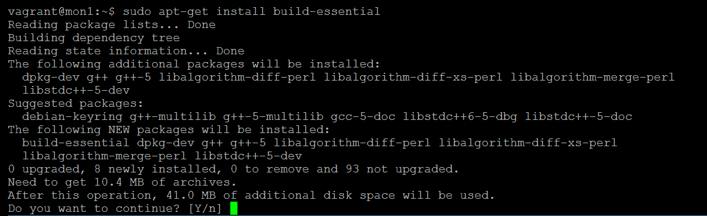

1.  安装`librados`开发库：

```
$ sudo apt-get install librados-dev
```

前面的命令会输出以下内容：

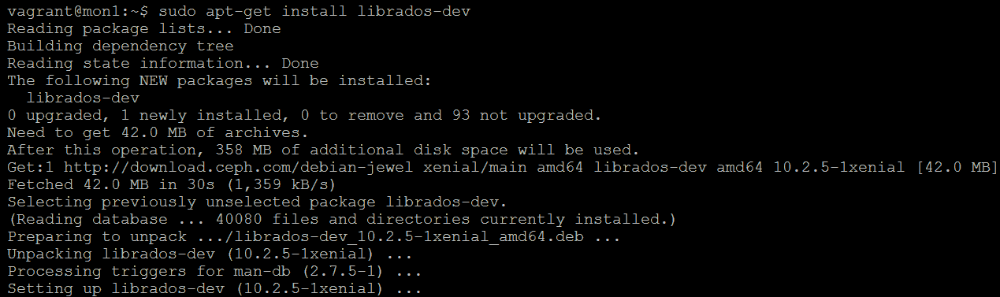

1.  创建一个用 C 语言编写的快速应用程序，以建立与测试 Ceph 集群的连接：

```
$ mkdir test_app $ cd test_app
```

1.  使用你喜欢的文本编辑器创建一个名为`test_app.c`的文件，并将以下内容放入其中：

```
       #include <rados/librados.h> 
       #include <stdio.h> 
       #include <stdlib.h> 

       rados_t rados = NULL; 

       int exit_func(); 

       int main(int argc, const char **argv) 
       { 
         int ret = 0; 
         ret = rados_create(&rados, "admin"); // Use the
         client.admin keyring 
         if (ret < 0) { // Check that the rados object was created 
           printf("couldn't initialize rados! error %d\n", ret); 
           ret = EXIT_FAILURE; 
           exit_func; 
         } 
         else 
           printf("RADOS initialized\n"); 

         ret = rados_conf_read_file(rados, "/etc/ceph/ceph.conf"); 
         if (ret < 0) { //Parse the ceph.conf to obtain cluster details 
           printf("failed to parse config options! error %d\n", ret); 
           ret = EXIT_FAILURE; 
           exit_func(); 
         } 
         else 
           printf("Ceph config parsed\n"); 

         ret = rados_connect(rados); //Initiate connection to the
         Ceph cluster 
         if (ret < 0) { 
           printf("couldn't connect to cluster! error %d\n", ret); 
           ret = EXIT_FAILURE; 
           exit_func; 
         } else { 
           printf("Connected to the rados cluster\n"); 
         } 

         exit_func(); //End of example, call exit_func to clean
         up and finish 

       } 

       int exit_func () 
       { 
         rados_shutdown(rados); //Destroy connection to the
         Ceph cluster 
         printf("RADOS connection destroyed\n"); 
         printf("The END\n"); 
         exit(0); 
       } 
```

1.  通过运行以下命令编译测试应用程序：

```
$ gcc test_app.c -o test_app -lrados
```

需要注意的是，你需要告诉`gcc`链接到`librados`库，以便使用其功能。

1.  通过运行应用程序来测试其是否正常工作。别忘了以 root 身份运行它，或使用`sudo`，否则你将无法访问 Ceph 密钥环：

```
sudo ./test_app
```

前面的命令会输出以下内容：

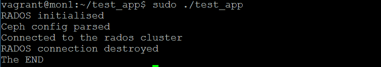

测试应用程序简单地读取你的`ceph.conf`配置文件，利用它建立与 Ceph 集群的连接，然后断开连接。它可能不是最激动人心的应用程序，但它测试了基本架构是否到位且正常工作，并为本章其余示例奠定了基础。

# 示例 librados 应用程序

我们现在将通过一些使用 librados 的示例应用程序，帮助你更好地理解使用该库能够完成的任务。

以下示例将带你完成创建一个应用程序的步骤，该程序在接收到一个图像文件作为参数时，将该图像存储为 Ceph 集群中的一个对象，并将图像文件的各种属性存储为对象属性。该应用程序还允许你检索对象并将其导出为图像文件。这个示例将使用 Python 编写，librados 也支持 Python。以下示例还使用了**Python 图像库**（**PIL**）来读取图像的大小，并使用命令行解析库读取命令行参数：

1.  安装 librados Python 绑定和图像处理库：

```
$ sudo apt-get install python-rados python-imaging
```

前述命令输出如下：

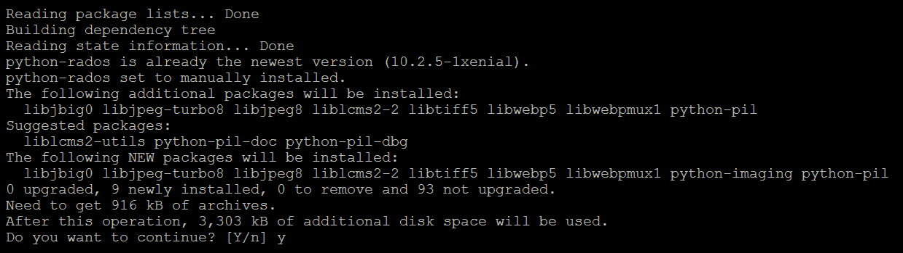

1.  创建一个新的 Python 应用程序文件，文件扩展名为 `.py`，并输入以下内容：

```
       import rados, sys, argparse 
       from PIL import Image 

       #Argument Parser used to read parameters and generate --help 
       parser = argparse.ArgumentParser(description='Image to RADOS 
       Object Utility') 
       parser.add_argument('--action', dest='action', action='store',
       required=True, help='Either upload or download image to/from 
       Ceph') 
       parser.add_argument('--image-file', dest='imagefile',
       action='store', required=True, help='The image file to
       upload to RADOS') 
       parser.add_argument('--object-name', dest='objectname', 
       action='store', required=True, help='The name of the
       RADOS object') 
       parser.add_argument('--pool', dest='pool', action='store', 
       required=True, help='The name of the RADOS pool to store
       the object') 
       parser.add_argument('--comment', dest='comment', action=
       'store', help='A comment to store with the object') 

       args = parser.parse_args() 

       try: #Read ceph.conf config file to obtain monitors 
         cluster = rados.Rados(conffile='/etc/ceph/ceph.conf') 
       except: 
         print "Error reading Ceph configuration" 
         sys.exit(1) 

       try: #Connect to the Ceph cluster 
         cluster.connect() 
       except: 
         print "Error connecting to Ceph Cluster" 
         sys.exit(1) 

       try: #Open specified RADOS pool 
         ioctx = cluster.open_ioctx(args.pool) 
       except: 
         print "Error opening pool: " + args.pool 
         cluster.shutdown() 
         sys.exit(1) 

       if args.action == 'upload': #If action is to upload 
         try: #Open image file in read binary mode 
           image=open(args.imagefile,'rb') 
           im=Image.open(args.imagefile) 
         except: 
           print "Error opening image file" 
           ioctx.close() 
           cluster.shutdown() 
           sys.exit(1) 
         print "Image size is x=" + str(im.size[0]) + " y=" + 
         str(im.size[1]) 
         try: #Write the contents of image file to object and add 
         attributes 
           ioctx.write_full(args.objectname,image.read()) 
           ioctx.set_xattr(args.objectname,'xres',str(im.size[0]) 
           +"\n") 
           ioctx.set_xattr(args.objectname,'yres',str(im.size[1]) 
           +"\n") 
           im.close() 
           if args.comment: 
             ioctx.set_xattr(args.objectname,'comment',args.comment 
             +"\n") 
         except: 
           print "Error writing object or attributes" 
           ioctx.close() 
           cluster.shutdown() 
           sys.exit(1) 
         image.close() 
       elif args.action == 'download': 
         try: #Open image file in write binary mode 
           image=open(args.imagefile,'wb') 
         except: 
           print "Error opening image file" 
           ioctx.close() 
           cluster.shutdown() 
           sys.exit(1) 
         try: #Write object to image file 
           image.write(ioctx.read(args.objectname)) 
         except: 
           print "Error writing object to image file" 
           ioctx.close() 
           cluster.shutdown() 
           sys.exit(1) 
         image.close() 
       else: 
         print "Please specify --action as either upload or download" 
       ioctx.close() #Close connection to pool 
       cluster.shutdown() #Close connection to Ceph 
       #The End
```

1.  测试由 Argument Parser 库生成的 `help` 功能：

```
$ sudo python app1.py --help
```

前述命令输出如下：

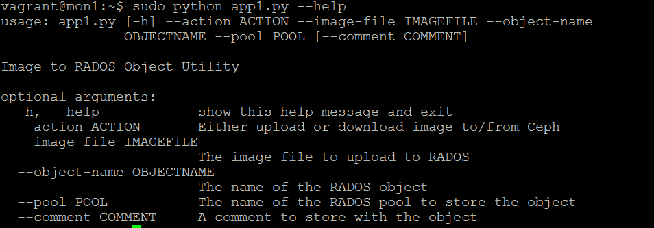

1.  下载 Ceph 标志作为测试图像：

```
wget http://docs.ceph.com/docs/master/_static/logo.png
```

前述命令输出如下：

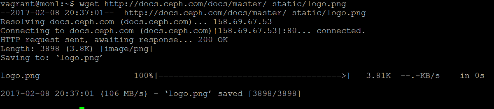

1.  运行我们的 Python 应用程序以读取图像文件并将其上传到 Ceph 作为对象：

```
$ sudo python app1.py --action=upload --image-file=test1.png
       --object-name=image_test --pool=rbd --comment="Ceph Logo"
```

前述命令输出如下：

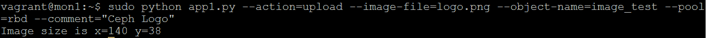

1.  验证对象是否已创建：

```
$ sudo rados -p rbd ls
```

前述命令输出如下：

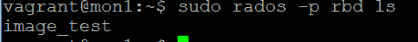

1.  使用 `rados` 验证属性是否已添加到对象：

```
$ sudo rados -p rbd listxattr image_test
```

前述命令输出如下：

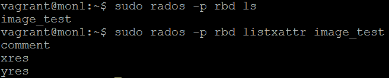

1.  使用 `rados` 验证属性内容，如下图所示：

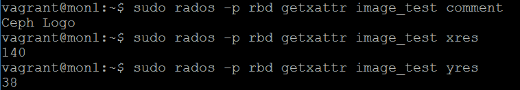

# 使用原子操作的 librados 应用示例

在前面的 librados 应用示例中，首先在 Ceph 集群上创建了一个对象，然后添加了该对象的属性。在大多数情况下，这种两阶段操作是可行的；然而，一些应用程序可能要求对象的创建和其属性的设置是原子的。也就是说，如果服务中断，只有当对象的所有属性都已设置时，才能存在该对象，否则 Ceph 集群应该回滚该事务。以下示例使用 C++ 编写，展示了如何使用 librados 原子操作来确保跨多个操作的事务一致性。该示例将写入一个对象，并询问用户是否希望中止事务。如果用户选择中止，则对象写入操作将回滚；如果用户选择继续，则属性将被写入，整个事务将被提交。请执行以下步骤：

1.  创建一个新的 `.cc` 扩展名文件，并将以下内容放入其中：

```
       #include <cctype> 
       #include <rados/librados.hpp> 
       #include <iostream> 
       #include <string> 

       void exit_func(int ret); 

       librados::Rados rados; 

       int main(int argc, const char **argv) 
       { 
         int ret = 0; 

         // Define variables 
         const char *pool_name = "rbd"; 
         std::string object_string("I am an atomic object\n"); 
         std::string attribute_string("I am an atomic attribute\n"); 
         std::string object_name("atomic_object"); 
         librados::IoCtx io_ctx; 

         // Create the Rados object and initialize it 
         { 
           ret = rados.init("admin"); // Use the default client.admin 
           keyring 
           if (ret < 0) { 
             std::cerr << "Failed to initialize rados! error " << ret 
             << std::endl; 
             ret = EXIT_FAILURE; 
           } 
         } 

         // Read the ceph config file in its default location 
         ret = rados.conf_read_file("/etc/ceph/ceph.conf"); 
         if (ret < 0) { 
           std::cerr << "Failed to parse config file " 
                     << "! Error" << ret << std::endl; 
           ret = EXIT_FAILURE; 
         } 

         // Connect to the Ceph cluster 
         ret = rados.connect(); 
         if (ret < 0) { 
           std::cerr << "Failed to connect to cluster! Error " << ret 
           << std::endl; 
           ret = EXIT_FAILURE; 
         } else { 
           std::cout << "Connected to the Ceph cluster" << std::endl; 
         } 

         // Create connection to the Rados pool 
         ret = rados.ioctx_create(pool_name, io_ctx); 
         if (ret < 0) { 
           std::cerr << "Failed to connect to pool! Error: " << ret << 
           std::endl; 
           ret = EXIT_FAILURE; 
         } else { 
           std::cout << "Connected to pool: " << pool_name <<
           std::endl; 
         } 

         librados::bufferlist object_bl; // Initialize a bufferlist 
         object_bl.append(object_string); // Add our object text
         string to the bufferlist 
         librados::ObjectWriteOperation write_op; // Create a write 
         transaction 
         write_op.write_full(object_bl); // Write our bufferlist to the 
         transaction 
         std::cout << "Object: " << object_name << " has been written 
         to transaction" << std::endl; 
         char c; 
         std::cout << "Would you like to abort transaction? (Y/N)? "; 
         std::cin >> c; 
         if (toupper( c ) == 'Y') { 
           std::cout << "Transaction has been aborted, so object will 
           not actually be written" << std::endl; 
           exit_func(99); 
         } 
         librados::bufferlist attr_bl; // Initialize another bufferlist 
         attr_bl.append(attribute_string); // Add our attribute to the 
         bufferlist 
         write_op.setxattr("atomic_attribute", attr_bl); // Write our 
         attribute to our transaction 
         std::cout << "Attribute has been written to transaction" << 
         std::endl; 
         ret = io_ctx.operate(object_name, &write_op); // Commit the
         transaction 
         if (ret < 0) { 
           std::cerr << "failed to do compound write! error " << ret << 
           std::endl; 
           ret = EXIT_FAILURE; 
         } else { 
           std::cout << "We wrote the transaction containing our object
           and attribute" << object_name << std::endl; 
         } 

       } 

       void exit_func(int ret) 
       { 
         // Clean up and exit 
         rados.shutdown(); 
         exit(ret); 
       } 
```

1.  使用 `g++` 编译源代码：

```
g++ atomic.cc -o atomic -lrados -std=c++11
```

1.  让我们运行该应用并中止事务：

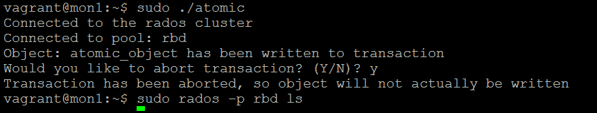

上面的截图显示，即使我们发送了一个写对象命令，由于事务没有提交，实际上该对象并未写入 Ceph 集群。

1.  让我们重新运行应用程序，这次让它继续执行事务：

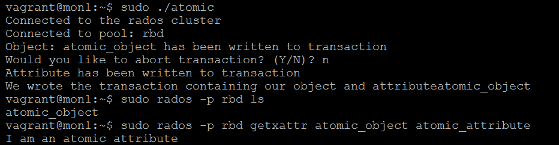

如你所见，这次对象与其属性一同被写入。

# 使用 watchers 和 notifiers 的 librados 应用示例

以下是用 C 编写的 librados 应用，它向我们展示了如何在 RADOS 中使用 watch 或 notify 功能。Ceph 使客户端能够在对象上创建一个 watcher，并从完全独立的连接到同一集群的客户端接收通知。

watcher 功能是通过回调函数实现的。当你调用 librados 函数创建 watcher 时，其中两个参数是回调函数：一个是接收到通知时要执行的操作，另一个是在 watcher 丧失联系或遇到对象错误时要执行的操作。这些回调函数包含了你希望在通知或错误发生时运行的代码。

这种简单的消息传递形式通常用于通知正在使用 RBD 的客户端希望拍摄快照。希望拍摄快照的客户端会向所有可能正在监视该 RBD 对象的客户端发送通知，以便它能够刷新缓存，并可能确保文件系统处于一致状态。

以下示例在名为 `my_object` 的对象上创建了一个 `watcher` 实例，然后等待。当它接收到通知时，它将显示有效载荷，并将收到的消息发送回通知者：

1.  创建一个新的 `.c` 扩展名文件，并将以下内容放入其中：

```
 #include <stdio.h> 
 #include <stdlib.h> 
 #include <string.h> 
 #include <syslog.h> 

 #include <rados/librados.h> 
 #include <rados/rados_types.h> 

 uint64_t cookie; 
 rados_ioctx_t io; 
 rados_t cluster; 
 char cluster_name[] = "ceph"; 
 char user_name[] = "client.admin"; 
 char object[] = "my_object"; 
 char pool[] = "rbd"; 

 /* Watcher callback function - called when watcher receives a
 notification */ 
 void watch_notify2_cb(void *arg, uint64_t notify_id, uint64_t
 cookie, uint64_t notifier_gid, void *data, size_t data_len) 
 { 
 const char *notify_oid = 0; 
 char *temp = (char*)data+4; 
 int ret; 
 printf("Message from Notifier: %s\n",temp); 
 rados_notify_ack(io, object, notify_id, cookie, "Received", 8); 
 } 

 /* Watcher error callback function - called if watcher encounters
 an error */ 
 void watch_notify2_errcb(void *arg, uint64_t cookie, int err) 
 { 
 printf("Removing Watcher on object %s\n",object); 
 err = rados_unwatch2(io,cookie); 
 printf("Creating Watcher on object %s\n",object); 
 err = rados_watch2(io,object,&cookie,watch_notify2_cb,
 watch_notify2_errcb,NULL); 
 if (err < 0) { 
 fprintf(stderr, "Cannot create watcher on %s/%s: %s\n", object,
 pool, strerror(-err)); 
 rados_ioctx_destroy(io); 
 rados_shutdown(cluster); 
 exit(1); 
 } 
 } 

 int main (int argc, char **argv) 
 { 
 int err; 
 uint64_t flags; 

 /* Create Rados object */ 
 err = rados_create2(&cluster, cluster_name, user_name, flags); 
 if (err < 0) { 
 fprintf(stderr, "Couldn't create the cluster object!: %s\n",
 strerror(-err)); 
 exit(EXIT_FAILURE); 
 } else { 
 printf("Created the rados object.\n"); 
 } 

 /* Read a Ceph configuration file to configure the cluster
 handle. */ 
 err = rados_conf_read_file(cluster, "/etc/ceph/ceph.conf"); 
 if (err < 0) { 
 fprintf(stderr, "Cannot read config file: %s\n",
 strerror(-err)); 
 exit(EXIT_FAILURE); 
 } else { 
 printf("Read the config file.\n"); 
 } 
 /* Connect to the cluster */ 
 err = rados_connect(cluster); 
 if (err < 0) { 
 fprintf(stderr, "Cannot connect to cluster: %s\n",
 strerror(-err)); 
 exit(EXIT_FAILURE); 
 } else { 
 printf("\n Connected to the cluster.\n"); 
 } 

 /* Create connection to the Rados pool */ 
 err = rados_ioctx_create(cluster, pool, &io); 
 if (err < 0) { 
 fprintf(stderr, "Cannot open rados pool %s: %s\n", pool,
 strerror(-err)); 
 rados_shutdown(cluster); 
 exit(1); 
 } 

 /* Create the Rados Watcher */ 
 printf("Creating Watcher on object %s/%s\n",pool,object); 
 err = rados_watch2(io,object,&cookie,watch_notify2_cb, 
 watch_notify2_errcb,NULL); 
 if (err < 0) { 
 fprintf(stderr, "Cannot create watcher on object %s/%s: %s\n",
 pool, object, strerror(-err)); 
 rados_ioctx_destroy(io); 
 rados_shutdown(cluster); 
 exit(1); 
 } 

 /* Loop whilst waiting for notifier */ 
 while(1){ 
 sleep(1); 
 } 
 /* Clean up */ 
 rados_ioctx_destroy(io); 
 rados_shutdown(cluster); 
 } 
```

1.  编译 `watcher` 示例代码：

```
$ gcc watcher.c -o watcher -lrados
```

1.  运行 `watcher` 示例应用：

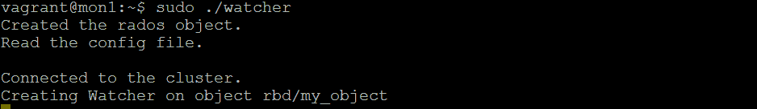

1.  `watcher` 现在等待通知。在另一个终端窗口中，使用 `rados` 向正在被监视的 `my_object` 对象发送通知：

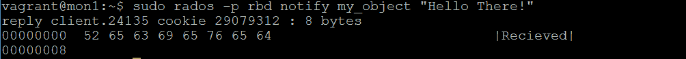

1.  你可以看到通知已发送，并且已收到确认通知。如果我们再查看第一个终端窗口，我们可以看到来自通知者的消息：

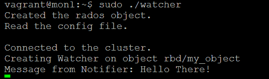

# 总结

本章关于使用 librados 开发应用程序的内容到此结束。你现在应该对如何在应用程序中包含 librados 功能以及如何读取和写入对象到 Ceph 集群的基本概念感到熟悉。如果你打算使用 librados 开发应用程序，建议阅读官方的 librados 文档，以便更好地理解可用的所有功能。

在下一章中，我们将学习 RADOS 类以及它们如何被用来加速大型应用程序的处理。

# 问题

1.  请列举一个你可能想编写使用原生 librados API 的应用程序的原因。

1.  RADOS `watcher` 是做什么的？

1.  请列出 librados 支持的五种编程语言。
