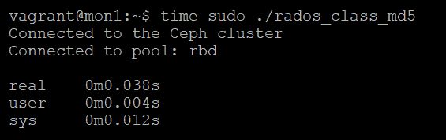

# 第九章：使用 Ceph RADOS 类进行分布式计算

Ceph 的一个常被忽视的功能是将自定义代码直接加载到 OSD 中，然后可以在 librados 应用程序中执行。这使得您能够利用 Ceph 的大规模分布式特性，不仅提供高性能的扩展存储，还能将计算任务分配到 OSD 上，从而实现大规模并行计算。这一能力通过动态加载 RADOS 类到每个 OSD 来实现。

本章将涵盖以下主题：

+   示例应用程序及使用 RADOS 类的好处

+   编写简单的 Lua RADOS 类

+   编写一个模拟分布式计算的 RADOS 类

# 示例应用程序及使用 RADOS 类的好处

如前所述，通过 RADOS 类，代码可以直接在 OSD 代码库内执行，从而利用所有 OSD 节点的集体计算能力。与典型的客户端应用程序方法不同，客户端需要从 Ceph 集群读取对象、对其进行计算，然后将其写回，这会带来大量的往返开销。使用 RADOS 类显著减少了与 OSD 之间的往返次数，而且可用的计算能力远高于单个客户端所能提供的。因此，将操作直接卸载到 OSD 上，可以使单个客户端显著提高处理速度。

一个简单的使用 RADOS 类的例子是在需要计算 RADOS 池中每个对象的哈希值并将每个对象的哈希值作为属性存储时。让客户端执行此操作将突出显示由于客户端从远程集群执行这些操作而带来的瓶颈和额外延迟。而使用包含所需代码的 RADOS 类来读取对象、计算哈希并将其作为属性存储，客户端只需要向 OSD 发送执行该 RADOS 类的命令。

# 编写简单的 Lua RADOS 类

从 Kraken 版本开始，Ceph 中的默认 RADOS 类之一是能够运行 Lua 脚本的类。Lua 脚本动态地传递给 Lua RADOS 对象类，然后该类执行脚本的内容。脚本通常以 JSON 格式的字符串传递给对象类。虽然这相较于传统的 RADOS 对象类（需要在使用前进行编译）具有优势，但它也限制了 Lua 脚本的功能复杂性。因此，在选择适合任务的方式时，应该考虑该方法是否合适。

以下 Python 代码示例演示了如何创建并传递 Lua 脚本，供 OSD 执行。Lua 脚本读取指定对象的内容，并将文本字符串以大写形式返回——所有处理都在持有对象的远程 OSD 上完成；原始对象内容不会发送到客户端。

将以下内容放入名为 `rados_lua.py` 的文件中：

```
import rados, json, sys

try: #Read ceph.conf config file to obtain monitors
  cluster = rados.Rados(conffile='/etc/ceph/ceph.conf')
except:
  print "Error reading Ceph configuration"
  exit(1)

try: #Connect to the Ceph cluster
  cluster.connect()
except:
  print "Error connecting to Ceph Cluster"
  exit(1)

try: #Open specified RADOS pool
  ioctx = cluster.open_ioctx("rbd")
except:
  print "Error opening pool"
  cluster.shutdown()
  exit(1)

cmd = {
  "script": """
      function upper(input, output)
        size = objclass.stat()
        data = objclass.read(0, size)
        upper_str = string.upper(data:str())
        output:append(upper_str)
      end
      objclass.register(upper)
  """,
  "handler": "upper",
}

ret, data = ioctx.execute(str(sys.argv[1]), 'lua', 'eval_json', json.dumps(cmd))
print data[:ret]

ioctx.close() #Close connection to pool
cluster.shutdown() #Close connection to Ceph
```

现在，让我们创建一个包含所有小写字母的测试对象：

```
 echo this string was in lowercase | sudo rados -p rbd put LowerObject –
```

默认情况下，Lua 对象类不允许 OSD 调用；我们需要在所有 OSD 的 `ceph.conf` 中添加以下内容：

```
[osd]
osd class load list = *
osd class default list = *
```

现在，运行我们的 Python librados 应用程序：

```
 sudo python rados_lua.py LowerObject
```

上述命令将产生以下输出：


你应该会看到我们对象中的文本已经转换成了全大写。你可以从前面的 Python 代码看到，我们并没有在本地 Python 代码中做任何转换，所有转换操作都在远程的 OSD 上完成。

# 编写一个模拟分布式计算的 RADOS 类

如前面示例中提到的，尽管使用 Lua 对象类简化了 RADOS 对象类的使用，但当前仍然存在一些限制。为了编写一个能够执行更高级处理的类，我们需要回退到使用 C 语言编写类。然后，我们需要在 Ceph 源代码中编译这个新类。

为了演示这一点，我们将编写一个新的 RADOS 对象类，计算指定对象的 MD5 哈希值，然后将其作为对象的一个属性存储。此过程将重复 1,000 次，以模拟一个繁忙的环境，并且使得运行时间更容易测量。然后，我们将比较通过对象类执行此操作与在客户端计算 MD5 哈希值的速度。尽管这仍然是一个相对基础的任务，但它将使我们能够生成一个可控且可重复的场景，并比较客户端与直接通过 RADOS 类在 OSD 上执行任务的速度。它还将为我们提供一个良好的基础，帮助我们理解如何构建更复杂的应用程序。

# 准备构建环境

使用以下命令克隆 Ceph Git 仓库：

```
 git clone https://github.com/ceph/ceph.git
```

上述命令将产生以下输出：


一旦我们克隆了 Ceph Git 仓库，我们需要编辑 `CMakeLists.txt` 文件，并为我们将要编写的新类添加一个部分。

编辑源代码树中的以下文件：

```
 ~/ceph/src/cls/CMakeLists.txt
```

另外，将以下内容放入文件中：

```
# cls_md5
set(cls_md5_srcs md5/cls_md5.cc)
add_library(cls_md5 SHARED ${cls_md5_srcs})
set_target_properties(cls_md5 PROPERTIES
  VERSION "1.0.0"
  SOVERSION "1"
  INSTALL_RPATH "")
install(TARGETS cls_md5 DESTINATION ${cls_dir})
target_link_libraries(cls_md5 crypto)
list(APPEND cls_embedded_srcs ${cls_md5_srcs})
```

一旦 `cmakelist.txt` 文件更新完成，我们可以通过运行以下命令来使用 `cmake` 构建环境：

```
 do_cmake.sh
```

上述命令将产生以下输出：


这将会在源代码树中创建一个 `build` 目录。

为了构建 RADOS 类，我们需要安装包含 `make` 命令的所需软件包：

```
 sudo apt-get install build-essentials
```

Ceph 源代码树中还包含一个 `install-deps.sh` 文件，运行时会安装所需的其他软件包。

# RADOS 类

以下代码示例是一个 RADOS 类，当执行时，它读取对象，计算 MD5 哈希，然后将其作为属性写回该对象，而无需客户端参与。每次调用此类时，它都会在本地对 OSD 重复执行此操作 1,000 次，并且仅在处理结束时通知客户端。我们需要执行以下步骤：

1.  创建我们新 RADOS 类的目录：

```
 mkdir ~/ceph/src/cls/md5
```

1.  创建 C++源文件：

```
 ~/ceph/src/cls/md5/cls_md5.cc
```

1.  将以下代码放入其中：

```
 #include "objclass/objclass.h"
 #include <openssl/md5.h>

 CLS_VER(1,0)
 CLS_NAME(md5)

 cls_handle_t h_class;
 cls_method_handle_t h_calc_md5;

 static int calc_md5(cls_method_context_t hctx, bufferlist *in,
 bufferlist *out)
 {
 char md5string[33];

 for(int i = 0; i < 1000; ++i)
 {
 size_t size;
 int ret = cls_cxx_stat(hctx, &size, NULL);
 if (ret < 0)
 return ret;

 bufferlist data;
 ret = cls_cxx_read(hctx, 0, size, &data);
 if (ret < 0)
 return ret;
 unsigned char md5out[16];
 MD5((unsigned char*)data.c_str(), data.length(), md5out);
 for(int i = 0; i < 16; ++i)
 sprintf(&md5string[i*2], "%02x", (unsigned int)md5out[i]);
 CLS_LOG(0,"Loop:%d - %s",i,md5string);
 bufferlist attrbl;
 attrbl.append(md5string);
 ret = cls_cxx_setxattr(hctx, "MD5", &attrbl);
 if (ret < 0)
 {
 CLS_LOG(0, "Error setting attribute");
 return ret;
 }
 }
 out->append((const char*)md5string, sizeof(md5string));
 return 0;
 }

 void __cls_init()
 {
 CLS_LOG(0, "loading cls_md5");
 cls_register("md5", &h_class);
 cls_register_cxx_method(h_class, "calc_md5", CLS_METHOD_RD | 
 CLS_METHOD_WR, calc_md5, &h_calc_md5)
 }
```

1.  进入之前创建的`build`目录，并使用`make`创建我们的新 RADOS 类：

```
 cd ~/ceph/build
 make cls_md5
```

上述命令将给出以下输出：


1.  将我们的新类复制到集群中的 OSD：

```
 sudo scp vagrant@ansible:/home/vagrant/ceph/build/lib/libcls_md5.so*
       /usr/lib/rados-classes/
```

上述命令将给出以下输出：


此外，重启 OSD 以加载该类。现在你将在 Ceph OSD 日志中看到它正在加载我们的新类：


这需要对集群中的所有 OSD 节点重复进行。

# 客户端 librados 应用程序

如前所述，我们将使用两个 librados 应用程序，一个直接在客户端计算 MD5 哈希，另一个调用我们的 RADOS 类并让其计算 MD5 哈希。这些应用程序都需要从测试集群中的监视器节点运行，但可以在任何节点上编译并在需要时复制过去。为了这个示例，我们将直接在监视器节点上编译这些应用程序。

在我们开始之前，让我们确保监视器节点上存在构建环境：

```
 apt-get install build-essential librados-dev
```

# 在客户端计算 MD5

以下代码示例是 librados 客户端应用程序，它将从 OSD 读取对象，在客户端计算该对象的 MD5 哈希，并将其作为属性写回该对象。这与 RADOS 类中的计算和存储方式相同，唯一的区别是处理的位置不同。

创建一个名为`rados_md5.cc`的新文件，并将以下内容合并到其中：

```
#include <cctype>
#include <rados/librados.hpp>
#include <iostream>
#include <string>
#include <openssl/md5.h>

void exit_func(int ret);

librados::Rados rados;

int main(int argc, const char **argv)
{
  int ret = 0;

  // Define variables
  const char *pool_name = "rbd";
  std::string object_name("LowerObject");
  librados::IoCtx io_ctx;

  // Create the Rados object and initialize it
 {
    ret = rados.init("admin"); // Use the default client.admin keyring
    if (ret < 0) {
      std::cerr << "Failed to initialize rados! error " << ret <<
      std::endl;
      ret = EXIT_FAILURE;
    }
  }

  // Read the ceph config file in its default location
  ret = rados.conf_read_file("/etc/ceph/ceph.conf");
  if (ret < 0) {
    std::cerr << "Failed to parse config file "
              << "! Error" << ret << std::endl;
    ret = EXIT_FAILURE;
  }

  // Connect to the Ceph cluster
  ret = rados.connect();
  if (ret < 0) {
    std::cerr << "Failed to connect to cluster! Error " << ret <<
    std::endl;
    ret = EXIT_FAILURE;
  } else {
    std::cout << "Connected to the Ceph cluster" << std::endl;
  }

  // Create connection to the Rados pool
  ret = rados.ioctx_create(pool_name, io_ctx);
  if (ret < 0) {
    std::cerr << "Failed to connect to pool! Error: " << ret <<
    std::endl;
    ret = EXIT_FAILURE;
  } else {
    std::cout << "Connected to pool: " << pool_name << std::endl;
  }
  for(int i = 0; i < 1000; ++i)
  {
    size_t size;
    int ret = io_ctx.stat(object_name, &size, NULL);
    if (ret < 0)
      return ret;

    librados::bufferlist data;
    ret = io_ctx.read(object_name, data, size, 0);
    if (ret < 0)
      return ret;
    unsigned char md5out[16];
    MD5((unsigned char*)data.c_str(), data.length(), md5out);
    char md5string[33];
    for(int i = 0; i < 16; ++i)
      sprintf(&md5string[i*2], "%02x", (unsigned int)md5out[i]);
    librados::bufferlist attrbl;
    attrbl.append(md5string);
    ret = io_ctx.setxattr(object_name, "MD5", attrbl);
    if (ret < 0)
    {
      exit_func(1);
    }
  }
  exit_func(0);
}

void exit_func(int ret)
{
  // Clean up and exit
  rados.shutdown();
  exit(ret);
}
```

# 通过 RADOS 类在 OSD 上计算 MD5

最后，最后一个代码示例是 librados 应用程序，它指示 OSD 在本地计算 MD5 哈希，而不将任何数据传输到客户端或从客户端传输。你会注意到，稍后的代码中没有 librados 的读写语句，它完全依赖于`exec`函数来触发 MD5 哈希的创建。

创建一个名为`rados_class_md5.cc`的新文件，并将以下内容放入其中：

```
#include <cctype>
#include <rados/librados.hpp>
#include <iostream>
#include <string>

void exit_func(int ret);

librados::Rados rados;

int main(int argc, const char **argv)
{
 int ret = 0;

 // Define variables
 const char *pool_name = "rbd";
 std::string object_name("LowerObject");
 librados::IoCtx io_ctx;
 // Create the Rados object and initialize it
 {
 ret = rados.init("admin"); // Use the default client.admin keyring
 if (ret < 0) {
 std::cerr << "Failed to initialize rados! error " << ret <<
 std::endl;
 ret = EXIT_FAILURE;
 }
 }

 // Read the ceph config file in its default location
 ret = rados.conf_read_file("/etc/ceph/ceph.conf");
 if (ret < 0) {
 std::cerr << "Failed to parse config file "
 << "! Error" << ret << std::endl;
 ret = EXIT_FAILURE;
 }

 // Connect to the Ceph cluster
 ret = rados.connect();
 if (ret < 0) {
 std::cerr << "Failed to connect to cluster! Error " << ret <<
 std::endl;
 ret = EXIT_FAILURE;
 } else {
 std::cout << "Connected to the Ceph cluster" << std::endl;
 }

 // Create connection to the Rados pool
 ret = rados.ioctx_create(pool_name, io_ctx);
 if (ret < 0) {
 std::cerr << "Failed to connect to pool! Error: " << ret <<
 std::endl;
 ret = EXIT_FAILURE;
 } else {
 std::cout << "Connected to pool: " << pool_name <<
 std::endl;
 }
 librados::bufferlist in, out;
 io_ctx.exec(object_name, "md5", "calc_md5", in, out);
 exit_func(0);

}
void exit_func(int ret)
{
 // Clean up and exit
 rados.shutdown();
 exit(ret);
}
```

我们现在可以编译这两个应用程序：


如果应用程序成功编译，将不会有任何输出。

# 测试

我们将使用标准的 Linux `time`工具运行这两个 librados 应用程序，以测量每次运行所需的时间：

```
 time sudo ./rados_md5
```

上述命令将给出以下输出：


让我们确保属性确实已创建：

```
 sudo rados -p rbd getxattr LowerObject MD5
```

上述命令将会输出以下内容：


让我们删除对象属性，以便我们可以确认 RADOS 类在运行时确实创建了该属性：

```
 sudo rados -p rbd rmxattr LowerObject MD5
```

现在，运行通过 RADOS 类执行 MD5 计算的应用程序：

```
 time sudo ./rados_class_md5
```

上述命令将会输出以下内容：



如您所见，使用 RADOS 类方法要快得多，实际上，速度几乎提高了两个数量级。

然而，我们也需要确认该属性已被创建，并且代码确实运行了 1,000 次：

```
 sudo rados -p rbd getxattr LowerObject MD5
```

上述命令将会输出以下内容：


由于我们在 RADOS 类中插入了日志，我们还可以检查 OSD 日志，以确认 RADOS 类确实运行了 1,000 次：


在重复执行小任务时，客户端与 OSD 之间的通信开销会逐渐增加。通过将处理过程直接移至 OSD，我们可以消除这一问题。

# RADOS 类注意事项

尽管我们已经看到可以通过使用 Ceph 的 RADOS 类来利用强大的功能，但需要注意的是，这一切都是通过从 OSD 内部调用您自定义的代码实现的。因此，必须非常小心，确保您的 RADOS 类没有 bug。RADOS 类有能力修改 Ceph 集群中的任何数据，因此意外的数据损坏是很容易发生的。RADOS 类还可能导致 OSD 进程崩溃。如果该类在大规模集群操作中使用，可能会影响集群中的所有 OSD，因此必须确保错误处理得当，避免错误的发生。

# 总结

现在您应该了解了什么是 RADOS 类，以及它们如何通过将任务直接移至 OSD 来加速处理。从通过 Lua 构建简单类，到通过 C++ 在 Ceph 源代码树中开发类，您现在应该具备了构建 RADOS 类以解决您所面临问题的知识。基于这个概念，您可以创建一个更大的应用程序，利用 Ceph 集群的横向扩展特性提供大量存储和计算资源。

在下一章中，我们将通过一些示例来探讨监控在 Ceph 中的重要性。

# 问题

1.  RADOS 类在 Ceph 的哪个组件中执行？

1.  RADOS 类可以用什么语言编写？

1.  RADOS 类带来了什么优势？

1.  RADOS 类带来了什么缺点？
