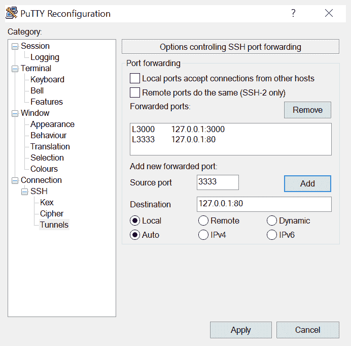

# 第十章：监控 Ceph

当你在操作一个 Ceph 集群时，监控其健康和性能是很重要的。通过监控 Ceph，你可以确保集群处于良好的健康状态，并能够快速应对可能出现的问题。通过捕获并绘制性能计数器图表，你还将获得调整 Ceph 所需的数据，并观察调整对集群的影响。

在本章中，你将学习以下主题：

+   为什么监控 Ceph 重要

+   如何通过使用新的内置仪表板监控 Ceph 的健康状态

+   应该监控的内容

+   PG 的状态及其含义

+   如何使用 collectd 捕获 Ceph 的性能计数器

+   使用 Graphite 的示例图表

# 为什么监控 Ceph 重要

监控 Ceph 最重要的原因是确保集群处于健康状态。如果 Ceph 没有运行在健康状态，无论是因为硬盘故障还是其他原因，服务或数据丢失的可能性都会增加。虽然 Ceph 在从各种场景中恢复方面高度自动化，但了解正在发生的情况以及何时需要手动干预是至关重要的。

监控不仅仅是检测故障；监控其他指标，如已使用的磁盘空间，与了解磁盘故障发生的时间同样重要。如果你的 Ceph 集群存储满了，它将停止接受 I/O 请求，并且无法从未来的 OSD 故障中恢复。

最后，监控操作系统和 Ceph 性能指标可以帮助你发现性能问题或识别调整机会。

# 应该监控的内容

简单的答案是：所有内容，或者说，尽可能多地监控。你永远无法预测你的集群可能面临什么样的情况，设置正确的监控和告警系统可能意味着优雅地应对情况与发生大规模宕机之间的差异。应该监控的事项按重要性递减的顺序如下：

# Ceph 健康状态

最重要的是捕获 Ceph 的健康状态。主要的报告项是集群的整体健康状态，可能是 `HEALTH_OK`、`HEALTH_WARN` 或 `HEALTH_ERR`。通过监控这个状态，你将在 Ceph 认为存在问题时及时收到警报。此外，你可能还需要捕获 PG 的状态和降级对象的数量，因为它们可以提供额外的信息，帮助你了解可能存在的问题，而无需实际登录 Ceph 服务器并使用 Ceph 工具集来检查状态。

# 操作系统和硬件

强烈建议您捕获运行 Ceph 软件的操作系统当前状态，以及底层硬件的状态。捕获诸如 CPU 和内存使用情况等信息将提醒您可能的资源短缺，在它变得关键之前。长期趋势分析这些数据还有助于规划 Ceph 的硬件选择。还强烈建议监控硬件以捕获硬件故障，例如磁盘、电源单元和风扇。大多数服务器硬件都是冗余的，除非进行监控，否则很难察觉到它在降级状态下运行。此外，监控网络连接，以确保两块网卡在绑定配置中都处于正常工作状态，也是一个好主意。

# 智能统计

使用操作系统的智能监控工具套件来探测磁盘的健康状况也是一个好主意。它们可以帮助您突出显示故障磁盘或错误率异常的磁盘。对于 SSD，您还可以测量闪存单元的磨损率，这可以很好地指示 SSD 可能会发生故障的时间。最后，能够捕获磁盘的温度将帮助您确保服务器不会过热。

# 网络

由于 Ceph 依赖于其运行所依赖的网络的可靠性，因此监控网络设备的错误和性能问题是非常有益的。大多数网络设备可以通过 SNMP 进行轮询，以获取这些数据。自 Mimic 版本发布以来，Ceph 会自动在其心跳中发送巨型帧，以尝试捕捉网络中未正确配置巨型帧的情况。然而，考虑部署您自己的巨型帧检查监控工具，以捕获配置错误的情况也是值得的，因为配置错误的巨型帧很容易使 Ceph 集群陷入瘫痪。

# 性能计数器

通过同时监控操作系统和 Ceph 的性能计数器，您可以获得大量知识，帮助更好地理解 Ceph 集群的性能。如果存储条件允许，尽可能捕获更多这些指标是值得的；你永远不知道什么时候这些指标会派上用场。在诊断问题时，经常会遇到这种情况：一个曾经被认为与问题无关的指标，突然揭示出问题的实际原因。仅仅监控关键指标的传统方法在这方面是非常有限的。

大多数运行在 Linux 上的监控代理都允许您捕获各种指标，从资源消耗到文件系统使用情况。值得花时间分析您可以收集的指标并适当配置它们。一些监控代理还将提供 Ceph 插件，可以提取 Ceph 各个组件（如 `osd` 和 `mon` 节点）的所有性能计数器。

# Ceph 仪表板

在 Mimic 版本中引入的 Ceph 现在有一个基于开源 ATTIC 项目的极为实用的仪表板。初始的 Mimic 版本中的仪表板使 Ceph 运维人员能够监控日常所需的 Ceph 集群的许多方面。随着 Ceph 之前版本的发布，仪表板进行了进一步的改进，现在可以用来管理一些常见的任务；随着时间的推移，预计仪表板将继续增加新功能。

仪表板作为 Ceph Mgr 模块提供，并与任何依赖项一起包含在标准的 Ceph 安装中。这意味着，开始使用 Ceph 仪表板所需的唯一步骤是启用`mgr`模块：

```
sudo ceph mgr module enable dashboard
```

SSL 需要禁用，或者需要配置 SSL 证书。幸运的是，Ceph 提供了一个简单的一行命令来帮助您启动自签名证书：

```
sudo ceph dashboard create-self-signed-cert
```

推荐在生产部署中使用合适的证书。

最后，登录仪表板需要用户名和密码。同样，Ceph 提供了一个简单的命令来执行此操作：

```
sudo ceph dashboard set-login-credentials <user> <password>
```

现在，您应该能够浏览到`https://<active mgr>:8443`并使用刚才创建的凭据登录。在这种情况下，`<active mgr>`是当前运行活动 mgr 守护进程的 Ceph 节点；可以通过`ceph -s` Ceph 状态屏幕查看此信息：


登录仪表板时呈现的第一个屏幕提供了 Ceph 集群的健康状况和利用率概览。

页面顶部有多个菜单，允许您查看有关 Ceph 集群的更详细信息，如有关 OSD 和 PG 的详细信息。块菜单允许您查看已创建的 RBD 镜像的详细信息，同样，文件系统菜单显示有关任何 CephFS 文件系统的信息。

对象网关将显示有关 RADOS 网关的信息，但需要使用有效的 RGW 用户进行配置；如有需要，请查阅官方 Ceph 文档获取更多信息。

随着 Ceph 仪表板的未来发展前景看好，强烈推荐为您管理的任何 Ceph 集群部署它。未来版本预计将带来更多的增强功能，能够通过仪表板管理 Ceph 集群，随着时间的推移，仪表板将变得越来越有用。然而，即使在当前状态下，较不熟悉的管理员能够轻松查看正在运行的 Ceph 集群的当前状态也是非常有用的。

# PG 状态——好、坏和丑

Ceph 中的每个放置组（PG）都有一个或多个分配给它的状态；通常，您希望看到所有 PG 的状态为`active+clean`。理解每个状态的含义可以帮助我们识别 PG 发生了什么，是否需要采取行动。

# 好的状态

以下状态表示一个健康运行的集群，此时无需采取任何措施。

# 激活状态

`active` 状态意味着 PG 处于完全健康状态，能够接受客户端请求。

# clean 状态

`clean` 状态意味着 PG 的对象已经按照正确的次数进行复制，且所有对象处于一致的状态。

# Scrubbing 和深度 Scrubbing

Scrubbing 意味着 Ceph 检查数据的一致性，这是一个正常的后台过程。单纯的 Scrubbing 是指 Ceph 检查对象及其相关的元数据是否存在。当 Ceph 执行深度 Scrub 时，它会对比对象及其副本的内容来检查一致性。

# 不良状态

以下状态表示 Ceph 并非完全健康，但不会立即导致问题。

# 不一致状态

`inconsistent` 状态意味着在 Scrub 过程中，Ceph 发现一个或多个对象与其副本不一致。请参阅本书后面的 第十一章，*故障排除*，了解如何处理这些错误。

# backfilling、backfill_wait、recovering 和 recovery_wait 状态

这些状态意味着 Ceph 正在将数据从一个 OSD 复制或迁移到另一个 OSD。这可能意味着该 PG 的副本数少于期望的数量。如果处于 `wait` 状态，则表示由于每个 OSD 上的限流，Ceph 限制了并发操作的数量，以减少对客户端操作的影响。

# 降级状态

`degraded` 状态意味着 PG 缺少或拥有过时副本的一个或多个对象。这些通常会通过恢复/回填过程得到纠正。

# 已重新映射

为了变为活动状态，PG 当前被映射到不同的 OSD 或一组 OSD 上。这通常发生在 OSD 宕机但尚未恢复到其余的 OSD 时。

# Peering

Peering 状态是 PG 成为活动状态的正常过程的一部分，通常它只会短暂停留在此状态。如果 PG 长时间停留在 Peering 状态，将会阻塞 I/O 操作，因此它被列在不良状态中。

# 丑陋状态

这些状态是你不希望看到的。如果看到这些状态，很可能会影响客户端访问集群，并且除非问题得到修复，否则可能会发生数据丢失。

# incomplete 状态

`incomplete` 状态意味着 Ceph 无法在当前集群中任何在线的 OSD 上找到 PG 内对象的有效副本。这可能是因为对象根本不存在，或者现有的对象缺少可能在现在不可用的 OSD 上发生的较新写入。

# down 状态

这将伴随 `incomplete` 状态。PG 缺少已知可能位于不可用 OSD 上的对象，PG 无法启动。

# backfill_toofull 和 recovery_toofull 状态

Ceph 尝试恢复你的数据，但 OSD 磁盘已满，无法继续。需要更多的 OSD 来解决这个问题。

# 使用 collectd 监控 Ceph

在本章前面，我们讨论了在整个 Ceph 基础设施中应该进行哪些监控，并查看了新内置的 Ceph 仪表盘。为了更深入了解 Ceph 集群及其相关基础设施的操作，我们需要进行更详细的监控设置。虽然警报监控不在本书范围之内，但我们现在将看看如何使用 collectd 捕获 Ceph 性能指标，存储到 Graphite 中，然后使用 Grafana 创建带有图表的仪表盘。这些捕获的指标可以在下一章中帮助调整 Ceph 集群。

我们将在测试集群的一个监控节点上构建这个监控基础设施。在生产集群中，强烈建议为其配置独立的服务器。

# Graphite

Graphite 是一个时间序列数据库，擅长存储大量的度量数据，并且具有成熟的查询语言，应用程序可以使用它来操作数据。

我们首先需要安装所需的 Graphite 软件包：

```
sudo apt-get install graphite-api graphite-carbon graphite-web
```

上述命令将给出以下输出：


编辑 `/etc/graphite/storage-schemas.conf` 存储模式文件，并将以下内容放入其中：

```
[carbon]
pattern = ^carbon\.
retentions = 60:90d
[default_1min_for_1day]
pattern = .*
retentions = 60s:1d
```

现在，我们可以通过运行以下命令来创建 Graphite 数据库：

```
sudo graphite-manage syncdb
```

上述命令将给出以下输出：


在提示时设置 root 用户的密码：

```
sudo apt-get install apache2 libapache2-mod-wsgi
```

上述命令将给出以下输出：


为了防止默认的 Apache 站点与 Graphite Web 服务冲突，我们需要通过运行以下命令禁用它：

```
sudo a2dissite 000-default 
```

上述命令将给出以下输出：


现在我们可以将 Apache Graphite 配置复制到 Apache 环境中：

```
sudo cp /usr/share/graphite-web/apache2-graphite.conf
/etc/apache2/sites-available sudo a2ensite apache2-graphite
```

上述命令将给出以下输出：


重启 Apache 服务：

```
sudo service apache2 reload
```

# Grafana

我们将编辑 apt 仓库文件并添加 Grafana 的仓库：

```
sudo nano /etc/apt/sources.list.d/grafana.list
```

将以下行放入文件并保存：

```
deb https://packagecloud.io/grafana/stable/debian/ jessie main
```

现在运行以下命令以获取 `gpg` 密钥并更新软件包列表：

```
curl https://packagecloud.io/gpg.key | sudo apt-key add –
sudo apt-get update
```

使用以下命令安装 Grafana：

```
sudo apt-get install grafana
```

上述命令将给出以下输出：


使用标准的 Vagrant 配置，你将无法连接到 Grafana 提供的 HTTP 端口。为了访问 Grafana，我们需要通过 `ssh port 3000` 将端口转发到我们的本地机器。

以下是使用 PuTTY 的示例截图：



现在，在 URL 中使用 `http://localhost:3000`。你应该能进入 Grafana 的主页。进入数据源设置，然后配置 Grafana 来轮询我们新安装的 Graphite 安装：


如果点击 "Save & Test" 按钮时出现绿色成功条，说明你已经成功安装和配置了 Graphite 和 Grafana。

# collectd

现在我们已经安装了 Graphite 和 Grafana，可以开始向其中添加一些数据，以便生成图表。collectd 是一个备受尊敬的度量收集工具，可以将度量数据输出到 Graphite。core collectd 应用程序非常简洁，它依赖于一系列插件来收集度量数据并将其转发到如 Graphite 之类的应用程序以进行存储。

在开始从 Ceph 节点收集度量数据之前，让我们在与 Graphite 和 Grafana 相同的虚拟机上安装 collectd。这样做是为了更好地理解 collectd 及其配置过程。然后，我们将使用 Ansible 在所有 Ceph 节点上安装和配置 collectd，这是如果在生产环境中部署时推荐的方法。我们有以下代码：

```
sudo apt-get install collectd-core
```

上述命令将输出以下内容：


这将安装 collectd 和一组用于查询标准操作系统资源的基本插件。示例配置存储在以下位置：

```
/usr/share/doc/collectd-core/examples/collectd.conf
```

它列出了所有核心插件和示例配置选项。值得查看此文件以了解各种插件及其配置选项。然而，对于这个示例，我们将从一个空的配置文件开始，并配置一些基本资源：

1.  使用以下命令创建一个新的 `collectd` 配置文件：

```
sudo nano /etc/collectd/collectd.conf
```

1.  添加以下内容：

```
Hostname "ansible"

       LoadPlugin cpu
       LoadPlugin df
       LoadPlugin load
       LoadPlugin memory
       LoadPlugin write_graphite

       <Plugin write_graphite>
          <Node "graphing">
              Host "localhost"
              Port "2003"
              Protocol "tcp"
              LogSendErrors true
              Prefix "collectd."
              StoreRates true
              AlwaysAppendDS false
              EscapeCharacter "_"
          </Node>
       </Plugin>

       <Plugin "df">
         FSType "ext4"
      </Plugin>
```

1.  使用以下命令重启 `collectd` 服务：

```
sudo service collectd restart
```

1.  现在，返回 Grafana 并浏览仪表盘的菜单项。点击屏幕中间的按钮来创建一个新的仪表盘：


1.  选择 Graph 来向仪表盘添加一个新的图表。现在会出现一个示例图表，我们将编辑它以替换为我们自己的图表。为此，点击图表标题，会弹出一个浮动菜单：


1.  点击 "Edit" 进入图表小部件编辑界面。在这里，我们可以通过选择 *dustbin* 图标删除虚假图表数据，如下图所示的三个按钮菜单框：


1.  现在，在下拉菜单中，将面板数据源更改为我们刚刚添加的 Graphite 数据源，并点击 `Add query` 按钮：


1.  一个查询框将出现在编辑面板的顶部。它还将具有像以前一样的三个按钮菜单框。从这里，我们可以通过点击包含三条横线的按钮来切换查询编辑器的编辑模式：


切换编辑模式选项可以在点击选择模式和文本编辑模式之间切换。在点击选择模式下，你可以浏览可用的指标并构建基本查询；而文本编辑模式则适用于更高级的查询。如果你不熟悉指标名称并且只想创建基本查询，点击选择模式会很有用。对于更复杂的查询，需要使用文本编辑器。

我们将首先使用基本编辑器模式为我们的图表创建查询，然后切换到文本模式，接下来的章节将使用文本模式，以便更容易复制书中的查询。

首先让我们绘制安装了 collectd 的虚拟机的系统负载图：


这将生成一个图表，显示系统负载。

通过进一步点击 + 符号，你可以通过对数据应用不同的函数来扩展查询。这些可以用来将多个数据源相加或计算平均值。我们将在本章中进一步探讨，当我们开始编写查询来分析 Ceph 性能时。在继续之前，让我们将查询编辑模式切换为文本模式，看看查询的样子：


你可以看到，每个指标树的叶子通过点号分隔。这就是 Graphite 查询语言的工作方式。

# 使用 Ansible 部署 collectd

现在我们已经确认监控栈已安装并正常工作，让我们使用 Ansible 将 collectd 部署到所有 Ceph 节点，以便开始监控。

切换到 `ansible` 目录：

```
cd /etc/ansible/roles
git clone https://github.com/fiskn/Stouts.collectd
```

编辑你的 Ansible `site.yml` 文件，并将 `collectd` 角色添加到 `mon` 和 `osd` 节点的 play 中，使其如下所示：


编辑 `group_vars/all` 并输入以下内容：


现在，运行你的 `site.yml` playbook：

```
ansible-playbook -K site.yml
```

前面的命令将给出以下输出：


从最后的状态可以看出，Ansible 已经将 `collectd` 部署到所有的 Ceph 节点，并且配置了 `collectd` Ceph 插件。在 Grafana 中，你现在应该能够看到 Ceph 节点作为可用指标出现。以下是我们的一个监控节点：


例如，现在我们可以创建一个图表，展示 Ceph 集群中存储的对象数量。在 Grafana 中创建一个新图表，并输入以下查询：

```
collectd.mon1.ceph.mon.mon1.ceph_bytes.Cluster.numObject
```

这将生成如下图所示的图表：


建议你在继续下一节之前，花一些时间浏览可用的指标，以便熟悉它们。

# Ceph 的示例 Graphite 查询

尽管您可以通过简单地选择单个指标生成一些非常有用的图表，但通过利用 Graphite 的功能来操作指标，可以创建提供更详细洞察的图表，帮助您更好地了解 Ceph 集群。以下的 Graphite 查询对于生成常见图表非常有用，也是您创建自定义查询的一个良好起点。

# OSD 的 Up 和 In 数量

能够快速查看仪表板并查看有多少 OSD 是 `Up` 和 `In` 是非常方便的。以下两个查询展示了这些值：

```
maxSeries(collectd.mon*.ceph.mon.mon*.ceph_bytes.Cluster.numOsdIn) maxSeries(collectd.mon*.ceph.mon.mon*.ceph_bytes.Cluster.numOsdUp)
```

请注意 `maxSeries` 函数的使用，它允许从所有 `mon` 节点提取数据，并会取最高值。

# 显示最偏差的 OSD 使用情况

由于 CRUSH 方式将 PG 放置在每个 OSD 上，因此每个 OSD 上的 PG 数量永远不会完美平衡。以下查询将创建一个图表，展示十个最偏差的 OSD，您可以查看 PG 平衡是否会有益。我们有以下代码：

```
mostDeviant(10,collectd.osd*.df.var-lib-ceph-osd-ceph-   *.df_complex.used)
```

# 所有 OSD 的 IOP 总数

这使用 `sumSeries` 函数和通配符将所有 OSD 的 `op` 指标加在一起：

```
sumSeries(collectd.osd*.ceph.osd.*.ceph_rate.Osd.op)
```

也有分别显示读操作和写操作的计数器，分别名为 `opR` 和 `opW`。

# 所有 OSD 的总 MBps

同样，也有显示每个 OSD 的 MBps 的计数器，例如 `op` 计数器；也可以使用 `sumSeries` 函数。我们有以下代码：

```
sumSeries(collectd.osd*.ceph.osd.*.ceph_rate.Osd.{opInBytes,opOutBytes})
```

# 集群容量和使用情况

以下两个查询展示了集群中字节的总容量和已用字节数。它们可以用来在 Grafana 中生成一个饼图，显示已用空间的百分比。请注意，这些计数器显示的是在复制之前的原始容量：

```
maxSeries(collectd.mon*.ceph.mon.mon*.ceph_bytes.Cluster.osdBytes) maxSeries(collectd.mon*.ceph.mon.mon*.ceph_bytes.Cluster.osdBytesUsed)
```

# 平均延迟

以下两个查询可以用来绘制集群的平均延迟图。如果每次操作的 I/O 大小较大，平均延迟将增加，因为较大的 I/O 需要更长时间来处理。因此，如果平均 I/O 大小随时间变化，这些图表将无法清晰地展示集群的延迟。我们有以下代码：

```
averageSeries(collectd.osd*.ceph.osd.*.ceph_latency.Osd.opWLatency) averageSeries(collectd.osd*.ceph.osd.*.ceph_latency.Osd.opRLatency)
```

# 自定义 Ceph collectd 插件

尽管标准的 collectd Ceph 插件在收集 Ceph 的所有性能计数器方面表现良好，但它无法收集所有所需的数据，以便您全面了解集群的健康状况和性能。本节将展示如何使用额外的自定义 collectd 插件来收集 PG 状态、每个池的性能统计信息以及更为真实的延迟数据：

1.  通过 SSH 登录到您的一个 `mon` 节点，并克隆以下 Git 仓库：

```
git clone https://github.com/grinapo/collectd-ceph
```

1.  在 `collectd/plugins` 目录下创建一个 `ceph` 目录：

```
sudo mkdir -p /usr/lib/collectd/plugins/ceph
```

1.  使用以下命令将 `plugins` 目录复制到 `/usr/lib/collectd/plugins/ceph`：

```
sudo cp -a collectd-ceph/plugins/*  
/usr/lib/collectd/plugins/ceph/
```

1.  现在，创建一个新的 `collectd` 配置文件以启用插件：

```
sudo nano /etc/collectd/collectd.conf.d/ceph2.conf
```

1.  将以下配置放入其中并保存新文件：

```
<LoadPlugin "python">
 Globals true
 </LoadPlugin>

 <Plugin "python">
 ModulePath "/usr/lib/collectd/plugins/ceph"

 Import "ceph_pool_plugin"
 Import "ceph_pg_plugin"
 Import "ceph_latency_plugin"

 <Module "ceph_pool_plugin">
 Verbose "True"
 Cluster "ceph"
 Interval "60"
 </Module>
 <Module "ceph_pg_plugin">
 Verbose "True"
 Cluster "ceph"
 Interval "60"
 </Module>
 <Module "ceph_latency_plugin">
 Verbose "True"
 Cluster "ceph"
 Interval "60"
 TestPool "rbd"
 </Module>
 </Plugin>
```

延迟插件使用 RADOS 基准测试来确定集群的延迟；这意味着它实际上在运行 RADOS 基准测试并会向集群写入数据。`TestPool`参数确定了 RADOS 基准命令的目标。因此，建议在生产集群上为此用途创建一个单独的小池。

如果你尝试在 Kraken+版本的 Ceph 上使用这些额外的插件，你需要编辑`ceph_pg_plugin.py`文件，并在第 71 行修改变量名，从`fs_perf_stat`更改为`perf_stat`。

1.  重启`collectd`服务：

```
service collectd restart
```

现在可以通过以下查询获取平均集群延迟：

```
collectd.mon1.ceph-ceph.cluster.gauge.avg_latency
```

这个图是基于进行 64KB 写入的，因此与 OSD 指标不同，它不会根据客户端 I/O 的平均大小发生变化。

# 总结

在本章中，你了解了监控 Ceph 集群及其支持基础设施的重要性。你还应该对需要监控的各种组件以及一些可用的示例工具有了很好的理解。我们讨论了一些 PG 状态，结合监控解决方案，可以帮助你了解 Ceph 集群的当前状态。最后，我们部署了一个高可扩展性的监控系统，包括 collectd、Graphite 和 Grafana，这将使你能够创建专业的仪表盘，展示 Ceph 集群的状态和性能。

在下一章中，我们将探讨如何调优 Ceph 集群的性能，这在很大程度上依赖于能够捕获性能统计数据，而你现在应该能够通过本章内容来做到这一点。

# 问题

1.  Ceph Dashboard 运行在哪个端口上？

1.  Ceph Dashboard 是由哪个 Ceph 守护进程控制的？

1.  不一致的 PG 状态意味着什么？

1.  回填 PG 状态意味着什么？

1.  你应该在 Ceph 基础设施中监控哪些内容？
