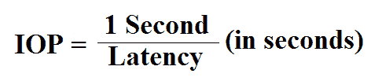
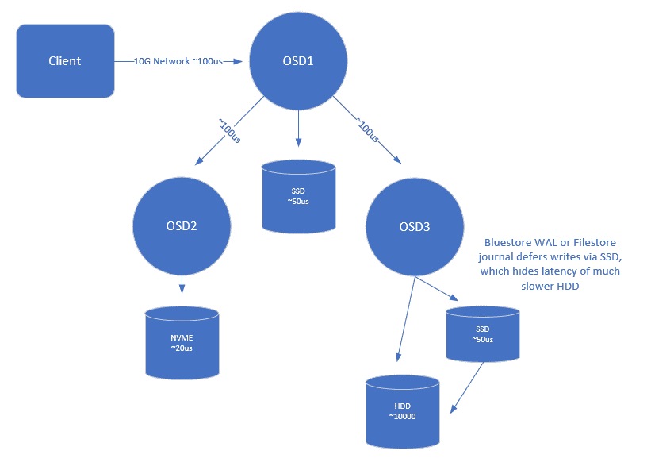
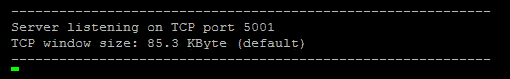
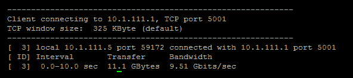
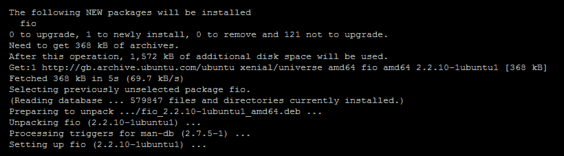
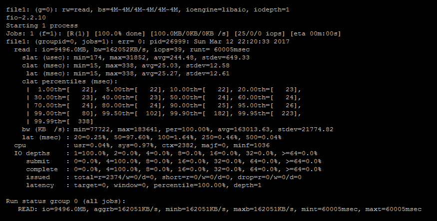
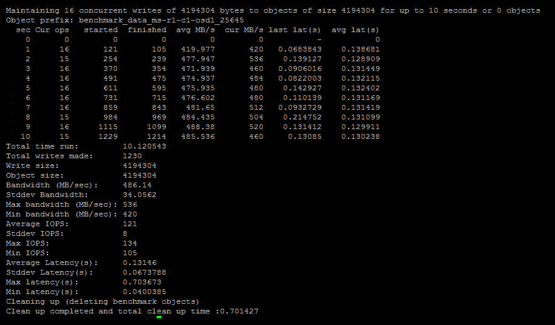
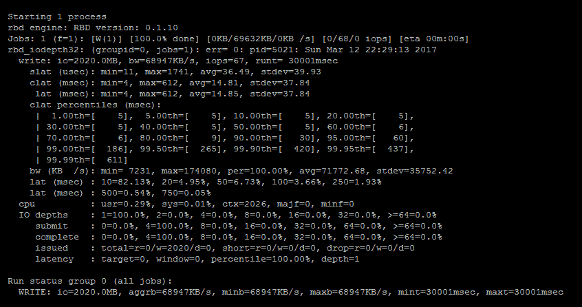

# 第九章：调优 Ceph

虽然 Linux 和 Ceph 的默认配置通常能提供合理的性能，得益于开发人员多年来的研究和调整，但 Ceph 管理员可能希望从硬件中榨取更多性能。通过调优操作系统和 Ceph 配置，可能会实现性能提升。在第一章《Ceph 规划》中，你学习了如何为 Ceph 集群选择硬件；现在，让我们学习如何最大化其性能。

在本章中，你将学习以下内容：

+   延迟及其重要性

+   能够观察调优结果的重要性

+   你应该关注的关键调优选项

# 延迟

在运行基准测试以测试 Ceph 集群性能时，你最终是在测量延迟的结果。所有其他类型的基准测试指标，包括 IOPS、MBps，甚至是更高层次的应用程序指标，都是由该请求的延迟推导出来的。

IOPS 是每秒执行的 I/O 请求次数；每个请求的延迟直接影响可能的 IOPS，并可以通过以下公式进行计算：



如果每个请求的平均延迟为 2 毫秒，则假设每个请求是同步提交的，将得到大约 500 IOPS：

*1/0.002 = 500*

MBps 只是 IOPS 乘以 I/O 大小：

*500 IOPS * 64 KB = 32,000 KBps*

在进行基准测试时，实际上是在测量延迟的最终结果。因此，进行的任何调优都应旨在减少每个 I/O 请求的端到端延迟。

在学习如何基准测试 Ceph 集群的各个组件及可用的各种调优选项之前，我们首先需要了解典型 I/O 请求的各种延迟来源。一旦我们能够将每个延迟来源分解为独立的类别，就可以对每个类别进行基准测试，从而在每个阶段可靠地跟踪正负调优效果。

以下图示展示了一个示例 Ceph 写请求及其主要的延迟来源：



# 客户端到主 OSD

从客户端开始，我们可以看到，平均而言，客户端与主 OSD 通信大约需要 100 微秒的延迟。使用 1 G 网络时，这个延迟可能接近 1 毫秒。我们可以通过使用 `ping` 或 `iperf` 来测量两个节点之间的往返延迟，从而确认这一数字。

从前面的公式中，我们可以看出，即使没有其他延迟来源，使用 1 G 网络时，最大同步写入 IOPS 也将接近 1,000。

尽管客户端本身会引入一些延迟，但与其他来源的延迟相比，这部分延迟是微不足道的，因此在图示中没有列出。

# 主 OSD 到副本 OSD（们）

接下来，运行 Ceph 代码的 OSD 在处理请求时会引入延迟。很难准确给出这个延迟的数字，但它受 CPU 速度的影响。更高频率的快速 CPU 会更快地运行代码路径，从而减少延迟。本书前面提到，主 OSD 会将请求发送到副本集中的另两个 OSD。这两个请求会并行处理，因此从 2x 到 3x 副本的延迟增加最小，假设后端磁盘能够承受负载。

主 OSD 和复制的 OSD 之间还存在一个额外的网络跳跃，这会导致每个请求的延迟增加。

# 从主 OSD 到客户端

一旦主 OSD 将请求提交到其日志并从所有复制 OSD 收到确认它们也已提交，主 OSD 就可以向客户端发送确认并提交下一个 I/O 请求。

关于日志，提交延迟可能会有所不同，取决于所使用的介质类型。NVMe SSD 通常会在 10-20 微秒范围内响应请求，而基于 SATA/SAS 的 SSD 通常在 50-100 微秒范围内响应请求。NVMe 设备还倾向于在队列深度增加时保持更一致的延迟特性，使它们非常适合多个磁盘可能共享同一个 SSD 作为日志的情况。相比之下，硬盘的延迟通常在数十毫秒范围内，尽管随着 I/O 大小的增加，它们的延迟比较一致。

很明显，对于小型高性能工作负载，硬盘延迟将主导总延迟，因此应该使用 SSD，最好是 NVMe。

总体而言，在一个设计良好且经过优化的 Ceph 集群中，所有这些部分结合起来应该能够让平均写入 4 KB 请求在大约 500-750 微秒内得到服务。

# 基准测试

**基准测试**是一个重要的工具，能够快速查看调优工作的效果，并确定集群的能力极限。然而，重要的是，您的基准测试应该反映您通常在 Ceph 集群上运行的工作负载类型。如果您的最终目的是在集群上运行对延迟非常敏感的 **在线事务处理** (**OLTP**) 数据库，那么调优您的 Ceph 集群，使其在大块顺序读取和写入方面表现出色是没有意义的。如果可能，您应该尽量包含一些实际使用与您实际工作负载相同软件的基准测试。以 OLTP 数据库为例，查看是否有针对您数据库软件的基准测试，这将给出最准确的结果。

# 基准测试工具

以下是推荐的工具集，用于开始进行基准测试：

+   **Fio**：Fio 是一个灵活的 I/O 测试工具，它通过其广泛的配置选项，允许你模拟各种复杂的 I/O 模式。它有针对本地块设备和 RBD 的插件，这意味着你可以直接或通过 Linux RBD 内核驱动程序挂载 RBD，从 Ceph 集群中测试 RBD。

+   **Sysbench**：Sysbench 具有一个 MySQL OLTP 测试套件，可以模拟 OLTP 应用程序。

+   **Ping**：不要低估这个简单的 ping 工具；它不仅能够诊断许多网络问题，还能通过往返时间帮助确定网络链路的延迟。

+   **iPerf**：iPerf 允许你进行一系列网络测试，以确定两个服务器之间的带宽。

# 网络基准测试

在网络上有多个区域需要基准测试，以便了解任何限制并确保没有配置错误。

标准以太网帧大小为 1,500 字节，而**jumbo 帧**通常为 9,000 字节。增加的数据帧大小减少了发送数据的开销。如果你已经配置了 jumbo 帧，首先需要检查它们是否在所有服务器和网络设备上正确配置。如果 jumbo 帧配置错误，Ceph 将表现出奇怪的、随机的行为，且很难追踪。因此，在部署 Ceph 之前，确保 jumbo 帧已正确配置并且正常工作是非常重要的。

为了确认 jumbo 帧是否正常工作，你可以使用`ping`命令发送大数据包，并设置**不分段**标志：

```
 ping -M do -s 8972 <destination IP> 
```

该命令应在所有节点上运行，以确保它们可以使用 jumbo 帧互相 ping。如果失败，需调查问题并解决后再部署 Ceph。

接下来的测试是测量往返时间，也可以使用 ping 工具。再次使用数据包大小参数，但同时设置不分段标志，你可以测试某些数据包大小的往返时间，直到 64 KB，这是最大 IP 数据包大小。

以下是两个主机在**10GBase-T**网络上的一些示例读数：

+   32 B = 85 微秒

+   4 KB = 112 微秒

+   16 KB = 158 微秒

+   64 KB = 248 微秒

如你所见，较大的数据包大小会影响往返时间；这是为什么在 Ceph 中较大的 I/O 大小会导致 IOPS 下降的原因之一。

最后，让我们测试两个主机之间的带宽，以确定我们是否获得了预期的性能。

在将充当 iPerf 服务器角色的服务器上运行 `iperf -s`：



然后，运行`iperf -c <iperf 服务器地址>`命令：



在此示例中，两个主机通过 10 G 网络连接，并获得接近理论最大吞吐量的性能。如果你没有看到正确的吞吐量，需要对网络进行调查，包括主机配置。

# 磁盘基准测试

理解你 Ceph 集群中硬盘和 SSD 的底层性能是个好主意，因为这将帮助你预测整个 Ceph 集群的性能。为了基准测试集群中的磁盘，将使用 fio 工具。

如果你在写模式下操作，请小心使用 fio。如果你指定了块设备，fio 会毫不犹豫地覆盖该磁盘上现有的任何数据。

Fio 是一个功能复杂的工具，具有许多配置选项。在本章中，我们将专注于使用它进行基本的读写基准测试：

1.  在 Ceph OSD 节点上安装 fio 工具：

```
 apt-get install fio
```

上述命令会输出以下内容：



1.  创建一个新文件，并将以下 fio 配置放入其中：

```
 [global] ioengine=libaio randrepeat=0 invalidate=0 rw=randwrite bs=4k direct=1 time_based=1 runtime=30 numjobs=1 iodepth=1 filename=/test.fio size=1G
```

上述 fio 配置会运行一个单线程的 4 KB 随机写入测试，持续 30 秒。它将在文件系统的根目录下创建一个 1G 的 `test.fio` 文件。如果你希望直接对块设备进行测试，只需将文件名设置为块设备名称。但请注意，根据前述警告，fio 会覆盖该块设备上的任何数据。

注意，作业设置为使用方向，因此页面缓存不会加速任何 I/O 操作。

要运行 fio 作业，只需调用 `fio` 并指定先前配置文件的名称：

```
 fio <filename> 
```

上述命令会输出以下内容：



一旦作业完成，fio 会生成类似于前述截图中的输出。你可以看到，fio 作业运行了 39 IOPS 和 162 MBps 的平均速度，且平均延迟为 25 毫秒。

还有延迟百分位数的详细信息，这对于理解请求延迟的分布非常有用。

# RADOS 基准测试

下一步是基准测试 RADOS 层。这将给出一个综合数据，包括磁盘性能、网络性能——加上 Ceph 代码的开销——以及额外的复制数据副本。

RADOS 命令行工具具有内建的基准测试命令，默认启动 16 个线程，所有线程写入 4 MB 的对象。要运行 RADOS 基准测试，运行以下命令：

```
 rados -p rbd bench 10 write
```

这将运行一个持续 10 秒的写入基准测试：



在前面的示例中，可以看到集群能够维持约 480 MBps 的写入带宽。输出还给出了延迟和其他有用的数字。请注意，在测试结束时，它会自动删除作为基准测试一部分创建的对象。如果你希望使用 RADOS 工具进行读取基准测试，则需要指定 `--no-cleanup` 选项，以保留对象，然后将基准测试类型指定为 `seq` 而不是 `write`，然后再次运行基准测试。之后，你需要手动清理基准对象。

# RBD 基准测试

最后，我们将使用我们喜爱的工具 fio 来测试 RBD 的性能。这将测试整个软件和硬件堆栈，其结果将非常接近客户预期的观察结果。通过配置 fio 来模拟某些客户应用程序，我们还可以感受到这些应用程序的预期性能。

为了测试 RBD 的性能，我们将使用 fio RBD 引擎，这使得 fio 可以直接与 RBD 镜像通信。创建一个新的 fio 配置，并将以下内容放入其中：

```
[global]
ioengine=rbd
randrepeat=0
clientname=admin
pool=rbd
rbdname=test
invalidate=0
rw=write
bs=1M
direct=1
time_based=1
runtime=30
numjobs=1
iodepth=1
```

您可以看到，与磁盘基准配置不同，此配置文件现在使用 `rbd` 引擎而不是 `libaio` 引擎。使用 `rbd` 引擎时，您还需要指定 RADOS 池和 `cephx` 用户。最后，而不是指定文件名或块设备，您只需指定已存在于您配置的 RADOS 池中的 RBD 镜像。

然后，运行 fio 作业来测试您的 RBD 的性能：



如前述输出所示，fio 工具直接使用 RBD 引擎，无需将 RBD 挂载到 Linux 操作系统即可进行测试。

# 推荐的调整

通过调整您的 Ceph 集群，您可以获得最佳性能，并从您的硬件中获得最大的好处。在本节中，我们将看看推荐的 Ceph 调整选项。

重要的是要理解，通过调整，您所做的只是减少瓶颈。如果您成功地减少了一个区域的足够多的瓶颈，那么瓶颈将简单地转移到另一个区域。您总会在某个地方遇到瓶颈，并最终会达到一个硬件能够提供的极限。因此，目标应该是减少软件和操作系统中的瓶颈，以释放硬件的全部潜力。

# CPU

由于 Ceph 是存储的软件定义，其性能受 OSD 节点中 CPU 速度的影响较大。更快的 CPU 意味着 Ceph 代码可以更快地运行，并且在处理每个 I/O 请求时花费的时间更少。结果是每个 I/O 的更低延迟，如果底层存储可以处理，将减少 CPU 作为瓶颈，并提供更高的整体性能。第一章《规划 Ceph》指出，出于性能原因，高 GHz 处理器比高核心数更受青睐；然而，对于高核心数 CPU，当它们被过度规定用于作业时，还存在其他问题。

为了理解这些问题，我们需要简要回顾 CPU 设计的历史。在 2000 年代初期，所有的 CPU 都是单核设计，始终以相同的频率运行，并且不支持许多低功耗模式。随着它们频率的提高和核心数的增加，显而易见，并非每个核心都能始终运行在其最大频率上。CPU 包装产生的热量实在是太大了。快进到今天，这一情况仍然成立：没有所谓的 4 GHz 20 核 CPU，它会产生过多的热量，根本不可行。

然而，设计 CPU 的聪明人想出了一个解决方案，这使得每个核心可以在不同的频率下运行，并且可以将其自身关闭进入深度睡眠状态。这两种方法都降低了 CPU 的功耗和冷却需求，将其降至单个位数瓦特。

这些 CPU 的时钟速度较低，但通过一定数量的核心启动涡轮模式，较高的 GHz 变得可能。通常随着活跃核心数的增加，最高涡轮频率会逐渐降低，以保持热输出在某个阈值以下。如果启动了一个低线程的进程，CPU 会唤醒几个核心，并将它们加速到更高的频率，以提高单线程性能。在 Intel 的 CPU 中，不同的频率级别称为**P 状态**，而睡眠级别称为**C 状态**。

这一切听起来像是完美的方案：当 CPU 闲置时，几乎不消耗任何功率，而当需要时，它可以通过涡轮加速几个核心来实现高时钟速度。不幸的是，世上没有免费的午餐。这种方法确实存在一些开销，这些开销对对延迟敏感的应用程序产生不利影响，其中 Ceph 就是一个例子。

这种方法有两个主要问题，它们影响着对延迟敏感的应用程序，第一个问题是核心从睡眠状态唤醒需要时间。睡眠越深，唤醒所需的时间就越长。核心必须重新初始化某些内部组件，才能准备好使用。以下是来自 Intel E3-1200v5 CPU 的列表；较旧的 CPU 可能会稍微差一些：

+   POLL = 0 微秒

+   C1-SKL = 2 微秒

+   C1E-SKL = 10 微秒

+   C3-SKL = 70 微秒

+   C6-SKL = 85 微秒

+   C7s-SKL = 124 微秒

+   C8-SKL = 200 微秒

我们可以看到，在最坏的情况下，一个核心可能需要最多 200 微秒才能从其最深的休眠状态中唤醒。考虑到单个 Ceph I/O 可能需要多个线程跨多个节点来唤醒 CPU 核心，这些退出延迟可能会累积起来。虽然 P 状态影响核心频率的程度不如 C 状态的退出延迟那样大，但核心的频率不会在被使用时立即以最大速度增加。这意味着在低利用率下，CPU 核心可能仅在较低的 GHz 频率下运行。这就引出了第二个问题，即 Linux 调度程序的问题。

Linux 知道哪个核心是活跃的，以及每个核心正在运行的 C 状态和 P 状态。它可以完全控制每个核心的行为。不幸的是，Linux 的调度程序并没有考虑到这些信息，而是倾向于尝试均衡地将线程分配到各个核心。这意味着在低利用率情况下，所有 CPU 核心大部分时间都会处于最低的 C 状态，并以较低的频率运行。在低利用率时，这会对小 I/O 的延迟产生 4-5 倍的影响，这是一个显著的影响。

直到 Linux 拥有一个能够根据哪些核心已经处于活动状态并将线程调度到这些核心上以减少延迟的电源感知调度程序为止，最佳的方法是强制 CPU 只进入某个 C 状态，并始终以最高频率运行。这确实会增加功耗，但在最新的 CPU 型号中，这一情况有所减少。因此，应该清楚为什么建议根据工作负载为 CPU 选择适当的配置。将一个 40 核的服务器以高 C 状态和高频率运行将消耗大量电力。

为了强制 Linux 仅降至 C1 C 状态，请将以下内容添加到你的 GRUB 配置中：

```
 intel_idle.max_cstate=1 
```

一些 Linux 发行版提供了一个性能模式，该模式将 CPU 运行在最大频率下。然而，手动实现此模式的方法是通过`sysfs`回显值。将以下内容添加到`/etc/rc.local`中将在启动时设置所有核心运行在其最大频率下：

```
 /sys/devices/system/cpu/intel_pstate/min_perf_pct
```

重启你的 OSD 节点后，这些更改应该会生效。通过运行以下命令来确认这一点：

```
 sudo cpupower monitor
```

如本章前文所述，在进行这些更改之前，请先运行基准测试，然后再进行一次，以便了解通过此更改所获得的收益。

# BlueStore

Ceph 的最新版本包含了针对 BlueStore OSD 的自动调优功能。自动调优通过分析 OSD 的缓存利用率，并根据当前的命中率调整 OSD、RocksDB 和数据缓存的缓存阈值。它还限制这些缓存的总和，以尽量将总的 OSD 内存使用量限制在`osd_memory_target`变量设置的限制范围内，默认值为 4 GB。

显然，如果 Ceph 节点的内存较少，因此无法为每个 OSD 提供 4 GB 内存，则需要减少该值，以避免节点内存不足。然而，如果 Ceph 节点内存充足，建议增加 `osd_memory_target` 变量，以便 Ceph 尽可能多地利用已安装的内存。分配足够的 RAM 给 OSD 和 RocksDB 后，任何额外的内存将被用作数据缓存，并能更有效地服务于高百分比的读 IO。当前的自动调节算法比较缓慢，需要一些时间才能充分发挥作用，因此应该给 `osd_memory_target` 变量调整至少 24-48 小时，以观察其完全效果。

# WAL 延迟写入

BlueStore 可以在 RocksDB WAL 中记录写入操作，并在稍后的时间进行刷新，从而实现写入合并和排序。这可以为使用旋转磁盘和基于闪存的设备的 RocksDB 的集群带来显著的性能提升。

默认情况下，如果 OSD 被识别为旋转硬盘，则小于或等于 32 KB 的写入操作会写入 OSD 的 WAL，然后进行确认并发送回客户端。这由 `bluestore_prefer_deferred_size_hdd` 变量控制；如果确定您的工作负载有利于通过 WAL 延迟更大的写入以实现更低的延迟和更高的 IOPS，可以调整该值。同时，还应考虑持有 WAL 的闪存设备的写入负载，既要考虑带宽，也要考虑耐久性。

BlueStore 配置还限制了在 OSD 强制刷新数据到磁盘之前，最多可以排队多少写入操作；这个值可以通过 `bluestore_deferred_batch_ops` 变量进行控制，默认设置为 `64`。增加这个值可能会提高总吞吐量，但也有可能导致硬盘花费大量时间处于饱和状态，进而增加平均延迟。

# Filestore

在几乎所有情况下，BlueStore 的性能优于 filestore，并解决了多个限制，因此建议将您的集群升级到 BlueStore。不过，为了完整性，以下是可以调整的项，以提高 filestore 性能，前提是您的集群仍在运行它。

# VFS 缓存压力

顾名思义，filestore 对象存储通过将 RADOS 对象作为文件存储在标准 Linux 文件系统中来工作。在大多数情况下，这将是 XFS。由于每个对象都作为文件存储，因此每个磁盘上可能会有数十万甚至百万个文件。一个 Ceph 集群由 8 TB 磁盘组成，用于 RBD 工作负载。假设 RBD 由标准的 4 MB 对象组成，那么每个磁盘上大约会有 200 万个对象。

当一个应用程序请求 Linux 读取或写入文件系统上的文件时，它需要知道该文件在磁盘上的实际位置。为了找到这个位置，它需要遵循目录项和 inode 的结构。如果这些查找项没有被缓存到内存中，每一次查找都需要磁盘访问。如果 Ceph 对象在一段时间内没有被访问，因此没有被缓存，这可能会导致在某些情况下性能不佳。由于随机读取的影响，在旋转磁盘集群中这种惩罚会比在基于 SSD 的集群中更高。

默认情况下，Linux 偏好将数据缓存到页缓存中，而不是缓存 inode 和目录项。在 Ceph 中的许多情况下，这正是你不希望发生的。幸运的是，Linux 提供了一个可调的内核参数，允许你告诉系统优先缓存目录项和 inode 而不是页缓存；这一设置可以通过以下 `sysctl` 设置进行控制：

```
 vm.vfs_cache_pressure
```

在设置较低数值时，系统会偏好缓存 inode 和目录项，绝对不要将此值设置为零。零值会告诉内核即使在低内存情况下，也不刷新旧的条目，这可能带来不良影响。推荐设置为 `1`。

# WBThrottle 和/或 nr_requests

Filestore 使用缓冲 I/O 进行写入；如果 Filestore 日志位于更快的存储介质上，这带来了一些优势。客户端请求在写入日志后立即得到确认，然后由 Linux 中的标准写回功能在稍后的时间刷新到数据磁盘。这使得旋转磁盘 OSD 在小规模写入时能够提供与 SSD 相似的写入延迟。延迟写回还允许内核重新排列对磁盘的 I/O 请求，以期将它们合并，或者使磁头在盘片上沿着更优路径移动。最终效果是，你可以从每个磁盘中挤出更多的 I/O，相比直接或同步 I/O，性能得到了提升。

然而，问题出现在 Ceph 集群中写入请求的数量超出了底层磁盘的处理能力。在这种情况下，待写入磁盘的挂起 I/O 数量可能会失控地增加，导致 I/O 队列饱和，进而饱和磁盘和 Ceph 队列。读取请求尤其会受到较大影响，因为它们会被数千个写入请求堵塞，这些写入请求可能需要几秒钟才能刷新到磁盘上。

为了解决这个问题，Ceph 在 Filestore 中内建了一种写回节流机制，叫做 **WBThrottle**。它的设计目的是限制可以排队的写回 I/O 的数量，并比内核自然触发的写回过程提前启动刷新。然而，测试显示，默认设置仍可能无法遏制这种行为，从而减轻对读取延迟的影响。

调优可以改变这种行为，以减少写队列的长度，并且允许读取不受太大影响。然而，这也有一个权衡；通过减少允许排队的最大写入数量，您可以减少内核最大化重排请求效率的机会。需要根据您给定的使用案例、工作负载进行思考，并进行调整以匹配它。

为了控制写回队列深度，您可以通过调整 Ceph 的 WBThrottle 设置来减少最大未完成 I/O 的数量，或者在内核的块层面降低最大未完成请求数。这两种方法都能有效地控制相同的行为，实际上只是在于您希望如何实现该配置。

还应该注意，Ceph 中的操作优先级在磁盘级别的队列较短时更为有效。通过缩短磁盘上的队列，主要的排队位置会移到 Ceph 中，Ceph 可以更好地控制哪些 I/O 具有优先权。考虑以下示例：

```
echo 8 > /sys/block/sda/queue/nr_requests
```

随着 Linux 4.10 内核的发布，引入了一项新特性，即降低写回 I/O 的优先级；这大大减少了 Ceph 写饥饿的影响，如果可以运行 4.10 内核，值得考虑进行调查。

# 节流 filestore 队列

在默认配置下，当磁盘变得饱和时，其磁盘队列将逐渐填满。然后，filestore 队列将开始填满。直到此时，I/O 会以日志能够接受的最快速度被接受。一旦 filestore 队列填满和/或 WBThrottle 生效，I/O 将突然停止，直到队列恢复到低于阈值的状态。这种行为会导致大幅波动，并且很可能会出现低性能的时段，其他客户端请求会遇到较高的延迟。

为了减少磁盘饱和时 filestore 的波动性，可以设置一些额外的配置选项，以便在 filestore 队列填满时逐渐降低操作速率，而不是在硬限制下反复波动。

# filestore_queue_low_threshhold

这个值是一个介于 0.0 和 1.0 之间的百分比。低于该阈值时，不进行节流。

# filestore_queue_high_threshhold

这个值是一个介于 0.0 和 1.0 之间的百分比。在低阈值和高阈值之间，通过引入每个 I/O 的延迟进行节流，延迟会线性增加，从 0 增加到 `filestore_queue_high_delay_multiple/filestore_expected_throughput_ops`。

从高阈值到最大值，会按 `filestore_queue_max_delay_multiple/filestore_expected_throughput_ops` 确定的速率进行节流。

这两个节流速率使用配置的值，即磁盘的预期吞吐量来计算要引入的正确延迟。`delay_multiple` 变量的存在是为了允许在队列超过高阈值时增加这个延迟。

# filestore_expected_throughput_ops

该值应设置为 OSD 运行所在底层磁盘的预期 IOPS 性能。

# filestore_queue_high_delay_multiple

在低阈值和高阈值之间，使用此倍数来计算应引入的正确延迟量。

# filestore_queue_max_delay_multiple

当超过最大队列大小时，此乘数用于计算更大的延迟，以期望防止队列填满。

# 拆分 PG

文件系统对于可以存储在目录中的文件数量有一个限制，当要求列出内容时，性能会开始下降：

+   由于 Ceph 每个磁盘存储数百万个对象——它们就是文件。它通过嵌套的目录结构拆分文件，以限制每个目录中放置的文件数量。

+   随着集群中对象数量的增加，每个目录中的文件数量也会增加。

+   当这些目录中的文件数量超过限制时，Ceph 会将目录拆分成更多的子目录，并将对象迁移到它们中。

此操作在发生时可能会产生显著的性能惩罚。此外，XFS 尝试将文件尽可能地放在磁盘上同一目录的相近位置。当 PG 拆分发生时，XFS 文件系统可能会出现碎片化，进一步导致性能下降。

默认情况下，当 PG 包含 320 个对象时，Ceph 会拆分该 PG。配置了推荐每 OSD PG 数量的 8 TB 磁盘，可能每个 PG 会有超过 5000 个对象。这个 PG 在其生命周期中可能已经经历了多次 PG 拆分操作，导致目录结构更深、更复杂。

如 *VFS 缓存压力* 部分所述，为了避免高昂的目录项查找，内核会尝试缓存它们。PG 拆分的结果是需要缓存更多的目录，可能没有足够的内存来缓存它们，从而导致性能下降。

解决此问题的常见方法是通过设置 OSD 配置选项来增加每个目录中允许的文件数量，具体如下：

```
filestore_split_multiple 
```

此外，使用以下设置：

```
filestore_merge_threshold
```

使用以下公式，您可以设置 Ceph 何时拆分 PG 的阈值：


然而，必须小心。尽管增加阈值将减少 PG 拆分的发生次数，并减少目录结构的复杂性，但当 PG 拆分发生时，它将必须拆分更多的对象。需要拆分的对象数量越多，对性能的影响越大，甚至可能导致 OSD 超时。拆分频率与拆分时间之间存在权衡；默认值可能稍显保守，尤其是在较大的磁盘上。

将拆分阈值加倍或三倍通常可以安全地完成，无需过多担心；更大的值应在集群处于 I/O 负载时进行测试，然后再投入生产环境。

# 刷新

清理是 Ceph 用于验证存储在 RADOS 中的对象是否一致的方式，并防止位腐化或其他损坏。清理操作可以是正常的或深度的，取决于设定的计划。在正常的清理操作中，Ceph 会读取某个 PG 的所有对象，并比较它们的副本，以确保它们的大小和属性匹配。

深度清理操作进一步比较对象的实际数据内容。这会比简单的标准清理例程产生更多的 I/O。正常的清理操作每天执行，而深度清理由于额外的 I/O 负载，应该每周执行一次。

尽管清理操作的优先级被降低，但清理仍然会对客户端 I/O 产生影响，因此，有许多 OSD 设置可以调整，指导 Ceph 何时进行清理操作。

`osd_scrub_begin_hour` 和 `osd_scrub_end_hour` OSD 配置选项决定了 Ceph 尝试安排清理的时间窗口。默认情况下，这些值设置为允许清理操作在 24 小时内进行。如果你的工作负载只在白天运行，你可能希望调整清理开始和结束的时间，以告诉 Ceph 你只希望它在非高峰时段进行清理。`osd_scrub_sleep` 配置选项控制清理操作在每个块之间等待的时间（以秒为单位），这有助于在读取每个对象之间为客户端 I/O 提供服务。块大小由两个变量 `osd_scrub_chunk_min` 和 `osd_scrub_chunk_max` 决定。

需要注意的是，这次只有当 PG 没有超出其最大清理间隔时，窗口才会生效。如果超出了最大间隔，它将被清理，无论时间窗口设置如何。正常和深度清理的默认最大间隔都设置为一周。

# 操作优先级

Ceph 能够优先执行某些操作，目的是确保客户端 I/O 优先于恢复、清理和快照修剪 I/O。这些优先级由以下配置选项控制：

```
osd client op priority osd recovery op priority osd scrub priority osd snap trim priority
```

在这里，值越高，优先级越高。默认值通常效果很好，通常不需要更改它们。但是，降低清理和恢复操作的优先级可能有助于限制它们对客户端 I/O 的影响。需要理解的是，Ceph 只能优先处理其控制的 I/O 路径部分的 I/O。因此，可能需要调整上一部分中磁盘队列的长度以获得最大效果。

# 网络

网络是 Ceph 集群的核心组件，其性能会极大地影响集群的整体性能。10 GB 应被视为最低要求；1 GB 的网络无法为高性能的 Ceph 集群提供所需的延迟。通过减少延迟和提高吞吐量，有许多调整可以帮助提高网络性能。

如果你希望使用 Jumbo 帧，首先要考虑的是使用 9,000 的 MTU 而不是 1,500；这样每个 I/O 请求可以通过较少的以太网帧发送。由于每个以太网帧都有小的开销，增加最大以太网帧到 9,000 可以有所帮助。实际上，性能提升通常不到 5%，且需要权衡每个设备都配置正确的劣势。

以下网络选项建议在你的 `sysctl.conf` 文件中设置，以最大化网络性能：

```
#Network buffers net.core.rmem_max = 56623104 net.core.wmem_max = 56623104 net.core.rmem_default = 56623104 net.core.wmem_default = 56623104 net.core.optmem_max = 40960 net.ipv4.tcp_rmem = 4096 87380 56623104 net.ipv4.tcp_wmem = 4096 65536 56623104  #Maximum connections and backlog net.core.somaxconn = 1024 net.core.netdev_max_backlog = 50000 #TCP tuning options net.ipv4.tcp_max_syn_backlog = 30000 net.ipv4.tcp_max_tw_buckets = 2000000 net.ipv4.tcp_tw_reuse = 1 net.ipv4.tcp_tw_recycle = 1 net.ipv4.tcp_fin_timeout = 10  #Don't use slow start on idle TCP connections net.ipv4.tcp_slow_start_after_idle = 0
```

如果你正在为 Ceph 集群使用 IPv6，请确保使用适当的 IPv6 `sysctl` 选项。

# 一般系统调优

有许多一般的系统参数建议进行调优，以便更好地满足 Ceph 的性能要求。可以将以下设置添加到 `/etc/sysctl.conf` 文件中。

确保系统始终有足够的空闲内存：

```
vm/min_free_kbytes = 524288
```

增加允许的最大进程数：

```
kernel.pid_max=4194303
```

使用以下命令设置最大文件句柄数：

```
fs.file-max=26234859
```

# 内核 RBD

Linux 内核 RBD 驱动允许你将 Ceph RBD 直接映射为标准 Linux 块设备，并像使用其他设备一样使用它们。通常，内核映射的 RBD 需要最小的配置，但在某些特殊情况下，可能需要一些调整。

首先，建议使用尽可能新的内核，因为较新的内核将提供更好的 RBD 支持，并且在某些情况下，性能也有所提升。

# 队列深度

从内核 4.0 开始，RBD 驱动使用 `blk-mq`，该系统旨在提供比旧有排队系统更高的性能。默认情况下，当使用 `blk-mq` 时，RBD 的最大未完成请求数为 128。对于大多数使用场景，这已经足够；然而，如果你的工作负载需要充分利用大型 Ceph 集群的全部性能，你可能会发现仅有 128 个未完成请求不够用。映射 RBD 时有一个选项可以增加这个值，接下来可以进行设置。

# 预读

默认情况下，RBD 会配置为 128 KB 的 `readahead`。如果你的工作负载主要涉及大规模顺序读取，通过增加 `readahead` 值可以显著提升性能。在 4.4 版本之前的内核中，`readahead` 值大于 2 MB 会被忽略。在大多数存储系统中，这不是问题，因为条带大小通常小于 2 MB。只要 `readahead` 大于条带大小，所有磁盘都会参与进来，性能也会提升。

默认情况下，Ceph RBD 会在 4 MB 的对象上进行条带化，因此 RBD 的块大小为 4 MB，*条带大小为 4 MB* × 集群中的 OSD 数量。因此，如果 `readahead` 大于 4 MB，大多数情况下，`readahead` 对性能的提升作用非常有限，你可能会发现读取性能难以超过单个 OSD 的性能。

在内核 4.4 及以上版本中，你可以将 `readahead` 值设置得更高，从而在一秒钟内体验到数百 MB 的读取性能。

# 调优 CephFS

有两个主要的性能特征决定了 CephFS 的性能——元数据访问速度和数据访问速度，尽管在大多数情况下，这两者都对访问请求有所贡献。

需要理解的是，在 CephFS 中，一旦文件的元数据被检索，实际文件数据的读取就不再需要任何进一步的元数据操作，直到文件被客户端关闭。同样，当写入文件时，只有当脏数据被客户端刷新时，元数据才会被更新。因此，对于大型的顺序缓冲 IO，元数据操作可能只占总集群 IO 的一小部分。

类似地，对于那些处理大量客户端不断打开和关闭多个小文件的 CephFS 文件系统，元数据操作在确定整体性能方面将起到更大的作用。此外，元数据还用于提供与文件系统相关的客户端信息，例如提供目录列表。

处理 CephFS 数据池性能时，应像本章中涵盖的其他 Ceph 性能需求一样进行处理，因此本节的重点将放在元数据性能上。

元数据性能由两个因素决定：通过 RADOS 元数据池读取/写入元数据的速度，以及 MDS 处理客户端请求的速度。首先，确保元数据池存储在闪存上，因为这将把元数据请求的延迟至少减少一个数量级，如果不是更多的话。然而，正如本章 *延迟* 部分所讨论的那样，分布式网络存储平台引入的延迟也可能影响元数据性能。

为了规避一些延迟，MDS 引入了本地缓存的概念，用来处理热点元数据请求。默认情况下，MDS 会保留 1 GB 的 RAM 用作缓存，通常来说，你分配的 RAM 越多越好。该预留量由 `mds_cache_memory_limit` 变量控制。通过增加 MDS 可用作缓存的内存量，可以减少需要访问 RADOS 池的请求数量，同时 RAM 的本地性也会降低元数据访问延迟。

当增加额外的 RAM 带来的好处变得很小时，可能是因为缓存的大小已经足够，绝大多数请求都来自缓存，或者是实际的 MDS 已经达到了它可以处理的请求数量。

关于后者，MDS 进程是单线程的，因此会有一个时刻，元数据请求的数量使得 MDS 占用 100% 的单个 CPU 核心，任何额外的缓存或 SSD 都无法解决。当前的建议是尽可能在高频率 CPU 上运行 MDS。四核 Xeon E3 处理器非常适合这种用途，并且通常可以以接近 4 GHz 的频率以合理的价格获得。与一些低频率的 Xeon CPU（通常具有较高的核心数）相比，确保使用快速 CPU 可以带来接近双倍的性能提升。

如果你已经购买了最快的 CPU，且发现单个 MDS 进程仍然是瓶颈，最后的选择应该是开始部署多个活动 MDS，这样元数据请求就能在多个 MDS 之间分散。

# RBD 和纠删码池

当使用存储在纠删码池中的 RBD 时，为了保持最佳性能，应该尽量生成完整的条带写入。纠删码池进行完整条带写入时，可以通过单次 IO 完成该操作，而不会受到读取-修改-写入周期和部分写入操作的性能惩罚。

RBD 客户端具备一些智能功能，它们会发出 RADOS 请求，从而在检测到更高级别的客户端 IO 覆盖整个对象时，写入完整的命令。确保 RBD 上的文件系统格式化时具有正确的条带对齐非常重要，以确保生成尽可能多的完整写入操作。

在 4 + 2 EC 池上格式化 RBD 上的 XFS 文件系统的示例如下：

```
mkfs.xfs /dev/rbd0 -d su=1m,sw=4
```

这将指示 XFS 对齐分配，以便最佳地适应由 4 + 2 纠删池中存储的 4 MB 对象组成的 4x1 MB 条带。

此外，如果使用案例要求直接将 RBD 挂载到 Linux 服务器，而不是通过 QEMU/KVM 虚拟机，则也值得考虑使用`rbd-nbd`。用户空间的 RBD 客户端使用 librbd，而内核 RBD 客户端完全依赖于运行内核中存在的 Ceph 代码。

不仅 librbd 使得你可以使用最新的功能（这些功能可能在运行中的内核中不存在），它还具有额外的写回缓存功能。写回缓存在将写入合并为完整对象写入时，比内核客户端更有效，从而减少了性能开销。请记住，librbd 中的写回缓存是非持久性的，因此任何同步写入都无法从中受益。

# PG 分布

虽然这不是一个严格意义上的性能调优选项，但确保 Ceph 集群中的 PG 均匀分布是一个关键任务，应在集群部署的早期阶段进行。由于 Ceph 使用 CRUSH 算法伪随机地决定数据的位置，它不会总是将 PG 均匀分布到每个 OSD 上。一个不平衡的 Ceph 集群将无法充分利用原始容量，因为最过载的 OSD 实际上将成为容量的瓶颈。

不均衡的集群意味着更多的请求将被定向到持有最多 PG 的 OSD。这些 OSD 将给集群带来人工的性能瓶颈，尤其是在集群由旋转磁盘 OSD 组成的情况下。

要在 Ceph 集群中重新平衡 PG，只需重新加权 OSD，以便 CRUSH 调整存储在它上的 PG 数量。需要注意的是，默认情况下，每个 OSD 的权重为 1，且不能将一个未充分利用的 OSD 的权重提高到 1 以上来增加其利用率。唯一的选择是降低过度利用的 OSD 的加权值，这将把 PG 移动到利用率较低的 OSD 上。

还需要了解的是，OSD 的 CRUSH 权重和重载加权值之间是有区别的。重载加权值用于覆盖 CRUSH 算法的错误分配。重载命令只会影响 OSD 本身，不会影响它所属于的桶（例如，主机）的权重。重载值在 OSD 重启时也会被重置为 1.0。虽然这可能令人沮丧，但需要理解的是，任何未来对集群的修改，无论是增加 PG 数量还是添加额外的 OSD，都可能导致任何重载值变得不准确。因此，重新加权 OSD 不应视为一次性的操作，而应视为一个持续进行的过程，它会随着集群的变化而进行调整。

要重新加权一个 OSD，可以使用以下简单命令：

```
Ceph osd reweight <osd number> <weight value 0.0-1.0>
```

执行完命令后，Ceph 将开始回填操作，将 PG 移动到它们新分配的 OSD 上。

当然，遍历所有的 OSD 并尝试找到需要重新加权的 OSD，然后为每个 OSD 执行此命令，将是一个非常漫长的过程。幸运的是，还有一个 Ceph 工具可以自动化这个过程的大部分操作：

```
    ceph osd reweight-by-utilization <threshold> <max change>
    <number of OSDs>
```

此命令将比较集群中的所有 OSD，并更改前*N*个 OSD 的重载加权值，其中*N*由最后一个参数控制，该值超出了阈值。你还可以通过指定第二个参数来限制应用于每个 OSD 的最大更改：通常推荐的数值是 0.05 或 5%。

还有一个`test-reweight-by-utilization`命令，它允许你在运行命令之前查看它将会执行的操作。

虽然这个命令是安全的，但在执行之前需要考虑一些事项：

+   它不考虑不同 OSD 上的不同池。例如，如果你有一个 SSD 层和一个 HDD 层，`reweight-by-utilization` 命令仍然会试图跨所有 OSD 平衡数据。如果你的 SSD 层没有像 HDD 层那样满，命令将无法按预期工作。如果你希望平衡仅限于单个桶中的 OSD，可以查看 CERN 创建的该命令的脚本版本。

+   可以重新调整集群权重，直到 CRUSH 无法为某些 PG 确定位置。如果恢复停止，并且一个或多个 PG 留在重新映射状态下，这很可能就是发生的情况。只需增加或重置权重值即可解决问题。

一旦你确认了命令的操作，便可以通过 `cron` 来调度它，这样集群就能自动保持更平衡的状态。

自 Luminous 版本发布以来，新增了一个管理模块，叫做 **Ceph balancer**。这个新模块会在后台持续工作，优化 PG 分布，并确保 Ceph 集群的最大容量可用。

Ceph balancer 模块可以使用两种方法来平衡数据分布。第一种是 crush-compat；这种方法使用额外的权重字段来调整每个 OSD 的权重。crush-compat 的主要优点是它与旧版客户端兼容。另一种方法叫做 upmap；upmap 能比 crush-compat 实现更精细的 PG 映射，因为它利用 OSD 映射中的新功能来影响 PG 映射。缺点是，由于这些新功能，Ceph 客户端需要运行 Luminous 或更新版本。

要启用 ceph balancer，只需运行这两个命令：

```
ceph mgr module enable balancer ceph balancer on
```

你将看到 Ceph 开始回填，因为 PG 被重新映射到新的 OSD，以平衡空间利用率；这将持续进行，直到 Ceph balancer 将 OSD 利用率的偏差降低。

# 总结

现在你应该已经掌握了如何调优 Ceph 集群，以最大化性能并实现更低的延迟。通过使用基准测试，你应该能够进行前后对比测试，确认调优是否达到了预期效果。值得回顾官方 Ceph 文档，以更好地理解其他可能对集群有益的配置选项。

你还学习了影响 Ceph 性能的一些关键因素，以及如何调整它们，例如 CPU 时钟速度和睡眠状态。确保 Ceph 集群运行的基础设施处于最佳性能状态，将确保 Ceph 发挥其最佳性能。

在下一章，我们将讨论分层技术及其如何通过将不同的磁盘技术结合起来，提高性能。

# 问题

1.  默认情况下，PG 分布是否均匀？

1.  为什么在 EC 池上偏好进行全条带写操作？

1.  对于低延迟，应该选择哪种类型的 CPU？

1.  哪三个因素主要影响延迟？

1.  可以使用什么自动化工具来平衡集群中的空间利用率？
