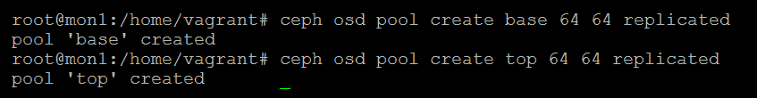
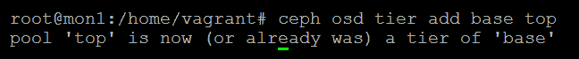
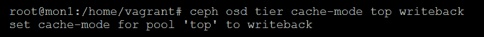
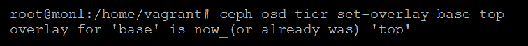
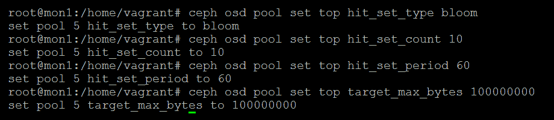
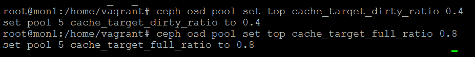
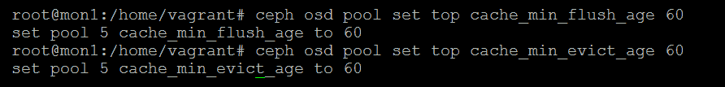
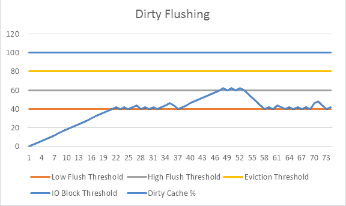

# Ceph 的分层

Ceph 中的分层功能允许你将一个 RADOS 池覆盖到另一个 RADOS 池上，并让 Ceph 智能地在它们之间提升和驱逐对象。在大多数配置中，顶层池将由快速存储设备组成，如**固态硬盘**（**SSDs**），而基础池则由较慢的存储设备组成，如**串行 ATA**（**SATA**）或**串行附加 SCSI**（**SAS**）硬盘。如果你的数据工作集的比例相对较小，这允许你使用 Ceph 提供高容量存储，同时仍能保持对频繁访问数据的良好性能。

在本章中，我们将讨论以下主题：

+   Ceph 的分层功能如何工作

+   分层的良好应用场景是什么

+   如何将两个池配置为一个分层

+   可用于分层的各种调整选项

如果你希望使用分层功能，建议至少运行 Ceph 的 Jewel 版本。以前的版本缺乏许多使分层可用的特性。

# 分层与缓存的区别

虽然通常将其描述为**缓存分层**，但更好的理解方式是将 Ceph 中的功能视为一种分层技术，而非缓存。在继续阅读之前，理解两者之间的差异非常重要。

缓存通常旨在加速对一组数据的访问，除非它是一个写回缓存；它不会持有数据的唯一副本，通常将数据提升到缓存的开销较小。缓存通常在较短的时间框架内操作，并且经常会将所有访问的数据提升到缓存中。

分层解决方案也旨在加速对一组数据的访问；然而，它的提升策略通常在更长的时间内工作，并且在选择提升哪些数据时更加谨慎，这主要是因为提升操作对整体存储性能的影响较小。此外，在分层技术中，通常只有一个分层可能持有数据的有效状态，因此系统中的所有分层都需要得到平等的保护，以防数据丢失。

# Ceph 的分层功能如何工作

一旦你配置了一个 RADOS 池作为另一个 RADOS 池的覆盖，Ceph 的分层功能基于以下基本原理工作：如果一个对象不存在于顶层分层中，则它必须存在于基础分层中。所有来自客户端的对象请求都会发送到顶层分层；如果 OSD 没有请求的对象，则根据分层模式，它可能会将读取或写入请求代理到基础分层，或强制进行提升。然后，基础分层通过顶层分层将请求代理回客户端。需要注意的是，分层功能对客户端是透明的，不需要特定的客户端配置。

在分层中有三种主要操作将对象在各个层级之间移动。**提升**操作将对象从基础层复制到顶层。如果分层配置为写回模式，则使用**刷新**操作来更新基础层对象的内容。最后，当顶层池达到容量时，对象会通过**逐出**操作被逐出。

为了能够做出在两个层级之间移动对象的决策，Ceph 使用 HitSets 来追踪对象的访问。**HitSet**是所有对象访问请求的集合，查询它可以判断一个对象自从该 HitSet 创建以来是否有读或写请求。HitSets 使用**Bloom 过滤器**来统计性地追踪对象访问，而不是存储每个对象的每次访问，这样会产生巨大的开销。Bloom 过滤器只存储二进制状态，一个对象只能被标记为已访问或未访问，并且没有存储单个 HitSet 中对象访问次数的概念。如果一个对象出现在多个最近的 HitSets 中，并且位于基础池中，那么它将被提升。

同样，如果对象不再出现在最近的 HitSets 中，当顶层受到压力时，它们将成为刷新或逐出的候选对象。可以配置 HitSets 的数量以及每个新 HitSet 创建的频率，此外，还可以配置写入或读取 I/O 必须出现在多少个最近的 HitSets 中，才能触发提升操作。顶层的大小也可以配置，并且与其所在 RADOS 池的可用容量无关。

有许多配置和调优选项定义了 Ceph 如何处理生成的 HitSets，以及在什么阈值下会发生提升、刷新和逐出操作。后续章节会更详细地介绍这些内容。

# 什么是 Bloom 过滤器？

Bloom 过滤器在 Ceph 中用于提供一种高效的方式来追踪一个对象是否是 HitSet 的成员，而无需单独存储每个对象的访问状态。它本质上是概率性的，尽管它可能会返回**假阳性**，但绝不会返回**假阴性**。这意味着在查询 Bloom 过滤器时，它可能报告某个项存在，尽管它并不存在，但它绝不会报告某个项不存在，尽管它实际上存在。

Ceph 使用 Bloom 过滤器可以高效地追踪数百万个对象的访问，而无需存储每个访问的开销。如果发生假阳性，这可能意味着某个对象被错误地提升；然而，这种情况发生的概率以及其带来的影响微乎其微，因此不需要过多担忧。

# 分层模式

有多种分层模式可以决定 Ceph 对 HitSets 内容的具体反应。然而，在大多数情况下，回写模式将被使用。可用于分层的模式有 **回写**、**转发**、**读取转发**、**代理** 和 **读取代理**。以下章节简要描述了这些模式及其行为。

# 回写

在回写模式下，数据通过读取和写入被提升到顶层，根据对象的访问频率决定。顶层的对象可以被修改，脏数据将在稍后的时间被刷新到池中。如果对象需要在底层读取或写入，并且底层池支持该操作，Ceph 将尽量直接代理此操作，以最小化延迟影响。

# 转发

转发模式只是将所有请求从顶层转发到基础层，而不进行任何提升。需要注意的是，转发操作会导致 OSD 告诉客户端将请求重新发送到正确的 OSD，因此它对延迟的影响比单纯的代理操作要大。

# 读取转发

读取转发模式强制每次写入时都进行提升，像前面提到的转发模式一样，将所有读取请求重定向到基础池。如果你希望仅使用顶层池进行写入加速，这种模式会非常有用。使用以写入为主的 SSD 覆盖以读取为主的 SSD 就是一个典型的例子。

# 代理

这类似于转发模式，不同之处在于它代理所有的读取和写入，而不进行任何提升。通过代理请求，OSD 本身从基础层 OSD 获取数据，然后将其传递回客户端。与使用转发相比，这减少了开销。

# 读取代理

类似于读取转发模式，不同之处在于它代理读取请求，并始终提升写入请求。需要注意的是，回写模式和读取代理模式是唯一经过严格测试的模式，因此在使用其他模式时需要谨慎。同时，使用其他模式可能收效甚微，并且它们可能会在未来的版本中逐步淘汰。

# 使用案例

正如本章开头所提到的，分层功能应被视为分层，而非缓存。之所以这样说，是因为与大多数缓存解决方案相比，提升操作会对集群性能产生不利影响，后者通常在启用非缓存工作负载时不会降低性能。提升操作对性能的影响主要由两个原因引起。首先，提升发生在 I/O 路径中；整个待提升的对象需要从基础层读取，然后再写入顶层，最终才将 I/O 返回给客户端。

其次，这个提升动作可能还会导致刷新和驱逐，从而导致两个层之间更多的读取和写入。如果两个层都使用 3 倍复制，这甚至可能仅仅因为一次提升就造成大量写放大。在最坏的情况下，一次 4 KB 的访问导致提升，可能会在两个层之间造成 8 MB 的读取 I/O 和 24 MB 的写入 I/O。这种增加的 I/O 会导致延迟增加；因此，提升应该被视为昂贵操作，并应进行调优以尽量减少提升的发生。

考虑到这一点，Ceph 分层应仅在热数据或活动数据能够适应顶部层时使用。均匀随机的工作负载可能不会看到任何好处，并且在许多情况下可能会导致性能下降，因为没有合适的对象可供提升，或者提升过多。

大多数涉及为通用虚拟机提供存储的工作负载通常是不错的选择，因为通常只有小部分虚拟机会被访问。

**在线事务处理**（**OLTP**）数据库通常在使用缓存或分层时会有所改进，因为它们的热数据集相对较小，数据模式相对一致。然而，报表或批处理数据库通常不适合，因为它们经常需要访问大范围的数据，而且通常没有预热期。

**RADOS 块设备**（**RBD**）工作负载涉及无特定模式的随机访问或涉及大量读取或写入流的工作负载应避免使用，并且可能会因为增加缓存层而遭受性能下降。

# 在 Ceph 中创建分层

为了测试 Ceph 的分层功能，需要两个 RADOS 池。如果您在笔记本电脑或桌面硬件上运行这些示例，尽管可以使用基于旋转磁盘的 OSD 来创建池，但如果有任何读取和写入数据的需求，强烈建议使用 SSD。如果测试硬件中有多种磁盘类型可用，则可以将基础层放在旋转磁盘上，并将顶部层放置在 SSD 上。

让我们使用以下命令来创建分层，所有这些命令都使用了 Ceph 的 `tier` 命令：

1.  创建两个 RADOS 池：

```
 ceph osd pool create base 64 64 replicated ceph osd pool create top 64 64 replicated
```

前面的命令会产生以下输出：



1.  创建一个由两个池组成的层：

```
 ceph osd tier add base top
```

前面的命令会产生以下输出：



1.  配置缓存模式：

```
 ceph osd tier cache-mode top writeback
```

前面的命令会产生以下输出：



1.  将顶部层和基础层叠加：

```
 ceph osd tier set-overlay base top
```

前面的命令会产生以下输出：



1.  现在分层已配置好，我们需要设置一些简单的值，以确保分层代理能够正常工作。如果没有这些设置，分层机制将无法正常工作。请注意，这些命令只是设置池上的变量：

```
 ceph osd pool set top hit_set_type bloom ceph osd pool set top hit_set_count 10 ceph osd pool set top hit_set_period 60 ceph osd pool set top target_max_bytes 100000000
```

上述命令将产生以下输出：



之前提到的命令只是告诉 Ceph，HitSets 应该使用布隆过滤器创建。它应该每 60 秒创建一个新的 HitSet，并且应该保留其中的十个，丢弃最旧的一个。最后，顶层池的大小不应超过 100 MB；如果达到此限制，I/O 操作将被阻塞。关于这些设置的更详细解释将在下一节中给出。

1.  接下来，我们需要配置各种选项，控制 Ceph 如何从顶层到基础层刷新和驱逐对象：

```
 ceph osd pool set top cache_target_dirty_ratio 0.4 ceph osd pool set top cache_target_full_ratio 0.8
```

上述命令将产生以下输出：



之前的示例告诉 Ceph，当顶层满 40% 时，它应该开始将脏对象从顶层刷新到基础层。当顶层满 80% 时，应该从顶层驱逐对象。

1.  最后，最后两个命令指示 Ceph，任何对象必须在顶层至少停留 60 秒，才能考虑进行刷新或驱逐：

```
 ceph osd pool set top cache_min_flush_age 60 ceph osd pool set top cache_min_evict_age 60
```

上述命令将产生以下输出：



# 调优分层

与 Ceph 大多数功能不同，Ceph 的分层功能需要仔细配置其各个参数，以确保良好的性能。你还应该对工作负载的 I/O 特性有一个基本的了解；只有当数据中有一小部分热数据时，分层才能发挥良好的作用。均匀随机访问或大量顺序访问模式的工作负载要么没有改进，要么在某些情况下可能会变得更慢。

# 刷新与驱逐

首先应该查看的主要调优选项是定义顶层大小限制、何时刷新以及何时驱逐的选项。

以下两个配置选项配置顶层池中存储数据的最大大小：

```
 target_max_bytes target_max_objects 
```

大小可以用字节数或对象数来指定，且不必与实际池的大小相同，但不能大于实际池的大小。大小也是基于 RADOS 池在复制后的可用容量，因此对于一个 3 副本池来说，这将是原始容量的三分之一。如果该池中的字节数或对象数超过此限制，I/O 将被阻塞；因此，必须考虑后续的其他配置选项，以确保不会达到此限制。设置该值也非常重要，因为如果没有此值，刷新或驱逐操作将不会发生，池将会填满 OSD 并阻塞 I/O。

这个设置存在的原因，而不是让 Ceph 直接使用 RADOS 池中磁盘的底层容量，是因为通过指定大小，你可以在同一组磁盘上拥有多个顶层池。

如你之前所学，`target_max_bytes` 设置了池中分层数据的最大大小，如果达到此限制，I/O 将被阻塞。为了确保 RADOS 池不会达到此限制，`cache_target_full_ratio` 指示 Ceph 尝试通过在超过此目标时驱逐对象来保持池的大小在 `target_max_bytes` 的某一百分比以内。与晋升和刷新操作不同，驱逐是相对低成本的操作：

```
 cache_target_full_ratio
```

该值指定为介于 `0` 和 `1` 之间的数值，类似于百分比。需要注意的是，虽然 `target_max_bytes` 和 `cache_target_full_ratio` 是针对池设置的，但 Ceph 在内部是使用这些值来计算每个 PG 的限制的。这可能意味着在某些情况下，某些 PG 会比其他 PG 先达到计算出的最大限制，并有时会导致意外结果。由于这个原因，建议不要将 `cache_target_full_ratio` 设置得太高，并保留一些余量；通常情况下，0.8 的值效果良好。我们有以下代码：

```
 cache_target_dirty_ratio cache_target_dirty_high_ratio
```

这两个配置选项控制了在分层存储已配置为写回模式时，Ceph 将脏对象从顶层刷新到基础层的时机。如果一个对象在顶层被修改，它被视为脏对象；在基础层修改的对象不会被标记为脏。刷新操作涉及将对象从顶层复制到基础层；由于这是一次完整的对象写入，基础层可以是一个擦除编码池。该行为是异步的，除了增加 RADOS 池的 I/O 负载外，并不会直接影响客户端的 I/O。对象通常以低于驱逐速度的速度被刷新。由于刷新操作相较于驱逐是一个昂贵的操作，这意味着如果需要，可以快速驱逐大量对象。

这两个比率控制 OSD 允许的刷新速度，通过限制允许同时运行的并行刷新线程数量来实现。这些可以通过分别设置 `osd_agent_max_ops` 和 `osd_agent_max_high_ops` OSD 配置选项来控制。默认情况下，这些设置为 2 和 4 个并行线程。

理论上，脏对象的百分比应该在正常集群使用期间保持在较低的脏比率附近。这意味着对象以较低的并行刷新度被刷新，以最小化对集群延迟的影响。随着正常的写入突发流量到达集群，脏对象的数量可能会增加，但随着时间的推移，这些写入会被刷新到基础层。

然而，如果出现持续的写入超出了低速刷新能力的情况，那么脏对象的数量将开始上升。希望这种高写入 I/O 的持续时间不会长到足以让顶层被脏对象填满，因此它将逐渐减少到低阈值。然而，如果脏对象数量继续增加并达到高比率，那么刷新并行度将会增加，并且希望能够阻止脏对象数量进一步增加。一旦写入流量减少，脏对象数量将再次降回低比率。以下图表展示了这一过程：



这两个脏比率应该有足够的差异，以便正常的写入突发流量能够被吸收，而不会触发较高的脏比率。高脏比率应当视为紧急限制。一个好的起始值是将低比率设置为 0.4，将高比率设置为 0.6。

`osd_agent_max_ops` 配置设置应该进行调整，使得在正常操作条件下，脏对象的数量保持在低脏比率附近或略高。由于这些设置会在很大程度上依赖于顶层和基础层的大小与性能比率，因此不容易推荐一个具体值。不过，可以从将`osd_agent_max_ops`设置为`1`并根据需要增加的方式开始，并将`osd_agent_max_high_ops`设置为至少是双倍。

如果你在 Ceph 状态页面看到指示正在发生高速刷新状态信息，那么你需要增加`osd_agent_max_ops`。如果你看到顶层存储满了并且阻塞了 I/O，那么你要么考虑降低`cache_target_dirty_high_ratio`变量，要么增加`osd_agent_max_high_ops`设置，以防止顶层被脏对象填满。

# 提升

接下来需要调整的选项是定义 HitSets 以及触发提升所需的时效性：

```
 hitset_count hitset_period
```

`hitset_count` 设置控制最多可以存在多少个 HitSets 在最旧的一个开始被修剪之前。`hitset_period` 设置控制多久创建一个 HitSet。如果在实验室环境中测试分层存储，需要注意的是必须对 PG 进行 I/O 操作才能创建 HitSet；在空闲集群上，不会创建或修剪任何 HitSets。

保证正确的数量并控制创建 HitSets 的频率是可靠地控制对象晋升时间的关键。请记住，HitSets 只包含对象是否已访问的数据；它们不包含对象被访问的次数计数。如果 `hitset_period` 太长，即使访问较少的对象也会出现在大多数 HitSets 中。例如，如果 `hitset_period` 是两分钟，那么包含日志文件更新磁盘块的 RBD 对象每分钟更新一次，将与每秒访问 100 次的对象出现在完全相同的 HitSets 中。

相反，如果周期太低，即使热对象也可能不会出现在足够多的 HitSets 中，以使它们成为推广的候选对象，并且您的顶层可能不会被充分使用。通过找到正确的 HitSet 周期，您应该能够捕获适当比例的热对象候选对象的正确视图：

```
 min_read_recency_for_promote min_write_recency_for_promote
```

这两个设置定义了对象必须出现在最近 HitSets 中的数量，以便晋升。由于概率的影响，半热对象和最近性设置之间的关系不是线性的。一旦设置的最近性超过约 3 或 4，可以晋升的对象数量呈对数方式下降。应当注意，尽管可以根据读或写单独作出晋升决策，但它们都引用相同的 HitSet 数据，无法确定访问是读取还是写入。作为一个方便的功能，如果将最近性设置得比 `hitset_count` 设置更高，则永远不会晋升。例如，可以确保写入 I/O 绝不会导致对象晋升，方法是将写入最近性设置得高于 `hitset_count` 设置。

# 推广节流

正如之前所述，推广在分层中是非常昂贵的操作，必须小心确保仅在必要时进行。这在很大程度上是通过精心调整 HitSet 和最近性设置来完成的。然而，为了限制推广的影响，还有一个额外的节流器限制推广速度的数量。此限制可以通过两个 OSD 配置选项指定为每秒字节或对象的数量：

```
 osd_tier_promote_max_bytes_sec osd_tier_promote_max_objects_sec
```

默认限制是 4 MBps 或每秒五个对象。虽然与最新 SSD 的性能相比，这些数字可能听起来很低，但它们的主要目的是最小化提升对延迟的影响。应该进行仔细调优，以便找到集群的良好平衡。需要注意的是，这个值是按 OSD 配置的，因此总的提升速度将是所有 OSD 的和。

最后，以下配置选项允许调优对象刷新选择过程：

```
 hit_set_grade_search_last_n
```

这控制了查询多少个 HitSets 以确定对象的温度，其中对象的温度反映了它被访问的频率。冷对象很少被访问，而热对象则被更频繁地访问，是驱逐的候选者。建议将其设置为与最近性设置类似的值。我们有以下代码：

```
 hit_set_grade_decay_rate
```

这与 `hit_set_grade_search_last_n` 设置配合使用，并随着时间推移，逐渐衰减 HitSet 结果。那些比其他对象更频繁被访问的对象会有更高的温度评级，并确保那些频繁被访问的对象不会被错误地刷新。需要注意的是，在刷新或驱逐对象时，`min_flush` 和 `evict_age` 设置可能会覆盖对象的温度：

```
 cache_min_flush_age cache_min_evict_age
```

`cache_min_evict_age` 和 `cache_min_flush_age` 设置简单地定义了一个对象在被允许刷新或驱逐之前，必须有多长时间没有被修改。这些设置可以用来阻止那些仅仅低于阈值的对象，在不断在不同层级之间移动的循环中卡住。将它们设置为 10 到 30 分钟之间可能是一个不错的做法，尽管需要注意的是，如果没有符合条件的对象可以被刷新或驱逐，顶层可能会填满。

# 监控参数

为了监控 Ceph 集群中缓存层的性能和特性，有一些性能计数器可以进行监控。我们暂时假设你已经从管理员插座收集了 Ceph 性能计数器，正如下一章所讨论的那样。

在查看性能计数器时，最重要的事情是记住，一旦你在 Ceph 中配置了一个层级，所有客户端请求都会通过顶级层。因此，只有在组成顶级层的 OSD 上的读写操作计数器才会显示任何请求，前提是底层的 OSD 没有用于其他池。要了解底层处理的请求数量，有代理操作计数器，它会显示这个数字。这些代理操作计数器也会在顶层 OSD 上计算，因此要监控带有分层的 Ceph 集群的吞吐量，只需要将顶层 OSD 包括在计算中。

以下计数器可用于监控 Ceph 中的分层；所有计数器需在顶层 OSD 上进行监控：

| **计数器** | **描述** |
| --- | --- |
| `op_r` | OSD 处理的读取操作 |
| `op_w` | OSD 处理的写操作 |
| `tier_proxy_read` | 被代理到基础层的读取操作 |
| `tier_proxy_write` | 被代理到基础层的写操作 |
| `tier_promote` | 从基础层提升到顶层的次数 |
| `tier_try_flush` | 从顶层到基础层的刷新次数 |
| `tier_evict` | 从顶层到基础层的驱逐次数 |

# 替代缓存机制

原生的 RADOS 分层功能提供了多种灵活性优势，并且可以使用相同的 Ceph 工具集进行管理。然而，不可否认的是，在纯粹的性能方面，RADOS 分层比其他通常在块设备级别运行的缓存技术落后。

Bcache 是 Linux 内核中的一个块设备缓存，可以使用 SSD 来缓存较慢的块设备，例如旋转磁盘。

**Bcache** 是通过 SSD 提升 Ceph 性能的流行方法之一。与 RADOS 分层不同，RADOS 分层允许选择缓存哪个池，而 bcache 则是缓存整个 OSD。此种缓存方法在性能方面带来了一些优势。首先，由于 SSD 缓存，OSD 本身的延迟响应更加一致。Filestore 会在每个 Ceph 请求中增加大量的随机 I/O，无论 Ceph 请求是随机还是顺序的。Bcache 可以吸收这些随机 I/O，并允许旋转磁盘执行更多的顺序 I/O。这在高负载时期非常有用，因为在这些时候，正常的旋转磁盘 OSD 会开始出现较高的延迟。其次，RADOS 分层是在池中存储的对象大小上运行的，默认情况下，对于 RBD 工作负载来说是 4 MB。Bcache 缓存的数据块更小，这使得它能够更好地利用可用的 SSD 空间，并且在提升开销方面也较少。

分配给 bcache 的 SSD 容量也将作为热数据的读取缓存；这将提高读取性能以及写入性能。由于 bcache 仅将该容量用于读取缓存，它只会存储数据的一份副本，因此与在 RADOS 层级池中使用相同 SSD 相比，读取缓存容量将大三倍。

然而，使用 bcache 存在一些缺点，这使得使用 RADOS 缓存池仍然具有吸引力。如前所述，bcache 会缓存整个 OSD。在某些情况下，如果多个池可能位于相同的 OSD 上，这种行为可能是不可取的。另外，一旦 bcache 配置了 SSD 和 HDD，如果未来需要扩展缓存容量，就变得更加困难。如果你的集群目前没有任何形式的缓存，这种情况尤其如此；在这种情况下，引入 bcache 会非常具有破坏性。使用 RADOS 分层时，你可以根据需要简单地添加额外的 SSD 或专门设计的 SSD 节点，以增加或扩展顶部层。

dm-cache 是另一种 Linux 块缓存解决方案，内置于 Linux 的 **逻辑卷管理器**（**LVM**）中。尽管其缓存算法不如 bcache 的先进，但由于它在 LVM 中非常容易启用，即使在卷创建后也可以启用，因此它非常适合与 BlueStore OSD 一起使用。现在，BlueStore OSD 是通过 ceph-volume 创建的，ceph-volume 在块设备上创建逻辑卷，从而仅需几步即可启用现有 OSD 的缓存。

另一种方法是将旋转磁盘 OSD 放置在带有电池支持写回缓存的 RAID 控制器后面。RAID 控制器执行类似于 bcache 的角色，吸收大量与 OSD 的额外元数据相关的随机写入 I/O。由此，延迟和顺序写入性能都会提升。然而，读取性能可能不会提升，因为 RAID 控制器缓存的大小相对较小。

通过使用带有 filestore OSD 的 RAID 控制器，OSD 的日志可以直接放置在磁盘上，而不是使用单独的 SSD。这样，日志写入会被 RAID 控制器的缓存吸收，从而提高日志的随机性能，因为大多数时候，日志内容可能会存放在控制器的缓存中。然而，需要小心的是，如果传入的写入流量超过了控制器缓存的容量，日志内容将开始被刷新到磁盘，从而导致性能下降。为了获得最佳性能，应使用单独的 SSD 或 NVMe 来存储 filestore 日志，但也要考虑使用具有足够性能和缓存的 RAID 控制器的成本，以及 SSD 的成本。

对于 BlueStore OSD，RAID 控制器上的写回缓存大大有利于写入延迟；然而，BlueStore 的元数据仍然需要存储在闪存介质上，以保证良好的性能。因此，在使用写回 RAID 控制器时，仍然强烈建议使用单独的 SSD。

这两种方法各有优缺点，在集群中实现缓存之前，应考虑它们。

# 总结

在本章中，我们已经介绍了 Ceph 的 RADOS 层次化功能背后的理论，并讨论了配置和调优操作，以使其最好地适应你的工作负载。必须记住，最重要的方面是了解你的工作负载，并确信其 I/O 模式和分布是适合缓存的。通过本章中的示例，你现在也应该理解实施层次化池所需的步骤，以及如何应用配置选项。

在下一章中，我们将讨论在维护一个健康的 Ceph 集群时会出现哪些问题，以及我们如何处理它们。

# 问题

1.  列出使用层次化技术的两个理由。

1.  列举一个 Ceph 之外的层次化技术。

1.  RADOS 层次化使用什么方法来跟踪命中请求？

1.  哪个池变量控制在读取请求提升对象之前的最近命中次数？

1.  RADOS 层次化的一个良好使用场景是什么？
