# 故障排除

Ceph 在大多数情况下能够自主管理和从故障情景中恢复，但在某些情况下需要人工干预。本章将讨论常见的错误和故障场景，并介绍如何通过故障排除将 Ceph 恢复到正常工作状态。

本章将涉及以下主题：

+   如何正确修复不一致的对象

+   如何通过对等来解决问题

+   如何处理 `near_full` 和 `too_full` OSD

+   如何通过 Ceph 日志调查错误

+   如何调查性能问题

+   如何调查处于停机状态的 PG

# 修复不一致的对象

使用 BlueStore 时，所有数据默认都会进行校验和检查，因此本节中用于安全确认对象副本的步骤不再适用。

现在我们将展示如何正确修复不一致的对象：

1.  为了能够重现不一致的场景，创建一个 RBD，稍后我们将在其上创建文件系统：

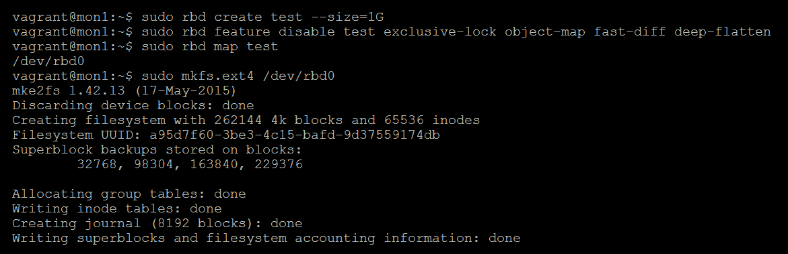

1.  通过检查已创建的对象，确定通过格式化 RBD 后文件系统上创建的对象：

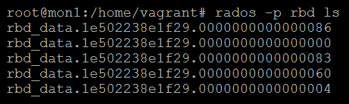

1.  随机选择一个对象，并使用 `osd map` 命令找出该对象存储在哪个 PG 中：

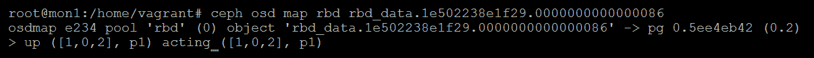

1.  在一个 OSD 节点的磁盘上找到该对象；在此案例中，它位于 `OSD1` 上的 `OSD.0`：

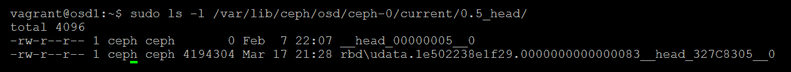

1.  通过向其写入垃圾数据来破坏它：

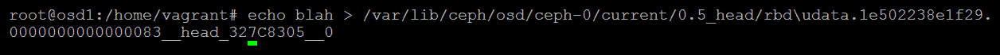

1.  告诉 Ceph 对我们破坏的对象所在的 PG 执行清理：

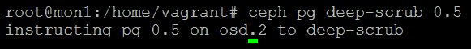

1.  如果你检查 Ceph 状态，你将看到 Ceph 已经检测到损坏的对象并将 PG 标记为不一致。从现在开始，忘记我们手动破坏对象的事实，按照正常流程进行修复：

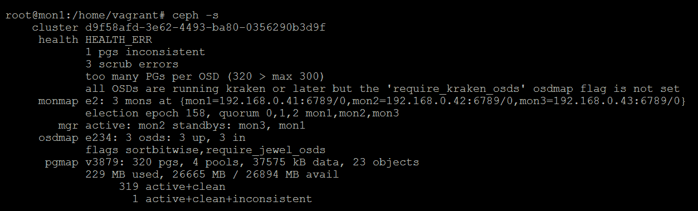

通过查看详细的健康报告，我们可以找到包含损坏对象的 PG。我们可以直接让 Ceph 修复 PG；但是，如果主要的 OSD 持有损坏的对象，它将覆盖其余的正常副本。这是不可取的，因此为了确保这种情况不会发生，在运行 `repair` 命令之前，我们将确认哪个 OSD 持有损坏的对象。

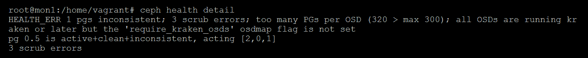

通过查看健康报告，我们可以看到持有对象副本的三台 OSD；第一台 OSD 是主 OSD。

1.  登录到主 OSD 节点并打开主 OSD 的日志文件。你应该能够找到标明哪个对象被 PG 清理标记的日志条目。

1.  浏览 PG 结构，找到日志文件中提到的对象，并计算每个副本的 `md5sum`：

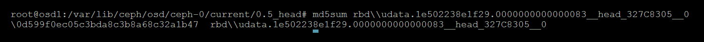

`md5sum` 计算 `osd` 节点一上的对象。

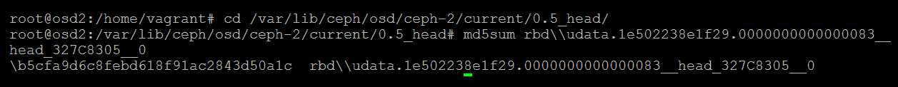

`md5sum` 计算 `osd` 节点二上的对象。

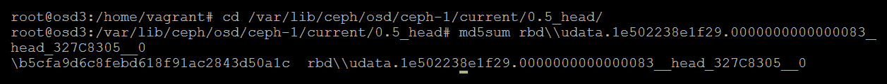

`md5sum`的对象在`osd`节点三。

我们可以看到`OSD.0`上的对象有不同的`md5sum`，因此我们知道它是那个损坏的对象。

```
OSD.0 = \0d599f0ec05c3bda8c3b8a68c32a1b47 OSD.2 = \b5cfa9d6c8febd618f91ac2843d50a1c OSD.3 = \b5cfa9d6c8febd618f91ac2843d50a1c
```

尽管我们已经知道哪个对象副本被破坏，因为我们手动在`OSD.0`上破坏了该对象，假设我们没有这么做，并且这个破坏是由某些随机的宇宙射线造成的。现在我们有了三个副本的`md5sum`，并且可以清楚地看到`OSD.0`上的副本是错误的。这就是为什么 2x 复制方案不好的一大原因；如果 PG 变得不一致，你无法分辨哪个副本是坏的。由于该 PG 的主 OSD 是 2，正如在 Ceph 健康详情和 Ceph `OSD map`命令中看到的，我们可以放心地运行`ceph pg repair`命令，而不必担心将坏对象覆盖到剩余的好副本上：

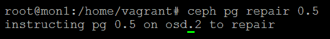

我们可以看到不一致的 PG 已经自我修复：

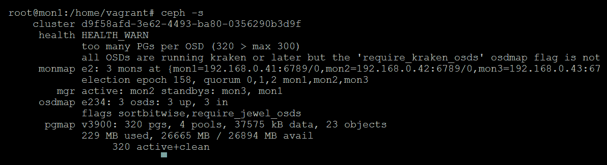

如果主 OSD 上的副本损坏，则应采取以下步骤：

1.  停止主 OSD。

1.  从 PG 目录中删除该对象。

1.  重启 OSD。

1.  指示 Ceph 修复 PG。

# 完整的 OSD

默认情况下，当 OSD 的利用率接近 85%时，Ceph 会警告我们，并且当达到 95%时，它将停止向 OSD 写入 I/O。如果由于某些原因，OSD 完全填满至 100%，OSD 很可能会崩溃，并拒绝重新上线。一个超过 85%警告级别的 OSD 也会拒绝参与回填，因此当 OSD 处于接近满载状态时，集群的恢复可能会受到影响。

在讨论有关满载 OSD 的故障排除步骤之前，强烈建议你监控 OSD 的容量利用率，正如在第八章《监控 Ceph》中所述。这将为你提供提前警告，提醒 OSD 接近`near_full`警告阈值。

如果你发现集群的状态接近满载警告状态，你有两个选择：

+   增加一些更多的 OSD。

+   删除一些数据。

然而，在现实世界中，这两种情况要么是不可能的，要么需要时间，这时情况可能会恶化。如果 OSD 仅处于`near_full`阈值，你可能通过检查 OSD 的利用率是否平衡来重新调整状态，然后执行 PG 平衡操作。如果没有平衡，这在第九章《调整 Ceph》中有更详细的说明。`too_full`的 OSD 也适用相同的方法；虽然你不太可能将它们恢复到 85%以下，但至少可以恢复写操作。

如果你的 OSD 完全满了，它们将处于离线状态，并且会拒绝启动。现在你遇到了一个额外的问题。如果 OSD 无法启动，无论你进行什么重新平衡或删除数据，都无法在已满的 OSD 上反映出来，因为它们处于离线状态。唯一能从这种情况恢复的方法是手动从磁盘文件系统中删除一些 PG，以便 OSD 可以启动。

为此应采取以下步骤：

1.  确保 OSD 进程没有在运行。

1.  在集群上设置`nobackfill`，以防止 OSD 重新上线时发生恢复。

1.  找到一个处于活动、清洁和重新映射状态并存在于离线 OSD 上的 PG。

1.  使用 ceph-objectstore-tool 从离线 OSD 删除该 PG。

1.  重启 OSD。

1.  从 Ceph 集群中删除数据或重新平衡 PG。

1.  移除`nobackfill`。

1.  运行擦除操作并修复你刚刚删除的 PG。

# Ceph 日志

在调查错误时，能够查看 Ceph 日志文件非常方便，这有助于更好地了解发生了什么。默认情况下，日志级别设置为只记录重要事件。在故障排除过程中，可能需要提高日志级别，以揭示错误的原因。要提高日志级别，你可以编辑`ceph.conf`，添加新的日志级别，然后重启组件，或者，如果你不希望重启 Ceph 守护进程，你可以将新的配置参数注入到正在运行的守护进程中。要注入参数，可以使用`ceph tell`命令：

```
ceph tell osd.0 injectargs --debug-osd 0/5
```

然后，将`osd.0`的 OSD 日志级别设置为`0/5`。数字`0`表示磁盘日志级别，数字`5`表示内存日志级别。

在`20`的日志级别下，日志会非常详细且快速增长。不要长时间保持高详细度日志开启。更高的日志级别也会影响性能。

# 慢性能

慢性能定义为集群正在积极处理 I/O 请求，但似乎运行在低于预期的性能水平。通常，慢性能是由于 Ceph 集群的某个组件达到了饱和并成为瓶颈。这可能是由于客户端请求增加或组件故障，导致 Ceph 执行恢复操作。

# 原因

虽然有许多原因可能导致 Ceph 性能变慢，以下是一些最可能的原因。

# 客户端工作负载增加

有时候，性能慢可能不是由于底层故障引起的；可能只是客户端请求的数量和类型超出了硬件的承载能力。无论是多个独立工作负载同时运行，还是在一段时间内缓慢增加的工作负载，如果你在集群中捕获客户端请求的数量，这应该很容易进行趋势分析。如果增加的工作负载看起来像是永久性的，那么唯一的解决方案就是增加一些额外的硬件。

# 故障 OSD

如果在集群中有大量 OSD 被标记为**down**，可能是由于整个 OSD 节点下线——虽然恢复操作不会开始，直到 OSD 被标记为**out**——但性能会受到影响，因为现在可用于服务客户端 IO 的 IOPS 数量将减少。如果发生这种情况，你的监控解决方案应该会发出警报，并允许你采取相应的措施。

# 恢复与填充

当一个 OSD 被标记为**out**时，受影响的 PG 将与新的 OSD 重新配对，并开始在集群中恢复和填充数据的过程。这个过程可能会对 Ceph 集群中的磁盘造成压力，并导致客户端请求的延迟增加。有几个调优选项可以通过降低恢复速率和优先级来减少填充的影响。这些应该与从故障磁盘恢复较慢所带来的影响进行权衡，因为这可能会降低集群的持久性。

# 检查

当 Ceph 执行深度检查以检查数据是否存在不一致时，它必须读取 OSD 中的所有对象；这可能是一个非常 IO 密集的任务，在大容量磁盘上，这个过程可能需要很长时间。深度检查对于防止数据丢失至关重要，因此不应禁用。在第九章《*调优 Ceph*》中讨论了各种调优选项，关于设置深度检查的时间窗口和优先级。通过调整这些设置，可以避免深度检查对客户端工作负载的性能影响。

# 快照修剪

当你删除一个快照时，Ceph 必须删除由于快照过程中的写时复制特性所创建的所有对象。从 Ceph 10.2.8 开始，提供了一个改进的 OSD 设置`osd_snap_trim_sleep`，使 Ceph 在修剪每个快照对象之间等待指定的时间间隔。这确保了后端对象存储不会过载。

尽管在之前的 Jewel 版本中已有此设置，但其行为有所不同，且不应使用。

# 硬件或驱动程序问题

如果你最近将新硬件引入到 Ceph 集群中，并且在数据回填重新平衡后开始遇到性能缓慢，检查与硬件相关的固件或驱动程序更新，因为较新的驱动程序可能需要更新的内核。如果你仅引入了少量硬件，你可以暂时将其中的 OSD 标记为不可用，而不低于池的 `min_size`；这可以是排除硬件问题的好方法。

# 监控

这是你在第八章 *Ceph 分层* 中配置的监控真正派上用场的地方，它可以让你将长期趋势与当前的指标数据进行对比，并查看是否存在明显的异常。

建议你首先查看磁盘性能，因为在大多数性能不佳的情况下，底层磁盘通常是成为瓶颈的组件。

如果你没有配置监控，或者希望手动深入挖掘性能指标，有许多工具可以帮助你实现这一目标。

# iostat

`iostat` 可以用来实时查看你所有 OSD 节点上磁盘的性能和延迟。使用以下命令运行 `iostat`：

```
iostat -d 1 -x
```

你将看到类似这样的显示，每秒刷新一次：

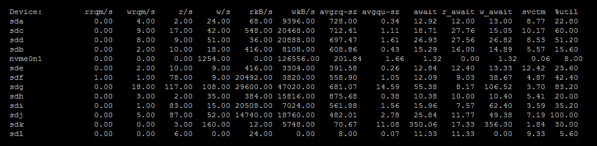

一般来说，如果你的磁盘在一段时间内显示出较高的 `%` 利用率，那么很可能你的磁盘已经达到饱和。你还可以查看 `r_await` 时间，看看读取请求是否比你在 OSD 节点上预期的磁盘类型需要的时间更长。如前所述，如果你发现高磁盘利用率是导致性能缓慢的原因，并且触发因素不太可能很快消失，增加磁盘是唯一的解决办法。

# htop

与标准的 top 工具类似，`htop` 提供了主机 CPU 和内存消耗的实时视图。然而，它也生成了一个更直观的显示，这可以使判断系统资源使用情况变得更容易，特别是对于 Ceph 资源使用快速变化的情况：

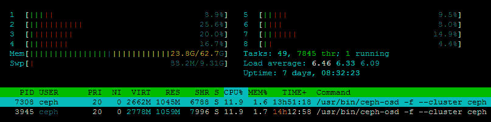

# atop

atop 是另一个有用的工具。它可以捕获 CPU、RAM、磁盘、网络的性能指标，并将这些指标展示在一个视图中；这样，你可以轻松地获得系统资源使用的完整概览。

# 诊断

有一些内部的 Ceph 工具可以帮助诊断性能缓慢问题。调查性能问题时最有用的命令是转储当前的飞行操作，可以通过以下命令完成：

```
sudo ceph daemon osd.x dump_ops_in_flight
```

这将转储指定 OSD 当前的所有操作，并细分每个操作步骤的各种时间。以下是一个飞行中的 IO 示例：

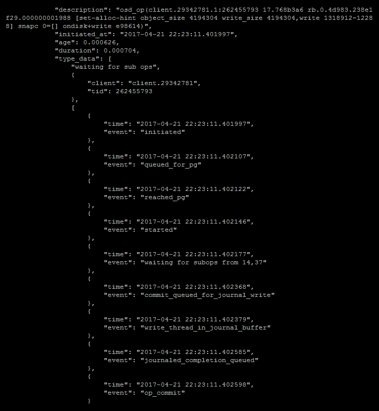

从前面的 IO 示例中，我们可以看到每个操作的各个阶段都被记录下来；显然该操作没有任何性能问题。然而，在性能缓慢的情况下，你可能会看到两个步骤之间存在较大的延迟，集中调查这个区域可能会引导你找到根本原因。

# 极端缓慢的性能或没有 IO

如果你的集群运行非常缓慢，几乎无法处理 IO 请求，可能存在潜在的故障或配置问题。这些缓慢的请求通常会在 Ceph 状态显示中以被阻塞的时间计数器的形式突出显示。在这种情况下，有很多事情需要检查。

# OSD 波动

检查监视器上的 `ceph.log`，查看是否有任何 OSD 波动的迹象。当 OSD 加入集群时，它的 PG 开始进行对等操作。在对等过程中，IO 会暂时暂停，因此如果有多个 OSD 波动，客户端的 IO 可能会受到严重影响。如果发现 OSD 波动的证据，下一步是查看那些波动的 OSD 的日志，看看是否有任何线索说明它们波动的原因。追踪 OSD 波动可能很困难，因为可能有多个不同的原因，且问题可能是广泛存在的。

# Jumbo 帧

检查是否由于网络变化导致使用中的 Jumbo 帧出现问题。如果 Jumbo 帧工作不正常，小的数据包很可能能够顺利传输到其他 OSD 和 MON，但较大的数据包则会被丢弃。这将导致 OSD 显示为半正常工作状态，而找出明显的原因可能非常困难。如果发现有异常情况，始终检查网络是否允许 Jumbo 帧通过，可以使用 ping 命令进行检查。

# 故障磁盘

由于 Ceph 会将数据条带化分布到集群中的所有磁盘，因此一个正在失败但尚未完全失败的单一磁盘，可能会开始导致集群中的 IO 变慢或被阻塞。通常，这是由于磁盘遭遇大量读错误，但错误还不严重到导致磁盘完全失败。通常，只有当写入坏道时，磁盘才会重新分配扇区。通过监控磁盘的 SMART 状态，通常可以发现此类问题并采取相应措施。

# 慢速 OSD

有时候，OSD 可能会在没有明显原因的情况下表现得非常差。如果监控工具没有显示任何明显的问题，可以查看 `ceph.log` 和 Ceph 健康状态的详细输出。你还可以运行 Ceph `osd perf`，它会列出所有 OSD 的提交和应用延迟，可能有助于你识别出问题 OSD。

如果在慢请求中引用了某种常见模式的 OSD，说明所提到的 OSD 很可能是问题的根源。此时重启 OSD 可能会解决问题；如果 OSD 仍然存在问题，建议标记该 OSD 并替换它。

# 容量不足

如果您的 Ceph 集群使用超过 95% 的容量，OSD 将停止接收 I/O 操作。要恢复这种情况，唯一的方法是删除一些数据，以减少每个 OSD 的使用率。如果某个 OSD 无法启动或您无法删除数据，您可以通过调整 `mon_osd_full_ratio` 变量来修改满阈值。这将为您争取足够的时间来删除数据，并使集群恢复到可用状态。

# 调查处于故障状态的 PG

处于故障状态的 PG 将无法提供任何客户端操作，PG 中的任何对象都将无法访问。这会导致集群中的慢请求逐渐积累，因为客户端尝试访问这些对象。PG 处于故障状态最常见的原因是当多个 OSD 离线时，这意味着在任何活动的 OSD 上都没有有效的 PG 副本。然而，要找出 PG 故障的原因，您可以运行以下命令：

```
ceph pg x.y query
```

这将产生大量输出；我们关注的部分显示了对等状态。此处的示例取自一个池，该池的 `min_size` 设置为 `1`，且在仅有 OSD `0` 启动时已写入数据。然后 OSD `0` 被停止，OSD `1` 和 OSD `2` 被启动：

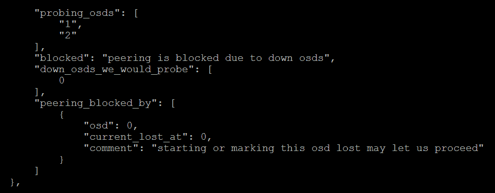

我们可以看到对等过程被阻塞，因为 Ceph 知道 PG 有更新的数据写入 OSD `0`。它已尝试从 OSD `1` 和 OSD `2` 中获取数据，但没有找到所需的内容。它想要重新检查 OSD `0`，但由于该 OSD 已停机，无法进行，因此出现了 `starting or marking this osd lost may let us proceed` 消息。

# 大型监视器数据库

Ceph 监视器使用 `leveldb` 来存储集群所需的所有监视器数据。这包括监视器映射、OSD 映射和 PG 映射等内容，OSD 和客户端从监视器中获取这些信息，以便在 RADOS 集群中定位对象。需要特别注意的一点是，在集群健康状况不等于 `HEALTH_OK` 的期间，监视器不会从其数据库中丢弃任何旧的集群映射。如果集群处于降级状态时间过长，或者集群中有大量 OSD，监视器数据库可能会变得非常大。

在正常的操作条件下，监视器对资源的消耗非常轻量；因此，使用较小磁盘来存储监视器是很常见的。在长期处于降级状态的情况下，存储监视器数据库的磁盘可能会满，如果这种情况发生在所有监视节点上，就会导致整个集群宕机。

为了防止这种行为，值得考虑使用 LVM 部署监视节点，这样，如果磁盘需要扩展，可以更轻松地进行。当你遇到这种情况时，增加磁盘空间是唯一的解决方案，直到你能够让集群的其余部分处于`HEALTH_OK`状态。

如果你的集群处于`HEALTH_OK`状态，但监视数据库仍然很大，可以通过运行以下命令来压缩它：

```
sudo ceph tell mon.{id} compact
```

然而，这只有在集群处于`HEALTH_OK`状态时才有效；集群不会丢弃旧的集群映射，直到它处于`HEALTH_OK`状态，这些映射才可以被压缩。

# 总结

本章中，你学习了如何处理 Ceph 无法自行解决的问题。现在你已经了解了排查各种问题的必要步骤，如果不处理，这些问题可能会变得更严重。此外，你也了解了在 Ceph 集群无法正常运行时，应该关注的关键领域。你应该有信心，能够处理任何 Ceph 相关的问题。

在下一章，我们将继续探讨故障排除过程，并探讨数据丢失已经发生的情况。

# 问题

1.  修复不一致 PG 的命令是什么？

1.  你可以使用什么命令来动态更改日志级别？

1.  为什么监视数据库随着时间的推移可能会变大？

1.  查询 PG 的命令是什么？

1.  为什么 scrubbing 会对 Ceph 集群的性能产生影响？
