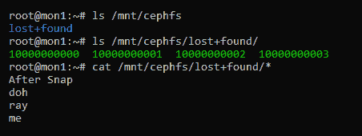
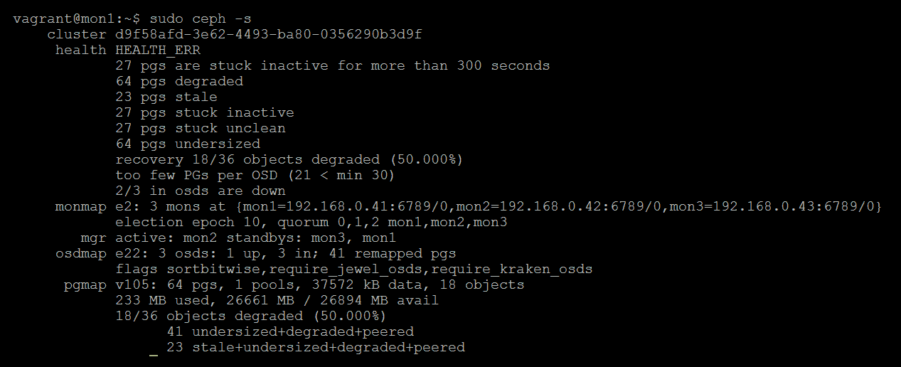

# 第十四章：灾难恢复

在上一章中，你学习了如何排除常见的 Ceph 问题，尽管这些问题可能影响集群的运行，但不太可能导致完全停机或数据丢失。本章将涵盖更严重的场景，涉及 Ceph 集群完全停机或无响应的情况。还将介绍从数据丢失中恢复的各种技术。需要理解的是，这些技术本身可能会导致严重的数据丢失，因此应仅作为最后手段尝试。如果你与 Ceph 供应商有支持合同，或与 Red Hat 有合作关系，强烈建议在执行本章列出的任何恢复技术之前先咨询他们。

在本章中，我们将涵盖以下主题：

+   避免数据丢失

+   使用 RBD 镜像提供高可用的块存储

+   调查断言

+   从 OSD 重建监视器数据库

+   从故障的 OSD 中提取 PG

+   从离线 Bluestore OSD 中检查数据

+   从丢失对象或非活动 PG 中恢复

+   从故障的 CephFS 文件系统中恢复

+   从故障的 OSD 中重建 RBD

# 什么是灾难？

要能够从灾难中恢复，首先你需要理解并能够识别灾难。对于本章的目的，我们假设任何导致持续停机的情况都被视为灾难。这里不会涵盖 Ceph 正在积极修复的故障场景，或者认为故障可能是短暂的灾难。另一种灾难是导致数据永久丢失，除非可以恢复 Ceph 集群。数据丢失可能是最严重的问题，因为数据可能是不可替代的，或者会对公司的未来造成严重损害。

# 避免数据丢失

在开始介绍一些恢复技术之前，重要的是先讨论第一章中提到的一些要点，*Ceph 的规划*。灾难恢复应视为最后的手段；本章中的恢复指南不应被视为代替遵循最佳实践的手段。

首先，确保你有可用且经过测试的数据备份；在发生故障时，如果你知道在最坏的情况下可以依赖备份，你会感到轻松万分。虽然故障可能会给你的用户或客户带来不便，但告诉他们曾托付给你们的数据现在丢失了，远比故障本身要糟糕得多。此外，虽然你可能已经建立了备份系统，但并不意味着你可以盲目依赖它。定期进行恢复测试，确保在需要时可以依赖它们。

确保你遵循一些在第一章中提到的设计原则，*为 Ceph 规划*。不要使用诸如 `nobarrier` 之类的配置选项，并强烈考虑在 Ceph 中使用的复制级别来保护你的数据。数据丢失的几率与 Ceph 中配置的冗余级别密切相关，因此在此需要进行仔细规划。

# 什么原因可能导致停机或数据丢失？

大多数停机和数据丢失情况将直接由在短时间内丧失超过复制级别的多个 OSD 导致。如果这些 OSD 无法重新上线，无论是由于软件还是硬件故障，且 Ceph 无法在 OSD 故障之间恢复对象，则这些对象将丢失。

如果 OSD 因磁盘故障而失败，除非使用昂贵的磁盘恢复服务，否则恢复的可能性不大，并且没有任何保证恢复的数据会处于一致状态。本章不会涵盖从物理磁盘故障中恢复的内容，只是建议使用默认的复制级别 3 来保护你免受多次磁盘故障的影响。

如果 OSD 因软件错误而失败，结果可能会更加积极，但过程复杂且耗时。通常，虽然物理磁盘状况良好但无法启动的 OSD，通常与软件错误或某种形式的损坏有关。软件错误可能是由未捕获的异常引发的，使得 OSD 处于无法恢复的状态。损坏可能发生在意外断电后，硬件或软件未正确配置以维持数据一致性。在这两种情况下，OSD 本身的前景可能是终结的，如果集群已经从丢失的 OSD 中恢复，最好将 OSD 清除并作为空磁盘重新引入。

如果离线的 OSD 数量导致所有对象副本都离线，应尝试恢复过程，从故障的 OSD 中提取对象，并将其重新插入到集群中。

# RBD 镜像

如前所述，正常工作的备份是确保故障不会导致数据丢失的关键策略。从 Jewel 版本开始，Ceph 引入了 RBD 镜像，它允许你将一个集群的 RBD 异步镜像到另一个集群。请注意，Ceph 的本地复制是同步的，而 RBD 镜像是异步的。同步复制要求节点之间的低延迟，而异步复制允许两个 Ceph 集群地理位置遥远，因为延迟不再是一个问题。

通过在一个单独的集群上复制一份 RBD 镜像，你可以显著减少 **恢复时间目标**（**RTO**）和 **恢复点目标**（**RPO**）。RTO 是从启动恢复到数据可用所需的时间度量。它是每个数据点之间的最坏情况时间测量，描述了预期的数据丢失。每日备份的 RPO 为 24 小时；例如，如果你必须从备份中恢复，可能会丢失自上次备份以来的最多 24 小时内写入的任何数据。

使用 RBD 镜像时，数据会异步地复制到目标 RBD，因此，在大多数情况下，RPO 应该在一分钟以内。由于目标 RBD 也是一个副本，而不是需要先恢复的备份，因此 RTO 也可能非常低。此外，由于目标 RBD 存储在一个单独的 Ceph 集群中，它为快照提供了额外的保护，如果 Ceph 集群本身出现问题，快照也可能受到影响。乍一看，RBD 镜像似乎是防止数据丢失的完美工具，在大多数情况下，它确实是一个非常有用的工具。然而，RBD 镜像并不能替代正确的备份流程。在因 RBD 内部操作（如文件系统损坏或用户错误）导致数据丢失的情况下，这些更改将被复制到目标 RBD。拥有一个独立的隔离数据副本至关重要。

话虽如此，让我们更详细地了解一下 RBD 镜像如何工作。

# 日志

RBD 镜像的一个关键组件是日志。RBD 镜像日志存储所有写入到 RBD 的数据，并在写入完成后通知客户端。然后，这些写入会写入主 RBD 镜像。日志本身作为 RADOS 对象存储，并以类似于 RBD 镜像的方式加上前缀。远程的 `rbd-mirror` 守护进程会轮询配置的 RBD 镜像，并将新写入的日志对象拉取到目标集群并在目标 RBD 中重放。

# rbd-mirror 守护进程

`rbd-mirror` 守护进程负责将日志内容重放到另一个 Ceph 集群中的目标 RBD。`rbd-mirror` 守护进程只需要在目标集群上运行，除非你希望实现双向复制，在这种情况下，它需要在两个集群上都运行。

# 配置 RBD 镜像

为了使用 RBD 镜像功能，我们需要两个 Ceph 集群。我们可以部署之前使用过的两个相同的集群，但涉及的虚拟机数量可能超过大多数个人计算机的承载能力。因此，我们将修改我们的 vagrant 和 ansible 配置文件，以部署两个独立的 Ceph 集群，每个集群都包含一个监视器和一个 OSD 节点。

所需的`Vagrantfile`与第二章《使用容器部署 Ceph》中的非常相似，用于部署初始测试集群；顶部的 hosts 部分现在应该如下所示：

```
nodes = [
 { :hostname => 'ansible', :ip => '192.168.0.40', :box => 'xenial64' },
  { :hostname => 'site1-mon1', :ip => '192.168.0.41', :box => 'xenial64' },
  { :hostname => 'site2-mon1', :ip => '192.168.0.42', :box => 'xenial64' },
  { :hostname => 'site1-osd1',  :ip => '192.168.0.51', :box => 'xenial64', :ram => 1024, :osd => 'yes' },
  { :hostname => 'site2-osd1',  :ip => '192.168.0.52', :box => 'xenial64', :ram => 1024, :osd => 'yes' }
]
```

对于 Ansible 配置，我们将维护两个独立的 Ansible 配置实例，以便每个集群可以单独部署。然后，我们将为每个实例维护独立的主机文件，并在运行 playbook 时指定它们。为了实现这一点，我们不会将`ceph-ansible`文件复制到`/etc/ansible`，而是通过以下命令将其保留在主目录中：

```
git clone https://github.com/ceph/ceph-ansible.git
cp -a ceph-ansible ~/ceph-ansible2
```

在`group_vars`目录中创建与第二章《使用容器部署 Ceph》相同的两个文件，分别命名为`all`和`Ceph`。这需要在`ceph-ansible`的两个副本中完成：

1.  在每个`ansible`目录中创建一个 hosts 文件，并将两个主机添加到其中：


上面的截图是第一个主机的，下面的截图是第二个主机的：


1.  在每个`ceph-ansible`实例下运行`site.yml` playbook，以部署我们的两个 Ceph 集群：

```
ansible-playbook -K -i hosts site.yml
```

1.  将默认池的复制级别调整为`1`，因为我们的集群只有`1`个 OSD。请在两个集群上运行以下命令：


1.  在两个集群上安装 RBD 镜像守护进程：

```
sudo apt-get install rbd-mirror
```

以下截图是前一个命令的输出：


1.  将`ceph.conf`和`keyring`从两个集群互相复制。

1.  将`ceph.conf`从`site1-mon1`复制到`site2-mon1`，并命名为`remote.conf`。

1.  将`ceph.client.admin.keyring`从`site1-mon1`复制到`site2-mon1`，并命名为`remote.client.admin.keyring`。

1.  重复前两步，但这次将文件从`site2-mon1`复制到`site1-mon1`。

1.  确保`keyring`的实例由`ceph:ceph`所有：

```
sudo chown ceph:ceph /etc/ceph/remote.client.admin.keyring
```

1.  告诉 Ceph，名为`rbd`的池应该启用镜像功能：

```
sudo rbd --cluster ceph mirror pool enable rbd image
```

1.  对目标集群重复此操作：

```
sudo rbd --cluster remote mirror pool enable rbd image
```

1.  将目标集群添加为池镜像配置的对等集群：

```
sudo rbd --cluster ceph mirror pool peer add rbd client.admin@remote
```

1.  在第二个 Ceph 集群上本地运行相同的命令：

```
sudo rbd --cluster ceph mirror pool peer add rbd client.admin@remote
```

1.  返回第一个集群，我们来创建一个测试的 RBD 以供镜像实验使用：

```
sudo rbd create mirror_test --size=1G
```

1.  在 RBD 映像上启用日志功能：

```
sudo rbd feature enable rbd/mirror_test journaling
```

1.  为 RBD 启用镜像功能：

```
sudo rbd mirror image enable rbd/mirror_test
```


需要注意的是，RBD 镜像是通过拉取系统工作的。`rbd-mirror`守护进程需要在你希望镜像 RBD 的集群上运行；它然后连接到源集群并拉取 RBD。 如果你打算实现双向复制，即每个 Ceph 集群相互复制，你需要在两个集群上都运行`rbd-mirror`守护进程。考虑到这一点，让我们在目标主机上启用并启动`rbd-mirror`的`systemd`服务：

```
sudo systemctl enable ceph-rbd-mirror@admin sudo systemctl start ceph-rbd-mirror@admin
```

`rbd-mirror` 守护进程现在将开始处理你在主集群上配置的所有 RBD 镜像。

我们可以通过在目标集群上运行以下命令来确认一切按预期工作：

```
sudo rbd --cluster remote mirror pool status rbd –verbose
```

以下截图是之前命令的输出：


在前面的截图中，我们可以看到我们的 `mirror_test` RBD 处于 `up+replaying` 状态；这意味着镜像正在进行中，我们可以通过 `entries_behind_master` 看到它目前是最新的。

注意两集群上 RBD `info` 命令输出的不同。在源集群上，主状态为 `true`，这使你能够确定哪个集群的 RBD 处于主状态，并且可以被客户端使用。这也确认了，尽管我们只在主集群上创建了 RBD，但它已经被复制到了副集群。

这里展示的是源集群：


这里展示的是目标集群：


# 执行 RBD 故障转移

在我们将 RBD 故障转移到副集群之前，让我们映射它，创建文件系统，并在其上放置一个文件，以便确认镜像是否正常工作。从 Linux 内核 4.11 开始，内核 RBD 驱动不支持 RBD 镜像所需的 RBD 日志功能；这意味着你不能使用内核 RBD 客户端映射 RBD。因此，我们需要使用 `rbd-nbd` 工具，它结合了 `librbd` 驱动和 Linux `nbd` 设备，通过用户空间映射 RBD。虽然有许多因素可能导致 Ceph 性能较慢，以下是一些最可能的原因：

```
sudo rbd-nbd map mirror_test
```


```
sudo mkfs.ext4 /dev/nbd0
```


```
sudo mount /dev/nbd0 /mnt echo This is a test | sudo tee /mnt/test.txt sudo umount /mnt sudo rbd-nbd unmap /dev/nbd0 Now lets demote the RBD on the primary cluster and promote it on the
secondary sudo rbd --cluster ceph mirror image demote rbd/mirror_test sudo rbd --cluster remote mirror image promote rbd/mirror_test
```

现在，在副集群上映射并挂载 RBD，你应该能够读取在主集群上创建的测试文本文件：


我们可以清楚地看到，RBD 已经成功地被镜像到副集群，文件系统的内容与我们在主集群上留下的一样。

如果你尝试在 RBD 不处于主状态的集群上映射和挂载 RBD，操作将会挂起；这是因为 Ceph 不允许对非主状态的 RBD 镜像进行 I/O 操作。

# RBD 恢复

如果有多个 OSD 失败，并且你无法通过 `ceph-object-store` 工具恢复它们，集群很可能会处于一种大多数（如果不是所有）RBD 镜像都无法访问的状态。然而，你仍然有可能从 Ceph 集群中的磁盘中恢复 RBD 数据。有一些工具可以搜索 OSD 数据结构，找到与 RBD 相关的对象文件，然后将这些对象组装回磁盘映像，类似于原始的 RBD 镜像。

本节将重点介绍 Lennart Bader 的一个工具，用于从我们的测试 Ceph 集群中恢复测试 RBD 镜像。该工具允许从 Ceph OSD 的内容中恢复 RBD 镜像，而不要求 OSD 处于运行或可用状态。需要注意的是，如果 OSD 由于底层文件系统损坏而遭到损坏，则 RBD 镜像的内容可能仍然损坏。RBD 恢复工具可以在以下 GitHub 仓库中找到：[`gitlab.lbader.de/kryptur/ceph-recovery`](https://gitlab.lbader.de/kryptur/ceph-recovery)。

在开始之前，请确保在 Ceph 集群上创建了一个小的、具有有效文件系统的测试 RBD。由于我们在第二章《使用容器部署 Ceph》中创建的测试环境中磁盘的大小，建议 RBD 仅为 1GB 大小。

我们将在其中一个监视器节点上执行恢复，但实际上，这个恢复过程可以在任何可以访问 Ceph OSD 磁盘的节点上进行。为了访问磁盘，我们需要确保恢复服务器有足够的空间来恢复数据。

在本示例中，我们将通过 `sshfs` 挂载远程 OSD 的内容，`sshfs` 允许您通过 `ssh` 挂载远程目录。然而，在实际情况中，没有什么能阻止您将磁盘物理插入到另一台服务器中或使用所需的任何方法。该工具仅需要查看 OSD 的数据目录：

1.  从 Git 仓库克隆 Ceph 恢复工具：

```
git clone https://gitlab.lbader.de/kryptur/ceph-recovery.git
```

以下截图是前述命令的输出：


1.  确保已安装 `sshfs`：

```
sudo apt-get install sshfs
```

以下截图是前述命令的输出：


1.  切换到克隆的工具目录，并为每个 OSD 创建空目录：

```
cd ceph-recovery sudo mkdir osds sudo mkdir osds/ceph-0 sudo mkdir osds/ceph-1 sudo mkdir osds/ceph-2
```

# Filestore

对于文件存储，我们可以将每个远程 OSD 挂载到我们刚创建的目录中。请注意，您需要确保您的 OSD 目录与实际测试集群匹配：

```
sudo sshfs vagrant@osd1:/var/lib/ceph/osd/ceph-0 osds/ceph-0 sudo sshfs vagrant@osd2:/var/lib/ceph/osd/ceph-2 osds/ceph-2 sudo sshfs vagrant@osd3:/var/lib/ceph/osd/ceph-1 osds/ceph-1
```

# BlueStore

由于 Bluestore 不会将对象存储在本地 Linux 文件系统中，因此我们不能直接挂载文件系统。然而，`ceph-object-store` 工具允许您将 BlueStore OSD 的内容作为 `fuse` 文件系统挂载。

在每个 OSD 节点上，在 `/mnt` 文件夹下创建一个目录，以挂载该节点上的每个 OSD：

```
mkdir /mnt/osd-0
```

现在，将 BlueStore OSD 挂载到这个新目录：

```
ceph-objectstore-tool --op fuse --data-path /var/lib/ceph/osd/ceph-0 --mountpoint /mnt/osd-0
```

以下截图是前述命令的输出：


BlueStore OSD 现在作为`fuse`文件系统挂载到`/mnt/osd-0`目录中。然而，它只会在`ceph-object-store`命令运行时保持挂载状态。因此，如果你希望挂载多个 OSD 或手动浏览目录树，请打开到 Ceph 节点的额外 SSH 会话。以下是一个截图，展示了来自新的 SSH 会话的`/mnt/osd-0`目录的内容：


当你完成对 OSD 的操作时，只需在运行`ceph-objectstore-tool`命令的 SSH 会话中按下*Ctrl* + *C*即可卸载。

现在我们可以像处理 filestore 一样，将 fuse 挂载的 OSD 挂载到我们的管理服务器：

```
sudo sshfs vagrant@osd1:/mnt/osd-0 osds/ceph-0 sudo sshfs vagrant@osd2:/mnt/osd-1 osds/ceph-1 sudo sshfs vagrant@osd3:/mnt/osd-2 osds/ceph-2
```

# RBD 组装 - filestore

现在我们可以使用工具扫描 OSD 目录并编译一个可用的 RBD 列表。此命令唯一需要的参数是 OSD 挂载的位置。在本例中，它位于名为`osds`的目录中。结果将列出在 VM 目录中：

```
sudo ./collect_files.sh osds
```

以下截图是上面命令的输出：


如果我们查看 VM 目录，就会看到工具找到了我们的测试 RBD 镜像。现在我们已经找到了镜像，下一步是组装位于 OSD 上的各种对象。此命令的三个参数是前一步中找到的 RBD 镜像名称、镜像的大小以及恢复镜像文件的目标位置。镜像的大小以字节为单位指定，重要的是它至少与原始镜像一样大；它可以更大，但如果大小小于原始镜像，RBD 将无法恢复：

```
sudo ./assemble.sh vms/test.id 1073741824 .
```

以下截图是上面命令的输出：


RBD 现在将从挂载的 OSD 内容恢复到指定的镜像文件中。根据镜像的大小，恢复可能需要一段时间，并且进度条将显示恢复的进度。

# RBD 组装 - BlueStore

RBD 组装脚本不适用于 BlueStore OSD，因为 BlueStore 使用稍有不同的命名规则来存储 RBD 对象。以下步骤提供了一个更新的脚本，以帮助进行 RBD 恢复。

下载脚本以帮助从 BlueStore OSD 恢复 RBD：

```
wget https://raw.githubusercontent.com/fiskn/assemble_bluestore_rbd/master/assemble_bluestore.sh
chmod +x ./assemble_bluestore.sh
```

使用三个参数运行恢复脚本，第一个是 RBD 镜像的哈希名称，第二个是 RBD 的大小（以字节为单位），第三个是输出文件的文件名。

以下示例来自一个 10 GB 的测试 RBD：

```
./assemble_bluestore.sh 7d8ad6b8b4567 1073741824 text.img 
```

以下截图是上面命令的输出：


RBD 镜像现在应该已经恢复。

# 恢复确认

完成后，我们可以在镜像上运行一个名为`fsck`的文件系统检查工具，以确保其已经正确恢复。在这种情况下，RBD 是使用`ext4`格式化的，因此我们可以使用`e2fsck`工具检查该镜像：

```
sudo e2fsck test.raw
```

以下截图是上面命令的输出：


很好，图像文件是干净的，这意味着现在我们的所有数据恢复成功的可能性非常高。

现在我们可以最终将图像挂载为回环设备来访问我们的数据。如果命令没有返回任何输出，则表示我们已成功挂载：

```
sudo mount -o loop test.raw /mnt
```

您可以看到图像已成功挂载为回环设备：


# RGW 多站点

Ceph 还支持运行两个或更多的 RADOS 网关区（RGW）以提供多个站点之间的 S3 和 swift 兼容存储的高可用性。每个区域都由一个完全独立的 Ceph 集群支持，这意味着硬件或软件故障完全使服务下线的可能性极低。使用 RGW 的多站点配置时，必须注意数据是最终一致的，因此数据在每个区域中并不保证在写入后立即处于相同的状态。

欲了解更多有关 RGW 多站点配置的信息，请参阅官方 Ceph 文档。

# CephFS 恢复

与 RBD（仅是对象的串联）不同，CephFS 在数据池和元数据池中都需要一致的数据。它还要求 CephFS 日志健康；如果这些数据源中的任何一个出现问题，CephFS 将下线并可能无法恢复。本章的这一部分将讨论如何将 CephFS 恢复到活动状态，并在元数据池损坏或不完整的情况下采取进一步的恢复步骤。

CephFS 可能会在某些条件下下线，但不会导致任何永久性的数据丢失；这些通常是由 Ceph 集群中的瞬态事件引起的，但不应导致长期的数据丢失，并且在大多数情况下，CephFS 应该会自动恢复。

由于 CephFS 基于 RADOS，除非 CephFS 中存在软件缺陷，否则数据丢失或损坏应仅在 RADOS 层发生数据丢失的情况下发生，这可能是由于多个 OSD 故障导致 PG 丢失。

数据池中对象或 PG 的丢失不会导致 CephFS 文件系统下线，但会导致对受影响文件的访问请求返回零值。这很可能导致堆栈更高层的任何应用程序失败，并且由于文件或文件部分与 PG 的映射具有半随机性质，结果很可能意味着 CephFS 文件系统仍然大部分可用。在这种情况下，最好的情况是尝试恢复 RADOS 池 PG，如本章后续所示。

元数据池中的对象或 PG 丢失将使 CephFS 文件系统下线，并且在没有人工干预的情况下无法恢复。需要指出的是，实际的数据内容不会受到元数据丢失的影响，但存储这些数据的对象在没有元数据的情况下将大多毫无意义。Ceph 提供了多种工具，可以用来恢复和重建元数据，这可能会帮助你从元数据丢失中恢复。然而，正如本书多次提到的那样，预防总是胜于治疗，因此这些工具不应被视为标准恢复机制，而应仅在常规备份恢复失败时作为最后的手段使用。

# 创建灾难

为了创建 CephFS 文件系统丢失或损坏元数据池的场景，我们将简单地删除元数据池中的所有对象。本示例将使用第五章中部署的文件系统，*RADOS 池与客户端访问*，但此过程应该与任何其他部署的 CephFS 文件系统相同。

首先，让我们切换到 root 账户并挂载 CephFS 文件系统：

```
sudo -i
mount -t ceph 192.168.0.41:/ /mnt/cephfs -o name=admin,secret=AQC4Q85btsqTCRAAgzaNDpnLeo4q/c/q/0fEpw==
```

在 CephFS 文件系统上放置一些测试文件，稍后我们将尝试恢复它们：

```
echo "doh" > /mnt/cephfs/doh
echo "ray" > /mnt/cephfs/ray
echo "me" > /mnt/cephfs/me
```

现在我们已经放置了测试文件，让我们删除元数据池中的所有对象，以模拟元数据池丢失：

```
rados purge cephfs_metadata --yes-i-really-really-mean-it
```

以下截图是前面命令的输出：


让我们重启 `mds` 守护进程；触发故障：

```
systemctl restart ceph-mds@*
```

如果我们现在使用 `ceph -s` 命令检查 CephFS 状态，可以看到 `mds` 已经检测到元数据损坏，并将文件系统下线：


为了获取更多关于损坏的信息，我们可以运行以下命令。检查 CephFS 日志：

```
cephfs-journal-tool journal inspect
```

以下截图是前面命令的输出：


是的，正如预期的那样，它被严重损坏了。

# CephFS 元数据恢复

通常建议导出日志以便安全保存，最小化数据丢失，但在这种情况下，由于我们知道可以安全地立即重置日志：

```
cephfs-journal-tool journal reset
```

以下截图是前面命令的输出：


下一条命令重置文件系统的 RADOS 状态，以便恢复过程能够从一致的状态重新构建：

```
ceph fs reset cephfs --yes-i-really-mean-it
```

接下来，MDS 表会被重置，以便重新生成。这些表作为对象存储在元数据池中。以下命令会创建新的对象：

```
 cephfs-table-tool all reset session
 cephfs-table-tool all reset snap
 cephfs-table-tool all reset inode
```

以下截图是前面命令的输出：


重置 CephFS 日志：

```
cephfs-journal-tool --rank=0 journal reset
```

最后，创建根 inode 并准备数据对象的发现：

```
cephfs-data-scan init
```

现在 CephFS 的状态已完全重置，可以开始对数据池进行扫描，以从可用的数据对象中重建元数据。这是一个三阶段的过程，使用以下三个命令。第一个命令扫描数据池，找到构成每个文件的所有扩展并将其存储为临时数据。信息，如创建时间和文件大小也会被计算并存储。第二阶段将搜索这些临时数据并将 inode 重建到元数据池中。最后，inodes 的链接操作会发生：

```
cephfs-data-scan scan_extents cephfs_data
cephfs-data-scan scan_inodes cephfs_data
cephfs-data-scan scan_links
```

扫描 inodes 和扩展命令在大型文件系统上运行时可能需要极长时间。为了加速这个过程，可以并行运行这些操作；更多信息请查看官方 Ceph 文档。

一旦过程完成，请检查 CephFS 文件系统是否现在处于健康状态：


我们现在还应该能够从挂载点浏览文件系统，那个挂载点是在本节开始时挂载的：



请注意，尽管恢复工具已经成功定位了文件并重建了一些元数据，但像文件名这样的信息已经丢失，因此被放入了 `lost+found` 目录中。通过检查文件内容，我们可以识别每个文件，并将其重命名为原始文件名。

在实践中，尽管我们已经恢复了 CephFS 文件系统，但由于缺少文件的原始名称和目录位置，可能意味着恢复只是部分成功。还应注意，恢复的文件系统可能不稳定，强烈建议在文件系统被销毁并重建之前，尽可能恢复任何抢救出来的文件。这是一个灾难恢复过程，应该在排除了从备份恢复的可能性后使用。

# 丢失的对象和非活动的 PG

本章的这一部分将介绍一个场景，其中多个 OSD 在短时间内下线，导致某些对象没有有效的副本。需要注意的是，丢失副本的对象与仍有副本但另一个副本已做过更改的对象之间是有区别的。后者通常出现在将集群的 `min_size` 设置为 `1` 时。

为了演示如何恢复一个拥有过期数据副本的对象，让我们执行一系列步骤来破坏集群：

1.  将 `min_size` 设置为 `1`；希望通过本示例的结束，您能明白为什么在实际操作中绝对不想这样做：

```
sudo ceph osd pool set rbd min_size 1
```

以下截图是前面命令的输出：


1.  创建一个测试对象，稍后我们将让 Ceph 认为它丢失了：

```
sudo rados -p rbd put lost_object logo.png sudo ceph osd set norecover sudo ceph osd set nobackfill
```

这两个标志确保当 OSD 重新上线并向单个 OSD 写入时，变更不会被恢复。由于我们仅用单一选项进行测试，我们需要这些标志来模拟实际生活中的情况，在这种情况下，可能并非所有对象都能在足够的时间内恢复，尤其是当唯一副本的 OSD 由于某种原因离线时。

1.  关闭两个 OSD 节点，剩下一个 OSD。由于我们已将`min_size`设置为`1`，我们仍然可以向集群写入数据。你可以看到，Ceph 状态显示两个 OSD 现在都已离线：


1.  再次写入该对象，写入将进入剩余的 OSD：

```
sudo rados -p rbd put lost_object logo.png
```

1.  关闭剩余的 OSD；当其离线后，重新启动另外两个 OSD：


你可以看到，Ceph 已经知道它在恢复过程开始之前就已经有一个未找到的对象。这是因为在对等阶段，包含修改对象的 PG 已经知道唯一有效的副本在`osd.0`上，而该副本现在已离线。

1.  移除`nobackfill`和`norecover`标志，让集群尝试执行恢复。你会看到，即使恢复过程有所进展，仍然会有一个 PG 处于降级状态，且未找到对象的警告依然存在。这是一个好现象，因为 Ceph 正在保护你的数据免受损坏。试想，如果一个包含数据库的 RBD 的 4 MB 块突然回退到之前的状态，会发生什么。

如果你尝试读取或写入我们的测试对象，你会注意到请求会一直挂起；这是 Ceph 在保护你的数据。解决此问题有三种方法。第一种也是最理想的解决方案是让该对象的有效副本重新上线；这可以通过将`osd.0`重新上线，或使用`objectstore`工具导出并将此对象导入到健康的 OSD 中。为了本节的目的，假设这两种方法都不可行。在介绍剩下的两种解决方案之前，让我们进一步调查，揭示其背后的情况。

运行 Ceph 健康详细信息，找出哪个 PG 存在问题：


在这种情况下，是`pg 0.31`，处于降级状态，因为它有一个未找到的对象。让我们查询一下这个`pg`：

```
ceph pg 0.31 query
```

以下截图是前面命令的输出：


查找恢复部分，我们可以看到 Ceph 已经尝试对对象进行探测，探测对象时，`"osd": "0"`不可用。它尝试对`"osd": "1"`进行探测，但由于某些原因无效，我们知道的原因是因为它是一个过时的副本。

现在，让我们更详细地查看缺失的对象：

```
sudo ceph pg 0.31 list_missing
```

以下截图是前面命令的输出：


`need`和`have`行揭示了原因。我们有`epoch 383'5`，但该对象的有效副本存在于`398'6`；这就是为什么`min_size=1`是错误的原因。你可能会处于只有一个有效对象副本的情况。如果这是由磁盘故障引起的，那你将面临更大的问题。

为了从中恢复，我们有两种选择：要么选择使用较旧的对象副本，要么直接删除它。需要注意的是，如果这个对象是新的，而剩余的 OSD 中没有较旧的副本，它也将删除该对象。

要删除该对象，请运行以下命令：

```
ceph pg 0.31 mark_unfound_lost delete
```

要恢复，请运行以下命令：

```
ceph pg 0.31 mark_unfound_lost revert
```

# 从完整的监视器故障中恢复

如果不太可能的情况下你丢失了所有监视器，仍然不算彻底失败。你可以使用`ceph-objectstore-tool`从 OSD 的内容中重建监视器数据库。

为了设置场景，我们假设发生了某种事件，导致所有三个监视器都遭到破坏，从而使 Ceph 集群无法访问。为了恢复集群，我们将关闭两个监视器，只保留一个失败的监视器运行。然后，我们将重建监视器数据库，覆盖损坏的副本，并重新启动监视器，使 Ceph 集群恢复上线。

`objectstore`工具需要能够访问集群中的每个 OSD，以便重建监视器数据库；在本示例中，我们将使用一个脚本，通过`ssh`连接来访问 OSD 数据。由于 OSD 数据并非所有用户都能访问，我们将使用 root 用户登录到 OSD 主机。默认情况下，大多数 Linux 发行版不允许远程通过密码登录 root 用户，因此请确保你已经将你的公钥`ssh`复制到某些远程 OSD 节点的 root 用户。

以下脚本将连接到`hosts`变量中指定的每个 OSD 节点，并提取构建监视器数据库所需的数据：

```
#!/bin/bash hosts="osd1 osd2 osd3" ms=/tmp/mon-store/ mkdir $ms # collect the cluster map from OSDs for host in $hosts; do
 echo $host rsync -avz $ms root@$host:$ms rm -rf $ms ssh root@$host <<EOF for osd in /var/lib/ceph/osd/ceph-*; do ceph-objectstore-tool --data-path \$osd --op update-mon-db --mon-store-path $ms done EOF
 rsync -avz root@$host:$ms $ms done
```

这将生成以下内容到`/tmp/mon-store`目录：


我们还需要通过`keyring`分配新的权限：

```
sudo ceph-authtool /etc/ceph/ceph.client.admin.keyring --create-keyring --gen-key -n client.admin --cap mon 'allow *' --cap osd 'allow *' --cap mds 'allow *'
```

以下截图为前述命令的输出：


```
sudo ceph-authtool /etc/ceph/ceph.client.admin.keyring --gen-key -n mon. --cap mon 'allow *' sudo cat /etc/ceph/ceph.client.admin.keyring
```


现在监视器数据库已重建，我们可以将其复制到监视器目录中，但在此之前，让我们先备份现有数据库：

```
sudo mv /var/lib/ceph/mon/ceph-mon1/store.db /var/lib/ceph/mon/ceph-mon1/store.bak
```

现在，复制重建后的版本：

```
sudo mv /tmp/mon-store/store.db /var/lib/ceph/mon/ceph-mon1/store.db sudo chown -R ceph:ceph /var/lib/ceph/mon/ceph-mon1
```

如果你现在尝试启动监视器，它会陷入探测状态，因为它试图探测其他监视器。这是 Ceph 试图避免脑裂情况；然而，在这种情况下，我们希望强制它形成法定人数并完全上线。为此，我们需要编辑`monmap`，删除其他监视器，然后将其重新注入监视器数据库：

```
sudo ceph-mon -i mon1 --extract-monmap /tmp/monmap
```

检查`monmap`的内容：

```
sudo monmaptool /tmp/monmap –print
```

以下截图为前述命令的输出：


你会看到有三个 `mons` 存在，所以让我们移除其中两个：

```
sudo monmaptool /tmp/monmap --rm noname-b sudo monmaptool /tmp/monmap --rm noname-c
```

现在，再次检查以确保它们完全消失：

```
sudo monmaptool /tmp/monmap –print
```

以下截图是前述命令的输出：


```
sudo ceph-mon -i mon1 --inject-monmap /tmp/monmap
```

重启所有 OSD，使它们重新加入集群；然后你将能够成功查询集群状态，看到你的数据仍然存在：


# 使用 Ceph 对象存储工具

希望如果你遵循了最佳实践，你的集群应该以三个副本运行，并且没有配置任何危险的配置选项。在大多数情况下，Ceph 应该能够从任何故障中恢复。

然而，在一些 OSD 离线的情况下，可能会有一些 PG 或对象变得不可用。如果你无法将这些 OSD 重新引入集群以便让 Ceph 优雅地恢复它们，那么这些 PG 中的数据实际上是丢失的。不过，有可能该 OSD 仍然是可读取的，可以使用 `objectstore` 工具来恢复 PG 的内容。这个过程包括从故障 OSD 中导出 PG，然后将其重新导入集群。`objectstore` 工具要求 OSD 的内部元数据仍然处于一致状态，因此不能保证完全恢复。

为了演示如何使用 `objectstore` 工具，我们将关闭三台测试集群中的两台 OSD，然后将丢失的 PG 恢复到集群中。在现实中，你不太可能遇到所有故障 OSD 中的每一个 PG 都丢失的情况，但为了演示目的，所需步骤是相同的：

1.  将池大小设置为 `2`，这样当我们停止 OSD 服务时，可以确保丢失所有某些 PG 的副本：


1.  关闭两台 OSD 服务，你会从 Ceph 状态页面看到 PG 的数量会离线：



1.  运行 Ceph 健康状态详细信息也会显示哪些 PG 处于降级状态：


过期的 PG 是那些不再有存活副本的 PG，并且可以看到，正在处理的 OSD 是已经关闭的那台。

如果我们使用 `grep` 过滤出仅过期的 PG，我们可以利用结果列表来确定需要恢复的 PG。如果 OSD 已经从集群中移除，PG 会显示为不完整而非过期。

1.  检查 OSD 以确保 PG 存在于其中：

```
ceph-objectstore-tool --op list-pgs --data-path /var/lib/ceph/osd/ceph-0
```

以下截图是前述命令的输出：


1.  使用 `objectstore` 工具将 `pg` 导出到文件。由于我们测试集群中的数据量较小，我们可以将数据直接导出到操作系统磁盘。在实际情况下，你可能需要考虑为服务器连接额外的存储。USB 磁盘是理想选择，因为它们可以轻松在服务器之间移动，作为恢复过程的一部分：

```
sudo ceph-objectstore-tool --op export --pgid 0.2a --data-path /var/lib/ceph/osd/ceph-2 --file 0.2a_export
```

以下截图是前述命令的输出：


如果在运行工具时遇到断言错误，你可以尝试使用 `--skip-journal-replay` 参数运行它，这将跳过将日志重播到 OSD。如果日志中有任何未处理的数据，它将丢失。但这可能会让你恢复大部分本来无法恢复的丢失 PG。并且重复此操作，直到你导出所有丢失的 PG。

1.  将丢失的 PG 导入到一个运行中的 OSD。虽然我们可以将 PG 导入现有的 OSD，但在新的 OSD 上进行导入要更安全，这样我们就不必冒着进一步数据丢失的风险。为此，在故障 OSD 使用的磁盘上创建一个基于目录的 OSD。在实际灾难恢复情况下，强烈建议将数据插入运行在单独磁盘上的 OSD，而不是使用现有的 OSD。这样做是为了避免进一步对 Ceph 集群中的任何数据造成风险。

此外，导入的 PG 都插入到同一个临时 OSD 中也没有关系。一旦 Ceph 发现这些对象，它会将它们恢复到集群中的正确位置。

1.  创建一个新的空文件夹用于 OSD：

```
sudo mkdir /var/lib/ceph/osd/ceph-2/tmposd/
```

1.  使用 `ceph-disk` 或 `ceph-volume` 为 Ceph 准备目录：

```
sudo ceph-disk prepare  /var/lib/ceph/osd/ceph-2/tmposd/
```

1.  将文件夹的所有权更改为 `ceph` 用户和组：

```
sudo chown -R ceph:ceph /var/lib/ceph/osd/ceph-2/tmposd/
```

1.  激活 OSD 使其上线：

```
sudo ceph-disk activate  /var/lib/ceph/osd/ceph-2/tmposd/
```

1.  设置 OSD 的权重，以防止任何对象被回填到其中：

```
sudo ceph osd crush reweight osd.3 0
```

1.  继续进行 PG 导入，指定临时 OSD 位置和我们之前导出的 PG 文件：

```
sudo ceph-objectstore-tool --op import --data-path /var/lib/ceph/osd/ceph-3 --file 0.2a_export
```

以下截图是前述命令的输出：


1.  对你之前导出的每个 PG 重复此操作。完成后，重置文件所有权并重新启动新的临时 OSD：

```
sudo chown -R ceph:ceph /var/lib/ceph/osd/ceph-2/tmposd/ sudo systemctl start ceph-osd@3
```

1.  检查 Ceph 状态输出，你将看到你的 PG 现在处于活动状态，但处于降级状态。在我们的测试集群中，OSD 数量不足，无法使对象恢复到正确的副本数量。如果集群中有更多的 OSD，对象将被回填到集群中，并且会恢复到健康状态，副本数量正确：


# 调查断言

断言用于 Ceph 中，确保在代码执行过程中，任何关于操作环境的假设都保持为真。这些断言分布在 Ceph 代码的各个部分，旨在捕捉任何可能导致问题的情况，如果代码没有被停止的话。

如果你在 Ceph 中触发了断言，很可能是某些数据的值超出了预期。这可能是由于某种形式的损坏或未处理的 Bug 造成的。

如果一个 OSD 触发了断言并且拒绝重启，通常推荐的做法是销毁该 OSD，重新创建它，然后让 Ceph 将对象回填到它上面。如果你有可复现的失败场景，可能也值得在 Ceph 的缺陷跟踪系统中提交一个 Bug。

如前所述，OSD 失败可能是由于硬件或软件故障，故障可能发生在存储的数据或 OSD 代码中。软件故障更有可能影响多个 OSD；如果你的 OSD 因停电而遭到损坏，很可能会影响多个 OSD。在多个 OSD 发生断言并导致集群中一个或多个 PG 处于离线状态的情况下，单纯重建 OSD 并不是一个选择。离线的 OSD 包含了 PG 的三份副本，因此重建这些 OSD 会使任何形式的恢复变得不可能，并导致数据永久丢失。

在尝试本章中的恢复技术之前，如导出和导入 PG，应该先调查断言。根据你的技术能力和在开始关注其他恢复步骤之前能容忍的停机时间，调查断言可能并不会取得任何成功。通过调查断言并查看断言中引用的 Ceph 源代码，可能可以识别出断言的原因。如果可能的话，可以在 Ceph 代码中实施修复，以避免 OSD 断言。不要害怕在这些问题上向社区寻求帮助。

在某些情况下，OSD 损坏可能非常严重，以至于即使是`objectstore`工具本身在尝试从 OSD 读取时也可能会触发断言。这将限制本章中概述的恢复步骤，而尝试修复断言背后的原因可能是唯一的选择。尽管到这时，OSD 可能已经遭受了严重的损坏，恢复可能已不再可能。

# 示例断言

以下断言来自 Ceph 用户邮件列表：

```
2017-03-02 22:41:32.338290 7f8bfd6d7700 -1 osd/ReplicatedPG.cc: In function 'void ReplicatedPG::hit_set_trim(ReplicatedPG::RepGather*, unsigned int)' thread 7f8bfd6d7700 time 2017-03-02 22:41:32.335020 osd/ReplicatedPG.cc: 10514: FAILED assert(obc) ceph version 0.94.7 (d56bdf93ced6b80b07397d57e3fa68fe68304432)
 1: (ceph::__ceph_assert_fail(char const*, char const*, int, char const*)+0x85) [0xbddac5] 2: (ReplicatedPG::hit_set_trim(ReplicatedPG::RepGather*, unsigned int)+0x75f) [0x87e48f] 3: (ReplicatedPG::hit_set_persist()+0xedb) [0x87f4ab] 4: (ReplicatedPG::do_op(std::tr1::shared_ptr<OpRequest>&)+0xe3a) [0x8a0d1a] 5: (ReplicatedPG::do_request(std::tr1::shared_ptr<OpRequest>&, ThreadPool::TPHandle&)+0x68a) [0x83be4a] 6: (OSD::dequeue_op(boost::intrusive_ptr<PG>, std::tr1::shared_ptr<OpRequest>, ThreadPool::TPHandle&)+0x405) [0x69a5c5] 7: (OSD::ShardedOpWQ::_process(unsigned int, ceph::heartbeat_handle_d*)+0x333) [0x69ab33] 8: (ShardedThreadPool::shardedthreadpool_worker(unsigned int)+0x86f) [0xbcd1cf] 9: (ShardedThreadPool::WorkThreadSharded::entry()+0x10) [0xbcf300] 10: (()+0x7dc5) [0x7f8c1c209dc5] 11: (clone()+0x6d) [0x7f8c1aceaced]
```

断言的顶部部分显示了触发断言的函数，以及可以找到该断言的行号和文件。在这个例子中，`hit_set_trim`函数显然是断言的原因。我们可以查看`ReplicatedPG.cc`文件中的第 10,514 行左右，尝试理解可能发生了什么。请注意 Ceph 版本（0.94.7），因为 GitHub 上的行号只有在查看相同版本时才会匹配。

从代码中看，`get_object_context`函数调用返回的值直接传递给了`assert`函数。如果该值为零——表示包含待修剪的命中集的对象未找到——OSD 会触发断言。根据这些信息，可能可以进行调查，找出对象丢失的原因并恢复它。或者，可以注释掉`assert`命令，看看是否允许 OSD 继续工作。在这个例子中，允许 OSD 继续处理可能不会导致问题，但在其他情况下，断言可能是防止更严重的损坏发生的唯一措施。如果你不完全理解为什么某些事情会导致断言，或者不清楚你可能做的任何更改会产生什么影响，请在继续之前寻求帮助。

# 总结

在本章中，你学会了如何在 Ceph 看似无法恢复时进行故障排除。如果 Ceph 无法自行恢复 PG，你现在知道如何手动从故障的 OSD 重建 PG。如果丢失了所有监视器节点，但仍然可以访问 OSD，你还可以重建监视器的数据库。你还探讨了如何从 OSD 上剩余的原始数据中重新创建 RBD。最后，你配置了两个独立的 Ceph 集群，并使用 RBD 镜像配置了它们之间的复制，以提供一个故障转移选项，以防遇到整个 Ceph 集群的故障。

# 问题

1.  哪个 Ceph 守护进程允许将 RBD 复制到另一个 Ceph 集群？

1.  对错判断：默认情况下，RBD 只是一个拼接的对象字符串。

1.  哪种工具可以用来将 PG 从 OSD 导入或导出？

1.  对错判断：未找到的对象状态意味着数据已经永远丢失了吗？

1.  重建 CephFS 元数据后，你所面临的主要缺点是什么？
