# 第一章：介绍 GitLab 架构

理解 GitLab 项目的背景有助于我们理解在 GitLab 工作流设计中所做的选择。GitLab 项目最初是一个小型的开源项目，后来发展成了一个拥有 400 人和数千名志愿者的组织。当前，它有两个版本：一个是免费的 **社区版**（**CE**），另一个是带有专有许可证的 **企业版**（**EE**）。企业版提供多个支持层级。虽然它是专有许可证，但该版本的源代码是公开的，可以从 GitLab 获取。

要掌握 GitLab，必须对其各个组件有扎实的了解。在本章中，我们将探讨 GitLab 安装的基本组件，特别关注 GitLab **持续集成**（**CI**）及其附带的运行器。由于不同组件可以分布在不同的服务器或云服务提供商上，我们还将提供这些提供商的概述，并介绍 GitLab 如何看待它们。

在本章中，我们将涵盖以下主题：

+   GitLab 的起源

+   GitLab CE 或 EE

+   GitLab 的核心组件

+   GitLab CI

+   GitLab 运行器

+   云原生

# 技术要求

要跟随本章的操作步骤，请下载包含示例的 Git 仓库，网址为 GitHub：[`github.com/PacktPublishing/Mastering-GitLab-12/tree/master/Chapter01`](https://github.com/PacktPublishing/Mastering-GitLab-12/tree/master/Chapter01)。你还需要安装 Homebrew：[`brew.sh/`](https://brew.sh/)。

# GitLab 的起源

故事始于 2011 年，当时来自乌克兰的网页程序员 Dimitri Zaporozhets 面临一个常见问题。他想要使用 Git 来进行版本管理，并通过 GitHub 进行协作，但在公司中无法使用。他需要一个既不妨碍他开发代码又易于使用的工具。像许多开发者一样，他遇到了被迫使用的协作工具的问题。为了解决这些问题，他用 Ruby on Rails 创建了一个侧项目：GitLab。在与同事 Valery Sizov 的合作下，他在常规工作之余开发了这个项目。

在这一举措后，该项目迅速发展壮大：

| **日期** | **事实** |
| --- | --- |
| 2011 | GitLab 的未来 CEO Sytze Sybrandij 对 GitLab 项目和代码印象深刻，并邀请 Zaporozhets 尝试通过 [`about.gitlab.com/`](https://about.gitlab.com/) 将其商业化。 |
| 2012 | GitLab 通过 Hacker News 向更广泛的受众发布 ([`news.ycombinator.com/item?id=4428278`](https://news.ycombinator.com/item?id=4428278))。 |
| 2013 | Dimitri Zaporozhets 决定全职投入到 GitLab，并加入公司。 |
| 2015 | GitLab 成为 Y Combinator 的一部分，并获得了当年的风险资本资助。 |
| 2018 | GitLab 获得了 1 亿美元的风险投资，并估值为 10 亿美元。 |
| 2019 | GitLab 公司拥有超过 600 名员工。 |

GitLab 的最初想法是通过提供支持服务来从开源技术中赚钱。然而，发生的情况是，公司开始仅仅通过顾问来升级 GitLab，然后停止服务合同。很明显，100% 开源的路线并不具有竞争力。因此，他们选择了**开放核心**模式。在开放核心下，公司以开源许可证发布核心软件系统。软件的不同版本则以商业许可证销售，并包含更多功能。

因此，GitLab 被分为两个版本：一个是开源版本，一个是企业版本。

# 探索 GitLab 版本 – CE 和 EE

GitLab 软件的核心被称为**CE**。它以 MIT 许可证发布，这是麻省理工学院创建的一种宽松的自由软件许可证。您可以修改该软件并在您的创作中使用它。

任何进入 CE 的功能都不会被删除，或者移至封闭源版本。当 GitLab EE 在 2013 年创建时，其核心是 GitLab CE，但它具有额外的企业功能，如**轻量级目录访问协议**（**LDAP**）组。这些功能本身并不是开源的，但如果公司认为它们是核心功能，可以将它们添加到核心版本中。这个想法是，企业应该尽可能多地为解决问题和创建新功能做出贡献。

2016 年，GitLab EE 产品被分为三个层级：Starter、Premium 和 Ultimate。每个层级比前一个层级贵大约五倍，并包含更多功能和支持选项，如下表所示：

| **版本** | **功能（简要列表）** |
| --- | --- |

| Starter | 核心 GitLab CE 的所有功能：

+   CI/CD

+   项目问题板

+   Mattermost 集成

+   时间跟踪

+   GitLab 页面

|

| Premium | 更多企业功能，如下所示：

+   Maven 和 NPM 仓库功能

+   受保护环境

+   燃尽图

+   多个 LDAP 服务器和 Active Directory 支持

|

| Ultimate | 所有选项，包括以下内容：

+   所有安全扫描工具

+   史诗

+   免费的访客用户

+   Web IDE 的 Web 终端

|

GitLab 有很多功能，但我们首先要集中讨论基本的构建模块。

# GitLab 的核心系统组件

GitLab 不是一个单体应用程序。它试图遵循 Unix 的哲学，即软件模块应该只做一件特定的事情，并做好这件事。GitLab 的组件虽然不像 Unix 的`awk`和`sed`那样小巧精致，但每个组件都有一个明确的目标。您可以在以下图表中找到这些组件的高级概览：

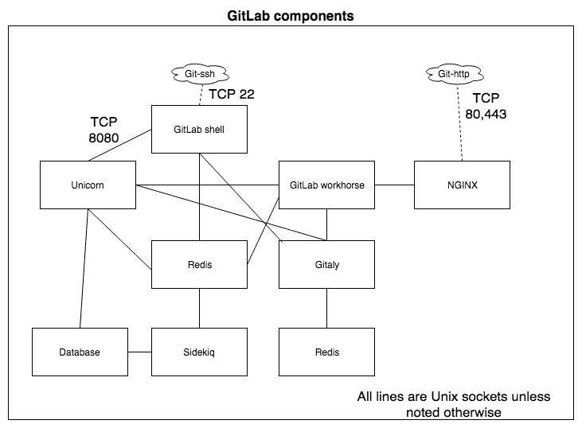

GitLab 最初是一个纯 Ruby on Rails 应用程序，但后来一些组件使用 Go 重新设计。Ruby on Rails 是一个基于 Ruby 编程语言构建的开发框架。它实现了模型-视图-控制器模式，并提供了连接不同数据库的方法（例如，ActiveRecord）。它提倡“约定优于配置”和 **不要重复自己**（**DRY**）编程。它非常适合快速开发，同时又具备高性能和许多功能。

让我们深入了解这些组件，以便理解它们的角色。

# NGINX

Unicorn Web 组件不能直接使用，因为它没有提供处理客户端的所有功能。默认捆绑的反向代理是 NGINX。也可以使用 Apache 作为 GitLab 的前端，但推荐使用 NGINX。有很多可以安装在 Unicorn 前端的 Web 服务器，但最终基本上可以分为两种类型，分别如下：

+   基于进程的（分叉或多线程）

+   异步

NGINX 和 lighttpd 可能是两个最著名的异步服务器。Apache 毋庸置疑是事实上的标准进程型服务器。这两种服务器的最大区别在于它们如何处理可扩展性。对于进程型服务器，每一个新连接都需要一个线程，而像 NGINX 这样的事件驱动异步服务器只需要几个线程（或理论上只需一个）。对于轻量级工作负载，这没有太大区别，但当连接数增多时，尤其是在内存方面，你会看到很大的差异。当处理成千上万的并发连接时，NGINX 使用的内存仍然保持在几兆字节左右，而 Apache 则可能使用几百兆字节，或者根本无法工作。这就是为什么 NGINX 是更好的选择。

你可以在许多平台上运行 NGINX，并且安装过程非常简单，正如你在接下来的章节中看到的，你将亲自尝试！

# 安装 NGINX

NGINX 是大多数包管理仓库的一部分，包括 `yum` 和 `apt`。在基于 `apt` 的发行版（如 Debian 和 Ubuntu）上安装 NGINX 需要以下命令：

```
sudo apt-get update
sudo apt-get install nginx
```

在 macOS 上，我们可以使用 `brew` 执行一个快速的一行命令：

```
brew install nginx
```

当然，也可以从源代码安装。记得先安装依赖项，包括 PCRE、zlib 和 OpenSSL。你可以在以下网站找到源代码：[`nginx.org/en/download.html`](http://nginx.org/en/download.html)。

在启动 NGINX 之前，你需要提供一个配置文件，使其能够连接到 Unicorn Web 组件。这两个服务器之间的接口是本地 Unix 域套接字。

请创建一个名为 `nginx.config` 的文件，并添加以下内容：

```
events{}
```

上述部分是必需的，你可以指定 NGINX 如何处理连接。对于这个例子，我们接受默认设置；这就是为什么该部分为空的原因。

下一部分是一个 HTTP 块。你可以定义多个，并让设置继承，但在这里，我们定义 HTTP 请求应该重定向到 `upstream gitlab-app`，即 Unicorn。你还可以看到接口是 Unix 套接字：

```

http {

# Tell nginx there is a unicorn waiting
 upstream gitlab-app {
 server unix:/var/www/gitlab-app/tmp/sockets/unicorn.sock fail_timeout=0;
 }
```

所以，我们已经定义了 NGINX 如何连接到后端，即 GitLab。在前端，我们希望接受来自 HTTP 客户端的请求。这是通过 `server` 块来处理的：

```
server {
 listen 8080;
 server_name localhost;
```

这个块中的下一个指令处理磁盘上不存在的路径。它将请求转发到应用程序：

```

 try_files $uri/index.html $uri @gitlab-app;
```

以下是 `gitlab-app` 的定义，它修改请求头以通过 Unix 套接字将请求代理到上游 Unicorn 服务器：

```

 location @gitlab-app {
 proxy_set_header X-Forwarded-For $proxy_add_x_forwarded_for;
 proxy_set_header Host $http_host;
 proxy_redirect off;
 proxy_pass http://gitlab-app;
 }
```

不要忘记关闭服务器和 HTTP 块：

```
 }
}
```

现在我们有了配置文件，你可以通过以下方式运行这个 NGINX：

```
nginx -c /path/to/nginx.config
```

该命令不应返回任何输出，且 NGINX 服务器会在后台运行。你可以通过检查进程列表自己验证这一点：

```
$ ps -ax|grep nginx |grep -v grep
33310 ?? 0:00.00 nginx: master process nginx -c /Users/joostevertse/nginx.config 
33312 ?? 0:00.00 nginx: worker process
```

现在你已经有了一个运行中的 NGINX 服务器，如果你在浏览器中访问 `http://localhost:8080`，你应该会收到一个 502 错误。这是因为还没有 Unicorn 服务器在 Unix 套接字上监听。我们将在下一部分展示如何运行 Unicorn。

# Unicorn

Unicorn 是一个为处理高性能客户端的应用程序设计的 HTTP 服务器，它能够在低延迟和足够带宽的连接上运行。它利用了 Linux 类系统内核中的特性。它被称为 **Rack HTTP 服务器**，因为它实现了用于 Rack 应用程序的 HTTP。Rack 实际上是一个 Ruby 实现的最小接口，用于处理 Web 请求，你可以在代码中使用它。

你可以在 [`rack.github.io`](https://rack.github.io) 找到该项目。

Unicorn 作为守护进程在 Unix 系统中运行，使用 Ruby 和 C 编程语言编写。使用 Ruby 意味着它还可以运行 Ruby on Rails 应用程序，例如 GitLab。

现在你已经掌握了 Unicorn 的基本概念，我们可以安装它，并将之前安装的 NGINX 连接到它。

# 安装 Unicorn

如果你已经安装了 Ruby，可以按照以下步骤轻松安装 Unicorn：

1.  第一步是安装 Ruby on Rails：

```
$gem install rails
```

1.  下一步是安装 Unicorn 服务器二进制文件：

```
$gem install unicorn
```

1.  让我们继续在 `/usr/local/www` 安装 Web 文档。我们从创建目录开始：

```
$mkdir /usr/local/www
$chmod 755 /usr/local/www
$cd /usr/local/www
```

1.  我们现在可以创建我们的 Rails 应用程序，并通过 Unicorn 提供服务：

```
$rails new gitlab-app
```

1.  在一大堆输出后，可能看起来有点吓人，但这实际上是一个为你预先配置好的应用程序。让我们配置 Unicorn 来提供服务。我们可以在这里获取默认的配置文件：

```
cd gitlab-app/config
wget https://raw.github.com/defunkt/unicorn/master/examples/unicorn.conf.rb
```

1.  我们需要修改一些内容。让我们从为基本应用程序文件夹创建一个变量开始：

```
APP_PATH = "/var/www/gitlab-app"
```

1.  现在我们可以更改以下路径：

```
working_directory APP_PATH
stderr_path APP_PATH + "/log/unicorn.stderr.log"
stdout_path APP_PATH + "/log/unicorn.stderr.log"
pid APP_PATH + "/tmp/pid/unicorn.pid"
```

1.  Unicorn 可以监听端口和/或套接字。我们将使用 Unix 套接字进行监听，因为这是最短的路径：

```
#change the path to the socket (defined also in nginx config)
listen app_path + '/tmp/sockets/unicorn.sock', backlog: 64
```

1.  我们可以通过以下命令启动 Unicorn：

```
unicorn -c config/unicorn.rb
```

如果 NGINX 也提前启动了，我们现在可以将浏览器指向 `http://localhost:8080`。

现在，也许你遇到了错误，想要了解发生了什么问题。了解如何在出现问题时调试 NGINX 和 Unicorn 可能是必要的。下一节将介绍这一内容。

# 调试 Unicorn

可能是安装 Unicorn 时产生了错误，或者你遇到了性能问题，怀疑是 Unicorn 未正常工作所致。

有几种方法可以找到问题的根源。日志文件可以为你指明方向。

# Unicorn 日志中的超时

以下输出是 Unicorn 工作者超时在 `unicorn_stderr.log` 中的表现。这不一定是坏事，它只是意味着新的工作进程被启动了：

```
 [2015-06-05T10:58:08.660325 #56227] ERROR -- : worker=10 PID:53009 timeout (61s > 60s), killing
 [2015-06-05T10:58:08.699360 #56227] ERROR -- : reaped #<Process::Status: pid 53009 SIGKILL (signal 9)> worker=10
 [2015-06-05T10:58:08.708141 #62538] INFO -- : worker=10 spawned pid=62538
 [2015-06-05T10:58:08.708824 #62538] INFO -- : worker=10 ready
```

可能是 Unicorn 可用的工作进程不足以响应当前的请求。NGINX 会缓存大量请求，所以我们必须检查交接套接字，看看 Unicorn 是否能跟得上。为此，可以使用一个方便的脚本，地址为：[`github.com/jahio/unicorn-status`](https://github.com/jahio/unicorn-status)。

它可以通过以下命令调用：

```
$ ruby unicorn_status.rb /var/opt/gitlab/gitlab-rails/sockets/gitlab.socket 10
Running infinite loop. Use CTRL+C to exit.
------------------------------------------
Active Requests Queued Requests
20 11
```

这里的第一个参数是 `unicorn_status.rb` 脚本，第二个是要连接的套接字 `../.socket`，最后一个参数是轮询间隔（`10`）。

# Unicorn 进程消失

在 Linux 上，有一种机制叫做 **Out-of-Memory** (**OOM**) **Killer**，当系统内存不足且没有交换内存时，它会释放内存。如果 Unicorn 占用了过多内存，它可能会被杀死。

使用 `dmesg | egrep -i 'killed process'` 搜索 OOM 事件：

```
[102335.3134488] Killed process 5567 (ruby) total-vm:13423004kB, anon-rss:554088kB
```

# 其他类型的错误或 100% CPU 占用

调试 Unicorn 进程的终极方法是对其运行 strace：

1.  运行 `sudo gdb -p (PID)` 以附加到 Unicorn 进程。

1.  在 GDB 控制台中运行 `call (void) rb_backtrace()` 并在 `/var/log/gitlab/unicorn/unicorn_stderr.log` 中找到生成的 Ruby 回溯信息：

```
 from /opt/gitlab/embedded/lib/ruby/gems/2.4.0/gems/bundler-1.16.2/lib/bundler/cli/exec.rb:28:in `run'
 from /opt/gitlab/embedded/lib/ruby/gems/2.4.0/gems/bundler-1.16.2/lib/bundler/cli/exec.rb:74:in `kernel_load'
 from /opt/gitlab/embedded/lib/ruby/gems/2.4.0/gems/bundler-1.16.2/lib/bundler/cli/exec.rb:74:in `load'
 from /opt/gitlab/embedded/bin/unicorn:23:in `<top (required)>'<br/> from /opt/gitlab/embedded/bin/unicorn:23:in `load
 from /opt/gitlab/embedded/lib/ruby/gems/2.4.0/gems/unicorn-5.1.0/bin/unicorn:126:in `<top (required)>'
 from /opt/gitlab/embedded/lib/ruby/gems/2.4.0/gems/unicorn-5.1.0/lib/unicorn/http_server.rb:132:in `start'
 from /opt/gitlab/embedded/lib/ruby/gems/2.4.0/gems/unicorn-5.1.0/lib/unicorn/http_server.rb:508:in `spawn_missing_workers'
 from /opt/gitlab/embedded/lib/ruby/gems/2.4.0/gems/unicorn-5.1.0/lib/unicorn/http_server.rb:678:in `worker_loop'
 from /opt/gitlab/embedded/lib/ruby/gems/2.4.0/gems/unicorn-5.1.0/lib/unicorn/http_server.rb:678:in `select'
```

1.  完成后，使用 `detach` 和 `exit` 退出 GDB。

# Sidekiq

**Sidekiq** 是一个后台作业处理框架。它通过在后台执行任务来帮助你扩展应用程序。欲了解更多有关 Sidekiq 的信息，请访问以下网站：[`github.com/mperham/sidekiq/wiki`](https://github.com/mperham/sidekiq/wiki)。

每个 Sidekiq 服务器进程从 Redis 队列中拉取任务并处理它们。像你的 Web 进程一样，Sidekiq 启动 Rails，这样你的任务和工作进程就可以使用完整的 Rails API，包括 ActiveRecord。服务器将实例化工作进程，并使用给定的参数调用 `perform`。其余部分由你的代码决定。

# 安装 Sidekiq

使用 Sidekiq 非常简单。它可以作为 `gem` 安装：

```
$ sudo gem install sidekiq
Password:
Fetching: redis-4.0.2.gem (100%)
Successfully installed redis-4.0.2
Fetching: connection_pool-2.2.2.gem (100%)
.,,,
Done installing documentation for redis, connection_pool, rack, rack-protection, sidekiq after 7 seconds
5 gems installed
```

如你所见，某些依赖项也已安装，例如 Redis、连接池、Rack 和 Rack 保护。

# 调试 Sidekiq

与 Unicorn 一样，有多种方法可以调试 Sidekiq 处理。最简单的方法是以管理员身份登录 GitLab 并查看日志，特别是查看后台作业页面上的队列和作业，如以下截图所示：

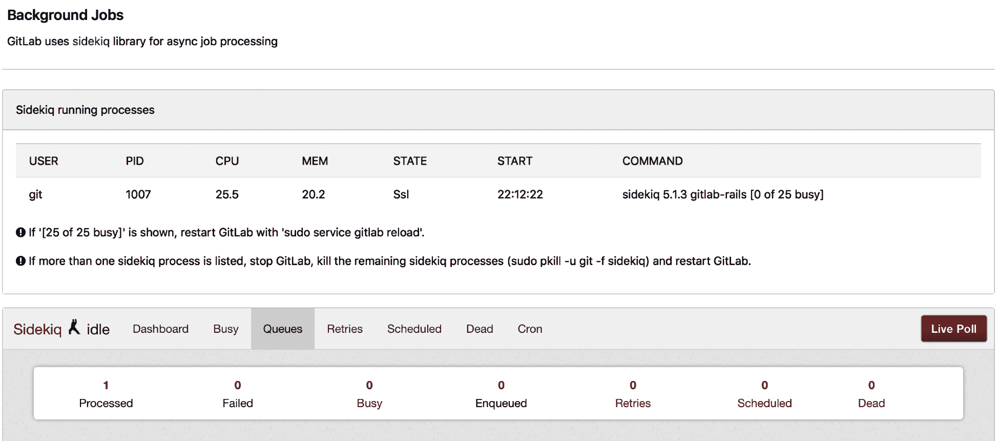

有时，你会遇到问题，并在 Linux 服务器上发现一些情况。

# Sidekiq 进程消失

如前所述，在 Unicorn 部分中，OOM Killer 可能会在 Sidekiq 使用过多内存时终止它。

使用 `dmesg | egrep -i 'killed process'` 查找 OOM 事件：

```
[102335.3134488] Killed process 8887 (ruby) total-vm:13523004kB, anon-rss:5540458kB
```

# Sidekiq 进程似乎什么也不做

如果 Sidekiq 没有执行任何工作并且大部分时间看起来卡住了，这意味着程序在等待某些东西。一种常见的等待情况是当你正在进行远程网络调用时。如果你认为这可能是原因，你可以通过发送 TTIN 信号让 Sidekiq 进程转储堆栈跟踪到日志中。

这是在 `/var/log/gitlab/sidekiq/current` 中的日志文件中，Sidekiq 工作者的样子：

```
 {"severity":"INFO","time":"2019-06 23T19:00:14.493Z","class":"RemoteMirrorNotificationWorker","retry":3,"queue":"remote_mirror_notification","jid":"69eb806bfb66b82315bcb249","created_at":"2019-06-23T19:00:14.461Z","correlation_id":"toX0HnYW0s9","enqueued_at":"2019-06-23T19:00:14.461Z","pid":471,"message":"RemoteMirrorNotificationWorker JID-69eb806bfb66b82315bcb249: done: 0.03 sec","job_status":"done","duration":0.03,"completed_at":"2019-06-23T19:00:14.493Z"}
```

从 GitLab 12.0 开始，Sidekiq 的默认输出日志格式是 JSON，这使得通过像 logstash 这样的工具读取日志文件变得更容易，因为它更加结构化。

# 其他类型的错误或 100% CPU 占用

调试 Sidekiq 进程的终极方法是通过 GDB 让它转储堆栈跟踪信息：

1.  运行 `sudo gdb -p (PID)` 来附加到 Sidekiq 工作进程。

1.  在 GDB 控制台中运行 `call (void) rb_backtrace()`，并在 `/var/log/gitlab/sidekiq/current` 中查找生成的 Ruby 堆栈跟踪：

```
2018-09-21_19:55:03.48430 from /opt/gitlab/embedded/lib/ruby/gems/2.4.0/gems/redis-3.3.5/lib/redis/connection/ruby.rb:83:in `_read_from_socket'
2018-09-21_19:55:03.48431 from /opt/gitlab/embedded/lib/ruby/gems/2.4.0/gems/redis-3.3.5/lib/redis/connection/ruby.rb:87:in `rescue in _read_from_socket'
2018-09-21_19:55:03.48432 from /opt/gitlab/embedded/lib/ruby/gems/2.4.0/gems/redis-3.3.5/lib/redis/connection/ruby.rb:87:in `select'
```

1.  堆栈跟踪信息非常难以阅读，但这个进程在被跟踪时正在进行网络操作，我们可以看到一个 (`_read_from _socket`)。你可以查看源代码来确认它正在做什么（源代码中提到有行号）。

1.  完成后，使用 `detach` 离开 GDB 并退出。

你也可以使用其他跟踪工具来检查循环进程的行为。例如，在 Linux 中，`strace -p <pid>` 允许你查看进程正在执行的系统调用。

# GitLab Shell

这个组件用于通过 SSH 提供对 Git 仓库的访问。实际上，对于通过 `git-http` 协议的推送，它也会代替 Rails 应用程序被调用。它本质上是一个围绕 Git 客户端的小 Ruby 封装。Git 通过 SSH 使用预定义的命令，这些命令可以在 GitLab 服务器上执行。为了进行授权，它会调用 GitLab API。在 GitLab 5.0 之前，这个功能由 Gitolite 提供，并由 Perl 编程语言驱动。

该项目的源代码可以在此找到：[`gitlab.com/gitlab-org/gitlab-shell`](https://gitlab.com/gitlab-org/gitlab-shell)。你可以看到以下页面：

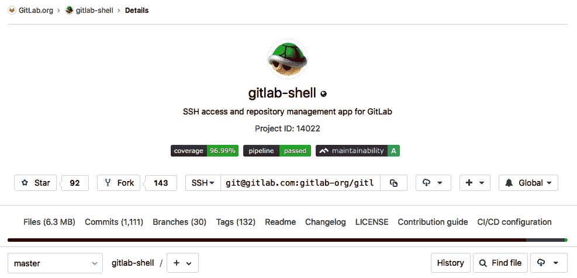

您可以将其安装在本地，但它仅在与其他 GitLab 组件一起部署时才真正有用。当您完成安装（有关如何安装，请参见 第二章，*安装 GitLab*），下一部分将描述遇到问题时的调试方法。

# 调试 GitLab Shell

在全包安装中，GitLab Shell 的日志文件可以在以下位置找到：

```
/var/log/gitlab/gitlab-shell/gitlab-shell.log 
```

作为替代，源代码安装时可以在以下位置找到：

```
/home/git/gitlab-shell/gitlab-shell.log 
```

您通常会发现的是与 GitLab Shell 基本操作相关的日志行：

+   Git 命令（如 `git push` 和 `git pull`）。

+   授权调用 GitLab Rails API 以检查是否允许连接

+   执行预接收钩子

+   请求的操作

+   接收后操作

+   任何自定义的接收后操作

这里，我们列出了日志文件中的一些行：

```
bash-4.1$ tail gitlab-shell.log
time="2018-09-26T08:59:53+02:00" level=info msg="executing git command" command="gitaly-upload-pack unix:/var/opt/gitlab/gitaly/gitaly.socket {\"repository\":{\"storage_name\":\"default\",\"relative_path\":\"xxx/xxx.git\",\"git_object_directory\":\"\",\"git_alternate_object_directories\":[],\"gl_repository\":\"xxx\"},\"gl_repository\":\"project-xx\",\"gl_id\":\"key-xx\",\"gl_username\":\"xxxxxx\"}" pid=18855 user="user with key key-xx"

time="2018-09-26T08:59:53+02:00" level=info msg="finished HTTP request" duration=0.228132057 
method=POST pid=18890 url="http://127.0.0.1:8080/api/v4/internal/allowed"

time="2018-09-26T08:59:54+02:00" level=info msg="finished HTTP request" duration=0.030036933 method=POST pid=18890 url="http://127.0.0.1:8080/api/v4/internal/pre_receive"

time="2018-09-26T08:59:54+02:00" level=info msg="finished HTTP request" duration=0.094035804 method=POST pid=18979 url="http://127.0.0.1:8080/api/v4/internal/post_receive"
```

查找错误的一种方法是寻找某些模式，例如`failed`，如下所示。这个特定错误指向 Unicorn 的 500 错误，检查用户是否有正确的授权来调用 GitLab API。

如果您在 Unicorn 日志（`production.log`）中搜索 HTTP 500 错误，应该会显示此错误：

```
bash-4.1$ grep -i failed gitlab-shell.log
time="2018-09-26T08:05:52+02:00" level=error msg="API call failed" body="{\"message\":\"500 Internal Server Error\"}" code=500 method=POST pid=1587 url="http://127.0.0.1:8080/api/v4/internal/allowed"
time="2018-09-26T08:45:13+02:00" level=error msg="API call failed" body="{\"message\":\"500 Internal Server Error\"}" code=500 method=POST pid=24813 url="http://127.0.0.1:8080/api/v4/internal/allowed"
```

# Redis

Redis 是一个缓存工具和 HTTP 会话存储，允许您将网站的缓存数据和会话信息保存到外部位置。这意味着您的网站不必每次都进行计算；相反，它可以从缓存中检索数据并更快地加载网站。即使应用程序崩溃，用户会话也会保存在内存中。Redis 是一个快速的缓存工具，因为它首先使用内存。它有几个有用的优点：

+   一切都存储在一个地方，因此您只需刷新一个缓存。

+   它比 Memcache 更快。使用大型商店的网站时，可以明显感受到这一点。

+   会话保存在内存中，而不是保存在数据库中。

+   后端变得更快。

Redis 不仅仅是一个缓存，它还是一个数据结构存储。它基本上是一个数据库，应该从概念上将其视为一个数据库。在其操作和数据处理方式方面，它与 NoSQL 数据库更为相似。

# 安装 Redis

Redis 可通过所有主要的软件包管理系统获得。以下是不同平台上安装它的命令：

+   适用于安装了 Homebrew 的 Mac：

```
brew install redis
```

+   适用于 Linux Ubuntu 或其他基于 APT 的发行版：

```
apt-get install redis 
```

+   适用于 Red Hat 或其他基于 YUM 的发行版：

```
yum install redis 
```

然而，安装 Redis 的首选方式是通过从源代码编译。这种方式可以轻松保持更新。除了 GCC 编译器和标准 C 库外，它没有其他特别的依赖项。您可以在 [`download.redis.io/redis-stable.tar.gz`](http://download.redis.io/redis-stable.tar.gz) 找到最新的稳定版本。

安装和编译它就像输入以下命令一样简单：

```
curl http://download.redis.io/redis-stable.tar.gz | tar xvz
cd redis-stable
make
```

成功完成后，你可以选择进行下一步操作，即执行 `make test` 来对已编译的源代码进行测试。

若要将二进制文件安装到一个有用的位置，请使用以下命令：

```
sudo make install
```

关于已编译结构的进一步解释，请前往 `src` 目录。你将找到以下信息：

+   `redis-server`：Redis 服务器程序

+   `redis-sentinel`：用于监控 Redis 集群的程序

+   `redis-cli`：用于控制 Redis 的命令行程序

+   `redis-benchmark`：用于测量 Redis 性能的程序

+   `redis-check-aof` 和 `redis-check-dump`：用于处理数据损坏的工具

现在一切都准备就绪，我们可以启动服务器了。

在 macOS 上通过 `brew` 安装时，使用以下命令：

```
brew services start redis
```

在其他平台上，当从源代码构建时，你可以直接通过运行 `redis-server` 命令启动 Redis 服务器。在一个新的 shell 窗口中，输入以下命令：

```
redis-server
```

按下 *Enter* 后，你将看到服务器启动：

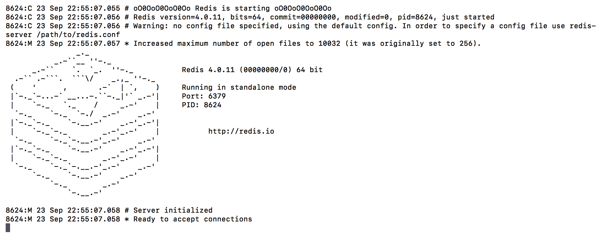

你可以通过执行以下命令来测试你的 Redis 实例是否正常工作：

```
$ redis-cli ping

```

当 Redis 正常运行时，将会有响应：

```
PONG
```

如果收到 `PONG`，那么一切正常。

# Redis 中的基础数据操作

让我们通过操作这些数据结构来探索 Redis 的一些基础。再次启动 `redis-cli` 命令行工具，不带 `ping` 参数，它将连接到本地的 Redis 服务器：

```
$redis-cli
127.0.0.1:6379>
```

将 Redis 视为一个简单的哈希数据库并不公平，尽管它提供的五种数据结构实际上都由键和值组成。我们来总结一下这五种数据结构：

+   **字符串**：你可以使用 `set` 命令将一个值写入 Redis。在简单字符串的情况下，你只需按如下所示将值保存到数据存储中。设置字符串值后，你可以通过发出 `get` 命令再次检索该值：

```
$ redis-cli
127.0.0.1:6379> set mykind "Human" 
OK
127.0.0.1:6379> get mykind
"Human"
127.0.0.1:6379> 
```

+   **哈希**：与字符串类似，你可以使用 `set` 命令将任意数量的值设置为一个键。一般来说，Redis 将值视为字节数组，并不关心它们是什么。这使得 Redis 在表示对象时非常方便。同样，通过 `get` 命令，你可以检索这些值。GitLab 使用这种类型来存储用户的 web 会话信息：

```
$ redis-cli
127.0.0.1:6379> set programs:tron '{"name": "tron","kind": "program"}'
OK
127.0.0.1:6379> get programs:tron
"{\"name\": \"tron\",\"kind\": \"program\"}"
```

+   **列表**：Redis 中的列表类型实现为链表。你可以通过 `rpush`（右推，向列表尾部添加项）或 `lpush`（左推，向列表头部添加项）快速地向列表中添加项。另一方面，通过索引访问项的速度就较慢，因为它需要搜索链表。然而，对于队列机制来说，这仍然是一个不错的解决方案。

```
$ redis-cli
127.0.0.1:6379> rpush specieslist human computer cyborg
(integer) 3
127.0.0.1:6379> rpop specieslist
"cyborg"
127.0.0.1:6379> rpop specieslist
"computer"
127.0.0.1:6379> rpop specieslist
"human"
127.0.0.1:6379> rpop specieslist
(nil)
```

+   **集合**：另一种数据类型是集合。你可以使用 `sadd` 命令向集合中添加成员。别忘了，这些集合是无序的，因此，如果你使用 `smembers` 查询成员，返回的顺序通常会与输入时不同：

```
$ redis-cli
127.0.0.1:6379> sadd speciesset human computer cyborg
(integer) 3
127.0.0.1:6379> smembers speciesset
1) "computer"
2) "human"
3) "cyborg"
```

+   **有序集合**：幸运的是，也有一个有序集合。它几乎一样，但一个不同之处是，你需要为条目添加一个分数，这将自动排序，如下所示：

```
127.0.0.1:6379> zadd speciessortedset 1 human
(integer) 1
127.0.0.1:6379> zadd speciessortedset 2 computer
(integer) 1
127.0.0.1:6379> zadd speciessortedset 3 cyborg
(integer) 1
127.0.0.1:6379> zrange speciessortedset 0 -1
1) "human"
2) "computer"
3) "cyborg"
```

# Gitaly

在 GitLab 的早期版本中，所有 Git 操作都依赖于使用本地磁盘或网络共享。Gitaly 是一个旨在消除对**网络文件系统**（**NFS**）依赖的项目。Gitaly 提供了一个基于**远程过程调用**（**RPCs**）的系统，供 GitLab 访问 Git 仓库，而不是调用文件系统服务。它是用 Go 编写的，并使用**gRPC 远程过程调用**（**gRPC**），这是 Google 的跨平台 RPC 框架。从 2017 年初开始，它一直在稳步开发，自 GitLab 11.4 以来，它可以替代对共享 NFS 文件系统的需求。

你可以在以下截图中查看 Gitaly 及其在 GitLab 架构中的位置：

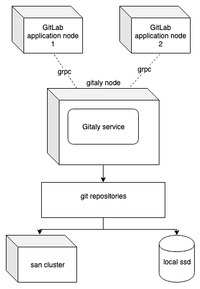

在小型安装中，它与所有其他组件运行在同一台服务器上。在大型集群环境中，你可以设置专用的 Gitaly 服务器，Gitaly 客户端可以使用这些服务器，如下所示：

+   独角兽

+   Sidekiq

+   `gitlab-workhorse`

+   `gitlab-shell`

+   Elasticsearch 索引器

+   Gitaly 作为客户端

该项目的源代码可以在这里找到：[`gitlab.com/gitlab-org/gitaly`](https://gitlab.com/gitlab-org/gitaly)[.](https://gitlab.com/gitlab-org/gitaly)

# 调试 Gitaly

你可以使用可用于 Golang 的调试工具。但首先，你可以查看日志文件。

对于源代码安装，请使用此方法：

```
/home/git/gitaly/
```

对于 Omnibus 安装，请使用此方法：

```
/var/log/gitlab/gitaly/current
```

以下是一个日志行的示例：

```
2018-09-26_13:23:40.57373 lrv162w2 gitaly: time="2018-09-26T13:23:40Z" level=info msg="finished streaming call" grpc.code=OK grpc.method=SSHUploadPack grpc.request.glRepository=project111111 grpc.request.repoPath=namespace/project-bl.git grpc.request.repoStorage=default grpc.request.topLevelGroup=hb-backend grpc.service=gitaly.SSHService grpc.time_ms=150 peer.address=@ span.kind=server system=grpc
```

你可以看到日志级别是`info`，这是一个捕获 Git SSH 命令的日志事件（`method=SSHUploadPack`）。它在服务器上启动了一个 Git `pack`命令，这意味着它重新排列并压缩了一个仓库中的数据。

要生成更详细的日志，你可以在配置文件中将日志级别设置为调试。它通过**Tom 的明显最小语言**（**TOML**）配置文件进行配置。此文件在前面提到的 Gitaly 源代码库中有文档说明。

对于源代码安装，请查看此处：

```
 /home/git/gitaly/config.toml
```

你可以更改以下部分并更改级别：

```
# # Optional: Set log level to only log entries with that severity or above
# # One of, in order: debug, info, warn, error, fatal, panic
# # Defaults to "info"
# level = "warn"

```

对于 Omnibus 安装，可以将以下指令添加到`gitlab.rb`中，以影响 Gitaly 的监控级别。设置为`debug`以启用调试级别日志：

```
gitaly['log_directory'] = "/var/log/gitlab/gitaly"
gitaly['logging_level'] = "debug" 
```

# GitLab Workhorse

GitLab Workhorse 是一个复杂的反向代理，位于 GitLab 前面。最初为了解决处理`git-http`请求的问题，它作为一个周末项目开始，名称为`gitlab-git-httpserver`。该功能之前由`gitlab-grack`（[`gitlab.com/gitlab-org/gitlab-grack`](https://gitlab.com/gitlab-org/gitlab-grack)）提供。主要的 Web 应用服务器 Unicorn 并不特别适合处理这些可能需要很长时间才能完成的请求。直接在 Unicorn 中处理这些请求实际上会抵消 Unicorn 可以提供的优势：快速和可扩展的 HTTP 请求。

Workhorse 是用 Golang 创建的，由 GitLab 开发人员 Jacob Vosmaer 构思。你可以在[`about.gitlab.com/2016/04/12/a-brief-history-of-gitlab-workhorse/`](https://about.gitlab.com/2016/04/12/a-brief-history-of-gitlab-workhorse/)阅读关于它的创建过程。

尽管最初设计用于处理 Git HTTP 协议，GitLab Workhorse 逐渐增加了许多功能，例如：

+   某些静态文件，如 JavaScript 和 CSS 文件，会直接提供服务。

+   它可以拦截 Rails 关于打开文件的请求。Workhorse 将打开文件并在响应正文中发送内容。

+   它可以拦截对 Git **大文件存储** (**LFS**) 的调用，并在准备好文件并上传到指定位置后插入一个临时路径。Git LFS 是一个功能，允许将大文件存储在 GitLab 项目空间之外。

+   它可以控制 Rails 的 WebSocket 连接，例如终端输出。

Workhorse 位于 NGINX 后面，负责处理请求路由和 SSL 终止。

# 调试 GitLab Workhorse

由于 workhorse 是用 Golang 编写的应用程序，你可以使用该语言的方法来调试程序。

它还支持使用 Sentry 进行远程错误日志记录。要启用此功能，请设置`GITLAB_WORKHORSE_SENTRY_DSN`环境变量。

**对于 Omnibus 安装**

以下内容在文件（`/etc/gitlab/gitlab.rb`）中定义：

```
gitlab_workhorse['env'] = {'GITLAB_WORKHORSE_SENTRY_DSN' => 'https://foobar'}
```

**对于源代码安装**

以下环境变量可以在文件（`/etc/default/gitlab`）中设置：

```
export GITLAB_WORKHORSE_SENTRY_DSN='https://foobar'
```

当然，首先要查看的是此组件生成的日志文件。在基于 Omnibus 的 GitLab 安装中，你可以在`/var/log/gitlab/gitlab-workhorse`中找到它们。

以下是默认日志文件的摘录：

```
"Mozilla/5.0 (Macintosh; Intel Mac OS X 10_13_5) AppleWebKit/605.1.15 (KHTML, like Gecko) Version/11.1.1 Safari/605.1.15" 0.478
 2018-08-16_20:26:43.42795 localhost:8080 @ - - [2018/08/16:20:26:43 +0000] "GET /root/mastering-gitlab-12.git/info/refs?service=git-upload-pack HTTP/1.1" 401 26 "" "git/2.15.2 (Apple Git-101.1)" 0.066
 2018-08-16_20:26:50.60861 localhost:8080 @ - - [2018/08/16:20:26:50 +0000] "POST /root/mastering-gitlab-12.git/git-upload-pack HTTP/1.1" 200 329 "" "git/2.15.2 (Apple Git-101.1)" 0.249
```

在前面的日志文件中，例如，你会看到`git-http`操作，例如`git-upload-pack`。

# 数据库

GitLab 有两种数据库可用：PostgreSQL 和 MySQL/MariaDB。由于 GitLab 作为一个产品的快速迭代发展主要集中在 PostgreSQL 上，因此不推荐使用后者，因为 MySQL 上没有许多优化。此外，使用 MySQL 时不能使用零停机时间方法，也没有如子组和 GEO 等功能，这些将在本书后面解释。

如前所述，Ruby on Rails 使用所谓的 MVC 方法。MVC 是一个广为人知的架构模式，由 Trygve Reenskaug 在 Smalltalk 语言中开发。后来它被改进为适用于 web 应用程序（Model 2）。MVC 中的模型由 `ActiveRecord` 库实现，这是 Ruby on Rails 的一部分。

数据模型的权威来源可以在此处找到：[`gitlab.com/gitlab-org/gitlab-ee/blob/master/db/schema.rb`](https://gitlab.com/gitlab-org/gitlab-ee/blob/master/db/schema.rb)。它是自动生成的，代表了当前数据库的状态。

Omnibus 包中包含的默认 PostgreSQL 数据库可以处理最多 10,000 用户的工作负载。此外，如果你希望使用冷备份设置来创建一个**灾难恢复**（**DR**）计划，你可以使用特定的故障切换机制。

一个常用的技术是创建一个冷备数据库（PostgreSQL 数据库 2）在另一个站点，如下图所示：

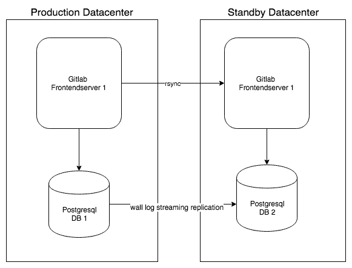

当你希望扩展或增加应用服务器的数量时，也需要扩展数据库。数据库扩展有三个重要方面。首先，你需要尽可能高效地扩展数据库客户端连接。为此，你可以使用 PgBouncer，它是一个轻量级的连接池管理器。

其次，你需要有多个数据库实例，其中一个是主节点，并将数据从主节点复制到从节点。在前述的灾难恢复（DR）情况下，这是通过 PostgreSQL 内建的基本复制机制完成的。在当前情况下，使用了一个特定的工具 repmgr，这是一种用于 PostgreSQL 集群化和处理故障切换的工具。

最后，像**Consul**这样的服务发现工具可以用来检测每个节点的 PostgreSQL 状态，并更新决定连接哪个 Postgres 实例的 PGbouncer 服务设置。

生成的架构如下所示：

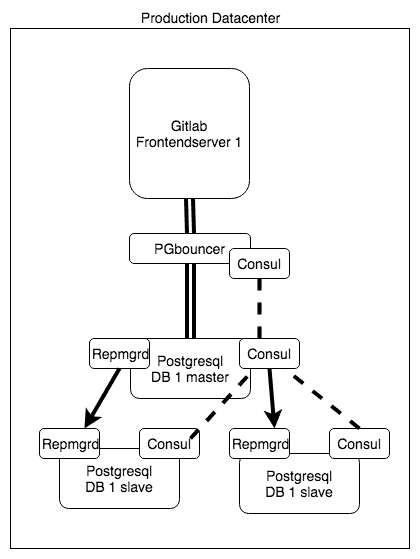

如你所见，设置 GitLab 数据库有不同的方式。前面图中突出的架构将在本书*扩展服务器基础设施（高可用性设置）*章节中作为构建高可用性环境的示例。

# GitLab CI

GitLab CI 是一个帮助执行软件组件**持续集成**（**CI**）的功能。当多个开发人员使用版本控制系统协同工作时，如果某个开发者的更改破坏了整个产品，就可能会出现问题。确保这种情况发生的概率较低，或者至少能尽早发现的最佳方法是更频繁地使用集成测试，因此称为持续集成。

GitLab CI 于 2013 年作为一个独立项目推出，但后来被集成进了主 GitLab 包中。结合 GitLab Runner 软件，这一功能在开发者中非常受欢迎，也是推动业务发展的重要因素。它还使 GitLab 能够将其产品打造为一个不仅可以进行 CI，还能够进行持续交付，甚至覆盖到生产环境的解决方案。目前 GitLab 的产品愿景是成为一个完整的 DevOps 生命周期产品，从创意到生产。

Forrester 在*The Forrester Wave: Continuous Integration Tools, Q3 2017*中将 GitLab 评为持续集成（CI）领域的领导者。如下图所示：


反馈是**极限编程**（**XP**）运动中一个重要的方面，也是 GitLab CI 的一个关键元素。它也作为开发者之间沟通的一种方式。

# Pipeline 和作业

Pipeline 和构建作业是现代**持续集成/持续交付**（**CI/CD**）系统的基本构件。在 GitLab 中，启动一个 pipeline 非常简单。你只需将一个`.gitlab-ci.yml`文件添加到你的项目中，然后在每次提交/推送到代码库时，pipeline 便会启动。每个项目都有一个 pipeline 概览；你可以在左侧菜单栏中的 CI/CD 下找到它：

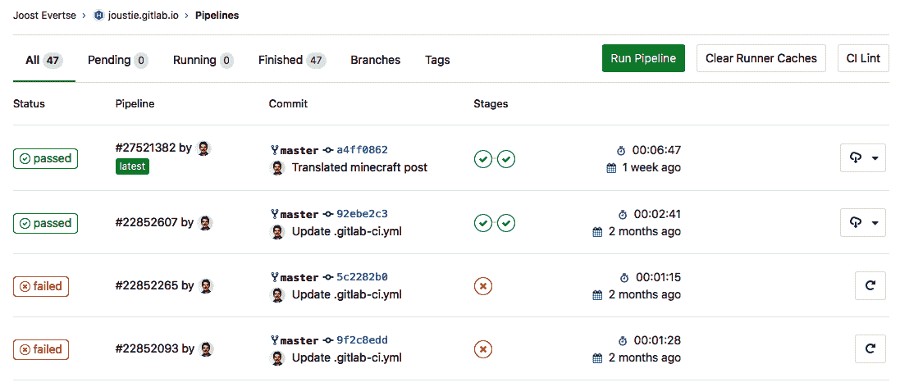

或者，你可以通过访问 Pipeline 的作业页面查看所有作业，如下图所示：

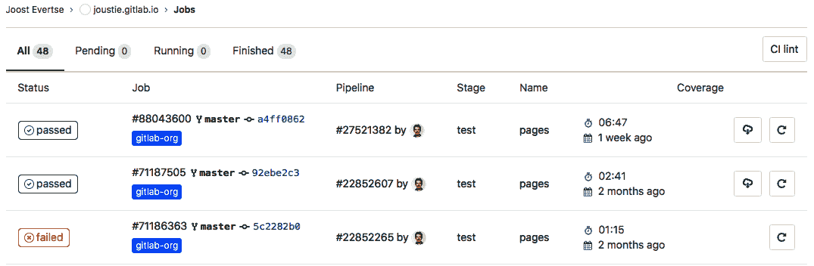

你可以通过点击作业的状态（例如，**失败**或**成功**）查看作业的日志。你可以调试为什么某些作业失败，并准确查看发生了什么：

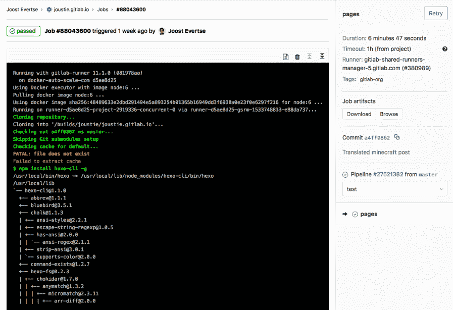

使用 pipeline 和作业进行 CI/CD 的重要性不容忽视。在本节中，你看到了 GitLab 中 pipeline 的基本界面，但在接下来的几章中，将对此进行更详细的讨论（*使用 GitLab CI 和 CI Runner*部分）。

# GitLab Runners

GitLab Runners 最初由 Kamil Trzciński 于 2015 年开发。现在它们已成为 GitLab 最受欢迎的功能之一。

初始的 GitLab-CI-Runner 是一个用 Ruby 编写的非常简单的应用程序，但在相当基础的设置中运行良好。你可以将它看作是一个裸跑者可能是什么样子的参考实现。

# 旧版 runner 的问题

旧版 runner 的主要问题是它每次只能运行一个并发作业。如果你想运行更多作业，你只能设置一台新服务器或创建一个额外的用户来构建作业。

其次，它始终在服务器 Shell 中运行项目。这使得使用不同版本的 Ruby 或其他依赖项测试项目变得非常困难。它不是无状态的，这意味着你有一个被污染的构建环境。因此，构建结果并不可靠。如今，每次都拥有一个无状态且干净的构建环境至关重要。

旧版 Runner 的另一个缺点是它只能在基于 Linux 的平台上运行。为了让它在 macOS 上运行，GitLab 用户平台之一，你需要进行额外的修改。对于微软 Windows 的支持更是不可想象。

最后，曾经有一些繁重的管理负担。服务器很难扩展，因为设置一个新服务器需要很长时间，因为你需要处理依赖关系，才能构建项目。

更新后的 Runner 是一个二进制文件，可以放置在任何类型的机器上。它非常容易设置为服务，并且能够与多个项目和多个 GitLab CI 协调器一起工作。它还支持 Docker，使得以不同版本设置构建环境变得非常简单。

# 切换到 Go

Go（或 Golang）是一种新的编程语言（不到 10 年）。它已经被一些令人印象深刻的公司广泛使用，如 Docker ([`docker.com`](https://docker.com))、Google、Kubernetes ([`kubernetes.io`](https://kubernetes.io)) 和 Prometheus ([`prometheus.io`](https://prometheus.io))。Go 是一个多用途工具，可以帮助你在低级别接近操作系统的层面编程，也可以在像 Java 这样的高级语言中编程。它非常适合用来创建系统软件。该语言由 R. Griesemer、R. Pike 和 K. Thompson 在 2009 年为 Google 创建。后者因共同创造了第一版 Unix 实现和 B 编程语言而非常著名。Go 语言最重要的特点是它能够编译出一个不依赖任何库的二进制文件，适用于多个操作系统，如 Linux、macOS、BSD 和 Windows。这也意味着它可以在不同的处理器架构上运行（i386、amd64、ARM 和 PowerPC）。

以下是 Go 的一些优点：

+   非常优秀的标准库（还有很多可选的库可以在其他地方找到）。

+   在 Go 中开发和测试非常快速。

+   文化/社区倾向于选择简单的解决方案而非复杂的解决方案（这很好）。

+   很酷的工具，如 Gofmt、竞争检测器和 `go vet`。

+   为并发设计——例如，你可以使用 goroutine 和 channels。

+   类型安全——可以避免许多运行时错误和错误的类型定义。

+   垃圾回收——虽然使用 C 的程序员知道如何清理内存，但这仍然是有帮助的。

+   闭包或匿名函数——启用使用函数式编程原则（高阶函数）。

所有这些特点使 Go 成为 GitLab Runners 的完美选择。使用 Go，你可以创建一个相对较小的二进制文件，能够在多个平台上运行。它包含了运行项目所需的一切。

在 GitLab 环境中，作业由 Runner 执行。它们按照 `.gitlab-ci.yml` 文件中定义的方式运行。Runner 本身可以运行在 **虚拟机**（**VM**）上，例如 VmWare（VM）、VPS、笔记本电脑、Docker 容器或 Kubernetes 集群中。通信是单向的，从 Runner 到 GitLab，主要通过 HTTP API 进行，因此该路径必须对 Runner 可访问。

`.yml` 文件定义了你的 CI/CD 流水线有哪些阶段，以及每个阶段要做什么。通常包括构建、测试和部署阶段。

GitLab 在其手册中提到 *无聊* 作为减少复杂性的一种有价值的方式；参见 [`about.gitlab.com/handbook/values/#efficiency`](https://about.gitlab.com/handbook/values/#efficiency)。

项目可以在 [`gitlab.com/gitlab-org/gitlab-runner`](https://gitlab.com/gitlab-org/gitlab-runner) 找到：

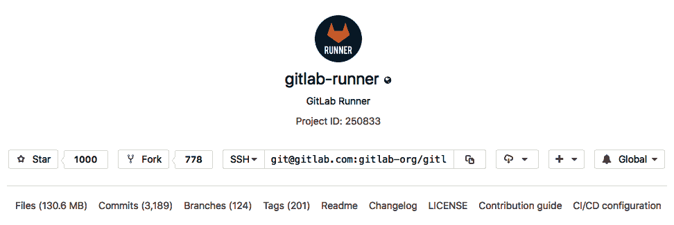

执行器可以特定于某个项目，或者它可以服务于 GitLab 中的多个项目。如果它服务于所有项目，它被称为共享执行器。GitLab Runners 实现了许多 **执行器**，可以在不同场景下用于你的构建：

+   **Shell 执行器**：执行器简单地执行一个 shell。构建的依赖项需要手动安装。

+   **基于 Docker 的执行器**：执行器从容器中运行。这使得创建干净的构建变得更容易，因为依赖管理被转移到容器镜像中。它还使得创建需要互相依赖的服务的构建环境变得更容易，例如 PostgreSQL。

+   **自动扩展 Docker SSH**：Docker 机器使用 Docker 引擎创建实例以运行 Docker 容器。

+   **Kubernetes**：GitLab Runner 可以使用 Kubernetes 在 Kubernetes 集群上运行构建。

在过去的几年中，Runners 发展了很多。GitLab 本身将它们视为其套件中最重要的组件之一。本节为你提供了更多关于这一流行工具发展的见解。

# 云原生

在 2016 年末和 2017 年初，GitLab 社区就是否从云迁回裸金属服务器展开了公开辩论，讨论是否对 [GitLab.com](https://about.gitlab.com/) 更具成本效益。当时，用于存储仓库的文件系统是 Ceph。这个分布式文件系统的性能不足以支撑 [GitLab.com](https://about.gitlab.com/)。他们向社区征求建议，收到了许多有类似经历的人的反馈。最终，决定继续留在云端（[`about.gitlab.com/2017/03/02/why-we-are-not-leaving-the-cloud/`](https://about.gitlab.com/2017/03/02/why-we-are-not-leaving-the-cloud/)）。GitLab 反而决定专注于创建一个解决方案，重点不再是文件系统层面，而是确保 Git 输入/输出（I/O）行为在应用层面得到更好的管理。这也可以看作是 Gitaly 组件的诞生。Sid Sijbrandij 强调，GitLab 作为一家软件公司，而非基础设施公司，这一点非常重要。

2018 年 8 月，GitLab 将其基于云的服务，[GitLab.com](https://about.gitlab.com/)，从 Azure 迁移到 **Google Cloud Platform**（**GCP**）。根据 CEO Sid Sijbrandij 的说法，迁移至 GCP 的主要原因如下：

“作为一个公共云，Google 比其他云服务提供商有更多的经验，因为他们基本上是为自己打造了一套云 [...] 你可以在网络方面看到这一点，他们的网络质量超越了其他所有人。它更可靠，延迟更低，而且真的非常令人印象深刻，我们很高兴开始在上面托管 GitLab.com。”

看起来这次调整是值得的；用户反馈称，[GitLab.com](https://about.gitlab.com/)明显变得更快了。另一个很可能会带来进一步加速的转变是使用 Kubernetes 作为容器编排器。这是他们战略中一个重要的部分，旨在将更多功能融入到 GitLab 中，除了自动扩展 GitLab 运行器之外。GitLab 自己的高可用工具 GEO 被用来将数据从一个云同步到另一个云。运行在 Google 架构上的 GitLab 也可以利用对象存储来实现一些特定功能，例如 Git LFS。

# 总结

在这一章中，我们了解了 GitLab 背后的人和组织。从一开始，我们展示了该项目多年来的发展历程。我们详细讲解了 GitLab 的核心组件以及如何安装它们。对于某些组件，我们还介绍了调试安装的方法。

我们还简要介绍了 GitLab CI 以及与其交互的客户端程序，例如 GitLab Runner。我们展示了这个功能为何如此重要，以及 IT 行业如何看待它。

在下一章中，我们将介绍如何在不同系统上安装和配置 GitLab。如果你是该产品的新用户，准备好惊叹吧！

# 问题

1.  GitLab 最初是由谁和何时开发的？

1.  GitLab 是如何获得资金的？

1.  列举所有在 GitLab 软件中使用的编程语言。

1.  GitLab 使用了哪些许可证？

1.  为什么他们使用这些许可证？

1.  列举 GitLab 的核心组件。

1.  GitLab 有多少个办公室？

1.  Redis 中存储了什么？

1.  Gitaly 替代了什么？

1.  GitLab 在 2018 年选择了哪个云服务作为重点？

# 进一步阅读

+   Sidekiq—源代码和文档: [`github.com/mperham/sidekiq`](https://github.com/mperham/sidekiq)

+   Ruby on Rails: [`rubyonrails.org`](https://rubyonrails.org)

+   Unicorn: [`thorstenball.com/blog/2014/11/20/unicorn-unix-magic-tricks/`](https://thorstenball.com/blog/2014/11/20/unicorn-unix-magic-tricks/)

+   *云原生编程与 Golang* 由 *Mina Andrawos*、*Martin Helmich* 编著: [`www.packtpub.com/in/application-development/cloud-native-programming-golang`](https://www.packtpub.com/in/application-development/cloud-native-programming-golang)

+   *Nginx HTTP 服务器 - 第四版* 由 *Clement Nedelcu*、*Martin Fjordvald* 编著: [`www.packtpub.com/in/virtualization-and-cloud/nginx-http-server-fourth-edition`](https://www.packtpub.com/in/virtualization-and-cloud/nginx-http-server-fourth-edition)

+   *精通 Redis* 由 *Jeremy Nelson* 编著: [`www.packtpub.com/in/big-data-and-business-intelligence/mastering-redis`](https://www.packtpub.com/in/big-data-and-business-intelligence/mastering-redis)

+   *PostgreSQL 管理手册, 9.5/9.6 版* 由 *Simon Riggs*、*Gianni Ciolli*、*Gabriele Bartolini* 编著: [`www.packtpub.com/in/big-data-and-business-intelligence/postgresql-administration-cookbook-9596-edition`](https://www.packtpub.com/in/big-data-and-business-intelligence/postgresql-administration-cookbook-9596-edition)
