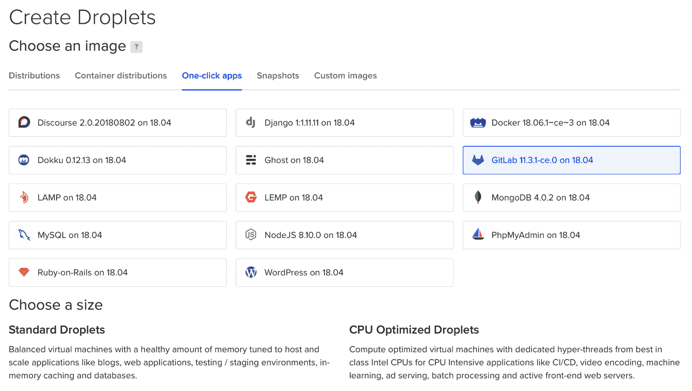
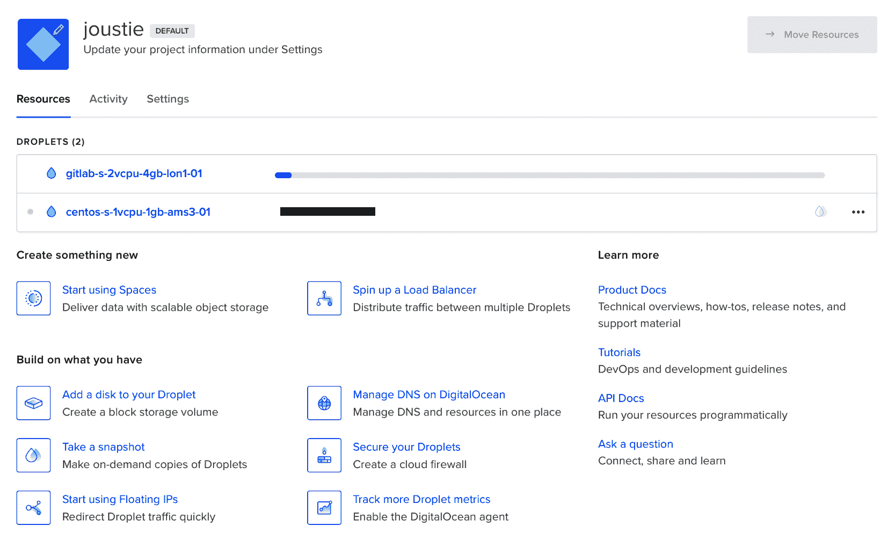
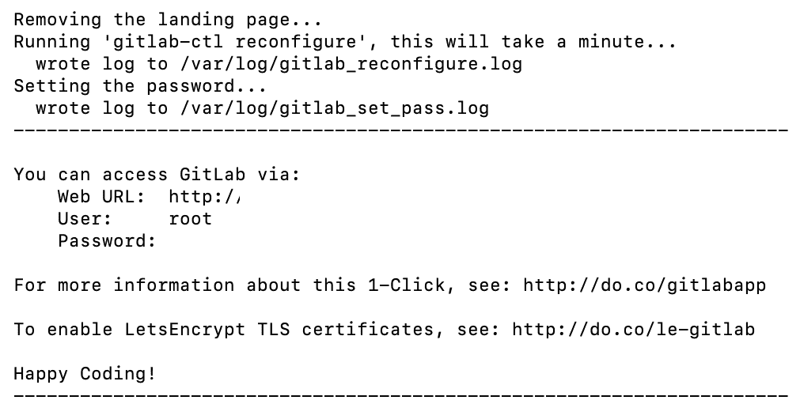
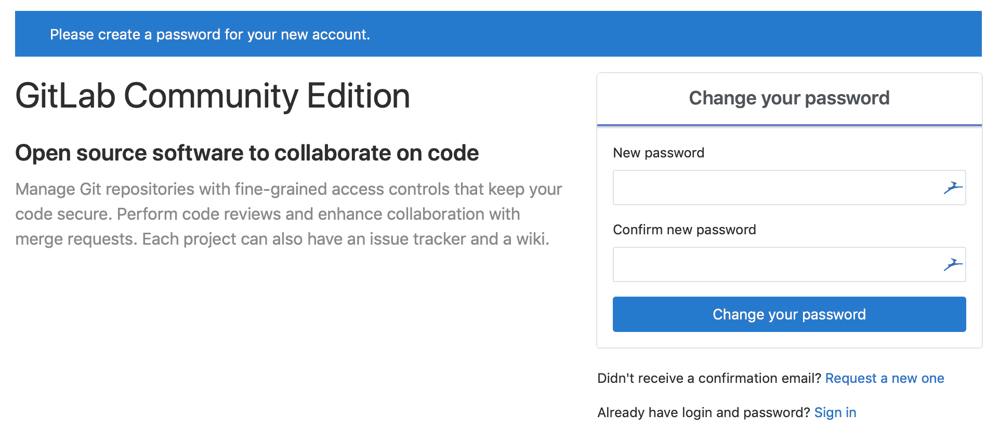

# 安装 GitLab

在本章中，我们将讨论几种安装 GitLab 的方法。我们将从推荐的安装方式开始，即使用 omnibus 安装器在你自己的机器上安装 GitLab。其次，我们将展示如何从 GitLab 的源文件进行完整安装。所有这些操作将在 Debian 平台上进行。然后，我们将展示如何使用 Kubernetes 编排器这一更现代的应用运行方式。最后，我们将展示如何使用云平台 DigitalOcean 进行安装。DigitalOcean 提供了预定义的 GitLab 镜像，这些镜像使用 omnibus 安装器进行了内部配置。

本章将覆盖以下内容：

+   使用 omnibus 包安装

+   从源文件运行

+   使用 Docker 安装 GitLab

+   使用 Kubernetes 部署 GitLab

+   在 DigitalOcean 上创建 Droplet

# 技术要求

对于管理 omnibus 安装，有一个名为 `gitlab.rb` 的中央配置文件。你需要创建它或复制一个示例文件。你可以在 [`gitlab.com/gitlab-org/omnibus-gitlab/blob/master/files/gitlab-config-template/gitlab.rb.template`](https://gitlab.com/gitlab-org/omnibus-gitlab/blob/master/files/gitlab-config-template/gitlab.rb.template) 找到一个模板。升级后该模板不会自动更新。在本章的许多部分，我将引用并讨论此文件的内容。

要跟随本章的指令，请下载在 GitHub 上提供的 Git 仓库：[`github.com/PacktPublishing/Mastering-GitLab-12/tree/master/Chapter02`](https://github.com/PacktPublishing/Mastering-GitLab-12/tree/master/Chapter02)。

虽然 GitLab 可以安装在多种平台上，但在本章中我们选择了 Debian 9 来展示如何进行安装。你可以从 [`debian.org`](http://debian.org) 下载 Debian。

我们还将需要以下工具：

+   **Helm**: [`helm.sh`](https://helm.sh)

+   **kubectl**: [`kubernetes.io/docs/tasks/tools/install-kubectl/`](https://kubernetes.io/docs/tasks/tools/install-kubectl/)

# 安装要求

对于所有类型的安装，都涉及到防火墙/流量问题。Linux 的基本防火墙软件是 iptables，它与 Linux 内核紧密相关。配置 iptables 是相当复杂的，关于这方面有其他书籍。幸运的是，有许多用户友好的程序可供选择，这些程序能够通过与 iptables *交互* 来帮助你管理系统防火墙。

Linux UFW（简单防火墙）是一个前端工具。如果你的系统上安装了它，请按照这些指示打开防火墙。

在配置 GitLab 之前，你需要确保防火墙规则足够宽松，以允许 web 流量。

执行以下命令查看当前活动防火墙的状态：

```
$sudo ufw status
 Status: active

 To                         Action      From
 --                         ------      ----
 OpenSSH                    ALLOW       Anywhere 
 OpenSSH (v6)               ALLOW       Anywhere (v6)
```

正如你所见，当前规则允许 SSH 流量通过，但其他服务的访问被限制。由于 GitLab 是一个 Web 应用程序，我们应该允许 HTTP 访问。如果你的 GitLab 服务器有与之关联的域名，GitLab 也可以从 **Let's Encrypt** 项目请求并启用免费的 TLS/SSL（传输层安全性/安全套接字层）证书来保护你的安装。在这种情况下，我们还需要允许 HTTPS 访问。

由于 HTTP 和 HTTPS 的协议到端口的映射可以在 `/etc/services` 文件中找到，我们可以按名称允许该流量。如果你还没有启用 OpenSSH 流量，现在也应该允许该流量：

```
$sudo ufw allow http
$sudo ufw allow https
$sudo ufw allow OpenSSH
```

如果你再次检查 `ufw status` 命令，你应该会看到至少这两项服务的访问已被配置：

```
$sudo ufw status
Status: active

 To                         Action      From
 --                         ------      ----
 OpenSSH                    ALLOW       Anywhere 
 80                         ALLOW       Anywhere 
 443                        ALLOW       Anywhere 
 OpenSSH (v6)               ALLOW       Anywhere (v6) 
 80 (v6)                    ALLOW       Anywhere (v6) 
 443 (v6)                   ALLOW       Anywhere (v6)
```

上述输出表明，一旦我们配置好应用程序，GitLab 的 Web 界面将可以访问。

# 使用 omnibus 包安装 GitLab

安装 GitLab 有几种方法。最好的方法是使用 omnibus 安装程序，这是一种基于 Chef 的配置包。安装程序实际上是来自 Chef 项目的一个分支，地址是 [`github.com/chef/omnibus`](https://github.com/chef/omnibus)。之所以这是最好的安装方式，是因为它为你处理了大量的样板工作。GitLab 安装涉及很多细节，很容易出错。通过 Chef omnibus 自动化这一过程，消除了许多复杂性和潜在的错误。安装程序可以用来在多个平台上安装 GitLab：

+   Ubuntu

+   Debian

+   CentOS（任何 Red Hat 衍生版）

+   OpenSUSE

+   Raspbian

我们将在下面“运行安装程序”部分使用 Debian 作为示例。

# Omnibus 结构

全局而言，omnibus 包由以下组成：

+   项目定义

+   单独的软件定义

+   GitLab 配置模板

+   Chef 组件，例如 cookbook 和属性

+   管理服务的 Runit 配方

+   测试

+   最后但同样重要的是，`gitlab-ctl` 命令

# 项目定义

此文件包含元数据，并描述项目的详细信息，以及项目中包含的依赖项。你可以在 omnibus 源代码的 `config/projects/gitlab.rb` 中找到它。

# 单独的软件定义

在 `config/software/` 文件夹中找到，它包含了所有属于 omnibus 安装的软件。例如，如果你想使用 PostgreSQL（关系数据库），你将找到其配置、许可证、依赖项，以及如何构建或获取该软件的说明。有时，可能需要一个补丁，补丁也会被包含进去。

# GitLab 配置模板

所有配置指令都从 `/etc/gitlab/gitlab.rb` 文件中读取，该文件应放置在目标系统上，供 omnibus 应用。你可以使用该文件来调整很多设置。指定设置的标准方法是使用以下内容：

```
component['settings'] = $value eg. gitlab_rails['webhook_timeout'] = 10
```

# Chef 组件

有几个**Chef**食谱是 GitLab omnibus 的一部分，是否执行这些食谱取决于你指定的配置。

# Runit 配方

GitLab 选择了**runit**（[`wiki.archlinux.org/index.php/Runit`](https://wiki.archlinux.org/index.php/Runit)）作为进程管理器，负责管理通过 omnibus-gitlab 包安装的所有服务。在安装时，它会确定使用的是哪个初始化系统，并确保在启动时适当地调用它。它管理服务的停止、启动、重新加载和启用。

# 测试

omnibus-gitlab 仓库使用 ChefSpec（行为驱动测试框架）来测试其食谱。测试可能会检查应该存在的文件以及运行命令后的状态。例如，这些测试通常只有在你更改 omnibus-gitlab 安装程序的源代码时才会有意义（[`gitlab.com/gitlab-org/omnibus-gitlab/`](https://gitlab.com/gitlab-org/omnibus-gitlab/)）。你可以在 `spec` 文件夹中找到这些测试。

# gitlab-ctl 命令

这是使用 omnibus-gitlab 包时最重要的命令。它在运行安装程序后可用。该工具可以用来管理一般事务，如启动/停止/重新加载所有 omnibus-gitlab 提供的服务，但它在应用 `gitlab.rb` 配置文件中的更改时也提供了重要功能。不要忘记使用以下命令应用更改：

```
gitlab-ctl reconfigure
```

主要命令如下：

+   `help`（命令帮助）

+   `cleanse`（删除所有数据并重置状态）

+   `show-config`（显示将要创建的配置）

+   `uninstall`（停止所有进程并移除管理进程服务）

服务管理命令如下：

+   `hup`（发送服务或所有挂起信号）

+   `kill`（发送服务或所有终止信号）

+   `start`/`restart`/`stop`（发送服务或所有命令）

+   `status`（测试并报告指定服务或所有服务的状态）

+   `tail`（查看所有服务的日志）

# 使用 omnibus-gitlab 包进行升级

通常，如果你在现有安装上部署该包，它将自动升级已安装的组件。对于 GitLab 12，PostgreSQL 数据库将自动升级到版本 10.7，除非你创建一个名为 `/etc/gitlab/disable-postgresql-upgrade` 的文件。升级时，请始终阅读发行说明中的特别说明。对于版本 12，相关说明请见这里**：[`docs.gitlab.com/omnibus/update/gitlab_12_changes.html`](https://docs.gitlab.com/omnibus/update/gitlab_12_changes.html)**。

# 运行安装程序

以下将展示如何在 Debian Linux 上运行 omnibus-gitlab 安装程序。在运行安装包之前，我们需要准备一些事情：

1.  我们需要设置国际化设置并安装一些软件包（curl、openssh-server 和默认的 SSL 根证书）：

```
sudo apt-get update 
export LANGUAGE=en_US.UTF-8
export LANG=en_US.UTF-8
export LC_ALL=en_US.UTF-8
sudo locale-gen en_US.UTF-8
sudo apt-get install -y curl openssh-server ca-certificates 
```

1.  在使用 GitLab 时，配置电子邮件通知也是很重要的。通常，这通过 Postfix 完成，但您也可以使用其他解决方案并将 GitLab 指向它（外部 SMTP（简单邮件传输协议））：

```
sudo apt-get install -y postfix 
```

1.  最佳选项是在被询问时选择 Internet Site，并使用您的外部主机名作为邮件名称。其余选项，接受默认设置即可。

1.  添加 GitLab 包仓库并安装该包。

1.  使用以下 `curl` 命令，您可以安装 GitLab 包仓库，并通过下载一个包来启动安装：

```
curl https://packages.gitlab.com/install/repositories/gitlab/gitlab-ee/script.deb.sh | sudo bash 
```

1.  下一步是执行包安装步骤。您可以将 `EXTERNAL_URL` 变量设置为您的新 GitLab 实例的 URL。如果您指定一个 https:// 的 URL，安装程序将尝试使用 Let's Encrypt 来生成证书。此服务免费使用（[`letsencrypt.org/`](https://letsencrypt.org/)），但需要有效的主机名（将进行验证）和可以从互联网访问的端口 80。您还可以指定一个普通的 http:// URL，此时不使用 Let's Encrypt。安装命令如下：

```
 sudo EXTERNAL_URL="http://gitlab.example.com" apt-get install gitlab-ee 
```

# 浏览到外部 URL 并登录

如果您是第一次使用它，您将看到一个密码重置表单。您可以为初始管理员账户指定密码，密码保存后，您将被引导到登录界面。使用刚刚选择的管理员凭据登录。

在接下来的章节中，包含了有关如何配置 GitLab 和后续操作的详细信息和说明。

# 从源代码运行

在从源代码安装时，请确保您已查看适用于您的平台的最新安装指南，特别是您想要的 GitLab 版本（例如，12-0）。本书中的说明最终会过时。此外，如果遇到问题，您可以尝试在 GitLab 论坛上找到答案：[`forum.gitlab.com/c/troubleshooting`](https://forum.gitlab.com/c/troubleshooting)。如果问题是 GitLab 的 Bug 或不期望的行为，您可以在 [`gitlab.com/gitlab-org/gitlab-ce/issues`](https://gitlab.com/gitlab-org/gitlab-ce/issues) 上开一个问题。以下部分将展示适用于 Debian 版本的具体安装说明。

# 操作系统 – Debian 9

在这里，您将找到关于如何在基于 Debian 的 Linux 上安装 GitLab 的说明。Debian 是最古老的 Linux 发行版之一，约在 25 年前创建。它背后的基金会始终坚持一个原则，即只包含开源 GPL（通用公共许可证）软件。其使用的包管理系统 `apt` 结合优秀的包维护者，确保了多年来的良好质量。他们使用的过程来决定哪些组件应当包含，创造了一个非常干净的产品。

Debian 成为了一种*基础*发行版，其他的则*从它分支*并进行了扩展。在 2016 年，约有 125 种基于 Debian 的发行版。

以下安装指令是为 Debian 操作系统创建并测试的。如果要在 Red Hat Enterprise Linux (RHEL) 或其姊妹操作系统 Community Enterprise Operating System (CentOS) 上安装，建议使用 omnibus 包。

以下指令适用于大多数人。许多人会遇到权限问题，因为他们改变了目录的位置或以不同的用户身份运行服务。

首先，我们将开始解释在安装 GitLab 之前需要安装的基本软件包。然后，我们会讲解所需编程语言的安装。

一旦这些步骤成功完成，我们将通过准备 SQL 数据库和 GitLab 内存数据库继续安装。

最后，我们将开始安装 GitLab 应用程序组件。

在安装过程中，你需要编辑多个配置文件。确保你有一个可用的编辑器。最常用的是 `vim`（人们对此有不同看法），你可以像这样安装：

```
sudo apt-get install -y vim
sudo update-alternatives --set editor /usr/bin/vim.basic
```

# 所需的基本软件包

首先，将区域设置为你喜欢的语言（我使用英文 UTF-8，即 8 位 Unicode 转换格式）。这些设置默认在我的 Debian 系统中是不存在的：

```
export LANGUAGE=en_US.UTF-8
export LANG=en_US.UTF-8
export LC_ALL=en_US.UTF-8
sudo locale-gen en_US.UTF-8
```

然后，使用以下命令安装所需的软件：

```
sudo apt-get install -y build-essential zlib1g-dev libyaml-dev libssl-dev libgdbm-dev libre2-dev libreadline-dev libncurses5-dev libffi-dev curl openssh-server checkinstall libxml2-dev libxslt-dev libcurl4-openssl-dev libicu-dev logrotate rsync python-docutils pkg-config cmake wget
```

确保你安装了正确版本的 Git。使用以下命令安装 Git：

```
sudo apt-get install -y git-core
```

确保 Git 版本为 2.9.5 或更高版本：

```
git --version
```

安装邮件服务器，但不要使用 Exim。使用 Postfix 更加合理：

```
sudo apt-get install -y postfix
```

然后，选择 Internet Site 并按 *Enter* 键确认主机名。

# 所需的编程语言

GitLab 需要几个编程语言才能正常运行。你需要安装它们，以便使用所有功能。

# Ruby

由于 GitLab 主要是用 Ruby 编写的，我们需要安装这个语言。如果操作系统中存在旧版 Ruby 1.8，请移除：

```
sudo apt-get remove ruby1.8
```

下载最新版本的 Ruby，检查签名并进行编译：

```
$ wget https://cache.ruby-lang.org/pub/ruby/2.6/ruby-2.6.3.tar.gz
$ shasum ruby-2.6.3.tar.gz 2347ed6ca5490a104ebd5684d2b9b5eefa6cd33c  ruby-2.6.3.tar.gz
$ tar xvzf ruby-2.6.3.tar.gz
..
$ cd ruby-2.6.3
$ ./configure --disable-install-rdoc
$ make
$ sudo make install
```

安装完成后，检查版本：

```
$ruby -v
ruby 2.6.3p62 (2019-04-16 revision 67580) [x86_64-linux]
```

接着，安装 Bundler Gem：

```
$ sudo gem install bundler --no-document --version '< 2'
Fetching: bundler-1.17.3.gem (100%)
Successfully installed bundler-1.17.3
1 gem installed
```

现在，Ruby 的基础安装已经完成。

# Go

GitLab 的新部分是用 Go 编写的（有时称为 Golang）。这些部分自 GitLab 8.0 版本以来就已存在，因此我们也需要这个语言编译器，以便运行新版 GitLab。最好从这里下载 Go 的最新版本：[`golang.org`](https://golang.org)。下载后，确保校验和正确（对于 linux-amd64 页面，Go 11.10 的校验和是 `aefaa228b68641e266d1f23f1d95dba33f17552ba132878b65bb798ffa37e6d0`）。我们将其安装在`/usr/local/bin` 位置：

```
$ wget https://dl.google.com/go/go1.11.10.linux-amd64.tar.gz
$ shasum  -a256 go1.11.10.linux-amd64.tar.gz
aefaa228b68641e266d1f23f1d95dba33f17552ba132878b65bb798ffa37e6d0  go1.11.10.linux-amd64.tar.gz
$ sudo tar -C /usr/local -xzf go1.11.10.linux-amd64.tar.gz
$ sudo ln -sf /usr/local/go/bin/{go,godoc,gofmt} /usr/local/bin/
$ rm go1.11.10.linux-amd64.tar.gz

$ go version
go version go1.11.10 linux/amd64
```

目前，Go 支持八种不同的硬件指令集，因此你有一些选择。你可以在 Go 下载页面找到适用于除 64 位 Linux 之外平台的下载：[`golang.org/dl/`](https://golang.org/dl/)。

# Node.js

GitLab 使用 Node.js 来编译 JavaScript，Yarn 用于管理 JavaScript 组件的依赖。由于这些工具发展迅速（有定期的新版本发布），你应该查看当前的要求，访问 [`about.gitlab.com/`](https://about.gitlab.com/)。截至 2019 年 4 月，支持的 Node.js 版本应该是 ≥ 8.10.0，Yarn 版本应该是 ≥ v1.10.0。

由于 Linux 发行版中的版本通常滞后，建议从源代码安装。以下代码块展示了如何进行安装：

```
 $ curl --location https://deb.nodesource.com/setup_12.x | sudo bash -
 $ sudo apt-get install -y nodejs
 $ node -v
 v12.6.0

 $ curl --silent --show-error https://dl.yarnpkg.com/debian/pubkey.gpg | sudo apt-key add -  OK
 $ echo "deb https://dl.yarnpkg.com/debian/ stable main" | sudo tee \
 /etc/apt/sources.list.d/yarn.list
 $ sudo apt-get update
 $ sudo apt-get install yarn ...

 $ yarn -v
 1.17.3
```

你可以在 [`yarnpkg.com/en/docs`](https://yarnpkg.com/en/docs) 查找关于 Yarn 的更多信息，Node.js 的文档可以在 [`nodejs.org/en/docs/`](https://nodejs.org/en/docs/) 找到。

# 系统用户：

为 GitLab 创建一个没有登录 shell 的 Git 用户，并在 GECOs 字段提供一个常见名称（GECOS = 旧 Unix 打印机的年龄标记）：

```
$ sudo adduser --disabled-login --gecos 'GitLab user' git
Adding user `git' ...
Adding new group `git' (1001) ...
Adding new user `git' (1001) with group `git' ...
Creating home directory `/home/git' ...
Copying files from `/etc/skel' ...
```

结果是添加了一个名为 `git` 的用户，创建了一个名为 `git` 的组，建立了主目录，并从 `/etc/skel` 复制了一些模板文件到主目录。

# SQL 数据库：

你确实应该使用 PostgreSQL 数据库，正如在 第一章《介绍 GitLab 架构》中所解释的那样。对于 MySQL（另一种 SQL 数据库），请参考 MySQL 设置指南。

使用以下命令安装数据库软件包：

```
$ sudo apt-get install -y postgresql postgresql-client libpq-dev postgresql-contrib

Setting up postgresql (9.6+181+deb9u2) ...
Setting up postgresql-client (9.6+181+deb9u2) ...
Setting up postgresql-contrib-9.6 (9.6.10-0+deb9u1) ...
Setting up postgresql-contrib (9.6+181+deb9u2) ...
Processing triggers for systemd (232-25+deb9u4) ...
Processing triggers for libc-bin (2.24-11+deb9u3) ...
```

启动数据库引擎：

```
$ sudo service postgresql start
```

为 GitLab 创建一个数据库用户：

```
$ sudo -u postgres psql -d template1 -c "CREATE USER git CREATEDB;"
CREATE ROLE
```

创建 `pg_trgm` 扩展（GitLab 8.6+ 所需）：

```
$ sudo -u postgres psql -d template1 -c "CREATE EXTENSION IF NOT EXISTS pg_trgm;"
 CREATE EXTENSION
```

创建 GitLab 生产数据库并授予该数据库所有权限：

```
$ sudo -u postgres psql -d template1 -c "CREATE DATABASE gitlabhq_production OWNER git;"
 CREATE DATABASE
```

尝试使用新用户连接到新数据库：

```
$ sudo -u git -H psql -d gitlabhq_production
Postgresql (9.4.22) Type “help” for help.
gitlabhq_production=>
```

通过在数据库控制台粘贴或键入此内容来检查是否启用了 `pg_trgm` 扩展：

```
 SELECT true AS enabled
 FROM pg_available_extensions
 WHERE name = 'pg_trgm'
 AND installed_version IS NOT NULL;
```

如果扩展已启用，将产生以下输出：

```
enabled
-------
t 
(1 row) 
```

现在，我们设置数据库密码：

```
gitlabhq_production=> \password git
Enter new password: <type a password>
Enter it again: <type again this password>
gitlabhq_production=> \q
```

使用 `\q` 退出数据库控制台。保存这个密码以备后用，在配置 GitLab 安装时使用。

在 PostgreSQL 主配置文件中创建条目：

```
$ vi /etc/postgresql/9.6/main/postgresql.conf
```

将监听地址更改为 `*`，或在现在显示为 localhost 时更改 IP 并取消注释：

```
listen_addresses = '*'
```

在 PostgreSQL 主机文件中创建条目：

```
$ sudo vi /etc/postgresql/9.6/main/pg_hba.conf
```

添加如下行：

```
host gitlabhq_production git <ip of gitlab server>/32 md5
```

保存主机文件后，重启数据库实例以使设置生效：

```
$ sudo service postgresql restart
```

数据库现在已为 GitLab 准备就绪。

# Redis 内存数据库：

在上一章中，我们讨论了 Redis 及其工作原理。

安装 GitLab 至少需要 v2.8 版本的 Redis，可以通过 `apt` 在 Debian 上轻松安装：

```
$ sudo apt-get install redis-server
```

配置 Redis 使用套接字：

```
$ sudo cp /etc/redis/redis.conf /etc/redis/redis.conf.orig
```

通过将 `port` 设置为 `0`，禁用 Redis 监听 **传输控制协议**（**TCP**）：

```
$ sudo sed 's/^port .*/port 0/' /etc/redis/redis.conf.orig | sudo tee /etc/redis/redis.conf
```

在 Debian 和类似发行版上启用 Redis 套接字的默认路径：

```
$ sudo echo 'unixsocket /var/run/redis/redis.sock' | sudo tee -a /etc/redis/redis.conf
```

授予 Redis 组所有成员对套接字的权限：

```
$ sudo echo 'unixsocketperm 770' | sudo tee -a /etc/redis/redis.conf
```

创建包含套接字的目录（如果存在则无妨）：

```
$ sudo mkdir /var/run/redis
$ sudo chown redis:redis /var/run/redis 
$ sudo chmod 755 /var/run/redis
```

如果适用，请持久化包含套接字的目录：

```

 echo 'd  /var/run/redis  0755  redis  redis  10d  -' | sudo tee -a /etc/tmpfiles.d/redis.conf
 fi
```

激活对 `redis.conf` 的更改：

```
$ sudo service redis-server restart
```

将 Git 添加到 Redis 组：

```
$ sudo usermod -aG redis git
```

我们现在有了一个可以与 GitLab 一起使用的功能正常的 Redis 服务器。

# GitLab

我们将在 `git` 用户的主目录中安装 GitLab：

```
$ cd /home/git
```

克隆源代码：

```
$ sudo -u git -H git clone https://gitlab.com/gitlab-org/gitlab-ce.git -b 12-0-stable gitlab
 Cloning into 'gitlab'...
 remote: Enumerating objects: 1234071, done.
 remote: Counting objects: 100% (1234071/1234071), done.
 remote: Compressing objects: 100% (369844/369844), done.
 remote: Total 1234071 (delta 937064), reused 1101079 (delta 849256)
 Receiving objects: 100% (1234071/1234071), 529.69 MiB | 5.58 MiB/s, done.
 Resolving deltas: 100% (937064/937064), done.
```

转到 GitLab 安装文件夹：

```
$ cd /home/git/gitlab
```

复制示例 GitLab 配置：

```
$ sudo -u git -H cp config/gitlab.yml.example config/gitlab.yml
```

更新 GitLab 配置文件并按照文件顶部的说明操作：

```
$ sudo -u git -H editor config/gitlab.yml
```

复制示例秘密文件：

```
$ sudo -u git -H cp config/secrets.yml.example config/secrets.yml
$ sudo -u git -H chmod 0600 config/secrets.yml
```

确保 GitLab 可以写入 `log/` 和 `tmp/` 目录：

```
$ sudo chown -R git log/
$ sudo chown -R git tmp/
$ sudo chmod -R u+rwX,go-w log/
$ sudo chmod -R u+rwX tmp/
```

确保 GitLab 可以写入 `tmp/pids/` 和 `tmp/sockets/` 目录：

```
$ sudo chmod -R u+rwX tmp/pids/
$ sudo chmod -R u+rwX tmp/sockets/
```

创建 `public/uploads/` 目录：

```
$ sudo -u git -H mkdir public/uploads/
```

现在，由于 `public/uploads` 中的文件由 GitLab-Workhorse 提供服务，请确保只有 GitLab 用户可以访问 `public/uploads/` 目录：

```
$ sudo chmod 0700 public/uploads
```

更改存储 CI 作业跟踪的目录的权限：

```
$ sudo chmod -R u+rwX builds/
```

更改存储 CI 产物的目录权限：

```
$ sudo chmod -R u+rwX shared/artifacts/
```

更改存储 GitLab 页面文件的目录权限：

```
$ sudo chmod -R ug+rwX shared/pages/
```

复制示例 Unicorn 配置：

```
$ sudo -u git -H cp config/unicorn.rb.example config/unicorn.rb
```

查找核心数量：

```
$ nproc
```

如果预计会有高负载实例，请启用集群模式。将工作线程数设置为至少与核心数量相同。例如，对于一个 2GB 内存的服务器，将工作线程数更改为 3：

```
$ sudo -u git -H editor config/unicorn.rb
```

复制示例 Rack 攻击配置：

```
$ sudo -u git -H cp config/initializers/rack_attack.rb.example config/initializers/rack_attack.rb
```

需要为 Web 编辑器配置 Git 用户 `autocrlf` 的 Git 全局设置：

```
$ sudo -u git -H git config --global core.autocrlf input
```

禁用 `git gc –auto`，因为 GitLab 已经在需要时运行 `git gc`：

```
$ sudo -u git -H git config --global gc.auto 0
```

启用包文件位图：

```
$ sudo -u git -H git config --global repack.writeBitmaps true
```

启用推送选项：

```
$ sudo -u git -H git config --global receive.advertisePushOptions true
```

配置 Redis 连接设置：

```
$ sudo -u git -H cp config/resque.yml.example config/resque.yml
```

如果你没有使用默认的 Debian 配置，请更改 Redis 套接字路径：

```
$ sudo -u git -H editor config/resque.yml
```

通过复制 PostgreSQL 的模板到 `database.yml` 来配置 GitLab 数据库设置：

```
$ sudo -u git cp config/database.yml.postgresql config/database.yml
```

现在，更新 `config/database.yml`：

```
$ sudo -u git -H editor config/database.yml
```

至少需要更改以下几行：

```
password: "<your secure password>"
host: <your postgres host>
```

`"<your secure password"` 是你在本章 *SQL 数据库* 部分中创建的密码！主机是你的 PostgreSQL 数据库服务器的主机名或 IP 地址。

使 `config/database.yml` 文件只对 Git 可读：

```
$ sudo -u git -H chmod o-rwx config/database.yml
```

安装 RubyGems（预计会有大量输出）：

```
$sudo -u git -H bundle install --deployment --without development test mysql aws kerberos
...
```

核心 GitLab 应用程序现在已安装在系统中。我们还需要其他组件，如 GitLab Shell、GitLab Workhorse 和 Gitaly。这些将在接下来的章节中解释。

# 安装 GitLab Shell

GitLab Shell 是专门为 GitLab 开发的 SSH 访问和仓库管理软件。你可以按如下方式安装：

```
$ sudo -u git -H bundle exec rake gitlab:shell:install REDIS_URL=unix:/var/run/redis/redis.sock RAILS_ENV=production SKIP_STORAGE_VALIDATION=true
```

默认情况下，`gitlab-shell` 配置是从你的主 GitLab 配置生成的。你可以按如下方式查看（并修改）`gitlab-shell` 配置：

```
$ sudo -u git -H editor /home/git/gitlab-shell/config.yml
```

启动服务将在稍后执行。

# 安装 GitLab-Workhorse

GitLab-Workhorse 使用 GNU（Gnu’s Not Unix）make。以下命令将把 GitLab-Workhorse 安装到 `/home/git/gitlab-workhorse`，这是推荐的安装位置：

```
$ sudo -u git -H bundle exec rake "gitlab:workhorse:install[/home/git/gitlab-workhorse]" RAILS_ENV=production
```

# 安装 Gitaly

使用 Git 拉取 Gitaly 源代码并用 Go 编译：

```
$ sudo -u git -H bundle exec rake "gitlab:gitaly:install[/home/git/gitaly,/home/git/repositories]" RAILS_ENV=production
```

限制 Gitaly 套接字访问：

```
$ sudo chmod 0700 /home/git/gitlab/tmp/sockets/private
$ sudo chown git /home/git/gitlab/tmp/sockets/private
```

如果你使用的是非默认设置，需更新 `config.toml`：

```
$ cd /home/git/gitaly
$ sudo -u git -H editor config.toml
```

确保 Gitaly 已启动：

```
$ sudo -u git bash -c "/home/git/gitlab/bin/daemon_with_pidfile /home/git/gitlab/tmp/pids//gitaly.pid /home/git/gitaly/gitaly /home/git/gitaly/config.toml >> /home/git/gitlab/log/gitaly.log 2>&1 &"
```

查看`/home/git/gitlab/log/gitaly.log`中的错误，并检查 Gitaly 进程是否在`ps -ax`进程列表中。它应该在运行。

# 初始化数据库并激活高级功能

使用以下命令初始化数据库并激活高级功能：

```
$ cd /home/git/gitlab
$ sudo -u git -H bundle exec rake gitlab:setup RAILS_ENV=production force=yes
```

完成后，你将看到以下内容：

```
‘Administrator account created:'
```

你可以继续安装并最终启动 GitLab，然后第一个访问登录页面的人将被要求提供一个新的管理员密码。这可能不是你想要的，因此有一个命令可以在启动之前设置这个密码。你需要提供密码、电子邮件和变量来覆盖数据库检查以使其工作（回答提示中的是）**：**

```
sudo -u git -H bundle exec rake gitlab:setup RAILS_ENV=production GITLAB_ROOT_PASSWORD=yourpassword GITLAB_ROOT_EMAIL=youremail@gmail.com DISABLE_DATABASE_ENVIRONMENT_CHECK=1
```

因此，如果你没有设置密码（并且它仍然是默认密码），请在安装完成并第一次登录服务器之前，不要将 GitLab 暴露到公共互联网。

# 准备系统的最后步骤

在我们启动 GitLab 应用程序之前，还有一些操作需要完成。

备份你的密钥文件（GitLab 存储加密密钥的地方）：

```
sudo cp config/secrets.yml /to/somewhere/safe
```

安装 System V 初始化脚本：

```
sudo cp lib/support/init.d/gitlab /etc/init.d/gitlab
```

启动时激活 GitLab：

```
sudo update-rc.d gitlab defaults 21
```

确保日志文件频繁轮换（以节省磁盘空间）：

```
sudo cp lib/support/logrotate/gitlab /etc/logrotate.d/gitlab
```

检查 GitLab 及其环境是否正确设置：

```
$ sudo -u git -H bundle exec rake gitlab:env:info RAILS_ENV=production
```

你将获得如下输出：

```
System information
System: Debian 9.8
Current User: git
Using RVM: no
Ruby Version: 2.5.5p157
Gem Version: 2.7.6.2
Bundler Version:1.17.3
Rake Version: 12.3.2
Redis Version: 3.2.6
Git Version: 2.11.0
..
```

系统上的所有配置都已设置好以运行 GitLab，并确保在重启后能继续运行。

# 准备提供服务

我们几乎准备好启动 GitLab 了。首先，我们需要准备前端来提供内容。

# 编译 GetText PO 文件

使用以下命令编译 GetText PO（便携式对象）文件。这将处理不同语言中的字符串值（你将看到类似的输出）：

```
$sudo -u git -H bundle exec rake gettext:compile RAILS_ENV=production

Created app.js in /home/git/gitlab/app/assets/javascripts/locale/ja
Created app.js in /home/git/gitlab/app/assets/javascripts/locale/eo
Created app.js in /home/git/gitlab/app/assets/javascripts/locale/zh_HK
Created app.js in /home/git/gitlab/app/assets/javascripts/locale/fil_PH
Created app.js in /home/git/gitlab/app/assets/javascripts/locale/ar_SA
Created app.js in /home/git/gitlab/app/assets/javascripts/locale/en
..
```

# 编译资产

使用以下命令通过 Yarn 编译资产（将收到类似的输出）：

```
$sudo -u git -H yarn install --production --pure-lockfile
yarn install v1.15.2
[1/5] Validating package.json...
[2/5] Resolving packages...
...
Done in 48.37s.
```

最后，使用以下命令编译最后的资产（类似输出）：

```
$sudo -u git -H bundle exec rake gitlab:assets:compile RAILS_ENV=production NODE_ENV=production
warning Resolution field "ts-jest@24.0.0" is incompatible with requested version "ts-jest@²³.10.5" 
`yarn:check` finished in 4.2137985 seconds
Created app.js in /home/git/gitlab/app/assets/javascripts/locale/ja
...
```

# 启动你的 GitLab 实例

使用以下命令启动你的 GitLab 实例：

```
sudo service gitlab start
```

或使用以下命令：

```
sudo /etc/init.d/gitlab restart
```

如果成功，你应该在检索状态时看到类似以下内容的输出：

```
root@93d7eb73dce6:/home/git/gitlab# sudo service gitlab status
Starting GitLab Unicorn
Starting GitLab Sidekiq
Starting GitLab Workhorse
Gitaly is already running with pid 2877, not restarting
The GitLab Unicorn web server with pid 5240 is running.
The GitLab Sidekiq job dispatcher with pid 5312 is running.
The GitLab Workhorse with pid 5290 is running.
Gitaly with pid 2877 is running.
GitLab and all its components are up and running.
```

主要应用程序正在运行，因此现在我们需要将 NGINX 放在前面作为反向代理。

# NGINX

该组件在 GitLab 架构中的角色在第一章中有很好的描述，*介绍 GitLab 架构*。它作为反向代理，缓冲来自客户端的 HTTP 请求，然后将其发送到 Unicorn 应用程序服务器。Debian 自带的默认 NGINX 版本过旧，无法与 GitLab 一起使用。因此，我们必须安装一个较新的版本（> 1.12.1）。

添加公共仓库密钥和 NGINX 的`apt`仓库 URL，以便我们可以通过`apt-get`安装 NGINX 包：

```
#key 
$ cd /tmp/ && wget http://nginx.org/keys/nginx_signing.key 
sudo apt-key add nginx_signing.key 
#repo 
$ sudo bash -c 'echo "deb http://nginx.org/packages/mainline/debian/ stretch nginx" > /etc/apt/sources.list.d/nginx.list' 
$ sudo apt-get update
```

现在，安装最新版本的 NGINX：

```
$ sudo apt-get install -y nginx
```

将我们 GitLab 安装文件夹中的 GitLab 自定义 NGINX 配置文件复制到 NGINX 配置文件夹：

```
$ cd /home/gitlab/gitlab;sudo cp lib/support/nginx/gitlab /etc/nginx/conf.d/gitlab.conf 
```

如有需要，请更改设置（例如，将`server_name YOUR_SERVER_FQDN`行更改为 GitLab 应用服务器的 DNS 名称）：

```
$ sudo editor /etc/nginx/conf.d/gitlab.conf 
```

删除默认的 NGINX 配置文件：

```
$ sudo rm -f /etc/nginx/conf.d/default*
```

重启 NGINX 以激活配置：

```
sudo service nginx restart
```

如果出现错误，请查看`/var/log/nginx/gitlab_error.log`。现在，你应该能找到正在运行的 GitLab。

通过网页浏览器访问你的新 GitLab 应用服务器进行首次登录。如果你在`Run gitlab:setup`时没有创建密码，你将看到一个表单来为管理员账户设置密码。默认的`username = 'root'`可以稍后更改。你现在可以设置密码并重新登录，开始工作！

安装完成！

# 从 Docker 使用它

未来属于容器。这个观点已经讨论多年，现在几乎已经成为事实。在容器中运行应用程序有许多优势。它需要的操作系统开销要小得多，因为容器共享底层操作系统的容量。GitLab 通过 Docker Hub 提供 GitLab Docker 镜像，Docker Hub 是互联网中官方 Docker 镜像的中央注册库。

GitLab CE 和 EE 都可用，分别称为`gitlab/gitlab-ce`和`gitlab/gitlab-ee`。GitLab Docker 镜像是功能完整的 GitLab 镜像，它们在一个容器中运行所有服务。

容器可以在不同的环境中运行，但让我们从以下开始：

+   直接在 Docker 引擎中运行镜像。

+   使用`docker-compose`运行 GitLab。

你确实需要 Docker 软件。查看官方安装文档（[`tuleap-documentation.readthedocs.io/en/latest/developer-guide/quick-start/install-docker.html`](https://tuleap-documentation.readthedocs.io/en/latest/developer-guide/quick-start/install-docker.html)）了解如何安装。

Docker 在 Windows 上不受官方支持。你可能会遇到卷权限和其他未知问题。请自行承担风险，并在论坛的**互联网中继聊天**（**IRC**）中寻求帮助。

# 直接运行镜像

在运行镜像之前，请确保有一个目录用于存储配置、日志和数据（或准备好丢失数据）。通常，我们会在主文件夹中创建目录，但更好的做法是使用**文件系统层次标准**（**FHS**），这是一个社区支持的标准，规定了文件的存放位置。`/src`看起来很适合存储容器数据（请参见[`tldp.org/LDP/Linux-Filesystem-Hierarchy/html/srv.html`](http://tldp.org/LDP/Linux-Filesystem-Hierarchy/html/srv.html)）。GitLab 在他们的示例中也使用了这个约定。

GitLab 容器使用宿主机挂载的卷来存储持久化数据：

| **本地目录** | **容器位置** | **用途** |
| --- | --- | --- |
| `/srv/gitlab/data` | `/var/opt/gitlab/data` | 用于存储应用数据。 |
| `/srv/gitlab/logs` | `/var/log/gitlab` | 用于存储日志。 |
| `/srv/gitlab/config` | `/etc/gitlab` | 用于存储 GitLab 配置文件。 |

如果你想使用其他本地目录也是可以的，但容器的位置对于 GitLab 正常运行是必需的。

现在，运行`gitlab-ce`镜像：

```
sudo docker run \
 --hostname gitlab.joustie.nl \
 --publish 443:443 --publish 80:80 --publish 22:22 \
 --name gitlab \
 --volume /srv/gitlab/config:/etc/gitlab \
 --volume /srv/gitlab/logs:/var/log/gitlab \
 --volume /srv/gitlab/data:/var/opt/gitlab \
 gitlab/gitlab-ce:latest
```

以这种方式运行会让它在前台运行，你将能看到控制台输出。你可以添加 `--detach` 使镜像在后台运行。

从 `--publish`（或者简写 `-p`）开始，会使访问 SSH、HTTP 和 HTTPS 所需的端口可用。所有 GitLab 数据将作为 `/srv/gitlab/` 的子目录存储。

添加 `--restart always \` 作为选项会使容器在系统重启后自动启动。

如果你使用的是 SELinux，并且不希望它引起权限问题，你可以在你的卷后加上 '`Z`'（`--volume /srv/gitlab/data:/var/opt/gitlab:Z`）。Docker 将会执行一个 shell 命令：`chcon -Rt svirt_sandbox_file_t` 用于该位置。

你可以使用以下命令检查容器是否正在运行：

```
docker ps
```

你应该能看到一份正在运行的容器列表，其中包括一个名为`gitlab`的容器。在这个示例中，你现在可以通过[`gitlab.joustie.nl`](http://gitlab.joustie.nl)访问这个容器[.](http://gitlab.joustie.nl)

# 启动后配置 GitLab

由于 GitLab 提供的容器使用的是官方的 omnibus 包，因此所有配置操作都集中在 `gitlab.rb` 文件上。

容器内的软件是通过 omnibus GitLab 安装配置的，这意味着 `/etc/gitlab/gitlab.rb` 在容器内被使用。你可以通过进入容器并使用 shell 编辑该文件：

```
sudo docker exec -it gitlab /bin/bash
```

另一种方法是直接在 Docker 命令中编辑 `gitlab.rb` 文件：

```
sudo docker exec -it gitlab vi /etc/gitlab/gitlab.rb
```

你还需要在 `gitlab.rb` 文件中将 `external_url` 设置为有效的值，以确保 GitLab 中的仓库链接能够正确工作。在那里，你还可以检查其他设置，比如启用 HTTPS，以及一个非常重要的 SMTP 服务器，用于邮件发送。Docker 镜像中不包含 SMTP 服务器。

当你完成所需的更改后，你需要重新启动容器以重新配置 GitLab（每次重启时都会这样做）：

```
sudo docker restart gitlab
```

# 使用配置设置作为输入启动容器

你可以通过在`docker run`命令中添加`GITLAB_OMNIBUS_CONFIG`环境变量来启动 GitLab 容器并让其在启动时自行配置。

在其中加入你希望的任何 `gitlab.rb` 设置，它们将在容器启动过程中加载，优先于内部的 `gitlab.rb` 文件。以下是 omnibus-gitlab 模板中的一些示例，你可以将其作为参数添加到 docker：

```
--env GITLAB_OMNIBUS_CONFIG="external_url '
external_url 'GENERATED_EXTERNAL_URL' \
gitlab_rails['smtp_enable'] = true \
gitlab_rails['smtp_address'] = "smtp.server" \
gitlab_rails['smtp_port'] = 465"
gitlab_rails['gitlab_shell_ssh_port'] = 2222
```

下面是一个示例，它在启动容器时设置外部 URL 并设置 SMTP 服务器地址：

```
sudo docker run --detach \
 --hostname gitlab.joustie.nl \
 --env GITLAB_OMNIBUS_CONFIG="external_url 'http://gitlab.joustie.nl'; gitlab_rails['smtp_address'] = "smtp.server" " \
 --publish 443:443 --publish 80:80 --publish 22:22 \
 --name gitlab \
 --restart always \
 --volume /srv/gitlab/config:/etc/gitlab \
 --volume /srv/gitlab/logs:/var/log/gitlab \
 --volume /srv/gitlab/data:/var/opt/gitlab \
 gitlab/gitlab-ce:latest
```

你可以添加更多环境变量，相关文档可以参考：[`docs.gitlab.com/ee/administration/environment_variables.html`](https://docs.gitlab.com/ee/administration/environment_variables.html)。

容器可能需要一些时间才能投入运行。启动并配置后，可以通过浏览器访问 GitLab，地址为`https://localhost`。

第一次看到 GitLab 登录页面时，需要设置管理员密码。选择并提交密码后，您可以使用该密码登录。

# 升级 GitLab

即使在容器中，升级 GitLab 有时也是必要的。简单的方法如下：

1.  停止当前活动的容器：

```
sudo docker stop gitlab (or sha)
```

1.  移除现有实例：

```
sudo docker rm gitlab (or sha)
```

1.  拉取新的镜像：

```
sudo docker pull gitlab/gitlab-ce:latest
```

1.  按照之前的方式重新创建容器：

```
sudo docker run --detach \
--hostname gitlab.joustie.nl \
--publish 443:443 --publish 80:80 --publish 22:22 \
--name gitlab \
--restart always \
--volume /srv/gitlab/config:/etc/gitlab \
--volume /srv/gitlab/logs:/var/log/gitlab \
--volume /srv/gitlab/data:/var/opt/gitlab \
gitlab/gitlab-ce:latest
```

当容器重新启动时，它将重新配置并更新自身（它将执行`gitlab-ctl reconfigure`）。

# 在不同的 IP 地址上运行 GitLab CE

使用相同的`--publish`机制，您不仅可以指定端口，还可以指定 Docker 使用的 IP 地址。

要在 IP 地址 `192.168.1.1` 上运行最新的 GitLab CE，请使用以下命令：

```
sudo docker run --detach \
 --hostname gitlab.joustie.nl \
 --publish 192.168.1.1:443:443 \
 --publish 192.168.1.1:80:80 \
 --publish 192.168.1.1:22:22 \
 --name gitlab \
 --restart always \
 --volume /srv/gitlab/config:/etc/gitlab \
 --volume /srv/gitlab/logs:/var/log/gitlab \
 --volume /srv/gitlab/data:/var/opt/gitlab \
 gitlab/gitlab-ce:latest
```

现在，GitLab 可通过 `http://192.168.1.1` 和 `https://192.168.1.1` 访问。在 *使用 Docker Compose 安装 GitLab* 部分可以找到一个使用不同端口的 `docker-compose.yml` 示例。

# 调试容器

有时，容器的行为可能与您预期的不符。如何调试此问题？

首先，您可以检查容器日志：

```
sudo docker logs gitlab
```

进入运行中的容器：

```
sudo docker exec -it gitlab /bin/bash
```

现在您拥有 GitLab 容器的 root 访问权限，您可以查看容器的状态，仿佛您在运行 omnibus-gitlab 的虚拟机中一样。

# 使用 Docker Compose 安装 GitLab

Docker Compose 用于将多个容器作为一个服务运行。通过使用此工具，您可以轻松管理基于 Docker 的 GitLab 安装。它可用于配置、安装和升级服务。它是基于 Python 的，可以从 [`docs.docker.com/compose/install/`](https://docs.docker.com/compose/install/) 安装。

如果您已安装 Docker Compose，或系统中已有它，您可以构建您的服务。

创建一个 `docker-compose.yml` 文件（或下载一个示例）：

```
web:
 image: 'gitlab/gitlab-ce:latest'
 restart: always
 hostname: 'gitlab.joustie.nl'
 environment:
 GITLAB_OMNIBUS_CONFIG: |
 external_url 'https://gitlab.joustie.nl'
 ports:
 - '80:8080'
 - '443:4443'
 - '22:2222'
 volumes:
 - '/srv/gitlab/config:/etc/gitlab'
 - '/srv/gitlab/logs:/var/log/gitlab'
 - '/srv/gitlab/data:/var/opt/gitlab'
```

检查端口设置。这与使用 `--publish 80:9090` 或 `-p 2224:22` 配合纯 `docker` 使用时相同，而不是使用 `docker-compose`。

确保您位于与 `docker-compose.yml` 文件相同的目录，并运行以下命令：

```
docker-compose up -d 
```

GitLab 将在启动时运行 omnibus-gitlab 配置重新配置，以设置 GitLab。要在启动时添加更多配置设置，请按照之前提到的说明将指令添加到 `GITLAB_OMNIBUS_CONFIG` 变量中。

# 使用 Docker Compose 更新 GitLab

我们已经看到多种方式来运行 Docker 容器。您可以单独运行它们（纯 Docker），或者创建可以协同工作的容器集（Docker Compose）。下一步是编排容器。

# 使用 Kubernetes 部署 GitLab

经过数年的不确定性后，谷歌的 **Kubernetes** 成为领先的容器编排工具。每个主要云供应商都已集成其 API。但这并不意味着它在所有地方的表现都是一样的。由于该产品发展迅速，你可能会注意到不同的表现。

在 Kubernetes 集群上部署 GitLab 最快速的方法是使用 Helm charts。通过 Helm，避免了管理集群中每个单独资源的麻烦，**Helm** 将这些资源打包成一个应用模型：chart。它就像一个包管理系统，应用程序在其中注册，关于如何安装、配置和升级该应用程序的信息都包含在该包中。

Helm 包含一个名为 **Tiller** 的服务器，它位于 Kubernetes 集群中，以及与 Tiller 服务器通信的命令行客户端 Helm。

# GitLab Runner Helm chart

使用这个 chart，你可以创建可扩展的 GitLab Runner。它将使用 Kubernetes 执行器。当接收到来自 GitLab CI 的新任务时，会在指定的命名空间中创建一个新的 Pod。

首先，添加 Helm 仓库：

```
helm repo add gitlab https://charts.gitlab.io helm init
```

在你启动这个 Runner 之前，你需要创建一个 `.yml` 配置文件（我们将其命名为 `values.yml`）。你可以参考 [`gitlab.com/charts/gitlab-runner/blob/master/values.yaml`](https://gitlab.com/charts/gitlab-runner/blob/master/values.yaml) 中的模板文件，模板中已对所有设置进行了解释。

最基本的配置如下：

```
gitlabUrl: https://gitlab.home.joustie.nl/
runnerRegistrationToken: "dE47NAgHgnFRpdd23RiDJ9JOSzBH40mxqLa1B42Ds5eb94ZWebhPydPt9n"
```

在配置完 `values.yml` 后，你可以开始部署。

# 部署 GitLab Runner 到 Kubernetes

使用以下命令启动部署（将 `yournamespace` 替换为你喜欢的命名空间）：

```
helm install --namespace yournamespace --name gitlab-runner -f values.yml gitlab/gitlab-runner
```

几分钟后，你应该能在 GitLab 管理页面的 *Runners* 部分看到你的 Runner。

# GitLab Helm chart

这是在云原生环境中安装 GitLab 的官方推荐方法。该 Helm chart 包含了所有必要的组件，帮助你快速启动，并且可以轻松扩展部署。这个特定的 chart 是在 Kubernetes 集群中运行 GitLab 的最佳方式。

默认部署包含以下内容：

+   **核心 GitLab 组件**：

    +   **Unicorn**: 预分叉的 Ruby on Rails Web 服务器

    +   **GitLab Shell**: Git 服务器上的 Ruby 封装，支持 **Git-over-SSH**

    +   **GitLab Workhorse**: 智能反向代理，处理大规模 HTTP 请求

    +   **Registry**: GitLab 容器注册表

    +   **Sidekiq**: GitLab 的后端服务，处理合并请求、电子邮件和其他异步任务

    +   **Gitaly**: Git 操作的存储层抽象

+   **额外的可选依赖项**：

    +   **Redis**: 缓存键值存储，数据库多工具，可以加速处理

    +   **Minio**: 一个兼容 Amazon S3 接口的对象存储服务器

+   **附加材料**：

    +   **使用 Kubernetes 执行器的自动扩展、非特权 GitLab Runner**：如果你通过 Kubernetes 运行 GitLab，那么专用的 GitLab Runner 是设计的一部分。

    +   **通过 Let's Encrypt 自动配置 SSL**：当你向 Kubernetes 提供管理员账户和域名时，内置的 Let's Encrypt 自动化功能可以为你设置 SSL。

与 GitLab Docker 镜像一样，GitLab chart 是为核心产品完成的功能，部署只需要几分钟。使用 Helm chart 部署 GitLab 根据硬件或服务位置的不同，通常需要 5 到 10 分钟。也可以将某些组件部署在 Kubernetes 集群外部；这通常是生产环境中的做法。最好将应用状态保持在集群外部。

部署 GitLab 到 Kubernetes 的要求如下：

+   你需要 Helm 版本 >2.9 和 `kubectl` >1.8（与你的集群版本相差约 1 个小版本）。

+   使用版本 >1.8 且至少包含 6 个 vCPU 和 16 GB RAM 的 Kubernetes 集群。

+   集群可以是基于 Google GKE、Amazon EKS 或 Microsoft AKS 的集群，或者使用 Minikube 等本地集群。

+   你应该能够轻松配置你的域名的通配符 DNS 条目（例如 `*.example.com`）和外部 IP。

+   你可以连接并登录到集群。

+   已配置并初始化的 Helm Tiller 正在运行。

为确保 Helm 已配置并初始化，运行以下命令：

```
$ helm repo add gitlab https://charts.gitlab.io/
$ helm repo update
```

# 将 GitLab 部署到 Kubernetes

部署 GitLab 需要以下三个参数：

+   `global.host.domain`：应指向你的通配符 DNS 域名

+   `global.hosts.externalIP`：集群的外部 IP 地址

+   `certmanager-issues.email`：用于颁发证书的电子邮件地址（Let's Encrypt）

因此，当你只有这些参数时，直接运行命令：

```
$ helm upgrade --install gitlab gitlab/gitlab \
--timeout 600 \
--set global.hosts.domain=home.joustie.nl \
--set global.hosts.externalIP=<your external ip> \
--set certmanager-issuer.email=admin@joustie.nl
```

你也可以使用 `values.yml` 文件运行部署，和 GitLab Runners chart 一样。你可以在 [`gitlab.com/charts/gitlab/tree/master/examples`](https://gitlab.com/charts/gitlab/tree/master/examples) 找到示例。

# 监控部署

在运行 `helm upgrade --install` 命令后，可能需要几分钟才能返回输出。它的输出应类似如下：

```
Release "gitlab" does not exist. Installing it now.
NAME: gitlab
LAST DEPLOYED: Wed Jan 2 12:31:31 2019
NAMESPACE: default
STATUS: DEPLOYED
RESOURCES:
==> v1/PersistentVolumeClaim
NAME STATUS VOLUME CAPACITY ACCESS MODES STORAGECLASS AGE
gitlab-minio Bound pvc-fc207fb5-0e81-11e9-b9ef-025000000001 10Gi RWO hostpath 9s
gitlab-postgresql Bound pvc-fc2158a3-0e81-11e9-b9ef-025000000001 8Gi RWO hostpath 9s
gitlab-prometheus-server Bound pvc-fc2240b5-0e81-11e9-b9ef-025000000001 8Gi RWO hostpath 9s
gitlab-redis Bound pvc-fc236cfb-0e81-11e9-b9ef-025000000001 5Gi RWO hostpath 9s
```

之后（或在另一会话中部署时），你可以运行 `helm status gitlab` 命令查看部署信息。

# 初始登录

如果一切顺利，你可以通过将 GitLab 添加到你的通配符 DNS 名称中找到你的安装，例如我们之前的示例，`gitlab.home.joustie.nl`。

我们尚未为 GitLab 中的初始管理员用户指定根密码。在 Kubernetes 部署过程中，会自动生成一个随机密码。你可以通过以下命令从终端获取此密码（将 `name` 替换为你的部署名称；对于我们来说，它是 `gitlab`）：

```
kubectl get secret <name>-gitlab-initial-root-password -ojsonpath={.data.password} | base64 --decode ; echo
```

# 外发邮件

如果您未指定，默认情况下没有启用外发邮件。您需要通过指定一些设置来启用它。如果您立即设置选项，以下是 `install` 命令：

```
$ helm upgrade --install gitlab gitlab/gitlab \
 --timeout 600 \
 --set global.hosts.domain=home.joustie.nl \
 --set global.hosts.externalIP=<your external ip> \
 --set certmanager-issuer.email=admin@joustie.nl \
 --set global.smtp.enabled=true \
 --set global.smtp.address=smtp.xs4all.nl \
 --set global.smtp.port=25
```

此外，确保没有防火墙阻止流量通过。**Google Kubernetes Engine**（**GKE**）上的集群默认会阻止 SMTP 端口。

# 使用 Helm 图表更新 GitLab

一旦安装了 GitLab 图表，配置更改和图表更新应通过 Helm 升级进行。

如果您想升级 GitLab 或更改设置，请按照以下步骤进行：

```
#update the chart
helm repo add gitlab https://charts.gitlab.io/
helm repo update
#get the current values
helm get values gitlab > gitlab.yaml
```

编辑 `gitlab.yaml` 文件，查看这里的可能值：[`docs.gitlab.com/charts/installation/command-line-options.html`](https://gitlab.com/charts/gitlab/blob/master/values.yaml)。

保存并应用设置文件：

```
helm upgrade gitlab gitlab/gitlab -f gitlab.yaml
```

该命令应该会返回大量输出，但应提到以下内容：

```
STATUS: DEPLOYED
```

# 使用 Helm 图表卸载 GitLab

要卸载 GitLab 图表，请运行以下命令：

```
helm delete gitlab
```

之后，您可以运行 `helm status` 查看操作是否已完成。

# 在 DigitalOcean 上创建 Droplets

**DigitalOcean** 是一家源自纽约的云服务提供商，多年来一直是开发者的宠儿。它提供 API、集成以及实惠的定价，帮助您运行应用程序工作负载和虚拟机（VM）。

有两种方式可以在 DigitalOcean 上安装 GitLab。您可以自己创建虚拟机（**Droplets**）并使用 omnibus 安装程序进行配置，或者自己从源代码安装。更好的方式是使用站点上已提供的预定义 GitLab Droplet 镜像。在创建 Droplet 时，您可以指定此镜像。

登录到 DigitalOcean 后，您可以访问 Droplets 页面并创建新的 Droplet：



确定 Droplet 的选项：



登录后，系统会提示您设置一些选项：



Droplet 已准备好。系统将重启并重新配置。如果登录失败，请通过 SSH 以 root 用户身份登录到您的 droplet 并执行以下命令：

```
tail -100 /var/log/gitlab_set_pass.log
```

看看这个：

```
Could not create the default administrator account:
–> Password is too short (minimum is 8 characters)
```

如果这个页面可见，我们需要尝试使用 omnibus 包中的一种方法重新设置密码。请将以下行添加到`/etc/gitlab/gitlab.rb`文件中：

```
gitlab_rails[‘initial_root_password'] = ‘nonstandardpassword'
```

然后，执行以下命令以重新填充数据库（它是空的，所以这无关紧要）并重置管理员密码：

```
gitlab-rake gitlab:setup
```

经过一段时间后，您应该会收到以下输出：

```
Administrator account created:
login: root password: You'll be prompted to create one on your first visit.
```

如果您访问新 GitLab 实例的 URL，您可以按照如下所示设置密码：



享受您的 GitLab！

# 总结

在本章节中，我们讨论了安装 GitLab 的不同方法。Linux 平台是我们选择的操作系统，并为其提供了相关的指导和示例。我们从最适合大多数组织的安装方式开始，即使用 omnibus 包。

也可以从头开始安装 GitLab 并从源代码运行它。

也可以从 Docker 容器中运行 GitLab。我们还展示了如何更新基于 Docker 的 GitLab 安装，并举了一个使用 Docker Compose 创建多容器安装的例子。最后，我们谈到了扩展时，您可能希望部署并管理多个容器。我们展示了如何使用 Kubernetes 作为编排工具来实现这一目标。

在下一章中，我们将深入探讨初始安装后配置 GitLab 的过程。

# 问题

1.  安装 GitLab 的推荐方式是什么？

1.  至少，您需要在防火墙上开放哪些端口？

1.  在哪些平台上可以使用 omnibus 包安装 GitLab？

1.  在基于 omnibus 的安装中，您使用的基本管理命令是什么？

1.  在基于源代码的 GitLab 安装中，最低需要什么版本的 Git？

1.  在基于源代码的 GitLab 安装中，您需要启用哪个 PostgreSQL 扩展？

1.  官方 GitLab CE Docker 镜像的名称是什么？

1.  根据 **Linux 文件系统层次结构** (**LFH**)，网站特定数据的位置在哪里？

1.  运行 Docker Compose 需要安装什么编程语言？

1.  部署 GitLab 组件到 Kubernetes 的推荐方式是什么？

# 进一步阅读

+   *学习 Docker - Docker 18.x 基础* 由 *Gabriel N. Schenker* 编写：[`www.packtpub.com/in/networking-and-servers/learn-docker-fundamentals-docker-18x`](https://www.packtpub.com/in/networking-and-servers/learn-docker-fundamentals-docker-18x)

+   *在 Kubernetes 上开发和操作微服务* 由 *Martin Helmich* 编写：[`www.packtpub.com/in/virtualization-and-cloud/develop-and-operate-microservices-kubernetes-video`](https://www.packtpub.com/in/virtualization-and-cloud/develop-and-operate-microservices-kubernetes-video)

+   GitLab 安装文档：[`about.gitlab.com/install/`](https://about.gitlab.com/install/)
