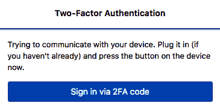
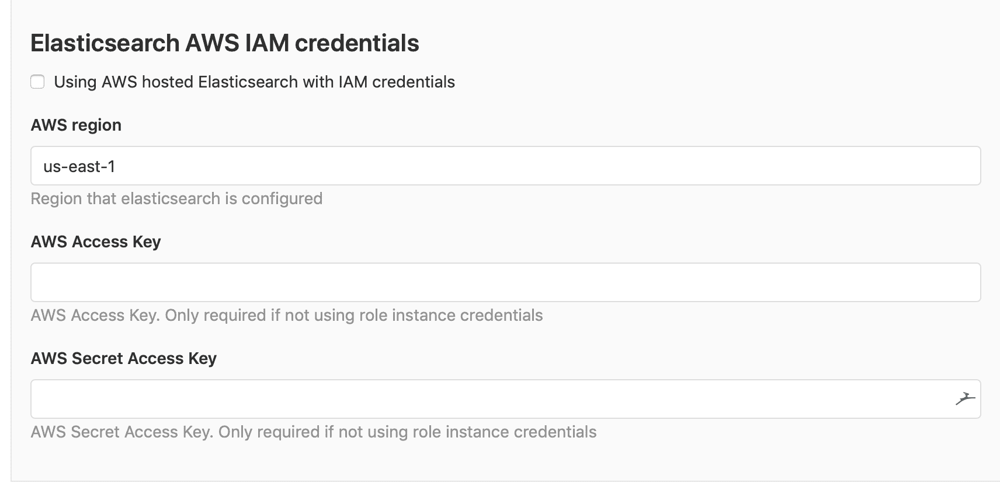
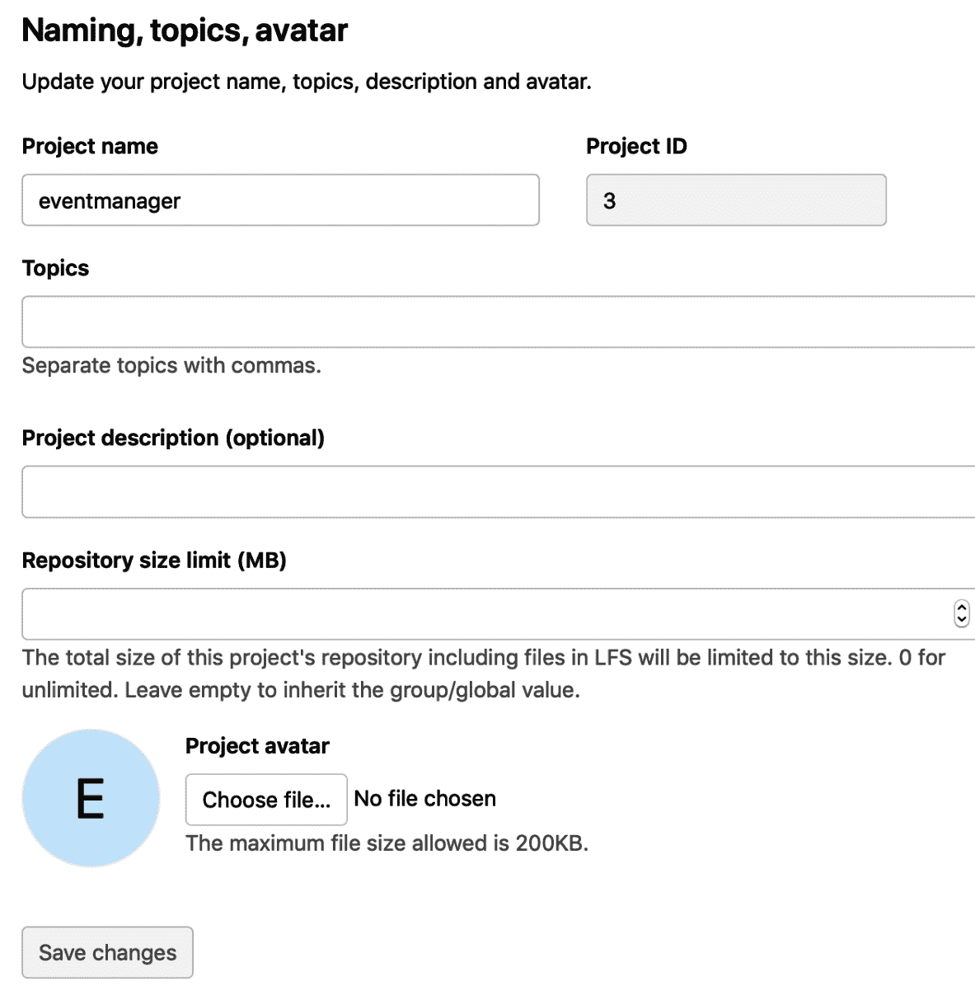

# 使用 Web UI 配置 GitLab

在上一章安装 GitLab 后，你可能已经有了一个运行中的实例。那么，如何管理它呢？你需要了解如何配置软件。本章将解释如何在不同类型的 GitLab 安装中进行配置。

本章将涵盖以下主题：

+   配置 GitLab 实例级别的设置

+   配置 GitLab 组级别的设置

+   配置 GitLab 项目级别的设置

# 技术要求

若要管理 omnibus 安装，你需要使用一个名为 `gitlab.rb` 的中央配置文件。你需要自己创建该文件或复制一个示例配置文件。此配置文件的模板可以在[`gitlab.com/gitlab-org/omnibus-gitlab/blob/master/files/gitlab-config-template/gitlab.rb.template`](https://gitlab.com/gitlab-org/omnibus-gitlab/blob/master/files/gitlab-config-template/gitlab.rb.template)找到。请注意，它在升级后不会自动更新。我们将在本章引用并讨论该文件的部分内容。

为了跟随本章的说明，请下载本书的 GitHub 仓库，并获取其中的示例，下载链接：[`github.com/PacktPublishing/Mastering-GitLab-12/tree/master/Chapter03`](https://github.com/PacktPublishing/Mastering-GitLab-12/tree/master/Chapter03)。

# 配置 GitLab 实例级别的设置

当你以管理员身份登录 GitLab 时，你会在菜单的右上方看到一个工具图标：

当你点击时，管理员页面将加载，你可以在此访问实例级别的设置。基本页面提供了活动项目、用户和组的概览：

在左侧，有几个全局管理选项。我们来逐一了解它们。

# 菜单选项

选项是分组的，有些项目甚至可以展开：

+   **仪表盘**：仪表盘可以让你了解 GitLab 实例中的项目、用户和组的数量。你还可以在此界面创建新的项目、用户或组。仪表盘还显示了其他有趣的统计信息，让你概览当前活动的功能和已安装的组件。如果你启用了 GitLab 实例信息的暴露，它还会提示你是否需要将实例升级到 GitLab 的新版本。

+   **项目**：在项目面板中，你可以搜索项目并创建新项目。对于搜索选项，提供了一些可用的过滤器。

+   **用户**：用户面板提供与项目面板相同的功能，即可以通过高级筛选搜索用户并创建新用户。

+   **组**：组面板在功能上与之前的面板相同，但没有复杂的过滤器。

+   **作业**：作业面板提供了有关**持续集成/持续部署**（**CI/CD**）作业的信息，这些作业可能是待处理的、正在运行的或已完成的。

+   **运行器**：在此管理页面的这一部分，可以查看有关 CI/CD GitLab 运行器的选项和视图。

+   **Gitaly 服务器**：默认情况下，只有一个 Gitaly 服务器，并且会在此显示。然而，根据你的设置，可能会有更多服务器。

# 监控

监控部分提供了管理 GitLab 实例所需的有趣信息。

+   **系统信息**：CPU、内存及其他指标。

+   **后台作业**：GitLab 将 Sidekiq 统计信息 gem 集成到应用程序中，可以在此查看。

+   **日志**：在此部分，你可以查看来自最重要的 GitLab 日志文件（如 unicorn、gitlab-shell、Sidekiq 等）的 2,000 行信息。

+   **健康检查**：这是系统管理员非常感兴趣的页面。在这里，你将找到一些端点，可以提供有关正在运行的 GitLab 实例健康状况的洞察。此处还存在一个令牌，如果你的监控软件希望抓取该页面，它需要将令牌作为参数发送。

+   **请求配置文件**：这对于开发人员或测试人员来说很有趣。在这里，你可以向 GitLab 发送请求头，以便进行请求分析。

+   **审计日志**：如果你拥有企业许可证，可以在这里找到审计事件并进行筛选。

# 消息

你的 GitLab 实例具有一个功能，允许你向所有用户发送消息。如果你想通知用户有关系统范围的事件，如升级和计划停机，这些广播会很有用。以下是管理员页面，你可以在侧边菜单中找到：

在你安排了新消息后，它也可以在以后重新使用：

# 系统钩子

GitLab 可以在系统级别执行 HTTP POST 请求并对多个事件进行处理。

当你创建新项目或用户时，会触发一个标准事件。此外，它也可以发送其他类型的事件。只需添加目标 URL 和（可选的）密钥令牌：

当你配置好系统钩子后，页面会有一个下拉列表，可以通过调用 URL 来测试其是否工作。

# 插件

在此页面上，你还可以配置已安装的**插件**。这基本上是触发本地安装的程序，而不是调用带参数的 URL。

它要求你将插件代码放置在 `/opt/gitlab/embedded/service/gitlab-rails/plugins` 中，并且必须以特定方式编写。安装后，插件可以作为钩子运行。

# 应用程序

在此管理页面的这一部分，你可以注册第三方应用程序，以便使用 GitLab 作为 OAuth 授权提供者。

**开放授权**（**OAuth**）是一种开放的授权标准。用户可以允许程序或网站访问他们存储在其他网站上的私人数据，而无需透露用户名和密码。

要注册应用，你需要提供一个名称、回调 URL，并设置一些选项。

受信任意味着基于已验证的资源拥有者凭证交换令牌。随后，在使用该应用时，用户授权步骤将被跳过。

还有一些其他范围被定义，允许特定应用执行各种操作。它们如下：

+   **API**：授予对 API 的完全读写权限，包括所有组和项目。

+   `read_user`：授予通过 `/user` API 端点对经过身份验证的用户的个人资料的只读访问权限，其中包括用户名、公共电子邮件和全名。还授予对 `/users` 下只读 API 端点的访问权限。

+   `sudo`：当以管理员身份进行身份验证时，授予执行 API 操作的权限，可以作为系统中的任何用户执行操作。

+   `read_repository`：授予通过 HTTP 使用 Git（而非使用 API）对私有项目中的存储库的只读访问权限。

+   `openid`：授予使用 OpenID Connect 进行 GitLab 身份验证的权限。它还授予对用户个人资料和组成员身份的只读访问权限。

如果需要，你也可以撤销注册。GitLab 使用 **doorkeeper-gem**，可以在 [`github.com/doorkeeper-gem/doorkeeper`](https://github.com/doorkeeper-gem/doorkeeper) 找到，以提供此功能。

# 滥用报告

在 GitLab 网页界面的多个地方，作为用户，你可以举报和报告滥用行为。你可以在以下部分找到举报按钮：

+   评论

+   问题和合并请求

+   用户的个人资料页面（参见以下截图）：

当你点击举报滥用按钮时，以下表单将出现：

如果你点击发送报告按钮，管理员将收到通知，他或她将在管理页面的滥用报告部分找到该报告：

# 许可证

如果你正在使用 GitLab 企业版，这是你管理许可证的地方。你可以上传文件或插入适当的许可证密钥。你还可以浏览 GitLab 购买新的许可证。

# Kubernetes

在此部分，你可以添加一个实例范围的 Kubernetes 集群，用于创建部署环境。我们将在第十一章中讨论此选项，*发布和配置阶段*。

# 推送规则

在此部分，你可以定义各种规则，允许或禁止 Git 推送：

# Geo

如果你拥有企业许可证并且想配置 GitLab 实例的副本，这就是你需要使用的地方。我们将在第二十二章《*使用 Geo 创建 GitLab 的分布式只读副本*》中讨论 Geo。

# 部署密钥

在这一部分，你可以注册 SSH 密钥，这些密钥被称为**全局共享部署密钥**。它们允许在整个 GitLab 安装中的任何仓库上配置只读或读写（如果启用）访问权限。当管理员在此处注册它们时，你可以在你的项目中分配它们，如下图所示：

这个功能可以被远程 CI/CD 服务器用来检出代码。

# 服务模板

项目服务允许你将 GitLab 与其他第三方应用程序集成。它们类似于你在其他系统中找到的插件。它们在将功能添加到 GitLab 时提供了很大的灵活性。在服务模板部分，你可以编辑预定义模板的信息。然后，仓库所有者在启用服务集成时需要配置更少的信息。

# 外观

你可以在外观设置页面定义一些 GitLab 实例的外观设置：

例如，如果你想在首页向用户展示一个漂亮的标志，你可以通过上传新标志来更改它。你可以通过点击“选择文件”按钮来上传新的标志，按钮位于“标志”部分附近。完成后，登出并重新登录，你将被重定向到首页：

# 设置

本节包含很多详细选项，我们将在这里逐一讨论。

# 一般

该部分管理面板处理的是那些不容易归入某个群组的设置。

# 可见性和访问控制

在这里，你可以定义用户的默认授权和权限。有三个基本选项。例如，你可以将项目设为私密，这意味着只有你或你授权的人可以看到你创建的新项目。内部级别意味着只有登录用户才能看到你的项目（只读）。公开是访问级别中最广泛的，允许任何人看到你的项目（但不能对其进行写操作）。相同的授权也可以设置用于代码片段和群组。你还可以确定可以导入哪些源。

有很多导入模块可供选择，但也许你希望限制这些模块。另一个导入选项是允许项目导出。有几个功能可以帮助用户实现这一点。如果这不是你想要支持的功能，你可以在这里禁用它。GitLab 支持两种 Git 客户端访问协议（SSH 和 HTTP）。如果你愿意，你也可以在这一部分禁用它们。最后，你可以控制哪些类型的 SSH 密钥可以用于 Git SSH。如果 RSA 太不安全，直接禁用它。

# 帐户与限制

在此部分，您可以设置会话过期时间（默认为 20 分钟）、项目限制和最大附件大小。默认项目限制设置为 100,000，而存储库的最大大小默认没有设置。附件大小为 10MB。您还可以启用 Gravatars 功能，这意味着上传到 `gravatar.com` 的图像可以作为您的个人图标。GitLab 可以充当 OAuth 后端，并且您可以允许普通用户通过它注册新应用。

您还可以配置新用户的处理方式。可以将他们定义为外部用户。这意味着新用户只能访问他们被授权访问的特定项目，不能创建新项目。可选地，您可以通过正则表达式为该规则定义例外。最后一个选项是启用提示，以便让用户知道他们尚未上传公共 SSH 密钥。

# 差异限制

在此部分，您可以设置差异补丁的最大大小，超出该大小将无法在正常的差异视图中显示。如果达到此大小，将显示指向 blob 视图的链接。

# 注册限制

在默认安装中，GitLab 登录页面上提供了一个表单，供没有帐户的用户注册。您可以在此处禁用注册页面，并编辑白名单和黑名单，提前拒绝某些域的访问。您还可以指定是否在注册程序后发送电子邮件。

注册完成后，将向用户显示一些文本。

# 登录限制

这些设置涵盖了以下限制：

+   启用或禁用使用密码登录 Web 界面（如果没有密码，则需要使用如 Google 等第三方认证提供者）

+   启用或禁用 Git 通过 HTTPS 的密码验证（如果没有启用，则需要使用个人访问令牌）

+   启用或禁用两步验证（包括一个宽限期，用于确定用户在配置过程中可以等待的时间）

可以使用硬件令牌设备作为第二因素，如下图所示（此功能仅在 Chrome 中有效）：

您还可以选择使用代码生成器应用程序，例如 Google 身份验证：

您还可以在此处设置首页 URL，未登录的用户将被重定向到该页面。同样，您可以定义注销后的路径，用户注销后将被引导到该路径。

最后，您还可以设置一个标准的登录文本，以便在登录页面上显示。

# 服务条款和隐私政策

如果您为一个使用严格条款的组织使用 GitLab，您可以确保用户接受您在此处输入的政策，这将以漂亮的 Markdown 格式呈现。

# 外部认证

对于某些安装，可能至关重要的是让外部系统对 GitLab 中的访问政策产生更大影响。为此，你可以指定一个外部授权服务来检查用户的信息和分配给项目的分类标签。基于该查询，可能会或不会授予访问权限。如果启用此功能，所有使用跨项目数据的页面将不再工作（例如片段和活动）。

# Web 终端

这是一个近期的功能，你可以通过 Web 浏览器访问终端（作为管道的一部分）。在这里，你可以为此终端会话设置超时时间。将其设置为零意味着会话将无限期进行。

# Web IDE

**Web IDE** 是一个全新的功能，仍在全面开发中。这本书实际上就是在它上面编写的，而且它的表现优于大多数 Web 编辑器。你可以从设置页面控制的主要选项是功能切换，它允许客户端 JavaScript 项目使用 CodeSandbox 启用实时预览功能。

获取更多有关项目访问的信息，请访问：[`codesandbox.io`](https://codesandbox.io)。

# 集成

推动 GitLab 作为产品发展的方式之一是提供多种与其他产品集成的方法。这也与 Unix 和开源哲学一致，即创建小而可互操作的工具。从技术层面来说，完成这一点有三种方法：

+   使用 Webhooks（事件机制、异步等。欲了解更多信息，请访问：[`gitlab.com/gitlab-org/gitlab-ce/blob/master/doc/web_hooks/web_hooks.md`](https://gitlab.com/gitlab-org/gitlab-ce/blob/master/doc/web_hooks/web_hooks.md)）。

+   使用 GitLab API（主动从 GitLab 获取信息）。

+   使用项目集成（从 GitLab 中的仓库运行）。在设置中，有四个可选项：Elasticsearch、PlantUML、Snowplow 和查看第三方服务的能力。

# Elasticsearch

仅在企业版中提供的此搜索引擎集成功能非常强大，但它是一个独立的话题。它为 GitLab 提供了全文搜索选项，让你能够在源代码库中搜索文本。你需要安装搜索程序，该程序在另一台服务器上提供 HTTP Web 接口，并指定连接设置（URL）：

你还可以限制将被索引的内容：

另一个选项是连接到你在 Amazon 云中运行的 Elasticsearch 实例。如果你已设置，可以在此指定连接设置：

你可以在此查看更多信息：[`elastic.co`](http://elastic.co)。

# PlantUML

在这里，你可以定义 PlantUML 的 URL（这是一个 API 集成）。

# 第三方服务

此设置使您可以选择退出第三方提供的服务。这种提供的一个例子是获取免费的 Google Cloud 积分，以便您可以使用 Google 的 Kubernetes 平台。

# Snowplow

再次，Snowplow 是企业功能。一些公司希望在 GitLab 中跟踪自定义事件。使用 Snowplow，您可以使用这个大数据平台来收集和分析数据。如果启用此集成，必须提供收集器 URI、站点 ID 和 Cookie 域。

# 存储库

在这里，您将找到适用于所有存储库的通用选项。

# 存储库镜像

使用 GitLab，您可以创建存储库镜像。这意味着，在初始同步之后，内容（以及可能的元数据）会与远程源保持更新。同步作业将自动触发，并在 15 分钟后超时。此设置确定用户是否可以设置镜像。如果禁用，只有管理员可以执行此任务。

# 存储库存储

最重要的设置处理存储使用的方式。不使用名称的文件夹结构，可以使用散列值作为项目目录名称。这样，在移动项目时，文件夹不会在操作系统级别上移动 - 而是在数据库中改变对散列的引用。保持基于散列的引用树和搜索比通过名称遍历文件夹树快得多。

其次，您可以指定新项目存储的替代位置。如果有多个位置，它们将以没有特定顺序的方式轮换。显示在选择器中的位置取决于在`gitlab.rb`（适用于独立包安装）或`gitlab.yml`（基于源的安装）中定义的存储路径。

这里也可以找到存储电路断路器的设置。这用于处理 GitLab 使用的底层存储的故障。当使用网络文件系统如**Network File System**（**NFS**）时，可能会出现锁定问题，最终使整个系统无限期地挂起。

# 存储库维护

Git 具有称为**fsck**的特殊完整性检查功能。就像文件系统一致性检查（**fsck**）用于文件系统一样，它可以验证结构并告诉我们是否受到威胁。选择 Git 函数的名称是因为 Git 最初是作为文件系统构建的。文件系统被分类为图模型，Git 将其实现为树和 blob 对象。由于所有项目都有校验和，fsck 可以验证对象及其关系的完整性。此图在以下图表中描述：

仓库中文件之间的变化会被保存为增量，并打包成 pack 文件，然后进行压缩。这同样适用于仓库层次结构中的其他对象。简而言之，这意味着图形模型已经增强，使得 Git 操作在您的计算机上更快、更高效，并节省磁盘空间。有时，在执行`commit --amend`或`git rebase`之后，像提交这样的对象变得无法访问（没有父 SHA）。所有前述的使用场景都可以成为 Git 垃圾回收功能的候选项：`git gc`（[`git-scm.com/docs/git-gc`](https://git-scm.com/docs/git-gc)）。建议定期对您的 Git 仓库运行此功能。

在 GitLab 设置中，您可以控制 Git 在 GitLab 服务器上使用的两种方式，以维护仓库层次结构。第一个选项是，您可以启用周期性的仓库检查，使用`git fsck`。让 GitLab 执行此操作可确保您能够发现并可能修复那些通常难以发现的磁盘损坏问题，尤其是当您处理所有文件时。

GitLab 还可以执行清理工作。它应该定期运行，以防止仓库损坏。不幸的是，它有时也会产生误报。

第二个选项是，您可以控制服务器上清理工作（housekeeping）的方式，以提高 Git 仓库的效率和速度。您可以启用并控制何时在 GitLab 服务器上执行`git gc`。另一个用于`git pack`操作的选项是允许它们使用位图索引。这可能会导致克隆速度更快（但会占用更多磁盘空间）。清理工作参数包括在执行`git repack`（增量）、`git repack`（完整）和`git gc`之前，仓库被推送的次数。

# 模板

从 GitLab 11.x 开始，您可以定义一个特殊目录，为 GitLab 提供模板。您也可以创建您自己的模板。

自定义项目模板设置允许您指定哪个组是默认组，以便您可以提供模板。

# CI/CD

本页包含使用 GitLab 进行**持续集成**（**CI**）和**持续部署**（**CD**）的若干配置选项。

# Auto DevOps 设置

从 GitLab 11.3 开始，Auto DevOps 会自动为所有项目启用。当项目的构建过程被触发并创建了管道时，如果管道失败，Auto DevOps 功能将会被禁用。如果项目中存在替代的 `.gitlab-ci.yml` 文件，则会使用该文件。您可以在此处覆盖默认的 Auto DevOps 设置并禁用它们：

# 共享 Runner 设置

CI/CD 的关键组成部分之一是 runners。在这一部分，你可以为所有新项目启用共享 runners，这意味着任何共享 runner 都有可能构建你的代码。这其中有安全方面的考虑，因为某些共享 runner 可能没有使用无状态机制。它们可能在运行你的任务时，不清理生成的工件，导致新构建任务的产生。这可能不是你想要的结果，你的数据有可能会被其他构建项目所泄露。

因此，另一个选项是为共享 runners 设置一些警告文本，以便你确保共享 runners 处于可控状态：

当 runners 构建工件时，结果可以在管道完成后上传并查看。你可能希望为上传到 GitLab CI 的 ZIP 文件设定一个合并工件的大小限制。

你还可以指定构建后工件保持可用的时间。这由默认的工件过期时间控制：

当一个工件达到这个过期时间时，它会在定期的过期任务中被删除。正如我们在下面的截图中看到的，它每小时运行一次：

# 容器注册表

GitLab 还可以作为容器注册表使用。这里的意思是，它可以存储你在工作站上创建的镜像，或者在 GitLab runner 管道中创建的镜像。在管理员区域的这一部分，你可以指定授权令牌的有效期。默认情况下是五分钟。

# 报告

大多数人都能轻松识别或解释“报告”这个术语。我个人不理解为什么 GitLab 会将某些选项归类到这个主题下。在我看来，第一个选项，即垃圾邮件和反机器人保护，应该属于设置中的安全或隐私部分。

# 垃圾邮件和反机器人保护

GitLab 能够使用 reCAPTCHA 和 Akismet 来处理滥用流量。如果启用此设置，你需要一个站点密钥和一个私密密钥，这两个密钥可以在 [`www.google.com/recaptcha`](http://www.google.com/recaptcha) 上生成。通过这种方式，你为防止垃圾邮件发送者自动创建用户设置了另一道防线。如果你注册，你必须通过回答特定问题来证明你是一个人类用户[.](http://www.google.com/recaptcha)

类似地，Akismet 可以帮助你保护 GitLab 中的 Issues，避免被垃圾邮件攻击。随着博客和评论功能的出现，涌现出一种新的垃圾邮件技术，称为评论垃圾邮件。垃圾邮件发送者试图通过大量的评论来影响读者。Akismet 被设立为一种额外的检查（GitLab 称之为 API），以防止自动化评论（GitLab 中的 Issues）。

作为额外的安全措施，你可以选择限制来自多个 IP 地址的同时登录。你甚至可以通过设置 IP 过期时间来限制用户可以连接的最大 IP 数量。

# 滥用报告

在这里，您可以设置接收滥用报告的电子邮件地址。GitLab 的各个部分都可以创建滥用报告。

# 错误报告和日志记录

一般来说，GitLab 运行的所有服务都有许多日志文件。在此部分，您可以为客户端（也称为浏览器）指定日志记录和报告。GitLab 前端的 JavaScript 应用程序运行在您的浏览器中，并可以选择使用 Sentry ([`sentry.io/welcome/`](https://sentry.io/welcome/))。通过使用它，您可以监控并主动捕捉用户的错误并采取相应的措施。

# 指标和配置分析

GitLab 系统的管理员或所有者通常希望了解他们系统的性能——不仅仅是操作系统级别，还包括功能方面。例如，了解某些操作完成所需的时间非常重要。这些指标在 GitLab 中是可以获得的，但您需要进行一些配置才能使这些数据可用。有多种方式可以从 GitLab 获取这些数据，在此您可以指定信息来源的详细信息。

# 指标 – InfluxDB

第一个可以作为指标后端存储的系统是 InfluxDB。这是一种特殊的数据库，专门用于存储时间序列数据。在您可以使用此功能之前，您需要在单独的服务器上设置此数据库。由于其负载较重，无法在同一台 GitLab 机器上运行。有关如何配置的说明，请参见[`docs.gitlab.com/ee/administration/monitoring/performance/influxdb_configuration.html`](https://docs.gitlab.com/ee/administration/monitoring/performance/influxdb_configuration.html)。启用 InfluxDB 指标时，它会设置一个**用户数据报协议** (**UDP)**流向 InfluxDB 主机，传输各种事件信息。您可以微调连接池大小、连接超时时间等，以确保不会生成过多的数据。更改此设置后，您需要重新启动。

# 指标 – Prometheus

自 2018 年起，GitLab 的首选时间序列数据库是 Prometheus。您可以在这里启用 GitLab 的抓取端点。更改后，您需要重新启动 GitLab。Prometheus 服务器已经捆绑在`omnibus-gitlab`中。

# 配置分析 – 性能条

有时，您可能希望了解 GitLab 在浏览器中运行时的性能，或者您想查看 GitLab 请求的哪个部分最耗时。进入`配置分析-性能条`，您可以为特定的组启用该功能。启用性能条后，您需要按下*P* + *B* 键盘快捷键以实际显示它：

# 使用统计信息

在此设置部分，您可以启用或禁用 GitLab 默认收集的两组信息。您还可以选择仅让实例管理员查看这些信息。这些信息类型如下：

+   版本检查（当有新版本可用时，您将在概述中看到“尽快更新”）

+   使用情况 ping（用于改进 GitLab 及其用户体验）

+   可以将数据共享给公众或仅限管理员

+   勾选预览负载按钮以查看此 ping 中共享的其他数据

# 假名化数据收集

启用后，此选项将确保 GitLab 将匿名化的信息写入逗号分隔值文件。此文件随后会上传到您在配置文件中指定的 S3 存储桶（`gitlab.rb`用于 omnibus-gitlab 安装，`gitlab.yml`用于基于源的安装）。

# 网络

在此部分，您可以控制一些影响网络性能和通信的选项。

# 性能优化

在这里，您可以禁用写入授权密钥文件，并让 GitLab 直接从数据库读取授权密钥，而不是通过文件读取。这有助于加速 Git SSH 的授权阶段。

# 用户和 IP 速率限制

在这里，您可以对 Web 和 API 请求进行流量控制。您还可以选择区分身份验证请求和匿名请求。

# 外发请求

默认情况下，系统中创建的 webhooks 不允许超出本地 IP 子网。通过此选项，您可以允许 webhooks 外发。

# Geo

在此部分，您可以设置一些 Geo 偏好设置，例如与二级实例的通信超时后认为连接丢失的时间。另一个可用的设置允许您列出可以连接并假装是二级实例的 IP 和网络。

# 偏好设置

这些设置是通用的，与不同的主题相关。

# 邮件

在电子邮件部分，您可以使电子邮件直接来自创建问题或合并请求的发起者。您还可以控制的第二个选项是 GitLab 是否以 HTML 格式发送电子邮件。

# 帮助页面

您还可以自定义 GitLab 帮助页面的展示方式。您可以选择提供一些自定义文本，这些文本将在帮助页面的顶部显示：

以下是标准帮助页面的截图：

让我们通过添加`This is a help page.`来进行一些更改：

结果如下：

# 页面

如果您使用 GitLab Pages 功能，您可以指定页面的最大大小。如果您希望页面大小无限制，可以将其设置为零。您还可以允许用户在您为其提供页面之前证明他们拥有该域名：

# 实时功能

GitLab Web 界面提供了轮询实时事件的选项，就像您在合并请求上按下合并按钮时一样。您可以在这里设置一个乘数，以便使轮询更少（或更多，具体取决于您的需求）。

# Gitaly

关于 Gitaly，你可以在这里控制一些时限。如果 Gitaly 运行缓慢，你会希望它对某些请求设置超时，因为否则操作可能会导致整个 GitLab 实例崩溃。由于 Gitaly 是与仓库的接口，可以把它想象成文件系统或节点没有响应。发生锁定或网络问题阻止数据传输时，可能会发生非常严重的情况。最好知道何时“切断”连接。

# 本地化

这是设置中一个很大的部分，因为软件产品有许多本地化设置。此屏幕中唯一显示的设置是“每周的默认第一天”：

这取决于你的地理位置。

# 配置 GitLab 组级别设置

管理员区域只对具有管理员角色的用户开放，但其他角色也可以配置设置。如果你作为用户被授予了*添加组*的权限，你就可以更改自己创建的组的设置。如果你从顶级菜单进入“你的组”，你可以从左侧菜单访问设置。

在这里，你会看到一个子菜单，里面列出了可以配置的项目。它看起来和管理员区域的 UI 非常相似，但当然，它仅限于当前的组：

在 GitLab 12.0 中，群组设置的“常规”面板新增了一个有趣的功能：按 IP 地址限制访问。这个功能是企业版的，通过它，你可以确保某些 IP 地址无法访问组的内容。在下方的截图中，你可以看到`192.168.1.0/24`是唯一允许查看该组内容的 IP 地址范围：

例如，你不希望从 VPN 下载软件。

# 配置 GitLab 项目级别设置

在前面的部分，我们看到可以在管理员区域和组级别调整设置。还可以为单个项目设置选项。如果你浏览到某个项目，你会在左侧看到一个“设置”菜单：

# 常规

“常规”菜单提供了一些在其他地方找不到的特定设置。让我们来看看其中最重要的设置。

# 命名、主题、头像

在“常规”设置下，你可以找到

# 可见性、项目功能、权限

这些设置中非常重要的一部分是“可见性、项目功能、权限”部分。你可以启用或禁用某些功能，并确定谁可以执行什么操作：

# 合并请求

对于单个项目，你可以定义合并请求的行为。例如，你可以定义 GitLab 如何在服务器上执行合并。对于每个执行的合并请求，服务器上会有一个 Git 会话，运行的是你工作站上相同的 Git 二进制文件。例如，你可以指定服务器端从不做合并提交：

在 GitLab 12.0 版本中，加入了合并列车的概念。如果启用此功能，所有的合并请求必须按顺序通过，而你的合并将成为这个列车的一部分。只有整个合并成功时，才能成功执行，这种用例在不同团队共同开发同一产品的企业环境中很常见。在未来的版本中，此功能将默认启用。

# 总结

在本章中，我们讨论了如何通过 Web 界面配置现有的 GitLab 应用实例。GitLab 的管理页面让你对实例有很大的控制权。在浏览完这些页面后，我们解释了可以管理的各种项目。

在下一章中，我们将通过常规终端界面（而非 Web 浏览器）来配置 GitLab。

# 问题

1.  用什么图标表示管理部分？

1.  在管理员仪表盘上突出显示的三个项目是什么？

1.  上传的 logo 图像最大大小是多少？

1.  可以配置哪种度量指标后端？

1.  哪个产品用于启用实时预览功能？

1.  哪款 UML 工具可以与 GitLab 集成？

1.  使用哪种机制防止网络存储挂起 GitLab？

1.  哪个过程可以帮助保持仓库的完整性？

1.  默认启用的是哪项 CI/CD 功能？

1.  在 GitLab Pages 中需要设置什么值才能启用无限制大小？

# 进一步阅读

+   *Kubernetes 入门 - 第三版*，作者：*Jesse White* 和 *Jonathan Baier*：[`www.packtpub.com/in/virtualization-and-cloud/getting-started-kubernetes-third-edition`](https://www.packtpub.com/in/virtualization-and-cloud/getting-started-kubernetes-third-edition)

+   *在 Kubernetes 上开发和操作微服务*，作者：*Martin Helmich*：[`www.packtpub.com/virtualization-and-cloud/develop-and-operate-microservices-kubernetes-video`](https://www.packtpub.com/virtualization-and-cloud/develop-and-operate-microservices-kubernetes-video)

+   *Docker 厨房秘籍 - 第二版*，作者：*Neependra K Khare*，*Jeeva S. Chelladhurai*，*Ken Cochrane*：[`www.packtpub.com/in/virtualization-and-cloud/docker-cookbook-second-edition`](https://www.packtpub.com/in/virtualization-and-cloud/docker-cookbook-second-edition)
