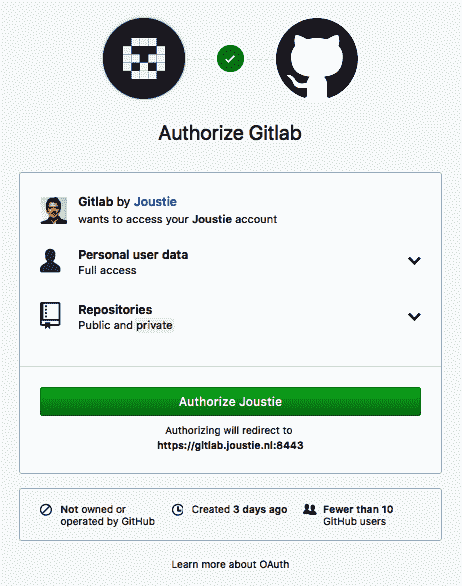

# 从 GitHub 导入项目到 GitLab

在第一部分中，我们解释了 GitLab 架构以及如何以多种方式安装和配置 GitLab。在本书的这一部分，我们将探讨从第三方迁移源项目到 GitLab 的几种方法。我们将从 GitHub 开始，它与 GitLab 非常相似，也是 GitLab 开发的灵感来源。经过多年的发展，这两个产品仍然共享相同的基本功能，但在额外功能上有所不同。有几种方法可以从 GitHub 导入项目。

在本章中，将涵盖以下内容：

+   在 GitLab 中使用 GitHub 集成功能（也称为 GitHub 导入器）

+   使用 GitHub token——为第三方应用集成在 GitHub 中创建该 token

+   使用 GitLab rake 任务——你需要访问一个可以运行 rake 任务的 GitLab 实例，并且需要拥有管理员权限

对于每种方法，我们将展示你在 GitHub 和 GitLab 中需要配置和准备的内容。最后，我们将针对每种方法执行导入操作。

# 技术要求

为了管理 omnibus 安装，你需要使用一个名为 `gitlab.rb` 的中央配置文件。你需要创建它或复制一个示例文件。幸运的是，已经提供了一个模板，你可以在 [`gitlab.com/gitlab-org/omnibus-gitlab/blob/master/files/gitlab-config-template/gitlab.rb.template`](https://gitlab.com/gitlab-org/omnibus-gitlab/blob/master/files/gitlab-config-template/gitlab.rb.template) 找到该模板。它在升级后不会更新。稍后在本章中，我将引用并讨论该文件的部分内容。

为了跟随本章的说明，请下载 GitHub 仓库以及 GitHub 仓库中的示例，下载地址为 [`github.com/PacktPublishing/Mastering-GitLab-12/tree/master/Chapter05`](https://github.com/PacktPublishing/Mastering-GitLab-12/tree/master/Chapter05)。

你还需要一个 GitHub 账户，以及一个在云端或本地的 GitLab 账户。

关于用户匹配，你需要确保与仓库相关联的 GitHub 用户具备以下条件：

+   一个使用 OAuth 登录的 GitLab 账户，可以通过 GitHub 图标进行登录

+   一个 GitLab 账户，其电子邮件地址与 GitHub 中的公开电子邮件地址相同

# 使用 GitHub 集成功能

要从 GitHub 导出内容，必须设置适当的授权。这可以通过使用 GitHub 集成和 OAuth 注册来完成，GitLab 会与 GitHub 进行身份验证，以便访问用户的项目列表。

将 GitHub 上的作者和任务分配人映射到 GitLab 上的最佳效果，是使用 GitLab 中提供的 GitHub 集成功能，而不是仅使用 GitHub 的个人访问 token。

此集成涵盖了我们刚刚提到的所有导入项，并尽力保持所有引用的完整性。例如，导入程序将尝试查找 GitHub 问题和拉取请求的作者和受指派者。这意味着必须在您的 GitLab 实例中启用 GitLab 集成功能。

# 准备 GitHub 进行导出

要将 GitLab 注册为可以连接到 GitHub 的应用程序，您需要登录到 GitHub 帐户。为此，请访问[`github.com/settings/applications`](https://github.com/settings/applications)并将 GitLab 注册为 OAuth 应用程序：


使用以下数据填写表格：

+   应用名称（您的应用程序名称）

+   首页 URL（应用程序的完整 URL）

+   应用描述（一般描述）

+   授权回调 URL（最重要的设置，认证后发送的 URL）：


注册成功后，会显示一个概览，包含两个非常重要的信息：客户端 ID 和客户端密钥，以及有多少用户通过 OAuth 链接连接了 GitHub 仓库。稍后您将需要这些客户端 ID 和客户端密钥来配置 GitLab 进行集成。

注册成功后，将出现以下屏幕：


现在，您已经配置了 GitHub，可以继续进行*准备 GitLab 导入*部分。

# 准备 GitLab 进行导入

为了完成 GitHub 集成的设置，我们需要配置 GitLab 实例，以便我们可以将其作为注册的 OAuth 应用程序连接到 GitHub。我们通过将`omniauth_provider`添加到 GitLab 配置来实现此操作。还记得客户端 ID 和客户端密钥吗？我们将在这里用到它们。

对于 GitLab omnibus 安装，我们需要在`/etc/gitlab/gitlab.rb`中创建如下的部分。`app_id`是客户端 ID，而`app_secret`是客户端密钥。提供的名称不重要。保存文件后，您需要使用`gitlab-ctl reconfigure`：

```
gitlab_rails['omniauth_providers'] = [
     {
       "name" => "github",
       "app_id" => "dd1c6d6aed110b2cce8e",
       "app_secret" => "f6ddd6059c694ecfc1a96f962fa20b6c3f7c8c4a",
       "args" => { "scope" => "user:email" }
     }
   ]
```

对于 GitHub Enterprise，您还可以指定您的 GitHub 实例的 URL：

```
"url" => "https://github.example.com/",
```

对于源代码安装的 GitLab，我们编辑`config.yml`文件，如下所示，并在保存后重新启动 GitLab：

```
- { name: 'github',
       app_id: 'dd1c6d6aed110b2cce8e',
       app_secret: 'f6ddd6059c694ecfc1a96f962fa20b6c3f7c8c4a',
       url: "https://github.com/",
       verify_ssl: true,
       args: { scope: 'user:email' } }
```

请参阅[`github.com/gitlabhq/omnibus-gitlab/blob/master/files/gitlab-config-template/gitlab.rb.template`](https://github.com/gitlabhq/omnibus-gitlab/blob/master/files/gitlab-config-template/gitlab.rb.template)获取更多有关在`gitlab.rb`文件中可以设置的配置项的信息。还可以查看第二章，*安装 GitLab*，了解更多相关内容。

# 执行导入

按照以下步骤学习如何运行导入：

1.  在 GitLab 中，选择创建一个新项目，并使用导入项目标签找到 GitHub 图标：


1.  点击 GitHub 图标后，您将看到一个页面，在该页面上可以点击列出您的 GitHub 仓库：


1.  启用 GitHub 集成后，下一步将是授权 GitLab 访问您的项目：



1.  如果授权成功，将显示可迁移的项目列表。选择要迁移的项目并点击“导入”：


确保在您的命名空间中没有已经存在同名的项目，否则您将收到 422 错误，如下图所示：


导入完成后，您将收到一条消息：


项目已成功导入！

# 使用 GitHub 令牌

当使用 GitHub 令牌进行导入时，在 GitLab 中无需进行特殊配置——您可以立即输入，正如稍后所看到的那样。

# 准备 GitHub 进行导出

个人令牌可以作为您 GitHub 账户的委托授权。让我们开始：

1.  您可以通过[`github.com/settings/tokens`](https://github.com/settings/tokens)创建一个：


1.  确保设置有意义的令牌描述，并只选择仓库作用域。我们希望 GitLab 导入器访问以下对象：


1.  令牌创建后，请务必将令牌记录在某个地方，因为它将不会再次显示，丢失令牌意味着您需要重新创建它：


现在，您拥有一个 GitHub 令牌，可以选择在 GitLab 网页界面中直接使用它。

# 运行导入

让我们开始并学习如何准备 GitLab 进行导入：

1.  在 GitLab 中，创建一个新项目，并使用导入标签找到 GitHub 图标，如下图所示：


1.  如果禁用了 GitHub 集成，下一屏将不会有列出 GitHub 仓库的选项。要选择要迁移的项目，您必须输入您在[`github.com/`](https://github.com/)上创建的个人令牌：


1.  如果授权成功，将显示可迁移的项目列表。选择要迁移的项目并点击“导入”：


1.  导入完成后，您将收到一条消息：


项目已经成功使用令牌导入。

# 使用 GitLab rake 任务

为了检索和导入 GitHub 仓库，您需要一个 GitHub 个人访问令牌，正如之前演示的那样。

# 准备 GitLab 进行导入

对于使用 rake 任务导入项目，在 GitLab 中预先配置的唯一选项是：Sidekiq 资源的数量。你会发现，对于大型项目，导入所有数据可能需要相当长的时间。为了加速这个过程，可以为以下队列分配更多的 Sidekiq 工作者：

+   `github_importer`

+   `github_importer_advance_stage`

对于 GitLab Omnibus 安装，这些队列是默认 Sidekiq 进程的一部分。为 Sidekiq 提供更多线程意味着将有更多的工作者：

```
# sidekiq['concurrency'] = 25
```

查看 [`github.com/gitlabhq/omnibus-gitlab/blob/master/files/gitlab-config-template/gitlab.rb.template`](https://github.com/gitlabhq/omnibus-gitlab/blob/master/files/gitlab-config-template/gitlab.rb.template)，了解可以在 `gitlab.rb` 文件中设置的更多配置信息。此外，关于此主题，请参见 第二章，*安装 GitLab*。

# 运行导入

GitLab 的 rake 任务可以一次导入一个项目或多个项目。它是从命令行调用的，因此你需要管理员权限才能访问运行 GitLab 应用程序的机器。

当将 GitHub 仓库作为 rake 任务的第四个参数时，你可以直接导入它。

要导入一个特定的 GitHub 项目（这里命名为 `joustie/github_repo`），请执行以下操作：

+   **Omnibus 安装**：

```
sudo gitlab-rake "import:github[<personal_access_token>,<gitlab user>,<namespace/project>,<source_namespace/github_repo>]"
```

+   **从源代码安装**：

```
bundle exec rake "import:github[<personal_access_token>,<gitlab user>,<namespace/project>,<source_namespace/github_repo>]" RAILS_ENV=production
```

要从你可用的 GitHub 项目列表中导入一个项目，请执行以下操作：

+   **Omnibus 安装**：

```
sudo gitlab-rake "import:github[<personal_access_token>,<gitlab user>,<namespace/project>]"
```

+   **从源代码安装**：

```
bundle exec rake "import:github[<personal_access_token>,<gitlab user>,<namespace/project>]" RAILS_ENV=production
```

也可以指定子组，例如 ` <groupname/groupname/project>`。

对于我的示例项目，你将看到以下结果：


GitHub 导入器使用你的 GitHub 个人访问令牌获取项目列表。当你想指定某个特定项目时，可以使用项目 ID：


导入器之后会要求确认：


rake 任务将同步运行并执行导入操作。导入操作完成后，会提供一个时间总结：


登录到 GitLab 实例后，你将找到导入的项目。

# 总结

我们在本章开始时解释了可以从 GitHub 迁移到 GitLab 的内容和可能性。关于数据迁移有三种选择，具体可以使用哪种方式取决于你的 GitLab 实例的配置。推荐的方法是使用 GitHub 导入器。这种机制提供了最用户友好且完整的迁移路径。

GitHub 和 GitLab 非常相似，但在下一章中，我们将看看 CVS 和 Git 作为版本控制工具的对比，以及如何迁移它。

# 问题

1.  GitLab 中 pull request 的等价物是什么？

1.  将 GitHub 项目导入 GitLab 有哪些方法？

1.  显示作者信息需要什么？

1.  用于连接到 GitHub 的认证机制是什么？

1.  连接到 GitHub 需要的那个秘密是什么？

1.  导入尽可能多的 GitHub 内容所需的 token 范围是什么？

1.  处理导入的两个队列名称是什么？

1.  在 GitLab 中可以在哪里找到 GitHub 的导入按钮？

1.  从 GitHub 导入的 rake 任务名称是什么？

1.  是否可以只导入一个特定的项目？

# 进一步阅读

+   *GitHub Essentials – 第二版*，作者：*Achilleas Pipinellis*：[`www.packtpub.com/web-development/github-essentials-second-edition`](https://www.packtpub.com/web-development/github-essentials-second-edition)
