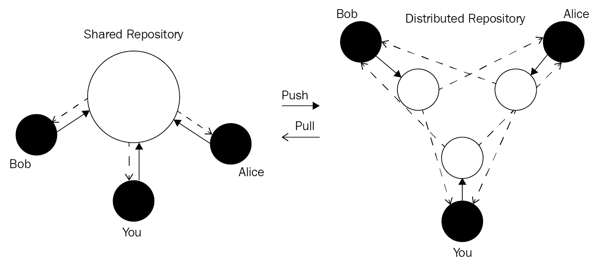
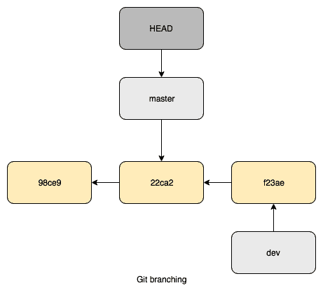
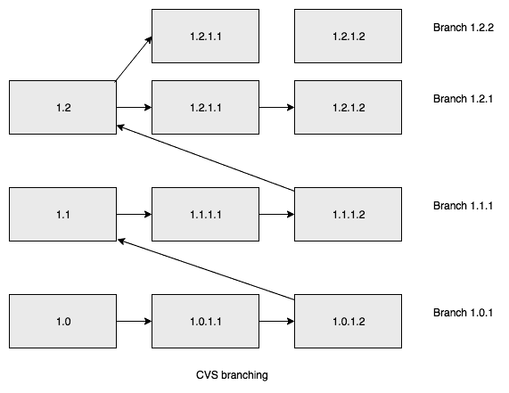

# 第六章：从 CVS 迁移

长时间以来，**并行版本控制系统**（**CVS**）是版本控制软件的标准。它本质上是一个为软件设计的客户端-服务器型版本控制系统。CVS 由阿姆斯特丹大学的 Dick Grune 于 1986 年编写，最初是一个名为**RCS**的 Shell 脚本集合。RCS 只能对单独的文件进行版本管理，因此这对版本控制系统来说是一个巨大的进步。1989 年，Brian Berliner 用 C 语言实现了一个版本，并进一步开发；它是一个开源软件，并以 GNU **通用公共许可证**（**GPL**）发布。

在 2000 年代，版本控制的重心转向了 Subversion 以及像 Git 这样的分布式版本控制软件。

在本章中，我们将对比这两种版本控制系统。之后，我们将准备并执行从 CVS 到 Git 的迁移。

本章将涵盖以下主题：

+   CVS 与 Git

+   从 CVS 迁移到 Git 的准备工作

+   执行转换

+   迁移后的清理工作

# 技术要求

为了跟随本章中的说明，请下载本书的 GitHub 仓库及示例：[`github.com/PacktPublishing/Mastering-GitLab-12/tree/master/Chapter06`](https://github.com/PacktPublishing/Mastering-GitLab-12/tree/master/Chapter06)。

为了能够跟随本章内容，其他要求如下：

+   CVS 二进制文件：[`www.nongnu.org/cvs/`](http://www.nongnu.org/cvs/)

+   npm/Node.js 二进制文件用于创建 JavaScript 示例：[`nodejs.org`](https://nodejs.org)

+   `cvs-fast-export`二进制文件：[`www.catb.org/~esr/cvs-fast-export`](http://www.catb.org/~esr/cvs-fast-export)

+   `cvs2git`二进制文件：[`www.mcs.anl.gov/~jacob/cvs2svn/cvs2git.html`](https://www.mcs.anl.gov/~jacob/cvs2svn/cvs2git.html)

# CVS 与 Git

集中化与去中心化——这是 CVS（集中式）与 Git（分布式设计）之间最大的区别。在 CVS 中，所有开发者都从一个集中式仓库拉取代码，从而形成单点故障。Git 使用去中心化模型，每个开发者都有一个完整的代码仓库本地可用。通过使用推送和拉取请求，分布式仓库之间共享代码。

以下图示展示了在共享和分布式仓库中使用推送和拉取：



使用 Git 时，在网络协议和系统设置方面有不同的选项。特别是，你可以选择通过 SSH 或 HTTP 与远程服务通信。通过使用 SSH，你可以生成 SSH 密钥并设置它们以供 Git 使用。之后，你可以使用 Git 从 SSH 位置克隆/推送或拉取代码。你还可以使用 HTTP 协议，通常需要基本的 HTTP 认证，认证后 Git 操作可以进行。一些 Git 客户端内置缓存机制，帮助你避免每次都输入 HTTP 密码。

在这种情况下，发布工作是通过将更改提交到中央代码库来完成的。CVS 使用一种特定的协议，叫做 pserver，默认情况下是未加密并以纯文本形式传输。另一种选择是使用 **远程 shell** (**rsh**) 在远程服务器上。为了提高安全性，你还可以通过 SSH 隧道传输 pserver 协议，或使用 SSH 作为 rsh 可执行文件。

CVS 系统中使用的授权模型非常简单。如果你想进行写操作，你需要提交访问权限给仓库。没有机制可以接受未授权人员的补丁。现代 Git 服务器提供的所有合并请求功能必须由提交者自己执行。因此，从开发工程的角度来看，Git 提供了更复杂的工作流，适用于多人参与的软件项目。

除了基础设施的差异外，你的本地 CVS/Git 客户端之间也有几个差异。

# 文件集与变更集

CVS 和 Git 在元层次上表示更改的方式不同。CVS 使用文件集，因此更改按文件记录。而 Git 则使用变更集，因此更改是针对 *整个* 仓库记录的。这样做的优势在于你可以轻松地恢复更改；然而，这也意味着几乎不可能进行部分检出（如果你想这么做的话）。

# Git 分支

使用 Git 时，创建新分支非常简单且成本低——它们只是指向特定提交的指针（SHA-1 ID）。你可以随时创建它们，这种方式应该是这样的，特别是在敏捷开发和多个开发人员协作的情况下。

以下图示了 Git 如何使用分支：



注意前面提到的哈希值（98ce9、22ca2 和 f23ae）——这些是唯一标识提交的 SHA 值。

CVS 也使用分支，但由于它是基于文件的，新分支会在一个新目录中复制所有文件，这样效率低得多。以下图示了这种情况：



分支和文件结构的处理方式是这两个系统之间最根本的区别之一。

# 创建代码库

使用 CVS 创建代码库时，你必须设置一个 CVSROOT 位置，用于存储版本控制数据。然后，你需要将项目导入该位置，并在其他地方创建一个工作副本。使用 Git 则更简单且更具逻辑性，因为你只需在现有目录中执行一次 `git init && git add . && git commit`，只要创建了一个包含仓库元数据的 `.git` 目录。

# 原子操作

CVS 的基本概念是，它操作的是文件，而不是快照。这意味着当更改处理并且操作被中断时，整个仓库处于不一致状态。这与 Git 不同，Git 中要么更改成功，要么在更改未完成的情况下失败。

# 对象命名或引用版本

在 Git 中，每个对象都有一个唯一的 ID，也就是一个 SHA-1 ID。这个 ID 使得将来引用变得更加方便（你也可以使用简短版本，如果你愿意）。在 CVS 中，每个文件都有自己的版本号。这个数字也反映了文件被修改的次数。在 CVS 中，要引用整个项目的更改，你需要使用标签。

# 关键字替换

CVS 支持在源代码中替换某些关键字。例如，`$Author$`、`$CVSHeader$` 和 `$Id$`。开发者们常常使用这个功能（一些开发者现在仍在使用）。要使用这个机制，你需要在文本或源文件中插入这个关键字——我们称之为一个特殊变量。然后，你会将这个文件提交到你的代码库。通过这样做，CVS 会在提交过程中将这个变量替换为 CVS 上下文中的值。很多人都会在他们的 C 源代码中使用 `$Id$` 字符串。如果你希望完全禁用这个行为，可以在命令行中指定 `-ko`。

举个例子，假设我在源文件中添加一个关键字，如下所示：

```
{
 "name": "cvsproject",
 "version": "1.0.0",
 "description": "something",
 "main": "index.js",
 "scripts": {
    "test": "echo \"Error: no test specified\" && exit 1"
 },
 "keywords": [],
 "author": "$Author$",
 "license": "ISC"
 }
```

然后，我会提交这个更改：

```
$ cvs commit -m "Added author keyword"
 cvs commit: Examining .
 cvs commit: Examining images
 /Users/joostevertse/cvsroot/cvsproject/cvsproject/package.json,v <-- package.json
 new revision: 1.3; previous revision: 1.2
```

提交后，关键字已被我的用户名替换：

```
"author": "$Author: joostevertse $",
```

Git 只支持一组非常有限的关键字，这是因为更改是按仓库进行的，而不是按文件进行的。此外，Git 避免在切换到另一个分支或回滚到另一个时间点时修改那些没有变化的文件。

# 二进制文件

Git 和 CVS 对待二进制文件的方式不同。在 CVS 中，处理二进制文件更加困难，因为你必须明确标记它们为二进制文件。如果不这样做，你可能会因为不想要的换行符转换或关键字替换而导致文件损坏。另一方面，Git 能够自动检测你的文件是否为二进制文件。它使用与 GNU diffutils 相同的机制。

让我们从源代码创建一个简单的二进制文件并添加一个保留关键字。然后，我们将使用 GCC 编译并运行它：

```
$ cat hello.c
 #include <stdio.h>
 int main()
 {
 // printf() displays the string inside quotation
 printf("Hello, World!$Author$");
 return 0;
 }

$ gcc hello.c -o hello

$ ./hello
 Hello, World!$Author$
```

所以，让我们把这个二进制文件复制到我们之前使用过的 CVS 项目中：

```
$ cp hello /Users/joostevertse/cvs/cvsproject/cvsproject/
$ cd $HOME/cvs/cvsproject/cvsproject

$ cvs add hello
 cvs add: scheduling file `hello' for addition
 cvs add: use `cvs commit' to add this file permanently

$ cvs commit -m "binary with keywords inside"
 cvs commit: Examining .
 cvs commit: Examining images
 /Users/joostevertse/cvsroot/cvsproject/cvsproject/hello,v <-- hello
 initial revision: 1.1

$ ./hello
 Segmentation fault: 11
```

发生了什么？嗯，关键字替换将作者名称添加到了二进制文件中！它把文件损坏了。如果你运行 `cat` 命令，你会在文件中找到以下内容：

```
1ɉE???H??]??%?L??AS?%q?h?????Hello, World!$Author: joostevertse $P44{4
```

幸运的是，你可以通过 `cvs admin` 修复这个问题：

```
 $ cvs admin -kb hello
 $ cvs update -A hello
 $ cvs commit -m "make it binary" hello
 $ ./hello
 Hello, World!$Author$
```

# 修改提交

Git 一个常用的特性是可以修改已提交的内容。这是可能的，因为在 Git 中，创建和发布提交是有区别的。这不会给用户带来不便，而 CVS 就会有这个问题。如果你在 Git 中提交信息写错了，你可以使用 `git commit --amend` 来修正它。虽然在 CVS 中技术上也是可能的，但实施起来会很困难：

```
 $ echo "This is the last line FOR REAL" >> README.md
 $ git log
 commit 499beb6dd81ee62e90b05ee8e9aa3ccced7a4fd2 (HEAD -> new-readme)
 Author: Joost Evertse <joustie@gmail.com>
 Date:   Thu Dec 6 21:18:32 2018 +0100

 A new line was added
```

假设我忘记在 `README.md` 文件（我仓库中的一个文本文件）中添加内容。以下代码展示了如何将其添加到最后一次提交中：

```
 $ echo "This is the last line FOR REAL" >> README.md
 $ git add README.md
 $ git commit -m "A new line was added FOR REAL" --amend
 $ git log
 commit 9c527dfe0ac2ce04b6cd1be6085bac00c7f31e6c (HEAD -> new-readme)
 Author: Joost Evertse <joustie@gmail.com>
 Date:   Thu Dec 6 21:18:32 2018 +0100

 A new line was added FOR REAL
```

这样做可以向提交中添加内容，但这只会反映在你的本地 Git 副本中。如果你想让其他人看到你的更改，仍然需要将更改推送到远程服务器。

# 中央仓库

CVS 作为一个集中式系统只有一个来源地。Git 是一个分布式版本控制系统，这意味着每个开发者都有自己的仓库副本。他们有一个私人仓库，并可以将更改推送到公共仓库，或者从其他远程仓库合并更改。在大型组织中，通常会有一个中央地方来聚合项目。使用 Git 时，不需要一个唯一的中央地方来存储更改。每个开发者都可以拥有自己的仓库（或者更好的方式是有多个仓库，即一个用于开发的私有仓库和一个用于发布已准备好的部分的公共裸仓库），并且可以以对称的方式从其他仓库拉取/获取更改。

在 Git 世界中，没有像 CVS 服务器那样的单一事实来源。可以有多个事实，并且由于如此容易从其他人那里集成更改，这种方式是可行的。

# 附带工具集

Git 提供了许多工具供你使用（例如 Git bisect），这使得工作方式更加高效。

# 检测文件重命名

CVS 不支持重命名文件，且在发生重命名时，恢复项目状态非常困难。Git 使用启发式重命名检测，分析文件内容或文件名是否相似。你也可以配置该检测，以便复制文件。

# 提交后再合并

使用本地仓库时，Git 的一个副作用是它改变了系统中提交的处理方式。使用 CVS 时，你需要先处理冲突（如果别人先修改了内容，你在拉取并更新工作目录时需要解决这些问题）。解决完这些问题后，你可以将更改提交到 CVS 仓库。这种方式叫做**合并前提交**。Git 完全不同，因为提交始终发生在本地仓库。提交前合并策略意味着你在提交后再合并更改，也可以让其他开发者合并并解决问题。如果有很多合并，区分不同提交之间的更改会变得更加困难，但为了保持线性的历史，也可以通过使用 Git 的*rebase*机制（`git pull --rebase`）模拟 CVS 行为，将更改应用到更新后的状态上。

最后的一个大区别是在人与人之间的协作方式。一些开发者只需要原始软件的只读副本，但他们需要匿名的只读访问权限。CVS 和 Git 都可以满足这一需求。如果人们想要向项目贡献某些东西，情况就不同了。使用 CVS，一种做法（例如在 Linux 内核中）是通过电子邮件发送补丁。这通常由那些只改变少量代码的人完成。而在 Git 中，实际上非常容易在现有的上游版本上执行你的更改，然后使用`git format-patch`生成一个电子邮件。对于较大的贡献，拉取请求的功能和易用性变得很重要，而这正是 Git 所设计的用途。所有这一切都发生在快照范式的背后。

# 准备从 CVS 迁移到 Git

在下一节中，我们将介绍两种可以帮助我们迁移仓库的工具。

# 使用`cvs-fast-export`准备转换

这个迁移工具是由 Eric S. Raymond 创建的，他是一个非常著名的作家/开发者，写过关于开源软件的著名文章《大教堂与集市》。他也是 fetchmail（一个早期的开源 POP3 客户端）的作者。让我们开始吧。

对于这个工具`cvs-fast-export`，我将从头开始创建一个 CVS 项目，然后进行转换。让我们开始吧：

1.  创建一个 CVS 根目录。这是 CVS 数据库将要存放的地方：

```
 $ cvs -d ~/cvsroot init
```

1.  将一些 CVS 相关的环境变量添加到你的环境中：

```
 $ echo "export CVSROOT=~/cvsroot; export CVSEDITOR=vim" >> ~/.bash_profile
 $ source ~/.bash_profile
```

1.  例如，我们将创建一个空的 JavaScript 项目并将其添加到 CVS 中。首先，创建一个项目：

```
 $ mkdir cvs
 $ cd cvs
 $ mkdir cvsproject
 $ cd cvsproject/
 imac:cvsproject joostevertse$ npm init --yes
```

1.  现在，让我们将项目添加到 CVS 中：

```
 $ cd ..
 $ cvs import -m "Example javascript project" cvsproject Joost start
 cvs import: Importing /Users/joostevertse/cvsroot/cvsproject/cvsproject
 N cvsproject/cvsproject/package.json

 No conflicts created by this import
```

1.  现在，项目已经存在于 CVSROOT 中：

```
$ ls ~/cvsroot
 CVSROOT     cvsproject
```

1.  现在，我们需要完全清除`~/cvs/cvsproject`，因为我们将把它检出为一个 CVS 工作目录：

```
$ rm -rf cvsproject/
```

1.  下一步是从 CVS 中检出项目，这将创建一个 CVS 工作副本：

```
 $ cvs checkout cvsproject
 cvs checkout: Updating cvsproject
 cvs checkout: Updating cvsproject/cvsproject
 U cvsproject/cvsproject/package.json
```

1.  查看目录会发现一个 CVS 目录结构：

```
$ tree
 .
 ├── CVS
 │   ├── Entries
 │   ├── Repository
 │   └── Root
 └── cvsproject
 ├── CVS
 │   ├── Entries
 │   ├── Repository
 │   └── Root
 └── package.json

 3 directories, 7 files
```

1.  让我们创建一个图像目录并将其添加到仓库中：

```
$ mkdir images
$ cvs add images
 Directory /Users/joostevertse/cvsroot/cvsproject/cvsproject/images added to the repository
```

1.  使用`cvs status`命令，我们可以查看哪些文件已发生更改：

```
 $ cvs status
 cvs status: Examining .
 ===================================================================
 File: package.json     Status: Locally Modified

 Working revision:   1.1.1.1 2018-12-04 23:01:21 +0100
 Repository revision: 1.1.1.1 /Users/joostevertse/cvsroot/cvsproject/cvsproject/package.json,v
 Commit Identifier:   xmczkBNhTpkbWw2B
 Sticky Tag:     (none)
 Sticky Date:     (none)
 Sticky Options: (none)

 cvs status: Examining images
```

1.  让我们将这些更改提交到我们的 CVS 仓库：

```
$ cvs commit -m "changed description"
 cvs commit: Examining .
 cvs commit: Examining images
 /Users/joostevertse/cvsroot/cvsproject/cvsproject/package.json,v <-- package.json
 new revision: 1.2; previous revision: 1.1
```

1.  使用`cvs log`命令，我们可以更详细地查看有哪些更改。

```
$ cvs log
 cvs log: Logging .

 RCS file: /Users/joostevertse/cvsroot/cvsproject/cvsproject/package.json,v
 Working file: package.json
 head: 1.2
 branch:
 locks: strict
 access list:
 symbolic names:
 start: 1.1.1.1
 Joost: 1.1.1
 keyword substitution: kv
 total revisions: 3; selected revisions: 3
...
```

现在，我们有了一个准备好迁移的 CVS 仓库，使用的是`cvs-fast-export`。

# 使用`cvs2git`准备转换

现在，让我们看一下第二个工具，`cvs2git`。对于这个转换，我使用了一个我以前用过的项目的副本（**itsmyparty**: [`github.com/Joustie/itsmyparty`](https://github.com/Joustie/itsmyparty)），如下所示：

```
 $ git clone git@gitlab.com:joustie/itsmyparty_gitlab.git
 Cloning into 'itsmyparty_gitlab'...
 imac:git joostevertse$ cd itsmyparty_gitlab
 imac:itsmyparty_gitlab joostevertse$ tree
 .
 ├── attendees.rb
 ├── attendees.yml
 ├── atttendees.yml
 ├── itsmyparty.rb
....
 1 directory, 12 files
```

然后，我将源代码导入到 CVS 仓库中（我首先删除了`.git`目录）：

```
 $ cvs import -m "dir structure" cvsexample joost start
 N cvsexample/machines.yml
 N cvsexample/itsmyparty.rb
 N cvsexample/presence.yml
 N cvsexample/atttendees.yml
.....
 No conflicts created by this import
```

如你所见，这次导入没有产生任何冲突，这很棒。我们现在已经准备好运行转换。

# 运行转换

有几种方法可以将 CVS 仓库中的数据转换成 Git 仓库。在转换仓库之后，你需要将这个新的 Git 仓库推送到 GitLab 服务器。

# 使用`cvs-fast-export`转换数据

执行以下步骤以使用`cvs-fast-export`转换数据：

1.  首先，从 Eric Raymond 的网站下载源文件：[`www.catb.org/~esr/cvs-fast-export`](http://www.catb.org/~esr/cvs-fast-export)：

```
$ wget http://www.catb.org/~esr/cvs-fast-export/cvs-fast-export-1.44.tar.gz
$ tar xvzf cvs-fast-export-1.44.tar.gz
$ cd cvs-fast-export
```

1.  然后，构建软件：

```
$ make cvs-fast-export
$ cp cvs-fast-export /usr/local/bin; chmod +x /usr/local/bin/cvs-fast-export
```

1.  进入您的`cvsroot`目录，并使用`find`命令将工具与其连接，并将结果输出到文件：

```
imac:cvs-fast-export-1.44 joostevertse$ cd $HOME/cvsroot
 imac:cvsroot joostevertse$ find . |cvs-fast-export -A ~/authormap >../cv.fi
```

1.  然后，初始化一个空的 Git 存储库：

```
$ cd $HOME/git
$ mkdir cvsproject
$ cd cvsproject
$ git init
 Initialized empty Git repository in /Users/joostevertse/git/cvsproject/.git/
```

1.  现在，是时候使用`git fast-import`将来自旧 CVS 项目的信息导入到我们空的 Git 存储库中了：

```
$ cat ../../cv.fi |git fast-import
 Unpacking objects: 100% (19/19), done.
 /usr/local/Cellar/git/2.15.1_1/libexec/git-core/git-fast-import statistics:
...
```

1.  现在，所有的元信息都已转换，剩下的唯一任务是从 Git 中检出代码：

```
$ git checkout
$ git status
 On branch master
 nothing to commit, working tree clean
$ ls
 hello           package.json
```

现在，CVS 项目已作为 Git 存储库可用。

# 使用 cvs2git 转换数据

让我们来看看如何使用`cvs2git`转换数据：

1.  第一步是将 CVS 数据结构迁移到可以通过`git fast-import`导入的格式：

```
$ ./cvs2git --blobfile=/tmp/git-blob.dat \ 
 --dumpfile=/tmp/git-dump.dat "--username=Firstname Lastname" ~/cvsroot

Writing temporary files to '/var/folders/sf/rdjwj43j4kx63xxng1gkgd040000gn/T/cvs2git-ElawtZ
...
```

1.  第一个步骤（`CollectRevsPass`）遍历了所有版本文件并分析了它们的修订。接下来的 14 个步骤将转换各种数据并进行迁移：

```
----- pass 2 (CleanMetadataPass) -----
 Converting metadata to UTF8...
 Done
...
```

1.  现在，工具将显示导入的统计信息：

```
 cvs2svn Statistics:
 ------------------
 Total CVS Files: 50
 Total CVS Revisions: 50
 Total CVS Branches: 0
.....
```

1.  下一步是创建一个骨架 Git 存储库，我们可以将转换后的数据导入其中：

```
$ mkdir itwasmyparty
$ cd itwasmyparty/
$ git init
 Initialized empty Git repository in /Users/joostevertse/git/itwasmyparty/.git/
```

1.  然后，我们开始导入，首先导入 blobs（`git-blob.dat`）：

```
$ git fast-import --export-marks=/tmp/git-marks.dat < /tmp/git-blob.dat

 Unpacking objects: 100% (48/48), done.
 git-fast-import statistics:
....
```

1.  接着，我们导入 Git 元数据（`git-dump.dat`）：

```
$ git fast-import --import-marks=/tmp/git-marks.dat < /tmp/git-dump.dat

 Unpacking objects: 100% (23/23), done.
 git-fast-import statistics:
....
```

1.  现在，我们只需检出数据：

```
$ git checkout
$ git status
 On branch master
 nothing to commit, working tree clean
```

现在，您已经有了迁移后的 CVS 存储库。

# 迁移后的清理

通常，在某种迁移之后，您需要进行清理。清理过程在这种情况下的方式取决于您的使用场景。如果这是一次性迁移，您应该将旧的 CVSROOT 打包成一个 tarball 并放入 DVD 中。您也可以选择让存储库系统共存，甚至从 Git 进行 CVS 存储库的更新。也有方法可以创建双向通信（准备好进行一些 shell 脚本编写）。

如果您已经将 CVS 存储库迁移到 Git，接下来必须做的事情是添加一个指向 GitLab 服务器的远程仓库。这将是创建拉取请求（或者在 GitLab 中称为*合并请求*）的平台。

在这里，您需要在 GitLab 服务器上创建一个空项目，然后添加远程仓库，如下所示：

```
 git remote add gitlab url-to-gitlab-repo
 git push gitlab master
```

您的旧 CVS 存储库将已经被转换并推送到您的 GitLab 服务器。

# 总结

在本章中，我们讨论了 CVS 的起源。我们以多种方式将 CVS 与 Git 进行了比较。两者之间的基本区别在于，CVS 是一个集中式版本控制系统，而 Git 则是分布式的。随后，我们设置了一个基本的 CVS 项目，并准备将其迁移到 GitLab。接着，我们制作了一个现有项目的副本，用于第二个工具。最后，我们看到了两种不同的转换方式来迁移存储库。

在下一章中，我们将看看许多人认为是 CVS 的*增强版*继任者：Subversion。它已经整合了 Git 中也存在的一些功能。

# 问题

1.  CVS 和 Git 之间最大的区别是什么？

1.  与 CVS 一起使用的网络协议叫什么？

1.  CVS 使用变更集。（正确 | 错误）

1.  Git 如何实现版本号管理？

1.  如何在 Git 中轻松修正提交信息中的错字？

1.  在 CVS 中可以重命名文件吗？

1.  初始化新 CVS 数据库的命令是什么？

1.  初始化一个新的 Git 项目的命令是什么？

1.  谁创建了`cvs-fast-export`工具？

1.  如何将迁移的代码库导入到 GitLab？

# 进一步阅读

+   `cvs-fast-export`：[`www.catb.org/~esr/cvs-fast-export`](http://www.catb.org/~esr/cvs-fast-export)

+   `cvs2git`：[`www.mcs.anl.gov/~jacob/cvs2svn/cvs2git.html`](https://www.mcs.anl.gov/~jacob/cvs2svn/cvs2git.html)

+   *Git 版本控制宝典 - 第二版* 由 *Kenneth Geisshirt*、*Emanuele Zattin*、*Rasmus Voss* 和 *Aske Olsson* 编写：[`www.packtpub.com/in/application-development/git-version-control-cookbook-second-edition`](https://www.packtpub.com/in/application-development/git-version-control-cookbook-second-edition)
