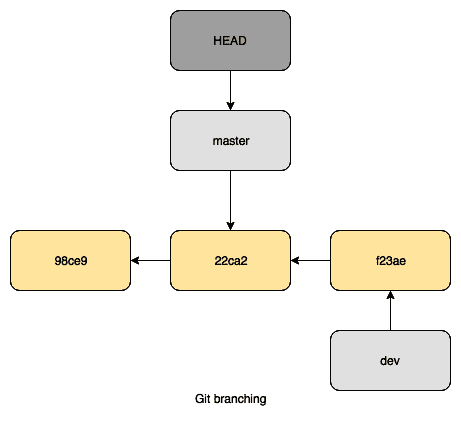

# 第七章：从 SVN 切换

CVS 的不足之处促使了其他系统的发展，其中最著名的一个就是 **Apache Subversion** (**SVN**) 。除了它带来的改进外，还特别确保了它与 CVS 的高度兼容性。它也采用了开源许可证（Apache 许可证，而非 GNU）。它由 Collabnet Inc. 于 2000 年启动，但在 2009 年转为 Apache 项目。你可以在 [`subversion.apache.org`](https://subversion.apache.org) 找到它。

在本章中，我们将覆盖以下主题：

+   SVN 和 Git 之间的区别

+   使用 GIT 镜像 SVN

+   使用 svn2git 一次性迁移

# 技术要求

为了跟随本章中的说明，请下载本书的 GitHub 仓库以及来自 [`github.com/PacktPublishing/Mastering-GitLab-12/tree/master/Chapter07`](https://github.com/PacktPublishing/Mastering-GitLab-12/tree/master/Chapter07) 的示例。

本章的其他要求如下：

+   **Git**：[`git-scm.org`](http://git-scm.org)

+   **SVN**：[`subversion.apache.org/packages.html`](https://subversion.apache.org/packages.html)

+   **Git LFS**：[`git-lfs.github.com`](https://git-lfs.github.com)

+   **SubGit**：[`subgit.com`](https://subgit.com)

+   **svn2git**：[`github.com/nirvdrum/svn2git`](https://github.com/nirvdrum/svn2git)

# SVN 和 Git 之间的区别

与 CVS 相似，Git 和 SVN 之间最大的区别是，SVN 遵循集中式架构，而 Git 使用分布式网络。SVN 有一个服务器，作为客户端，你与它进行通信。与此不同，Git 可以有多个本地副本，其中一个副本可以存放在中央服务器上。这个架构如下所示：


在 Git 中，有多种关于协议和网络设置的选择。最重要的是，你可以选择通过 SSH 或 HTTP 与远程通信。使用 SSH 时，你将 Git 命令封装起来，可能使用证书认证，而使用 HTTP 时，你通过 WebDAV 和基本的 HTTP 认证来实现 Git 操作**。**

SVN 有一个抽象的网络层，这意味着客户端表现出的行为相同，无论它们操作的是哪种服务器。

有几种不同的服务器选项，具体如下：

+   **svnserver 服务器**：这个设置起来很简单，不需要服务器上的系统账户，比 WebDAV（通过 HTTP 协议扩展文件系统访问）更快。一个大的缺点是，默认情况下通过这个服务器进行的通信是不加密的。

+   **通过 SSH 使用 svnserver**：它具备我们之前提到的所有优点，但通过 SSH 加密保护。它的工作原理是通过 SSH 会话隧道化 svnserver 的流量。

+   **带有 dav_svn 模块的 Apache Web 服务器**：在这种情况下，所有网络层的流量都是通过 HTTP 进行的。著名的 Apache Web 服务器支持 WebDAV 操作，并且有一个专门的 Apache 模块处理 SVN 流量（`dav_svn`）。由于 HTTP 协议的开销，它的速度明显较慢，但有一个额外的好处，那就是可以通过网页浏览器浏览仓库。

除了它们在基础设施上的差异外，你的本地 SVN/Git 客户端之间还有一些其他差异。

# 安全性和访问控制

使用 SVN 时，你可以设置服务器以授予或拒绝用户权限。你甚至可以基于路径定义更细粒度的访问规则。所有这些都在一个中央位置进行配置。而使用 Git 时，默认情况下客户端上没有访问控制。你的 Git 服务器实现或运行 Git 的中央仓库必须为你提供访问控制。GitLab 就具备这个功能。

在 SVN 的世界里，仓库的变更历史是集中保存在服务器上的，要更改它，你需要获得对这个中央位置的访问权限。

由于 Git 是一个分布式版本控制系统，每个开发人员都可以更改其本地仓库历史的任何部分。尽管强烈不建议推送更改过的历史，但这是可能的。如果其他开发人员依赖于特定的更改，这可能会造成混乱。

对于 Git 用户来说，仓库的完整历史会保存在本地，并从远程更新或向远程更新，因此始终存在本地副本。

定期备份对于 Git 和 SVN 都是明智的做法。即使有中央服务器和几个分布式副本，你仍然需要保持同步以确保数据的可用性。

# 空间要求和引用

相比 Git，SVN 能做的一件事是，你可以检出仓库的部分内容。而在 Git 中，仓库只能作为一个整体进行克隆。

在 Git 中，每个对象都有一个唯一的 ID，即 SHA-1；例如，`921103db8259eb9de72f42db8b939895f5651422`。

这样更容易引用。你也可以使用缩短版本（`921103d`）：

```
$ git rev-parse --short 921103db8259eb9de72f42db8b939895f5651422
921103d
```

在 SVN 中，一个文件总是最新版本。要引用文件的更改，你需要使用 *修订版本*。该修订版本指向整个仓库。

SVN 工作目录包含每个文件的两个副本，这也是 Git 仓库通常比 SVN 小的原因 —— Git 仓库只包含一个副本。一个克隆的 Git 仓库目录包含一个小型索引文件，每个被跟踪的文件大约有 100 字节的索引数据。

如果一个项目包含大量文件，SVN 和 Git 之间的大小差异可能会变得相当大！大多数人没有意识到的一点是，SVN 可以跟踪空目录，而 Git 则不能！Git 只跟踪文件内容，因此空目录不会显示出来！下图展示了 SVN 如何处理更改：


另一方面，Git 使用图形模型，具体如下：



如我们所见，SVN 和 Git 在大小和引用方式上的差异非常大！

# 分支

Git 和 SVN 都支持使用分支。然而，在 SVN 中，分支是可能的工作流和样式的一部分，而在 Git 中，分支的使用是命令面板和标准工作方式的一部分。

SVN 的一个主要缺点是分支和合并的方式。如果你的仓库很大，这个过程可能会耗费很长时间。如果你在 SVN 中创建一个新的分支，你会在仓库内创建一个完全新的目录，这意味着结构中存在重复。当分支准备好或不再需要时，你将其提交回主干。

Git 和 1.5 之前的 SVN 版本之间的一个重大技术差异是，Git 默认使用三方合并，而 SVN 使用的是双方合并。它无法执行三方合并，因为它不存储合并信息。Git 通过使用其图形数据库，可以检查代码库共享的共同状态，然后从分叉点开始合并，这技术上就是三方合并。在 SVN 的最新版本中，这也被纳入其中，因为合并后会保存有关分支和合并的元信息。不幸的是，基本问题仍然存在——一个分支是一个完整的副本（而不是引用）。

同时，主干可能已经有了更改。你的版本不会包含开发者分支中的更改。这意味着你可能会遇到冲突的更改、文件或在你的分支中缺失的结构。

开发者如此喜欢 Git 的主要原因是它强大的分支模型。与 SVN 中的多次重复相比，Git 只创建指向特定提交的引用，这样就减少了重复，也减少了空间和 I/O 的浪费。通过创建、删除或更改分支来实例化引用不会影响提交。想尝试一下吗？快速修复一个 Bug？只需创建一个分支，编辑文件，然后将提交推送到中央仓库，再删除分支。轻松创建！

# 使用 SVN 和 Git 处理二进制文件

速度通常被认为是 Git 相较于 SVN 的主要优势。然而，在处理二进制文件时，情况并非完全如此。如果开发者每次都检出完整的仓库，并且仓库中包含不断变化的二进制文件，那么你就会失去这种速度优势。

在 SVN 中，只有工作树和最新的更改会被检出到本地系统。当对二进制文件进行大量更改时，SVN 检出这些文件所需的时间比 Git 少。

当然，Git 也有处理二进制文件的变通方法，最著名的就是 Git LFS（[`git-lfs.github.com/`](https://git-lfs.github.com/)）。这是 GitHub 开发的一个解决方案，它是 Git 的一个扩展。通过它，你可以在仓库中存储一个指针，而不是一个大的二进制文件。不过，每次开发者操作都会导致大量历史数据的变更，这会使操作变得更慢。

GitLab 也支持 Git LFS 操作。根据你或管理员配置 GitLab 的方式，LFS 上传的数据可以存储在 GitLab 服务器本身，也可以存储在连接到你 GitLab 服务器的共享服务器存储上。或者，它可以存储在与 S3 兼容的服务中。

你可以在多个平台上安装 Git LFS（[`github.com/git-lfs/git-lfs/wiki/Installation`](https://github.com/git-lfs/git-lfs/wiki/Installation)）。主要的要求是你已安装 Git 版本 1.8.2 或更高版本。

让我们尝试使用 `git-lfs`：

1.  我们将在 macOS 上尝试，并通过 `brew` 安装：

```
$ brew install git-lfs
 ==> Downloading https://homebrew.bintray.com/bottles/git-lfs-2.6.1.high_sierra.bottle.tar.gz
 ==> Downloading from https://akamai.bintray.com/0d/0daf04ca0a32e208be0e6df07c42a1ab049a3e50c962b04ea650a626a97920bb?__gda__=exp=1545082825~hmac=321540978a32b9bda7e114cc68cdddb1c772d02d8c93ed919a0d04bff4075377&respo
 ######################################################################## 100.0%
 ==> Pouring git-lfs-2.6.1.high_sierra.bottle.tar.gz
 ==> Caveats

```

1.  更新你的 Git 配置以完成安装：

```
 $ git lfs install 
 $ git lfs install --system
```

1.  当你安装了 Git LFS 后，你需要为本地仓库启用该功能：

```
$ git lfs install
 Updated git hooks.
 Git LFS initialized.
```

1.  告诉 Git 哪些文件你认为是大文件。完成后，将 `.gitattributes` 文件添加到提交中：

```
$ git lfs track "*.dmg"
 Tracking "*.dmg"
$ git add .gitattributes
```

1.  下一步是添加并提交你的更改：

```
$ git add .
$ git commit -m "Testing lfs"
 [master eb9ed7c] Testing lfs
 2 files changed, 4 insertions(+)
 create mode 100644 .gitattributes
 create mode 100644 OpenRA-release-20180923.dmg
```

1.  现在，当你将仓库推送到远程服务器时，你会注意到不同的行为。Git LFS 正在处理部分上传：

```
$ git push
 Locking support detected on remote "origin". Consider enabling it with:
 $ git config lfs.https://gitlab.com/joustie/itsmyparty_gitlab.git/info/lfs.locksverify true
 Uploading LFS objects: 100% (1/1), 35 MB | 979 KB/s, done 
 Counting objects: 4, done.
 Delta compression using up to 16 threads.
 Compressing objects: 100% (3/3), done.
 Writing objects: 100% (4/4), 487 bytes | 0 bytes/s, done.
 Total 4 (delta 1), reused 0 (delta 0)
 To gitlab.com:joustie/itsmyparty_gitlab.git
 6b64bcc..eb9ed7c  master -> master
```

所以，即使 SVN 处理文件更快，使用 Git LFS 时，你依然可以获得相同的优势。

如果你将 Git LFS 与 SVN 进行基本比较，那么 SVN 在处理二进制文件时速度更快。如果你使用 Git LFS 进行 Git 操作，它们的表现大致相同。

# 镜像 SVN 和 GIT

为了用 Git 镜像 SVN，我们将使用 SubGit 工具（[`subgit.com/`](https://subgit.com/)），该工具由 TMate 软件维护和销售。你可以下载适用于你操作系统的版本，或者选择基本版，这是一个跨平台的 Java 二进制文件。如果你解压下载的包，你可以在 `bin` 目录中找到 SubGit 工具。

SubGit 应该已在你的 Git 服务器上设置。它会扫描你指定的远程 SVN 仓库的设置，然后下载 SVN 修订并将其转换为 Git 提交。SubGit 会保持两个仓库的同步。当用户向 Git 推送新提交时，SubGit 会转换并尝试更新 SVN。它还会在 SVN 中出现新修订时立即获取。SVN 和 Git 用户会看到彼此的提交，仿佛他们都在同一个版本控制系统中工作。SubGit 确保不同系统之间不会发生冲突，并保持镜像的完整性。

在镜像模式下运行 SubGit 需要你在 TMate 软件上注册该软件。对于开源、学术和初创项目，注册是免费的：

1.  首先，在 GitLab 中创建一个空的项目：


1.  然后，在运行 GitLab 实例的机器上打开终端，并创建以下环境变量。`SVN_PROJECT_URL` 应包含你想要复制/转换/镜像的 SVN 项目的链接：

```
$ export GIT_REPO_PATH=$HOME/git/pdf.git
$ export SVN_PROJECT_URL=svn://svn.riscos.info/pdf/trunk/
```

1.  确保你在机器上配置了 Java：

```
$ apt-get install openjdk-8-jdk
Reading package lists... Done
Building dependency tree 
Reading state information... Done
...
...
Setting up openjdk-8-jdk:amd64 (8u191-b12-0ubuntu0.16.04.1) 
...
```

1.  现在，我们可以开始第一次运行 SubGit 工具，它将配置所有内容，以便镜像或一次性迁移成功（我已将`subgit`二进制文件从软件包复制到`/opt/subgit/bin`）：

```
$ /opt/subgit/bin/subgit configure --layout auto  $SVN_PROJECT_URL $GIT_REPO_PATH
 SubGit version 3.3.5 ('Bobique') build #4042

 Configuring writable Git mirror of remote Subversion repository:
 Subversion repository URL : svn://svn.riscos.info/pdf
 Git repository location   : /var/opt/gitlab/git-data/repositories/root/pdf.git

 Git repository is served by GitLab, hooks will be installed into 'custom_hooks' directory.

 Peg location detected: r35 trunk
 Fetching SVN history... Done.
 Growing trees... Done.
 Project origin detected: r1 trunk
 Building branches layouts... Done.
 Combing beards... Done.
 Generating SVN to Git mapping... Done.

 CONFIGURATION SUCCESSFUL
```

要完成 SubGit 的安装并持续运行，请执行以下操作：

1.  如有需要，请在以下文件中调整 Subversion 到 Git 的分支映射：

```
/var/opt/gitlab/git-data/repositories/root/pdf.git/subgit/config
```

1.  在默认的 SubGit 密码文件中定义至少一个 Subversion 凭证，如下所示：

```
/var/opt/gitlab/git-data/repositories/root/pdf.git/subgit/passwd
```

或者，您可以在以下根目录的`[auth]`部分配置 SSH 或 SSL 凭证：

```
/var/opt/gitlab/git-data/repositories/root/pdf.git/subgit/config
```

1.  可选地，将自定义作者映射添加到以下文件中的`authors.txt`文件：

```
/var/opt/gitlab/git-data/repositories/root/pdf.git/subgit/authors.txt
```

1.  运行`subgit install`命令：

```
$ subgit install /var/opt/gitlab/git-data/repositories/root/pdf.git
```

如果查询进程列表，您将看到 SubGit 守护进程正在运行：

```
$ ps ax |grep subgit |grep -v grep
 17314 ?        Ssl    0:00 /usr/lib/jvm/java-8-openjdk-amd64/jre/bin/java -noverify -client -Djava.awt.headless=true -Djna.nosys=true -cp /var/opt/gitlab/git-data/repositories/root/pdf.git/subgit/lib/subgit-3.3.5_4042_fat.jar org.tmatesoft.translator.SubGitDaemon test --svn /var/opt/gitlab/git-data/repositories/root/pdf.git --limit 1544992584093
```

如果在通过 SubGit 安装完成后直接查看 GitLab 中的项目，您会发现仍然看不见任何内容。这是因为用户界面缓存的原因。到目前为止，我们已在文件系统上执行了操作，需要刷新 Redis 缓存。

您可以在 GitLab 服务器上使用以下命令进行此操作：

```
$ gitlab-rake cache:clear
```

现在，导入的项目应该可见：


现在，我们有了两个同步的源代码仓库。有时，您只需要单向转换，这就是我们将在下一部分介绍的内容。

# 不需要同步，只需转换

您还可以使用 SubGit 工具进行一次性迁移。对此不需要许可证，而且它是免费的。只需下载工具并运行即可。

因此，不要使用启用同步的`install`，只需使用`import`作为参数：

```
$ /opt/subgit/bin/subgit import $GIT_REPO_PATH
 SubGit version 3.3.5 ('Bobique') build #4042

 Translating Subversion revisions to Git commits...

 Subversion revisions translated: 35.
 Total time: 9 seconds.

 IMPORT SUCCESSFUL
```

完成此操作后，您可以刷新缓存，以便在 Web 界面中看到更改反映出来。

相比于同步，一次性转换是一个简单的操作，但也有其他工具可以实现这一点。

# 使用 svn2git 进行一次性迁移

正如您在 SubGit 中看到的那样，可以在 SVN 和 Git 之间创建一个同步解决方案。实际上，大多数时候，当您想迁移到一个新系统时，您会希望一次性完成。这减少了出错的可能性，也更容易推理。因此，当您进行这样的硬性迁移时，让您的开发人员使用新的仓库。设置同步在长期来看并不能帮助您迁移。与 SubGit 相比，您可以使用自己的工作站进行转换。

您可以使用像 svn2git 这样的工具（[`github.com/nirvdrum/svn2git`](https://github.com/nirvdrum/svn2git)）进行一次性转换。如果您已经安装了 Ruby 和 Git，可以将其作为 Ruby Gem 安装：

```
$ sudo gem install svn2git
```

在基于 Debian 的 Linux 发行版上，您可以安装本地软件包：

```
$ sudo apt-get install git-core git-svn ruby
```

如果您希望项目中的作者正确显示，可以确保在转换过程中正确地将 SVN 中的作者映射到 Git。这取决于您是否创建了作者文件。如果选择不创建，则不会进行映射。在某些情况下，这可能会成为一个问题，而有些用户则完全不在乎。如果您希望映射用户，请确保映射 SVN 仓库中的每个作者。没有正确映射将导致转换失败，您需要重新开始。

使用以下命令，您将获得仓库中所有作者的列表。在 SVN 源仓库中运行以下命令。我是在我的工作站上执行的：

```
$ svn log --quiet | grep -E "r[0-9]+ \| .+ \|" | cut -d'|' -f2 | sed 's/ //g' | sort | uniq
 cgransden
 peter
```

在这种情况下，只有两个作者。使用以下输出创建 `authors.txt` 文件，并逐行映射作者：

```
cgransden = cgransden <cgransden@gitlab.joustie.nl>
 peter = peter <peter@gitlab.joustie.nl>
```

我们正在转换的仓库具有合理的默认结构。它有 trunk、branches 和 tags。如果您的 SVN 仓库更复杂，您需要使用更多选项。您可以在之前提到的 svn2git 文档的主页上找到这些选项，或者使用 `svn2git --help`。

确保在一个空目录中运行 `svn2git` 转换命令。

`svn2git` 命令行的默认格式是 `https://svn.example.com/path/to/repo --authors /path/to/authors.txt`。

在我的示例中，我们没有更改作者，所以我们将忽略他们。如果您的 SVN 仓库受到用户名和密码保护，您还可以添加 `--username 'password'` 和 `--password 'password'` 选项：

```
$ svn2git svn://svn.riscos.info/pdf
 Initialized empty Git repository in /Users/joostevertse/svn/pdf.git/.git/
 r1 = 154856522ddf7c81f34dc80b11a41b963dcc2c13 (refs/remotes/svn/trunk)
 A   !PDF/!sprites22,ff9
 A   !PDF/Documents/Help.html,faf
 A   !PDF/Documents/Licences/Copying
 A   !PDF/Documents/Licences/BSDLicence
 A   !PDF/Documents/Licences/README
...
```

下一步是通过将迁移后的仓库推送到 GitLab 完成转换。最好在 GitLab 中创建一个空项目，并获取项目的 HTTP 或 SSH 地址。然后，您可以将其作为远程仓库添加到本地仓库并推送。这将包含所有的提交和分支。

转换完成后，您可以通过在本地创建一个新的远程仓库并推送仓库，将项目导入 GitLab：

```
$ git push --all origin
 Counting objects: 1009, done.
 Delta compression using up to 16 threads.
 Compressing objects: 100% (414/414), done.
 Writing objects: 100% (1009/1009), 1.39 MiB | 0 bytes/s, done.
 Total 1009 (delta 591), reused 1009 (delta 591)
 remote: Resolving deltas: 100% (591/591), done.
 To https://gitlab.joustie.nl:8443/root/pdf.git
 * [new branch]      master -> master
```

如果有标签，别忘了推送它们：

```
$ git push --tags origin
Everything up-to-date
```

这将通过 svn2git 完成转换，svn2git 是您可以用来一次性将 SVN 迁移到 Git 的第二个工具。

# 总结

在本章中，我们首先追溯了 SVN 的起源以及它为何流行。随后，我们在版本控制系统的相关方面（如架构、分支方法和如何处理二进制文件）上，对 SVN 和 Git 进行了比较。

本章的第二部分讲解了如何将 SVN 项目迁移到 Git。我们讨论的第一个工具是 SubGit。它不仅能将 SVN 项目迁移到 Git，还可以作为代理让两个仓库共存。我们谈到的第二个工具是 svn2git，它能够一次性完成迁移。这些工具之间的另一个显著区别是，SubGit 安装在您的 GitLab 服务器上，而 svn2git 可以在您的工作站上运行。

在下一章，我们将介绍另一种类型的源代码控制系统。这个系统由微软创建，并且不是开源的。

# 问题

1.  SVN 项目的主页是什么？

1.  SVN 和 Git 之间最大的区别是什么？

1.  列举运行 SVN 服务器的三种不同方式。

1.  在 SVN 中，项目的历史记录保存在哪里？

1.  Git 使用 SHA，而 SVN 使用什么？

1.  在 1.5 版本之前，SVN 执行的是什么类型的合并？

1.  Git LFS 需要什么版本的 Git？

1.  列举 GitLab 实现 LFS 作为存储后端的两种方式。

1.  SubGit 支持哪些两种迁移机制？

1.  当你使用 svn2git 时，迁移到 GitLab 的最后一步是什么？

# 进一步阅读

+   **SubGit**: [`subgit.com/`](https://subgit.com/)

+   **svn2git**: [`github.com/nirvdrum/svn2git`](https://github.com/nirvdrum/svn2git)

+   **SVN 红皮书**: [`svnbook.red-bean.com/`](http://svnbook.red-bean.com/)

+   **SVN 文档**: [`subversion.apache.org/docs/`](https://subversion.apache.org/docs/)
