# 从 TFS 迁移仓库

**团队基金会服务器**（**TFS**）是微软**应用生命周期管理**（**ALM**）解决方案的协作平台和基础，提供代码版本管理（包括包管理（NuGet、Maven 等））、工作项管理、丰富的报告和仪表板功能、自动化构建与发布管理、以及测试管理。通过与如 Visual Studio 等开发工具的广泛集成，TFS 用于与设计、构建（持续集成）、测试和部署（持续交付）软件的过程进行沟通与协作，最终目的是提高生产力和团队产出，改善质量，并深入了解应用生命周期。

在本章中，我们将比较 TFS 与 Git，然后我们将把一个老旧的 TFVC（Team Foundation Version Control）格式的 TFS 仓库迁移到 Git。请注意，现如今微软已经统一使用 Git 进行版本管理，因此 TFVC 不再广泛使用。

在本章中，我们将涵盖以下主题：

+   TFS 与 Git

+   git-tfs 工具

# 技术要求

要跟随本章的指示，请从[`github.com/PacktPublishing/Mastering-GitLab-12/tree/master/Chapter08`](https://github.com/PacktPublishing/Mastering-GitLab-12/tree/master/Chapter08)下载本书的 GitHub 仓库和示例。

本章的其他要求如下：

+   Git：[`git-scm.org`](http://git-scm.org)

+   Azure DevOps 账户：[`azure.microsoft.com/nl-nl/services/devops/`](https://azure.microsoft.com/nl-nl/services/devops/)

+   Git-tfs：[`github.com/git-tfs/git-tfs`](https://github.com/git-tfs/git-tfs)

+   GitLab 账户：（[`gitlab.com`](https://gitlab.com)或本地）

# TFS 与 Git

微软创建 TFS 作为一个产品，旨在帮助团队开发软件。

它具有以下功能：

+   源代码管理

+   需求管理

+   实验室管理

+   报告

+   项目管理（适用于敏捷软件和瀑布式开发）

+   自动化构建

+   测试

+   发布管理功能

该解决方案旨在帮助产品的整个生命周期（ALM）。它可以与多个**集成开发环境**（**IDEs**）合作，但与微软自家的 Visual Studio 配合使用时效果最佳，现如今它已经是跨平台的。

它已经存在一段时间了，但目前的重点是让客户使用 TFS 的云版本：Azure DevOps。你可以获得本地 TFS 的所有功能，但它的可扩展性更强。

对于源代码管理，支持两种不同类型的仓库。最初，默认的是 **Team Foundation Version Control** (**TFVC**)，它类似于 SVN，属于集中式 **版本控制系统** (**VCS**)。另一种选择是 Git。在过去几年中，Git 已成为微软的默认版本控制系统。你可能找不到一个不使用 Git 的团队（可能除了负责 TFS 的团队）。

如果你想将 TFS Git 仓库迁移到 GitLab，这是非常简单的。例如，你可以将仓库迁移到一个新的本地 GitLab 实例：

```
 cd existing_repo
 git remote rename origin old-origin
 git remote add origin https://gitlab.example.com/me/newprojectingitlab.git
 git push -u origin --all
 git push -u origin --tags
```

迁移 TFVC 项目需要更多的努力，我稍后会进行解释。首先，让我解释一下 TFVC 和 Git 之间的区别。我们从最重要的一点开始：它们是集中式的还是分布式的。

# 集中式或分布式

TFVC 的基本设计是一个集中式仓库，位于服务器上，授权的客户端连接到它以交换信息。Git 的分布式特性与此完全相反，默认情况下没有中央权限，可以自由地与他人推送和拉取变更。当然，你可以创建一个中央服务器，存放一个 Git 仓库的副本，大家都认为这是最新的版本。这种差异可以在下图中看到。Git 仓库可以存在于本地 TFS 或 Azure 实例中，而 TFVC 仓库只能存在于一个中央位置：

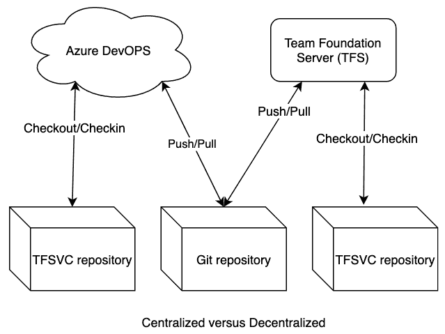

# 处理变更

你可以使用的最佳工具无疑是 Visual Studio。让我们讨论一些关于它如何处理文件变更的要点。

# 分支和合并能力

与 Git 中的分支相比，Git 的分支是仓库范围的，而 TFVC 的分支是路径范围的，且不如 Git 分支轻量。一般来说，团队成员会为他们正在处理的每个分支创建额外的工作区。变更是与分支独立的，因此为了避免集成时的混乱，你需要尽可能多地进行前向集成。TFVC 的标准合并使用的是双向合并（无基准）。

将创建分支的标准设定得高一些，只有在需要代码或发布隔离时才创建分支。在 TFVC 中使用分支更消耗资源。随着功能分支数量的增加，存储需求和分支层次结构的可视化模糊性也会增加。在下面的截图中，作为开发者，你可以看到无法合并，因为存在冲突：

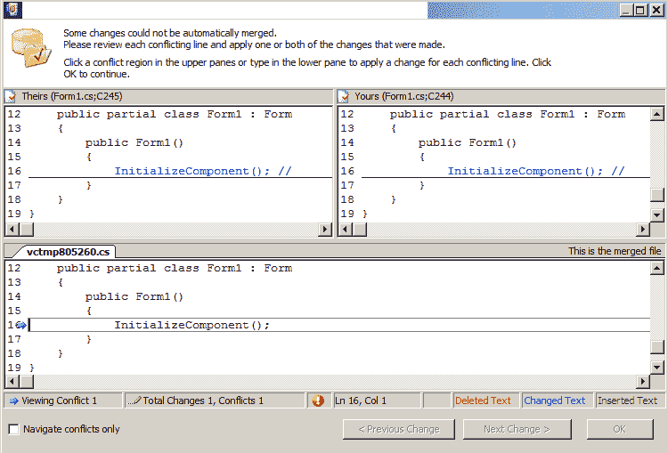

在 Git 中，分支仅仅是指向提交的指针。Git 中的默认差异比较使用三方合并，这也有助于开发者进行合并。

# 历史

由于 TFVC 的集中式特点，当你没有连接时，有些信息是不可用的。文件历史不会被复制到客户端的开发机器上，只能在你在线连接服务器时查看。这些信息可以通过 Visual Studio 和网页门户查看。通过项目项的右键菜单，你可以注释文件，以查看谁修改了某一行代码，以及他们修改的时间。以下截图展示了在网页门户中可以查看的相关信息：

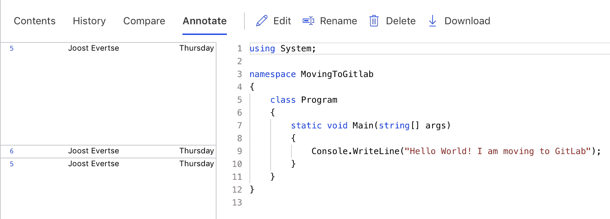

在 Git 中，文件历史记录会被复制到客户端的开发机器上。当没有连接到 TFS 服务器时，你仍然可以查看文件历史。你可以在 Visual Studio 和网页门户中查看，也可以在你使用的特定 Git 服务器（如 GitLab）中查看。通过使用 Git 的命令选项，你可以查看谁修改了文件的哪些行，以及为什么进行修改。这可以成为识别代码变更的有用工具，类似于 TFVC 中的注释功能。请看以下`git blame`命令：

```
$ git blame BSDLicence
 e2cc9eb2 (peter 2010-01-08 20:35:51 +0000  1) The files
 e2cc9eb2 (peter 2010-01-08 20:35:51 +0000  2)
 e2cc9eb2 (peter 2010-01-08 20:35:51 +0000  3) !PDF.Res
 e2cc9eb2 (peter 2010-01-08 20:35:51 +0000  4) !PDF.Sprites
 e2cc9eb2 (peter 2010-01-08 20:35:51 +0000  5) !PDF.Sprites22
 e2cc9eb2 (peter 2010-01-08 20:35:51 +0000  6) !PDF.Messages
 e2cc9eb2 (peter 2010-01-08 20:35:51 +0000  7) !PDF.Documents.Help/html
 e2cc9eb2 (peter 2010-01-08 20:35:51 +0000  8) !PDF.Documents.Help/txt
```

我们可以看到`peter`修改了这个文件。

# 可追溯性

对于某些使用场景，良好的可追溯性至关重要。想象一下像银行和保险公司这样的企业，它们由于法规的要求必须遵守严格的政策。由于 TFVC 是一个集中式的存储库类型，它的可追溯性开箱即用就相当好。所有的变更操作都记录在服务器上，且仅由授权的人员执行。问题、缺陷、看板和待办事项之间有直接的链接。

在 Git 中，也可以设置相同的系统，但你需要确保你的集中式存储库强制执行一些额外的检查，并处理实体之间的链接（例如，在 GitLab 中进行问题跟踪）。默认情况下，任何人都可以修改 Git 存储库的历史记录，因此开箱即用时，Git 的可追溯性并不好。

# 文件处理

Git 和 TFVC 之间的另一个大区别是在处理变更时。这个区别与 TFVC 使用集中式存储库，而 Git 本质上是分布式的这一事实相关。TFVC 在其中央服务器上保持项目中所有文件的单一根路径。在这种上下文下，可以在文件级别应用权限或锁定中央服务器上的文件。默认情况下，Git 或基本的 GitLab 配置无法实现这一点，因为没有中央位置可以强制执行这些权限。你可以在某个地方锁定文件，但开发人员可以继续在本地开发并修改代码。

另一方面，在 Git 中，你可以在一个 GitLab 项目中拥有多个存储库，并且可以在分支级别或存储库级别进行保护。你还可以定义多个远程仓库来推送代码。这意味着你可以将代码存储在 GitLab 中，也可以存储在 Windows Azure 上。以下截图展示了你可以用来在 TFVC 中锁定文件的菜单：

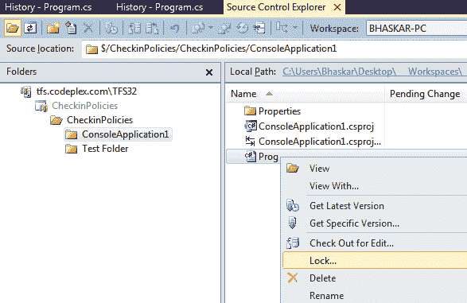

在 TFVC 中，所有文件都位于一个路径下并且受到控制，而在 Git 中，可以有多个分支和分布在不同远程服务器上的文件。要强制实施集中式控制是很困难的，甚至是不可能的。

# git-tfs 工具

有几种方法可以将数据从 TFVC 迁移到 Git。最简单的方法是在 TFS 本身进行迁移。你可以使用他们自己提供的导入/导出工具，访问[`docs.microsoft.com/en-us/azure/devops/repos/git/import-from-tfvc?view=azure-devops&tabs=new-nav&viewFallbackFrom=vsts`](https://docs.microsoft.com/en-us/azure/devops/repos/git/import-from-tfvc?view=azure-devops&tabs=new-nav&viewFallbackFrom=vsts)网站。

还有另一个可以用于迁移的工具。就像 git-svn 一样，可以在 TFS 和 Git 之间建立一个双向网关。它可以将 TFS 提交放入 Git 仓库，并允许你将更改推送回 TFS。

这些工具的存在是因为微软多年前内部切换到了 Git，并且他们已经为 Git 代码库贡献了大量源代码。这就是为什么如今在 Azure 等平台上创建新仓库时默认使用 Git 格式的原因。

# 准备迁移

在本节中，我们将演示如何迁移位于 Azure DevOps 上的 TFVC 项目。首先，我们将在 Azure DevOps 中找到我们的项目。你可以通过导航到你的组织页面来完成此操作：[`dev.azure.com`](https://dev.azure.com)。组织的设置超出了本书的范围，但如果你是小公司或开源项目，这非常简单且免费。你可以在 Azure 页面阅读更多内容，网址是：[`azure.microsoft.com/nl-nl/services/devops/`](https://azure.microsoft.com/nl-nl/services/devops/)。

git-tfs 迁移工具的项目页面可以在 GitHub 上找到（[`github.com/git-tfs/git-tfs`](https://github.com/git-tfs/git-tfs)）。在安装 git-tfs 之前，你需要考虑一些先决条件：

+   你需要一台 Windows 机器来进行安装。

+   必须安装 Git for Windows。

可以从[`github.com/git-tfs/git-tfs/releases`](https://github.com/git-tfs/git-tfs/releases)下载 git-tfs 二进制文件。或者，你也可以通过 chocolatey（[`chocolatey.org/`](https://chocolatey.org/)）进行托管安装。使用这样的包管理器安装可以为你处理必要的细节。当然，你也可以自己构建该包，因为源代码也可以获得。对于这些示例，我们将使用我已经设置好的基本 Windows 机器。我们开始吧：

1.  使用 chocolatey 安装 Git 非常容易：

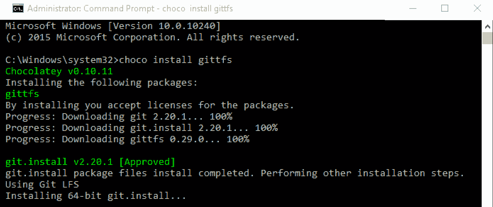

1.  下一步是使用`gittfs`包安装 git-tfs：

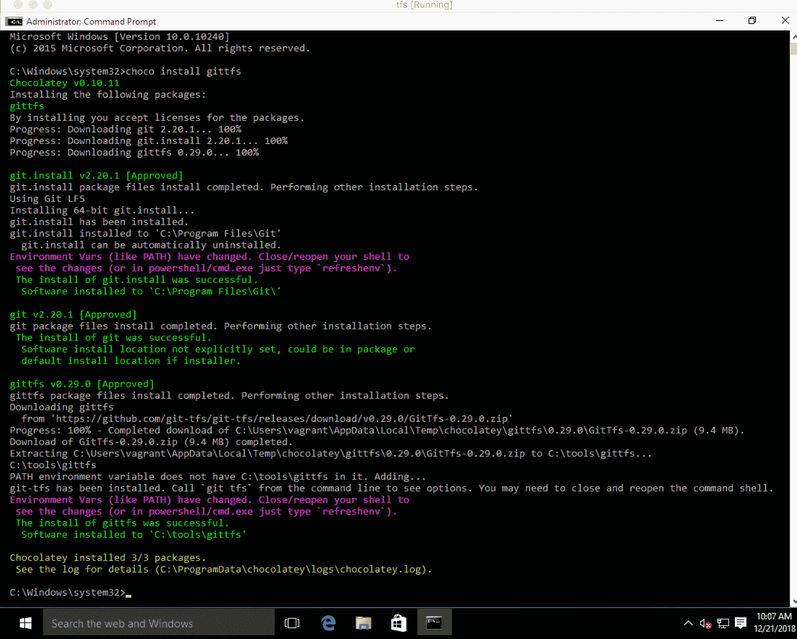

1.  为了进行迁移，我们需要在 GitLab 实例中创建一个新项目，以便为我们的 Azure DevOps 项目提供一个目标位置：

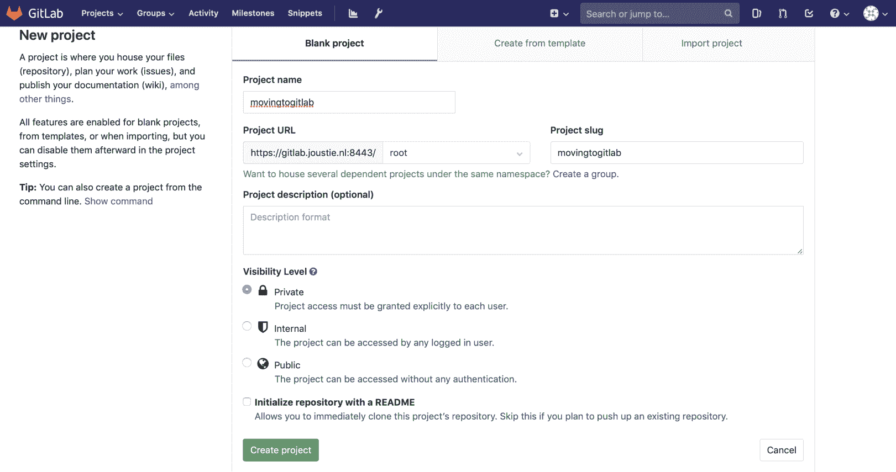

1.  现在，我们将使用 git-tfs 工具克隆我们在 Azure DevOps 中创建的测试项目。它将弹出一个认证窗口：

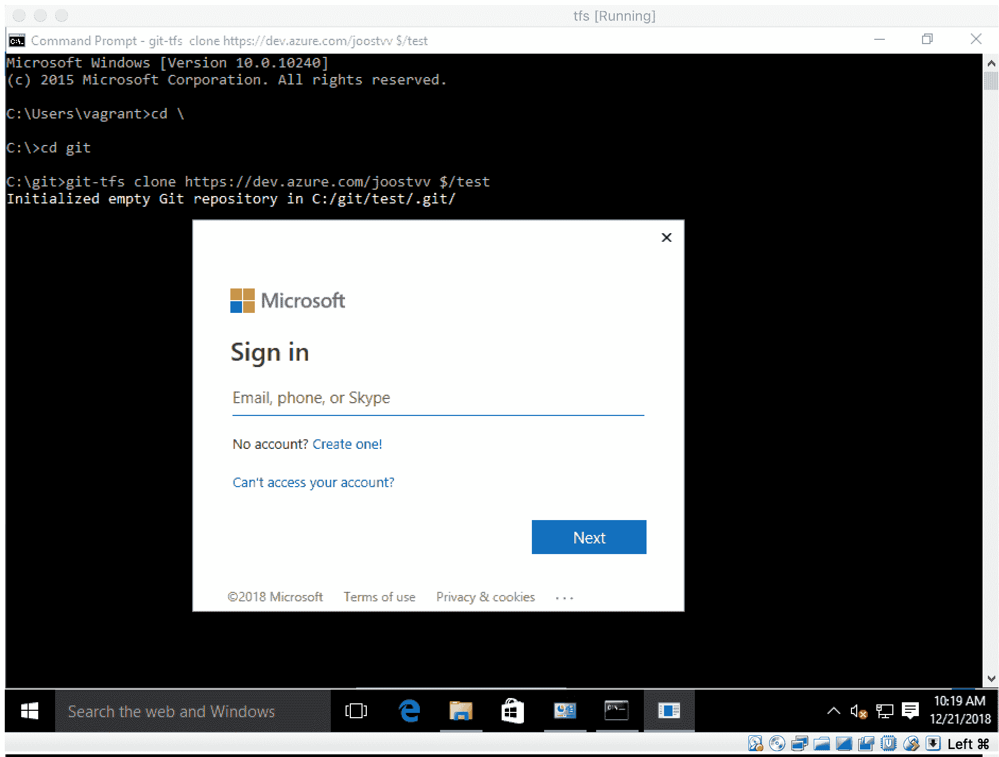

1.  它会自动搜索变更集并将其转换为 Git：

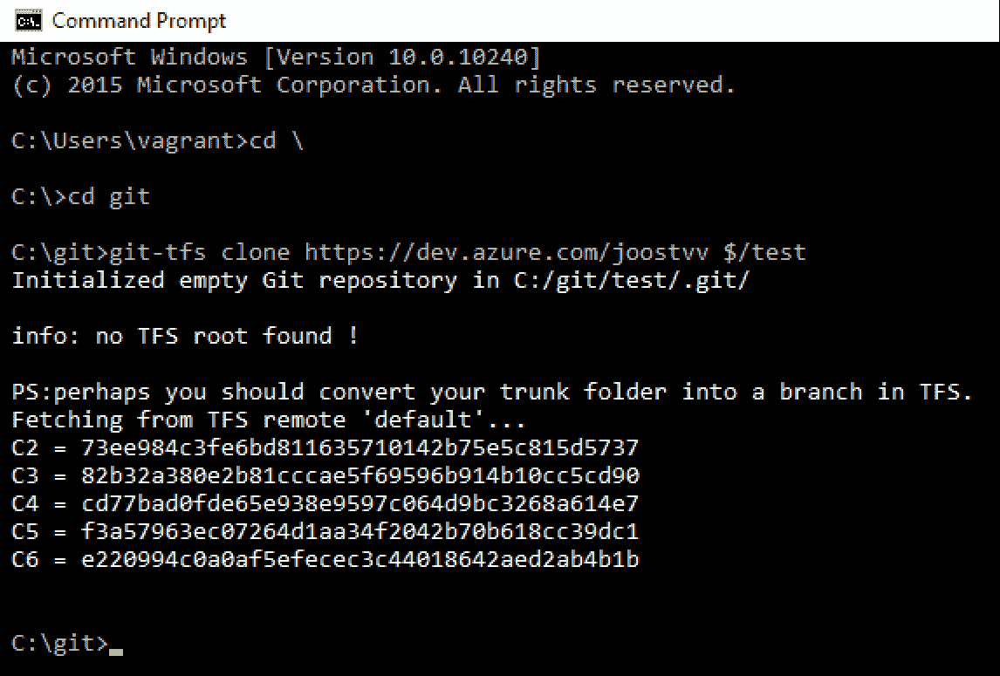

1.  为了将这个本地 Git 仓库复制到我们的 GitLab 项目，我们需要创建一个远程条目：

```
c:\git\MovingToGitlab>git remote add origin https://gitlab.joustie.nl:8443/root/movingtogitlab.git
```

1.  然后，我们将使用 `push -u` 将其推送到 GitLab。Git for Windows 会呈现一个登录界面，你可以在该界面通过 [gitlab.joustie.nl](https://gitlab-ee.joustie.nl/users/sign_in) 进行身份验证：

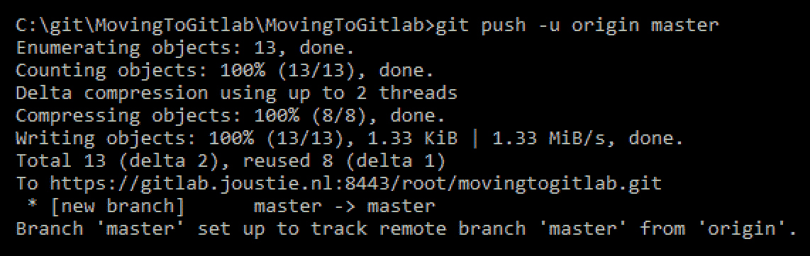

1.  当迁移完成后，你可以登录到你的 GitLab 项目。在这里，你将看到推送的代码：

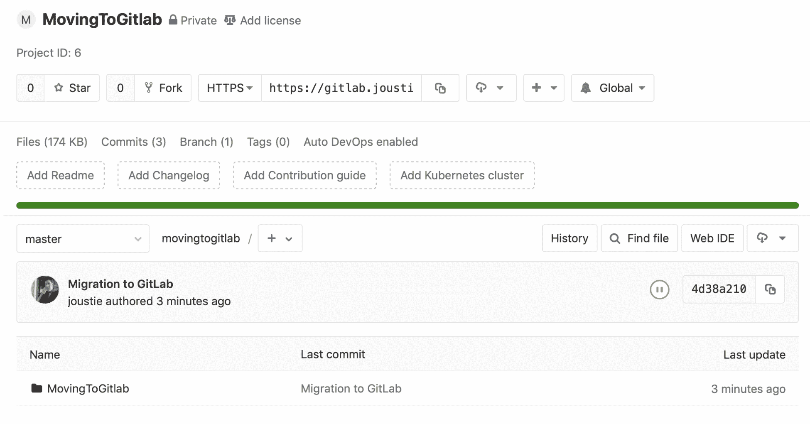

1.  你可以使用 `git log` 查看 Git 中的提交历史：

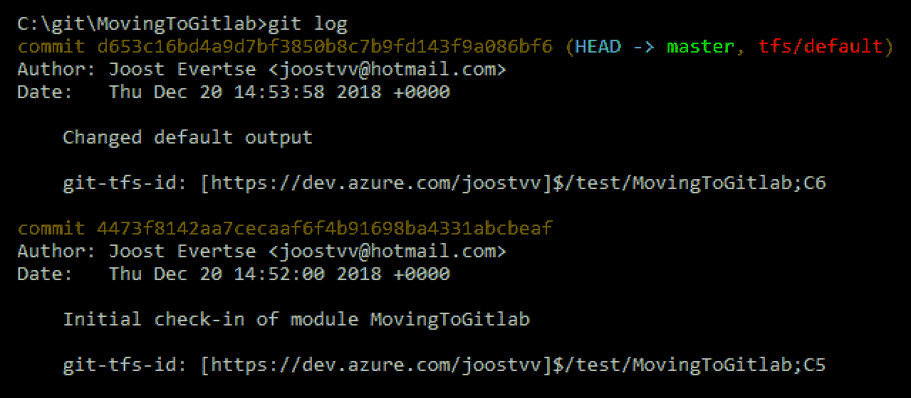

1.  如果你将其与 TFVC 中的历史记录进行对比，你会发现它们是一样的：

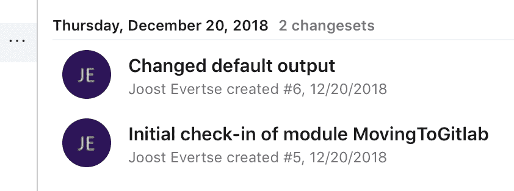

通过使用 git-tfs 工具，迁移你现有的 TFVC 到 Git 是相对容易的。

# 总结

本章解释了 TFS 是什么，以及它在 Microsoft 产品系列中的地位。首先，我们比较了 TFVC 和 Git 在架构上的差异，以及它们处理分支和合并的方式。我们还考察了它们如何处理历史记录和变更的可追溯性。

从这里，我们了解到有多种方法可以从 TFS 迁移到 Git。例如，你可以直接从服务器本身导出。也有一个工具可以用来在 TFS 和 Git 仓库之间创建镜像，这个工具叫做 git-tfs。这个工具存在的最合理原因是因为，现如今，Git 在很大程度上依赖于 Git 仓库，并需要将 TFVC 项目内部转换为 Git 格式。

本章结束了本书关于将数据从其他系统迁移到 GitLab 的部分。在下一部分，我们将广泛讨论如何连接到 GitLab 的方法。

# 问题

1.  TFS 在 Microsoft 的 ALM 套件中用于什么？

1.  TFVC 和 Git 之间最大的区别是什么？

1.  TFS 是 Azure 中的哪个产品的一部分？

1.  如何将 TFS Git 仓库迁移到 GitLab？

1.  在 TFVC 中，分支是如何作用域化的？

1.  TFVC 的历史记录保存在什么地方？

1.  哪个工具类似于 git-tfs？

1.  在 Windows 上，哪个工具使得安装 Git 变得容易？

# 进一步阅读

+   *《Microsoft Team Foundation Server 2015 Cookbook》*，*Tarun Arora* 著：[`www.packtpub.com/networking-and-servers/microsoft-team-foundation-server-2015-cookbook`](https://www.packtpub.com/networking-and-servers/microsoft-team-foundation-server-2015-cookbook)

+   *《Implementing DevOps with Microsoft Azure》*，*Mitesh Soni* 著：[`www.packtpub.com/networking-and-servers/implementing-devops-microsoft-azure`](https://www.packtpub.com/networking-and-servers/implementing-devops-microsoft-azure)

+   TFS 网站: [`visualstudio.microsoft.com/tfs/`](https://visualstudio.microsoft.com/tfs/)

+   Git-tfs: [`github.com/git-tfs/git-tfs`](https://github.com/git-tfs/git-tfs)
