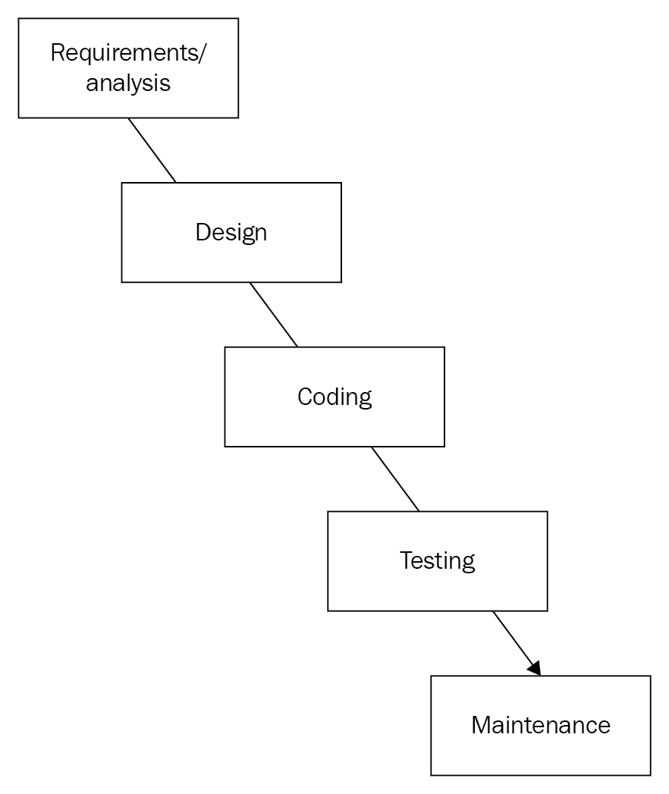
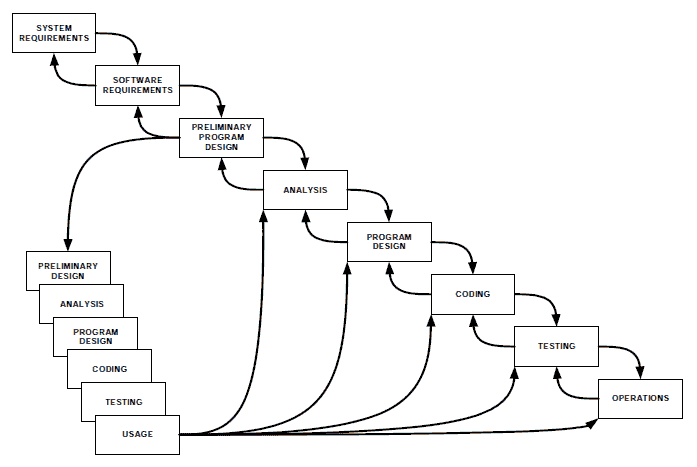
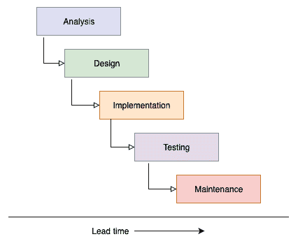
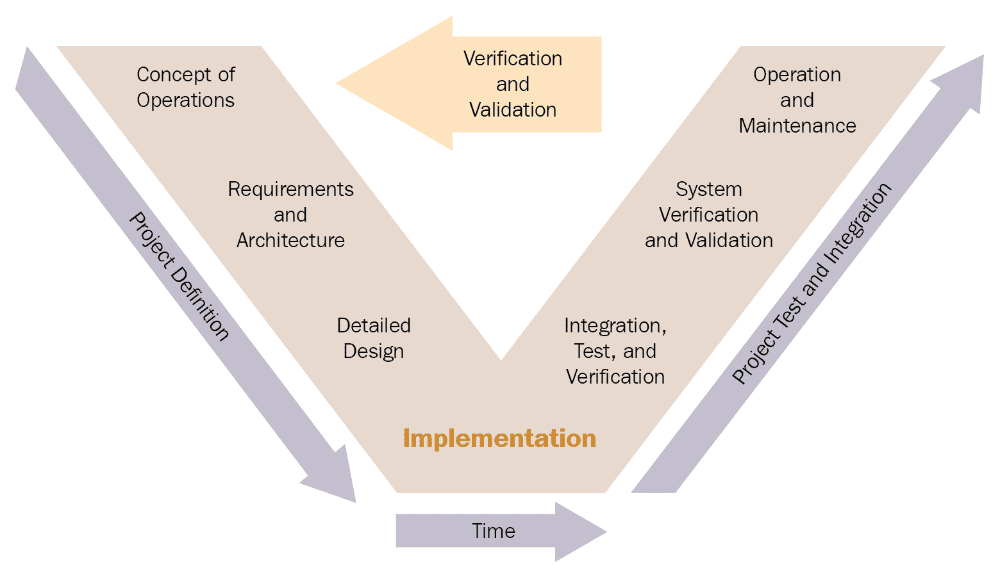
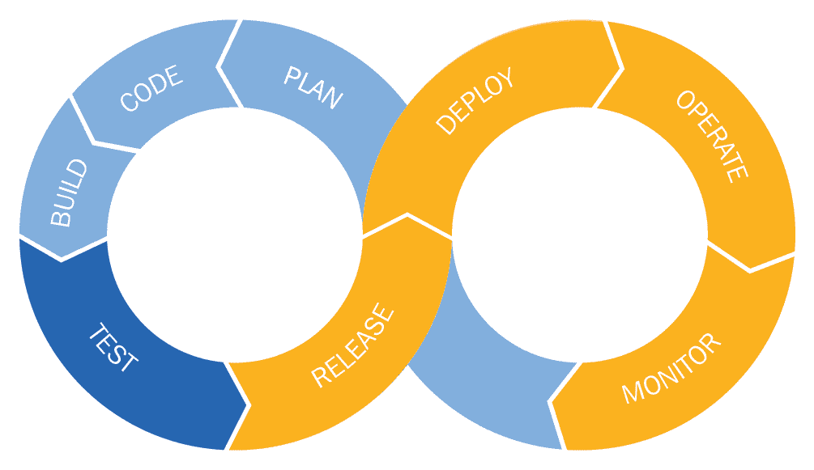
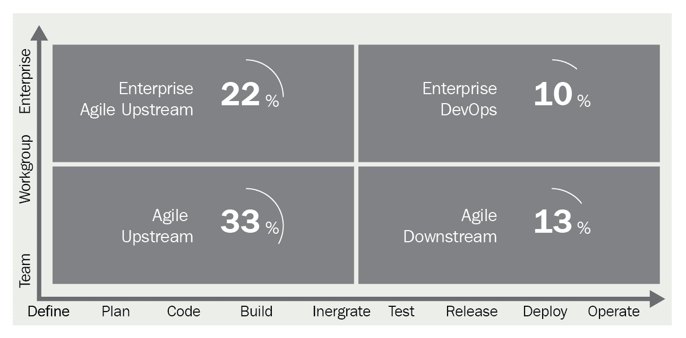
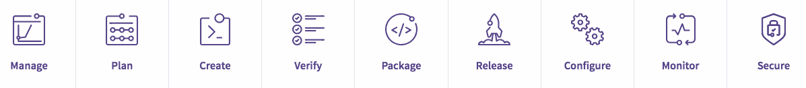

# GitLab 视角 - 一个应用程序中的完整工具链

本章旨在提供更多关于 GitLab 背景的深入了解。该产品实际上是为了帮助解决敏捷运动所面临的一些问题而创建的。我们将讨论开发方法论的历史以及敏捷作为主流软件开发方式的崛起。敏捷方法论逐渐渗透到传统运维部门，进而引发了 DevOps 运动。最后，我们将总结一些 DevOps 工作方式中使用的工具。

本章将涵盖以下主题：

+   敏捷宣言

+   **极限编程**（**XP**）

+   DevOps 运动

+   工具链

# 技术要求

若要跟随本章的说明操作，请从 GitHub 下载包含示例的 Git 仓库：[`github.com/PacktPublishing/Mastering-GitLab-12/tree/master/Chapter09`](https://github.com/PacktPublishing/Mastering-GitLab-12/tree/master/Chapter09)。

# 敏捷宣言

上世纪 90 年代，一些人对将软件开发与建筑工程进行对比的经典工程思维感到不满。与其努力保持需求的稳定，防止需求蔓延或范围膨胀，他们寻找了一种不依赖于需求稳定性的过程。这些人提出了许多不同的想法，作为回应，这些方法通常被称为轻量级方法。所有这些方法与精益制造方法共同构成了敏捷运动，并随着时间的推移变得非常流行。

那么，Agile（敏捷）究竟是什么？如今为什么大家都在谈论它？对某些人来说，它是一种生活方式和看待事物的方式。在 IT 领域，根据谷歌的定义，它是一种项目管理方法，特别用于软件开发，特点是将任务分解为短期工作阶段，并频繁重新评估和调整计划。

官方上，敏捷不是一种方法，而是一个集合术语。敏捷源于多种开发产品（主要是软件）的方法。例如，XP、Scrum、**动态系统开发方法**（**DSDM**）、适应性软件开发和 Crystal 等。这些方法具有一个共同的特点，那就是它们都旨在减少产品和软件开发中的官僚主义，并接受变革。在 80 年代和 90 年代，这些独立的方法由各种专家发展，最终在 2001 年制定了敏捷宣言。这些方法主要是为了避免传统瀑布式方法应用中出现的问题。

所有来自不同敏捷领域的大咖们最终决定非正式地聚在一起，讨论如何帮助 IT 改进。敏捷宣言就是在这次 17 名软件开发人员的会议中制定的。会议从 2001 年 2 月 11 日到 2 月 13 日在犹他州雪鸟山的 The Lodge 举行。敏捷这个名字也是在这里确定的。听说当时“轻量级方法”也在讨论中，但最终选择了敏捷这个名字。

# 初始模型 – 瀑布模型

当人们谈论瀑布模型的起源时，常常说 W. W. Royce 在 1970 年通过论文《*Managing the Development of Large Software Systems*》([`www-scf.usc.edu/~csci201/lectures/Lecture11/royce1970.pdf`](http://www-scf.usc.edu/~csci201/lectures/Lecture11/royce1970.pdf))提出了这一模型。Royce 本人实际上信奉迭代的软件开发方法，甚至没有使用“瀑布”这个术语。Royce 将瀑布模型描述为一种他认为过于极端的方法，甚至是注定会失败的提议：“我相信这个概念，但上述描述的实现方式风险过高，容易失败，”Royce 写道。

在 1970 年，Royce 认为瀑布方法必须视为一个初步概念，因为他觉得该方法存在一些错误。他发表了一篇文章，探讨了如何将这一初步概念发展成一个重复的模型。在这个增强的模型中，每个阶段之间有了更多的反馈，这与我们现在常见的方法更为相似。对 Royce 来说令人恼火的是，只有初步方法受到了关注，而他对这种方法的批评大部分被忽视了。

Royce 的意图是将该模型从论文中的初步概念转变为一个迭代模型；然而，原始方法仍被广泛使用并被理想化。然而，反对这一模型的人认为它过于基础，缺乏实际的应用价值。下图展示了瀑布模型：

瀑布模型包括以下几个阶段：

+   **定义研究/分析（需求/分析）**：在此阶段，唯一的目标是寻找需求。会进行一些研究以明确软件的目的。

+   **基本设计（设计）**：在此阶段，第一阶段的成果变得更加清晰。客户的愿望清单被写在纸上，并且程序的用户界面已经开始考虑。一般来说，在此阶段，会记录未来系统必须完成的功能。

+   **技术设计/详细设计（设计）**：此时可以使用基本设计构建一个原型或最简程序。在这个阶段，会考虑如何从技术上实现所需的功能。选项已经被分组为模块、功能或程序。

+   **构建/实施（编码）**：在构建阶段，为程序编写实际的源代码。

+   **测试（Testing）**：在测试阶段，检查软件是否按照设计正确构建。在此阶段，也可能会出现已经在早期阶段做出的错误。在理论模型中，这不应该发生。

+   **集成（Testing）**：现在系统应该已经准备好并经过测试。然而，它还应该能够与其他软件或硬件配合工作。为此，有专门的测试来确保集成工作正常。

+   **管理与维护（Maintenance）**：为了确保系统按照规格继续运行和功能，必须进行维护。

总结来说，瀑布模型由不同的阶段组成。每个阶段有自己的级别，并决定执行顺序。最高级别的阶段首先执行，然后是后续较低级别的阶段。这等同于瀑布的自然效应，因此得名。

为了减轻原始方法的缺点，开发了几种增强形式。

# 罗伊斯模型

罗伊斯模型描述了另一种瀑布模型，它可以返回到之前的阶段。通常，在某个阶段会发现前一个阶段出了问题（这通常会在测试阶段显现）。然后，应该能够轻松回到之前的阶段。99%的情况下，设计需要进行修改——没有人是完美的，因此这个模型更现实。然而，罗伊斯仍然强调良好文档对于正确阶段过渡的重要性。

下图展示了罗伊斯模型：

# 刺身模型

刺身模型，由彼得·德格雷斯（Peter Degrace）设计，是书中讨论的模型之一，书名为 *《邪恶问题，正义解决方案：现代软件工程范式目录》*。该模型假设与瀑布模型相同的阶段，但这些阶段可以重叠（甚至多次重叠）。这种工作方式意味着更少的资源浪费。在下图中，您可以看到各个阶段是如何重叠的。关键在于，阶段之间没有硬性结束或关卡。您可以将当前时间作为一个例子。图中的另一个方面是，与瀑布模型不同，该模型还包含了提前时间。这意味着，即使分析还没有完成，也可以开始设计。这也意味着，您可以在设计阶段回到分析阶段。

下图展示了刺身模型：

# V 模型

V 模型展示了软件开发中的阶段过渡，这为质量保证提供了可能性。在每个阶段过渡时，开发人员与客户会就设计等方面达成质量协议。V 形状表明，在 V 形的底部，在实际实施后，对所解决问题的理解会不断加深，并且最初的想法和需求会与现实进行对比。

下图展示了 V 模型：

这里呈现的工作方式符合经典的工程方法。在 1970 年代和 1980 年代的长时间里，人们认为软件工程应该像建造摩天大楼一样进行。摩天大楼的建造首先需要制定详细的建筑计划，建筑工人才能进行建设阶段。为了这样创建架构和计划，你需要非常清楚地理解需要建造的内容。这里重要的是，前期的需求被清晰列出，并且在过程中不会发生变化。然而，如果现实世界中的工程项目需求像软件一样迅速变化，什么也建不成。

# DSDM

DSDM 源于线性**软件开发方法学** *(***SDM***)模型，起源于 1990 年代。它是对线性方法中常见问题的回答——在这些方法中，要开发的功能通常在整体完成时才可用。如果交付的功能可以拆分成子功能，那么这些子功能可以单独交付。我们称之为增量系统开发或逐步开发。最初，你需要找出哪些功能可以拆分出去。这意味着瀑布模型的前两个阶段已经完成，但只有当部分功能明确时，才能逐步并行开发。

DSDM 不仅仅是在开发阶段应用迭代。分析之后的所有阶段都是迭代的。此外，阶段的划分看起来稍有不同。与线性开发模型相比，它还可以返回到先前的阶段。

DSDM 中的各个阶段结构如下：

+   可行性研究

+   商业分析

+   功能模型迭代

+   设计与构建迭代

+   实施

时间盒管理是 DSDM 中控制每个阶段的核心实践之一，它与 MoSCoW 方法中的更好优先级管理结合使用。我们将在接下来的部分进行解释。

# 时间盒管理

为了确保项目能及时为组织提供服务，采用时间框架。例如，优先级最高的功能应该始终在时间框架内交付。如果有时间和空间，低优先级的功能将有余地。时间框架是一个交付中间产品的时间间隔。在项目过程中，具体功能会进一步细化。由于不断增长的洞察力和变化的情况，功能的规格也可能发生变化。

准备一个时间框架，其中定义了必须拥有、应该拥有和（可能的）可以拥有的功能。这样的布局允许你在不影响时间框架最终时间的情况下创造操作空间。换句话说，在洞察变化或紧急情况发生时，你将能够重新调整优先级。这可能会以牺牲应该拥有和可以拥有的系统需求为代价。通过应用 MoSCoW，你可以明确这些选择。

使用这种技术，你可以始终保持对最高优先级功能需求的关注，监控时间和预算，并且在洞察发生变化时仍然能够采取行动。运用这种技术可以让你优先考虑那些能为公司带来最大效益的系统需求，同时降低那些来自于可能永远不会发生的情况的需求的优先级。这也使得系统设计更简洁——这有助于提高其可维护性。

基于 MoSCoW 分类的需求和愿望分类还有助于用户可视化项目在组织内的支持情况。现在有一些作者认为，你应该将项目视为微型项目的集群。每个微型项目是具有一定优先级的需求或愿望。在许多项目中，当人们面临变化时，来自利益相关者的支持开始崩溃。如果一个项目包含了许多必须拥有的功能，那么这种风险将比大部分由应该拥有的功能组成的项目要小。

# MoSCoW

通常情况下，一个项目会因为用户组织提出过多的需求而受阻。然而，提供反馈给客户的开发策略可以防止开发组织的过度需求。DSDM 通过将功能需求和愿望分为若干类别，并为每个功能指明优先级，从而解决了这一问题。

DSDM 使用 MoSCoW 规则来确定需求和愿望的优先级。

MoSCoW 代表：

+   **必须拥有**：这一类别优先级最高，确保交付，并且是信息系统的核心。

+   **应该拥有**：一个必要的需求，但可以采取（临时）变通方法。

+   **可以拥有**：一个具有明确附加值的需求，但没有它，系统仍然是可用的。

+   **想要拥有（但这次不能拥有）**：这个需求可以被忽略，尽管它并不意味着不相关；在下一个增量中，它可以变成**必须拥有**。

现在，DSDM 已不再广泛使用。过去十年里，其他方法变得更受欢迎，特别是像 Scrum 这样的敏捷方法，接下来我们将讨论它。

# Scrum

本书中将要讨论的下一个轻量级模型是 Scrum，截止到 2018 年，它已经被广泛应用于 IT 领域之外。Scrum 不像 DSDM 那样是一个具体的方法，更准确的说它是一个框架。它借用了体育团队（特别是橄榄球）的范式，在这个范式中，一群人一起合作达成共同的目标。在橄榄球比赛中，Scrum 是将球投入比赛的一种方式。Scrum 小组由五到八名球员组成，他们作为一个整体协同工作。在 IT 领域，这就是一群人通过紧密合作与协调来创造商业价值。

在橄榄球比赛中，每个球员都有独特的角色；他们既参与进攻又参与防守，作为一个团队协作将球带到对方场地。这可以与 IT 中的一种情况进行对比，Scrum 团队的成功程度取决于团队内不同学科成员如何共同工作和相互协调。

橄榄球的类比源于 1986 年《哈佛商业评论》上的一篇文章，*新产品开发游戏*，作者竹内和野中在文章中引入了 Scrum 这一术语，并将其应用于产品开发。他们认为这种方法能带来更高的速度和灵活性，并且基于多种行业的案例研究，尤其是汽车行业。

在 1990 年代初，Ken Schwaber 和 Jeff Sutherland 开始在他们的公司中使用 Scrum 技术，并最终在 1995 年，在一次软件设计会议上介绍了 Scrum 框架。

Scrum 列出了以下价值观：

+   **承诺**：团队成员必须全身心地投入到项目中，而不是兼职工作。

+   **专注**：团队成员应当专注于每个迭代冲刺中需要完成的任务。

+   **开放性（透明性）**：团队成员必须保持相互之间的信息流通，及时告知进展和潜在问题。

+   **尊重**：团队成员必须尊重背景和专业不同的人，并相信彼此的良好意图。

+   **勇气**：团队成员必须有勇气表达观点、提问并提出新的解决方案。

Scrum 适用于跨学科的团队，成员倾向于在同一个房间工作，以便于讨论和交流。团队由一名 Scrum Master（敏捷教练）监督，其角色是促进团队协作。产品负责人是客户或客户的代表。他或她指定所需的结果，通常以用户故事的形式呈现。这些用户故事会保存在一个列表中，称为产品积压或工作存量。产品负责人根据优先级对工作存量进行排序。最重要的用户故事排在最上面。

在 Scrum 中，你在 Sprint 或迭代中工作。通常这些持续时间从一周到一个月不等，其中以两周为最常见。Sprint 是有时间限制的。换句话说，Sprint 的持续时间和结束时间在事先就确定好了。在 Sprint 开始时，确定并记录该 Sprint 的用户故事，并将其列入 Sprint 待办事项列表。

Sprint 提供尽可能具体的结果。这意味着软件开发将提供可用的代码，包括集成、测试和文档，以便客户或最终用户能够理解。

在一个 Sprint 结束时，会进行 Sprint 回顾，展示成果给产品负责人。此外，团队内部还会进行评估。

# Crystal 方法

Crystal 方法是一种轻量级方法，其特点包括强调人而非流程和产品、快速沟通（最好在同一个房间内共同工作）、快速交付产品、频繁且自动化的测试，以及定期评估。

与其他一些软件开发流程不同，Crystal 不是一种软件开发方法，而是一系列方法和流程的集合。这个集合被称为 Crystal 家族。Crystal 是由 Alistair Cockburn 发明并描述的。Crystal 家族中的每个成员都以颜色表示方法的重量，原则是：颜色越深，方法越重。方法的颜色是根据项目的大小和严重性来选择的。大小由参与项目的人数决定，严重性由选择该方法可能造成的系统性损害风险决定。这些颜色像真实的水晶一样，从浅到深排序。Crystal clear 是最小和最轻的，其次是黄色、橙色、橙色 web、红色、深红色、蓝色、紫色等。

尽管 Crystal 方法之间有所不同，但它们也有一些相似之处，这也是为什么它们被称为一个家族。它们有三个共同的优先事项：安全性、效率和可用性。此外，它们还具有共同的特征，其中最重要的三个是频繁交付（中间）产品、改进的反馈和良好的沟通。

我们已经讨论过基于团队的产品开发方法，并具有一定的流程步骤，现在讨论的是 Crystal 方法，一种轻量级的敏捷方法，专注于团队内部的人。还有一些更为激进的方法，不仅专注于人和流程，还专注于工具和技术质量。我们将在下一节中讨论这些 XP 方法。

# XP

敏捷运动中最重要的子文化之一就是 XP。XP 的主要创始人有 Kent Beck、Ken Auer、Ward Cunningham、Martin Fowler 和 Ron Jeffries。他们在 1996 年的**克莱斯勒综合补偿**（**C3**）系统项目中开发了 XP。如今，它非常流行，这不仅体现在软件开发的文化中，也体现在其工作方式和所使用的工具集中。我们认为，GitLab 在许多方面正是 XP 当初设想的工具。实际上，它的影响深远，以至于我们决定为其专门开设一整章，解释它与 GitLab 的相关性。

XP 的名字来源于一系列被证明有效的开发原则（即所谓的最佳实践）被极限化的应用。XP 的最大优势来源于 12 条软件开发最佳实践的应用。这些最佳实践分为四个组别：细致的反馈、持续的过程、共享的知识和开发人员的福祉。

# 细粒度反馈

XP 中的一个重要原则是使用反馈机制，并尽量将反馈循环保持在最小。这个过程从规划阶段开始，因为在这个阶段得到客户的反馈可以有效地减少时间浪费。

XP 中的细粒度反馈组包括四个实践：规划游戏、结对编程、**测试驱动开发**（**TDD**）和全员参与。我们将在接下来的章节中讨论每个实践的反馈循环。

# 规划游戏

规划在每个迭代的开始进行，包含发布规划和迭代规划两个部分。

发布规划决定了哪些功能将在何时的发布版本中实现。开发人员和用户都会参与。

发布规划包含以下三个阶段：

+   **探索阶段**：在这里，用户列出新系统最重要的需求。这是通过用户故事的形式进行的。

+   **承诺阶段**：在这里，决定哪些用户故事会包含在下一个发布版本中，并确定发布的时间。

+   **指导阶段**：在这里，计划可以被修改，新的故事可以被加入，其他的则可以移除。

迭代规划是将纳入即将到来的 Sprint 发布计划中的用户故事分解为开发人员的任务。没有用户参与，只有开发人员。

迭代规划还包括三个阶段，具体如下：

+   **探索阶段**：在这里，故事被转化为任务，然后写在称为任务卡的卡片上。

+   **承诺阶段**：在这里，估算实现任务所需的时间，并将任务分配给开发人员（结对）。

+   **指导阶段**：在这里，任务被执行，并且结果与用户故事的原始时间表进行比较。

这种规划的目的是确保产品能够交付。重点不在于交付精确的数据，而在于交付产品。

# 发布规划

在这个规划游戏的过程中，客户和开发人员试图找出下一次软件发布将包括什么内容以及何时发布。重点是创建用户故事。

游戏的这一部分由以下三个阶段组成：

+   **探索阶段**：这是收集需求并估算实现这些需求所需时间的过程。此阶段的活动包括：

    +   **编写用户故事**：在此，用户提出一个问题或需求；在咨询过程中，开发人员会尽量充分理解这个问题。在此基础上，编写用户故事。这是由用户完成的，表明他们对系统的期望。开发人员需要避免干预。

    +   **估算用户故事**：开发人员估算完成此任务所需的时间。此时，开发人员还可以指定短期的检查（称为 spikes），以调查问题或解决方案方向的某些部分。这些 spikes 用于获得更好的时间估算，并在问题和/或解决方案对每个人都清楚时被抛弃。

    +   **拆分用户故事**：在此阶段，故事必须完全清晰，所有歧义必须消除，才能开始迭代规划。如果开发人员由于不清楚而无法给出时间估计，故事必须被拆分。如果用户已经描述了所有的需求，他们可以继续进入决策阶段，这就是所谓的承诺阶段。

+   **承诺阶段**：在此阶段，我们将找出成本、收益以及它们对进度的影响。我们根据排序方式创建四个不同的列表，具体如下：

    +   **按价值排序**：用户按他们认为重要的顺序排列用户故事。他们会创建以下三种堆栈：

        +   **关键**：没有这些故事，系统无法工作或没有价值。

        +   **重要**：对公司而言重要的用户故事。

        +   **可有可无**：用户故事中实现的较不重要的特性。

    +   **按风险排序**：在此，开发人员估算风险并相应地对故事进行排序。所有用户故事的值将加在一起，得到一个累计的风险值，可能是低（0-1）、中（2-4）或高（5-6）。以下是一个例子：

完整性（我们是否有关于表格的所有细节？）

+   +   +   完整（0）

        +   不完整（1）

        +   未知（2）

脆弱性（变更是否可能？）：

+   +   +   低（0）

        +   中等（1）

        +   高（2）

难度（实现起来有多难？）：

+   +   +   简单（0）

        +   标准（1）

        +   难（2）

1.  +   **确定开发速度（velocity）**：在此，开发人员确定他们能够以多快的速度执行项目，并根据此对项目进行排序。

    +   **范围**：在这里，确定将在下一次发布中实现哪些用户故事。这是最终排序。基于此，确定发布日期。排序应该根据用户的价值（业务价值）进行。

+   **引导阶段**：在此阶段，开发者可以与用户一起引导流程。换句话说，他们仍然可以做出一些改变，不管是某个个别用户的故事，还是另一个特定故事的重要性。

# 迭代规划

根据团队的速度，可以确定每次迭代团队能完成多少个故事点。迭代可以持续一到三周。这里的重点是创建任务并对其进行优先级排序。迭代也具有与早期发布规划相同的阶段，如下所示：

+   **探索阶段**：在迭代规划的研究阶段，用户故事被划分为任务，并估算每个任务的完成时间。此阶段的主要活动包括以下内容：

    +   将用户故事转化为任务，并将其写在任务卡片上。

    +   添加或拆分任务；换句话说，如果开发者无法准确估算任务的持续时间，因为任务太大或太小，就需要进行调整。

    +   任务估算，即对任务执行的估算。

+   **承诺阶段**：在迭代规划的分配阶段，以下任务会在开发者之间进行分配：

    +   开发者（程序员）接受任务：每个开发者接受一个任务，并对其负责。

    +   开发者给出时间表：因为开发者现在已经负责该任务，他们是最能给出时间估算的人。

    +   确定有效工作时间，列出开发者或程序员在一次迭代期间可以工作的小时数。（例如，在一个 40 小时的工作周中，如果有五个小时用于会议，那么有效工作时间就是 35 小时。）

    +   平衡：一旦所有任务分配完毕，将比较每个开发者分配的小时数与他们实际可用的小时数（这也称为负载系数）。然后可以重新分配任务，确保每个开发者的工作量大致相同。如果某个开发者工作量过多，需要调整任务。

+   **引导阶段**：在迭代规划的执行阶段，任务的执行将在此阶段进行。这个阶段有点像游戏元素，但建议按照以下步骤进行：

    +   **获取任务卡片**：在此，开发者会获得一张卡片，上面描述了他们注册的某个任务。

    +   **寻找合作伙伴**：开发者寻找一个合作伙伴共同开发该任务。

    +   **设计任务**：如有必要，在此阶段将进行（简短的）设计。

    +   **编写单元测试**：在编写任何代码之前，所有的测试都必须准备好。最好是自动化测试，因为这些测试通常需要在每次源代码提交时进行。

    +   **编写代码**：在这里，程序员或开发人员编写程序。

    +   **测试程序**：执行单元测试。

    +   **重构**：在这一步骤中，应用重构规则，开发人员确保代码符合标准。

    +   **进行功能和集成测试**：在单元测试之后，所有可能的其他测试都要运行，例如集成测试、回归测试等。此步骤中代码必须进行调整，直到测试成功。

# 结对编程

XP 指出，最终，所有的工作都围绕代码展开，软件开发中也是如此。所以，如果让开发人员一起审查代码是一件好事，那么软件开发应该始终以对的方式进行。换句话说，结对编程可以定义为两个人共同使用一台电脑进行工作。结对编程常被认为是 XP 中最极端和有争议的部分，因为它被认为效率较低。然而，研究表明，同行评审和代码检查是对抗漏洞最强大的武器—这些远比系统测试更为强大。这些技术通常只在稀疏情况下使用，并且通常会在程序员和管理者之间引起强烈反对，后者担心工作时间的增加。

通过强制执行所有软件开发都以对的形式进行，且对的组成会定期变化，从而产生一种集体的责任感，同时同行评审和代码检查成为软件开发过程中的自然一部分。最终交付的系统不再是由一堆用代码串起来的代码片段组成，这些代码片段难以维护。

这种工作方式还有一个好处：总会有至少两个人完全理解每一段代码。知识的传递给新同事更加自然，且工作中的持续培训也得以进行。

结对编程的一些好处包括：

+   **更高质量的代码**：像大声朗读代码和讨论背后的思维过程等活动有助于他人理解代码的复杂性，同时也给开发人员机会澄清细节，并防止做出不可逆的选择。

+   **团队内部更好的知识共享**：这在其中一位开发人员还不熟悉软件组件时，与熟悉该组件的开发人员合作特别有用。

+   **改进知识传递**：通过开发人员从经验丰富的团队成员那里自动学习新技术和技能来帮助实现这一目标。

+   **更少的管理开销**：这得益于更少的个人控制，因为开发人员是以两人或更多人的团队合作的。

+   **持续专注**：如果成对编程中的一个成员因任何原因被打断，成对编程尤其有帮助。

那么，成对编程有缺点吗？目前，成对编程的成本和收益尚不明确，但初步研究表明，当一对人一起工作时，任务的持续时间平均增加了 15%。这种成本是否能够通过更高的代码质量来证明其合理性，仍然存在争议。

# 测试驱动开发

在**测试驱动开发**（**TDD**）中，测试是在编程之前进行的。TDD 依赖于这样的前提：如果测试做得好，测试代码应该在编写任何代码（功能）之前就写好。

在 XP 中，自动单元测试的编写占据了重要位置，因为编写单元测试是在实际编程开始之前进行的。在 TDD 中，程序员首先编写一个或两个测试，编写一部分程序，增加一个新的测试用例，不断修改程序，直到新的测试通过，再设计新的测试，依此类推。

这一过程的优势在于，程序员必须思考程序应该具备的功能和需要考虑的异常；他们先考虑程序应该做什么，再考虑程序如何运作。换句话说，测试捕获了所需的功能。因此，每个程序必须仅具有足够的功能，以使得测试通过。如果所有测试都通过，程序就满足先前定义的要求，这些要求是通过已编写且成功的单元测试来定义的。

当需要重构时，已经编写好的单元测试就成了保证，确保更改不会导致程序运行中出现不良副作用。

如果需要为程序扩展新功能，首先要做的就是编写新的单元测试，定义要编写的新功能。只有当新旧单元测试都通过时，这个新功能才算实现。

如果在功能测试的后期发现了一个 bug，首先要做的是编写一个单元测试，揭示这个 bug。因此，bug 不是程序的错误，而是测试不充分的结果。

总结来说，使用 TDD 进行的软件开发项目包括以下几点：

+   从一个描述程序某个功能的单元测试开始

+   运行测试，最终应该会失败，因为没有代码

+   利用最少量的代码使得测试通过

+   重写代码，使其更简洁

+   通过更多的测试来重复这个过程

使用这种方法，尽管开始时需要更多时间，但随着时间的推移，缺陷率应该会下降。大多数团队报告称，一旦项目进入后期阶段，前期的测试成本就会得到回报，而且在项目的最后阶段工作会更加高效。通过这种方式开发的代码往往质量更高，因为为了确保测试有效，你必须编写高度内聚而低耦合的代码。这使得处理相同行为的代码保持在同一个类中，并且将模块尽可能隔离，且与其他代码的接口清晰。

这种方法听起来可能很简单，但在实际操作中却相当困难，因为开发人员可能会忘记运行测试。然而，这个问题可以通过在 CI/CD 环境中设置一个带有预配置测试的项目模板来轻松解决，在每次提交或推送时都会运行测试。如果有些软件工程师容易过度测试，最好事先约定测试的数量及其深度。例如，像访问器这类简单的构造不需要测试。另一方面，要小心不要过度简化测试，比如创建了测试却没有断言。

团队文化和协议对于测试非常重要。如果有些团队成员不认同，你将面临冲突。同时，确保任何测试模板、自动化工具或测试套件都得到充分支持，否则你的测试将无法正常运行。（这也意味着，应该有多人了解这些工具。）

本质上，TDD（测试驱动开发）可以真正提高软件质量。特别是当所有测试都通过持续过程自动化时，这一点尤其如此，接下来的章节将进一步讨论这一点。

# 持续过程

持续过程是一组旨在持续运行且没有中断的过程。同时也不需要批处理，因为批处理通常会减慢 XP 的整体进度。

# 持续集成

如果集成和集成测试很重要，那么代码应尽可能频繁地进行集成——最好是一天多次。这将防止你的团队在本地使用不同的副本，并鼓励他们一起工作。任何集成问题也会立刻显现出来。GitLab CI 就是为此而创建的，且在第一章中介绍了*GitLab 架构概述*。

使用持续集成（CI）的一个关键原因是防止集成问题，如果开发人员长时间独立工作，可能会发生这种问题。想象一下集成地狱的现象，在发布前的最后一刻，开发人员合并了一大块代码，结果引发了冲突。

在 XP 世界中，持续集成始终与 TDD 相结合。在运行集成测试之前，通过本地彻底测试代码会有所帮助，最好是通过单元测试进行。在本地环境中测试代码的这种方式有助于在破坏他人代码之前发现错误。请注意，您还可以使用功能切换来隐藏尚未完成的功能，这会禁用代码中的某些行为。

在某些情况下，构建服务器用于软件**质量保证**（**QA**）过程的其他部分，包括运行额外的安全测试、测量性能，甚至生成文档。这种将责任转移到构建服务器的行为意味着许多传统上在开发后完成的 QA 工作现在可以在开发过程中执行，同时还能获得即时反馈的好处。这种反馈循环是推动软件产品持续开发过程的重要驱动因素之一，另一个是自动化。

自动化进一步扩展到创建**持续交付**（**CD**），通过使软件部署成为自动化的一部分。为了使这一切成为可能并快速运行而没有问题，主干或分支中的代码应始终处于可部署状态。

构建软件产品的每个可以自动化的元素都有资格成为 CI 过程的一部分，尤其是在特别复杂的情况下。自动化这些阶段是 CI/CD 存在的原因之一。

# 重构

与传统开发方法不同的一项重要技术是**重构**，这是在不影响任何可见功能的情况下，通过小而精确的步骤连续重写程序代码。简而言之，重构不会增加功能，但简化了设计。通过定期执行重写步骤，总体效果往往令人惊讶。

与此同时，已经发现并记录了大约 70 条重写规则。它们具有诸如引入空对象、用查询替换临时变量和用多态替换条件等名称。成功应用重构的先决条件是有可用的单元测试，可以在每个重写步骤后自动进行，以确保功能未发生变化。例如，对于 Smalltalk，现在有一个重构浏览器，可以自动应用重写规则，用户无需过多担心准确性。重构经常用于准备实施扩展或功能变更。

重构并不意味着重写代码、修复错误或更改用户界面。重构的另一个危险是，在缺乏良好的自动化测试的情况下，可能会引入回归错误。

在使用这种技术一段时间并积累经验后，团队报告说代码长度有了显著改善，重复度减少，耦合和内聚性更好，环路复杂度降低。对于新接触你软件的人来说，这让学习变得更容易。对于团队来说，它有助于集体思考项目的整体设计，并理解为什么做出某些决策。通常，这也依赖于引入某些可重用的组件和模块。

# 短期迭代

软件定期以有限的版本交付给客户进行评审；如果短期迭代有效，那么你应该使其非常短。我们说的是秒、分钟或小时，而不是周、月或年。XP 的平均迭代周期为两周，尽管根据 [extremeprogramming.org](http://www.extremeprogramming.org/) 的说法，它可以从一周到三周不等。

XP 循环包括六个阶段：探索、规划、迭代发布、生产、维护和死亡。

对于敏捷项目，迭代是一个特定的时间段，期间进行开发。这被称为时间框定。这个时间段因项目而异，通常在一到四周之间，并且通常为每个项目定义。典型的敏捷方法是项目由多个迭代组成，开始时有一个简短的规划阶段，结束时有一个收尾阶段。

迭代通常按工作周分类，工作周从星期一开始，到星期五结束。一段时间后，迭代的固定期限使得评估项目所需时间变得更加容易。

Scrum 方法中的迭代时间框被称为 Sprint，当然，这个名字来自于橄榄球。在 XP 中，它们被称为每周周期。对大多数人来说，迭代意味着重复或多次重复；但在敏捷开发的语境中，它指的是一个重复的过程。

# 每个人都拥有代码

请注意，每个开发者对程序代码的所有部分拥有平等的权利。如果设计良好，就让它成为每个人日常工作的组成部分，并在需要时逐步改进设计。如果架构如此重要，就让每个人都参与到开发中。这一概念鼓励每个人贡献并承担责任。

# 共享理解

小组中的价值观大多与感知有关。要作为一个小组高效且有效，你必须在某些方面达成一致，并共享共同的价值观和理解。

# 编程标准

要达成共享的理解，你需要制定一些规则。有一些编程标准是大家都知道并使用的。如果源代码格式一致，真的很有帮助。这样，大家都可以阅读并修改它。在代码文件中讲相同的语言。这也有助于确保代码库的集体所有权。

# 简单设计

如果代码属于一个小组中的所有开发者，并且每个人都可以修改一切，那么他们就应该能够做到这一点。保持设计尽可能简单。XP 大量使用**保持简洁明了**（**KISS**）原则。换句话说，系统要易于修改，设计应该尽可能简单。然而，这说起来容易做起来难。

传统的开发方法学会了提前思考，并始终考虑可能在未来实现的功能，但这些方法假设变更的成本会呈指数增长。因此，XP 总是试图选择最简单的设计来实现必须实现的功能。理想情况下，任何未来的扩展都可以通过 XP 实现，而不会产生通常的额外成本。事实证明，在实现经过深思熟虑的设计时，它往往并不反映当前的需求。这可能是因为在分析和设计过程中忽视了某些细节，或因为需求发生了变化。在 XP 中，设计并不是优先的，而是紧随代码之后。

# 系统隐喻

所有团队成员，包括开发者、用户或客户，应对系统有一个共同的看法（称为隐喻）；每个人都必须能够用简单的语言描述系统。命名规范的使用也应有助于这一点。

正如我们所讨论的，最终的关键点是，在使用 XP 时，人的因素仍然是最重要的。例如，大家是否在讨论相同的内容？他们是否都认为设定了正确的优先级？他们是否能够创建出既有效又易于理解的软件？这一人类因素也是 DevOps 背后的驱动力之一，它是敏捷思维从软件开发到 IT 运维的延伸。

# DevOps 运动

DevOps 这个术语起源于比利时，大约在上个十年末期，由所谓的 DevOps 日活动催生。这些活动旨在将开发和管理操作的 IT 专家汇聚一堂。最初，DevOps 团队被定义为一个多学科团队，负责一个服务的管理和持续交付。像亚马逊和谷歌这样的公司就使用这种团队，他们每天都会发布数十个变更。

这种工作方式在大组织中尚未标准化——ITIL 和 PRINCE2 仍然占主导地位，信息技术（IT）部门正在拼命尝试提供有价值的服务。这些服务的提供方式在当前的环境中难以维持，因为 IT 仍然常常被视为一个成本项目。造成这种情况的原因有：

+   将组织作为一组独立的孤岛来组织

+   专注于创建流程过剩（制定太多固定的规则）

+   没有定义清晰的**关键绩效指标**（**KPI**）来衡量绩效。

这些孤立的技术在这些领域中是不兼容的，而对于成功的业务与 IT 的对齐，需要一个统一的链条。

此外，我们现在看到客户越来越多地要求快速交付新功能。这包括快速解决事件、简化沟通渠道以及在 IT 组织中的卓越质量要求。使用传统的组织方式，在组织中，流程、工作方法、态度、行为以及所需的绩效和结果并未得到充分实现。爱因斯坦被引用的一句名言是：“*疯狂的定义是一次又一次地重复同样的事情，并期待不同的结果*”，似乎越来越适用于 IT。因此，现在是彻底重新考虑其组织架构的时候了。

以下图表说明了 DevOps 流程：

# 运动的历史

DevOps 这个术语在许多地方仍然造成了许多混淆。作为一种运动，它仍然很年轻，但它主要基于常识和过去的经验。DevOps 团队的出现是公司为了应对市场变化而做出的努力。新的 DevOps 方法旨在更快、更频繁地向客户发布更高质量的软件。DevOps 的简要时间线如下：

+   **2007**：在比利时政府数据中心迁移期间，帕特里克·德博亚斯对开发人员和系统管理员之间的许多冲突感到沮丧。这让他开始思考。

+   **2008**：在多伦多的敏捷大会上，软件开发者安德鲁·沙弗准备就要进行关于敏捷基础设施的演讲。他决定跳过，因为他认为没有听众，但德博亚斯确实打算参加。后来，德博亚斯找到沙弗进行了一场广泛的走廊谈话。根据他们的交谈，他们成立了敏捷系统管理组。

+   **2009**：两名 Flickr 员工约翰·奥尔斯波和保罗·哈蒙德提出测试、构建和部署响应迅速的新软件，以使运营和开发集成和透明化。第一届 DevOps 大会在比利时根特举行。会议于 10 月 30 日举行，吸引了大量开发者、系统管理员、专家等。会议结束后，持续的讨论转移到了 Twitter 上。为了创建一个令人难忘的标签，德博亚斯将其缩短为#DevOps。

+   **2010**：这是在美国举办的第一届 DevOps 大会，由约翰·威利斯（著名书籍《凤凰项目》的作者）及 DevOps 的早期倡导者共同组织。这一事件很快成为一个全球系列的由社区组织的会议，推动着 DevOps 社区的发展。

+   **2011**：DevOps 社区开始使用开源工具，如 Vagrant，这些工具可以利用 Chef 和 Puppet 等技术。

+   **2012**：演示文稿开发领域迅速增长，并开始集中于创新。现在，许多国家突然出现了各种 DevOps 日活动。

+   **2014**：全球一些最大公司开始在其组织中使用 DevOps 方法，包括 LEGO 和 Nordstrom。

今天，全球许多企业都在拥抱 DevOps；无论是小型、大型还是私人企业，都从 DevOps 中受益。DevOps 可以为任何企业带来长期的最佳结果，并有助于其成功。

然而，组织不可能迅速切换到 DevOps——改变组织中的流程可能会对其文化产生重大影响，并且需要时间。找出你在这段旅程中可能处于何种阶段的一个好方法是使用成熟度模型。当使用模型来表示现实时，你可以开始简化问题，而不是被可用的解决方案和工具数量所困扰。如果你知道自己处于成熟度模型的哪个位置，你就可以确定你想要到达的位置，然后规划你的旅程。

# 四象限模型

原始的成熟度模型是**卡内基梅隆大学**（**CMU**）发明的能力成熟度模型（CMM）。这个模型在完全利用时有些笨重，因此更简化、更轻量化的版本更为合适。其中一个版本是 Brian Dawson 提出的四象限模型（[`techbeacon.com/devops/how-map-your-devops-journey`](https://techbeacon.com/devops/how-map-your-devops-journey)）。该模型来源于实际的 DevOps 转型，提供了一种灵活的评估成熟度的方式。

在四象限模型中，*x*轴上的值由软件开发周期中的不同阶段组成。你可以在其中识别出**软件开发生命周期**（**SDLC**）：

+   定义

+   计划

+   代码

+   构建

+   整合

+   测试

+   发布

+   部署

+   运营

你可以看到，这与 GitLab 提出的 DevOps 生命周期阶段有相当大的重叠。

这个周期分为两部分：**Agile 上游**（包括定义、规划、编码和构建）和**Agile 下游**（包括集成、测试、发布、实施以及持续部署和持续交付等方法）。

在*y*轴上，表示的是组织中 Agile 和 DevOps 实践的采用程度。在低端是团队级别，然后是工作组级别，最后是企业级别。在原始的 CMMI 模型中，通常有不同的成熟度级别。下图展示了四象限模型：

Agile 上游意味着在软件生命周期中，产品的开发侧采用敏捷方法。Agile 下游则涉及 SDLC 中的部署和运营侧。

每个团队都必须努力实施四象限模型，因为它能够帮助他们更快地创新、提高生产力、应对市场变化、获得竞争优势，并提升员工满意度和留存率。

另一个衡量成熟度的方法是查看能力。例如，你在某些方面有多强？

# 四个能力层级

测试能力的一种方法是使用 Mike Kavis 在《福布斯》论文中提到的模型。他描述了一个基于 Noel Burch 在 1970 年代使用的 *四个学习阶段* 的模型。

基本思想是，个人在获得一项新技能时，会经历以下四个阶段：

+   **阶段 1：无意识的不熟练**：一个人可能没有意识到自己需要某项技能。改变或成长的第一步是认识到这种不足，并承认这项技能的存在。

+   **阶段 2：有意识的不熟练**：逐渐地，缺乏某项必要技能变得显而易见。这个过程通过犯错来学习。

+   **阶段 3：有意识的熟练**：经过几次迭代或尝试后，个人获得了该项技能，并能够有意识地运用它。虽然并非每次都能成功，但要做到这一点需要付出相当的努力。

+   **阶段 4：无意识的熟练**：这项技能变得如此自然或合乎逻辑，以至于可以在不自觉的情况下应用。甚至可以教给别人。

Davis 声称，这一模型可以应用于那些试图理解 DevOps 概念的组织。虽然它没有经过科学验证，但做以下比较还是有价值的：

+   **阶段 1**：**一无所知**：组织最初似乎对变革有抵触情绪。DevOps 这个术语被描述为一种炒作，且不适用。这通常意味着人们并不真正理解 DevOps 的含义。人们依然陷入老旧的思维模式，认为开发应该接管运维，或者反之。

+   **阶段 2**：**认知**：最终意识到某些事情必须改变。在这一阶段，会出现错误。例如，引入了自动化，但开发部门仍然认为自己负责编写一切。此时，出现了一个新的部门（DevOps 部门），开发人员只为运营创建自动化。这些开发人员对网络、 安全合规或其他运营问题了解甚少。如果运营部门的部门被转化为“DevOps 工程师”，也会出现类似的问题。由于缺乏工程知识，可能会出现未经测试且难以管理的 shell 脚本。然而，在这个阶段，组织仍在学习，如果能够管理好不可避免的成长痛点，最终会进入下一个阶段。

+   **阶段 3**：**成熟阶段**：在吸取了失败的教训后，组织的管理层开始关注并认识到改变人员和流程的附加价值。在上一阶段，目标是整合开发和运维的孤岛。现在，通过反复试验成功地实现了这一目标，合作扩展到包括法律部门、合规性和审计。生产力的第一个迹象开始显现，出现了专门的平台、框架或模板，用于从创意到生产部署标准化的企业应用程序。平台开始具备所有内建的功能，如合规性和质量控制。

+   **阶段 4**：**100%以业务为驱动**：在这一阶段，组织中的多个业务单元每天进行多次部署，并能够通过平台轻松改进流程并分享他们的知识。在最优化的形式中，业务单元完全控制并已成为一个跨学科的团队，可以与专门的平台专家进行咨询和协作。

当然，这些模型是相当理论化的，但它们可以帮助组织在变革过程中。幸运的是，已经有一些工具出现，帮助组织弥合不同成熟度阶段之间的差距，接下来的章节中将讨论这些工具。

# 工具链

尽管我们已经了解到，DevOps 不仅仅是工具，但在企业中，仍有许多常用的工具，如以下几种：

+   **源代码仓库**：计算机源代码已成为非常宝贵的资产。它通常存储在具有先进版本管理功能的仓库中。该仓库管理着被检查的多个版本的代码，因此开发人员可以在彼此的项目上进行协作。这个概念并不新鲜，已经存在了 30 年，但它是持续集成的重要组成部分，因为源代码存储在这里。常见的源代码仓库工具包括以下几种：

    +   客户端上的 Git

    +   GitLab

    +   GitHub

    +   Subversion

    +   TFS

    +   CVS

所有这些仓库工具将在第四章，*从终端配置 GitLab*，第五章，*将项目从 GitHub 导入到 GitLab*，第六章，*从 CVS 迁移*，以及第七章，*从 SVN 切换*中详细说明。

+   **构建服务器**：过去，软件的构建是在单个开发者的工作站上完成的，但在持续集成（CI）流水线中，使用专门的构建服务器将源代码库中的源代码编译成可执行文件。现代的构建服务器不仅负责构建，还提供先进的测试功能。常见的工具包括以下几种：

    +   **GitLab Runners**：GitLab 的构建工具。

    +   **Jenkins**：一个来自 Hudson 项目的分支，是一个持续集成（CI）平台。该平台主要用于反复执行和监控构建任务，以及应用程序的自动构建和测试。许多免费提供的插件使得扩展 Jenkins 的功能变得非常简单。该软件仅作为分布式服务提供，用于云端，并与 GitHub（作为源代码仓库）紧密集成。

+   **配置管理**：对于 CI/CD，你需要控制其所在的环境。为此，有配置管理工具来描述和自动化你基础设施的大部分部分。常用的工具包括以下：

    +   **Puppet**：一种可以控制大量服务器的管理软件。这涉及到配置文件（服务器设置）和已安装软件（软件包）的管理。它使用声明性语言，并且学习曲线较陡峭。

    +   **Chef**：另一款配置管理软件，Chef 支持的平台略少于 Puppet，并且不是声明性语言。Chef 使用纯 Ruby 代码来指示你希望在服务器上执行的操作。你可以更自由地创建自己的程序数据结构和函数。GitLab 用它来管理 Omnibus 包。

+   **虚拟基础设施**：运行软件的基础设施一直都是虚拟的，操作系统已经是几层抽象。在云中，虚拟基础设施是一个额外的抽象层，代表整个机器（例如网络、节点和存储）。还有一个编排层来管理基础设施。这使得上下扩展变得容易，并能有效利用所有资源。第一个真正的大规模虚拟基础设施作为服务提供的是 Amazon Web Services（AWS）。其他主要的科技公司随后也推出了 Google Cloud 和 Microsoft Azure。这些基础设施可以使用它们自己的编排工具进行管理，但也提供可以被配置管理工具使用的 API，包括以下：

    +   Ansible

    +   Puppet

    +   Chef

    +   Google Cloud

政府通常对其数据有特殊要求，这被称为数据主权，因此专门为政府提供的云服务应运而生。根据 Gartner 的说法，这些云服务可能会成为下一个遗留系统，就像政府基础设施被一对一地迁移到云端一样，但没有解构成弹性、高效且具有成本效益的云组件。

并不是每个人都能在公共云上运行他们的软件和数据，即使他们有特殊协议。例如，如果你运行的是私有云或混合云，实际上你就是在自己的数据中心使用互联网上存在的抽象技术。即使没有 Amazon 或 Azure 的弹性，自己应用云技术也可以非常有益。配套的自动化工具使得与现有系统的集成变得更容易，而且管理系统所需的人力也大大减少。也有私有云，例如，VMware 有 vCloud。扩展现有的 VMware 基础设施以创建类似云的环境是相当简单的。

+   **测试自动化**：测试的目的是确保对产品的信心。当产品在管道中达到部署阶段时，它应在到达该点之前自动进行某些缺陷测试。市场上有多种工具可以执行各种测试，并且可以与许多其他管道产品完美集成；其中包括：

    +   **Selenium**：Selenium 是一个应用程序，允许你自动化浏览器操作。你可以根据目标来使用它。你可以自动化重复的管理任务，但 Selenium 也用于浏览器测试。

    +   **黄瓜（Cucumber）**：这是一款用于**行为驱动开发（BDD）**的测试工具。BDD 的主要目标是让人们能够更好地沟通，缩小技术人员与业务人员之间的差距。你可以用人类可读的格式编写测试。

    +   **Apache JMeter**：JMeter 是一个开源工具，用于进行负载、性能和压力测试。它是一个简单但高效的应用程序，通过不同类型的脚本准确显示测试结果。这些脚本用于 HTTP 网站并提供模拟的测试环境。除了应用程序，JMeter 还适用于检查 Web 服务和各种数据库。

    +   你还可以利用 GitLab Runners 并编写你自己的测试。

+   **管道编排（Pipeline orchestration）**：管道是指从代码提交到版本控制系统后，将其从初步开发推向生产环境的一系列自动化步骤。它的理念基于制造业装配线的概念。

在 CI/CD 过程中，为了管理各项事务，引入了管道编排工具。这些工具包括：

1.  +   **Kubernetes**：Kubernetes 本质上是一个用于大规模部署和管理容器的平台。Kubernetes 是希腊语，意为舵手或飞行员，这是该项目的第二个名称，最初是在 Google 的大型会议室中作为“Project Seven of Nine”诞生的。Project Seven of Nine 是 Borg 的外部版本，Borg 是驱动 Google 服务的任务调度器，其操作在很长一段时间内一直是 Google 的机密。

    +   作为 Docker API 的扩展，使用 Swarm 进行的编排在几年前也变得非常流行。它可以轻松地将松散的 Docker 容器组合成一个管理虚拟 Docker 引擎。这使得从头开始大规模运行容器工作负载变得非常简单。

    +   **Mesos/Marathon Apache**：Mesos 是一个分布式内核，是 DC/OS 的核心。它抽象了 CPU、内存、存储和其他计算资源。它提供资源管理 API，适用于数据中心和云环境的规划。它能够扩展到 10,000 个节点，因此非常适合大型生产集群。它支持与 Marathon 的容器编排。

所有前面提到的工具都可以与 GitLab 集成，你可以在管道的各个部分使用 GitLab。你可以使用 Runner 进行测试、构建或部署产品，并且可以利用 Kubernetes 来编排工作负载。

GitLab 中使用哪一部分管道由你决定，但它可以在 DevOps 生命周期的所有阶段为你提供支持，如下所示：

我们现在已经解释了 DevOps 中 CD 管道的基本设置。GitLab 提供了几乎 100%的所有阶段，但也可以与现有组件进行集成。

# 总结

本章旨在提供关于 GitLab 起源和发展的更多背景知识。一个工具不是凭空出现的。在 1990 年代，全球不同地区的人们达成了同样的结论：线性软件开发并不是所有项目的正确方法。经过 10 年的发展，最终 DevOps 解决方案进入了运维部门。DevOps 是一种工作方式和文化，并配有工具，GitLab 正是为此构建的。在下一章中，我们将看到 GitLab 如何为更好的 DevOps 体验做出贡献。

# 问题

1.  什么是 SDLC？

1.  在犹他州的敏捷宣言会议上有多少参与者？

1.  瀑布模型第一次出现是什么时候？

1.  XP 编程起源于哪里？

1.  MoSCoW 是什么意思？

1.  第一次 DevOps Days 在哪里以及何时举行？

1.  什么是敏捷上游？

1.  请列举两种配置管理工具。

# 进一步阅读

+   *敏捷成熟度模型*：[`info.thoughtworks.com/rs/thoughtworks2/images/agile_maturity_model.pdf`](https://info.thoughtworks.com/rs/thoughtworks2/images/agile_maturity_model.pdf)

+   *DevOps 成熟度模型*<q>*:*</q> [`techbeacon.com/devops/how-map-your-devops-journey`](https://techbeacon.com/devops/how-map-your-devops-journey)

+   *什么是 DevOps?* [`radar.oreilly.com/2012/06/what-is-devops.html`](http://radar.oreilly.com/2012/06/what-is-devops.html)

+   *《敏捷开发者手册》*，作者：*Paul Flewelling*<q>: </q>[`www.packtpub.com/web-development/agile-developers-handbook`](https://www.packtpub.com/web-development/agile-developers-handbook)

+   *DevOps：持续交付、集成与部署*，由*斯里查兰·瓦达帕利*编著：[`www.packtpub.com/virtualization-and-cloud/devops-continuous-delivery-integration-and-deployment-devops`](https://www.packtpub.com/virtualization-and-cloud/devops-continuous-delivery-integration-and-deployment-devops)

+   *实用 DevOps*，由*乔阿基姆·维罗纳*编著：[`www.packtpub.com/in/networking-and-servers/practical-devops`](https://www.packtpub.com/in/networking-and-servers/practical-devops)

+   *邪恶问题，正义解决方案：现代软件工程范式目录*，由*德格雷斯*、*彼得*和*斯塔尔*、*莱斯利·胡莱特*编著，pp. 116, 117, 127\. 经普伦蒂斯·霍尔出版公司许可再版，新泽西州恩格尔伍德悬崖，1990 年。

+   *大型系统开发管理：概念与技术*，由 W. W. *罗伊斯*著，载于：第九届国际软件工程会议。ACM。1970 年，p. 328-38。
