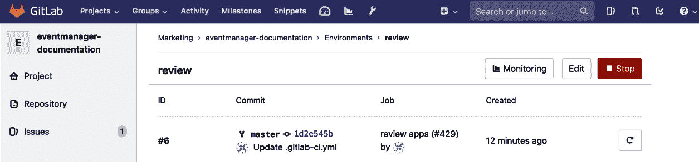

# 第十章：创建你的产品、验证并打包

在本章中，我们将尝试将上一章的理论与其在 GitLab 中的实现进行比较。GitLab 的诞生源于需要一个具有高级功能的协作平台，它已经自然地发展成现在的形式。它是在敏捷性理念的指导下构建的。我们将展示一个用例，其中一家小公司希望开发一款软件产品，我们将使用 GitLab 将这个创意转化为产品。

在本章中，我们将涵盖以下主题：

+   GitLab 工作流

+   管理你的创意

+   规划你的功能

+   创建它

+   验证你的产品

+   打包以供使用

# 技术要求

要跟随本章中的指令，请从 GitHub 下载 Git 仓库和示例：[`github.com/PacktPublishing/Mastering-GitLab-12/tree/master/Chapter10`](https://github.com/PacktPublishing/Mastering-GitLab-12/tree/master/Chapter10)。

如果你想尝试这些示例，你将需要一个亚马逊账户。

你还需要**AWS 命令行界面**（**AWS CLI**）：[`docs.aws.amazon.com/cli/latest/userguide/cli-chap-install.html`](https://docs.aws.amazon.com/cli/latest/userguide/cli-chap-install.html)

# GitLab 工作流

记住我们在上一章中介绍了 GitLab 视角下的 DevOps 流水线。此截图展示了 GitLab 的各个阶段：


在本章中，我们将展示整个流水线的多个方面，并尝试在我们的示例项目中使用它。第一阶段定义为**管理**，作为第一个阶段可能听起来有点奇怪，但它是一个贯穿整个流水线的持续过程，GitLab 提供了相应的工具。接下来的阶段是**计划**，在这一阶段，你需要进行细化、优先级排序并设定时间表。然后进入**创建**阶段，在这一阶段中执行任务以产生解决方案。创建完产品后，你需要在**验证**阶段测试其各个方面。验证产品后，你将进行打包以供部署。

为了更详细地解释 GitLab 工作流，我们将展示一个将贯穿全章的用例，展示 GitLab 中的各种功能。对于某些功能，你将需要最全面的 GitLab 许可证。

假设有一家公司叫做*Event Horizon*，他们想要建立一个管理活动（面向人类）的解决方案。例如，你可以使用他们的解决方案来安排派对的邀请。

我们介绍了 User1，他是一名后端工程师，负责为该解决方案创建后端。然后我们还有 User2，他目前是该产品的产品负责人。他们都属于公司的 IT 部门。接着是 User3，他属于市场营销部门。

User1 和 User2 都已成为 GitLab 中 IT 小组的成员。User3 是市场营销小组的成员，但仅具有 IT 组的报告者权限。

让我们帮助他们（最小化地）创建这个产品，并展示他们如何使用 GitLab 来完成这一过程。

在用户和开发人员都参与的会议中（在 XP 中的发布规划，或者在使用 Scrum 时的 Sprint 0），决定了以下需求：

1.  我们希望构建一个帮助组织活动的应用程序。

1.  需要通过电子邮件进行沟通。

1.  我们提前创建了一个邀请者名单。

1.  邀请者可以互动地表示是否会参加。

1.  非功能性需求：文档非常重要。

1.  非功能性需求：我们希望尽可能实现自动化。

1.  非功能性需求：所使用的工具应增强协作。

1.  非功能性需求：使用的代码应至少经过另一个人的审查。

在会议结束时，需求被优先级排序，开发人员与客户不再讨论，转而讨论 GitLab 作为产品的可能性。这个阶段是下一部分的主题。

# DevOps 阶段——管理你的想法

我们学会了不再事先创建大型设计，而是采用迭代开发的方式。然而，即使是使用敏捷方法论的项目，在开始编码之前也有一些需要考虑的事项。在 DevOps 生命周期的这一阶段称为*管理*，它包括了*整个生命周期*。这是敏捷迭代的开始，也是结束，处于两者之间。你将从一开始就管理你的解决方案，这个过程永不停歇。管理的一部分是了解你的进展情况。你可以在 GitLab 中分析这一点，正如下一部分所展示的那样。

# 周期分析

在通过敏捷方法开发软件时，最重要的度量指标之一是周期时间。这个**关键绩效指标**（**KPI**）可以最好地描述为从开始工作到任务完成所经过的总时间。或者在 IT 领域，它指的是将一个想法实现到生产环境所需要的时间。

在敏捷项目管理之前，曾使用微软项目等工具来跟踪时间。如今，*估算*不再被输入到项目中，而是通过故事点来计算其他因素，如风险和速度，这些用于提前规划几个星期的工作。

在 GitLab 中，有一个地方可以测量周期时间：周期分析。这意味着你需要使用 GitLab 的项目管理功能，而且它在所有版本中都可以使用。以下图片是 GitLab CE 项目的周期分析示例。请注意，一个想法进入生产环境大约需要一个月的时间（这与其实际发布周期相符）：


我们可以在项目的后期使用周期分析来检查 GitLab 的使用情况以及开发团队的开发速度。

# DevOps 阶段——规划你的特性

GitLab 所设想的 DevOps 生命周期的下一个阶段是*计划*。在这个阶段，我们将探索所有为编码和构建解决方案做准备的步骤。在 GitLab 中，有几个工具可以帮助你完成这个阶段，无论你偏好哪种开发方法（敏捷或瀑布式）。从哪里开始？我们总是从创建一个问题开始。我们将在下一节中讨论这个问题：

# 问题

什么是问题？其实它可以是很多东西。它可能是一个新的商业想法，一个技术问题，或者是求助的呼声。问题就像是开始一个新的讨论，它是一种表达思考的方式。随着其他人的参与，它应该会发生变化。它是 GitLab 中的原子性的、基本的、最初的事物，其他一切都是由此派生的。通常，最好先查看现有问题列表，看看你的问题或需求是否已经是现有问题的一部分。

GitLab 作为一个产品，促进了这一讨论，并提供了管理讨论的方式以及验证假设的流程。

一个问题有多个属性和概念，我们将一一查看。

# 内容

当然，问题有内容，那么它是如何构成的呢？问题有一个标题和描述。还可以通过 markdown 格式在问题中插入任务。作为内容的一部分，还包括随附的评论和通过问题关联并可查看的事件/活动。在内容中，你还可以插入快速操作，这将在本章后面讨论。

# 问题的状态

问题有几种状态。当然，它可以是打开的或关闭的。另一个状态方面是问题的机密性。如果有敏感信息，问题可以标记为机密。这样问题的可见性就限制为拥有至少报告者权限的组成员。

# 元数据

每个问题都有一个作者，这些信息会显著地显示出来，同时还会显示当前的指派人。其他元信息包括一些熟知的项目管理数据，如：里程碑、截止日期和权重。

让我们基于我们的示例来澄清这一点。*Event Horizon*公司即将开始第一次 Scrum 迭代。他们想使用 GitLab 的问题来进行项目管理。

User1 创建了一个问题，询问我们将使用哪种技术。这可以是第一个问题的一个例子，如下图所示：


你会看到有一个定义了任务的列表。

User2 创建了一个关于项目应使用哪种文档风格的问题，如下图所示：


这两个问题都是有效的问题，可以用来发起讨论，我们将看到当一个问题发展到下一个层次——讨论时会怎样。我们将在下一节中讨论这个问题。

# 讨论

这是 GitLab 中非常重要的部分，是问题发现的下一步。你可以在问题的上下文中通过评论的形式给出反馈，也可以在以下内容中进行：

+   史诗（Epics）

+   合并请求

+   代码片段

+   提交（Commits）

+   提交差异（Commit diffs）

也可以创建线程式讨论，或将评论转化为线程讨论。你可以使用 Markdown 格式化你的文本，并使用快速操作（如本章中“*快速操作*”部分所述）。默认的评论形式如下所示：


如果你已设置 GitLab 接收电子邮件，你可以回复作为评论通知邮件发送的电子邮件。回复这些邮件会创建新的评论或讨论项。在以下截图中，你将看到“事件视界”Web 应用程序中的一个问题讨论：


如前所述，也可以向一个史诗（Epic）添加讨论，我们将在后面讨论这一点。以下示例是添加任何讨论到史诗的截图：


通过这些讨论，想法得以发展，对它的理解也得以深化。

# 里程碑

里程碑在项目中可以有不同的功能，但在 GitLab 中它们用于标示在实现一个共同目标时所处的位置，该目标由问题和合并请求定义。

里程碑可以用来标记敏捷迭代或冲刺的开始和结束。将里程碑命名为你的冲刺名称是非常实用的，然后你可以将问题关联到里程碑上，以便添加工作。

在 GitLab 中，它们作为一个发布周期使用。例如，当从版本 11.8 升级到 11.9 时，所有包含在该版本中的工作将由一个里程碑表示，并且该里程碑将标记为 11.9。每项工作都通过一个问题来表示，例如，你需要解决的问题或讨论。所有这些问题共同推动一个大型的里程碑。

对于“事件视界”项目，定义了三个里程碑：mvp 1、MVP3 和 mvp2。你可以如下所见：


如果我们打开一个里程碑，它具有以下特点：


项目里程碑只能在项目上下文中与问题和合并请求链接。你可以通过访问“问题”（Issues）然后选择“里程碑”（Milestones）查看里程碑列表。组里程碑可以在组上下文中与问题和合并请求链接，这意味着你可以将其链接到多个属于该组的项目。你可以通过组中的“问题”和“里程碑”链接找到这些里程碑。通过仪表板的里程碑列表或通过顶部导航链接“里程碑”（Milestones），可以查看所有里程碑的概览。

# 史诗（Epics）

如果您使用的是 GitLab EE，您可以创建史诗。史诗是一个广泛的用户故事，但仍然需要被拆解成一组更小的用户故事。通常，史诗描述的是一个定义好的功能或产品特性，但在团队能够承诺在一个冲刺（sprint）内实现之前，还需要进行更详细的工作。它像是问题中的一个主题。

对于大型组织，特别是处理长期项目管理程序的组织，还可以使用多级史诗（epic），以便您能够链接并协调各项工作。在创建史诗时，表单中有一个按钮（+）可以使用。

史诗与问题非常相似，您拥有相同的编辑功能和状态。相同的格式化方式也适用，快捷操作也一样。对于史诗来说，更为重要的可能是设置到期日期的选项。大型项目通常跨多个业务领域，且更依赖于日期，因此我们可以想象，这些字段在这里比在敏捷驱动的小型项目中更为合适。

从史诗中，您可以导航到关联的问题。同时，当问题变得过大并且被错误地表示为史诗时，也可以将问题提升为史诗。

对于 Event Horizon 项目，产品负责人 User3 可以创建一个史诗，以追踪两个不同项目的进展以及之前创建的问题。下图展示了这些项目的进度追踪：


使用史诗来将问题分组的功能对于保持对多个讨论、问题和项目的控制非常必要，这些讨论、问题和项目共同朝着解决方案迈进。

# 时间追踪

通过此功能，您可以追踪在问题和合并请求上花费了多少时间。您还可以追踪预估时间，以了解自己的进展情况。此功能是 GitLab Core 的一部分。

在下图中，我们可以看到，在 eventmanager 项目中，某个问题的时间已经被预估和使用：


在问题或合并请求的正文中，以及在评论中，您可以使用快捷操作输入该问题的预估时间和已用时间。此操作仅限团队成员执行。

如下图所示，您可以使用 `/estimate`，后跟时间单位。如果某个任务需要五天四小时，您可以在评论中写 `/estimate 5d 4h`，然后按下评论按钮。每个问题只能有一个预估时间。您也可以通过使用 `/remove_estimate` 来删除预估时间。以下是参考截图：


同样，你可以记录在问题上花费的时间。项目成员可以使用快速`/spent`操作在问题和合并请求中添加时间，累计专门用于某个问题的总时间。例如，如果已经花费了两个小时，你可以发出`/spent 2h`，它将在右侧面板显示。你甚至可以通过使用负数来删除花费的时间，例如，`/spend -1h`。它不会低于 0，但会重置该数字。你也可以使用`/remote_time_spent`一次性移除所有已花费的时间。

# 快速操作

GitLab 中一个非常方便的功能是快速操作。你可以使用带有特定关键字的`/`来触发对问题、史诗、合并请求和提交的命令，就像使用 IRC 聊天一样。这比使用 GitLab 的网页按钮或其他控件要快。记得将每个*命令*放在单独的行上，否则它将被解析错误。一旦它们被解析并执行，它们将从文本中被移除，其他人无法看到它们。当然，执行的操作会有审计日志**。**

一些快速操作的示例如下：

+   `/todo`：从评论中添加一个待办事项。

+   `/done`：标记待办事项为已完成。

+   `/close`：与点击关闭按钮相同

+   `/assign me` 或 `@其他人`

+   `/milestone %milestone`：从评论中设置一个里程碑。

+   `/estimate <1w 3d 1h 10m>`：添加时间估算

+   `/due <in 1 day>`：设置截止日期

+   `/approve`：批准合并请求

+   提交消息的特殊快速操作：`/tag v1.5` – 立即为提交添加一个自定义消息标签。

你可以在此处找到所有快速操作：[`docs.gitlab.com/ee/user/project/quick_actions.html`](https://docs.gitlab.com/ee/user/project/quick_actions.html)

# 项目问题看板

GitLab 中隐藏着一个非常实用的项目管理功能，它被称为*项目问题看板*。它可以通过可视化来实现工作流，并帮助进行规划和组织。它并不强制要求某种工作方式，你需要自己组织并形成工作流程。看板强烈依赖于标签，这些标签用于将问题分组到不同的列表中。

如果你进入左侧导航栏中的“问题”部分，你会找到“看板”选项。默认情况下，你会看到一个名为“开发”的看板，提供了基本的流程，如“打开”，“待办”，“进行中”和“已关闭”。你可以将问题从一个流程拖动到另一个流程，表示状态发生了变化。例如，如果一个问题已经完成，你可以将其拖动到“已关闭”。这样，问题会自动获得“已关闭”标签。以下截图是 eventmanager 项目问题看板的示例：


如果你使用 GitLab 企业版，甚至可以拥有多个问题看板，这可以意味着几种情况：

+   一个看板可以由多个团队共享：团队问题看板。

+   每个团队可以拥有自己的看板。

+   根据看板的范围（里程碑、标签、分配人和权重），项目有几种不同的视图。

在下图中，你可以看到如何通过点击下拉列表中的“开发”来创建新的问题板。默认的板如下所示：


当你点击“创建新板”时，会弹出一个表单，要求你输入新板的名称和范围。与标签一样，它只是问题的一个属性，用于对问题进行分组或聚合。我们选择专注于里程碑，并选择里程碑 MVP3，这个里程碑是来自第 3 次冲刺的最小可行产品，如下所示：


创建后，你将看到一个问题板，其中包含已分配到里程碑的所有问题。你可以通过点击添加问题（这会将问题与里程碑关联），如以下示例所示：


问题板可以作为团队的信息展示板，它按照你想要的方式组织问题，并且可以作为团队会议的讨论主题。

# 待办事项

对个人用户有用的一个规划功能是*待办事项*。通知邮件可能会堆积在你的收件箱里并变得杂乱。一个易于使用的待办事项列表，可以按时间顺序查看任务，更加聚焦。你可以在导航栏顶部找到它们，如下所示：


当你点击待办事项时，你将看到一个待办事项列表，并可以选择按不同字段进行排序，如以下示例所示：


以下项可能会触发待办事项：

+   一个问题或合并请求被分配给你。

+   在问题、合并请求、提交或史诗中被 `@提及`。

+   在你的项目 CI/CD 管道中的某个失败任务被标记为*不允许失败*。

+   当在自动化管道中，合并请求出现冲突时。

# DevOps 阶段 - 创建它

现在，项目已经通过创建问题、里程碑等进行了规划，接下来是时候真正开始构建了。下一个阶段是*创建*，GitLab 提供了多种工具来帮助你实现这一目标。在开始构建之前，你应该确保项目和团队结构适合合作。

# 项目和小组

*Event Horizon* 公司在 GitLab 中创建了两个小组。一个小组叫做 IT，另一个叫做 Marketing，如下图所示：


在此上下文中，我们创建了两个独立的项目。第一个叫做 eventmanager，它将包含技术解决方案的源代码。如果这是你的第一个项目，你可以点击“新建项目”，或者点击顶部导航栏的 + 图标来创建该项目。创建新项目的表单如下所示：


项目的标题是`eventmanager`，它也会出现在 URL 中。仔细查看 URL 的第一部分。这是命名空间，默认情况下是你自己的命名空间，但我们希望这个项目位于 it 组中。当你这么做时，你会注意到可见性会自动设置为私密。这是因为*it*组将其作为默认设置。

最后，我们希望这个项目能附带一个 README 文件，因此我们需要选择自动创建它。不要担心项目的外观，我们将在迭代开发中进行改进。

接下来，有一个名为 eventmanager-documentation 的第二个项目，它将包含文档内容。我们将使用 GitLab Pages 作为技术来构建我们的用户文档，并选择 Pages/Plain HTML 作为模板。如下图所示：


你需要输入项目名称和项目标识符，并根据以下示例确定可见性：


如果你点击“项目”，你将看到两个项目的列表，如下所示的示例：


现在我们的项目和组结构已经准备好，让我们处理其他促进合作的功能。

# 代码片段

如果你曾作为开发者使用过 GitHub，你应该见过*gists*。这些是可以用于多个目的的小段代码。它们通常会出现在多个代码仓库中，但也可以作为 gists 进行重用。在 GitLab 中，这个概念被称为*snippets*（代码片段）。它们也可以用作讨论示例，等等。下面的示例是一个新的代码片段截图：


你可以在个人和项目级别创建代码片段。它们可以设置为公开，甚至有一个选项可以将它们嵌入到你自己的网站中，如下所示的示例：


代码片段可以用来共享信息，使用它们可以帮助实现平台的需求，从而增强协作性。

# Web IDE

从 GitLab 10.4 版本开始，GitLab 提供了增强版的 Web 编辑器，使你能够在网页上在线编辑代码。它提供了许多不同的功能，包括对最常用语言（PHP、Ruby、Shell、Python、Java、C）和标记语言（XML、Markdown、HTML）的语法高亮显示。它基于 Monaco 编辑器，你可以在这里找到它：[`microsoft.github.io/monaco-editor/`](https://microsoft.github.io/monaco-editor/)。

Event Horizon 公司也可以在 Web IDE 中开发他们的软件。当然，它支持 Ruby，这是 GitLab 主要编写的语言。

在以下截图中，你将看到在 Web IDE 中显示的 eventmanager 项目的文件：


使用此工具还将增强 Event Horizon 内部的协作。

# Wiki

虽然我们为我们的新软件产品创建了一个单独的项目来提供文档，但 GitLab 默认也提供了一个创建文档的系统。那就是 Wiki 功能。每个项目都可以轻松启用此功能，之后你将拥有一个完整的 Wiki 系统。

当你通过项目中的左侧导航栏进入 Wiki 时，你将看到如下界面：


如果你创建了一个新的 Wiki，你需要提供标题、所使用的标记语言，然后你就可以开始添加内容。由于所有信息本身都保存在附带的 Git 仓库中，你可以提供提交信息，因为保存页面就相当于创建了一个新的提交，如下图所示：


一旦创建，你下次点击 Wiki 时将看到该页面。你现在可以创建更多页面（甚至是页面层次结构，如果你愿意），并且你可以查看页面历史（所有内容都有版本控制），如下例所示：


如你所见，Wiki 是另一个增强员工协作的功能。

# 受保护的分支

因为在 Git 中有可能重写整个历史，GitLab 内置了一些机制来帮助减轻这一风险。你可以使用*受保护的分支*。

受保护的分支具有以下特点：

+   在 GitLab 11.9 之前，你无法创建受保护的分支，只有*Maintainers*能创建（从 11.9 起，开发人员也可以创建）。

+   只有`Maintainers`才能直接推送到受保护的分支。

+   禁止使用强制推送到受保护的分支。

+   受保护的分支不能删除。

接受更改到受保护分支的唯一方法是使用合并请求。默认情况下，主分支是受保护的分支。以下示例是受保护分支的截图：


使用受保护的分支强制要求进行代码审查，这是`eventmanager`项目的要求。

# 合并请求

所以，`eventmanager`的第一个版本几乎准备好了。User1 已经将最新的更改上传到分支 MVP1，并准备创建一个合并请求，如下图所示：


你可以通过在描述字段中指定`Closes #2, #3`来查看快速操作的使用情况。

如果你向下滚动，你将看到一个部分，展示当你接受此合并请求时，哪些更改被引入到主分支。它会显示我们示例中的更改数量（6），哪些文件被更改，以及更改的内容。如下截图所示：


你可以看到 User3 已被添加为合并请求的审批人，因此他或她必须审查这些更改，如下图所示：


在屏幕底部，你可以看到此合并请求将合并哪些分支，并且可以指定删除源分支和/或合并更改（这意味着所有更改都将放置在一个提交中）。如以下示例所示：


如果 User3 登录，他将看到一个待办事项，要求审核此合并请求。举个例子，假设 User3 进行了一次审核并留下了一些评论。让我们看一下`index.erb`文件的部分内容，该文件用于事件管理应用程序中显示邀请某人参加活动的消息。你可以在代码示例中找到该文件（[`github.com/PacktPublishing/Mastering-GitLab-12/tree/master/Chapter09/eventmanager`](https://github.com/PacktPublishing/Mastering-GitLab-12/tree/master/Chapter09/eventmanager)）。以下是审阅者认为有问题的代码片段：

```
<p>You are invited to my event on December 15!</p>     
```

User3 认为文本`You are invited to my event on December 15!`过于具体，建议简化文本。他希望将文本更改为`You are invited to my event!`。他可以在审核评论中使用快速操作添加建议，格式如下：


保存评论后，它会显示如下示例：


User3 现在可以完成他的审核了。User1 会收到通知，表示合并请求已被审核。当他登录并导航到合并请求中的审核评论时，他将发现 User3 提出的建议，并看到一个按钮可以应用该建议。评论将自动标记为已解决，如下所示：


User3 还有一条关于`attendees.yml`文件中某个条目的评论，如下代码所示：

```
attendees:
   1:
     attending: ''
     email: someone@joustie.nl
     guid: 3e8cb800-51ec-4d5d-ac7a-ca37ebe06389
     name: Someone
   10:
     attending: 'NO'
     email: anotherone@joustie.nl
     guid: 1070d08f-c5ea-4247-95b1-ee7a3ca4a342
     name: Anotherone
   11:
     attending: 'NO'
     email: organiser@joustie.nl
     guid: c7d49f48-2f05-468d-9d2e-9609e8311f3c
     name: Organiser
```

在`attendees.yml`中没有任何带有`YES`的示例条目，因此 User3 建议更改一个条目，如下截图所示：


不幸的是，参加冲刺结束时演示的客户并没有被告知可以选择`No`的选项。同时，也没有定义实际的测试。因此，User1 决定将此评论作为问题推送到下一轮产品迭代中，示例如下：


当所有讨论点都已解决后，User3 可以批准合并请求，如下截图所示：


合并请求功能是使用 GitLab 的最重要原因之一。你可以在项目中合并代码或文本，并进行协作。

# DevOps 阶段 – 验证你的产品

DevOps 生命周期的下一个阶段是*验证*。在创建阶段构建产品后，你需要验证产品是否符合要求，是否安全，以及整体质量是否合格。这一切都可以通过使用**持续集成**（**CI**）功能在 GitLab 中完成。在接下来的部分，我们将讨论 CI 管道中的若干组件。

# 代码质量报告

一个验证代码质量的不错功能是 GitLab 中的 CI/CD 质量扫描。它利用开源且免费的 Code Climate 引擎（[`codeclimate.com/`](https://codeclimate.com/)）。它被嵌入在一个特殊的 Docker 容器中，可以在你的 GitLab 运行器内运行。以下代码是运行此类扫描的`.gitlab-ci.yml`文件示例：

```
code_quality:
 image: docker:stable
 variables:
 DOCKER_DRIVER: overlay2
 allow_failure: true
 services:
 - docker:stable-dind
 script:
 - export SP_VERSION=$(echo "$CI_SERVER_VERSION" | sed 's/^\([0-9]*\)\.\([0-9]*\).*/\1-\2-stable/')
 - docker run
 --env SOURCE_CODE="$PWD"
 --volume "$PWD":/code
 --volume /var/run/docker.sock:/var/run/docker.sock
 "registry.gitlab.com/gitlab-org/security-products/codequality:$SP_VERSION" /code
 artifacts:
 paths: [gl-code-quality-report.json]
```

当任务运行时，将生成以下日志：

```
Running with gitlab-runner 11.7.0 (8bb608ff)
   on test-runner 97YoGmXL
...
```

下载 Docker 容器后，它将开始扫描代码。扫描完成后，将生成如下报告：

```
Uploading artifacts...
 gl-code-quality-report.json: found 1 matching files 
 Uploading artifacts to coordinator... ok            id=403 responseStatus=201 Created token=ngLDxFmF
 Job succeeded
```

要查看报告，可以从右侧下载工件，那里有相关链接。以下示例显示了 Job 工件标签的截图：


如果你用编辑器打开报告并进行适当的格式化，它将显示警告或高风险/严重问题。在 eventmanager 项目的案例中，发现了一个未使用的变量，如下所示：

```
         "type": "Issue",
         "check_name": "Rubocop/Lint/UnusedBlockArgument",
         "description": "Unused block argument - `letter`. If it's necessary, use `_` or `_letter` as an argument name to indicate that it won't be used.",
         "categories": [
             "Style"
         ],
         "remediation_points": 50000,
         "location": {
             "path": "addUID.rb",
...
```

请注意 `"remediation_points": 50000,` 这一条目，它为问题评分。这个分数根据不同类别的发现而有所不同，可以用来比较多个扫描的总分，展示总质量的进展（或下降）。

以下是报告中提到的代码块：

```
    yaml_hash['attendees'].each do |*letter*, hash|
     p hash['name']
     p hash['email']
     p hash['attending']
     p hash['guid'] = SecureRandom.uuid if p hash['guid'] == nil
    end
```

你可以看到，在第一行中有一个`letter`变量，它在循环中未被使用。如果我们将`letter`改为`_letter`，测试应该不再报告此为警告。未使用的变量会被报告为警告，你可以通过加下划线来抑制警告。

在下一次 CI 管道运行后，代码质量扫描将显示未发现任何问题，报告将是空的。

你也可以在合并请求中使用代码质量报告。它可以在合并前运行，并比较修复点。如果有可能存在严重问题，任务会显示为失败并标记为红色。现在我们已经验证了应用程序的最小质量，我们还希望验证应用程序或网站是否对用户可用。我们可以构建审阅版本来进行手动测试。这是我们接下来的部分。

# 审阅应用

您的软件产品的最终验证是运行所有可用的测试，甚至模拟生产环境。在 GitLab 中，可以通过使用 GitLab CI 和 GitLab runners 来实现这一点。为了使其生效，我们将展示一个使用 eventmanager 文档网站的示例。该项目的一个要求是，当然，创建文档。我们还为此创建了一个单独的项目，叫做 **eventmanager-documentation**。已经存在网页，因此我们来自动化审查过程（这也是一个要求：更多的自动化）。我们将使用已启用作为 Web 服务器的 Amazon S3 存储桶（您可以在此处找到关于如何配置它们的信息：[`docs.aws.amazon.com/AmazonS3/latest/dev/HowDoIWebsiteConfiguration.html`](https://docs.aws.amazon.com/AmazonS3/latest/dev/HowDoIWebsiteConfiguration.html)）。

要将文件上传到 S3 存储桶，您需要通过 AWS 进行身份验证。我们可以为项目添加包含所需 AWS 凭证的机密变量。您可以在项目 | 设置 | CI/CD | 环境变量下找到它们，如下图所示：


当 `AWS_ACCESS_KEY_ID` 和 `AWS_SECRET_ACCESS_KEY` 变量存在时，您可以在 GitLab CI/CD 管道中执行 aws-cli 操作。用于部署审查应用程序的 `.gitlab-ci.yml` 文件如下所示：

```
   review apps:
    variables:
      S3_BUCKET_NAME: "joustie-1"
    image: python:latest
    environment: review
    script:
     - pip install awscli
     - aws s3 cp public/*.html s3://$S3_BUCKET_NAME/
```

该作业称为审查应用程序，正如第一行所看到的。然后，声明了一个变量，即 S3 存储桶名称。接下来是所使用的 Docker 镜像名称，在这种情况下，它是一个安装了 Python 的镜像，因此我们可以利用在脚本部分安装的基于 Python 的 AWS CLI 工具。最后一行包含将文件复制到 S3 存储桶的 AWS CLI 命令，并通过我们设置的环境变量进行身份验证。

保存此文件后，作业将运行，如果一切顺利，HTML 文件将上传到您的存储桶。如果您查看作业日志，您将看到如下内容。

1.  首先，它获取容器：

```
 Pulling docker image python:latest ...
```

1.  然后它克隆了仓库：

```
Checking out 5625d409 as master...
```

它安装了 Amazon CLI 工具：

```
 $ pip install awscli
 Collecting awscli
```

1.  然后，它将 HTML 文件上传到 S3 存储桶：

```
 $ aws s3 cp public/*.html s3://$S3_BUCKET_NAME/  Completed 617 Bytes/617 Bytes (2.1 KiB/s) with 1 file(s) remaining
```

当作业成功时，GitLab 中将创建审查环境。您可以点击审查链接，如下所示：


下一页将显示审查环境中的部署列表，如下所示：



您可以通过编辑手动将 URL 添加到环境中，如下所示：


添加 URL 到环境后，将显示一个查看部署的按钮，如下所示：


如果您点击查看部署，您将进入审查应用程序，如下所示：


从 GitLab 12.0 版本开始，在管道视图中，“查看应用程序”旁边将有一个“审核按钮”。点击后，它将运行审核应用程序，并在角落显示一个小表单，你可以在其中输入反馈。这些反馈将直接插入到问题中。


因此，为了验证我们的项目，我们使用了事件管理器代码的代码质量报告。我们发现，最初有一个警告，提示某个变量没有被使用。我们推荐了修复方案，并再次运行管道，警告消失了。

我们展示了在文档项目中使用审核应用程序的示例。通过使用此审核应用程序，我们可以验证最初的需求是否得到了满足。

在你的管道中实现的两种自动化方法将极大增强你的敏捷性和 DevOps 能力。当你发现错误时，可以修正它们并再次运行管道。

# DevOps 阶段 – 为使用打包

GitLab 在其产品中使用 Docker 容器有多个用途。为了存储为项目自定义构建的容器镜像，GitLab 还为其添加了 Docker 容器注册表功能。通过使用此功能，你无需将镜像存储在一个可能不够安全的远程位置。容器注册表是下一节的主题。

# GitLab 容器注册表

如果你在 GitLab 中启用了容器注册表功能，你可以存储在 CI/CD 流程中构建的 Docker 镜像。要启用此 GitLab 功能，你需要重新配置 GitLab 实例并启用注册表功能**。** 启用后，每个项目的左侧菜单中会显示一个注册表菜单项。如果你点击它，你可以查看注册表的内容和如何使用它的说明，如下图所示：


要将镜像存储在其中以备后用，你需要编辑项目根目录中的 CI/CD 配置文件。以下是事件管理器项目的示例：

```
   build:
   image: docker:stable
    services:
      - docker:dind
    variables:
      DOCKER_HOST: tcp://docker:2375
      DOCKER_DRIVER: overlay2
    stage: build
    script:
      - docker login -u $CI_REGISTRY_USER -p $CI_REGISTRY_PASSWORD $CI_REGISTRY
      - docker build -t $CI_REGISTRY/it/eventmanager:latest .
      - docker push $CI_REGISTRY/it/eventmanager:latest
```

总结该文件，它定义了一个构建任务。在第二行，定义了要使用的镜像为`docker:stable`。因为这个镜像将构建一个 Docker 容器，所以它使用了 `docker:dind` 服务，这是一个启用 Docker in Docker 功能的服务。然后，在变量部分，定义了两个 Docker 变量：连接到的 Docker 主机（即 Docker 引擎，它将自己构建一个容器）和要使用的 Docker 存储驱动程序，默认是 overlay2。定义的阶段是构建。接着，在脚本部分，给出了实际的脚本，它实际上是一个基本的 Docker 构建，前面是登录 GitLab Docker 注册表，后面是将构建的镜像推送到该位置。你可以看到以 `$CI_REGISTRY` 开头的变量。这些是 GitLab 中可用的预定义变量，可以用来利用一次性令牌。

当你在 Web IDE 中保存此文件或将其推送到 GitLab 时，新管道将立即运行。如果没有运行，或者显示没有可用的运行器，请检查你的运行器是否处于特权模式下。它需要这个模式来运行 `docker:dind`。

当镜像完成后，它会带着最新标签推送到 GitLab 注册表。如果成功，任务会成功并显示为绿色，正如以下代码所示：

```
$ docker push $CI_REGISTRY/it/eventmanager:latest
 The push refers to repository [registry.joustie.nl:5005/it/eventmanager]
 4fef5b78d890: Preparing
 2cf71380877f: Preparing
 ...
latest: digest: sha256:346123861d2c745902e3e2aae3101c0fb3c17414467c74204119f17c2c0cfc9c size: 1786
 Job succeeded
```

之后，你可以通过导航到项目的注册表页面来验证容器是否存在，如下所示：


注册表是从 CI/CD 管道存储镜像工件的一种安全方式。在 DevOps 管道中，它是包阶段的一部分。

# 总结

本章尝试通过一个示例解释 GitLab 流程。通过事件管理器示例展示模型的第一阶段，能够说明为什么 GitLab 是从敏捷革命中诞生的工具。从构想到实施，每个步骤都可以自动化，并且非常可定制。在下一章中，我们将继续探讨管道，通过查看发布和配置阶段。

# 问题

1.  DevOps 循环的第一阶段是什么？

1.  GitLab 中最重要的信息单元是什么？

1.  为什么可以将评论转换为讨论？

1.  如何为问题提供四天的估算？

1.  如何在 GitLab 中强制执行审查机制？

1.  GitLab Runner 运行代码质量扫描需要什么设置？

1.  如何启用链接到已部署环境的功能？

1.  为了在项目中启用注册表链接，你需要做什么？

# 深入阅读

+   *全面的 Ruby 编程* 由 *Jordan Hudgens* 编著：[`www.packtpub.com/application-development/comprehensive-ruby-programming`](https://www.packtpub.com/application-development/comprehensive-ruby-programming)

+   *学习 Docker - Docker 18.x 基础* 由 *Gabriel N. Schenker* 编著：[`www.packtpub.com/networking-and-servers/learn-docker-fundamentals-docker-18x`](https://www.packtpub.com/networking-and-servers/learn-docker-fundamentals-docker-18x)

+   *AWS 自动化秘籍* 由 *Nikit Swaraj* 编著：[`www.packtpub.com/virtualization-and-cloud/aws-automation-cookbook`](https://www.packtpub.com/virtualization-and-cloud/aws-automation-cookbook)

+   *有效的 DevOps 与 AWS - 第二版* 由 *Yogesh Raheja*、*Giuseppe Borgese* 和 *Nathaniel Felsen* 编著：[`www.packtpub.com/virtualization-and-cloud/effective-devops-aws-second-edition`](https://www.packtpub.com/virtualization-and-cloud/effective-devops-aws-second-edition)
