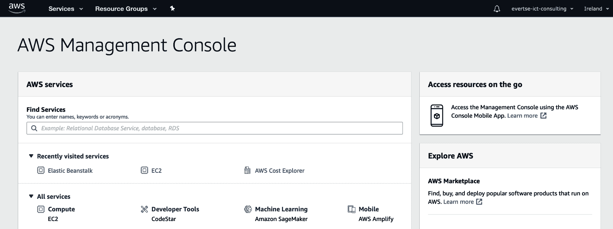
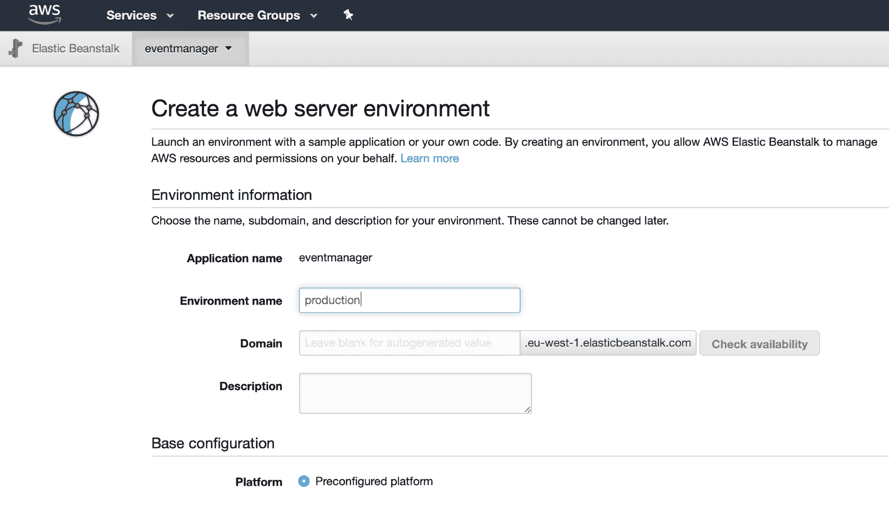
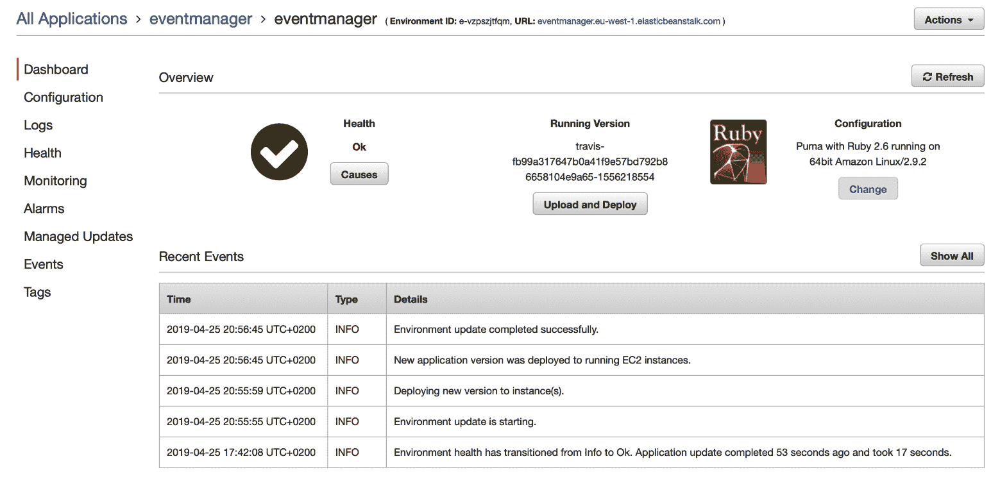
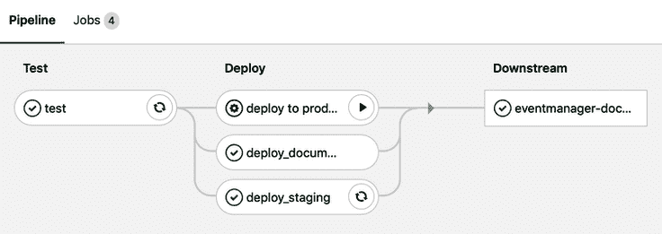
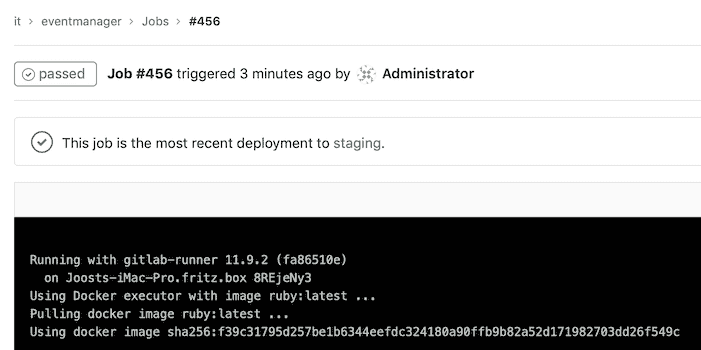
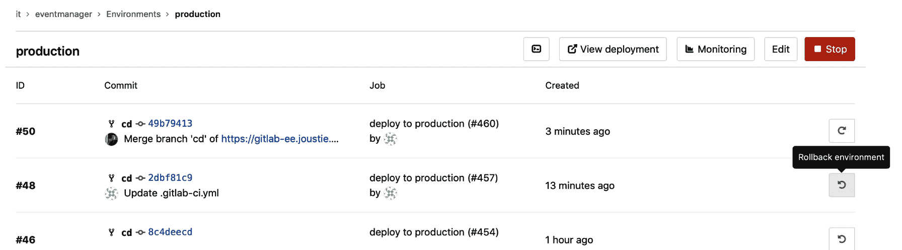
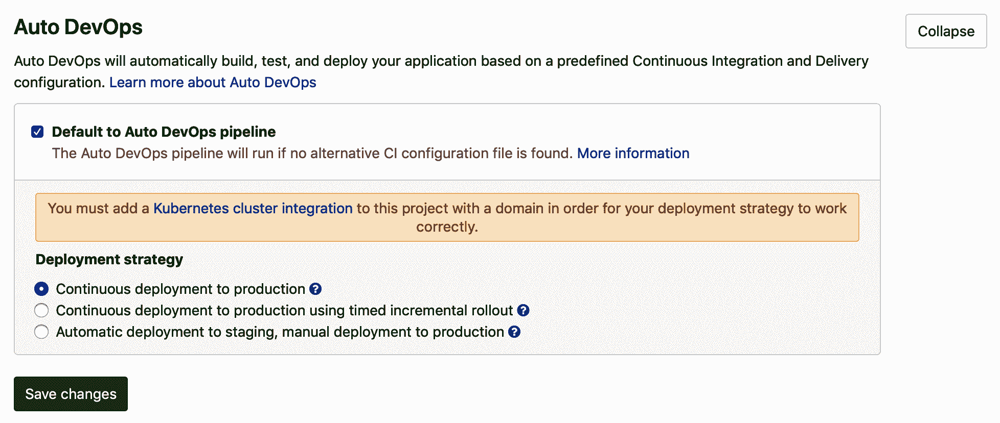
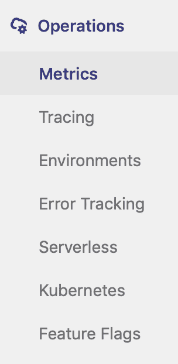
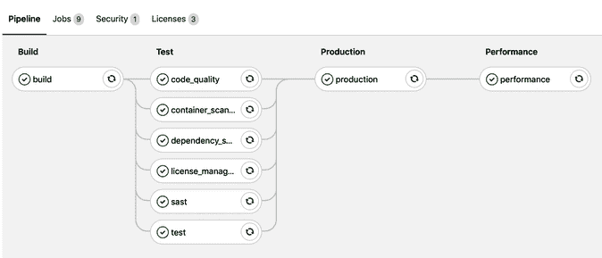
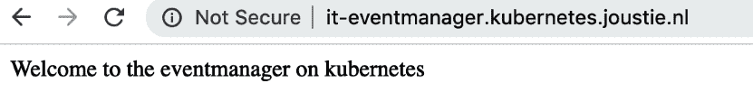

# 第十一章：发布和配置阶段

在本章中，我们将进一步推进自动化。我们将首先展示如何在测试后将您的代码部署到预发布环境，并最终部署到生产环境。这是 DevOps 转型中的一个基本概念。本章的最后，我们将解释 Auto DevOps，它是一种将部署完全自动化的方式，通过集成测试、安全扫描，甚至性能测试，将代码部署到 Kubernetes 集群。这被 GitLab 视为最优的 DevOps 路径。

在本章中，我们将涵盖以下主题：

+   在 Amazon Web Services 上进行的持续部署

+   使用 Google Cloud 中的 Kubernetes 集群进行 Auto DevOps

# 技术要求

为了跟随本章中的指示，请下载本书的 GitHub 仓库以及示例：[`github.com/PacktPublishing/Mastering-GitLab-12/tree/master/Chapter11`](https://github.com/PacktPublishing/Mastering-GitLab-12/tree/master/Chapter11)。

在`Chapter11`目录下，您将找到两个应用程序，它们用于本章中的示例。

要运行某些自动化脚本，您需要一个**Amazon Web Services**（**AWS**）账户，您可以在此创建：[`aws.amazon.com/free/`](https://aws.amazon.com/free/)。

要了解如何在**Google Kubernetes Engine**（**GKE**）上创建集群，您还需要一个可以与 Google Cloud 一起使用的 Google 账户，您可以在此创建：[`cloud.google.com/products/search/apply/`](https://cloud.google.com/products/search/apply/)。

# 持续部署

如第九章所述，持续部署是**GitLab 愿景——一个应用中的完整工具链**的延伸，它是持续集成的扩展，旨在最小化周期时间；也就是开发团队生产一行新代码并将其部署到生产环境的时间。我们将通过将`eventmanager` Ruby 代码部署到 Amazon Elastic Beanstalk 来演示这一实践，Elastic Beanstalk 是一种用于部署和扩展使用多种语言在不同平台上开发的 Web 应用程序和服务的服务。

还有一个选项是创建运行 Puma Web 服务器的 Ruby 环境。让我们登录 AWS web 控制台（[`console.aws.amazon.com/console/`](https://console.aws.amazon.com/console/)），并点击“服务”标签。我们可以使用搜索选项在 Amazon Cloud 的广泛服务中查找某些内容：



在“查找服务”小部件中输入`beanstalk`，然后点击它找到的链接。选择创建一个新环境：



环境将被部署。当完成后，您可以在仪表板中查看：



我们将使用 CI/CD 作为持续部署策略。首先，我们将创建一个 `.gitlab-ci.yml` 文件，包含不同的阶段（暂存和生产）。该文件的第一部分将定义在不同阶段使用的变量。在这里，我们将定义一个 `S3_BUCKET_NAME`，该变量将用于复制部署包，`REGION` 用于指定服务的托管位置，最后是 `APPNAME`，它对应于 Amazon Beanstalk 中的应用名称：

```
 variables:
    S3_BUCKET_NAME: "elasticbeanstalk-eu-west-1-513361393569"
    REGION: "eu-west-1"
    APPNAME: "eventmanager"
```

我们需要在推进到下一阶段之前运行我们的测试。在以下代码中，第二行指定了一个安装了 Ruby 的 Docker 镜像来运行我们的测试。在脚本部分，运行默认的`rspec`测试：

```
 test:
    image: ruby:latest
    stage: test
    script: "bundle install;rspec"
```

这个步骤将使用 dpl 工具（[`github.com/travis-ci/dpl`](https://github.com/travis-ci/dpl)）与 Amazon Beanstalk 进行交互并部署到暂存环境：

```
  deploy_staging:
    stage: deploy
    script:
      - echo "Deploy to staging server"
    image: ruby:latest
    environment:
     name: staging
     url: http://staging.gbnfcg9st9.eu-west-1.elasticbeanstalk.com
    script:
     - echo "Deploying to staging"
     - gem install dpl
     - dpl --provider=elasticbeanstalk --access-key-id=$AWS_ACCESS_KEY_ID --secret-access-key=$AWS_SECRET_ACCESS_KEY --app=$APPNAME --env=$CI_ENVIRONMENT_NAME --region=$REGION 13  --bucket_name=$S3_BUCKET_NAME
    only:
    - cd
```

如你所见，我们还需要从某处获取 AWS 凭证（`$AWS_ACCESS` 变量）。我们可以在 `eventmanager` 项目的设置中定义这些变量，放在 CI/CD 环境变量部分。现在，我们将使用 GitLab 11.8 版本以来提供的 *多项目管道* 功能。我们将定义一个 *桥接作业*，该作业将在 `eventmanager-documentation` 项目中运行默认管道：

```
deploy_documentation:
   stage: deploy
   variables:
     ENVIRONMENT: staging
   trigger: marketing/eventmanager-documentation
```

我们还想部署到生产环境。为此，我们为其创建了一个名为 `production` 的独立 Beanstalk 实例。但如果我们希望最后一步保持为手动触发的步骤呢？那么我们需要定义一个带有 `when:manual` 的控制结构，这意味着该步骤必须手动启动：

```
  deploy to production:
     stage: deploy
     environment: production
     when: manual
     image: ruby:latest
     script:
      - echo "Deploying to production"
      - gem install dpl
      - dpl --provider=elasticbeanstalk --access-key-id=$AWS_ACCESS_KEY_ID --secret-access-key=$AWS_SECRET_ACCESS_KEY --app=$APPNAME --env=$CI_ENVIRONMENT_NAME --region=$REGION 10  --bucket_name=$S3_BUCKET_NAME
    only:
    - cd
```

如果你保存这个 `.gitlab-ci.yml` 文件（并进行提交和推送），它将开始部署。如果你点击管道，你将看到作业概览：



在前面的截图中，你可以看到各个阶段。首先是测试阶段，运行 `rspec` 测试。`deploy_documentation` 作业触发下游管道（`eventmanager-documentation`）。同时，部署到暂存区域也开始了。让我们点击开始的作业：



通过查看部署到暂存区域的日志文件，你将看到以下代码：

```
Running with gitlab-runner 11.9.2 (fa86510e)
   on Computer1 8REjeNy3
 Using Docker executor with image ruby:latest ...
 Pulling docker image ruby:latest ...
 Using docker image sha256:f39c31795d257be1b6344eefdc324180a90ffb9b82a52d171982703dd26f549c for ruby:latest ...
 Running on runner-8REjeNy3-project-3-concurrent-0 via Joosts-iMac-Pro.fritz.box...
 Reinitialized existing Git repository in /builds/it/eventmanager/.git/
 Clean repository
 Fetching changes...
 fatal: remote origin already exists.
 Checking out 2dbf81c9 as cd...
 ...
 Skipping Git submodules setup
 $ echo "Deploying to staging"
 Deploying to staging
```

容器安装了 dpl 依赖：

```
$ gem install dpl
 Successfully installed dpl-1.10.8
 1 gem installed
```

然后它运行部署：

```
dpl --provider=elasticbeanstalk --access-key-id=$AWS_ACCESS_KEY_ID --secret-access-key=$AWS_SECRET_ACCESS_KEY --app=$APPNAME --env=$CI_ENVIRONMENT_NAME --region=$REGION --bucket_name=$S3_BUCKET_NAME
```

dpl 工具仅在 Git 仓库为干净状态时运行：

```
Preparing deploy
 Cleaning up git repository with `git stash --all`. If you need build artifacts for deployment, set `deploy.skip_cleanup: true`. See https://docs.travis-ci.com/user/deployment#Uploading-Files-and-skip_cleanup.
 No local changes to save
 Deploying application
 No stash found.
 Job succeeded
```

除了显示应用已部署的消息外，没有关于上传的反馈。你可以通过访问在 AWS 控制台中创建的 Beanstalk 环境中提到的 URL 来验证此部署。

你可以从图示中手动触发部署到生产环境的作业，这就是我们看到播放按钮的地方。

在 GitLab 中，你可以前往操作 | 环境 | 生产查看部署情况。你也可以回滚到先前的发布版本：



在这一部分，我们向你展示了如何使用 GitLab CI 和 GitLab Runner 实现一个部署管道。你只需使用 Shell 脚本创建它们，并通过使用多项目管道和高级语法让它们变得更加复杂。

# Auto DevOps

默认情况下，Auto DevOps 在每个项目中都是开启的。它本质上是一个非常复杂的`.gitlab-ci.yml`文件，概述了从创建阶段开始的整个 DevOps 管道。

这符合 GitLab 的愿景，即提供一个应用程序来协作完成应用程序整个 DevOps 生命周期的工作。

# 配置 Auto DevOps

如前所述，Auto DevOps 默认在每个项目中启用，但如果你想禁用它或配置不同的设置，你需要进入设置，方法是前往设置 | CI/CD | Auto DevOps：



如你所见，你需要配置一个 Kubernetes 集群才能让这一切正常工作。

你可以在这里管理的另一个设置是部署策略。默认设置是管道部署到生产环境。这可能不是你企业所需的策略，你也可以使用增量发布策略。

你还应该注意到，部署管道在最后一步（生产）之前是完全自动化的。你可以选择将其作为手动步骤。

要控制管道中的各个步骤，你可以查看左侧的操作菜单。以下是可用操作的截图：



当第一段代码推送到代码库时，一个 Auto DevOps 管道将被创建。对于`eventmanager`项目，它如下所示：



让我们评估一下前面截图中的 Auto DevOps 管道的每个步骤。

# 构建步骤

主要思路是在构建阶段，你准备好以打包的方式运行你的代码——通过 Dockerfile 构建的 Docker 容器——通过 Heroku 构建包。

对于`eventmanager`应用，`user1`创建了以下 Dockerfile：

```
  FROM ruby:2
   COPY . /var/www/ruby
   WORKDIR /var/www/ruby
   RUN bundle install
   CMD ["ruby","eventmanager.rb"]
   EXPOSE 5000/tcp
```

如你所见，从前面代码的第一行，它拉取了一个基本的支持 Ruby 的 Debian Linux 镜像。它将所有源代码复制到一个目录并进入该目录。然后，运行 bundle install，这会安装所有必要的 Ruby 依赖项。最后，使用 CMD 命令启动`eventmanager`应用并将端口`5000`暴露给外部。必须暴露端口`5000`，因为用于部署到 Kubernetes 的默认 Helm 图表假设此端口用于运行应用。部署后，它将与端口`80`或`443`连接。

以下代码是构建阶段开始时的日志：

```
Running with gitlab-runner 11.8.0 (4745a6f3)
   on runner-gitlab-runner-7fd79f558b-2wx96 _drEv8rS
 Using Kubernetes namespace: gitlab-managed-apps
 Using Kubernetes executor with image registry.gitlab.com/gitlab-org/cluster-integration/auto-build-image/master:stable ...
 Waiting for pod gitlab-managed-apps/runner-drev8rs-project-3-concurrent-0fvjtb to be running, status is Pending
 ...
```

它运行 Kubernetes 执行器并等待 Pod 可用。

当发生这种情况时，构建脚本会运行。首先，尝试登录到此项目的 GitLab 注册表（我们随后需要将构建推送到那里）：

```
$ /build/build.sh
 Logging to GitLab Container Registry with CI credentials...
 WARNING! Using --password via the CLI is insecure. Use --password-stdin.
 Login Succeeded
 ...
```

然后，Docker 镜像的构建将开始：

```
Building Dockerfile-based application...
 Sending build context to Docker daemon  113.7kB

 Step 1/6 : FROM ruby:2-alpine
 2-alpine: Pulling from library/ruby
 ...
```

构建好的容器镜像被推送到 `eventmanager` 项目的 Docker 注册表：

```
Successfully built 5bd173d74f67
 Successfully tagged 
...
 Job succeeded
```

当 Docker 容器镜像存储在注册表中时，后续阶段将使用该镜像并将其拉取。这就结束了构建步骤。下一步是运行代码质量扫描。

# 代码质量扫描

在管道的这一阶段，使用 GitLab runner 扫描您的代码质量。您可以在第十章，*创建您的产品、验证它并打包它*中找到更多信息和示例。

# 容器扫描

下一阶段仍然是测试阶段的一部分。在这一阶段，将从您的镜像中实例化一个容器实例，并使用 clair ([`github.com/coreos/clair`](https://github.com/coreos/clair)) 扫描漏洞。

它将登录到 `eventmanager` 的 Docker 注册表：

```
Running with gitlab-runner 11.8.0 (4745a6f3)
...
 $ container_scanning
 Logging to GitLab Container Registry with CI credentials...
 ...
```

然后，它将尝试获取一个带有扫描工具的容器：

```
Unable to find image 'arminc/clair-db:latest' locally
 latest: Pulling from arminc/clair-db
 ...
```

当容器运行时，它将启动扫描：

```
 2019/04/28 14:08:08 [0;32m[INFO] >Start clair-scanner
 2019/04/28 14:08:37 [0;32m[INFO] > Server listening on port 9279
 2019/04/28 14:08:37 [0;32m[INFO] >Analyzing 9cab74319993fe94abc345fa8933c789f4482b9644f9cb1d9758d31575ed1367
-----------------------------------------------------------+
 | STATUS | CVE SEVERITY | PACKAGE NAME | PACKAGE VERSION | CVE DESCRIPTION |
 | Unapproved | High CVE-2018-6551 | glibc | 2.24-11+deb9u4 | The malloc implementation in the GNU C Library (aka |
...
```

默认的 Ruby 镜像使用的是 Debian 镜像，显然有很多已知的漏洞。

如果您将 Dockerfile 使用的基础镜像切换到 `ruby:2-alpine`，您将获得一个更基础的 Linux 容器，应该不会出现所有这些错误。您将需要重新启动管道（在列表中点击重试）：

```
Waiting for clair daemon to start
...
contains NO unapproved vulnerabilities
```

当没有发现漏洞时，报告将作为构件上传，作业将成功：

```
Uploading artifacts...
 gl-container-scanning-report.json: found 1 matching files
 ..
 Job succeeded
```

创建的 Docker 镜像现在将被扫描已知漏洞。当您想要将任何发现的内容列入白名单时，可以将它们添加到一个名为 `clair-whitelist.yml` 的文件中，并将其添加到您的代码库中。

# 依赖扫描

这一阶段的管道扫描您的代码，以查找软件依赖项中的已知安全漏洞。例如，如果您依赖的第三方库有已知的安全问题，这个问题会被发现。下一章节将详细解释这一点。

当扫描完成时，您将知道您在代码中使用的依赖项是否安全。了解依赖项使用的许可证也很有用，因为这可能会带来许多后果。我们将在下一节中解释这一点。

# 许可证管理

组织常常忽视的一个问题是如何管理您的**知识产权**（**IP**）。有不同的开源许可证，例如被分类为*宽松型*的许可证，如 X11、Apache 和 BSD 许可证。您还可以找到*强制分享*型的许可证，如 GPL，它们更具限制性，可能要求您分享衍生作品。通过使用许可证扫描器，您可以确保不使用对您的知识产权有负面影响的依赖项。

当作业运行时，您将看到以下输出：

```
Running with gitlab-runner 11.8.0 (4745a6f3)
 on runner-gitlab-runner-7fd79f558b-2wx96 _drEv8rS
 Using Kubernetes namespace: gitlab-managed-apps
 Using Kubernetes executor with image registry.gitlab.com/gitlab-org/security-products/license-management:$CI_SERVER_VERSION_MAJOR-$CI_SERVER_VERSION_MINOR-stable ...
```

该扫描从一个容器中运行，但该容器运行代码并解析您的项目：

```
$ license_management
 mesg: ttyname failed: Inappropriate ioctl for device
 Added development to the ignored groups
 Added test to the ignored groups
 Fetching gem metadata from https://rubygems.org/.........
```

这将分析并上传报告构件：

```
Running license_finder  in /it/eventmanager
 LicenseFinder::Bundler: is active
 Uploading artifacts...
 gl-license-management-report.json: found 1 matching files
 Uploading artifacts to coordinator... ok            id=478 responseStatus=201 Created token=HjYg-s1y
 Job succeeded
```

结果也可以从合并请求小部件中查看。

如你所见，在流水线中加入许可证检查非常有用。最好尽早知道你是否使用了影响软件分发方式的依赖项。在流水线的同一个并行步骤中，还会进行静态安全测试。

# 静态应用安全测试（SAST）

这一部分的流水线扫描你的代码，以查找已知的安全问题，这被称为静态应用安全测试。这个内容将在下一章中更详细地解释。测试阶段的最终并行步骤是运行由你的代码定义的实际测试。

# 最终测试步骤

在这个流水线中，启动了一个特定的容器，用于克隆源代码：

```
Running with gitlab-runner 11.8.0 (4745a6f3)
 on runner-gitlab-runner-7fd79f558b-2wx96 _drEv8rS
 Using Kubernetes namespace: gitlab-managed-apps
 Using Kubernetes executor with image gliderlabs/herokuish:latest ...
```

它将尝试检测使用的语言。在我们的案例中，它找到了 Ruby 应用程序，这是正确的：

```
$ setup_test_db
 $ cp -R . /tmp/app
 $ /bin/herokuish buildpack test
 -----> Ruby app detected
 -----> Setting up Test for Ruby/Rack
 -----> Using Ruby version: ruby-2.5.3
 -----> Installing dependencies using bundler 1.15.2
```

安装必要的依赖项后，它将运行 rake 测试任务：

```
-----> Running test: bundle exec rspec
 ...
 Finished in 0.03197 seconds (files took 0.22688 seconds to load)
 3 examples, 0 failures
```

在我们的案例中，未检测到错误。你可以检查 `tests` 文件夹中运行的测试。

当然，运行的测试是你自己编写的，所以你决定它们的价值。测试完成后，下一阶段是部署到生产环境，相关内容将在下一节中介绍。

# 生产环境

默认的 Auto DevOps 流水线将在完成测试阶段后将代码部署到生产环境。你可以设置多个环境变量，以控制副本 pods 的自动扩展。此阶段的繁重工作由 auto-deploy-app Helm 图表完成。你还可以通过将自定义图表添加到项目中的 `.chart` 目录或设置 `AUTO_DEVOPS_CHART` 和 `AUTO_DEVOPS_CHART_REPOSITORY` 环境变量，结合图表 URL 来提供你自己的图表。它将创建以下内容：

+   一个部署令牌

+   一个针对你应用程序配置的 Prometheus 监控实例

让我们通过日志文件运行以下代码：

```
Running with gitlab-runner 11.8.0 (4745a6f3)
 on runner-gitlab-runner-7fd79f558b-2wx96 _drEv8rS
 Using Kubernetes namespace: gitlab-managed-apps
 Using Kubernetes executor with image alpine:latest ...
```

这会检查前一个作业的工件，并对 Kubernetes 域进行检查。它将安装最小化 Helm 执行所需的依赖项：

```
Checking out 08222854 as master...
 Skipping Git submodules setup
 Downloading artifacts for code_quality (477)...
 Downloading artifacts from coordinator... ok        id=477 responseStatus=200 OK token=zxQGxCFW
 Downloading artifacts for license_management (478)...
 Downloading artifacts from coordinator... ok        id=478 responseStatus=200 OK token=HjYg-s1y
 Downloading artifacts for container_scanning (481)...
 Downloading artifacts from coordinator... ok        id=481 responseStatus=200 OK token=hErz9aWj
 $ # Auto DevOps variables and functions # collapsed multi-line command
 $ check_kube_domain
 $ install_dependencies
```

下一步是下载所需的图表（auto-deploy-app 图表或自定义图表）：

```
$ download_chart
```

接下来，我们需要确保已定义命名空间（通常是你使用的 Kubernetes 集群名称）：

```
$ ensure_namespace
```

现在，是时候初始化 Tiller（Helm 服务器）了：

```
 initialize_tiller
```

在这里，创建了一个用于访问注册表的密钥：

```
 create_secret
```

最后，部署可以开始：

```
 $ deploy secret "production-secret" 
deleted secret/production-secret replaced 
Deploying new release... 
Release "production" has been upgraded. 
Happy Helming! ...
```

部署后，你将看到关于应用程序运行 URL 的反馈。该名称是通过将命名空间附加到项目名称和集群运行的域通配符来创建的：

```
NOTES:
 Application should be accessible at: http://it-eventmanager.kubernetes.joustie.nl
 Waiting for deployment "production" rollout to finish: 0 of 1 updated replicas are available...
 deployment "production" successfully rolled out
 $ delete canary
 $ delete rollout
 $ persist_environment_url
 Uploading artifacts...
 environment_url.txt: found 1 matching files 
 Uploading artifacts to coordinator... ok            id=482 responseStatus=201 Created token=koT8yujj
 Job succeeded
```

如果你已配置 `kubectl` 使用你的 GKE 集群的上下文，在命令行中，你可以验证是否已进行部署：

```
Joosts-iMac-Pro:Part3 joostevertse$ kubectl get pods --all-namespaces
```

Pods 列表应该显示已启动的 pods：

```
NAME                                                     READY   STATUS    RESTARTS   AGE
 eventmanager        production-6b9db68f6f-hrwzv                              1/1     Running   0          11h
 eventmanager        production-postgres-5b5cf56747-xngbk                     1/1     Running   0          11h
```

默认情况下，也会启动一个 `postgres` 实例，如果需要，你可以对安装进行微调以使用它。你可以在这里找到更多信息：[`docs.gitlab.com/ee/topics/autodevops/#postgresql-database-support`](https://docs.gitlab.com/ee/topics/autodevops/#postgresql-database-support)。列表中还有其他 Pod，它们都是部署的一部分：

```
certmanager-cert-manager-6c8cd9f9bf-8kbf8                1/1     Running   0          11h
 ingress-nginx-ingress-controller-ff666c548-n2s84         1/1     Running   0          11h
 ingress-nginx-ingress-default-backend-677b99f864-bnk8c   1/1     Running   0          11h
 runner-gitlab-runner-7fd79f558b-2wx96                    1/1     Running   0          11h
 tiller-deploy-6586b57bcb-t6zql                           1/1     Running   0          11h
```

`eventmanager` 应用程序可以通过访问 `http://it-eventmanager.kubernetes.joustie.nl` 来查看：



现在，我们有一个正在运行的应用程序，正在进行测试和监控。接下来的最后一步是对生产环境进行性能检查。我们可以再次使用 Kubernetes 集群为其创建一个测试容器，并对其进行性能测试，这也是下一节的主题。

# 性能

在性能作业的日志文件中，你可以看到 Kubernetes 再次被用来启动一个实例以供使用：

```
Running with gitlab-runner 11.8.0 (4745a6f3)
 on runner-gitlab-runner-7fd79f558b-2wx96 _drEv8rS
 Using Kubernetes namespace: gitlab-managed-apps
```

该作业连接到[GitLab.com](https://about.gitlab.com/)，并验证它应该拉取的镜像版本。它使用 `sitespeed.io` 容器来完成此任务（[`hub.docker.com/r/sitespeedio/sitespeed.io/`](https://hub.docker.com/r/sitespeedio/sitespeed.io/)）：

```
$ performance
 Connecting to gitlab.com (35.231.145.151:443)
 index.js             100% |********************************|  1614  0:00:00 ETA

 Unable to find image 'sitespeedio/sitespeed.io:6.3.1' locally
 6.3.1: Pulling from sitespeedio/sitespeed.io
 ...
```

容器内部，它尝试使用 Chrome 和 Firefox 测量浏览器性能：

```
Google Chrome 63.0.3239.132
 Mozilla Firefox 54.0.1
 [2019-04-25 21:42:41] INFO: Versions OS: linux 4.14.91+ nodejs: v8.9.4 sitespeed.io: 6.3.1 browsertime: 2.1.4 coach: 1.2.0
```

它将进行若干次后续运行：

```
[2019-04-25 21:42:41] INFO: Starting chrome for analysing http://it-eventmanager.kubernetes.joustie.nl 3 time(s)
 [2019-04-25 21:42:41] INFO: Testing url http://it-eventmanager.kubernetes.joustie.nl run 1
 [2019-04-25 21:42:51] INFO: Testing url http://it-eventmanager.kubernetes.joustie.nl run 2
 [2019-04-25 21:43:00] INFO: Testing url http://it-eventmanager.kubernetes.joustie.nl run 3
 [2019-04-25 21:43:09] INFO: 2 requests, 586 bytes, backEndTime: 39ms (±1.87ms), firstPaint: 119ms (±2.43ms), firstVisualChange: 0ms (±0.00ms), DOMContentLoaded: 103ms (±3.06ms), Load: 104ms (±3.06ms), speedIndex: 0 (±0.00), visualComplete85: 0ms (±0.00ms), lastVisualChange: 0ms (±0.00ms), rumSpeedIndex: 119 (±2.25) (3 runs)
 [2019-04-25 21:43:13] INFO: HTML stored in /sitespeed.io/sitespeed-results
 [2019-04-25 21:43:13] INFO: Finished analyzing http://it-eventmanager.kubernetes.joustie.nl
 ...
```

结果将保存为 HTML 报告工件以及 JSON 文件：

```
Uploading artifacts...
 performance.json: found 1 matching files 
 sitespeed-results/: found 64 matching files 
 Uploading artifacts to coordinator... ok            id=483 responseStatus=201 Created token=w-R8qzFw
 Job succeeded
```

以下代码是 JSON 文件的一部分：

```
[
     {
         "subject": "/",
         "metrics": [
             {
                 "name": "Transfer Size (KB)",
                 "value": "0.6",
                 "desiredSize": "smaller"
  ...
```

也提供了一个漂亮的 HTML 报告，这是工件的一部分。

Auto DevOps 是一个非常实用的概念。如果你的应用程序遵循标准且不太复杂，它可以为你提供完整的管道。如果你需要更多的定制化，你可以使用模板并根据需求进行微调。

# 总结

本章展示了 GitLab 的潜力及其在软件产品运营阶段中扮演的角色。你可以开发解决方案，进行测试，并最终在一个环境中运行它。在这个过程中，你可以尽可能地实现自动化。如果使用 Auto DevOps 功能，你将实现 DevOps 概念的全部潜力，这是目前非常抢手的技能。

在下一章中，我们将查看监控和安全阶段，这些是 DevOps 管道中的最后阶段。

# 问题

1.  你在哪个文件中定义部署？

1.  `dpl` 工具是什么？

1.  GitLab 对 Auto DevOps 的愿景是什么？

1.  在构建阶段结束时（使用 Dockerfile），构建工件存储在哪里？

1.  Auto DevOps 中使用的容器扫描器名称是什么？

1.  Auto DevOps 中使用的部署 Helm 图表名称是什么？

1.  生产部署时会部署多少个 Pod？

1.  性能容器的名称是什么？

# 进一步阅读

+   *高级基础设施渗透测试*，作者：Chiheb Chebbi：[`www.packtpub.com/networking-and-servers/advanced-infrastructure-penetration-testing`](https://www.packtpub.com/networking-and-servers/advanced-infrastructure-penetration-testing)

+   *学习 Docker - Docker 18.x 基础*，作者：Gabriel N. Schenker：[`www.packtpub.com/in/networking-and-servers/learn-docker-fundamentals-docker-18x`](https://www.packtpub.com/in/networking-and-servers/learn-docker-fundamentals-docker-18x)

+   *AWS 自动化手册*，作者：Nikit Swaraj：[`www.packtpub.com/virtualization-and-cloud/aws-automation-cookbook`](https://www.packtpub.com/virtualization-and-cloud/aws-automation-cookbook)

+   *在 Azure 上动手实践 Kubernetes*，作者：Gunther Lenz 和 Shivakumar Gopalakrishnan：[`www.packtpub.com/virtualization-and-cloud/hands-kubernetes-azure`](https://www.packtpub.com/virtualization-and-cloud/hands-kubernetes-azure)
