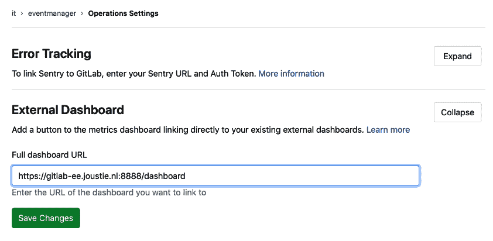

# 使用 Prometheus 进行监控

在本章中，我们将探讨如何使用 Prometheus 时间序列进行监控，同时还将运行一些自动化的安全测试。GitLab 中内置的安全测试仅在使用 GitLab Ultimate 许可证的本地部署或使用 [`gitlab.com`](http://gitlab.com) 上的 Gold 订阅时可用。

在本章中，我们将覆盖以下主题：

+   配置 Prometheus

+   自定义监控

+   静态安全漏洞分析

+   **动态应用安全测试**（**DAST**）

+   依赖性检查

# 技术要求

为了能够管理 Omnibus 安装，需要一个中央配置文件，名为 `gitlab.rb`。你需要创建这个文件或复制一个示例。可以在 [`gitlab.com/gitlab-org/omnibus-gitlab/blob/master/files/gitlab-config-template/gitlab.rb.template`](https://gitlab.com/gitlab-org/omnibus-gitlab/blob/master/files/gitlab-config-template/gitlab.rb.template) 找到模板。此文件在升级后不会更新。在本章中，我们将引用并讨论此文件的元素。

为了跟随本章的指示，请下载包含示例的 Git 仓库，地址位于 GitHub：[`github.com/PacktPublishing/Mastering-GitLab-12/tree/master/Chapter12`](https://github.com/PacktPublishing/Mastering-GitLab-12/tree/master/Chapter12)[.](https://github.com/PacktPublishing/Mastering-GitLab-12/tree/master/Chapter12)

你还需要安装 Python 来创建 Python 示例导出器。

# 配置 Prometheus

Prometheus 是一个开源监控系统，灵感来源于 Google 的生产监控系统 Borgmon。自 2012 年推出以来，该项目已经建立了一个活跃的社区，并被许多公司使用。它是一个 TSDB（时间序列数据库）的例子。这意味着时间在所有度量中都是一个刻意设定的 X 轴。每一个新的条目都是插入，而不是数据行的更新。

这一点最好通过表格来呈现：

| **时间(x)** | **关键** | **值** |
| --- | --- | --- |
| 12.01.33 | ping-latency | 0.234556 |
| 12.03.33 | ping-latency | 0.223344 |

这种方法的两个主要优势如下：

+   **可扩展性**：这些数据库经过调优，能够非常高效地摄取数据。

+   **可用性**：它们提供各种工具和功能，例如数据保留和持续查询。

而大多数监控系统侧重于通过健康检查来衡量外部系统行为，Prometheus 强调通过从软件本身请求度量来衡量内部系统行为。使用 Prometheus，你可以动态地设置监控，这使其成为了解分布式环境（例如 Kubernetes 集群上运行的软件）的一种有价值的工具。

Prometheus 项目提供了客户端库，便于从软件中导出指标。这些库使您能够将监控功能集成到您的软件中。可以说，它为您的应用程序内部的指标打开了一个端口。

您还可以使用客户端库中的函数和对象，暴露应用程序内部的指标。

另一种方法是运行一些独立的小型程序，收集 Prometheus 服务器将抓取的数据。GitHub 上的 Prometheus 组织提供了一些官方推荐的导出器：[`github.com/prometheus`](https://github.com/prometheus)。

GitLab 同时集成了这两种方法。启用后，它可以暴露 GitLab 本身的指标，但全包（Omnibus）包也可以提供额外的导出器实例，能够监控多个组件。监控架构如下所示（如您所见，功能运行在 GitLab 应用程序服务器上）：


您可以在图像中看到几个导出器；让我们逐个查看它们：

+   （GitLab）指标导出器：GitLab 已将客户端功能集成到自身，并且可以在启用设置的情况下暴露指标。您可以在**管理员 |** 设置 | 指标与分析 | 指标 Prometheus 中找到此功能，如下图所示：


通过允许您在 `http://{your gitlab url}}/-/metrics?token=something` 查看导出器的输出，这个方法得以实现。健康检查页面中提供了一个示例，通过 监控 | 健康检查，如下图所示：


确保在请求中附加 token，否则您将看不到任何数据。访问该 URL 时，示例输出如下所示：


+   Redis 导出器：这是一个外部程序，您可以在 [`github.com/oliver006/redis_exporter/blob/master/README.md#whats-exported`](https://github.com/oliver006/redis_exporter/blob/master/README.md#whats-exported) 找到它。它是一个 Go 二进制文件，暴露关于 Redis 的指标，Redis 是 GitLab 用于存储后台作业队列、会话状态和 UI 缓存的内存数据库和缓存。

与 Grafana 配合使用时，可以快速设置仪表盘，如下图所示：


+   Postgres 导出器：这是一个 Go 二进制文件和外部项目，网址为：[`github.com/wrouesnel/postgres_exporter`](https://github.com/wrouesnel/postgres_exporter)。

+   GitLab 监控器：这个导出器有些不同，它是用 Ruby 编写的，并通过 Sinatra Web 服务器 gem 来暴露指标。项目页面为：[`gitlab.com/gitlab-org/gitlab-monitor`](https://gitlab.com/gitlab-org/gitlab-monitor)。

当你查询 GitLab 监控时，可以提供不同的参数，这些参数表示你想抓取的指标种类；它们包括以下内容：

1.  1.  +   **数据库**：提供关于表格、行和 CI 构建的信息

        +   **Git**：提供关于 Git 拉取的信息

        +   **进程**：提供关于 CPU、进程数量、sidekiq 统计信息等的信息

+   Node Exporter：这可能是 Prometheus 中最知名的导出器之一。它包含了应用节点的许多基本指标。同样，这个导出器是用 Go 编写的，并可以在[`github.com/prometheus/node_exporter`](https://github.com/prometheus/node_exporter)找到。

+   要在 GitLab 应用服务器上启用内置的 Prometheus 服务器，编辑`/etc/gitlab/gitlab.rb`文件。搜索`prometheus['enable']`，取消注释并设置为`true`。还有一些其他选项，但仅启用它就能让你得到一个工作的实例。

你应该修改的`gitlab.rb`文件部分如下所示：

```
################################################################################
 ## Prometheus
 ##! Docs: https://docs.gitlab.com/ce/administration/monitoring/prometheus/
 ###############################################################################
 prometheus['enable'] = true
 # prometheus['monitor_kubernetes'] = true
 # prometheus['username'] = 'gitlab-prometheus'
 # prometheus['uid'] = nil
 # prometheus['gid'] = nil

```

修改`gitlab.rb`后，你应该运行重新配置以激活这些更改。你将看到消息，说明某些导出器和 Prometheus 服务器已经启动。

你可以通过访问`prometheus['listen_address']`中配置的地址来进入 Prometheus 控制台。你将看到一个查询界面。如果点击下拉列表，你应该能看到一系列可以查询的指标，如下图所示：


一旦你选择了一个指标，它将显示它在数据库中记录的所有值（包括从 Prometheus 导出器主动抓取的数据）。在这种情况下，选择的视图模式可能是控制台。你还可以通过点击“图表”查看数据的图形表示，如下图所示：


# 使用外部 Prometheus 主机

如果你没有使用 Omnibus 包来管理 GitLab，或者坚持使用外部 Prometheus 服务器，那么情况会有所不同。你需要注意的是，Prometheus 使用的默认安全模型相当简单；它假设任何人都可以查看存储的时间序列数据，并且服务器不提供身份验证、授权或加密功能。如果你需要这些功能，应该在 Prometheus 服务器前准备一个反向代理来帮助。更多关于这方面的信息，可以在[`prometheus.io/docs/operating/security/`](https://prometheus.io/docs/operating/security/)找到。

这种情况的监控架构如下图所示（如你所见，某些功能运行在单独的服务器上）：


现在我们必须确保我们配置了一个准备好从中抓取数据的外部 Prometheus 主机。正如我们之前提到的，Prometheus 是一个单独的 Go 二进制文件。要指定要加载的配置文件，请使用`--config.file`标志。此配置文件必须具有 YAML 格式。下面显示了一个单个 Prometheus 服务器如何监视内嵌在 GitLab 中的 GitLab 指标导出程序的`prometheus.yml`示例：

```

 - job_name: 'git-metrics'
 params:
 token: [ gitlab_health_check_access_token ]
 metrics_path: /-/metrics
 scrape_interval: 5s
 scheme: https
 tls_config:
 insecure_skip_verify: true
 file_sd_configs:
 - files:
 - /etc/prometheus/sd/gitlab_metrics_exporter_sd.yml

```

`gitlab_metrics_exporter_sd.yml`文件包含以下代码：

```

 - targets: ['gitlab.joustie.nl']
 labels:
 app: gitlab
```

如果您将这两个文件放在`/tmp`或其他位置，并作为 Docker 容器运行 Prometheus（如下例所示），则应该已准备好进行外部 Prometheus 操作。当然，如果愿意，您也可以从源代码安装并在其他地方的专用服务器上运行它。

```
docker run -it --name my-prometheus \
 -v /tmp:/etc/prometheus \
 --publish 9090:9090 \
 prom/prometheus
```

您现在知道 Prometheus 如何在 GitLab 应用程序服务器本身以及在单独的服务器上运行。

# 启用外部仪表板链接

自 GitLab 12.0 以来，还可以在 GitLab 内部启用链接到外部仪表板的选项。

1.  转到设置 | 操作并导航到外部仪表板

1.  插入位置到您的外部仪表板并点击保存更改：



# 自定义监控

有几种方法可以创建自定义监控脚本，这些脚本将向您的 Prometheus 服务器提供时间序列数据。正如前面在*设置 Prometheus*部分中提到的那样，有许多客户端库可用，例如[`github.com/prometheus/client_python`](https://github.com/prometheus/client_python)。

在以下截图中，您可以看到前述项目不是很大，但在 GitHub 上有星标。


要使用此库，请使用 pip（用于模块的 Python 包管理器）使用以下代码进行安装：

```
 $ pip install prometheus_client
 Collecting prometheus_client
 matplotlib 1.3.1 requires nose, which is not installed.
 matplotlib 1.3.1 requires tornado, which is not installed.
 Installing collected packages: prometheus-client
 Successfully installed prometheus-client-0.6.0
```

您还可以通过从 Python 解释器或通过文件运行以下代码创建一个简单的导出程序：

```
 from prometheus_client import start_http_server, Summary
 import random
 import time
# Create a metric to track time spent and requests made.
 REQUEST_TIME = Summary('request_processing_seconds', 'Time spent processing request')
# Decorate function with metric.
 @REQUEST_TIME.time()
 def process_request(t):
 """A dummy function that takes some time."""
 time.sleep(t)
if __name__ == '__main__':
 # Start up the server to expose the metrics.
 start_http_server(8000)
 # Generate some requests.
 while True:
 process_request(random.random())

```

导出程序将在`localhost`的 8000 端口上启动，并在调用时显示以下页面：


您可以通过将以下代码添加到`prometheus.yml`并使用`gitlab-ctl restart prometheus`在 Omnibus 安装的 GitLab 应用程序服务器上重新启动 Prometheus，或者您可以在外部安装的 Prometheus 上使用`service prometheus restart`将此导出程序添加到您的 Prometheus 服务器中：

```
job_name: 'python_gitlab'
# Override the global default and scrape targets from this job every 5 seconds.
scrape_interval: 5s
static_configs:- 
targets: ['localhost:8000']
```

您现在可以选择修改自己的 Python 应用程序以报告指标，或者您可以创建 Python 代码来从系统中收集指标。例如，您可能希望解析某个日志文件以查找特定模式并累积相关指标。

# 安全漏洞的静态分析

**静态应用安全测试**（**SAST**）用于分析源代码或二进制文件，检测安全漏洞或弱点。当自动化进行时，它有助于使你的 DevOps 方法学更像 DevSecOps，其中安全测试和意识成为 DevOps 生命周期的一部分。

GitLab 在其 Ultimate 许可证模式下，提供自动化测试，作为应用程序开发的一部分。

目前，以下语言和框架是受支持的：

| 语言/框架 | 扫描工具 |
| --- | --- |
| .NET | Security Code Scan |
| C/C++ | Flawfinder |
| Go | gosec |
| Groovy（Gradle 和 Grail） | find-sec-bugs |
| Java（Maven 和 Gradle） | find-sec-bugs |
| JavaScript | ESLint 安全插件 |
| Node.js | NodeJsScan |
| PHP | phpcs-security-audit |
| Python | bandit |
| Ruby on Rails | brakeman |
| Scala（sbt） | find-sec-bugs |
| Typescript | TSLint 配置安全 |

首先，你需要一个带有 Docker-in-Docker 执行器的 GitLab Runner。

这是一个普通的 Docker 执行器，但它以特权模式运行。这意味着它可以运行自己的 Docker 守护进程，从而能够自行运行容器。

你可以通过更改 GitLab Runner 配置文件（`config.toml`），确保它有 `privileged = true`，来启用此功能。更改后，重新启动 Runner，如下所示：

```
[[runners]]
executor = "docker"
[runners.docker]
privileged = true
```

其次，你需要在 GitLab 项目文件夹中添加一个特定的 `.gitlab-ci.yml` 文件，以实现实际的耦合，如下片段所示：

```
sast:
 image: docker:stable
 variables:
 DOCKER_DRIVER: overlay2
 allow_failure: true
 services:
 - docker:stable-dind
 script:
 - export SP_VERSION=$(echo "$CI_SERVER_VERSION" | sed 's/^\([0-9]*\)\.\([0-9]*\).*/\1-\2-stable/')
 - docker run
 --env SAST_CONFIDENCE_LEVEL="${SAST_CONFIDENCE_LEVEL:-3}"
 --volume "$PWD:/code"
 --volume /var/run/docker.sock:/var/run/docker.sock
 "registry.gitlab.com/gitlab-org/security-products/sast:$SP_VERSION" /app/bin/run /code
 artifacts:
 reports:
 sast: gl-sast-report.json
```

作为示例，我们从 [`github.com/CSPF-Founder/JavaVulnerableLab`](https://github.com/CSPF-Founder/JavaVulnerableLab) 下载了以下代码到我们的项目中。我们添加了 `.gitlab-ci.yml` 文件来运行扫描。当代码被推送时，工作流开始并为扫描做准备：

```
 [0KRunning with gitlab-runner 11.7.0 (8bb608ff)
 [0;m[0K on Joosts-MBP.fritz.box gGEycKK-
 [0;m[0KUsing Docker executor with image docker:stable ...
 [0;m[0KStarting service docker:stable-dind ...
 [0;m[0KPulling docker image docker:stable-dind ...
 [0;m[0KUsing docker image sha256:5b626cc3459ad077146e8aac1fbe25f7099d71c6765efd6552b9209ca7ea4dc1 for docker:stable-dind ...
 [0;m[0KWaiting for services to be up and running...
 [0;m[0KPulling docker image docker:stable ...
 [0;m[0KUsing docker image sha256:73d492654a095a2f91078b2dfacd0cfe1a1fe25412fac54b4eb2f5a9609ad418 for docker:stable ...
 [0;msection_start:1550847640:prepare_script
 [0KRunning on runner-gGEycKK--project-1-concurrent-0 via Joosts-MBP.fritz.box...
 section_end:1550847642:prepare_script
 [0Ksection_start:1550847642:get_sources
```

在下一阶段，将克隆包含待扫描代码的仓库，如下所示：

```

 [0K[32;1mCloning repository...[0;m
 Cloning into '/builds/mastering_gitlab/JavaVulnerableLab'...
 [32;1mChecking out 157b6e94 as master...[0;m
 [32;1mSkipping Git submodules setup[0;m
 section_end:1550847644:get_sources
 [0Ksection_start:1550847644:restore_cache
 [0Ksection_end:1550847646:restore_cache
 [0Ksection_start:1550847646:download_artifacts
 [0Ksection_end:1550847647:download_artifacts
 [0Ksection_start:1550847647:build_script
 [0K[32;1m$ export SP_VERSION=$(echo "$CI_SERVER_VERSION" | sed 's/^\([0-9]*\)\.\([0-9]*\).*/\1-\2-stable/')[0;m
 [32;1m$ docker run --env SAST_CONFIDENCE_LEVEL="${SAST_CONFIDENCE_LEVEL:-3}" --volume "$PWD:/code" --volume /var/run/docker.sock:/var/run/docker.sock "registry.gitlab.com/gitlab-org/security-products/sast:$SP_VERSION" /app/bin/run /code[0;m
```

在下一步中，执行将尝试获取特定的 Docker 镜像进行扫描。如果在本地找不到，它将尝试从 `gitlab.org` 获取，如下所示：

```
 Unable to find image 'registry.gitlab.com/gitlab-org/security-products/sast:11-7-stable' locally
 11-7-stable: Pulling from gitlab-org/security-products/sast
 3f0edbe59eaa: Pulling fs layer
 3f0edbe59eaa: Download complete
 3f0edbe59eaa: Pull complete
 Digest: sha256:d31cbb2bfd200b60543ef99fa03638c2335a52597e0966b7347f896dbe4e78e7
 Status: Downloaded newer image for registry.gitlab.com/gitlab-org/security-products/sast:11-7-stable

```

成功下载镜像后，它将开始扫描，如下所示：

```
 2019/02/22 15:00:52 Copy project directory to containers
 2019/02/22 15:00:52 [bandit] Detect project using plugin
 2019/02/22 15:00:52 [bandit] Project not compatible
 2019/02/22 15:00:52 [brakeman] Detect project using plugin
 2019/02/22 15:00:52 [brakeman] Project not compatible
 2019/02/22 15:00:52 [gosec] Detect project using plugin
 2019/02/22 15:00:52 [gosec] Project not compatible
 2019/02/22 15:00:52 [find-sec-bugs] Detect project using plugin
 2019/02/22 15:00:52 [find-sec-bugs] Project is compatible
 2019/02/22 15:00:52 [find-sec-bugs] Starting analyzer...

```

10 分钟后，结果应如下所示：

```
 Downloaded from central: https://repo.maven.apache.org/maven2/com/google/collections/google-collections/1.0/google-collections-1.0.jar (640 kB at 882 kB/s)
 [INFO] Changes detected - recompiling the module!
 [WARNING] File encoding has not been set, using platform encoding UTF-8, i.e. build is platform dependent!
 [INFO] Compiling 15 source files to /tmp/app/target/classes
 [INFO] ------------------------------------------------------------------------
 [INFO] BUILD SUCCESS
 [INFO] ------------------------------------------------------------------------
 [INFO] Total time: 11.988 s
 [INFO] Finished at: 2019-02-22T15:24:25Z
 [INFO] ------------------------------------------------------------------------
```

扫描将报告哪些插件或模块可以使用（换句话说，它检查项目兼容性），如下所示：

```
 Warnings generated: 49
 2019/02/22 15:24:33 [find-sec-bugs-gradle] Detect project using plugin
 2019/02/22 15:24:33 [find-sec-bugs-gradle] Project not compatible
 2019/02/22 15:24:33 [find-sec-bugs-sbt] Detect project using plugin
 2019/02/22 15:24:33 [find-sec-bugs-sbt] Project not compatible
 2019/02/22 15:24:33 [find-sec-bugs-groovy] Detect project using plugin
 2019/02/22 15:24:33 [find-sec-bugs-groovy] Project not compatible
 2019/02/22 15:24:33 [flawfinder] Detect project using plugin
 2019/02/22 15:24:33 [flawfinder] Project not compatible
 2019/02/22 15:24:33 [phpcs-security-audit] Detect project using plugin
 2019/02/22 15:24:33 [phpcs-security-audit] Project not compatible
 2019/02/22 15:24:33 [security-code-scan] Detect project using plugin
 2019/02/22 15:24:33 [security-code-scan] Project not compatible
 2019/02/22 15:24:33 [nodejs-scan] Detect project using plugin
 2019/02/22 15:24:33 [nodejs-scan] Project not compatible
```

现在你应该能看到报告中的发现，如下例所示（这并不是完全的）：

```
+--------------------------------------------------------------------------------------+
 | Severity | Tool | Location |
 +--------------------------------------------------------------------------------------+
 | High | Find Security Bugs | src/main/java/org/cysecurity/cspf/jvl/controller/LoginValidator.java:64 |
 | |
 | HTTP cookie formed from untrusted input |
 +--------------------------------------------------------------------------------------+
 | High | Find Security Bugs | src/main/java/org/cysecurity/cspf/jvl/controller/AddPage.java:45 |
 | |
 | Relative path traversal in servlet |
 +--------------------------------------------------------------------------------------+
```

如下片段所示，你可以看到发现了很多安全问题：

```
 Uploading artifacts...
 gl-sast-report.json: found 1 matching files
 Uploading artifacts to coordinator... ok id=4 responseStatus=201 Created token=Sy_pRf1e
 Job succeeded
```

扫描最终通过上传报告完成。

本质上，SAST 试图分析你的代码，并根据哪些代码可以被扫描来应用插件。它会查找代码中的安全隐患。扫描在 GitLab 提供的一个特殊容器中进行。扫描完成后，会生成报告。

# 动态应用安全测试

**动态应用安全测试**（**DAST**）运行像你的应用程序扫描的 PEN 测试。

该测试使用 OWASP ZAProxy ([`github.com/zaproxy/zaproxy`](https://github.com/zaproxy/zaproxy)) 扫描您的 web 应用程序中运行的实例。它执行的是被动扫描，这意味着它仅通过探索链接来发现您的应用程序，无法发现动态创建的链接，也不会主动攻击您的应用程序。

在 GitLab 12.0 之前，这个扫描也使用了 Docker-in-Docker 机制，但现在它只是检索并运行一个容器和测试。这意味着镜像被缓存到 GitLab 运行器上，第一次检索镜像后，安全测试将更快地运行。

与 SAST 一样，您通过 `.gitlab-ci.yml` 文件来控制扫描方式，具体如下：

```
 dast:
 image: registry.gitlab.com/gitlab-org/security-products/zaproxy
 variables:
 website: "https://blog.joustie.nl"
 allow_failure: true
 script:
 - mkdir /zap/wrk/
 - /zap/zap-baseline.py -J gl-dast-report.json -t $website || true
 - cp /zap/wrk/gl-dast-report.json .
 artifacts:
 reports:
 dast: gl-dast-report.json
```

当您将代码推送到代码库时，DAST 扫描将开始准备，如下所示。首先，它会尝试查找 ZAProxy Docker 容器并拉取它。

```
 Running with gitlab-runner 11.7.0 (8bb608ff)
 on host gGEycKK-
 Using Docker executor with image registry.gitlab.com/gitlab-org/security-products/zaproxy ...
 Pulling docker image registry.gitlab.com/gitlab-org/security-products/zaproxy ...
 Using docker image sha256:cd12d3ce5fc66ef0c6b2cf0e6b745876b666aed7f9e859451eaef884b92cefa7 for registry.gitlab.com/gitlab-org/security-products/zaproxy ...
```

扫描将按如下方式开始：

```
 Running on runner-gGEycKK--project-2-concurrent-0 via Joosts-MBP.fritz.box...
 Fetching changes...
 Removing zap.out
 HEAD is now at 6024894 Update .gitlab-ci.yml
 From http://192.168.178.82/root/unsecure
 6024894..e6b26fe master -> origin/master
 Checking out e6b26fe5 as master...
 Skipping Git submodules setup
 $ mkdir /zap/wrk/
 $ /zap/zap-baseline.py -J gl-dast-report.json -t $website || true
 2019-02-22 15:50:26,650 Params: ['zap-x.sh', '-daemon', '-port', '40096', '-host', '0.0.0.0', '-config', 'api.disablekey=true', '-config', 'api.addrs.addr.name=.*', '-config', 'api.addrs.addr.regex=true', '-config', 'spider.maxDuration=1', '-addonupdate', '-addoninstall', 'pscanrulesBeta']
 Feb 22, 2019 3:50:34 PM java.util.prefs.FileSystemPreferences$1 run
 INFO: Created user preferences directory.
```

它会尝试扫描整个网站，如下例所示：

```
 Total of 251 URLs
 PASS: Cookie No HttpOnly Flag [10010]
 PASS: Cookie Without Secure Flag [10011]
 PASS: Incomplete or No Cache-control and Pragma HTTP Header Set [10015]
 PASS: Content-Type Header Missing [10019]
 PASS: Information Disclosure - Debug Error Messages [10023]
 PASS: Information Disclosure - Sensitive Information in URL [10024]
 PASS: Information Disclosure - Sensitive Information in HTTP Referrer Header [10025]
 PASS: HTTP Parameter Override [10026]
 PASS: Information Disclosure - Suspicious Comments [10027]
 PASS: Viewstate Scanner [10032]
 PASS: Secure Pages Include Mixed Content [10040]
 PASS: CSP Scanner [10055]
 PASS: Weak Authentication Method [10105]
 PASS: Session ID in URL Rewrite [3]
 PASS: Script Passive Scan Rules [50001]
 PASS: Insecure JSF ViewState [90001]
 PASS: Charset Mismatch [90011]
 PASS: WSDL File Passive Scanner [90030]
 PASS: Loosely Scoped Cookie [90033]

```

然后它会立即报告漏洞，如下所示：

```
WARN-NEW: Web Browser XSS Protection Not Enabled [10016] x 112
 http://blog.joustie.nl/
 http://blog.joustie.nl/robots.txt
 http://blog.joustie.nl/sitemap.xml
 http://blog.joustie.nl
 http://blog.joustie.nl/atom.xml
 WARN-NEW: Cross-Domain JavaScript Source File Inclusion [10017] x 108
 http://blog.joustie.nl/
 http://blog.joustie.nl
 http://blog.joustie.nl/tags/personal/
 http://blog.joustie.nl/2019/01/12/2018-05-29-personalblog/
 http://blog.joustie.nl/2018/05/29/2018-05-20-met-zn-allen-1-wereld/
 .....
 FAIL-NEW: 0 FAIL-INPROG: 0 WARN-NEW: 7 WARN-INPROG: 0 INFO: 0 IGNORE: 0 PASS: 19
```

扫描完成后，报告将被创建并作为工件上传，如下所示：

```

 $ cp /zap/wrk/gl-dast-report.json .
 Uploading artifacts...
 gl-dast-report.json: found 1 matching files
 Uploading artifacts to coordinator... ok id=6 responseStatus=201 Created token=LbTRyRU-
 Job succeeded

```

从前面的示例可以看到，通过利用 GitLab Runners 和 Docker，启动动态安全扫描非常简单。

# 依赖项检查

第三方组件或依赖项中的已知漏洞非常常见。它们甚至可能是 OWASP Top 10 中的“使用已知漏洞的组件”之一。OWASP Web 恶意软件扫描器（见 [`www.owasp.org`](https://www.owasp.org)）是一个用于 web 应用程序的恶意软件扫描器。它可以使用社区构建的签名和管理的数据库来扫描 web 应用程序。它通过测试 web 应用程序的每个文件，查找已知的恶意软件签名来工作。

这些已知的易受攻击组件应在早期开发阶段识别出来。定期在生产阶段进行依赖组件的漏洞扫描也是一种良好的实践，不仅仅是在开发阶段。

同样，GitLab 工作流中的依赖项扫描是通过 `.gitlab-ci.yml` 文件来控制的。它也使用 Docker-in-Docker 技术，如下所示：

```
dependency_scanning:
 image: docker:stable
 variables:
 DOCKER_DRIVER: overlay2
 allow_failure: true
 services:
 - docker:stable-dind
 script:
 - export SP_VERSION=$(echo "$CI_SERVER_VERSION" | sed 's/^\([0-9]*\)\.\([0-9]*\).*/\1-\2-stable/')
 - docker run
 --env DEP_SCAN_DISABLE_REMOTE_CHECKS="${DEP_SCAN_DISABLE_REMOTE_CHECKS:-false}"
 --volume "$PWD:/code"
 --volume /var/run/docker.sock:/var/run/docker.sock
 "registry.gitlab.com/gitlab-org/security-products/dependency-scanning:$SP_VERSION" /code
 artifacts:
 reports:
 dependency_scanning: gl-dependency-scanning-report.json

```

对于本次测试，我们使用了与 SAST 扫描中相同的代码（[`github.com/CSPF-Founder/JavaVulnerableLab`](https://github.com/CSPF-Founder/JavaVulnerableLab)）来展示我们的结果。在这里，您可以看到在推送了一些新代码后，作业正在准备中。它应该会拉取 `stable-dind` 镜像，如下所示：

```
 Running with gitlab-runner 11.7.0 (8bb608ff)
 on host gGEycKK-
 Using Docker executor with image docker:stable ...
 Starting service docker:stable-dind ...
 Pulling docker image docker:stable-dind ...
 Using docker image sha256:5b626cc3459ad077146e8aac1fbe25f7099d71c6765efd6552b9209ca7ea4dc1 for docker:stable-dind ...
 Waiting for services to be up and running...
 Pulling docker image docker:stable ...
 Using docker image sha256:73d492654a095a2f91078b2dfacd0cfe1a1fe25412fac54b4eb2f5a9609ad418 for docker:stable ...
```

运行镜像将执行依赖项扫描，如下所示：

```
 Running on runner-gGEycKK--project-2-concurrent-0 via Joosts-MBP.fritz.box...
 Fetching changes...
 HEAD is now at e6b26fe Update .gitlab-ci.yml
 From http://192.168.178.82/root/unsecure
 e6b26fe..3aa3162 master -> origin/master
 Checking out 3aa3162f as master...
 Skipping Git submodules setup
 $ export SP_VERSION=$(echo "$CI_SERVER_VERSION" | sed 's/^\([0-9]*\)\.\([0-9]*\).*/\1-\2-stable/')
 $ docker run --env DEP_SCAN_DISABLE_REMOTE_CHECKS="${DEP_SCAN_DISABLE_REMOTE_CHECKS:-false}" --volume "$PWD:/code" --volume /var/run/docker.sock:/var/run/docker.sock "registry.gitlab.com/gitlab-org/security-products/dependency-scanning:$SP_VERSION" /code
 ...
```

使用的技术以前叫做 Gemnasium。它在 2018 年被 GitLab 收购，您可以在** [`docs.gitlab.com/ee/user/project/import/gemnasium.html`](https://docs.gitlab.com/ee/user/project/import/gemnasium.html)**中的声明中看到。

```

 Downloaded from central: https://repo.maven.apache.org/maven2/org/codehaus/plexus/plexus/2.0.6/plexus-2.0.6.pom (17 kB at 621 kB/s)
 [INFO] Gemnasium Maven Plugin
 [INFO]
 [INFO] Project's dependencies have been successfully dumped into: /tmp/app/gemnasium-maven-plugin.json
 [INFO] ------------------------------------------------------------------------
 [INFO] BUILD SUCCESS
 [INFO] ------------------------------------------------------------------------
 [INFO] Total time: 5.504 s
 [INFO] Finished at: 2019-02-23T11:45:49Z
 [INFO] ------------------------------------------------------------------------
```

如下代码所示，发现了所使用的 MySQL 库中的一些漏洞：

```
 +----------------------------------------------------------------------------------------+
 | Severity | Tool | Identifier |
 +----------------------------------------------------------------------------------------+
 | Unknown | Gemnasium | CVE-2015-7501 |
 | |
 | InvokerTransformer code execution during deserialization in commons |
 | collections/commons-collections |
 | Solution: Upgrade to the latest version |
 | In pom.xml |
 +----------------------------------------------------------------------------------------+
 | Unknown | Gemnasium | CVE-2017-3523 |
 | |
 | Vulnerability in the MySQL Connectors in mysql/mysql-connector-java |
 | Solution: Upgrade to the latest version |
 | In pom.xml |
 +----------------------------------------------------------------------------------------+
 2019/02/23 11:45:51 [gemnasium-python] Detect project using plugin
 2019/02/23 11:45:51 [gemnasium-python] Project not compatible
 2019/02/23 11:45:51 [retire.js] Detect project using plugin
 2019/02/23 11:45:51 [retire.js] Project not compatible
 Uploading artifacts...
 gl-dependency-scanning-report.json: found 1 matching files
 Uploading artifacts to coordinator... ok id=7 responseStatus=201 Created token=1cdLFEJP
 Job succeeded
```

任务通过上传扫描报告来结束。

就像其他扫描一样，依赖检查也使用相同的技术，在 Docker 容器内运行特定的扫描程序。在这种情况下，使用的扫描程序是 Gemnasium，它在去年被 GitLab 收购。如果发现有问题的依赖项，它将在输出中显示并出现在结果报告中。

GitLab 12.0 的一个不错的功能是，在你进行依赖扫描后，结果中列出的依赖项会被保存到你的项目中。这是安全/合规团队非常希望拥有的功能，能够跟踪整个企业中使用的依赖项：


# 总结

在本章中，我们讨论了在工作流中使用监控的情况，以及如何立即集成安全监控。GitLab 提供了现成的机会来设置这些功能。在本章中，我们还了解了 Prometheus 及其自定义监控的编写方式。在下一章中，我们将讨论 GitLab 的集成选项，以便在需要连接其他工具时使用。

# 问题

1.  Prometheus 是受哪个系统启发的？

1.  Prometheus 客户端的名称是什么？

1.  GitLab Metrics Exporter 通常位于哪个路径？

1.  GitLab 监控导出器使用了什么语言？

1.  如何在 omnibus 包中启用内置的 Prometheus 服务器？

1.  SAST 是什么意思？

1.  DAST 是什么意思？

1.  哪个文件用于控制安全测试？

# 进一步阅读

+   Prometheus 网站：[`prometheus.io`](https://prometheus.io)

+   OWASP 扫描：[`www.owasp.org`](https://www.owasp.org)

+   *实用站点可靠性工程*，作者：*Pethuru Raj Chelliah*，*Shreyash Naithani*，和 *Shailender Singh*：[`www.packtpub.com/virtualization-and-cloud/practical-site-reliability-engineering`](https://www.packtpub.com/virtualization-and-cloud/practical-site-reliability-engineering)

+   *DevOps 安全实战*，作者：*Tony Hsu*：[`www.packtpub.com/in/networking-and-servers/hands-security-devops`](https://www.packtpub.com/in/networking-and-servers/hands-security-devops)

+   *工业互联网应用开发*，作者：*Alena Traukina*，*Jayant Thomas*，*Prashant Tyagi*，和 *Kishore Reddipalli*：[`www.packtpub.com/in/application-development/industrial-internet-application-development`](https://www.packtpub.com/in/application-development/industrial-internet-application-development)
