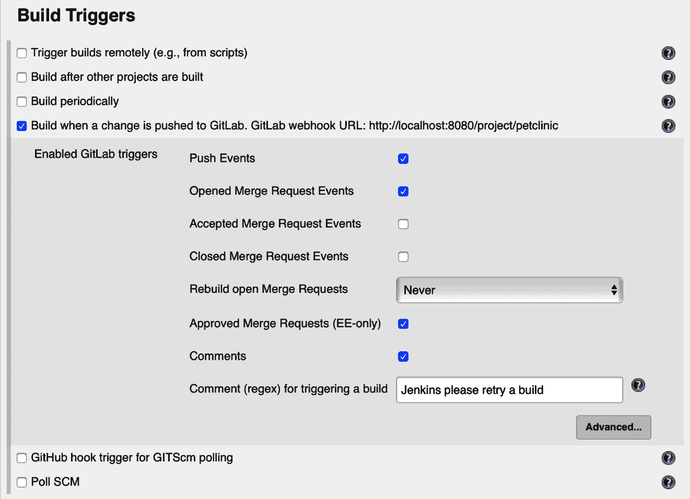
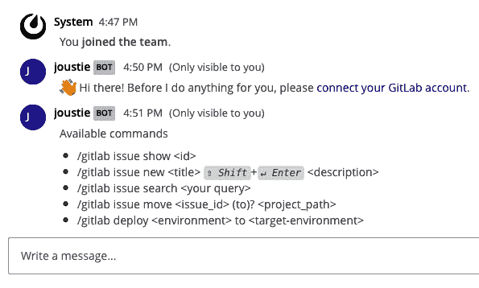
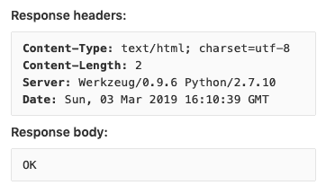

# 将 GitLab 与 CI/CD 工具集成

在本章中，我们将介绍一些 GitLab 可以集成的工具。大多数情况下，公司不会仅使用一个工具来完成整个 DevOps 过程。GitLab 鼓励中小型公司这样做，但现实情况是，大型企业客户使用多种不同的工具和技术。我们将把 Jira 与 GitLab 连接，因为该工具在企业市场中得到广泛应用。当然，值得一提并尝试的还有久负盛名的 Jenkins 服务器，现代组织使用 Slack/Mattermost 或其他聊天工具进行实时协作。我们将在本章结束时，举例说明如何使用基本的 Webhook。

在本章中，我们将讨论以下主题：

+   使用 Jira 与 GitLab

+   与 Jenkins 连接

+   与 Mattermost 集成

+   使用 Webhook 处理事件

# 技术要求

对于管理综合安装，有一个名为 `gitlab.rb` 的中央配置文件。您需要创建它或复制一个示例。您可以在以下链接找到模板：[`gitlab.com/gitlab-org/omnibus-gitlab/blob/master/files/gitlab-config-template/gitlab.rb.template`](https://gitlab.com/gitlab-org/omnibus-gitlab/blob/master/files/gitlab-config-template/gitlab.rb.template)。该模板在升级后不会自动更新。在本章的许多部分中，我将引用并讨论该文件的部分内容。

本章的代码示例可以在本书的 GitHub 仓库中找到，链接：[`github.com/PacktPublishing/Mastering-GitLab-12/tree/master/Chapter13`](https://github.com/PacktPublishing/Mastering-GitLab-12/tree/master/Chapter13)。

# 使用 Jira 与 GitLab

Jira 是由 Atlassian 于 2002 年创建的 IT 项目管理工具，最初是为开发人员设计的软件。

Jira 最初是一个问题跟踪工具，即列出和管理任务的工具。*任务* 可以是任何东西：需要解决的问题，一个简单的待办事项，一个应用程序等等。然而，您也可以进一步扩展，将产品、客户、公司等信息放入该工具中。

JIRA 还是一个 *工作流引擎*。这意味着您可以定义 *工作流*（换句话说，流程），任务必须遵循这些流程。通过这种方式，您可以对每个项目或每个任务施加不同的流程。一个简单的任务工作流示例是：OPEN | IN PROGRESS | READY。

对于不同类型的任务，例如应用程序执行某些操作，您可以设置以下工作流程：OPEN | CONFIRMED | APPROVED | READY。

通过集成，GitLab 可以与 Jira 对接。尽管 GitLab 已经提供了很多 Jira 提供的项目管理功能，但在较大的组织中，它可以帮助将这些工具集成在一起。例如，当整体项目管理在 Jira 中进行时，您可以确保通过提交信息、合并请求等方式，在 GitLab 工作流中可以访问特定的链接。

作为示例，让我们在 Jira 中创建一个项目：

1.  我们在 Atlassian 的云端服务上创建了一个账户（[`www.atlassian.com/enterprise/cloud`](https://www.atlassian.com/enterprise/cloud)）。当你在 Atlassian 云端或本地设置好你的实例后，继续创建一个新项目：


1.  当你的项目创建完成后，你将看到以下页面：


1.  下一步是在该项目中创建一个问题。我们以最少的信息创建，命名为`Integrate GitLab and Jira`。你会看到它创建了一个 ID 为`GI-1`的问题。现在我们在我们的项目管理工具中有了一个问题，我们希望将它与我们的 GitLab 实例链接：


1.  现在，我们将在 Jira 中创建一个特殊的令牌，用于在 GitLab 中更新问题。请访问[`id.atlassian.com`](https://id.atlassian.com)，点击安全，然后点击创建并管理 API 令牌：


1.  点击创建 API 令牌：


1.  在你为它取个好名字并点击创建后，它将出现在列表中：


1.  现在，我们需要去我们的 GitLab 实例中创建一个我们想要连接到 Jira 的项目：


1.  当项目创建完成后，进入该项目的设置，查找集成中的 Jira：


1.  你可以选择是否允许在 Jira 中通过提交或合并请求中的引用来创建评论。你需要提供你的 Jira 实例的网页 URL，在我们的案例中是`https://joustie.atlassian.net`。

你的用户名是你的电子邮件地址，你可以填写之前在 Jira 中创建的令牌。

接下来是更难的部分。当你将 Jira 问题的状态更改为另一种状态时，你需要提供一个过渡 ID。在我们的示例中，这是`11`、`21`、`31`。那么，这是什么？我们在哪里找到它？这是一个好问题，你需要做的就是调用 Jira 的 API。它们代表问题可以处于的状态，你需要知道这些状态才能进行更改。

在以下示例中，我们调用了`https://joustie.atlassian.net/rest/api/2/issue/GI-1/transitions`。

当你找到了这些 ID 并保存了更改后，Jira 将会进行测试， hopefully，你会收到以下反馈：


如果你返回到集成页面，可以看到 Jira 集成的状态是绿色的。绿色表示良好：


如果出现问题或者你想了解更多这些调用的详细信息，可以查阅`integrations_json.log`，它位于 rails 日志目录下。例如，成功激活 Jira 集成的调用如下：

```
 {"severity":"INFO","time":"2019-03-02T16:48:49.466Z","correlation_id":"28a67335-4f3d-40ed-826d-8ca0d6d34f84","service_class":"JiraService","project_id":12,"project_path":"root/gitlab-integration","message":"Successfully posted","client_url":"https://joustie.atlassian.net"}

```

现在，你可以通过 GitLab 解决 Jira 中的问题：

```
 Joosts-iMac:gitlab-integration joostevertse$ git commit -m "Initial commit: Resolves GI-1"
 [master (root-commit) 0418211] Initial commit: Resolves GI-1
 1 file changed, 0 insertions(+), 0 deletions(-)
 create mode 100644 test.txt

```

在项目概览中，你会发现问题已经移到“完成”状态：


如果你查看该问题本身，你会发现它的状态是已关闭（Closed）：


如你所见，可以将像 Jira 这样的项目管理工具与 GitLab 集成，并保持问题同步。在本节中，我们展示了如何将基于云的 Jira 服务与本地 GitLab 安装进行集成。接下来，让我们继续与 Jenkins 连接。

# 将 Jenkins 与 GitLab 连接

Jenkins（Hudson 项目的一个分支）是一个持续集成平台。该平台主要用于重复执行和监控构建任务，以及自动构建和测试应用程序。许多免费的插件使得扩展 Jenkins 功能变得非常容易。一个例子就是它与其他系统（如 Sonar、Jira 或 CloudBees）的集成，或者改变其外观和感觉。通过使用合适的插件，可以构建一个完整的持续交付（Continuous Delivery）管道。

还有一个 GitLab 插件可以将 Jenkins 集成到 GitLab 工作流中。你可以自己下载并托管 Jenkins，或者购买云中的容量。

作为一个例子，我们使用了一个本地的 Jenkins 容器，并从 [`hub.docker.com/_/jenkins`](https://hub.docker.com/_/jenkins) 拉取了一个容器。让我们开始吧：

1.  当你的 Jenkins 容器配置并启动后，你需要确保已经安装了 GitLab 插件：


1.  点击“管理 Jenkins”|“管理插件”：


1.  如果你点击“可用”标签并筛选 GitLab，你可以选择 GitLab 插件：


1.  安装完成后，你会看到它显示为“成功”：


1.  现在，返回到“管理 Jenkins”页面，点击“配置系统”，然后滚动到 GitLab 部分。

1.  给连接起个名字，提供正确的 URL，然后点击“添加”以获取一个 GitLab API token。这个 API token 可以在 GitLab 的设置中生成：


1.  这里只需要填写 API token：


1.  下一步是创建 Jenkins 和 GitLab 项目（本示例中）。我们选择了一个自由风格项目，并命名为 `petclinic`：


1.  我们在 GitLab 上做了同样的操作：


1.  在你的 Jenkins 项目中，向下滚动到“源代码管理”部分，并填写你的 GitLab 源代码仓库的 URL：


1.  接下来，点击“添加”以添加凭据。你需要添加一个用户名和密码来连接到你的 HTTP Git 仓库（或者是 SSH 用户/密钥，或是 API 密钥）：


1.  然后，关闭弹出窗口并向下滚动到“构建触发器”部分。你可以在这里启用当 GitLab 推送更改时触发构建。此示例中，我们选择了在推送事件和合并请求事件时触发：



1.  点击保存以保存你的设置。

为了测试和快速开发，我推荐使用 ngrok。它是一个安全的隧道程序，可以将本地计算机连接到动态 URL 主机服务。你可以在 [`ngrok.com`](http://ngrok.com) 找到这个工具，下载二进制文件并将其放在本地路径中。

我们可以利用它从互联网（我们托管 GitLab 的云容器）隧道到本地 Docker 容器中的 Jenkins。

启动 ngrok，将互联网 URL 连接到我们在 Docker 中运行的本地 Jenkins（端口 `8080`）：

```
 Joosts-iMac:images_chapter12 joostevertse$ ngrok http 8080
```

启动 ngrok 后，屏幕上将显示以下输出：


现在，在仓库中修改一些代码并将其推送到 GitLab：

```
Joosts-iMac:petclinic joostevertse$ git push -u origin master
 Enumerating objects: 130, done.
 Counting objects: 100% (130/130), done.
 Delta compression using up to 16 threads
 Compressing objects: 100% (119/119), done.
 Writing objects: 100% (130/130), 352.91 KiB | 12.17 MiB/s, done.
 Total 130 (delta 26), reused 0 (delta 0)
 remote: Resolving deltas: 100% (26/26), done.
 To https://gitlab.joustie.nl/root/petclinic.git
 * [new branch] master -> master
 Branch 'master' set up to track remote branch 'master' from 'origin'.
 Joosts-iMac:petclinic joostevertse$
```

你会在 ngrok 中看到钩子被触发：


通过进入 Jenkins，你会看到它接收到事件并开始构建项目：


如你所见，将 Jenkins 连接到 GitLab 非常简单。你可以选择让 Jenkins 对 GitLab 中的不同类型事件作出响应。

# 集成 Mattermost

Mattermost 是最受欢迎的开源 Slack 替代品，可以托管在你自己管理的专有平台上。

当团队使用这些工具时，他们可以通过专门的频道直接进行聊天交流，从而提高生产力。在这些频道中，他们可以交换快速信息片段——甚至是文件（图片/视频，任何文件）和应用程序使用的数据文件。

你可以通过浏览器使用 Mattermost，或者在移动设备上使用平台专用的应用程序。除了你的电子邮件地址外，不会使用任何特定的个人数据。

它的一个杀手级功能是，它能够轻松连接到 GitLab、Jira Jenkins、Nagios、Zabbix、Kopano 等第三方应用和系统！事实上，这家公司已被 GitLab 收购，Mattermost 也成为了 GitLab 全套软件包的一部分。换句话说，你可以轻松启用它并与 GitLab 一起运行。从 GitLab Ultimate 10.6 开始支持 ChatOps，但在 11.9 版本中引入了 GitLab Core。

作为示例，我们将设置一个新的 Mattermost 服务器与 GitLab 实例集成，以便使用斜杠命令。

因为 Mattermost 是 GitLab 全套软件包的一部分，你可以通过编辑 `gitlab.rb` 文件来启用/安装它，之后使用 `gitlab-ctl` 重新配置你的实例。

在 `gitlab.rb` 中需要更改的配置项如下：

```
mattermost['enable'] = true
```

在启动 Mattermost 后，你可以进入项目设置的集成页面，搜索 Mattermost 斜杠命令服务。点击添加到 Mattermost。此操作仅在 Mattermost 3.4 版本上自动有效，因此请确保你的 Omnibus 包不是太旧。

如果你的服务器上没有安装 Mattermost，你可以从 Docker Hub 拉取一个简单的 Mattermost 镜像。`mattermost/mattermost-preview` 就可以了。我们开始吧：

1.  当你第一次在容器中登录时（默认情况下是通过 `http://localhost:8065`），你需要创建一个用户：


1.  创建用户后，你需要创建一个团队：


1.  该团队还需要一个 URL：


1.  你可以点击汉堡菜单来查看团队的选项：


1.  转到系统控制台：


1.  查找自定义集成（Custom Integrations），并确保斜杠命令已启用。保存设置：


1.  完成后，点击汉堡菜单，然后点击切换回去.... 在团队上下文中点击汉堡菜单，你可以点击集成（Integrations）。在这里，你可以点击斜杠命令（Slash Command），你将看到一个页面，在该页面中你可以定义一个可以由 Mattermost 触发的斜杠命令：


1.  我们需要填写的信息可以从 GitLab 获取：


1.  登录到 GitLab，并进入你的仓库设置部分中的集成（Integrations）。然后点击 Mattermost 斜杠命令。这里是你需要在 Mattermost 中填写的信息：


1.  在以下截图中，你可以看到我们复制的设置。完成后点击保存（Save）或更新（Update）：


1.  现在，你将获得一个在 GitLab 中使用的令牌。复制 Mattermost 令牌：


1.  将其粘贴到 GitLab 中的 Mattermost 集成设置页面，并保存更改：


1.  现在，转到你的 Mattermost 团队频道，按下 `*/*`。如果你发出 `/gitlab help`，Mattermost 会要求你连接你的 GitLab 账户：


1.  你将被重定向到 GitLab，在那里你需要授权连接：


1.  现在，通过返回到 Mattermost 并再次发出 `/gitlab help`，你将看到命令的选项。有几种选项，这些选项可以帮助你的支持人员进行 ChatOps 操作：



1.  让我们创建一个新的问题，命名为 `gitlab issue new test`：


1.  如果你返回 GitLab，你会发现为 GitLab 项目创建了一个新的 issue：


最终的集成是使用 CI 命令功能，详见此处：[`docs.gitlab.com/ee/ci/chatops/`](https://docs.gitlab.com/ee/ci/chatops/)。

从 GitLab 11.9 版本开始，ChatOps 已经是 GitLab Core 的一部分，因此其功能不再局限于 GitLab 企业版。

在本节中，我们展示了如何将 GitLab 仓库的 issue 与 Mattermost 聊天应用程序集成。如果你创建自己的斜杠命令，可能性是无穷无尽的。现在，让我们来看看如何使用 webhook 来处理事件。

# 使用 webhook 处理事件

Webhook 被用作应用程序之间的信号。你可以把它看作是来自不同上下文的回调。此调用是通过 HTTP 协议（可能带有 SSL）发起的。尝试以最有效的方式实时提供信息，通常使用 JSON 作为数据格式。

其强大之处在于，只需尽可能少的操作就能获得反馈。通常，最多的工作是实现 *信号* 的部分。

作为概念验证，请考虑以下情况。假设当我们将新代码推送到 GitLab 时，我们需要从 GitLab 向我们自己构建的应用程序发送信号。

为了实现这个模型，我们选择了 Python 的轻量级 Flask 微框架：

```
from flask import Flask, request
import json
app = Flask(__name__)

def runsomething():
 print "This is triggered"

@app.route('/',methods=['POST'])
def trigger():
 data = json.loads(request.data)
 print "New commit by: {}".format(data['commits'][0]['author']['name'])
 print "New commit by: {}".format(data['commits'][0]['author']['email'])
 print "New commit by: {}".format(data['commits'][0]['message'])

 runsomething()
 return "OK"

if __name__ == '__main__':
 app.run()
```

让我们一步一步地走过这段代码。在以下代码中，基本的应用程序已经初始化。导入的内容主要是 Flask 框架的基础内容，特别是 request 对象。应用程序被实例化：

```
 from flask import Flask, request
 import json

 app = Flask(__name__)
```

以下函数可以用来执行实际的工作：

```
 def runsomething():
 print "This is triggered"
```

然后是带有路由装饰器的方法，它解析请求中的特定信息。这里没有检查 —— 只是从 JSON webhook 中读取信息，运行 `real work` 函数，并返回 `OK`：

```
@app.route('/',methods=['POST'])
 def trigger():
 data = json.loads(request.data)
 print "New commit by: {}".format(data['commits'][0]['author']['name'])
 print "New commit by: {}".format(data['commits'][0]['author']['email'])
 print "New commit by: {}".format(data['commits'][0]['message'])

 runsomething()
 return "OK"
```

以下的 `main` 部分与第一个代码块一起，构成了 Flask 的基本实现：

```
 if __name__ == '__main__':
 app.run()
```

当你使用 `python server.py` 运行这段代码时，它将在本地主机上打开端口 `5000`：

```
 Joosts-iMac:gitlab-webhook joostevertse$ python server.py
 * Running on http://127.0.0.1:5000/
```

如果我们希望互联网中的某些东西连接到它，我们可以使用老牌的 ngrok 来链接端口：

```
 Joosts-iMac:Downloads joostevertse$ ngrok http 5000
```

ngrok 现在正在运行，如下图所示：


现在我们可以在 GitLab 中定义 webhook。你可以在 GitLab 项目的设置 | 集成部分找到它。定义好钩子后，你可以运行测试以验证其操作：


当通过 GitLab 触发调用时，我们会得到以下结果。这是通过 ngrok 代理的连接：


在 GitLab 中，如果你点击编辑按钮，你将看到 webhook 调用的结果。它将包含已发送的主体：


你还将看到另一端返回的响应。你可以清楚地看到 OK 响应：



这个调用的结果是我们的自定义方法被触发，并且一些特定信息，如作者、电子邮件和消息，打印在标准输出上：

```
Joosts-iMac:gitlab-webhook joostevertse$ python server.py
* Running on http://127.0.0.1:5000/
New commit by: Joost
New commit by: joustie@gmail.com
New commit by: Added text
This is triggered
127.0.0.1 - - [03/Mar/2019 17:10:39] "POST / HTTP/1.1" 200 -
```

我们已经看到，也可以使用像 webhook 这样的通用事件机制。你可以修改自己的软件或 **商业现成** (**COTS**) 应用程序，以接收来自 GitLab 的事件。

# 总结

本章讨论了将 GitLab 与其他产品集成的方法。每种集成都有自己的特殊说明，但基本思路是你需要建立信任关系并映射属性。GitLab 已经提供了许多开箱即用的集成功能，这些称为 **项目服务**，文档可以在这里找到：[`docs.gitlab.com/ee/user/project/integrations/project_services.html`](https://docs.gitlab.com/ee/user/project/integrations/project_services.html)。本章结束了本书的第三部分，我们讨论了 GitLab 的工作流及其背后的基本原理。

在本书的下一部分，我们将讨论 GitLab 最成功的部分：GitLab CI 和 Runner。我们将首先讲解如何为 GitLab CI 设置项目。

# 问题

1.  Jira 用于什么？

1.  Jira 是哪家公司开发的？

1.  在 Jira 中，操作问题需要哪些 ID？

1.  Jenkins 是从哪个项目分叉出来的？

1.  Jenkins 使用什么机制来扩展功能？

1.  什么是 ChatOps？

1.  如何从 Mattermost 渠道控制事务？

1.  在 GitLab 中，在哪里可以找到 webhook 的状态？

# 进一步阅读

+   *Jira 8 精要 - 第五版*，由 *Patrick Lee* 编写： [`www.packtpub.com/in/application-development/jira-8-essentials-fifth-edition`](https://www.packtpub.com/in/application-development/jira-8-essentials-fifth-edition)

+   *Jenkins 2.x 持续集成食谱 - 第三版*，由 *Mitesh Soni* 和 *Alan Mark Berg* 编写： [`www.packtpub.com/in/networking-and-servers/jenkins-2x-continuous-integration-cookbook-third-edition`](https://www.packtpub.com/in/networking-and-servers/jenkins-2x-continuous-integration-cookbook-third-edition)

+   *Jenkins 基础*，由 *Joseph Muli* 和 *Arnold Okoth* 编写： [`www.packtpub.com/in/networking-and-servers/jenkins-fundamentals`](https://www.packtpub.com/in/networking-and-servers/jenkins-fundamentals)

+   *GitLab ChatOps*： [`docs.gitlab.com/ee/ci/chatops/`](https://docs.gitlab.com/ee/ci/chatops/)
