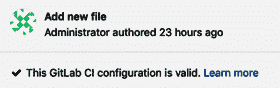

# 第十四章：设置 GitLab 持续集成项目

**持续集成**（**CI**）是 **极限编程**（**XP**）最重要的支柱之一。自从 GitLab 在 8 版本中引入持续集成功能以来，它一直是 GitLab 最受欢迎的功能之一。持续集成在独立开发者和开源项目中非常流行，当前在其他市场领域也在迅速发展。

开始使用非常简单。正如我们在 第十章中展示的那样，*创建产品，验证并打包它*（在 *发布* 和 *配置* 部分），Auto DevOps 默认启用，因此当向项目添加代码时，会自动设置一个部署流水线，在该流水线中多个作业正在运行。这些作业将由你需要设置的 GitLab Runner 运行。这个设置完全可以根据开发者的需求进行配置。作业的结果会被收集并显示为通过或失败，并且这些结果是流水线逻辑的一部分。根据结果，流水线中的其他自动化过程可能会被触发**。**此功能的基础在于 `.gitlab-ci.yml` 文件。如果项目中存在该文件，它将被解析并启动不同的流水线和作业。

在本章中，我们将涵盖以下主题：

+   流水线

+   作业

+   创建 `.gitlab-ci.yml`

+   配置 Runner

# 技术要求

要跟随本章的指示，请下载包含示例的 Git 仓库，地址为 GitHub：[`github.com/PacktPublishing/Mastering-GitLab-12/tree/master/Chapter14`](https://github.com/PacktPublishing/Mastering-GitLab-12/tree/master/Chapter14)。

必须在你的 GitLab 实例中启用 GitLab CI（请参见 第三章，*使用 Web UI 配置 GitLab*）。

# 流水线

在软件工程中，流水线通常被理解为一系列自动触发并将输入传递给下一个元素的事件链（包括过程、组件等）。它类似于现实世界中的物理管道。

在持续集成（CI）环境中，流水线是一个由多个顺序步骤组成的集合，用于整合来自不同开发者的代码。事件链由对源代码仓库（如 GitLab）的提交或推送触发。构建系统（例如 Jenkins 或 GitLab CI）会收到新版本的通知，进行编译和源代码处理，并执行单元测试。

在我们进一步深入之前，你需要了解的是，没有单元测试或其他自动化测试，不同开发者集成代码片段的工作将变得非常困难。所以，在开始构建流水线之前，确保你的开发者已经编写了测试代码。这样，你就可以确保代码已通过检查，并且至少符合一定的质量标准。

如果管道中的单元测试成功，下一步是运行集成测试。如果它们也成功，那么构建的制品可以推送或保存到二进制仓库，或者可以直接部署到一个暂存环境，在那里代码将运行。

一些管道甚至可以部署到验收环境或半生产环境，在那里会对构建的解决方案进行用户验证。这被称为**持续部署**（**CD**）。有些人称其为生产部署 CD，但这取决于你对该概念的定义。

现代构建软件将构建管道作为其架构的一部分。像 Jenkins 这样的产品已经在其工作流中采纳了这一概念，但云解决方案，如 Azure DevOps（即云中的 TFS），也采用了这一方法。

你可以在 GitLab 中找到你的项目管道，在左侧菜单栏中的 CI/CD 下，如下图所示：


菜单中的第一个项目是指向你管道概览的链接。在这里，你可以看到管道是否通过或失败，重新尝试管道，或下载制品，如下图所示：


菜单中的第二个链接会带你进入项目的作业列表（我们将在稍后介绍），如下图所示：


第三个链接是 GitLab CI 的一个功能，称为计划（Schedules）。如以下截图所示，我们已经为 `Eventmanager` 项目创建了一个管道执行计划：


如果你点击计划列表中的某一项，你会看到其中有许多可配置的项目。例如，你可以指定在哪个分支上运行，如下图所示：


了解更多关于你的构建信息的一个好方法是使用 GitLab CI 的图表功能，在这里你可以看到管道的各项指标，如下图所示：


以下截图展示了一个在 GitLab 中运行的管道的高级设计：


我们现在已经演示了 GitLab CI 如何整合构建管道的通用概念，并记录了管道各个步骤的成功或失败的几个指标。在接下来的章节中，我们将查看这些独立的步骤。

# 作业

管道配置从作业（jobs）开始：

+   作业是管道的最基本元素，由 GitLab Runner 执行。

+   作业是根据约束创建的，约束定义了在什么条件下它们应该执行。

+   作业是顶级元素，可以有任意名称，并且至少必须包含脚本元素作为最低要求。

+   可以有无限数量的作业。

在流水线概述中，您会找到几个作业。它们有一个状态，一个 ID，属于一个阶段，并且有一个名称，如下面的截图所示：


您可以通过将它们添加到名为 `.gitlab-ci.yml` 的配置文件中来创建作业。我们将在以下章节更深入地讨论此文件。

包含两个作业的流水线示例如下：

```
job1:
 script: "execute-this-script-for-job1"
job2:
 script: "execute-this-script-for-job2"
```

上述示例是一个基本的 CI/CD 流水线，包含两个命名作业（`job1`和`job2`），这些作业执行一个脚本部分（在我们的示例中，这没有任何操作）。在脚本部分中，您可以指定命令、脚本或一系列命令。例如，要构建 JavaScript，您可以将 `script` 设置为 `npm build` 或运行名为 `unit-test.sh` 的 shell 单元测试。

作业不在 GitLab 应用服务器上运行，而是由 GitLab Runner 接管。Runner 在其自己的环境中执行作业；例如，Runner A 可以构建`job1`，Runner B 可以构建`job2`。请注意，这些作业彼此独立。这些作业的结果在 GitLab 服务器上汇总。

# 创建 .gitlab-ci.yml

GitLab CI 如何与您的个人资料交互在很大程度上由 `.gitlab-ci.yml` 文件控制，必须将其添加到项目的根目录。当您将代码推送到存储库时，GitLab 将测试是否存在并为该特定提交启动一个带有作业的流水线。

文件的格式是 **YAML Ain't Markup Language** (**YAML**)。 YAML 目前是配置文件的广泛使用格式，最好描述为数据序列化语言。

我们在前面的章节中已经为您提供了一个 `.gitlab-ci.yml` 文件的示例，其中包含两个作业。在其他章节中，我们使用 `.gitlab-ci.yml` 文件来描述部署。那么，此文件的可用可能性是什么？

可能有很多组合，但工作的基本方式是首先在文件中定义阶段，然后添加脚本部分。此文件的完整参考资料可以在此处找到：[`docs.gitlab.com/ee/ci/yaml/README.html`](https://docs.gitlab.com/ee/ci/yaml/README.html)。

当您创建 YAML 文件时，知道保存后，它将通过 linter 检查文件的语法，如下面的截图所示，这是个好消息：



此文件的可能性是无限的，因此找出适合您的方法的最佳方法是查看 GitLab 网站上的开源项目，以获得灵感，网址为：[`docs.gitlab.com/ee/ci/examples/README.html`](https://docs.gitlab.com/ee/ci/examples/README.html)。

# 配置 Runner

我们在第一章《GitLab 架构介绍》中简要描述了 GitLab Runner 的概念。Runners 本质上是运行在独立机器上的构建环境，这些机器连接到 GitLab 应用程序的服务器并请求执行任务。Runners 帮助自动化产品开发并实现 DevOps 集成。

我们在 GitLab 端和 GitLab Runner 客户端端配置了一个 Runner。请记住，并不存在单一类型的 Runner。

有不同种类的 Runner，包括：

+   一个 Shell 执行器

+   一个 Docker 执行器

+   一个 Docker Machine 和 Docker Machine SSH（自动扩展）执行器

+   一个 Parallels 执行器

+   一个 VirtualBox 执行器

+   一个 SSH 执行器

+   一个 Kubernetes 执行器

对于 GitLab CI 界面，这并不重要。所有 Runner 看起来都一样。

GitLab Runner 客户端可以在多个平台上使用，因为它是一个 Go 二进制文件，可以在许多平台上运行。配置文件名为`config.toml`，采用 TOML 格式，这比 YAML 格式简单。

该格式的规范是公开可用的，可以在[`github.com/toml-lang/toml`](https://github.com/toml-lang/toml)找到。

# GitLab Runner 功能

GitLab Runner 的功能包括以下内容：

+   能够并行运行多个任务

+   使用多个令牌与多个服务器（甚至是每个项目）

+   能够限制每个令牌的并发任务数量

GitLab Runner 可以执行的任务包括以下内容：

+   在没有容器或虚拟化的本地计算机上运行

+   在 Docker 容器内运行

+   在 Docker 容器内运行并通过 SSH 执行任务

+   使用 Docker 容器在不同的云和虚拟化虚拟机上自动扩展运行

+   通过连接到远程 SSH 服务器运行，在那里它可以被执行

其他功能包括以下内容：

+   GitLab Runner 支持 Bash、Windows Batch 和 Windows PowerShell

+   Runner 二进制文件可以在 GNU/Linux、macOS 和 Windows（所有 Docker 支持的平台）上运行

+   一个 Runner 允许自定义任务运行环境

+   运行器可以在不重启的情况下自动重新加载配置

+   设置非常简单，支持 Docker、Docker SSH、Parallels 或 SSH 运行环境

+   Runner 还支持缓存 Docker 容器

+   Runner 包支持在 GNU/Linux、macOS 和 Windows 上作为服务进行安装

+   你可以在 Runner 中启用嵌入式 Prometheus 度量 HTTP 服务器

你可以通过以管理员身份登录并检查 GitLab 左侧的 Runners 菜单，来查看 GitLab 中注册的 Runner 概况，如下图所示：


现在，你应该可以看到一个已经在 GitLab 实例上注册的 Runner 列表，如下所示：


如下图所示，点击一个 Runner，你将看到可以执行以下操作：

+   配置一个暂停的 Runner，使其不接受新任务

+   将 Runner 指定为受保护

+   设置 Runner 以拾取带有标签或不带标签的作业

+   锁定 Runner 到项目

+   为作业设置最大超时时间

+   标记 Runner


在左侧，您将能够看到哪些作业最近被 Runner 处理，正如下面的截图所示：


到目前为止，您已经了解了 GitLab CI 如何与 GitLab 产品契合，以及 GitLab Runner 如何与实例注册。我们还介绍了 GitLab Runner 的基本功能，并展示了如何为作业创建配置文件，使得作业可以被 Runner 拾取并执行。

# 总结

在本章中，我们讨论了 GitLab CI，这是 GitLab 在提供版本控制之后最关键的功能。我们解释了如何触发管道以及如何使用 `.gitlab-ci.yml` 文件设计管道。然后，我们展示了构成管道的作业。最后，我们提供了一些关于 GitLab Runner 如何融入该架构的信息。在下一章中，我们将向您展示更多关于 GitLab Runner 客户端的内容。

# 问题

1.  请列出极限编程的一个支柱。

1.  用来描述作业和管道的文件是什么？

1.  构建系统如何知道何时在管道中构建软件？

1.  到达集成阶段需要进行哪些测试？

1.  在 `.gitlab-ci.yml` 文件中使用哪个标签来执行作业？

1.  由 Runner 使用的配置文件叫什么名字？

1.  一个 Runner 可以启动多少个并发会话？

1.  如何获取 GitLab Runner 执行的指标？

# 进一步阅读

+   *gRPC [Golang] 大师班：构建现代 API 和微服务 [视频]* 由 *Stephane Maarek* 主讲：[`www.packtpub.com/web-development/grpc-golang-master-class-build-modern-api-and-microservices-video`](https://www.packtpub.com/web-development/grpc-golang-master-class-build-modern-api-and-microservices-video)。

+   *实操 GitLab CI 自动 DevOps [视频]* 由 *Alan Hohn* 主讲：[`www.packtpub.com/in/application-development/hands-auto-devops-gitlab-ci-video`](https://www.packtpub.com/in/application-development/hands-auto-devops-gitlab-ci-video)。
