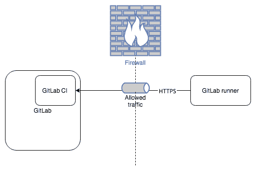
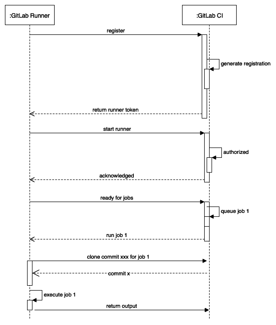
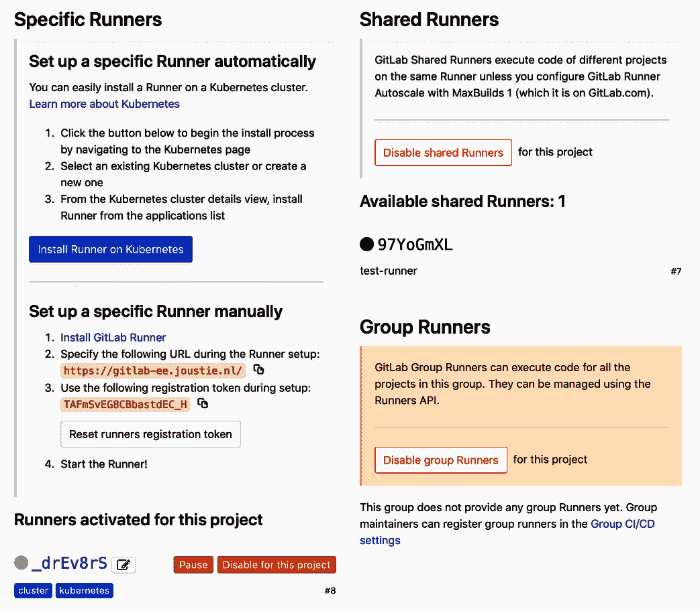
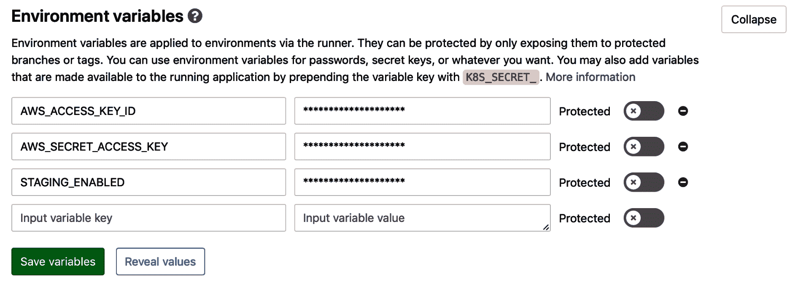
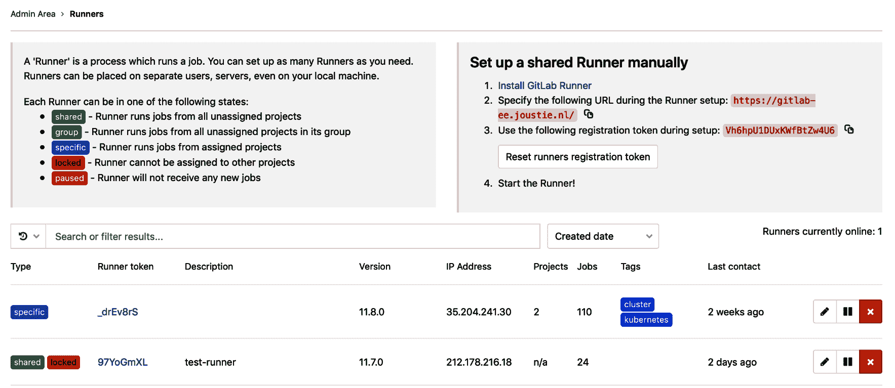

# 第十五章：安装与配置 GitLab Runner

在本章中，我们将深入了解 GitLab Runner 客户端架构。通过学习本章节内容，您将理解 GitLab CI 和 Runner 之间的基本控制流程。在本章的第二部分，我将展示如何在不同操作系统上安装 Runner 软件。由于 Runner 程序是用 Golang 编写的，许多平台都能运行此客户端。Golang 以其出色的多平台支持而著称。

在本章中，我们将涵盖以下主题：

+   Runner 客户端架构

+   使用 shell 执行器创建基础的 Runner

# 技术要求

为了跟随本章的指导，请从 GitHub 下载包含示例的 Git 仓库：[`github.com/PacktPublishing/Mastering-GitLab-12/tree/master/Chapter15`](https://github.com/PacktPublishing/Mastering-GitLab-12/tree/master/Chapter15)[.](https://github.com/PacktPublishing/Mastering-GitLab-12/tree/master/Chapter15)

本章的其他要求如下：

+   **GitLab Runner 客户端 – Linux 64-bit**: [`gitlab-runner-downloads.s3.amazonaws.com/latest/binaries/gitlab-runner-linux-amd64`](https://gitlab-runner-downloads.s3.amazonaws.com/latest/binaries/gitlab-runner-linux-amd64)

+   **Linux 32-bit**: [`gitlab-runner-downloads.s3.amazonaws.com/latest/binaries/gitlab-runner-linux-386`](https://gitlab-runner-downloads.s3.amazonaws.com/latest/binaries/gitlab-runner-linux-386)

+   **Linux ARM**: [`gitlab-runner-downloads.s3.amazonaws.com/latest/binaries/gitlab-runner-linux-arm`](https://gitlab-runner-downloads.s3.amazonaws.com/latest/binaries/gitlab-runner-linux-arm)

+   **macOS 64-bit**: [`gitlab-runner-downloads.s3.amazonaws.com/latest/binaries/gitlab-runner-darwin-amd64`](https://gitlab-runner-downloads.s3.amazonaws.com/latest/binaries/gitlab-runner-darwin-amd64)

+   **FreeBSD 64-bit**: [`gitlab-runner-downloads.s3.amazonaws.com/latest/binaries/gitlab-runner-freebsd-amd64`](https://gitlab-runner-downloads.s3.amazonaws.com/latest/binaries/gitlab-runner-freebsd-amd64)

+   **FreeBSD 32-bit**: [`gitlab-runner-downloads.s3.amazonaws.com/latest/binaries/gitlab-runner-freebsd-386`](https://gitlab-runner-downloads.s3.amazonaws.com/latest/binaries/gitlab-runner-freebsd-386)

+   **Windows 32-bit**: [`gitlab-runner-downloads.s3.amazonaws.com/latest/binaries/gitlab-runner-windows-386.exe`](https://gitlab-runner-downloads.s3.amazonaws.com/latest/binaries/gitlab-runner-windows-386.exe)

+   **Windows 64-bit**: [`gitlab-runner-downloads.s3.amazonaws.com/latest/binaries/gitlab-runner-windows-amd64.exe`](https://gitlab-runner-downloads.s3.amazonaws.com/latest/binaries/gitlab-runner-windows-amd64.exe)

+   **cURL**: [`curl.haxx.se/download.html`](https://curl.haxx.se/download.html)

# Runner 客户端架构

我们在第一章中简要介绍了 GitLab 架构，*介绍 GitLab 架构*。文中解释了 GitLab Runner 如何注册到 GitLab 实例并等待执行任务。与作为 GitLab 前端应用服务器一部分的各个组件不同，Runner 的架构非常简单。Runner 与 GitLab 主机之间的通信基本上是单向的。

# 基本架构

主要的网络通信是从 GitLab Runner 到 GitLab CI，而不是反向通信。如下图所示：



该行为最好通过如下的顺序图来展示：



当 GitLab Runner 启动时，它会通过联系 GitLab URL 来尝试找到它的协调器。当它使用注册令牌注册时，它会获得一个特殊令牌以连接 GitLab。重启后，它会连接并等待 GitLab CI 的任务。它会定时轮询 GitLab，当没有任务时，它会减少检查 GitLab 的频率，以避免过多的网络流量。

当一个任务在 GitLab CI 中排队时，它会尝试寻找一个可用的 Runner。接收到命令后，它会克隆触发任务的特定提交，并执行 `.gitlab-ci.yml` 文件中定义的步骤。执行后，结果会发送回 GitLab。

GitLab CI 有两种类型的 Runner：

+   特定 Runner：作为开发人员，您可以创建自己的 Runner 并将其注册到 GitLab 项目中。只有这样，项目才会对该 Runner 可见。

+   共享 Runner：GitLab 管理员还可以指定一个 Runner 为共享 Runner。它可以从多个项目中接收任务。由于这可能被视为安全漏洞，因此在将 Runner 设置为共享时要小心。

在以下截图中，您可以看到 GitLab 项目的 CI/CD 配置，您可以在其中设置使用哪个 Runner：



GitLab Runner 克隆仓库并执行 `.gitlab-ci.yml` 文件中定义的步骤。可以在 GitLab 项目级别注入特殊变量，并对其进行保护：



我们已经解释了 Runner 平台的基本架构，现在将介绍如何在不同的操作系统上安装软件。

GitLab Runner 软件适用于以下操作系统：

+   Linux

+   FreeBSD

+   macOS

+   Windows

安装过程在所有系统上大致相同，只是细节上有所不同。在接下来的部分中，我们将展示如何在几种不同的操作系统上安装基本的 Runner。

# 使用 shell 执行器创建一个基本的 Runner

在安装 GitLab Runner 软件的机器上，你可以运行 shell 执行器来本地构建软件。该类型的执行器可以在所有安装了 Runner 软件的平台上运行。因此，你可以在类 Unix 系统上运行 Bash 或 Bourne shell，或者在 Windows 平台上运行 CMD 或 PowerShell。

这种构建方式并不十分安全，因为它可以访问 Runner 执行所在系统上的本地资源。更安全的执行器将在后续章节中介绍。

在下一节中，我们将展示如何为你的平台安装 GitLab Runner 软件。

# 在 Linux 上安装 Runner

如果你运行的是带有包管理系统的 Linux 发行版，例如

使用 `yum` 或 `apt`，你可以使用这种方式安装 GitLab Runner 包。或者，你也可以手动安装软件。首先，我们将介绍通过包管理器进行的安装。

# 使用包管理器

对于基于 yum 的系统，你可以添加官方的 GitLab 包存储库：

```
curl -o script.rpm.sh https://packages.gitlab.com/install/repositories/runner/gitlab-runner/script.rpm.sh
 less script.rpm.sh #(check the contents, if you are fine with it make it executable and run it)
 chmod +x script.rpm.sh
 ./script.rpm.sh
```

然后，你可以使用这个基本命令（作为 root 用户或使用 `sudo`）安装 GitLab：

```
yum install gitlab-runner
```

对于基于 apt 的系统，保持与最新版本同步稍微有些麻烦。我们可以添加 GitLab apt 存储库的链接，但不幸的是，Debian 在基本存储库中将该软件包命名为 GitLab。这意味着基本包会自动优先选择。解决方案是将软件包固定到正确的存储库。这可以通过向 `/etc/apt/preferences.d` 添加文件来实现：

```
cat <<EOF >> /etc/apt/preferences.d/pin-gitlab-runner.pref
 Explanation: Pin GitLab-runner package
 Package: gitlab-runner
 Pin: origin packages.gitlab.com
 Pin-Priority: 999
 EOF
```

之后，你可以安装正确的 `apt` 包存储库：

```
curl -o script.deb.sh https://packages.gitlab.com/install/repositories/runner/gitlab-runner/script.deb.sh
 less script.deb.sh #(check the contents, if you are fine with it make it executable and run it)
 chmod +x script.deb.sh
 ./script.deb.sh
```

前面的命令输出结果如下所示。在输出中，你可以看到它检查 `gpg` 密钥并添加包存储库：

```
Detected operating system as debian/stretch.
 Checking for curl...
 Detected curl...
 Checking for gpg...
 Detected gpg...
 Running apt-get update... done.
 Installing debian-archive-keyring which is needed for installing
 apt-transport-https on many Debian systems.
 Installing apt-transport-https... done.
 Installing /etc/apt/sources.list.d/runner_gitlab-runner.list...done.
 Importing packagecloud gpg key... done.
 Running apt-get update... done.

 The repository is setup! You can now install packages.
```

下一步更简单——你只需通过 `apt-get` 安装：

```
apt-get install gitlab-runner
```

在输出中，你会看到类似下面的信息，这意味着你已经安装了所有的二进制文件。然而，在运行之前，你需要先注册 GitLab Runner：

```
...
 gitlab-runner: Service is not running.
 ...
```

注册 Runner 的过程在 *注册 Runner* 部分有更详细的说明。

更新包的方法与更新系统上所有其他包的方法相同：你可以运行 `apt-get update` 或 `yum update` 命令。

使用 `apt-get` 或 `yum` 安装时，包管理器会为你的 Linux 发行版提供一个包含必要配置文件和初始化脚本的 GitLab Runner 安装包。你也可以选择仅下载 Runner 的二进制文件并以通用方式运行它。

# 使用手动安装

只需下载适合你 CPU 架构（x86-64、x86-32 或 ARM）的二进制文件之一：

+   **x86-64 位架构**：

```
curl -o /usr/local/bin/gitlab-runner https://gitlab-runner-downloads.s3.amazonaws.com/latest/binaries/gitlab-runner-linux-amd64
```

+   **x86-32 位架构**：

```
curl -o  /usr/local/bin/gitlab-runner https://gitlab-runner-downloads.s3.amazonaws.com/latest/binaries/gitlab-runner-linux-386
```

+   **ARM 架构**：这是适用于 ARM CPU 架构的二进制文件，列表如下：

```
curl -o  /usr/local/bin/gitlab-runner https://gitlab-runner-downloads.s3.amazonaws.com/latest/binaries/gitlab-runner-linux-arm
```

当你以这种方式获取二进制文件时，你需要使其具有执行权限：

```
chmod +x /usr/local/bin/gitlab-runner
```

然后，你可以以 root 用户身份创建一个 GitLab Runner 用户：

```
useradd --create-home gitlab-runner
```

然后，你需要安装并将其作为服务运行：

```
gitlab-runner install --user=gitlab-runner --working-directory=/home/gitlab-runner
gitlab-runner start
```

虽然手动安装比通过包管理器要多一点工作，但这仍然不是复杂的过程。一个优点是，使用手动安装时，您可以安装更新的 runner 版本。包管理器维护者永远不会安装开发版本，而您可以安装。更新二进制文件也不是很难。

# 更新手动安装的 runner 二进制文件

我们在更新时遵循的过程是替换之前下载的 Golang 二进制文件。必须先停止运行，因此确保它没有运行，否则安装会失败。

停止服务（像之前一样，您需要 root 权限）：

```
gitlab-runner stop
```

然后，下载一个新的二进制文件以替换旧的文件：

```
curl -o /usr/local/bin/gitlab-runner https://gitlab-runner-downloads.s3.amazonaws.com/latest/binaries/gitlab-runner-linux-386
 curl -o /usr/local/bin/gitlab-runner https://gitlab-runner-downloads.s3.amazonaws.com/latest/binaries/gitlab-runner-linux-amd64
```

设置 runner 二进制文件的执行权限：

```
chmod +x /usr/local/bin/gitlab-runner
```

再次启动 runner：

```
gitlab-runner start
```

手动安装更简单，但您必须自己管理更新。在这个自动化的时代，让您分发的包管理器来管理它更为合适。

# 在 Mac 上安装

就像在 Linux 上一样，有几种方法可以安装 GitLab Runner 软件。不同于 Linux 上 GitLab 推荐的包管理方式，对于 macOS，它们推荐手动安装。另一种安装方法是使用 Homebrew 安装方法，您之前在书中看到过（*安装 Redis* 部分，第一章的 *介绍 GitLab 架构*）。

# 手动安装 runner

首先，获取适用于您系统的二进制文件（使用 `sudo`）：

```
sudo curl -o  /usr/local/bin/gitlab-runner https://gitlab-runner-downloads.s3.amazonaws.com/latest/binaries/gitlab-runner-darwin-amd64
```

然后，就像我们之前做的那样，设置二进制文件为可执行：

```
$ sudo chmod +x /usr/local/bin/gitlab-runner
```

现在我们已经有了二进制文件，如果需要的话，可以作为其他用户运行该程序：

```
$ cd ~
$ gitlab-runner install
$ gitlab-runner start
```

安装后，runner 将在系统重启后自动运行。

# 安装和使用 Homebrew 包管理器

macOS 没有统一的软件包管理器，但最常用的是 Homebrew，您可以在 [`brew.sh/`](https://brew.sh/) 找到它。它使用包含脚本和设置的配方来安装二进制文件。

有一个 Homebrew 配方用于安装 GitLab Runner：

```
brew install gitlab-runner
```

下一步是将 runner 安装为一个服务（这也会启动它）：

```
brew services start gitlab-runner
```

使用 macOS 作为 runner 平台有一些缺点。许多开发者使用 macOS runner 来构建 iOS 相关的软件，通常还会涉及 UI 测试。但这是无法自动化的。你必须作为系统服务（LaunchDaemon）在后台运行，而此时 UI 将无法访问。您只能在用户模式下运行 runner 才能访问 UI，这就是为什么必须始终登录才能运行 GitLab Runner。

更新 runner 通过执行 `brew upgrade gitlab-runner` 来完成。对于手动安装，这会稍微复杂一些。

# 更新手动安装的 runner 二进制文件

就像我们在 Linux 上做的一样，我们正在替换之前下载的 Golang 二进制文件。它也需要停止，因此确保它没有运行，否则安装会失败：

1.  首先，我们需要停止服务：

```
gitlab-runner stop
```

1.  就像我们之前做的那样，获取二进制文件以替换运行器的可执行文件：

```
curl -o /usr/local/bin/gitlab-runner https://gitlab-runner-downloads.s3.amazonaws.com/latest/binaries/gitlab-runner-darwin-amd64
```

1.  使下载的二进制文件可执行：

```
chmod +x /usr/local/bin/gitlab-runner
```

1.  重新启动 GitLab Runner 服务：

```
gitlab-runner start
```

在 Linux 和 macOS 平台上安装 GitLab Runner 软件的步骤大致相同。使用包管理器的好处是软件更容易升级。

# 在 Windows 上安装

与 GitLab 本身不同，GitLab 不支持在 Windows 上运行，但你可以在 Windows 机器上操作 GitLab Runner 软件。

根据你的 CPU 架构，有两种类型的运行器二进制文件：

+   32 位版本 ([`gitlab-runner-downloads.s3.amazonaws.com/latest/binaries/gitlab-runner-windows-386.exe`](https://gitlab-runner-downloads.s3.amazonaws.com/latest/binaries/gitlab-runner-windows-386.exe))

+   64 位版本 ([`gitlab-runner-downloads.s3.amazonaws.com/latest/binaries/gitlab-runner-windows-amd64.exe`](https://gitlab-runner-downloads.s3.amazonaws.com/latest/binaries/gitlab-runner-windows-amd64.exe))

下载并将其复制到本地驱动器中的 `gitlab-runner.exe` 文件夹中；例如，`C:-runner`。

现在，你需要一个提升权限的命令提示符来注册并安装软件：

```
c:\cd c:\gitlab-runner
c:\gitlab-runner\gitlab-runner.exe register
```

注册步骤将在下一部分中展示，因为它们几乎对所有平台都是通用的。

注册成功后，你可以启动 GitLab Runner：

```
c:\gitlab-runner\gitlab-runner.exe install
c:\gitlab-runner\gitlab-runner.exe start
```

现在我们已经安装了运行器软件，下一步是与 GitLab 注册。

# 注册运行器

GitLab Runner 需要一些基本信息才能启动：

+   它可以找到 GitLab 的 URL，称为协调器 URL。

+   你可以在 GitLab 中找到的特殊令牌，用于注册运行器实例。

+   一个将在 GitLab CI 中显示的描述。

+   标签，可以分配给运行器，以便在 GitLab CI 中更容易找到它。

+   执行器的类型（记住有多种类型，所有类型都在 *Runner 客户端架构* 部分中命名）。

这些基本信息可以通过两种方式提供给运行器：交互式和非交互式。首先，我们将讨论交互式方式。

# 注册运行器的交互方式

连接到 GitLab 服务器的 Web 地址如下：

```
sudo gitlab-runner register
```

请输入 gitlab-ci 协调器的 URL（例如，[`gitlab.com`](https://gitlab.com)）：

```
 https://gitlab-ee.joustie.com
```

你还需要输入运行器注册令牌，因为它是与 GitLab 注册所必需的：

```
 Please enter the gitlab-ci token for this runner
 xxx
```

运行器注册令牌可以在管理区域 | 概览 | 运行器页面或在项目下找到。

你希望有一个好的描述，以便以后可以找到运行器（默认值是 `hostname`）：

```
 Please enter the gitlab-ci description for this runner
 [hostname] my-runner
```

输入应该适用于此运行器的标签（例如，`javarunner`）。这可以在 GitLab 中稍后更改：

```
 Please enter the gitlab-ci tags for this runner (comma separated):
 javarunner,another-javarunner
```

最重要的部分是确定执行器的类型（对于本章，我选择了 shell 执行器）：

```
Please enter the executor: ssh, docker+machine, docker-ssh+machine, kubernetes, docker, parallels, virtualbox, docker-ssh, shell:
 shell
```

# 注册运行器的非交互方式

在更大的环境中，部署通常是通过脚本自动化的。因此，对于 GitLab Runner，也有一个非交互式安装方式，帮助自动化基础设施的构建。你可以为 GitLab `register` 命令指定子命令。要了解这些选项，请在命令行中输入以下内容：

```
gitlab-runner register -h
```

要注册一个 runner，使用最常见的选项，你可以按以下步骤操作：

```
sudo gitlab-runner register \
 --description "docker-runner" \
 --url "https://gitlab-ee.joustie.com/" \
 --registration-token "xxxx" \
 --executor "docker" \
 --docker-image alpine:latest \
 --non-interactive \
 --tag-list "docker,aws" \
 --run-untagged="true" \
 --locked="false" \
```

当 runner 被注册后，它将在 GitLab 的 Runner 列表中显示：



注册过程基本上是告诉 runner GitLab 所在位置，并启动密钥交换以确保安全访问 GitLab。在注册成功后，runner 会将配置信息保存在一个 TOML 文件中，该文件内容如下：

```
concurrent = 1
 check_interval = 0

 [[runners]]
   name = "runnerhost.joustie.nl"
   url = "https://gitlab-ee.joustie.nl"
   token = "801bd1f41a3bb7a42c0b6f43e9ffc8"
   executor = "shell"
   shell = "bash"
   [runners.cache]
```

Shell 也可以设置为 `sh` 用于简单的 Bourne shell，或者在 Windows 上设置为 `powershell`。在 Linux 上，通常将其放置在 `/etc/gitlab-runner/config.toml` 中。

# 运行夜间版本

如果你愿意冒险，你也可以安装最新版本，该版本尚未发布。这是有风险的，可能会有一些 bug：

+   **Linux**：

    +   [`s3.amazonaws.com/gitlab-runner-downloads/master/binaries/gitlab-runner-linux-386`](https://s3.amazonaws.com/gitlab-runner-downloads/master/binaries/gitlab-runner-linux-386)

    +   [`s3.amazonaws.com/gitlab-runner-downloads/master/binaries/gitlab-runner-linux-amd64`](https://s3.amazonaws.com/gitlab-runner-downloads/master/binaries/gitlab-runner-linux-amd64)

    +   [`s3.amazonaws.com/gitlab-runner-downloads/master/binaries/gitlab-runner-linux-arm`](https://s3.amazonaws.com/gitlab-runner-downloads/master/binaries/gitlab-runner-linux-arm)

+   **macOS**：

    +   [`s3.amazonaws.com/gitlab-runner-downloads/master/binaries/gitlab-runner-darwin-386`](https://s3.amazonaws.com/gitlab-runner-downloads/master/binaries/gitlab-runner-darwin-386)

    +   [`s3.amazonaws.com/gitlab-runner-downloads/master/binaries/gitlab-runner-darwin-amd64`](https://s3.amazonaws.com/gitlab-runner-downloads/master/binaries/gitlab-runner-darwin-amd64)

+   **Windows**：

    +   [`s3.amazonaws.com/gitlab-runner-downloads/master/binaries/gitlab-runner-windows-386.exe`](https://s3.amazonaws.com/gitlab-runner-downloads/master/binaries/gitlab-runner-windows-386.exe)

    +   [`s3.amazonaws.com/gitlab-runner-downloads/master/binaries/gitlab-runner-windows-amd64.exe`](https://s3.amazonaws.com/gitlab-runner-downloads/master/binaries/gitlab-runner-windows-amd64.exe)

+   **FreeBSD**：

    +   [`s3.amazonaws.com/gitlab-runner-downloads/master/binaries/gitlab-runner-freebsd-386`](https://s3.amazonaws.com/gitlab-runner-downloads/master/binaries/gitlab-runner-freebsd-386)

    +   [`s3.amazonaws.com/gitlab-runner-downloads/master/binaries/gitlab-runner-freebsd-amd64`](https://s3.amazonaws.com/gitlab-runner-downloads/master/binaries/gitlab-runner-freebsd-amd64)

    +   [`s3.amazonaws.com/gitlab-runner-downloads/master/binaries/gitlab-runner-freebsd-arm`](https://s3.amazonaws.com/gitlab-runner-downloads/master/binaries/gitlab-runner-freebsd-arm)

现在，我们应该已经安装并准备好一个 runner 可供使用。

安装 runner 最简单的方法是使用主机操作系统上运行的包管理器。手动安装允许你轻松运行开发版本或补丁版本，因为它只有一个 Golang 二进制文件。

# 摘要

在本章中，我们展示了 GitLab Runner 的基本架构。然后，我们向你展示了如何在几个操作系统上使用 shell 执行器安装它。在大多数系统上，都有一种或多种自动化方法可以实现这一点，同时管理更新和平台兼容性。也有一种手动安装软件的方法，适用于每个系统。使用手动方法可以轻松运行 runner 的开发版本。runner 的注册过程可以一步一步完成，也可以通过一条命令完成。

在下一章中，我们将部署 GitLab Runner 到 Docker 容器中，并以更受管理的方式部署到 Kubernetes 集群中。

# 问题

1.  runner 连接到 GitLab 的哪一部分？

1.  在基于 Debian 的系统上安装正确的包需要执行什么额外操作？

1.  runner 客户端是用什么语言编写的？

1.  runner 默认的描述是什么？

1.  用于将注册令牌传递给 `gitlab register` 命令的命令参数是什么？

# 进一步阅读

+   *动手实践 Go 全栈开发*，作者：*Mina Andrawos*：[`www.packtpub.com/web-development/hands-full-stack-development-go`](https://www.packtpub.com/web-development/hands-full-stack-development-go)

+   *Windows 10 企业管理员实战*，作者：*Jeff Stokes*、*Manuel Singer* 和 *Richard Diver*：[`www.packtpub.com/in/networking-and-servers/windows-10-enterprise-administrators`](https://www.packtpub.com/in/networking-and-servers/windows-10-enterprise-administrators)

+   *动手实践持续集成与交付*，作者：*Jean-Marcel Belmont*：[`www.packtpub.com/in/virtualization-and-cloud/hands-continuous-integration-and-delivery`](https://www.packtpub.com/in/virtualization-and-cloud/hands-continuous-integration-and-delivery)
