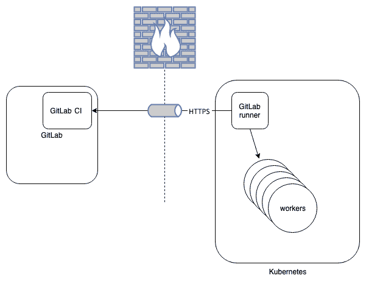

# 使用 GitLab Runner 与 Docker 或 Kubernetes

在上一章中，我们安装了带有 shell 执行器的 GitLab Runner。在本章中，我们将更详细地了解容器化的 GitLab Runners。你可以通过多种方式在容器中运行 GitLab Runner：

+   **使用在自定义构建的 Docker 容器中运行的 Shell 执行器**：这不推荐使用，因为你需要在之后负责构建和维护这个自定义容器。另一方面，如果你想严格控制容器内的组件及其行为，那么将 Runner 容器化可能是一个不错的选择。扩展此解决方案也需要更多的工作，因为 Runner 本身仅知道如何运行作业并连接到 GitLab。如果你的容器在作业后不重启，你将会在容器中收集状态（如 `/tmp` 或其他地方的文件），因此需要准备好处理这些问题。

+   **使用 Docker 执行器，该执行器为你的作业拉取并启动 Docker 镜像**：这是一个更具扩展性的解决方案，另一个优点是没有状态。每次构建都会得到一个崭新的环境并重新开始。另一个好处是，你可以为作业创建服务，这是另一个容器或多个容器，这些容器会与作业容器并行启动。例如，你可以启动一个 MySQL 数据库，并且它将作为一个服务通过服务名称进行访问。

+   **使用 Kubernetes 执行器，以便你可以使用 Kubernetes 集群**：Runner 可以与集群管理 API 通信，并请求资源来启动容器。当队列中的作业数量减少时，Runner 会自动缩减容器数量，保持完全无状态。

+   **使用 Docker 执行器并启用自动扩展（Docker Machines 创建新的 Runners）**：在此配置中，GitLab Runner 控制 Docker Machine 二进制文件。它可以实时创建新的 Runner 容器，并且在队列中的作业较少时会自动缩减。

在本章中，我们将了解运行 GitLab Runner 的基本方法，以及如何使用 Kubernetes 等管理系统来进行 orchestration。自动扩展执行器将在下一章介绍。之所以如此，是因为自动扩展的 Docker 执行器有很多选项，并且需要更多的规划和系统管理功能来维护。

本章将涵盖以下主题：

+   Runner 客户端架构

+   创建你自己的 Docker 化 GitLab Runner

+   使用预构建的 Docker 容器部署 GitLab Runners

+   使用 Kubernetes 集群启动 GitLab Runners

# 技术要求

为了跟随本章中的说明，请从 GitHub 下载本书的 GitHub 仓库以及可用的示例，链接为 [`github.com/PacktPublishing/Mastering-GitLab-12/tree/master/Chapter16`](https://github.com/PacktPublishing/Mastering-GitLab-12/tree/master/Chapter16)。

本章的其他要求如下：

+   为你的平台安装 Docker

+   `wget` 命令行下载工具（[`www.gnu.org/software/wget/`](https://www.gnu.org/software/wget/)）

+   访问 Alpine Docker 镜像（[`hub.docker.com/_/alpine`](https://hub.docker.com/_/alpine)）

+   访问 Python Alpine Docker 镜像（[`hub.docker.com/r/lgatica/python-alpine`](https://hub.docker.com/r/lgatica/python-alpine)）

+   访问 GitLab Runner Docker 镜像（[`hub.docker.com/r/gitlab/gitlab-runner`](https://hub.docker.com/r/gitlab/gitlab-runner)）

+   你系统上的 `kubectl` 工具（你可以在 [`kubernetes.io/docs/tasks/tools/install-kubectl/`](https://kubernetes.io/docs/tasks/tools/install-kubectl/) 找到安装说明）

+   安装 Helm 或 Tiller（一个帮助你管理集群的 Kubernetes 工具：[`helm.sh/docs/using_helm/`](https://helm.sh/docs/using_helm/)）

# Runner 客户端架构

如果你使用 Docker 中的 GitLab Runner，那么生成的架构与上一章中的架构有一个区别。Runner 二进制文件是在 Docker 容器内执行，而不是直接在主机系统上执行。下图展示了这种架构：


无论你是自己创建一个容器，还是使用来自互联网的现有容器，图像都是一样的。

如果你打算使用 Kubernetes 来编排你的 GitLab Runners，那么架构将略有不同。你可以看到，在集群内部，具有 Kubernetes 架构的**GitLab Runner**可以与集群的 Kubernetes API 通信，以便扩展 Runner 实例的数量：



这两种架构都将 Docker 容器作为核心操作单元。第一种架构在扩展、升级软件和设置网络方面需要更多的管理。而 Kubernetes 已经为大部分这类任务提供了安排。

现在，我们了解了这些架构之间的区别，并且知道 Runner 是在没有容器的情况下部署的，但这在实践中意味着什么呢？我们将在接下来的章节中探讨这一点。

# 创建你自己的 Docker 化 GitLab Runner

大多数人会使用预构建的 Docker 容器，但有时有理由去构建自己的。也许你在构建软件时有特殊需求，而这些需求在默认的 Docker 镜像中并未安装，或者由于安全限制，根本无法使用现有镜像。许多默认镜像中包含的软件存在漏洞。

让我们从 第十章 *创建你的产品，验证并打包它* 中的事件管理器文档开始，使用一个 Dockerfile 来创建我们自己的 Docker 化 GitLab Runner。你将在下一节中找到我们的第一次尝试。

我要强调的是，这个 Dockerfile 完全是为了演示目的。我们不推荐将这种方式用于生产系统，甚至是你自己的开发系统。它在这里用于展示如何轻松地将命令和服务封装到容器中。

文件的第一行如下：

```
FROM alpine:3.7
```

这是我们为容器使用的基础镜像。它来自 Alpine Linux 发行版，包含了运行程序所需的最低配置。它仅为 4.41 MB，并且在使用如 Clair（[`github.com/coreos/clair`](https://github.com/coreos/clair)）等容器安全扫描工具时，不显示漏洞。你也可以从零开始构建容器（请参见 [`ericchiang.github.io/post/containers-from-scratch/`](https://ericchiang.github.io/post/containers-from-scratch/)），但这是一个非常繁琐的任务。Alpine Linux 镜像足够安全，并且可以立即使用。

在接下来的行中，我们安装了一些基本的包：

```
RUN apk add --no-cache \
 ca-certificates \
 git \
 wget
```

我们需要 CA 证书，因为我们需要 GitLab Runner 客户端连接到我们的 HTTPS 端点，在那里会进行 TLS 握手。Git 二进制文件也是必需的，以便从项目中克隆代码。

最后，在容器创建序列中设置的最后一个命令用于下载、执行并将 GitLab Runner 注册到我们的 GitLab 服务器：

```
RUN wget https://s3.amazonaws.com/gitlab-runner-downloads/master/binaries/gitlab-runner-linux-386 && chmod +x gitlab-runner-linux-386 && \
 ./gitlab-runner-linux-386  register \
 --non-interactive \
 --url "https://gitlab-ee.joustie.nl/" \
 --registration-token "xxxxxxx" \
 --executor "shell" \
 --shell "sh" \
 --description "dockerized shell-runner" \
 --tag-list "docker" \
 --run-untagged="true" \
 --locked="false"
```

为了本例的方便，我们将所有参数硬编码在 Dockerfile 中，展示如何轻松将命令容器化（通常不建议这样做）：

+   `non-interactive`：如果没有这个选项，会出现一个对话框，引导你完成配置设置。

+   `url`：这是我们 GitLab 服务器的 URL。

+   `registration-token`：这是来自项目、组或 GitLab 实例范围内的 Runner 令牌。

+   `executor`：这指定了要实现的 Runner 类型。我们选择使用 shell 执行器。

+   `shell`：这指定了要使用的 shell 类型；可以是 `bash`、`sh` 或 Windows 上的 `powershell`。我们选择了 `sh`，因为它是最基础的。

+   `description`：这是你在 GitLab 中看到的描述。

+   `tag-list`：我们可以为 Runner 添加标签，以便在 GitLab 中进行更方便的管理。在这个例子中，我们使用了 `docker`。

+   `run-untagged`：我们将其设置为 `true`，意味着带标签或不带标签的任何作业都可以在这个 Runner 上运行。

+   `locked`：Runner 不与任何项目绑定。

下一步是使用 `docker build` 命令构建 Docker 容器（我们指定 `–no-cache`，这样每次都能重新构建）。输出如下，我们将逐步讲解。第一部分是拉取 Alpine 基础镜像：

```
$ docker build --no-cache -t dockerrunner . 
 Sending build context to Docker daemon   2.56kB
 Step 1/4 : FROM alpine:3.9
 3.9: Pulling from library/alpine
 Digest: sha256:769fddc7cc2f0a1c35abb2f91432e8beecf83916c421420e6a6da9f8975464b6
 Status: Downloaded newer image for alpine:3.9
 ---> 055936d39205
```

第一个 Docker 层已经创建。第二步是添加必要的包：

```
Step 2/4 : RUN apk add --no-cache ca-certificates git openssl     tzdata     wget
 ---> Running in 0ab19e2eef86
 fetch http://dl-cdn.alpinelinux.org/alpine/v3.9/main/x86_64/APKINDEX.tar.gz
 fetch http://dl-cdn.alpinelinux.org/alpine/v3.9/community/x86_64/APKINDEX.tar.gz
 (1/8) Installing ca-certificates (20190108-r0)
 (2/8) Installing nghttp2-libs (1.35.1-r0)
 (3/8) Installing libssh2 (1.8.2-r0)
 (4/8) Installing libcurl (7.64.0-r1)
 (5/8) Installing expat (2.2.6-r0)
 (6/8) Installing pcre2 (10.32-r1)
 (7/8) Installing git (2.20.1-r0)
 (8/8) Installing wget (1.20.3-r0)
 Executing busybox-1.29.3-r10.trigger
 Executing ca-certificates-20190108-r0.trigger
 OK: 21 MiB in 22 packages
 Removing intermediate container 0ab19e2eef86
 ---> 17ab7c7dd1b9
```

前面的代码下载了我们指定的包以及一些依赖项。这仍然是一个适度的包量。在接下来的构建步骤中，GitLab Runner 二进制文件将被下载：

```
Step 3/4 : RUN wget https://s3.amazonaws.com/gitlab-runner-downloads/master/binaries/gitlab-runner-linux-386 && chmod +x gitlab-runner-linux-386 && ./gitlab-runner-linux-386 register --non-interactive --url "https://gitlab-ee.joustie.nl/" --registration-token "xxxx" --executor "shell" --shell "sh" --description "dockerized shell-runner" --tag-list "docker" --run-untagged="true" --locked="false"
 ---> Running in d90d35beaa37
 --2019-05-22 21:05:18-- https://s3.amazonaws.com/gitlab-runner-downloads/master/binaries/gitlab-runner-linux-386
 Resolving s3.amazonaws.com... 52.216.18.115
 Connecting to s3.amazonaws.com|52.216.18.115|:443... connected.
 HTTP request sent, awaiting response... 200 OK
 ....
 2019-05-22 19:46:24 (2.22 MB/s) - 'gitlab-runner-linux-386' saved [25824256/25824256]
```

下一步是执行 Runner：

```
Runtime platform arch=386 os=linux pid=1 revision=5159dcdb version=11.12.0~beta.1484.g5159dcdb
Running in system-mode.
```

然后，我们需要注册它：

```
Registering runner... succeeded runner=Vh6hpU1D
 Runner registered successfully. Feel free to start it, but if it's running already the config should be automatically reloaded!
 Removing intermediate container b55a2ae6998a
 ---> be4317ad95b0
```

二进制文件已成功下载，注册也成功；已创建特定的 Runner 令牌，并且现在它是 Docker 镜像的一部分。构建的最后一部分设置了此镜像实例化 Docker 实例的入口点：

```
Step 4/4 : ENTRYPOINT ["./gitlab-runner-linux-386","run"]
 ---> Running in 8b54b77030bc
 Removing intermediate container 8b54b77030bc
 ---> be206c4c268c
 Successfully built be206c4c268c
 Successfully tagged dockerrunner:latest
```

它自动将镜像标记为 `latest`。该镜像现在可在其构建执行的机器上使用。您可以使用以下命令查看它：

```
$ docker images
 ...
```

如果您去 GitLab 并在管理设置菜单中打开 Runner 列表，您会看到一个新的 Runner 出现：


现在，是时候启动 Runner 并尝试构建 `eventmanager-documentation` 项目了。您可以使用以下命令在前台启动 Runner：

```
$ docker run -ti dockerrunner
```

简短的暂停后，应该会出现以下输出：

```
Runtime platform arch=386 os=linux pid=1 revision=5159dcdb version=11.12.0~beta.1484.g5159dcdb
 Starting multi-runner from /etc/gitlab-runner/config.toml ... builds=0
 Running in system-mode.

 Configuration loaded builds=0
 listen_address not defined, metrics & debug endpoints disabled builds=0
 [session_server].listen_address not defined, session endpoints disabled builds=0
```

如您所见，它已经成功加载了在注册阶段保存在容器中的配置。它还提到没有加载度量和调试会话服务器，因此该 Runner 不向外部世界暴露任何服务。它已连接到 GitLab 服务器，现正等待命令。

当我们尝试为主分支运行 `eventmanager-documentation` 项目的流水线时，它将把构建作业分配给新的 GitLab Runner：

```
Checking for jobs... received                       job=675 repo_url=https://gitlab-ee.joustie.nl/marketing/eventmanager-documentation.git runner=LT7jz43c
 WARNING: Job failed: exit status 1                  duration=347.5203ms job=675 project=10 runner=LT7jz43c
 ERROR: Failed to process runner                     builds=0 error=exit status 1 executor=shell runner=LT7jz43c
```

不幸的是，它未能构建项目。如果我们查看作业日志，将得到以下输出：


很明显，作业失败的原因。我们创建了一个基本的 GitLab Runner 容器，但不支持 Python 语言。这就是它抱怨找不到**Python 包管理器**(**PIP**)的原因。我们需要 Python 来安装**亚马逊** **网络** **服务** **命令行** **接口**(**AWS CLI**)实用工具，它在本项目的 `.gitlab-ci.yml` 文件中定义。

这个问题很容易修复。我们可以将 Dockerfile 中的第一行改为以下内容：

```
FROM python:3.7-alpine
```

这将把 Docker 容器的基础镜像更改为包含 Python 的 Linux 版本。现在，您可以使用完全相同的前述命令行重新构建镜像，并重新启动容器。

如果我们再次运行此项目的流水线，作业将会成功：


您可以创建更加复杂的容器镜像，但这只是将 Runner 容器化的基本方法。

在本节中，我们已经创建了自己的 GitLab Runner 容器，并将其注册到 GitLab 实例。在下一节中，我们将使用 GitLab 从其网站提供的预构建镜像。

# 使用预构建的 Docker 容器来部署 GitLab Runners

提供了两种基本的预构建 Docker 容器版本（基于 Ubuntu 和基于 Alpine）。它们之间的主要区别在于 Alpine 版本更小，并且安全性更高。你可以在这里找到它：[`gitlab.com/gitlaborg/gitlabrunner/blob/master/dockerfiles/alpine/Dockerfile`](https://gitlab.com/gitlaborg/gitlabrunner/blob/master/dockerfiles/alpine/Dockerfile)。

你可以使用参数来运行容器，这些参数将传递给容器内启动的 GitLab Runner 二进制文件。这也使得 GitLab Runner 注册到 GitLab 实例变得更加容易。记得在 *创建你自己的 Docker 化 GitLab Runner* 章节中，我们已经将 Runner 的注册功能内置到镜像中。你可以在 Docker Hub 上找到相关的镜像：[`hub.docker.com/r/gitlab/gitlab-runner/tags`](https://hub.docker.com/r/gitlab/gitlab-runner/tags)。

只需使用以下命令启动容器，它会自动下载正确的镜像：

```
$ mkdir /Users/shared/gitlab-runner && mkdir /Users/shared/gitlab-runner/config
 $ docker run -d --name gitlab-runner -v /Users/shared/gitlab-runner/config:/etc/gitlab-runner \
 -v /var/run/docker.sock:/var/run/docker.sock \
 gitlab/gitlab-runner:latest
```

你可以使用以下命令检查正在运行的容器日志：

```
$ dockers logs -f gitlab-runner
 ERROR: Failed to load config stat /etc/gitlab-runner/config.toml: no such file or directory  builds=0
```

上述输出意味着 `gitlab-runner` 软件正在容器内运行，但尚未注册。

下一步是注册它并将配置文件保存在容器中（保存在你通过 `-v` 指定的配置卷中）：

```
docker run --rm -v /User/shared/gitlab-runner/config:/etc/gitlab-runner gitlab/gitlab-runner register \
 --non-interactive \
 --executor "docker" \
 --docker-image python:3.7-alpine \
 --url "https://gitlab-ee.joustie.nl/" \
 --run-untagged="true" \
 --registration-token "xxx" \
 --description "docker-runner" \
 --tag-list "eventmanager" \
 --locked="false"
```

如果你在此之后查看容器日志（也许你留下了窗口打开），应该会看到一条消息：

```
...
 Configuration loaded                                builds=0
```

这意味着 Runner 现在具有有效的配置，并且已与 GitLab 在线连接。

如果我们再次尝试触发 `eventmanager-documentation` 项目的管道，将会运行一个任务：

```
Checking for jobs... received                       job=660 repo_url=https://gitlab-ee.joustie.nl/marketing/eventmanager-documentation.git runner=8cX8wWCr
```

在 GitLab 中，你将看到此任务正在运行：


如果任务成功，容器的日志文件中会显示一条消息：

```
Job succeeded                                       duration=1m17.7055922s job=660 project=10 runner=8cX8wWCr
```

这也可以在 GitLab 的任务日志中看到：


这就总结了使用相对简单的容器在本地运行 Docker 的两种方法：

+   构建你自己的容器

+   使用预构建的镜像

如果你有大量构建任务，如何管理它们呢？你可以使用 Kubernetes 等编排系统，这是下一节的主题。

# 使用 Kubernetes 集群启动 GitLab Runners

将 GitLab Runner 容器部署到 Kubernetes 集群的最佳方法是使用 GitLab Runner Helm chart。

它包含所有使用 GitLab Runner Kubernetes 执行器运行的配置信息。对于从 GitLab CI/CD 接收到的每个新任务，它会在指定的命名空间内配置一个新的 pod 来运行。

你可以使用以下命令进行安装：

```
$ helm install --namespace gitlab --name gitlabrunner -f values.yaml  gitlab/gitlab-runner
```

这个命令可能需要一些时间才能完成。过一段时间后，你将看到如下输出：

```
NAME: gitlabrunner
 LAST DEPLOYED: Tue May 21 21:11:15 2019
 NAMESPACE: gitlab
 STATUS: DEPLOYED

 RESOURCES:
 ==> v1/ConfigMap
 NAME DATA AGE
 gitlabrunner-gitlab-runner 5 0s

 ...
```

这显示了相当多的输出内容，但重要的部分是 Helm chart 的状态是 `DEPLOYED`。

GitLab Runner 现在应该已注册到可以访问的 GitLab 实例：[`gitlab-ee.joustie.nl/`](https://gitlab-ee.joustie.nl/)

我们在本地 Kubernetes 集群上运行了这个部署。

你可以通过以下命令查找哪些 Kubernetes pods 正在运行：

```
$ kubectl get pods -n gitlab
 NAME                                          READY   STATUS    RESTARTS   AGE
 gitlabrunner-gitlab-runner-787dddf5b5-58fzw   1/1     Running   0          2m
```

如你所见，Runner 已在 Kubernetes 中部署，并出现在 GitLab 管理部分的 Runner 列表中：


我们可以运行第十章中介绍的`eventmanager-documentation`项目的管道，*创建你的产品，验证并打包它*，以演示多个 Runner 在 Kubernetes 集群上启动的事实。以下是 GitLab 中的管道视图，展示了多个并行任务：


如果你查看单个任务，你会看到在集群中启动新的 Runner 资源需要一些时间。直到它准备好，任务会进行轮询：


过了一段时间，一个 Runner 被启动在 Kubernetes 集群中，任务被分配到它：


你可以查看 Kubernetes 集群中 pods 的列表，并看到许多 pods 已被创建：


过了一段时间，你会看到一些并行启动的任务正在完成（绿色表示）：


最终，所有任务都会成功，管道将通过：


这项任务完成后，GitLab Runner 的数量再次减少。

通过这样做，我们向你展示了如何使用 Kubernetes 管理容器，并且如何处理动态扩展。

# 总结

在这一章中，我们向你展示了如何在容器中运行 GitLab Runners。首先，我们介绍了将现有 Runner 容器化的一种快速方法。然后，我们展示了如何使用 GitLab 自身提供的现有 Docker 镜像。之后，我们讨论了如何管理更多容器，并且如何通过 Kubernetes 以更经济的方式处理这些容器。

在下一章，我们将讨论另一种扩展 Runner 的方法：自动扩展。

# 问题

1.  Docker 执行器的优势是什么？

1.  Docker 容器的基本构建命令是什么？

1.  哪个文件包含容器的构建指令？

1.  小型 Linux 容器发行版的名称是什么？

1.  使用什么工具可以更轻松地配置 Kubernetes 集群？

1.  你如何设置 Kubernetes 中默认启动的 Runner 数量？

# 进一步阅读

+   *来自 DevOps 专家的 Kubernetes 课程（Kubernetes 和 Docker）*，由*陶伟*、*James Lee*和*Basit Mustafa*编写：[`www.packtpub.com/application-development/kubernetes-course-devops-guru-kubernetes-docker`](https://www.packtpub.com/application-development/kubernetes-course-devops-guru-kubernetes-docker)

+   *学习 Docker – Docker 18.x 基础*，作者：*加布里埃尔·N·申克*： [`www.packtpub.com/in/networking-and-servers/learn-docker-fundamentals-docker-18x`](https://www.packtpub.com/in/networking-and-servers/learn-docker-fundamentals-docker-18x)

+   *实践持续集成与交付*，作者：*让-马塞尔·贝尔蒙特*： [`www.packtpub.com/in/virtualization-and-cloud/hands-continuous-integration-and-delivery`](https://www.packtpub.com/in/virtualization-and-cloud/hands-continuous-integration-and-delivery)

+   *从零开始的容器*： [`ericchiang.github.io/post/containers-from-scratch/`](https://ericchiang.github.io/post/containers-from-scratch/)
