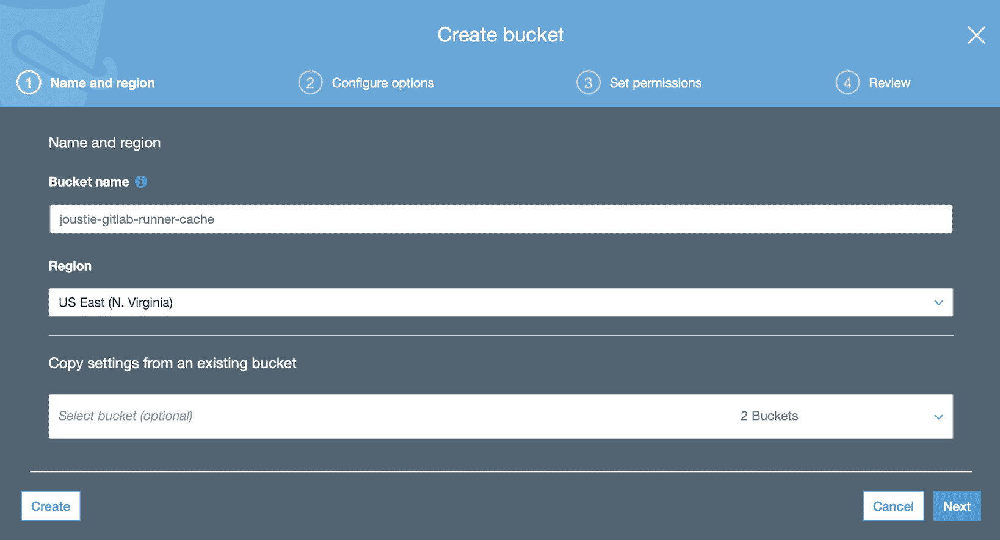

# 自动扩展 GitLab CI Runners

在前一章节中，我们使用 Kubernetes 执行器扩展了 GitLab Runners。根据你对并发运行作业数量的要求，Kubernetes 集群中可用的 Runner 数量可以随时增减。拥有大量的 Runner 可能非常昂贵，即使它们被关闭了，仍然会产生费用。最好是按需创建 Runner，并在不再需要时销毁它们。

还有另一种 GitLab Runner 执行器，它可以以这种弹性方式动态添加或移除 Runner 实例，这就是所谓的 Docker Machine 执行器。我们将从架构的角度展示它的样子，解释一些配置，并提供使用 VirtualBox 驱动程序和 Amazon EC2 驱动程序运行 Docker Machine 执行器的示例。

在本章中，我们将讨论以下主题：

+   Runner 客户端架构

+   设置环境

+   配置 GitLab Runner

# 技术要求

你可以在本书的 GitHub 仓库中找到本章的代码文件：[`github.com/PacktPublishing/Mastering-GitLab-12/tree/master/Chapter17`](https://github.com/PacktPublishing/Mastering-GitLab-12/tree/master/Chapter17)。

本章的其他要求如下：

+   Docker Machine 会随着适用于 macOS 或 Windows 的 Docker 软件分发版本自动安装。如果你没有安装它，可以通过以下链接找到它：[`github.com/docker/machine/releases/`](https://github.com/docker/machine/releases/)。

+   你需要一台具有最新补丁的 Linux 路由主机。

+   需要访问 Docker 注册表镜像 ([`hub.docker.com/_/registry`](https://hub.docker.com/_/registry))。

+   需要访问 MinIO Docker 镜像 ([`hub.docker.com/r/minio/minio`](https://hub.docker.com/r/minio/minio))。

+   你需要在路由主机上安装 VirtualBox ([`www.virtualbox.org`](http://www.virtualbox.org))。

+   你需要一个 AWS 账户，用于通过 EC2 基础设施进行扩展。

# Runner 客户端架构

首先，我们将描述该解决方案的架构。基于前几章节提出的架构，我们有一个 GitLab 实例，GitLab CI 收到来自运行在专用主机上的 GitLab Runner 的请求。这可以是本地虚拟机，也可以是云中的实例。Runner 配备了 Docker Machine 程序。

Docker Machine 执行器类型本质上是一个执行 Docker Machine 命令的 GitLab Runner。通过 Docker Machine，你可以创建运行 Docker 引擎的虚拟主机。你可以使用它来控制这些主机，并创建安装了 Docker 引擎的新虚拟机，这些虚拟机可以运行 GitLab Runner 容器实例。以下是该过程的示意图：


在前面的图示中，你可以看到**Docker Machine**组件，并且它可以实例化多个 runner。图示中还有两个其他组件，分别是**缓存服务器**（可以存储构建的依赖项）和**Docker 注册表代理**（可以缓存来自 Docker Hub 等地方的 Docker 镜像）。这两个组件将在*配置 Runner*部分中详细说明。

# 设置环境

要启用基于 Docker Machine 的 Runner，必须执行以下步骤：

1.  准备一个堡垒主机，作为 Docker 创建新机器的主机。

1.  在此机器上部署 GitLab Runner 软件。

1.  安装 Docker Machine。

# 准备堡垒主机

在这个示例中，我们选择了基于 macOS 的机器。这可以是一个 Linux 虚拟机或你的笔记本电脑—任何能够运行最新版本 GitLab Runner 软件的机器。该主机唯一的功能就是通过 Docker Machine 执行器执行 GitLab Runner 软件。由于它可以通过 `docker-machine` 命令控制多个 Runner 实例，因此它应该被严格安全配置，以防止攻击，它也因此成为潜在的攻击目标。

# 部署 GitLab Runner 软件

在 macOS 上，我们使用 Homebrew 包管理器。要安装 Runner 软件，可以执行以下命令：

```
brew install gitlab-runner
```

之后，你可以像 第十五章 中所示那样 `register` Runner，*安装和配置 GitLab Runners*：

```
gitlab-runner register
```

在注册过程中，当询问执行器时，选择 Docker Machine 执行器。

在 Runner 注册后，先不要启动它—我们需要编辑位于 `~/.gitlab-runner/config.toml` 的 `config.toml` 配置文件，这个文件在 macOS 上可以找到。我们将在*配置 Runner*部分进行编辑。

首先，我们需要安装 Docker Machine 二进制文件，然后才能配置 Runner，以启动 Docker Machine 执行器。

# 安装 Docker Machine

如果你已经在 macOS 或 Windows 上安装了 Docker，那么你已经安装了该二进制文件。你可以通过使用以下命令来测试安装：

```
$ docker-machine -v
docker-machine version 0.16.1, build cce350d7
```

你可以使用这个工具创建新的 Docker 主机。它们可以在你的本地计算机或网络上创建，也可以通过像 Microsoft、Amazon 和 Google 这样的云服务提供商创建。Docker Machine 为许多系统提供插件。以下是它们的列表：

+   所有 VMware 产品

+   Virtualbox

+   微软 Hyper-V

+   Digitial Ocean

+   亚马逊 Web 服务 (EC2)

+   微软 Azure

+   Exoscale

+   Google 计算引擎

+   Scaleway

+   IBM Softlayer

+   Rackspace

+   OpenStack

+   Linode

如果你运行的是 Linux，可以从 [`github.com/docker/machine/releases/`](https://github.com/docker/machine/releases/) 下载并安装 Docker Machine。

如果你查看 GitLab Runner 的 Dockerfile，地址是[`hub.docker.com/r/gitlab/gitlab-runner/dockerfile`](https://hub.docker.com/r/gitlab/gitlab-runner/dockerfile)，它用于构建默认容器，其中有一行内容如下：

```
wget -q https://github.com/docker/machine/releases/download/v0.7.0/docker-machine-Linux-x86_64 -O /usr/bin/docker-machine && \
 chmod +x /usr/bin/docker-machine
```

Docker Machine 二进制文件直接安装在这个容器镜像中，并由 GitLab Runner 软件使用。当你确认 Docker Machine 二进制文件可用后，下一步是配置 Runner。

# 配置 Runner

现在你已经安装了 Runner 软件和 Docker Machine，是时候编辑 Runner 配置文件了。在 macOS 上，你可以在`~/.gitlab-runner/config.toml`中找到`config.toml`文件。它位于你的主目录，因为 Runner 在 macOS 上以用户空间的方式运行。

现在，我们将查看一些你可以在`config.toml`文件中指定的配置选项，这些选项专门用于自动扩展的 Runner。

# 非高峰时段模式配置

大多数组织不需要 24/7 的容量，因为他们不需要一直使用 CI 运行器。大部分工作是在常规工作周的工作时间内完成的，周末对软件构建的需求较低。在这种情况下，让机器空闲等待作业是没有意义的。通过使用`OffPeakPeriods`选项指定时间表，你可以指定这些生产力较低的时段。在这些时段，控制创建运行器容量的参数会有所不同。你可以通过在其前面加上`OffPeak`来指定它们。因此，`IdleCount`变为`OffpeakIdleCount`，`IdleTime`变为`OffPeakIdletime`，等等。算法的功能保持不变。

在以下时间表中（这是常见的时间表），你可以看到工作日夜间、傍晚以及整个周末的非高峰时段：

```
[runners.machine]
   OffPeakPeriods = [
     "* * 0-9,18-23 * * mon-fri *",
     "* * * * * sat,sun *"
   ]
```

# 分布式运行器缓存

GitLab Runners 内置了缓存机制。它可以在全局级别以及单个项目级别进行设置。

# 全局设置缓存

你可以在`config.toml`配置文件中设置路径，以便它缓存每个作业：

```
[runners.cache]
 Path = "/node_modules"
```

# 在项目级别设置缓存

你可以在项目本身的`.gitlab-ci.yml`文件中设置要缓存的路径：

```
 cache:
 paths:
 - node_modules/
```

上述设置适用于单个 Runner 主机的上下文。如果我们使用自动扩展，我们需要一种方法让所有运行器共享这个缓存，以帮助提高速度。我们可以使用外部存储，比如 S3 桶来充当缓存。只需在 Runner 的`config.toml`文件中添加`[runners.cache.s3]`部分：

```
     [runners.cache.s3]
       ServerAddress = "s3-website-us-east-1.amazonaws.com"
       BucketName = "joustie-gitlab-runner-cache"
       AccessKey = "xxx"
       SecretKey= "xxxx"
       Insecure = false
```

如果这是你第一次这样做，它会尝试从 S3 存储桶获取`cache.zip`文件。然而，如果没有这个文件，它会报错并继续：

```
Checking cache for default...
 FATAL: file does not exist
```

在构建后，`node_modules`目录被依赖项填充，该目录的内容会被压缩并发送到 S3 存储桶：

```
Creating cache default...
 node_modules/: found 5728 matching files 
 Uploading cache.zip to https://joustie-gitlab-runner-cache.s3.amazonaws.com/project/14/default
 Created cache
 Job succeeded
```

如果我们重试该任务，我们会发现现在 S3 中有一个 `cache.zip` 文件，它将被用来替代重新下载所有节点依赖：

```
Checking cache for default...
 Downloading cache.zip from https://joustie-gitlab-runner-cache.s3.amazonaws.com/project/14/default
 Successfully extracted cache
```

# 分布式容器注册表镜像

另一个可能会显著拖慢构建速度的情况是 Runner 持续从互联网下载 Docker 容器。创建一个代理来处理这一问题会是一个更好的选择。在 `runners.machine` 中，你可以指定应该使用哪个 `engine-registry-mirror`。如果在本地网络中使用，这将节省大量的流量。以下是我在示例项目中使用该功能时的配置：

```
  MachineOptions = [
 "engine-registry-mirror=http://192.168.1.10:6000"
 ]
```

最基本的方式是，Docker Machine 执行器使用 `docker-machine` 来生成新的 GitLab Runner 容器实例。

你可以将此与其他功能结合使用，比如共享缓存和使用专用的容器注册表，以便管理大量实例。

如果你为 Runner 启用了这些设置，你需要部署一个缓存服务器和一个注册表镜像服务，我们将在下一节中展示。

# 安装并运行代理容器注册表和缓存服务器

这两台额外的机器在你计划部署一个完整的弹性 GitLab Runner 集群时是必要的。如果你有超过五个可以同时运行的 Runner，运行一个注册表代理和缓存服务器将带来明显的优势。你还会得到一个额外的特性，即在架构中引入了一定的高可用性：当你的互联网连接不稳定或离线时，仍然可以进行构建。

对于一个代理容器注册表，你需要有一个实现 Docker Registry HTTP API V2 的代理，我们将在下一节中安装它。

# 代理容器注册表

有一个方便的 Docker 容器可以立即完成此任务。你可以通过以下代码立即启动该 Docker 容器：

```
docker run -d -p 6000:5000 -e REGISTRY_PROXY_REMOTEURL=https://registry-1.docker.io  --name runner-registry registry:2
```

如果你创建了这样的注册表代理并检查 Runner 开始执行任务时的日志文件，你会发现代理通过获取和缓存镜像来服务 Runner：

```
$ docker logs registry -f

172.17.0.1 - - [25/May/2019:14:28:40 +0000] "GET /v2/ HTTP/1.1" 200 2 "" "docker/18.09.6 go/go1.10.8 git-commit/481bc77 kernel/4.14.116-boot2docker os/linux arch/amd64 UpstreamClient(Go-http-client/1.1)"
...
```

配置项不多，但你可以在这里找到更多信息：[`hub.docker.com/_/registry`](https://hub.docker.com/_/registry)。

# 缓存服务器

创建缓存服务器有两种选择。你可以选择在 Amazon 或其他云服务商获取一个 S3 桶，或者自行运行一个对象存储服务，例如 MinIO，详情请见[`min.io`](https://min.io)。

# 在 Amazon Web Services 中创建 S3 桶

登录到 Amazon Web Services 控制台，通过 Services | S3 找到 S3 仪表盘。点击创建桶（Create bucket）：


我们将其命名为 `joustie-gitlab-runner-cache`，其余设置保持默认：



# 创建你自己的 MinIO 服务器

这也可以方便地作为 Docker 镜像使用。建议在专用主机上运行此服务，因为涉及的存储可能会变得相当庞大，而你不希望此服务影响到主机上运行的其他服务。

使用以下命令运行容器：

```
docker run -it -p 9005:9000 -v ~/.minio:/root/.minio -v /s3:/export --name caching-server minio/minio:latest server /export
```

请注意容器中挂载的 `/s3` 卷，该目录将用作存储缓存对象的目录。

上述命令的输出将在一段时间后出现：

```
latest: Pulling from minio/minio
 e7c96db7181b: Already exists
 94d4d681d0f2: Pull complete
 664c3f016f88: Pull complete
 b3235cce6961: Pull complete
 Digest:sha256:244c711462a69303c0aa4f8d7943ba8b36dd55246e29da44c6653e39eaa42e70
 Status: Downloaded newer image for minio/minio:latest
```

容器镜像将被下载。

之后，MinIO 容器将启动，并报告它使用的位置，以及 `AccesKey` 和 `SecretKey`，这些将被 Runner 使用：

```
Endpoint:  http://172.17.0.4:9000  http://127.0.0.1:9000
 AccessKey: xxx
 SecretKey: xxx
```

我们将通过构建一个 Node.js 示例项目来演示缓存的使用。该项目包含一个 `node_modules` 目录，我们在 `.gitlab-ci.yml` 文件中指定该目录为缓存位置。

当你使用 GitLab Runner 构建 Node.js 项目时，它会在 Runner 作业日志文件中报告其使用的缓存情况：

```
node_modules/: found 5728 matching files 
 Uploading cache.zip to http://192.168.178.82:9005/joustie-gitlab-runner-cache/project/14/default
 Created cache
 Job succeeded
```

当我们查看运行 MinIO 容器的专用机器时，我们在 `/s3` 目录中输入 `tree` 命令时，发现了以下目录结构（这是 MinIO Docker 容器用来存储对象的目录）：

```
$tree
 .
 └── joustie-gitlab-runner-cache
 └── project
 └── 14
 └── default

 3 directories, 1 file
```

我们再次运行了 GitLab Runner 作业，它在 MinIO 存储桶中找到了 `cache.zip`。

这是使用单一 Runner 的示例。不过，你可能希望使用这些选项来扩展 Runner 实例。我们将在下一部分中讨论这个问题。

# 扩展你的 Runner

在上一节中，我们配置了软件并准备了环境，以便能够扩展 Runner 数量，同时还提供了一些共享服务，如注册表代理和缓存服务器。现在，让我们看两个示例。我们将分别在配置为使用 VirtualBox 和配置为使用亚马逊 Web 服务的 Runner 上运行作业。VirtualBox 是 Oracle 提供的开源虚拟化解决方案，可以在 [`www.virtualbox.org/`](https://www.virtualbox.org/) 找到。

几乎所有的 Runner 配置文件（`config.toml` 文件）都是相同的；我们只需更改机器驱动部分。我们从 VirtualBox 选项开始。

# 使用本地 VirtualBox 实例的 Docker 机器

我们从本地的 `gitLab-runner` 服务开始，使用 VirtualBox 的 `config` 文件：

```
brew services start gitlab-runner
```

几秒钟后，我们将看到 VirtualBox 启动了多个虚拟机：


当我们在 第十章 中开始构建事件管理器项目时，*创建你的产品，验证并打包它*，我们发现它需要更多的 Runner（五个并行作业）来运行管道。因此，我们将启动更多的机器：


当构建完成后，在 `IdleTime` 过后，机器数量将减少：


如果你已经在某些服务器上安装了 VirtualBox，那么 VirtualBox 驱动程序是一个很好的选择。

# 使用在亚马逊 Web 服务（EC2）上创建的 Docker 机器

如果你将机器驱动程序从 VirtualBox 更改为 Amazon EC2 并重新启动 Runner，Docker Machine 将在 Amazon 上启动 Runner，前提是你的凭证已保存在主目录中或已插入到你的 shell 环境中。如果没有，你需要将其保存在 `config.toml` 文件中。

一段时间后，Runner 将出现在 EC2 Web 界面中：


当这些 Runner 启动时，你可以将 Docker 上下文切换到 Amazon 上的实例，这样你就可以运行 Docker 命令并控制这些机器：

```
eval $(docker-machine env runner-fatr91wm-elastic-runner-1558647049-87941946)
```

当你访问堡垒主机上的 Runner 日志时，你会看到它会将机器数量缩减到 `IdleCount`：

```
$docker logs  runner-fatr91wm
gitlab-runner[69056]:  WARNING: Removing machine : Too many idle machines 
```

如果我们从之前的任务（事件管理项目）开始，我们会看到许多任务在构建管道启动后进入队列：


`docker-machine ls` 命令将显示由自动扩展的 GitLab Runner 在 AWS 上启动的多个 EC2 实例：

```
$ docker-machine ls
 NAME ACTIVE DRIVER STATE URL SWARM DOCKER ERRORS
 runner-fatr91wm-elastic-runner-1558702358-7e149fd0 * amazonec2 Running tcp://3.86.53.66:2376 v18.09.6 
 runner-fatr91wm-elastic-runner-1558702588-f8114aa8 - amazonec2 Running tcp://34.207.177.20:2376 
 runner-fatr91wm-elastic-runner-1558702591-6e1b6fd9 - amazonec2 Running tcp://34.235.132.231:2376 
 runner-fatr91wm-elastic-runner-1558702594-dd75b49b - amazonec2 Running tcp://35.175.240.226:2376 

```

你还可以在 AWS Web 控制台中查看新的 Runner 实例：


在成功完成管道中的一些任务后，Runner 将再次缩减：


如你所见，在 Runner 配置文件中更改 Docker Machine 驱动程序并获得相同的行为非常简单。Runner 在 VirtualBox 中扩展的虚拟机用于运行 Docker 容器，同时也可以在亚马逊 Web 服务上运行。

# 概要

本章中，我们解释了 GitLab Runners 的自动扩展功能。与 Kubernetes 类似，它为你提供了按需创建 Runner 实例并在需求较少时缩减的选项。在幕后，它使用 Docker Machine 来管理这些副本。提供了几种驱动程序，可以立即在许多平台上创建 Runner 实例。

在下一章，我们将查看监控这些实例的选项。

# 问题

1.  `docker-machine` 执行器使用了什么 Docker 功能？

1.  在使用自动扩展时，推荐使用哪些额外的服务器？

1.  Runner 的分布式缓存保存在什么文件中？

1.  本章中使用的对象存储的名称是什么？

1.  GitLab Runner 的配置文件名是什么？

1.  作为注册表缓存使用的 Docker 镜像名称是什么？

# 进一步阅读

+   *容器化入门*，作者：*Gabriel N. Schenker*、*Hideto Saito*、*Hui-Chuan Chloe Lee* 和 *Ke-Jou Carol Hsu*：[`www.packtpub.com/in/virtualization-and-cloud/getting-started-containerization`](https://www.packtpub.com/in/virtualization-and-cloud/getting-started-containerization)

+   *Docker 高手进阶（第三版）*，作者：*Russ McKendrick* 和 *Scott Gallagher*：[`www.packtpub.com/in/virtualization-and-cloud/mastering-docker-third-edition`](https://www.packtpub.com/in/virtualization-and-cloud/mastering-docker-third-edition)

+   *Oracle VM VirtualBox 入门*，作者：*Pradyumna Dash*：[`www.packtpub.com/in/virtualization-and-cloud/getting-started-oracle-vm-virtualbox`](https://www.packtpub.com/in/virtualization-and-cloud/getting-started-oracle-vm-virtualbox)

+   *动手实践 AWS 系统管理*，作者：*Glauber Gallego*、*Daniel Stori* 和 *Satyajit Das*：[`www.packtpub.com/in/virtualization-and-cloud/hands-aws-system-administration`](https://www.packtpub.com/in/virtualization-and-cloud/hands-aws-system-administration)
