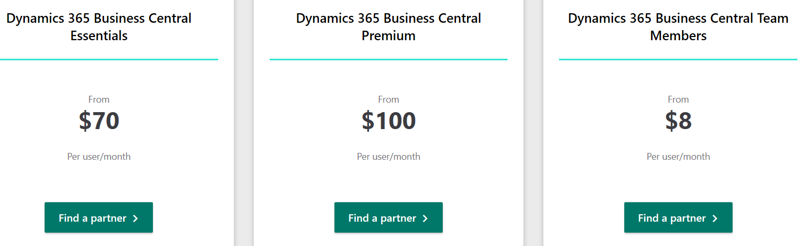
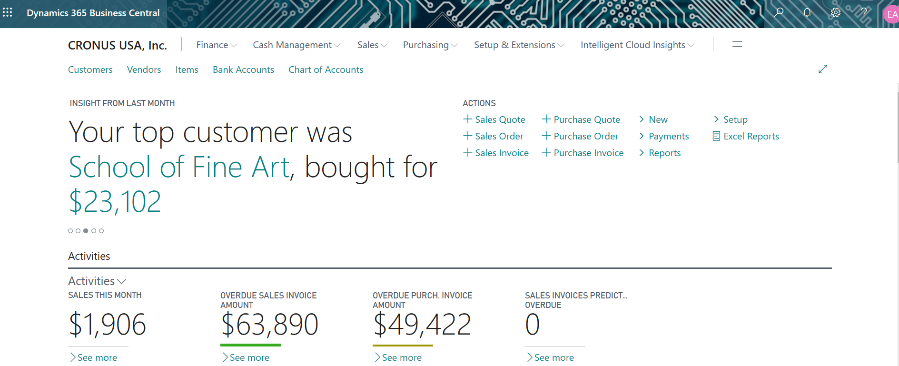
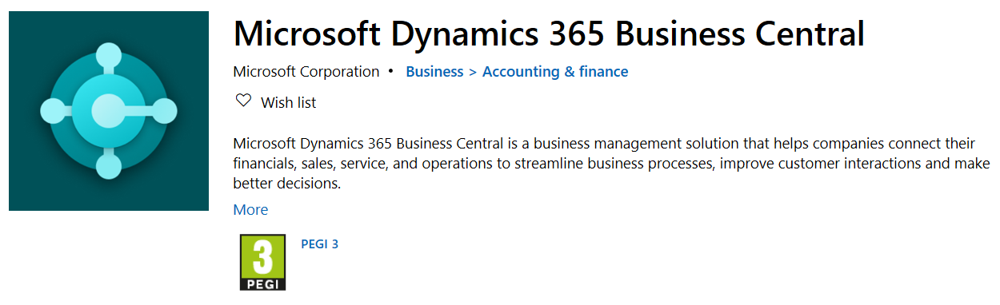
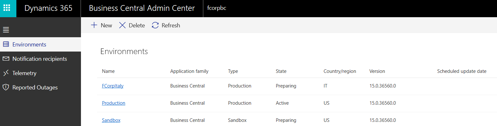
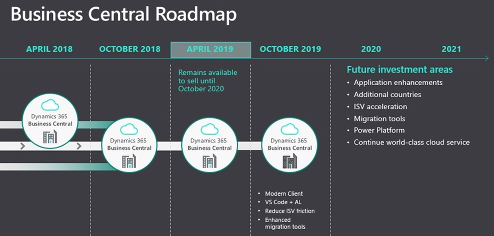

# 第一章：Microsoft Dynamics 365 Business Central 概述

**Microsoft Dynamics 365 Business Central** 是一款顶尖的基于云的 **企业资源规划**（**ERP**）应用软件，专为 **中小企业**（**SMB**）市场设计。该应用基于 **软件即服务**（**SaaS**）模式，并通过 **云解决方案提供商**（**CSP**）合作伙伴进行销售。

潜在客户可以随时启动试用租户，或联系 CSP 合作伙伴购买并分配按用户计费的许可。

本章将涵盖以下主题：

+   **客户视角**：什么是 Dynamics 365 Business Central，涵盖了哪些功能领域，以及许可方式

+   **合作伙伴视角**：Business Central 管理中心概述及其使用

+   **Microsoft 视角**：深入了解 Microsoft Dynamics 365 Business Central 的技术细节

+   **未来视角**：未来几年可能会发生的变化以及如何为实现这些变化做出贡献

到本章结束时，你将对 Microsoft Dynamics 365 Business Central 平台有一个清晰而深入的概述。

# 理解客户视角

针对中小企业，Dynamics 365 Business Central 的核心设计依赖于 Microsoft Azure 和 Office 365 平台。该应用的核心代码和业务流程来源于 Microsoft Dynamics NAV（通常称为 *Navision*）30 多年来功能增强的演变：这是中小企业领域最坚固的本地部署 ERP 软件之一。

潜在客户——或者那些只是想体验一下该应用的人——可以通过 [`trials.dynamics.com/Dynamics365/Signup/BusinessCentral`](https://trials.dynamics.com/Dynamics365/Signup/BusinessCentral) 提供与 Office 365 订阅绑定的电子邮件地址和电话号码，快速设置并试用该产品。30 天试用期结束后，产品需要购买。

正式授权仅通过经过 CSP 项目认证的 Microsoft 合作伙伴分配。只需浏览 [`dynamics.microsoft.com/en-us/business-central/overview/`](https://dynamics.microsoft.com/en-us/business-central/overview/) 并在所需的许可模块下点击“查找合作伙伴”，如以下截图所示：

Microsoft Dynamics 365 Business Central 提供开箱即用的功能模块，按每个用户每月固定价格收费。根据不同的功能和应用模块，有三种按用户/每月计费的选择：Essentials（基础版）、Premium（高级版）和 Team Members（团队成员）。Essentials 和 Premium 是完整用户，而 Team Members 只是具有有限功能的额外用户。

以下是 *Essentials* 模块的属性（功能集合）（从每月 $70 起）：

+   财务管理

+   客户关系管理

+   项目管理

+   供应链管理

+   人力资源管理

+   仓库管理

这些是 Premium 模块的属性（每月起价 100 美元）：

+   财务管理

+   客户关系管理

+   项目管理

+   供应链管理

+   人力资源管理

+   仓库管理

+   服务管理

+   制造业

当前，在同一租户中不可能拥有 Essential 和 Premium 混合的用户体验。可以从 Essential 模块升级到 Premium 模块，但不能从 Premium 降级到 Essential。如果你已经至少有一个用户被授权为 Essential 或 Premium，那么可以将外部用户作为命名许可的 *Team Member* 添加到相同的模块（Essential 或 Premium）中。

这就是作为 Team Member 获得的内容（每月起价 8 美元）：

+   Essential 或 Premium（取决于添加团队成员的用户模块）。

+   消耗数据或报告的能力、完成轻任务（如时间或费用条目及人力资源记录更新），并使用 PowerApps for Dynamics 365。

+   从技术上讲，他们可能对所有表格具有读取权限，但只能对最多三张表具有插入/更新权限。

有关许可类型及其包含内容的所有详细信息已在官方 Microsoft Dynamics 365 Business Central 许可指南中描述（截至写作时的最新审查为 2019 年 10 月），可通过以下链接找到：[`mbs.microsoft.com/Files/public/365/Dynamics365BusinessCentralLicensingGuide.pdf`](https://mbs.microsoft.com/Files/public/365/Dynamics365BusinessCentralLicensingGuide.pdf)。

一旦客户开始使用他们的试用版或生产版租户，他们将获得一个富有生产力、直观且用户友好的 Web 客户端界面，如下图所示：

最佳的浏览器体验由 Microsoft Edge 或 Google Chrome 提供。

客户还可以在几乎所有现代设备上受益于通用应用程序部署类型，如平板电脑、智能手机和手机。这是通过从 Windows Store、Google Play 或 Apple Store 下载名为 Dynamics 365 Business Central Universal App 的应用程序实现的。要安装移动应用程序，请访问 [`docs.microsoft.com/en-us/dynamics365/business-central/install-mobile-app`](https://docs.microsoft.com/en-us/dynamics365/business-central/install-mobile-app)。

打开此网站后，我们会看到安装移动应用程序的三个选项。您可以从 Microsoft 安装、从 Apple Store 下载，或从 Google Play Store 获取。以下是选择从 Microsoft 安装应用程序时您将看到的屏幕截图片段：

截至写作时，Microsoft Dynamics 365 Business Central 已在 18 个国家/地区（按发布日期排序）由微软正式本地化并发布：

| **2018 年 4 月** | **2018 年 7 月** | **2018 年 10 月** |
| --- | --- | --- |
| 美国 | 澳大利亚 | 墨西哥 |
| 加拿大 | 新西兰 | 挪威 |
| 英国 |  | 冰岛 |
| 丹麦 |  |  |
| 荷兰 |  |  |
| 德国 |  |  |
| 西班牙 |  |  |
| 意大利 |  |  |
| 法国 |  |  |
| 奥地利 |  |  |
| 瑞士 |  |  |
| 比利时 |  |  |
| 瑞典 |  |  |
| 芬兰 |  |  |

从 2018 年 10 月更新开始，CSP 合作伙伴现在可以为 Dynamics 365 Business Central 尚未发布或尚未成为微软本地化目标的国家创建自己的本地化版本。

这些本地化版本以全球标准应用基础（称为 W1）为起点，并通过 Microsoft Dynamics 365 Marketplace 分发，称为 AppSource。像通过 AppSource 部署的任何扩展（或应用程序）一样，所有的应用程序和技术支持由通过 AppSource 销售该应用程序的合作伙伴提供。

你可以在[`docs.microsoft.com/en-us/dynamics365/business-central/dev-itpro/developer/readiness/readiness-develop-localization#service-availability-in-additional-countries`](https://docs.microsoft.com/en-us/dynamics365/business-central/dev-itpro/developer/readiness/readiness-develop-localization#service-availability-in-additional-countries)查看更多内容。

以下是当前额外的 CSP 本地化国家（截至写作时）的应用程序和发布者名称列表：

| 爱沙尼亚 | 爱沙尼亚语包 | 爱沙尼亚增值税报告本地化 | 爱沙尼亚企业登记本地化 | 爱沙尼亚银行格式本地化 | 爱沙尼亚 Intrastat 报告本地化 | Estonian Dynamics Partners |
| --- | --- | --- | --- | --- | --- | --- |
| 香港特别行政区 | 香港繁体中文语言包 | 香港繁体中文包 | 香港繁体中文语言 | Tectura Hong Kong LimitedPacific Business Consulting, Inc.K-Solve IT Solutions Limited |
| 印尼 | 印度尼西亚税务计算本地化 | Wahana Ciptasinatria |
| 日本 | 日本语包 | J-Pack – 日本本地化 | Pacific Business Consulting, Inc. |
| 马来西亚 | ADS 报告（入门）本地化 | ADS 本地税（入门）本地化 | ADS Global SSO Sdn Bhd |
| 波兰 | 波兰语包 | 波兰功能性–入门包 | IT.integro sp. z o.o. |
| 葡萄牙 | SOFTSTORE 本地化语言包 | SOFTSTORE 本地化包 | Softstore SA |
| 塞尔维亚 | 塞尔维亚语包 | 塞尔维亚本地化 | Adacta d.o.o. |
| 新加坡 | 新加坡本地化 AFON GST 本地化 | 新加坡 Dalstech GST 本地化 | IBIZ Consulting Pte LtdAFON Systems Pte LtdDalstech Pte Ltd |
| 南非 | 南非发票 | Braintree by Vox |
| 韩国 | 韩国语包 | 韩国增值税本地化 | DEEX Korea Co LtdMAVEN Korea Co., Ltd. |
| 台湾 | 台湾繁体中文语言包**政府统一发票**（**GUI**）台湾 | 台湾工资系统 | Knowledge & Strategy Information Co., Ltd. |
| 泰国 | 泰国增值税（VAT）和预扣税（WHT）本地化 | Triple P Application Co., Ltd.、AVISIONTHU、biz Solution Co., Ltd. |
| 阿联酋 | 阿联酋增值税本地化 | Alfazance Consulting |

你可以在[`docs.microsoft.com/en-us/dynamics365/business-central/dev-itpro/compliance/apptest-countries-and-translations`](https://docs.microsoft.com/en-us/dynamics365/business-central/dev-itpro/compliance/apptest-countries-and-translations)和[`appsource.microsoft.com/en-us/marketplace/apps?product=dynamics-365%3Bdynamics-365-business-central&page=1`](https://appsource.microsoft.com/en-us/marketplace/apps?product=dynamics-365%3Bdynamics-365-business-central&page=1)上阅读更多相关信息。

现在我们了解了 Dynamics 365 Business Central 是什么以及它为客户提供什么，让我们深入探讨一下合作伙伴的视角。

# 理解合作伙伴的视角

CSP 使合作伙伴能够访问一系列可销售的 Microsoft 云服务。在此计划中，提供了一些管理和支持这些云服务的工具。其中一项在线服务是 Dynamics 365 Business Central。

你可以在[`docs.microsoft.com/en-us/partner-center/csp-overview`](https://docs.microsoft.com/en-us/partner-center/csp-overview)上了解更多有关合作伙伴中心的信息。

在 SaaS 提议中，潜在客户只能通过 CSP 合作伙伴或其经销商购买 Dynamics 365 Business Central 的许可证，并将试用许可证转换为按使用付费的许可证，或直接支付用户的月费。

在每个 CSP 中，合作伙伴或经销商在**Azure Active Directory**（**AAD**）中由唯一的租户记录表示。AAD 是一个多租户身份验证服务，提供身份和访问功能，适用于在 Microsoft Azure 和 Microsoft 本地环境中运行的应用程序。

在此特定的 AAD 租户记录中，合作伙伴可以定义不同类型或类别的用户（通常称为支持代理），这些用户主要分为两个不同的组（即所谓的代理组）：*管理员*和*帮助台*组。

与合作伙伴类似，客户也有自己独特的 AAD 租户记录。当在 Dynamics 365 Business Central 租户中订阅 Essential 或 Premium 计划时，每个客户都同意 CSP 合作伙伴与客户 AAD 租户之间建立特殊的信任关系。

关系的方向是从客户租户到合作伙伴租户，如果需要，可以由客户撤销和/或管理。

在客户的 AAD 租户中，定义并管理用户、角色和订阅实体。角色由客户分配给用户，这些角色反映了他们在订阅的产品中的能力。要在客户 AAD 租户中订阅 Dynamics 365 Business Central 等在线产品，CSP 合作伙伴还需要将特定的在线产品许可证分配给用户。

这些任务通过**Business Central 管理**门户执行。客户或 CSP 合作伙伴都可以直接访问该门户。CSP 合作伙伴也可以通过**Partner Center**门户访问：

1.  使用 Partner Center 门户，有几种方式可以浏览到 Dynamics 365 Business Central 管理中心门户。其中一种方式是通过“服务管理”选项卡。服务管理选项卡包含指向与特定客户 AAD 租户相关的各种管理门户的链接，例如 Exchange 或 Office 365。它还显示产品的服务健康状态，这些产品与门户或管理员控制台相关联，例如 Exchange Online、身份服务和 Dynamics 365 Business Central。

1.  通过点击 Dynamics 365 Business Central 链接，合作伙伴将被直接重定向到 Dynamics 365 Business Central 管理中心门户。在合作伙伴中心门户中，CSP 合作伙伴还可以查看客户的订单历史记录，并查看他们所属的订阅内容。还可以选择 Dynamics 365 Business Central 的计费频率——例如按月或每年一次——并代表该客户订阅不同的在线服务。

1.  订阅按提供类型（级别）进行划分。例如，在 Dynamics 365 Business Central 中，可以选择 Essential 或 Premium 计划。

1.  在“用户和许可证”部分，CSP 合作伙伴可以手动添加用户或从文件中批量上传用户。对于每个用户，可以分配不同的服务许可证。

1.  一旦分配了许可证，用户就可以开始使用 Dynamics 365 Business Central，并且该应用将出现在他们的首页 [home.dynamics.com](http://home.dynamics.com) 上。点击 Dynamics 365 Business Central 图标会将用户重定向到第一次登录页面，他们可以立即在生产租户中开始工作。你可能会注意到，URL 的定义通过易于识别的固定客户端端点和客户租户带来了好处，且其 Dynamics 365 Business Central 管理门户应如下所示：

    +   客户租户：[`businesscentral.dynamics.com/`](https://businesscentral.dynamics.com/GUID)[<GUID>](https://businesscentral.dynamics.com/%3cGUID%3e/admin)

    +   客户租户管理门户：[`businesscentral.dynamics.com/<GUID>/admin`](https://businesscentral.dynamics.com/%3cGUID%3e/admin)

GUID 标识了你在 Partner Center 门户中所在的相同客户环境。

自 2019 年秋季更新以来，如果您有多个生产环境，当您点击首页上的 Dynamics 365 Business Central 图标（[home.dynamics.com](http://home.dynamics.com)）时，系统会提示您选择要选择的环境名称。环境端点应如下所示：[`businesscentral.dynamics.com/<EnvironmentName>`](https://businesscentral.dynamics.com/%3CGUID%3E/%3CEnvironmentName%3E)。

那么，谁可以访问 Dynamics 365 Business Central 管理中心门户？答案如下：

+   拥有与客户租户的有效授权关系的 CSP 合作伙伴管理员和帮助台代理

+   客户的 AAD 全局管理员

拥有 Dynamics 365 Business Central 许可的用户将无法访问管理门户。产品许可证与 Dynamics 365 Business Central 管理中心门户访问之间没有关系。

客户的 AAD 租户全局管理员可以登录，而合作伙伴 AAD 租户管理员和帮助台用户可以作为委托管理员访问。委托管理员可以作为合作伙伴执行提升的任务，但他们没有客户全局管理员的相同权限。简而言之，委托管理员不是租户的全局管理员。

# Dynamics 365 Business Central 管理中心门户示例

以一个快速示例来说，委托管理员不能在客户租户中创建新公司，而应当请客户管理员（拥有超级权限）创建新公司，或由客户提升权限，以便添加适当的 Dynamics 365 Business Central 权限。一旦新公司创建完成，委托管理员可以登录并执行他们有权进行的管理任务。

合作伙伴委托管理员可以通过输入 Dynamics 365 Business Central 固定端点，[`businesscentral.dynamics.com`](https://businesscentral.dynamics.com)，然后输入客户租户的 AAD 名称（例如，[`businesscentral.dynamics.com/customerAADtenantname.onmicrosoft.com`](https://businesscentral.dynamics.com/customerAADtenantname.onmicrosoft.com)），来登录与其有关系的特定客户租户。这是必要的，因为合作伙伴可能需要处理多个客户的管理任务，并且在日常活动中可能需要快速连接、断开连接和重新连接。

Dynamics 365 Business Central 管理中心门户目前包含四个部分（***环境***、***通知接收者***、***遥测***和报告的故障），如下面截图中侧边栏所示：

我们将在接下来的部分中逐一讲解这些内容。

# 环境

环境列出了特定客户的所有 Dynamics 365 Business Central 生产和沙箱租户。对于每个租户，展示了其状态、供应国家、版本和升级窗口。

截至写作时，可用的操作如下：

+   **新建**。创建新的生产环境或沙盒租户。目前，最多可以为相同或不同国家创建三个生产租户，以及最多三个沙盒租户。可以将沙盒作为生产数据库的副本进行创建。

    根据生产租户中的数据量，从生产租户创建沙盒的操作可能需要较长时间。

+   **删除**。您可以选择删除一个沙盒或生产租户。

截至写作时，特定租户的可用操作如下：

+   **设置更新窗口**。为特定租户配置一个本地时间的更新窗口。更新窗口允许您选择开始时间和结束时间。更新完成后，微软会发送通知。该通知通常包含更新是否成功执行的详细信息，如果失败，则会说明失败的原因。如果更新失败，通知中将添加一份可操作的故障报告，供合作伙伴和/或客户采取相应措施。

+   **安排更新**。当有新更新时，微软会向管理员中心接收者发送通知，通过此操作，可以安排更新。

+   **删除**。删除当前的生产环境或沙盒租户。

+   **报告生产环境故障**。这是自 2019 年秋季更新以来的新功能。如果用户无法连接到生产环境，只需按下生产故障按钮，即可提交记录（工单）请求，向 Dynamics 365 Business Central 运营中心寻求即时帮助。该工单将被优先处理，以便及时解决问题。

+   **管理支持联系人**。用于为特定环境添加支持联系人。用户将在 Business Central 帮助与支持页面上看到此信息。可以为每个租户选择不同的支持联系人，或选择一个适用于所有租户的联系人。

由于微软不断添加新操作，已宣布以下功能将在 2019 年 10 月正式发布后推出：

+   能够下载生产租户的 Azure SQL 备份（BACPAC）。可以将其还原到本地，以便进行离线故障排除、数据分析以及**商业智能**（**BI**）驱动的任务。

欲了解更多信息，请访问 [`docs.microsoft.com/en-us/dynamics365-release-plan/2019wave2/dynamics365-business-central/planned-features`](https://docs.microsoft.com/en-us/dynamics365-release-plan/2019wave2/dynamics365-business-central/planned-features)。

# 通知接收者

通知接收人列出了特定客户的所有 Dynamics 365 Business Central 通知接收人。该列表显示接收人的姓名和电子邮件地址。当某个生命周期任务完成时，这些用户将收到通知，例如，当应用了小更新或有新版本的应用程序升级时。

如果希望开发人员和测试人员在某些事情发生或即将发生时得到通知，以便有足够的时间审查他们的自定义开发与新的标准应用程序代码的匹配情况，这个功能会非常有用。

# 遥测

这显示了一个过滤面板，包含特定客户的日期、时间和事件类型。

可以设置过滤器来指定特定环境（生产或沙箱），并通过指定回溯的分钟数来回溯到过去。该列表报告以下内容：

+   **时间戳**：表示操作何时被记录的值。

+   **级别**：一个整数值，表示错误、警告和信息。

+   **操作码名称**：应用程序操作类型（例如，启动或停止）。

+   **对象类型和 ID**：表示生成日志的对象类型和 ID。

+   **对象扩展名称和 ID**：如果没有显示任何值，表示遥测日志直接来自遗留应用程序代码（C/AL）。

+   **功能名称**：表示生成日志的对象功能名称。

+   **失败信息**：如果没有显示任何值，通常表示这是关于某个特定对象功能的启动或停止操作的信息消息。

对于指定的时间范围，还可以在列中搜索特定操作或错误消息。这通常用于沙箱或预发布环境，以查找标准基础应用程序与已开发的自定义扩展之间是否存在不一致或运行时错误。

# 报告的生产中断

这是 2019 年秋季更新中的新功能。它报告了生产中断票据及其状态。可以过滤显示过去 30 天、14 天或 7 天内的记录。

更多信息可以在 [`docs.microsoft.com/en-us/dynamics365/business-central/dev-itpro/administration/tenant-admin-center`](https://docs.microsoft.com/en-us/dynamics365/business-central/dev-itpro/administration/tenant-admin-center) 查阅。

除了通过门户的**用户界面**（**UI**）登录客户端并执行操作外，合作伙伴中心和 Dynamics 365 Business Central 管理门户还提供了一组强大的 API，可以用来创建一个自定义外观，以现代化、完全自动化的方式处理客户创建、许可证分配及其他任务。

即使对 PowerShell 或 Visual C# 有基本了解，并且没有高级开发技能，仍然可以迈出创建自定义仪表板的第一步，并自动化创建新客户用户、分配或撤销许可证等操作。

例如，我们可以使用以下端点：[`api.businesscentral.dynamics.com/v1.2/admin/applications/BusinessCentral/environments/Sandbox`](https://api.businesscentral.dynamics.com/v1.2/admin/applications/BusinessCentral/environments/Sandbox)。

# 它是如何在幕后工作的

固定的 Web 服务端点全局服务被调用，并将信息重定向到全局租户管理器全球服务，该服务会执行广播操作并确定请求属于哪个区域控制平面、数据平面和租户。

在检索所需信息后，固定的 Web 服务端点会直接将请求来回传递到所选的区域控制平面。换句话说，全球服务仅执行了第一次路由信息任务（一个简单的代理任务）。

当固定的 Web 服务端点被路由到与特定区域控制平面通信时，它将开始与租户管理员后台服务进行交互。

您可以在[`docs.microsoft.com/en-us/partner-center/develop/`](https://docs.microsoft.com/en-us/partner-center/develop/)和[`docs.microsoft.com/en-us/dynamics365/business-central/dev-itpro/administration/administration-center-api`](https://docs.microsoft.com/en-us/dynamics365/business-central/dev-itpro/administration/administration-center-api)上了解更多信息。

在撰写本文时，一些合作伙伴已经在他们的项目中实现了 Dynamics 365 Partner Center SDK，并在 Dynamics 365 Business Central 本地环境中（使用 .NET 互操作性）消费这些 API，以实现一个完全集成的客户租户管理仪表板。这也可以用于演示目的。

现在我们已经释放了一些微软为其合作伙伴提供的最佳功能，接下来让我们来看看 Dynamics 365 Business Central 背后的运作方式。

# Dynamics 365 Business Central 的幕后运作

微软在去年进行了大量投资，并继续投资于现代化和精简化的 Dynamics 365 Business Central 架构，以便拥有一个易于部署和升级的 ERP 云服务解决方案。

在撰写本文时，统计数据非常鼓舞人心，甚至超出了预期。

基本上，每 180 秒就会创建一个新的 Dynamics 365 Business Central 租户。每分钟会产生 400,000 个度量数据，约有 8 TB 的日志每天生成。这些日志随后会被预处理、聚合，并有大约 4 TB 的数据通过 Azure Data Lake 服务上传到 Cosmos DB 进行大数据分析。

这些只是 Dynamics 365 Business Central 所产生的一些数据，和一些用于提供世界上最佳在线 ERP 体验的 Microsoft 云服务。

以目前的进展来看，在不久的未来，**人工智能**（**AI**）可能会在所有平台和应用程序级别上自发触发微服务调整。

更深入地考虑，由于涉及到 Azure 技术，截至撰写本文时，每个微服务集合中协调的资源总共有 20 个。这显示了向用户和开发者提供的复杂环境是如何以最简化的方式呈现的。

Dynamics 365 Business Central 开发团队的主要目标是将可扩展性负担转移给合作伙伴和客户。合作伙伴和客户无需再关注数据存储的位置和方式，也不需要关心用于收集、转换和升级数据的技术。相反，他们应该专注于扩展应用程序。无需平台技能；只需点击刷新并重复“开发者，开发者，开发者……”。

下面是一个关于 Azure 资源的表格概览，列出了每个平台服务所使用的资源、它们的用途，以及每个资源的更多信息链接：

| **Azure 资源** | **通用用途** | **链接** |
| --- | --- | --- |
| Azure 服务面料 | 分布式系统平台，便于部署和管理可扩展的微服务和容器。 | [`docs.microsoft.com/en-us/azure/service-fabric/service-fabric-overview`](https://docs.microsoft.com/en-us/azure/service-fabric/service-fabric-overview) |
| Azure 密钥保管库 | 用于加密和解密应用程序中的数据以及其他若干安全相关功能。 | [`docs.microsoft.com/en-us/azure/key-vault/key-vault-whatis`](https://docs.microsoft.com/en-us/azure/key-vault/key-vault-whatis) |
| 应用网关 | 用于智能分配应用程序调用的 Web 流量负载均衡器。 | [`docs.microsoft.com/en-us/azure/application-gateway/overview`](https://docs.microsoft.com/en-us/azure/application-gateway/overview) |
| SQL 弹性数据库池 | 用于 Azure SQL 数据库的资源优化器，适用于客户和应用程序租户。 | [`docs.microsoft.com/en-us/azure/sql-database/sql-database-elastic-pool`](https://docs.microsoft.com/en-us/azure/sql-database/sql-database-elastic-pool) |
| 应用洞察 | 一组用于收集日志信息并将其作为遥测数据发送的工具。 | [`docs.microsoft.com/en-us/azure/application-insights/app-insights-overview`](https://docs.microsoft.com/en-us/azure/application-insights/app-insights-overview) |
| Azure **Machine Learning** (**ML**) 服务 | 基于 SaaS 的实验室，用于开发和应用机器学习模型及其结果。 | [`docs.microsoft.com/en-us/azure/machine-learning/service/overview-what-is-azure-ml`](https://docs.microsoft.com/en-us/azure/machine-learning/service/overview-what-is-azure-ml) |
| Azure 搜索 | 为应用程序和微服务实现高级搜索的 API。 | [`docs.microsoft.com/en-us/azure/search/search-what-is-azure-search`](https://docs.microsoft.com/en-us/azure/search/search-what-is-azure-search) |
| Azure 存储 | 提供存储层抽象，以根据安全性和隐私性保存数据。这些存储反映了区域性的法律模型。 | [`docs.microsoft.com/en-us/azure/storage/`](https://docs.microsoft.com/en-us/azure/storage/) |
| Azure **Active Directory** (**AD**) | 微软基于云的身份和访问管理服务。保证安全、可靠的登录和资源访问。 | [`docs.microsoft.com/en-us/azure/active-directory/fundamentals/active-directory-whatis`](https://docs.microsoft.com/en-us/azure/active-directory/fundamentals/active-directory-whatis) |
| Azure Function | 提供特定例程/功能的 API，运行在隔离环境中。建议作为 Dynamics 365 Business Central 和 .NET 互操作性的替代方案。 | [`docs.microsoft.com/en-us/azure/azure-functions/functions-overview`](https://docs.microsoft.com/en-us/azure/azure-functions/functions-overview) |
| Traffic Manager | 基于 DNS 的流量负载均衡器，主要目的是将流量负载优化地分配到全球 Azure 区域的服务，同时保证高可用性和响应性。 | [`docs.microsoft.com/en-us/azure/traffic-manager/traffic-manager-overview`](https://docs.microsoft.com/en-us/azure/traffic-manager/traffic-manager-overview) |
| Azure 负载均衡器 | 用于保证微服务的高可用性。负载均衡器支持入站和出站场景，并提供低延迟和高吞吐量。它可扩展至数百万个 TCP 和 UDP 应用的流量。 | [`docs.microsoft.com/en-us/azure/load-balancer/load-balancer-overview`](https://docs.microsoft.com/en-us/azure/load-balancer/load-balancer-overview) |
| Azure SQL 数据库 | 用于管理进出云存储的数据的关系型数据库。 | [`docs.microsoft.com/en-us/azure/sql-database/sql-database-technical-overview`](https://docs.microsoft.com/en-us/azure/sql-database/sql-database-technical-overview) |
| Azure 容器注册表 | 存储所有类型容器部署的基础镜像。通常用于存储沙盒镜像，供开发目的下载使用。 | [`docs.microsoft.com/en-us/azure/container-registry/`](https://docs.microsoft.com/en-us/azure/container-registry/) |
| Azure 数据湖存储 Gen1 | 用于分析产生的大量遥测数据。 | [`docs.microsoft.com/en-us/azure/data-lake-store/data-lake-store-overview`](https://docs.microsoft.com/en-us/azure/data-lake-store/data-lake-store-overview) |
| Azure 服务总线 | 一种消息中介解决方案，用于解耦应用程序和服务之间的关系，数据在不同的应用程序和服务之间传输。 | [`docs.microsoft.com/en-us/azure/service-bus-messaging/service-bus-messaging-overview`](https://docs.microsoft.com/en-us/azure/service-bus-messaging/service-bus-messaging-overview) |
| 健康监控 | Azure 服务面板引入了一套可扩展的分析工具，用于监控系统和/或服务的健康状况。可以根据特定规则创建警报，并发送给值班的运维工程师。 | [`docs.microsoft.com/en-us/azure/service-fabric/service-fabric-diagnostics-overview`](https://docs.microsoft.com/en-us/azure/service-fabric/service-fabric-diagnostics-overview) |
| Azure 虚拟网络 | 使许多类型的 Azure 资源（例如 Azure 虚拟机）能够安全地相互通信以及与互联网通信。 | [`docs.microsoft.com/en-us/azure/virtual-network/virtual-networks-overview`](https://docs.microsoft.com/en-us/azure/virtual-network/virtual-networks-overview) |
| Azure 数据工厂 | 一种基于云的数据集成服务，允许创建基于数据的工作流，用于自动化数据移动和数据转换。 | [`docs.microsoft.com/en-us/azure/data-factory/introduction`](https://docs.microsoft.com/en-us/azure/data-factory/introduction) |
| Cosmos DB | 用于聚合遥测数据并进行进一步分析。 | [`docs.microsoft.com/en-us/azure/cosmos-db/introduction`](https://docs.microsoft.com/en-us/azure/cosmos-db/introduction) |

全球服务只是一些不存储任何数据、仅执行处理活动的服务。它们只是代理，不持有任何数据，主要用于将请求重定向到适当的控制平面和数据平面。

全球服务主要用于将请求重定向到适当的控制平面；实际上，它们仅在用户登录时路由信息。固定的客户端端点根据凭证负责将请求路由到适当的控制平面和数据平面，不需要其他额外信息。

不同世界地区有多个全球服务实例，但它们都通过相同的端点进行访问。流量管理器在它们前面，将请求重定向到最近的实例。这使得 Dynamics 365 Business Central 服务非常高效且性能优越。从统计数据来看，每小时约有 30,000 次请求通过 Dynamics 365 Business Central 全球服务进行路由。接下来，让我们了解这些服务的工作原理和位置。

# 区域控制平面

这些是具有各自功能并执行特定任务（例如配置、扩展、监控和身份验证）的微服务集合，用于管理应用程序访问、分发和运行时。它们都是内置的，由 Azure Service Fabric 管理。每个区域都有这些服务的子集，因它们遵循所属国家或地区的隐私和法律准则，因此被称为区域服务。

这样做有两个好处：

+   在处理数据时，遵守特定区域的隐私和安全法律。

+   靠近数据存储意味着延迟减少，网络性能提高。

控制平面是管理特定数据平面的服务集合。因此，它们与数据平面位于同一区域，并在该区域内分布。

以下是当前构成控制平面的服务：

+   **数据库监控**：用于监控租户和应用程序数据库的健康状况，并将遥测数据和统计信息上传到内部分析工具。

+   **弹性池优化器**：从弹性池中提取统计信息，并将其上传到内部工具。

+   **扩展管理服务**：这是控制平面的核心服务，负责同步守护进程路由和完成服务调用。大致来说，它是一个信息容器。它包含所有数据平面集群和库存的注册表（包括哪些租户在什么集群中，等等）。它的职责是按需创建、升级和管理租户。通常，这项服务会响应同步守护进程的请求或来自区域控制平面的其他服务。

+   **扩展验证服务**：对每个租户的扩展进行编译，针对即将推出的应用服务进行检查。这将确定基础应用程序即将发生的更改是否会破坏为该租户创建的私有 IP。这些错误可能会通过 CSP 合作伙伴门户显示给合作伙伴。

+   **健康监控**：跟踪租户的状态，如果检测到不健康的 ping，它会发送内部警报。

+   **管理门户**：基于 Dynamics 365 Business Central Web 客户端平台的内部仪表板门户。它管理客户租户，并提供一个 UI 以对这些租户执行操作。

+   **管理服务**：服务编排的核心。它包含一个目录，列出租户可以/应该执行的活动类型。这些活动包括创建、复制、升级和删除等。

+   **配置服务**：历史上，它由一组用于 Azure 虚拟机配置的 PowerShell 脚本组成。如今，它主要用于执行扩展验证。

+   **同步守护进程**：这是 Dynamics 365 Business Central 最古老的服务之一。全球服务通常会与该服务在区域控制平面中进行交互，它决定是否创建新租户或将请求路由到适当的数据平面。它拥有一个操作数据库，用于排队创建新租户的请求，以防无法立即处理。

+   **租户管理员后台服务**：执行与管理中心相关的活动。例如，它负责验证 Web 服务请求，如内容的完整性和业务逻辑的合理性。

+   **租户缓冲服务**：通常由管理服务处理。它不断检查已经创建了多少租户，并用新的缓冲租户替换原有租户数量，以应对高峰期并保持新租户创建与现有租户分配之间的正确平衡。

+   **租户维护服务**：用于租户维护。例如，当客户决定从试用版转到付费订阅时，此服务将启动。维护服务随后会将租户从标准级别迁移到性能更强的高级版。如果试用版过期、AAD 中的许可证被移除，或客户停止付款，维护服务将把租户置于暂停状态。租户有 90 天的赎回期，但这可能因各国的数据保留政策而有所不同。宽限期结束后，租户将被从服务层中移除，并且经过一段时间后将被删除。

+   **租户升级器**：在 CSP 合作伙伴指定的时间升级窗口中安排并触发更新任务。目前，租户的升级日期由微软决定，无法更改。

开发团队不断添加新服务或拆分现有服务，以腾出空间为新功能提供支持，或优化 Dynamics 365 Business Central 的维护和可扩展性。在接下来的部分，我们将看到哪些区域数据平面与这些服务配合使用。

# 区域数据平面

区域数据平面是服务的集合，用于实现安全的客户数据存储。将数据保存在与客户接近的、位于相同国家/地区的 Azure 数据中心，并且位于与客户相同的隐私和合规区域中非常重要。数据安全性至关重要。例如，在西欧地区创建了两个数据平面，这两个数据平面都由四个数据中心提供支持。它们是标准且公开可用的，任何人——包括开发团队——都可以使用它们，释放 Azure 服务、API 及其扩展性的潜力。

在 SaaS 解决方案中，采用隔离的微服务非常重要，这样才能在各个模块中快速部署更新和变更。数据平面同样适用，可以通过所谓的内部安全部署实践应用所需的原子性，进行计划中的更新。

数据平面资源专门用于处理客户数据。这些资源通过大量的遥测参数进行持续测量。所有数据平面的管理，例如创建和升级租户，由其他区域实体（称为控制平面）执行。

这是当前区域数据平面（截至 2019 年 10 月）及其托管的本地化版本列表：

| **西欧** | **北欧** | **美国** | **加拿大** | **亚洲/****中东** | **非洲** | **大洋洲** |
| --- | --- | --- | --- | --- | --- | --- |
| 奥地利 | 丹麦 | 墨西哥 | 加拿大 | 香港（CSP） | 南非（CSP） | 澳大利亚 |
| 比利时 | 爱沙尼亚（CSP） | 美国 |  | 日本（CSP） |  | 新西兰 |
| 法国 | 芬兰 |  |  | 马来西亚（CSP） |  |  |
| 德国 | 冰岛 |  |  | 泰国（CSP） |  |  |
| 意大利 | 挪威 |  |  | 韩国（CSP） |  |  |
| 荷兰 | 瑞典 |  |  | 台湾（CSP） |  |  |
| 塞尔维亚（CSP） |  |  |  | 阿联酋（CSP） |  |  |
| 西班牙 |  |  |  | 印度尼西亚（CSP） |  |  |
| 瑞士 |  |  |  | 新加坡（CSP） |  |  |
| 英国 |  |  |  |  |  |  |
| 波兰（CSP） |  |  |  |  |  |  |
| 葡萄牙（CSP） |  |  |  |  |  |  |

一个数据平面集群包含所有冗余的虚拟机和用于应用程序和客户租户的 Azure SQL 数据库。目前，通过为每个数据平面负载均衡五个 Azure 虚拟机，确保了高可用性。

由于这些统计数据表明租户大约每三分钟生成一个，如何在多个请求同时到达同一数据平面时应对并扩展如此高的负载呢？这一过程通过相当智能的方式处理。当一个区域控制平面指示创建新租户时，管理服务会在数据平面集群中预留一个缓冲租户。什么是缓冲租户？基本上，它是一个已经创建的租户，数据库中有一个带有示范数据的公司，充当预包装模板。缓冲租户不与任何应用服务绑定（未挂载）。

当预留一个缓冲租户时，它不能被任何其他管理服务调用占用，并且只需通过更改一些配置参数并为特定客户添加生产公司名称，即可将其转变为生产租户。完成后，该租户将与生产服务挂载，当其运行时，连接就绪。

简而言之：预留、配置、挂载、运行，准备就绪。不需要冗长的数据库创建或恢复过程。

目前，生产和沙盒环境中的数据平面集群环境是不同的。这是由于不同环境的特性及其需求不同。它们主要在性能上有所不同，因为不同的 Azure SQL 数据库层级。试用版和沙盒租户目前属于 Azure S 级别。切换到生产环境时，这些租户将被移动到更高性能，并且由 Azure SQL 团队推荐的 P 级别。

单个数据平面集群是微软云技术的聚合体，逻辑上分为计算层和数据层。让我们来探索数据平面的解剖：

| **服务名称** | **通用目的** |
| --- | --- |
| 公共 IP 地址 | 这些根据用户调用（浏览器/ Web 服务）的不同或由控制平面在内部实例化而不同。 |
| 应用程序网关 | 这是一个智能、智能且复杂的第 7 层负载均衡器，能够分析 cookie 和检查有效负载。它用于用户调用，并且仅支持 HTTP 调用。 |
| Azure 负载均衡器 | 这是用于区域控制平面调用的内部使用。 |
| VM 规模集 | 默认由五个 Azure 虚拟机组成。可以在 VM 规模集内部署更多 Azure 虚拟机，从而实现无限扩展并能够处理高服务负载或隔离。整个 Azure 虚拟机集合都定义在相同的可用性集合内。这意味着如果发生硬件故障，不会同时影响所有虚拟机，从而保证高服务可用性。VM 规模集内的每个 VM 都包含一个 Dynamics 365 Business Central Web 服务器和 Dynamics 365 Business Central。这有助于优化 Web 服务器和 Dynamics 365 Business Central 之间的流量。每个 Azure 虚拟机还包含一个监控服务，用于收集遥测数据和许可服务，以避免存储用于访问 AAD 租户的证书私钥。 |
| 虚拟网络 | 这用于允许 Azure 虚拟机在 VM 规模集内相互通信。 |
| 存储帐户 | 这包含来自 VM 和服务健康数据的遥测数据。 |
| Azure 服务 Fabric 控制器 | 这用于管理和编排每个集群中的服务部署。例如，在需要时，可以指示它在规模集中提供新的 VM。 |
| 应用程序数据库 | 这包含标准应用程序代码，并绑定到每个 VM 中的 Dynamics 365 Business Central 服务。即使这看起来像是数据层的一部分，但应用程序数据库实际上并不存储任何客户数据。这就是为什么它与其他计算部分项目一起列出的原因。 |
| 网络安全组 | 这主要用于为每个集群提供额外的安全层。通常，开发团队不允许通过终端服务进行任何远程连接，即使是来自他们自己。Dynamics 365 Business Central 的遥测服务提供有关虚拟机或服务状态的信息，并通过特定的端点提供可操作的洞察。换句话说，数据处理的安全性是完全有保障的。 |

了解了这个详尽的列表后，我们继续查看数据层级别。

# 数据层

最简单的数据层就是所谓的每个单独的数据库。这非常容易解释和理解：例如，在 Sx 层级中创建一个 Azure SQL 数据库，如果客户需要更多的性能，你只需将其扩展到 Sx+n，根据需要的资源（你希望处理完成的速度）。

单个数据库的缺点在于，当你在 Azure SQL 中创建了数据库后，所有的资源都会被分配出去，这些资源既不会共享也不会释放，而客户——或者你——都需要为这些资源支付费用，无论是否使用它们。

当你需要处理成千上万（甚至数十万个）数据库时，就像在每个多租户的 A 类产品中一样，资源分配设计应该足够智能，能够在需要时分配或释放资源。否则，这将变成一个对所有人来说的成本杀手：客户、合作伙伴，甚至微软自己。

Dynamics 365 Business Central 数据库资源分配是智能的。它依赖于 Azure SQL 弹性池技术。基本上，通过 Azure SQL 弹性池，可以定义一个在池内共享的资源总量，并为每个数据库租户设置一个范围（最小值和最大值）。云资源治理器会在池内智能分配资源。这非常高效、性能优越且成本效益高。

值得一提的是，存在 **标准**（**Sx**）和 **高级**（**Px**）弹性池数据层。当需要时，Sx 的租户会被移动到性能更高的 Px 池中。

所有生产数据库当前都运行在 Px 弹性池数据层中。

数据层通过基于 WCF 的 **Navision 服务层**（**NST**）进行访问，NST 安装在另一个名为 VM 扩展集的微服务中。以下是单个虚拟机扩展集的当前结构：

| **Web 服务器** | **Dynamics 365 Business Central Web 服务器组件** |
| --- | --- |
| NST | Dynamics 365 Business Central 服务器服务。出于安全原因，它在 Hyper-V 容器中以主机模式隔离（如小型虚拟机）。这防止了恶意代码访问用户的秘密。 |
| 监控代理服务 | 用于收集来自当前 Azure 虚拟机状态的遥测数据。此服务还会收集来自平台和应用程序日志的遥测数据，涵盖 Web 服务器和服务器服务组件。 |
| 许可服务 | 这是 2018 年秋季更新中为安全原因引入的一项服务。该服务负责检查 AAD 中是否存在有效的许可证，其 API 由 NST 组件调用。 |
| 租户目录 | 这是一个包含租户名称及其连接字符串的集合。通常由另一个服务（如许可服务）访问，以避免通过应用数据库租户列表从 NST 进行破坏性攻击或直接调用。 |
| 混合代理 | 该功能启用混合复制，使我们可以将本地数据迁移到云端。你可以在[`docs.microsoft.com/en-us/dynamics365/business-central/dev-itpro/administration/about-intelligent-edge`](https://docs.microsoft.com/en-us/dynamics365/business-central/dev-itpro/administration/about-intelligent-edge) 和 [`docs.microsoft.com/en-us/dynamics365/business-central/about-intelligent-cloud`](https://docs.microsoft.com/en-us/dynamics365/business-central/about-intelligent-cloud)了解更多。 |
| 扩展服务 | 该服务允许为每个租户异步安装扩展。 |
| 差异服务 | 该服务使对 Dynamics 365 Business Central OData 服务端点的差异查询成为可能。 |
| 浏览器客户端 | 该组件托管了 Web 服务器的静态部分（例如 `.js` 文件等）。 |
| 网关服务 | 这是一个以性能为驱动的服务工件，用于智能请求路由。该服务如果同一租户已经创建了其他会话，会将请求重定向到所谓的“预热”服务。它通过应用程序和数据对象预热内存缓存。 |
| 任务触发服务 | 该服务用于优化计划任务的执行，并提高任务执行时（加速启动）和执行上下文中的性能（即，如果存在，将其路由到一个预热的 NST）。 |

现在我们已经解锁了服务并了解了 Dynamics 365 Business Central 的底层架构，让我们快速回顾一下它未来的发展方向。 |

# 理解未来的视角

Azure 和 Office 365 现在被认为是成熟且稳定的，并且为客户带来了可观的 **投资回报率** (**ROI**)。 |

它们是微软收入的最佳来源之一，也是微软最重视的投资领域。所有微软服务都要求与微软战略对齐，促进这两项旗舰服务的使用。

Dynamics 365 Business Central 完美契合了微软的战略：它为潜在的 SMB ERP 客户提供了一个平台，旨在加速 Microsoft 一流云服务的使用。 |

换句话说，潜在的 Dynamics NAV 和 Dynamics GP 客户强烈建议订阅 Dynamics 365 Business Central 的 Essential 或 Premium 版本，而不是选择传统的本地部署方案。 |

在最近的微软及非微软活动中宣布了一项推动在线采用的巨大产品转型。这些行动主要针对现有的 Dynamics NAV 和 Dynamics 365 Business Central 本地客户。以下是最近在 **Directions EMEA** 上展示的产品当前路线图（[`www.directionsemea.com/`](https://www.directionsemea.com/)）：

在 2019 年秋季发布时，微软实现了一个具有挑战性的目标，即缩小本地部署和在线部署之间的差距。现在这两种产品的部署能力几乎相同：

+   **仅使用现代客户端**：不再为本地发布部署 Windows 客户端。

+   **仅限扩展开发**：不再通过 CSIDE 或混合模式对本地发布进行遗留代码的更改。标准代码更改只能在本地进行，即使尽可能避免这些更改。更多信息请参见 [`www.waldo.be/2019/08/06/al-baseapp-customization-because-you-can-doesnt-mean-you-should/`](http://www.waldo.be/2019/08/06/al-baseapp-customization-because-you-can-doesnt-mean-you-should/)。

根据开发团队的公告，当前的计划是将现有的遗留 C/AL 代码迁移到 AL，并提供作为微软本地化扩展的标准代码，或者更可行的是，作为一系列依赖应用程序提供。

通过这种方式，本地和在线客户端的访问在用户和开发体验方面将大致相同。然后，本地与在线之间的差异将非常小，且从本地迁移到在线只需一步即可轻松完成。

由于这项工作是一个持续的进程，Dynamics 365 Business Central 的开发团队始终保持开放，并以主动和反应性服务倾听所有客户和合作伙伴的请求。这是为了涵盖所有不同的视角和观点。在接下来的部分，我们将具体了解微软如何倾听并采取行动响应客户和合作伙伴的请求。

# 主动场景（微软倾听）

让我们来看一下微软 Dynamics 功能和版本的一些主动场景：

+   **新功能建议以及现有功能和能力的增强建议：** 这会直接在 Dynamics 365 Business Central 的工程积压中创建一个内部记录。你还可以对现有的建议进行投票，这会提高该功能的优先级和排名。此项工作直接由开发团队处理（[`aka.ms/bcideas`](https://aka.ms/bcideas)）。

+   **在应用程序或平台的预览版或测试版中发现的错误或问题：** 仅限 **独立软件供应商**（**ISV**）/**增值经销商**（**VAR**）。请注意，不接受任何咨询或建议请求（[`docs.microsoft.com/en-us/collaborate/`](https://docs.microsoft.com/en-us/collaborate/)）。

+   **在 Visual Studio Code 中的 AL 预览版或测试版中发现的 Bugs 或错误：**需要注意的是，不接受任何咨询或顾问请求（[`github.com/microsoft/al`](https://github.com/microsoft/al)）。

# 新的事件请求

**功能暴露请求**将添加到预览版发布中，而不会添加到当前的在线版本。如果需要将更改回移植到当前的在线堆栈，应提出一个响应性请求（[`github.com/microsoft/ALAppExtensions/`](https://github.com/microsoft/ALAppExtensions/)）。

# 响应性场景（微软行动）

以下是微软针对响应性场景的规则：

+   **在 GA 版本和主流支持版本中发现的应用程序或平台中的 Bugs 或错误：**仅适用于与微软签订 **高级合作伙伴支持** (**ASfP**) 合同的 ISVs/VARs。

+   **回移植在 GA（正式发布）版本和主流支持版本中暴露的新事件或功能：**在线客户必须联系其销售商或 CSP 合作伙伴以获得支持和/或要求他们提交响应性支持请求。

更多信息可以在此找到：[`community.dynamics.com/business/b/financials/archive/2018/12/04/find-the-right-resources-and-provide-feedback`](https://community.dynamics.com/business/b/financials/archive/2018/12/04/find-the-right-resources-and-provide-feedback)。

总的来说，考虑到仍在使用本地部署的 Dynamics NAV 和 Dynamics GP 的现有客户，我们可以提供给客户和合作伙伴组织的最佳建议如下：

+   使用和请求事件。

+   尽可能将所有现有的私有 IP 移到事件驱动开发的标准代码之外。如果这需要在标准应用程序中新增事件，请通过适当渠道提出请求。

+   将遗留代码迁移到扩展中。

+   所有可以隔离成事件驱动开发的内容，都可以打包成扩展。尽可能将私有 IP 移到扩展中。这项任务有一个广泛接受的技术术语，叫做 *SaaS 化*。

+   重构所有代码，以使其在 Web 客户端中工作，并将所有技能集中于基于 Web 的开发。

+   使 Web 客户端成为你的主要客户端，并将思想转向 Web 导向开发。

+   培训所有销售人员、安装人员、开发人员、功能应用专家以及其他所有使用或演示 Web 客户端的人。让他们在 Dynamics 365 Business Central Web 客户端中“活在其中”。

+   合作并利用社交媒体。

+   保持 LinkedIn、Twitter 和 Yammer 上的最新动态。注意你自己的业务流程瓶颈，并通过积极参与官方和非官方论坛以及专门的产品活动，与 Dynamics 365 Business Central 社区和开发团队分享。

+   最后但同样重要的是，主要针对合作伙伴和自由职业者，习惯并专注于现代技术。

我们建议开发人员掌握以下相关技能：

+   Visual Studio Code 和 AL

+   JavaScript 和基于 Web 的开发

+   人工智能与机器学习技术

+   针对开发者的 Azure 服务（如 Azure Functions 和 Cognitive Service）

+   Git 和 Azure DevOps

开发者和架构师应熟悉以下内容：

+   Docker 容器

+   Azure 计算服务（如 Azure 虚拟机和 Azure 存储）

+   Office 365 服务和 Dynamics 365

+   **通用数据模型**（**CDM**）/**通用数据服务**（**CDS**）

强烈建议合作伙伴订阅 Dynamics 365 Business Central *Ready to Go* 项目，并从其不断更新的学习目录中受益。您可以在[`docs.microsoft.com/en-us/dynamics365/business-central/dev-itpro/developer/readiness/readiness-ready-to-go?tabs=learning`](https://docs.microsoft.com/en-us/dynamics365/business-central/dev-itpro/developer/readiness/readiness-ready-to-go?tabs=learning)了解更多信息。

# 总结

本章节介绍了目前和未来在 Dynamics 365 Business Central 中可用的功能。

首先，我们从合作伙伴和客户的角度出发，重点介绍了 Dynamics 365 Business Central。这将有助于您理解该产品在本地化、功能以及您想要针对的小型企业市场领域方面能够提供的价值。

接下来，我们介绍了合作伙伴中心和 Dynamics 365 Business Central 管理中心门户以及如何使用它们。然后，我们讲解了 Microsoft Dynamics 365 Business Central 的主要技术特性，并对架构元素进行了概述。本章最后简要介绍了未来可能发生的变化、如何为此贡献力量以及如何成为 Microsoft SaaS 解决方案演进的一部分。

在下一章中，我们将深入探讨 Visual Studio Code、AL 语言扩展以及现代开发环境。
