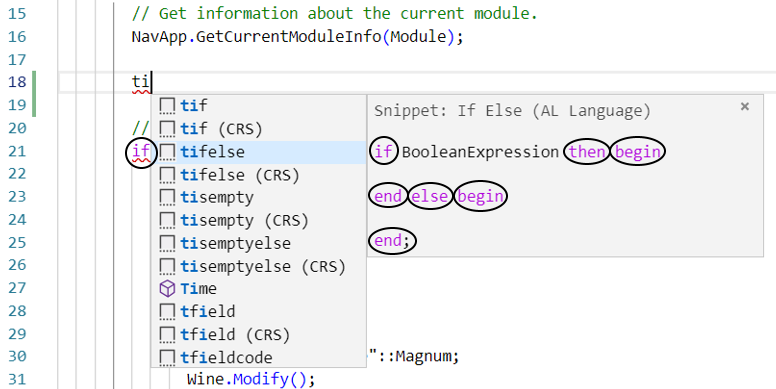
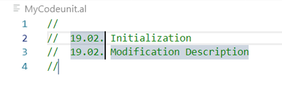

# 第三章：精通现代开发环境

在上一章中，我们介绍了 Dynamics 365 Business Central，并揭示其骨架是 Microsoft 云微服务。

在本章中，我们将深入了解开发环境。我们将讨论与 Visual Studio Code（官方开发平台）以及 AL 语言（开发语言扩展）相关的主要快捷键、技巧和窍门。Visual Studio Code 与 AL 语言的结合定义了所谓的现代开发环境。

AL 是 Microsoft 提供的官方扩展，免费通过在线市场提供。该扩展于 2017 年正式发布，用于扩展当时被称为 Dynamics 365 for Financials 的功能，现在它已经成为一个完整的开发语言，扩展了 Dynamics 365 Business Central。它提供了许多功能，大大提升了开发者的生产力和编码质量。

本章的主要目标是帮助 Dynamics 365 Business Central 开发人员了解开发平台所提供的功能，释放他们的全部潜力，并提高他们在日常编码活动中的熟练度。

在本章中，你将学习以下内容：

+   Visual Studio Code 用户界面由哪些部分组成，每个部分的作用是什么

+   如何熟练使用 Visual Studio Code 中最强大的编辑功能

+   AL 语言扩展是什么，它包含了哪些内容

# 精通 Visual Studio Code

Visual Studio Code 是全球使用最广泛的开发环境之一。它的设计目的是让云端和基于 Web 的应用程序设计变得简单快速，支持多种可扩展的编程语言。该应用程序专注于最大化代码编辑效率，同时通过提供有用的快捷键，帮助开发者在特定开发场景下快速访问所需的功能，充分释放开发者的潜力。

当你启动 Visual Studio Code 时，首次安装后，它会显示典型的欢迎页面：


欢迎页面包含以下内容：

+   **开始**：创建和打开文件及文件夹的快捷键

+   **最近**：最近打开的文件和文件夹列表

+   **帮助**：文档单页、产品文档、视频和有用资源的列表

+   **自定义**：如何通过扩展、键盘快捷键、背景色主题等来自定义 Visual Studio Code

+   **学习**：与最常用命令相关的学习资源快捷键，以及如何掌握用户界面

每次你以新窗口运行 Visual Studio Code 时，都会加载欢迎页面（*Ctrl* + *Shift* + *N*）。你可以通过取消勾选启动时显示欢迎页面，或点击“文件 | 偏好设置 | 设置”并搜索“欢迎页面”来更改此行为。

Visual Studio Code 环境分为五个主要区域：

+   代码编辑器

+   状态栏

+   查看栏

+   侧边栏

+   面板区域

接下来我们将分别讨论这些内容。

# 代码编辑器

代码编辑器是你编写代码并花费大部分时间的地方。当创建新文件或打开现有文件或文件夹时，它会被激活。

你可以只编辑一个单独的文件，或者你也可以加载并同时处理多个文件，排成并排的方式：


有几种方法可以查看多个文件；这里提到的三种是：

+   在 EXPLORER 栏中选择一个文件名，然后右键点击并选择“在侧边打开” (*Ctrl* + *Enter*)。

+   在 EXPLORER 栏中 *Ctrl* + 点击文件名。

+   *Ctrl* + *\* 将编辑器分割为两部分。

它可以容纳多个文件，将空间平均分配给它们。你可以通过简单地按下 *Ctrl* + *1*、*Ctrl* + *2*、*Ctrl* + *3*，……，*Ctrl* + *N* 在不同的文件编辑器之间切换。

编辑器窗口可以根据你的需求进行调整大小、重新排序和缩放。要缩放，按 *Ctrl* + *+* 或 *Ctrl* + *-*，或者通过 View | Zoom in / Zoom out。

缩放适用于所有 Visual Studio Code 区域，而不仅仅是代码编辑器。

Visual Studio Code 还提供了一种便捷的方式来通过快捷方式在文件之间导航。最快的方法是按 *Ctrl* + *Tab*。这将打开自 Visual Studio Code 启动以来打开过的文件列表。

# 状态栏

状态栏通常包含关于当前选中文件或文件夹的信息。它还提供一些可操作的快捷方式：


从左到右，状态栏包含以下信息：

1.  如果启用了 Git，它将报告版本控制信息，例如当前分支。

1.  当前代码中检测到的错误和/或警告数量。

1.  光标位置（行号和列号）。

1.  缩进大小和类型（空格或制表符）。

1.  当前选中文件的编码。

1.  行终止符：**回车符**（**CR**）和/或 **换行符**（**LF**）。

1.  用于处理选中文件中代码的语言。如果点击该语言，菜单会出现，你应该能够更改处理的编程语言。

1.  反馈按钮，你可以通过它在 Twitter 上分享关于 Visual Studio Code 的反馈。

1.  通知图标。它显示新的通知数量，通常与产品更新有关。

状态栏有一种常规的颜色显示，它会根据当前正在处理的内容而变化。打开文件时是紫色，打开文件夹时是蓝色，调试时是橙色，等等。

# 视图栏

这是工作区的左侧，包含通往侧边栏的快捷方式。如果点击一个快捷方式，属于所选工具的侧边栏将变得可见。再次点击，或按 *Ctrl* + *B*，它将消失。

# 侧边栏

侧边栏是你与代码编辑器互动最多的地方。它是上下文敏感的，你会在视图栏中看到五个标准活动，每个活动都由相应的图标启用。

# EXPLORER (Ctrl + Shift + E)

EXPLORER 提供了你当前正在使用的文件夹和文件的结构化和组织化视图。OPEN EDITORS 子视图包含代码编辑器中活动文件的列表。在此部分下方，可能会有另一个子视图，显示已打开文件夹的名称：


如果你将鼠标悬停在 OPEN EDITORS 子视图上，将显示三个操作按钮：切换垂直/水平编辑器布局（*Shift* + *Alt* + *O*）、全部保存（*Ctrl* + *K* + *S*）和关闭所有文件（*Ctrl* + *K* 或 *Ctrl* + *W*）。它们都是显而易见的：


将鼠标悬停在文件夹名称上（在此示例中为`PW_V2`），四个操作按钮将变得可见：


从左到右，分别是新建文件、新建文件夹、刷新和全部折叠。它们是显而易见的。

右键单击文件夹或文件名，将打开一个上下文菜单，显示常用命令，如在资源管理器中显示（*Shift* + *Alt* + *R*），它将打开包含选定文件的文件夹。你还可以通过复制路径（*Shift* + *Alt* + *C*）来复制文件路径。

在 EXPLORER 栏的下方，还有一个叫做 OUTLINE 的部分。它为特定文件提供了非常有用的树形视图，显示了文件中的成员和类型。请参见以下截图：


当你正在开发复杂对象并希望通过点击一下跳转到特定区域时，这确实是一个强大的选项。

# 搜索 (Ctrl + Shift + F)

这是一个强大的工具，用于在文件中搜索和替换文本。你可以选择一个或多个关键字进行简单搜索，还可以使用通配符如*和?。或者，你可以选择基于正则表达式（regex）创建复杂搜索。还有高级选项可以包括或排除文件或文件类型。

当开发者在扩展文件夹中搜索*where used*字段或变量时，这一功能非常有帮助。请参见以下截图：


搜索结果以树形视图列出，显示包含搜索关键字的所有文件，并显示与该行相关的小段代码。树形视图中的关键字匹配处以及代码编辑器中的匹配处都会被高亮显示。通过点击“全部折叠”按钮，可以将所有结果折叠。

你可以通过点击“清除搜索结果”按钮来重置搜索结果。

# 源代码控制 (Ctrl + Shift + G)

Visual Studio Code 提供了与最广泛使用的源代码控制管理系统之一：Git 的原生集成。Git 的基础知识和集成将在第十一章中讨论，*源代码控制管理与业务中心的 DevOps*。

# 调试 (Ctrl + Shift + D)

Visual Studio Code 不仅仅是一个用于编辑文件的代码编辑器。它还提供了一个开箱即用的集成调试框架，可以扩展用于调试不同的平台和语言。

Visual Studio Code 并不提供针对 Dynamics 365 Business Central 的调试功能。这项功能嵌入在 Visual Studio Code 的 AL 语言扩展中，扩展了现有的 .NET 核心调试器。在第九章中，*调试*，我们将详细讨论这一议题。

# EXTENSIONS（Ctrl + Shift + X）

扩展用于浏览 Visual Studio Code 的在线市场，市场中包括了不断增长的额外语言、调试器、工具、助手等各种扩展。AL 是 Microsoft 开发的一个 Visual Studio Code 扩展。在 Visual Studio Code 市场中，你还可以下载几个有用的扩展，它们扩展了（对扩展的扩展）AL 语言扩展，帮助 Dynamics 365 Business Central 开发者提高工作效率，提升生产力，并且编写专业的代码。

请参考以下截图，展示了为 Dynamics 365 Business Central 安装的典型 Visual Studio Code 扩展：


在 EXTENSIONS 栏中，可以搜索在线市场或手动安装扩展。你还可以查看已安装、过时、推荐和禁用的扩展，并根据不同标准对其进行排序。

一些扩展包旨在下载并安装一组扩展。在 Dynamics 365 Business Central 中，你可以考虑从 [`marketplace.visualstudio.com/items?itemName=waldo.al-extension-pack`](https://marketplace.visualstudio.com/items?itemName=waldo.al-extension-pack) 下载并安装 AL 扩展包，或从 [`marketplace.visualstudio.com/items?itemName=StefanoDemiliani.sd-extpack-d365bc`](https://marketplace.visualstudio.com/items?itemName=StefanoDemiliani.sd-extpack-d365bc) 下载并安装 Dynamics 365 Business Central 的 SD 扩展包。

也可以通过右键点击单个扩展来执行相关操作。扩展可以被启用、禁用、按工作区禁用（工作区可以是项目或文件夹）等。最新、最酷的功能之一是能够安装该扩展的另一个版本。

这对于 Dynamics 365 Business Central 开发者非常有用，特别是在高版本 AL 语言扩展中存在回归行为或错误时。请参考以下截图，展示当前在线 AL 语言扩展版本：


这在开发针对特定平台版本的功能时也非常有用。

# 管理

管理按钮以齿轮图标显示在视图栏的最底部：


如果你点击它，会弹出一个菜单，列出可用的命令。这些命令用于自定义 Visual Studio Code 或查找更新。

# 命令面板

命令面板是 Visual Studio Code 中最重要的工具之一。它的作用是快速访问标准和扩展命令。运行命令面板有不同的方式：

+   管理 | 命令面板

+   查看 | 命令面板

+   键盘快捷键：*Ctrl* + *Shift* + *P*（大多数开发者常用）

命令面板不仅可以显示菜单命令，还可以执行其他操作，例如安装扩展。你可以浏览命令面板，查看可用命令的庞大列表。命令是按索引排列的，并且可以搜索。只需输入几个字母，就能得到筛选后的列表。值得一提的是，大多数这些命令都有对应的键盘快捷键。

了解命令面板时，有一件非常重要的事需要知道，那就是 `>` 符号的使用。当你按下 *Ctrl* + *Shift* + *P* 时，命令面板会弹出，并带有 `>` 符号，显示可用命令的列表。请看以下截图：


如果你移除 `>` 符号，Visual Studio Code 会使用命令面板显示最近打开的文件列表。以下截图展示了这一点：


这一功能的强大之处在于，在不使用鼠标的情况下，你可以打开命令面板，运行命令，移除 `**>**` 字符，并选择要编辑的文件。这对提升开发效率非常有帮助。

# 面板区域

Visual Studio Code 不仅显示与代码相关的详细分析和信息，还能访问并展示来自其他来源的信息，例如 Git、已安装的扩展和调试器。这些输出会记录到面板区域，默认情况下显示在底部，但可以通过右键单击面板标题栏并启用“Move Panel Right”按钮轻松将其移动到工作区的一侧。可以通过点击“Move Panel to Bottom”按钮恢复原始布局，或者甚至通过按 *Ctrl* + *J* 隐藏面板。

面板区域默认不可见。当请求所需信息时，通常会启用并显示此区域，例如启用调试器时。

在面板区域，有四个不同的窗口：PROBLEMS、OUTPUT、DEBUG CONSOLE 和 TERMINAL。我们将在接下来的章节中逐一讲解它们。

# PROBLEMS

对于具有高级编辑功能的语言，例如 AL，Visual Studio Code 能够在输入时识别代码问题。问题所在的行会有特定的颜色标记。通知类型有三种：错误、警告和信息。所有这些都可以在 PROBLEMS 窗口中显示。以下截图展示了 PROBLEMS 窗口显示三条错误的示例：


通常，阻塞错误会以红色显示，而警告则以绿色标记。

# OUTPUT

OUTPUT 面板是 Visual Studio Code 通常在命令执行期间或执行后显示消息的地方。

由于内置工具操作和多个扩展命令可以并行运行，因此可以利用 OUTPUT 面板中的下拉框更改视图，查看每个标准或基于扩展的命令的输出。

以下截图显示了面板区域中的 OUTPUT 窗口：


通常，在处理 Dynamics 365 Business Central 扩展时，会选择 AL 语言。

# DEBUG CONSOLE

这是一个由本地和基于扩展的调试器（例如 AL 语言调试器）使用的特殊窗口，用于显示关于代码执行的信息。此窗口及其输出将在第九章中详细分析，*调试*。

# TERMINAL

Visual Studio Code 允许我们像在命令提示符中一样直接在开发环境内执行命令。默认情况下，终端会话基于 PowerShell。

现在我们已经了解了与 Visual Studio Code 相关的所有元素，可以进入下一部分，分析它所提供的强大编辑功能。

# Visual Studio Code – 编辑功能

Visual Studio Code 提供了你所期待的顶级代码编辑器的许多功能。如果你熟悉 Visual Studio，你可能已经注意到一些功能是从这个 IDE 继承过来的，或者是以类似的方式设计的。

*由开发人员为开发人员开发*，Visual Studio Code 为几乎所有编辑命令提供键盘快捷键，让你可以更快地编辑代码，完全摆脱鼠标的依赖。

让我们在接下来的章节中研究这些功能。

# 注释行

Visual Studio Code 提供了开箱即用的文本选择和专业编辑命令，这些命令位于编辑菜单中。编辑菜单还包括切换行注释（*Ctrl* + *U*），该命令为选中的行添加行注释。这意味着，如果你选择了 10 行代码，Visual Studio Code 会添加 10 行注释。这个命令的妙处在于它也能反向操作。如果你选择了 10 行注释并按下切换行注释，注释就会神奇地被移除。

对于使用 CSIDE 的开发人员来说，CSIDE 是 Dynamics 365 Business Central 传统本地语言，此命令等同于注释选择（*Shift* + *Ctrl* + *K*）和取消注释选择（*Shift* + *Ctrl* + *O*）。

# 定界符匹配

Visual Studio Code 能够检测配对的定界符，如括号和圆括号。如果你想划定代码块，这个功能非常有用，当鼠标靠近某个定界符对时，它会自动触发：


上述代码是定界符匹配的示例。

# 文本选择

选择菜单也有与文本选择相关的命令，但大多数用于移动或复制选中行的代码。

如果你将光标放置在 AL 函数、变量或常量附近，可以使用“添加下一个出现位置”（*Ctrl* + *D*）、“添加上一个出现位置”或“选择所有出现位置”（*Shift* + *Ctrl* + *D*）来选择所选项的所有出现位置，并且这些出现位置会以不同的颜色高亮显示。

在代码编辑器中，你还可以按*Ctrl* + *D*选择光标右侧的单词或标识符。然后，你可以轻松地扩展（*Shift* + *Alt* + →）或收缩（*Shift* + *Alt* + ←）分隔符内的文本块。

# 代码块折叠

如果你将鼠标悬停在代码编辑器中的行号上，`-`符号会出现在代码块的起始部分旁边。点击它进行折叠，此时会出现`+`符号。点击这个符号，代码块会展开：


上图展示了代码块折叠的情况，使用了`+`符号。

# 多光标（或多重光标）

每个光标都是独立操作的。*Alt* + 点击将在目标位置生成一个次要光标。

最常见的开发场景是，当你需要在同一源文件中的不同位置添加或替换相同的文本时，你可以使用多光标。下图展示了在编辑`DataClassification`属性时，三个光标的使用情况：


对于 AL 语言开发者来说，这是一个很棒的功能，特别是当他们需要在同一个地方多次写下相同的句子时（例如，在表格对象中的`Caption`或`DataClassification`，以及每个表格字段中）。

# 迷你地图

有时，当处理非常长的文件（例如报告源文件 RDL 或代码单元）时，很难知道指针应该定位到哪里——或者它当前位于源文件的哪个位置。Visual Studio Code 提供了一个完整的迷你地图功能：源代码文件的一个小预览。以下是一个 RDL 示例：


迷你地图功能可以通过视图 | 切换迷你地图进行启用或禁用，或者通过运行命令面板（*Ctrl* + *Shift* + *P*）并选择“视图: 切换迷你地图”来操作。

# 面包屑

“显示面包屑”命令可以在视图菜单中找到。在 AL 文件中，代码编辑器的左上角有一个图标。可以展开它，以便重新检查属性、函数、字段、键等的定义：


如果你点击展开列表中的某个元素，光标将跳转到该元素的主定义位置，使得代码导航非常快捷。

# IntelliSense（智能感知）

在视觉编辑器中，IntelliSense 是一个单词自动补全工具，它会在你输入时作为弹出列表出现。Visual Studio Code 的 IntelliSense 可以提供智能建议，显示与特定元素相关的定义和用途——就像在线帮助一样。下图展示了 IntelliSense 的使用情况：


IntelliSense 是上下文敏感的，如果你需要直接启用它而不输入任何内容，只需按 *Ctrl* + 空格键。根据光标所在的上下文，IntelliSense 会显示该上下文中可以使用的所有项。例如，在 `Table Field` 声明内部，它会列出所有特定字段属性，如 `Caption` 和 `CaptionML`，而在空代码单元定义中，它会显示代码单元对象暴露的所有属性。

# 单词自动补全

通过 IntelliSense 功能，Visual Studio Code 中的代码编辑器实现了对所有原生（如 JSON）和基于扩展支持的语言（如 AL）的单词补全。只需按 *Enter* 或 *Tab* 即可插入建议的单词：


上面的截图展示了单词自动补全引擎推荐的一个 AL 变量。

# 定义跳转

这是一个超级酷、必须了解的功能。你可以用鼠标悬停在变量、常量、函数或任何你想要的代码元素上，然后按 *Ctrl*，该单词或标识符（也称为符号）会神奇地变成一个超链接。

如果你在按下 *Ctrl* 的同时点击该单词，你将自动跳转到定义该单词的代码位置。*Ctrl* + 鼠标悬停在代码元素上也会启用跳转到定义功能。

启用此功能的其他可能方式如下：

+   选择一个代码元素并按 *F12*。

+   右键点击一个代码元素，然后从上下文菜单中选择“跳转到定义”。

# 查找所有引用

查找所有引用可以非常方便地解析一个对象、函数或任何代码元素在源代码中被使用的次数和位置。你只需右键点击任何变量、函数或元素名称，然后选择“查找所有引用”，或者使用快捷键 *Shift* + *Alt* + *F12*。

当它被启用时，代码编辑器会在活动栏中创建一个结果列表，显示该项被引用的次数，以及在哪些对象文件和位置（s）中引用过。侧边栏中会创建一个名为“引用”的快捷图标。下图展示了如何查找 AL 文件中特定变量的所有引用：


如果你在左侧的引用列表中展开一个出现项并点击记录，代码编辑器会打开引用该项的文件，并将光标定位到编辑模式，选择该文件中搜索到的元素。

参考列表可以清除并刷新，你可以折叠其中的所有元素。如果清除列表，你可以随时重新运行先前的搜索，因为系统会为你保留历史记录。

# Peek Definition

想象一下你有大量的代码文件，你需要编辑当前正在使用的变量或字段的定义。在许多其他编辑器或开发环境中，你可能需要将所有文件保存为文本格式，然后搜索所有这些代码文件，确保替换该变量名。这个任务不仅可能很烦人，而且会让你分心，远离你原来正在编写的代码。

Visual Studio Code 通过提供 Peek 功能来解决这个问题，可以通过不同的方式启用：

+   右键单击变量、字段或函数名，然后选择 Peek Definition。

+   使用 *Alt* + *F12* 键盘快捷键。

应该会弹出一个交互式弹出窗口，显示定义所选元素的源代码。以下截图显示了报表中表源 Peek Definition 的窗口：


然后，你可以看到已经编写的内容，也可以直接编辑它。

# 重命名符号

对于开发人员，重命名变量、常量、字段或函数名是非常常见的。这些编码元素在技术上称为符号。Visual Studio Code 提供了一个非常强大的功能来重命名符号。

如果你在想要重命名的编码元素上按 *F2*，或者右键然后选择重命名符号，一个小的交互式弹出窗口会出现在编辑模式中。在那里，你可以写入新的元素名称，而无需使用分散注意力的对话框窗口，让你可以集中精力编写代码。所有对该代码元素的引用都将相应地被重命名。以下截图显示了重命名 XMLport 符号引用的过程：


到目前为止，所展示的所有功能都是 Visual Studio Code 提供的最有用的功能，支持 AL 开发人员进行高效的代码编辑。

在这个阶段，重要的是仔细看一下 AL 语言扩展，并了解如何配置它。

# 理解 AL 语言扩展

AL 现在是一个跨平台语言，通过 Visual Studio Code 的扩展部署。这个扩展不仅支持在 Windows 操作系统上部署，还支持 macOS 版本的 Visual Studio Code。

免费的 AL 语言扩展 ([`marketplace.visualstudio.com/items?itemName=ms-dynamics-smb.al`](https://marketplace.visualstudio.com/items?itemName=ms-dynamics-smb.al)) 可在 Visual Studio Code 市场上下载。这为 Dynamics 365 Business Central 扩展开发提供了优化的体验，并包括了构建应用程序（从现在起称为扩展的同义词）所需的所有支持和工具，包括调试器。

获取扩展并安装的最简单方法是打开任何 Dynamics 365 Business Central 代码文件（`.al`），并按照 Visual Studio Code 在检测到该文件类型有可用扩展时显示的说明操作：


同样，你可能想要安装其他扩展，以便为 AL 语言扩展添加其他语言（如 PowerShell）、工具（如 Docker）或增强的编辑功能。关于与 AL 语言结合使用的最有用的市场扩展列表将在第十八章中提供，*AL 开发者的有用且高效工具*。

接下来，让我们了解 AL 语言中的这些扩展。

# AL 语言

AL 语言是由 Dynamics 365 Business Central 开发团队创建的，它是为小型单租户个性化和复杂的垂直解决方案（通过在线 Dynamics 365 Business Central AppSource 市场部署）开发应用程序的官方 Visual Studio Code 扩展。

它可以通过两种不同的方式进行部署：

+   直接作为 Visual Studio Code 市场中的可下载包。

+   手动安装，作为可安装包（`.vsix`）：

    +   安装包会在创建一个基于官方 Dynamics 365 Business Central 镜像的 Docker 沙箱时分发。

    +   从 Dynamics 365 Business Central 本地 DVD 下载。

要直接开始使用 AL 语言，只需通过以下简单步骤从市场中下载它：

1.  启动 Visual Studio Code。

1.  点击扩展视图栏。

1.  在搜索框中输入 Dynamics 365 Business Central。

1.  选择 AL 语言。

1.  点击安装，并在安装完成后按要求重新加载 Visual Studio Code。它会显示以下 AL 语言扩展：


AL 语言的版本号，也称为开发版本，会显示在标题旁边。在前面的截图中，AL 语言开发版本（或运行时）是`4.0.182565`。

开发版本非常重要，因为新语言功能和增强功能通常不会回移植到旧版本中，因此它们可能已经过时，并且与更新的 Dynamics 365 Business Central 平台更新不兼容。

AL 开发者应始终选择最新的 AL 语言开发版本，以便受益于最新的增强功能和稳定性特性。

AL 语言的开发模型涉及创建、编辑和组织具有典型 `.al` 扩展名的平面文本文件。简而言之：AL 语言开发只是基于文件夹和文件的。

值得一提的是，Visual Studio Code 中的术语将根文件夹称为工作区。AL 语言根文件夹代表扩展的源代码容器。因此，AL 语言根文件夹也被称为 Visual Studio Code 开发工作区。

创建任何类型的扩展时，工作区由以下项目组成：

+   `launch.json` 文件

+   `app.json` 文件

+   符号文件

+   `.al` 对象文件（如表、页面、报告和代码单元）

+   补充文件（如 `WebService.xml` 文件、`.bmp` 格式的扩展徽标文件和 `permissions.xml` 文件）

本书及后续章节将更深入分析 AL 语言对象和补充文件。现在我们将重点讨论应用程序开发的核心部分：`launch.json`、`app.json` 和符号文件。

# launch.json

该文件存储在扩展工作区的名为 `.vscode` 的子文件夹中，主要确定下载和上传 AL 语言命令的具体参数设置。

下表显示了下载和上传 AL 命令：

| **下载命令** | **上传命令** |
| --- | --- |
| `AL: 下载符号` | `AL: 发布` (*F5*) |
| `AL: 下载源代码` (*F7*) | `AL: 发布并在设计器中打开` (*F6*) |
|  | `AL: 无调试发布` (*Ctrl* + *F5*) |
|  | `AL: 快速应用发布` (*Alt* + *F5*) |
|  | `AL: 快速应用发布无调试` (*Ctrl* + *Alt* + *F5*) |

它还仅用于建立连接，如 AL：调试无发布（*Ctrl* + *Shift* + *F5*）命令，或启动特定的调试功能，如 AL：打开事件记录器。事件记录器功能将在第九章《调试》中进行介绍。

`launch.json` 文件是一个 JSON 数组，可能包含不同的 JSON 值，每个值代表一组针对不同部署目标的属性：本地部署或 SaaS。属性可能是必需的，也可能是可选的，具体取决于目标部署。

下表显示了 `launch.json` 属性：

| **属性** | **必需** | **部署类型** | **描述** |
| --- | --- | --- | --- |
| `Name` | 是 | 所有 | 在调试器窗口中显示的名称，用于识别启动参数集。默认值：发布到您的服务器（本地部署），发布到微软云（SaaS）。 |
| `Type` | 是 | 所有 | 常量值：`al`。 |
| `Request` | 是 | 所有 | 常量值：`launch`。 |
| `startupObjectType` | 否 | 所有 | 发布后运行的对象类型：表或页面。 |
| `startupObjectId` | 否 | 所有 | 与 `StartupObjectType` 一起使用。定义要运行的对象 ID。 |
| `tenant` | 否 | 所有 | AAD 租户（SaaS）或租户名称（具有多租户的本地部署）用于连接、提取符号和/或发布应用程序包。 |
| `sandbox` | 否 | 在线 | 在为同一 AAD 租户创建多个在线沙盒时，指定沙盒名称。 |
| `breakOnError` | 否 | 所有 | 指定当发生错误时调试器是否应停止。默认值：`true`。 |
| `breakOnErrorWrite` | 否 | 所有 | 指定调试器是否应在记录更改（插入、修改和删除）时停止。默认值：`false`。 |
| `schemaUpdateMode` | 否 | 所有 | 确定数据同步模式。`Synchronize`：这是默认值。如果该扩展已经部署了数据，则会保留现有数据并且不被删除。扩展的元数据将与现有的元数据进行同步（如果存在）。`Recreate`：清除之前的元数据（通常是表和表扩展），并从头开始使用新的元数据。`ForceSync`：强制同步架构。由于可能导致数据丢失，应极其小心使用此选项。 |
| `DependencyPublishingOption` | 否 | 所有 | 此参数在 Dynamics 365 Business Central 2019 年秋季更新中引入。适用于多个依赖应用从同一根文件夹加载的复杂环境。可能的值如下：`Default`：启用所有依赖应用的重建和发布。`Ignore`：不进行依赖发布。应谨慎使用此选项，因为它有可能破坏现有的相互依赖的解决方案。`Strict`：如果有任何已安装的扩展依赖于启动文件夹，发布将失败。 |
| `Server` | 是 | 本地部署 | 服务器名称。默认值：`http://localhost`。 |
| `serverInstance` | 是 | 本地部署 | Dynamics 365 Business Central 服务器服务名称。 |
| `authentication` | 是 | 本地部署 | 身份验证类型：Windows 或用户密码。撰写时，AAD 不支持本地部署，并且它是在线部署的默认且唯一值。 |
| `Port` | 否 | 本地部署 | Dynamics 365 Business Central 端口号。默认值：`7049`。 |
| `applicationFamily` | 否 | AppSource | 用于为 AppSource 开发嵌入式扩展。该标签用于 Microsoft 判断目标升级操作，如果在租户中部署了特定的 AppSource 扩展。 |
| `launchBrowser` | 否 | 所有 |

指定在发布扩展时是否启动浏览器。

|

| `enableLongRunningSqlStatements` | 否 | 所有 |
| --- | --- | --- |

启用在调试时显示长时间运行的 T-SQL 语句。此功能计划支持本地部署和在线沙盒环境。

|

| `enableSqlInformationDebugger` | 否 | 所有 | 启用获取 T-SQL 查询信息的功能。此功能计划支持本地部署和在线沙盒环境。 |
| --- | --- | --- | --- |

如果你在 JSON 数组中设置了多个值，当执行上传或下载 AL 语言命令时，将提示你选择一个定义在 JSON 数组中的参数集名称。

以下截图是 `launch.json` 文件的示例：


这显示了带有两个参数设置值的文件。

# app.json

通常存储在扩展工作区的根文件夹中，它代表了用 JSON 编写的应用清单。在 JSON 文件中，包含了引用基础和系统应用的参数，以及平台和运行时的定义。

在为 Dynamics 365 Business Central 开发时，必须充分理解这些术语。

# 系统和基础应用

在 2019 年秋季更新中，微软将所有遗留的 C/AL 代码转换为 AL 对象。目前，庞大的应用单体已经被拆分为两个应用：

+   **系统应用**：大约包含 200 个对象。

+   **基础应用**：根据本地化版本的不同，它包含 6,000 到 8,000 个对象。

要扩展这些应用，需要在 `app.json` 文件中将其作为依赖项引用，并通过 `AL: Download symbols` AL 语言命令将其符号拉取到本地或在线沙盒中。

当拉入 `.alpackages` 文件夹时，它们通常通过主版本号、次版本号、构建号和修订号来引用，并且这一点反映在下载的符号名称中（例如，`Microsoft_System Application_15.0.36560.0` 和 `Microsoft_Base Application_15.0.36626.36918`）。

主要版本号通常对应于 Dynamics 365 Business Central 的主要更新发布。

2019 年 10 月（或 2019 年秋季）发布更新是主要版本 15。2020 年春季（或 2020 年 4 月）发布的更新将是主要版本 16，以此类推。

次版本号通常对应于次要更新。2019 年 11 月的更新 1 是次版本 15.1，2019 年 12 月的更新 2 应该是次版本 15.2，以此类推。

构建号是一个递增的数字，每当有更改提交到与功能增强或修复相关的分支时，微软就会增加该数字。

在开发扩展时，必须了解 `app.json` 文件中 `dependency` 参数定义的所需系统和应用对象级别的最低要求。

# 平台

平台表示 Dynamics 365 Business Central 平台组件（客户端、服务器、Web 服务器等）的最终编译结果。

它以与应用程序相同的标记显示。应用程序和平台构建通常有不同的构建号，因为平台代码更改和应用程序代码更改遵循不同的编译路径，最终会合并在一起。

在针对平台开发时，必须了解文件和 API 的最低要求，以便能够利用它们暴露的特性、属性和功能，避免应用程序出现不可预测的行为。

# 运行时

运行时表示 Dynamics 365 Business Central AL 语言扩展文件的最终编译结果。

该标记法更简洁，由主要版本号、次要版本号和构建版本组成。例如，2018 年春季更新（或 2018 年 4 月更新）命名为主版本 1，而 2018 年秋季更新（或 2018 年 10 月更新）是版本 2，以此类推。当前针对 Dynamics 365 Business Central 2019 年秋季更新的主要版本是版本 4。

在开发扩展时，您可以在 `app.json` 文件中定义应用程序的目标运行时版本。这将启用或禁用不同的功能集，这些功能集不能成为目标平台部署的一部分，AL 语言扩展的运行时将对此进行检测。

以下表格显示了 `app.json` 属性：

| **属性** | **必需** | **描述** |
| --- | --- | --- |
| `Id` | 是 | **全局唯一标识符**（**GUID**） |
| `Name` | 是 | 扩展名称。 |
| `Publisher` | 是 | 发布者名称。 |
| `Version` | 是 | 扩展包的版本（例如，1.0.0.0）。 |
| `Brief` | 否（对于 AppSource 是是） | 扩展的简短描述。 |
| `Description` | 否（对于 AppSource 是是） | 扩展的长篇详细描述。 |
| `privacyStatement` | 否（对于 AppSource 是是） | 隐私声明的 URL。 |
| `EULA` | 否（对于 AppSource 是是） | 应用的许可条款和条件的 URL。 |
| `Help` | 否（对于 AppSource 是是） | 应用帮助台支持的 URL。 |
| `url` | 否（对于 AppSource 是是） | 扩展包主页的 URL。 |
| `Logo` | 否（对于 AppSource 是是） | 从扩展根目录到应用 logo 的相对路径或完整路径 |
| `Dependencies` | 是 | 其他扩展的依赖项列表。从 2019 年秋季更新开始，必须至少引用系统应用程序和基础应用程序扩展。 |
| `Screenshots` | 否 | 应用截图的相对路径或绝对路径。 |
| `Platform` | 是 | 支持的最低平台版本（例如，15.0.0.0）。 |
| `idRanges` | 是 | 应用对象 ID 范围或对象 ID 范围的数组。 |
| `showMyCode` | 否 | 在调试时启用查看扩展源代码和/或从扩展管理页面下载源代码。默认值：`false`。 |
| `Target` | 否 | 默认值：`Cloud`。与 Cloud 相同字体的扩展。它是 Target 选项的两个可能值之一（新版本为 `Cloud`，旧版本为 `Extension`）。这两个值是 Dynamics 365 Business Central SaaS 所允许的唯一值。如果需要将扩展定向到本地部署，请将该值设置为 `OnPrem` 或 `Internal`。 |
| `helpBaseUrl` | 否 | 扩展的在线帮助的 URL。 |
| `contextSensitiveHelpUrl` | 否（对于 AppSource 是是） | 针对 AppSource 扩展的上下文敏感帮助的 URL。 |
| `supportedLocales` | 否 | 应用支持的本地语言的逗号分隔列表。 |
| `features` | 否 | 可由编译器启用的预览版可选特性。例如，`TranslationFile`。将此参数标记添加到特性中时，会在扩展文件夹中生成一个名为**Translations**的目录，并且会生成一个包含所有扩展对象中使用的标签的`.xlf`翻译文件。 |
| `Runtime` | 否 | 扩展所针对的最低运行时版本。 |

以下截图是一个`app.json`文件的示例：


有了这些信息后，我们应该能够掌握应用程序配置文件，并根据运行时版本对其进行调整。在下一部分，我们将介绍符号并解释它们在扩展开发中的至关重要性。

# 理解符号

就像在所有其他语言中一样，符号表示对标准对象、属性和函数集合的引用。它们本身就是一个特殊的扩展文件，采用典型的`.app`命名规则，用于在编译时保持对象引用的一致性，同时还填充有效的 IntelliSense 条目。

符号通常以 JSON 格式存储在数据库中的 BLOB 字段中，每个对象记录都有一个。值得一提的是，在多租户环境中，`Object Metadata`表是应用程序数据库的一部分，因此在客户租户数据库中不会存储系统符号或元数据，只有数据。

在 Dynamics 365 Business Central 中，符号已经预先加载到应用程序数据库中，并且可以将它们分为两类：

+   标准符号

+   扩展符号

在 2019 年秋季更新之前，标准应用程序符号都是通过微软使用 CSIDE 开发环境对标准遗留对象进行特殊编译生成的。对于本地版本，情况也是如此：符号是异步生成的，或者可以通过 PowerShell 脚本作为常规扩展导入。

标准应用程序符号存储在`Object Metadata`表中的 Symbol Reference BLOB 字段中。

通过阅读以下官方参考文档，可以了解更多关于此主题的信息：

[`docs.microsoft.com/it-it/dynamics365/business-central/dev-itpro/developer/devenv-running-cside-and-al-side-by-side`](https://docs.microsoft.com/it-it/dynamics365/business-central/dev-itpro/developer/devenv-running-cside-and-al-side-by-side)

下表展示了标准符号。在 2019 年秋季更新之前，了解这些符号及其重要性对成功编译和部署任何类型的扩展至关重要：

| 应用程序 | 包含 CSIDE 对象设计器中描述的所有应用程序对象的符号，除了 2000000004 到 2000000199 ID 范围内的系统表和标准测试工具对象。在本地版本或 Docker 沙盒中，如果你正在修改标准遗留对象，你必须选择通过 CSIDE 开发环境（重新）生成符号，正如以下博客文章中所述：[在现代开发环境中使用 Microsoft Dynamics NAV 2018 生成符号](https://blogs.msdn.microsoft.com/nav/2018/01/16/generate-symbols-in-a-modern-development-environment-with-microsoft-dynamics-nav-2018/)。在升级后的本地版本中，来自早期版本的符号必须从标准本地数据库（或产品 DVD）中提取，导入到升级数据库中，并重新生成，正如以下博客文章中所述：[在新建或升级数据库中导入符号与 Microsoft Dynamics NAV 2018](https://blogs.msdn.microsoft.com/nav/2018/02/02/import-symbols-in-new-or-upgrade-databases-with-microsoft-dynamics-nav-2018/)。 |
| --- | --- |
| 系统 | 包含 2000000004 到 2000000199 ID 范围内的系统表符号，也包括虚拟表定义。系统和虚拟表结构无法通过扩展进行修改。系统和虚拟表符号无法重新生成。因此，如果你正在开发扩展，它们永远不应该在 CSIDE 开发环境中进行任何更改。 |
| 测试 | 包含应用程序测试工具对象的符号。标准应用程序测试工具对象的符号无法重新生成。开发人员应创建自己的测试对象。因此，在现代开发环境中进行 SaaS 部署时，它们永远不应在 CSIDE 开发环境中进行任何更改。 |

每当你扩展一个应用程序时，你总是需要确保适当的符号到位。你可以通过两种方式实现这一点：

+   连接到沙盒环境，运行命令面板（*Ctrl* + *Shift* + *P*），然后输入并选择`AL: Download Symbols`。

+   从其他地方（例如产品 DVD，用于本地部署）下载所需的符号，并将其存储在定义的符号存储目录中。

对于本地部署，您将在 Dynamics 365 Business Central 2019 年春季版产品 DVD 中找到 `System.app` 和 `Test.app` 符号，路径为：`\ModernDev\program files\Microsoft Dynamics NAV\140\AL Development` `Environment`。在 Dynamics 365 Business Central 2019 年秋季版 DVD 中，您只会在以下路径找到 `System.app`：`\ModernDev\program files\Microsoft Dynamics NAV\150\AL Development Environment`。自 2019 年秋季更新以来，AL 语言运行时不再自动下载应用程序和测试符号，且这些符号不再需要存储在数据库内，因为所有属于应用程序的对象，包括 Test Toolkit 中的对象，已经转化为 AL 对象。这些 AL 对象现在是标准扩展包的一部分。扩展包本身就包含符号。

如果您有一个多用户环境，且开发人员在同一个暂存租户上工作，您可以考虑通过命令面板下载符号一次，然后为所有用户设置一个公共的符号存储路径。这样可以避免每次都下载相同的符号集，从而提高开发生产力。

默认的符号存储路径可以通过以下快捷键之一进行更改：

+   从菜单栏中，选择“文件”（*Alt* + *F*）| “首选项”（*P*）| “设置”（*S*），然后选择 AL 语言设置。

+   使用设置快捷键（*Ctrl*），然后选择 AL 语言设置。

要更改的参数是 *Al: Package Cache Path*，其默认值设置为相对路径 `./.alpackages`。

或者，您可以运行命令面板（*Ctrl* + *Shift* + *P*），输入并选择“Preferences: Configure language specific settings...”，然后选择 AL。`settings.json` 文件将打开，您可以在其中添加或更改 `al.packageCachePath` 参数的值。下图显示了 AL 设置符号路径在更改为存储位置时的情况：


本章后续将讨论其他 AL 语言配置设置。

结合系统应用扩展、基础应用扩展和标准符号，您的扩展可能还依赖于其他自定义或第三方扩展。然后，这些扩展应该会发出符号，您应该能够在调用 AL：从命令面板下载符号时从应用程序数据库中下载这些符号。

扩展符号存储在 `NAV App` 表的 Symbols BLOB 字段中。

要指定您的扩展依赖于另一个扩展，您必须在 `app.json` 文件中填充相关的 JSON 数组参数。下面是一个依赖于两个其他应用的扩展在 `app.json` 文件中的参数示例：

```
  "dependencies": [
      {
          "appId":  "63ca2fa4-4f03-4f2b-a480-172fef340d3f",
          "publisher":  "Microsoft",
          "name":  "System Application",
          "version":  "15.0.0.0"
      },
      {
         "appId":  "437dbf0e-84ff-417a-965d-ed2bb9650972",
         "publisher":  "Microsoft",
         "name":  "Base Application",
         "version":  "15.0.0.0"
      },
      {
        "appId": "99ddd910-3aa8-4c3e-936c-be20edeaf777",
           "name": "Preferred Wine Basic"
            "publisher": "Tacconi Inc."
             "version": "1.0.0.0"
      },  
     {
        "appId": "77ddd910-3aa8-4c3e-936c-be20edeaf888",
        "name": "Preferred Wine Tools",
        "publisher": "Tacconi Inc.",
        "version": "2.1.0.0"
     }
   ],
```

如果你已经从 Cloud Ready Software 安装了 CRS AL Language Extension 工具箱（[`marketplace.visualstudio.com/items?itemName=waldo.crs-al-language-extension`](https://marketplace.visualstudio.com/items?itemName=waldo.crs-al-language-extension)），你可以输入 `tdependency` 来启用代码片段，轻松编辑该参数的每个 JSON 数组元素。这将加快你的编码速度，防止语法错误。在本章最后一节中，我们将讨论标准和自定义代码片段的功能。

依赖扩展的版本参数表示编译器接受符号的最低要求。换句话说，低于报告版本的依赖扩展符号不被认为是有效的，无法下载或编译。

# 符号内部

符号是多个文件的压缩（`.zip`）操作的结果，这些文件由 AL Language 扩展使用。为了展示其内部原理，只需使用最常见的解压工具（例如 7-zip）在将 `.app` 包重命名为 `.navx` 扩展名后提取其内容。

以下表格显示了基础应用程序扩展的标准符号组件（文件和目录）：

| **文件名** | **描述** |
| --- | --- |
| `[Content_Types.xml]` | 指定包的内容：XML 和 JSON 文件。 |
| `MediaIdListing.xml` | 指定扩展标志文件名及其 ID。 |
| `navigation.xml` | 包含部门菜单的条目。 |
| `NavxManifest.xml` | 它将报告标准符号或扩展的清单。基础应用程序符号的最相关参数如下：`- version`：标识 JSON 文件的应用程序版本（如 15.0.36626.36675）`- platform`：目标推荐的与这些符号兼容的主要平台版本（如 15.0.0.0）`- runtime`：建议用于这些符号的运行时版本（如 4.0）系统符号通常只指定版本和运行时。 |
| `SymbolReference.json` | 包含所有 AL 对象的 JSON 格式引用。这些 JSON 文件被 AL Language 扩展广泛使用，用于在编译/构建应用程序包时保持引用完整性，并启用所有与 IntelliSense 相关的功能。基本上，它的结构是一个数组，包含有效 AL 对象参数的列表，如下所示：`"Tables": [],`` "Codeunits": [],`` "Pages": [],`` "PageExtensions": []`对于这些对象元素，每个都有指定的字段、属性、函数等。 |

符号 JSON 文件不能被篡改/更改以手动生成或修改符号文件。

接下来，我们还将看看不同目录的作用：

| **目录名称** | **内容描述** |
| --- | --- |
| `addin` | 控制插件定义。 |
| `layout` | RDL 和 DOCX 报告布局。 |
| `logo` | 扩展标志。 |
| `ProfileSymbolReferences` | 配置文件符号和相关页面自定义的符号。 |
| `src` | AL 文件。其内容通常用于在调试时显示代码。 |
| `Translations` | XLIFF 格式的翻译文件。 |

符号是扩展验证机制的核心，正如之前的表格所示，它们还执行代码（如果在扩展的`app.json`文件中将`showmycode`参数设置为 true 的话）。

基于 AL 符号，你可以在 Visual Studio Code 市场中找到非常有用的扩展，这些扩展专门针对 AL 开发环境。

最常用的配置项如下：

+   Marton Sagi 的 AL 对象设计器

+   Andrzej Zwierzchowski 的 AZ AL 开发工具/AL 代码大纲

两者都非常易于使用，并且对检查符号及其内容非常有用。

在了解了符号之后，我们已经完成了构建应用所需的主要内容的概述。接下来，让我们看看 AL 语言扩展配置，了解如何配置它们以创建更高效的开发环境。

# 理解 AL 语言扩展配置

可以通过快捷键 *Ctrl*+ 来轻松查看常规设置和每个工作区设置。会弹出一个直观的菜单，选择“扩展 | AL 语言扩展配置”，即可列出一系列配置参数。以下截图显示了 AL 语言扩展配置参数：


基本上，这些配置值保存在一个名为`settings.json`的文件中。

以下是常见配置项的描述和值：

+   对于以下路径参数：

    +   `"al.packageCachePath": "./.alpackages"`：可以将默认值更改为本地文件夹或多开发者环境下的共享文件夹。它表示存储和查找符号的路径。

    +   `"al.assemblyProbingPaths": ["./.netpackages"]`：这个参数在编译扩展时至关重要，特别是当存在外部程序集引用时。它的数据类型是 JSON 数组，因此开发者需要指定一个以逗号分隔的路径列表，表示程序集存储的位置。

    +   `"al.ruleSetPath": null`：如果开发者希望提供自定义的标准代码分析器规则覆盖，可以使用此设置。它将在第九章 *调试*中进行详细讨论。

+   对于以下代码分析器参数：

    +   `"al.enableCodeAnalysis": false`：此设置用于启用代码分析，具体内容将在第九章 *调试*中详细讨论。在大型项目中，若有数千个对象，建议关闭此功能，以避免在编码或编译过程中出现性能问题。

    +   `"al.codeAnalyzers": []`：这是代码分析器的类型。其详细内容将在第九章 *调试*中进一步探讨。

    +   `"al.enableCodeActions": false`：启用代码操作，如自动将多个`if`语句转换为`CASE`语句或拼写检查。默认情况下该功能为禁用状态。

    +   `"al.backgroundCodeAnalysis": true`：默认启用。在大型项目中，这可能会对性能造成严重影响，建议在此类场景中关闭此功能。

+   对于以下**编译**参数：

    +   `"al.compilationOptions": {"generateReportLayout": true, "parallel": true}`：用于指定在编译时是否生成报告布局（如果报告布局不存在），以及是否对包进行串行或并行构建。

    +   `"al.incrementalBuild": false`：在复杂的扩展开发环境中，如果从根文件夹加载多个扩展文件夹，则此参数指定是否从引用的项目中进行引用解析，而不是从存储在包缓存路径中的符号中进行解析。将此参数切换为 true 会在此类场景中提高性能。

+   对于以下**服务日志**参数：

    +   `"al.editorServicesLogLevel": null`：这对于调试编译报告中未处理的错误或崩溃的情况非常有用。日志可能包含错误，甚至详细描述发生在后台的过程。将会在第九章中更深入地讨论，*调试*部分。

    +   `"al.editorServicesPath": "bin/"`：如果启用了服务日志，则决定日志路径。

+   对于以下**浏览器**参数：

    +   `"al.browser": "Edge"`：选择首选浏览器，从 Visual Studio Code 启动 Dynamics 365 Business Central 应用程序。选项包括 SystemDefault、Edge、Chrome 或 Firefox。如果安装了多个浏览器，则此选项非常有用。

    +   `"al.incognito": false`：选择以正常会话启动浏览器，该会话存储现有的凭证，或使用私人/隐身浏览。

在探索了开发扩展所需的核心设置之后，让我们分析一下 AL 语言提供的最佳代码编辑功能之一：代码片段。

# 精通 AL 语言代码片段

安装 AL 语言扩展后，Visual Studio Code 中提供了 AL 语言标准代码片段。这些片段会在你在代码编辑器中输入时触发，你可以通过方框前缀符号识别它们。

通常，它们以字母`t`开头，后跟一个有意义的名称，用以描述代码片段的内容，例如`ttable`或`tpage`。悬浮提示显示代码片段的预览。

以下截图展示了一个 if-then-else 条件语句的标准代码片段：



请注意，如果代码片段包含变量名或代码标识符，它们可能会被高亮显示，提示你应该为其指定不同的名称，并且它们充当某种占位符。当你重命名一个被高亮的标识符时，所有该标识符的出现位置也会被重命名，这使得代码片段的使用非常灵活。这不仅会减少编码时间，避免写或复制粘贴重复的语句，还能使用开发者可能忽略的复杂结构语法。

可以直接从 Visual Studio 市场下载由其他开发者制作的代码片段，形式为扩展。通常，许多扩展程序会扩展 AL 语言的支持，并附带一系列自己的代码片段。

一个典型的例子是免费的 CRS AL 语言扩展。

除了几个非常有用的开发者工具外，这个扩展还实现了一组与现有标准片段集成并丰富它们的 AL 代码片段。目前，它实现了 68 个额外的 AL 代码片段，并且随着每次扩展更新，列表还在不断增长。

以下截图显示了如果你在 `.al` 文件中输入 CRS 时，所有可用的额外代码片段：


另一个在编码时搜索代码片段的方法是运行命令面板 (*Ctrl* + *Shift* + *P*)，然后输入 snippet 或 insert snippet 来调出一个下拉列表，显示可用的 AL 代码片段。

以下截图显示了来自命令面板的 AL 代码片段下拉列表：


如果你仍然没有在市场中找到对你有用的代码片段，使用 Visual Studio Code 你也可以手动从零开始添加新的代码片段。要做到这一点，你需要点击菜单栏并进入 文件 (*Alt* + *F*) | 首选项 (*P*) | 用户代码片段 (*S + S*)***.***

快捷键序列 *Alt* + *F*，*P*，*S*，*S*，*Enter* 可以直接将你带到那里，而无需使用鼠标。

然后，你可以选择是为所有语言创建一个全局代码片段，还是为当前工作区创建一个本地代码片段，或者为特定目标语言创建一个片段。在这个例子中，我们将选择从语言列表中选择 al (AL)，创建一个新的代码片段以供 AL 语言文件使用。

以下截图显示了创建特定代码片段时的可用选项：


如果你启用了面包屑功能，可能已经注意到一个特定的配置文件处于编辑模式，用于自定义 AL 语言代码片段。通常，这个文件叫做 `al.json`，并存储在以下位置：

```
C:\Users\<username>\AppData\Roaming\Code\User\snippets
```

每个代码片段由一个独特的名称定义，并由三个元素组成：

+   **前缀**：用于在编辑器中搜索并触发代码片段

+   **主体**：粘贴到编辑器中的部分

+   **描述**：对代码片段功能的详细描述

在代码块内，你可以使用特定的语法来启用占位符：

+   `$1`、`$2`、`$3`、`…`、`$n` 用于通过按下 Tab 键来移动代码片段中的光标位置。

+   `$0` 用作最终的光标位置。

+   `${1:labelX}`、`${2:labelY}` 和 `${3:labelZ}` 用作占位符。具有相同 ID 的占位符会相互关联，从而启用多个光标功能。

现在，我们将通过一个简单的示例进行演示。

假设你想在对象顶部添加一个标准的代码头块，就像在旧版设计器（CSIDE 开发环境）中一样，并且你需要一个智能的方式，在每个对象上快速且重复地实现这一功能。

最简单的解决方案是创建一个特定的自定义代码片段，在每次新建对象文件时调用，如下所示：

1.  将以下代码添加到 `al.json` 文件中并保存：

```
{
     "Create standard comment block": {
        "prefix": "tcomment (Custom)",
       "body": [
  "//",
  "//  ${1:YY.MM.DD} Initialization",
  "//  ${1:YY.MM.DD} ${2:Modification Description}",
  "//"
 ],
 "description": "Standard header comment block"
}
}
```

你可以通过简单地进入菜单栏并选择 文件（*Alt* + *F*）| 自动保存（*U*）来启用惊人的自动保存功能。自动保存菜单项旁会出现一个勾选标记。另一种方法是运行命令面板（*Ctrl* + *Shift* + *P*），然后输入 `File: Toggle Auto Save`（或者输入其中一部分并从下拉列表中选择该条目）。

1.  在你的扩展中创建一个新文件，并将其保存为 `.al` 扩展名（例如，`MyCodeunit.al`）。光标应该会自动定位到文件的第一行和第一列。

1.  开始输入 `tcomment`，IntelliSense 将检测到你自定义代码片段的存在。选择它。

1.  光标将定位到第一个占位符元素。只需输入当前日期（格式为 `YY.MM.DD`），然后按 Tab。你可能会注意到，由于两个占位符共享相同的 ID，它们会一起编辑，从而启用多个光标功能。

1.  现在，是时候写下与对象描述相关的有用信息，说明它的用途。

以下截图展示了带有多个光标的自定义注释块代码片段的实际应用：



这些代码片段使理解 Visual Studio Code 变得更加简单。试试看，掌握它们吧！

# 总结

Visual Studio Code 是一个以代码为中心的工具，开箱即用支持多种语言，提供诸如语法着色、分隔符匹配、代码块折叠、多光标、代码片段、IntelliSense 等编程功能，还有更多功能。

通过安装 AL 语言扩展，这个现代化的开发环境已完全设置好，成为初学者和有经验开发者的应用沙盒。在本章中，我们释放了一些技巧和窍门，使你能够熟练掌握开发人员日常工作，快速为 Dynamics 365 Business Central 创建现代应用。

接着，我们开始学习这个现代开发环境所提供的强大编码功能。所有这些学习结束后，是时候在本书中看到 AL 语言的实际应用了。但是，在进入结构化和高级扩展开发之前，了解如何实现和维护一个沙箱/预发布环境是很重要的。这正是我们在下一章要做的内容。
