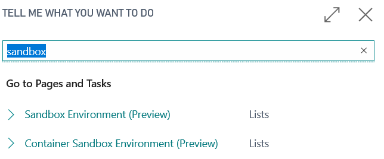
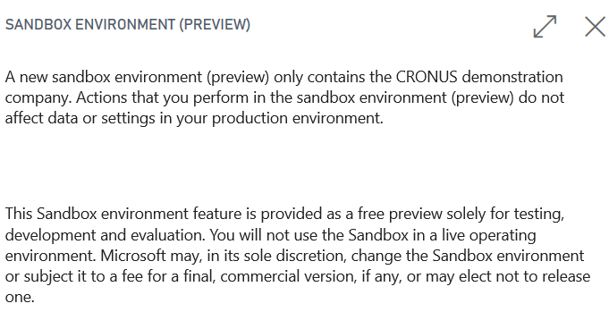
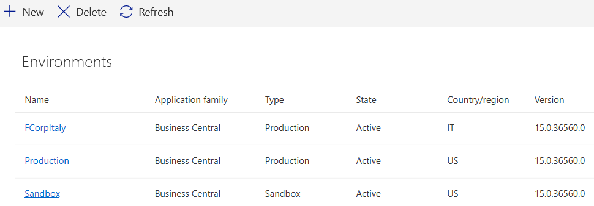
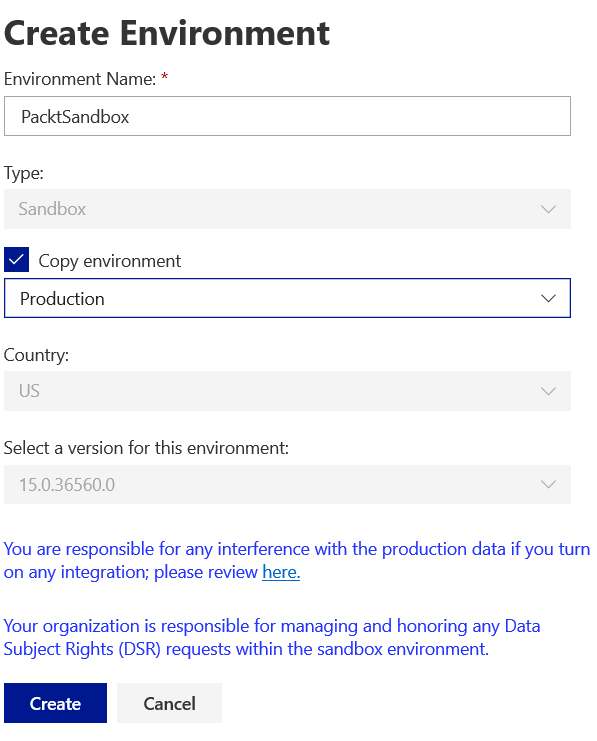

# 第三章：在线和基于容器的沙盒

Dynamics 365 Business Central 允许我们为开发和测试目的设置沙盒。对于这些沙盒，有两种通用选项：在线沙盒（基于 SaaS）和基于 Docker 的沙盒（自部署）。

在线沙盒创建非常简单，因为它们作为服务运行，与 Dynamics 365 Business Central 的生产环境相同。唯一的要求是已有的生产租户。

基于 Docker 的沙盒基于 Docker 容器，可以在 Azure 或本地运行。

本章我们将覆盖以下主题：

+   创建在线沙盒

+   Docker 镜像和容器的基础知识，以及如何使用它们

+   设置本地 Docker 环境

+   掌握 `navcontainerhelper` PowerShell 工具

+   为你的开发目的选择合适的 Docker 镜像

+   创建你自己的 Docker 镜像

# 创建在线沙盒

在订阅试用租户或直接购买 Dynamics 365 Business Central 时，你也可以创建在线沙盒环境。

你可以通过两种方式创建在线沙盒：通过生产环境客户端和/或通过 Dynamics 365 Business Central 管理中心。

从生产环境创建时，搜索 (*Alt *+ *Q*) `sandbox`，然后选择沙盒环境（预览版）：



然后你将被提示创建一个新的沙盒环境，或者打开或重置现有的沙盒。如果没有沙盒且你选择打开或重置，将创建一个新的沙盒。使用生产环境客户端创建的在线沙盒具有以下属性：

+   它们默认命名为 **sandbox**，并且也能在 Dynamics 365 Business Central 管理中心中看到。

+   它们不包含任何客户数据，仅包含来自标准演示/评估 Cronus 公司的数据。

在订阅在线沙盒租户时，仔细阅读微软免责声明非常重要，值得一提的是，此功能仍标记为预览版：



你还可以从 Dynamics 365 Business Central 管理中心创建最多三个沙盒环境。使用适当的凭证，通过支持的浏览器登录 [https:\\businesscentral.dynamics.com\GUID\Admin](https://businesscentral.dynamics.com/GUID/Admin)，其中 `GUID` 是你环境的租户 ID。

以下是管理中心中的样子：



点击 新建 按钮，然后为新的在线沙盒指定一个有效的名称。勾选复制生产数据的选项：



稍等片刻，你的沙盒将会启动并运行，带有生产数据的副本，准备好进行测试和开发任务。

# 在线沙盒的优缺点

根据微软的免责声明，在线沙盒仍然是预览功能，我们建议仅将其用于演示目的或临时开发活动。在线沙盒具有以下特点：

+   它们的支持优先级不同于生产环境。

+   租户是创建在 Azure SQL 数据库的 S 等级池中，这些池的性能不如生产环境中的 P 等级池。

+   它们仍然被标记为预览版，因此经常会发生变化。

+   在升级过程中，目前所有每个租户的扩展都将被卸载，您/您的 CSP 合作伙伴需要重新安装它们。

您可以通过阅读以下文章了解更多背景信息：

+   [`demiliani.com/2019/01/24/dynamics-365-business-central-tenant-upgrade-extensions-disappeared-in-sandbox-environment/`](https://demiliani.com/2019/01/24/dynamics-365-business-central-tenant-upgrade-extensions-disappeared-in-sandbox-environment/)

+   [`demiliani.com/2019/03/14/dynamics-365-business-central-online-sandbox-makes-you-crazy-maybe-remember-these-points/`](https://demiliani.com/2019/03/14/dynamics-365-business-central-online-sandbox-makes-you-crazy-maybe-remember-these-points/)

对于专业开发，基于容器的沙盒更为合适，我们鼓励您在开发 AppSource 或每个租户扩展时，在公司中使用 Docker 容器沙盒。

从在线生产环境中，您也可以搜索（*Alt* + *Q*）沙盒并点击沙盒环境（容器），轻松设置离线本地或 Azure 托管的 Docker 容器沙盒。

您可以通过[`demiliani.com/2018/03/29/d365bc-container-sandbox-environment/`](https://demiliani.com/2018/03/29/d365bc-container-sandbox-environment/)了解更多信息。

让我们进入下一部分，学习如何使用基于 Docker 的环境。

# 引入 Docker

如果选择使用自部署的沙盒，它们将基于 Docker。Docker 是领先的跨平台软件容器环境。由于本书是关于 Dynamics 365 Business Central 的，本节将简要介绍 Docker，但如果您想了解更多，有关 Docker（[`docs.docker.com/`](https://docs.docker.com/)）和微软（[`docs.microsoft.com/en-us/virtualization/windowscontainers/about/index`](https://docs.microsoft.com/en-us/virtualization/windowscontainers/about/index)）的官方文档中有很多优秀的学习资源，都是非常好的起点。

Dynamics 365 Business Central *仅* 在 Windows 上运行，因此当您查找 Docker 文档时，请确保它是针对 Windows 的。虽然大部分 Docker 是平台无关的，但仍有一些特定平台的部分内容。

为了跟随接下来的内容，你需要了解以下 Docker 基础知识：

+   Docker 镜像就像一个预构建的模板，包含运行所需的最少操作系统二进制文件、库和应用程序二进制文件。镜像可以通过名称来识别，例如 Business Central / Sandbox。可以通过标签指定确切的镜像版本。例如，`1910-cu1-de` 表示 **2019 年 10 月发布**（**1910**）、**CU 1**（**cu1**）、**德语版本**（**de**）。

+   Docker 容器是镜像的一个实例，具有不可变的基础（镜像中的文件）以及在其上进行的更改。容器不是 **虚拟机**（**VM**）。它没有 GUI 或任何你可以通过 **远程桌面协议**（**RDP**）连接的内容。

+   Docker 主机是一个运行容器的（物理或虚拟）机器。

+   Docker 仓库是你和其他人可以上传（推送）和下载（拉取）镜像的地方。具体来说，镜像可以从属于该注册表的仓库中下载。

所有 Dynamics 365 Business Central Docker 镜像都可以通过 Microsoft 容器注册表获得，你可以在 [`mcr.microsoft.com`](http://mcr.microsoft.com) 的 business central 仓库中找到它。它将被称为 **sandbox** 或 **on-prem**，因此，从 Dynamics 365 Business Central 本地镜像拉取的典型地址是 [mcr.microsoft.com/businesscentral/onprem:1810-cu5-de](http://mcr.microsoft.com/businesscentral/onprem:1810-cu5-de)。

对于新版本和即将发布版本的预览，还有一个特殊的仓库 `bcinsider.azurecr.io`，但你需要凭证才能访问它。Microsoft 通过 Ready to Go! 程序提供这些凭证，你可以在协作平台上找到它们 ([`docs.microsoft.com/en-us/collaborate/`](https://docs.microsoft.com/en-us/collaborate/))。

用于创建和运行 Dynamics 365 Business Central 镜像的脚本是开源的，可以在 [`github.com/Microsoft/nav-docker`](https://github.com/Microsoft/nav-docker) 上找到。

还值得注意的是，尽管这些镜像被称为 business central，但它们还包含一个 SQL Server 数据库，一个用于 `Web 客户端` 的 IIS，以及默认的文件共享功能。

# 使用 Docker 时的一些基础机制

在接下来的章节中，我们将使用几个涵盖大多数实际场景的机制。让我们逐一了解它们。

# 环境变量

环境变量是一种在 Docker 容器启动时进行参数化的方式。Dynamics 365 Business Central 镜像理解许多环境变量，例如用于设置认证类型、用户名和密码，或设置你希望将 Business Central 服务层连接到的 SQL 服务器和数据库。环境变量通过 `-e` 参数设置。如果你需要设置多个环境变量，可以使用多个 `-e` 参数：

```
-e auth=Windows -e databaseserver=sql -e databasename=cronus
```

没有关于所有环境变量的列表，你可以使用这些环境变量来根据你的需求配置 Dynamics 365 Business Central 容器，但用于设置这些变量的脚本是一个不错的起点，并且这些变量的名称可以让你大致了解它们的作用。你可以在 [`github.com/Microsoft/nav-docker/blob/master/generic/Run/SetupVariables.ps1`](https://github.com/Microsoft/nav-docker/blob/master/generic/Run/SetupVariables.ps1) 找到这个脚本。

# 卷

使用卷，你可以将 Docker 主机上的文件夹映射到容器中，例如，为容器提供访问运行解决方案所需的二进制文件或其他文件的权限。

如果你没有使用卷，并且删除了一个容器，那么你对容器内文件系统所做的所有更改将会丢失，因为它们会与容器一起被删除。

卷通过 `-v` 参数进行设置，后面跟着主机上的路径，一个冒号，以及容器内部的路径。如果你想将主机上的 `c:\data\containers` 文件夹映射到容器内的 `c:\temp`，你可以使用以下命令：

```
-v c:\data\containers:c:\temp
```

# 网络和端口

Docker 让你可以通过不同的方式将容器连接到网络。如果你没有做其他配置，它会使用一个所谓的 NAT 网络。这意味着你的容器将获得一个仅在 Docker 主机上可知的 IP 地址，这也使得容器在主机上是可访问的。作为替代方案，你可以创建一个所谓的透明网络，这意味着容器将共享主机的网络连接，并且会尝试使用 DHCP 动态 IP 分配或你配置的静态 IP 地址来获取自己的 IP 地址。如果你有一个名为 `transpNet` 的透明网络，你可以通过以下命令告诉 Docker 使用它：

```
--network transpNet
```

Dynamics 365 Business Central 镜像使用所有标准端口，因此你有 `7045`-`7049` 用于 Business Central 服务层服务，`443` 用于 HTTPS，`80` 用于 HTTP 的 `Web Client`，以及 `1443` 用于 SQL。它们还通过端口 `8080` 共享一些文件，这个端口被映射到 IIS 后端共享。

如果你不想使用透明网络，但仍然希望将端口暴露到 Docker 主机之外，你可以使用一种叫做端口映射的机制，使用 `-p` 参数。通过这个参数，你可以告诉 Docker 将容器的某个端口映射到主机上的相同端口或不同端口。如果你想将基于 HTTPS 的 `Web Client`（监听在端口 `443` 上）暴露到主机的端口 `4443`，你通常会使用以下命令：

```
-p 4443:443
```

由于 Dynamics 365 Business Central 在知道它监听哪些端口时会运行得更好，最佳方法是包含 `-e WebClientPort=4443`，这样会让 `Web Client` 监听该端口而不是标准端口 `443`。因此，你的端口映射参数将是 `-p 4443:4443`。

# Docker 在 Dynamics 365 Business Central 沙盒中的特别有用场景

有一些场景下，使用 Docker 容器非常有意义，可以帮助解决常见的问题。请注意，在撰写本文时，Dynamics 365 Business Central 在 Docker 容器中运行尚不支持生产环境，因此你只能将其用于开发和测试。本文将覆盖的场景如下：

+   **本地可用场景**：你希望在本地沙盒或自己的虚拟机上运行沙盒。

+   **集中式可用环境**：沙盒提供于一个中央环境中，并由某种操作团队进行管理。

+   **托管在 Azure 虚拟机上的容器**：如果你不想或者不能在自己的数据中心拥有虚拟机，你可以使用 Azure 的**基础设施即服务**（**IaaS**）来托管你的沙盒。

+   **Azure 容器实例中的无服务器环境**：如果你只想运行容器而不关心 Docker 本身，你也可以使用 Azure 容器实例的**平台即服务**（**PaaS**）选项。

值得一提的是，还有其他选项，比如**Azure Kubernetes 服务**（**AKS**）或其他云提供商的产品，但由于 Dynamics 365 Business Central 倾向于与更多微软导向的客户一起使用，而 Kubernetes 最近才开始支持 Windows 容器，因此这里不会讨论这些选项。

Docker 对于**持续集成/持续交付**（**CI/CD**）流水线中的自动化构建也非常有用。这个主题将在第十一章，*与 Business Central 的源代码管理和 DevOps*中深入讨论。

# 使用纯 Docker 命令的本地可用环境

如果你想让使用者完全控制 Dynamics 365 Business Central 沙盒或需要离线使用它们，那么将沙盒放在本地是有意义的。然而，这会要求使用者至少理解 Docker 的基础知识，虽然这并不复杂，但可能不符合你的需求。

# 你的第一个容器

运行 Dynamics 365 Business Central 沙盒的第一步是安装 Docker。这个过程很简单，并且有相关文档可供参考：[`docs.docker.com/install/windows/docker-ee/`](https://docs.docker.com/install/windows/docker-ee/)。完成安装后，就可以开始运行你的第一个容器。微软提供了一个非常有用的 PowerShell 模块`navcontainerhelper`，它简化了容器创建过程。然而，为了帮助你理解底层机制以及 Dynamics 365 Business Central 镜像的工作原理，最好通过几个简单的 Docker 示例来了解。

运行 Dynamics 365 Business Central 沙盒的最基本方式是使用以下命令：

```
docker run -e accept_eula=y mcr.microsoft.com/businesscentral/sandbox
```

这只在所谓的进程隔离模式下有效，这允许容器根据需要使用主机资源（如内存）。根据你的配置以及你是否运行的是旧版 Windows 10 或 Docker，你可能会收到一条错误信息，表示容器内存不足。在这种情况下，添加`-m 3G`作为参数，这将允许容器保留 3 GB 的内存。

有关进程隔离的更多信息，请参阅 [`docs.microsoft.com/en-us/virtualization/windowscontainers/manage-containers/hyperv-container`](https://docs.microsoft.com/en-us/virtualization/windowscontainers/manage-containers/hyperv-container)。

请注意，默认情况下，这将基于 Windows Server 2016 拉取镜像。如果你想运行基于 Windows Server 2019 的更小、更快速的镜像，你需要添加一个称为标签的参数；在这种情况下，这个标签将是`ltsc2019`。更多细节可以在*选择合适的镜像*部分找到：

```
docker run -e accept_eula=y mcr.microsoft.com/businesscentral/sandbox:ltsc2019
```

这指示 Docker 使用指定的镜像（即`mcr.microsoft.com/businesscentral/sandbox`）运行一个容器。运行容器意味着 Docker 会检查该镜像是否已经被下载（拉取），如果没有，它将拉取镜像。如果已经存在，或者 Docker 已经为你下载了镜像，它将为该镜像创建并启动一个容器。你将看到从主进程输出的内容，显示在你运行该命令的控制台窗口中。

使用`-e`参数时，你让 Docker 知道你希望在容器内设置`accept_eula=y`环境参数，这意味着你接受**最终用户许可协议**（**EULA**）。每当你运行 Dynamics 365 Business Central 沙箱时，这都是必要的。

以下是`docker run`命令的输出，其中镜像本地不可用：

```
docker run -e accept_eula=y -m 3G mcr.microsoft.com/businesscentral/sandbox

Unable to find image 'mcr.microsoft.com/businesscentral/sandbox:latest' locally

latest: Pulling from businesscentral/sandbox

3889bb8d808b: Already exists

…

6d7321cdab15: Already exists
5c2abed3c0c2: Already exists
0bc14e36adef: Pull complete
4fd56667f5dc: Pull complete
…
4dd9d6309b80: Pull complete
Digest: sha256:ca99037c70e1eedf21e8472a5d46efeb148dd46a7b16bdf2ddad864e2e4cb97c
Status: Downloaded newer image for mcr.microsoft.com/businesscentral/sandbox:latest
Initializing...
Starting Container
Hostname is 12cec5da3d89
PublicDnsName is 12cec5da3d89
Using NavUserPassword Authentication
Starting Local SQL Server
Starting Internet Information Server
Creating Self Signed Certificate
Self Signed Certificate Thumbprint 857B5A19C68D44BE3368CB96E2AFF6F540C0D957
Modifying Service Tier Config File with Instance Specific Settings
Starting Service Tier
Registering event sources
Creating DotNetCore Web Server Instance
Enabling Financials User Experience
Creating http download site
Setting SA Password and enabling SA
Creating admin as SQL User and add to sysadmin
Creating SUPER user
Container IP Address: 172.20.200.44
Container Hostname  : 12cec5da3d89
Container Dns Name  : 12cec5da3d89
Web Client          : https://12cec5da3d89/BC/
Admin Username      : admin
Admin Password      : Fuwu1800
Dev. Server         : https://12cec5da3d89
Dev. ServerInstance : BC
Files:
http://12cec5da3d89:8080/al-4.0.192371.vsix
http://12cec5da3d89:8080/certificate.cer
Initialization took 164 seconds
Ready for connections!
```

如你所见，日志输出会告诉你在哪里可以访问容器的`Web Client`和开发服务器服务（用于与 Visual Studio Code 的 AL Language 扩展进行连接）（暂时使用 IP 地址，稍后会详细说明）以及使用的用户名和密码。

# 拉取新镜像版本

请注意，默认情况下，Docker 不会检查镜像是否有新版本并提示你下载。如果你想确保你有当前版本，可以运行以下命令，它将始终检查是否有更新的镜像：

```
docker pull mcr.microsoft.com/businesscentral/sandbox
```

如果有新版本可用，Docker 将会下载它，并输出类似于你之前看到的内容。如果没有新版本可用，你将看到以下信息：

```
docker pull mcr.microsoft.com/businesscentral/sandbox
Using default tag: latest
latest: Pulling from businesscentral/sandbox
Digest: sha256:ca99037c70e1eedf21e8472a5d46efeb148dd46a7b16bdf2ddad864e2e4cb97c
Status: Image is up to date for mcr.microsoft.com/businesscentral/sandbox:latest
```

我们还可以使用更多环境参数、卷和端口映射，来展示一个更高级的示例，同时使用我们之前介绍的机制：

```
docker run -e accept_eula=y -e usessl=n -v "c:\dev\addins:c:\program files\Microsoft\Dynamics Business Central\150\Service Tier\Add-ins\mine" -p 80:80 –name mycontainer mcr.microsoft.com/businesscentral/sandbox
```

这实现了以下功能：

+   它接受 EULA，并通过两个`-e`参数告诉镜像不要为`Web Client`使用 SSL。

+   它使用`-v`参数将本地文件夹`c:\dev\addins`映射到 Business Central 服务层`Add-Ins`文件夹中的`mine`子文件夹。

+   它使端口`80`在你的笔记本电脑上作为端口`80`可用，使用`-p`参数。你也可以使用`-p 8080:80`，这会将你笔记本电脑上的端口`8080`映射到容器上的端口`80`。

+   它将容器命名为`mycontainer`，这样你可以轻松地通过`--name`参数来引用它。

既然我们已经了解了如何运行本地 Docker 环境，接下来让我们看看如何连接到现有的 SQL Server 实例。

# 连接到现有的 SQL Server

你可以指示容器连接到现有的 SQL Server 和数据库，而不是使用容器内部的 SQL Server，这样容器内部的 SQL Server 也不会启动。如果你想将多个实例连接到同一个数据库，这是必要的，但如果你想在同一主机上运行多个容器，这也很有意义。否则，你将每个容器都运行一个 SQL Server，这将需要大量资源。

在本节中，我假设在你的本地环境中运行着一个名为`sqlserver`的 SQL Server（无论是否在容器中），并且 Business Central 容器能够访问它。我有一个名为`sqluser`的 SQL 用户，密码为`1SuperSecretPwd!`，该用户具有访问该服务器上名为`FinancialsW1`的 Business Central 数据库的必要权限。对于这种情况，`docker run`命令将如下所示：

```
docker run -e accept_eula=y -e databaseServer=sqlserver -e databaseUsername=sqluser -e "databasePassword=1SuperSecretPwd!" -e databasename=FinancialsW1 mcr.microsoft.com/businesscentral/sandbox
```

我们得到以下输出：

```
Initializing...
Starting Container
Hostname is c9658bdbe7f0
PublicDnsName is c9658bdbe7f0
Using NavUserPassword Authentication
Starting Internet Information Server
Import Encryption Key
Creating Self Signed Certificate
Self Signed Certificate Thumbprint 87B2FC05A437AFE41966A3E99EFC75A2C2CAD537
Modifying Service Tier Config File with Instance Specific Settings
Starting Service Tier
Creating DotNetCore Web Server Instance
Enabling Financials User Experience
Creating http download site
Creating Windows user admin
Container IP Address: 172.26.151.47
Container Hostname  : c9658bdbe7f0
Container Dns Name  : c9658bdbe7f0
Web Client          : https://c9658bdbe7f0/BC/
Dev. Server         : https://c9658bdbe7f0
Dev. ServerInstance : BC
Files:
http://c9658bdbe7f0:8080/al-4.0.192371.vsix
http://c9658bdbe7f0:8080/certificate.cer
```

以下是最终输出：

```
Initialization took 116 seconds
Ready for connections!
```

请注意，在这种情况下，容器不会在数据库中创建任何用户，因为它假设如果你使用的是现有数据库，那么你也会在该数据库中有现有的用户。同时，请注意，容器将把它自己的加密密钥导入到数据库中，这个密钥用于加密密码。因此，如果你想以这种方式连接多个容器到同一个数据库，你需要确保加密密钥是共享的。

# 使用 Docker cmdlet 处理正在运行的容器

如果你需要获取 PowerShell 会话进入正在运行的容器，你有两个选项：

+   首先，你可以使用`Enter-PSSession`，就像连接到另一台计算机一样，不过你需要给它容器的完整 ID，而不是计算机名。最简单的方式是使用一个子命令查询 Docker 以获取该容器。进入`mycontainer`容器的 PS 会话将如下所示：

```
Enter-PSSession -containerid (docker --no-trunc -qf "name=mycontainer")
```

上述语句*仅*在以管理员身份运行时有效。

+   第二个选项是执行容器中的`powershell`命令，并指示 Docker 为其打开一个交互式终端。对于`mycontainer`容器，这将如下所示：

```
docker exec -ti mycontainer powershell
```

使用这两个命令，你将在容器内启动一个 PowerShell 会话。如果你想运行 Business Central cmdlet，最简单的方式是调用 `c:\run\prompt.ps1`，它会导入所有开发和管理员 cmdlet。

要查看当前正在运行的所有容器，你可以输入并执行 `docker ps`，它会显示以下输出：

```
docker ps
CONTAINER ID        IMAGE                                        COMMAND                  CREATED             STATUS                       PORTS                                                NAMES
12cec5da3d89        mcr.microsoft.com/businesscentral/sandbox    "powershell -Comma..."   22 minutes ago      Up 21 minutes (healthy)      80/tcp, 443/tcp, 1433/tcp, 7045-7049/tcp, 8080/tcp   determined_shockley
9518e7e456de        mcr.microsoft.com/dynamicsnav:2017-cu22-de   "powershell -Comma..."   42 minutes ago      Up 41 minutes (healthy)      80/tcp, 443/tcp, 1433/tcp, 7045-7049/tcp, 8080/tcp   testcont
95959a311e54        mcr.microsoft.com/dynamicsnav:2017-cu22-de   "powershell -Comma..."   About an hour ago   Up About an hour (healthy)   80/tcp, 443/tcp, 1433/tcp, 7045-7049/tcp, 8080/tcp   RKOS-18111
13057bf415cc        mcr.microsoft.com/dynamicsnav:2017-cu22-de   "powershell -Comma..."   22 hours ago        Up 22 hours (healthy)        80/tcp, 443/tcp, 1433/tcp, 7045-7049/tcp, 8080/tcp   VOEKOM
0e7970ce5318        mcr.microsoft.com/dynamicsnav:2017-cu22-de   "powershell -Comma..."   29 hours ago        Up 29 hours (healthy)        80/tcp, 443/tcp, 1433/tcp, 7045-7049/tcp, 8080/tcp   Buchau
6c1c44f170bb        mcr.microsoft.com/dynamicsnav:2017-cu22-at   "powershell -Comma..."   46 hours ago        Up 46 hours (healthy)        80/tcp, 443/tcp, 1433/tcp, 7045-7049/tcp, 8080/tcp   syAToekom
```

要查看所有当前存在的容器，你可以使用 `docker ps -a`，它还包括已退出和/或已停止的容器（输出还会显示一个状态为 `Exited` 的容器）：

```
docker ps -a
CONTAINER ID        IMAGE                                        COMMAND                  CREATED             STATUS                              PORTS                                                NAMES
12cec5da3d89        mcr.microsoft.com/businesscentral/sandbox    "powershell -Comma..."   24 minutes ago      Exited (1073807364) 9 seconds ago                                                        determined_shockley
9518e7e456de        mcr.microsoft.com/dynamicsnav:2017-cu22-de   "powershell -Comma..."   43 minutes ago      Up 43 minutes (healthy)             80/tcp, 443/tcp, 1433/tcp, 7045-7049/tcp, 8080/tcp   testcont
95959a311e54        mcr.microsoft.com/dynamicsnav:2017-cu22-de   "powershell -Comma..."   About an hour ago   Up About an hour (healthy)          80/tcp, 443/tcp, 1433/tcp, 7045-7049/tcp, 8080/tcp   RKOS-18111
```

停止和启动容器和使用 `docker stop` 和 `docker start` 一样简单。如果你想删除一个容器，你需要先停止（`docker stop`）然后删除它（`docker rm`），或者使用 `docker rm` 的 `-f` 参数强制删除容器，即使它仍在运行。

请注意，删除容器意味着该容器内的所有文件将丢失，无法恢复。

如果命令执行成功，它只会返回你指定的容器名称或 ID：

```
docker rm -f 12
```

请注意，你可以通过容器的名称或 ID 来定位容器。你不需要指定完整的 ID，只需要提供 ID 的前几个字符，以便 Docker 唯一地识别容器。同时，注意 `docker ps` 会为每个容器显示一个截断的 ID，你可以使用 `docker ps --no-trunc` 来获取完整的 ID。

# 使用 navcontainerhelper 创建本地可用的环境

为了让用户更容易采用和使用 Dynamics 365 Business Central Docker 镜像，微软创建了一个名为 `navcontainerhelper` 的 PowerShell 模块。它使用与纯 Docker 命令相同的镜像和命令，且在许多地方，你可以看到 cmdlet 是如何转化为 Docker 命令的。它还包含了一些非常有价值的 PowerShell 脚本集合，帮助完成 Dynamics 365 Business Central 中常见的开发、构建、测试和发布任务。

# 安装 navcontainerhelper 并保持其更新

要使用 `navcontainerhelper` 模块，你需要从 PowerShell Gallery 安装它，如下所示：

```
install-module navcontainerhelper -force
```

如果有新版本的 `navcontainerhelper`（在写这篇文档时，至少每隔几周就会有一次更新），并且包含新的有用功能和 bug 修复，只需运行以下命令：

```
update-module navcontainerhelper -force
```

# 你的第一个容器

为了跟随上一节的相同示例，你将学习如何使用 `navcontainerhelper` 运行你的第一个容器。不过，`navcontainerhelper` 需要你给它一个名称，并做出关于身份验证的明确选择。如果你没有提供任何其他参数，它会假设你想使用 Windows 身份验证，并要求输入密码，以便它可以在容器内创建一个具有相同用户名和密码的用户。这也启用了 **单点登录** (**SSO**) 功能。考虑以下命令：

```
New-NavContainer -accept_eula -imageName mcr.microsoft.com/businesscentral/sandbox mycontainer

NavContainerHelper is version 0.6.4.16
NavContainerHelper is running as administrator
Host is Microsoft Windows Server 2019 Datacenter - ltsc2019
Docker Client Version is 19.03.2
Docker Server Version is 19.03.2
Pulling image mcr.microsoft.com/businesscentral/sandbox:latest-ltsc2019
latest-ltsc2019: Pulling from businesscentral/sandbox
3889bb8d808b: Already exists
e0718b11f512: Pulling fs layer
…
76a160cd3c52: Pull complete
Digest: sha256:3eb2e9d87102c135c1b0c004523abbbe7bff53fc98fe5527a4e85e9ff198d1fd
Status: Downloaded newer image for mcr.microsoft.com/businesscentral/sandbox:latest-ltsc2019
Using image mcr.microsoft.com/businesscentral/sandbox:latest-ltsc2019
Creating Container mycontainer
Version: 15.0.36626.37711-w1
Style: sandbox
Platform: 15.0.37582.0
Generic Tag: 0.0.9.95
Container OS Version: 10.0.17763.737 (ltsc2019)
Host OS Version: 10.0.17763.678 (ltsc2019)
Using locale en-US
Using process isolation
Disabling the standard eventlog dump to container log every 2 seconds (use -dumpEventLog to enable)
Files in C:\ProgramData\NavContainerHelper\Extensions\mycontainer\my:
- AdditionalOutput.ps1
- MainLoop.ps1
Creating container mycontainer from image mcr.microsoft.com/businesscentral/sandbox:latest-ltsc2019
db420a5aec3da0b94b2a466432c160f3a28bd7da5ed83d5ea683ee5e7bd330ff
Waiting for container mycontainer to be ready
Initializing...
Starting Container
Hostname is mycontainer
PublicDnsName is mycontainer
Using Windows Authentication
Starting Local SQL Server
Starting Internet Information Server
Modifying Service Tier Config File with Instance Specific Settings
Starting Service Tier
Registering event sources
Creating DotNetCore Web Server Instance
Enabling Financials User Experience
Creating http download site
Creating Windows user tobias.fenster
Setting SA Password and enabling SA
Creating SUPER user
Container IP Address: 172.23.237.104
Container Hostname  : mycontainer
Container Dns Name  : mycontainer
Web Client          : http://mycontainer/BC/
Dev. Server         : http://mycontainer
Dev. ServerInstance : BC 
Files:
http://mycontainer:8080/al-4.0.192371.vsix

Initialization took 311 seconds
Ready for connections!
Reading CustomSettings.config from mycontainer
Creating Desktop Shortcuts for mycontainer
Container mycontainer successfully created
```

正如你从最后几行看到的，`navcontainerhelper`甚至会创建方便的桌面快捷方式。它们允许你通过简单的双击访问`Web Client`，或在容器内打开 PowerShell 或命令提示符。这些快捷方式实际上使用了你在前几节中看到的相同的`docker exec`命令。

`New-NavContainer`有一个很长的参数列表，这些参数要么仅仅是环境参数的映射，要么是非常有用的小功能。举个例子，如果你指定了`-updateHosts`，那么`navcontainerhelper`会将容器的名称和 IP 地址添加到你笔记本电脑上的 hosts 文件中。这意味着你不需要使用 IP 地址——你可以使用容器名称作为地址！当然，也有其他方法可以做到这一点，但没有像在启动命令中指定一个简单的参数那么方便。

# 拉取新镜像版本

拉取新镜像在`navcontainerhelper`中的工作方式与普通 Docker 完全相同；没有特别的命令。然而，你可以为`New-NavContainer`命令指定`-alwaysPull`参数，正如名称所示——每次运行容器之前，都会尝试拉取新的镜像版本。

但`navcontainerhelper`实际上会自动添加更多方便的优化。如果你没有在标签中指定`ltsc2016`或`ltsc2019`，它会自动确定最佳的容器平台并使用它。它还会自动判断是否可以使用进程隔离，并在必要时将内存限制设置为 4GB。

# 使用更多环境参数、卷和端口映射

如前所述，`New-NavContainer`提供了许多仅设置环境参数的选项。在我们之前使用`docker run`的示例中，执行了以下操作：

```
docker run -e accept_eula=y -e usessl=n -v "c:\dev\addins:c:\program files\microsoft\Dynamics NAV\150\Service Tier\Add-ins\mine" -p 80:80 –name mycontainer mcr.microsoft.com/businesscentral/sandbox
```

要在`navcontainerhelper`中实现相同的功能，我们会使用以下命令：

```
New-NavContainer -accept_eula -PublishPorts 80 -additionalParameters @('--volume c:\dev\addins:c:\program files\microsoft\Dynamics NAV\150\Service Tier\Add-ins\mine') -containerName mycontainer -imageName mcr.microsoft.com/businesscentral/sandbox
```

让我们来比较一下这些功能：

+   接受 EULA（最终用户许可协议）是通过`-accept_eula`完成的，且不使用 SSL 是`navcontainerhelper`的默认设置。

+   本地文件夹与容器中`Add-ins`文件夹的映射是通过`-additionalParameters`参数来实现的。这是`navcontainerhelper`中用于指定任何你可能需要的`docker run`参数的机制，这些参数尚未被涵盖。

+   端口映射是通过`-PublishPorts`参数来实现的。

+   命名容器是通过`-containerName`参数来完成的。

再次强调，`navcontainerhelper`会自动添加更多内容：`c:\programdata\navcontainerhelper`始终会与容器共享，并作为容器内的同一文件夹。此外，每个容器都有自己在`c:\programdata\navcontainerhelper\extensions\<containername>`中的文件夹，所有本地与该容器相关的内容都会放在这里。

# 连接到现有的 SQL Server

`navcontainerhelper`使得这个任务比直接使用 Docker 稍微方便一些。你需要指定相同的参数，但你可以提供一个凭证对象，而不是将用户名和密码明文写入。提醒一下，下面是`docker run`命令的样子：

```
docker run -e accept_eula=y -e databaseServer=sqlserver -e databaseUsername=sqluser -e "databasePassword=1SuperSecretPwd!" -e databasename=FinancialsW1 mcr.microsoft.com/businesscentral/sandbox
```

以下是使用`navcontainerhelper`的相同命令。它将打开一个凭证输入对话框，在那里你可以输入 SQL 用户名和密码。但与直接将密码明文写入环境变量不同，`navcontainerhelper`确保密码得到安全处理，如下所示：

```
New-NavContainer -accept_eula -databaseServer sqlserver -databaseCredential (Get-Credential) -databaseName FinancialsW1 -imageName mcr.microsoft.com/businesscentral/sandbox:latest -containerName mycontainer -auth NavUserPassword
cmdlet Get-Credential at command pipeline position 1
Supply values for the following parameters:
Credential

NavContainerHelper is version 0.6.4.16
NavContainerHelper is running as administrator
Host is Microsoft Windows Server 2019 Datacenter - ltsc2019
Docker Client Version is 19.03.2
Docker Server Version is 19.03.2
Pulling image mcr.microsoft.com/businesscentral/sandbox:latest-ltsc2019
latest-ltsc2019: Pulling from businesscentral/sandbox
3889bb8d808b: Already exists
e0718b11f512: Pulling fs layer
…
76a160cd3c52: Pull complete
Digest: sha256:3eb2e9d87102c135c1b0c004523abbbe7bff53fc98fe5527a4e85e9ff198d1fd
Status: Downloaded newer image for mcr.microsoft.com/businesscentral/sandbox:latest-ltsc2019
Using image mcr.microsoft.com/businesscentral/sandbox:latest-ltsc2019
Creating Container mycontainer
Version: 15.0.36626.37711-w1
Style: sandbox
Platform: 15.0.37582.0
Generic Tag: 0.0.9.95
Container OS Version: 10.0.17763.737 (ltsc2019)
Host OS Version: 10.0.17763.678 (ltsc2019)
Using locale en-US
Using process isolation
Disabling the standard eventlog dump to container log every 2 seconds (use -dumpEventLog to enable)
Files in C:\ProgramData\NavContainerHelper\Extensions\mycontainer\my:
- AdditionalOutput.ps1
- MainLoop.ps1
Creating container mycontainer from image mcr.microsoft.com/businesscentral/sandbox:latest-ltsc2019
db420a5aec3da0b94b2a466432c160f3a28bd7da5ed83d5ea683ee5e7bd330ff
Waiting for container mycontainer to be ready
Initializing...
Starting Container
Hostname is mycontainer
PublicDnsName is mycontainer
Using NavUserPassword Authentication
Starting Internet Information Server
Import Encryption Key
Creating Self Signed Certificate
Self Signed Certificate Thumbprint 583BDDBAB357DB4B4AB722284629195E27328B7E
Modifying Service Tier Config File with Instance Specific Settings
Starting Service Tier
Creating DotNetCore Web Server Instance
Enabling Financials User Experience
Creating http download site
Creating Windows user admin
Setting SA Password and enabling SA
Creating SUPER user
Container IP Address: 172.23.237.104
Container Hostname : mycontainer
Container Dns Name : mycontainer
Web Client : http://mycontainer/BC/
Dev. Server : http://mycontainer
Dev. ServerInstance : BC

Files:
http://mycontainer:8080/al-4.0.192371.vsix

Initialization took 99 seconds
Ready for connections!
Reading CustomSettings.config from mycontainer
Creating Desktop Shortcuts for mycontainer
Container mycontainer successfully created
```

请注意，使用`docker run`时默认的身份验证机制是`NavUserPassword`，而`navcontainerhelper`的默认身份验证机制是 Windows，因此为了实现相同的效果，我们也需要指定这一点。

# 使用 NavContainerHelper 管理你的运行中的容器

在`navcontainerhelper`中没有专门的命令让你查看正在运行的容器，因此你只需要使用前面章节中介绍的相同`docker ps`命令。也有启动和停止容器的命令（分别是`Start-NavContainer`和`Stop-NavContainer`），但它们只是`docker start`和`docker stop`的简单封装，没有额外的好处。

移除容器的操作是通过`Remove-NavContainer`完成的，它做的事情稍微多一些：它会清理快捷方式和特定于容器的文件夹，如果你指定了`-updatehosts`，它还会移除 hosts 文件中的相关条目。

还有一个命令可以让你进入容器会话，叫做`Enter-NavContainer`。这会给你一个 PowerShell 会话，进入容器内部，另外还可以调用`c:\run\prompt.ps1`，这会立刻提供所有开发和管理的 cmdlet，并且给你一个格式良好的提示，让你始终知道自己在哪里。考虑以下命令：

```
Enter-NavContainer mycontainer[MYCONTAINER]: PS C:\Run> Get-NAVServerInstance
ServerInstance : MicrosoftDynamicsNavServer$BC
DisplayName    : Dynamics 365 Business Central Server [BC]
State          : Running
ServiceAccount : NT AUTHORITY\SYSTEM
Version        : 15.0.37582.0
Default : True
```

# 本地环境的集中式可用性

到目前为止，我们只涵盖了本地运行的容器，但根据你的情况，你可能希望设置一个或多个中央虚拟机，这些虚拟机由运维团队而非开发人员或顾问来管理。在这种情况下，之前解释过的相同选项仍然适用，但你需要考虑一些额外的主题。你还需要决定是否希望提供一个完全自助服务的环境，允许开发人员或顾问自行配置新的沙盒，或者希望运维团队来处理创建和删除沙盒的工作。

如果你的运维团队负责这些操作，那么你唯一需要关注的就是网络配置。你有以下两种选择，可以使你的容器端口在 Docker 主机外部可用：

+   端口映射让你可以将容器端口映射到主机端口。然而，随着时间的推移，这会变得繁琐，因为你需要为每个容器找到可用的端口，并告诉你的用户应该使用哪些端口。

+   透明网络使容器能够获得自己的 IP 地址（静态或 DHCP）并保持标准端口。此方法的维护工作量要少得多。我们现在将更详细地讨论这个问题。

所以，创建透明网络非常简单。在最简单的情况下，你只需要编写以下命令来创建一个名为 `transpNet` 的透明网络：

```
docker network create -d transparent transpNet
```

你也可以设置子网或 IP 范围，但这超出了本书的范围。请查看 Docker 的在线文档或运行 `docker network create --help` 以了解更多信息。告诉容器使用透明网络也很容易，因为有一个名为 `--network` 的参数。在运行纯 Docker 时，使用如下命令：

```
docker run -e accept_eula=y --network transpNet mcr.microsoft.com/businesscentral/sandbox
```

`navcontainerhelper` 在写作时 `New-NavContainer` 没有特定的网络参数，但你可以使用 `-additionalParametersparameter` 来代替：

```
New-NavContainer -accept_eula -additionalParameters @('--network transpNet') -containerName mycontainer -imageName mcr.microsoft.com/businesscentral/sandbox
```

这样，容器将获得自己的 IP 地址，并且你可能也能通过名称从 Docker 主机外部访问它。请注意，这很大程度上取决于主机所处网络的设置。它类似于将一个新虚拟机添加到网络中，依赖于网络管理员设置的安全机制，这可能在没有进一步设置的情况下无法正常工作。

如果你想要为开发人员或顾问提供一个可以创建自己环境的环境，你需要解决两个问题：

+   **你希望如何处理容器操作（创建、启动、停止和删除操作）？** 你可以允许用户通过 RDP 或 PowerShell 访问主机，但这会使权限管理变得复杂。你还可以使用如 Portainer（[`portainer.io`](https://portainer.io)）这样的工具，这是一个处理容器的 GUI。在这里，用户可以管理他们的容器，并且你可以例如创建具有预定义值的容器参数模板。然而，请注意，在这种情况下，你将无法使用 `navcontainerhelper`，因为这意味着需要在主机上运行 PowerShell 脚本。另一种选择是你自己创建某种前端应用程序，但这当然需要一些时间。

+   **用户如何访问容器中的文件系统？** 这取决于你对 Dynamics 365 Business Central 的使用。通常需要访问文件系统。如果你已经运行了全云解决方案，这无论如何都不可行，但如果你仍有本地客户，这可能是一个问题。最简单的解决方案是始终将一个卷映射到你的容器中，例如 `c:\shared`，并允许用户访问主机上的文件夹。

# 托管在 Azure 虚拟机上的容器

如果你想在 Azure 虚拟机中运行沙盒，你面临的挑战几乎与在本地虚拟机中使用集中式沙盒相同。不过，你可以走捷径：微软提供了预安装了 Docker 的标准虚拟机镜像，比如带有容器的 Windows Server 2019 Datacenter，这样你就不必担心这一点了。

如果你想使用 `navcontainerhelper`，你需要先安装它，然后你就可以开始使用了。一个更快捷的方法是使用微软提供的快速启动模板之一，例如[`aka.ms/getbc`](http://aka.ms/getbc)。这将创建一个 Azure 虚拟机，安装 Docker 和 `navcontainerhelper`，拉取最新的 Dynamics 365 Business Central 镜像（默认为本地版镜像），并为你启动它。除此之外，你还会得到一个漂亮的日志，显示所有正在进行的“魔法”进展。之后，你可以使用该虚拟机根据需要创建更多沙盒。

然而，在 Azure 虚拟机中有一个问题，使得处理它们变得更加复杂：你无法使用透明网络。这是有多个原因的，而且很可能在近期不会改变，所以你必须考虑其他解决方案。一种解决方案是端口映射，正如我们之前提到的，但这也需要相当多的维护。最简单的方法是使用反向代理，例如 nginx 或 Traefik，但这也超出了本书的范围。

你可以在[`www.axians-infoma.de/techblog/running-multiple-nav-bc-containers-on-an-azure-vm/`](https://www.axians-infoma.de/techblog/running-multiple-nav-bc-containers-on-an-azure-vm/)找到快速入门介绍。

# 选择正确的镜像

现在你已经知道如何创建和运行沙盒，唯一的问题是你想使用哪个版本；做出这个决定可能相当复杂。关于如何做出有效决定的基本知识将在本节中总结。

官方的公开发布版本始终可以在注册表（`mcr.microsoft.com`）中找到，以下是相关的仓库和镜像名称：

+   `mcr.microsoft.com/businesscentral/sandbox`：Dynamics 365 Business Central SaaS 版本的沙盒镜像

+   `mcr.microsoft.com/businesscentral/onprem`：Dynamics 365 Business Central 本地版

+   `mcr.microsoft.com/dynamicsnav`：旧版 Dynamics NAV 产品，从 Dynamics NAV 2016 开始

未发布版本的预览版可以在 `bcinsider.azurecr.io` 注册表中找到，以下是相关的仓库和镜像名称：

+   `bcinsider.azurecr.io/bcsandbox`：Dynamics 365 Business Central SaaS 版本下一个次要版本的预览版

+   `bcinsider.azurecr.io/bconprem`：Dynamics 365 Business Central 本地版下一个次要版本的预览版

+   `bcinsider.azurecr.io/bcsandbox-master`：Dynamics 365 Business Central SaaS 版本下一个重大版本的预览版

+   `bcinsider.azurecr.io/bconprem-master`：下一次主要发布的 Dynamics 365 Business Central 本地版预览

请注意，再次提醒，你需要`bcinsider.azurecr.io`的登录凭据，可以通过在微软的协作平台上注册“Ready to Go!”程序后获取。

当你决定使用哪张镜像时，还需要决定使用哪个标签，代表微软的某个特定版本。所有镜像都允许你指定语言（`gb`、`de`、`dk`等）和基础操作系统（Windows Server 2016 的`ltsc2016`和 Windows Server 2019 的`ltsc2019`）。发布的本地版本也允许你使用与传统安装相同的命名约定，通过参考它们的累积更新名称来使用。

考虑以下示例，以便了解语法：

+   Dynamics 365 Business Central 2018 秋季版（1810），CU 11，德语版，基于 Windows Server 2016：

```
mcr.microsoft.com/businesscentral/onprem:1810-cu11-de-ltsc2016
```

+   Dynamics 365 Business Central 2019 春季版（1904），CU 5，丹麦版，基于 Windows Server 2019：

```
mcr.microsoft.com/businesscentral/onprem:1904-cu5-dk-ltsc2019
```

+   Dynamics 365 Business Central 2019 秋季版（1910），CU 1，澳大利亚版，基于 Windows Server 2019：

```
mcr.microsoft.com/businesscentral/onprem:1910-cu1-au-ltsc2019
```

+   Dynamics NAV 2017，CU 28，英国版，基于 Windows Server 2019：

```
mcr.microsoft.com/businesscentral/dynamicsnav:2017-cu28-gb-ltsc2019
```

已发布的 SaaS 版本允许你指定更新版本，而不是累积更新：

+   Dynamics 365 Business Central SaaS 更新 25，西班牙版，基于 Windows Server 2016：

```
mcr.microsoft.com/businesscentral/sandbox:update25-es-ltsc2016
```

预览版只允许你指定语言和 Windows Server 版本：

+   下一次小版本的 SaaS 版 Dynamics 365 Business Central 的最新预览，德语版，基于 Windows Server 2019：`bcinsider.azurecr.io/bcsandbox:de-ltsc2019`

+   下一次主要发布的 Dynamics 365 Business Central 本地版预览，丹麦版，基于 Windows Server 2016：`bcinsider.azurecr.io/bconprem-master:dk-ltsc2016`

如果你没有指定所有内容，会有默认值，因此`mcr.microsoft.com/businesscentral/onprem`将给你最新的累积更新版本，基于 Windows Server 2016 的最新 Dynamics 365 Business Central 本地版本 W1 版。为了避免意外情况，通常最好尽可能详细地指定标签。

# 修改标准镜像中的脚本

如你所见，Dynamics 365 Business Central 的容器镜像有很多配置选项，允许你改变许多行为。然而，如果你遇到需要运行不同容器配置的情况，镜像还有一个王牌：你可以覆盖容器中的任何脚本。

这个机制通过将一个与想要覆盖的脚本同名的脚本放入容器中的 `c:\run\my` 文件夹来工作。最简单的方法是通过卷来实现。假设你有一个文件夹，比如 `c:\bc-override`，其中有一个 `AdditionalSetup.ps1` 文件，你可以这样做：

```
docker run -e accept_eula=y -v c:\bc-override:c:\run\my mcr.microsoft.com/businesscentral/onprem
```

当容器执行到调用 `AdditionalSetup.ps1` 的位置时，它会检查在 `c:\run\my` 中是否存在该文件，如果存在，则调用它。如果不存在，它会调用标准脚本，该脚本存储在 `c:\run` 中。这个脚本可能如下所示：

```
Write-Host "----- Hello from the override script --------------------"
```

如果是这样，当你启动容器时，你将看到以下输出：

```
Initializing...
Starting Container
Hostname is 4e58d9587fb0
PublicDnsName is 4e58d9587fb0
Using NavUserPassword Authentication
Starting Local SQL Server
Starting Internet Information Server
Creating Self Signed Certificate
Self Signed Certificate Thumbprint 1462D57EE355D19018232160C396159313A20893
Modifying Service Tier Config File with Instance Specific Settings
Starting Service Tier
Creating DotNetCore Web Server Instance
Enabling Financials User Experience
Creating http download site
Creating Windows user admin
Setting SA Password and enabling SA
Creating admin as SQL User and add to sysadmin
Creating SUPER user
----- Hello from the override script --------------------
Container IP Address: 172.26.148.48
Container Hostname  : 4e58d9587fb0
Container Dns Name  : 4e58d9587fb0
Web Client          : https://4e58d9587fb0/BC/
Admin Username      : admin
Admin Password      : Rohy1060
Dev. Server         : https://4e58d9587fb0
Dev. ServerInstance : BC
Files:
http://4e58d9587fb0:8080/al-4.0.192371.vsix
http://4e58d9587fb0:8080/certificate.cer
Initialization took 117 seconds
Ready for connections!
```

使用 `navcontainerhelper` 工具，你可以像这样调用它：

```
New-NavContainer -accept_eula -imageName mcr.microsoft.com/businesscentral/sandbox -myScripts @("c:\bc-override\AdditionalSetup.ps1") mycontainer
```

或者，由于 `navcontainerhelper` 提供了一种更方便的方法，你可以直接将你的 PowerShell 脚本代码内联添加：

```
New-NavContainer -accept_eula -imageName mcr.microsoft.com/businesscentral/sandbox -myscripts @( @{ "AdditionalSetup.ps1" = "Write-Host ‘----- Hello from the override script --------------------'" } ) mycontainer
```

借助这个强大的功能，你可以更改容器中的每个脚本以适应你的需求。为了了解可以调整的内容，请查看 [`github.com/Microsoft/nav-docker/tree/master/generic/Run`](https://github.com/Microsoft/nav-docker/tree/master/generic/Run)。

# 创建你自己的镜像

通过我们刚才看到的机制，我们可以更改容器中的所有内容。但是，如果你想确保你的同事、合作伙伴或客户获得完全相同的修改，而不必得到 `my-scripts` 覆盖正确？或者，如果你需要将某些 DLL 或其他文件放入容器中，并希望将它们作为你自己的镜像的一部分交付呢？答案是构建你自己的镜像，幸运的是，这也非常简单。

Docker 有一个分层概念，使得镜像变成了一个层的堆叠。你需要做的就是将自己的层放在标准镜像之上。你可以通过使用 Dockerfile 来实现这一点，Dockerfile 需要引用你想要扩展的标准镜像，然后再执行你想要的操作。假设你想将存储在 `c:\bc\dlls` 中的某些 DLL 文件放入镜像的 `Add-ins` 文件夹，并将你自己位于 `c:\bc\override` 文件夹中的 `AdditionalSetup.ps1` 脚本放入镜像的 `c:\run` 文件夹中。你的 Dockerfile 将如下所示，存储在 `c:\bc` 文件夹中：

```
FROM mcr.microsoft.com/businesscentral/sandbox
COPY ["./dlls/*", "c:/Program Files/Microsoft Dynamics NAV/150/Service/Add-ins/"]
COPY ./override/AdditionalSetup.ps1 c:/run/
```

要构建这个镜像，你需要在 `c:\bc` 中运行 `docker build` 命令，并使用 `-t` 参数为你的镜像命名：

```
docker build -t myimage
```

结果将类似于以下内容：

```
Sending build context to Docker daemon 7.168kB
Step 1/3 : FROM mcr.microsoft.com/businesscentral/sandbox
 ---> 20f72db6c9a9
Step 2/3 : COPY ./dlls/* c:/Program Files/Microsoft Dynamics NAV/150/Service/Add-ins/
---> f202642914a9
Step 3/3 : COPY ./override/AdditionalSetup.ps1 c:/run/
 ---> 1164c1273517
Removing intermediate container e9070e72cbaa
Successfully built 1164c1273517
Successfully tagged myimage:latest
```

配置完成后，你可以像使用其他镜像一样使用你的镜像：

```
docker run -e accept_eula=y myimage
```

与他人共享此镜像的方式是通过 **Docker 仓库**。对于基于官方 Microsoft 镜像构建的镜像，这将通过私有仓库来完成。如何设置私有仓库超出了本书的范围，但如果你想了解更多，可以参考 [`docs.docker.com/registry/`](https://docs.docker.com/registry/) 作为一个好的起点。

# 总结

在本章中，我们了解了在线和基于 Docker 的沙盒的基础知识，以及如何最优化地使用它们。我们强调了掌握 Docker 的基础知识及如何从在线仓库中的 Dynamics 365 Business Central 镜像创建基本容器的必要性。

借助本章中获得的技能，你应该能够创建自己的容器，选择合适的镜像，并在处理自定义沙盒环境时熟悉`navcontainerhelper`工具。

你还应该能够掌握 Dockerfile 的格式，并通过覆盖脚本和创建自己的 Dynamics 365 Business Central 沙盒基线，对标准镜像进行深入修改。

在下一章中，我们将通过学习 AL 语言的基础知识，开始我们的开发之旅。
