# 第四章：扩展开发基础

在上一章中，我们概述了新的现代开发环境，并且学习了如何使用 AL 语言扩展和现代开发环境启动一个新的 Dynamics 365 Business Central 扩展项目。

在本章中，我们将详细探讨新扩展开发模型中的对象，并讲解如何使用 AL 创建新对象、扩展标准对象，以及如何处理 AL 扩展项目。更具体地说，我们将涵盖以下主题：

+   扩展开发基础

+   AL 对象的概述

+   如何在扩展项目中创建基本对象

+   处理 AL 项目的最佳实践

+   AL 对象指南

在本章结束时，你将了解不同的 AL 对象类型，如何创建和使用它们，并且（更广泛地说）你将准备好开始一个 Dynamics 365 Business Central 扩展项目，使用 AL 语言扩展和现代开发环境（Visual Studio Code）。

# 技术要求

为了跟随本章内容并实验 AL 语言中的基本对象创建，你将需要以下内容：

+   Microsoft Dynamics 365 Business Central 沙箱环境（本地安装在 Docker 容器中或在线环境）

+   Visual Studio Code

+   AL 语言扩展，可以从 Visual Studio Code 市场安装

# 关于扩展的基本概念

正如你已经知道的，在 Microsoft Dynamics 365 Business Central SaaS 中，你无法访问数据库或标准的基础代码（这在本地版本中有所不同，在本地版本中你仍然可以访问基础代码，并且修改该核心是你的责任）。在 SaaS 世界中，你无法更改数据库架构，也不能修改标准的业务逻辑。

在以前版本的 Microsoft Dynamics ERP 中，我们一直在讨论*代码修改*。在 SaaS 世界中，我们必须开始思考一个新概念：*代码扩展*。要自定义 Dynamics 365 Business Central，你必须创建**扩展**。

扩展（根据微软的指南）被定义为*一种可安装的功能，其构建方式不会直接改变源资源，并且以预配置包的形式分发*。

扩展通过使用*事件*与标准基础代码进行交互。以下图示展示了在 Dynamics 365 Business Central 扩展中的不同层次之间如何进行事件交互：

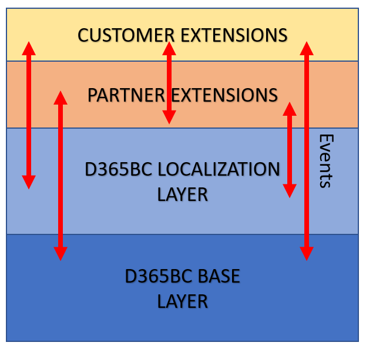

事件本质上是一个由代码触发的函数，当业务流程中发生某些事情时该函数会被调用。这个函数通常定义为*事件发布者*函数。它仅包含一个签名，并不会执行任何代码。包含事件发布者函数的对象被定义为*发布者*。

在 Dynamics 365 Business Central 中，事件根据以下类型进行分类：

+   **数据库事件**：这些是在对表对象进行数据库操作（如插入、修改、删除和重命名）时由系统自动触发的事件。

+   **页面事件**：这些是在页面对象中执行操作时由系统自动触发的事件。

+   **业务事件**：这些是由 C/AL 代码触发的自定义事件。业务事件定义了一个正式契约，并隐含承诺在未来的应用程序版本中不进行更改。

+   **集成事件**：这些是由 C/AL 代码触发的自定义事件。它们与业务事件类似，但在应用程序的未来版本中，它们的签名可能会发生变化。

+   **全局事件**：这些是由应用程序触发的系统事件。

当事件被发布并由代码触发时，它将可供应用程序订阅。*订阅者*是一个代码功能，它监听并处理已发布的事件。它订阅一个特定的事件发布器功能，并通过向其中添加自定义业务逻辑来处理该事件。当应用程序触发事件时，订阅者功能会自动被调用，并执行其代码。

请记住，你可以有多个订阅者订阅同一个事件发布器功能。在这种情况下，订阅者执行的顺序是无法确定的（是随机的），因此在设计代码时要小心事件链的顺序。

事件确保你可以与标准业务流程交互或修改其行为，而无需更改基础代码。

Dynamics 365 Business Central 在其标准代码中暴露了大量事件，并且每月都会添加新的事件。你可以通过以下链接请求新的事件：[`github.com/Microsoft/ALAppExtensions/issues`](https://github.com/Microsoft/ALAppExtensions/issues)。要获得 Dynamics 365 Business Central 中已发布事件的完整概览，建议你查看以下 GitHub 仓库：[`github.com/waldo1001/blog.CALAnalysis/tree/master/Published%20Events`](https://github.com/waldo1001/blog.CALAnalysis/tree/master/Published%20Events)。

在本节中，我们学习了事件是每个 AL 扩展的基本构建块。在下一节中，我们将概述可用的 AL 对象，并学习如何使用 AL 语言扩展创建它们。

# 理解 AL 语言的基础

Dynamics 365 Business Central 的扩展是使用**AL 语言**编写的。使用 AL 语言，你可以创建新对象、扩展标准对象，并为你的应用程序创建自定义业务逻辑。

你通过使用 Visual Studio Code 作为开发环境，并使用 AL 语言扩展（如我们在第二章中描述的，*掌握现代开发环境*）来为 Dynamics 365 Business Central 创建扩展。安装后，你将获得完整的 AL 项目开发支持。

所有 Dynamics 365 Business Central 功能都作为对象进行编码（新对象或标准对象的扩展），这些对象在`.al`文件中定义。一个`.al`文件可以定义多个对象（尽管我们不推荐这样做）。

扩展程序随后被编译为`.app`包文件，这个文件就是你在最终环境中发布的扩展。

截至目前，AL 语言扩展对于 Visual Studio Code 提供了以下对象：

+   表对象

+   表扩展对象

+   页面对象

+   页面扩展对象

+   代码单元对象

+   报表对象

+   枚举对象

+   XMLport 对象

+   查询对象

+   控件附加组件（JavaScript）

+   配置文件和页面自定义

我们将在接下来的章节中详细查看主要对象。其中一些对象（如报告、页面自定义和附加组件）将在后续章节中介绍。

AL 语言扩展包含了许多用于定义对象和处理语言任务的代码片段。主要的标准代码片段如下：

+   **对象**：

    +   `tpagecust`: 标准页面的新自定义

    +   `tpageext`: 标准页面的新扩展

    +   `ttableext`: 标准表的新扩展

    +   `tquery`: 新查询

    +   `treport`: 新报告

    +   `txmlport`: 新的 xmlport

    +   `tpage`: 在这里，我们可以选择是获取一个新的列表还是一个新的卡片

    +   `tcodeunit`: 新代码单元

+   **代码**：

    +   `tcaseelse`: 带有 else 的 Case 语句

    +   `tcaseof`: 没有 else 的 Case 语句

    +   `tfor`: For 语句

    +   `tforeach`: Foreach 语句

    +   `tif`: 带有 begin 和 end 的 If 语句

    +   `tifelse`: 带有 begin 和 end else 的 If 语句

    +   `tisempty`: 带有 begin 和 end 的 Isempty 语句

    +   `tisemptyelse`: 带有 begin end else 的 Isempty 语句

    +   `trepeat`: 带有 begin 和 end 子句的重复循环

    +   `twhile`: While 语句

    +   `twith`: With 语句

+   **配置文件**：

    +   `tprofile`: 允许我们创建一个带有页面自定义的新的配置文件

+   **事件**：

    +   `teventbus`: 允许我们创建一个业务事件

    +   `teventint`: 允许我们创建一个集成事件

    +   `teventsub`: 允许我们创建一个订阅者事件

+   **字段和键**：

    +   `tfield`: 新字段，无类型（我们需要手动填写一个类型）。

    +   `tfieldbiginteger`: 大整数类型。

    +   `tfieldboolean`: 布尔字段。

    +   `tfieldblob`: Blob 字段。

    +   `tfieldcode`: 代码字段。你只需要设置字段的长度。

    +   `tfielddate`: 日期字段。

    +   `tfielddateformula`: 日期公式字段。

    +   `tfielddatetime`: 日期时间字段。

    +   `tfielddecimal`: 十进制字段。

    +   `tfieldduration`: 持续时间字段。

    +   `tfieldguid`: GUID 字段。

    +   `tfieldoption`: 选项字段。在这种情况下，`OptionMember`属性会自动添加。

    +   `tfieldrecorid`: RecordID 字段。

    +   `tfieldtext`：文本字段。你只需要输入字段的长度。

    +   `tfieldtime`：时间字段。

    +   `tkey`：向表中添加一个新键。

+   **页面上的字段和操作**：

    +   `tfieldpage`：向页面添加一个字段。

    +   `taction`：向页面添加一个操作。

+   **触发器**：

    +   `ttrigger`：创建触发器定义。

    +   `tprocedure`：创建过程定义。

在 Visual Studio Code 中安装 AL 语言扩展后，你可以通过转到“视图” | “命令面板”并选择 AL:Go!来启动一个新的 AL 项目。

Visual Studio Code 会要求你提供一个文件夹，以便它可以在其中创建项目，然后要求你选择目标平台（Dynamics 365 Business Central 版本）。选择 4.0 Business Central 2019 版本第二波发布：

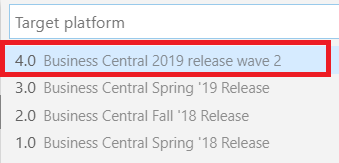

现在，Visual Studio Code 将为你配置项目。它会创建`launch.json`文件，以便你可以连接到开发环境，以及带有扩展清单文件的`app.json`文件（如第二章，*掌握现代开发环境*所述）。

现在，你可以开始定义组成你解决方案的对象。

# 表定义

使用 AL 扩展，你没有图形化工具来设计表（就像我们以前在 CSIDE 中做的那样）；相反，你需要使用代码来创建表。

可以通过使用`ttable`代码段创建一个表定义：

```
table id MyTable
{    
    DataClassification = ToBeClassified;

    fields
    {
        field(1;MyField; Integer)
        {
            DataClassification = ToBeClassified;          
        }
    }   

    keys
    {
        key(PK; MyField)
        {
            Clustered = true;
        }
    }

    var
        myInt: Integer;

    trigger OnInsert()
    begin

    end;

    trigger OnModify()
    begin

    end;

    trigger OnDelete()
    begin

    end;

    trigger OnRename()
    begin

    end;

}
```

要定义一个表，你需要指定一个*ID*（必须在应用程序中唯一）和一个*名称*（也必须是唯一的）。然后，你可以设置表的属性（使用*Ctrl* + 空格键来发现所有可用属性）：

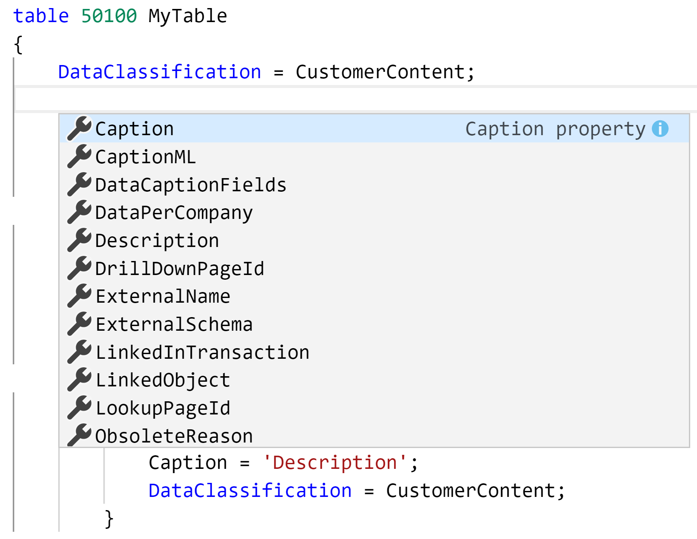

一个表对象具有以下主要属性：

+   `Caption`：标识表在用户界面中显示的字符串。

+   `DataCaptionFields`：设置在显示此表内容的页面中，位于标题左侧的字段。

+   `DataPerCompany`：设置一个值，指示表数据是适用于数据库中的所有公司，还是仅适用于当前公司（当默认值为`true`时，数据仅适用于当前公司）。

+   `DrillDownPageID`：设置用作下钻的页面 ID。

+   `LookupPageID`：设置用作查找的页面 ID。

+   `LinkedObject`：仅适用于本地部署；它指定一个指向 SQL Server 对象的链接。

+   `Permissions`：设置对象是否具有执行某些操作所需的额外权限，这些操作适用于一个或多个表。

+   `TableType`：指定表的类型（普通、CRM、ExternalSQL、Exchange 或 MicrosoftGraph）。

+   `ExternalName`：当你在`TableType`属性中指定 CRM 或 ExternalSQL 时，此属性出现，并指定外部数据库中原始表的名称。

+   `ExternalSchema`：当你在`TableType`属性中指定 CRM 或 ExternalSQL 时，此属性出现，并指定外部数据库中数据库架构的名称。

+   `ReplicateData`: 指定表是否必须复制到云服务（默认值为 true）。

+   `Extensible`: 设置对象是否可以扩展。

表对象包含一组字段。表的字段可以通过使用 `tfield` 代码段创建：

```
field(id; MyField; Blob)
{
    DataClassification = ToBeClassified;
    FieldPropertyName = FieldPropertyValue;
}
```

字段由 *ID*（必须在声明表及其所有扩展中唯一）、*名称*（也必须在声明表及其所有扩展中唯一）和 *类型*（字段的数据类型）定义。

建议始终设置 `Caption` 属性（对于表和字段），并将 `DataClassification` 属性（用于定义 GDPR 法规的数据敏感性）设置为除 `ToBeClassified` 以外的值。字段可以具有其特定的属性，您可以根据需要进行设置（如以下屏幕截图所示的可选属性）：

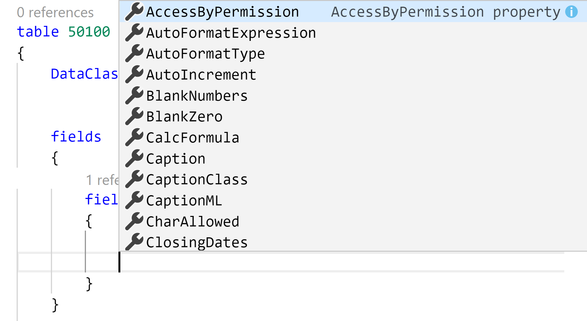

表还包含一组 *键*。您可以使用 `tkey` 代码段定义键：

```
key(MyKey; MyField)
{

}
```

表的键由 *名称* 和组成键的 *字段*（以逗号分隔的表字段列表）定义。如果表的主键是该键，则键可以将 `Clustered` 属性设置为 `true`。聚集索引是一种特殊类型的索引，它重新排序表中记录的物理存储方式，因此一个表只能有一个聚集索引。

表还可以具有触发器（`OnInsert`、`OnModify`、`OnDelete` 和 `OnRename`），在表内部，您可以定义自己的方法。

# 页面对象定义

页面对象是您在 Dynamics 365 Business Central 中为用户提供的用户界面。您可以使用 `tpage` 代码段在 AL 中定义页面对象：

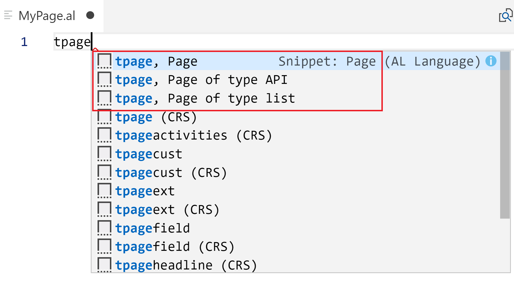

前三个选项允许您创建以下页面类型：

+   `Card` 页面

+   `API` 页面

+   `List` 页面

`Card` 页面（第一个选项）定义如下：

```
page Id MyPage
{
    PageType = Card;
    ApplicationArea = All;
    UsageCategory = Administration;
    SourceTable = TableName;

    layout
    {
        area(Content)
        {
            group(GroupName)
            {
                field(Name; NameSource)
                {
                    ApplicationArea = All;                   
                }
            }
        }
    }

    actions
    {
        area(Processing)
        {
            action(ActionName)
            {
                ApplicationArea = All;           
                trigger OnAction()
                begin

                end;
            }
        }
    }

    var
        myInt: Integer;
}
```

`Card` 页面通过其 *ID* 和 *名称* 来标识（这两个值在应用程序内部必须唯一）。页面也有自己的属性。需要定义的主要内容如下：

+   `PageType`: 标识页面的类型。

+   `SourceTable`: 设置此页面的基础表。

+   `SourceTableView`: 设置您希望使用的键、排序顺序和过滤器，以确定呈现给用户的源表的视图。

+   `ApplicationArea`: 设置页面在 Business Central 应用程序中的可见性。标准值包括 All、Basic、Suite 和 Advanced。

+   `UsageCategory`: 设置网页客户端中搜索页面的部门列。

+   `Extensible`: 设置对象是否可以扩展。

页面有一个 `layout`（定义页面在 UI 中的外观）和一个 `actions` 部分（定义可用的菜单项，以便在页面内添加代码操作）。在布局内，您有一个内容区域，其中包含一组组，且每个组可以包含一个或多个页面字段。您可以使用 `tpagefield` 代码段在页面组中添加字段：

```
field(MyField; FieldSource)
{
    ApplicationArea = All
    FieldPropertyName = FieldPropertyValue;
}
```

页面上的字段通过*名称*（页面中的字段关键字）和*字段源*（页面字段的源表达式，对应底层表中定义的物理字段）来定义。

字段可以具有自己的属性，并且必须设置`ApplicationArea`。

`List`页面（第三种选项）定义如下：

```
page Id PageName
{
    PageType = List;
    ApplicationArea = All;
    SourceTable = TableName;

    layout
    {
        area(Content)
        {
            repeater(Group)
            {
                field(Name; NameSource)
                {
                    ApplicationArea = All;

                }
            }
        }

        area(Factboxes)
        {

        }
    }

    actions
    {
        area(Processing)
        {
            action(ActionName)
            {
                ApplicationArea = All;

                trigger OnAction();
                begin

                end;
            }
        }
    }
}
```

`List`页面的`PageType`属性设置为`List`，并且`layout`部分有`Content`区域和`FactBox`区域。`Content`区域包含一个`repeater`组，显示你希望在该列表上展示的所有字段。之后，你可以设置`actions`部分。

如果页面包含`repeater`控件（例如，`List`页面），你可以定义适用于整个页面或单个记录的操作。为此，操作有一个名为**Scope**的属性，可以定义为*页面*（操作位于页面级别）或`repeater`（操作位于记录级别）。

# 表扩展定义

正如我们之前提到的，在 Dynamics 365 Business Central 中，你不能修改现有表；相反，你需要创建一个表扩展。

可以使用`ttableext`片段定义表扩展：

```
tableextension Id MyExtension extends MyTargetTable
{
    fields
    {
        // Add changes to table fields here
    }

    var
        myInt: Integer;
}
```

`tableextension`对象通过*ID*和*名称*（必须是唯一的）以及必须扩展（或修改）的表来定义。然后，在字段组内部，你可以添加新字段或更改现有字段的属性。

以下代码是对标准`Customer`表的扩展示例，添加了一些新字段并更改了现有字段的属性：

```
tableextension 50100 CustomerExtSD extends Customer
{
    fields
    {
        field(50100; PacktEnabledSD; Boolean)
        {
            DataClassification = CustomerContent;
            Caption = 'Packt Subscription Enabled';
        }
        field(50101; PacktCodeSD; Code[20])
        {
            DataClassification = CustomerContent;
            Caption = 'Packt Subscription Code';
        }

        modify("Net Change")
        {
            BlankZero = true;
        }
    }   
}
```

在`tableextension`对象中，你还可以通过添加*keys*组来向扩展的表添加新键，就像在表定义中一样。例如，在我们之前的`tableextension`对象中，我们添加了两个新字段，并且我们还希望在这些字段上创建一个二级键。我们可以创建一个`key`组，定义键名和键字段：

```
tableextension 50100 CustomerExtSD extends Customer
{
    fields
    {
        field(50100; PacktEnabledSD; Boolean)
        {
            DataClassification = CustomerContent;
            Caption = 'Packt Subscription Enabled';
        }
        field(50101; PacktCodeSD; Code[20])
        {
            DataClassification = CustomerContent;
            Caption = 'Packt Subscription Code';
        }
        modify("Net Change")
        {
            BlankZero = true;
        }
    }

    keys
    {
       key(PacktKey; PacktCodeSD,PacktEnabledSD)
       {

       }
    }
}
```

你不能基于新字段或标准字段创建键，也不能在扩展的表中修改现有键。

在这里，我们在`Customer`表中定义了一个名为`PacktKey`的二级键，它由两个自定义字段（`PacktCodeSD`和`PacktEnabledSD`）组成。定义二级键对于提高某些计算、排序记录和报告的性能非常有用。

# 页面扩展定义

与表一样，在 Dynamics 365 Business Central 中，你不能直接修改现有页面；相反，你需要创建一个页面扩展（使用 AL 中的`pageextension`对象）。

可以使用`tpageext`片段定义`pageextension`对象：

```
pageextension Id MyExtension extends MyTargetPage
{
    layout
    {
        // Add changes to page layout here
    }

    actions
    {
        // Add changes to page actions here
    }

    var
        myInt: Integer;
}
```

一个`pageextension`对象由*ID*和*名称*（必须唯一）以及必须扩展的页面定义。一个`pageextension`对象包含一个`layout`块（你可以在其中添加对标准页面布局的更改，如添加新字段或新部分，或更改标准字段）和一个`actions`块（你可以在其中添加新的操作）。

以下是一个`pageextension`对象的示例，其中我们向`Customer Card`页面添加了一个新字段（该字段被添加到`General`选项卡的末尾），并修改了现有字段（`Name`字段）的`Style`属性：

```
pageextension 50100 CustomerCardExtSD extends "Customer Card"
{
    layout
    {
        addlast(General)
        {
            field(PacktEnabledSD; PacktEnabledSD)
            {
                ApplicationArea = All;               
            }
        }

        modify(Name)
        {
            Style = Strong;
        }
    }       
}
```

如你所见，我们已向页面添加了一个字段，并修改了`Name`字段的`Style`属性，使其显示为粗体。请记住，并非所有可用的字段属性都可以通过`pageextension`对象进行修改。

# 代码单元定义

代码单元是 AL 代码的容器，这些代码可以通过直接执行代码单元（使用`OnRun`触发器）或通过调用代码单元中定义的函数来触发。

我们可以通过使用`tcodeunit`片段在 AL 中定义代码单元：

```
codeunit Id MyCodeunit
{
    trigger OnRun()
    begin

    end;

    var
        myInt: Integer;
}
```

代码单元由*ID*和*名称*（在你的应用程序中必须唯一）定义。默认情况下，代码单元框架只包含`OnRun`触发器的定义，在此触发器中，你可以编写希望在调用`Codeunit.RUN`方法时执行的代码。

代码单元有其自己的属性，你可以进行设置：

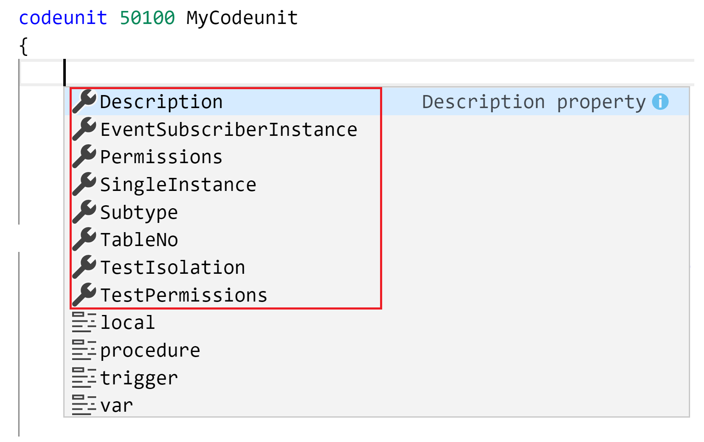

在代码单元中，你可以定义可以是本地或全局（即公开暴露给实例化该代码单元的对象）的过程（函数）。

你可以通过使用`tprocedure`片段来定义一个过程：

```
local procedure MyProcedure()
   var
        myInt: Integer;
    begin

    end;
```

默认情况下，这段代码创建了一个没有参数且没有返回值的本地过程。通过移除`local`关键字，你可以将作用域从本地（默认值，意味着它仅在声明该过程的对象内部可见）更改为全局（使其在对象外部也可见）。

例如，这是一个带有参数和返回值的全局过程：

```
procedure CheckIfPacktCustomerIsEnabled(CustomerNo: Code[20]): Boolean
    var
     //Local variables here 
    begin
      //Method code here 
    end;
```

一个代码单元可以定义多个过程（本地或全局）。

# 事件定义

如前所述，事件是开发 Dynamics 365 Business Central 扩展时的基础构件。在处理事件时，我们有两个主要实体：事件*发布者*和事件*订阅者*。

一个**事件发布者**（由应用程序引发的事件）可以通过使用**teventbus**（用于业务事件）或**teventint**（用于集成事件）片段在 AL 中定义：

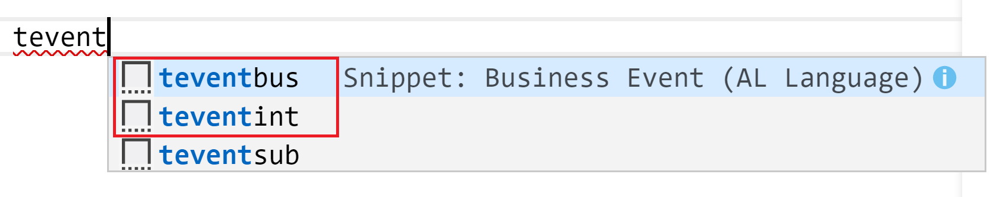

一个**业务事件**具有以下模式：

```
[BusinessEvent(IncludeSender)]
    local procedure MyProcedure()
    begin

    end;
```

在这里，`IncludeSender`是一个布尔值，指定包含事件发布者方法的对象中定义的全局方法是否对订阅此事件的事件订阅者方法可见（当全局方法必须可见时为`true`，默认为`false`表示不可见）。

当`IncludeSender`参数设置为`true`时，订阅此发布事件的事件订阅者方法的签名将自动包含一个`VAR`参数（引用值），用于发布事件对象。

**集成事件**具有以下结构：

```
[IntegrationEvent(IncludeSender,GlobalVarAccess)]
    local procedure MyProcedure()
    begin

    end;
```

在这里，`IncludeSender`布尔参数与我们之前描述的意义相同。

`GlobalVarAccess`是一个布尔参数，指定是否可以访问包含事件发布者方法的对象中定义的全局变量，供订阅此发布事件的事件订阅者方法使用（当需要暴露时为`true`，默认值为`false`表示不可访问）。

当`GlobalVarAccess`参数设置为`true`时，所有订阅此事件的事件订阅者方法都将能够访问事件发布者方法所在对象中的全局变量。你必须手动将变量参数添加到事件订阅者方法，并且需要使用与事件发布者对象中的变量声明匹配的名称和类型。

在事件发布者（你之前定义的方法）发布事件后，你需要在代码中适当的位置触发该事件（事件订阅者在应用程序代码中触发事件之前不会响应该事件）。

作为示例，以下是一个包含公共方法的代码单元，该方法触发业务事件和集成事件：

```
codeunit 50100 MyCodeunit
{
    procedure CheckIfPacktCustomerIsEnabled(CustomerNo: Code[20]): Boolean
    begin
        //Raising a business event
        MyBusinessEvent('XXX');

        //Other code here...

        //Raising an integration event
        MyIntegrationEvent('YYY'); 
    end;

    [BusinessEvent(true)]
    local procedure MyBusinessEvent(ID: Code[20])
    begin
    end;

    [IntegrationEvent(true,true)]
    local procedure MyIntegrationEvent(ID: Code[20])
    begin
    end;      

    //Global variables
    var
        myInt: Integer;
        Customer: record Customer;
}
```

**事件订阅者**（处理应用程序中已触发事件的函数）可以使用`teventsub`代码片段声明：

```
[EventSubscriber(ObjectType::ObjectType, ObjectID, 'OnSomeEvent', 'ElementName', SkipOnMissingLicense, SkipOnMissingPermission)]
local procedure MyProcedure()    
begin

end;
```

从上述代码中，我们可以看到以下内容：

+   `ObjectType`是一个枚举，标识发布事件以供订阅的对象类型（包含事件发布者方法的对象），或触发事件以供订阅的对象类型。

+   `ObjectId`是一个整数值，指定发布事件以供订阅的对象的 ID（声明时不要使用 ID，而是使用`ObjectType::Name`语法）。

+   `OnSomeEvent`是一个文本参数，指定由`ObjectId`参数标识的对象中发布事件的方法的名称。

+   `ElementName`是一个文本参数，用于数据库触发事件。它指定触发事件相关的表字段。

+   `SkipOnMissingLicense` 是一个布尔参数，用于指定当运行当前会话的用户帐户的 Dynamics 365 Business Central 许可证未包含对包含订阅者方法的对象的权限时，事件订阅者方法会发生什么（`true` 表示方法调用必须被忽略，`false` 表示必须抛出错误并停止代码执行）。

+   `SkipOnMissingPermission` 是一个布尔参数，用于指定当运行当前会话的用户帐户没有对包含事件订阅者方法的对象的权限时，订阅者方法会发生什么（`true` 表示方法调用必须被忽略，`false`（默认值）表示必须抛出错误并停止代码执行）。

作为一个示例，这是一个代码单元，包含我们在前面示例中定义的业务事件和集成事件的两个事件订阅者：

```
codeunit 50101 MySubscriberCodeunit
{
    [EventSubscriber(ObjectType::Codeunit, Codeunit::MyCodeunit, 'MyBusinessEvent', '', false, false)]
    local procedure MyBusinessEventSubscriber(ID: Code[20])
    begin

    end;

    [EventSubscriber(ObjectType::Codeunit, Codeunit::MyCodeunit, 'MyIntegrationEvent', '', false, false)]
    local procedure MyIntegrationEventSubscriber(ID: Code[20])
    begin

    end;   
}
```

在定义事件订阅者时，如果你在事件参数上按 *Ctrl* + 空格键，你将看到事件可以与之交互的对象列表（由发布者暴露）。在我们的示例中，业务事件订阅者可以看到事件参数和发送者对象（因为我们已将事件发布者声明为`IncludeSender`设置为`true`），如下所示：

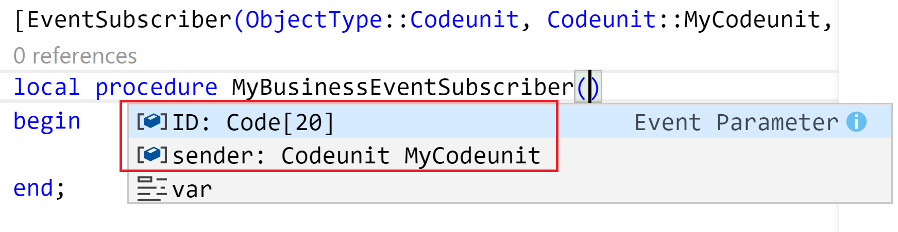

集成事件订阅者可以看到事件参数、发送者对象（因为我们已将事件发布者声明为`IncludeSender`设置为`true`），以及发送者对象的全局变量（因为我们已将事件发布者声明为`GlobalVarAccess = true`）：

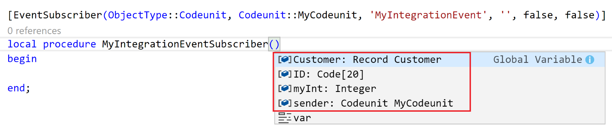

使用事件时，始终记住以下几点：

+   当调用事件发布者方法的代码运行时，所有订阅该事件的事件订阅者方法都会被执行。

+   如果有多个订阅者，订阅者方法将按随机顺序逐一运行（无法指定订阅者方法调用的顺序）。

+   如果没有订阅发布事件的订阅者，那么调用事件发布者方法的代码行将被忽略，并且不会执行。

# XMLport 定义

**XMLport** 是用于在外部源与 Dynamics 365 Business Central 之间导入和导出 XML 或基于文本的数据的对象。

可以使用 `txmlport` 代码片段在 AL 中定义一个 XMLport：

```
xmlport Id MyXmlport
{
    schema
    {
        textelement(NodeName1)
        {
            tableelement(NodeName2; SourceTableName)
            {
                fieldattribute(NodeName3; NodeName2.SourceFieldName)
                {

                }
            }
        }
    }

    requestpage
    {
        layout
        {
            area(content)
            {
                group(GroupName)
                {
                    field(Name; SourceExpression)
                    {

                    }
                }
            }
        }

        actions
        {
            area(processing)
            {
                action(ActionName)
                {

                }
            }
        }
    }

    var
        myInt: Integer;
}
```

作为一个示例，这是一个简单的 XMLport 定义，用于导入一些客户数据（`No.` 和 `Name` 字段）：

```
xmlport 50100 MyXmlportImportCustomer
{
    Direction = Import;
    schema
    {
        textelement(NodeName1)
        {
            tableelement(Customer; Customer)
            {
                fieldattribute(No; Customer."No.")
                {

                }
                fieldattribute(Name; Customer.Name)
                {

                }
            }
        }
    }  
}
```

`xmlport` 对象的 `Direction` 属性设置为 `Import`（仅用于将数据导入 Dynamics 365 Business Central），并从名为 `Customer` 的 XML 对象中读取 `No` 和 `Name` 字段。

# 定义查询对象

`query` 对象允许你定义一个对象，可以通过应用过滤器和在表之间建立连接，从一个单独的表或多个表中检索数据。返回的结果是一个单一的数据集。

你可以通过使用`tquery`代码片段在 AL 中创建查询：

```
query Id MyQuery
{
    QueryType = Normal;

    elements
    {
        dataitem(DataItemName; SourceTableName)
        {
            column(ColumnName; SourceFieldName)
            {

            }
            filter(FilterName; SourceFieldName)
            {

            }
        }
    }

    var
        myInt: Integer;

    trigger OnBeforeOpen()
    begin

    end;
}
```

如你所见，`query`对象有一个`elements`部分，在该部分内，你定义了一个`dataitem`及其必须检索的`column`元素（要包含在结果数据集中的表字段）。

你还可以在`dataitems`之间创建链接，以从多个表中检索数据。

作为示例，以下是一个`query`对象，它已在 AL 中定义，用于检索客户列表及其销售和利润数据：

```
query 50100 "Customer Overview"
{
    Caption = 'Customer Overview';
    elements
    {
        dataitem(Customer; Customer)
        {
            column(Name; Name)
            {
            }
            column(No; "No.")
            {
            }
            column(Sales_LCY; "Sales (LCY)")
            {
            }
            column(Profit_LCY; "Profit (LCY)")
            {
            }
            column(Country_Region_Code; "Country/Region Code")
            {
            }
            column(City; City)
            {
            }          
            column(Salesperson_Code; "Salesperson Code")
            {
            }

            dataitem(Salesperson_Purchaser; "Salesperson/Purchaser")
            {
                DataItemLink = Code = Customer."Salesperson Code";
                column(SalesPersonName; Name)
                {
                }
                dataitem(Country_Region; "Country/Region")
                {
                    DataItemLink = Code = Customer."Country/Region Code";
                    column(CountryRegionName; Name)
                    {
                    }
                }
            }
        }
    }
}
```

查询循环遍历`Customer`表，然后（对于每个客户）从在`DataItemLink`属性中指定的其他表中检索数据。

查询对象在代码中非常有用和强大，用于检索记录。你可以通过查询对象解决的第一个基本问题是避免在从关联表（联接）中检索数据时使用嵌套循环。如果你有一个通过外键与`Table1`关联的`Table2`，那么你可以使用查询对象，避免通过循环遍历`Table1`并为每个记录去`Table2`检索相关数据，可以应用以下图示所描述的模式：

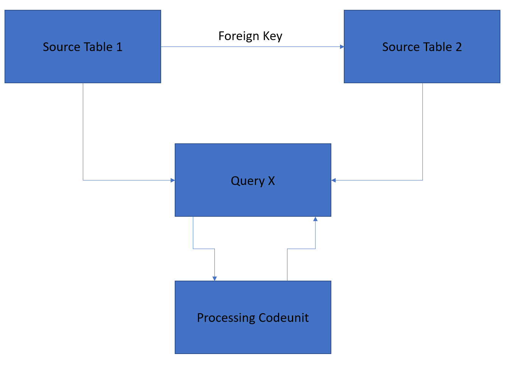

在这里，你可以定义一个查询，它返回两个表的完整过滤联接，然后你可以循环遍历由查询对象返回的记录集（这只需要一个循环）。

如果（例如）我们想在代码中使用之前定义的`Customer Overview`查询，那么我们需要在 AL 中这样做：

```
procedure UseCustomerOverviewQuery()
    var
        CustomerOverview: Query "Customer Overview";
    begin
        if not CustomerOverview.Open() then
            exit;
        while CustomerOverview.Read() do
        begin
            //Here we have all joined records to loop
        end;
    end;
```

在这里，我们通过调用`Open`方法执行查询对象，然后通过使用`Read`方法循环遍历返回的数据集。在循环内，你将获得查询返回的完整记录（主表和已联接的表），并且可以根据需要处理这些数据。

# 扩展选项 – 枚举

**选项**类型的字段在 Dynamics 365 Business Central 中用于定义一个提供固定且预定义值列表的字段。

当你定义一个选项字段时，你可以通过以下方式定义该字段的允许值：

```
field(5; LicenseType; Option)
{            
    OptionMembers = " ","Full","Limited";
    OptionCaption = ' ,Full,Limited';
    Caption = 'License Type';
    DataClassification = CustomerContent;
}
```

在前面的代码中，我们可以看到`OptionMembers`属性包含了字段的预定义值。在这里，许可证类型字段包含三个值（空白、完整、限制），其中空白（第一个值）是默认值。

但是，如果你想扩展这些选项，例如，添加一个新的许可证类型叫做*Teams*，该怎么办呢？这是不可能的！选项字段不能扩展。

为了创建一个可扩展的选项字段，AL 引入了`enum`对象。一个*enum*是由一组命名常量组成的类型，并且如果你将`Extensible`属性设置为`true`，它可以从其他扩展中进行扩展，如下所示：

```
enum 50100 LicenseType
{
  Extensible = true;
  value(0; None) { }
  value(1; Full) { }
  value(2; Limited) { }  
}
```

你可以按照以下方式定义一个字段，使其具有`enum`类型：

```
field(50100; LicenseType; enum LicenseType)     
{
    Caption = 'License Type';
    DataClassification = CustomerContent;
}
```

这使得你能够定义一个字段，它的行为与选项相同：当用户点击该字段时，Dynamics 365 Business Central 会展示一个可供选择的值列表。

要从另一个扩展中扩展 `enum` 字段并添加一个新的可能值 `Team`，你需要创建一个 `enumextension` 对象，具体如下：

```
enumextension 50110 LicenseTypeEnumExt extends LicenseType
{
  value(50110; Team)
  {
    Caption = 'Team License';
  }
}
```

之后，你的 `License Type` 字段将有一个新的选项值可以选择。

你还可以直接在 AL 代码中使用 `enum` 对象（作为变量）：

```
var
    LicenseType: enum LicenseType;
begin
    case LicenseType of
        LicenseType::Full:
              //Write your code here…
```

你还可以扩展 `enum` 值的 `TableRelation` 属性。例如，假设你有以下表格：

```
table 50120 LicenseDetail
{
  fields
  {
     field(1; Id; Integer) { }
     field(2; LicenseType; enum LicenseType) { }
     field(3; LicenseDetail; Code[20])
     {
        TableRelation =
        if (LicenseType = const (Full)) FullLicenseTable
        else if (LicenseType = const (Limited)) LimitedLicenseTable;
    }
  }
}
```

在这个表中，我们有一个名为 `LicenseType`（这是一个 `enum` 类型）的字段，以及一个名为 `LicenseDetail` 的字段，它有一个 `tablerelation` 属性（指向 `FullLicenseTable` 和 `LimitedLicenseTable` 表），其基于 `enum` 字段的值。

另一个应用程序可以同时扩展 `enum` 字段和表关系，这样它就可以处理新的扩展枚举。以下是一个示例：

```
enumextension 50110 LicenseTypeEnumExt extends LicenseType
{
  value(50110; Team)
  {
    Caption = 'Team License';
  }
}

tableextension 50110 LicenseDetailExt extends LicenseDetail
{
  fields
  {
    modify(LicenseDetail)
    {
      TableRelation = if (LicenseType = const (Team)) TeamLicenseTable;
    }
  }
}
```

在这里，新应用程序创建了 `LicenseType` 的枚举扩展（如我们之前所述），并创建了一个新的 `tableextension` 对象，在这个对象中，它通过添加一个新的关系来修改 `LicenseDetail` 字段的 `TableRelation` 属性，当 `enum` 的值为 `Team` 时，关联一个 `TeamLicenseTable`。

合并后的 `TableRelation` 始终从上到下进行评估，因此第一个无条件的关系将优先。这意味着，如果原字段与表 A 有关系，你无法将其 `TableRelation` 从表 A 更改为表 B。

通过使用 `enums`，你可以扩展所有选项的值。如果你希望具有可扩展性，我们建议在你的扩展中使用这种新方法。

在这一部分，你已经全面了解了 AL 语言扩展中的可用对象。在下一部分，我们将学习一些创建和处理 AL 项目时的最佳实践。

# 创建一个配置文件对象

一个 `profile` 对象使你能够定义特定用户配置文件的用户体验（主页）。你可以通过使用 AL 语言扩展中的 `tprofile` 代码片段来创建一个 `profile` 对象。

一个配置文件对象的定义如下所示：

```
profile "SALES MANAGER"
{
  Caption = 'Sales Manager';
  ProfileDescription = 'Functionality for sales managers';
  RoleCenter = 9005;
  Enabled = false;
}
```

在这里，我们定义了一个名为 **Sales Manager** 的配置文件，它使用 `RoleCenter` 页面，`ID = 9005`（这是 Dynamics 365 Business Central 中的标准销售经理角色中心对象）。

要从你的扩展中部署一个 `profile` 对象，我建议在你的 AL 项目中创建一个 `Profile` 文件夹，并将所有定义配置文件的 `.al` 文件放在该文件夹内。

# 理解 AL 项目结构的最佳实践

正如我们之前提到的，AL 项目是基于文件的。你所有的 `.al` 文件都位于一个项目文件夹中。当你开始处理一个复杂项目时，最常遇到的问题就是如何组织项目。我们该如何组织对象和 `.al` 文件呢？

这个话题没有书面规则。我们真诚地建议避免将所有对象（`.al` 文件）放在项目根目录级别，如下图所示：

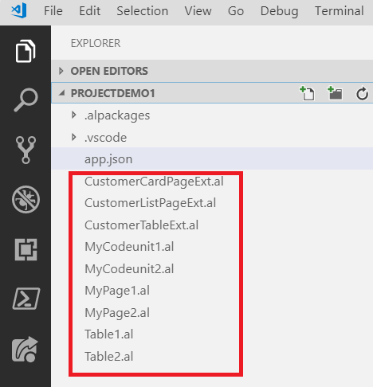

在这里，没有对对象进行任何组织，如果您有大量对象，您的对象列表将会增长很多，导致处理和查找文件时遇到困难。

组织项目的最常见方式是按对象类型组织文件，如下图所示：

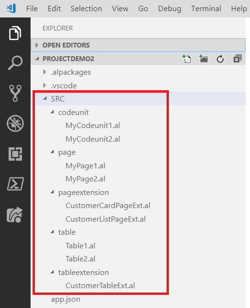

这里，所有扩展的代码都在 `SRC` 文件夹内。然后，所有对象按类型进行组织，根据我们定义的对象（每种对象类型都有一个子文件夹）。这种组织方式使得查找对象更容易（只需进入相应的对象类型文件夹），但是这种项目结构有一个缺点：不容易识别出我们需要哪些对象来实现扩展项目中的特定业务功能。

我们建议先按功能组织项目树，再按对象类型组织，如下图所示：

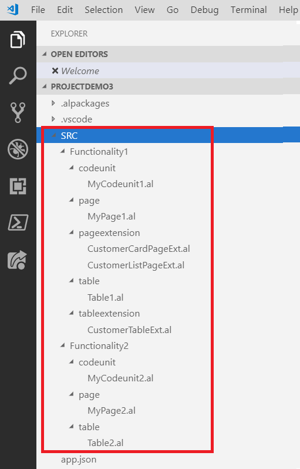

这里，在 `SRC` 文件夹中，有两个子文件夹：`Functionality1` 和 `Functionality2`。在这些文件夹中，对象按类型组织。这是我们推荐的工作方式，这种结构有助于我们按功能查找对象。

在接下来的章节中，我们将学习如何在 AL 中命名对象，以及如何使用对象范围。

# 命名规范和 AL 对象范围

在为 Dynamics 365 Business Central 创建扩展时，您需要为对象分配一个数字 ID。分配对象 ID 的规则如下：

| **范围** | **用途** |
| --- | --- |
| 0 – 49,999 | Business Central 基础应用程序。合作伙伴不能使用此范围。 |
| 5,0000 – 99,999 | 每租户扩展（希望根据客户的个别需求定制已交付解决方案的经销商）。 |
| 80,000 – 99,999 | 需要在开发许可证中修改权限的扩展对象。 |
| 100,000 – 999,999 | 用于为特定国家或地区本地化 Dynamics 365 Business Central。合作伙伴不能使用此范围。 |
| 1,000,000 – 69,999,999 | **注册解决方案计划** (**RSP**) 范围。 |
| 70,000,000 – 74,999,999 | Business Central SaaS 应用程序（AppSource）。 |

关于文件命名，每个 `.al` 文件名必须以相应的对象类型前缀和对象 ID 开头，并且只能使用字符 [`A-Za-z0-9`]。文件命名规则（对于 `AppSource` 是强制要求的）应该如下所示：

+   完整对象：`<ObjectNameExcludingPrefix>.<FullTypeName>.al`

+   扩展对象：`<ObjectNameExcludingPrefix>.<FullTypeName>Ext.al`

对于每种对象类型，您可以使用以下缩写（前缀）：

| **对象类型** | **缩写（前缀）** |
| --- | --- |
| 页面 | `Page` |
| 页面扩展 | `PageExt` |
| 页面自定义 | `PageCust` |
| 代码单元 | `Codeunit` |
| 表 | `Table` |
| 表扩展 | `TableExt` |
| XML 端口 | `Xmlport` |
| 报告 | `Report` |
| 查询 | `Query` |
| 枚举 | `Enum` |
| 枚举扩展 | `EnumExt` |

例如，以下是一些 AL 对象及其对应的文件名：

+   表 50100 *书籍* 应命名为 `Book.Table.al`

+   页面 50100 *书籍卡片* 应命名为 `BookCard.Page.al`

+   代码单元 50110 *书籍管理* 应命名为 `BookManagement.Codeunit.al`

+   页面扩展 50101 `MyCustomerCardExt`，扩展 `客户卡片`，应命名为 `CustomerCard.PageExt.al`

您还应该使用前缀/后缀来标识您的对象（由 Microsoft 为您保留，如下文所述）。这使您能够在扩展之间为对象命名一个唯一的方式，从而避免命名冲突。

使用前缀/后缀的规则如下：

+   前缀/后缀必须至少为三个字符。

+   对象/字段名称必须以前缀/后缀开始或结束。

+   当您使用表扩展或页面扩展修改核心 Dynamics 365 对象时，前缀/后缀必须在控件/字段/操作/组级别定义。

+   使用标题处理您想要在 UI 中显示的标签。

例如，如果您已保留 `PACKT` 前缀，并且想要创建一个名为 `CustomerCategory` 的字段，则可以使用以下有效字段名：

+   `PACKTCustomerCategory`

+   `CustomerCategoryPACKT`

+   `CustomerCategory_PACKT`

+   `CustomerCategory PACKT`

如果您想创建 *客户类别* 表，表对象的有效名称如下：

+   表 70000000 `PACKT 客户类别`

+   表 70000000 `Customer Category PACKT`

+   表 70000000 `Customer Category_PACKT`

使用保留名称作为前缀或后缀完全由您选择。我们建议将其用作后缀，因为在 Visual Studio IntelliSense 中查找字段更自然（如果您在 UI 中看到的字段是客户类别，输入这些词会呈现实际字段名称及其后缀）。

这些指南对于 AppSource 是强制性的，但对于您的每租户扩展并非强制执行。我们的建议是始终遵循这些指南。

要为您的对象注册前缀/后缀，您需要发送电子邮件到 `d365val@microsoft.com`，并指定您希望为应用保留的名称。请记住，前缀/后缀应该是基于应用的，而不是基于公司的。

# AL 编码指南工作中

在创建 AL 项目（和 `.al` 文件）时，请记住始终遵循这些主要指南。

在 `.al` 代码文件中，所有对象的结构必须遵循以下顺序：

+   属性

+   特定对象结构：

    +   表字段

    +   页面布局

    +   操作

+   全局变量：

    +   标签（旧文本常量）

    +   全局变量

+   方法

请记住，始终通过对象名称而非对象 ID 来引用 AL 对象。例如，以下是如何引用 `Record` 变量或 `Page` 变量：

```
Vendor: Record Vendor;
Page.RunModal(Page::"Customer Card", ...);
```

在事件订阅者对象中，应该这样引用发布者对象：

```
[EventSubscriber(ObjectType::Codeunit, Codeunit::MyCodeunit, 'MyIntegrationEvent', '', false, false)]
local procedure MyIntegrationEventSubscriber()
begin
end;
```

那么，让我们总结一下：

+   **格式化你的 AL 代码**：注意缩进和空格（它保持代码的可读性）。你可以使用 *Alt* + *Shift* + *F* 来自动格式化代码。

+   **保持你的 .al 文件整洁**：使用代码片段时，它们会自动创建带有方法、属性、变量、触发器或你可能未使用的部分的对象骨架。请删除所有未使用的代码。一个典型的例子是表格上的触发器定义（如果你没有处理它们，可以删除）或对象中的全局变量（如果不删除，它们会导致你的应用充满 `myInt: integer` 变量）。

+   **方法声明**：尽量保持本地化。只有在需要将其暴露给其他对象时，才使用全局方法。

+   **使用事件触发业务逻辑，但** **不要在这些触发器中编写代码**：将大量代码放入触发事件中，就像把大量代码放入字段验证触发器中一样。应识别你的方法并从触发事件中调用它们。

对于复杂代码，你可以开始使用 *通用方法* 模式：

+   在其类（表格）中声明每个方法。

+   每个方法都是一个独立的代码单元（封装）。

+   仅从其类（表格/代码单元）中调用方法。

+   每个方法的代码单元只有一个全局函数。

+   本地函数包括以下类别（按此顺序）：

    1.  主函数（一个函数；以可读流程图形式呈现的方法头）

    1.  主要业务流程（多个函数）

    1.  UI 包装器（两个函数）

    1.  业务扩展（一个或多个函数提供可扩展性）

    1.  事件包装器（两个函数）

这是根据此模式组织的一些 AL 代码示例：

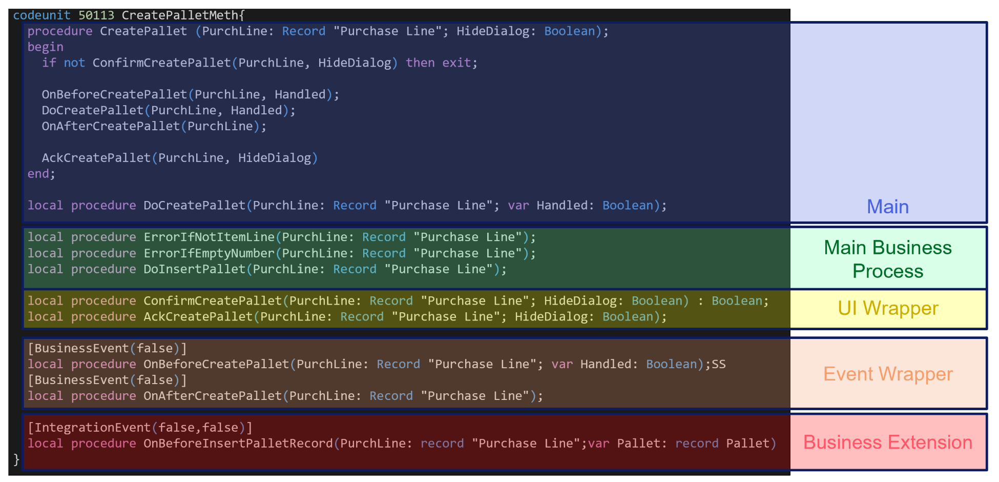

你可以在 [`docs.microsoft.com/en-us/dynamics365/business-central/dev-itpro/compliance/apptest-bestpracticesforalcode`](https://docs.microsoft.com/en-us/dynamics365/business-central/dev-itpro/compliance/apptest-bestpracticesforalcode) 上找到有关其他编码规则的更多信息。

遵守编码规则和指南对于提高代码可读性非常重要，而且这些规则中的许多是 AppSource 强制要求的。

# 总结

在本章中，我们探讨了使用 AL 语言进行扩展开发的基础知识，并概述了创建应用程序的主要对象（表格、页面、代码单元等）以及如何在 Visual Studio Code 中创建它们。接着，我们回顾了处理 AL 项目的最佳实践（项目组织、对象 ID、命名约定），并提供了编写更好代码的指南，重点关注我们扩展的可扩展性方面。

我们学习了如何创建对象，如何创建 AL 项目，如何处理其结构，以及如何遵守对象命名规范。

在下一章，我们将通过应用所有这些规则和最佳实践，为 Dynamics 365 Business Central 实现一个现实世界的扩展。
