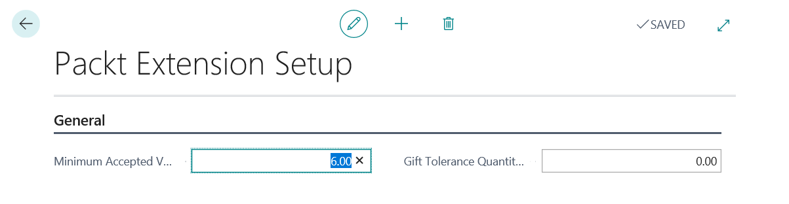
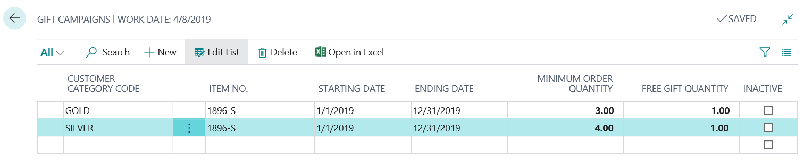
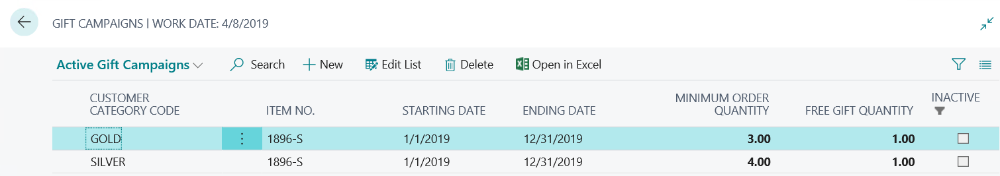

# 为 Dynamics 365 Business Central 开发定制化解决方案

在上一章中，我们学习了 Dynamics 365 Business Central 扩展开发的基本知识，并分析了创建扩展的所有构建模块，如事件和基本对象定义，以及如何扩展标准对象。

在本章中，我们将把所有这些概念结合起来，并为 Dynamics 365 Business Central 创建一个实际的扩展。这些扩展将按照**AppSource**的指导原则和最佳代码实践进行创建。

本章将涵盖以下主题：

+   将业务案例转化为实际扩展

+   理解依赖扩展

# 将业务案例转化为实际扩展

在本节中，让我们假设有一个拥有各种业务需求的 Dynamics 365 Business Central 客户。我们希望创建一个扩展来满足该客户的需求。

我们的客户是一家大型商业公司，已将 Dynamics 365 Business Central 作为公司 ERP，并且有多种业务需求，要求定制化标准功能以满足其需求。

业务需求如下：

+   销售：这些要求包括以下内容：

    +   该公司希望根据自定义类别对客户进行分类，这些类别可以根据需要定义，并且将来可以更改。每个`客户类别`必须有其详细信息，这些信息可以用于某些业务流程。

    +   销售部门必须能够创建默认的`客户类别`，并将此默认值自动分配给客户。

    +   销售部门需要能够为客户类别创建赠品活动。赠品活动与特定的时间段和一组限定的商品相关。

    +   赠品活动可以在某一段时间内设置为非活动状态。

    +   当赠品活动处于激活状态时，销售订单经理必须能够在客户的销售订单上自动分配赠品（他们需要在销售订单文档上有一个按钮，分析订单内容，检查是否有活动促销，并相应地创建赠品行）。

    +   当销售操作员插入销售订单行时，如果客户订购的商品数量接近于一个正在进行的活动促销，他们应该被提醒。

    +   当销售订单过账时，生成的商品账单条目必须存储`客户类别`值（订单生成时的值），以供报告使用。

+   供应商质量：这些要求包括以下内容：

    +   公司已实施质量管理流程（CSQ，国际商业质量认证机构），并需要根据其 CSQ 要求对供应商进行分类：

        +   与商品质量相关的评分（从 1 到 10）

        +   与按时交付相关的评分（从 1 到 10）

        +   与商品包装相关的评分（从 1 到 10）

        +   定价相关的评分（从 1 到 10）

    +   `供应商质量卡`还必须显示一些财务数据：

        +   本年度已开票 *N*

        +   本年度已开票 *N-1*

        +   开具 *N-2* 年度的发票

        +   此供应商的应付金额

        +   此供应商的应付金额（尚未到期）

    +   分配的分数根据算法确定供应商评分（一个数字值）。

    +   如果供应商不符合公司标准要求（供应商评分），采购部门不能发布采购订单。

    +   该应用的行为将来可能会扩展。

这些自定义将作为一个单一的扩展进行开发，使用每租户范围（50.000 – 99.999）。我们将使用 AppSource 规则，并使用 **PKT** 标签（已在 Microsoft 注册为我们的 AppSource 前缀/后缀）来定位所有对象。项目的 `.al` 文件将按照 AppSource 命名约定命名。

我们通过打开 Visual Studio Code 并创建一个新的扩展项目（查看 | 命令面板 | AL:GO!），选择 Wave 2 发布版本作为目标，开始我们的开发任务。

我们设置了扩展的清单文件（`app.json`），如下所示：

```
{
  "id": "dd03d28e-4dfe-48d9-9520-c875595362b6",
  "name": "PacktDemoExtension",
  "publisher": "SD",
  "brief": "Customer Category, Gift Campaigns and Vendor Quality Management",
  "description": "Customer Category, Gift Campaigns and Vendor Quality Management",
  "version": "1.0.0.0",
  "privacyStatement": "",
  "EULA": "",
  "help": "",
  "url": "http://www.demiliani.com",
  "logo": "./Logo/ExtLogo.png",
  "dependencies": [
    {
      "appId": "63ca2fa4-4f03-4f2b-a480-172fef340d3f",
      "publisher": "Microsoft",
      "name": "System Application",
      "version": "1.0.0.0"
    },
    {
      "appId": "437dbf0e-84ff-417a-965d-ed2bb9650972",
      "publisher": "Microsoft",
      "name": "Base Application",
      "version": "15.0.0.0"
    }
  ],
  "screenshots": [],
  "platform": "15.0.0.0",
  "features": [
    "TranslationFile"
  ],
  "idRanges": [
    {
      "from": 50100,
      "to": 50149
    }
  ],
  "contextSensitiveHelpUrl": "https://PacktDemoExtension.com/help/",
  "runtime": "4.0"
}
```

在这里，我们设置扩展的详细信息，例如名称、发布者、版本、描述、徽标图像路径、已批准的对象范围 ID（从 50100 到 50149）和支持的运行时版本。

我们还设置了以下选项：

```
"features": [
    "TranslationFile"
  ]
```

`TranslationFile` 功能意味着我们希望拥有一个 XLIFF 翻译文件，用于处理此扩展的多语言功能。

我们希望通过为功能和对象类型分别设置子文件夹来组织项目结构。我们的基本项目结构将如下所示：


在这里，我们有一个 `Src` 文件夹，里面有三个主要功能文件夹：

+   `CustomerCategory`：这是实现 `Customer Category` 需求的部分。

+   `Gifts`：这是实施赠品活动要求的部分。

+   `VendorQuality`：这是实施供应商质量要求的部分。

在这些文件夹内部，我们有按对象类型组织的子文件夹。

让我们开始处理这三个模块中的每一个。

# 客户类别实现

为了处理客户类别管理需求，我们需要执行以下操作：

1.  定义 `Customer Category` 表。

1.  创建将处理 `Customer Category` 实体的页面（`List` 和 `Card` 页面）。

1.  向标准 `Customer` 表添加一个新的 `Customer Category` 字段。

1.  将新字段添加到标准的 `Customer Card` 页面，并在 `Customer` 页面上添加一些操作来处理某些任务。

1.  创建处理需求的业务逻辑。

在接下来的章节中，我们将详细查看各种对象的定义和实现。

# 表定义

通过使用 `ttable` 代码片段，我们定义 `Customer Category` 表如下：

```
table 50100 "Customer Category_PKT"
{
     DrillDownPageId = "Customer Category List_PKT";
     LookupPageId = "Customer Category List_PKT";
     Caption = 'Customer Category';

     fields
     {
         field(1; Code; Code[20])
         {
             DataClassification = CustomerContent;
             Caption = 'No.';
         }
         field(2; Description; Text[50])
         {
             DataClassification = CustomerContent;
             Caption = 'Description';
         }
         field(3; Default; Boolean)
         {
             DataClassification = CustomerContent;
             Caption = 'Default';
         }
         field(4; EnableNewsletter; Enum NewsletterType)
         {
             Caption = 'Enable Newsletter';
             DataClassification = CustomerContent;
         }
         field(5; FreeGiftsAvailable; Boolean)
         {
             DataClassification = CustomerContent;
             Caption = 'Free Gifts Available';
         }
         field(6; Blocked; Boolean)
         {
             DataClassification = CustomerContent;
             Caption = 'Blocked';
         }
         field(10; TotalCustomersForCategory; Integer)
         {
             FieldClass = FlowField;
             CalcFormula = count (Customer where ("Customer Category Code_PKT" = field (Code)));
             Caption = 'No. of associated customers';
         }
     }
     keys
     {
         key(PK; Code)
         {
             Clustered = true;
         }
         key(K2; Description)
         {
             Unique = true;
         }
     }

 procedure GetSalesAmount(): Decimal
 var
     CustomerCategoryMgt: Codeunit "Customer Category Mgt_PKT";
     begin
         exit(CustomerCategoryMgt.GetSalesAmount(Rec.Code));
     end;
}
```

对象的名称具有注册的 `_PKT` 后缀（确保在应用中唯一）。

在此表定义中，我们定义了以下字段：

+   `Code`：这是类别的代码（`key` 字段）。

+   `Description`：这是类别的描述。

+   `Default`：这是一个`Boolean`字段，用于设置默认类别。

+   `FreeGiftsAvailable`：这是一个`Boolean`字段，用于设置该类别是否可以与赠品活动一起使用。

+   `Blocked`：这是一个`Boolean`字段，用于设置类别为已阻止（不能使用）。

+   `EnableNewsletter`：这是一个选项字段，用于选择要为该类别发送的通讯类型（商业用途）。该字段是`enum`类型。正如上一章所述，`enum`类型允许我们拥有一个可扩展的选项字段。

+   `TotalCustomersForCategory`：这是一个计算字段（`flowfield`），用于自动计算与所选类别相关的客户数量。

该表的定义包含一个键部分，在这里我们定义了主键（`No`字段）和一个次键（`Description`字段）。这个次键被定义为设置了`Unique`属性为`true`，确保在该表中不能有相同值的记录：

```
key(K2; Description)
{
     Unique = true;
}
```

`NewsletterType`枚举定义如下：

```
enum 50100 NewsletterType
{
 Extensible = true;
 value(0; None)
 {
     Caption = 'None';
 }
 value(1; Full)
 {
     Caption = 'Full';
 }
 value(2; Limited)
 {
     Caption = 'Limited';
 }
}
```

作为一种通用编程规则，表格类似于类，在表的定义中，我们希望公开与该类相关的方法。这就是为什么我们在这里定义了一个名为`GetSalesAmount`（用于返回所选类别的总销售额）的方法。该方法的实现将在外部代码单元中（包含我们的业务逻辑）。

我们还为该扩展定义了一个设置表（`Packt Extension Setup`表，我们将在接下来的章节中使用），用于处理公司业务配置所需的所有可变参数。

该设置表定义如下：

```
table 50103 "Packt Extension Setup"
{
 DataClassification = CustomerContent; 
 Caption = 'Packt Extension Setup';

 fields
 {
     field(1; "Primary Key"; Code[10])
     {
         DataClassification = CustomerContent;
     }
     field(2; "Minimum Accepted Vendor Rate"; Decimal)
     {
         Caption = 'Minimum Accepted Vendor Rate for Purchases';
         DataClassification = CustomerContent;
     }
     field(3; "Gift Tolerance Qty"; Decimal)
     {
         Caption = 'Gift Tolerance Quantity for Sales';
         DataClassification = CustomerContent;
     }
 }
 keys
 {
     key(PK; "Primary Key")
     {
         Clustered = true;
     }
 }
}
```

为扩展创建一个专用的设置表是最佳实践，因为它允许你将设置集中在一个地方。如果可能，请避免将设置添加到不同的标准 Dynamics 365 Business Central 设置表中。

# 页面定义

为了处理`Customer Category`记录（插入、修改、删除和选择），我们需要有一个列表页面和一个卡片页面。

通过使用` tpage`代码片段，我们定义了一个卡片页面（`PageType = Card`）和一个列表页面（`PageType = List`）。

列表页面（`Customer Category List_PKT`）有一个创建默认`Customer Category`记录的操作（它调用了一个在外部代码单元中定义的方法，因为我们不希望在页面上有业务逻辑）。

列表页面定义的代码如下：

```
page 50100 "Customer Category List_PKT"
{
 PageType = List;
 SourceTable = "Customer Category_PKT";
 UsageCategory = Lists;
 ApplicationArea = All;
 CardPageId = CustomerCategoryCard_PKT;
 Caption = 'Customer Category List'; 
 AdditionalSearchTerms = 'ranking, categorization';

 layout
 {
     area(content)
     {
         repeater(Group)
         {
             field(Code; Code)
             {
                 ApplicationArea = All;
             }
             field(Description; Description)
             {
                 ApplicationArea = All;
             }
             field(Default; Default)
             {
                 ApplicationArea = All;
             }
             field(TotalCustomersForCategory; TotalCustomersForCategory)
             {
                 ApplicationArea = All;
                 ToolTip = 'Total Customers for Category';
             }
         }
     }
 }
 actions
 {
     area(processing)
     {
         action("Create Default Category")
         {
             Image = CreateForm;
             Promoted = true;
             PromotedCategory = Process;
             PromotedIsBig = true;
             ApplicationArea = All;
             ToolTip = 'Create default category';
             Caption = 'Create default category';

             trigger OnAction();
             var
                 CustManagement: Codeunit "Customer Category Mgt_PKT";
             begin
                 CustManagement.CreateDefaultCategory();
             end;
          }
     }
   }
}
```

作为最佳实践，为了改善搜索体验并帮助用户通过 Dynamics 365 Business Central 的搜索功能轻松找到正确的页面，我们还定义了`AdditionalSearchTerms`属性。这些术语将与`Caption`页面属性一起用于通过搜索引擎查找页面。

CUSTOMER CATEGORY LIST 页面如下所示：


`card`页面（`CustomerCategoryCard_PKT`）有不同的组来分别在不同的`FastTabs`上显示数据。在`OnAfterGetRecord`触发器中，我们计算了该类别的总销售额，并将该值分配给一个全局小数字段（叫做`TotalSalesAmount`），然后将这个变量显示为页面字段。代码如下：

```
page 50101 CustomerCategoryCard_PKT
{
 PageType = Card;
 ApplicationArea = All;
 UsageCategory = Documents;
 SourceTable = "Customer Category_PKT";
 Caption = 'Customer Category Card';

 layout
 {
     area(Content)
     {
         group(General)
         {
             Caption = 'General';
             field(Code; Code)
             {
                 ApplicationArea = All;
             }
             field(Description; Description)
             {
                 ApplicationArea = All;
             }
             field(Default; Default)
             {
                 ApplicationArea = All;
             }
             field(EnableNewsletter; EnableNewsletter)
             {
                 ApplicationArea = All;
             }
             field(FreeGiftsAvailable; FreeGiftsAvailable)
             {
                 ApplicationArea = All;
             }
         }
         group(Administration)
         {
             Caption = 'Administration';
             field(Blocked; Blocked)
             {
                 ApplicationArea = All;
             }
         }
         group(Statistics)
         {
             Caption = 'Statistics';
             field(TotalCustomersForCategory; TotalCustomersForCategory)
             {
                 ApplicationArea = All;
                 Editable = false;
             }
             field(TotalSalesAmount; TotalSalesAmount)
             {
                 ApplicationArea = All;
                 Caption = 'Total Sales Order Amount';
                 Editable = false;
                 Style = Strong;
             }
         }
       }
     }
     var
         TotalSalesAmount: Decimal;
     trigger OnAfterGetRecord()
     begin
         TotalSalesAmount := Rec.GetSalesAmount();
     end;
}
```

...CUSTOMER CATEGORY CARD 页面看起来是这样的：


我们还创建了一个用于扩展设置的页面（叫做`Packt Extension Setup`），定义如下：

```
table 50103 "Packt Extension Setup"
{
 DataClassification = CustomerContent;
 Caption = 'Packt Extension Setup';

 fields
 {
     field(1; "Primary Key"; Code[10])
     {
         DataClassification = CustomerContent;
     }
     field(2; "Minimum Accepted Vendor Rate"; Decimal)
     {
         Caption = 'Minimum Accepted Vendor Rate for Purchases';
         DataClassification = CustomerContent;
     }
     field(3; "Gift Tolerance Qty"; Decimal)
     {
         Caption = 'Gift Tolerance Quantity for Sales';
         DataClassification = CustomerContent;
     }
 }

 keys
 {
     key(PK; "Primary Key")
     {
         Clustered = true;
     }
  }
}
```

这个页面看起来是这样的：



这将允许用户处理我们扩展的设置。

# `tableextension`定义

我们需要在`Customer`表中创建一个新字段来处理`Customer Category`的分配，为了做到这一点，我们需要创建一个`tableextension`对象。这可以通过使用`ttableext`代码段在 AL 中完成。

`Customer`表的`tableextension`对象定义如下：

```
tableextension 50100 "CustomerTableExtensions_PKT" extends Customer //18 
{
 fields
 {
     field(50100; "Customer Category Code_PKT"; Code[20])
     {
         TableRelation = "Customer Category_PKT".No;
         Caption = 'Customer Category Code';
         DataClassification = CustomerContent;

         trigger OnValidate()
         var
             CustomerCategory: Record "Customer Category_PKT";
             ErrBlocked: Label 'This category is Blocked.';
         begin
             CustomerCategory.Get("Customer Category Code_PKT");
             if CustomerCategory.Blocked then
                 Error(ErrBlocked);
         end;
     }
 }

 keys
 {
     key(CustomerCategory; "Customer Category Code_PKT")
     {
     }
 }
}
```

在这里，我们还处理了该字段的`OnValidate`触发器，以避免插入被阻止的类别。

我们还在`Customer`表上基于这个新字段创建了一个新的辅助键：

```
keys
    {
        key(CustomerCategory; "Customer Category_PKT")
        {
        }
    }
```

其中一个需求是还需要将`Customer Category Code`字段添加到`Item Ledger Entry`表中（这个字段在过账时必须写入，以便于报告），因此我们还定义了以下`tableextension`对象：

```
tableextension 50101 "ItemLedgerEntryExtension_PKT" extends "Item Ledger Entry"
{
    fields
    {
        field(50100; "Customer Category Code_PKT"; Code[20])
        {
            TableRelation = "Customer Category_PKT".No;
            Caption = 'Customer Category';
            DataClassification = CustomerContent;
        }
    }

    keys
    {
        key(FK; "Customer Category Code_PKT")
        {
        }
    }
}
```

这个新的自定义字段将用于统计目的。

# `pageextension`定义

这个新创建的`Customer Category`字段必须在`Customer Card`和`Customer List`页面上可见。

为了做到这一点，我们定义了两个`pageextension`对象（通过使用`tpageext`代码段）。以下是`Customer Card`页面的`pageextension`对象定义：

```
pageextension 50102 "CustomerCardExtension_PKT" extends "Customer Card"
{
     layout
     {
         addlast(General)
         {
             field("Customer Category PKT"; "Customer Category Code_PKT")
             {
                 ToolTip = 'Customer Category';
                 ApplicationArea = All;
             }
         }
     }

     actions
     {
         addlast("Functions")
         {
             action("Assign default category")
             {
                 Image = ChangeCustomer;
                 Promoted = true;
                 PromotedCategory = Process;
                 PromotedIsBig = true;
                 ApplicationArea = All;
                 Caption = 'Assign Default Category';
                 ToolTip = 'Assigns Default Category to the current Customer';

                trigger OnAction();
                 var
                     CustomerCategoryMgt: Codeunit "Customer Category Mgt_PKT";
                 begin
                     CustomerCategoryMgt.AssignDefaultCategory(Rec."No.");
                 end;
             }
         }
     }
}
```

这是`Customer List`页面的`pageextension`对象定义：

```
pageextension 50103 CustomerListExtension_PKT extends "Customer List"
{
     actions
     {
         addlast(Processing)
         {
             action("Assign Default Category")
             {
                 Image = ChangeCustomer;
                 Promoted = true;
                 PromotedCategory = Process;
                 PromotedIsBig = true;
                 ApplicationArea = All;
                 Caption = 'Assign Default Category to all Customers';
                 ToolTip = 'Assigns the Default Category to all Customers';

                 trigger OnAction();
                 var
                     CustomerCategoryMgt: Codeunit "Customer Category Mgt_PKT";
                 begin
                     CustomerCategoryMgt.AssignDefaultCategory();
                 end;
             }
         }
     }

     views
     {
         addlast
         {
             view(CustomersWithoutCategory)
             {
                 Caption = 'Customers without Category assigned';
                 Filters = where ("Customer Category Code_PKT" = filter (''));
             }
         }
     }
}
```

在这里，在`Customer List`页面上，我们添加了一个操作，将默认设置的类别分配给所有客户。在`Customer Card`上，相同的操作将在当前选定的记录上执行。

你可以看到这两个函数调用了一个外部代码单元中的方法，叫做`AssignDefaultCategory`。这个方法有两个实现（是重载的），我们将在本章后面进一步探讨。

标准的`Customer List`页面现在看起来像这样：


`Customer Card`看起来像这样：


在这里，我们添加了新创建的`Customer Category`字段和用于分配`Customer Category`的新操作。

# 代码单元定义

为了处理客户的`Customer Category`业务需求，所有必需的业务逻辑都在一个名为`Customer Category Mgt_PKT`的专用代码单元中定义。

代码单元定义如下：

```
codeunit 50100 "Customer Category Mgt_PKT"
{
 procedure CreateDefaultCategory()
 var
     CustomerCategory: Record "Customer Category_PKT";
 begin
     CustomerCategory.Code := 'DEFAULT';
     CustomerCategory.Description := 'Default Customer Category';
     CustomerCategory.Default := true;
     if CustomerCategory.Insert then;
 end;

 procedure AssignDefaultCategory(CustomerCode: Code[20])
 var
     Customer: Record Customer;
     CustomerCategory: Record "Customer Category_PKT";
 begin
     //Set default category for a Customer 
     Customer.Get(CustomerCode);
     CustomerCategory.SetRange(Default, true);
     if CustomerCategory.FindFirst() then begin
         Customer."Customer Category Code_PKT" := CustomerCategory.Code;
         Customer.Modify();
     end;
 end;

 procedure AssignDefaultCategory()
 var
     Customer: Record Customer;
     CustomerCategory: Record "Customer Category_PKT";
 begin
     //Set default category for ALL Customer 
     CustomerCategory.SetRange(Default, true);
     if CustomerCategory.FindFirst() then begin
         Customer.SetFilter("Customer Category Code_PKT", '%1', '');
         Customer.ModifyAll("Customer Category Code_PKT", CustomerCategory.Code, true);         
     end;
 end;

 //Returns the number of Customers without an assigned Customer Category
 procedure GetTotalCustomersWithoutCategory(): Integer
 var
     Customer: record Customer;
 begin
     Customer.SetRange("Customer Category Code_PKT", '');
     exit(customer.Count());
 end;

 procedure GetSalesAmount(CustomerCategoryCode: Code[20]): Decimal
 var
     SalesLine: Record "Sales Line";
     Customer: record Customer;
     TotalAmount: Decimal;
 begin
     Customer.SetCurrentKey("Customer Category Code_PKT");
     Customer.SetRange("Customer Category Code_PKT", CustomerCategoryCode);
     if Customer.FindSet() then
     repeat
         SalesLine.SetRange("Document Type", SalesLine."Document Type"::Order);
         SalesLine.SetRange("Sell-to Customer No.", Customer."No.");
         if SalesLine.FindSet() then
         repeat
             TotalAmount += SalesLine."Line Amount";
         until SalesLine.Next() = 0;
     until Customer.Next() = 0;
     exit(TotalAmount);
 end;
}
```

这里，我们有以下函数：

+   `CreateDefaultCategory`：此方法在`Customer Category`表格中创建一个带有预定义代码且`Default`标志设置为`true`的条目。

+   `AssignDefaultCategory`：此方法将默认类别分配给客户。这里我们使用了重载（AL 中支持），并且有两个不同实现的相同函数（一个没有参数，一个带有`Code[20]`参数）：

    +   `AssignDefaultCategory(CustomerCode: Code[20])`：仅适用于当前客户

    +   `AssignDefaultCategory()`：适用于所有客户

+   `GetTotalCustomersWithoutCategory`：返回未分配类别的客户数量。

+   `GetSalesAmount`：返回所选`Customer Category`的销售订单总金额。

完成此操作后，我们将继续实现礼品促销的业务需求。

# 礼品促销实现

为了处理礼品促销要求，我们需要执行以下操作：

+   定义`Gift Campaign`表格。该表格必须能够存储以下数据：

| **Customer Category** | **Item** | **Start Date** | **End Date** | **Minimum Quantity Ordered** | **Gift Quantity** |
| --- | --- | --- | --- | --- | --- |
| GOLD | ITEM1 | 01/01/2019 | 30/03/2019 | 5 | 1 |
| GOLD | ITEM2 | 01/01/2019 | 30/03/2019 | 10 | 2 |
| SILVER | ITEM1 | 01/01/2019 | 30/03/2019 | 7 | 1 |

+   创建处理礼品促销数据的页面（列表页面）。

+   处理销售订单分配礼品的业务逻辑基于`Customer Category`和该类别的当前活动促销。这将通过外部代码单元完成。

+   在`Sales Order`页面界面中添加一个新功能，以便销售操作员在销售订单完成时自动插入礼品行。

+   当销售操作员在销售订单行中插入`Quantity`时，我们希望检查活动促销，并在订购数量接近活动促销时提醒用户。

# 表定义

通过使用`ttable`片段，我们定义`Gift Campaign`表格，如下所示：

```
table 50101 "GiftCampaign_PKT"
{
 DataClassification = CustomerContent;
 DrillDownPageId = "Gift Campaign List_PKT";
 LookupPageId = "Gift Campaign List_PKT";
 Caption = 'Gift Campaign';

 fields
 {
     field(1; CustomerCategoryCode; Code[20])
     {
         DataClassification = CustomerContent;
         TableRelation = "Customer Category_PKT";
         Caption = 'Customer Category Code';
         trigger OnValidate()
         var
             CustomerCategory: Record "Customer Category_PKT";
             ErrNoGifts: Label 'This category is not enabled for Gift Campaigns.';
             ErrBlocked: Label 'This category is blocked.';
         begin
             CustomerCategory.Get(CustomerCategoryCode);
             if CustomerCategory.Blocked then
                 Error(ErrBlocked);
             if not CustomerCategory.FreeGiftsAvailable then
                 Error(ErrNoGifts);
         end;
     }
     field(2; ItemNo; Code[20])
     {
         DataClassification = CustomerContent;
         TableRelation = Item;
         Caption = 'Item No.';
     }
     field(3; StartingDate; Date)
     {
         DataClassification = CustomerContent;
         Caption = 'Starting Date';
     }
     field(4; EndingDate; Date)
     {
         DataClassification = CustomerContent;
         Caption = 'Ending Date';
     }
     field(5; MinimumOrderQuantity; Decimal)
     {
         DataClassification = CustomerContent;
         Caption = 'Minimum Order Quantity';
     }
     field(6; GiftQuantity; Decimal)
     {
         DataClassification = CustomerContent;
         Caption = 'Free Gift Quantity';
     }
     field(7; Inactive; Boolean)
     {
         DataClassification = CustomerContent;
         Caption = 'Inactive';
     }
 }

 keys
 {
     key(PK; CustomerCategoryCode, ItemNo, StartingDate, EndingDate)
     {
         Clustered = true;
     }
 }
}
```

该表格的主键是一个复合键，定义如下：

```
keys
    {
        key(PK; CustomerCategoryCode, ItemNo, StartingDate, EndingDate)
        {
            Clustered = true;
        }
    }
```

在这里，我们处理了`CustomerCategoryCode`字段的`OnValidate`触发器，该触发器执行一些验证：

+   如果所选`Customer Category`被阻止，则会抛出错误。

+   如果所选`Customer Category`不适用于礼品促销（`FreeGiftsAvailable = false`），则会抛出错误。

# 页面定义

通过使用`tpage`片段，我们定义`Gift Campaign List`页面，如下所示：

```
page 50103 "Gift Campaign List_PKT"
{ 
     PageType = List;
     SourceTable = GiftCampaign_PKT;
     UsageCategory = Lists;
     Caption = 'Gift Campaigns';
     ApplicationArea = All;
     AdditionalSearchTerms = 'promotions, marketing';

     layout
     {
         area(content)
         {
             repeater(Group)
             {
                 field(CustomerCategoryCode; CustomerCategoryCode)
                 {
                     ApplicationArea = All;
                 }
                 field(ItemNo; ItemNo)
                 {
                     ApplicationArea = All;
                 }
                 field(StartingDate; StartingDate)
                 {
                     ApplicationArea = All;
                 }
                 field(EndingDate; EndingDate)
                 {
                     ApplicationArea = All;
                 }
                 field(MinimumOrderQuantity; MinimumOrderQuantity)
                 {
                     ApplicationArea = All;
                     Style = Strong;
                 }
                 field(GiftQuantity; GiftQuantity)
                 {
                     ApplicationArea = All;
                     Style = Strong;
                 }
                 field(Inactive; Inactive)
                 {
                     ApplicationArea = All;
                 }
             }
         }
     }

     views
     {
         view(ActiveCampaigns)
         {
             Caption = 'Active Gift Campaigns';
             Filters = where (Inactive = const (false));
         }
         view(InactiveCampaigns)
         {
             Caption = 'Inactive Gift Campaigns';
             Filters = where (Inactive = const (true));
         }
     }
}
```

发布后，页面显示如下：



为了在销售订单中处理礼品分配逻辑，我们通过创建一个`pageextension`对象，在`Sales Order`页面上添加了一个新操作，并通过此操作调用下一节中在代码单元中定义的`AddGifts`方法。

`pageextension`对象定义如下：

```
pageextension 50100 SalesOrderExt_PKT extends "Sales Order"
{
     actions
     {
         addlast(Processing)
         {
             action(AddFreeGifts)
             {
                 Caption = 'Add Free Gifts';
                 ToolTip = 'Adds Free Gifts to the current Sales Order based on active Campaigns';
                 ApplicationArea = All;
                 Image = Add;
                 Promoted = true;
                 PromotedCategory = Process;
                 PromotedIsBig = true;
                 trigger OnAction()
                 begin
                     GiftManagement.AddGifts(Rec);
                 end;
             }
         }
     }

     var
         GiftManagement: Codeunit GiftManagement_PKT;
}
```

带有新操作的`Sales Order`页面现在如下所示：


# 代码单元定义

所有处理这些需求的业务逻辑都在`GiftManagement`代码单元中定义，具体如下：

```
codeunit 50101 "GiftManagement_PKT"
{
 procedure AddGifts(var SalesHeader: Record "Sales Header")
 var
     SalesLine: record "Sales Line";
 Handled: Boolean;
 begin
     SalesLine.SetRange("Document Type", SalesHeader."Document Type");
     SalesLine.SetRange("Document No.", SalesHeader."No.");
     SalesLine.SetRange(Type, SalesLine.Type::Item);
     //We exclude the generated gifts lines in order to avoid loops
     SalesLine.SetFilter("Line Discount %", '<>100'); 
     if SalesLine.FindSet() then
     repeat
         //Integration event raised
         OnBeforeFreeGiftSalesLineAdded(SalesLine, Handled);
         AddFreeGiftSalesLine(SalesLine, Handled);
         //Integration Event raised
         OnAfterFreeGiftSalesLineAdded(SalesLine);
     until SalesLine.Next() = 0;
 end;

 local procedure AddFreeGiftSalesLine(var SalesLine: Record "Sales Line"; var Handled: Boolean)
 var
     GiftCampaign: Record GiftCampaign_PKT;
     SalesHeader: record "Sales Header";
     Customer: Record Customer;
     SalesLineGift: Record "Sales Line";
     LineNo: Integer;
 begin
     if Handled then
         exit;
     SalesHeader.Get(SalesLine."Document Type", SalesLine."Document No.");
     Customer.Get(SalesLine."Sell-to Customer No.");
     GiftCampaign.SetRange(CustomerCategoryCode, Customer."Customer Category Code_PKT");
     GiftCampaign.SetRange(ItemNo, SalesLine."No.");
     GiftCampaign.SetFilter(StartingDate, '<=%1', SalesHeader."Order Date");
     GiftCampaign.SetFilter(EndingDate, '>=%1', SalesHeader."Order Date");
     GiftCampaign.SetRange(Inactive, false);
     GiftCampaign.SetFilter(MinimumOrderQuantity, '<= %1', SalesLine.Quantity);
     if GiftCampaign.FindFirst() then begin
         //Active promo found. We need to insert a new Sales Line
         LineNo := GetLastSalesDocumentLineNo(SalesHeader);
         SalesLineGift.init;
         SalesLineGift.TransferFields(SalesLine);
         SalesLineGift."Line No." := LineNo + 10000;
         SalesLineGift.Validate(Quantity, GiftCampaign.GiftQuantity);
         SalesLineGift.Validate("Line Discount %", 100);
         if SalesLineGift.Insert() then;
     end;
 end;

 local procedure GetLastSalesDocumentLineNo(SalesHeader: Record "Sales Header"): Integer
 var 
     SalesLine: Record "Sales Line";
 begin
     SalesLine.SetRange("Document Type", SalesHeader."Document Type");
     SalesLine.SetRange("Document No.", SalesHeader."No.");
     if SalesLine.FindLast() then
         exit(SalesLine."Line No.")
     else
         exit(0);
 end;

 [EventSubscriber(ObjectType::Table, Database::"Sales Line", 'OnAfterValidateEvent', 'Quantity', false, false)]
 local procedure CheckGiftEligibility(var Rec: Record "Sales Line")
 var
     GiftCampaign: Record GiftCampaign_PKT;
     Customer: Record Customer;
     SalesHeader: Record "Sales Header";
     Handled: Boolean;
 begin
     if (Rec.Type = Rec.Type::Item) and (Customer.Get(Rec."Sell-to Customer No.")) then begin
     SalesHeader.Get(Rec."Document Type", Rec."Document No.");
     GiftCampaign.SetRange(CustomerCategoryCode, Customer."Customer Category Code_PKT");
     GiftCampaign.SetRange(ItemNo, Rec."No.");
     GiftCampaign.SetFilter(StartingDate, '<=%1', SalesHeader."Order Date");
     GiftCampaign.SetFilter(EndingDate, '>=%1', SalesHeader."Order Date");
     GiftCampaign.SetRange(Inactive, false); GiftCampaign.SetFilter(MinimumOrderQuantity, '> %1',         Rec.Quantity);
     if GiftCampaign.FindFirst() then begin
         //Integration event raised
         OnBeforeFreeGiftAlert(Rec, Handled);
         DoGiftCheck(Rec, GiftCampaign, Handled);
         //Integration Event raised
         OnAfterFreeGiftAlert(Rec);
     end;
 end;
 end;

 local procedure DoGiftCheck(var SalesLine: Record "Sales Line"; var GiftCampaign: Record GiftCampaign_PKT; var Handled: Boolean)
 var
     PacktSetup: record "Packt Extension Setup";
     GiftAlert: Label 'Attention: there is an active promotion for item %1\. if you buy %2 you can have a gift of %3';
 begin
     if Handled then
         exit;
     PacktSetup.Get();
     if (SalesLine.Quantity < GiftCampaign.MinimumOrderQuantity) and (GiftCampaign.MinimumOrderQuantity - SalesLine.Quantity <= PacktSetup."Gift Tolerance Qty") then
         Message(GiftAlert, SalesLine."No.", Format(GiftCampaign.MinimumOrderQuantity), Format(GiftCampaign.GiftQuantity));
     end;
```

在这里，我们有一些程序、一些事件订阅者和一些事件发布者。主程序叫做`AddGifts`，它将礼品行（促销）添加到传入的销售订单中。它触发了一些集成事件，主代码由`AddFreeGiftSalesLine`程序处理。

此代码单元中定义的集成事件如下：

```
[IntegrationEvent(true, false)]
 local procedure OnBeforeFreeGiftSalesLineAdded(var Rec: Record "Sales Line"; var Handled: Boolean)
 begin
 end;

 [IntegrationEvent(true, false)]
 local procedure OnAfterFreeGiftSalesLineAdded(var Rec: Record "Sales Line")
 begin
 end;

 [IntegrationEvent(true, false)]
 local procedure OnBeforeFreeGiftAlert(var Rec: Record "Sales Line"; var Handled: Boolean)
 begin
 end;

 [IntegrationEvent(true, false)]
 local procedure OnAfterFreeGiftAlert(var Rec: Record "Sales Line")
 begin
 end;

 [EventSubscriber(ObjectType::Table, Database::"Item Ledger Entry", 'OnAfterInsertEvent', '', false, false)]
 local procedure OnAfterItemLedgerEntryInsert(var Rec: Record "Item Ledger Entry")
 var
     Customer: Record Customer;
 begin
     if rec."Entry Type" = rec."Entry Type"::Sale then begin
         if Customer.Get(Rec."Source No.") then begin
             Rec."Customer Category Code_PKT" := Customer."Customer Category Code_PKT";
             Rec.Modify();
          end;
     end;
 end;
}
```

在这里，我们实现了`Handled`模式（以保证可扩展性）。通过这种方式，依赖的扩展可以根据需要修改礼品分配逻辑，而无需修改主扩展的基础代码。

`Handled`模式的实现如下：

```
OnBeforeFreeGiftSalesLineAdded(SalesLine, Handled);
AddFreeGiftSalesLine(SalesLine, Handled);
OnAfterFreeGiftSalesLineAdded(SalesLine);
```

在这段代码中，我们有以下内容：

+   我们有一个全局变量`Handled`，它的初始值为`false`。

+   我们通过传递我们正在处理的销售行和`Handled`变量来触发一个名为`OnBeforeFreeGiftSalesLineAdded`的集成事件。

+   我们在一个名为`AddFreeGiftSalesLine`的程序中实现了业务逻辑。在这个程序中，如果事件被处理，我们就跳过标准逻辑：

```
if Handled then
   exit;
```

+   在过程结束时，我们触发一个名为`OnAfterFreeGiftSalesLineAdded`的集成事件。

那么，为什么这个模式能保证可扩展性呢？这是因为在依赖的扩展中，你可以订阅`OnBeforeFreeGiftSalesLineAdded`事件，并将`Handled`变量设置为`true`，然后实现你自己的添加礼品的业务逻辑。然后，标准的业务逻辑（`AddFreeGiftSalesLine`）将被跳过。

在此之后，你可以订阅`OnAfterFreeGiftSalesLineAdded`事件，并实现必须在添加礼品过程后执行的其他自定义业务逻辑。我们将在本章的*理解依赖扩展*部分看到一个依赖扩展如何改变我们扩展的标准业务逻辑。

在这个代码单元中，我们还创建了一个名为`CheckGiftEligibility`的程序，它是`Sales Line`表的`Quantity`字段的`OnAfterValidateEvent`事件的事件订阅者。以下代码展示了这一点：

```
[EventSubscriber(ObjectType::Table, Database::"Sales Line", 'OnAfterValidateEvent', 'Quantity', false, false)]
    local procedure CheckGiftEligibility(var Rec: Record "Sales Line")
```

在这个函数中，我们处理了销售操作员在销售行中插入数量时必须触发的警告的业务逻辑。如你所见，在前面的代码中，我们再次实现了`Handled`模式以提供可扩展性。

在这个代码单元中，我们还处理了`Item Ledger Entry`表的`OnAfterInsertEvent`事件的事件订阅者，将`Customer Category`数据传递到`Item Ledger Entry`字段中（这是要求的功能之一）：

```
[EventSubscriber(ObjectType::Table, Database::"Item Ledger Entry", 'OnAfterInsertEvent', '', false, false)]
    local procedure OnAfterItemLedgerEntryInsert(var Rec: Record "Item Ledger Entry")
```

当你从销售订单中触发“添加免费赠品”操作时，会发生什么？请参考以下截图：


我们可以看到事件被触发，`AddGifts`函数被执行，并且赠品促销（如果有的话）被插入到`Sales Line`表中（新的一行，`LINE DISCOUNT %`字段值设置为`100`）。

我们现在已经实现了管理客户赠品活动所需的所有业务需求。接下来，让我们进入供应商质量实现的详细内容。

# 供应商质量实现

为了处理供应商质量管理需求，我们需要执行以下操作：

+   定义一个`Vendor Quality`表（与标准的`Vendor`表相关），该表将包含有关供应商的质量得分和质量相关的财务数据的详细信息。

+   定义相关的卡片页面并将其附加到供应商卡片（这将是根据我们的需求用于供应商的质量详细卡片）。

+   向标准的`Vendor card`页面添加一个新动作，以打开`Vendor Quality card`。

+   定义一个处理所有与此实现相关的业务逻辑的代码单元

在接下来的部分中，我们将详细查看各种对象的实现。

# 表定义

通过使用`ttable`代码片段，我们定义了`Vendor Quality`表，具体如下：

```
table 50102 "Vendor Quality_PKT"
{
 Caption = 'Vendor Quality';
 DataClassification = CustomerContent;

 fields
 {
     field(1; "Vendor No."; Code[20])
     {
         Caption = 'Vendor No.';
         DataClassification = CustomerContent;
         TableRelation = Vendor;
     }
     field(2; "Vendor Name"; Text[50])
     {
         Caption = 'Vendor Name';
         FieldClass = FlowField;
         CalcFormula = lookup (Vendor.Name where ("No." = field ("Vendor No.")));
     }
     field(3; "Vendor Activity Description"; Text[250])
     {
         Caption = 'Vendor Activity Description';
         DataClassification = CustomerContent;
     }
     field(4; ScoreItemQuality; Integer)
     {
         Caption = 'Item Quality Score';
         DataClassification = CustomerContent;
         MinValue = 1;
         MaxValue = 10;
         trigger OnValidate()
         begin
             UpdateVendorRate();
         end;
     }
     field(5; ScoreDelivery; Integer)
     {
         Caption = 'Delivery On Time Score';
         DataClassification = CustomerContent;
         MinValue = 1;
         MaxValue = 10;
         trigger OnValidate()
         begin
             UpdateVendorRate();
         end;
     }
     field(6; ScorePackaging; Integer)
     {
         Caption = 'Packaging Score';
         DataClassification = CustomerContent;
         MinValue = 1;
         MaxValue = 10;
         trigger OnValidate()
         begin
             UpdateVendorRate();
         end;
         }
     field(7; ScorePricing; Integer)
     {
         Caption = 'Pricing Score';
         DataClassification = CustomerContent;
         MinValue = 1;
         MaxValue = 10;
         trigger OnValidate()
         begin
             UpdateVendorRate();
         end;
     }
     field(8; Rate; Decimal)
     {
         Caption = 'Vendor Rate';
         DataClassification = CustomerContent;
     }
     field(10; UpdateDate; DateTime)
     {
         Caption = 'Update Date';
         DataClassification = CustomerContent;
     }
     field(11; InvoicedYearN; Decimal)
     {
         Caption = 'Invoiced for current year (N)';
         DataClassification = CustomerContent;
     }
     field(12; InvoicedYearN1; Decimal)
     {
         Caption = 'Invoiced for year N-1';
         DataClassification = CustomerContent;
     }
     field(13; InvoicedYearN2; Decimal)
     {
         Caption = 'Invoiced for year N-2';
         DataClassification = CustomerContent;
     }
     field(14; DueAmount; Decimal)
     {
         Caption = 'Due Amount';
         DataClassification = CustomerContent;
     }
     field(15; AmountNotDue; Decimal)
     {
         Caption = 'Amount to pay (not due)';
         DataClassification = CustomerContent;
     }
 }

 keys
 {
     key(PK; "Vendor No.")
     {
         Clustered = true;
     }
 }

 trigger OnInsert()
 begin
     UpdateDate := CurrentDateTime();
 end;
 trigger OnModify()
 begin
     UpdateDate := CurrentDateTime();
 end;
 local procedure UpdateVendorRate()
 var
     VendorQualityMgt: Codeunit VendorQualityMgt_PKT;
 begin
     VendorQualityMgt.CalculateVendorRate(Rec);
 end;
}
```

在此表中，我们定义了所需的得分字段（评分）和所需的财务字段。对于评分率，我们处理了`OnValidate`触发器，以便在用户插入字段值时动态更新率的计算（这是通过调用在表中定义的`UpdateVendorRate`函数来完成的，该函数作为类方法定义，但在稍后会看到的外部代码单元中实现）。

我们还处理了表的`OnInsert`和`OnModify`触发器，以保存记录的插入或修改日期（业务需求）。

# 页面定义

对于我们的业务需求，我们需要创建一个`Vendor Quality card`页面。我们通过使用`tpage`代码片段创建一个新的`Card`类型页面，具体如下：

```
page 50102 "Vendor Quality Card_PKT"
{
     PageType = Card;
     ApplicationArea = All;
     UsageCategory = Administration;
     SourceTable = "Vendor Quality_PKT";
     Caption = 'Vendor Quality Card';
     InsertAllowed = false;

     layout
    {
         area(Content)
         {
             group(General)
             {
                 Caption = 'General';
                 field("Vendor No."; "Vendor No.")
                 {
                     ApplicationArea = All;
                     Editable = false;
                 }
                 field("Vendor Name"; "Vendor Name")
                 {
                     ApplicationArea = All;
                     Editable = false;
                 }
                 field("Vendor Activity Description"; "Vendor Activity Description")
                 {
                     ApplicationArea = All;
                 }
                 field(Rate; Rate)
                 {
                     ApplicationArea = All;
                     Editable = false;
                     Style = Strong;
                 }
                 field(UpdateDate; UpdateDate)
                 {
                     ApplicationArea = All;
                     Editable = false;
                 }
             }
             group(Scoring)
             {
                 Caption = 'Score';
                 field(ScoreItemQuality; ScoreItemQuality)
                 {
                     ApplicationArea = All;
                 }
                 field(ScoreDelivery; ScoreDelivery)
                 {
                     ApplicationArea = All;
                 }
                 field(ScorePackaging; ScorePackaging)
                 {
                     ApplicationArea = All;
                 }
                 field(ScorePricing; ScorePricing)
                 {
                     ApplicationArea = All;
                 }
             }
             group(Financials)
             {
                 Caption = 'Financials';
                 field(InvoicedYearN; InvoicedYearN)
                 {
                     ApplicationArea = All;
                     Editable = false;
                 }
                 field(InvoicedYearN1; InvoicedYearN1)
                 {
                     ApplicationArea = All;
                     Editable = false;
                 }
                 field(InvoicedYearN2; InvoicedYearN2)
                 {
                     ApplicationArea = All;
                     Editable = false;
                 }
                 field(DueAmount; DueAmount)
                 {
                     ApplicationArea = All;
                     Editable = false;
                     Style = Attention;
                 }
                 field(AmountNotDue; AmountNotDue)
                 {
                     ApplicationArea = All;
                     Editable = false;
                 }
             }
         }
     }

     trigger OnOpenPage()
     begin
         if not Insert() then;
     end;

     trigger OnAfterGetRecord()
     var
         VendorQualityMgt: Codeunit VendorQualityMgt_PKT;
     begin
         VendorQualityMgt.UpdateVendorQualityStatistics(Rec);
     end;
}
```

该页面通过创建不同的组（UI 中的`FastTabs`）来设计：

+   `General`：包含所选供应商的一般质量分类，例如名称、活动描述和计算率

+   `Scoring`：包含质量得分（由公司质量经理分配）

+   `Financials`：包含质量要求所需的财务数据

此页面的`InsertAllowed`属性设置为`true`，因为当从`Vendor card`打开页面时，记录会自动插入（我们在这里处理`OnOpenPage`触发器），并且用户不能直接从此页面插入新记录。

我们还处理了`OnAfterGetRecord`页面触发器，从这里调用一个刷新财务统计信息的函数。

# 页面扩展定义

我们需要一个`pageextension`对象，以便从标准的`Vendor Card`页面打开之前创建的`Vendor Quality card`页面。通过使用`tpageext`代码片段，我们创建了以下对象：

```
pageextension 50101 VendorCardExt_PKT extends "Vendor Card"
{
    actions
    {
        addafter("Comments")
        {
            action(QualityClassification)
            {
                Caption = 'Quality Classification';
                ApplicationArea = All;
                Image = QualificationOverview;
                Promoted = true;
                PromotedCategory = Process;
                PromotedIsBig = true;
                RunObject = Page "Vendor Quality Card_PKT";
                RunPageLink = "Vendor No." = field ("No.");
            }
        }
    }
}
```

在这里，我们定义了一个`QualityClassification`操作，它会为所选的`Vendor`记录打开`Vendor Quality card`页面（通过使用`RunPageLink`属性）。

页面操作显示如下：


当触发该操作时，`Vendor Quality Card`页面会被打开，显示如下：


当质量经理输入分数值时，`Vendor Rate`值会自动计算。财务统计数据在打开页面时会自动计算（实时计算）。

# 代码单元定义

如同往常一样，我们在一个名为`VendorQualityMgt`的外部代码单元中定义了所有业务逻辑，使用了如下的`tcodeunit`片段：

```
codeunit 50102 VendorQualityMgt_PKT
{
    procedure CalculateVendorRate(var VendorQuality: Record "Vendor Quality_PKT")
    var
        Handled: Boolean;
    begin
        OnBeforeCalculateVendorRate(VendorQuality, Handled);
        //This is the company's criteria to assign the Vendor rate.
        VendorRateCalculation(VendorQuality, Handled);
        OnAfterCalculateVendorRate(VendorQuality);
    end;

    local procedure VendorRateCalculation(var VendorQuality: Record "Vendor Quality_PKT"; var         Handled: Boolean)
    begin
        if Handled then
            exit;
        VendorQuality.Rate := (VendorQuality.ScoreDelivery + VendorQuality.ScoreItemQuality +
        VendorQuality.ScorePackaging + VendorQuality.ScorePricing) / 4;
    end;

    procedure UpdateVendorQualityStatistics(var VendorQuality: Record "Vendor Quality_PKT")
    var
        Year: Integer;
        DW: Dialog;
        DialogMessage: Label 'Calculating Vendor statistics...';
    begin
        DW.OPEN(DialogMessage);
        Year := DATE2DMY(TODAY, 3);
        VendorQuality.InvoicedYearN := GetInvoicedAmount(VendorQuality."Vendor No.", DMY2DATE(1, 1,                 Year), TODAY);
        VendorQuality.InvoicedYearN1 := GetInvoicedAmount(VendorQuality."Vendor No.", DMY2DATE(1, 1,             Year - 1), DMY2DATE(31, 12, Year - 1));
        VendorQuality.InvoicedYearN2 := GetInvoicedAmount(VendorQuality."Vendor No.", DMY2DATE(1, 1,             Year - 2), DMY2DATE(31, 12, Year - 2));
        VendorQuality.DueAmount := GetDueAmount(VendorQuality."Vendor No.", TRUE);
        VendorQuality.AmountNotDue := GetDueAmount(VendorQuality."Vendor No.", FALSE);
        DW.CLOSE;
    end;

    local procedure GetInvoicedAmount(VendorNo: Code[20]; StartDate: Date; EndDate: Date): Decimal
    var
        VendorLedgerEntry: Record "Vendor Ledger Entry";
        Total: Decimal;
    begin
        VendorLedgerEntry.SETRANGE("Vendor No.", VendorNo);
        VendorLedgerEntry.SETFILTER("Document Date", '%1..%2', StartDate, EndDate);
        if VendorLedgerEntry.FINDSET then
        repeat
            Total += VendorLedgerEntry."Purchase (LCY)";
        until VendorLedgerEntry.NEXT = 0;
        exit(Total * (-1));
    end;

    local procedure GetDueAmount(VendorNo: Code[20]; Due: Boolean): Decimal
    var
        VendorLedgerEntry: Record "Vendor Ledger Entry";
        Total: Decimal;
    begin
        VendorLedgerEntry.SETRANGE("Vendor No.", VendorNo);
        VendorLedgerEntry.SETRANGE(Open, TRUE);
        if Due then
            VendorLedgerEntry.SETFILTER("Due Date", '< %1', TODAY)
        else
            VendorLedgerEntry.SETFILTER("Due Date", '> %1', TODAY);
        VendorLedgerEntry.SETAUTOCALCFIELDS(VendorLedgerEntry."Remaining Amt. (LCY)");
        if VendorLedgerEntry.FINDSET then
        repeat
            Total += VendorLedgerEntry."Remaining Amt. (LCY)";
        until VendorLedgerEntry.NEXT = 0;
        exit(Total * (-1));
    end;

}
```

在这里，我们定义了以下函数：

+   `CalculateVendorRate`：这是根据质量经理分配的质量分数来计算供应商费率的函数。我们希望这个函数是可扩展的，以便在未来需要时可以更改标准费率算法。为此，我们使用了 HANDLE 模式：

    +   我们使用当前的`Vendor Quality`记录和`Handled`布尔变量作为事件参数，触发`OnBeforeCalculateVendorRate`事件。

    +   我们通过检查`Handled`参数，在`VendorRateCalculation`函数中执行标准费率计算，并在需要跳过标准计算时退出该函数（通过设置`Handled = true`）。

    +   我们触发`OnAfterCalculateVendorRate`事件，用于处理计算后的操作或完全重新计算。

+   `UpdateVendorQualityStatistics`：此函数计算质量经理所需的财务统计数据：

    +   `GetInvoicedAmount`：对于给定的`Vendor No.`字段和日期区间（开始/结束日期），通过检查`Vendor Ledger Entry`表中的`Purchase (LCY)`字段，计算发票金额。返回的结果是`-1`，因为我们需要绝对值。

    +   `GetDueAmount`：对于给定的`Vendor No.`字段，它通过检查`Vendor Ledger Entry`表中的`Remaining Amt. (LCY)`字段，计算应付金额（`Due`参数设置为`true`）或待支付金额（`Due`参数设置为`false`）。返回的结果会乘以`-1`，因为我们需要绝对值。

代码单元的事件定义如下：

```
[IntegrationEvent(true, false)]
    local procedure OnBeforeCalculateVendorRate(var VendorQuality: Record "Vendor Quality_PKT"; var         Handled: Boolean)
    begin
    end;

    [IntegrationEvent(true, false)]
    local procedure OnAfterCalculateVendorRate(var VendorQuality: Record "Vendor Quality_PKT")
    begin
    end;
```

在这个代码单元中，我们还为 Microsoft 的`Release Purchase Document`代码单元中定义的`OnBeforeManualReleasePurchaseDoc`标准事件定义了一个事件订阅者（使用`teventsub`片段），定义如下：

```
[EventSubscriber(ObjectType::Codeunit, Codeunit::"Release Purchase Document", 'OnBeforeManualReleasePurchaseDoc', '', false, false)]
```

我们使用此事件，在订单释放阶段如果供应商未达到公司在扩展设置表中定义的费率标准（即最低可接受费率），则抛出错误。

事件订阅者的实现如下：

```
[EventSubscriber(ObjectType::Codeunit, Codeunit::"Release Purchase Document",         'OnBeforeManualReleasePurchaseDoc', '', false, false)]
    local procedure QualityCheckForReleasingPurchaseDoc(var PurchaseHeader: Record "Purchase                 Header")
    var
        VendorQuality: Record "Vendor Quality_PKT";
        PacktSetup: Record "Packt Extension Setup";
        ErrNoMinimumRate: Label 'Vendor %1 has a rate of %2 and it''s under the required minimum                 value (%3)';
    begin
        PacktSetup.Get();
        if VendorQuality.Get(PurchaseHeader."Buy-from Vendor No.") then begin
            if VendorQuality.Rate < PacktSetup."Minimum Accepted Vendor Rate" then
                Error(ErrNoMinimumRate, PurchaseHeader."Buy-from Vendor No.",
                Format(VendorQuality.Rate), Format(PacktSetup."Minimum Accepted Vendor Rate"));
        end;
    end;
```

现在，所有客户的业务需求都由我们的扩展处理。

在下一节中，我们将看到如何通过在 Dynamics 365 Business Central 中创建定制页面视图来增强客户的用户体验。

# 创建页面视图

自 2019 年秋季发布以来，您可以为列表页面创建定制视图。这些定制视图可以在 Dynamics 365 Business Central 用户界面的专用部分中使用，以立即对列表应用过滤器。

您可以使用`tview`片段在页面对象中创建视图定义。在先前创建的`Gift Campaign List`页面中，我们定义了以下`view`对象：

```
views
{
    view(ActiveCampaigns)
    {
        Caption = 'Active Gift Campaigns';
        Filters = where (Inactive = const (false));
    }
    view(InactiveCampaigns)
    {
        Caption = 'Inactive Gift Campaigns';
        Filters = where (Inactive = const (true));
    }
}
```

第一个视图（称为`ActiveCampaigns`）显示所有活动的礼品活动（`Inactive`字段设置为`false`），而第二个视图（称为`InactiveCampaigns`）显示所有非活动的礼品活动（`Inactive`字段设置为`true`）。

这些在 Dynamics 365 Business Central 用户界面中的视图看起来像这样：


如果选择活动礼品活动视图，则列表会相应地进行过滤（`Inactive`设置为`false`）：



如果选择`Inactive Gift Campaigns`视图，则列表会根据`Inactive`设置为`true`自动进行过滤：


我们还在`Customer List`页面上添加了一个视图，显示所有没有关联类别的客户。

`Customer List pageextension`对象中的视图定义如下：

```
views
{
    addlast
    {
        view(CustomersWithoutCategory)
        {
            Caption = 'Customers without Category assigned';
            Filters = where ("Customer Category_PKT" = filter (''));
        }
    }
}
```

我们已将此新创建的视图放置为页面上可用视图的最后一个：


如前面的屏幕截图所示，此视图显示在应用程序的用户界面中，选择后会自动按照没有关联类别的所有客户进行过滤（因此`Customer Category = Blank`）。通过这种方式，我们的客户可以通过选择预定义视图（仅需点击）立即按需重新插入所需的过滤器。

接下来，让我们继续看看如何安装和升级代码单元。

# 安装和升级代码单元

创建扩展时，需要检查某些条件以确保安装成功，或者需要初始化某些设置表或预填充其他表。为此，您需要创建**Install codeunit**。

扩展的安装逻辑必须在具有设置为`Install`的`SubType`属性的代码单元中编写。当以下条件为真时，将触发此逻辑：

+   您正在第一次安装扩展。

+   您已卸载扩展，然后再次安装它。

一个`Install`代码单元支持以下系统触发器：

+   `OnInstallAppPerCompany()`: 此触发器中的代码对 Dynamics 365 Business Central 数据库中的每个公司运行一次。

+   `OnInstallAppPerDatabase()`: 此触发器中的代码在整个安装过程中运行一次。

在升级扩展时，会发生相同的逻辑。如果你需要创建一个新的扩展版本（`app.json`文件中的版本号必须大于之前的版本号），且该版本涉及对旧版本数据的修改，你需要创建**Upgrade codeunit**。

扩展的升级逻辑必须编写在`SubType`属性设置为`Upgrade`的 codeunit 中。

`Upgrade` codeunit 支持以下系统触发器：

+   `OnCheckPreconditionsPerCompany()`：此触发器中的代码用于检查升级过程的前提条件。此代码会在数据库中的每个公司中运行一次。

+   `OnCheckPreconditionsPerDatabase()`：此触发器中的代码用于检查升级过程的前提条件。此代码会在整个升级过程中运行一次。

+   `OnUpgradePerCompany()`：此触发器中的代码包含升级逻辑。此代码会在数据库中的每个公司中运行一次。

+   `OnUpgradePerDatabase()`：此触发器中的代码包含升级逻辑。此代码会在整个升级过程中运行一次。

+   `OnValidateUpgradePerCompany()`：此触发器中的代码用于检查升级过程的结果。此代码会在数据库中的每个公司中运行一次。

+   `OnValidateUpgradePerDatabase()`：此触发器中的代码用于检查升级过程的结果。此代码会在整个升级过程中运行一次。

对于我们的扩展，我们已创建如下的`Install` codeunit：

```
codeunit 50105 CustomerCategoryInstall_PKT
{
    Subtype = Install;
    trigger OnInstallAppPerCompany();
    var
        archivedVersion: Text;
        CustomerCategory: Record "Customer Category_PKT";
        PacktSetup: Record "Packt Extension Setup";
    begin
        archivedVersion := NavApp.GetArchiveVersion;
        if archivedVersion = '1.0.0.0' then begin
            NavApp.RestoreArchiveData(Database::"Customer Category_PKT");
            NavApp.RestoreArchiveData(Database::Customer);
            NavApp.RestoreArchiveData(Database::"Packt Extension Setup");
            NavApp.RestoreArchiveData(Database::GiftCampaign_PKT);
            NavApp.RestoreArchiveData(Database::"Vendor Quality_PKT");
            NavApp.DeleteArchiveData(Database::"Customer Category_PKT");
            NavApp.DeleteArchiveData(Database::Customer);
            NavApp.DeleteArchiveData(Database::"Packt Extension Setup");
            NavApp.DeleteArchiveData(Database::GiftCampaign_PKT);
            NavApp.DeleteArchiveData(Database::"Vendor Quality_PKT");
        end;
        if CustomerCategory.IsEmpty() then
            InsertDefaultCustomerCategory();
        if PacktSetup.IsEmpty() then
            InsertDefaultSetup();
    end;

    // Insert the GOLD, SILVER, BRONZE reward levels
    local procedure InsertDefaultCustomerCategory();
    begin
        InsertCustomerCategory('TOP', 'Top Customer', false);
        InsertCustomerCategory('MEDIUM', 'Standard Customer', true);
        InsertCustomerCategory('BAD', 'Bad Customer', false);
    end;

    // Create and insert a Customer Category record
    local procedure InsertCustomerCategory(ID: Code[30]; Description: Text[250]; Default: Boolean);
    var
        CustomerCategory: Record "Customer Category_PKT";
    begin
        CustomerCategory.Init();
        CustomerCategory.Code := ID;
        CustomerCategory.Description := Description;
        CustomerCategory.Default := Default;
        CustomerCategory.Insert();
    end;

    local procedure InsertDefaultSetup()
    var
        PacktSetup: Record "Packt Extension Setup";
    begin
        PacktSetup.Init();
        PacktSetup."Minimum Accepted Vendor Rate" := 6;
        PacktSetup."Gift Tolerance Qty" := 2;
        PacktSetup.Insert();
    end;
}
```

在`OnInstallAppPerCompany`触发器中，我们检查是否存在已归档的扩展版本（如果有人卸载了扩展，可能会发生这种情况）：

```
archivedVersion := NavApp.GetArchiveVersion;
```

如果是这样，我们将从`NavApp`系统表中恢复已归档的数据（这样用户就可以自动恢复其旧数据）。

如果没有恢复的内容，我们将初始化`Customer Category`表和扩展的设置表（`Packt Extension Setup`表）并填充默认数据。

有关`Install`和`Upgrade` codeunit 的更多信息，请参阅本书的第九章，《调试》一章，以及以下链接：

[`docs.microsoft.com/en-us/dynamics365/business-central/dev-itpro/developer/devenv-extension-install-code`](https://docs.microsoft.com/en-us/dynamics365/business-central/dev-itpro/developer/devenv-extension-install-code)[和](https://docs.microsoft.com/en-us/dynamics365/business-central/dev-itpro/developer/devenv-upgrading-extensions)[`docs.microsoft.com/en-us/dynamics365/business-central/dev-itpro/developer/devenv-upgrading-extensions`](https://docs.microsoft.com/en-us/dynamics365/business-central/dev-itpro/developer/devenv-upgrading-extensions)[.](https://docs.microsoft.com/en-us/dynamics365/business-central/dev-itpro/developer/devenv-upgrading-extensions)

当从 Visual Studio Code 在 Dynamics 365 Business Central 中发布时，我们的扩展会显示为*已安装*状态，在 EXTENSION MANAGEMENT 页面上：


我们现在已经学习了在发布扩展到 Dynamics 365 Business Central 时，如何处理安装和升级操作。

在下一节中，我们将探讨依赖扩展的概念，并学习如何使用依赖项对我们先前部署的应用程序进行定制。

# 理解依赖扩展

在前面的章节中，我们已经开发了扩展并进行了部署。

现在想象一下，您已经将这个扩展部署到客户租户，并且客户要求您进行一些定制：

+   他们希望向 Vendor Quality 表中添加`Certification No.`字段。

+   他们希望更改赠品分配逻辑，总是分配固定的赠品数量为 2。

为了为客户创建定制内容，你*永远不要*直接修改标准扩展代码，而应创建一个新的扩展，这个新扩展将是*依赖*于基础扩展的。

为此，我们在 Visual Studio Code 中创建一个名为`PacktDemoDependencyExtension`的新扩展项目。这个新扩展必须依赖于我们之前创建的`PacktDemoExtension`，否则我们将无法看到在该扩展中定义的对象。

首先，我们需要获取基础扩展的`appId`、`name`、`publisher`和`version`。然后，我们需要打开新扩展的`app.json`文件，进入`dependencies`块，并按如下方式插入依赖扩展的详细信息：

```
"dependencies": [
    {
      "appId": "63ca2fa4-4f03-4f2b-a480-172fef340d3f",
      "publisher": "Microsoft",
      "name": "System Application",
      "version": "1.0.0.0"
    },
    {
      "appId": "437dbf0e-84ff-417a-965d-ed2bb9650972",
      "publisher": "Microsoft",
      "name": "Base Application",
      "version": "15.0.0.0"
    },
    {
 "appId": "dd03d28e-4dfe-48d9-9520-c875595362b6", "name": "PacktDemoExtension", "publisher": "SD", "version": "1.0.0.0" }  ],
```

现在，如果我们下载符号（`AL:Download Symbols`），你将看到我们依赖扩展的符号已经下载到我们项目中的`.alpackages`文件夹中：


我们现在准备好创建新的扩展了。

要将`Certification No.`字段添加到`Vendor Quality Card`，我们需要做如下操作：

+   通过添加一个新字段来扩展`Vendor Quality`表。

+   扩展`Vendor Quality Card`页面，将新字段添加到 UI 中。

我们之所以能这么做，是因为我们已经下载了符号；否则，无法看到在另一个扩展中定义的对象。

扩展`Vendor Quality`表的`tableextension`对象代码定义如下：

```
tableextension 50120 VendorQualityExt_PKN extends "Vendor Quality_PKT"
{
    fields
    {
        field(50120; "Certification No."; Text[50])
        {
            Caption = 'Classification No.';
            DataClassification = CustomerContent;
        }
    }
}
```

扩展`Vendor Quality Card`页面的`pageextension`对象定义如下：

```
pageextension 50120 VendorQualityCardExt_PKN extends "Vendor Quality Card_PKT"
{
    layout
    {
        addlast(General)
        {
            field("Certification No."; "Certification No.")
            {
                ApplicationArea = All;
            }
        }
    }
}
```

第二个要求是定制基础扩展(`PacktDemoExtension`*)中定义的标准业务流程，如果有活动的促销活动，则在销售订单中创建赠品行（在标准业务流程中，赠品数量是`Gift Campaign`表中定义的数量）。

你**只能**在基础扩展有事件可以订阅时这样做，因为你不能直接修改另一个扩展的代码。

为了处理可扩展性，我们在基础扩展中使用了`Handled`模式。在`PacktDemoExtension`扩展中，我们定义了如下的`AddGifts`过程：

```
procedure AddGifts(var SalesHeader: record "Sales Header")
    var
        SalesLine: record "Sales Line";
        Handled: Boolean;
    begin
        SalesLine.SetRange("Document Type", SalesHeader."Document Type");
        SalesLine.SetRange("Document No.", SalesHeader."No.");
        SalesLine.SetRange(Type, SalesLine.Type::Item);
        if SalesLine.FindSet() then
            repeat
                //Integration event raised
                OnBeforeFreeGiftSalesLineAdded(SalesLine, Handled);
                AddFreeGiftSalesLine(SalesLine, Handled);
                //Integration Event raised
                OnAfterFreeGiftSalesLineAdded(SalesLine);
            until SalesLine.Next() = 0;
    end;
```

为了跳过标准的业务流程（`AddFreeGiftSalesLine`）并添加一个新的自定义礼品分配过程，我们做了以下操作：

1.  我们订阅了`OnBeforeFreeGiftSalesLineAdded`事件，并将`Handled`参数设置为`true`。这样可以确保跳过标准的业务逻辑，因为在`AddFreeGiftSalesLine`过程的第一行，我们使用了以下代码：

```
if Handled then
    exit;
```

1.  我们从这个事件订阅器中调用了自定义的业务逻辑。

所有这些逻辑都在一个代码单元对象中定义，如下所示：

```
codeunit 50120 CustomGiftLogic_PKN
{
    [EventSubscriber(ObjectType::Codeunit, Codeunit::GiftManagement_PKT,         'OnBeforeFreeGiftSalesLineAdded', '', false, false)]
    local procedure HideDefaultBehaviour(var Rec: Record "Sales Line"; var Handled: Boolean)
    begin
        Handled := true;
        //Here we create a custom gift line with a fixed quantity 
        //(override of standard behavior)
        CreateCustomGiftLine(Rec);
    end;

    local procedure CreateCustomGiftLine(var SalesLine: Record "Sales Line")
    var
        SalesHeader: Record "Sales Header";
        SalesLineGift: Record "Sales Line";
        LineNo: Integer;
        FixedQty: Decimal;
    begin
        FixedQty := 2;
        SalesHeader.Get(SalesLine."Document Type", SalesLine."Document No.");
        LineNo := GetLastSalesDocumentLineNo(SalesHeader);
        SalesLineGift.init;
        SalesLineGift.TransferFields(SalesLine);
        SalesLineGift."Line No." := LineNo + 10000;
        SalesLineGift.Validate(Quantity, FixedQty);
        SalesLineGift.Validate("Line Discount %", 100);
        if SalesLineGift.Insert() then;
    end;

    local procedure GetLastSalesDocumentLineNo(SalesHeader: Record "Sales Header"): Integer
    var
        SalesLine: Record "Sales Line";
    begin
        SalesLine.SetRange("Document Type", SalesHeader."Document Type");
        SalesLine.SetRange("Document No.", SalesHeader."No.");
        if SalesLine.FindLast() then
            exit(SalesLine."Line No.")
        else
            exit(0);
    end;
}
```

发布后，我们现在安装了两个扩展（标准扩展和新的自定义扩展）：


为了测试我们的自定义功能是否有效，我们创建了一个新的销售订单，订单中包含一个与礼品活动关联的商品，然后我们开始了礼品分配过程：


那么，现在会发生什么呢？`OnBeforeFreeGiftSalesLineAdded`事件被触发，我们跳过了标准事件（`Handled = true`），然后触发了我们的新自定义函数（`CreateCustomGiftLine`）：


从前面的截图中可以看到，销售订单中插入了一条数量为 2、折扣为 100%的新礼品行。

我们已经自定义了礼品活动的业务逻辑，而无需修改基础代码（我们的基础扩展），而是通过创建一个新的依赖扩展来实现。这应该是使用 Dynamics 365 Business Central 时的强制模型。

# 总结

在本章中，我们看到了 Dynamics 365 Business Central 的一个实际扩展的实现。我们定义了解决方案的后端（表）并创建了页面（用户界面）以及根据业务初步需求所需的业务逻辑（代码单元和事件）。我们看到了如何通过使用`Handled`模式使我们的代码具有扩展性，以及如何创建安装和升级代码。

在本章的最后部分，我们创建了一个新的扩展，它修改了我们基础扩展的标准行为，并且我们探讨了扩展之间的依赖关系概念。

你还学会了如何通过对象和事件创建扩展，如何使用编码规则，以及如何在不修改应用程序基础代码的情况下进行自定义。

在下一章中，我们将看到如何处理一些使用 AL 和扩展模型的高级主题，例如文件、媒体、XML 和 JSON 对象、Web 服务和异步编程。
