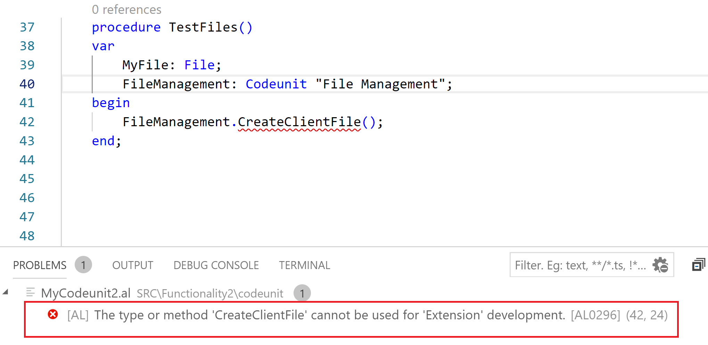

# 高级 AL 开发

在上一章中，我们为 Dynamics 365 Business Central 开发了一个完整的扩展，并且在开发过程中，我们研究了 AL 编程的多个方面。

本章我们将重点讲解在为 Dynamics 365 Business Central 开发实际解决方案时，需要管理的其他开发主题。这些主题非常重要且实用，特别是在改善用户体验以及需要处理来自 AL 的外部服务集成时。

本章将涵盖以下主题：

+   理解不可变键

+   使用 AL 处理文件

+   处理 BLOBs

+   处理 XMLports

+   使用 AL 处理 XML 和 JSON 对象

+   创建和扩展角色中心和标题

+   从 AL 代码中消费 Web 服务和 API

+   从 AL 代码中使用 Azure 函数

+   使用隔离存储处理敏感数据

+   为 Dynamics 365 Business Central 创建控制 add-ins

+   处理通知

+   页面后台任务和异步编程

# 理解不可变键

在 Dynamics 365 Business Central wave 2 版本发布后，所有表现在都有一个（唯一的）不可变键（一个 `GUID` 字段），可以用于集成场景以及替换旧的 `RECORDID` 属性。这个新字段叫做 `SystemId`，它是一个 GUID 数据类型的字段，用于指定表中记录的唯一、不可变（只读）标识符。

新的 `SystemId` 字段（在每个表对象中用字段号 `2000000000` 标识）具有以下特点：

+   它为表中的每一条记录提供一个值。

+   你可以在插入时指定一个值；否则，平台会自动分配一个值。

+   一旦`SystemId`被设置，就无法更改。

+   `SystemId`字段中总是有一个唯一的次级键。

作为平台规则，不允许修改现有记录的 `SystemId`。`INSERT` 函数现在有了一个新的重载：

```
Record.Insert([RunTrigger: Boolean[, InsertWithSystemId: Boolean]])
```

`SystemId` 在插入新记录时可以手动指定，如以下示例所示：

```
myRec.SystemId := '{B6667654-F4B2-B945-8567-006DD6B6775E}';
myRec.Insert(true,true);
```

现在，你可以使用`GetBySystemId`函数通过其`SystemId`检索记录，如以下示例所示：

```
var
    Customer: Record Customer;
    Text000: Label 'Customer was found.';
    begin
    if Customer.GetBySystemId('{B6667654-F4B2-B945-8567-006DD6B6775E}') then
         Message(Text000);
end;
```

你也可以使用新的 `SystemId` 字段来设置表之间的关系，如以下代码所示：

```
field(1; EntryID; GUID)
{
    DataClassification = CustomerContent;
    TableRelation = Item.SystemId;
}
```

版本 15 之前的 `Integration Record` 表为记录提供了 GUID。在升级到 Dynamics 365 Business Central 版本 15 的过程中，将使用这些值初始化新的 `SystemId` 字段。未来，`Integration Record` 表将被声明为过时。`SystemId` 字段在 API 页面上也非常有用。

在下一节中，我们将看到如何在 **软件即服务**（**SaaS**）环境中使用 AL 处理文件。

# 使用 AL 处理文件

在 Dynamics 365 Business Central 中处理文件是一个棘手的地方。在本地版本中，你可以完全访问本地资源和文件系统，而在 Dynamics 365 Business Central 的 SaaS 版本中，情况有所不同。在这里，你没有文件系统，也无法访问本地资源（所有的处理都在微软的数据中心进行）。

如果你创建一个函数，你声明一个`File`变量，然后调用一个常见的文件管理方法（例如`Create`，它用于创建并打开一个 ASCII 或二进制文件），然后 Visual Studio Code 会显示如下错误：


这个错误发生是因为你尝试创建的扩展默认针对的是 Dynamics 365 Business Central SaaS 环境（`app.json`文件中的`"target": "Extension"`）。

如果你在`app.json`文件中添加`"target": "Internal"`（这样你声明你的扩展仅针对本地环境），那么错误就会消失，你可以使用经典的`File`对象方法，如下所示：


如果你使用`File Management`代码单元来处理文件，也会发生同样的情况。它的一些方法在 SaaS 扩展中无法使用：



要在云环境中处理文件，你需要使用**Streams**（`InStream`和`OutStream`对象）。

`InStream`和`OutStream`数据类型是用于从文件和 BLOB 中读取或写入的通用流对象。

有关这些对象的更多信息，请参考以下链接：

[`docs.microsoft.com/en-us/dynamics365/business-central/dev-itpro/developer/methods-auto/instream/instream-data-type`](https://docs.microsoft.com/en-us/dynamics365/business-central/dev-itpro/developer/methods-auto/instream/instream-data-type) [`docs.microsoft.com/en-us/dynamics365/business-central/dev-itpro/developer/methods-auto/outstream/outstream-data-type`](https://docs.microsoft.com/en-us/dynamics365/business-central/dev-itpro/developer/methods-auto/outstream/outstream-data-type)

要将文件从客户端计算机上传到服务器端流对象，你需要调用`UploadIntoStream`方法：

```
[Ok := ]  File.UploadIntoStream(DialogTitle: String, FromFolder: String, FromFilter: String, var FromFile: Text, var InStream: InStream)
```

该方法的参数如下：

+   `DialogTitle`（字符串）：这是文件选择对话框中显示的标题栏文本。此参数不被 Web 客户端支持（标题由用户的浏览器确定）。

+   `FromFolder`（字符串）：这是在文件选择对话框中显示的文件夹路径。这个文件夹是默认文件夹，但用户可以浏览到任何可用的位置。此参数不被 Web 客户端支持（默认情况下，浏览器使用上次访问的文件夹）。

+   `FromFilter`（字符串）：这是可以上传到服务器的文件类型。在 Windows 客户端中，该类型会显示在上传对话框中，用户只能选择指定类型的文件。对于 Web 客户端，用户界面不支持此筛选器。用户可以尝试上传任何类型的文件，但如果文件类型不符合指定类型，则会出现错误。

+   `FromFile`（文本）：这是上传到服务的默认文件。用户可以更改该文件。Web 客户端不支持此参数。

+   `InStream`：这是用于加载数据的`InStream`对象。

有关该方法的更多详细信息，请参见 [`docs.microsoft.com/en-us/dynamics365/business-central/dev-itpro/developer/methods-auto/file/file-uploadintostream-method`](https://docs.microsoft.com/en-us/dynamics365/business-central/dev-itpro/developer/methods-auto/file/file-uploadintostream-method)。

举个例子，这是一个从客户端加载图像文件的函数（使用`InStream`对象和`UploadIntoStream`方法将客户端文件加载到`InStream`对象中），并将其作为`Item`对象添加：

```
procedure ImportItemPicture(Item: Record Item)
    var
        FileInstream: InStream;
        FileName: Text;
    begin
        if UploadIntoStream('', '', '', FileName, FileInstream) then
        begin
            Clear(Item.Picture);
            Item.Picture.ImportStream(FileInstream,FileName);
            Item.Modify(true);
        end;
    end;
```

另一个例子，这是一个函数，它将包含`Item`详细信息的 CSV 文件读取到`InStream`对象中，将其内容加载到`CSV Buffer`表中，然后根据需要更新`Item`字段：

```
local procedure UploadCSV()
  var
        CSVInStream : InStream;
        UploadResult : Boolean;
        TempBlob : Codeunit "Temp Blob";
        DialogCaption : Text;
        CSVFileName : Text;
        CSVBuffer: Record "CSV Buffer";
        Item: Record Item;
    begin
        UploadResult := UploadIntoStream(DialogCaption,'','',CSVFileName,CSVInStream);
        CSVBuffer.DeleteAll;
        CSVBuffer.LoadDataFromStream(CSVInStream,';'); 
        if CSVBuffer.FindSet() then
        repeat
         if (CSVBuffer."Field No." = 1) then
            Item.Init();
            case CSVBuffer."Field No." of
                1: Item.Validate("No.",CSVBuffer.Value);
                2: Item.Validate(Description,CSVBuffer.Value);
                3: Item.Validate("Item Category Code",CSVBuffer.Value);
                4: if not Item.Insert() then Item.Modify();
           end;
        until CSVBuffer.Next()=0;
    end;
```

要将文件从服务器端（SaaS 环境）下载到客户端（用户机器），需要使用`DownloadFromStream`方法：

```
[Ok := ]  File.DownloadFromStream(InStream: InStream, DialogTitle: String, ToFolder: String, ToFilter: String, var ToFile: Text)
```

该方法的参数如下：

+   `InStream`：`InStream`对象（[`docs.microsoft.com/en-us/dynamics365/business-central/dev-itpro/developer/methods-auto/instream/instream-data-type`](https://docs.microsoft.com/en-us/dynamics365/business-central/dev-itpro/developer/methods-auto/instream/instream-data-type)）包含文件数据。

+   `DialogTitle`字符串（[`docs.microsoft.com/en-us/dynamics365/business-central/dev-itpro/developer/methods-auto/string/string-data-type`](https://docs.microsoft.com/en-us/dynamics365/business-central/dev-itpro/developer/methods-auto/string/string-data-type)）：这是要在下载文件的对话框中显示的标题。Web 客户端不支持此参数（在此，标题由最终用户的浏览器决定）。

+   `ToFolder`字符串（[`docs.microsoft.com/en-us/dynamics365/business-central/dev-itpro/developer/methods-auto/string/string-data-type`](https://docs.microsoft.com/en-us/dynamics365/business-central/dev-itpro/developer/methods-auto/string/string-data-type)）：这是保存下载文件的默认文件夹。文件夹名称会显示在下载的对话框中，用户可以更改该文件夹。Web 客户端不支持此参数（因为默认文件会保存到最终用户浏览器中配置的默认下载位置）。

+   `ToFilter` 字符串 ([`docs.microsoft.com/en-us/dynamics365/business-central/dev-itpro/developer/methods-auto/string/string-data-type`](https://docs.microsoft.com/en-us/dynamics365/business-central/dev-itpro/developer/methods-auto/string/string-data-type))：这是可以下载到客户端的文件类型。该类型会在下载文件的对话框中显示。此参数不支持网页客户端。

+   `ToFile` 文本 ([`docs.microsoft.com/en-us/dynamics365/business-central/dev-itpro/developer/methods-auto/text/text-data-type`](https://docs.microsoft.com/en-us/dynamics365/business-central/dev-itpro/developer/methods-auto/text/text-data-type))：这是分配给下载文件的名称。此值可以由用户更改。

有关此方法的更多信息，请参阅[`docs.microsoft.com/en-us/dynamics365/business-central/dev-itpro/developer/methods-auto/file/file-downloadfromstream-method`](https://docs.microsoft.com/en-us/dynamics365/business-central/dev-itpro/developer/methods-auto/file/file-downloadfromstream-method)。

作为示例，这段代码将与`Item`卡片相关的图像导出为`MediaSet`类型。它使用`DownloadFromStream`将文件下载到客户端。这些图像从`Tenant Media`表中检索，并保存为由`Item Number`、图像索引和图像扩展名组成的文件名（`GetImageExtension`函数根据其`Mime Type`检索图像文件的扩展名）：

```
procedure ExportItemPicture(Item: Record Item)
    var
        FileInStream: InStream;
        FileName: Text;
        i: Integer;
        TenantMedia: Record "Tenant Media";
        ErrMsg: Label 'No images stored for the selected item.';
    begin
        if Item.Picture.Count() = 0 then
            Error(ErrMsg);
        for i := 1 to Item.Picture.Count() do begin
            if TenantMedia.Get(Item.Picture.MediaId()) then begin
                TenantMedia.CalcFields(Content);
                if TenantMedia.Content.HasValue() then begin
                    FileName := Item."No." + '_' + Format(i) + GetImageExtension(TenantMedia);
                    TenantMedia.Content.CreateInStream(FileInStream);
                    DownloadFromStream(FileInStream, '', '', '', FileName);
                end;
            end;
        end;
    end;

    procedure GetImageExtension(var TenantMedia: record "Tenant Media"): Text   
    begin
        case TenantMedia."Mime Type" of
        'image/jpeg': exit('.jpg');
        'image/bmp': exit('.bmp');
        'image/png': exit('.png');
        'image/gif': exit('.gif');
        'image/tiff': exit('.tiff');
        'image/wmf': exit('.wmf');
        end
    end;
```

如果您需要从 Dynamics 365 Business Central 创建文件，您需要在服务器端使用`System Application`和`OutStream`对象中定义的新`Temp Blob`代码单元来创建。

这是一个 AL 函数的示例，该函数接收一个文件名作为输入，创建一个包含三行的文本文件，并将其下载到客户端：

```
procedure CreateTextFile(FileName: Text)
var
    InStr: InStream;
    OutStr: OutStream;
    TempBlob: Codeunit "Temp Blob";
    CR: char;
    LF: char;
begin
    CR := 13;
    LF := 10;
    TempBlob.CreateOutStream(OutStr);        
    OutStr.WriteText('First line'+ CR + LF);
    OutStr.WriteText('Second line'+ CR + LF);
    OutStr.WriteText('Third line'+ CR + LF);        
    TempBlob.CreateInStream(InStr);
    DownloadFromStream(InStr, '', '', '', FileName); 
end;
```

在 Dynamics 365 Business Central 中，您不能直接将文件保存到本地文件夹（本地计算机或网络文件夹）。要执行此操作，您需要使用其他方式，例如 Azure Functions（我们将在本章稍后部分讨论）。

随着 Dynamics 365 Business Central wave 2 版本的发布，旧的`TempBlob`表已被弃用，并被一些系统代码单元（`Temp Blob`、`Persistent Blob`和`Temp Blob List`）替代。

在本节中，您学习了如何使用流处理 Dynamics 365 Business Central 中的文件。在下一节中，我们将学习如何处理 Dynamics 365 Business Central 中文档和实体的附件。

# 处理附件

附件是您可以链接到 Dynamics 365 Business Central 中的实体或文档的文件。用于存储附件的两个主要表格如下：

+   文档附件（`ID = 1173`）

+   附件（`ID = 5062`）

要将附件存储到这些表中，并从这些表中下载附件，您需要使用前面提到的`UploadIntoStream`和`DownloadFromStream`方法，并通过使用`Streams`加载 BLOB 字段。

一个将文件上传到 `Attachment` 表的函数示例如下：

```
procedure UploadAttachment()
    var
        Attachment: Record Attachment;
        outStr: OutStream;
        inStr: InStream;
        tempfilename: text;
        FileMgt: Codeunit "File Management";
        DialogTitle: Label 'Please select a File...';
    begin
        if UploadIntoStream(DialogTitle, '', 'All Files (*.*)|*.*', tempfilename, inStr) then 
        begin
            Attachment.Init();
            Attachment.Insert(true);
            Attachment."Storage Type" := Attachment."Storage Type"::Embedded;
            Attachment."Storage Pointer" := '';
            Attachment."File Extension" := FileMgt.GetExtension(tempfilename);
            Attachment."Attachment File".CreateOutStream(outStr);
            CopyStream(outStr, inStr);
            Attachment.Modify(true);
        end;
    end;
```

一个从 `Attachment` 表下载文件的函数示例如下：

```
procedure OpenAttachment(AttachmentEntryNo: Integer)
    var
        Attachment: record Attachment;
        inStr: InStream;
        tempfilename: text;
        ErrorAttachment: Label 'File not available.';
    begin
        if Attachment.get(AttachmentEntryNo) then
            if Attachment."Attachment File".HasValue then begin
                Attachment.CalcFields("Attachment File");
                Attachment."Attachment File".CreateInStream(inStr);
                tempfilename := CreateGuid() + '.' + Attachment."File Extension";
                DOWNLOADFROMSTREAM(inStr, 'Save file', '', 'All Files (*.*)|*.*', 
                   tempfilename);
            end
            else
                Error(ErrorAttachment);
    end;
```

我们可以对 `Document Attachment` 表使用相同的过程；您只需要将对 `attachment` 记录的引用添加到文档本身。

我们已经看到了如何处理附件（这是一个可以添加到扩展中的有用功能）。在接下来的部分中，我们将看到如何从 BLOB 字段读取和写入数据。

# 读取和写入文本数据到 BLOB 字段

要从 BLOB 字段读取数据并写入文本数据，您需要使用前面描述的 `InStreams` 和 `OutStreams` 对象。

以下代码中的两个方法从自定义表中定义的 `BLOB` 字段读取和写入文本数据：

```
table 50120 MyBlobTable
{
    DataClassification = CustomerContent;   
    fields
    {
        field(1;ID; Integer)
        {
            DataClassification = CustomerContent;           
        }

        field(2; BlobField; Blob)
        {
            DataClassification = CustomerContent;
        }
    }

    keys
    {
        key(PK; ID)
        {
            Clustered = true;
        }
    }

    procedure SetBlobValue(value: Text)
    var
        outStr: OutStream;
    begin
        BlobField.CreateOutStream(outStr);
        outStr.WriteText(value);
    end;

    procedure GetBlobValue(value: Text)
    var
        inStr: InStream;
    begin
        CalcFields(BlobField);
        if BlobField.HasValue() then
        begin
            BlobField.CreateInStream(inStr);
            inStr.ReadText(value);
        end
        else
            value := 'No value on the BLOB field';
    end;   
}
```

在这里，我们定义了一个包含 BLOB 字段的表，并创建了两个方法用于读取和写入数据到该 BLOB 字段：

+   `SetBlobValue` 函数将数据（作为输入传递）写入 BLOB 字段。

+   `GetBlobValue` 函数从 BLOB 字段读取数据。

使用这两个方法，我们已经实现了读取和写入文本到 BLOB 字段的目标。在接下来的部分中，我们将看到如何从 AL 中使用 XMLport。

# 在 AL 代码中使用 XMLport

正如我们在 第二章中所说的，*掌握现代开发环境*，**XMLport** 是用于在 Dynamics 365 Business Central 与外部数据源之间导入和导出数据的对象（这一操作通过 `Direction` 属性来管理，可以设置为 `Import`、`Export` 或 `Both`）。数据可以以 XML 或 CSV（文本）格式导入或导出（`Format` 属性可以设置为 `Xml`、`Variable Text` 或 `Fixed Text`）。

XMLport 属性的详细信息请见 [`docs.microsoft.com/en-us/dynamics-nav/xmlport-properties`](https://docs.microsoft.com/en-us/dynamics-nav/xmlport-properties)。 [](https://docs.microsoft.com/en-us/dynamics-nav/xmlport-properties) XMLport 触发器的详细信息请见 [`docs.microsoft.com/en-us/dynamics-nav/xmlport-triggers`](https://docs.microsoft.com/en-us/dynamics-nav/xmlport-triggers)。

现在，考虑在 第四章中定义的示例 XMLport，*扩展开发基础*：

```
xmlport 50100 MyXmlportImportCustomer
{
    Direction = Import;
    Format = VariableText;
    FieldSeparator = ';';
    RecordSeparator = '<LF>';
    schema
    {
        textelement(NodeName1)
        {
            tableelement(Customer; Customer)
            {
                fieldattribute(No; Customer."No.")
                {                   
                }
                fieldattribute(Name; Customer.Name)
                {
                }
                fieldattribute(Address;Customer.Address)
                {
                }
                fieldattribute(City;Customer.City)
                {
                }
                fieldattribute(Country;Customer."Country/Region Code")
                {
                    trigger OnAfterAssignField()                   
                    begin
                      //Executed after a field has been assigned a value and before it is validated and imported.   
                    end;
                }
            }
        }
    }
}
```

要在 Dynamics 365 Business Central 中执行 XMLport，您需要通过页面或代码单元对象运行它（不能直接运行）。在 Dynamics 365 Business Central Web 客户端中不支持 XMLport 请求页面（用于设置过滤器或插入参数）。

要在 Dynamics 365 Business Central 中执行 XMLport 从文件导入数据，您需要使用以下代码：

```
procedure RunXMLportImport()
    var
        FileInstream: InStream;
        FileName: Text;
    begin
        UploadIntoStream('','','',FileName,FileInstream);
        Xmlport.Import(Xmlport::MyXmlportImportCustomer,FileInStream);
        Message('Import Done successfully.');
    end;
```

在这里，文件被加载到一个 `InStream` 对象中，然后通过将 `InStream` 对象作为输入来执行 XMLport。

要在 Dynamics 365 Business Central 中执行 XMLport 导出数据到文件，您需要使用以下代码：

```
procedure RunXMLportExport()
    var
        TempBlob: Codeunit "Temp Blob";
        FileName: Text;
        FileOutStream: OutStream;
        FileInStream: InStream;
        outputFileName: Text;
    begin
        TempBlob.CREATEOUTSTREAM(FileOutStream);
        Xmlport.Export(Xmlport::MyXmlportImportCustomer, FileOutStream);
        TempBlob.CREATEINSTREAM(FileInStream);
        outputFileName := 'MyOutputFile.xml';
        DownloadFromStream(FileInStream,'','','',outputFileName); 
       //The output is saved in the default browser's Download folder
    end;
```

在这里，我们已经看到如何使用 AL 代码中的 XMLports 导入或导出数据。在下一部分，我们将看到如何在 Dynamics 365 Business Central 中创建和扩展角色中心。

# 创建和扩展角色中心

当用户登录 Dynamics 365 Business Central 时，他们会看到一个展示与其公司角色相关的信息和操作的页面。这个页面叫做**角色中心**，它是应用程序角色定制体验的一个核心部分。

Dynamics 365 Business Central 提供约 20 个开箱即用的角色中心（作为标准），你可以扩展和自定义，并且可以创建新的角色中心。

角色中心是一个`PageType`属性设置为`RoleCenter`的页面。页面结构如下：


在结构图中，部分如下：

+   第一部分是**导航菜单**区域（一个或多个项目，点击时显示其他子菜单）。用于提供对该角色中心页面所分配角色的相关实体的访问。

+   第二部分是**导航栏**区域，用于显示链接到其他页面的链接列表，这些页面将在内容区域中打开。通常用于添加链接到用户在其业务角色中最有用的实体。

+   第三部分是**操作**区域，用于添加链接以执行此角色的最重要任务（指向页面、报告或代码单元的链接）。

+   第四部分是**标题**区域，用于显示动态生成的关于业务的信息。我们将在本章的*定制标题*部分中看到更多关于此区域的细节。

+   第五部分是**宽数据提示**区域，一组显示有关业务的数值信息的数据提示。此区域是在页面上使用`cuegroup`控件创建的，页面的`PageType = CardPart`，并将`Layout`属性设置为`wide`。

+   第六部分是**数据提示**区域，用于提供汇总业务数据的可视化表示（如关键绩效指标）。此部分是在页面上使用`cuegroup`控件并设置`PageType = CardPart`创建的。

+   第七部分是`操作提示`区域，显示链接到一些业务任务的瓷砖。此区域是在页面上使用`cuegroup`控件创建的，页面的`PageType = CardPart`。

+   第八部分是**图表**区域，用于以图表形式显示信息（自定义业务图表控件或嵌入的 Power BI 报告）。

+   第九部分是**CardPart 或 ListPart 页面**区域，用于以卡片或列表布局显示来自应用程序的数据。

+   第十部分是*控制添加项**区域，用于通过基于 HTML 的控制添加项（用 JavaScript 编写）显示自定义内容。

角色中心页面可以通过以下代码在 AL 中创建：

```
page 50101 "My Role Center"
{
    PageType = RoleCenter;

    layout
    {
        area(rolecenter)
        {
            part(SalesPerformance; "Sales Performance")
            {
                ApplicationArea = All;
                Visible = true;
            }

            part(MyCustomers; "My Customers")
            {
                ApplicationArea = All;
                Visible = true;
            }

            part(News;"Headline RC Business Manager")
            {
                ApplicationArea = All;
                Visible = true;
            }
        }
    }   
}
```

在这里，我们创建了一个包含三个**部分**（子页面）的角色中心页面。

你可以通过创建`pageextension`对象来自定义现有的角色中心页面：

```
pageextension 50100 SalesManagerRoleCenterExt_SD extends "Sales Manager Role Center"
{
    layout
    {
        addlast(Content)
        {
            part(MyNews; MyRoleCenterHeadline)
            {
                ApplicationArea = All;
                Visible = true;
            }
        }
    }

    actions
    {   
         addlast(Sections)
         {
            group("My Customers")
            {               
                 action("Customer Ledger Entries")
                {
                    RunObject = page "Customer Ledger Entries";
                    ApplicationArea = All;
                }
            }
         }
    }         
}
```

在这里，我们通过向内容中添加一个新的自定义头条部分和一个新动作来打开 `Customer Ledger Entries` 页面，扩展了 `Sales Manager Role Center` 页面。

自定义或创建角色中心非常重要，因为这可以为您的用户提供更好的用户体验。

在接下来的部分中，我们将看到如何自定义角色中心的头条部分。

# 自定义头条

如前所述，**头条**是随着 Dynamics 365 Business Central 网页客户端一起引入的新部分，用于动态显示有关您业务的重要信息。请参阅以下截图：


这是 Dynamics 365 Business Central 角色定制用户体验的重要部分，建议使用并自定义它，以便为您的用户提供更好的体验。

头条本质上是一个页面，包含一个或多个字段（每个字段是一个头条行），并且 `PageType` 被设置为 `HeadlinePart`。此页面仅在角色中心页面内部可见。

Dynamics 365 Business Central 提供了九个标准头条：

+   头条 RC 商务经理

+   头条 RC 订单处理员

+   头条 RC 会计

+   头条 RC 项目经理

+   头条 RC 关系管理

+   头条 RC 管理员

+   头条 RC 团队成员

+   头条 RC 生产计划员

+   头条 RC 服务调度员

您还可以使用 AL 和 Visual Studio Code 创建自己的头条。

可以在 AL 中定义一个头条页面，如下所示：

```
page 50100 "MyRoleCenterHeadline"
{
    PageType = HeadLinePart;
    layout
    {
        area(content)
        {
            field(Headline1; text001)
            {
                ApplicationArea = all;
            }

            field(Headline2; text002)
            {
                ApplicationArea = all;
                trigger OnDrillDown()
                var
                    DrillDownURL: Label 'http://www.demiliani.com';
                begin
                    Hyperlink(DrillDownURL)
                end;
            }

            field(Headline3; text003)
            {
                ApplicationArea = all;
            }

            field(Headline4; text004)
            {
                ApplicationArea = all;
                // Determines visibility while the page is open (custom criteria)
                Visible=showHeadline4;
            }       
        }
    }

    var
        text001: Label 'This is Headline 1';
        text002: Label 'This is Headline 2 (click for details)';
        text003: Label 'This is Headline 3';
        text004: Label 'This is Headline 4';
        showHeadline4: Boolean;

        trigger OnOpenPage()
        var
           myInt: Integer;
        begin
            showHeadline4 := true;
        end;
}
```

在这里，我们定义了一个头条页面，包含四个文本字段，并在 Dynamics 365 Business Central 界面中显示适当的文本。

在第二个头条中，我们处理了 `OnDrillDown` 事件，如果您点击本示例中的第二个头条，将会跳转到一个 URL。通过处理此事件，您可以拥有一个可点击的头条，显示业务详细信息（例如，它可以打开一个 Dynamics 365 Business Central 详细页面）。头条页面也可以被隐藏，且其可见性可以通过代码程序性地设置（如前一个示例中的头条 4）。

头条页面上显示的文本可以根据以下 `Expression` 属性进行格式化：

| **Expression 标签** | **描述** |
| --- | --- |
| `<qualifier></qualifier>` | 这指定了在头条上方显示的标题。如果没有该元素，默认将使用文本 `HEADLINE`。 |
| `<payload></payload>` | 这指定了显示的头条文本。 |
| `<emphasize></emphasize>` | 该标签中的文本显示为最大尺寸。 |

要修改现有的头条，您需要创建一个 `pageextension` 对象并对其进行扩展。作为示例，我们在这里通过添加一个新的头条面板，并动态创建内容，来修改标准的 `Headline RC Business Manager` 页面：

```
pageextension 50101 MyNewBCHeadline extends "Headline RC Business Manager"
{
    layout
    {
        addafter(Control4)
        {
            field(newHeadlineText;newHeadlineText)
            {
                ApplicationArea = all;
            }
        }
    }

    var
        newHeadlineText: Text;

        trigger OnOpenPage()
        var
            HeadlineMgt : Codeunit "Headline Management";
        begin
            //Set Headline text           
            newHeadlineText := 'This is my new Business Central Headline for ' + HeadlineMgt.Emphasize('Packt Publishing');
        end;

}
```

在这里，我们添加了一个名为 `newHeadlineText` 的新字段，并且在头条页面的 `OnOpenPage` 触发器中填充该字段，显示我们希望呈现给用户的信息。

本节已解释了如何自定义角色中心页面的标题，以及如何向我们的用户展示相关的业务信息。

# 使用 AL 语言处理 XML 和 JSON 文件

AL 语言扩展原生支持处理 XML 和 JSON 文档。

XML 文档通过使用`XmlDocument`数据类型来表示，详细说明见[`docs.microsoft.com/en-us/dynamics365/business-central/dev-itpro/developer/methods-auto/xmldocument/xmldocument-data-type`](https://docs.microsoft.com/en-us/dynamics365/business-central/dev-itpro/developer/methods-auto/xmldocument/xmldocument-data-type)。

以下代码展示了如何导入 XML 文件并将其加载到`XmlDocument`对象中：

```
local procedure ImportXML()
    var
        TempBlob : Codeunit "Temp Blob";
        TargetXmlDoc : XmlDocument;
        XmlDec : XmlDeclaration;
        Instr: InStream;
        filename: Text;
    begin
        // Create the Xml Document
        TargetXmlDoc := XmlDocument.Create;
        xmlDec := xmlDeclaration.Create('1.0','UTF-8','');
        TargetXmlDoc.SetDeclaration(xmlDec);

        // Create an Instream object & upload the XML file into it              
        TempBlob.CreateInStream(Instr);
        filename := 'data.xml';       
        UploadIntoStream('Import XML','','',filename,Instr);

        // Read stream into new xml document       
        Xmldocument.ReadFrom(Instr, TargetXmlDoc);    
    end;
```

在这里，我们创建了一个带有 XML 声明的`XmlDocument`对象，然后创建了一个`InStream`对象来加载 XML 文件，并将`InStream`的内容读取到`XmlDocument`对象中。

如果你引用`TargetXmlDoc`对象，你将看到所有可用的处理和操作 XML 文件的方法：


要直接从 AL 代码创建 XML 文档，可以使用`XmlDocument`和`XmlElement`类：

```
local procedure XMLDocumentCreation()
    var
        xmldoc: XmlDocument;
        xmlDec: XmlDeclaration;
        node1: XmlElement;
        node2: XmlElement;
    begin
        xmldoc := XmlDocument.Create();
        xmlDec := xmlDeclaration.Create('1.0','UTF-8','');
        xmlDoc.SetDeclaration(xmlDec);
        node1:= XmlElement.Create('node1');
        xmldoc.Add(node1);
        node2 := XmlElement.Create('node2');
        node2.SetAttribute('ID','3');
        node1.Add(node2);
    end;
```

这段代码创建了一个 XML 文档，包含一个根节点（称为`node1`）和一个子节点（称为`node2`），该子节点有一个 ID 属性，其值为`3`（`<node2 ID="3">`）。

JSON 文档的原生支持通过使用`JsonObject`和`JsonArray`数据类型提供。这些数据类型包含处理 JSON 文件（包括读写）以及操作 JSON 数据（令牌）的方法。

所有可用方法的详细说明可以在以下链接中找到：

[`docs.microsoft.com/en-us/dynamics365/business-central/dev-itpro/developer/methods-auto/jsonobject/jsonobject-data-type`](https://docs.microsoft.com/en-us/dynamics365/business-central/dev-itpro/developer/methods-auto/jsonobject/jsonobject-data-type) [`docs.microsoft.com/en-us/dynamics365/business-central/dev-itpro/developer/methods-auto/jsonarray/jsonarray-data-type`](https://docs.microsoft.com/en-us/dynamics365/business-central/dev-itpro/developer/methods-auto/jsonarray/jsonarray-data-type)

以下代码展示了如何创建销售订单文档的 JSON 表示形式：

```
procedure CreateJsonOrder(OrderNo: Code[20])
    var
        JsonObjectHeader: JsonObject;
        JsonObjectLines: JsonObject;
        JsonOrderArray: JsonArray;
        JsonArrayLines: JsonArray;
        SalesHeader: Record "Sales Header";
        SalesLines: Record "Sales Line";

    begin
        //Retrieves the Sales Header
        SalesHeader.Get(SalesHeader."Document Type"::Order,OrderNo);
        //Creates the JSON header details
        JsonObjectHeader.Add('sales_order_no', SalesHeader."No.");
        JsonObjectHeader.Add(' bill_to_customer_no', SalesHeader."Bill-to Customer No.");     
        JsonObjectHeader.Add('bill_to_name', SalesHeader."Bill-to Name");
        JsonObjectHeader.Add('order_date', SalesHeader."Order Date");
        JsonOrderArray.Add(JsonObjectHeader);

        //Retrieves the Sales Lines
        SalesLines.SetRange("Document Type", SalesLines."Document Type"::Order);
        SalesLines.SetRange("Document No.", SalesHeader."No.");
        if SalesLines.FindSet then
        // JsonObject Init
        JsonObjectLines.Add('line_no', '');
        JsonObjectLines.Add('item_no', '');
        JsonObjectLines.Add('description', '');
        JsonObjectLines.Add('location_code', '');
        JsonObjectLines.Add('quantity', '');
        repeat
            JsonObjectLines.Replace('line_no', SalesLines."Line No.");
            JsonObjectLines.Replace('item_no', SalesLines."No.");            
            JsonObjectLines.Replace('description', SalesLines.Description);
            JsonObjectLines.Replace('location_code', SalesLines."Location Code");
            JsonObjectLines.Replace('quantity', SalesLines.Quantity);
            JsonArrayLines.Add(JsonObjectLines);
        until SalesLines.Next() = 0;
        JsonOrderArray.Add(JsonArrayLines);
    end;
```

该过程接收订单号作为输入，检索`Sales Header`和`Sales Line`的详细信息，并创建一个 JSON 表示形式。最终结果如下：

```
[
    {
        "sales_order_no": "SO1900027",
        "bill_to_customer_no": "C001435",
        "bill_to_name": "Packt Publishing",
        "order_date": "2019-03-23"
    },
    [
        {
            "line_no": "10000",
            "item_no": "IT00256",
            "description": "Dynamics 365 Business Central Development Guide",
            "location_code": "MAIN",
            "quantity": 30
        },
        {
            "line_no": "20000",
            "item_no": "IT03465",
            "description": "Mastering Dynamics 365 Business Central",
            "location_code":"MAIN",                                 
            "quantity": 27
        }
    ]
]
```

显然，你也可以将 JSON 表示形式作为输入（例如，作为 API 调用的响应），并使用相同的数据类型进行处理。

在这里，我们已经看到了如何通过使用原生 JSON 类型在 AL 中处理 JSON 文档。

在下一部分，我们将看到一个完整的示例，展示如何调用 API，接收 JSON 响应，解析它，并将数据保存到 Dynamics 365 Business Central 实体中。

# 从 AL 中使用 Web 服务和 API

AL 的`HttpClient`对象提供了一个基类，用于处理来自 Web 资源（通过 URI 标识）的 HTTP 请求和响应。使用`HttpClient`类，你可以发送`GET`、`DELETE`、`POST`和`PUT` HTTP 请求消息（`HttpRequestMessage`，包含`HttpHeaders`和`HttpContent`），并接收一个`HttpResponseMessage`对象作为该请求的结果（包括状态码和响应数据）。

你可以在以下链接中找到所有公开方法的更多详细信息：[`docs.microsoft.com/en-us/dynamics365/business-central/dev-itpro/developer/methods-auto/httpclient/httpclient-data-type`](https://docs.microsoft.com/en-us/dynamics365/business-central/dev-itpro/developer/methods-auto/httpclient/httpclient-data-type)。

例如，在以下代码中，我们创建了一个扩展，允许通过调用名为`Fullcontact`的服务（[`www.fullcontact.com`](https://www.fullcontact.com)）来获取客户的地址详细信息。当你注册免费账户时，`Fullcontact`会提供一个 API，并附带一个访问密钥，你可以用这个密钥通过提供客户姓名来检索客户详细信息。

我们需要的是：如果在客户卡片的`Name`字段中插入一个公司的域名（例如，[packt.com](https://www.packtpub.com/)），系统必须调用 API 并检索该域名对应的客户详细信息。

我们通过扩展客户卡片来创建一个`pageextension`对象，并在`Name`字段的`OnAfterValidate`触发器中调用一个自定义方法（名为`LookupAddressInfo`，定义在一个名为`TranslationManagement`的代码单元中）来处理数据检索逻辑：

```
pageextension 50100 CustomerCardExt extends "Customer Card"
{
    layout
    {
        modify(Name)
        {
            trigger OnAfterValidate()
            var
                TranslationManagement: Codeunit TranslationManagement;
            begin
                if Name.EndsWith('.com') then begin
                    if Confirm('Do you want to retrieve company details?', false) then
                        TranslationManagement.LookupAddressInfo(Name, Rec);
                end;
            end;
        }
    }
}
```

`TranslationManagement`代码单元定义如下：

```
codeunit 50100 TranslationManagement
{
    procedure LookupAddressInfo(Name: Text; var Customer: Record Customer)
    var
        Client: HttpClient;
        Content: HttpContent;
        ResponseMessage: HttpResponseMessage;
        Result: Text;
        JContent: JsonObject;
        JDetails: JsonObject;
        JLocations: JsonArray;
        JLocation: JsonObject;
        JPhones: JsonArray;
        JPhone: JsonObject;
    begin
        Content.WriteFrom('{domain":"' + Name + '"}');
        Client.DefaultRequestHeaders().Add('Authorization', 'Bearer <YOUR KEY>');
        Client.Post('https://api.fullcontact.com/v3/company.enrich', Content, ResponseMessage);
        if not ResponseMessage.IsSuccessStatusCode() then
            Error('Error connecting to the Web Service.');        
        ResponseMessage.Content().ReadAs(Result);

        if not JContent.ReadFrom(Result) then
            Error('Invalid response from Web Service');
        JDetails := GetTokenAsObject(JContent, 'details', 'Invalid response from Web Service');
        JLocations := GetTokenAsArray(JDetails, 'locations', 'No locations available');
        JLocation := GetArrayElementAsObject(JLocations, 0, 'Location not available');
        JPhones := GetTokenAsArray(JDetails, 'phones', '');
        JPhone := GetArrayElementAsObject(JPhones, 0, '');
        Customer.Name := GetTokenAsText(JContent, 'name', '');
        Customer.Address := GetTokenAsText(JLocation, 'addressLine1', '');
        Customer.City := GetTokenAsText(JLocation, 'city', '');
        Customer."Post Code" := GetTokenAsText(JLocation, 'postalCode', '');
        Customer."Country/Region Code" := GetTokenAsText(JLocation, 'countryCode', '');
        Customer.County := GetTokenAsText(JLocation, 'country', '');
        Customer."Phone No." := GetTokenAsText(JPhone, 'value', '');
    end;

    procedure GetTokenAsText(JsonObject: JsonObject; TokenKey: Text; Error: Text): Text;
    var
        JsonToken: JsonToken;
    begin
        if not JsonObject.Get(TokenKey, JsonToken) then begin
            if Error <> '' then
                Error(Error);
            exit('');
        end;
        exit(JsonToken.AsValue.AsText);
    end;

    procedure GetTokenAsObject(JsonObject: JsonObject; TokenKey: Text; Error: Text): JsonObject;
    var
        JsonToken: JsonToken;
    begin
        if not JsonObject.Get(TokenKey, JsonToken) then
            if Error <> '' then
                Error(Error);
        exit(JsonToken.AsObject());
    end;

    procedure GetTokenAsArray(JsonObject: JsonObject; TokenKey: Text; Error: Text): JsonArray;
    var
        JsonToken: JsonToken;
    begin
        if not JsonObject.Get(TokenKey, JsonToken) then
            if Error <> '' then
                Error(Error);
        exit(JsonToken.AsArray());
    end;

    procedure GetArrayElementAsObject(JsonArray: JsonArray; Index: Integer; Error: Text): JsonObject;
    var
        JsonToken: JsonToken;
    begin
        if not JsonArray.Get(Index, JsonToken) then
            if Error <> '' then
                Error(Error);
        exit(JsonToken.AsObject());
    end; 
}
```

在这里，`LookupAddressInfo`过程通过使用`HttpClient`对象调用`Fullcontact` API（并通过 API 注册时提供的密钥设置授权头），并发送`POST`请求到提供的 URL，将`HttpContent`传递给该请求（该内容按 API 规范的格式包含要检查的姓名）。

HTTP 请求返回一个`HttpResponseMessage`对象，该对象包含响应消息。如果 HTTP 响应成功，我们将读取 HTTP 响应消息的内容（该内容为一个 JSON 字符串）。然后，我们使用一些辅助方法（你可以在前面的代码中看到这些方法的定义）解析这个 JSON 字符串，这些方法允许我们读取 JSON 令牌并按指定格式获取它们的值（如果令牌数据不可用，则返回错误字符串或默认值）。

使用`HttpClient`类，你可以处理对你要调用的 Web 服务或 API 的身份验证。例如，以下是如何使用`HttpClient`进行基本身份验证的示例：

```
var
  RequestMessage : HttpRequestMessage;
  Headers : HttpHeaders;
  base64Convert: Codeunit "Base64 Convert";
  AuthenticationString: Text;
begin
  RequestMessage.GetHeaders(Headers);
  AuthenticationString := StrSubstNo('%1:%2',YOURUSERNAME,YOURPASSWORD); 
  Headers.Add('Authorization', StrSubstNo('Basic %1',base64Convert.ToBase64(AuthenticationString)));
end
```

在这一部分中，我们了解了如何从 AL 消费 Web 服务和 API，以及如何处理请求、响应和身份验证。在接下来的部分，我们将看到如何在安装扩展时自动将对象发布为 Dynamics 365 Business Central 中的 Web 服务。

# 从 AL 发布 Dynamics 365 Business Central 对象作为 Web 服务

在开发扩展时，你可能需要自动将 Dynamics 365 Business Central 对象发布为外部应用程序的 Web 服务实例。

本质上，有两种不同的方式来自动化这个过程：

+   创建一个`Install`代码单元，并在此代码单元中通过 AL 代码在`Tenant Web Service`表中插入记录来创建 Web 服务实例。

+   创建一个包含`TenantWebService`定义的 XML 文件。

使用第一种方法，你定义一个`Install`代码单元，并且（例如，在`OnInstallAppPerCompany`触发器中）你可以通过在`Tenant Web Service`表中创建一个新条目来创建 Web 服务定义，如下所示：

```
codeunit 50104 TestInstallCodeunit
{
    Subtype = Install;
    trigger OnInstallAppPerCompany()

    var
        TenantWebService: Record "Tenant Web Service";
    begin
        TenantWebService.Init();
        TenantWebService."Object Type" := TenantWebService."Object Type"::Page;
        TenantWebService."Object ID" := 26;  //Vendor Card
        TenantWebService."Service Name" := 'VendorCardWS';
        TenantWebService.Published := true;
        TenantWebService.Insert(true);
    end;
}
```

在这里，我们已经将`Vendor Card`页面作为 Web 服务发布，SERVICE NAME 为`VendorCardWS`。这个 Web 服务将在 Dynamics 365 Business Central 的`Web Services`页面中可见，如下所示：


使用第二种方法，你可以通过`twebservices`代码片段来创建一个`TenantWebService` XML 定义文件。以下截图展示了这一点：


使用 XML 定义文件，要将`Vendor Card`页面作为 Web 服务发布，你需要编写以下内容：

```
<?xml version="1.0" encoding="UTF-8"?>
<ExportedData>
    <TenantWebServiceCollection>
        <TenantWebService>
            <ObjectType>Page</ObjectType>
            <ServiceName>VendorCardWS</ServiceName>
            <ObjectID>26</ObjectID>
            <Published>true</Published>
        </TenantWebService>
    </TenantWebServiceCollection>
</ExportedData>
```

这个 XML 定义文件将成为你 AL 项目扩展代码的一部分。

这里描述的两种方法在安装扩展时效果相同：你的 Web 服务将被发布并在 Dynamics 365 Business Central 的`Web Services`页面中可见。但当你卸载扩展时，会发生什么呢？

当你卸载扩展时，如果 Web 服务是使用 XML 定义文件发布的，它会自动从`Tenant Web Service`表中移除；而如果 Web 服务是通过 AL 代码直接发布的，则不会从该表中移除。如果你需要在安装阶段自动发布 Web 服务，建议使用`TenantWebService` XML 定义文件。

在接下来的部分，我们将看到如何使用 Azure Functions 在云端执行无服务器流程，并替代标准的.NET 代码。

# 使用 Azure Functions 替代.NET 代码

在 Dynamics 365 Business Central 中，.NET 程序集的使用（`DotNet`变量类型）仅支持本地部署的场景。在云端的 Dynamics 365 Business Central（SaaS）中，你不能使用 DotNet 对象（出于安全原因），而替代`DotNet`变量的官方方式是使用 HTTP 调用**Azure 函数**。

**Azure Functions**是 Azure 平台提供的一种无服务器计算服务，允许你在云中运行代码，而无需管理基础设施。我们将在第十四章，*使用 Azure Functions 进行监控、扩展和 CI/CD*中更深入地讨论 Azure 函数，因此这里我们不会讨论如何从头创建一个 Azure 函数，而仅介绍如何从扩展的代码中调用它。

现在，假设有一个名为`PostCodeValidator`的 Azure 函数，它验证邮政编码。这个函数（属于`HttpTrigger`类型的函数）通过查询字符串接收一个邮政编码，验证它，然后函数返回一个包含布尔值的 JSON 响应，指示邮政编码是否有效。

可以通过以下 URL 使用查询字符串调用 Azure 函数：

```
http://postcodevalidator.azurewebsites.net/api/postcodevalidator?code=POSTCODE
```

这里，`POSTCODE`是要验证的邮政编码。

来自 Azure 函数的 JSON 响应消息如下：

```
{"Isvalid":false}
```

在这个示例中，我们希望在`Customer`表的`Post Code`字段的`OnAfterValidate`事件中调用这个函数：


从 AL 调用 Azure 函数的代码如下：

```
[EventSubscriber(ObjectType::Table, Database::Customer, 'OnAfterValidateEvent', 'Post Code', false, false)]
    local procedure ValidatePostCodeViaAzureFunction(var Rec: Record Customer)
    var
        Client: HttpClient;
        Response: HttpResponseMessage;
        json: Text;
        jsonObj: JsonObject;
        token: JsonToken;
        FunctionURL: Label 'http://postcodevalidator.azurewebsites.net/api/postcodevalidator?code=';
        InvalidResponseError: Label 'Invalid Response from Azure Function.';
        InvalidCodeError: Label 'Invalid Post Code. Please reinsert.';
        TokenNotFoundError: Label 'Token not found in Json.';

    begin
        client.Get(FunctionURL + rec."Post Code", Response);
        //Reads the response content from the Azure Function
        Response.Content().ReadAs(json);
        if not jsonObj.ReadFrom(json) then
            Error(InvalidResponseError);
        //Retrieves the JSon token from the response
        if not jsonObj.Get('IsValid',token) then
            Error(TokenNotFoundError);
        //Convert the Json token to a Boolean value. is TRUE the post code is valid.
        if not token.AsValue().AsBoolean() then
            Error(InvalidCodeError);
    end;
```

在这里，通过使用`HttpClient`对象，我们发送一个 HTTP `GET`请求到 Azure 函数的 URI，传递请求的代码函数的参数（即要验证的`Post Code`字段的值）。然后，我们读取由 Azure 函数返回的`HttpResponseMessage`内容（这是一个 JSON 对象），如下所示：

```
Response.Content().ReadAs(json);
```

这个方法从 HTTP 响应内容中加载`json`文本变量。之后，我们在 JSON 对象中查找`IsValid`标记：

```
jsonObj.Get('IsValid',token)
```

如果找到了该标记，它的值将被保存到`token`变量中。我们读取它的布尔值，如果是 false，则会抛出错误（`InvalidCodeError`）。

我们已经看到如何调用 Azure 函数，然后如何读取和处理它的响应。在第十三章，*无服务器业务流程与 Business Central 和 Azure*中，我们将更深入地讨论 Azure 函数。

在下一部分，我们将看到如何使用隔离存储功能来处理和保护来自 Dynamics 365 Business Central 扩展的敏感数据。

# 理解隔离存储

**Isolated Storage**是一种基于键值的存储，它提供了扩展之间的数据隔离。隔离存储可用于存储必须保留在扩展范围内的数据，这些数据可以通过 AL 代码访问。`DataScope`选项类型标识隔离存储中存储数据的范围。

`DataScope`是一个可选参数，默认值为`Module`。所有可能的值列在下表中：

| **Member** | **描述** |
| --- | --- |
| `Module` | 它表示记录在应用程序上下文中的范围内可用。 |
| `Company` | 它表示记录在应用程序上下文中的公司范围内可用。 |
| `User` | 表示该记录在应用程序上下文中对用户可用。 |
| `CompanyAndUser` | 表示该记录在应用程序上下文中对特定用户和公司可用。 |

要管理 Isolated Storage 中的数据，您可以使用以下方法：

| **方法** | **描述** |
| --- | --- |
| `[Ok := ] IsolatedStorage.**Set**(Key: String, Value: String, [DataScope: DataScope])` | 该方法设置与指定键相关联的值。可选的`DataScope`参数是存储数据的范围。 |
| `[Ok := ] IsolatedStorage.**Get**(Key: String, [DataScope: DataScope], var Value: Text)` | 该方法获取与指定键相关联的值。可选的`DataScope`参数是要检索的数据范围。 |
| `HasValue := IsolatedStorage.**Contains**(Key: String, [DataScope: DataScope])` | 该方法判断存储中是否包含与指定键关联的值。可选的`DataScope`参数是检查该键值是否存在的范围。 |
| `[Ok := ] IsolatedStorage.**Delete**(Key: String, [DataScope: DataScope])` | 该方法删除 Isolated Storage 中指定键相关联的值。可选的`DataScope`参数是要删除的键值的范围。 |

Isolated Storage 适用于存储敏感数据、用户选项和许可证密钥。

让我们来看一个示例：

```
local procedure IsolatedStorageTest()
    var
        keyValue: Text;
    begin
        IsolatedStorage.Set('mykey','myvalue',DataScope::Company);
        if IsolatedStorage.Contains('mykey',DataScope::Company) then
        begin
            IsolatedStorage.Get('mykey',DataScope::Company,keyValue);
            Message('Key value retrieved is %1', keyValue);
        end;
        IsolatedStorage.Delete('mykey',DataScope::Company);
    end;
```

从前面的代码中，我们得到了以下内容：

1.  在第一步，我们将一个名为`mykey`的键值对存储在 Isolated Storage 中，值为`myvalue`，并将`DataScope`设置为`Company`。该键在应用程序上下文中属于公司的范围，因此其他扩展无法访问此键。

1.  在第二步，我们检查名为`mykey`的键是否已存储在 Isolated Storage 中，且`DataScope`设置为`Company`。如果找到匹配项（键和值的范围），则通过`Get`方法获取该键，并将值返回到`keyValue`文本变量中。

1.  在最后一步，我们删除此`DataScope`的键。

如前所述，您也可以使用 Isolated Storage 保存许可证密钥或许可证详细信息。以下代码展示了如何将名为`License`的表中的记录导出为 JSON，然后如何加密该 JSON 值，最后如何将加密后的文本存储到 Isolated Storage 中：

```
local procedure StoreLicense()
    var
        StorageKey: Text;
        LicenseText: Text;
        EncryptManagement: Codeunit "Cryptography Management";
        License: Record License temporary;

    begin
        StorageKey := GetStorageKey();
        LicenseText := License.WriteLicenseToJson();
        if EncryptManagement.IsEncryptionEnabled() and EncryptManagement.IsEncryptionPossible() then
            LicenseText := EncryptManagement.Encrypt(LicenseText);
        if IsolatedStorage.Contains(StorageKey, DataScope::Module) then
            IsolatedStorage.Delete(StorageKey);
        IsolatedStorage.Set(StorageKey, LicenseText, DataScope::Module);
    end;

    local procedure GetStorageKey(): Text
    var
        //Returns a GUID
        StorageKeyTxt: Label 'dd03d28e-4acb-48d9-9520-c854495362b6', Locked = true;
    begin
        exit(StorageKeyTxt);
    end;

    local procedure ReadLicense()
    var
        StorageKey: Text;
        LicenseText: Text;
        EncryptManagement: Codeunit "Cryptography Management";
        License: Record License temporary;
    begin
        StorageKey := GetStorageKey();
        if IsolatedStorage.Contains(StorageKey, DataScope::Module) then
            IsolatedStorage.Get(StorageKey, DataScope::Module, LicenseText);
        if EncryptManagement.IsEncryptionEnabled() and EncryptManagement.IsEncryptionPossible() then
            LicenseText := EncryptManagement.Decrypt(LicenseText);
        License.ReadLicenseFromJson(LicenseText);
    end;
```

这里，`License`表被声明为临时表。这样，数据就被隔离到调用的代码单元中。

随着 Dynamics 365 Business Central wave 2 版本的发布，Isolated Storage 的密钥管理方式有所变化。具体细节如下：

+   在 Dynamics 365 Business Central SaaS 版中，存储在 Isolated Storage 中的敏感数据始终是加密的。

+   在 Dynamics 365 Business Central 本地版中，加密由最终用户控制（通过数据加密管理页面）：

    +   如果启用了加密，存储在 Isolated Storage 中的密钥会自动加密。

    +   在加密关闭时插入的秘密，如果加密开启，则将保持未加密状态。

    +   如果关闭加密，秘密将被解密。

根据这些更改，如果您有一个适用于 Dynamics 365 Business Central SaaS 和本地部署的扩展，并且您使用隔离存储来存储秘密，则需要检查加密是否启用（对于 SaaS 总是启用）并相应地保存秘密。

因此，一个将许可证密钥保存到隔离存储并适用于 Dynamics 365 Business Central SaaS 和本地部署的函数将如下所示：

```
local procedure StoreLicense()
var
   licenseKeyValue: Text;
begin
   if not EncryptionEnabled() then
       IsolatedStorage.Set('LicenseKey',licenseKeyValue,DataScope::Module)
   else         
      IsolatedStorage.SetEncrypted('LicenseKey',licenseKeyValue,DataScope::Module)
end;
```

使用 `SetEncrypted` 方法，您现在可以通过加密自动保存秘密（无需再调用 `Cryptography Management` 代码单元）。

我们已经看到如何使用隔离存储在扩展中提高数据安全性。在下一部分，我们将看到如何创建控制插件。

# 使用控制插件

**控制插件** 对象是一种向 Dynamics 365 Business Central 客户端添加自定义功能（函数或 UI 自定义）的方式。控制插件可以与 Dynamics 365 Business Central 事件进行交互，并且可以为 AL 代码触发事件。

可以通过使用 `tcontroladdin` 代码片段在 AL 代码中定义一个控制插件（control add-in），该片段具有以下结构：

```
controladdin MyControlAddIn
{
    RequestedHeight = 300;
    MinimumHeight = 300;
    MaximumHeight = 300;
    RequestedWidth = 700;
    MinimumWidth = 700;
    MaximumWidth = 700;
    VerticalStretch = true;
    VerticalShrink = true;
    HorizontalStretch = true;
    HorizontalShrink = true;
    Scripts =
        'script1.js',
        'script2.js';
    StyleSheets =
        'style.css';
    StartupScript = 'startupScript.js';
    RecreateScript = 'recreateScript.js';
    RefreshScript = 'refreshScript.js';
    Images =
        'image1.png',
        'image2.png';

    event MyEvent()

    procedure MyProcedure()
}
```

如您从代码片段中看到的，当定义 `controladdin` 对象时，您需要设置 `Scripts` 属性，以包含您的控制插件的脚本（在 JavaScript 文件中）。这些脚本可以是本地的 `.js` 文件，也可以是通过 HTTP 或 HTTPS 引用的外部文件。

`StartupScript` 属性允许您调用必须在托管 `controladdin` 对象的页面加载时执行的脚本。您可以通过使用 `StyleSheet` 属性（允许您引用 CSS 文件）和 `Images` 属性（允许您将图像加载到插件中）来对 `controladdin` 对象进行样式设置。

在定义 Dynamics 365 Business Central 中 `controladdin` 对象的样式时，请始终参考以下链接中的 *控制插件样式指南*：[`docs.microsoft.com/en-us/dynamics365/business-central/dev-itpro/developer/devenv-control-addin-style`](https://docs.microsoft.com/en-us/dynamics365/business-central/dev-itpro/developer/devenv-control-addin-style)。

作为一个基本示例，这里我们创建一个将被放置在 Dynamics 365 Business Central 页面（具体来说是 Item Card）中的控制插件对象。

`controladdin` 对象由两个 JavaScript 文件组成：

+   `Start.js`，包含启动脚本，并在包含插件的 Dynamics 365 Business Central 对象启动时加载

+   `Main.js`，包含插件的业务逻辑

`Start.js` JavaScript 文件的定义如下：

```
init();
var controlAddin = document.getElementById('controlAddIn');
controlAddin.innerHTML = 'This is our D365BC control addin';
Microsoft.Dynamics.NAV.InvokeExtensibilityMethod("ControlReady", []);
```

在这里，我们初始化控制插件对象，打印一些 HTML 文本到插件中，并使用 `InvokeExtensibilityMethod` 方法在包含插件的页面上调用 AL 触发器。

有关 `InvokeExtensibilityMethod` 方法的更多信息，请参阅 [`docs.microsoft.com/en-us/dynamics365/business-central/dev-itpro/developer/methods/devenv-invokeextensibility-method`](https://docs.microsoft.com/en-us/dynamics365/business-central/dev-itpro/developer/methods/devenv-invokeextensibility-method)。

`Main.js` JavaScript 文件定义如下：

```
function init()
{
    window.alert('INIT');
}

function HelloWorld()
{
    window.alert('HELLO WORLD FROM D365BC ADDIN');
}
```

现在，在 Visual Studio Code 中，我们创建 `controladdin` 对象，如下所示：

```
controladdin DemoD365BCAddin
{
    RequestedHeight = 300;
    MinimumHeight = 300;
    MaximumHeight = 300;
    RequestedWidth = 700;
    MinimumWidth = 250;
    MaximumWidth = 700;
    VerticalStretch = true;
    VerticalShrink = true;
    HorizontalStretch = true;
    HorizontalShrink = true;
    Scripts = 'Scripts/main.js';
    StyleSheets = 'CSS/stylesheet.css';
    StartupScript = 'Scripts/start.js';

    Images = 'Images/Avatar.png';
    event ControlReady()
    procedure HelloWorld()
}
```

在前面的代码中，我们可以看到以下内容：

+   `VerticalStretch`指定插件可以垂直放大。

+   `VerticalShrink`指定插件可以垂直缩小。

+   `HorizontalStretch`指定插件可以水平放大。

+   `HorizontalShrink`指定插件可以水平缩小。

+   `MinimumHeight`/`MaximumHeight`指定控件插件可以收缩或拉伸到的最小/最大高度。

+   `MinimumWidth`/`MaximumWidth`指定控件插件可以收缩或拉伸到的最小/最大宽度。

+   `RequestedHeight` 和 `RequestedWidth`指定插件控件在页面中的高度和宽度。

`controladdin` 对象引用了前面描述的脚本，它还可以引用样式表（CSS）文件，在这里你可以处理插件的外观。在此示例中，我们使用了一个简单的样式表：

```
#controlAddIn
{
    width: 300px;
    margin-top: 25px;
    border: 2px;
    background-color: lightcoral;
    box-sizing: border-box;
    border: 2px solid red;
}
```

为了将 `controladdin` 对象添加到物料卡页面，我们创建了一个 `pageextension` 对象，并在此处添加了一个 `usercontrol` 字段，如下所示：

```
pageextension 50100 ItemCardExt extends "Item Card"
{
    layout
    {
        addlast(Item)
        {
            group(AddinGroup)
            {
                Caption = 'Control Add-in';
                usercontrol(DemoAddin; DemoD365BCAddin)
                {
                    ApplicationArea = All;
                    trigger ControlReady()
                    begin
                        CurrPage.DemoAddin.HelloWorld();
                    end;
                }
            }
        }
    }
}
```

`usercontrol` 字段触发 `ControlReady` 事件，从此事件中，我们调用 `HelloWorld` 方法（定义在 `main.js` 文件中）。

最终结果如下。当页面加载时，`INIT` 方法会被触发：


这是 Dynamics 365 Business Central 页面的 HTML，你可以在 `div` 元素中看到控件插件：


然后，插件触发 `ControlReady` 事件，我们的 JavaScript `HelloWorld` 函数被执行：


我们已经了解了如何创建视觉控件插件以及如何在 Dynamics 365 Business Central 页面中使用它们。在下一部分中，我们将看到如何创建和使用基于计时器的控件插件。

# 创建基于计时器的控件插件

控件插件也可以用于在 Dynamics 365 Business Central 页面中创建基于计时器的逻辑（称为 **乒乓** 逻辑），用于每 *N* 次执行一次业务逻辑。

在我们的 AL 项目中，我们这样定义 `controladdin` 对象：

```
controladdin D365BCPingPong
{
    Scripts = 'Scripts/pingpong.js';
    StartupScript = 'Scripts/start.js';
    HorizontalShrink = true;
    HorizontalStretch = true;
    MinimumHeight = 1;
    MinimumWidth = 1;
    RequestedHeight = 1;
    RequestedWidth = 1;
    VerticalShrink = true;
    VerticalStretch = true;

    procedure SetTimerInterval(milliSeconds: Integer);
    procedure StartTimer();
    procedure StopTimer();

    event ControlAddInReady();
    event PingPongError();
    event TimerElapsed();
}
```

`start.js` 文件包含插件的初始化：

```
$(document).ready(function()
{
    initializeControlAddIn('controlAddIn');
});
```

`pingpong.js` 文件包含我们的插件的 JavaScript 业务逻辑：

```
"use strict"
var timerInterval;
var timerObject;
function initializeControlAddIn(id) {
    var controlAddIn = document.getElementById(id);
    controlAddIn.innerHTML =
        '<div id="ping-pong">' +
        '</div>';
    pageLoaded();
    Microsoft.Dynamics.NAV.InvokeExtensibilityMethod('ControlAddInReady', null);
}

function pageLoaded() {
}

function SetTimerInterval(milliSeconds) {
    timerInterval = milliSeconds;
}

function StartTimer() {
    if (timerInterval == 0 || timerInterval == null) {
        Microsoft.Dynamics.NAV.InvokeExtensibilityMethod('PingPongError', ['No timer interval was set.']);
        return;
    }
    timerObject = window.setInterval(ExecuteTimer, timerInterval);
}

function StopTimer() {
    clearInterval(timerObject);
}

function ExecuteTimer() {
    Microsoft.Dynamics.NAV.InvokeExtensibilityMethod('TimerElapsed', null);
}
```

现在，我们可以将插件对象插入到 Dynamics 365 Business Central 页面（例如，物料卡）中，从这里我们可以调用插件方法，如下所示：

```
pageextension 50100 ItemCardExt extends "Item Card"
{
    layout
    {
        addlast(Item)
        {
            group(userControlTimer)
            {
                usercontrol(D365BCPingPong; D365BCPingPong)
                {
                    ApplicationArea = All;

                    trigger TimerElapsed()
                    begin
                        //Stops the timer when the timer has elapsed
                        CurrPage.D365BCPingPong.StopTimer();
                        //Here you can have your code that must be executed every tick
                        Message('Run your timer-based code here');
                        CurrPage.D365BCPingPong.StartTimer();
                    end;
                }
            }
        }
    }

    trigger OnAfterGetCurrRecord()
    begin
        //Sets a timer interval every 10 seconds
        CurrPage.D365BCPingPong.SetTimerInterval(10000);
        CurrPage.D365BCPingPong.StartTimer();
   end;
}
```

在这里，我们设置一个定时器间隔（例如，10 秒），然后启动定时器。当定时器的计时器滴答时间过去时，`TimerElapsed` 触发器会被调用，并执行你的自定义业务逻辑。当 `TimerElapsed` 触发器被触发时，重要的是停止定时器，以避免在消息仍然显示时触发新的事件（正如你所看到的，我们停止定时器，运行自定义代码，然后重新启动定时器）。

更多关于 **控制插件** 对象和属性的信息，请访问 [`docs.microsoft.com/en-us/dynamics365/business-central/dev-itpro/developer/devenv-control-addin-object`](https://docs.microsoft.com/en-us/dynamics365/business-central/dev-itpro/developer/devenv-control-addin-object)。

基于定时器的插件对于执行基于定时器的操作或刷新页面非常有用。

在下一部分中，我们将展示如何在 Dynamics 365 Business Central 中使用通知，以更好地处理标准 UI 中的错误和消息。

# Dynamics 365 Business Central 中的通知

Dynamics 365 Business Central 允许你通过编程方式向用户在 Web 客户端界面中发送非侵入性的通知，以显示信息、消息或错误通知。这些通知是非模态的，因此不要求用户立即停止工作并执行一些操作。它们也可以在必要时被关闭。

通知将出现在用户当前工作页面顶部的 **通知栏** 中。应用程序可以向用户发送多个通知，这些通知会按时间顺序依次出现在通知栏中。它们将一直显示在通知栏中，直到用户采取行动、关闭它们或页面实例持续存在。

作为开发者，你可以通过使用 `Notification` 和 `NotificationScope` AL 对象以编程方式创建通知。

作为如何在 Dynamics 365 Business Central 中使用 `Notifications` 的示例，我们将在 `采购订单` 页面中创建一个通知，如果所选的 `供应商` 有余额到期，该通知将显示。

`pageextension` 对象定义如下：

```
pageextension 50100 PurchaseOrderExt extends "Purchase Order"
{
    trigger OnOpenPage()
    var
        Vendor: Record Vendor;
        VendorNotification: Notification;
        OpenVendor: Text;
        TextNotification: Label 'This Vendor has a Balance due. Please check before sending orders.';
        TextNotificationAction: Label 'Check balance due';
    begin
        Vendor.Get("Buy-from Vendor No.");
        Vendor.CalcFields("Balance Due");
        if Vendor."Balance Due" > 0 then begin
            VendorNotification.Message(TextNotification);
            VendorNotification.Scope := NotificationScope::LocalScope;
            VendorNotification.SetData('VendorNo', Vendor."No.");
           VendorNotification.AddAction(TextNotificationAction, Codeunit::ActionHandler, 'OpenVendor');
           VendorNotification.Send();
       end;
   end;
}
```

我们正在检查供应商是否有余额到期。如果有，则创建一个 `Notification` 对象。`Notification` 对象具有一个 `Message` 属性（定义将出现在 UI 中的通知内容）和 `Scope` 属性。现在，`Scope` 定义了消息将在哪里显示给用户，它可能是以下之一：

+   `LocalScope`（默认）：通知将出现在用户当前的页面上。

+   `GlobalScope`（当前不支持）：通知将无论用户在哪个页面上，都将显示。

在定义`Notification`对象时，我们使用`SetData`方法将数据属性值设置为通知（在此案例中是`Vendor`编号），并使用`AddAction`方法将操作添加到通知消息中（我们希望有一个操作能立即打开`Vendor Card`页面）。`AddAction`方法启动一个名为`OpenVendor`的方法，该方法在名为`ActionHandler`的代码单元中定义。

该代码单元对象定义如下：

```
codeunit 50100 ActionHandler
{  
    procedure OpenVendor(VendorNotification: Notification)
    var
        VendorCode: Text;
        Vendor: Record Vendor;
        VendorCard: Page "Vendor Card";
    begin
        VendorCode := VendorNotification.GetData('VendorNo');
        if Vendor.Get(VendorCode) then begin
            VendorCard.SetRecord(Vendor);
            VendorCard.Run();
        end;
    end;
}
```

在这里，当点击通知中的操作时，代码从`Notification`对象中获取`VendorNo`参数，检索`Vendor`记录，并通过传递获取的记录打开`Vendor Card`页面。

当你从 Dynamics 365 Business Central 打开采购订单，并且选择的供应商有未结余额时，你现在将看到以下通知：


如果你点击通知中的“检查余额到期”操作，选定供应商记录的`Vendor Card`页面将被打开，用户可以根据需要进行操作。

在为 Dynamics 365 Business Central 创建扩展时，通知极为重要，因为它们将允许你为用户提供更好的体验。

在下一部分中，我们将了解如何在 Dynamics 365 Business Central 中使用异步编程。

# 理解页面后台任务

Dynamics 365 Business Central 版本 15 引入了一项新功能，称为**页面后台任务**，用于处理异步编程。

**页面后台任务**允许你在页面上定义一个只读且长时间运行的过程，可以在后台线程中异步执行（与父会话隔离）。你可以启动任务并继续在页面上工作，而无需等待任务完成。以下图（由微软提供）显示了后台任务的流程：


页面后台任务具有以下属性：

+   这是一个只读会话（不能写入或锁定数据库）。

+   它可以被取消，并且具有默认和最大超时。

+   它的生命周期由当前记录控制（当当前记录发生变化、页面关闭或会话结束时，它会被取消）。

+   完成触发器在页面会话中触发（例如更新页面记录和刷新 UI）。

+   它可以排队等待。

+   传递给页面后台任务的参数以及返回的参数采用`Dictionary<string,string>`对象的形式。

+   回调触发器不能在 UI 上执行操作，除了通知和控制更新。

+   每个会话的后台任务数量有限（如果达到限制，任务将排队等待）。

创建页面后台任务的基本步骤如下：

+   创建一个包含在后台执行的业务逻辑的代码单元。

+   在必须启动任务的页面上，请执行以下操作：

    +   添加创建后台任务的代码（`EnqueueBackgroundTask`）。

    +   使用`OnPageBackgroundTaskCompleted`触发器来处理任务完成结果（在此处可以更新页面 UI）。

    +   你也可以使用`OnPageBackgroundTaskError`触发器来处理可能的任务错误。

下面是如何实现前述逻辑的示例。在客户卡片中，我们希望执行一个后台任务，计算所选客户的销售统计数据，而不阻塞 UI（在更复杂的场景中，可以想象从外部服务检索这些数据）。

我们的调用页面（`客户卡片`）将一个`Dictionary<string,string>`对象（键值对）传递给后台任务，键设置为`CustomerNo`，值设置为我们所选客户记录的`No.`字段。任务代码单元获取`CustomerNo`值，计算该客户的总销售额、销售的商品数量和已发货的商品数量，并返回一个`Dictionary<string,string>`对象，键设置为`TotalSales`，值为计算出的销售金额。

任务代码单元定义如下：

```
codeunit 50105 TaskCodeunit
{
    trigger OnRun()
    var
        Result: Dictionary of [Text, Text];
        CustomerNo: Code[20];
        CustomerSalesValue: Text;
        NoOfSalesValue: Text;
        NoOfItemsShippedValue: Text;
    begin
        CustomerNo := Page.GetBackgroundParameters().Get('CustomerNo');
        if CustomerNo = '' then
            Error('Invalid parameter CustomerNo');
        if CustomerNo <> '' then begin
            CustomerSalesValue := Format(GetCustomerSalesAmount(CustomerNo));
            NoOfSalesValue := Format(GetNoOfItemsSales(CustomerNo));
            NoOfItemsShippedValue := Format(GetNoOfItemsShipped(CustomerNo));
            //sleep for demo purposes
            Sleep((Random(5)) * 1000);
        end;
        Result.Add('TotalSales', CustomerSalesValue);
        Result.Add('NoOfSales', NoOfSalesValue);
        Result.Add('NoOfItemsShipped', NoOfItemsShippedValue);
        Page.SetBackgroundTaskResult(Result);
    end;

    local procedure GetCustomerSalesAmount(CustomerNo: Code[20]): Decimal
    var
        SalesLine: Record "Sales Line";
        amount: Decimal;
    begin
        SalesLine.SetRange("Document Type", SalesLine."Document Type"::Order);
        SalesLine.SetRange("Sell-to Customer No.", CustomerNo);
        if SalesLine.FindSet() then
            repeat
                amount += SalesLine."Line Amount";
            until SalesLine.Next() = 0;
        exit(amount);
    end;

    local procedure GetNoOfItemsSales(CustomerNo: Code[20]): Decimal
    var
        SalesLine: Record "Sales Line";
        total: Decimal;
    begin
        SalesLine.SetRange("Document Type", SalesLine."Document Type"::Order);
        SalesLine.SetRange("Sell-to Customer No.", CustomerNo);
        SalesLine.SetRange(Type, SalesLine.Type::Item);
        if SalesLine.FindSet() then
            repeat
                total += SalesLine.Quantity;
            until SalesLine.Next() = 0;
        exit(total);
    end;

    local procedure GetNoOfItemsShipped(CustomerNo: Code[20]): Decimal
    var
        SalesShiptmentLine: Record "Sales Shipment Line";
        total: Decimal;
    begin
        SalesShiptmentLine.SetRange("Sell-to Customer No.", CustomerNo);
        SalesShiptmentLine.SetRange(Type, SalesShiptmentLine.Type::Item);
        if SalesShiptmentLine.FindSet() then
        repeat
            total += SalesShiptmentLine.Quantity
        until SalesShiptmentLine.Next() = 0;
        exit(total);
    end;
}
```

接着，我们创建一个`pageextension`对象，扩展客户卡片，添加新的`SalesAmount`、`NoOfSales`和`NoOfItemsShipped`字段（由后台任务计算），并添加代码来启动任务和读取结果。`pageextension`对象定义如下：

```
pageextension 50105 CustomerCardExt extends "Customer Card"
{
    layout
    {
        addlast(General)
        {
            field(SalesAmount; SalesAmount)
            {
                ApplicationArea = All;
                Caption = 'Sales Amount';
                Editable = false;
            }
            field(NoOfSales; NoOfSales)
            {
                ApplicationArea = All;
                Caption = 'No. of Sales';
                Editable = false;
            }
            field(NoOfItemsShipped; NoOfItemsShipped)
            {
                ApplicationArea = All;
                Caption = 'Total of Items Shipped';
                Editable = false;
            }
        }
    }
    var
        // Global variable used for the TaskID
        TaskSalesId: Integer;
        // Variables for the sales amount field (calculated from the background task) 
        SalesAmount: Decimal;
        NoOfSales: Decimal;
        NoOfItemsShipped: Decimal;

    trigger OnAfterGetCurrRecord()
    var
        TaskParameters: Dictionary of [Text, Text];
    begin
        TaskParameters.Add('CustomerNo', Rec."No.");
        CurrPage.EnqueueBackgroundTask(TaskSalesId, 50105, TaskParameters, 20000, PageBackgroundTaskErrorLevel::Warning);
    end;

    trigger OnPageBackgroundTaskCompleted(TaskId: Integer; Results: Dictionary of [Text, Text])
    var
        PBTNotification: Notification;
    begin
        if (TaskId = TaskSalesId) then begin
            Evaluate(SalesAmount, Results.Get('TotalSales'));
            Evaluate(NoOfSales, Results.Get('NoOfSales'));
            Evaluate(NoOfItemsShipped, Results.Get('NoOfItemsShipped'));
            PBTNotification.Message('Sales Statistics updated.');
            PBTNotification.Send();
        end;
    end;

    trigger OnPageBackgroundTaskError(TaskId: Integer; ErrorCode: Text; ErrorText: Text; ErrorCallStack: Text; var IsHandled: Boolean)
    var
        PBTErrorNotification: Notification;
    begin
        if (ErrorText = 'Invalid parameter CustomerNo') then begin
            IsHandled := true;
            PBTErrorNotification.Message('Something went wrong. Invalid parameter CustomerNo.');
            PBTErrorNotification.Send();
        end
        else
            if (ErrorText = 'Child Session task was terminated because of a timeout.') then begin
                IsHandled := true;
               PBTErrorNotification.Message('It took to long to get results. Try again.');
               PBTErrorNotification.Send();
            end
    end;
}
```

在`OnAfterGetCurrRecord`触发器中，我们添加了启动后台任务所需的参数，并调用`EnqueueBackgroundTask`方法。`EnqueueBackgroundTask`方法创建并排队一个后台任务，该任务在页面会话的只读子会话中运行指定的代码单元（没有 UI）。如果任务成功完成，将调用`OnPageBackgroundTaskCompleted`触发器。如果发生错误，将调用`OnPageBackgroundTaskError`触发器。如果页面在任务完成前关闭，或任务中的页面记录 ID 发生变化，任务将被取消。

在`OnPageBackgroundTaskCompleted`触发器中，我们从字典中获取`TotalSales`参数，并相应更新 UI（页面上的相应字段）。

我们已经了解了如何在 Dynamics 365 Business Central 页面中使用新的异步编程功能。这是一个重要特性，在许多场景中能提升应用的整体性能。

# 概要

本章中，我们讨论了许多高级话题，并看到了使用 AL 语言扩展实现特定任务的一些技巧，特别是如何处理文件和图片，使用 XMLports，创建和扩展角色中心与标题，处理 XML 和 JSON 序列化，使用 AL 代码调用 Web 服务和 API，以及如何从扩展发布 Web 服务。除此之外，我们还可以使用 Isolated Storage 存储扩展中的敏感数据，学习了如何创建控件插件，如何处理通知，以及如何在扩展中使用异步编程功能（页面后台任务）。

阅读完本章后，你现在能够进行高级自定义，以改善整体用户体验并处理不同的业务任务。

在下一章中，我们将了解如何为 Dynamics 365 Business Central 自定义、开发和发布报告。
